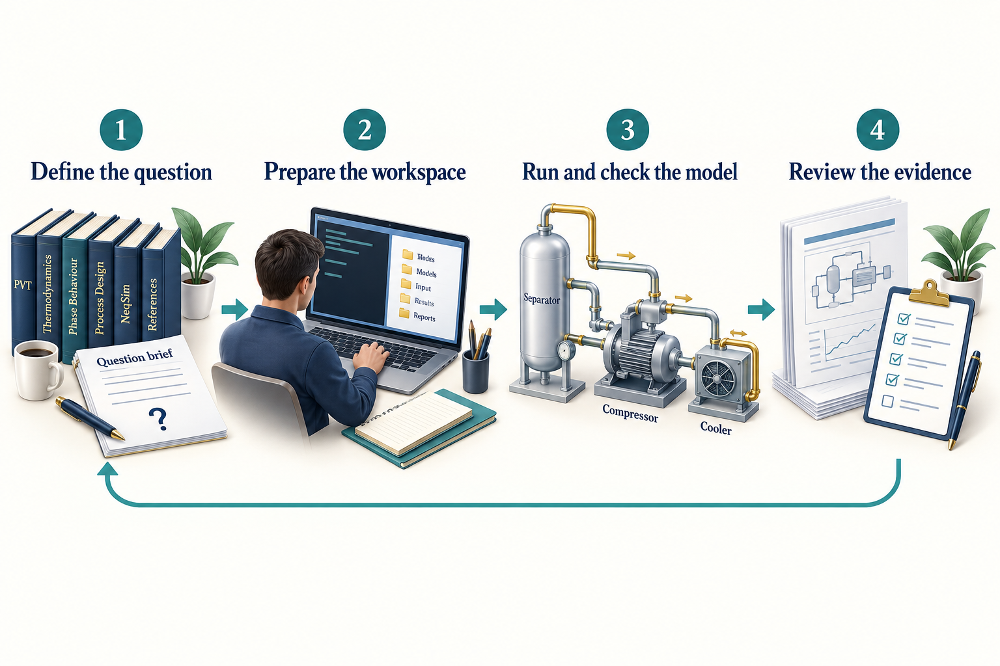

# Getting Started

This chapter establishes the first calculation workflow. For a complete
industrial workflow involving multiple agents, databases and engineering tools,
continue with the follow-up volume *Agentic Engineering for Oil and Gas Facility
Operations* \cite{AgenticFacilityOperations2026}. It shows how specialists share
evidence, connect data to NeqSim models and produce a recommendation for review.

## Learning Objectives

After this chapter, you should be able to:

1. Prepare a source workspace and check the selected Python and Java runtime.
2. Distinguish shell commands from requests to an engineering agent.
3. Run a small property calculation with an explicit model, state and units.
4. Explain where task outputs, source documents and report templates belong.
5. Preserve enough evidence for another person to repeat your first calculation.

## 1.1 Your first working session

The goal is modest and useful: ask for methane density, run the calculation, and see where the answer came from. Once that loop works, the same tools can support the gas-processing examples later in the book.

The following steps use **PowerShell on Windows**. They show commands to enter in a terminal. Text labelled **Agent prompt** belongs in the chat panel of your selected AI host. A shell cannot interpret an engineering request, and an agent name is not a shell command.

Start with these prerequisites:

| Item | Why it is needed | First check |
|---|---|---|
| Git | Obtain and identify the NeqSim source | `git --version` |
| An explicitly selected Python interpreter | Run the CLI, notebooks and Java bridge | Invoke that executable with `--version` |
| A Java Development Kit | Build and run the numerical engine | `java -version` |
| An editor and a tool-using AI host | Read the workspace, run tools and discuss results | Open the NeqSim folder in the host |

If you are starting on a new computer, obtain Python through your organisation's setup procedure or the [Python downloads page](https://www.python.org/downloads/), and a JDK through the approved distribution or the [Temurin installation guide](https://adoptium.net/installation). Keep the paths reported by the installers. The Maven wrapper needs Java to be discoverable through `PATH` or a valid `JAVA_HOME`; it cannot build with an unconfigured archive sitting in a downloads folder.

The current developer-tools package declares Python 3.8 or later; the book's recorded calculations use Python 3.12. Use the interpreter selected for your project, including its existing packages and permissions. A JDK 21 installation is a straightforward route when using both core development and the separately distributed MCP runner. Core contribution code remains Java 8 compatible; the release's regular core artifact and the separate server have different runtime requirements. \cite{neqsim_release_320}

Set the Python path once. Replace the example below with the **absolute path of your existing selected interpreter**:

```powershell
$PythonExe = 'C:\path\to\your\python.exe'
& $PythonExe --version
git --version
java -version
```

The `&` operator invokes an executable whose path is stored in a variable or quoted string. Each check should print a version. If a prerequisite is unavailable, resolve that specific setup issue before continuing. Changing the active Python interpreter midway through the chapter can produce a working CLI and a notebook that use different libraries.

## 1.2 Get the source and the command-line tools

For a new checkout, run:

```powershell
git clone https://github.com/equinor/neqsim.git
Set-Location -LiteralPath .\neqsim
```

If you already have the repository, open that existing folder instead. From its root, keep explicit paths for the source and CLI:

```powershell
$ProjectRoot = (Get-Location).Path
$NeqSimCli = Join-Path $ProjectRoot 'devtools\neqsim_cli.py'
$env:NEQSIM_PROJECT_ROOT = $ProjectRoot
```

The root contains `pom.xml`, `devtools` and the Java source. The environment variable tells later notebook processes which checkout to load. It does not select the Python interpreter or move any study files.

A one-time installation registers the short `neqsim` command and installs the developer tools' declared dependencies into the selected environment:

```powershell
& $PythonExe -m pip install -e .\devtools
```

Use your project's established installation procedure when the environment is already managed. This is a setup operation, not something to repeat for every study. The editable installation points to this checkout. If the checkout is moved, review the installation before relying on it.

Now ask the CLI what it can do:

```powershell
& $PythonExe $NeqSimCli --help
```

Expect a command list including `doctor`, `new-task`, `agent`, `skill`, `documents`, `report` and `work-record`. In an environment where the registered launcher is on the path, `neqsim --help` is the shorter equivalent. This book keeps the explicit Python form in the walkthrough so every command uses the interpreter you selected.

## 1.3 Check, build and check again

Before the first Java build, run the diagnostic tool:

```powershell
& $PythonExe $NeqSimCli doctor --skip-jar
```

`doctor` examines the runtime, source setup, agent files and configured paths. `--skip-jar` omits the built-JAR check; it is not an assurance that simulations are ready. Read each failure and its explanation rather than treating a partially successful summary as a pass.

Build the checkout with the repository's Maven wrapper:

```powershell
& .\mvnw.cmd -DskipTests package
```

The wrapper obtains the required Maven distribution and dependencies when needed. The command compiles the source and packages build artifacts; `-DskipTests` skips test execution for this setup step. A successful build is not a physical validation of the library. On Linux or macOS, the equivalent wrapper command is `./mvnw -DskipTests package`.

Then repeat the diagnostic without the skip:

```powershell
& $PythonExe $NeqSimCli doctor
git rev-parse HEAD
```

Keep the source commit with your study. The examples in this revision use the recorded 13 September 2026 source snapshot, which may contain capabilities newer than the public 3.20.0 release. The reproducibility appendix identifies the exact revision and runtime.

The repository also provides an onboarding wizard and an interactive playground:

```powershell
& $PythonExe $NeqSimCli onboard --help
& $PythonExe $NeqSimCli try
```

The first command explains the wizard's options; a normal `onboard` run can offer setup and installation steps. `try` opens a menu for exploring calculations. These are useful entry points, but the explicit calculation below makes the model and units easier to inspect.

## 1.4 Know which part does what

An **agent** is a model operating inside a host that can provide files, tools and an execution environment. A **skill** is a reusable package of instructions and supporting material. A **tool** is an interface through which an operation is performed. **NeqSim** is the numerical engine that evaluates a fluid or process model. The engineer decides what the answer will be used for and reviews the evidence.


<!-- @neqsim:figure source=notebooks/01_revised_chapter.ipynb cell=2 index_base=0 generator=build_illustrations.py -->
<!-- @imagegen: manifest=../../illustrations/imagegen_manifest_2026-09-13.json asset=engineering_loop -->

*Observation.* Figure 1.1 connects the chapter's main ideas. The return arrow connects review to a revised question. Keep the input basis, selected tools, executed calculation and review record together so an unexpected result can be investigated.

Data connect the whole loop: component amounts, operating conditions, reference documents and acceptance criteria. An agent can organise those inputs and write code, while NeqSim calculates the prediction. The prediction is conditional on the input data, physical model and numerical solution. Neither a tool call nor a confident explanation makes it exact in the physical world.

## 1.5 Give your first study a home

Three settings answer three different questions:

| Setting | Meaning | Inspection command after `$PythonExe $NeqSimCli` |
|---|---|---|
| Task root | Parent folder in which **new studies are created** | `--show-task-root` |
| Document root | Source library searched recursively for **input files** | `--show-document-root` |
| Report template | Word `.docx` or `.dotx` used for **report styling** | `--show-report-template` |

Inspect them before creating work:

```powershell
& $PythonExe $NeqSimCli --show-task-root
& $PythonExe $NeqSimCli --show-document-root
& $PythonExe $NeqSimCli --show-report-template
```

An unset document root means no source library is configured. An unset report template means the generator can use built-in styling; an organisation may require you to supply its template. A configured but missing folder or template is an error to resolve, not an instruction to silently substitute another source.

Create a small property-study folder:

```powershell
& $PythonExe $NeqSimCli new-task 'Methane density check' --type A --scale quick --report-depth brief
```

Expect a `Created:` line with the **absolute task path**, followed by paths for `study_config.yaml`, `user_input.md` and the references input folder. Copy the returned path into the variable below, replacing the example:

```powershell
$TaskDir = 'C:\path\printed\by\new-task'
$env:NEQSIM_TASK_DIR = $TaskDir
Get-Content -LiteralPath (Join-Path $TaskDir 'README.md')
```

The task folder holds this study's inputs, code, results and evidence. `NEQSIM_TASK_DIR` identifies that one folder; `NEQSIM_PROJECT_ROOT` still identifies the source checkout. Chapter 7 shows how to configure the three settings, search source documents, and prepare a report-backed study.

## 1.6 Ask an agent to do one checkable job

Open the NeqSim source folder in your AI host and confirm that it can read the workspace and use the selected execution environment.

For a VS Code session, open the source folder, enable the Python support used by your project, then run **Python: Select Interpreter** from the Command Palette and choose the same executable stored in `$PythonExe`. When opening a notebook, check its selected kernel as well. Open the agent chat with access to this workspace before sending the engineering request. The [Python environment guide](https://code.visualstudio.com/docs/python/environments) and [agent overview](https://code.visualstudio.com/docs/agents/overview) describe the current host controls; these controls are separate from NeqSim's command-line tools.

Inspect the available catalogs from the terminal:

```powershell
& $PythonExe $NeqSimCli agent list
& $PythonExe $NeqSimCli skill list
```

These commands list discoverable packages; they do not start agents. Workspace roles are also maintained under `.github/agents`. For this first problem, the thermodynamic-fluid role is defined in `.github/agents/thermo.fluid.agent.md`. The host may display the role's descriptive name rather than its filename. Select the role through that host's discovery mechanism, or explicitly ask the host to read and apply the definition. Chapter 5 explains installation and export in detail.

**Agent prompt — paste into the host's chat, filling in the actual paths:**

> Use the NeqSim thermodynamic-fluid role for a quick property calculation. Continue in the task folder I have already created: [absolute task path]. Use the selected Python executable [absolute executable path] and source checkout [absolute source path]. Read README.md and study_config.yaml, then preserve this request in user_input.md. Calculate methane density at 298.15 K and 50 bara with SRK and the classic mixing rule. Run the code, initialise properties, report kg/m3, and state how the answer was checked. Keep model predictions separate from independent reference values. Save the calculation and results in this task; a brief answer is sufficient.

The important part is the accepted basis and the recorded execution. The expected response includes the value, model, units, executed artifact and checks. If a reference has not been retrieved, the agent should say that independent validation remains open. It should also reuse the existing task rather than create a second folder for the same request.

For a study that needs several steps, use the coordinating role in `.github/agents/solve.task.agent.md`, displayed as **solve engineering task** in its current definition. Section 7.5 gives a start/resume prompt and explains which settings control the AI host, the role, the study and the calculation runner. Installing a role makes its instructions available; you still start the work through the host. Section 5.8 explains how a company builds enterprise agents and skills on the public NeqSim layer, and Section 5.10 gives the working procedure for GitHub Copilot, ChatGPT Work and Claude Code.

## 1.7 Inspect the calculation yourself

Save the following cells in a notebook in the task's `step2_analysis` area and select the same Python interpreter as its kernel. Notebook execution requires a compatible kernel in that environment. You can also place both cells, in order, in a Python script; the command below shows how to run it. The first cell loads the chosen source checkout:

```python
import os
import sys
from pathlib import Path

project_root = Path(os.environ["NEQSIM_PROJECT_ROOT"]).resolve()
sys.path.insert(0, str(project_root / "devtools"))
from neqsim_dev_setup import neqsim_init

neqsim_init(project_root=project_root, recompile=False)
import jpype
jneqsim = jpype.JPackage("neqsim")
```

The Java virtual machine, or JVM, loads the source build through the developer setup. A Java archive, or JAR, is a packaged library; accidentally loading an older installed JAR can hide changes in the source you intended to use. Restart the Python process after replacing loaded Java classes.

The second cell defines methane and performs a temperature-pressure flash:

```python
fluid = jneqsim.thermo.system.SystemSrkEos(298.15, 50.0)
fluid.addComponent("methane", 1.0)
fluid.setMixingRule("classic")
ops = jneqsim.thermodynamicoperations.ThermodynamicOperations(fluid)
ops.TPflash()
fluid.initProperties()

density = fluid.getDensity("kg/m3")
assert density > 0.0
print({"density_kg_m3": float(density)})
```

Run both notebook cells in order. If you saved them together as `step2_analysis/methane_density.py`, run the script from the terminal:

```powershell
$Calculation = Join-Path $TaskDir 'step2_analysis\methane_density.py'
& $PythonExe $Calculation
```

The constructor takes kelvin and bar absolute. SRK means the Soave–Redlich–Kwong equation of state. The single component keeps the basis easy to audit. `initProperties()` prepares the requested thermodynamic and physical properties after the flash. The printed dictionary should contain a positive density in kg/m3; the assertion checks only that basic numerical condition. Chapter 9 adds a matched comparison with independent reference data.

## 1.8 Carry a simple gas case through the book

The later process examples use this synthetic dry-gas basis:

| Input | Teaching value |
|---|---|
| Methane / ethane / propane | 0.85 / 0.10 / 0.05 mole fraction |
| Feed temperature | 303.15 K, or 30 degrees C |
| Feed pressure | 60 bara |
| Mass flow | 10,000 kg/h |
| Compression target | 120 bara |
| Assumed polytropic efficiency | 0.75 |
| Aftercooler target | 308.15 K, or 35 degrees C |

This short composition supports fluid construction, phase checking, compression and sensitivity analysis. It contains no water. Chapter 11 declares a separate wet variant before introducing hydrate equilibrium.

Mass flow avoids an unstated standard-volume convention. If you later convert to a standard volumetric flow, record its reference temperature, reference pressure and dry or wet basis. Similar abbreviations can describe very different quantities.

## 1.9 Find the next useful step

| If you see this | Investigate this first |
|---|---|
| `neqsim` is not recognised | Use the explicit Python-and-CLI form; inspect the selected environment's launcher path |
| A class or method is missing | Compare the loaded Java source with the intended commit |
| A property is zero or unavailable | Check phase existence and `initProperties()` |
| A result differs by a large factor | Check units, pressure basis and flow reference conditions |
| A role or skill is absent in the host | Check its canonical source, installation and host export |
| A configured path cannot be read | Correct that setting or access issue; retain the intended study basis |

You now have a way to identify the runtime, create a study, direct an agent and inspect the calculation. Chapter 3 develops the physics, Chapters 4–6 explain the agent and skill system, and Chapter 7 turns the same loop into a portable engineering study with documents and reports.

## 1.10 How was the task solved, and how was it checked?

For the methane task, the agent turns the request into a recorded basis: methane, 298.15 K, 50 bara, SRK and density in kg/m3. It reads the relevant instructions, prepares the calculation, runs it with the selected source build and inspects the output. NeqSim performs the flash and property calculation. The agent connects that execution to an explanation and saves the evidence in the task folder.

Check the answer at three levels. First, inspect the saved code and run record: did this calculation actually run with the intended inputs and software? Second, inspect its numerical and physical checks: the positive-density assertion catches only a narrow class of failures. Third, compare with independent evidence at the same state before making an accuracy claim. Chapter 9 supplies a reference comparison; Chapter 7 explains the complete review process.

A useful answer states the result and units, the model and assumptions, the executed file, the checks performed, and any unresolved limitation. Ask which check supports each conclusion. A result can be reproducible while its accuracy for the intended application remains unestablished.

## Exercises

1. Run the help and diagnostic commands with your selected interpreter. Record the source revision and explain any unresolved check.
2. Identify your task root, document root and report template. Explain which may be unset for the methane example.
3. Rewrite the agent prompt for a two-component gas, including composition basis and requested units.
4. Explain why a successful flash and positive density do not establish independent validation.
5. Describe the additional input needed before the dry-gas case could support a hydrate study.
6. Trace the methane answer from the original request to its saved calculation and checks. Identify the evidence still needed to claim accuracy.

## Further Reading

Use the [NeqSim learning paths](https://equinor.github.io/neqsim/tutorials/learning-paths.html), the [skills and agents guide](https://equinor.github.io/neqsim/integration/skills_guide.html), and the selected checkout's `devtools/neqsim_cli.py --help`. The local source and reproducibility appendix establish which commands and APIs this edition actually checked. \cite{neqsim2026}
