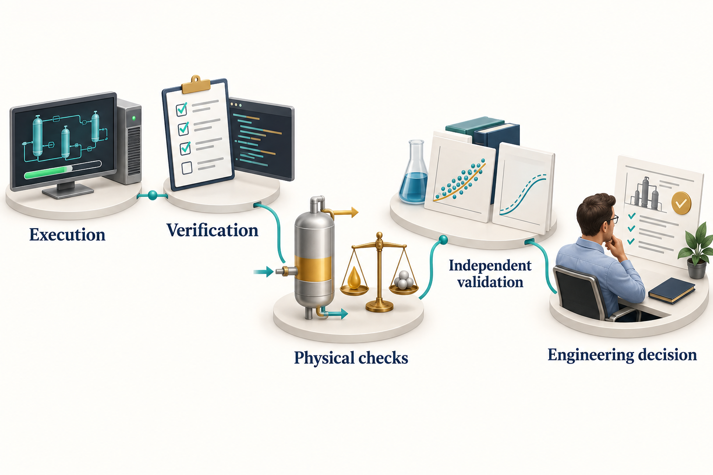

# What Agentic Engineering Changes

## Learning Objectives

You should be able to distinguish automated calculation from agentic problem solving, explain where an agent can help an engineering study, and identify the evidence needed before using its output.

## 2.1 Engineering work is a chain of decisions

Consider a compressor study. The engineer must establish the feed composition, determine which operating cases matter, choose a thermodynamic model, specify efficiencies and losses, calculate performance, check constraints, and explain the recommendation. The numerical solve is one link in this chain. Transcription, inconsistent assumptions, missing evidence, and changes to the design basis can create errors elsewhere.

An agent can help connect these activities. It can read the design basis, propose a work plan, identify missing data, construct the model, execute calculations, and prepare a report. The useful outcome is a clearer and more repeatable engineering process. Faster text generation alone is a poor measure of value.

In this book, **agentic engineering** means engineering work in which a tool-using AI system can select and revise parts of the workflow in response to observations. The amount of discretion varies. A fixed script that executes a predefined pressure sweep is automation. An agent that notices a failed phase calculation and investigates the model basis exercises additional discretion. Both can belong in the same study. \cite{yao2022react,anthropic_effective_agents}

## 2.2 Separate prediction from evidence

A language model can produce convincing explanations and plausible numbers without performing a calculation. Requiring a tool call addresses one failure mode: the result can be connected to an actual execution. It does not eliminate an incorrect composition, inappropriate equation of state, or invalid equipment model.

There are several distinct claims to assess:

| Claim | Evidence required |
|---|---|
| The calculation executed | Run status and output files |
| The implementation behaves as intended | Focused tests and regression comparisons |
| The result is physically plausible | Balances, limits, trends and domain checks |
| The model represents the application | Independent data over the relevant range |
| The recommendation meets the study basis | Traceable acceptance criteria and review |

These claims build on one another, but none is a substitute for the next. Repeating the same flawed model with two agents does not create independent validation.

<!-- @neqsim:figure source=notebooks/01_revised_chapter.ipynb cell=2 index_base=0 generator=build_illustrations.py -->
<!-- @imagegen: manifest=../../illustrations/imagegen_manifest_2026-09-13.json asset=evidence_ladder -->

*Observation.* Figure 2.1 connects the chapter's main ideas. Each area answers a different question. A completed computation does not establish agreement with independent data, and a reference comparison does not by itself establish that the result answers the intended engineering question.

## 2.3 Where agents can add practical value

Agents are useful when a task requires many small, connected operations whose details vary between studies. They can translate an engineering request into explicit inputs, find a relevant example, prepare repetitive code, inspect errors, and keep result tables consistent with their source files. A well-designed skill can make lessons from one study available to the next.

For the running gas case, an agent might discover that compression requires a single gas-phase inlet and therefore introduce an inlet separator. It might then calculate the compressor duty over a pressure range and notice liquid formation after cooling. Those observations should lead to explicit model changes and an updated report, not silent edits to the original assumptions.

A useful evaluation asks whether the agent reduces total engineering effort while preserving quality. Measure time to a reviewed result, the amount of rework, the number of unsupported claims, and the reproducibility of the final calculation. Report the task set and review procedure with any productivity result. This edition does not assign a general percentage saving to agentic engineering.

## 2.4 Where discretion should be limited

An agent needs more freedom when investigating incomplete information than when executing an approved calculation template. These activities should have different controls.

During exploration, it may propose alternative EOS models or operating cases. During a controlled re-run, it should preserve the selected model and inputs unless a change is explicitly part of the task. During reporting, it should read authoritative results rather than recomputing rounded values from prose. During plant integration, access to a historian does not imply authority to change a control-system setting.

The useful question is specific: which decisions may this workflow make, using which tools and data, under which constraints? A label such as autonomous does not answer it.

## 2.5 Why NeqSim is a suitable numerical layer

NeqSim exposes fluid and process models through code. An agent can create a fluid, configure equipment, run a calculation, and inspect outputs without navigating a graphical simulator. The source and tests can be examined when an interface or result is uncertain. This makes it possible to connect a reported output to an implementation and its checks. \cite{neqsim2026}

Open source also makes limitations visible. A component database may lack a required species; a correlation may apply only to a restricted flow regime; a source-level feature may need a newer checkout. Visibility helps the reviewer, but it does not remove the need for application-specific validation.

The library spans thermodynamic property calculations, phase equilibrium, process equipment, PVT experiments, and related engineering functions. Chapters 3 and 10 distinguish the simulation layer from mechanical design and information exchange. The breadth of the API should not be interpreted as uniform validation coverage across every application.

## 2.6 A better definition of completion

A useful study ends when its decision can be reviewed against its basis. For the synthetic compressor example, completion includes the feed specification, model choices, calculated operating states, duty, checks on mass and energy, identified constraints, and limitations. If a vendor map is absent, the report should not claim that the machine has an acceptable operating margin.

An attractive report can still be incomplete. Conversely, a study that concludes that more data are required can be successful if it identifies the missing evidence and explains why it matters. This is particularly valuable when uncertain composition or operating conditions dominate a result.

The same principle applies to software work. A discovered API error should lead to a corrected example, a focused check, and an update to the relevant skill. The reusable improvement belongs in the repository that owns it; confidential project inputs remain with the study.

## 2.7 Reading results critically

When reviewing agent-generated work, begin with the engineering question. Confirm that the calculations answer that question and use the same basis. Then inspect the inputs and the evidence behind consequential outputs.

For example, a reduction in compressor power may result from a lower mass flow after condensation. It is not automatically an efficiency improvement. A lower predicted pipeline pressure drop may come from a changed diameter or a different flow model. It is not automatically a better route. A smooth figure can conceal failed cases that were dropped from the dataset.

Ask for failed cases, excluded data, and changed assumptions alongside successful outputs. The agent should make these easy to inspect.

## Exercises

1. For a heat-exchanger study, identify one task suited to a fixed script and one that benefits from agent discretion.
2. A report says that all checks passed. Write five more precise statements that could replace that sentence.
3. Design a small comparison between manual and agent-assisted engineering. Specify the task set, review criteria, and measures of total effort.
4. Explain how an agent could lower reported compressor duty without improving the physical process.
