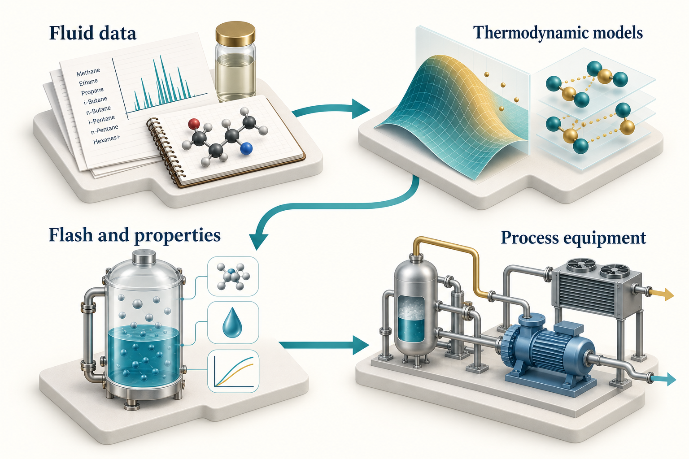

# The NeqSim Physics Engine

## Learning Objectives

You should be able to select an initial thermodynamic model, explain a flash calculation, distinguish thermodynamic and transport properties, build a small process model, and identify current interfaces that support agent workflows.

Before the equations, recall three ideas. A mole measures amount of substance; mole fraction describes a mixture by that amount. A phase is a physically distinct region, such as a gas, liquid or solid. Enthalpy combines internal energy and pressure–volume work and is useful for tracking energy carried by flowing material. Temperature and pressure specify a state only when composition and an appropriate model are also known. The examples use absolute pressure and state their flow and unit conventions.

## 3.1 What the engine calculates

NeqSim is an open-source library for thermodynamic properties, phase equilibrium, PVT experiments, and process simulation. A fluid object carries components, amounts, temperature, pressure, and model settings. Thermodynamic operations solve for equilibrium states. Equipment objects apply physical relationships and operating specifications to connected streams. A `ProcessSystem` coordinates a flowsheet.

The source is organised around these responsibilities. The `thermo` packages contain fluid and phase models; `thermodynamicoperations` contains flash and related calculations; `physicalproperties` provides transport-property methods; `process` contains equipment, automation, design and lifecycle functions; and `pvtsimulation` contains laboratory-experiment models and supporting workflows. \cite{neqsim2026}


<!-- @neqsim:figure source=notebooks/01_revised_chapter.ipynb cell=2 index_base=0 generator=build_illustrations.py -->
<!-- @imagegen: manifest=../../illustrations/imagegen_manifest_2026-09-13.json asset=physics_stack -->

*Observation.* Figure 3.1 connects the chapter's main ideas. The connected areas share a model basis. Incorrect composition or an unsuitable thermodynamic model can affect every downstream equipment result. The molecular and equipment forms are symbolic, not chemical structures or a process design.

## 3.2 Cubic equations of state

Cubic equations of state provide a practical balance between computational cost and coverage for many hydrocarbon applications. The Soave-Redlich-Kwong equation is

$$
P = \frac{RT}{v-b} - \frac{a(T)}{v(v+b)}.
$$
<!-- @neqsim:eq method=neqsim.thermo.phase.PhaseEos#molarVolume -->

Here, $P$ is pressure, $T$ is absolute temperature, $v$ is molar volume, $R$ is the gas constant, $b$ represents the co-volume parameter, and $a(T)$ represents attractive interactions. Use coherent units when evaluating the equation directly. NeqSim handles its own internal unit conventions; the public constructor used in the examples accepts kelvin and bar. \cite{soave1972}

The Peng-Robinson equation changes the attractive term:

$$
P = \frac{RT}{v-b} - \frac{a(T)}{v(v+b)+b(v-b)}.
$$
<!-- @neqsim:eq method=neqsim.thermo.phase.PhaseEos#molarVolume -->

Both models need pure-component parameters and mixing rules for mixtures. Binary interaction parameters, heavy-end characterisation, and volume corrections can materially affect the result. Choosing SRK or PR is only part of specifying the thermodynamic model. \cite{peng1976}

For mixtures, the model must predict component fugacities in each phase. Phase equilibrium requires equality of each component's fugacity across the phases present. Matching pressure and temperature alone is insufficient.

## 3.3 Model selection depends on the question

| Application | Candidate starting point | Evidence to check |
|---|---|---|
| Hydrocarbon gas and process screening | SRK or PR | Phase behaviour and properties over the operating range |
| Water, alcohol or glycol interactions | An appropriate CPA implementation | Association model and mixture parameters |
| Natural-gas property work | GERG-family implementation where applicable | Supported components, phase treatment and range |
| CO2-rich mixture property work | EOS-CG implementation where applicable | Supported mixture, model selection and independent reference states |
| Petroleum PVT | Characterised EOS fluid | Laboratory data, plus fraction and validation cases |
| Electrolytes or specialised fluids | A model designed for that chemistry | Species coverage and application-specific validation |

CPA adds an association contribution to a cubic model and is useful when hydrogen bonding matters. GERG-2008 is a multi-parameter mixture model developed for natural-gas-related property calculations. Neither should be described as universally best. The selected implementation, component coverage, phase regime and available validation data matter. \cite{kontogeorgis1996,kunz2012}

Compare model predictions when that comparison informs sensitivity to model choice. Agreement between SRK and PR is not independent validation: they share modelling assumptions and may agree while both differ from measurements.

The current source also documents hydrogen- and ammonia-oriented GERG model-selection paths and the EOS-CG family. Select these through the API described for the chosen class and record the actual model name with the result. Do not infer the selected formulation from the composition alone. The [current GERG and EOS-CG guide](https://github.com/equinor/neqsim/blob/9a95440e194a6fdc2890e4efafff647711beedce/docs/thermo/gerg2008_eoscg.md) gives executable examples and states that the current `SystemGERG2008Eos` and `SystemEOSCGEos` classes do not advertise analytical fugacity derivatives with respect to composition, pressure or temperature. Positive finite outputs demonstrate execution and model selection; they do not establish custody-transfer accuracy or reproduction of a published validity range. These options broaden the model-selection discussion; the numerical comparison in Chapter 9 remains the explicitly tested SRK/PR methane case.

## 3.4 What a flash calculation solves

A temperature-pressure flash determines the equilibrium phase state for a supplied overall composition at specified $T$ and $P$. A pressure-enthalpy flash finds a state consistent with pressure and enthalpy, which is relevant to throttling and energy balances. Dew-point and bubble-point calculations locate the appearance of an infinitesimal phase under their particular specifications.

For a two-phase split, component material balances connect the overall mole fractions $z_i$ to liquid and vapour compositions. With vapour fraction $\beta$ and equilibrium ratios $K_i$, the Rachford-Rice relation is

$$
\sum_i \frac{z_i(K_i-1)}{1+\beta(K_i-1)} = 0.
$$
<!-- @neqsim:eq method=neqsim.thermodynamicoperations.flashops.RachfordRice#calcBeta -->

The equation is part of the phase-split problem; the equilibrium ratios depend on thermodynamic properties and must be consistent with the equilibrium state. Stability analysis helps determine whether a proposed phase state is stable. These are numerical tasks for the engine, not quantities to infer from persuasive prose. \cite{rachford1952,michelsen1982a,michelsen1982b}

## 3.5 Initialise the properties you intend to read

After a flash, call `fluid.initProperties()` before reading density and transport properties in the book's examples. An `init(3)` call alone does not initialise all physical-property models.

```python
ops.TPflash()
fluid.initProperties()
number_of_phases = fluid.getNumberOfPhases()
for phase_index in range(number_of_phases):
    phase = fluid.getPhase(phase_index)
    print(str(phase.getPhaseTypeName()))
```

Inspect phase presence before a gas-only or liquid-only query. A fluid can cross a phase boundary when temperature, pressure or composition changes. Code that always assumes phase zero is gas can return the wrong physical quantity without an obvious exception.

A system-level density and a phase density answer different questions in a multiphase system. State which one is required. The same care applies to heat capacity, enthalpy, and viscosity. Include the output unit in every table and use unit-aware accessors when available.

## 3.6 From fluids to equipment

A `Stream` combines a fluid with a flow rate. A separator creates outlet streams based on its phase separation model. A compressor calculates a pressure increase under the selected efficiency or performance model. A cooler imposes a thermal specification. Connecting these objects forms a process model.

The following construction fragment continues from an existing `fluid`:

```python
Stream = jneqsim.process.equipment.stream.Stream
Separator = jneqsim.process.equipment.separator.Separator
ProcessSystem = jneqsim.process.processmodel.ProcessSystem

feed = Stream("Feed", fluid)
feed.setFlowRate(10000.0, "kg/hr")
separator = Separator("Inlet separator", feed)
process = ProcessSystem()
process.add(feed)
process.add(separator)
process.run()
```

The outlet references connect the calculations. Add equipment in a suitable calculation order and handle recycles explicitly. A process with recycles requires convergence criteria and a documented strategy; one pass through a list of units is not necessarily a converged flowsheet.

Chapter 10 extends this model and checks the resulting mass balance. Process separation and detailed separator performance are different levels of representation. Entrainment, internals, pressure loss, and dynamic behaviour require additional models and inputs.

## 3.7 Current interfaces that matter to agents

The September 2026 source includes several interfaces that make engineering workflows easier to inspect and maintain. These are source-snapshot capabilities; use the recorded commit and current tests when reproducing them.

**Process automation.** `ProcessAutomation` provides string-addressable variables, units, input/output descriptors, and diagnostics. An agent can discover the variables of a named unit before reading or changing them. After a change, re-run the process to propagate it.

```python
auto = process.getAutomation()
unit_names = list(auto.getUnitList())
variables = list(auto.getVariableList("Inlet separator"))
```

Safe accessors return diagnostic information rather than simply throwing an exception. Their name does not mean that a change is approved or physically suitable. Inspect the reported operation, corrections, bounds, and result.

**Lifecycle state.** `ProcessSystemState` and `ProcessModelState` support saved state and revision comparison. A saved state helps a reviewer identify what changed between cases. It does not automatically package every external dataset, runtime dependency, or approval; preserve those alongside it.

**Connectivity and identity.** `ProcessConnection`, stream introspection, and reference designations help identify equipment and its relationships. Stable tags matter because an agent must distinguish a variable on one compressor from a similarly named variable elsewhere in a multi-area model.

**Energy networks.** `EnergyNetworkSolver`, typed utility buses, converters and shaft-related models support explicit energy relationships. These complement material streams and make utility allocation and conversion losses visible. Check which steady-state or transient assumptions apply to the chosen equipment.

**Route-based hydraulics.** `PipingRouteBuilder` can turn structured route information into serial pipe models. Route interpretation, hydraulic calculation, and acceptance of drawing-derived geometry remain separate steps. A route assembled from incomplete data needs an explicit gap record.

**Engineering information.** DEXPI readers and writers, the canonical engineering graph, and `EngineeringDeliverableCompiler` connect simulation objects to exchange files, cases, registers, and evidence. A generated exchange is a representation of selected model information; it is not automatically a qualified import into a recipient's engineering system.

The [DEXPI engineering guide](https://equinor.github.io/neqsim/engineering/dexpi-guide.html) distinguishes Proteus-compatible exchange, native DEXPI 2.0 Plant models, and native DEXPI 2.0 Process models. It also separates internal schema/profile checks from named-tool qualification and discipline acceptance. \cite{dexpi_guide}

## 3.8 PVT characterisation and validation

A petroleum fluid is often more complex than a list of pure components. Laboratory composition, plus-fraction properties, characterisation choices, and experiment conditions influence the model. NeqSim supports experiment models such as constant mass expansion, constant volume depletion, differential liberation and separator tests.

The current PVT workflow emphasises calibration and validation as separate activities. Calibration adjusts selected model parameters against training data. Validation examines retained data or conditions not used for fitting. A small residual on the fitted dataset does not establish predictive accuracy elsewhere.

Retain the original fluid, calibrated fluid, objective function, parameter bounds, experiment basis and validation cases. Inspect whether improved agreement for one property damages another. A fluid calibrated for saturation pressure may still predict liquid density or viscosity poorly. The current [PVT documentation](https://equinor.github.io/neqsim/pvtsimulation/) is the starting point for experiment-specific examples. \cite{pvt_guide}

## 3.9 Read capability claims with their limits

A class in the source establishes that an implementation exists. A test establishes the behaviour it exercises. A benchmark establishes agreement under its stated conditions. None establishes universal suitability.

This distinction is especially important for mechanical design, safety, corrosion, transient events and cost estimation. Use NeqSim to organise and calculate the supported parts of a study, then qualify the result against the applicable application data and review process.

## Exercises

1. Explain why a mixing rule and interaction parameters belong in the model basis.
2. Compare a TP flash and a PH flash using an engineering example for each.
3. Identify the difference between checking a method's existence and validating its physical predictions.
4. Describe what must accompany a saved process state for another team to reproduce a study.
5. Propose calibration and validation datasets for a petroleum-fluid model.
