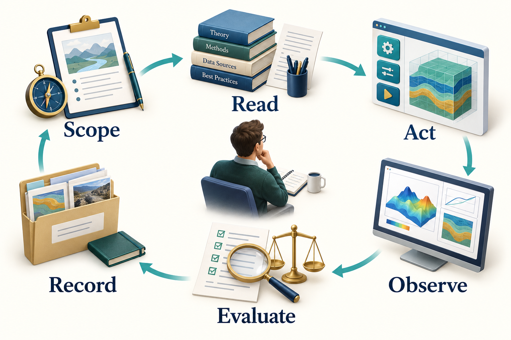

# How Agents Use Skills and Tools

## Learning Objectives

You should be able to trace a request through an agent, distinguish instructions from executable tools, design a useful handoff, and explain why persistent artifacts and external controls matter.

## 4.1 From a request to an observable action

A tool-using agent receives a request together with instructions, selected context, and descriptions of available tools. It may answer directly, retrieve more information, or ask the host to execute an operation. The host returns observations such as a file, a numerical result, or an error. The agent uses those observations to choose what happens next.

This request-action-observation cycle is often associated with ReAct-style systems. The reader should focus on the observable workflow: which inputs were used, which tools ran, what they returned, and why the next engineering action was justified. A useful audit record does not depend on access to a model's private internal reasoning. \cite{yao2022react}


<!-- @neqsim:figure source=notebooks/01_revised_chapter.ipynb cell=2 index_base=0 generator=build_illustrations.py -->
<!-- @imagegen: manifest=../../illustrations/imagegen_manifest_2026-09-13.json asset=tool_use_cycle -->

*Observation.* Figure 4.1 connects the chapter's main ideas. The return path makes investigation explicit. A result is inspected before another action is selected; the evidence folder preserves the context needed when a different agent or a later session resumes the work.

## 4.2 Five objects that are easy to confuse

| Object | What it contains | What it does not establish |
|---|---|---|
| Agent definition | Role, scope, workflow and expected skills | A running process by itself |
| Skill package | Reusable instructions, references and optional code | Guaranteed correctness |
| Tool description | Callable operation and input/output contract | Permission to use every operation |
| Runtime or harness | Execution, state, access and supervision | Engineering validity of results |
| Evidence artifact | Inputs, outputs, checks and provenance | Approval unless explicitly reviewed |

The separation is useful when something fails. A missing method may require a code or version fix. A repeated unit mistake may require a skill improvement. An unauthorized operation requires an access-control fix. Adding more text to an agent definition will not reliably solve all three.

## 4.3 Write tools around engineering meaning

Good tools accept explicit quantities and return structured results. A pressure should include its unit and basis. A composition should identify its component names and whether amounts are mole fractions, mass fractions, or flow rates. A result should distinguish success, warning, and failure.

NeqSim can be called directly through Java or Python, through the string-addressable `ProcessAutomation` facade, or through MCP tools. Direct code offers flexibility. A narrow tool can constrain a repeated operation and make validation easier. Neither route is inherently correct for every task.

The automation facade is particularly useful once a flowsheet exists. The agent can discover variables on a named unit, inspect whether they are inputs or outputs, and read or change values with units. It should discover names before writing values. A diagnostic suggestion for a misspelled tag is useful evidence, but accepting a suggested tag is still a model change that should be recorded.

## 4.4 Context is a working set

A large repository cannot usefully be loaded into every model request. The host and agent need a working set containing the current objective, relevant instructions, selected skills, a concise design basis, and the latest observations.

Skills help by making detailed knowledge available when needed. Load the relevant API pattern and domain method, then retain the inputs, assumptions, and result files on disk. Repeatedly pasting a complete manual into the conversation makes it harder to identify what matters. Context engineering concerns the selection and maintenance of that working set, including retrieval, compact summaries, and durable state. \cite{anthropic_context}

Host conventions differ. A directory that one editor discovers automatically may be invisible to another. A generic NeqSim export is a portable package; the selected host still needs a documented way to load it. For example, Codex distinguishes project guidance in `AGENTS.md` from reusable skills in `SKILL.md`. A community package's `AGENT.md` is its workflow definition; it is not automatically project guidance just because the names look similar. Chapter 5 shows how to keep these layers separate. \cite{codex_customization_20260913}

When a host supports skill discovery, it can first read a skill's name and description, then load its detailed instructions when the task calls for them. The agent still needs the referenced files and callable tools. A skill that names an OCR engine or NeqSim runner does not make that dependency available merely by being read. \cite{codex_skills_20260913}

## 4.5 Persist decisions and artifacts

A conversation is a poor sole record for a long engineering study. Save the accepted basis, the model revision, results, and open issues as files. A checkpoint should say what is complete, what evidence supports it, what changed, and what remains unresolved.

A concise handoff might contain:

```yaml
study: teaching_compressor_case
basis_revision: basis_01
fluid_basis: mole_fraction
feed_pressure: {value: 60.0, unit: bara}
feed_temperature: {value: 303.15, unit: K}
feed_mass_flow: {value: 10000.0, unit: kg/hr}
model: SRK
mixing_rule: classic
completed: [base_case]
next_action: check_discharge_pressure_sensitivity
open_issues: [vendor_map_not_supplied]
```

This is an illustrative handoff contract, not a NeqSim runner schema. Real tool requests must follow the schema advertised by the selected tool. The distinction prevents an attractive example from being mistaken for an executable API payload.

Add resolved file locations to a real handoff. The task parent is where new studies are created; the active task directory is one particular study. The source checkout supplies the selected NeqSim implementation. An optional document root supplies a searchable reference library. They serve different purposes and may be on different drives. Pass the absolute active task path and selected interpreter to every specialist, along with the document root and report template when configured. Changing a default parent does not relocate an existing study. \cite{neqsim_task_paths_20260913}

Before interpreting a request to “use the usual documents,” resolve that library and record which files actually supported the calculation. A new document-root setting changes where the workflow can look. It does not approve a document revision, resolve a contradictory datasheet, or provide an asset-specific design basis.

## 4.6 Put repeated numerical work in code

An agent can prepare a Monte Carlo study, but a language-model call is usually unnecessary inside each numerical iteration. Generate and review the simulation function once, sample the uncertain inputs in code, run NeqSim for each technical case, and collect failures explicitly. Return the dataset to the agent for interpretation after execution.

Use separate process instances or isolated workers when parallelising mutable simulation objects. Do not assume that two agents can safely mutate the same flowsheet. Parallel execution is useful only when the work and outputs can be separated clearly.

## 4.7 Recover without hiding changes

A failed calculation is an observation. First identify whether the problem is an input error, missing component, incompatible method, numerical difficulty, or unavailable dependency. A retry should have a stated reason and a bounded policy.

Changing EOS, clipping an input, deleting a component, or loosening a tolerance can change the engineering question. Preserve the original request and record the revised basis. If an accepted method cannot solve a case, retain that case as a failure in the results. Do not drop it merely to make a plot continuous.

Instructions alone cannot enforce these rules. The runtime should control filesystem scope, credentials, tool permissions, execution limits, and the handling of side effects. Retrieved documents are evidence to interpret; they do not gain authority to override the study instructions.

## 4.8 What to evaluate

Evaluate the complete workflow on representative tasks. Include correct inputs, incomplete inputs, wrong units, missing phases, solver failures, and conflicting requirements. Measure whether the agent chooses suitable tools, preserves the basis, reports limitations, and produces repeatable artifacts.

A useful failure example is a compressor request using gauge pressure where the tool expects absolute pressure. A system that asks for the missing basis or rejects the ambiguous input behaves better than one that returns a plausible number quickly. The evaluation should reward the engineering behaviour you want to deploy.

## Exercises

1. Trace the observable actions for the methane-density request from Chapter 1. Identify the input and output of each tool call.
2. Design a handoff from fluid preparation to process simulation. Include units, composition basis, model revision and open issues.
3. A tool suggests a similar equipment tag after a failed lookup. Explain what must be checked before accepting it.
4. Propose three deliberately difficult inputs for an agent evaluation and describe the expected behaviour.
