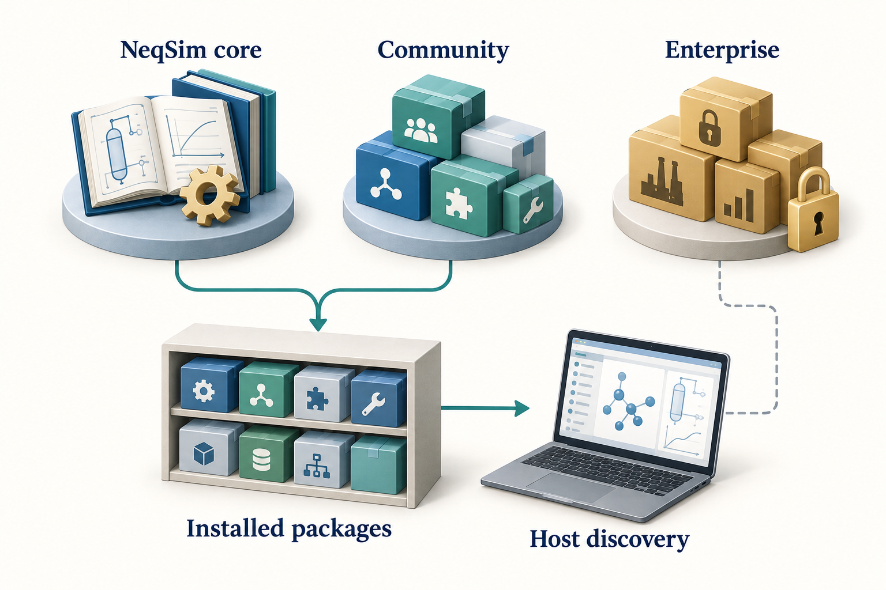

# Agents and Repositories

## Learning Objectives

You should be able to locate the main NeqSim agent and skill sources, distinguish canonical packages from discovery exports, select a workflow from a catalog, define a reproducible handoff between specialists, and plan a company's enterprise agent library.

## 5.1 An ecosystem rather than one folder

The NeqSim numerical library, public engineering workflows, company procedures, and publishing tools have different owners and release cycles. Keeping them in separate repositories allows a thermodynamic API change, a public screening method, and a company approval procedure to be reviewed by the people responsible for each.

The main public entry points are [equinor/neqsim](https://github.com/equinor/neqsim), [equinor/neqsim-community-agents](https://github.com/equinor/neqsim-community-agents), and [equinor/neqsim-community-skills](https://github.com/equinor/neqsim-community-skills). The core repository's `community-agents.yaml` points to the public agent repository and its catalog. The catalog in the community repository contains the package entries themselves. Company-private content belongs in private catalogs and repositories. \cite{neqsim2026,community_agents,community_agent_catalog_20260913}

This chapter describes the source inspected on 13 September 2026: NeqSim commit `9a95440e194a` and community-agents commit `0ca1428a5dbd`. These revisions make the examples identifiable without assuming that a later catalog has the same contents. A catalog header or README count can lag behind the packages; inspect the actual entry and manifest when selecting work.


<!-- @neqsim:figure source=notebooks/01_revised_chapter.ipynb cell=2 index_base=0 generator=build_illustrations.py -->
<!-- @imagegen: manifest=../../illustrations/imagegen_manifest_2026-09-13.json asset=repository_map -->

*Observation.* Figure 5.1 connects the chapter's main ideas. Public reusable methods and private organisational content have different owners. The picture is an ownership and discovery overview; the paths and commands in the text define the actual installation and export mechanisms.

## 5.2 Where each kind of content belongs

| Location | Main responsibility |
|---|---|
| NeqSim `src/main/java` and `src/test/java` | Numerical implementation and tests |
| NeqSim `.github/agents` | Workspace agent definitions |
| NeqSim `.github/skills` | Workspace-visible core skills |
| Community agents repository | Public workflow packages and their dependencies |
| Community skills repository | Public reusable engineering methods |
| Private enterprise repositories | Company methods, policy overlays and integrations |
| PaperLab `agents` and `skills` | Canonical publishing roles and knowledge packages |

The community agent repository uses a readable package structure:

```text
community-agents.yaml
agents/
  tie-in-screening-agent/
    AGENT.md
    agent.yaml
    README.md
    examples/
    prompts/
    tests/
```

The catalog supports discovery, `agent.yaml` describes the package contract, and `AGENT.md` gives the engineering workflow. Supporting examples and tests help a contributor demonstrate intended behaviour. Their presence should prompt inspection of what was tested; it does not establish independent validation of every application. \cite{community_agents}

A public skill should be useful without confidential plant information. It can describe a hydrate-margin calculation and its inputs. An enterprise overlay can specify the approved margin policy for a company or study class. Asset-specific tag mappings, documents, credentials, and operational values belong in the authorised private environment.

The core should not require a private package to perform a public calculation. Enterprise workflows can depend on approved public skills and add company requirements. This dependency direction makes the public system usable and keeps private rules from leaking into community content.

## 5.3 Canonical source, installation and export

Three locations may contain similar-looking files for different reasons.

The **canonical source** is the maintained repository package. A **canonical installation** is the user's installed copy, normally under `~/.neqsim/agents` or `~/.neqsim/skills`. An **export** makes selected content available to a particular host. Current NeqSim VS Code exports use the personal `~/.copilot/agents` and `~/.copilot/skills` locations by default; explicit workspace exports use `.github/agents` and `.github/skills`. Tool-neutral exports are placed under `~/.neqsim/export/generic`, with agent folders and a manifest that records their main files and metadata. \cite{neqsim_agent_install_20260913}

Do not edit a generated export as the only copy of an improvement. A later export can replace it. Make the change in the owning source package, validate it there, then refresh the installation or export. If a local experiment is intentionally private, keep its source in a controlled private location and record which copy the host loaded.

PaperLab follows the same principle. Its complete internal library remains under `neqsim-paperlab/agents` and `neqsim-paperlab/skills`. The normal VS Code installation exports the `@paperlab` gateway and its declared public skills. `--include-internal` is an option for users who need direct specialist definitions. `neqsim paperlab install --vscode --dry-run` previews the export. A small editor catalog does not mean the internal library has disappeared. \cite{paperlab_host_20260913}

## 5.4 Discover agents by purpose

Agent names are an index into workflows. They are not evidence of capability by themselves. Inspect the definition, required skills, supported domains, expected outputs, and review requirements.

Examples in the current core workspace include `thermo.fluid`, `process.model`, `pvt.simulation`, `flow.assurance`, `mechanical.design`, `plant.data`, `solve.task`, and `review`. Public community packages include workflows such as `hydrate-screening-agent`, `process-screening-agent`, and `tie-in-screening-agent`. These naming conventions belong to different catalogs; a core filename and a community install identifier need not match.

Use discovery commands before installing:

```text
neqsim agent list
neqsim agent search "hydrate screening"
neqsim agent info hydrate-screening-agent
neqsim skill list
neqsim skill info neqsim-hydrate-screening
```

For a source workspace, semantic discovery is also available. Its search covers configured local roots, including the core and available sibling community or enterprise repositories; it should not be mistaken for a search of every remote package on GitHub:

```text
<python-executable> devtools/agent_search.py "gas compression study" --top 8
<python-executable> devtools/skill_search.py "gas compression study" --top 5
```

Search results are candidates. Confirm that the selected workflow accepts the available input and produces the required evidence. A screening agent may be entirely appropriate for an early decision and insufficient for detailed equipment qualification.

After inspection, a user can install and export a chosen package. These commands are configuration examples, not steps required to read this book:

```text
neqsim agent install hydrate-screening-agent --target vscode --no-pip
neqsim agent installed
neqsim agent doctor --target vscode
```

Installation resolves missing `required_skills` by default. Here, `--no-pip` separates that content installation from Python package changes. The distinct `--no-install-missing-skills` flag disables automatic installation of missing skill content. Inspect unresolved dependencies before attempting the workflow. An existing installed package can be exported for another host with `neqsim agent export hydrate-screening-agent --target generic`. The currently supported export targets are `vscode` and `generic`. \cite{neqsim_agent_install_20260913}

| Host | How the exported material is used |
|---|---|
| VS Code Copilot | Discover the personal or explicitly selected workspace export through the host's agent and skill interfaces; reload the window if newly exported definitions are not yet visible |
| Codex | Load the agent definition explicitly and make its required skills available through Codex's own skill mechanism; a NeqSim generic export does not itself register a Codex agent |
| Another agent host or harness | Point its documented loader or adapter at the generic package and provide the required tools, environment and permissions |

Codex currently discovers repository skills under `.agents/skills` and user skills under `~/.agents/skills`; the CLI and IDE can select skills explicitly through `/skills` or a `$` mention. Those are Codex conventions, separate from NeqSim's canonical install. Consult the current host documentation before copying or linking packages. \cite{codex_skills_20260913}

For any host, an explicit request can identify the installed `AGENT.md`, the required `SKILL.md` files, the engineering objective and the active study path. The host then runs the workflow using its available tools. `neqsim agent run <name>` currently prints launch guidance and the installed definition's location; it does not execute an autonomous engineering study. \cite{neqsim_agent_install_20260913}

## 5.5 Understand the agent package contract

Community catalogs can declare an agent's stable identifier, version, source path, required skills, supported domains, MCP dependencies, trust level, and human-review requirements. Check the catalog and package manifest together.

The following is an abbreviated excerpt from the inspected `tie-in-screening-agent/agent.yaml`, using its real dependency identifiers:

```yaml
name: tie-in-screening-agent
version: "0.1.0"
agent_type: community-agent
required_skills:
  - neqsim-fluid-quality-check
  - neqsim-hydrate-screening
  - neqsim-separator-modelling
  - neqsim-resource-classification-screening
human_review_required: true
```

This agent combines fluid-quality, hydrate, separator and resource-classification screening around a proposed tie-in. Its outputs identify risks, data quality and recommended follow-up; the package does not turn a screening result into a detailed design approval. The manifest's review requirement remains part of the handoff. \cite{community_agent_contract_20260913}

A matching dependency name is not enough if the installed version expects an API absent from the selected NeqSim core. Record source revisions and compatible package versions in the study manifest. Also distinguish `required_skills`, optional `context_skills`, and `coordinated_agents`: they express different relationships. An installer resolving required skill content does not prove that it has executed or validated a specialist composition.

## 5.6 Choose the simplest useful composition

A single agent with a small relevant skill set is often enough for a property calculation. Additional specialists are useful when they have separable responsibilities and clear outputs. Common compositions include a sequential chain, independent analyses that later join, and a model-review-repair loop.

For a compressor study, fluid preparation can precede process simulation. A reviewer can then examine balances and constraints using the resulting model and evidence. Independent alternatives may run in separate workers, provided they use the same accepted basis and write to separate output locations.

More agents introduce coordination cost. They can duplicate work, use inconsistent assumptions, or overwrite shared results. Two reviewers using the same reasoning and data also share failure modes. Allocate specialists to concrete subtasks and require structured handoffs rather than treating agent count as a quality measure. \cite{wooldridge2009}

The public `flow-assurance-study-agent` provides a concrete coordinator example. Its inspected manifest has an empty `required_skills` list, optional benchmark and uncertainty context, and named specialists covering document intelligence, PVT, route screening, flow assurance, OLGA, cooldown, piping integrity and sand erosion. An empty hard dependency list means the coordinator delegates the domain work; it does not mean the study needs no engineering methods. The selected host or harness must actually resolve and launch those specialists and collect their outputs. \cite{community_flow_study_20260913}

## 5.7 Define the handoff before delegation

A useful handoff includes the absolute study path, accepted basis revision, input sources, model choice, units, execution environment, output ownership, completion criteria, and unresolved questions. The receiving specialist should not reselect a Python environment or silently substitute an installed library.

Resolve the study location before delegation. `neqsim --show-task-root` reports the parent used for new tasks, whereas `NEQSIM_TASK_DIR` identifies the active study and `NEQSIM_PROJECT_ROOT` identifies its source checkout. Pass the actual new-task result to every specialist. If a document library is configured, include its resolved root and the selected document identities; if a report template is configured, pass that selection to the reporting stage. Existing studies remain in place when a default root changes. Chapter 7 gives the setup commands. \cite{neqsim_task_paths_20260913}

For the running example, the fluid specialist supplies the composition and confirmed phase state at the feed conditions. The process specialist supplies the flowsheet, operating cases, powers and outlet states. The reviewer checks the declared balances and constraints, then records accepted and unresolved findings. A report writer consumes the agreed results; it does not invent missing validation.

A shared `results.json` needs an ownership rule. Either one coordinator merges specialist files, or contributors use a documented sequential merge procedure. Concurrent writes to the same JSON file can lose results even when every agent completes successfully.

## 5.8 Build a company's enterprise agent library

A company should build a maintained library around recurring engineering decisions. Start with one bounded workflow, such as reviewing a compressor screening study, and identify its inputs, methods, outputs and accountable reviewer. Reuse the public NeqSim methods, then add the company's rules for evidence, approved assumptions and review. The arrangement below follows NeqSim's enterprise repository guide; the staged rollout is a recommended operating practice, not an automatic feature of the installer. \cite{enterprise_guide}

### Establish ownership and two private repositories

The company administrator creates the repositories once and grants the engineering team appropriate access. Individual engineers connect to those repositories; they do not each create a separate company library. Public community catalogs are already configured by NeqSim, so the company need not duplicate them.

Use one private repository for reusable company skills and another for agents that coordinate them. A small starting structure is:

```text
acme-neqsim-enterprise-skills/
  enterprise-skills.yaml
  skills/process/enterprise-compressor-review/
    SKILL.md
    README.md
    examples/
    tests/
  templates/
  tests/

acme-neqsim-enterprise-agents/
  enterprise-agents.yaml
  agents/acme-compressor-study-agent/
    AGENT.md
    agent.yaml
    README.md
    prompts/
    workflows/
    examples/
    tests/
  templates/
  tests/
```

These are illustrative names, not published packages. Add `pyproject.toml` and a source package when a skill includes executable Python; an instruction-only skill does not need invented calculation code. Keep asset data and retrieved documents in the controlled study and document systems described in Chapter 7. The agent library holds the reusable workflow, not copies of every study's evidence.

Assign an engineering owner for each method and policy, a maintainer for package compatibility, and a person responsible for accepting study conclusions. In a small team one person may maintain several packages, but the review responsibility should remain explicit. Record ownership and the supported applications in each package's README.

### Decide what belongs in the agent and the skill

The enterprise agent states the task it coordinates, required inputs, skill selection, order of work, output contract, failure handling and human-review gates. The skill holds a reusable method or policy overlay. General numerical calculations belong in tested NeqSim code or an appropriate tested package. This separation lets a policy change reach several agents through one maintained dependency.

For example, `acme-compressor-study-agent` could coordinate the public fluid-quality check, a reviewed compressor calculation method and `enterprise-compressor-review`. The enterprise skill would require the company's accepted flow basis, approved operating-envelope evidence and review checklist. It would reference the controlled policy revision and state what to do when the policy or vendor data is unavailable. It would not invent a company efficiency, margin or acceptance limit.

The resulting task could contain a scope, selected document copies and source index, an executed model notebook, result tables, a check record, unresolved questions and a report. Use the actual Chapter 7 task structure and report keys when implementing this contract. Pass the same absolute task path, source checkout and selected Python interpreter to each specialist; give one coordinator ownership of the combined `results.json`.

### Make the catalog and package agree

Both enterprise catalogs declare top-level `trust: internal`. Internal skill IDs use `enterprise-*`; public skill dependencies use their canonical `neqsim-*` IDs. An enterprise agent can require both. A public package must remain usable without a private company dependency. The trust label describes provenance and intended handling; it does not authenticate a user or prevent a tool from reading a file.

For the skill catalog, provide `name`, `version`, `description`, `repo` and the path to `SKILL.md`, with tags and a minimum NeqSim version when applicable. The skill's front-matter name must match its catalog ID. For an agent, keep shared fields identical in the root catalog, `agent.yaml` and the `AGENT.md` front matter. The package manifest also defines supported domains, inputs, outputs and `human_review_required`. Use the current repository schemas and tests to check the complete contract. A successful CLI installation alone does not establish that every metadata rule was enforced. \cite{enterprise_guide,neqsim2026}

Use real dependency identifiers from the selected catalogs. Do not copy an agent's display name into `required_skills`, or assume that a skill mentioned only in prose will be installed. A coordinator with no hard skill dependencies needs an explicit orchestration role and a host capable of resolving its specialists, as discussed in Section 5.6.

Check what the installer actually copies. For a remotely fetched agent with supporting files, declare the package `folder` as well as its main-file `path`; the current installer can otherwise fetch only the main Markdown file and an explicitly identified YAML manifest. A compact enterprise agent catalog entry is:

```yaml
catalog_version: "0.1"
last_updated: "2026-09-13"
trust: internal
agents:
  - name: acme-compressor-study-agent
    version: "0.1.0"
    description: Coordinates a company compressor screening study.
    repo: acme/acme-neqsim-enterprise-agents
    folder: agents/acme-compressor-study-agent
    path: agents/acme-compressor-study-agent/AGENT.md
    required_skills:
      - neqsim-fluid-quality-check
      - enterprise-compressor-review
    supported_domains: [process]
```

This entry assumes the matching private skill and both complete packages have been authored and tested. Local agent discovery through a path to `AGENT.md` can copy only that file and its sibling manifest, even when folder metadata is present. For skills, the current installer recognises a Python package through its sibling `pyproject.toml`; a Markdown-only install can contain only `SKILL.md`. Inspect the installed files and resolve missing referenced resources before creating a host adapter. Do not add a meaningless Python package just to conceal an incomplete distribution contract. \cite{neqsim_agent_install_20260913,neqsim2026}

### Connect each engineer to the company library

After the company has created the repositories and granted access, the engineer registers their locations. The following commands are configuration templates: replace the illustrative organisation and repository names with real, authorised ones before use. Run them in PowerShell with the installed CLI from Chapter 1. A backtick at the end of a line continues that command on the next line; do not add spaces after it.

```powershell
neqsim agent private-init `
  --repo acme/acme-neqsim-enterprise-agents `
  --catalog-path enterprise-agents.yaml
neqsim skill private-init `
  --repo acme/acme-neqsim-enterprise-skills `
  --catalog-path enterprise-skills.yaml
neqsim agent list --private
neqsim skill list --private
neqsim agent info acme-compressor-study-agent
```

`private-init` registers a source in the user's private catalog configuration; it does not create a remote repository. The default configuration files are `~/.neqsim/private-agents.yaml` and `~/.neqsim/private-skills.yaml`. NeqSim also supports `add-repo` for additional sources and `--url` for an internal Git endpoint. Specify the catalog path so discovery uses the intended enterprise catalog. The installer option for selecting a branch or ref is `--branch`, not `--ref`. \cite{neqsim_agent_install_20260913,enterprise_guide}

A requested branch is not an immutable dependency lock. In the inspected skill downloader, an unsuccessful requested GitHub ref can fall back to `main` or `master`; an available local sibling repository can also affect discovery. Record the actual source and installed content hashes, and verify them against the approved release before use. A version field or requested ref alone does not establish which files ran.

If the organisation uses GitHub browser authentication, `--login` can be added to registration. The user still needs access to the repository and any organisation-required SSO authorisation. Use the company's supported credential mechanism; keep tokens and credentials out of agent instructions, catalogs and examples. Do not put real private endpoint details into public examples.

After inspecting the package and its dependencies, install the selected agent and export it to the chosen host:

```powershell
neqsim agent install acme-compressor-study-agent `
  --target vscode --no-pip
neqsim agent installed
neqsim agent doctor --target vscode
```

The agent installer normally resolves missing required skill content. Here `--no-pip` defers Python package installation; it does not supply missing runtime dependencies. The organisation must provide a compatible, approved execution environment before the skill runs. A VS Code export goes to the personal Copilot folders by default. For another host, use its documented loading mechanism as explained in Section 5.4. Installation and a successful doctor check do not start an engineering study or qualify its results.

### Configure the host, study and document outputs

The company needs to configure more than package discovery. Keep the responsibilities visible:

| Setting | Where to configure it |
|---|---|
| Which private packages can be found | NeqSim private catalog files, or the separate harness source configuration |
| Model, tools and permitted document access | The selected AI host and approved service connections |
| Engineering procedure and review gates | Agent definitions and their required skills |
| Study location, document library and report template | The task, document and template controls in Chapters 1 and 7 |
| Inputs, study depth, deliverables and acceptance criteria | The active task's specification and study configuration |
| Calculation environment and job limits | The selected interpreter, notebook kernel and runner settings in Section 7.5 |

A company document root helps agents find approved reference material. The task must still preserve the specific revisions used. A Word template supplies the organisation's report styles, headers and footers; it does not encode acceptance criteria or prove that a reviewer approved the result. Start the configured role with the task prompt in Section 7.5, adapted to the enterprise agent and its accepted basis.

An Engineering Harness deployment uses a separate source file, commonly `plugins/sources.yaml`, selected through `EH_SOURCES_FILE`. Its entries identify the repository, `kind`, `ref`, catalog, trust and enabled state; `local_path` can identify a local development clone. These settings are not automatically taken from the NeqSim CLI's private catalog files. The NeqSim guide describes metadata synchronization separately from full-content installation. Runtime integrators should verify their installed harness's prompt-loading and script-execution controls before enabling a workflow. This book's onboarding examples were checked against the local NeqSim installer; they do not demonstrate a live company harness deployment. \cite{enterprise_guide}

### Test the complete workflow before wider use

Repository tests should check metadata agreement, unique IDs, resolvable dependencies and examples. Then test the agent on a small representative task set: a complete nominal case, a boundary case, missing or contradictory inputs, unavailable documents and a failed numerical run. Check whether it preserves units and evidence, asks for necessary information, reports failures and produces the promised files. An instruction to request human review needs a real handoff and review record in the workflow; a Boolean in a manifest is insufficient enforcement.

For the compressor example, assess calculation verification separately from agent behaviour. A mass-balance check addresses the calculation. A test that withholds the vendor map checks whether the agent limits its conclusion to screening. Independent reference data are needed for application validation. A second agent repeating the same method and inputs does not automatically provide independent evidence.

Begin with a supervised pilot and record actual completion, corrections, unsupported conclusions, missing evidence and review effort. Agree the acceptance thresholds for the intended use before expanding access. Version the accepted packages and record the exact source revisions, model, tools and runtime used in each study. Repeat the relevant task set after changes to the agent, skills, numerical engine or host. A reproducible release record and the ability to restore an earlier accepted package are more useful than an unqualified claim that the newest agent is better.

The detailed source guide is [Enterprise Agent and Skill Repositories](https://equinor.github.io/neqsim/integration/enterprise_agent_skill_repos.html). Its repository setup should be read together with the catalog schema and the task workflow. Company methods should be maintained by their owners, while general improvements that can be published should be contributed to the public layer.

## 5.9 Maintain the dependency chain

When an API changes, identify the affected skills, then the agents that require them, then the studies or notebooks that exercise those agents. A useful change includes the implementation or documentation fix, a focused verification, a package-version update where appropriate, and a clear compatibility note.

Keep the agent-to-skill map current. It should reveal missing dependencies and duplicated methods, not merely list names. An agent should describe orchestration; detailed engineering methods should remain in reusable skills or executable code. Chapter 6 develops that separation.

## 5.10 Use the same NeqSim workflow in different hosts

The maintained NeqSim agent and skill repositories are the source of the engineering workflow. The host supplies the language model, conversation, tools and execution permissions. Keep host-specific launch instructions small and tied to a recorded package revision. Changing host should not silently change the physical model, accepted study basis or required evidence.

First choose the integration path. A public workflow uses the community catalog and its approved public skills. A company workflow uses the enterprise catalogs from Section 5.8 and declares its public and private dependencies. Install and inspect those packages with NeqSim before adapting their discovery to a host. An arbitrary prompt copied into a chat has no maintained dependency chain unless you establish one.

### GitHub Copilot in VS Code

1. Open the NeqSim source workspace and make the active task and authorised document folders accessible. Use the selected Python environment from Chapter 1.
2. Install the selected community or enterprise agent with `--target vscode`, as shown in Sections 5.4 and 5.8. Inspect the required skill list and installation report. NeqSim's default personal export places agent definitions under `~/.copilot/agents` and skill folders under `~/.copilot/skills`.
3. Open Copilot Chat and select the exported custom agent in its agent selector. Custom agent profiles control the role and available tools; they are distinct from ordinary explanatory chat. Reload the editor if a newly exported profile is absent. \cite{copilot_custom_agents_20260913}
4. Give the selected role the start/resume prompt from Section 7.5, including the absolute task and source paths. Ask it to identify the definitions and skills it actually loaded, then follow the scoped study workflow.

Copilot supports repository and personal skill locations, including `.github/skills` and `~/.copilot/skills`. The folder contains `SKILL.md` and any supporting resources. A skill being discoverable does not prove its Python package, Java runtime or data connection is ready. Check those separately before numerical work. \cite{copilot_skills_20260913}

Copilot CLI and Copilot cloud execution have their own launch and workspace arrangements. A personal export on an engineer's laptop is not a deployment into a remote worker. Supply the packages, source and runtime in the environment where the task actually runs.

### ChatGPT Work and Codex

For this book's local-source workflow, choose **Work locally** in the desktop application when available. A cloud task does not gain access to the laptop's NeqSim checkout merely because it is opened in the same application. Availability and permitted tools depend on the account and workspace. \cite{chatgpt_work_start_20260913}

Create or use a local project. In its project menu, **Edit project** and **Add folder** can make the NeqSim source, active task and permitted private package folders available together. Set the intended working folder as primary. In Codex, automatic discovery of project instructions and skills follows that primary context; secondary folders provide file access without automatically contributing those instructions. \cite{chatgpt_projects_20260913}

Use an explicit initial handoff when the NeqSim role is not registered in the host. For example, after replacing the placeholders with real paths:

```text
Follow the NeqSim agent definition at <absolute AGENT.md path>.
Read its required skills from the approved installed packages.
Use <absolute NeqSim source path> and <selected Python executable>.
Resume the study at <absolute task path>; do not create a duplicate.
Read its README, specification, configuration and existing results.
Confirm the loaded role, dependencies, source and output locations.
Identify missing inputs, then carry out the permitted study steps.
Preserve executed files, failed checks and unresolved questions.
Finish with the report and a concise evidence-based review record.
```

For repeated use, distribute a thin host skill or approved plugin that loads the maintained NeqSim role and preserves its dependency and output contract. This is an integration pattern to implement and test, not an extra export target already supplied by NeqSim. ChatGPT workspace Skills, local filesystem skills and plugins have different installation and administration paths. Installing one does not grant access to a repository, connector or MCP service. \cite{chatgpt_skill_controls_20260913}

In ChatGPT, use `@` to select an available skill. In Codex CLI or the IDE, use `/skills` or a `$` skill mention. Codex's documented local skill locations include `.agents/skills` and `~/.agents/skills`. Preserve supporting scripts and references when adapting a package; copying only its Markdown can break relative paths. \cite{codex_skills_20260913}

Before promising execution, establish that the task has a usable shell or approved calculation service, the selected interpreter and the intended NeqSim classes. If the available Work environment can review documents but cannot run that setup, prepare the scope and review there and hand calculation to an authorised NeqSim execution environment. Return the executed artifacts and their provenance to the same study. Do not label a plausible generated table as an executed result.

### Claude Code

Start Claude Code in the intended working directory and explicitly identify the NeqSim role, task, source and interpreter. NeqSim currently exports to `vscode` or `generic`; it does not provide a `--target claude` installer option. A generic export is useful source material for a reviewed Claude adapter, not automatic registration.

Claude Code reads project skills under `.claude/skills/<name>/SKILL.md` and personal skills under `~/.claude/skills/<name>/SKILL.md`. An engineer can invoke an available skill with `/skill-name`. Deploy the complete approved skill folder, with supporting files, and retain the canonical NeqSim ID and source revision in the adapter's record. Keep this host copy refreshable from its maintained repository. \cite{claude_skills_20260913}

For a dedicated specialist, use a Claude subagent definition under `.claude/agents` or `~/.claude/agents`. Its front matter declares the host's name, description and any tool/model settings; a `skills` list can preload available skills. NeqSim's `required_skills` is a package dependency contract, so an adapter must deliberately map it to Claude's loading mechanism. Do not assume that dropping an unchanged NeqSim `agent.yaml` into this folder registers a Claude subagent. \cite{claude_subagents_20260913}

Keep the adapter's body focused: read the canonical NeqSim definition, follow its engineering procedure and output contract, and report missing dependencies. Give each delegation the complete handoff from Section 5.7. Verify in the host's execution record that delegation actually occurred and that the expected files were created. The adapter itself should be reviewed after either the host or canonical package changes.

### Work through a study and improve the library

Whatever the host, begin by stating the question, accepted inputs and decision the study must support. Let the coordinator inspect capabilities and dependencies, resolve output paths, and expose missing inputs. Agree the scoped plan and applicable review points. Then execute the calculations, inspect numerical and evidence checks, and review the report against its source results. Section 7.12 traces this process for the compressor example.

To continue later, reopen the existing task and point the host to its files. Ask it to identify completed work, failed or skipped checks, and the next bounded step. The study record should carry continuity across sessions and hosts; a conversation summary alone is insufficient. When switching host, confirm the same package revisions, runtime and task location before resuming.

When a task reveals a reusable correction, make it in the owning repository, add a representative check, and refresh the installation and host adapter. Put a public method improvement in the community or core layer and a company rule in the enterprise layer. Record which studies used the earlier version. This closes the loop between solving an engineering problem and maintaining the NeqSim agent ecosystem.

The host procedures above were checked against official documentation on 13 September 2026. They are integration instructions, not results of live Copilot, ChatGPT Work or Claude Code acceptance tests. The company should exercise its chosen route with a synthetic task before relying on it for an industrial study.

## Exercises

1. Locate one core agent and one community agent. Compare their identifiers, source locations, dependencies and outputs.
2. Decide where to store a generic compressor-power method, a company efficiency policy, and a confidential vendor curve.
3. Design a three-role workflow for the running case. Assign output files and a single owner for the merged results.
4. Explain how an edited export can be lost and describe the correct route for a reusable improvement.
5. Plan an enterprise agent for a recurring company study. Identify its public dependencies, private policy skill, owner, output files and review gate.
6. Design three acceptance tests that distinguish package installation, correct agent behaviour and physical validation.
7. Move a study between two hosts on paper. List the files, dependencies, permissions and execution evidence that must accompany the handoff.
