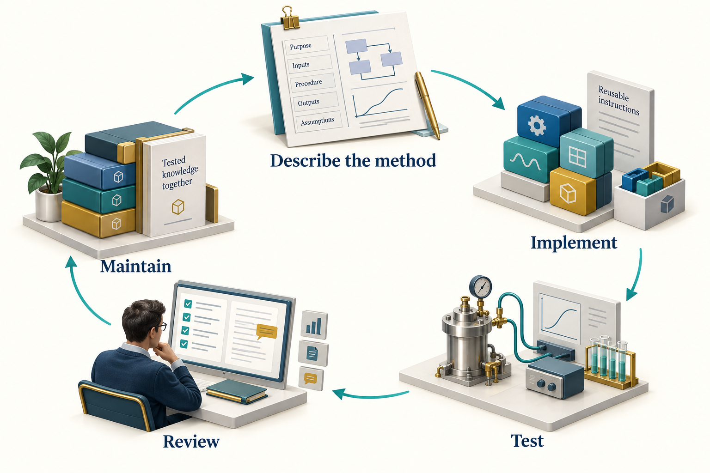

# Building and Maintaining Skills

## Learning Objectives

You should be able to design a focused skill, distinguish methods from policy, declare dependencies, and maintain examples against a known NeqSim revision.

## 6.1 A skill preserves a method

A good engineering skill tells an agent when a method is applicable, which inputs it requires, how to perform the work, what can fail, and how to check the result. It should help the agent avoid a known class of mistakes.

For example, a fluid-property skill should specify composition basis, temperature and pressure units, EOS selection considerations, phase checks, and physical-property initialisation. A pipeline skill should distinguish route length from horizontal distance and ask whether elevation, heat transfer, and multiphase behaviour matter. A skill that only says to use best practice transfers little usable knowledge.

Skills are maintained text and optional supporting artifacts. Reading one does not train the model or change its weights. The instructions influence the current workflow through the host's context-loading mechanism. Their effect still needs to be evaluated on representative tasks. \cite{community_skills}

## 6.2 Separate four kinds of content

| Content | Suitable home | Example |
|---|---|---|
| Numerical implementation | Tested code | Flash calculation or compressor model |
| Reusable method | Core or community skill | Build and verify a compression case |
| Company policy | Enterprise overlay | Approved operating-margin procedure |
| Study data | Controlled task artifacts | Composition and vendor map for one asset |

This separation reduces contradictions. If three agents need the same compressor method, they should reference one maintained skill. If a company changes its margin policy, it should update the enterprise overlay without duplicating the public thermodynamic method.


<!-- @neqsim:figure source=notebooks/01_revised_chapter.ipynb cell=2 index_base=0 generator=build_illustrations.py -->
<!-- @imagegen: manifest=../../illustrations/imagegen_manifest_2026-09-13.json asset=skill_lifecycle -->

*Observation.* Figure 6.1 connects the chapter's main ideas. The return path represents maintenance after evidence reveals a gap. Preserve the failing example, update the method and its tests, and review the effect on dependent agents before treating the revised package as accepted practice.

## 6.3 Give the skill a clear trigger

The description should identify when the skill is useful and when a different workflow is needed. Scope it around an engineering operation, not a broad aspiration.

Compare a description such as help with process engineering with one that says screen gas-compressor power for a supplied composition, inlet state, mass flow, outlet pressure, and assumed efficiency; require a vendor map for operating-window qualification. The latter tells the agent what it can do and which claim it cannot support from the available inputs.

Do not overload a single skill with fluid characterisation, pipeline design, economics, reporting, and approval. Those methods have different evidence requirements and often different owners. An agent can compose focused skills when the study needs them together.

## 6.4 Use metadata as a contract

The NeqSim skill format uses a `SKILL.md` file with metadata and structured instructions. Community conventions include a stable `neqsim-` name, semantic version, description, verification date, and optional dependencies. Use the exact catalog schema in the target repository when preparing a contribution. A host's minimum skill format and NeqSim's richer package contract are different layers: a host may discover a name and description without enforcing the package's engineering dependencies or verification policy.

An illustrative header is:

```yaml
---
name: neqsim-example-compressor-method
version: "0.1.0"
description: >-
  USE WHEN: estimating gas-compressor duty from a complete
  fluid and operating basis. Excludes vendor-map qualification.
last_verified: "2026-09-12"
requires:
  python_packages: [numpy]
---
```

The body should then explain inputs, applicability, procedure, output fields, validation, limitations, and references. A verification date should mean that someone checked a stated example against a recorded source revision. Updating the date without repeating the check creates false confidence.

## 6.5 Write examples that reveal assumptions

A compact fluid example can carry several important rules:

```python
fluid = jneqsim.thermo.system.SystemSrkEos(303.15, 60.0)
for name, mole_fraction in [
    ("methane", 0.85), ("ethane", 0.10), ("propane", 0.05)
]:
    fluid.addComponent(name, mole_fraction)
fluid.setMixingRule("classic")
ops = jneqsim.thermodynamicoperations.ThermodynamicOperations(fluid)
ops.TPflash()
fluid.initProperties()
```

The skill should state that the first constructor argument is kelvin, the second is bar absolute, and the component values are mole fractions. It should explain why `initProperties()` follows the flash: thermodynamic initialisation alone does not guarantee that transport properties are ready to read. It should also say how the author confirmed phase existence before querying a gas-only property.

Java examples in this repository must remain Java 8 compatible and use Log4j2 for output. Avoid `var`, collection factory methods introduced after Java 8, records, and direct console printing. After editing a Java source file, run the repository formatter and formatting check. These conventions belong in shared API and coding skills so domain specialists do not have to rediscover them.

## 6.6 Include failure cases

The most valuable part of a skill is often its treatment of failure. Give a symptom, an investigation, and an acceptable response.

| Symptom | Investigation | Acceptable response |
|---|---|---|
| Missing method | Inspect loaded source and API | Use the supported method or state the version gap |
| Unexpected liquid phase | Recheck composition and state | Add justified separation or revise the case explicitly |
| Zero transport property | Inspect initialisation and phase | Initialise properties and query a valid phase |
| Failed numerical case | Preserve input and diagnostics | Report failure; retry only under a declared policy |
| Large flow discrepancy | Check mass and standard-volume basis | Correct the conversion with recorded reference conditions |

Avoid a catch-all instruction to keep trying until successful. It can encourage hidden changes and selective reporting. A skill should make failures legible and specify when the agent should stop that calculation.

## 6.7 Install with dependency awareness

NeqSim catalogs can distribute more than Markdown. Some skills include a Python package with `pyproject.toml`, supporting examples, and tests. The installer may install that package into an environment. Review the declared dependencies and package behaviour before changing a shared environment.

Use `neqsim skill info <name>` to inspect a package. The current CLI supports `--no-pip` for workflows that need to separate content installation from Python dependency changes. The installed environment must still satisfy the skill before execution. Skipping dependency installation is not evidence that dependencies are unnecessary.

The selected interpreter should be passed explicitly to study runners and child processes. A missing package should be reported as an environment issue rather than solved by silently creating another virtual environment. This keeps a study's execution record meaningful.

Separate instruction dependencies from execution dependencies. An agent's `required_skills` names the reusable methods it needs. A skill may also need Python packages, native software, a server connection, or access to reviewed data. NeqSim agent installation normally resolves missing required skills; `--no-pip` suppresses Python package installation, while `--no-install-missing-skills` changes skill-content resolution. Neither option makes an incomplete runtime ready to execute. Optional context skills and coordinated agent names also need attention from the host or coordinator; they are not interchangeable with the hard dependency list. \cite{neqsim_agent_install_20260913}

A portable skill should consume locations supplied by the study. It should read the resolved task directory, optional document library and selected report template from the handoff or study configuration, rather than silently resetting the user's defaults. Source documents remain in the reference library; copies used as evidence belong in the task's per-source reference folders. This lets the same method serve a small local study and a larger shared document collection. \cite{neqsim_task_paths_20260913}

## 6.8 Verify a skill on a small task set

A useful verification set contains a nominal case, a boundary case, and an invalid input. For a compressor skill, the nominal case can be the synthetic gas basis. A boundary case might approach a phase change or an operating constraint. An invalid input might contain a negative flow or unspecified pressure basis.

The expected behaviour includes more than numerical output. Check whether the skill preserves units, identifies required data, uses the intended API, reports failed cases, and distinguishes estimated duty from machine qualification. Where a quantitative reference exists, define its tolerance and applicability before running the comparison.

Store executable examples beside the skill when its packaging convention permits. Record source revision, input data, expected checks, and dependency versions. Do not claim an accuracy percentage from a successful run alone.

## 6.9 Improve the right layer

When a task reveals a gap, first identify its owner. A numerical defect belongs in NeqSim code and tests. An incorrect code example belongs in the owning skill and documentation. An unclear handoff belongs in the agent definition and its linked skills. A company-specific approval rule belongs in an enterprise overlay.

Update both sides of a handoff when necessary: the producer's output contract and the consumer's input expectations. If a field changes from pressure in bar to pressure in pascal, changing only one skill creates a silent integration error. Version the contract and repeat an end-to-end example.

The goal is a small, coherent improvement that prevents recurrence. A new skill for every incident can fragment the library. Prefer improving a clearly responsible existing package when the scope fits.

## 6.10 Skills and other adaptation methods

Skills, retrieval, executable templates, and model fine-tuning address different needs. A skill makes a method explicit and reviewable. Retrieval supplies relevant documents. A tested template reduces variation in repeated calculations. Fine-tuning may change model behaviour across tasks, but it does not replace a current engineering basis or an executable verification record.

Choose a method by the failure you need to address. If the problem is a stale API example, update the example. If the problem is inconsistent numerical code in a repeated workflow, a tested function may help more than a longer prompt. Avoid unsupported general claims that one adaptation method is always more accurate or less costly than another.

## Exercises

1. Draft a skill outline for the running compressor case, including applicability, required inputs, checks and limitations.
2. Add a failure case where the requested inlet stream contains liquid. Specify the expected agent response.
3. Design a change record for an API update that affects a skill and two agents.
4. Explain why a skill verification date and an installed package version are both needed for reproducibility.
