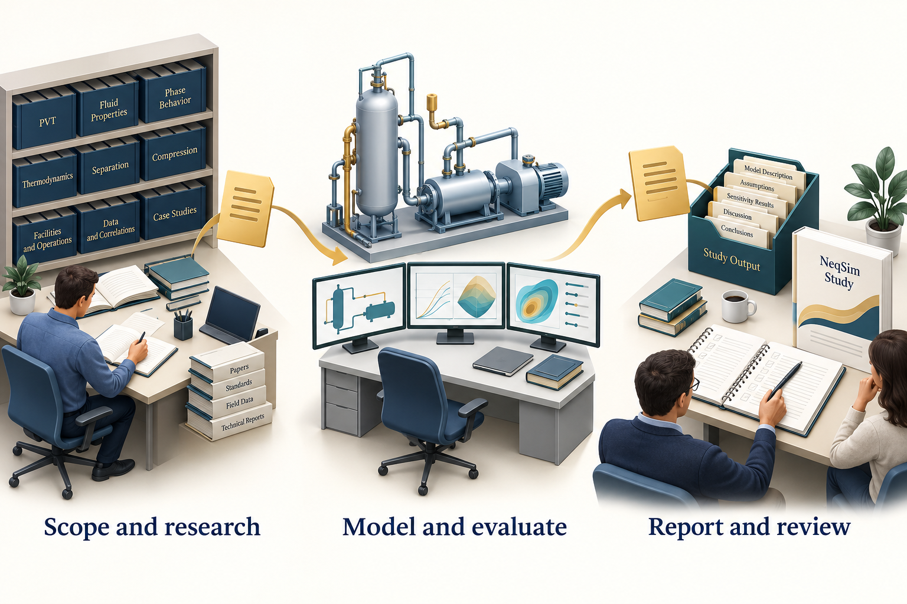

# The Task Solving Workflow

## Learning Objectives

After this chapter, you should be able to:

1. Configure separate study destinations, source libraries and report templates.
2. Create a task, complete intake and record the workflow in `study_config.yaml`.
3. Connect selected documents, calculations, validation and results in a portable study.
4. Distinguish numerical uncertainty from wider study risks and state the percentile convention.
5. Generate and review a work record and reports with the intended title and template.
6. Trace a task from request to result, explain each check and decide which conclusions the evidence supports.
7. Start the task-solving agent and distinguish host, role, study and runner configuration.

This chapter answers two practical questions: **How is an engineering task solved? How do we know whether its answer can be used?** The agent plans and coordinates work; NeqSim evaluates the specified model; checks and engineering review establish what the resulting evidence supports. Sections 7.5 and 7.7 describe that sequence, and Section 7.12 applies it to the running compressor example.

## 7.1 Scope before simulation

A useful specification explains the decision, the physical system, the operating envelope, the available data, the required methods, the outputs, and the acceptance criteria. The agent should identify missing information before that information becomes a hidden assumption.

For the running compressor case, the decision is limited: estimate the operating states and shaft duty under a stated fluid and efficiency model. It does not select a vendor machine. The absence of a vendor map is therefore a declared boundary, not a reason to invent surge or choke margins.

For larger studies, scope also includes jurisdiction, applicable design documents, economic basis, uncertainty ranges, and review responsibilities. Ask only questions that affect the work. A single-property query does not need a full investment model.

## 7.2 Set the destination, source library and Word template

Continue with the `$PythonExe`, `$ProjectRoot` and `$NeqSimCli` variables from Chapter 1. Every command below runs the selected interpreter against that source checkout. The short `neqsim` launcher is equivalent when it belongs to the same environment.

Before creating a study, inspect the three independent settings:

```powershell
& $PythonExe $NeqSimCli --show-task-root
& $PythonExe $NeqSimCli --show-document-root
& $PythonExe $NeqSimCli --show-report-template
```

To configure them, substitute your chosen study parent, an existing document library, and an existing Word template in these one-time commands:

```powershell
& $PythonExe $NeqSimCli --set-task-root 'C:\Engineering\Studies'
& $PythonExe $NeqSimCli --set-document-root 'C:\Engineering\Source documents'
& $PythonExe $NeqSimCli --set-report-template 'C:\Engineering\Templates\Study.dotx'
```

| Setting | Resolution order | What changes |
|---|---|---|
| Task root | Explicit `--task-root`, `NEQSIM_TASK_ROOT`, saved user default, repository `task_solve` | Destination of newly created studies |
| Document root | Explicit value in the source-discovery API, `NEQSIM_DOCUMENT_ROOT`, saved `document_root` | Library searched for input files |
| Report template | Report `--template`, `NEQSIM_REPORT_TEMPLATE`, saved `report_template` | Word styles, fonts, headers and footers |

Saved settings live in `~/.neqsim/task_defaults.json`. `--set-task-root cwd` makes new tasks follow the terminal's current folder. A changed default does not move an existing study. The corresponding `--reset-task-root`, `--reset-document-root` and `--reset-report-template` commands remove saved settings; environment overrides still apply.

The source library and the task output folder serve different purposes. Read source documents from the library, preserve selected evidence inside the study, and generate reports in the study. A configured template that cannot be found should produce an error. When no template is configured, built-in styling is available; use the organisation's required template for a branded deliverable.

## 7.3 Find documents, create the task and complete intake

Start with source discovery:

```powershell
& $PythonExe $NeqSimCli documents
& $PythonExe $NeqSimCli documents 'compressor'
& $PythonExe $NeqSimCli documents '.pdf'
& $PythonExe $NeqSimCli documents 'API 521'
```

The first command lists files below the document root. A pattern is a **case-insensitive substring of the relative path**, including folder names. It is not a wildcard or a full-text search: use `.pdf`, not `*.pdf`, to match that extension. The search descends into subfolders and skips hidden names. An empty match, an unset root and a configured but unreadable root are different outcomes; investigate the actual diagnostic before concluding that a document is unavailable.

Now create the running compressor study. The argument array keeps a longer PowerShell command readable:

```powershell
$CreateTask = @(
    'new-task', 'Gas compression screening',
    '--type', 'B', '--scale', 'standard',
    '--report-depth', 'standard',
    '--intake-pause', 'always'
)
& $PythonExe $NeqSimCli @CreateTask
```

This creates a dated task directory and prints its absolute path. Type B identifies a process task; the scale describes the depth. For a one-off destination, add `--task-root` and the parent path to the arguments. To seed the original request from a file, add `--prompt-file` and its text or Markdown path. Neither option requires changing the saved defaults.

Use the printed path, rather than guessing the date or slug:

```powershell
$TaskDir = 'C:\path\printed\by\new-task'
$env:NEQSIM_TASK_DIR = $TaskDir
Get-Content -LiteralPath (Join-Path $TaskDir 'README.md')
Get-Content -LiteralPath (Join-Path $TaskDir 'study_config.yaml')
```

Creation scaffolds the folder; it does not run an engineering agent or solve the study. `--intake-pause always` records the requested intake policy and prints a reminder. The task-solving agent applies that policy when it reads the configuration: it pauses for the user to confirm the basis and files before analysis. With `auto`, the pause depends on the study scale and missing critical inputs. With `never`, assumptions must still be explicit and a method-invalidating gap remains a reason to stop that calculation.

Open `study_config.yaml` in the editor before the agent plans notebooks. It is the study's executable-workflow contract, while `task_spec.md` explains the engineering basis. Important fields include:

| Field | Reader decision |
|---|---|
| `study.title`, `study.author`, `study.classification` | Report identity and information classification |
| `study.scale` | `auto`, `quick`, `standard` or `comprehensive`: requested effort |
| `study.deliverable_mode` | `auto`, `answer-first`, `notebook-first` or `report-first`: what the agent should prioritise |
| `intake.pause_after_folder_creation` | Whether to wait for the input handoff |
| `inputs.document_root`, `inputs.documents` | Source library snapshot and selected study evidence |
| `analysis.engine` | `auto`, `notebook`, `script` or `hybrid`: how calculations are organised |
| `notebooks.plan`, `notebooks.execution_required` | Which notebooks to produce and execute |
| `report.depth` | `auto`, `brief`, `standard` or `detailed`: requested writing depth |
| `report.formats`, `report.work_record` | Requested formats and method record; see the implementation limits below |
| `quality_gates` | Required validation, uncertainty, risk and consistency checks |

Task creation records a configured document root in `inputs.document_root`. Preserve the accepted value for the study rather than silently switching it after a user default changes. Keep the complete generated configuration and edit the relevant fields; replacing it with an abbreviated example can discard requirements.

**Start with these decisions.** Set the task's title and choose the amount of work: a Quick property answer or a Standard process study. Review the proposed notebooks and outputs, choose whether intake needs a pause, and tell the agent which evidence and review are required. The task folder controls where this work is saved; the document root controls where source files are found; the report template controls Word styling.

For example, a short methane calculation can request `quick`, `answer-first` and `brief`. A documented compressor study can request `standard`, `report-first` and `standard`, then add the required benchmark and uncertainty work to its plan. These are values of separate settings, not a single command. Review the generated defaults against the actual scope: selecting a scale does not guarantee that every needed analysis has been planned or completed.

At creation, the Standard scale seeds a main-analysis and a benchmark notebook in the plan. Add a separate uncertainty-and-risk notebook when required by the study; the expanded example below includes it. A Quick task starts with one planned main notebook. A Comprehensive task starts with a broader plan. The agent still has to create, complete and execute the planned work.

The configuration is a contract between the user, agent and tools, and each part has a different effect. Destination and template settings are resolved by the commands. Study scale, deliverable emphasis and report depth guide the agent's planning and writing; they do not perform the engineering work or automatically shorten a report. The current report command produces **Word and HTML**. Although `report.formats` records requested formats, the current generator does not use that list to select its outputs. Adding `pdf` to the list alone does not create a PDF. Arrange and check an additional export when that deliverable is required. \cite{neqsim2026}

Put the original request in `user_input.md`. Append clarifying answers and later instructions verbatim, and record inferred assumptions separately. This gives the next engineer a record of what was asked as well as what was implemented.

Copy the selected, authorised documents into `step1_scope_and_research/references/`, grouped by source such as `vendor`, `lab`, `literature` or `manual`. Preserve document identifiers, revisions and origin. Extract relevant values, tables and diagram relationships, normalise units and validate the interpretation before using a document-derived value in a model. Listing a filename does not perform that work. Rebuild the source index:

```powershell
$SourceIndexer = Join-Path $ProjectRoot 'devtools\generate_sources_md.py'
& $PythonExe $SourceIndexer $TaskDir --organize
```

**Agent prompt — after the intake material is ready:**

> Continue the existing Gas compression screening task at [absolute task path]. Read README.md, study_config.yaml and user_input.md. Use the selected Python executable [path] and NeqSim source [path]. The intake basis and supplied files are ready; proceed with the agreed scope. Read and validate the selected documents, fill the task specification, discover the relevant agents and skills, and record gaps before constructing the model. Produce the configured evidence and report without changing the accepted input basis silently.

## 7.4 Which files are created, and what are they for?

A typical Standard process study grows into this structure:

```text
study/
  README.md
  study_config.yaml
  user_input.md
  progress.json
  step1_scope_and_research/
    task_spec.md
    capability_assessment.md
    analysis.md
    neqsim_improvements.md
    notes.md
    references/
      SOURCES.md
      collection_manifest.json
      literature/
      vendor/
      manual/
  step2_analysis/
    01_main_analysis.ipynb
    02_benchmark_validation.ipynb
    03_uncertainty_and_risk.ipynb
  figures/
  results.json
  consistency_report.json
  step3_report/
    generate_report.py
    WORK_RECORD.md
    Gas_compression_screening.docx
    Gas_compression_screening.html
```

The tree shows a completed study's intended evidence. A new task begins with instructions and templates; its results arrive through the subsequent work. Use this file guide when opening the folder for the first time:

| File or group | When it appears and how to use it |
|---|---|
| `README.md` | Created at the start. Read it for the task's workflow and entry points. |
| `study_config.yaml` | Created at the start. Edit the task's settings, requested outputs and work requirements here. |
| `user_input.md` | Created at the start. Preserve the original request, later instructions and supplied clarifications. |
| Step 1 Markdown files | Created as templates. The agent fills the specification, research notes, capability assessment and analysis. A template's existence is not completed research. |
| `references/` | Starts with guidance. Add the selected source documents; the source-index command creates or refreshes `SOURCES.md` and its manifest. |
| Step 2 starter notebooks | Created under `starters/` as examples. The agent prepares the actual planned notebooks and executes them. A notebook name in the plan is not an executed notebook. |
| `figures/` and `results.json` | Calculations produce the plots and structured result data. A new task has a figure placeholder but no calculated `results.json`. |
| `progress.json` | Maintained during an agent workflow to record checkpoints and open work. It is not created by the initial scaffold. |
| `consistency_report.json` | Written when the consistency checker is run. Read its coverage and individual findings. |
| Step 3 report files | The report launcher exists from the start. The work-record and report commands produce `WORK_RECORD.md` and the title-based Word/HTML files later. |

For the running example, the report filenames are `Gas_compression_screening.docx` and `Gas_compression_screening.html`. Readers normally start with the report for the answer, then open the work record for how it was obtained. Reviewers follow the result data, notebooks and references to examine the evidence. Edit the task basis and source calculations when a result changes, then regenerate the affected outputs; editing a number only in Word leaves the study inconsistent.

### Configure the work before it starts

Treat `study_config.yaml` as the settings file and `task_spec.md` as the engineering explanation. In the settings file, confirm the title, scale, intake behaviour, notebook plan and deliverables. In the specification, state composition, operating conditions, methods, acceptance criteria and important assumptions. This avoids hiding engineering decisions inside a list of filenames.

Tell the agent to read both files when continuing an existing task. If a later request changes the scope or output, update the relevant setting and preserve the instruction in `user_input.md`. Record which calculations and reports need to be repeated. Changing the default task folder, document library or template does not by itself revise the accepted basis of an existing study.

### Select the agents and plan the analysis

For Standard and Comprehensive studies, discover candidate skills and agents, then inspect their definitions:

```powershell
$SkillSearch = Join-Path $ProjectRoot 'devtools\skill_search.py'
$AgentSearch = Join-Path $ProjectRoot 'devtools\agent_search.py'
& $PythonExe $SkillSearch 'gas compression study' --top 5
& $PythonExe $AgentSearch 'gas compression study' --top 8
```

Record the selected composition and rationale in `capability_assessment.md` and the result record. The assessment should identify supported methods, missing input data, validation needs and any work for another discipline. A returned class or agent name is a candidate, not a completed assessment.

Before simulation, write an order-of-magnitude estimate. Chapter 10 illustrates this with a compression-temperature estimate and an energy balance. The estimate helps expose unit mistakes and implausible trends before they become polished results.

Every specialist receives the same absolute task path, basis revision and selected interpreter. Give each writer a distinct output artifact and one coordinator responsibility for merging shared results. The report author consumes the accepted calculations and review findings.

## 7.5 How is an engineering task solved?


<!-- @neqsim:figure source=notebooks/01_revised_chapter.ipynb cell=2 index_base=0 generator=build_illustrations.py -->
<!-- @imagegen: manifest=../../illustrations/imagegen_manifest_2026-09-13.json asset=study_workflow -->

*Observation.* Figure 7.1 connects the chapter's main ideas. Input documents feed a scoped model, while the study folder retains calculations, checks and the report. Changes to the basis should be recorded and propagated through that chain rather than edited only in the final document.

These stages are iterative. A failed benchmark may return the study to model selection. A missing flow reference condition may return it to data collection. Preserve the old basis and record why the new one replaced it.

The practical sequence is as follows:

1. **Turn the request into a decision and a basis.** Record what the user needs to decide, the inputs and units, the operating cases, required outputs and acceptance criteria. Clarify missing information that could change the method or conclusion. The resulting task specification gives every later calculation a purpose.
2. **Find evidence and select a method.** Read the selected documents, record their origins and check that their values apply to this case. Discover suitable agents and skills, inspect the relevant NeqSim capabilities, and record unsupported requirements. Choose the model because it fits the physical question and available evidence.
3. **Divide the work into checkable outputs.** For the compressor study, these include the base flowsheet, pressure sensitivity, benchmark assessment and uncertainty analysis. Specify the input basis and expected artifact for each piece. One agent can perform several roles; multiple agents are useful only when their responsibilities and handoffs are clear.
4. **Build and execute the calculation.** Prepare a script or notebook using the selected source checkout. Start with a small base case, inspect its phases and outputs, and then execute the planned cases. Generate figures and result tables from those outputs. A proposed tool call or a code listing has no execution evidence until it has run.
5. **Inspect observations and resolve failures.** Compare the results with the declared checks in Section 7.7. Diagnose a failure before retrying: a missing input, incorrect unit, unavailable class and numerical failure require different repairs. Record the cause and change, then repeat the affected calculations and checks. Preserve failed cases alongside successful ones.
6. **Explain the result and hand over the evidence.** Assemble the accepted inputs, calculations, checks, limitations and conclusion in the result record, work record and report. The responsible reviewer decides whether the evidence supports the intended use, or whether more data or analysis are required.

An agent need not call a language model during every numerical operation. Once it has prepared and checked a pressure sweep or Monte Carlo runner, that code can execute the repeated NeqSim calculations directly. The agent reviews the resulting observations and decides what additional work is justified. This separates workflow decisions from the numerical solver. \cite{neqsim2026,yao2022react}

### Start the task-solving agent

The coordinating role is defined in `.github/agents/solve.task.agent.md`. Its current display name is **solve engineering task**. Open the source checkout in the AI host, select that role if the host exposes it, or ask the host to read and apply the definition. The notation `@solve.task` in repository examples identifies the role; the available selector and display name depend on the host. Chapter 5 explains how packages are installed and exported.

After creating and configuring the compressor study in Sections 7.2-7.4, send this prompt with actual paths substituted:

> Apply the task-solving role in .github/agents/solve.task.agent.md. Continue the existing study at [absolute task path]; do not create a second task. Use [absolute NeqSim source path] and [absolute Python executable]. Read README.md, user_input.md, study_config.yaml and the current task specification; read progress.json if it exists. Estimate compressor duty and operating temperatures for the recorded gas basis and pressure cases. First summarise the effective settings, missing inputs, selected specialists and planned outputs. Respect the intake pause. Then execute the agreed work, record checks and unresolved validation gaps, and produce the configured work record and report. Keep all study outputs in this task folder.

The agent should first make the work inspectable: name the task, identify the accepted input basis, state which instructions and skills it will use, and show the planned files and checks. If the intake policy requires confirmation, that happens before dependent analysis. On resuming, the agent reads the recorded state and checks existing artifacts before deciding what remains; it should not assume that an earlier chat promise means a calculation succeeded.

### Know which setting controls which part

There is no single setting that configures every part of a NeqSim agent. Use the following map when deciding what to change:

| Part | Where it is configured | What the reader changes |
|---|---|---|
| AI host | The host's session or workspace settings | Selected language model, workspace access, tools and execution permissions |
| Agent role and skills | The selected agent definition and the skills it loads; repository instructions also apply | Reusable responsibilities, methods, required evidence and handoff rules |
| One engineering study | `study_config.yaml`, `task_spec.md` and the preserved requests in `user_input.md` | Study depth, inputs, planned analyses, outputs and acceptance criteria |
| Calculation execution | Runner arguments, notebook settings and the selected Python/Jupyter environment | Execution mode, time limit, attempt limit, parallel jobs, source checkout and kernel |

Choose a different role when the engineering responsibility changes. Change `study_config.yaml` when the same role needs to produce different work for one study. Change the host's model or tool settings when its execution capabilities need to change. A report template controls document appearance; it does not select the language model or the physical model. Host permissions still determine which operations are available, even when an agent definition requests them. \cite{neqsim2026}

### How the coordinator uses specialists

The task-solving agent discovers relevant agents and skills using the searches in Section 7.4. For the compressor example, it may use a fluid specialist to check composition and phases, a process specialist to build the flowsheet, and a reviewer to challenge the evidence. These are responsibilities to assign, not proof that three separate agents ran. The host must support delegation for separate agent execution; one agent can otherwise apply the roles sequentially.

Each handoff should carry the same absolute task path, source checkout and Python executable, together with the accepted inputs, the bounded question, the file the specialist owns and the required checks. The specialist returns that artifact, its execution status, findings and unresolved gaps. The coordinator reconciles the findings and merges the result record. Record the agents actually used in `agent_workflow_plan`; a discovery list is only a set of candidates. Keep one owner for shared files such as `results.json`.

### Configure the calculation runner

The current task-solving instructions normally use `neqsim_runner` for notebook execution. This is a supervisor for calculation jobs. It starts Python processes, records their status and supports bounded retries; it does not choose an AI model or solve an engineering request by itself. The agent prepares the calculation and supplies its inputs before submitting it.

In the existing study configuration, the relevant notebook fields look like this. Edit these fields in place and preserve the rest of the file:

```yaml
notebooks:
  execution_engine: neqsim_runner
  runner_mode: execute
  runner_max_retries: 3
  runner_timeout_seconds: 3600
  runner_max_parallel: 1
  runner_merge_results: true
```

`execute` preserves executed notebook outputs; `script` runs converted code cells and does not produce an executed notebook. The current supervisor interprets `runner_max_retries: 3` as at most three attempts in total. The timeout applies to an attempt, and serial execution limits simultaneous JVM load. These controls manage execution, not physical accuracy.

The agent must read these values and pass them to the runner's submission and execution calls. `AgentBridge` does not automatically read `study_config.yaml`. With an explicit task directory, it keeps `runner.db` and `runner_output/` inside that task and maintains `progress.json`. Supply the source checkout separately; an external study folder cannot identify it reliably.

The Python worker reuses its launching interpreter. Execute-mode notebooks additionally use the kernelspec selected by `NEQSIM_KERNEL_NAME`, or `python3` by default. Check that this kernel points to the intended Python executable. Inspect each job's recorded status and the produced artifacts: the runner command returning is not itself proof that every job succeeded. Then apply the engineering checks in Section 7.7. \cite{neqsim2026}

If the method cannot answer the question with the available evidence, record an unresolved finding and the next action. Changing the input basis to make a test pass, omitting failed cases or increasing a tolerance without justification would break the connection between the request and the answer.

## 7.6 Use structured results as the reporting source

`results.json` is the bridge between calculations and reports. It should contain actual outputs, units, validation findings, figure captions, interpretations, and source references. The following reduced example shows a structure; its empty result object is intentional and must be populated from execution:

```json
{
  "key_results": {},
  "approach": "SRK with classic mixing rule; synthetic teaching gas",
  "validation": {
    "independent_validation_completed": false
  },
  "agent_workflow_plan": {
    "workflow_type": "single_agent",
    "rationale": "Small, bounded teaching calculation"
  },
  "figure_captions": {},
  "figure_discussion": [],
  "references": []
}
```

The complete study schema has additional required fields. Use the selected revision's validator rather than assuming this illustrative fragment is sufficient for release.

Load the existing results before adding data. Merge new keys and append discussions without discarding previous work. Give one coordinator responsibility for the final merge if several specialists produce results. Do not let parallel writers overwrite the same file.

A figure discussion should state the observed trend with values, explain the mechanism, identify its engineering implication, and recommend a specific next step. A caption alone rarely carries all four.

## 7.7 How is the solution verified?

**Verification** examines implementation and execution. Examples include API checks, regression tests, finite-value checks, material balance, and reproducible re-runs. **Validation** compares the model with independent evidence for the intended use. A model can pass verification while being unsuitable for the application.

For each applicable check, record the input revision, the criterion, the observed value, the outcome and the evidence file. Define the criterion before judging the result. Keep the questions separate:

| Question | Evidence to inspect |
|---|---|
| Did we solve the requested problem? | Task specification, selected cases and accepted changes to the basis |
| Did the intended calculation run? | Executed notebook or script, run status, source revision and actual inputs |
| Are the numbers internally consistent? | Finite-value checks, balances with explicit boundaries, units and limiting cases |
| Did a software change alter the result? | Comparison with a preserved regression baseline and an explanation of any difference |
| Does the model represent this application? | Independent reference data with matching states, quantities and justified tolerances |
| Does the recommendation follow? | Acceptance criteria, uncertainty, unresolved findings and review for the intended use |

A numerical failure should trigger diagnosis and a repeat of the affected checks. A failed independent comparison may instead require better input data or another model. If a reference is unavailable, record validation as unresolved and narrow the conclusion. A second agent can challenge the interpretation, but repeating the same calculation does not add independent physical evidence.

Choose benchmark data with matching composition, conditions, units and measured quantity. Comparing a system-average density with a measured liquid density is not a valid benchmark. Define tolerances before examining the result and explain whether they reflect measurement uncertainty, engineering requirements, or a numerical regression threshold.

For Standard and Comprehensive studies, the workflow requires a separate benchmark notebook with multiple reference points and a parity or deviation plot. If suitable independent data are unavailable, retain that gap and limit the conclusion. Do not replace the reference with another run of the same model and call it independent.

Check the result-file structure inside the engineering task folder:

```powershell
$ResultValidator = Join-Path $ProjectRoot 'devtools\validate_task_results.py'
& $PythonExe $ResultValidator $TaskDir
```

Read both the diagnostics and the number of files checked. The current command can return successfully after finding no result files; a skipped check supplies no verification evidence. Errors fail the command, while warnings normally do not. `--strict-warnings` also treats warnings as failures. The validator examines the result structure and selected evidence fields; it does not establish that a stated acceptance flag is true in the physical world.

Before generating the report, run the consistency checker:

```powershell
$ConsistencyChecker = Join-Path $ProjectRoot 'devtools\consistency_checker.py'
& $PythonExe $ConsistencyChecker $TaskDir
```

Resolve critical mismatches among notebooks, result data, tables and prose. The current consistency checker is a heuristic screen for selected numerical and textual patterns; it does not execute notebooks or compare every possible engineering quantity. Inspect its findings and how many notebooks and values it examined. Retain explicit case-specific assertions, such as the compressor balances in Chapter 10, even when the screen reports no critical issue.

Likewise, a valid result-file structure does not establish physical accuracy or mean that every acceptance criterion passed. Read the individual findings, tolerances and warnings. Some configured report gates currently produce warnings while allowing files to be generated. A written report therefore needs a separate completion judgement against the study requirements. \cite{neqsim2026}

## 7.8 Uncertainty belongs in the model inputs

Select uncertain parameters because they can affect the decision. For compression, candidates include composition, flow, inlet temperature, pressure loss and efficiency. For field development, resource estimates such as gas initially in place (GIP) or stock-tank oil initially in place (STOIIP) must also carry uncertainty. Price and cost uncertainty belongs in the economic calculation, with a declared currency and valuation date.

Use full NeqSim simulations for technical Monte Carlo cases where an appropriate NeqSim model exists. Generate the simulation function once, then execute it parametrically. Cache calculations that do not change. Economic-only sensitivities can reuse a production profile when the economic parameter does not alter production decisions.

The Standard workflow sets a minimum of 200 NeqSim Monte Carlo realisations. That is a procedural minimum, not proof of stable tail estimates. Check convergence of the reported statistics, record the random seed and distributions, and preserve failed cases. Correlated inputs need a joint sampling model; independent draws may produce physically inconsistent combinations.

## 7.9 Define the percentile convention

Percentile labels are used differently across disciplines. In a non-exceedance convention, P10 is the 10th percentile and is lower than P90. In petroleum resource reporting, P90 commonly refers to a high probability of exceedance and therefore a lower estimate. State the convention beside every table and plot.

For a continuous non-exceedance output distribution, the quantile $q_p$ satisfies

$$
\Pr(Y \leq q_p) = p.
$$

For a discrete or empirical distribution, the cumulative probability can jump over the requested probability. The book's finite-sample calculation uses NumPy's linearly interpolated sample quantiles.

Do not combine a petroleum exceedance resource table with a statistical non-exceedance NPV table under an unexplained shared P10/P50/P90 heading. Use explicit labels when the study contains both.

A tornado diagram shows sensitivity under selected perturbations; it is not a substitute for a joint uncertainty distribution. Its ranking can depend on the assumed ranges and on interactions between inputs.

## 7.10 Risk extends beyond numerical uncertainty

A Monte Carlo analysis describes uncertainty represented by its model and input distributions. It does not automatically cover missing data, model misuse, schedule delay, regulatory change or operational hazards.

Maintain a risk register with descriptions, causes, consequences, owners and mitigations appropriate to the study. ISO 31000 provides risk-management guidance; it does not prescribe one universal five-by-five scoring matrix. If the project uses such a matrix, record its definitions and decision rules. \cite{iso31000}

A risk entry should be actionable. For example, uncertain heavy-end composition may affect condensation and liquid handling. The mitigation could be a new laboratory analysis and a defined sensitivity study. A generic entry saying model risk is high gives the team little direction.

## 7.11 Generate the work record and the report

The report explains the answer. The work record explains how the study produced it and where the evidence lives. Build the method record from the task folder:

```powershell
& $PythonExe $NeqSimCli work-record $TaskDir
```

Expect `step3_report/WORK_RECORD.md`. It gathers the task basis, input sources, scripts, notebooks, cached data and an annotated file map. Complete its background, method and limitations narrative blocks with study-specific explanations. The generator preserves text inside its `WORK_RECORD:NARRATIVE` markers when it runs again.

For a study driven by data-retrieval scripts, declare their purpose and outputs in `analysis.scripts` and the source-system evidence in `inputs.data_sources` inside `study_config.yaml`. A script-backed workflow can explicitly set `analysis.engine: script` and `notebooks.required: false`, with consistent execution gates. The absence of notebooks does not remove the need for reproducible computation, provenance or validation. For the running process example, use the configured NeqSim notebooks.

Check the completed work record:

```powershell
& $PythonExe $NeqSimCli work-record $TaskDir --check
```

Resolve missing or placeholder content before claiming that the record is complete. An automatically generated file inventory is a starting point; the explanation of method and limitations must describe the actual study.

After the results, validation and consistency checks are complete, generate the report:

```powershell
& $PythonExe $NeqSimCli report $TaskDir
```

The command runs the canonical report generator from the selected NeqSim checkout against this task. The task-local `step3_report/generate_report.py` is a launcher, so shared generator fixes can reach existing studies. Preserve the source revision used for a published report rather than assuming a later generator produces identical output.

Report identity normally comes from `study.title` in `study_config.yaml`. A command-line `--title` takes precedence, followed by `NEQSIM_REPORT_TITLE` and the study configuration. For the title **Gas compression screening**, the generated files are `Gas_compression_screening.docx` and `Gas_compression_screening.html` under `step3_report`. Spaces become underscores and unsafe filename characters are removed; read the actual output paths printed by the generator. The work record retains its fixed name, `WORK_RECORD.md`.

To use a specific title or template for one run, pass the supported overrides:

```powershell
$ReportArgs = @(
    'report', $TaskDir,
    '--title', 'Gas compression screening',
    '--template', 'C:\Engineering\Templates\Study.dotx'
)
& $PythonExe $NeqSimCli @ReportArgs
```

The report generator reads the configuration, task specification and structured results, and normally generates the work record alongside the report. A required missing template, result, source-evidence item or configured deliverable must be resolved or explicitly recorded as a limitation under the study's review rules. Do not label a report complete merely because a file was written.

Review the report against the original decision: are the model basis, supported results, unresolved issues and next action clear? A screening calculation can be complete without selecting a vendor machine. A machine-selection claim needs the additional evidence. Reusable API, skill and handoff improvements belong in the appropriate repositories; confidential task data remain in the authorised study.

## 7.12 Follow one result from request to decision

Consider the Chapter 10 request: estimate the shaft duty and operating temperatures for the stated dry-gas feed, compression target and assumed efficiency. The teaching calculation uses the Chapter 1 basis. Its model contains a feed, inlet separator, compressor and aftercooler; the separator liquid outlet remains part of the accounting even when its calculated flow is negligible.

The base calculation predicts **337.269 kW** compressor duty and **93.749 degrees C** discharge temperature. To assess that answer, follow the evidence rather than stopping at the number:

| Check in the executed example | Criterion and observation |
|---|---|
| Numerical outputs | All stored base-case values are finite |
| Separator mass balance | Relative inlet-minus-gas-and-liquid residual is below `1e-8`; recorded value is zero |
| Aftercooler target | Outlet temperature differs from 35 degrees C by less than `1e-6` degrees C |
| Whole-train energy balance | Absolute residual is below `1e-5` kW; the recorded residual is approximately `-5.68e-14` kW |
| Software repeatability | Base results and pressure-sweep outputs agree with the preserved book baseline within the declared regression tolerances |

<!-- @neqsim:claim
  id: task_solution_verification_walkthrough
  test: src/test/java/neqsim/book/industrialagentic2026/BookWorkedExamplesRegressionTest.java
  method: chapter10CompressionBaseAndPressureSweepMatchRecordedOutputs
  baseline: verification/regression_baseline_2026-09-12.json
  notebook: ../ch10/notebooks/01_revised_chapter.ipynb
  results: results.json#/compression_base
-->

The explicit balance in Section 10.3 includes feed enthalpy, the final cooled stream, separator liquid, compressor work and cooler heat transfer. Its tolerance is a numerical consistency criterion for this example. It does not measure the accuracy of the equipment model against a real machine.

The executable checks are in the companion package's `verify_examples.py`, with values under `compression_base` in the book's `results.json`. The Chapter 10 notebook and the preserved baseline record repeatability; the Java regression suite exercises the same numerical engine through Java directly. The book result file aggregates several teaching cases and differs from the generic result schema used inside an individual NeqSim task folder.

The evidence supports a reproducible prediction for the declared synthetic case. Application validation of the compressor remains open because this example has no independent vendor performance data or plant measurements. The methane reference comparison in Chapter 9 does not validate the entire compressor train. A reviewer can accept the calculation for explaining the method while requiring additional evidence before using it for machine selection.

If the energy check had failed, the next step would be to inspect units, sign conventions, stream boundaries and equipment duties, then rerun the corrected calculation. If the balance passed but measured power disagreed, the investigation would also cover composition, efficiency, operating conditions and model suitability. These are different findings and need different remedies.

## Exercises

1. Create a study with an explicit task root and an intake pause. Identify which files are scaffolded and which must be produced by the engineering work.
2. Explain how `documents 'compressor'` differs from a full-text search, and record the origin of one selected reference.
3. Set the intended report title in `study_config.yaml` and predict its output filenames. Verify them after a completed study is rendered.
4. Define a result-file ownership policy for three specialists and describe the method evidence their work record should contain.
5. Explain the difference between a regression comparison, a physical sanity check and independent validation.
6. Design an uncertainty study with one technical and one economic parameter. State which calculations can be reused and label the percentile convention explicitly.
7. Use the compressor walkthrough to write a short answer stating how the task was solved, which checks passed, which evidence remains missing and what use of the result is justified.
8. In a new task folder, identify the files created immediately and those that still require work. Configure a brief answer, then explain what you would change for a documented process study and a PDF deliverable.
9. Explain where to change the AI model, the study depth, a specialist's method and the notebook timeout. Write a handoff that preserves the task path, source checkout, interpreter and required evidence.
