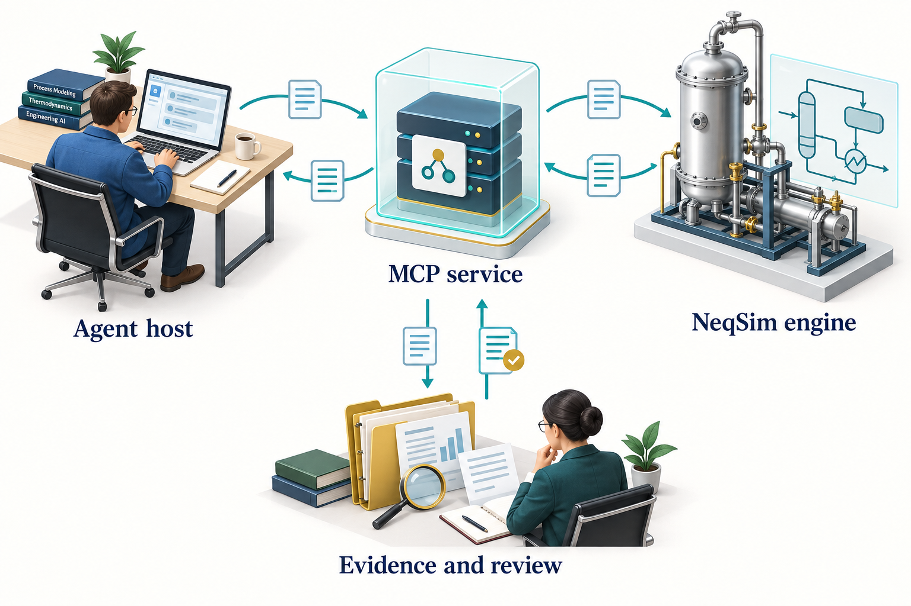

# MCP and Governed Calculation Services

## Learning Objectives

You should be able to distinguish the MCP protocol from the NeqSim implementation, discover a tool's input contract, interpret its result and diagnostics, and identify deployment controls that belong outside the model prompt.

## 8.1 Why expose calculations as tools

Direct Python or Java code gives an engineer substantial flexibility. A repeated calculation can also be exposed through a narrower service interface with explicit inputs, validation and structured outputs. This makes the operation easier for an agent to discover and for a runtime to supervise.

The Model Context Protocol, or MCP, provides a standard interaction model for hosts, clients and servers. A host manages the user interaction and permissions. Its client connects to a server, discovers capabilities, and calls tools. The server performs the requested operation and returns a result. MCP standardises the interface; it does not certify the engineering calculation. \cite{mcp_tools}

## 8.2 NeqSim separates transport from calculation

The NeqSim MCP server is a Quarkus-based service. It delegates to framework-independent classes in the core library's `neqsim.mcp` packages. These include runners, request and result models, and catalogs of examples and schemas.


<!-- @neqsim:figure source=notebooks/01_revised_chapter.ipynb cell=2 index_base=0 generator=build_illustrations.py -->
<!-- @imagegen: manifest=../../illustrations/imagegen_manifest_2026-09-13.json asset=mcp_layers -->

*Observation.* Figure 8.1 connects the chapter's main ideas. The service boundary and numerical engine have different responsibilities. Transport, schemas and access controls need their own checks; numerical outputs still require physical interpretation and application-specific evidence.

The [MCP core-layer guide](https://equinor.github.io/neqsim/integration/mcp_neqsim_core_layer.html) describes `FlashRunner`, `ProcessRunner`, typed result envelopes, and the capability and schema catalogs. \cite{mcp_core}

## 8.3 Discover before calling

Use the connected server's advertised tool list and current schemas. NeqSim provides discovery entry points such as `getCapabilities`, `getExample`, and `getSchema`. These help an agent determine the accepted input, supported units, expected output and available examples.

The server's tool list and deployment profiles can change. Avoid hardcoding a tool count into a workflow or assuming that a tool described in an older book is enabled on the current server. A deployment profile can expose a selected subset or apply additional policy.

Agent discovery and tool discovery are separate operations. The community catalog describes engineering workflows and their dependencies. MCP discovery describes the tools exposed by a connected server. Installing a community agent does not start an MCP server, register that agent as a server tool, or establish the credentials required by its integrations. Match the agent's method to the actual tool contract before execution. \cite{community_agent_catalog_20260913,neqsim_agent_install_20260913}

MCP tools can provide input schemas, optional output schemas and annotations describing behaviour. Annotations are hints for clients; they do not enforce an access policy or prove that a remote tool is harmless. Validate the server identity and apply the host's controls. \cite{mcp_tools}

## 8.4 Two JSON shapes with different purposes

The core `FlashRunner` accepts a structured calculation request. A representative input is:

```json
{
  "model": "SRK",
  "temperature": {"value": 25.0, "unit": "C"},
  "pressure": {"value": 50.0, "unit": "bara"},
  "flashType": "TP",
  "components": {"methane": 0.85, "ethane": 0.10, "propane": 0.05},
  "mixingRule": "classic"
}
```

The MCP wrapper's `runFlash` tool exposes arguments using its own tool schema. In the documented wrapper, composition is passed as a JSON string and temperature and pressure units are separate arguments:

```json
{
  "name": "runFlash",
  "arguments": {
    "components": "{\"methane\":0.85,\"ethane\":0.10,\"propane\":0.05}",
    "temperature": 25.0,
    "temperatureUnit": "C",
    "pressure": 50.0,
    "pressureUnit": "bara",
    "eos": "SRK",
    "flashType": "TP"
  }
}
```

The second block represents the parameters of an MCP `tools/call` request, not a complete session handshake. Most hosts construct the JSON-RPC envelope and manage initialisation themselves. Do not interchange the core-runner request and tool arguments without the adapter that maps them. Verify the current schema before reproducing the call. \cite{mcp_core}

## 8.5 Interpret success carefully

Inspect status, data, units, warnings, diagnostic issues and provenance. A successful result means the tool completed under its contract. It may still contain warnings about applicability or missing evidence. A tool error and a physically implausible successful result need different investigations.

For a flash request, check the model, input basis, phases present, finite properties and the requested quantity. For a process request, inspect convergence and the relevant balances. For an engineering package, inspect the case basis, exchange profile, evidence and qualification state.

A trace identifier is useful only if it resolves to retained evidence. Preserve the exact request, result, tool and library revisions, and any validation artifacts needed by the study. Do not replace the tool output with a manually retyped summary as the sole record.

## 8.6 Choose a deployment appropriate to the work

The public 3.20.0 distribution includes an MCP runner JAR requiring Java 21+ and a container image. Local clients can use standard input/output transport. Network clients use the server's supported HTTP transport and deployment configuration. The core library's Java compatibility requirements are separate from those of the server. \cite{neqsim_release_320}

For a desktop workflow, the host starts a local server process and exchanges messages with it. Keep diagnostic logging separate from the protocol stream. For a shared service, authentication, network boundaries, quotas, logging and data retention require explicit configuration. A local test configuration should not be copied unchanged to a shared network deployment.

Use the release-specific [MCP server documentation](https://github.com/equinor/neqsim/tree/v3.20.0/neqsim-mcp-server) for launch commands and client configuration. Pin the actual distribution and retain its checksum when packaging a reproducible environment.

Resolve file locations at the execution boundary. A document root on the engineer's computer is not automatically visible inside a container or on a remote server. A deployment must provide an authorised mount, upload, or retrieval route and preserve the source identity. Likewise, a server result must be returned to the intended active study, not whichever directory happens to be current in a worker. Record these mappings alongside the runtime configuration. The task and document defaults described in Chapter 7 help the local workflow select locations; they do not configure remote filesystem access. \cite{neqsim_task_paths_20260913}

## 8.7 Govern effects as well as calculations

Reading a component database, executing a simulation, writing a report and changing an operating system have different consequences. Separate those capabilities in the runtime. Access to a calculation service is not permission to write to a plant control system.

Inputs retrieved from PDFs, web pages or tool responses can include irrelevant or hostile instructions. Treat them as data. They must not override the user's scope, secret-handling rules or execution policy. Private integrations should expose only the information needed for the study.

Long-running simulations also need supervision: execution limits, cancellation, checkpoints, output ownership and failure reporting. These are runtime responsibilities. A sentence in a prompt asking an agent to be careful is not an execution control.

## 8.8 Test the service in layers

Begin with runner tests for deterministic input and output behaviour. Then check schemas and response contracts. Test the server transport with a known request. Finally, evaluate the agent using the service on representative engineering tasks.

Include invalid units, unsupported components, missing fields, solver failures and permission failures. Verify that errors remain visible rather than being converted to empty successful results. Where a benchmark exists, test its stated applicability separately from protocol correctness.

A live MCP integration is not exercised merely by running `FlashRunner` in a local Python process. The book's execution record identifies such checks separately. This avoids overstating what a convenient local demonstration proves.

## Exercises

1. Compare the two JSON examples and identify the mapping performed by the server wrapper.
2. Describe the evidence you would retain for a shared-service compressor calculation.
3. Explain why a read-only annotation and a restricted runtime are different controls.
4. Design a test that distinguishes a transport failure from an engineering-input failure.
