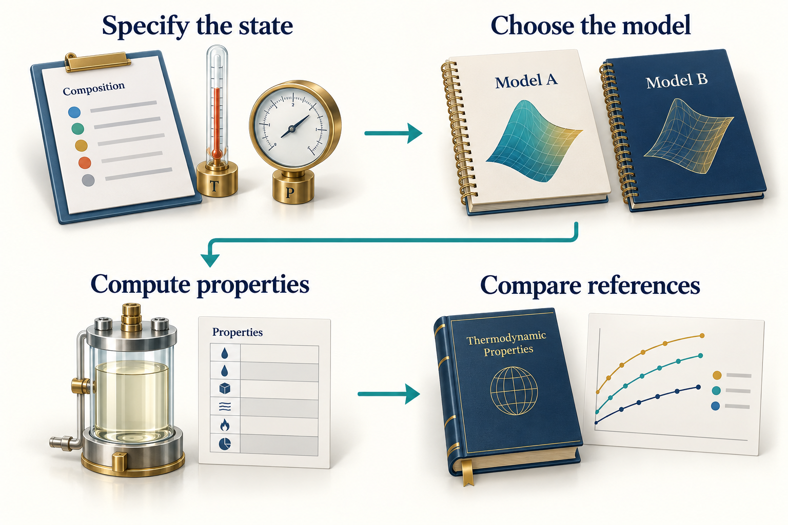
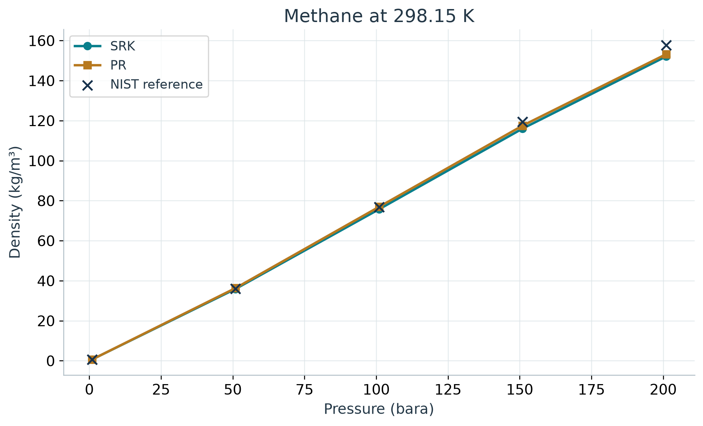
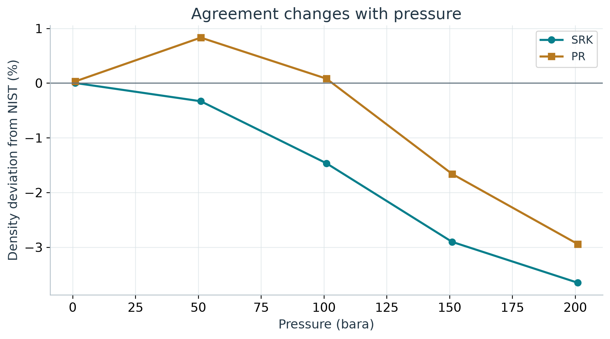

# Thermodynamic Property Calculations

## Learning Objectives

You should be able to construct a property calculation with explicit units, compare EOS predictions with an independent reference, interpret phase information, and avoid common gas-quality and phase-envelope mistakes.


<!-- @neqsim:figure source=notebooks/01_revised_chapter.ipynb cell=5 index_base=0 generator=build_illustrations.py -->
<!-- @imagegen: manifest=../../illustrations/imagegen_manifest_2026-09-13.json asset=property_workbench -->

*Observation.* Figure 9.1 connects the chapter's main ideas. The reference comparison must use the same composition, temperature, pressure, phase meaning and property units as the model. The small decorative curves have no numerical meaning; the specified-state labels and calculated values appear in the actual comparison below.

## 9.1 Start with a controlled comparison

Pure methane at 298.15 K provides a useful first comparison because composition uncertainty is removed. The book calculates density using SRK and PR at 1, 51, 101, 151 and 201 bara. These pressures follow a regular reference-data request; they are not intended to represent a particular plant.

The independent comparison uses NIST Chemistry WebBook thermophysical-property data at the same temperature and pressures. These are reference-model values supplied by NIST, not new experimental measurements made for this book. Preserve that distinction when interpreting the comparison. \cite{nist_webbook}

The executable source is `verify_examples.py`, and the numeric outputs are in `results.json`. The companion notebook reproduces the chapter's tables and figures from those recorded runs. If reference retrieval fails on another machine, retain that failure and do not silently replace the reference with one of the models under comparison.

## 9.2 Construct and execute the calculation

After the Chapter 1 source bootstrap, a single case is:

```python
fluid = jneqsim.thermo.system.SystemSrkEos(298.15, 101.0)
fluid.addComponent("methane", 1.0)
fluid.setMixingRule("classic")
ops = jneqsim.thermodynamicoperations.ThermodynamicOperations(fluid)
ops.TPflash()
fluid.initProperties()
rho = float(fluid.getDensity("kg/m3"))
z_factor = float(fluid.getZ())
print({"density_kg_m3": rho, "compressibility_factor": z_factor})
```

Create a new fluid for each model and state in the comparison. Reusing a mutable object without resetting all relevant conditions can carry state from a previous case. Record model and mixing rule with every result row, even when they seem obvious from the code.

## 9.3 Compare the same quantity at the same state

The relative density deviation is

$$
\delta_\rho = 100\frac{\rho_{model}-\rho_{reference}}{\rho_{reference}}.
$$

It is a percentage deviation from the selected reference. It is not a general uncertainty estimate for the EOS. The comparison covers one component, one temperature, and a limited pressure interval.

<!-- @neqsim:table id=methane_table source=notebooks/01_revised_chapter.ipynb generator=build_illustrations.py results=methane_properties -->
<!-- BEGIN GENERATED METHANE TABLE -->

| Pressure (bara) | NIST (kg/m3) | SRK (kg/m3) | PR (kg/m3) |
|---|---|---|---|
| 1 | 0.6483 | 0.6483 | 0.6485 |
| 51 | 36.0323 | 35.9124 | 36.3315 |
| 101 | 76.8452 | 75.7185 | 76.9069 |
| 151 | 119.4676 | 116.0003 | 117.4841 |
| 201 | 157.7907 | 152.0327 | 153.1489 |

<!-- END GENERATED METHANE TABLE -->
<!-- @neqsim:table-end -->


<!-- @neqsim:figure source=notebooks/01_revised_chapter.ipynb cell=5 index_base=0 generator=build_illustrations.py -->

<!-- BEGIN GENERATED METHANE DISCUSSION -->

*Observation.* At 201 bara in Figure 9.2, NIST gives 157.79 kg/m3; SRK gives 152.03 kg/m3 and PR gives 153.15 kg/m3. Their deviations are -3.65% and -2.94%, respectively. The near-ideal low-pressure agreement therefore does not persist unchanged as density rises. For an application requiring tighter density accuracy, extend the validation over its operating envelope and consider a more suitable model or justified calibration.

<!-- END GENERATED METHANE DISCUSSION -->
<!-- @neqsim:claim
  id: methane_reference_comparison
  test: src/test/java/neqsim/book/industrialagentic2026/BookWorkedExamplesRegressionTest.java
  method: chapter09MethaneDensityMatchesRecordedSrkAndPrStates
  baseline: verification/regression_baseline_2026-09-12.json
  notebook: notebooks/01_revised_chapter.ipynb
  results: results.json#/methane_properties
-->


<!-- @neqsim:figure source=notebooks/01_revised_chapter.ipynb cell=5 index_base=0 generator=build_illustrations.py -->

*Observation.* The deviation plot in Figure 9.3 makes differences visible that may be hard to see on a density plot. A model can reproduce the overall pressure trend while showing a systematic density bias. Select the model and any correction using the application's accuracy requirements and a broader relevant dataset, not the appearance of one smooth curve.

## 9.4 Use physical limits as a separate check

At sufficiently low density, the ideal-gas relationship gives a useful limiting estimate:

$$
\rho = \frac{PM}{RT}.
$$

Use pressure in pascal, molar mass in kg/mol and $R$ in J/(mol K). A factor of one hundred thousand in a density error often points to a bar-to-pascal mistake. At elevated pressure, real-gas effects can be substantial and the ideal-gas equation is not a suitable high-accuracy reference.

The limiting estimate, comparison between EOS models, and NIST comparison answer different questions. Keep them as separate checks in the result record.

## 9.5 Mixtures require phase-aware interpretation

The running gas composition is 0.85 methane, 0.10 ethane and 0.05 propane on a mole-fraction basis. Its phase state can change with pressure and temperature. Before requesting a gas viscosity, confirm that a gas phase exists. Before reporting liquid density, confirm that a liquid phase is present and identify which one.

A phase envelope helps show the boundaries of a mixture's two-phase region. The dew branch relates to the appearance of liquid from gas; the bubble branch relates to the appearance of vapour from liquid. Cricondentherm and cricondenbar describe the maximum temperature and pressure of the two-phase envelope and need not coincide with the critical point.

The source workflow has a known branch-label caveat for `calcPTphaseEnvelope(true, 1.0)`: getter names can be swapped relative to the physical dew and bubble branches. For an ordinary hydrocarbon envelope, the branch reaching the higher maximum temperature contains the cricondentherm and can help identify the dew side. Confirm the topology and physical state rather than applying that heuristic blindly to unusual envelopes.

Do not publish a phase-envelope drawing generated from arbitrary curves as a NeqSim result. This revision uses conceptual diagrams only where they are labelled as such and numerical plots only where their data can be traced to an execution.

## 9.6 Gas quality needs a reference basis

Calorific value and Wobbe index calculations require a complete gas composition and specified reference conditions. Gross and net calorific values differ in the treatment of combustion water. Volumetric values also depend on the reference temperature, pressure and compressibility convention. ISO 6976 provides the calculation framework. \cite{iso6976}

A software accessor can accept a unit string without performing the conversion the caller assumes. Inspect the implementation and returned unit before labelling a value as MJ per standard cubic metre. In particular, a value in kJ/m3 must be divided by one thousand before it is labelled MJ/m3. Record both the volume and combustion reference temperatures.

A calculated gas-quality value does not establish that the gas meets a sales contract. The contract's limits, reference conditions, sampling basis and composition uncertainty are separate inputs. Compare them explicitly rather than treating a method named after a standard as an automatic compliance certificate.

## 9.7 Water and associating components

A hydrocarbon gas with water, methanol or glycol may need a different model and additional interaction data. CPA is one candidate when association matters. Model selection should follow the physical question: water content, inhibitor partitioning, dew point and hydrate equilibrium are related but distinct calculations.

Document whether a composition is dry or wet and whether water is present as vapour, free liquid, or an imposed saturation condition. Adding a small water amount changes the normalised overall composition; it does not automatically create a specified aqueous phase or reproduce a measured water content.

Chapter 11 introduces an explicit wet-gas teaching variant and explains why a hydrate equilibrium temperature alone cannot establish operating safety.

## 9.8 Report what the calculation establishes

A property report should state the substance or composition, state, model, mixing rule, units, phase interpretation, reference source, comparison range and limitations. Where a result will influence equipment sizing or a contractual decision, identify the required accuracy and the relevant uncertainty.

For the methane example, the supported conclusion is limited to the observed agreement at the evaluated states. It does not validate an entire natural-gas process model, a wet-gas hydrate prediction, or petroleum-fluid characterisation.

## Exercises

1. Repeat the methane comparison at another temperature and explain whether the original conclusion still applies.
2. Calculate the low-pressure ideal-gas estimate with coherent SI units and compare it with the EOS result.
3. Describe the additional evidence needed to extend a pure-methane validation to the running gas mixture.
4. Write a gas-quality output header that fully specifies energy and volume reference conditions.
5. Explain how an incorrectly labelled phase-envelope branch could affect a dew-point assessment.
