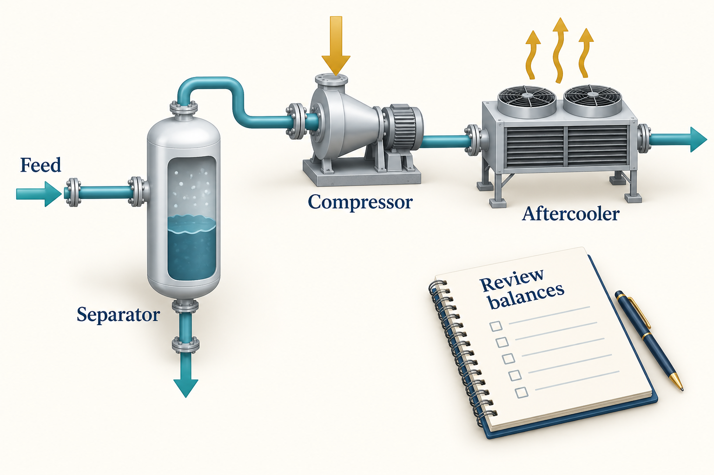
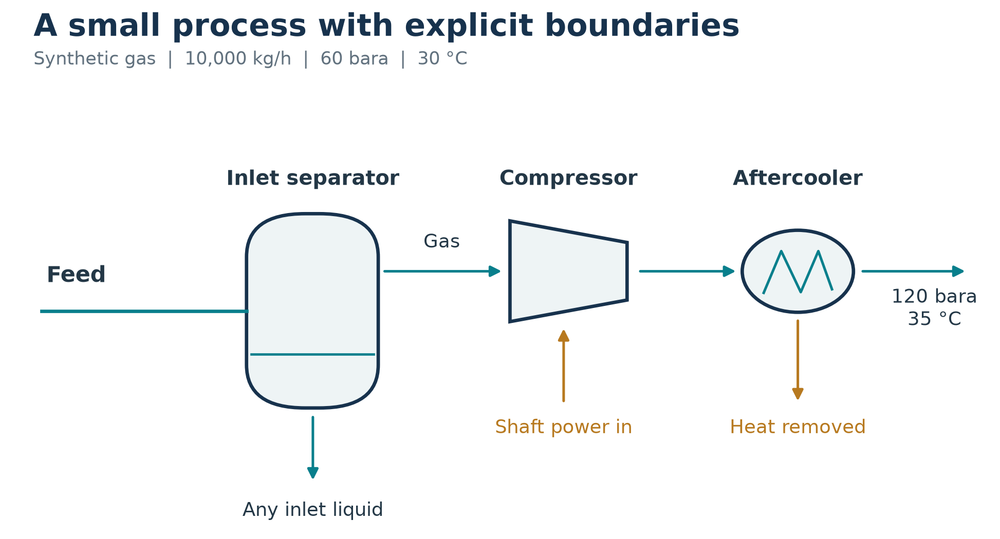
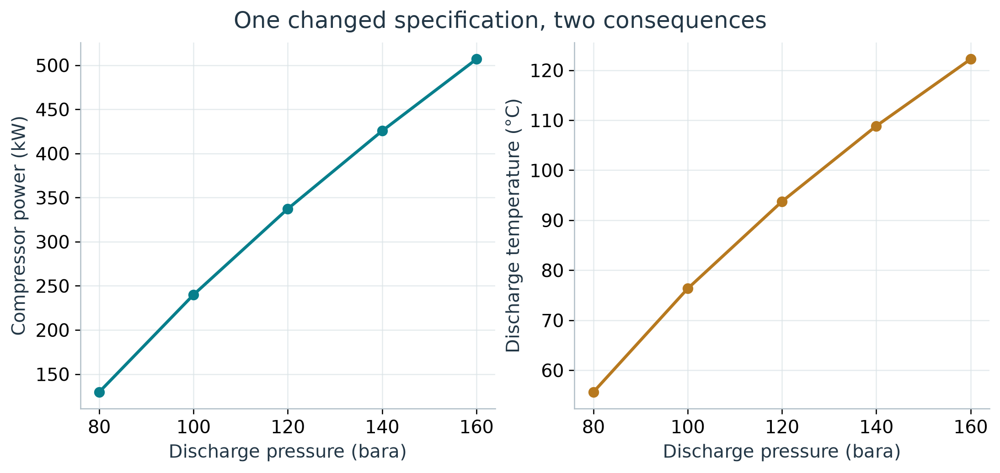
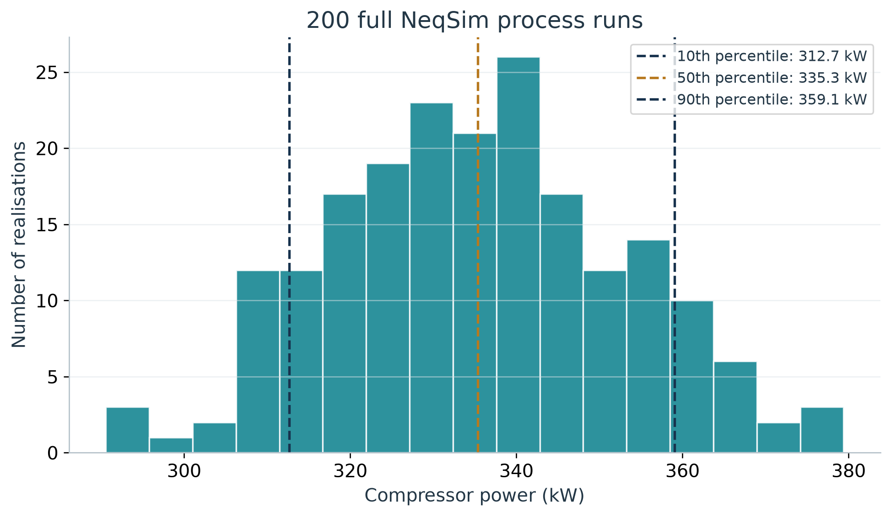

# Process Simulation and Equipment Design

## Learning Objectives

You should be able to construct the running gas process, specify a compressor calculation explicitly, check its outputs, interpret sensitivity and uncertainty, and distinguish process prediction from equipment qualification.


<!-- @neqsim:figure source=notebooks/01_revised_chapter.ipynb cell=6 index_base=0 generator=build_illustrations.py -->
<!-- @imagegen: manifest=../../illustrations/imagegen_manifest_2026-09-13.json asset=process_workspace -->

*Observation.* Figure 10.1 connects the chapter's main ideas. The bottom separator outlet and the energy arrows draw attention to the control-volume boundary. The depicted liquid is illustrative and does not predict a liquid inventory for the dry-gas case. The exact model schematic and balance table below define the calculation.

## 10.1 Define the flowsheet and its purpose

The teaching process contains a feed, an inlet separator, a compressor and an aftercooler. The inlet separator makes the phase boundary explicit before compression. The case estimates operating states and duty for the assumed gas and efficiency; it does not select a real compressor or specify its safe operating window.


<!-- @neqsim:figure source=notebooks/01_revised_chapter.ipynb cell=6 index_base=0 generator=build_illustrations.py -->

*Observation.* Follow both material outlets in Figure 10.2 from the separator when checking mass balance. Follow power into the compressor and heat removed by the cooler when defining the energy boundary. A stream disappearing from the drawing is often a stream missing from the calculation review.

## 10.2 Make the compressor specification explicit

The base case uses 10,000 kg/h at 60 bara and 303.15 K, with the Chapter 1 composition. The target pressure is 120 bara. Polytropic efficiency is assumed to be 0.75, and the aftercooler target is 308.15 K.

```python
Stream = jneqsim.process.equipment.stream.Stream
Separator = jneqsim.process.equipment.separator.Separator
Compressor = jneqsim.process.equipment.compressor.Compressor
Cooler = jneqsim.process.equipment.heatexchanger.Cooler
ProcessSystem = jneqsim.process.processmodel.ProcessSystem

feed = Stream("Feed", fluid)
feed.setFlowRate(10000.0, "kg/hr")
separator = Separator("Inlet separator", feed)
compressor = Compressor("Compressor", separator.getGasOutStream())
compressor.setOutletPressure(120.0, "bara")
compressor.setUsePolytropicCalc(True)
compressor.setPolytropicEfficiency(0.75)
cooler = Cooler("Aftercooler", compressor.getOutletStream())
cooler.setOutTemperature(308.15)

process = ProcessSystem()
for unit in (feed, separator, compressor, cooler):
    process.add(unit)
process.run()
```

This fragment continues from the running-case fluid construction in Chapter 6. Setting an efficiency and selecting the calculation mode are distinct operations; both are explicit here. The full executable case creates a fresh fluid and process for each run.

The model omits a vendor performance map, mechanical losses outside the selected compressor calculation, detailed driver selection, interconnecting pressure losses, anti-surge dynamics and a post-cooler liquid knockout vessel. These omissions define the scope. If the aftercooler produces liquid in a revised case, the downstream design must account for it.

## 10.3 Inspect the base result

<!-- @neqsim:table id=process_table source=notebooks/01_revised_chapter.ipynb generator=build_illustrations.py results=compression_base -->
<!-- BEGIN GENERATED PROCESS TABLE -->

| Output | Calculated value | Unit |
|---|---|---|
| Compressor power | 337.269 | kW |
| Discharge temperature | 93.749 | degrees C |
| Aftercooler temperature | 35.000 | degrees C |
| Aftercooler duty | -494.270 | kW |
| Separator gas flow | 10000.000 | kg/h |
| Separator liquid flow | 0.000 | kg/h |

The separator relative mass-balance residual is 0.00e+00. The numerical liquid outlet is negligible for this case. Values are model predictions for the declared synthetic basis.

<!-- END GENERATED PROCESS TABLE -->
<!-- @neqsim:table-end -->
<!-- @neqsim:claim
  id: compression_base
  test: src/test/java/neqsim/book/industrialagentic2026/BookWorkedExamplesRegressionTest.java
  method: chapter10CompressionBaseAndPressureSweepMatchRecordedOutputs
  baseline: verification/regression_baseline_2026-09-12.json
  notebook: notebooks/01_revised_chapter.ipynb
  results: results.json#/compression_base
-->

Read the temperature and duty together. For a steady boundary around the complete train, neglecting kinetic and potential energy changes, heat and work entering the process are positive:

$$
\sum_{out} \dot m h - \sum_{in} \dot m h = \dot Q_{in} + \dot W_{in}.
$$

The material outlets are the aftercooler stream and the separator liquid stream. The verification computes each enthalpy rate as mass flow in kg/s times specific enthalpy in kJ/kg.

<!-- BEGIN GENERATED ENERGY BALANCE -->

The inlet enthalpy rate is -32.521 kW; the cooled outlet carries -189.522 kW and the separate liquid outlet carries 0.000 kW on the same enthalpy reference. Thus the material-stream enthalpy change is -157.001 kW. Work into the process is +337.269 kW and heat into it is -494.270 kW. The unrounded balance residual is -5.68e-14 kW.

<!-- END GENERATED ENERGY BALANCE -->

The cooling duty magnitude exceeds compressor power even though the final gas is 5 K warmer than the feed. For a dense real gas, enthalpy depends on pressure as well as temperature. The residual enthalpy change between 60 and 120 bara outweighs the sensible increase in this model. A constant-heat-capacity temperature comparison would miss that contribution. Absolute enthalpy values depend on the reference convention; the balance uses the same reference throughout. Closure checks the calculation's consistency, while independent data are still needed to assess its accuracy.

The separator mass-balance check compares feed mass flow with the sum of its gas and liquid outlets. It is a numerical consistency check. It does not validate carry-over, droplet capture, internals, or level control.

## 10.4 Build a physical estimate before trusting the result

For an ideal gas with constant heat-capacity ratio $k$, an isentropic temperature estimate is

$$
\frac{T_{2s}}{T_1} = \left(\frac{P_2}{P_1}\right)^{(k-1)/k}.
$$

Take $k=1.30$ as an illustrative constant, with $T_1=303.15$ K and $P_2/P_1=2$. Then $T_{2s}=303.15\times2^{0.30/1.30}=355.73$ K, or 82.58 degrees C. This estimates a temperature rise of about 53 K, compared with about 64 K in the calculated real-gas case. The assumed $k$ is a teaching input, not a fitted property of this mixture.

This estimate establishes the direction and scale of temperature change. The ideal-gas isentropic path and the selected real-gas polytropic calculation have different assumptions; their difference cannot be used as an independent accuracy benchmark. Real-gas properties, efficiency definitions, heat transfer and condensation can alter the result. \cite{smith2005}

At a fixed state path and efficiency, duty should scale approximately with mass flow. Increasing the required pressure ratio normally raises duty and discharge temperature. A contrary trend deserves investigation before it is presented as an optimisation result.

## 10.5 Change one input and re-run

The book varies discharge pressure from 80 to 160 bara with the other base inputs fixed.


<!-- @neqsim:figure source=notebooks/01_revised_chapter.ipynb cell=6 index_base=0 generator=build_illustrations.py -->

<!-- BEGIN GENERATED PROCESS DISCUSSION -->

*Observation.* In Figure 10.3, increasing discharge pressure from 80 to 160 bara raises calculated duty from 129.6 to 506.8 kW and discharge temperature from 55.6 to 122.2 degrees C. The greater pressure ratio requires more work and raises the gas temperature. Check driver and temperature constraints before accepting a higher-pressure case; obtain vendor-map evidence before claiming an operating margin.

<!-- END GENERATED PROCESS DISCUSSION -->
<!-- @neqsim:claim
  id: compression_sensitivity
  test: src/test/java/neqsim/book/industrialagentic2026/BookWorkedExamplesRegressionTest.java
  method: chapter10CompressionBaseAndPressureSweepMatchRecordedOutputs
  baseline: verification/regression_baseline_2026-09-12.json
  notebook: notebooks/01_revised_chapter.ipynb
  results: results.json#/compression_sensitivity
-->

The comparison describes this selected operating model. It does not prove that a particular machine can reach all points. A real operating envelope also depends on speed, head, flow, power, discharge-temperature limits and vendor-defined margins.

Once the process exists, the automation facade can change an input using its address:

```python
auto = process.getAutomation()
auto.getVariableList("Compressor")
auto.setVariableValue("Compressor.outletPressure", 130.0, "bara")
process.run()
new_pressure = auto.getVariableValue(
    "Compressor.outletPressure", "bara"
)
```

The verification script checks a 120-to-130 bara change and preserves its result. Discovering a writable variable and applying the change do not establish that the new condition is acceptable.

## 10.6 Multi-stage compression is a different study

For idealised equal-efficiency stages with perfect intercooling and negligible interstage pressure losses, equal pressure ratios provide a useful initial allocation. For $N$ stages,

$$
r_{stage} = \left(\frac{P_{out}}{P_{in}}\right)^{1/N}.
$$

Real trains can depart from this allocation because of gas-property changes, cooling limits, liquid removal, pressure losses, machine maps and driver constraints. Include interstage separators where phase behaviour requires them and carry their liquid outlets into the material balance.

The running case uses mass flow throughout. If adapting a field-volume specification, establish the standard pressure, standard temperature, and dry or wet basis before converting the flow rate. Similar-looking standard-volume units can differ by orders of magnitude.

## 10.7 Uncertainty with full process runs

The teaching uncertainty calculation samples mass flow from a triangular distribution with low/base/high values of 9,000/10,000/11,000 kg/h and efficiency from 0.70/0.75/0.80. These are illustrative ranges, not measured distributions. They are sampled independently with a fixed random seed.

Every draw creates and runs the NeqSim process. The code collects failures explicitly and reports the number completed. No language-model call is required inside the loop.


<!-- @neqsim:figure source=notebooks/01_revised_chapter.ipynb cell=6 index_base=0 generator=build_illustrations.py -->

<!-- BEGIN GENERATED UNCERTAINTY DISCUSSION -->

*Observation.* In the results plotted in Figure 10.4, all 200 requested cases completed. The non-exceedance 10th, 50th and 90th percentiles are 312.7, 335.3 and 359.1 kW. Higher flow and lower efficiency increase the required duty, broadening the distribution around the base result. Use this as a demonstration of uncertainty propagation, then replace the teaching ranges with justified application data and check statistical convergence.

<!-- END GENERATED UNCERTAINTY DISCUSSION -->
<!-- @neqsim:claim
  id: compression_uncertainty
  baseline: verification/regression_baseline_2026-09-12.json
  notebook: notebooks/01_revised_chapter.ipynb
  results: results.json#/uncertainty
-->

The distribution describes only the included input assumptions. It omits composition uncertainty, model discrepancy, vendor-map uncertainty and input correlation. A fixed seed supports repeatability; it does not establish that the distributions represent a real installation. Repeat with larger sample sizes before relying on tail estimates.

## 10.8 Process calculations and mechanical design

A process model supplies flow rates, phase properties, duties and operating cases. Mechanical design also requires design pressure and temperature, materials, geometry, loads, corrosion allowance, applicable editions of design documents, and equipment-specific criteria.

For separators, physical dimensions and internals are configured through `SeparatorMechanicalDesign`. Gas-load factor, retention time, inlet devices, demister type and drainage assumptions affect the design model. A thermodynamic phase split alone does not establish separation performance.

The current source includes more explicit entrainment and carry-over models. Select a model appropriate to the available data and preserve its provenance. A tuning parameter or empirical constraint should not be described as a universal physical limit.

## 10.9 Preserve identity and revisions

Stable equipment names and connection metadata support review and later information exchange. Save the process state with a revision identifier and preserve the accepted basis, runtime record, and external data alongside it.

DEXPI export can transfer selected plant or process information. Choose the exchange profile for the receiving purpose and retain conformance evidence. A file that passes internal schema checks still needs qualification in the named recipient tool and accountable engineering review. Chapter 12 develops this route to industrial handover.

## Exercises

1. Add a declared pressure loss between the separator and compressor, then explain the effect on duty.
2. Repeat the sensitivity calculation at another efficiency and compare the trends.
3. Identify the additional inputs needed to turn the teaching calculation into a vendor compressor selection.
4. Extend the material balance to a case with liquid leaving an interstage separator.
5. Explain why the Monte Carlo distribution is conditional on its assumed inputs.
