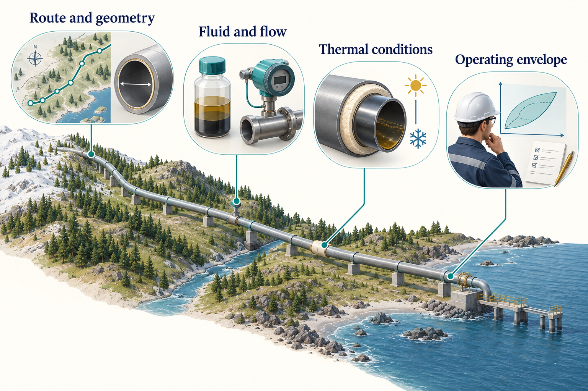
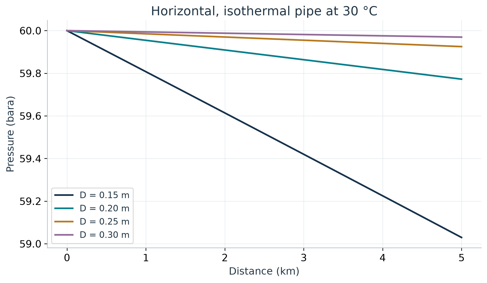
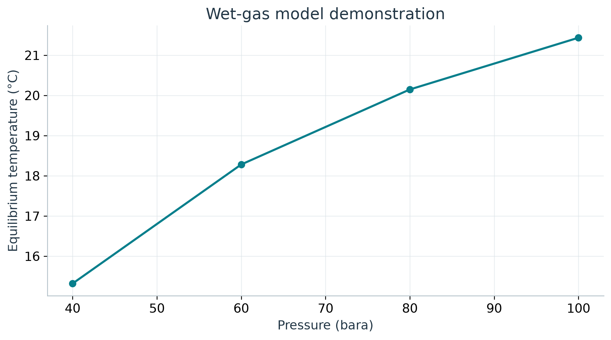

# Flow Assurance and Pipeline Studies

## Learning Objectives

You should be able to define a hydraulic case, separate thermal and hydraulic assumptions, inspect numerical refinement, and explain why hydrate equilibrium is only one part of flow-assurance assessment.


<!-- @neqsim:figure source=notebooks/01_revised_chapter.ipynb cell=5 index_base=0 generator=build_illustrations.py -->
<!-- @imagegen: manifest=../../illustrations/imagegen_manifest_2026-09-13.json asset=pipeline_workspace -->

*Observation.* Figure 11.1 connects the chapter's main ideas. These input groups determine which questions a model can answer. The illustrated coastal route, insulation and envelope are conceptual. The numerical example below is deliberately horizontal and isothermal, so its pressure results do not predict cooldown or arrival temperature.

## 11.1 Specify the route and operating case

A pipeline model needs more than length and diameter. Establish the inlet state, composition, mass or volumetric flow basis, internal diameter, roughness, elevation profile, thermal boundary conditions and downstream constraints. Different combinations can produce similar outlet pressure while representing different physical systems.

The book begins with a deliberately simple case: the dry synthetic gas at 60 bara and 303.15 K, flowing at 10,000 kg/h through a horizontal 5,000 m pipe. Roughness is assumed to be 0.00001 m. Temperature is held constant to isolate the hydraulic comparison. The internal diameter is varied from 0.15 to 0.30 m.

This is a teaching calculation, not a design basis for a subsea line. In particular, an isothermal model cannot predict arrival temperature, cooldown time or insulation performance.

## 11.2 Understand the pressure balance

Pressure change along a pipe reflects friction, elevation and acceleration. For a horizontal, nearly constant-density single-phase estimate, Darcy-Weisbach gives

$$
\Delta P_f = f_D\frac{L}{D}\frac{\rho u^2}{2},
$$
<!-- @neqsim:eq method=neqsim.process.equipment.pipeline.PipeBeggsAndBrills#calcFrictionPressureLoss -->

where $f_D$ is the Darcy friction factor, $L$ is length, $D$ is internal diameter, $\rho$ is density and $u$ is mean velocity. Gas density varies with pressure, so a segmented real-gas calculation is more appropriate as pressure change grows. Do not confuse Darcy and Fanning friction-factor definitions.

Beggs-Brill-type methods address multiphase pressure-drop and holdup relationships using empirical flow-regime correlations. Their applicability should be assessed for the actual geometry, fluid, operating range and flow behaviour. A steady-state result does not establish transient slug behaviour. \cite{beggs1973}

## 11.3 Run a pipe model with explicit thermal mode

The source-snapshot API supports named heat-transfer modes. This pipe case starts with a fresh dry fluid at the original 60 bara and 303.15 K basis. It is a separate study from the compression train and does not take the compressor outlet as its inlet:

```python
fluid = jneqsim.thermo.system.SystemSrkEos(303.15, 60.0)
for component, fraction in (("methane", 0.85), ("ethane", 0.10), ("propane", 0.05)):
    fluid.addComponent(component, fraction)
fluid.setMixingRule("classic")
Pipe = jneqsim.process.equipment.pipeline.PipeBeggsAndBrills
feed = jneqsim.process.equipment.stream.Stream("Pipe feed", fluid)
feed.setFlowRate(10000.0, "kg/hr")
pipe = Pipe("Teaching pipe", feed)
pipe.setLength(5000.0)
pipe.setDiameter(0.20)
pipe.setElevation(0.0)
pipe.setPipeWallRoughness(1e-5)
pipe.setNumberOfIncrements(20)
pipe.setHeatTransferMode(Pipe.HeatTransferMode.ISOTHERMAL)

process = jneqsim.process.processmodel.ProcessSystem()
process.add(feed)
process.add(pipe)
process.run()
outlet_pressure = pipe.getOutletStream().getPressure("bara")
```

Lengths, diameter, elevation and roughness are in metres. A value such as 5.0 passed to `setLength` means five metres, not five kilometres. Use the explicit thermal mode instead of relying on a default whose interpretation may change between model versions.

For a non-isothermal case, specify the intended boundary: adiabatic, an overall heat-transfer coefficient, or a detailed resistance model where supported. Record ambient conditions and the basis for every thermal parameter.

## 11.4 Interpret the diameter sensitivity

<!-- @neqsim:table id=pipe_table source=notebooks/01_revised_chapter.ipynb generator=build_illustrations.py results=pipeline_sensitivity -->
<!-- BEGIN GENERATED PIPE TABLE -->

| Internal diameter (m) | Outlet pressure (bara) | Pressure drop (bar) |
|---|---|---|
| 0.15 | 59.0295 | 0.9705 |
| 0.20 | 59.7723 | 0.2277 |
| 0.25 | 59.9249 | 0.0751 |
| 0.30 | 59.9695 | 0.0305 |

<!-- END GENERATED PIPE TABLE -->
<!-- @neqsim:table-end -->


<!-- @neqsim:figure source=notebooks/01_revised_chapter.ipynb cell=5 index_base=0 generator=build_illustrations.py -->

<!-- BEGIN GENERATED PIPE DISCUSSION -->

*Observation.* In Figure 11.2, increasing internal diameter from 0.15 to 0.30 m reduces the calculated pressure drop from 0.9705 to 0.0305 bar in this case. A larger flow area lowers velocity and frictional loss. The small losses also explain why the profiles are nearly linear. Use these results to understand hydraulic sensitivity, then introduce the actual route, thermal conditions and design constraints before selecting a diameter.

<!-- END GENERATED PIPE DISCUSSION -->
<!-- @neqsim:claim
  id: pipe_diameter_sensitivity
  test: src/test/java/neqsim/book/industrialagentic2026/BookWorkedExamplesRegressionTest.java
  method: chapter11IsothermalPipeMatchesRecordedPressureDrop
  baseline: verification/regression_baseline_2026-09-12.json
  notebook: notebooks/01_revised_chapter.ipynb
  results: results.json#/pipeline_sensitivity
-->

A lower pressure drop is one consideration in choosing diameter. Material cost, installation, turndown, liquid transport, pigging, erosion, vibration and mechanical requirements can favour a different choice. A hydraulic plot does not establish an optimum without the objective and constraints.

## 11.5 Check numerical refinement

The verification script repeats the 0.20 m case with 10, 20 and 40 increments. Compare the result as the discretisation is refined. A small change supports numerical consistency for this case, while a large change suggests further investigation.

<!-- @neqsim:table id=refinement_table source=notebooks/01_revised_chapter.ipynb generator=build_illustrations.py results=pipeline_refinement -->
<!-- BEGIN GENERATED REFINEMENT TABLE -->

| Increments | Pressure drop (bar) | Outlet temperature (degrees C) |
|---|---|---|
| 10 | 0.2277058 | 30.00 |
| 20 | 0.2277302 | 30.00 |
| 40 | 0.2277424 | 30.00 |

<!-- END GENERATED REFINEMENT TABLE -->
<!-- @neqsim:table-end -->
<!-- @neqsim:claim
  id: pipe_refinement
  baseline: verification/regression_baseline_2026-09-12.json
  notebook: notebooks/01_revised_chapter.ipynb
  results: results.json#/pipeline_refinement
-->

Grid refinement is not independent validation of the pressure-drop model. It addresses numerical sensitivity to the chosen segmentation. Experimental or field data with suitable uncertainty and operating-state information are needed to assess physical performance.

## 11.6 Introduce water explicitly

The dry-gas basis contains no water. The hydrate teaching variant adds 0.01 mol of water per 1.00 mol of the dry mixture, then applies the mixing rule after all components have been added. Its normalised water fraction is therefore approximately 0.00990. This is a declared synthetic input, not a measured water content or an inhibitor concentration.

```python
wet = jneqsim.thermo.system.SystemSrkEos(283.15, 60.0)
for name, amount in [
    ("methane", 0.85), ("ethane", 0.10),
    ("propane", 0.05), ("water", 0.01)
]:
    wet.addComponent(name, amount)
wet.setMixingRule("classic")
wet.setHydrateCheck(True)
ops = jneqsim.thermodynamicoperations.ThermodynamicOperations(wet)
ops.hydrateFormationTemperature()
```

This example demonstrates the available equilibrium operation. It does not establish that SRK with this water basis is the appropriate validated model for a real inhibitor system. For water/glycol/methanol partitioning, select and validate a suitable association model and mixture parameters.

## 11.7 Interpret a hydrate boundary

Hydrate formation depends on pressure, temperature, gas composition, water availability and inhibitor effects. An equilibrium boundary identifies where hydrate can be thermodynamically stable under the selected model. Formation rate, nucleation, transport, deposition and plugging require additional information and often different models. \cite{sloan2008}

<!-- @neqsim:table id=hydrate_table source=notebooks/01_revised_chapter.ipynb generator=build_illustrations.py results=hydrate_screening -->
<!-- BEGIN GENERATED HYDRATE TABLE -->

| Pressure (bara) | Calculated equilibrium temperature (degrees C) |
|---|---|
| 40 | 15.32 |
| 60 | 18.28 |
| 80 | 20.15 |
| 100 | 21.43 |

<!-- END GENERATED HYDRATE TABLE -->
<!-- @neqsim:table-end -->


<!-- @neqsim:figure source=notebooks/01_revised_chapter.ipynb cell=5 index_base=0 generator=build_illustrations.py -->

<!-- BEGIN GENERATED HYDRATE DISCUSSION -->

*Observation.* The calculated boundary in Figure 11.3 rises from 15.32 degrees C at 40 bara to 21.43 degrees C at 100 bara. This is consistent with pressure favouring hydrate stability over the selected range. The engineering implication is that a pressure change can alter the required thermal or inhibition strategy. Validate the selected wet-fluid model and establish water and inhibitor conditions before applying an operating-margin policy; this curve has not been independently validated.

<!-- END GENERATED HYDRATE DISCUSSION -->
<!-- @neqsim:claim
  id: hydrate_screening
  test: src/test/java/neqsim/book/industrialagentic2026/BookWorkedExamplesRegressionTest.java
  method: chapter11WetGasHydrateDemonstrationMatchesRecordedTemperature
  baseline: verification/regression_baseline_2026-09-12.json
  notebook: notebooks/01_revised_chapter.ipynb
  results: results.json#/hydrate_screening
-->

If defining subcooling as $T_{hydrate}-T_{fluid}$, positive values indicate that the fluid is below the predicted equilibrium temperature. Other margin conventions reverse the sign. State the equation and sign rather than relying on the word margin.

A safe operating recommendation also needs the approved margin policy, operating transients, inhibitor availability and distribution, water production, restart procedure, measurement uncertainty and model validation. An equilibrium temperature alone cannot certify a pipeline as safe.

## 11.8 Extend the model by adding evidence

For a real route, use surveyed geometry or reviewed engineering data. `PipingRouteBuilder` can help construct serial pipe models from structured route inputs, but the route still needs origin, revision, unit checks and a review of missing segments.

For a subsea thermal study, preserve water depth, ambient temperature, insulation, burial or exposure assumptions, and time-dependent operating cases. For shutdown and restart, use transient methods suited to the physical problem. Do not infer cooldown from an isothermal steady-state pressure profile.

Wax, asphaltenes, corrosion, erosion, water hammer and flow-induced vibration have different input and validation requirements. A broad flow-assurance agent should route these questions to the relevant methods rather than treating them as extra outputs of one pipe calculation.

## 11.9 Keep hydraulic and mechanical conclusions distinct

A satisfactory arrival pressure does not establish wall thickness, collapse resistance, fatigue performance or material suitability. A mechanical design must use the applicable project code edition, design cases and loads. When comparing requirements, use the actual project documents; do not assume that a remembered standard designation or year is current.

The appropriate deliverable may be a screening conclusion with a list of required detailed checks. That is useful engineering work when its scope is clear.

## Exercises

1. Add an elevation change to the teaching pipe and compare its effect with friction.
2. Explain why the isothermal model cannot support an arrival-temperature recommendation.
3. Repeat the refinement study for a smaller diameter or higher flow. Decide whether additional increments are needed.
4. Specify the additional evidence needed to turn the hydrate demonstration into an operating-margin study.
5. Design a route-data handoff that preserves segment units, origin and uncertainty.
