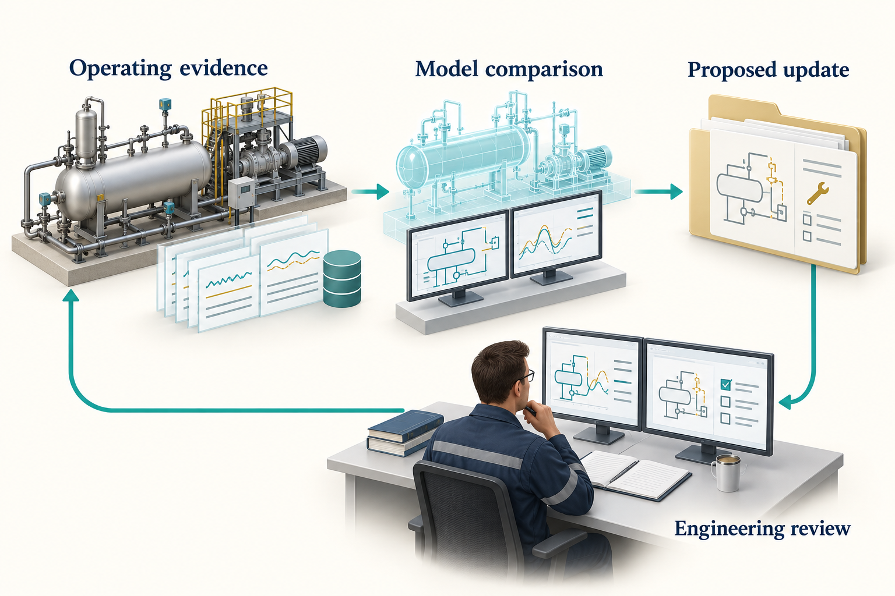
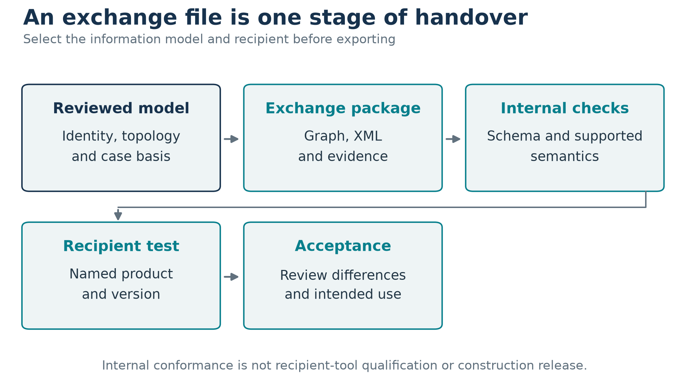

# From Teaching Cases to Industrial Studies

## Learning Objectives

You should be able to plan the transition from a synthetic example to an asset study, identify the evidence needed for a digital-twin workflow, and distinguish information exchange from engineering acceptance.

## 12.1 Change the evidence before changing the claim

The worked examples demonstrate software use and calculation checks. An industrial study adds measured or approved data, application-specific validation, controlled assumptions, and accountable review. Replacing a generic equipment name with a field name does not perform that transition.

The industrial study patterns in this chapter apply to offshore and onshore facilities, including Norwegian Continental Shelf applications. Applying them to an operating asset requires its reviewed data and acceptance criteria. The teaching model demonstrates the method without representing a named installation or an approved project.

A field case can be added when its evidence and publication permission are available. Preserve the document revision, operating period, data quality, model basis, validation and review status. If some material cannot be published, explain the resulting reproducibility limit.

Start by resolving where the study and its evidence belong. NeqSim can create studies under a configured task root and search an optional document root. The document library may hold reference material used across many studies; each active study should preserve the selected files and their provenance in its own reference folders. This keeps a later change to the library from silently changing the evidence behind an issued result. \cite{neqsim_task_paths_20260913}

## 12.2 A gas-compression performance study

An operating compressor study begins with more data than the Chapter 10 example. Gather composition, suction and discharge conditions, flow basis, speed, driver information, cooling conditions, recycle state, instrumentation uncertainty and the relevant vendor curves. Align measurement timestamps and identify stable operating periods.

A process specialist can build the flowsheet. A plant-data specialist can prepare the measurement dataset. A rotating-equipment reviewer can assess the machine representation and operating constraints. Their handoffs should preserve units, tag identities and the basis revision.

The comparison should distinguish shaft power, driver input power and electrical consumption. It should also identify whether the reported flow is net export, compressor inlet, or includes recycle. A discrepancy can arise from measurement basis rather than thermodynamic performance.

A useful result explains which differences the model can account for, what remains unresolved, and what data would discriminate between competing explanations. Tuning efficiency until one power value matches is insufficient evidence that the rest of the operating envelope is represented correctly.

## 12.3 A separator capacity study

A separator study may combine equilibrium phase rates with geometry, inlet conditions, internals, liquid properties, entrainment assumptions and operating levels. The process model supplies the fluid states and loads. The mechanical and performance models assess the selected equipment representation.

Keep the source of each constraint visible. A vendor-rated capacity, empirical carry-over relationship, company design rule and calculated physical limit are different kinds of evidence. The current NeqSim source provides more explicit ways to represent constraints and entrainment models, but their parameters still require justification.

Evaluate the relevant cases, including turndown and changed fluid composition where they matter. A vessel that passes one gas-load calculation can still have liquid-handling or drainage limitations. A thermodynamic separator's mass balance cannot validate those mechanisms.

## 12.4 A reservoir-to-facility study

A development or production study links resource assumptions, wells, a gathering network, processing capacity, export conditions and economics. Each link needs a compatible basis. Resource volume, composition, pressure, deliverability and facility constraints should not come from unrelated cases without a documented reconciliation.

NeqSim includes reservoir, well, pipeline and process components that can support integrated screening. The selected model's level of detail must match the decision. A simplified reservoir representation is not a replacement for a calibrated reservoir simulator when spatial behaviour or complex recovery mechanisms dominate.

Include resource uncertainty explicitly and report the percentile convention. Track GIP or STOIIP, recovery and total production separately. An economic-only parameter can reuse a technical profile only when it does not change the operating or investment decision within the model.

The agent's contribution is to maintain the chain of assumptions and evidence across disciplines. It should not make a screening model look more mature by generating a longer report.

## 12.5 Build a digital-twin loop in stages

A process model becomes part of a digital-twin workflow when it is connected to a physical system's data, identity, revision history and intended decisions. Begin with read-only comparison before considering more consequential actions.

<!-- @neqsim:figure source=notebooks/01_revised_chapter.ipynb cell=2 index_base=0 generator=build_illustrations.py -->
<!-- @imagegen: manifest=../../illustrations/imagegen_manifest_2026-09-13.json asset=digital_twin_loop -->

*Observation.* Figure 12.1 connects the chapter's main ideas. A discrepancy is investigated before a model revision is accepted. Check sensor quality, operating regime and competing physical causes; a smaller residual alone can conceal a wrong explanation. The return path represents controlled learning, not automatic actuation of a plant.

Online estimation and calibration classes in the source support parts of this workflow. Their existence does not make an unattended closed-loop system ready for an asset. Qualification depends on failure behaviour, uncertainty, change control and the consequences of the proposed action.

Useful initial applications include advisory performance monitoring and structured investigation of deviations. A model-generated recommendation should identify the supporting evidence and the person or process responsible for accepting it.

## 12.6 From a drawing to a model

A piping and instrumentation diagram (P&ID) can provide equipment tags, connectivity, nozzles and instrumentation. It usually does not contain enough information to run a complete process simulation. Composition, operating conditions, efficiencies, heat-transfer assumptions, control tuning and design-case definitions still need to be supplied.

Drawing extraction should preserve uncertainty. An optical character recognition (OCR) interpretation of a line number or valve symbol is a candidate observation, not an approved connection. Require a review of ambiguous tags, off-page references, equipment boundaries and missing segments.

The community `technical-document-intelligence-agent` makes this an explicit workflow. It inventories mixed document collections, chooses native extraction where useful, uses OCR for scanned or low-yield material, and calls for visual interpretation where layout, drawings or charts carry meaning. Its evidence records retain the source file, page or locator, original content, extraction method, units and review status. Conflicting observations remain visible for a downstream engineer to reconcile. The agent definition describes this work; extraction libraries, OCR and vision services must still be available in the execution environment. \cite{community_document_agent_20260913}

Finding a document is a separate step from interpreting it. `neqsim documents "compressor"` searches names and relative paths below the configured document root; it is not a full-text technical search or an automatic extraction run. The generated study configuration can record that root under `inputs.document_root`. Use the library as a read-only source and copy documents actually used into the study's per-source reference folders. Record the original location, revision and hash so an extracted pressure or tag can be traced back to its evidence. \cite{neqsim_task_paths_20260913}

The current DEXPI workflow distinguishes different exchange purposes. A Plant model represents plant and instrumentation information; a Process model represents process steps, ports, streams and state quantities. Proteus-compatible and pyDEXPI-oriented paths support their own compatibility needs. Select the representation explicitly.

## 12.7 Qualify the handover

The canonical engineering graph and `EngineeringDeliverableCompiler` can connect model identity, cases, calculations, registers and exchange files. This is valuable because a changed basis can affect multiple deliverables at once. It also makes stale evidence easier to identify.

<!-- @neqsim:figure source=notebooks/01_revised_chapter.ipynb cell=2 index_base=0 generator=build_illustrations.py -->

*Observation.* The internal checks in Figure 12.2 can establish schema validity, supported semantic mappings, identity consistency and structural round trips. They do not establish that a named commercial tool preserves all required information. Perform the recipient-tool import and export test with the actual product and version, then review the differences.

A DEXPI file, an information-handover package and a construction release serve different purposes. Generated safety-function attributes are configuration evidence; they do not establish safety integrity level (SIL) verification or permission to claim safeguard credit. The [DEXPI engineering guide](https://equinor.github.io/neqsim/engineering/dexpi-guide.html) states these qualification boundaries. \cite{dexpi_guide}

The report template is another part of the handover contract. NeqSim supports a selected Word report template through a command option, environment setting or saved default; a configured missing template should produce an error. Record which template and generator produced the issued report. Styling can preserve an organisation's familiar presentation, but approval status must come from the review record. A well-formatted report does not close unresolved assumptions or recipient-tool qualification. \cite{neqsim_report_template_20260913}

## 12.8 Organise an industrial pilot around a decision

Select a bounded use case with available data and a clear reviewer. Define the baseline workflow, expected outputs, validation cases, acceptable error, access limits and stopping conditions. Then compare the agent-assisted process with the baseline on the same task set.

| Pilot question | Evidence to retain |
|---|---|
| Did the workflow preserve the basis? | Input revisions and change records |
| Did calculations answer the question? | Model, cases and review findings |
| Were errors detected and reported? | Failed cases and recovery records |
| Was the result reproducible? | Runtime, source and data manifests |
| Was total effort reduced? | Comparable task timing and rework |
| Were information boundaries respected? | Access configuration and export review |

Avoid measuring only time to a first draft. Include the engineer's review effort and the work required to correct plausible errors. A narrow successful pilot is a better basis for expansion than a broad demonstration with unclear evidence.

## 12.9 Feed learning back into the repositories

An industrial pilot often reveals reusable improvements: a missing unit check, an unclear agent handoff, a stale API example, or a better result schema. Make public improvements plant-independent. Keep company policy and confidential details in enterprise content.

A change should include enough verification to show that it addresses the observed problem. Update the relevant skill and agent dependency or handoff if required. This creates a maintained engineering practice rather than a growing collection of one-off prompts.

## Exercises

1. List the evidence needed to convert the Chapter 10 example into an operating-compressor study.
2. Design a read-only digital-twin pilot with a clear decision and failure policy.
3. Explain how calibration could hide a sensor error and propose a check against that failure.
4. Define an acceptance test for importing a DEXPI exchange into a named recipient tool.
5. Separate the public and private outputs from a pilot that discovers a reusable API defect.
