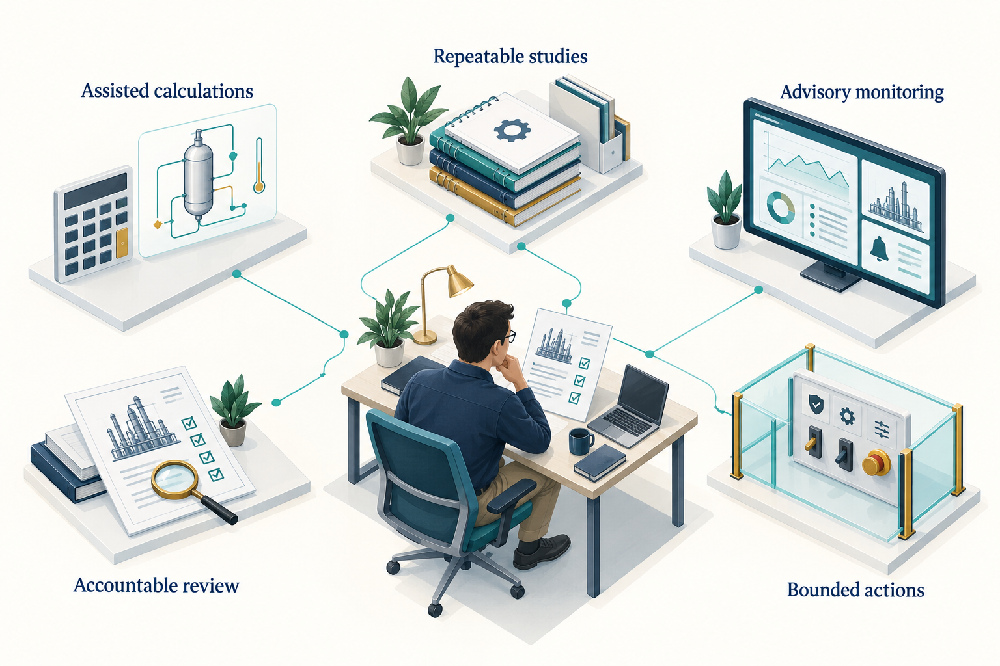

# The Future of Agentic Engineering

## Learning Objectives

You should be able to separate current capabilities from proposed developments, identify the evidence needed for greater autonomy, and plan improvements that increase engineering value without hiding uncertainty.

## 13.1 Begin with what is already observable

The preceding chapters show a practical foundation: an agent can use explicit skills and tools to prepare and execute NeqSim calculations, inspect outputs, preserve evidence, and help assemble a reviewable study. Current source interfaces support automation, saved state, engineering information exchange, and parts of calibration and supervision.

This foundation does not establish that general autonomous engineering is solved. The difficult questions concern incomplete data, model validity, conflicting requirements, long-running work, reliable handoffs and the consequences of an incorrect action. Progress should be measured against those questions.

The directions in this chapter are an engineering outlook as of September 2026. They are proposals and reasoned expectations, not a product roadmap or a timetable promised by the NeqSim maintainers. No percentage of a future vision is claimed to be complete.

The public community repository already provides a useful organisational foundation: discoverable workflow packages, declared skill dependencies and coordinator manifests. For example, a flow-assurance coordinator names the specialists needed to assemble a study. This makes the intended cooperation inspectable. Reliable execution of every handoff, compatibility across changing tools and successful industrial qualification must still be demonstrated for the chosen deployment. \cite{community_agent_catalog_20260913,community_flow_study_20260913}

## 13.2 From generated answers to maintained engineering records

A promising direction is to make the engineering record the central object of the workflow. The record would connect the accepted basis, component data, model revisions, operating cases, numerical results, reference comparisons, review findings and decisions.

Today, much of this information can be stored in files and linked through task artifacts. The canonical engineering graph and lifecycle functions provide building blocks for richer relationships. A future workflow could use these relationships to identify which conclusions become stale after a change.

Suppose the feed composition changes. The system should identify the fluid model, flash results, compressor duty, pipe hydraulics and downstream deliverables affected by that change. It should then re-run the relevant calculations and mark the previous review as applying to the previous basis. This would be more useful than regenerating every document without explaining why its contents changed.

The required evidence is concrete: reliable dependency tracking, stable identifiers, reproducible re-runs and checks that outdated conclusions are no longer presented as current.

## 13.3 Make autonomy specific to the action

Greater autonomy should be introduced by operation and consequence. Reading a public reference, preparing a calculation, issuing a controlled report and changing a plant setting require different evidence and authority.

<!-- @neqsim:figure source=notebooks/01_revised_chapter.ipynb cell=2 index_base=0 generator=build_illustrations.py -->
<!-- @imagegen: manifest=../../illustrations/imagegen_manifest_2026-09-13.json asset=autonomy_progression -->

*Observation.* Figure 13.1 connects the chapter's main ideas. The connected areas are a proposed way to organise capabilities, not a maturity scale or a promise of autonomous operation. Evidence, authority and controls must be appropriate to each action and its consequences.

For each operation, define what the agent may change, which data it may use, what must be checked, how failure is detected, and how the action can be stopped or reversed. Test those controls outside the prompt. Then evaluate the complete workflow on representative normal and abnormal cases.

## 13.4 Better evaluations will matter more than larger catalogs

A catalog can grow quickly. Demonstrating dependable behaviour is harder. Future evaluation suites should include tasks with incomplete compositions, ambiguous units, changing specifications, missing dependencies, conflicting documents and numerical failures.

The desired outcome is not always a numerical answer. In some cases, the correct result is a request for a missing basis, a rejected input, a limited screening conclusion, or a clear statement that the available model cannot support the decision.

Measure the rate and severity of consequential errors, the quality of uncertainty reporting, preservation of the basis, reproducibility and total review effort. Compare workflows using the same tasks and evidence. Retain failed cases so improvements can be tested against them.

Model evaluations should also examine changes over time. A new language-model version, skill revision, tool schema or numerical library can alter workflow behaviour. Pin what can be pinned and maintain regression tasks for what cannot. A recorded prompt alone is not a complete reproducibility strategy.

A useful next step would be a resolved dependency record that travels with each study: agent and skill revisions, executable packages, tool schemas, numerical-library revision and applicable verification cases. Current catalogs and export manifests supply some of these identities. The proposal is to connect them to study-level compatibility and regression evidence, including checks after a host changes how it discovers or loads skills.

## 13.5 Durable execution for long studies

Some studies require many simulations or long transient calculations. A useful future runtime should manage these as explicit jobs with checkpoints, resource limits, cancellation and durable outputs. The agent can prepare and supervise the work without remaining in a continuous interactive loop.

A checkpoint should capture the accepted basis, completed cases, failed cases, execution state and next action. Resuming a study should not require rereading an entire conversation or guessing which files are current. The runtime should prevent duplicate work and conflicting writes.

NeqSim task artifacts and supervised runners already support parts of this approach. Further work concerns reliable recovery across host restarts, distributed workers, changing credentials and interrupted external services. These are engineering problems in state and execution management, not simply reasons to increase a model's context window.

## 13.6 Learning systems need controlled change

A workflow can improve after a task exposes a mistake. The safe reusable output is usually a reviewed change to code, tests, a skill or an agent contract. Automatically modifying a skill after every surprising result would risk teaching the system to repeat an unverified conclusion.

A useful improvement loop is: preserve the failure, identify its cause, propose the smallest responsible change, run a relevant verification set, obtain the required review, and publish a versioned update. The next study then records that version.

This also supports organisational learning. A public method can improve without exposing the confidential case that revealed its weakness. Enterprise overlays can evolve independently while retaining their dependency on an approved public method.

## 13.7 Integrating multiple engineering engines

NeqSim does not cover every discipline or every physical mechanism. A broader engineering workflow may need reservoir simulation, structural analysis, geotechnical calculations, electrical-system models, optimisation services and document repositories.

Some public community definitions already describe cooperation with other engines. The catalog includes an `olga-simulation-agent`, and the flow-assurance coordinator names it among possible specialists. This is evidence of an integration workflow, not bundled access to commercial simulation software. The necessary engine, licence, model files and execution adapter remain deployment requirements. \cite{community_agent_catalog_20260913,community_flow_study_20260913}

The central challenge is semantic compatibility. A pressure field may represent absolute pressure in one tool and gauge pressure in another. A flow may be mass flow, in-situ volume or standard volume. A case identifier may refer to different operating assumptions. Passing JSON between tools does not resolve these differences.

Future integrations should make units, reference conditions, identities, assumptions and uncertainty part of the contract. Each tool should retain responsibility for the calculations it performs, and the combined workflow should be validated at the interfaces. Independent tools can still share data errors or model assumptions, so cross-tool agreement is not automatically independent validation.

## 13.8 Use surrogates where their error can be controlled

Reduced models and machine-learning surrogates may help with large parameter sweeps or optimisation. Their value depends on the domain over which they approximate the underlying calculations and on how error affects the engineering decision.

A useful surrogate workflow would define its training domain, use separate validation cases, detect extrapolation, report uncertainty or error bounds where justified, and return to the full physics model when necessary. The training data and NeqSim revision must be preserved.

A fast prediction outside the validated domain is not a successful optimisation. In safety-relevant or tightly constrained decisions, the candidate selected by a surrogate should be checked with the accepted full model and the applicable engineering review.

## 13.9 Digital twins should expose uncertainty

A future digital-twin workflow could combine measurements, model predictions and parameter estimation continuously. Its most useful output may be a structured explanation of disagreement: whether it is consistent with measurement uncertainty, a changed operating regime, model discrepancy or a developing equipment problem.

That requires observability and identifiability. If several uncertain parameters produce the same measured effect, a calibration routine cannot determine their true values from those measurements alone. More data, a different experiment, or a narrower claim may be needed.

A model should not update itself until every residual looks small. Preserve the pre-update discrepancy, parameter changes, constraints and rejected explanations. An unexplained improvement in fit can conceal an instrument fault or an unmodelled process change.

## 13.10 Evaluate cost across the whole workflow

Agentic engineering cost includes model calls, simulation compute, data preparation, integration maintenance and human review. A future system should optimise the total cost of a dependable result rather than only the price of a model request.

Many numerical workloads need no language-model calls inside their loops. The book's Monte Carlo example generates the method once and runs the full process in code for each draw. Caching and economic-only recalculation can reduce repeated work when their assumptions are valid.

Choose model capability and workflow complexity using measured task performance. A smaller model may be sufficient for a narrow, well-specified transformation. A more capable model may reduce investigation or review effort on a difficult task. Neither choice should be justified by a universal claim about all engineering work.

## 13.11 The engineer's role remains concrete

Engineers need to understand the physical system, define the decision, assess model suitability, identify missing evidence and judge the consequences of error. Agents change how some work is performed; they do not remove those responsibilities.

Education should therefore connect code execution with physical estimates, dimensional checks, reference comparisons and interpretation. Students should learn to investigate a result that looks plausible but answers the wrong question. They should also learn when a tool-assisted workflow can make their work more complete and repeatable.

For software practitioners, the corresponding skills are explicit contracts, controlled execution, provenance, evaluation and failure handling. The strongest systems connect those software practices to engineering methods and review processes.

## 13.12 A practical agenda

| Proposed improvement | Demonstration required |
|---|---|
| Automatic identification of stale conclusions | A changed basis invalidates the correct downstream evidence |
| Reliable long-running studies | Interrupted work resumes without lost or duplicated cases |
| Better specialist collaboration | Handoffs preserve units, assumptions and output ownership |
| Controlled skill improvement | A reviewed change prevents a recorded failure without regressions |
| Portable, resolved dependencies | A study identifies the exact packages and checks their compatibility after a host or library change |
| Broader tool integration | Interface quantities and cases remain semantically consistent |
| More useful digital twins | Updates distinguish model error, data error and operating change |
| Bounded operational actions | Validated limits, supervision and accountable acceptance work in practice |

These are testable directions. They make progress visible without promising that every engineering problem will become a five-minute report.

A useful next step for the reader is to choose one bounded problem, define its acceptance criteria, build the smallest adequate workflow, and retain the evidence. Improve that workflow based on observed failures and review effort. The result can become a maintained capability that another engineer can understand, repeat and extend.

## Exercises

1. Select one proposed improvement from the table and design an evaluation that could show whether it works.
2. Define a bounded advisory workflow and explain why direct plant control is outside its scope.
3. Describe how a composition change should invalidate downstream calculations and review records.
4. Propose a surrogate-model use case with an explicit extrapolation and fallback policy.
5. Design an engineering course exercise in which the most important outcome is detecting a plausible but incorrect result.
