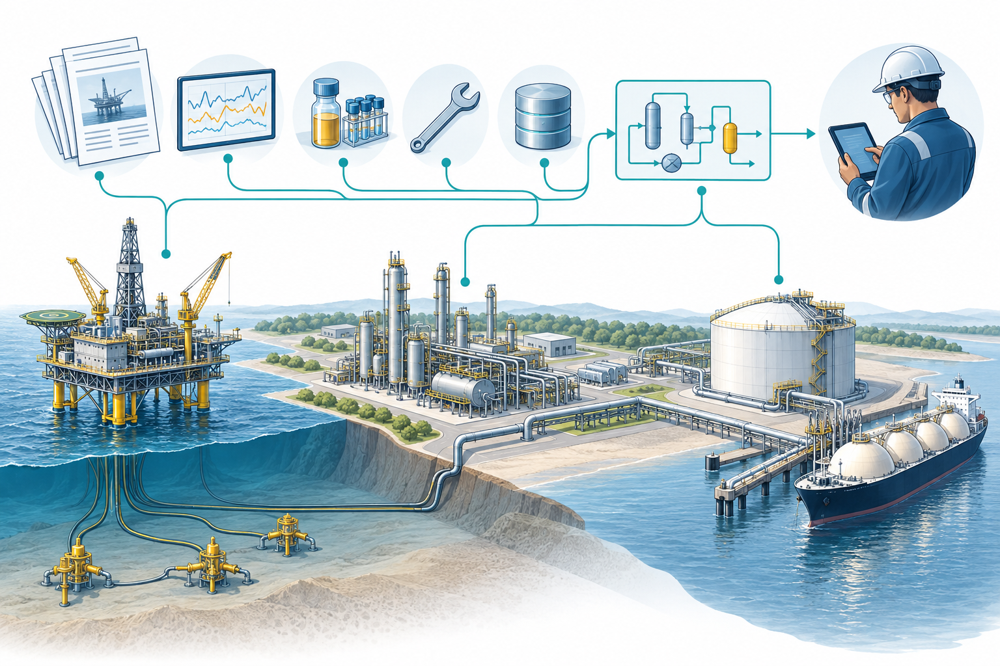
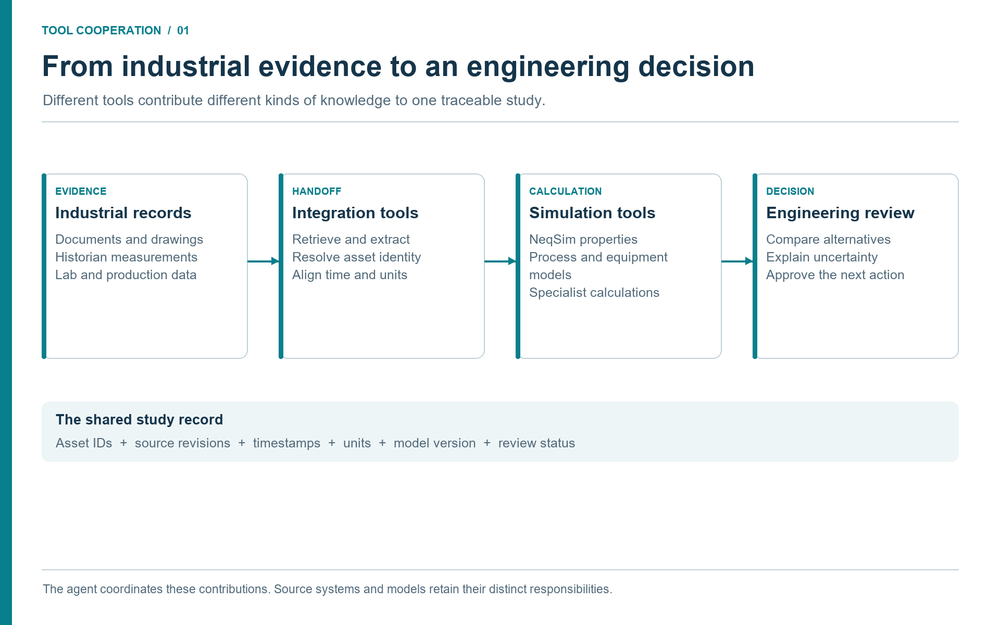

# Agentic Engineering and the Facility Operations Challenge

## Learning Objectives

After reading this chapter, the reader will be able to:

1. Explain why agentic engineering changes the interface to process simulation.
2. Distinguish between a language model, a physics engine, and a governed tool server.
3. Describe how faster access to technical data changes the scope of possible engineering studies.
4. Identify the human review points that remain essential when agents accelerate analysis.

> **Online companion:** The online book covers this ground in its
> *Why Agentic Engineering?* and *The NeqSim Physics Engine* chapters,
> with detailed EOS tables, flash-calculation theory, and the four-layer
> architecture diagram. This chapter gives a shorter operational framing and
> then moves into the data ecosystem and workflow patterns that the online
> book does not cover in depth.

## 1.1 From Simulation Files to Simulation Conversations

Process simulation has always been more than a numerical calculation. A useful
simulation study starts with a question, gathers data, chooses assumptions,
builds a model, runs scenarios, checks results, and turns those results into a
decision. The solver is only one step. A flash calculation may run in a fraction
of a second, while finding the right composition, design pressure, equipment
datasheet, and operating history can take hours. The practical bottleneck is
often the translation between people, documents, databases, and software.

Agentic engineering changes that translation layer. A large language model can
read a natural-language request, identify what data is missing, call tools,
write small pieces of code, inspect results, and draft a report. It must not invent thermodynamic numbers. A tool-backed answer is useful only
when the selected model, input basis, convergence checks, and validation evidence
fit the engineering question. Tool access makes these checks possible; it does
not make a language model inherently trustworthy. This division of labour is the core
idea of the new workflow: the model coordinates, the simulation engine computes,
and the engineer judges.

NeqSim is well suited to this role because it is both a thermodynamic engine and
a process simulation framework. It contains equations of state, flash
calculations, physical property models, process equipment, pipeline models,
mechanical design helpers, standards calculations, and reporting utilities
\cite{NeqSim2026,Solbraa2002}. The NeqSim MCP server exposes selected parts of
that capability through the Model Context Protocol (MCP), so an LLM host can
discover and invoke tools without knowing the internal Java API
\cite{AnthropicMCP2024}.

The important shift is not that engineers can ask a chatbot for an answer. The
important shift is that engineers can ask for an auditable workflow. A prompt
such as "check the dew point and hydrate margin for this gas at arrival
conditions" can become a sequence of explicit operations: validate the
composition, run a flash, calculate hydrate temperature, compare against a
margin, record assumptions, and prepare a short conclusion. Each operation can
be logged, reproduced, and reviewed.



**Discussion (Figure 1.1).**

The industrial scene connects production, processing and export assets to several kinds of evidence. Documents describe the installed equipment; measurements describe operation; laboratory and maintenance records add fluid and condition context. An agent can bring these contributions together, but their different meanings must survive the handoff. Start a study by identifying which of these sources the decision actually needs.

## 1.2 What Is NeqSim?

NeqSim (Non-Equilibrium Simulator) is an open-source Java library for
thermodynamic and process simulation, developed since 2002 and maintained on
GitHub \cite{NeqSim2026,Solbraa2002}. This book uses it as the calculation engine within a wider oil and gas
engineering workflow; source systems and specialist applications retain their
own roles.

At its core, NeqSim contains a thermodynamic engine with multiple equations of
state:

| Equation of state | Typical application |
|-------------------|--------------------|
| SRK (Soave--Redlich--Kwong) | General hydrocarbon systems, gas processing. |
| PR (Peng--Robinson) | Reservoir fluids, refinery, and petrochemical. |
| CPA (Cubic Plus Association) | Systems with polar molecules: water, methanol, MEG, glycols. |
| UMR-PRU | Gas and petroleum mixtures where suitable model parameters are available. |
| Electrolyte CPA | Aqueous electrolyte systems, subject to the implemented species and phase-model coverage. |
| GERG-2008 | Natural-gas mixture properties within the model's component and operating ranges. |

NeqSim also provides:

- **Flash calculations:** TP, PH, PS, dew point, bubble point, hydrate
  equilibrium, and multiphase checks.
- **Physical properties:** Density, viscosity, thermal conductivity, surface
  tension, diffusion coefficients, and speed of sound, using both corresponding-
  states and specialised correlations.
- **Process equipment:** Separators, compressors, heat exchangers, valves,
  pumps, mixers, splitters, distillation columns, pipelines (Beggs and Brill),
  reactors, and flare systems.
- **Modular field models:** `ProcessSystem` for single process areas and
  `ProcessModel` for multi-area plants, with recycle convergence and shared
  streams.
- **Dynamic simulation:** Time-stepping with `runTransient`, PID controllers,
  measurement devices, blowdown, and control-loop tuning.
- **Mechanical design:** Wall thickness, separator internals, well casing
  (API 5C3), and cost estimation.
- **Standards calculations:** ISO 6976 (gas quality), AGA 8, GPA 2145, and
  other gas and oil property methods, subject to checking the implemented edition.
- **Component database:** Pure-component records and support for petroleum
  fractions (TBP, plus-fraction characterisation).

NeqSim can be used directly as a Java library, through Python bindings (via
JPype), or through the MCP server described in Chapter 2. The MCP server
exposes selected NeqSim capabilities as structured tools that any MCP-compatible
client can discover and call without knowing the Java API.

## 1.3 The Three-Layer Pattern

The agentic process-simulation workbench has three layers.

| Layer | Primary role | Typical examples |
|-------|--------------|------------------|
| Agent host and language model | Interprets intent, plans steps, writes explanations | An approved desktop assistant, IDE, or enterprise workbench |
| Tool and access layer | Exposes bounded capabilities through typed interfaces | NeqSim MCP server, document readers, historian adapters, validation tools |
| Source systems and engineering engines | Retains records and performs specialist calculations | Laboratory, well, historian, document and maintenance systems; NeqSim and specialist solvers |

The language model should not be treated as a calculator. It should be treated
as a coordinator that can read and write around calculators. The tool layer
defines what the model is allowed to call. The source and engine layer carries different kinds of evidence: measured
values, approved documents, derived models, and calculated predictions. None
should be treated as universal truth; their authority and limitations differ.

This pattern is closely related to reasoning-and-acting agent architectures in
the AI literature \cite{Yao2023ReAct,Wei2022CoT}. The industrial difference is
that the actions are not web searches or generic code snippets. They are
engineering operations with units, standards, access controls, and review
requirements. A tool call that sizes a relief valve has a different risk class
than a tool call that lists available component names.

Figure 1.2 follows a record through four workflow stages. These stages cross the three software layers above: source records, integration, calculation, and engineering review.



**Discussion (Figure 1.2).**

The handoffs are the important part of this diagram. A document reader should return a cited value, not an unexplained number. A simulation should return its input basis and diagnostics, not just a recommendation. Keep those records together so the reviewing engineer can trace a conclusion back through the tools that produced it.

## 1.4 Why Data Access Changes the Study Envelope

Traditional process studies are limited by the cost of assembling evidence. A
team may run a single base case and a handful of sensitivities because each
case requires manual data gathering: one person exports historian tags, another
finds the latest datasheet, another checks whether the design basis has changed,
and another copies results into a report. When the evidence chain is manual,
studies become narrow.

Agentic engineering broadens the study envelope. If an approved document retrieval
agent can fetch a compressor datasheet, an approved historian interface can collect the last
30 days of inlet conditions, and a maintenance adapter can summarize
recent maintenance notifications, then a model can ask better questions. It can
compare current compressor performance against vendor curves, detect whether a
heat exchanger has drifted since the last cleaning, or evaluate whether a
separator debottlenecking option is constrained by an existing nozzle rating.

The value is not only speed. It is scope. Many studies that were previously too
expensive to do routinely become practical:

- daily hydrate-margin screening using live composition and temperature tags;
- compressor operating-point checks against retrieved vendor curves;
- relief-load re-screening when operating envelopes change;
- production-optimization scenarios tied to current equipment constraints;
- emissions and energy studies using current fuel, flare, and power data;
- safety-barrier reviews that link simulations to as-built documents.

None of these workflows removes engineering accountability. The agent can
assemble evidence and perform calculations faster, but the study team still
owns assumptions, acceptance criteria, and final decisions. The new capability
is that more scenarios can reach the review table with traceable evidence.

## 1.5 The Oil and Gas Tool Ecosystem

The workflow applies to offshore production, onshore gathering, gas treatment,
LNG feed preparation, pipelines, terminals, and brownfield modifications. The
process boundary changes between these settings; the need to connect measured
conditions, equipment constraints, physical predictions, and accountable
engineering decisions does not. A company-specific repository or tag naming
scheme should therefore be an adapter choice, not the organizing principle of
this book.

Three distinctions keep the architecture understandable. A **system of record**
stores authoritative records for a defined purpose. An **access or preparation
tool** retrieves and transforms those records. A **simulation or analysis tool**
calculates a result. A historian is a source platform; a Python historian client
is an access library; NeqSim is a simulation engine. MCP is the interface used
by an agent host to discover and invoke exposed tools. These terms are not
interchangeable. \cite{AVEVAPI2026,NeqSim2026,AnthropicMCP2024}

| Evidence domain | What the workflow obtains | Tool cooperation and downstream use |
|-----------------|---------------------------|-------------------------------------|
| Laboratory and PVT | Sample identity, composition, water and contaminant analyses, PVT measurements | A laboratory reader supplies a fluid specialist with a reviewed fluid basis. |
| Wells and reservoir | Well identity, completion state, pressure support, deliverability and forecast cases | Subsurface tools provide boundary conditions to the well and facility model. |
| Production and allocation | Well tests, metering, allocation revisions and downtime | A reconciliation tool checks throughput on a common time and volume basis. |
| Historians and online measurements | Pressure, temperature, flow, power, valve status, timestamps and quality flags | A time-series tool selects operating windows and distinguishes inputs from validation measurements. |
| Engineering documents and project records | Datasheets, P&IDs, vendor maps, line lists, design basis and revisions | Search and technical-reading tools extract constraints with page-level evidence. |
| GIS, survey and 3D engineering | Route, elevation, depth, topology and physical configuration | Geometry preparation supplies model segments and equipment locations. |
| Maintenance and integrity | Equipment hierarchy, work orders, inspection findings and degradation history | Maintenance tools test operational explanations and feasible intervention windows. |
| Modification and process safety | Approved changes, configuration status, hazard studies and barrier evidence | Review tools identify affected scenarios and unresolved change conditions. |
| Energy, emissions and economics | Fuel and power records, flare accounting, emissions factors and cost assumptions | Accounting and analysis tools translate scenario results into decision measures. |

This table is a study-design map, not a list of automatically available
connectors. Each deployment must demonstrate its actual read interface, access
rights, supported record types, and source provenance. For example, AVEVA PI
System and Aspen InfoPlus.21 are historian products; SAP asset management and
IBM Maximo are examples of maintenance platforms. Their presence does not imply
that a NeqSim MCP server can query them. An approved adapter or reviewed export
must make the handoff. \cite{AVEVAPI2026,AspenIP21Docs2026,SAPAssetManagement2026,IBMMaximo2026}

The recurring case in this book is an existing facility evaluating a changed
feed and a compression constraint. The laboratory tool establishes which fluid
is present. Production records establish when and at what rate it arrived. The
historian establishes how the compressor operated. Documents establish the
installed machine's limits. NeqSim predicts the effect of a proposed case.
Maintenance, safety, and emissions tools determine what that prediction means
for a practical recommendation. A failure in any handoff can invalidate an
otherwise converged calculation.

Steady-state and dynamic simulation remain complementary calculation modes.
The former supports a settled operating-point comparison; the latter addresses
time-dependent inventories and responses. A transient calculation requires
suitable equipment models and time-dependent boundary conditions. Selecting a
mode is an engineering decision, not a switch that guarantees the relevant
physics is represented. Chapter 4 follows the evidence through preparation;
Chapter 5 follows it through the modular process model.

## 1.6 What Makes This Different from a Traditional Digital Twin

Digital twins are often described as continuously updated models of physical
assets. In practice, many digital twins struggle because model maintenance is
expensive. Tag names change. Equipment is modified. Documents are revised.
Operating modes shift. A model that was accurate during commissioning can drift
unless people keep feeding it current information.

Agentic workflows can reduce this maintenance burden. They can use historian
data to identify recent operating envelopes, document retrieval to refresh
equipment constraints, and process automation APIs to set model variables by
string-addressable names. A modular field model can then be used for both
steady-state studies and detailed equipment checks. The model does not have to
be a monolithic file that only a specialist can understand. It can be a set of
connected process areas with explicit data links, validation steps, and saved
states.

This is why the MCP server matters. It gives the LLM a governed way to call the
simulation engine. It does not ask the model to remember the NeqSim Java API. It
publishes tools, schemas, examples, resources, and validation metadata. The LLM
can inspect the tool catalogue, choose a calculation, pass structured input, and
receive structured output. The engineer can inspect the same output.

## 1.7 The Human Role Moves Upstream and Downstream

When agents accelerate calculation, the human role does not disappear. It moves
to the points where judgement matters most.

Upstream, engineers define the question. They decide whether the study is a
quick screening, a standard study, or a comprehensive decision basis. They
decide which standards and jurisdiction apply, which data sources are approved,
what uncertainty ranges are credible, and what acceptance criteria will be used.

Downstream, engineers review the answer. They check whether the result is
physically plausible, whether the model is inside its validation envelope,
whether the retrieved data is current, and whether the recommendation is
appropriate for the decision. Agentic engineering is powerful precisely because
it creates more material for this review. It can produce a notebook, a
results.json file, a report, a standards map, and a trace of tool calls. That is
far better than an unsupported number copied into an email.

## 1.8 A Day in the New Workflow

Imagine a production engineer arriving in the morning to a question from
operations: gas export was reduced overnight because the arrival temperature in
the export line approached the hydrate-management limit. The old workflow might
start with email: ask for the latest composition, export the relevant historian
tags, find the hydrate curve used last year, locate the pipeline route data, and
ask a simulation specialist to rerun a case. By the time the result is ready,
the operating situation may have changed.

In an agentic workflow, the engineer starts with a bounded request:

```text
Screen hydrate margin for the last 12 hours of export operation. Use approved
historian tags, the latest reviewed gas composition, and the NeqSim hydrate
method. Report source windows, model assumptions, minimum margin, and whether
specialist review is required.
```

The assistant does not invent the answer. It routes the task. A plant-data
agent retrieves pressure, temperature, flow, and inhibitor tags. A document or
data agent retrieves the latest approved composition and route assumptions. A
NeqSim tool calculates hydrate temperature at selected operating points. A
reporting step summarizes the tightest margin, lists rejected bad-quality tags,
and marks whether the result is a screening or a decision basis. The engineer
then reviews the evidence and decides whether to escalate.

The same pattern can apply to many daily questions. A compressor study can
retrieve a vendor curve and calculate actual head. A heat exchanger study can
compare predicted and measured duty. A relief screening can use the current
operating envelope to decide whether a formal update is needed. The common
theme is that the workflow becomes evidence first, calculation second,
recommendation third.

## 1.9 From Pattern to Infrastructure

The workflows described above --- hydrate screening, compressor study, heat
exchanger comparison --- share a common pattern. Each one combines technical
documentation, field measurement data, and NeqSim simulation. The question is
whether this pattern remains an informal convention that each agent must
reinvent, or whether it becomes a programmable infrastructure that agents invoke.

NeqSim takes the infrastructure approach. The `neqsim.process.operations`
package provides Java classes that implement the data-to-model binding:

- `OperationalTagMap` maps logical tag names to historian tags and simulation
  variables, so field data can be applied to a process model in a single call.
- `OperationalEvidencePackage` orchestrates a tag map, field data, scenarios,
  and benchmark comparisons into a single structured JSON report.
- `OperationalScenarioRunner` executes what-if scenarios defined as ordered
  action lists, returning before/after comparisons.
- `ControllerTuningStudy` evaluates controller performance from step-response
  time-series, computing IAE, overshoot, settling time, and stability.
- `WaterHammerStudy` combines route geometry, fluid properties, valve events,
  and supplied operating-data overrides into a transient screening.

The `neqsim.process.diagnostics` package provides a `RootCauseAnalyzer` that
can rank configured failure hypotheses using supplied evidence. Reliability
handbooks, operating windows, document limits, and simulation results must be
provided through an explicit mapping; the class name does not imply a live
connection or a licence to a reliability database.

The `neqsim.process.safety` sub-packages provide consequence screening tools:
`GasDispersionAnalyzer` for release-to-dispersion analysis,
`ReleaseDispersionScenarioGenerator` for building release scenarios from a
process model, `TrappedLiquidFireRuptureStudy` for blocked-in pipe segments,
and `CfdSourceTermExporter` for formatting source terms for specialist CFD
tools.

Selected workflows are exposed through MCP tools. A client must discover the
installed server catalogue and inspect its action schema before assuming that
a particular Java class or method is available. A notebook may also invoke
Java through the source-backed Python workflow. These are different execution
paths and their versions belong in the same study record. \cite{NeqSimMCP2026} The important design principle is that the
classes are orchestration classes. They do not replace NeqSim's flash
calculations, EOS models, or equipment solvers. They combine those existing
capabilities with external data sources into structured, auditable workflows.

The rest of this book explores these classes in context. Chapters 4 and 7
describe the data foundation and operational workflows. Chapter 6 covers
safety. Chapter 9 presents a complete worked pattern that shows how the
classes fit together in a realistic field study.

## 1.10 What Changes for Engineers

The new workflow changes the skill profile of a process engineer. It does not
remove the need to understand thermodynamics, equipment, or safety. It increases
the value of asking precise questions and reviewing evidence.

Engineers need to become good at specifying model boundaries. A prompt such as
"optimize production" is too vague. A better prompt states the decision, time
horizon, constraints, and acceptable output: "screen whether production can be
increased by 5% for the next 24 hours without reducing hydrate margin below the
operating criterion, exceeding compressor driver load, or increasing flare
rates." This is not just better prompting. It is better engineering problem
definition.

Engineers also need to become good at evidence review. When an agent extracts a
design pressure from a datasheet, the reviewer should ask whether the document
revision is current, whether the value is design or operating pressure, whether
the unit is absolute or gauge, and whether the extraction was OCR-based. When an
agent reads a historian tag, the reviewer should ask whether the instrument was
healthy, whether the selected window was steady state, and whether all tags came
from the same operating period.

Finally, engineers need to become good at model-risk thinking. A NeqSim flash
calculation may be numerically correct but still unsuitable for a particular
fluid, pressure range, or design decision. An MCP tool may expose a validated
calculation, but the validation envelope must still match the task. The new
workflow makes these checks more visible. It does not make them optional.

## 1.11 Summary

Agentic engineering is a new interface to facility operations. The language
model coordinates, NeqSim computes, MCP exposes tool interfaces, and industrial data
sources provide evidence. The outcome is not an autonomous engineer. It is a
faster, more traceable workflow where more operational scenarios can be studied
and reviewed.

Key points from this chapter:

- The main productivity bottleneck in simulation is often data translation, not solver runtime.
- MCP turns NeqSim capabilities into discoverable, typed, auditable tools for LLM clients.
- A source platform, access library, exchange standard, and simulation engine have distinct roles.
- Tools cooperate by passing reviewed evidence and named scenario inputs, rather than by sharing an unstructured conversation.
- The relevant source domains depend on the question; integration must be demonstrated for the installed system.
- Human engineers remain responsible for questions, assumptions, acceptance criteria, and final decisions.

## Exercises

1. **Workflow decomposition:** Choose a recent process-simulation task and list the steps that were calculation work versus evidence-gathering work.
2. **Tool boundary:** Identify three subtasks that an LLM should coordinate but not compute from memory.
3. **Review point:** For a hydrate-margin screening, define the minimum evidence an engineer should review before using the result.

## References

This chapter uses references from the master bibliography.
