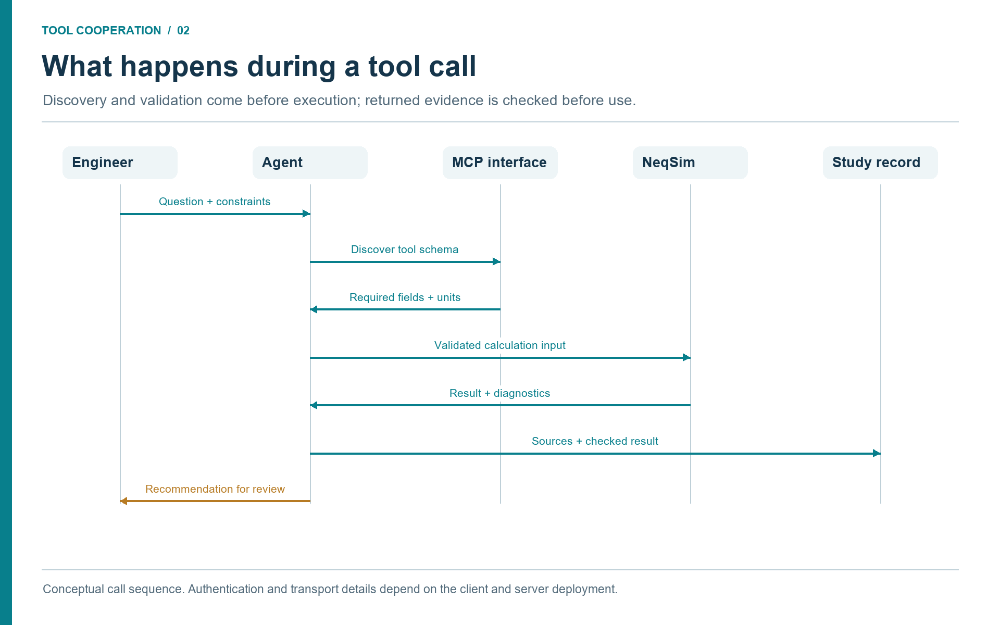

# Connecting NeqSim MCP, Industry Tools, Agents, and Skills

## Learning Objectives

After reading this chapter, the reader will be able to:

1. Install and smoke-test the NeqSim MCP server through the Docker distribution.
2. Configure VS Code Copilot Chat to use NeqSim through `.vscode/mcp.json`.
3. Install the NeqSim agent and skill pack that teaches the assistant how to use the MCP tools.
4. Explain the difference between STDIO and Streamable HTTP MCP transports.
5. Run a first engineering conversation that calls a NeqSim tool rather than relying on model memory.

> **Online companion:** The online book covers MCP setup in its
> *Getting Started* chapter and the full MCP protocol, governance tiers, and
> validation profiles in its *The MCP Server* chapter. This chapter focuses
> on the Docker distribution path, practical troubleshooting, and deployment
> profiles for industrial teams.

## 2.1 A Repeatable Runtime for the Calculation Tool

The NeqSim MCP server can be distributed as a Java runner jar or as a Docker
image. For teams with an approved container runtime, Docker is a useful
distribution path because it packages the server runtime, Java dependencies, and startup
command into a single image. The user does not need to install a matching Java
runtime or manage classpaths. The LLM client starts the container, sends MCP
JSON-RPC messages through standard input/output, and receives tool responses.

Docker also gives repeatability. A study team can pin an image tag, document the
exact server version used for a study, and rerun the same calculation later.
For regulated or safety-relevant engineering, this matters. The question is not
only "what result did we get?" but "which model version, which tool contract,
and which validation profile produced it?" \cite{DockerDocs2026,NeqSimMCP2026}.

The local Docker configuration below is an example for a reviewed deployment.
Verify the image repository and release tag against that deployment's release
instructions before use. A mutable `latest` tag is shown only for introductory
setup; record a resolved image digest for a reproducible study.

```powershell
docker pull ghcr.io/equinor/neqsim-mcp-server:latest
```

Perform the smoke test through an MCP-capable client: establish a session,
complete initialization, then request `tools/list`. A single JSON line piped to
a process is not a full MCP session and should not be used as the acceptance
test. Record the server identity, negotiated protocol, tool list, and a small
public calculation result. This separates image availability, protocol
compatibility, and engineering correctness into independently reviewable
checks. \cite{MCPTransports2025}

## 2.2 Connecting VS Code Copilot Chat

GitHub Copilot Chat in Visual Studio Code can act as an MCP client when a
workspace declares available servers. The configuration lives in `.vscode/mcp.json`.
VS Code supports workspace server configuration in this file; other approved
MCP hosts use their own configuration format. For a Docker-based NeqSim server,
an example is: \cite{VSCodeMCP2026}

```json
{
  "servers": {
    "neqsim": {
      "type": "stdio",
      "command": "docker",
      "args": [
        "run", "-i", "--rm",
        "ghcr.io/equinor/neqsim-mcp-server:latest"
      ]
    }
  }
}
```

Start and review the configured server in the client, then inspect the
discovered tool catalogue. Client trust settings and organization policy may
control which tools are available. The engineer can then ask a question such as:

```text
Use NeqSim to calculate the dew point temperature of a gas with
85 mol% methane, 10 mol% ethane, and 5 mol% propane at 50 bara.
Report the EOS model, convergence status, and limitations.
```

The important phrase is "Use NeqSim". It tells the assistant that the answer
should come from a tool call, not from a memorized or approximated response. The
model should select an appropriate flash or phase-envelope tool, provide a
structured input object, and summarize the returned result. If the MCP client
shows tool-call details, the engineer should inspect them during early use to
build confidence in the workflow.

## 2.3 Installing the NeqSim Agent and Skill Pack

The MCP server is the calculation layer. It exposes NeqSim tools, schemas, and
resources. It does not by itself teach the assistant how a NeqSim engineering
study should be planned, which standards to check, how to structure evidence,
or when to stop for human review. That guidance lives in NeqSim agents and
skills.

For a useful Copilot setup, distribute the MCP server together with a small
agent and skill pack from the NeqSim repository:

| Repository source | Workspace destination | Purpose |
|-------------------|-----------------------|---------|
| `.github/agents/*.agent.md` | `.github/agents/` | Specialist behaviours such as process simulation, flow assurance, plant data, technical reading, and safety. |
| `.github/skills/<skill-name>/SKILL.md` | `.github/skills/<skill-name>/SKILL.md` | Domain procedures, API patterns, standards checks, and validation rules. |
| `.github/copilot-instructions.md` | `.github/copilot-instructions.md` or local project instructions | Common repository rules and NeqSim usage conventions. |

An organization can provide this as a versioned "NeqSim Copilot pack" in one of
three ways:

1. **Copy from the NeqSim repository:** Suitable for individual pilots and
  training workspaces.
2. **Distribute a ZIP or internal template repository:** Suitable for study
  teams that need a controlled starting point.
3. **Publish an approved internal package:** Suitable for enterprise use, where
  agents, skills, validation cases, and MCP image versions are released
  together.

The minimum useful pack is:

| Type | Files to include | Why they matter |
|------|------------------|-----------------|
| Router | `router.agent.md` | Classifies the request and selects the right specialist. |
| General task solver | `solve.task.agent.md`, `solve.process.agent.md` | Provides the end-to-end study workflow and process-simulation fast path. |
| Core simulation | `process.model.agent.md`, `thermo.fluid.agent.md` | Builds fluids and flowsheets instead of relying on generic model memory. |
| Evidence handling | `technical.reader.agent.md`, `plant.data.agent.md` | Reads technical documents and historian/tag data with source provenance. |
| Review | `review.agent.md` | Critiques task outputs before they are reused or released. |
| Core skills | `neqsim-api-patterns`, `neqsim-input-validation`, `neqsim-troubleshooting`, `neqsim-standards-lookup`, `neqsim-professional-reporting` | Covers safe NeqSim API use, input checks, recovery, standards, and reporting. |
| Workflow skills | `neqsim-agent-handoff`, `neqsim-notebook-patterns`, `neqsim-technical-document-reading`, `neqsim-plant-data` | Supports handoffs, notebooks, document evidence, and plant-data workflows. |

For discipline work, add the relevant specialist agents and skills:

| Discipline need | Add agents | Add skills |
|-----------------|------------|------------|
| Flow assurance | `flow.assurance.agent.md` | `neqsim-flow-assurance`, `neqsim-water-hammer`, `neqsim-electrolyte-systems` |
| Production and field development | `field.development.agent.md`, `optimize.agent.md` | `neqsim-production-optimization`, `neqsim-field-development`, `neqsim-field-economics` |
| Automation and controls | `control.system.agent.md` | `neqsim-dynamic-simulation`, `neqsim-controllability-operability`, `neqsim-pid-process-operations` |
| Valves, relief, pipes, and safety | `safety.depressuring.agent.md`, `mechanical.design.agent.md` | `neqsim-relief-flare-network`, `neqsim-depressurization-mdmt`, `neqsim-trapped-liquid-fire-rupture`, `neqsim-process-safety` |
| Materials and integrity | `mechanical.design.agent.md`, `standards.review.agent.md` | `neqsim-ccs-hydrogen`, `neqsim-flow-assurance`, `neqsim-standards-lookup` |
| Chemicals and production chemistry | `flow.assurance.agent.md`, `technical.reader.agent.md` | `neqsim-electrolyte-systems`, `neqsim-flow-assurance`, `neqsim-technical-document-reading` |
| Environmental and emissions | `emissions.environmental.agent.md` | `neqsim-utilities-specification`, `neqsim-power-generation`, `neqsim-professional-reporting` |
| Root-cause and operations support | `root.cause.agent.md`, `plant.data.agent.md` | `neqsim-root-cause-analysis`, `neqsim-plant-data`, `neqsim-model-calibration-and-data-reconciliation` |

The pack should be versioned together with the MCP image tag. A report should be
able to say, for example: "NeqSim MCP image `vX.Y.Z`, agent pack revision
`2026-05-10`, and skill pack revision `2026-05-10` were used." That provenance
is as important as the numerical result.

## 2.4 STDIO and Streamable HTTP

MCP defines STDIO and Streamable HTTP transports. With STDIO the client starts
a server subprocess and exchanges newline-delimited JSON-RPC messages through
standard input and output. Streamable HTTP connects to an independent service;
it can use server-sent events for streaming. It supersedes the earlier
HTTP+SSE transport. Select a transport supported by both the installed server
and the chosen host. \cite{MCPTransports2025}

| Transport | Typical context | Deployment concern |
|-----------|-----------------|--------------------|
| STDIO | A local engineering workbench launches a calculation server | Runtime, process permissions and pinned image or executable. |
| Streamable HTTP | A workbench connects to a managed service | Authentication, service availability, network boundaries and logs. |
| Legacy HTTP+SSE | Compatibility with an older implementation | Verify the exact supported protocol; plan migration explicitly. |

Transport choice does not establish engineering authority. A remote service can
return an unvalidated calculation, and a local process can handle confidential
data. The relevant checks are what the tool does, which evidence it receives,
and what access and review controls apply to that deployment.

### 2.4.1 One Workbench, Several Tool Connections

A useful industrial setup connects tools by role. The NeqSim server handles
calculations. A document service searches approved records. A historian service
returns selected measurements. A laboratory or production-data service returns
reviewed samples and records. A validation tool checks their combined input
package. A report tool consumes saved results and evidence references.

These services need not all use MCP internally. A server may wrap a vendor API,
a database query, a file export, or a maintained library. MCP standardizes the
agent-facing invocation, while the adapter remains responsible for the source's
identity, permissions, query semantics, and units. A deployment with approved
file exports can use exactly the same evidence contract as one with online
interfaces, provided it records the export's date and limitations.

The orchestrator passes a study identifier, asset identifier, evidence version,
and scenario identifier between calls. It does not forward passwords through
other tools or ask the simulation engine to infer missing data from documents.
If the document lookup succeeds but the historian query fails, it can finish
extracting the datasheet while marking the operating comparison as incomplete.
This is cooperation through explicit dependencies, not a single all-purpose
connector.

## 2.5 What the MCP Server Exposes

The server exposes NeqSim calculations as tools with typed schemas. The exact
tool inventory evolves, but the stable pattern is consistent: core calculation
tools, advisory discovery tools, advanced engineering tools, and experimental
or higher-autonomy tools are separated by maturity and deployment profile. The
tool contract promises stable required fields within the v1 API while allowing
new optional fields to be added \cite{NeqSimMCPContract2026}.

Useful first tools include:

| Tool or resource | Use in an early pilot |
|------------------|-----------------------|
| `getCapabilities` | Discover available engineering capabilities. |
| `getExample` | Retrieve example JSON for a tool. |
| `getSchema` | Inspect input and output schema before calling a tool. |
| `validateInput` | Check composition, units, pressure, temperature, and component names. |
| `runFlash` | Run TP, PH, PS, dew-point, bubble-point, or hydrate calculations. |
| `runProcess` | Run a process model from a JSON definition. |
| `calculateStandard` | Calculate gas-quality and standards properties. |
| `getBenchmarkTrust` | Check validation basis and limitations for a tool. |

Every engineering conversation should begin with discovery when the user is not
sure which tool fits. A prompt such as "List NeqSim tools relevant for a CO2
pipeline phase-envelope and dense-phase screening" is better than asking the
model to guess.

## 2.6 Deployment Profiles

The server distinguishes between desktop exploration, study-team work, digital
twin advisory use, and enterprise-governed use. The names may evolve with the
server, but the principle is stable: higher-risk or higher-autonomy tools are
restricted in more governed profiles.

| Profile | Intended context | Typical access philosophy |
|---------|------------------|---------------------------|
| `DESKTOP_ENGINEER` | Individual engineering exploration | Broadest local access for trained users. |
| `STUDY_TEAM` | Shared study workflow | Advanced tools available, experimental autonomy restricted. |
| `DIGITAL_TWIN` | Operator decision support | Advisory and calculation tools only; no direct plant write-back. |
| `ENTERPRISE` | Controlled corporate service | Approved core tools, enforced validation, explicit approvals where required. |

The key governance message is simple: an MCP tool can be technically callable
without being appropriate for every deployment. A desktop engineer may run an
experimental scenario solver for learning. A production advisory service should
restrict itself to validated, read-only, traceable calculations unless a formal
approval architecture exists.

## 2.7 First Conversation Pattern

A good first conversation tests the whole loop without involving private data:

```text
I am testing the NeqSim MCP server. Please discover available NeqSim tools,
choose the simplest validated tool for a methane/ethane/propane dew-point
calculation, call the tool, and summarize the result with provenance and
limitations. Do not estimate the dew point from memory.
```

The expected assistant behaviour is:

1. discover or select the relevant tool;
2. create a structured input with composition, pressure, EOS, and flash type;
3. call the tool;
4. report convergence, model, assumptions, warnings, and result;
5. avoid claiming design suitability beyond the tool's validation envelope.

This pattern is more important than the numerical answer. It trains the team to
ask for provenance and limitations as part of the result.

## 2.8 Walkthrough: A Complete MCP Tool Session

This section shows a concrete multi-tool session to illustrate what actually
happens between the LLM client and the NeqSim MCP server. The engineer asks a
single question; the assistant chains several tool calls behind the scenes. The
JSON excerpts are illustrative interface examples, not a captured execution
transcript. Check names and arguments against the installed server schema;
publish numerical results only with a saved execution record.

**Step 1 — Discovery.** The assistant calls `getCapabilities` through MCP
`tools/call` to find available tools:

```json
{
  "jsonrpc": "2.0",
  "id": 2,
  "method": "tools/call",
  "params": {
    "name": "getCapabilities",
    "arguments": {}
  }
}
```

The server returns a list of tools with descriptions, categories, and maturity
tiers. The assistant selects `runFlash` for a dew-point calculation.

**Step 2 — Schema inspection.** Before constructing the input, the assistant
calls `getSchema` to learn the required and optional fields:

```json
{
  "jsonrpc": "2.0",
  "id": 3,
  "method": "tools/call",
  "params": {
    "name": "getSchema",
    "arguments": {
      "toolName": "run_flash",
      "schemaType": "input"
    }
  }
}
```

The response includes field names, types, valid ranges, enums for `flashType`
and `model`, and required composition format. This prevents the assistant from
guessing parameter names or units.

**Step 3 — Input validation.** The assistant calls `validateInput` with the
planned input to check for errors before running the calculation:

```json
{
  "jsonrpc": "2.0",
  "id": 4,
  "method": "tools/call",
  "params": {
    "name": "validateInput",
    "arguments": {
      "inputJson": "{\"model\":\"SRK\",\"temperature\":{\"value\":240.0,\"unit\":\"K\"},\"pressure\":{\"value\":50.0,\"unit\":\"bara\"},\"flashType\":\"dewPointT\",\"components\":{\"methane\":0.85,\"ethane\":0.10,\"propane\":0.05},\"mixingRule\":\"classic\"}"
    }
  }
}
```

The server returns `"valid": true` or a list of issues such as unknown component
names, out-of-range pressures, or compositions that do not sum to 1.0.

**Step 4 — Flash calculation.** With validated input, the assistant calls
`runFlash`:

```json
{
  "jsonrpc": "2.0",
  "id": 5,
  "method": "tools/call",
  "params": {
    "name": "runFlash",
    "arguments": {
      "components": "{\"methane\":0.85,\"ethane\":0.10,\"propane\":0.05}",
      "temperature": 240.0,
      "temperatureUnit": "K",
      "pressure": 50.0,
      "pressureUnit": "bara",
      "eos": "SRK",
      "flashType": "dewPointT"
    }
  }
}
```

For `dewPointT`, the pressure is the specification; the temperature argument is
only the initial thermodynamic state used to construct the fluid before the dew
point calculation. The response must be checked for the calculated temperature, EOS, mixing rule,
convergence status, warnings, and provenance. Save the actual response with the
input and server version. An iteration count or accuracy range may be reported
only if the executed calculation or its validation evidence supplies it.

A successful solver response must also represent a physically valid phase
boundary. Check that the incipient liquid and gas are distinct and that a
suitable initialization or independent phase-envelope/TP check supports the
identified branch. Numerical return without an error is not sufficient proof
of a dew point.

For this composition, a 240 K starting state gives a verified local dew-point
branch at 244.871 K (−28.279 °C) and 50 bara. Starts at 240, 250, and 260 K
agree. A TP check 0.1 K below the result contains gas and liquid; a check
0.1 K above contains gas only. The gas and incipient-liquid compositions are
distinct. These checks establish the selected local branch more convincingly
than a generic success flag.

<!-- @neqsim:claim
  baseline: revision_support/calculation_verification.json
  script: revision_support/verify_calculations.py
  result: dew_point
  scope: source-backed seed robustness and local TP phase-boundary checks
-->

A warm starting state near ambient temperature produced a trivial root with
nearly identical phase compositions in the checked implementation. That result
was rejected. This example therefore uses an explicit cold starting state and
requires physical branch checks; a successful tool response alone should not
be promoted to a validated engineering answer.

**Step 5 — Trust metadata.** For a formal study, the assistant can also call
`getBenchmarkTrust` to report validation status:

```json
{
  "jsonrpc": "2.0",
  "id": 6,
  "method": "tools/call",
  "params": {
    "name": "getBenchmarkTrust",
    "arguments": {
      "trustJson": "{\"action\":\"getTool\",\"toolName\":\"runFlash\"}"
    }
  }
}
```

The response includes validation basis (test cases, accuracy bounds, known
limitations) and a trust classification. This metadata belongs in the study
record so reviewers know the tool's qualification level.

**What the engineer sees.** In VS Code Copilot Chat, the engineer sees a
natural-language summary with the dew-point value, EOS model, convergence
status, and limitations. The tool-call details can be expanded to inspect the
exact JSON exchanged. This transparency is what separates a tool-backed answer
from a language-model guess.



**Discussion (Figure 2.1).**

Discovery establishes the callable interface. Input checks establish whether the requested case is meaningful. Result checks establish what can be concluded from the response. These are separate operations, even when a client presents them as one conversation. Record the returned fields and actual checks before summarizing the result.

## 2.9 Troubleshooting

Common startup issues are straightforward:

| Symptom | Likely cause | First check |
|---------|--------------|-------------|
| Copilot cannot see tools | MCP config not loaded | Restart VS Code and validate `.vscode/mcp.json`. |
| Docker command fails | Docker not running or image unavailable | Run `docker run hello-world` and pull the NeqSim image. |
| Tool call times out | Container startup too slow or heavy calculation | Try `tools/list` first; use a simple flash calculation. |
| Result lacks provenance | Wrong server version or non-MCP answer | Ask the model to show tool-call result fields. |
| Private data appears in prompt | User pasted confidential data | Stop and move to an approved workspace and data path. |

For corporate pilots, the most important troubleshooting rule is to separate
connectivity problems from engineering problems. First prove the MCP server can
list tools. Then prove a public flash example works. Only then connect internal
data sources or run asset-specific workflows.

## 2.10 Prompt Templates for First Use

Early users often ask the assistant for a number and receive a plausible-looking
answer. A better habit is to ask for a tool-backed workflow. The following
prompt patterns are useful during a pilot.

```text
Discover NeqSim MCP tools relevant to this task before choosing a calculation.
Explain why the selected tool is appropriate and what assumptions it requires.
```

```text
Use NeqSim for the thermodynamic calculation. Do not estimate from memory.
Return model, units, convergence status, warnings, and provenance.
```

```text
Treat this as a screening calculation. List what additional evidence would be
required before using the result for design or safety approval.
```

```text
If input data is missing, stop and list the missing fields instead of inventing
reasonable defaults. Suggest realistic data sources for each missing field.
```

These prompts are intentionally procedural. They train the assistant to expose
the reasoning path and tool boundary. They also train the engineer to expect
structured answers rather than fluent guesses. During early deployment, teams
should collect good prompt patterns and convert them into skills or reusable
workflow templates.

## 2.11 Local Docker Security and Practical Operations

Running an MCP server through Docker is simple, but it still deserves basic
operational discipline. Container access depends on its mounts, network configuration, credentials,
permissions, and image contents. Treat these as explicit deployment settings. For the NeqSim MCP server in the minimal
configuration, the container is transient: `--rm` removes it after the session,
and no workspace folder is mounted by default. That is a good first-pilot
posture.

When a workflow needs files, the team should decide what to mount and why. A
task folder containing public examples is very different from a folder
containing internal documents. Mount only the folders needed for the task, use
read-only mounts when possible, and do not copy confidential documents into
locations that are outside approved storage. The convenience of Docker should
not become a workaround for document control.

Version control is equally important. The `latest` tag is convenient for early
testing, but a report should record the image digest or version tag used. If a
study is repeated later, the team should know whether the same server version,
NeqSim version, and tool contract were used. For formal or high-impact studies,
pin the image version and store it in the task metadata.

Logging needs the same care. Tool-call logs are valuable for reproducibility,
but they may contain compositions, pressures, tag names, or document references.
Store them in the study folder or approved logging system, not in arbitrary
chat exports. When a result is reused outside the team, remove private asset
names and confidential source references unless the receiving context is
authorized.

## 2.12 Summary

Docker and VS Code Copilot make the NeqSim MCP server accessible to engineers
without local Java setup. The `.vscode/mcp.json` file declares the server, MCP
tool discovery exposes NeqSim capabilities, and deployment profiles govern what
tools are appropriate in each context.

Key points from this chapter:

- An approved, versioned runtime makes the calculation service repeatable.
- Copilot should be configured to call NeqSim tools, not estimate engineering results from memory.
- STDIO and Streamable HTTP serve different deployment contexts; match client and server support.
- Separate data tools and calculation tools cooperate through shared study, evidence, and scenario identifiers.
- Profiles and validation metadata are part of the engineering control system.

## Exercises

1. **Smoke test:** Start a reviewed server version in an MCP client, complete initialization, and inspect `tools/list`. Record the server version and discovered tools.
2. **Workspace setup:** Create `.vscode/mcp.json` for a local test workspace and verify Copilot can discover the NeqSim server.
3. **Governance choice:** Decide which deployment profile is appropriate for a digital-twin advisory dashboard and justify the restrictions.

## References

This chapter uses references from the master bibliography.
