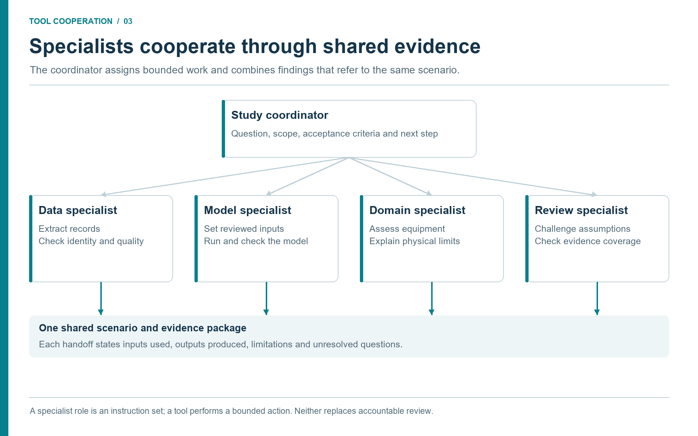
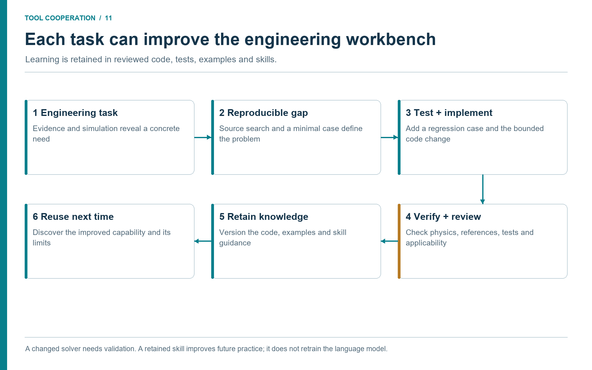

# Agents, Skills, and Engineering Memory

## Learning Objectives

After reading this chapter, the reader will be able to:

1. Explain the difference between an agent, a skill, a tool, and a memory.
2. Describe how skills encode engineering practice without fine-tuning a model.
3. Map common engineering-study types to specialist agents and skills.
4. Identify where human approval should enter multi-agent workflows.

> **Online companion:** The online book covers the multi-agent system,
> the skills library, and the AI architecture in dedicated chapters. This
> chapter gives a compact working summary and then focuses on engineering
> memory, cross-agent handoffs, and skill design patterns for industrial
> study teams.

## 3.1 Why One General Assistant Is Not Enough

A general LLM assistant can help with brainstorming, summarizing, and code
generation. Industrial studies also need explicit discipline responsibilities
and tool boundaries. Without them, an assistant handling thermodynamics,
safety, economics, documents, and plant data can blur the basis of its claims. It may use the wrong EOS, quote a standard too
loosely, or treat a screening result as a design result.

The NeqSim agent ecosystem addresses this through specialization and review. A routing agent can
classify the task and delegate to a process simulation agent, flow assurance
agent, safety and depressuring agent, PVT agent, field development agent,
technical document reader, or documentation writer. Each specialist has a
smaller job, a clearer set of tools, and a relevant skill stack. This follows a
multi-agent pattern familiar from distributed AI systems, but applied to
engineering tasks with units, standards, and auditable outputs
\cite{Wooldridge2009,Yao2023ReAct}.

## 3.2 Definitions

The vocabulary matters because it defines governance.

| Term | Meaning in this book | Example |
|------|----------------------|---------|
| Agent | An LLM behaviour profile with instructions and tool access | `make a neqsim process simulation` |
| Skill | A curated markdown knowledge package loaded into the agent context | `neqsim-flow-assurance` |
| Tool | A callable function outside the model | A discovered `runFlash` tool, document reader, or approved historian query |
| Memory | Stored facts from prior work or project context | build commands, known API patterns |
| Artifact | A durable output of the workflow | notebook, `results.json`, report, source manifest |

An agent chooses actions. A skill informs those actions. A tool executes them.
Memory prevents repeated mistakes. Artifacts make the work reviewable.

This separation is what makes agentic engineering manageable. If a hydrate
calculation fails, the fix might be in the skill (load the CPA hydrate pattern),
the tool (improve validation), the memory (record a known API gotcha), or the
agent instruction (require a standards lookup). Without the separation, every
failure looks like a vague model problem.

## 3.3 Skills as Engineering Procedures

Skills are not magic prompts. They are structured procedures. A good NeqSim
skill contains the domain scope, when to use it, required inputs, API patterns,
validation rules, common errors, and output schema. This is exactly the kind of
knowledge that a senior engineer carries in working memory and a junior engineer
learns through repetition.

Examples include:

| Skill | Encoded practice |
|-------|------------------|
| `neqsim-api-patterns` | Fluid creation, mixing rules, flash calculations, process equipment setup. |
| `neqsim-notebook-patterns` | Jupyter setup, figure generation, results.json structure. |
| `neqsim-technical-document-reading` | Extracting stream tables, P&ID topology, datasheets, and performance maps. |
| Site-specific document-retrieval skill | Retrieving controlled engineering records; the configured implementation is specific to each organization. |
| `neqsim-plant-data` | Reading through an approved historian interface, mapping tags, checking data quality. |
| `neqsim-process-safety` | HAZOP, LOPA, SIL, bow-tie, barrier registers, and risk matrices. |
| `neqsim-field-development` | Concept selection, production forecasts, economics, and uncertainty. |

In practical deployments, these skills and their matching agents should be
distributed with the MCP configuration. The MCP server gives the assistant a
trusted calculation interface; the agents and skills teach the assistant which
calculation to call, which evidence to request, which warnings matter, and when
human review is required. Chapter 2 lists a minimum agent and skill pack that
can be copied from `.github/agents/` and `.github/skills/` in the NeqSim
repository or distributed as a controlled internal template.

The advantage over fine-tuning is transparency. A skill can be reviewed in a
pull request. It can cite standards. It can be changed when a method changes. It
can tell the agent to avoid a known API mistake. Fine-tuned model weights cannot
be inspected in the same way.

## 3.4 Agent Composition for Engineering Studies

The number of agents should follow the work. A small property check may need
one agent and one calculation tool; a larger study benefits from independent
specialists with bounded responsibilities. Consider a separator
debottlenecking study. The router may compose the workflow as follows:

1. The technical document reader extracts existing vessel dimensions, nozzles,
   design pressure, internals, and vendor notes from approved documents.
2. The plant-data agent retrieves recent flow, pressure, temperature, and level
   data through the configured historian tool and classifies operating windows.
3. The process simulation agent builds or updates the NeqSim separator and
   upstream/downstream process context.
4. The mechanical design agent checks whether proposed operating changes stay
   inside design constraints.
5. The safety agent screens relief, blowdown, HAZOP deviations, and barrier
   implications.
6. The reporting agent assembles assumptions, results, uncertainties, and
   recommendations.

Each agent sees enough context to do its job but not so much that it becomes
unfocused. The handoff artifact matters. A document-reading output should not
be a paragraph of vague text. It should be structured data with source, page,
confidence, and units. A simulation output should not be a screenshot. It
should be a results object with key values, validation, and provenance.

### 3.4.1 The Orchestrator Owns Dependencies

The orchestrator keeps the question, acceptance criteria, and current evidence
version coherent. It decides which tasks can proceed independently and which
must wait. The document reader and historian reader can work in parallel after
the asset identity is confirmed. A compressor calculation must wait until its
fluid basis, inlet conditions, performance model, and outlet specification are
compatible. A reviewer must know which exact scenario produced the reported
result. More agents do not compensate for a missing handoff.

| Participant | Receives | Produces | Does next |
|-------------|----------|----------|-----------|
| Orchestrator | Engineering question and allowed sources | Task contract and dependency plan | Dispatches bounded work and tracks unresolved items. |
| Evidence specialists | Asset identifier, source scope and time basis | Referenced values, exclusions and data gaps | Return evidence; do not invent substitute inputs. |
| Fluid and model specialists | Accepted evidence package | Fluid definition, model revision and scenarios | Run calculations and report convergence and limitations. |
| Validation specialist | Saved runs, independent measurements and criteria | Residuals, checks, pass/fail and unresolved issues | Rejects unsupported comparisons and requests targeted work. |
| Decision and reporting specialist | Reviewed technical results and constraints | Recommendation, alternatives and decision record | Sends the package to the accountable reviewer. |

A useful status vocabulary is `ready`, `running`, `needs_data`, `needs_review`,
`failed`, and `complete`. Each status includes a reason and affected artifact.
A source timeout permits a bounded retry of the same read request. An ambiguous
pressure basis requires clarification of evidence; retrying the calculation
cannot repair it. A solver failure triggers diagnosis of the saved case,
followed by a documented adjustment if justified. The orchestrator must retain
the failed run and identify any changed assumption.

### 3.4.2 Cooperation in the Recurring Compressor Case

Suppose the historian specialist reports increased recycle while the document
specialist retrieves two compressor maps. The orchestrator asks the equipment
specialist to resolve the installed impeller and speed range before selecting a
map. In parallel, the fluid specialist checks whether the gas sample belongs
to the selected operating period. The maintenance reader retrieves records of
recent work to help determine which physical configuration applies.

The simulation specialist then receives one accepted configuration and named
alternative scenarios. It returns calculated duties, temperatures, and map
positions with evidence references. The validation specialist compares outputs
to measurements that were withheld from input assignment. The reporting tool
carries both the findings and the unresolved limits into the decision record.
No specialist silently changes the other specialists' inputs; proposed changes
create a new evidence or model version.

**Discussion (Figure 3.1).**

Each specialist contributes a bounded artifact to the same study. A model specialist should not silently replace a reviewed composition, and a reviewer needs the source record behind each proposed limit. Use a common scenario identifier and state unresolved questions explicitly at each handoff.

## 3.5 Memory and Reuse

Engineering organizations repeat patterns. The same simulator setup issue
appears in many tasks. The same process equipment class has the same unit
conventions. The same source system has the same tag naming pattern. Memory lets
agents learn these local facts without retraining.

There are three useful memory scopes:

| Scope | What belongs there | Example |
|-------|--------------------|---------|
| User memory | General preferences and recurring commands | PowerShell quoting for Maven properties. |
| Repository memory | Codebase-specific facts and verified practices | NeqSim requires Java 8 compatibility. |
| Session memory | Current task state | Which documents were retrieved for this study. |

Memory should be short, reviewed, and corrected when wrong. It is not a place
for private plant data or confidential assumptions. Those belong in task
artifacts under approved access controls.

## 3.6 Study Types Enabled by Agents and Skills

The value of agents and skills becomes clear when looking at study types. A
process engineer can ask for a quick density calculation, but the same framework
can scale to integrated studies.

| Study type | Main agents | Main skills |
|------------|-------------|-------------|
| Gas quality | Thermodynamic fluid, gas standards | `neqsim-api-patterns`, `neqsim-standards-lookup` |
| Flow assurance | Flow assurance, process simulation | `neqsim-flow-assurance`, `neqsim-electrolyte-systems` |
| Equipment sizing | Process simulation, mechanical design | `neqsim-api-patterns`, `neqsim-equipment-cost-estimation` |
| Safety screening | Safety and depressuring, consequence | `neqsim-process-safety`, `neqsim-relief-flare-network` |
| Field development | Field development, economics, subsea | `neqsim-field-development`, `neqsim-field-economics` |
| Digital twin calibration | Plant data, model calibration | `neqsim-plant-data`, `neqsim-model-calibration-and-data-reconciliation` |

The same MCP server can support many of these tasks by exposing trusted
calculation tools. The broader agent workflow adds source retrieval, notebooks,
reports, uncertainty analysis, and review gates.

## 3.7 Approval Points

Agentic workflows should not be fully autonomous in industrial engineering.
They should be fast and explicit. Useful approval points include:

- after task classification and before a comprehensive study begins;
- after data retrieval, to approve sources and reject poor-quality data;
- after model construction, to approve assumptions and operating envelopes;
- after simulation, to review validation warnings and physical plausibility;
- before report release, to approve conclusions and recommendations.

These approval points are not bureaucracy. They are how the organization keeps
engineering judgement in the loop while still benefiting from automation.

## 3.8 Designing a Skill

A skill should be written like a compact engineering procedure. It should begin
with a clear trigger: when should the agent load this skill? The trigger should
be specific enough to avoid accidental use. "Use for any engineering task" is
too broad. "Use when predicting hydrate formation, inhibitor dosage, or hydrate
margin in pipelines and wells" is better.

A useful skill then gives the agent a checklist. For a flow-assurance skill,
the checklist may include fluid composition, water content, pressure and
temperature envelope, inhibitor concentration, pipeline profile, ambient
temperature, acceptance criterion, and applicable standards. The skill should
also define failure modes: missing water content, unverified composition, wrong
unit, hydrate model outside domain, or operating point close to the limit.

Code patterns belong in skills when they prevent repeated mistakes. In NeqSim,
that may include setting a mixing rule before a flash calculation, calling
physical-property initialization before reading viscosity, or using a modular
`ProcessModel` instead of one oversized flowsheet. A skill is not a place to
hide complicated logic. It is a place to make the logic reviewable.

Finally, a skill should define the output. An agent that runs a hydrate screen
should return minimum margin, selected time window, model, composition source,
warnings, and escalation recommendation. An agent that reads a compressor curve
should return extracted curve data, confidence, page reference, and uncertainty.
Without an output schema, multi-agent handoffs become fragile prose.

## 3.9 Handoffs Between Agents

Multi-agent workflows succeed or fail at their handoffs. A document-reading
agent may produce extracted equipment data. A process-simulation agent may use
those values. A safety agent may use the simulation state to screen a relief
case. If the first output is vague, every downstream step inherits ambiguity.

A good handoff has five readable parts, backed by stable identifiers:

| Field | Purpose |
|-------|---------|
| Context | Study ID, asset ID, scenario ID, model revision, and effective time or configuration. |
| Data | Values, units, pressure/volume basis, role as input or validation target, and missing fields. |
| Source | Evidence IDs, document revisions or tag windows, extraction locations, and immutable output paths. |
| Confidence | Extraction quality, measurement uncertainty, validation status, and open issues kept distinct. |
| Next action | Recipient, acceptance condition, allowed action, and reason for retry, stop, or review. |

For example, a technical document reader should not simply say "the separator is
rated for 85 bar." It should say whether 85 bar is design pressure or maximum
operating pressure, whether the unit is bara or barg, which document and
revision it came from, whether the value was read from a table or OCR, and
whether a human needs to review it before use in a safety calculation.

This level of structure may feel heavy during a simple demonstration. In real
engineering work it is lighter than the alternative: repeated clarification,
manual copying, and untraceable assumptions.

## 3.10 Learning by Solving Tasks and Improving the Code

NeqSim's source code can be part of the engineering workflow. When a study
reveals a missing calculation, a weak diagnostic or an awkward interface, the
team can investigate the implementation and improve it alongside the study.
The result of the task can therefore include both an engineering answer and
a reusable improvement to the tool that produced it.

This matters when the same difficulty appears repeatedly. A one-off spreadsheet
correction or a private script may solve today's case while leaving tomorrow's
engineer with the same problem. A reviewed library implementation, a regression
test and a clear skill recipe make that knowledge available to later work.
An open implementation also lets reviewers inspect the equations, units and
numerical method behind a result instead of relying solely on a reported value
\cite{NeqSim2026}.

### The improvement loop

The task provides the concrete requirement and the acceptance case. A capability
scout first checks whether the needed feature already exists. A modelling
specialist identifies the physical method; a code specialist then makes the
smallest suitable change. A reviewer checks both the software and its engineering
basis. The workflow should retain a usable study result even when a proposed
library improvement needs further review.

| Stage | Tool cooperation | Durable output |
|---|---|---|
| Solve a real task | Evidence tools and NeqSim expose the specific missing capability or failure | Reproducible input and a written engineering requirement |
| Diagnose the gap | Source search, API discovery and a domain specialist distinguish missing code from incorrect use | A bounded issue with method, units and acceptance criteria |
| Reproduce the behavior | A test runner executes a minimal public or synthetic case | A failing regression test or a documented unsupported case |
| Improve the implementation | Code tools edit the appropriate Java class, API or diagnostic | A reviewable source change with documented limits |
| Check the result | Unit tests, conservation checks, sensitivity checks and relevant independent reference data exercise the change | Test evidence and a comparison with the previous behavior |
| Review and retain | Engineering and code review assess the method and implementation | A versioned, approved change or an explicitly unresolved proposal |
| Update the working knowledge | Skills, examples and tool descriptions record the new capability and its boundaries | Reusable instructions tied to the verified source version |
| Reuse in the next task | Discovery finds the improved capability and its regression cases | Less repeated investigation and a clearer evidence trail |

A task may reveal that the code is already correct and its usage guidance is
wrong. In that case the appropriate improvement is a clearer skill, a corrected
example or a better tool schema. A different task may expose a missing equipment
calculation that belongs in NeqSim itself. Store the physical calculation in the
maintained library when it is reusable, and keep facility-specific inputs and
private evidence in the study or the organization's controlled repositories.

### A concrete example of learning

Consider a phase-boundary calculation that returns without an error, yet the
reported gas and liquid are effectively identical. The engineer's question has
revealed a verification gap. Source inspection and repeat calculations can
identify the sensitivity to initialization. A regression case can then require
distinct phases, equilibrium consistency and a check on either side of the
candidate boundary.

The retained improvement might initially be a tested initialization procedure
and clearer diagnostics. If a solver change is needed, it becomes a separate,
reviewed source change with regression coverage. The next task benefits because
the checks and their rationale are available before another engineer encounters
the same misleading result. Chapter 2 demonstrates this distinction between a
successful call and a physically checked answer.

### What the system learns

Here, “learning by doing” means accumulating explicit, reviewable knowledge:
better code, regression cases, verified examples, source-linked results and
improved agent skills. It does not mean that executing a study automatically
retrains the language model, recalibrates every physical model or establishes
the accuracy of a new method.

These forms of learning must stay separate. A measured dataset can justify
parameter fitting for a stated fluid and operating range. A new regression
test can protect known behavior. A revised skill can prevent incorrect API use.
None alone proves that the method generalizes to another fluid or facility.
Record what changed, the evidence supporting it and where it applies.

The practical advantage is cumulative. Each task can produce an answer for the
current study and leave the shared engineering workbench more capable for the
next one. Chapter 8 explains how to review and release these improvements;
Chapter 10 includes the corresponding close-out checklist.

**Discussion (Figure 3.2).**

The return path carries verified knowledge into later tasks. The improvement may be a missing calculation, a corrected interface recipe or a diagnostic that rejects misleading results. Retain the test case and the scope of the evidence with the change; otherwise the next agent inherits a new assumption instead of a dependable capability.

## 3.11 Summary

Agents divide work. Skills encode practice. Tools compute and retrieve. Memory
preserves verified local knowledge. Together they form an engineering operating
system around NeqSim and industrial data.

Key points from this chapter:

- Specialist responsibilities and reviewable handoffs help control complex studies; agent count alone does not establish quality.
- Skills are transparent, reviewable containers for domain procedure and API patterns.
- Handoffs should be structured artifacts, not loose prose.
- Approval points keep engineers accountable for assumptions and decisions.

## Exercises

1. **Agent map:** For a compressor performance study, list the agents and skills needed from data retrieval to final recommendation.
2. **Skill design:** Draft the headings for a skill that teaches an agent how to use a company-approved hydrate management procedure.
3. **Approval gate:** Identify where a human reviewer should stop an automated study if source data quality is poor.
4. **Dependency exercise:** The historian request times out and the compressor map revision is ambiguous. Identify which work can continue, which request can be retried, and which calculation must wait.

## References

This chapter uses references from the master bibliography.