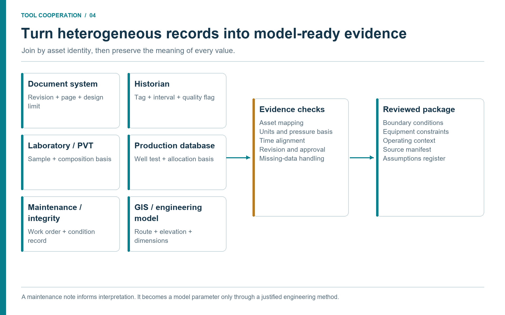

# Operational Data and Evidence Foundation

## Learning Objectives

After reading this chapter, the reader will be able to:

1. Map the main oil and gas evidence domains to their roles in a simulation study.
2. Distinguish source platforms, access libraries, exchange standards, and calculation tools.
3. Distinguish between real-time readings, archived historian data, and design-basis values.
4. Describe how production databases and project documentation provide context that turns calculations into decisions.
5. Design a governed data-ingestion pattern for agentic engineering tasks.
6. Identify common data-quality risks before using retrieved data in a model.

> **Beyond the online book:** The online book's worked examples use
> pre-defined compositions and conditions. This chapter addresses the
> reality that most industrial studies start with data scattered across
> laboratory systems, historian servers, asset-management systems, well and
> production databases, engineering repositories, and project archives.
> It provides the retrieval patterns, quality gates, and source-manifest
> schema needed to turn raw enterprise data into trustworthy model inputs.

## 4.1 The Data Problem Around Every Simulation

A process model is only as useful as the evidence behind its inputs. A gas
composition from a lab report, a separator design pressure from a datasheet, a
compressor map from a vendor package, a cooling-water inlet temperature from a
historian tag, and a maintenance history from an asset-management system can all change the conclusion
of a study. In many organizations these data sources are separate. The engineer
becomes the integration layer.

Agentic engineering makes that integration layer explicit. Instead of asking a
person to manually search every source, an agent can be instructed to retrieve
approved documents, read relevant pages, extract structured values, query
historian tags through the approved interface, and summarize enterprise records. The output
must not be an untraceable blob. It must be a source manifest: what was read,
where it came from, when it was retrieved, which values were extracted, what the
confidence is, and what still needs human review.

The retrieval workflow is as important as the simulation workflow. A beautifully
converged NeqSim result is not useful if it was built on stale, wrong, or
unapproved data.

## 4.2 Source Domains and Their Tool Handoffs

The following matrix organizes the evidence by what the next tool needs, rather
than by vendor. Each row is a proposed integration contract: it states what the
source reader must preserve before a downstream tool may use the information.
It is not a claim that every platform or connector is installed.

| Source domain | Typical records | Reader output and downstream use |
|---------------|-----------------|----------------------------------|
| Laboratory, fluid and PVT | Sample records, chromatography, recombination, water and contaminant analysis, PVT measurements | A fluid package with sample lineage, basis and uncertainties for characterization and independent property checks. |
| Wells and reservoir | Well and completion identifiers, surveys, pressure history, deliverability and forecast cases | Well-specific boundary conditions with date, completion state and forecast scenario for network simulation. |
| Production and allocation | Well tests, metering, daily balances, downtime and revised allocations | Rates and volumes on a declared period and reference basis for reconciliation and scenario selection. |
| Historian archives | Pressure, temperature, flow, power and status histories | Aligned windows with quality flags, aggregation rules and retained raw evidence for calibration and validation. |
| Online operations | Current readings, alarms, events and equipment states | Timestamped state observations with maximum age and validity rules for advisory calculations. |
| Engineering documents | P&IDs, datasheets, vendor maps, line lists and material specifications | Revision-controlled limits, topology and physical parameters with source pages for model construction. |
| Project and design basis | Concept studies, FEED, approved operating envelopes and acceptance criteria | Named design scenarios and criteria for comparison with current conditions. |
| GIS, survey and 3D engineering | Coordinates, route chainage, bathymetry, elevations and physical layout | Geometry with coordinate reference, vertical datum and topology for pipes, equipment and consequence studies. |
| Maintenance and integrity | Asset hierarchy, work orders, inspections, repairs and condition findings | Installed configuration, intervention history and availability constraints for equipment hypotheses. |
| Modification management | Proposed, approved, installed and closed changes | Effective configuration and unresolved conditions for separately named as-is and proposed scenarios. |
| Process safety | Hazard studies, relief basis, barriers, proof tests and cause-and-effect records | Applicable scenarios, limits and review requirements; independent safety conclusions remain traceable. |
| Energy and emissions | Fuel, flare, power, venting, emissions factors and reporting boundaries | Consistent scenario accounting, factor versions and uncertainty for operational comparisons. |
| Commercial and schedule | Cost estimates, contracts, outage plans and schedule assumptions | Dated economic and implementation constraints used after technical feasibility has been assessed. |

### 4.2.1 Platforms, Standards, and Libraries Are Different

AVEVA PI System and Aspen InfoPlus.21 illustrate the historian role. SAP asset
management and IBM Maximo illustrate the maintenance role. Esri's petroleum
GIS illustrates a spatial information role. These product categories help a
reader locate the corresponding source in their organization; they do not
imply a common API or an existing NeqSim connection.
\cite{AVEVAPI2026,AspenIP21Docs2026,SAPAssetManagement2026,IBMMaximo2026,EsriPetroleum2026}

OpenText Content Management for Engineering illustrates controlled engineering
documentation, while AVEVA Engineering illustrates a shared engineering-data
environment. SampleManager is an example of a laboratory information management
system (LIMS) with an oil and gas workflow. In the compressor case, these roles
would supply the revised datasheet, equipment attributes, and approved sample
record respectively. The handoff still needs evidence IDs and units; product
integration features do not establish that a particular reader tool has been
configured. \cite{OpenTextEngineering2026,AVEVAEngineering2026,SampleManagerOilGas2026}

A data platform may organize entities and their relationships across source
systems. OSDU data-definition documentation is one industry example. Exchange
standards serve a different purpose: Energistics defines WITSML for well-related
data, RESQML for subsurface/reservoir information, and PRODML for production
data. A particular schema version may help transfer a well, fluid, or production
record, but adoption does not remove the need to reconcile identifiers and
engineering meaning. \cite{OSDUDataDefinitions2026,EnergisticsStandards2026}

An access library is another layer: it reads a source through a supported
interface and returns records; it is not the underlying database. Choose an
approved, maintained API or export interface for each deployed platform and
record its version. OPC UA is a communication architecture that includes
current and historical data access; a server's actual supported services and
access rights must still be checked. \cite{OPCUA2026}

The general document workflow uses an approved search and retrieval interface.
A local export with revision metadata is a valid source path when live access
is unavailable; its currency and completeness must be visible. A file reader
can prepare model evidence from that export without claiming that it has
queried the enterprise system.

## 4.3 Retrieval Agents and Skills

The document retrieval pattern normally uses several agents.

| Agent or skill | Responsibility |
|----------------|----------------|
| `scout literature and databases` | Finds public references, standards, and internal references when configured. |
| `read technical documents` | Extracts structured data from PDFs, Excel, Word, images, P&IDs, and datasheets. |
| Site-specific document-retrieval skill | Retrieves controlled documents through approved backends or local exports; an the engineering repository skill is one example. |
| `neqsim-technical-document-reading` | Provides extraction patterns for drawings, stream tables, vendor maps, and datasheets. |
| `neqsim-plant-data` | Guides historian access, tag mapping, operating-window selection, and quality checks. |

### 4.3.1 Seven Stages from Source to Decision

A coordinated workflow turns independent retrievals into a shared evidence
package. The stages below define when one tool may hand information to the
next. Some retrieval tasks can run in parallel; acceptance of the combined
basis is a dependency for simulation.

| Stage | What the tools do together | Handoff and stop condition |
|-------|---------------------------|----------------------------|
| 1. Resolve identity | Asset-master, document and well readers map source identifiers to a canonical asset and equipment ID. | A reviewed crosswalk; stop if a tag or document could refer to more than one item. |
| 2. Establish units and basis | Extraction and normalization tools preserve original units, pressure reference, composition basis and standard-volume conditions. | Converted values with a transformation record; stop when the physical quantity or basis is unknown. |
| 3. Align time and configuration | Historian, lab, production and MOC readers establish the operating window and installed configuration. | A common evidence cut with source/effective/retrieval times; flag incompatible records. |
| 4. Check quality | Validation tools check source status, missing data, outliers, balances and applicable measurement uncertainty. | Accepted and rejected records with reasons; do not silently fill required gaps. |
| 5. Freeze the evidence package | The orchestrator records evidence IDs, files, hashes, mappings, assumptions and open issues. | A versioned input package that every specialist can reference. |
| 6. Simulate and compare | NeqSim and specialist solvers consume accepted inputs; independent measurements test the outputs. | Saved runs, residuals, convergence and limitations; separate solver failure from evidence failure. |
| 7. Prepare the decision | Safety, maintenance, environmental and reporting tools interpret the same scenario outputs. | A reviewable recommendation tied to the evidence and model versions; release authority remains explicit. |

Identity resolution deserves early attention. An instrument tag, a maintenance
asset number, a P&ID designation, and a model unit name can all refer to the same
compressor. Conversely, a reused instrument name can refer to different
locations over time. The crosswalk should carry validity dates and record the
source that justified the match. Text similarity is useful for finding
candidates; it is not sufficient evidence for a final join.

Unit normalization must preserve meaning. Record whether pressure is absolute
or gauge, whether a composition is mole or mass based, whether water was
excluded from an analysis, and which reference temperature and pressure define
a standard gas volume. Keep original and converted values side by side in the
transformation record. A numerical unit conversion cannot repair a mismatched
fluid sample or a phase-specific flow used as a total-stream flow.

Time alignment is equally explicit. Store source time, effective time, and
retrieval time separately. A document retrieved today may describe an earlier
configuration; a newly issued laboratory report may describe last week's
sample. Convert event timestamps to a common time zone while preserving their
original offsets. Do not combine a steady-state historian median with a daily
allocated volume without stating how the periods differ.

**Case handoff.** For the compressor case, document and maintenance readers
resolve the installed machine, the laboratory reader supplies the accepted gas
sample, and the historian reader supplies an operating window. Stage 5 freezes
those inputs together. Chapter 5 then uses that package to construct the
compression model and its facility boundaries.



**Discussion (Figure 4.1).**

The six source groups illustrate different record structures, not interchangeable stores. A laboratory sample has a composition basis; a historian interval has a time and operating mode; a drawing has a revision. Resolve those differences before building the input package. Preserve maintenance observations as context unless an engineering method justifies converting them into model parameters.

## 4.4 A Tag Mapping Pattern

Historian tags are rarely named the way a simulator variable is named. A tag
may encode facility, system, equipment, instrument type, and signal. Within a selected compression `ProcessSystem`, the model may expose
`Suction Gas.pressure` as an input on a named inlet stream. A tag map bridges
the two. Area selection belongs in the surrounding workflow; discover the
actual writable address before applying data.

```yaml
study_id: compressor_screen
asset_id: COMPRESSOR_A
equipment: Export Compressor
model_area: Compression
evidence_version: E1
scenario_id: observed_window
pressure_basis: absolute
time_basis: UTC
record_role: illustrative_mapping
model_variables:
  inlet_pressure:
    address: "Suction Gas.pressure"
    unit: "bara"
    historian_tag: "APPROVED_TAG_FOR_SUCTION_PRESSURE"
    role: input
    source_unit: "bara"
    quality_rule: "good_values_only"
  inlet_temperature:
    address: "Suction Gas.temperature"
    unit: "C"
    historian_tag: "APPROVED_TAG_FOR_SUCTION_TEMPERATURE"
    role: input
    source_unit: "C"
    quality_rule: "steady_state_median_30min"
```

This YAML describes the study contract rather than a complete NeqSim import
schema. It should also link to explicit start/end times, accepted point counts,
and measurement uncertainty in the evidence manifest. The exact tag names are asset-specific and should not be hard-coded in a public
book. The pattern is the important part. A model variable has an address, unit,
historian tag, time-window rule, and quality rule. The agent can then retrieve a
data window, calculate a robust median, detect bad periods, and set the process
model input.

## 4.5 Maintenance, Integrity, and Equipment Context

Enterprise asset management (EAM) and computerized maintenance management
systems (CMMS) usually supply context rather than thermodynamic inputs. Equipment master data
can confirm the equipment identity, installed location, manufacturer, and
functional hierarchy. Work orders and notifications can reveal recent repairs,
inspection findings, cleaning campaigns, and known limitations. Spare-parts
data can constrain what recommendations are realistic in the near term.

For example, an agent may find that a heat exchanger has lower duty than the
NeqSim model predicts. Historian data shows the temperature approach has
degraded over several months. The engineering repository provides exchanger surface area and
design duty. Maintenance records show repeated cleaning notifications and a planned shutdown
window. The engineering study can then become more useful: not just "calculated
duty is lower than design," but "observed duty degradation is consistent with
fouling; evaluate cleaning during the planned window and update the model after
post-cleaning data is available."

This is where maintenance evidence makes a calculated deviation actionable. The process model can quantify the effect. Enterprise data can explain
whether the effect is operationally actionable.

## 4.6 Production Databases: Well Tests, Allocation, and Reporting

Production databases are a critical but often neglected data source for
process simulation. They contain the measured throughput that links reservoir
deliverability to facility performance.

**Well tests** provide periodic measurements of individual well rates, water
cut, gas-oil ratio, wellhead pressure, and choke position. They help establish measured well boundary conditions; reservoir deliverability
also requires pressure, completion state, and an appropriate well/reservoir
model. A process
simulation that assumes a fixed feed composition and flow rate may be valid for
design-case screening, while a model using a reviewed, representative well test has a better defined
operating basis. The latest test is not automatically representative of the
current completion, reservoir state, or operating mode.

**Allocation data** distributes total measured production back to individual
wells or reservoirs. It provides the official volumes used for fiscal reporting
and reserves tracking. When an agent builds a multi-well field model, allocated
volumes can validate whether the simulation's well-level outputs are consistent
with field accounting.

**Daily production reports** capture actual throughput, flaring, injection
rates, and downtime events. They provide a day-by-day record of what happened.
When a simulation study asks "what would happen if we increased rate?" the
production report answers "what is the current rate, and what has it been?"

The agent pattern for production data is similar to historian data but with a
different structure. Production databases typically return tabular records
rather than time series. A well test report may give one measurement per well
per month. An allocation report may give daily volumes per well. The agent
should extract the most recent valid well test for each well, confirm its date,
and set the simulation boundary conditions accordingly. Define the acceptable test age for the question and operating stability. An
age threshold is a study assumption, not a universal three-month rule.

Production data also supports well-to-facility consistency checks, but raw
volumetric rates cannot simply be added across different pressure and
temperature conditions. Reconcile a common period, phase basis, and boundary.
Use component or mass balances, or convert each gas stream to the same stated
standard conditions. Account for inventory changes, reinjection, flare, fuel,
water separation, downtime, and measurement uncertainty before declaring a
meter or well test faulty. The reconciliation tool should return a residual
and a list of unresolved boundary terms, not a diagnosis based only on unlike
volumes.

### 4.6.1 Laboratory and PVT Handoffs

A gas composition should come from an identified laboratory analysis or online
analyzer record, possibly linked to a well test. A production-rate record alone
does not establish composition. Preserve sample location and time, sampling
conditions, analytical method, component basis, heavy-end characterization,
and review status. For a recombined reservoir fluid, retain the recombination
basis and the laboratory data used to assess it.

PRODML's version 2.0 PVT documentation illustrates a useful lifecycle: sample
acquisition, sample container, laboratory analysis, characterization, and
property generation remain related. This is an exchange example, not a claim
that the current NeqSim interface imports every PRODML object directly.
\cite{EnergisticsPVT2016}

The laboratory reader and fluid specialist cooperate at this boundary. The
reader returns the analyzed components and evidence; the specialist decides
how they map to simulator components and petroleum fractions. If a required
contaminant was not measured, record the gap or run a declared uncertainty case.
Do not convert a missing measurement to zero merely to complete an input
schema. Retain independent PVT measurements for validation rather than using
all observations to fit the same model.

### 4.6.2 GIS, Survey, and 3D Geometry Handoffs

Spatial information connects a stream-level calculation to the actual route
and layout. GIS tools may locate wells, pipeline corridors, and facilities;
survey records establish elevations and seabed profiles; a 3D engineering
model can supply equipment positions and piping configuration. GIS is used
across upstream, midstream, and downstream petroleum work. \cite{EsriPetroleum2026}

A geometry-preparation tool should return segment lengths, elevations,
diameters and relevant physical attributes with a coordinate reference system,
vertical datum, revision, and source. Map coordinates are not automatically
pipe lengths; a plan-view route is not a verified elevation profile. The
pipeline specialist must reconcile these before using gravity and heat-transfer
calculations. A layout is also distinct from process topology: the P&ID and
connection records establish what is connected, while the geometry describes
where it is installed.

## 4.7 Project Documentation and Modification Management

Two source classes that are rarely integrated into process simulation studies
deserve explicit treatment: project documentation and modification management
records.

### 4.7.1 Project Documentation

A facility's design intent is captured in project documentation: the design
basis memorandum, basis of design, FEED reports, concept study reports,
decision-gate (DG) packages, and technical safety evaluations. These documents
define the assumptions that shaped the original design. They answer questions
like:

- What composition, flow rate, and pressure range was the facility designed for?
- What design margins were assumed for critical equipment?
- What acceptance criteria were set for gas quality, flaring limits, and water discharge?
- What alternatives were evaluated and why were they rejected?

When an agent performs a brownfield capacity screening, project documentation
tells it what the original envelope was. If the current operating conditions
have drifted outside the design basis, the study should flag this explicitly.
If the agent finds that a proposed operating change is within the design
margins documented in the FEED report, the confidence in the recommendation
increases.

Project documentation is typically stored in document management systems like
controlled engineering repositories, collaboration platforms, or project data warehouses. The agent access pattern is
similar to technical document retrieval: search by facility, system, and
document type; retrieve the document; extract relevant values; cite the source
and revision. The difference is that project documents are often large
narrative reports rather than structured datasheets. The agent may need to read
multiple pages of a FEED report to find the relevant design margins.

### 4.7.2 Modification Management and Management of Change

Modification management records track what has been changed, what is being
changed, and what is planned to change. In many organizations, these records
live in dedicated MOC systems, enterprise asset-management workflows, or
project planning tools. The system of record depends on the organization.

For process simulation, modification records answer essential questions:

- Has the equipment configuration changed since the last approved datasheet?
- Is there a modification in progress that affects the equipment being studied?
- Are there planned changes that the study should consider?
- Was a previous modification assessed against the same operating scenario?

A study that recommends increasing compressor throughput should check whether
the compressor is subject to a pending modification. A study that finds a
separator bottleneck should check whether an upgrade project is already
approved. Without this context, the agent may produce technically correct but
practically redundant or conflicting advice.

Management of change (MOC) records are particularly important for safety
studies. A HAZOP deviation or LOPA study should consider not only the current
configuration but also any modifications in the pipeline. If a valve is being
replaced or a control system is being upgraded, the safety assessment should
reflect the as-will-be configuration, not just the as-is.

Keep installed and proposed configurations separate. A pending modification
does not alter the as-is model, but its proposed geometry, internals, control
logic, or operating conditions may define a new simulation scenario. Preserve
its approval status and effective date; never apply a planned change silently
to the operational baseline.

## 4.8 Online Data Versus Archived History

Historian data and online data both come from instruments, but they serve
different engineering purposes and have different quality characteristics.

**Archived historian data** is stored time-series evidence. Its sampling,
compression, interpolation, and retention depend on source configuration. It is the basis
for trend analysis, steady-state window identification, and performance
tracking. When an agent reads a 30-minute median from PI or IP.21, it is using
archived data.

**Online data** is the current or near-current reading from an instrument,
with age established from its source timestamp rather than assumed from a
label such as "live". It is the basis for live advisory, alarm validation,
and advisory monitoring. An agent that reads the current compressor suction
pressure and compares it to a model prediction is using online data.

The distinction matters for three reasons:

1. **Temporal validity.** Archived data can be selected from a known operating
   window. Online data captures the present moment, which may be transient,
   abnormal, or in the middle of a process upset. A steady-state model should
   not be compared against a live reading taken during a slug event.

2. **Data quality.** Archived data can be filtered for bad values, flatlines,
   and sensor faults before use. Online data may contain momentary glitches
   that have not yet been flagged.

3. **Decision context.** Archived data supports post-event analysis, model
   calibration, and performance benchmarking. Online data supports real-time
   decision support: should the operator change a setpoint now? Is the current
   alarm real or spurious?

An agentic system that integrates both should label the data basis clearly.
A model calibrated against a 2-hour historian window and then compared against
live readings is doing two different things. Both are valuable, but the
uncertainty and interpretation differ.

For real-time advisory, the agent workflow typically looks like this:

1. Read the latest value from each mapped tag.
2. Check each reading against physical plausibility bounds.
3. Check timestamps, time alignment, operating mode, and stale-data limits;
   assign only accepted readings to simulation inputs.
4. Run the process model.
5. Compare model outputs to independent measured outputs, preserving uncertainty.
6. If deviations exceed thresholds, generate an advisory with both the model
   prediction and the measured value.

This is a live diagnostic loop. It requires fast model execution, robust
handling of bad data, and clear presentation of results. It also requires
governance: who sees the advisory? What authority does it carry? These
questions are addressed in Chapter 8.

## 4.9 Data Quality Gates

Every retrieved value should pass simple gates before entering a simulation.

| Gate | Question | Example failure |
|------|----------|-----------------|
| Source approval | Is this source allowed for the study? | Private draft document used without approval. |
| Currency | Is the document or tag window current enough? | Old datasheet superseded by later modification. |
| Unit clarity | Are units explicit and converted correctly? | Gauge pressure treated as absolute pressure. |
| Time alignment | Do tags represent the same operating period? | Flow from Monday combined with temperature from Friday. |
| Physical plausibility | Does the value fit its sign convention, sensor range and physical role? | Reverse flow discarded as impossible without checking the sign convention. |
| Review status | Has a human accepted extracted values for high-impact use? | OCR reading used without checking the drawing. |

The agent should fail early when these gates fail. A failed data gate is a good
result: it prevents a bad calculation from becoming a polished report.

## 4.10 Source Manifest Pattern

A source manifest is the bridge between retrieval and trust. It should be
machine-readable enough for agents and clear enough for engineers. A simple
manifest entry can look like this:

```yaml
source_id: COMP-DS-001
source_type: datasheet
system: approved_document_repository
title: Export compressor datasheet
revision: B
retrieved_at: 2026-05-08T10:30:00Z
retrieved_by: study_agent
access_basis: user_authorized
extracted_values:
  design_pressure:
    value: 160.0
    unit: bara
    page: 2
    confidence: high
    review_status: checked
  rated_power:
    value: 12.5
    unit: MW
    page: 3
    confidence: medium
    review_status: needs_review
limitations:
  - Vendor curve image was low resolution.
  - Rated power needs confirmation against driver datasheet.
```

The manifest should travel with the study. If the calculation is rerun six
months later, the reviewer can see which source revision was used and whether a
newer document exists. If an extracted value was medium confidence, a later
agent can prioritize human review before reusing it.

This pattern is also useful for historian data. A tag window should be recorded
with tag name, unit, start time, end time, aggregation rule, number of points,
bad-quality percentage, and reason for choosing the window. A steady-state
median is much more defensible when the source manifest explains how it was
selected.

## 4.11 Data Fusion Without Confusion

The temptation in agentic systems is to fuse all available data into a single
answer. Engineering work needs a more careful pattern. Data sources should be
joined only when their basis is compatible.

For example, a compressor datasheet may define rated conditions at a specific
gas composition and speed. Historian tags may represent a different composition
and speed. Maintenance history may describe a condition that started after
the selected tag window. A NeqSim model may use a simplified compressor
efficiency rather than the full map. Joining these sources without stating the
basis can produce a confident but misleading conclusion.

A disciplined workflow keeps three basis labels visible:

| Basis | Meaning | Example |
|-------|---------|---------|
| Design basis | Original or revised engineering design condition | Datasheet rated flow and pressure. |
| Operating basis | Selected plant-data window or operating mode | Last 30 minutes of stable operation. |
| Simulation basis | Model assumptions used for calculation | SRK EOS and current gas composition. |

When the bases differ, the report should say so. The compressor may be inside
the design basis but outside the current operating basis. A heat exchanger may
meet design duty but fail to deliver observed duty because fouling is present.
An agent that preserves the distinction helps the engineer reason; an agent that
collapses it hides the problem.

## 4.12 Studies Enabled by Integrated Data

Access to maintenance systems, document repositories, historians, production databases, and project
documentation does not merely make existing studies faster. It enables studies
that were previously too cumbersome to run. Examples include:

| Study | Why it was hard before | What data access changes |
|-------|------------------------|--------------------------|
| Maintenance-value screening | Needed duty loss, production impact, and planned work windows | Combines NeqSim, tags, maintenance work orders, and shutdown plans. |
| As-built capacity screening | Needed current datasheet revisions and operating envelope | Retrieves controlled engineering documents and current historian windows. |
| Barrier health review | Needed cause-and-effect, proof tests, and process conditions | Combines safety documents, maintenance proof-test records, and model scenarios. |
| Energy optimization | Needed actual fuel use, compressor performance, and production | Joins power/fuel tags with thermodynamic model outputs. |
| Brownfield modification triage | Needed equipment constraints and operational value | Links process constraints to document evidence and maintenance feasibility. |
| Well-to-facility reconciliation | Needed well test data, allocation, and facility metering | Compares production database volumes against facility model. |
| Design-margin utilization | Needed original design basis and current operating envelope | Extracts FEED margins and overlays current performance from historians. |
| MOC impact screening | Needed modification scope, affected equipment, and process interactions | Queries MOC records and runs simulation with modified configuration. |

These workflows are powerful because they connect technical feasibility to
operational action. A simulation may show that a higher production rate is
possible, but the maintenance system may show that a limiting valve replacement is already planned.
A model may show that a heat exchanger cleaning would recover duty, while the
maintenance plan may show the earliest practical window. The study becomes a
decision workflow rather than a calculation exercise.

## 4.13 NeqSim Infrastructure for Data-to-Model Binding

The concepts described so far --- tag mapping, evidence packages, data quality
gates --- are not only workflow patterns for agents to follow. NeqSim provides
concrete Java classes that implement them, so the agentic workflow has a
programmable backbone rather than relying on convention alone. This section
describes the key classes in the `neqsim.process.operations` package and shows
how they bridge technical documents, plant data, and process simulation.

### 4.13.1 OperationalTagMap and OperationalTagBinding

The `OperationalTagMap` class is a portable, plant-agnostic map from logical
operating tags to NeqSim measurement devices and automation addresses. Each
entry is an `OperationalTagBinding` that records:

- a **logical tag** name used in public workflows and reports;
- an optional **historian tag** for connecting to PI, IP.21, or other time-series databases;
- a **P\&ID reference** for traceability to drawings;
- an **automation address** that maps to `ProcessAutomation` for reading or writing simulation variables;
- a **unit**, **role** (input, benchmark, virtual), and **description**.

The map intentionally delegates field-data writes to existing measurement
devices and model writes to `ProcessAutomation`. It does not replace the NeqSim
instrumentation model; it provides a reusable bridge for P\&ID and historian
workflows.

The following Java excerpt binds a pressure measurement to an existing
`ProcessSystem process` and its feed `Stream feed`, named `Suction Gas`.
The measurement device applies the accepted field pressure to that stream.
Import `neqsim.process.operations.*`,
`neqsim.process.measurementdevice.InstrumentTagRole`,
`neqsim.process.measurementdevice.PressureTransmitter`, and `java.util.*`:

```java
PressureTransmitter pressure = new PressureTransmitter("Suction Pressure", feed);
pressure.setUnit("bara");
pressure.setTag("HISTORIAN_SUCTION_PRESSURE");
pressure.setTagRole(InstrumentTagRole.INPUT);
process.add(pressure);

OperationalTagMap tagMap = new OperationalTagMap();
tagMap.addBinding(
    OperationalTagBinding.builder("Suction_Pressure")
        .historianTag("HISTORIAN_SUCTION_PRESSURE")
        .pidReference("PT-1001")
        .unit("bara")
        .role(InstrumentTagRole.INPUT)
        .build());
```

When the agent retrieves field data from a historian, the tag map can apply it
directly to an existing `ProcessSystem process`:

```java
neqsim.util.validation.ValidationResult validation = tagMap.validate(process);
if (!validation.isValid()) {
    throw new IllegalArgumentException(validation.getReport());
}
Map<String, Double> fieldData = new LinkedHashMap<>();
fieldData.put("Suction_Pressure", 72.3);

Map<String, Double> applied = tagMap.applyFieldData(process, fieldData);
process.run();
Map<String, Double> modelValues = tagMap.readValues(process);
```

Call `tagMap.validate(process)` explicitly and inspect its errors and warnings
before `applyFieldData`. The latter does not automatically execute that
validation, and unbound or missing values are not a substitute for a complete
input package. Record required-field completeness in the surrounding workflow.
The tagged-pressure example was executed in the book's focused Java checks:
the binding validates and applies 72.3 bara, which `readValues` reads back.
An alternative automation binding needs a uniquely resolved writable variable;
discover its descriptor and validate the complete map before using it. The
pressure example uses the measurement route because the inspected stream
registry exposes duplicate input/output pressure descriptors.
<!-- @neqsim:claim source=revision_support/junit_verification.json key=tag_binding trace=revision_support/junit_verification.log -->
This is the programmable version of the YAML tag-mapping pattern described
earlier. The advantage is that the tag map travels with the process model
and can be serialized, versioned, and tested.

### 4.13.2 OperationalEvidencePackage

The `OperationalEvidencePackage` class orchestrates a complete evidence report
from document-derived tags, field data, operational scenarios, and bottleneck
analysis. It takes a process system, a tag map, field data, and a list of
scenarios, and returns a structured JSON object containing:

- **base evidence:** model values for every bound tag;
- **benchmark comparison:** model-versus-field deviation for each tag, with pass/fail against a configurable tolerance;
- **bottleneck analysis:** capacity constraints from the registered equipment strategies;
- **scenario results:** before/after values for each operational scenario;
- **quality gates:** checks on the assembled comparison, capacity and scenario results;
  source freshness, document approval and raw-data quality remain upstream responsibilities.

This is the artifact that makes agentic integration auditable. An agent does
not simply assert that the model matches plant data. It produces a JSON
object where every deviation is visible, configured tags are identifiable, and
scenario results can be compared against a baseline. The broader source
manifest must supply document revisions, timestamps, and extraction provenance;
these are not automatically created by the calculation class.

### 4.13.3 From Tags to Decisions

The infrastructure described here transforms the data integration pattern from
a manual checklist into a first-class part of the simulation workflow. An
agent that uses these classes does not need to coordinate tag mapping, data
application, model execution, and evidence collection as separate manual steps.
The calculation stages can be coordinated in a report-building call once
external retrieval, mapping validation and evidence acceptance have completed.
A call to `buildReport` does not itself log into source systems or verify a
datasheet revision.

This matters because the bottleneck in many operational studies is not the
flash calculation or the separator sizing. It is the translation between
plant-data systems, engineering documents, and process models. The
`OperationalTagMap` and `OperationalEvidencePackage` classes move that
translation into tested, versioned code that agents can invoke and engineers
can inspect.

## 4.14 Worked Example: Tools Cooperating on a Compressor Question

Consider the bounded question: does a change in feed justify an equipment
performance investigation before increasing throughput? The input records below
are synthetic teaching data, not a retrieved asset record. Numerical NeqSim
checks are identified separately from those inputs. The workflow demonstrates
how a workbench could connect approved industry tools without assuming that
any live enterprise connector is available.

### 4.14.1 Resolve the Equipment and the Rated Basis

The orchestrator gives the document reader the study ID and canonical
compressor ID. The reader locates the reviewed datasheet and vendor map; the
maintenance reader checks the installed configuration. The values below describe
a **rated reference point**. They are not allowable upper and lower operating
limits.

| Parameter | Synthetic rated value | Required evidence in a real study |
|-----------|-----------------------|-----------------------------------|
| Suction pressure | 72.0 bara | Rated condition, document revision and page. |
| Discharge pressure | 155.0 bara | Rated condition and applicable speed. |
| Suction temperature | 308.15 K (35.0 °C) | Rated gas conditions. |
| Gas molar mass | 18.5 g/mol | Rated composition or vendor fluid basis. |

The handoff identifies unresolved map, driver, discharge-temperature, and
anti-surge limits. If these are absent, the study may compare thermodynamic
conditions but cannot conclude that the machine is inside its operating
envelope.

### 4.14.2 Select an Operating Window

A historian tool returns an aligned window and its quality metadata. A
preparation tool classifies the operating mode, rejects invalid readings and
records the chosen aggregation. In this synthetic example, the accepted values
are:

| Logical measurement | Synthetic operating value | Model role |
|---------------------|---------------------------|------------|
| Suction pressure | 68.4 bara | Inlet boundary input. |
| Discharge pressure | 148.7 bara | Outlet pressure specification. |
| Suction temperature | 311.35 K (38.2 °C) | Inlet boundary input. |
| Gas rate | 42,500 standard m³/h | Input only after standard conditions are declared. |

A real package must state the window start/end, coverage, status flags, and
uncertainty. Good sensor status alone does not establish steady state. Driver
power and discharge temperature, if available, are retained as independent
validation measurements rather than overwritten with predicted values.

### 4.14.3 Obtain the Fluid Basis

The laboratory reader supplies an approved sample or analyzer record linked to
the same period. It passes the composition and sampling metadata to the fluid
specialist. The synthetic mole-fraction input is:

```yaml
methane: 0.82
ethane: 0.08
propane: 0.04
n-butane: 0.015
i-butane: 0.01
CO2: 0.025
nitrogen: 0.01
```

The fractions sum to 1.000. That checks normalization, not representativeness.
The fluid specialist must also assess sampling location, phase basis, omitted
water/contaminants, and applicability of the selected EOS. A well-test rate
record alone is insufficient evidence for this composition.

### 4.14.4 Freeze Inputs and Call NeqSim

The orchestrator records evidence version E1 and scenario `observed_window`.
Input validation checks the fluid, absolute pressure, temperature, and model
settings. The following source-checked `runFlash` request illustrates the
current interface; an installed server's discovered schema remains decisive.

```json
{
  "jsonrpc": "2.0",
  "id": 21,
  "method": "tools/call",
  "params": {
    "name": "runFlash",
    "arguments": {
      "components": "{\"methane\":0.82,\"ethane\":0.08,\"propane\":0.04,\"n-butane\":0.015,\"i-butane\":0.01,\"CO2\":0.025,\"nitrogen\":0.01}",
      "temperature": 311.35,
      "temperatureUnit": "K",
      "pressure": 68.4,
      "pressureUnit": "bara",
      "eos": "SRK",
      "flashType": "TP"
    }
  }
}
```

A source-backed calculation for this input using SRK and the classic mixing
rule gives a single gas phase, molar mass 20.1582 g/mol, compressibility factor
0.856277, and initialized physical density 62.4466 kg/m³. The reported physical density uses
NeqSim's volume-correction treatment and therefore need not equal a density
reconstructed from the uncorrected EOS compressibility factor alone.

<!-- @neqsim:claim
  baseline: revision_support/calculation_verification.json
  script: revision_support/verify_calculations.py
  result: suction_flash.properties
  scope: source-backed execution and internal consistency, not independent physical validation
-->

### 4.14.5 Run the Equipment Model with Explicit Assumptions

The process model consumes the accepted fluid, flow and pressure boundaries.
For a polytropic calculation with assumed efficiency 0.78, the model must select
polytropic mode explicitly: `setUsePolytropicCalc(true)` as well as
`setPolytropicEfficiency(0.78)`. Setting an efficiency value alone does not
select that calculation mode. Record the chosen method and the reference
conditions used to interpret the standard gas rate.

The output package should contain inlet/outlet conditions, power, head,
convergence status, and every model assumption. It is a thermodynamic
compression calculation until a suitable vendor map, speed, driver limit, and
control context are included. A specified outlet pressure is an input; matching
it is not an independent validation success.

For the executed teaching case, the standard gas volume is defined at
288.15 K and 101,325 Pa with the ideal-reference convention used by the stream
conversion. The explicit polytropic calculation gives:

| Calculated quantity | Value |
|---------------------|-------|
| Feed mass rate | 10.0647 kg/s |
| Discharge temperature | 380.653 K (107.503 °C) |
| Compressor power | 1,270.09 kW |
| Polytropic head | 98.4298 kJ/kg |

<!-- @neqsim:claim
  baseline: revision_support/calculation_verification.json
  script: revision_support/verify_calculations.py
  result: compressor
  scope: source-backed execution and internal mass/energy checks
-->

The verification record checks the stream conversion and mass/energy
consistency. These are useful internal checks, not independent validation of
an installed compressor or its assumed efficiency. A different reference-volume
convention must be converted before reusing the gas-rate input.

### 4.14.6 Compare Like Quantities Without Inventing Limits

The arithmetic comparisons below follow directly from the supplied teaching
inputs and the calculated molar mass. Relative changes use the rated value as
the denominator. Temperature is reported as a difference in K; a percentage
based on degrees Celsius would have an arbitrary zero.

| Quantity | Rated reference | Operating/calculated value | Difference |
|----------|-----------------|----------------------------|------------|
| Suction pressure | 72.0 bara | 68.4 bara | −5.00% |
| Discharge pressure | 155.0 bara | 148.7 bara | −4.06% |
| Suction temperature | 308.15 K | 311.35 K | +3.20 K |
| Molar mass | 18.5 g/mol | 20.1582 g/mol | +8.96% |

These differences identify a changed operating point. They do not establish
surge margin, driver adequacy, mechanical acceptance, or an allowable throughput
increase. The validation specialist returns that distinction to the
orchestrator, together with the missing evidence needed for an envelope check.

### 4.14.7 Bring the Other Tools Back into the Decision

The maintenance reader tests whether recent repair or degradation records
explain the change. The production tool checks whether the requested throughput
is deliverable and consistent with the selected period. The safety reviewer
identifies affected limits and change requirements. The emissions calculation
uses scenario power and the relevant energy/emissions basis; it must distinguish
electricity imports, fuel combustion, flaring, and venting. The reporting tool
then presents the same scenario and evidence IDs to the engineer.

This is a complete cooperation pattern even when its conclusion is that more
evidence is needed. Successful retrieval does not guarantee accepted inputs;
a converged thermodynamic calculation does not guarantee an approved operating
change. The practical output is the result, its basis, the current constraint,
and the next justified action.

## 4.15 Summary

Agentic process simulation depends on governed data retrieval as much as on
calculation. Technical documents provide design evidence. Historians provide
operating evidence from archived time series. Real-time readings provide the
current state for live advisory. Production databases provide reservoir
deliverability and actual throughput. Project documentation provides design
intent and acceptance criteria. Modification management records track what has
changed and what is planned. EAM/CMMS systems provide asset context,
maintenance feasibility, and spare-part availability. Skills and agents connect
the relevant evidence domains to NeqSim models while keeping source provenance
visible. The `neqsim.process.operations` package provides concrete Java
classes --- `OperationalTagMap`, `OperationalTagBinding`, and
`OperationalEvidencePackage` --- that implement data-to-model binding as a
programmable, testable, and auditable workflow.

Key points from this chapter:

- The relevant evidence domains include fluid/PVT, subsurface, operations, geometry, documents, maintenance, safety, and emissions.
- Retrieval should produce structured evidence with source, unit, confidence, and review status.
- Historian tags need mapping, time-window selection, and quality checks before model use.
- Online real-time readings serve different purposes than archived historian data; the agent must label the basis.
- Production databases provide well tests, allocation, and throughput that set reservoir boundary conditions.
- Project documentation provides design margins, acceptance criteria, and original study assumptions.
- Modification management records prevent recommendations that conflict with approved changes.
- Maintenance and integrity data help turn a calculated deviation into a practical intervention.
- Data gates are essential for preventing fast but unsupported simulations.
- NeqSim's operational tag map and evidence-package classes turn data integration from convention into code.

## Exercises

1. **Source manifest:** Design a source manifest for a pump performance study using a datasheet, three historian tags, and maintenance work orders.
2. **Tag mapping:** Define a tag map for separator pressure, temperature, gas flow, liquid level, and water cut. Include source timestamps, units, quality rules and validation roles.
3. **Quality gate:** List three reasons a retrieved value should be rejected before entering a process model.
4. **Evidence package:** Describe what an `OperationalEvidencePackage` report should contain for a compressor study that compares model predictions against historian data.

## References

This chapter uses references from the master bibliography.
