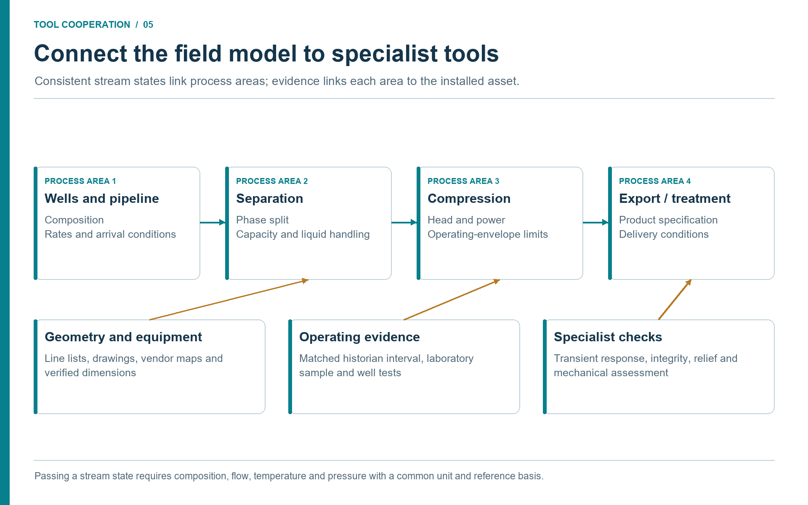

# From Modular Field Models to Equipment Studies

## Learning Objectives

After reading this chapter, the reader will be able to:

1. Explain why facility models should be built as named process areas rather than one opaque flowsheet.
2. Use a modular NeqSim model as the starting point for equipment-detail studies.
3. Link model variables to controlled engineering documents, historian tags, vendor evidence, maintenance records, and review gates.
4. Feed equipment constraints back into the field model without losing scenario traceability.

> **Beyond the online book:** The online book demonstrates individual NeqSim calculations and equipment examples. This chapter connects those pieces into one operating pattern: modular field models provide the facility context, and equipment-detail studies provide the evidence needed to update constraints, explain bottlenecks, and support decisions.

## 5.1 The Model-to-Equipment Chain

Agentic facility work becomes useful when a high-level model and a detailed equipment question are connected. A field model may show that the export compressor limits production, that a separator is close to liquid-handling capacity, or that a cooler cannot reach the target outlet temperature. The next question is not only mathematical. It is evidence-based: what does the datasheet say, what do the tags show, what has changed in maintenance history, and what review is needed before the conclusion can affect operation?

This chapter combines two ideas that are often treated separately. Modular field models create the stable process context. Equipment studies drill into the item that matters. The agentic workflow carries assumptions and evidence across the boundary instead of leaving each study isolated in a notebook, spreadsheet, or chat transcript.

## 5.2 Reference Field Architecture

A practical facility model should be split into process areas with clear owners and handoffs.

| Area | Main content | Typical study use |
|------|--------------|-------------------|
| Reservoir and wells | Production profiles, wellstream fluids, well pressures | Forecasts, constraints, and well sensitivity. |
| Subsea and pipelines | Flowlines, risers, route data, thermal environment | Arrival pressure, hydrate margin, cooldown, and water hammer screening. |
| Inlet and separation | Slug catcher, HP/LP separators, stabilization | Capacity, phase split, liquid handling, and relief implications. |
| Compression and dehydration | Scrubbers, compressors, coolers, dehydration | Export pressure, power, dew point, and emissions. |
| Utilities and power | Fuel gas, turbines, cooling, heat recovery | Energy, CO2 intensity, and utility constraints. |
| Flare and safety | Relief loads, blowdown, barriers, inventories | Safety screening and contingency studies. |
| Economics and reporting | Production, CAPEX/OPEX, uncertainty, risk | Concept and operating-decision support. |

The architecture is not a mandatory template. The principle is that each area has a named boundary, a documented data basis, and explicit stream or signal connections to neighbouring areas.

## 5.3 ProcessModel Pattern

NeqSim supports modular work through `ProcessSystem` and `ProcessModel`. A `ProcessSystem` represents one process area. A `ProcessModel` composes several named systems into a field or facility model. Shared streams can connect areas by object reference, and the combined model can be run iteratively until the handoffs converge.

The following source-checked structural excerpt assumes that the standard
`neqsim_dev_setup` cell has created `ns` and that a reviewed feed stream named
`feed` already exists. It illustrates module assembly, not a validated equipment
design. The outlet pressure is a teaching input; a real compressor also needs
an explicit efficiency/method or a suitable performance map.

```python
def build_separation(feed_stream):
    separation = ns.ProcessSystem()
    separation.add(feed_stream)
    hp_separator = ns.Separator("HP Separator", feed_stream)
    separation.add(hp_separator)
    return separation, hp_separator.getGasOutStream(), hp_separator.getLiquidOutStream()

def build_compression(gas_stream):
    compression = ns.ProcessSystem()
    compressor = ns.Compressor("Export Compressor", gas_stream)
    compressor.setOutletPressure(150.0, "bara")
    compression.add(compressor)
    return compression, compressor.getOutletStream()

plant = ns.ProcessModel()
separation, gas_to_compression, oil_stream = build_separation(feed)
compression, export_gas = build_compression(gas_to_compression)
plant.add("Separation", separation)
plant.add("Compression", compression)
plant.run()
```

In a real study, each builder function can read a configuration file, attach controllers, register automation variables, connect evidence metadata, and save a lifecycle state. That structure lets an agent localize a change: update the compression area with a retrieved compressor curve, or run the pipeline area for a cold hydrate case.

### 5.3.1 Module Contracts Let Different Tools Cooperate

A module boundary should describe more than the name of its outlet stream.
The upstream specialist supplies composition, phase basis, pressure,
temperature, rate, and scenario identity. The downstream specialist returns
its required backpressure, utility demand, and capacity constraints. The
orchestrator reconciles these handoffs while preserving a shared model and
evidence revision.

| Boundary | Upstream tool contribution | Downstream return and acceptance check |
|----------|----------------------------|----------------------------------------|
| Reservoir to wells | A selected forecast or deliverability case with pressure and fluid basis | Well constraints and feasible rates; reconcile completion state and date. |
| Wells to gathering | Wellstream components, flow and thermal boundary | Network backpressure and arrival conditions; reconcile time and phase basis. |
| Gathering to separation | Arrival stream and relevant slug or transient scenario | Inlet pressure requirement, gas/oil/water separation loads and constraints. |
| Separation to compression/export | Gas composition, rate and suction conditions | Discharge requirement, recycle, power and product-quality constraints. |
| Process to utilities/emissions | Heating, cooling, power, fuel and flare requirements | Available utility capacity and consistent emissions accounting. |
| Integrated model to equipment review | Loads and selected scenarios with evidence IDs | Reviewed equipment constraints and proposed scenario changes. |

A downstream pressure change can affect well deliverability and pipeline
arrival conditions. Therefore a set of individually converged modules is not
necessarily a converged facility. Check boundary consistency and overall
component, mass, and energy balances. When different tools exchange files or
API results, document interpolation, units, component mapping, and iteration
criteria at the boundary. Do not claim that NeqSim automatically couples to an
external reservoir or network simulator merely because each has an API.

The practical handoff is a compact package containing `study_id`,
`scenario_id`, `evidence_version`, `model_revision`, `boundary_id`, the physical
values and units, convergence status, and unresolved conditions. A specialist
may revise its own module, but a changed boundary creates a new integrated
scenario that must be checked downstream and, where coupled, upstream.

## 5.4 Stable Addresses and Automation

Large models need stable variable addresses. NeqSim's automation layer provides string-addressable variables such as:

```text
Separation::HP Separator.gasOutStream.temperature
Compression::Export Compressor.outletPressure
Pipelines::Export Flowline.outletStream.pressure
Utilities::Fuel Gas.flowRate
```

Here, `Fuel Gas` is the name of an inlet `Stream` in the `Utilities` area.

An area-qualified address can identify a variable in the integrated model. When a tool accepts a single `ProcessSystem`, select the area first and use its locally discovered address. Confirm that a target is an INPUT before writing it; a displayed output is not necessarily writable. Tag maps, document extraction outputs, and reports can then identify the same variable without guessing object paths. If the accepted historian package gives a suction pressure for the selected operating window, the agent can apply that value to the correct model address and rerun the scenario.

Stable addresses also make results reproducible. A table can state exactly which variable was changed, what value was read, which unit was used, and which scenario state stored the result.

## 5.5 Study Model, Advisory Model, and Design Model

Not every modular model has the same authority.

| Model type | Purpose | Data connection | Governance level |
|------------|---------|-----------------|------------------|
| Study model | Answer a defined engineering question | Manual inputs or retrieved snapshots | Study-team review. |
| Operational advisory model | Support repeated monitoring or what-if use | Historian windows and approved tag maps | Read-only, validated, logged. |
| Controlled design model | Formal basis for design or safety decision | Controlled inputs and frozen assumptions | Discipline approval and document control. |

Agentic workflows can support all three, but the allowed autonomy changes. A desktop study model may be interactive. An advisory model should be read-only and logged. A controlled design model needs frozen assumptions, review records, and revision control; a simulator run does not itself certify a design.

## 5.6 Steady-State and Dynamic Use

A modular model often starts as steady-state because steady-state simulation is the right tool for capacity screening, product quality, energy use, and scenario comparison. Dynamic simulation is needed when the question is time-dependent: depressurization, control response, startup, shutdown, slug clearing, or water hammer.

| Engineering question | Mode | Reason |
|----------------------|------|--------|
| Where is the compressor operating point relative to a validated map? | Steady-state | Settled operating-point and driver/load checks; transient surge protection needs separate analysis. |
| How fast must an anti-surge valve open? | Dynamic | Time-dependent response to a flow transient. |
| What separator size is needed at design rate? | Steady-state | Retention and gas-load checks at converged conditions. |
| What happens to separator level during a slug? | Dynamic | Holdup response to a time-varying inlet. |
| What is the blowdown time and minimum temperature? | Dynamic | Pressure and temperature transient during depressurization. |

For facility work, dynamic mode is often applied to one process area while the larger model supplies boundary conditions. The agent should explain that choice instead of treating every simulation as the same type of calculation.

## 5.7 Evidence Links

A modular model becomes credible when each area can point to its evidence:

- separation area to vessel datasheets, inlet conditions, internals, and separator tests;
- compression area to vendor curves, driver data, performance tags, and maintenance history;
- pipeline area to line lists, route data, ambient profiles, and flowline drawings;
- safety area to relief basis, blowdown philosophy, cause-and-effect charts, and barrier registers;
- utilities area to fuel gas tags, turbine performance, cooling limits, and emissions factors.

The evidence link should be explicit. Useful metadata includes `source_document`, `source_revision`, `retrieved_at`, `review_status`, and `assumption_owner`. The agent can then flag stale evidence and expose uncertainty instead of hiding it in prose.

## 5.8 Equipment Evidence Package

An equipment-detail study starts with a compact evidence package.

| Evidence item | Typical source | Use in study |
|---------------|----------------|--------------|
| Equipment tag and service | Controlled equipment register | Identity and model mapping. |
| Datasheet | Controlled document repository or vendor package | Design pressure, temperature, capacity, material. |
| Performance curve or map | Vendor package | Compressor, pump, fan, valve, or exchanger performance. |
| Process conditions | NeqSim model and historian tags | Current and scenario loads. |
| Maintenance history | EAM/CMMS notifications and work orders | Fouling, degradation, repair, and operating context. |
| Standards and technical requirements | Standards database, corporate documents | Acceptance criteria and safety factors. |

The report should separate values from simulation, documents, tags, and assumptions. That separation is what lets the engineer judge whether the result is a screening, a verification, or evidence submitted for formal approval.

## 5.9 Equipment Study Examples

**Compressor.** A compressor bottleneck study can combine simulated suction conditions, gas composition, required head, power, vendor map, driver load tags, anti-surge position, and maintenance history. The output should identify whether the active constraint is process load, map limit, driver power, recycle, or degradation.

**Heat exchanger.** A heat exchanger study can compare model duty with observed duty from tags, check approach temperature and pressure drop against datasheet limits, and review cleaning history. The agent should distinguish between fouling, wrong flow, wrong composition, bypassing, and instrument error.

**Separator.** A separator study can combine gas and liquid rates, densities, viscosities, surface tension, vessel dimensions, demister type, retention time, level settings, and relief implications. Datasheet and mechanical-drawing evidence is essential; the process model alone does not know the physical internals.

**Valves and instruments.** Valve and instrument studies connect pressure drop, phase state, flow, Cv, rangeability, actuator behaviour, fail position, noise, alarms, and trip context. The agent can screen, but changes to valves, alarms, set points, and safety functions remain governed engineering changes.

## 5.10 Study Levels and Review Gates

Equipment studies should declare their authority level.

| Level | Purpose | Evidence requirement | Output |
|-------|---------|----------------------|--------|
| Screening | Find likely constraints or opportunities | Approximate model and key documents | Ranked issues for follow-up. |
| Verification | Check a proposed operating change | Reviewed documents, tags, and standards | Recommendation with assumptions. |
| Formal approval | Support design or safety decision | Controlled sources and discipline review | Approved engineering deliverable. |

This distinction prevents polished agent outputs from being mistaken for approval. A result can be useful and still require specialist review before it changes an operating limit.

## 5.11 Feeding Results Back to the Field Model

The best equipment studies do not end as disconnected reports. They feed constraints, updated parameters, or warnings back into the modular model:

- a compressor study updates maximum allowable flow for a suction-temperature envelope;
- a heat exchanger study updates effective UA or flags a fouling scenario;
- a separator study updates liquid handling capacity or carryover risk;
- a control-valve study updates available pressure drop or noise constraint;
- a pump study updates efficiency or minimum-flow limits.

The feedback should be explicit and reversible. The base model remains a base model. Scenario states record what changed, why it changed, which evidence supports it, and who reviewed it.

## 5.12 Calibration and Root Cause Loops

A facility model becomes more valuable when it is compared with plant data. Calibration should not mean forcing the model to match every tag. It means selecting steady-state windows, mapping tags to inputs and outputs, calculating residuals, adjusting physically meaningful parameters within bounds, and validating against a separate window.

The same evidence pattern supports root cause analysis. When equipment performance changes, the agent can rank hypotheses, retrieve operating and maintenance evidence, run simulations under observed boundary conditions, and provide a structured package for specialist review. The agent does not replace the specialist; it reduces the time spent assembling the evidence.

## 5.13 Full-Facility Study Example

Consider a satellite tieback question: can a new stream be processed through an existing host without major modifications? A modular model turns the question into a sequence:

1. build the wellstream fluid and production profile;
2. run subsea and pipeline arrival pressure and temperature cases;
3. feed the host inlet and separation model;
4. check liquid handling, gas compression, dehydration, export, and flare impact;
5. run equipment-detail studies for active constraints;
6. evaluate utilities, emissions, uncertainty, and economics;
7. summarize bottlenecks and modification options.

Different specialists can work on different areas while the integrated model
preserves the facility-level picture. The question must still be tied to a
shared evidence cut. A new reservoir forecast cannot be combined silently with
an older fluid sample and a planned compressor modification.

### 5.13.1 A Tool-by-Tool Tieback Study

Start with an approved scenario definition: candidate tieback, host
configuration, forecast period, and product requirements. The sequence below
shows how the recurring compressor case expands into a facility study.

1. A subsurface or production reader retrieves the candidate forecast and well
   assumptions. A laboratory reader supplies the fluid samples and uncertainty
   cases. Their joint output is a named feed scenario, not two disconnected
   spreadsheets.
2. Document and geometry tools resolve route lengths, elevation, diameters,
   insulation, and installed host connections. A pipeline specialist builds
   arrival-condition cases from those records and the feed scenario.
3. NeqSim supplies phase behavior and process calculations for the selected
   route and host model. If a specialist transient or reservoir solver is
   required, its boundary package records method, version, interpolation, and
   validation evidence before the result enters the integrated model.
4. Historian and production tools supply a comparable host operating period.
   Calibration uses selected inputs; a separate validation window tests the
   baseline before the tieback scenario is interpreted.
5. The compressor specialist applies the installed map and driver constraints.
   A maintenance reader checks whether an apparent limit is linked to a known
   condition or a scheduled intervention. Proposed repairs and upgrades become
   separate scenarios rather than hidden changes to the baseline.
6. Utilities, emissions, safety and economic tools consume the same saved
   scenario outputs. They retain their own accounting boundaries, criteria and
   uncertainty. The orchestrator checks that all reports name the same case.
7. The report presents the active constraint, alternatives, evidence gaps, and
   conditions for acceptance. A result may justify further study, an equipment
   investigation, or a formal modification package; it does not itself change
   an operating limit.

The workflow can recover locally. A failed geometry lookup does not prevent
laboratory review, but it blocks a route-specific prediction. A failed
compressor case can be diagnosed while the document reader checks its map
basis. If an input changes, rerun the dependent scenarios and identify which
previous results are superseded. This makes cooperation both efficient and
reviewable.

**Case handoff.** This chapter consumes the evidence package defined in Chapter
4, calculates named facility scenarios, and returns equipment constraints and
saved states to the operational, safety, and decision workflows in later
chapters.



**Discussion (Figure 5.1).**

The model passes stream states between process areas while specialist tools examine particular constraints. This lets a compressor study reuse the fluid and flow established in the field case. When a specialist changes an accepted constraint, rerun the affected scenario and retain the resulting version so the recommendation refers to one consistent case.

## 5.14 Summary

Modular field models and equipment-detail studies are one decision chain. The modular model provides the process context, stable addresses, scenario states, and cross-area convergence. Equipment studies provide the datasheet, vendor, historian, maintenance, and standards evidence needed to understand the active constraint.

Key points from this chapter:

- Large facility models should be composed from named process areas.
- Stable automation addresses make tag mapping, reporting, and MCP calls reliable.
- Steady-state and dynamic simulation answer different questions; the agent should explain the mode choice.
- Equipment studies need evidence packages that separate simulation values, document values, tag values, and assumptions.
- Constraints from equipment studies should feed back into scenario states without corrupting the base model.

## Exercises

1. **Area split:** Divide a gas-processing facility into five process areas and define the stream handoffs.
2. **Equipment package:** Define the evidence package for a compressor bottleneck study and mark which values come from model, engineering documents, tags, and maintenance records.
3. **Feedback loop:** Describe how a separator capacity finding should be stored back into a field model without overwriting the base case.

## References

This chapter uses references from the master bibliography.
