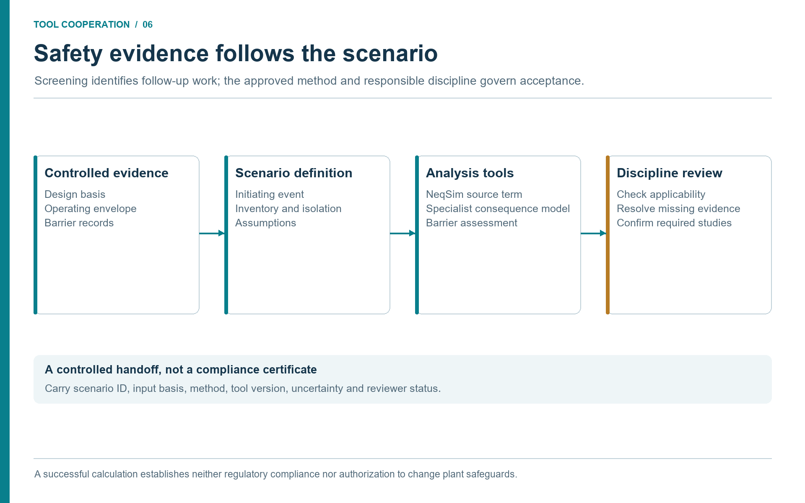

# Safety, Standards, and Barrier Studies

## Learning Objectives

After reading this chapter, the reader will be able to:

1. Explain how agentic workflows can support, but not replace, process safety work.
2. Connect NeqSim calculations to HAZOP, LOPA, SIL, relief, flare, and barrier studies.
3. Describe how controlled engineering evidence and standards mapping improve safety traceability.
4. Define review gates for safety-relevant MCP and agent outputs.

> **Beyond the online book:** The online book mentions safety peripherally
> in flow assurance examples and case studies. This chapter provides
> dedicated coverage of HAZOP preparation, LOPA worksheets, SIL
> determination, relief and blowdown screening, barrier evidence,
> trapped-liquid fire rupture studies, and the review gates that must
> surround safety-relevant agentic outputs.

## 6.1 Safety Work Is Evidence Work

Process safety studies are structured ways of asking what can go wrong, how bad
it can be, how likely it is, and which barriers prevent or mitigate the event.
They are not simply calculations. They combine process understanding,
equipment design, operating history, standards, human factors, and judgement.

Agentic engineering can help because much of the preparation is evidence work.
An agent can assemble equipment lists, extract design pressures, identify
relief devices, read operating envelopes, summarize maintenance history, and map
applicable standards. NeqSim can calculate thermodynamic and process conditions
that safety studies need: inventories, phase splits, relief properties, blowdown
temperatures, hydrate or CO2 freezing margins, flare loads, and dispersion
source terms.

The boundary is clear. Agents can prepare and screen. They cannot approve safety
decisions. A HAZOP chair, discipline engineers, operations representatives, and
technical authorities remain responsible for the study and its conclusions.

## 6.2 Standards Mapping

Standards mapping is one of the most useful early agent tasks. A safety or
design study should identify which standards and company requirements apply
before calculations begin. The applicable edition, jurisdiction, facility type,
contractual basis, and departures belong in a reviewed requirements register.
NORSOK or a particular operator standard is an example for an applicable
project, not a worldwide default. IEC 61511 addresses the safety-instrumented
system lifecycle in the process sector; a calculation alone does not satisfy
that lifecycle. \cite{IEC61511Part12016}

The following table is a topic map, not a declaration of code compliance:

| Topic | Common standards or methods | Example NeqSim support |
|-------|-----------------------------|------------------------|
| Relief valve sizing | API 520, API 521 | Gas, liquid, two-phase relief properties and loads. |
| Flare radiation | API 521, API 537 | Flare load summaries and radiation screening. |
| Blowdown and MDMT | API 521, ASME pressure-vessel methods | Depressurization and minimum temperature screening. |
| SIL and LOPA | IEC 61508, IEC 61511 | LOPA worksheets and safety-function documentation. |
| Risk management and barriers | ISO 31000; jurisdictional and operator requirements; NORSOK Z-013 where applicable | Risk registers, barrier lists, bow-tie structures. |
| Pipelines | Applicable onshore or offshore pipeline code; DNV-ST-F101 for relevant submarine systems | Pressure drop, phase behavior, hydrate and dense-phase checks. |

The agent should not merely list standards. It should connect each standard to
the calculation or decision it governs. If the task is "increase separator
throughput," the standards map may identify vessel design, relief, flare,
instrumented protection, and barrier-management implications.

## 6.3 HAZOP and Deviation Preparation

HAZOP studies use guidewords and process nodes to identify deviations. An agent
can prepare the node package:

- process node description;
- equipment and stream list;
- normal operating envelope;
- design pressure and temperature;
- safeguards and trips;
- relevant historical alarms or incidents;
- known modifications and open actions.

For each node, the agent can suggest candidate deviations such as high pressure,
low temperature, reverse flow, no flow, high level, low level, wrong composition,
or hydrate formation. These suggestions are inputs to a human-led workshop, not
automatic findings. The value is preparation: the team starts with a better
evidence pack and spends more time on judgement.

## 6.4 LOPA, SIL, and Barrier Evidence

Layer of Protection Analysis (LOPA) and Safety Integrity Level (SIL)
determination require clear initiating events, consequence categories,
independent protection layers, frequencies, and risk targets. Agents can help
by structuring data and checking consistency.

For example, a high-pressure scenario on a separator may need:

| Information | Source | Agent contribution |
|-------------|--------|-------------------|
| Design pressure | Vessel datasheet | Extract and cite. |
| Normal pressure | Historian tag window | Summarize steady-state distribution. |
| Relief capacity | PSV datasheet and NeqSim relief calculation | Compare required and installed capacity. |
| Shutdown function | Cause-and-effect and instrument data | Identify sensor, logic, final element. |
| Test history | Maintenance management system | Summarize proof-test or failure context. |
| Consequence | Process and safety model | Estimate inventory and source term. |

The agent can build a draft LOPA table, but independence of protection layers,
credit for human action, common-cause failures, and target risk criteria are
discipline decisions. This distinction should appear in the output.

## 6.5 Relief, Blowdown, and Flare Screening

Relief and flare studies are especially well suited to calculation-backed
agents. NeqSim can calculate fluid properties and process states while MCP tools
can expose validated routines for flash and process simulation. A workflow may
screen blocked outlet, fire case, tube rupture, control-valve failure, or
utility failure.

A good screening output includes:

- scenario definition and initiating event;
- fluid composition and thermodynamic model;
- source pressure, temperature, and phase state;
- required relief rate or blowdown rate;
- relief-device or flare-system assumptions;
- model limitations and need for formal verification.

For blowdown, the temperature trajectory can be as important as pressure. Low
temperatures may challenge material limits, hydrate formation, CO2 freezing, or
brittle fracture margins. The agent should report minimum temperature with the
method and model assumptions, not just time to target pressure.

## 6.6 Safety Studies Linked to Controlled Evidence

Safety studies become stronger when they link directly to as-built evidence. A
separator relief check can cite vessel datasheet, PSV datasheet, relief design
basis, flare header drawing, cause-and-effect chart, and relevant operating
tags. A compressor surge scenario can cite compressor curves, anti-surge valve
datasheet, control narrative, and trip history.

The source manifest should be part of the safety artifact. It should list source
name, revision, retrieval date, extracted fields, confidence, and reviewer.
When a document revision changes, the study can be flagged for review.

The integration is a sequence of checked handoffs. A document search returns
the approved P&ID revision and its equipment identifiers. A document extractor
returns a draft barrier and isolation list with page references. The safety
engineer reconciles it against the cause-and-effect register and the installed
configuration. A maintenance reader then supplies proof-test records matched to
the same safety-function identifiers. These are evidence about the barrier;
they do not become fluid properties or simulation settings.

The process agent receives the reviewed isolation boundaries and inventory
inputs, computes a release or depressurization scenario, and exports a source
term with units, time basis, EOS, and limitations. A consequence-analysis
specialist accepts that source term into the appropriate external model and
returns a versioned result linked to the same scenario. The reporting tool joins
the result and review record. A missing isolation boundary blocks inventory
calculation; a missing proof-test record leaves barrier credit unresolved. This
branching makes the tools cooperate without implying that retrieval validates a
barrier.

Use the same pattern at an onshore gas plant, an offshore production host, an
LNG terminal, or a refinery utility interface. Facility layout, congestion,
occupancy, containment, and the governing requirements determine the scenario
and specialist method. The controlled-document repository supplies the evidence; the workflow
does not depend on a particular vendor or operator system.

**Discussion (Figure 6.1).**

The source-term calculation, consequence model and barrier assessment answer different questions. Their inputs must refer to the same scenario and compatible assumptions. Use screening to identify required follow-up work, then apply the governing method and responsible review before treating the result as a decision basis.

## 6.7 Review Gates for Safety-Relevant Agents

Safety-relevant agent outputs need explicit gates:

| Gate | Purpose |
|------|---------|
| Input approval | Ensure data sources and operating envelopes are accepted. |
| Method approval | Confirm standards, calculation methods, and model validity. |
| Results review | Check physical plausibility and sensitivity to assumptions. |
| Action review | Confirm recommendations are appropriate and controlled. |
| Archive | Store artifacts, source manifest, and reviewer decisions. |

These gates do not slow agentic workflows down unnecessarily. They make the
accelerated work usable in a safety culture.

## 6.8 Worked Safety Thread: Separator Throughput Increase

Consider a proposal to raise throughput through an HP separator. A narrow
process study might check phase split and liquid residence time. A safety-aware
agentic workflow expands the thread.

First, the process model calculates new gas and liquid rates, phase densities,
operating pressure, and temperature. The document reader retrieves vessel
datasheet, nozzle data, PSV datasheet, cause-and-effect chart, and relevant
P&ID extracts. The plant-data agent retrieves current level, pressure, flow,
and trip history. The standards skill maps vessel capacity, relief, and barrier
requirements. The safety agent then screens deviations: high pressure, high
level, liquid carryover, gas blowby, hydrate or wax risk, and relief-load
increase.

The following table is a fictional teaching example of a screening handoff;
these outcomes have not been calculated for an actual separator:

| Safety question | Evidence | Screening outcome |
|-----------------|----------|-------------------|
| Does higher gas rate affect carryover? | NeqSim phase properties and separator dimensions | Demister velocity approaches screening limit. |
| Does liquid inventory change relief or blowdown? | New level range and vessel volume | Blowdown inventory increases; formal check required. |
| Are existing trips still adequate? | Cause-and-effect and tag history | High-level trip exists; independence not assessed. |
| Does PSV case change? | PSV datasheet and blocked-outlet scenario | Relief load may increase; relief specialist review required. |
| Are procedures affected? | Operating window and alarm settings | Temporary operating instruction may need update. |

This thread does not approve the throughput increase. It tells the team where
the safety questions are and what evidence already exists. It also prevents a
common failure: treating a capacity calculation as if it automatically covered
relief, barriers, and procedures.

## 6.9 Consequence Screening and CFD Source Terms

Safety studies frequently need to estimate the consequences of a release:
thermal radiation from a jet or pool fire, flammable gas concentrations at
occupied areas, toxic exposure, or overpressure from a vapor cloud explosion.
The consequence-analysis specialist selects the required modelling method.
Free-field consequence models and geometry-resolved CFD answer different
questions; CFD is particularly relevant where obstacles or terrain influence
the result. Phast and its separately selected CFD extensions illustrate this
distinction. Tool name alone does not establish the method or its suitability.
\cite{DNVConsequenceFAQ2026}

The source term is the handoff: release rate, composition, phase state,
temperature, pressure, and momentum. NeqSim can supply thermodynamic and process
inputs, subject to the release model's assumptions and validation envelope.
\cite{NeqSim2026}

The `neqsim.process.safety.scenario` package provides a
`ReleaseDispersionScenarioGenerator` that walks a `ProcessSystem`, discovers
high-pressure streams, and builds release scenarios with:

- hole-size taxonomy (small, medium, large, full-bore);
- weather envelope (stability classes, wind speeds);
- source-term properties from NeqSim flash calculations;
- trapped-inventory estimates from vessel and pipe volumes;
- consequence branches (jet fire, flash fire, vapor cloud explosion, toxic).

The `GasDispersionAnalyzer` in `neqsim.process.safety.dispersion` connects
NeqSim thermodynamics to consequence screening. Its automatic selector first
equilibrates the fluid at ambient pressure and temperature, then chooses
dense-gas screening when the gas-to-air density ratio exceeds 1.2; otherwise it
uses passive Gaussian screening. This selection does not retain cold-release
temperature. Cold releases, two-phase dispersion, and buoyancy-dependent behavior
require an appropriately qualified specialist model. For quick screening, the
built-in `GaussianPlume` class provides
downwind concentration estimates at specified distances, stability classes, and
release heights.

The `CfdSourceTermExporter` in `neqsim.process.safety.cfd` can format the
source terms into neutral JSON or OpenFOAM-oriented skeleton files for handoff
to specialist CFD analysts. This is a clear example of the boundary between
screening and formal analysis. NeqSim calculates the source term and provides
screening-level dispersion estimates. The specialist tool provides the detailed
field.

The agentic value is that an agent can build the release inventory from the
process model, estimate the source term, run screening dispersion, and prepare
the CFD input file --- using a documented exchange artifact between tools. A neutral file is not
proof that the receiving tool imported it correctly. The
safety engineer reviews the source terms, approves the scenarios, and runs the
formal CFD when warranted. The agent accelerates the preparation; the engineer
controls the result.

## 6.10 Trapped-Liquid Fire Rupture Studies

A blocked-in liquid-filled pipe segment exposed to fire can develop pressure
exceeding the pipe or flange rating if no relief device is present. This is a
thermal-expansion rupture scenario, often missed in conventional relief studies
because it involves piping rather than vessels.

The `TrappedLiquidFireRuptureStudy` class in `neqsim.process.safety.rupture`
orchestrates a transient screening that requires inputs from multiple document
and data sources:

| Input | Source | Agent retrieval method |
|-------|--------|----------------------|
| Pipe geometry (diameter, wall thickness, length) | Piping specification in the engineering repository | Technical document reader. |
| Material grade and yield strength | Material certificate or piping spec | Document reader or CSV lookup. |
| Flange rating and gasket type | Line list and flange datasheet | controlled-document retrieval. |
| Liquid composition and initial conditions | Process model or line list | NeqSim flash at blocked-in conditions. |
| Fire zone and PFP coverage | Fire and area classification documents | Document reader or fire-zone drawing. |
| Relief basis | Relief philosophy or P\&ID | Check whether a relief device exists. |

The study models wall heating under a configured fire exposure, tracks liquid
thermal expansion and pressure rise, and screens mechanical limits. The analyst
must verify the heat-input model, exposed area, material properties at
temperature, relief assumptions, and PFP representation against the chosen
method. A standards label in the output is not evidence of code compliance, and
a screening cannot specify PFP performance without the required fire and
mechanical assessment. \cite{NeqSim2026}

This is an especially strong example of agentic integration because the study
cannot be performed from simulation data alone. It needs piping specifications,
material certificates, flange data, and fire-zone information. It also cannot
be performed from documents alone --- it needs thermodynamic calculations for
liquid expansion and phase behavior under heating. The agent that combines both
sources produces a screening that would otherwise require a specialist to
manually assemble inputs from five or six different systems.

The output includes time-to-rupture, peak pressure, von Mises stress versus
allowable stress at each time step, applicable standards, and actionable
recommendations. This artifact is ready for review by a piping or safety
engineer who can approve, reject, or escalate the screening.

## 6.11 Limits of Automation in Safety Work

Safety work contains judgements that should not be delegated to a model.
Examples include whether two protection layers are truly independent, whether an
operator action can be credited, whether a cause is credible for a specific
facility, whether a procedural control is robust, and whether residual risk is
acceptable. These judgements depend on context, experience, regulations,
company requirements, and accountability.

Agents can still help by preparing options. They can draft a bow-tie structure,
list candidate barriers, identify missing evidence, and calculate process
conditions. They can check whether a report forgot to mention low-temperature
embrittlement or flare back-pressure. They can compare scenario assumptions
against source documents. But the final safety claim must belong to qualified
people in an approved process.

This boundary should be stated in safety outputs. A useful phrase is: "This is
an agent-prepared screening based on the sources listed. It is not a HAZOP,
LOPA, SIL verification, relief design approval, or management-of-change
approval." Such wording may feel cautious, but it protects both the study and
the organization.

## 6.12 Safety Memory and Learning

Safety workflows benefit from controlled memory, but only for reusable lessons,
not confidential incident detail. Good memory entries include known API
patterns, common data-quality issues, standard review checklists, and generic
pitfalls. Poor memory entries include private incident descriptions, asset names,
or unreviewed assumptions.

For example, a repository memory may record that blowdown studies should always
report both pressure-time and minimum metal-temperature screening, or that
relief calculations should state whether pressure is gauge or absolute. A skill
may record that HAZOP preparation packages should include cause-and-effect
charts, alarm lists, and operating-history summaries. These memories make the
next study better without exposing sensitive data.

## 6.13 Summary

Agents can make safety studies better prepared, more traceable, and faster to
screen. They retrieve evidence, structure deviations, map standards, run
calculations, and draft artifacts. Human safety processes remain in control of
approval and final decisions.

Key points from this chapter:

- Safety studies are evidence and judgement workflows, not just calculations.
- Standards mapping should be tied to specific decisions and calculation methods.
- Controlled-document links and source manifests improve traceability for barrier and relief studies.
- Consequence screening and CFD source-term generation connect process simulation to specialist safety tools.
- Trapped-liquid fire rupture studies combine piping documents, material data, and thermodynamic simulation into a screening that no single source can provide alone.
- Safety-relevant agent outputs require explicit human review gates.

## Exercises

1. **HAZOP package:** Build a preparation checklist for a compressor suction scrubber HAZOP node.
2. **LOPA evidence:** Identify the evidence needed to credit an independent high-pressure trip in a LOPA.
3. **Review gate:** Define the minimum review gates for an agent-generated relief screening.
4. **Source term:** For a 50 mm hole in a 100 bar gas line, list the thermodynamic properties an agent needs from NeqSim to prepare a CFD source-term file.
5. **Trapped-liquid study:** Identify the six categories of input documents needed for a trapped-liquid fire rupture screening on a blocked-in pipe segment.

## References

This chapter uses references from the master bibliography.
