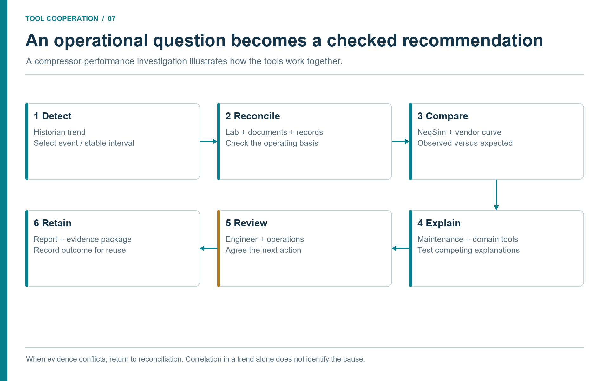

# Operational Studies and Decision Workflows

## Learning Objectives

After reading this chapter, the reader will be able to:

1. Identify routine operational studies that benefit from NeqSim MCP and agents.
2. Describe a decision workflow from question to evidence, calculation, and recommendation.
3. Explain how live or recent plant data changes the frequency and usefulness of studies.
4. Recognize when a fast screening should be escalated to a formal engineering task.

> **Beyond the online book:** The online book's case-study catalogue contains
> 40+ completed tasks. This chapter shows how those same
> patterns become repeatable operational workflows: daily hydrate
> screening, weekly compressor monitoring, root cause analysis, water
> hammer screening, dynamic simulation, and P&ID-driven what-if studies.

## 7.1 From Occasional Studies to Continuous Readiness

Many operational questions repeat: Can we increase production today? Is hydrate
margin acceptable? Why did compressor power increase? Is the flare load still
inside expected limits? Which operating condition drives CO2 emissions? Should a
heat exchanger be cleaned during the next opportunity?

Historically, these questions often became studies only when the potential value
was high enough to justify data gathering and model setup. With an MCP-enabled
NeqSim workflow, the threshold can be lower. Agents can keep the evidence path
short: retrieve current data, run the relevant model, compare against limits,
and produce a short result that is ready for engineering review.

The goal is continuous readiness, not uncontrolled automation. The organization
builds a library of workflows that are ready to run when the question appears.

## 7.2 A Generic Decision Workflow

A practical operational workflow has seven steps:

1. state the decision and time horizon;
2. identify required data and approved sources;
3. retrieve and quality-check evidence;
4. select or update the NeqSim model;
5. run base case and sensitivities;
6. compare results with criteria;
7. issue recommendation, limitations, and escalation need.

This structure prevents the agent from jumping straight to a calculation. For
example, "Can we raise gas export by 5% for the next 24 hours?" is not a pure
compressor calculation. It may involve well deliverability, separator liquid
handling, compressor driver margin, dew point, export pressure, flare
constraints, and power emissions. The agent should either run the relevant
multi-area workflow or state that the evidence is insufficient.

### Cooperation between the tools

A tool chain becomes useful when each tool receives a defined artifact and
returns something the next tool can inspect. For a compressor performance
review, use the following sequence. The filenames describe a proposed study
package, not built-in MCP endpoints.

| Handoff | Artifact passed onward | Check and next branch |
|---------|------------------------|-----------------------|
| Asset register and document search → document reader | Equipment identity, approved map, driver datasheet, control narrative | Equipment engineer resolves revisions and map basis; missing map blocks map-limit conclusions. |
| Historian reader → data-quality notebook | Timestamped P/T/flow/power/speed records with native units and quality flags | Reject bad periods and select a stable window; an upset goes to an event investigation instead. |
| Laboratory system → fluid-preparation step | Sample record, composition, sample location/time and analytical basis | Process/PVT reviewer checks representativeness and component mapping. |
| Production accounting → reconciliation step | Period-specific well tests or plant balance, allocation version and standard-volume basis | Compare like periods and boundaries; discrepancies remain visible. |
| Reviewed evidence → NeqSim MCP | `model_inputs.json`, EOS/mixing rule and approved model revision | Input validation and base-case comparison gate scenario calculations. |
| NeqSim scenarios → equipment reviewer | `scenario_results.json`, warnings and map/power comparisons | Rank technically supported alternatives; unsupported constraints remain open. |
| Maintenance and MOC readers → decision review | Work-order timeline, approved restrictions and pending changes | These constrain timing and actionability; they do not change calculated efficiency by themselves. |
| Reviewed decision → PaperLab or reporting tool | Results, source manifest, figures, reviewer status and next actions | Produce an advisory report and retain reproducible artifacts. |

An available NeqSim server does not imply that historian, laboratory,
maintenance, or document connectors are installed. Discover each tool and its
schema separately. Where read access is unavailable, use an authorized export
and record its date and limitations. A hypothetical export must remain labelled
as such. The detailed example in Chapter 9 uses this same contract.
\cite{NeqSimMCP2026,AnthropicMCP2024}



**Discussion (Figure 7.1).**

A trend identifies the question; it does not establish its cause. Comparing a reconciled operating case with a physical model narrows the explanations, while maintenance and specialist evidence test what remains. If records conflict, return to the evidence step instead of forcing the model to match an unexplained observation.

## 7.3 Flow Assurance Screening

Flow assurance is a natural operational use case. Hydrate formation, wax risk,
liquid loading, and arrival temperature depend on changing production,
composition, pressure, temperature, and inhibitor injection. A daily or weekly
screening can combine historian data, lab composition updates, and pipeline
models.

An agentic hydrate-margin workflow may:

- retrieve recent pressure, temperature, water content, and flow tags;
- validate composition and inhibitor data;
- run NeqSim hydrate or phase-envelope calculations;
- compare predicted hydrate temperature to operating temperature;
- flag cases where margin is below the operational criterion;
- prepare a recommendation for chemical injection or operating adjustment.

The output should include the method, EOS or hydrate model, selected time
window, and uncertainty. If the result is near the limit, the workflow should
escalate to a flow-assurance specialist rather than presenting a final answer.

## 7.4 Compressor and Energy Monitoring

Compression is often one of the largest energy consumers offshore and onshore.
Small deviations in suction temperature, molecular weight, recycle, fouling, or
driver efficiency can have large power and emissions impacts. Agentic workflows
can combine process simulation with historian and vendor evidence to produce
regular performance checks.

Typical indicators include:

| Indicator | Data needed | Decision use |
|-----------|-------------|--------------|
| Polytropic efficiency trend | Suction/discharge P/T, flow, speed, composition | Detect degradation or map mismatch. |
| Recycle valve opening | Valve position and flow estimate | Identify lost capacity or wasted power. |
| Driver load margin | Driver power tag and datasheet | Check production-increase feasibility. |
| CO2 intensity | Fuel gas, power, production | Rank energy-efficiency actions. |

NeqSim provides thermodynamic properties and compressor calculations. Tags and
vendor curves provide reality checks. Maintenance context can explain whether a trend
matches known maintenance events.

## 7.5 Production Optimization

Agentic workflows can also support production optimization. A modular field
model can test multiple production scenarios while respecting equipment
constraints. The agent can vary well rates, separator pressures, compressor set
points, or pipeline arrival pressures, then report bottlenecks and trade-offs.

The important engineering control is constraint transparency. The workflow must
state what limits were enforced: maximum compressor power, minimum hydrate
margin, separator liquid capacity, export pressure, emissions cap, flare
restriction, or reservoir drawdown limit. Without transparent constraints,
optimization results are not trustworthy.

## 7.6 Integrity and Maintenance Planning

Access to maintenance and inspection records enables operational studies that combine
performance and integrity. For example:

- Heat exchanger cleaning priority based on duty loss, production impact, and planned maintenance windows.
- Control-valve replacement priority based on valve position saturation, pressure-drop loss, and spare availability.
- Compressor wash or inspection timing based on efficiency trend and known maintenance history.
- Separator inspection planning based on water production, corrosion risk, and capacity sensitivity.

These are not pure simulations. They are decision workflows where simulation
quantifies impact and enterprise data constrains action.

## 7.7 When to Escalate

A fast operational screening should escalate when:

- the result is close to a safety or operating limit;
- source data quality is poor or conflicting;
- the model is outside its validation envelope;
- the recommendation changes a controlled operating procedure;
- the decision affects safety, environment, production commitments, or major cost.

Escalation is a success condition, not a failure. It means the workflow found a
question that deserves formal engineering attention.

## 7.8 Operating Rhythm

Operational workflows become more valuable when they have a rhythm. Not every
calculation should be run continuously, and not every workflow needs the same
review depth. A useful operating rhythm might be:

| Frequency | Workflow | Typical review |
|-----------|----------|----------------|
| Daily | Hydrate margin, compressor driver margin, flare status | Operations engineer screening. |
| Weekly | Energy intensity, heat exchanger duty, recycle losses | Process engineer review. |
| Monthly | Model-vs-plant reconciliation, equipment degradation trends | Discipline review. |
| Campaign | Production optimization, shutdown opportunity screening | Multi-discipline study. |
| Event-driven | Alarm clusters, trips, unusual emissions, equipment failure | Specialist escalation. |

This rhythm helps teams avoid two extremes: never using the model until a major
study is needed, or running too many automatic calculations with no review path.
Each workflow should have a trigger, owner, expected output, and escalation
criterion.

## 7.9 Economics and Emissions in Operations

Operational decisions are rarely technical only. A compressor recycle loss has a
power cost and an emissions cost. A heat exchanger cleaning may recover
production but require shutdown time. A production increase may improve revenue
while increasing fuel gas and CO2 emissions. Agentic workflows can bring these
dimensions into the same decision table.

For example, a compressor optimization workflow can calculate:

- additional export gas from a pressure-setpoint change;
- additional driver power and fuel gas;
- incremental CO2 emissions;
- hydrate or dew-point margin;
- compressor operating margin;
- estimated economic value over the operating period.

This does not replace a formal economic model, but it helps operations see
trade-offs. A recommendation such as "increase production" is weaker than
"increase production only if suction temperature remains below the defined
limit, recycle stays closed, and incremental CO2 intensity remains inside the
weekly target." The second recommendation is operationally useful because it
links action to constraints.

## 7.10 Human Interfaces

The best operational agent is not one that produces the longest report. It is
one that produces the right level of information for the decision. A control-room
advisory view may need a short status: margin, trend, confidence, and action.
A process engineer may need the full source manifest and sensitivity table. A
technical authority may need validation history and standards basis.

Good interfaces separate these layers. The same workflow can produce a compact
dashboard card, a detailed notebook, and a formal report. MCP tool outputs and
task artifacts make this possible because the underlying results are structured.
The interface can choose how much to display without changing the calculation.

The human interface should also show uncertainty and stale data clearly. A green
status based on yesterday's composition should not look identical to a green
status based on a current lab update. A hydrate margin of 2.0 °C with high data
confidence is not the same as 2.0 °C with missing inhibitor data. Agents should
surface these differences in the UI and report text.

## 7.11 Root Cause Analysis: Combining Data, Documents, and Simulation

When equipment trips, vibrates, loses efficiency, or behaves unexpectedly, the
traditional response is a manual investigation. An engineer gathers historian
trends, reads the datasheet, reviews maintenance history, runs a simplified
calculation, and proposes a hypothesis. The process is thorough but slow, and
the quality depends heavily on how many data sources the engineer thinks to
check.

NeqSim's `RootCauseAnalyzer` in the `neqsim.process.diagnostics` package
implements a Bayesian-inspired methodology that an agent can orchestrate as a
single coherent workflow. The three stages are:

1. **Prior (reliability evidence).** Candidate hypotheses start from configured
   prior weights and may be adjusted using the reliability data available to
   the implementation. Record the actual source, equipment population, and
   matching rule. OREDA is a possible external source of reliability and
   maintenance evidence, but an identifier or class comment does not establish
   access to licensed OREDA data. \cite{OREDAAbout2026,NeqSim2026}

2. **Likelihood (historian and document evidence).** The analyzer takes
   historian time-series data, controlled design conditions, and operating limits,
   and updates each hypothesis score based on how well the evidence matches.
   The report should expose which observed changes support or contradict each
   hypothesis. Anti-surge valve position alone does not measure surge margin;
   the engineer needs the compressor map, corrected operating point, control
   state, and time alignment. Stable bearing temperature does not exclude a
   mechanical fault.

3. **Verification (process simulation).** The analyzer can optionally run
   the NeqSim process model to test whether a hypothesized failure reproduces
   the observed symptoms. If fouling is a hypothesis, the model can be run
   with reduced efficiency to check whether the predicted discharge conditions
   match the observed discharge pressure and temperature.

The result is a `RootCauseReport` with ranked hypotheses, scores, evidence,
and recommendations. Its normalized scores rank the configured candidates;
they are not calibrated probabilities that a fault is present. Preserve
verification status and coverage: `UNSUPPORTED`, `UNKNOWN`, and `FAILED` do not
mean that a hypothesis has been physically confirmed. A process model can test
supported performance perturbations, but does not thereby reproduce rotor
vibration or prove a mechanical diagnosis. \cite{NeqSim2026}

### Why this matters for agentic engineering

The `RootCauseAnalyzer` is a concrete example of a class that cannot work in
isolation. It needs data from a historian (field measurements), context from
controlled engineering documents (design limits, datasheet conditions, maintenance history), and
computational capability from NeqSim (flash, process model, equipment
performance). No single tool or data source is sufficient. The agent
orchestrates all three, and the `RootCauseAnalyzer` provides the structured
methodology that exposes the evidence and limitations for review.

An MCP tool (`runRootCauseAnalysis`) exposes this to any MCP client. The agent
sends a JSON object containing the process description, equipment name, symptom
type, and optionally historian CSV data, design limits, and equipment-document context. The
runner builds the `ProcessSystem`, creates the `RootCauseAnalyzer`, runs the
analysis, and returns the structured report. The agent does not need to know the
internal scoring algorithm. It needs to know how to gather evidence from its
available data sources and present it in the expected format.

### Example: compressor high vibration

An agent receiving a report of high vibration on a compressor might execute the
following workflow:

1. Retrieve the compressor performance curve and design limits from the controlled engineering repository.
2. Read historian tags for suction and discharge pressure, temperature, flow,
   speed, vibration, and anti-surge valve position.
3. Read maintenance history from the maintenance system for recent work orders on the compressor.
4. Build the process model from the existing modular field model.
5. Call `runRootCauseAnalysis` with the process JSON, equipment name,
   `HIGH_VIBRATION` symptom, historian data, and design limits.
6. Receive a ranked hypothesis report with supporting and contradicting
   evidence, verification coverage, and explicit data gaps.
7. Present the report to the operations or rotating-equipment engineer with
   evidence citations and recommended actions.

The value is a reviewable evidence package that reduces repeated collection
work. Any claim about time saved needs measurements from the deployed workflow;
no timing benchmark is established by this example.

## 7.12 Operational Scenarios: What-If Studies from P&IDs

Operational what-if studies are among the most frequent requests in facility
engineering. What happens if we close this valve? What if suction pressure
drops 5 bar? What if the feed composition changes? What if we apply the current
field data and then change one parameter?

NeqSim's `OperationalScenarioRunner` provides a structured way to define and
execute these studies. An `OperationalScenario` is an ordered list of
`OperationalAction` objects, each specifying an action type and target:

| Action type | What it does |
|-------------|--------------|
| `SET_VARIABLE` | Sets a simulation variable through the automation API. |
| `SET_VALVE_OPENING` | Changes a valve position (0--100%). |
| `APPLY_FIELD_INPUTS` | Applies previously supplied field data through the process's tagged measurement bindings. |
| `RUN_STEADY_STATE` | Invokes the steady-state process run; acceptance still requires checking convergence, balances, and errors. |
| `RUN_TRANSIENT` | Advances through the requested duration using the configured time step and a bounded final step. |

An `OperationalTagMap` can prepare field data separately, but the
`APPLY_FIELD_INPUTS` action itself calls the process's existing bindings.

A P\&ID-derived scenario might look like this:

```java
OperationalScenario scenario = OperationalScenario.builder("Close bypass valve")
    .addAction(OperationalAction.applyFieldInputs())
    .addAction(OperationalAction.setValveOpening("XV-2001", 0.0))
    .addAction(OperationalAction.runSteadyState())
    .build();
```

The `OperationalScenarioRunner` executes actions on the `ProcessSystem` passed
to it. The caller must provide a separate copy or restore an approved model
state before each independent scenario. Its action result captures supported
before-and-after values; a complete comparison of all bound tags requires an
explicit benchmark or evidence-package step. Inspect action errors before
accepting a scenario as executed. \cite{NeqSim2026}

This is how agentic engineering connects to real plant operations. The agent
reads a P\&ID to identify the relevant valves and instruments. It reads the
historian to get current boundary conditions. It constructs scenarios that
represent proposed operating changes. It runs the simulation and returns
quantified consequences. The P\&ID, the historian, and the simulation are all
required. Removing any one of them makes the study either disconnected from
reality or unable to predict consequences.

## 7.13 Controller Tuning from Historian Data

Control loops are rarely tuned once and forgotten. Operating conditions change,
equipment degrades, and control objectives shift. The
`ControllerTuningStudy` class in `neqsim.process.operations` evaluates
controller performance using time-domain metrics computed from a step response:

| Metric | What it measures |
|--------|------------------|
| Mean Absolute Error (MAE) | Average deviation from setpoint over the response window. |
| Integral Absolute Error (IAE) | Total accumulated deviation over time. |
| Integral Squared Error (ISE) | Emphasizes large deviations more than small ones. |
| Overshoot percentage | Maximum overshoot as a fraction of the step size. |
| Settling time | Time to reach and stay within a tolerance band. |
| Output saturation | Whether the controller output hits its limits. |
| End-window stability screen | Whether final error and variation in the final sample window satisfy the selected tolerance; not a proof of control-system stability. |

The study takes pre-recorded time-series arrays --- controller name, setpoint,
time stamps, process values, and controller output --- evaluates the step
response, and returns a structured `ControllerTuningResult` with all metrics, a
screening assessment, and a recommendation about tuning, disturbance
rejection, or actuator limits. These diagnostics do not synthesize a validated
controller tuning. An agent can retrieve historian step-response data from an approved historian reader,
pass it to the study for evaluation, and flag controllers that show degraded
performance.

This is a practical example of a study that was previously too labor-intensive
for routine execution. A process engineer might tune a few critical loops per
year. An agentic workflow can screen all loops in a process area weekly,
flagging only those that need human attention. The historian provides the evidence; the step-response analysis supplies
measured performance metrics. Predicting the effect of new tuning requires a
separately validated dynamic model.

## 7.14 Water Hammer and Transient Screening

Rapid valve closures, pump trips, and check-valve events can generate pressure
surges that threaten pipe integrity. Water hammer screening traditionally
requires route geometry, fluid properties, wall thickness, valve closure
profiles, and surge-propagation calculations. These inputs come from different
systems: piping design from controlled piping line lists, fluid properties from the process
model, valve closure times from control narratives or instrument datasheets,
and operating conditions from the historian.

NeqSim's `WaterHammerStudy` class orchestrates this multi-source workflow. It
accepts a JSON specification with:

- route geometry (pipe segments with length, diameter, elevation, wall thickness);
- fluid specification or a reference to the process model;
- supported valve-event schedule (closure or opening profile);
- optional historian-data overrides for actual operating conditions;
- acceptance criteria (design pressure, MAOP).

The inspected `WaterHammerStudy` runner handles valve events; a pump-trip
scenario needs separately verified pump and network dynamics. The study builds
a `WaterHammerPipe` model from the specification, applies
field-data overrides where available, runs the transient calculation, and
returns a pressure envelope with peak surge, Joukowsky estimates, and
pass/fail against design pressure.

The agentic value is integration. An agent can:

1. Extract route geometry from a piping line list retrieved from the controlled engineering repository.
2. Get current fluid properties from the process model.
3. Read valve closure time from the control narrative document.
4. Read current operating pressure and flow from historian tags.
5. Run the water hammer screening with all inputs combined.
6. Compare peak surge against design pressure from the pipe specification.

Without the agent, this study requires a specialist to manually collect inputs
from five or six systems. With the agent, the inputs are gathered and validated
programmatically, and the engineer reviews the result rather than the data
collection.

## 7.15 Dynamic Simulation as Operational Infrastructure

Sections 7.13 and 7.14 showed controller tuning and water hammer as specific
dynamic-simulation use cases. But dynamic simulation is a broader operational
capability that deserves explicit framing. Steady-state models answer "what does
the process look like at equilibrium?" Dynamic models answer "what happens
between now and equilibrium?"

Operational decisions that need dynamic simulation include:

| Decision | Why dynamic is needed |
|----------|----------------------|
| Emergency depressurization timing | Pressure, temperature, and metal temperature evolve over minutes to hours. |
| Startup sequence validation | Equipment sees off-design conditions during startup; sequence timing matters. |
| Shutdown cascading effects | Tripping one unit may propagate pressure and level changes to connected units. |
| Surge protection | Compressor surge happens in seconds; the control response must be faster. |
| Slug management | Liquid slugs produce transient level and pressure changes in separators. |
| Process upset recovery | After a trip, how long before levels stabilize and production resumes? |
| Safety system response time | Safety instrumented functions must act within specified time limits. |

In NeqSim, the transition from steady-state to dynamic is handled by the same
`ProcessSystem`. The agent calls `process.run()` for steady-state and
`process.runTransient(dt)` for dynamic steps. The `DynamicProcessHelper` class can add typical transmitters and controllers
and set a default time step and supported equipment to dynamic mode. Holdup,
equipment-specific dynamic
physics, initial conditions, and time-step adequacy remain explicit modelling
work. Calling a transient method does not ensure that every connected unit
represents the required transient phenomenon. \cite{NeqSim2026}

The agentic workflow for a dynamic study typically follows this pattern:

1. **Initialize from steady-state.** Run the process model to convergence at
   normal operating conditions. This sets the initial holdup, pressure, and
   temperature profiles.
2. **Define the event.** Specify what changes: a valve closes, a trip signal
   fires, a feed rate drops, or a setpoint changes.
3. **Run the transient.** Step through time, recording key variables at each
   step.
4. **Evaluate the response.** Check whether pressures, temperatures, levels,
   and controller outputs stay within acceptable limits. Check whether the
   system returns to a stable state.
5. **Report.** Present the time-domain response with key metrics: peak
   pressure, minimum temperature, settling time, and pass/fail against
   acceptance criteria.

The inspected `runDynamic` runner accepts a process specification, duration,
time step, and optional controller tuning. It instruments the process and
records the generated transmitter time series. It does not parse an arbitrary
event schedule or user-selected recording list. Startup events, custom states,
and specialized equipment physics therefore require another supported study
tool or a reviewed custom transient workflow. Check the deployed schema and
actual result duration before treating a requested study as executed.
\cite{NeqSimMCP2026,NeqSim2026}

Dynamic simulation is particularly valuable when combined with real-time or
recent historian data. An agent can read the current operating conditions from
historian tags, initialize the dynamic model at those conditions, and then
simulate a proposed event. The result estimates the response for the recorded state and model
assumptions. Data latency, unmeasured holdup, control status, and dynamic-model
coverage limit how closely that estimate represents the present plant.

## 7.16 Production Data, Project Documents, and Modification Context in Operations

Operational workflows draw on more than simulation and instrumentation. Three
additional data categories from the operational data ecosystem (Chapter 1)
deserve explicit treatment in the operational context.

### 7.16.1 Production Data as Operational Intelligence

Production databases contain well test results, daily production reports, and
allocation data. These are not raw sensor readings — they are processed,
reconciled to a reporting or allocation basis. A production record is not
automatically an approved fiscal measurement; its status and intended use must
be established. For operational process
simulation, production data serves three purposes:

1. **Reservoir boundary conditions.** The latest well test provides the actual
   GOR, water cut, wellhead pressure, and flow rate for each well. A facility
   simulation that uses design-case well data may be significantly wrong if the
   reservoir has matured.

2. **Throughput validation.** Daily production reports provide measured total
   rates that the simulation should reproduce. A difference may arise from model error, measurement error, reporting
   period, inventory change, allocation logic, or differing standard conditions.
   Resolve these bases before interpreting the deviation.

3. **Trend context.** Declining well rates, increasing water cut, or changing
   GOR over months provide the context for operational decisions. A
   recommendation to increase production rate must consider whether the wells
   can actually deliver the higher rate.

The agent pattern is to read the latest well test data, set the simulation
boundary conditions accordingly, and flag any discrepancy between modeled and
reported production. Use a task-specific currency criterion for well tests and an agreed
reconciliation tolerance. Exceeding either is a data-quality branch, not a
reason to silently recalibrate the model.

### 7.16.2 Project Documentation for Operational Studies

Project documentation provides the design intent: what the facility was
designed for, what margins were assumed, and what acceptance criteria were set.
In operational studies, project documentation answers questions like:

- What was the original design flow rate for this separator?
- What composition range was the compressor designed for?
- What hydrate margin was required at the design stage?
- Was a higher throughput scenario evaluated and rejected? If so, why?

An agent that retrieves the design basis memorandum or FEED report before
running a capacity screening can compare "current operation vs. design intent"
rather than just "current operation vs. model prediction." This comparison is
far more useful for decision-making because it shows whether the facility is
operating inside or outside its design envelope.

### 7.16.3 Modification Management as Operational Context

Modification records from maintenance, management-of-change (MOC), or project planning systems provide
essential context for operational recommendations. Before recommending a
process change, the agent should check:

- Is there a pending modification that affects this equipment?
- Has the recommended change been evaluated before? What was the outcome?
- Is the current configuration temporary due to an in-progress modification?

This prevents the agent from producing recommendations that conflict with
approved changes or repeat work that has already been done. It also allows the
agent to recognize when a simulation should use the as-will-be configuration
(after a pending modification) rather than the as-is configuration.

## 7.17 The Evidence Package as Integration Pattern

The individual studies described above --- root cause analysis, operational
scenarios, controller tuning, water hammer --- share a common integration
pattern. Each one combines technical documentation, field measurement data, and
NeqSim simulation into a structured, auditable output. The
`OperationalEvidencePackage` class formalizes this pattern.

An evidence package is built from:

- a **process system** (the simulation model);
- a **tag map** (the binding between plant tags and simulation variables);
- **field data** (historian values for the current operating window);
- **scenarios** (what-if operating changes);
- a **benchmark tolerance** (the acceptable model-versus-plant deviation).

Start from a constructed, converged base process. The package applies supported
field-data bindings and reruns when those inputs are supplied, compares tags
marked as benchmarks, evaluates configured scenarios on copies, and returns
capacity information and quality gates. It does not retrieve external sources
or automatically include the full document, laboratory, maintenance, and review
record. The agent joins those artifacts through the source manifest. Inspect
benchmark count, missing fields, errors, and model coverage before reporting a
successful comparison. \cite{NeqSim2026}

This is the key architectural insight of agentic engineering in NeqSim. The
value does not come from faster flash calculations or better EOS models, though
those matter. The value comes from the structured orchestration of multiple data
sources into a single, reviewable evidence chain. The agent is the coordinator.
The tag map is the bridge. The evidence package is the deliverable.

The pattern is extensible. A safety study can add barrier evidence to the same
package. An economics study can add cost and emissions data. A maintenance study
can add maintenance work-order context. Each extension adds a new evidence dimension
without changing the orchestration pattern.

### Applying the chain across the industry

The chain is portable because the roles and handoff checks remain stable while
the boundary conditions change. At an onshore gas-processing plant, a gas
quality question joins laboratory composition, inlet metering, dehydration
history, and the sales specification. At an LNG facility, a feed-change screen
also needs the pretreatment and liquefaction interface limits; a whole-train
capacity claim requires validated coverage of those units. For a transmission
pipeline, route/GIS records, compressor-station data, nomination periods, and
delivery constraints define the study. At a refinery or terminal interface,
product assays, tank inventory, utility balances, and transfer schedules replace
well tests and reservoir forecasts where appropriate.

In each case the agent sends reviewed inputs to the model, receives calculated
outputs with limitations, and sends those outputs to a discipline reviewer and
a reporting tool. A simulator or specialist application outside NeqSim may
supply a required unit model or dynamic study through a checked export. The
exchange must carry units, stream basis, model revision, and convergence status;
matching software labels are not sufficient validation.

## 7.18 Summary

Operational workflows turn NeqSim MCP and agents into a repeatable decision
support system. They can make routine studies faster and more frequent while
keeping human review and escalation at the center. The new infrastructure in
`neqsim.process.operations` and `neqsim.process.diagnostics` provides
concrete classes that combine technical documents, field data, and simulation
into structured evidence packages, root-cause reports, scenario comparisons,
and transient screenings.

Key points from this chapter:

- Agentic workflows lower the effort required to run evidence-backed operational studies.
- Flow assurance, compression, energy, production optimization, and maintenance planning are strong use cases.
- Root cause analysis combines declared reliability evidence, historian observations, and supported process perturbations into ranked hypotheses.
- Operational scenarios execute P\&ID-derived what-if studies with before/after comparison.
- Controller tuning studies screen loop performance from historian step responses and simulated transients.
- Water hammer screening orchestrates route geometry, fluid properties, valve events, and field data.
- Dynamic simulation complements steady-state for time-dependent decisions: depressurization, startup, surge, and upset recovery.
- Production databases provide reservoir boundary conditions, throughput validation, and trend context for operational models.
- Project documentation anchors operational recommendations to design intent and acceptance criteria.
- Modification management prevents recommendations that conflict with approved or pending changes.
- The evidence package is the integration pattern: tag map, field data, scenarios, and simulation in one auditable artifact.
- Optimization must expose constraints and validation limits.
- Screenings should escalate when limits, data quality, or controlled procedures are involved.

## Exercises

1. **Hydrate workflow:** Design a daily hydrate-margin screening workflow with required tags, model calls, and escalation rules.
2. **Compressor energy:** Define three compressor performance indicators and the data needed to calculate them.
3. **Optimization constraints:** List the constraints that should be enforced in a short-term production-increase study.
4. **Root cause analysis:** A separator shows increasing liquid carryover to the gas outlet. List the data sources an agent should gather, the symptom type, and three candidate hypotheses with the evidence that would support or refute each.
5. **Operational scenario:** Define a three-action operational scenario for testing the effect of closing a bypass valve around a heat exchanger, starting from current field conditions.
6. **Evidence package:** Describe the structure of an evidence package for a weekly compressor performance review, listing tag bindings, tolerance criteria, and escalation conditions.

## References

This chapter uses references from the master bibliography.
