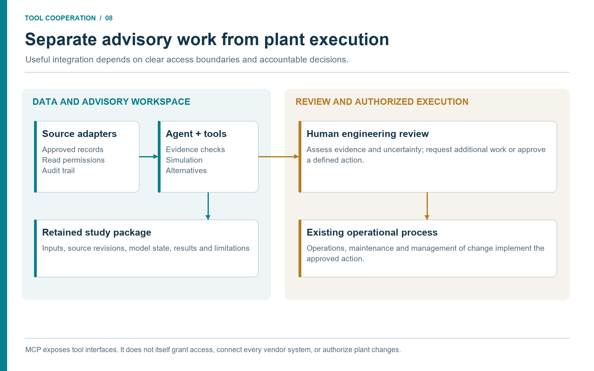

# Governance, Quality, and Adoption Roadmap

## Learning Objectives

After reading this chapter, the reader will be able to:

1. Define quality requirements for MCP-backed engineering workflows.
2. Explain validation, provenance, audit trails, access control, and model risk.
3. Select appropriate deployment controls for desktop, study-team, advisory, and enterprise use.
4. Plan a staged adoption roadmap from bounded pilots to maintained industrial capability.

> **Beyond the online book:** The online book explains MCP validation profiles and future directions. This chapter combines the organizational side: quality gates, acceptance testing, data access, change management, training, deployment architecture, and adoption metrics.

## 8.1 Governance Is Part of the Product

An MCP server that exposes process-simulation tools is not only software. It becomes part of the engineering work system. If it is easy to run a calculation, it is also easy to run the wrong calculation quickly. Governance is therefore not a layer added after the tool works. It is part of making the tool useful.

Quality requirements should be visible in every workflow:

- validated input schema;
- explicit units and basis;
- model and version metadata;
- benchmark or validation basis;
- source provenance;
- warnings and limitations;
- human review status;
- durable artifacts.

The MCP contract helps because tool input and output are structured objects. A result can carry convergence status, warnings, and provenance rather than being reduced to a single attractive number.

## 8.2 Validation and Benchmark Trust

Validation has several layers.

| Validation layer | Example question |
|------------------|------------------|
| Input | Are pressure, temperature, composition, and units valid? |
| Numerical | Did the flash or process simulation converge? |
| Engineering | Is the chosen model appropriate for the question? |
| Benchmark | Has the tool been compared with known cases or independent data? |
| Review | Has a qualified person accepted the output for this use? |

An agent should report all relevant layers. A converged calculation can still be inappropriate outside its domain. A benchmarked tool can still be misused if the input data is stale or wrong.

## 8.3 Audit Trails and Artifacts

Industrial workflows need durable artifacts. The minimum useful package for a standard study is:

- task specification;
- source manifest;
- input data file or model state;
- notebook, script, or MCP transcript;
- structured result object such as `results.json`;
- figures and tables;
- final report;
- review notes and open assumptions.

The report is the readable summary of a traceable calculation package. It should not be the only evidence that the work happened.

## 8.4 Data Access and Cybersecurity

Connecting agents to engineering document repositories, historians, laboratory and production databases, maintenance systems, and project records creates a shared evidence path. Access should follow least privilege. A document retrieval agent should only see documents relevant to the task and user authorization. A historian integration for an advisory study should read approved tags. Plant control writes belong to a separately governed system. Enterprise adapters should expose selected context, not broad records.

Important controls include:

- identity and access management tied to user or service account;
- read-only access for operational advisory workflows;
- approved storage and egress paths;
- logging of queries and retrieved documents;
- redaction rules for public or reusable outputs;
- separation between development, study, and production environments.

The agent is a new interface, not a new permission model.

Separate three permissions: reading a source record, creating a study artifact,
and changing an operational system. Success in one does not authorize the next.
A connector inventory should record the source owner, identity, permitted
queries, freshness, output location, and available read/write operations. A
product name in a workflow diagram is a proposed integration point until a
connector or approved export is actually available.

Treat retrieved text as evidence. An instruction embedded in a maintenance
comment or document must not alter the agent's tool permissions or redirect
confidential outputs. The agent should extract the engineering record and
preserve its provenance within the existing task boundary.

## 8.5 Deployment and Adoption Controls

Different deployment contexts need different controls.

| Context | Typical controls |
|---------|------------------|
| Desktop engineer | Local Docker, visible tool calls, public examples, no confidential data in public prompts. |
| Study team | Shared image version, task folders, source manifests, peer review. |
| Operational advisory | Read-only historian access, fixed workflows, monitoring, rollback. |
| Enterprise service | Central authentication, approved tools, audit logs, change management. |

The same tool can be appropriate in one context and inappropriate in another. Experimental multi-step task solving may be suitable for desktop learning. Enterprise advisory should use validated tools, restricted profiles, and known review routes.

## 8.6 Model Risk and Quality Culture

Model risk is the risk that a model gives a wrong or misleading result. Agentic workflows can reduce model risk by improving evidence capture, but they can increase it by producing polished reports quickly. Governance should therefore ask:

- Is the model domain clear?
- Are assumptions listed?
- Are units and basis consistent?
- Are uncertainties or sensitivities included where needed?
- Are limitations visible in the recommendation?
- Can the result be reproduced from stored artifacts?

The strongest control is quality culture. Engineers should ask for provenance, limitations, benchmark basis, and source quality. They should reject unsupported confidence. A tool result with a warning is usually more valuable than fluent prose without evidence.

A useful default prompt is:

```text
Use NeqSim tools where possible. Report model, units, input validation,
convergence status, warnings, benchmark basis, source provenance, and whether
this is a screening or design-level result.
```

## 8.7 Acceptance Testing for MCP Tools

Before an MCP tool is used in a governed workflow, it should have acceptance tests that engineers can understand.

| Test type | Example |
|-----------|---------|
| Schema test | Missing pressure or invalid unit is rejected clearly. |
| Known-result test | Methane flash or gas-quality calculation matches a reference case. |
| Edge-case test | Near-critical or two-phase conditions return warnings. |
| Provenance test | Output includes model, version, units, convergence, and limitations. |
| Profile test | Restricted deployment profiles cannot call experimental tools. |
| Regression test | Results remain stable unless a change is documented. |

Acceptance tests turn the tool catalogue into something reviewable. When a tool says it calculates a dew point, the team should know which benchmark cases support that claim.

## 8.8 Change Management for Skills and Agents

Skills and agents influence engineering outcomes, so they need change management. A skill update that changes a hydrate-margin workflow, relief screening checklist, or standards mapping is not just text editing. It changes how future work is performed.

A practical change process is:

1. propose the skill or agent change in version control;
2. state the reason and affected workflows;
3. include examples or tests where possible;
4. review by a domain owner and tool owner;
5. release with a version note;
6. monitor early use and capture lessons.

Domain knowledge used by agents should be visible and reviewable. Hidden prompt edits should not become the basis for shared engineering decisions.

The same discipline applies when a task reveals a missing NeqSim calculation
and the team develops new code as part of solving it. The task supplies the
reproducer, physical requirement, and acceptance criteria. A proposed
implementation needs source review, meaningful regression tests, appropriate
independent validation, and documented limitations before it becomes a trusted
method. The study must record the actual code revision used. A model result
cannot validate the new algorithm merely because the algorithm produced that
result.

Retain approved code, tests, benchmark data, skills, and handoff improvements in
version control so the next task can reuse them. This is organizational and
software learning through completed work, not automatic retraining of the
language model. Shared release and operational deployment remain separate
change decisions. Section 3.10 describes the full improvement loop.

## 8.9 Redaction and Reuse

Completed studies can teach the organization, but they may also contain private data. Teams should separate reusable method from confidential evidence.

Reusable knowledge includes generic workflows, public examples, code patterns, validation methods, and anonymized lessons. Confidential evidence includes asset names, equipment tags, internal document titles, proprietary operating data, commercial assumptions, and incident details.

When a study produces a useful skill improvement, extract the pattern and remove the private context. This allows learning without leaking sensitive details.

## 8.10 Adoption Roadmap

The adoption roadmap should move from bounded pilots to maintained capability.

| Stage | Aim | Output |
|-------|-----|--------|
| Desktop enablement | Install Docker MCP, run public examples, learn provenance habits. | Working local setup and first verified tool calls. |
| Study-team pilots | Select repeatable low-risk workflows. | Task folders, validation evidence, review feedback. |
| Governed data integration | Add approved document retrieval, historian snapshots, laboratory results, and selected enterprise context. | Source manifests and reviewed tag maps. |
| Reusable modular models | Build process-area models with stable automation addresses. | Versioned model states and scenario libraries. |
| Operational advisory | Deploy read-only recurring workflows. | Logs, dashboards, escalation criteria, and rollback. |
| Enterprise scaling | Standardize tools, skills, validation, access, and review workflows. | Managed capability across assets and disciplines. |

Each stage should produce reusable artifacts, not only demonstrations. Progress is measured by how much future work becomes easier, safer, and more traceable.

## 8.11 Capability Stack

Adoption should build a stack, not a collection of demos.

| Capability | Early maturity | Higher maturity |
|------------|----------------|-----------------|
| MCP tools | Local Docker tools | Versioned enterprise service. |
| Agents | Individual specialist agents | Routed multi-agent workflows. |
| Skills | Markdown procedures | Reviewed skill library with ownership. |
| Data access | Manual files and snapshots | Governed document, historian, laboratory, maintenance, and standards adapters. |
| Models | Study notebooks | Modular field models and lifecycle states. |
| Quality | Manual review | Automated validation plus discipline approval. |
| Reporting | Draft summaries | PaperLab reports with traceable artifacts. |

Better document retrieval improves many workflows. Better tag mapping improves hydrate, compression, energy, and safety studies. Better standards mapping improves safety, mechanical design, and field development.

## 8.12 Training and Community of Practice

The technology roadmap needs a people roadmap. Engineers need training in MCP tool use, prompt patterns, source provenance, model validation, and review responsibility. New users should start with public examples, inspect tool calls, and learn how to distinguish a tool-backed answer from unsupported language-model prose.

A community of practice can collect good prompts, review skill updates, share task templates, compare validation cases, and discuss failures. The most useful sessions are not demonstrations where everything works. They are reviews where a team asks what evidence was missing and how the skill or tool should improve.

## 8.13 Reference Architecture

A mature enterprise architecture may contain these components.

| Component | Role |
|-----------|------|
| MCP gateway | Hosts approved NeqSim and supporting engineering tools. |
| Identity layer | Connects tool access to user authorization and role. |
| Data connectors | Provide governed access to documents, historians, laboratory/production databases, maintenance, projects, and standards. |
| Model registry | Stores approved process models, versions, and validation status. |
| Skill library | Stores reviewed agent skills and procedures. |
| Artifact store | Stores task folders, reports, source manifests, and logs. |
| Review workflow | Routes outputs to discipline reviewers and captures decisions. |
| Monitoring | Tracks tool usage, errors, validation warnings, and adoption metrics. |

The architecture supports two routes. In a connected route, approved APIs or
MCP adapters retrieve records and preserve query metadata. In a file route,
authorized exports enter the same validation and modelling steps. Both should
produce equivalent evidence fields; the file route records export age and any
loss of native quality metadata. Neither route should silently claim live data.

The model registry accepts a reviewed input package and returns the model
revision and validation envelope. NeqSim produces calculations and warnings.
An independent checking step compares them with benchmark or plant evidence.
The reporting tool receives those results together with a review status. An
operations dashboard displays only the reviewed advisory state, and a changed
source revision or expired operating window sends the case back to validation.
This is the route by which cooperating tools become a maintained capability.

The desktop workflow remains a useful entry point. A wider deployment adds
ownership, retention, access, and change controls around the same artifacts.
NIST's voluntary AI Risk Management Framework offers a general structure for
assigning governance and assessing and managing AI-related risks; process
engineering requirements and discipline approval remain additional obligations.
\cite{NISTAIRMF2023}



**Discussion (Figure 8.1).**

The boundary is an operational responsibility, not a property guaranteed by MCP. Give data tools the permissions required for their task and make the review decision visible. An approved recommendation then enters the existing maintenance, operations or change-management process with its supporting evidence.

## 8.14 Measuring Value

Agentic engineering should be measured by engineering value, not novelty. Useful metrics include:

- time from question to reviewed screening result;
- number of scenarios evaluated per study;
- reduction in manual data gathering;
- number of reusable skills or workflows created;
- validation pass rate and warning trends;
- number of studies escalated appropriately;
- avoided rework from stale or missing data;
- production, energy, emissions, or maintenance value identified.

Some value is qualitative: better traceability, clearer assumptions, and more consistent reports. These matter because engineering organizations often lose time when assumptions are unclear and evidence is scattered.

### Testing the handoffs, not just the calculator

A known-result test can establish that a calculation still behaves as expected.
An integration test must also establish that the right record reached it.
Build representative cases with an outdated drawing, a mismatched equipment
identifier, a bad-quality historian interval, an ambiguous pressure basis, a
changed laboratory sample, and an unavailable connector. The expected outcome
may be a blocked conclusion with a precise data request, not a numerical answer.

For accepted cases, retain the input/output artifact hashes, source revisions,
tool and model versions, checks performed, and reviewer decision. A review
covers that particular scenario and evidence set. Replacing a source or changing
a model input invalidates dependent results until they are rerun and reviewed.
Measure avoided rework and time to a reviewed decision across the whole chain;
counting tool calls or generated reports alone does not measure engineering
value.

## 8.15 Summary

Governance and adoption are one subject. The same controls that make agentic workflows safe also make them scalable: validation, provenance, artifacts, access control, change management, training, and review gates. MCP provides the structured interface. NeqSim provides the physics. Agents and skills provide workflow intelligence. Industrial value appears when these pieces are adopted as a maintained engineering capability rather than a set of isolated demonstrations.

Key points from this chapter:

- Quality requirements should be built into MCP tools and agent workflows.
- Validation includes input, numerical, engineering, benchmark, and human review layers.
- Data integrations must follow existing access-control and cybersecurity rules.
- Skills and agents should be versioned, reviewed, and owned like engineering methods.
- Adoption should proceed through bounded pilots, governed data integration, modular models, advisory workflows, and enterprise scaling.

## Exercises

1. **Quality checklist:** Build a minimum quality checklist for an MCP flash calculation used in a report.
2. **Pilot design:** Choose one pilot workflow and define value, data sources, validation, and review gates.
3. **Capability maturity:** Rate a current team against the maturity stack and identify the next improvement.

## References

This chapter uses references from the master bibliography.
