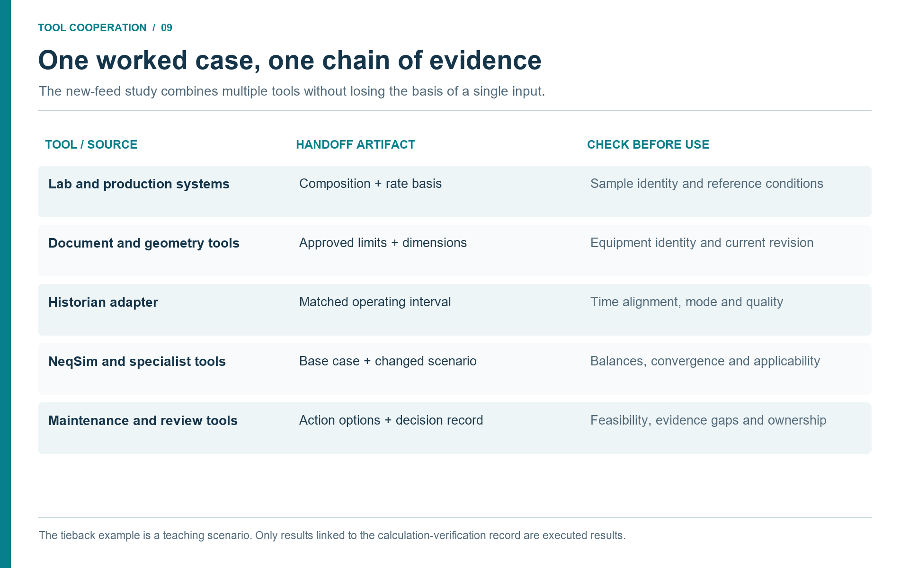

# Worked Pattern: From Field Model to Recommendation

## Learning Objectives

After reading this chapter, the reader will be able to:

1. Follow a complete agentic workflow from field-level question to equipment and safety follow-up.
2. See how NeqSim MCP, modular models, controlled-document retrieval, historian data, and Maintenance context fit together.
3. Distinguish evidence, simulation, interpretation, and recommendation in a worked pattern.
4. Reuse the pattern for similar studies without copying asset-specific details.

> **Beyond the online book:** The online book provides fifteen standalone
> worked examples and forty case study summaries. This chapter combines
> those elements into a single end-to-end industrial pattern: from
> field-level question through modular model, equipment detail threads,
> flow assurance, safety screening, root cause analysis, dynamic
> simulation, and an integrated recommendation — showing how the pieces
> fit together in a real study.

## 9.1 Scenario and Question

This chapter uses a fictional but realistic field-development and operations
pattern. The example avoids private asset names, equipment tags, and proprietary
data. The goal is to show the workflow shape, not to document a real facility.

The reference facility processes gas condensate from an offshore production
system. This is one teaching case in a broader oil and gas workflow; Section
9.16 adapts the same tool chain to onshore gas processing and pipeline or
terminal operations. A
satellite reservoir is being considered for tieback to the existing host. The
study team wants to know whether the host can process an additional production
case during the first two years of tieback operation without major modification.
The early question is deliberately broad:

```text
Screen whether the existing host can process an additional gas-condensate
tieback case. Use a modular NeqSim field model, approved document evidence,
recent operating data where relevant, and agentic equipment and safety follow-up.
Return bottlenecks, study limits, and recommended next engineering work.
```

This is not a design approval. It is a structured screening study. The expected
output is a ranked list of constraints and a recommendation about which detailed
studies should be performed next.

**Case status.** No plant databases were queried and no NeqSim study was executed
for this chapter's numerical examples. All stated case values are fictitious
teaching inputs or assumed outputs. The case registry below keeps the scenarios
separate; a real study would add source revisions, uncertainty ranges, model
states, and run identifiers.

| Scenario ID | Teaching role | Relationship |
|-------------|---------------|--------------|
| `HOST_BASE` | Existing host at a defined steady operating window | Reference for the throughput screen. |
| `TIEBACK_STEADY` | Added wellstream in steady operation | Compared only with `HOST_BASE` in Section 9.5. |
| `COLD_RESTART` | Time-dependent restart and inhibitor questions | Requires its own initial inventory, thermal state, and event sequence. |
| `WEEKLY_REVIEW` | Later operating snapshot and performance arithmetic | Separate from the host design screen; Section 9.13. |
| `VIBRATION_EVENT` | Post-tieback diagnostic investigation | Uses an event window and mechanical evidence, not the steady-state screen alone. |

## 9.2 Task Classification

The first agent action is classification. The task is not a single flash
calculation. It spans process simulation, flow assurance, equipment capacity,
safety screening, and operational data. A router or study lead can divide the
work into packages:

| Package | Agent focus | Main outputs |
|---------|-------------|--------------|
| Scope and evidence | Capability scout and document reader | Task specification and source manifest. |
| Field model | Process simulation agent | Modular `ProcessModel` with base and tieback scenarios. |
| Pipeline and arrival | Flow assurance agent | Pressure drop, temperature, hydrate margin. |
| Host equipment | Mechanical/equipment agent | Separator, compressor, heat exchanger, valve constraints. |
| Safety | Safety and depressuring agent | Relief/blowdown/barrier screening needs. |
| Reporting | PaperLab/reporting agent | Results, assumptions, risks, and next steps. |

The study lead approves this split before data retrieval begins. This approval
is useful because it prevents an agent from pursuing irrelevant detail too soon.

## 9.3 Evidence Plan and Tool Handoffs

The agent first discovers what is actually available: a controlled-document
reader, historian or analytics interface, laboratory and production-data
access, maintenance/MOC reader, NeqSim MCP, and reporting tools. Each is a
separate capability. A server that can run a flash calculation does not thereby
provide a connection to the company's data estate. Authorized exports can fill
an unavailable connector role, with export time and restrictions recorded.
\cite{NeqSimMCP2026,AnthropicMCP2024}

The following teaching sequence shows how the tools cooperate. Each row creates
an artifact consumed by a later row. The artifact names are proposed study
files, not claimed native API fields.

| Source → retrieval tool | Retrieved record and validation | Handoff and next owner |
|-------------------------|---------------------------------|------------------------|
| Equipment register and engineering repository → document search/reader | Approved PFD/P&ID revision, equipment IDs and topology; process engineer checks configuration and boundaries | `topology_register` → model builder. |
| Vendor document repository → table/curve reader | Compressor map, driver rating and separator internals; equipment specialist checks revision, units and map basis | `equipment_limits` → capacity and safety threads. |
| Historian → time-series reader and quality notebook | Timestamped operating window, quality flags and aggregation; data owner checks instrument status and time alignment | `operating_inputs` plus withheld `benchmark_measurements` → base-case comparison. |
| Laboratory system → sample/result reader | Composition, sample point/time, wet/dry basis and method; PVT reviewer checks representativeness and component mapping | `fluid_definition` → NeqSim thermodynamic model. |
| Production accounting → well-test/allocation reader | Well tests, rates, reporting period and reference conditions; production engineer reconciles boundaries and inventory effects | `production_basis` → supply scenarios and independent balance check. |
| Maintenance, inspection and MOC systems → context reader | Work-order timeline, restrictions and configuration changes; equipment/operations owner confirms status | `action_constraints` → interpretation and recommendation, not automatic model tuning. |
| Standards library and approved design basis → requirements reader | Applicable edition, jurisdiction and acceptance criteria; discipline owner confirms applicability | `criteria_register` → comparisons and review gates. |
| Reviewed inputs and model registry → NeqSim MCP | Versioned model with EOS, mixing rule, units and accepted inputs; process engineer checks base-case and sensitivity validity | `scenario_results` → equipment, flow-assurance and safety reviews. |
| Reviewed results → PaperLab/reporting tool | Numerical outputs, warnings, evidence links and reviewer decisions; study lead checks recommendation scope | Report and work record → decision owner. |

One possible implementation uses OpenText Content Management for Engineering
for controlled documents, AVEVA PI System for historian records, SampleManager
LIMS for laboratory results, and SAP asset management or IBM Maximo for
maintenance context. These are public examples of the source roles, not a
claim that this book supplies a ready-made connector between them. An approved
API, MCP adapter, or export must implement each handoff in the chosen
organization. \cite{OpenTextEngineering2026,AVEVAPI2026,SampleManagerOilGas2026,SAPAssetManagement2026,IBMMaximo2026}

The source manifest is the join between these tools. A field in
`fluid_definition` points to a laboratory record; a comparison limit points to
a document page and revision; a result points to the exact model state and run.
When a source cannot be retrieved, the dependent claim becomes an explicit data
gap. An absent compressor map blocks a map-limit conclusion. A bad historian
window blocks plant validation, while a separately authorized design-case
screen may continue with its own basis. The agent never labels a missing record
as retrieved or a hypothetical result as validated.

### Follow one record through the chain

Consider the driver rating used in the compressor thread. Document search finds
the approved vendor datasheet using the equipment-register identity. The reader
extracts the rating, unit, applicable operating conditions, and page reference.
The equipment specialist resolves any ambiguity between electrical input,
shaft output, and available site rating. The accepted value enters the criteria
register. NeqSim returns required shaft power for the matching scenario; the
comparison step evaluates the same power basis. Maintenance restrictions or a
pending driver modification are added as action constraints. The report states
the resulting constraint only after the equipment reviewer accepts the match.

This is tool cooperation: retrieval establishes the record, extraction makes it
usable, review establishes its meaning, simulation supplies the demand,
comparison identifies a constraint, and reporting preserves the decision trail.



**Discussion (Figure 9.1).**

This chain makes a calculation auditable even when several applications contribute to it. If the laboratory composition changes, the affected model inputs and scenarios can be identified. If a document revision changes an equipment limit, the review can focus on the conclusions that used that limit.

## 9.4 Modular Field Model

The process-simulation agent builds a modular model with four process areas:

1. **Subsea and pipeline:** wellstream source, pipeline pressure drop, arrival temperature.
2. **Inlet and separation:** inlet cooling, slug catcher or separator, HP/LP separation.
3. **Compression and export:** scrubbers, compressors, coolers, dehydration, export pressure.
4. **Utilities and safety interfaces:** fuel gas, power demand, relief-load screening interfaces.

The proposed model starts with a base host case. In a real study it must be compared against recent operating data. Separate
imposed boundary conditions from independent outputs: a pressure copied from
the historian is not a successful prediction of that pressure. Suitable
withheld comparisons may include discharge temperature, shaft power, liquid
rates, and reconciled fuel use, subject to measurement quality and model scope. The tieback case
then adds an incremental wellstream and reruns the field model.

The important artifact is not only the model. It is the scenario state. The
state records the base case, the tieback case, changed inputs, source manifest,
and acceptance criteria. This state lets later equipment and safety agents refer
to the same scenario without rebuilding context from prose.

## 9.5 Illustrative Field-Level Results

The following numbers are illustrative screening values for the pattern. A real
study would replace them with NeqSim MCP or notebook outputs and source-backed
input data.

| Result | Base case | Tieback case | Screening interpretation |
|--------|-----------|--------------|--------------------------|
| Export gas rate | 100% reference | 116% reference | Production increase is material. |
| Export compressor power | 82% of driver rating | 97% of driver rating | Driver margin becomes tight. |
| HP separator gas load | 76% of screening limit | 91% of screening limit | Capacity likely acceptable but internals need review. |
| Export hydrate margin | 8 K | 3 K | Flow assurance study required for cold cases. |
| Fuel gas use | 100% reference | 121% reference | Emissions and power impact need evaluation. |
| Flare relief screening basis | Base design case | Potential increase | Formal relief check required. |

Within these assumed teaching outputs, the field-level screen identifies two
likely constraints: export compression and
hydrate margin. It also identifies two follow-up areas: separator internals and
relief/blowdown. The agent does not conclude that the host can accept the
tieback. It concludes that the case is worth further study if compressor and
hydrate constraints can be addressed.

## 9.6 Compressor Detail Thread

The compressor thread starts from the field model. The tieback case gives
suction flow, suction pressure, suction temperature, gas composition, discharge
pressure, and required power. The equipment agent then retrieves compressor
evidence.

The source manifest includes the compressor datasheet, performance map,
anti-surge control description, driver rating, and recent operating tags. The
plant-data agent selects a recent steady-state window to compare actual and
modelled performance. Maintenance context indicates whether recent maintenance work may
affect efficiency or availability.

The compressor thread asks four questions:

| Question | Calculation or evidence | Decision impact |
|----------|-------------------------|-----------------|
| Is required head inside map? | Map comparison with NeqSim gas properties | Determines whether operating point is feasible. |
| Is driver power sufficient? | Required power versus driver rating | Identifies production cap or driver modification need. |
| Is surge margin acceptable? | Flow/head point relative to surge line | Determines anti-surge and recycle implications. |
| Is observed efficiency degraded? | Model versus historian trend and Maintenance context | Determines whether cleaning/maintenance could recover margin. |

The illustrative result is that driver margin is the tightest compressor limit,
while surge margin remains acceptable for the base tieback case. The workflow
therefore returns a facility constraint: export flow must be limited unless
driver margin is recovered or compression is modified. It also returns a next
action: confirm compressor map and driver limits with a compressor specialist.

## 9.7 Flow Assurance Thread

The flow assurance thread evaluates arrival pressure, arrival temperature, and
hydrate margin. The agent retrieves pipeline length, elevation, insulation or
heat-transfer assumptions, seabed temperature range, inhibitor strategy, and
historical operating data. The NeqSim model calculates phase behaviour and
hydrate temperature along relevant operating points.

The teaching scenario assumes that a normal warm case has margin, while a
cold low-flow restart case may approach the hydrate limit. No executed transient
has established that result in this chapter. This changes the
study conclusion. The tieback may be feasible at steady high flow, but startup,
turndown, and shutdown conditions require a more detailed transient or operating
procedure study. A production-increase screen that only looked at steady-state
export would have missed the controlling case.

## 9.8 Separator and Liquid Handling Thread

The separator thread uses the tieback fluid and field-model rates. Approved
equipment datasheets provide separator diameter, length, normal liquid level, high-high
level, inlet device, demister type, and nozzle sizes. NeqSim provides densities,
viscosities, surface tension, gas and liquid rates, and phase split.

The screening checks gas load factor, liquid retention time, inlet momentum, and
demister velocity. The illustrative result is that average capacity remains
inside screening limits, but slug or transient liquid handling is not addressed.
The recommendation is therefore to perform a dynamic liquid-handling check if
the tieback profile has high slugging uncertainty.

This thread shows why field and equipment levels need each other. The field
model identifies the increased liquid rate. The equipment study asks whether the
actual vessel and internals can handle it. The safety thread then asks whether
larger liquid inventory affects relief or blowdown assumptions.

## 9.9 Safety Thread

The safety thread does not redo the HAZOP. It prepares a screening package. It
uses the field and equipment results to identify which safety studies may need
update.

| Safety topic | Screening trigger | Recommended follow-up |
|--------------|------------------|-----------------------|
| Relief load | Higher gas and liquid rates through separators and compressors | Formal relief review for affected scenarios. |
| Blowdown inventory | Changed operating inventory and pressure in process sections | Blowdown and MDMT screening. |
| Hydrate during shutdown | Cold low-flow or restart cases near hydrate limit | Flow assurance and operating-procedure review. |
| Compressor protection | Operation closer to driver or map limits | Anti-surge and trip review. |
| Barrier documentation | Changed operating envelope | HAZOP node package update. |

The safety output is an escalation map. It states that the tieback screening is
not sufficient for management of change. It identifies the formal studies that
would be needed before any operating limit or design basis changes.

## 9.10 Integrated Recommendation

The final recommendation should be short, evidence-based, and honest about
uncertainty:

```text
The screening indicates that the host may be able to process the illustrative
tieback steady-state case, but export compressor driver margin and cold-case
hydrate margin are controlling constraints. Separator average capacity appears
less limiting than compression, but liquid-handling dynamics and internals need
review. Safety follow-up is required for relief, blowdown/MDMT, compressor
protection, and HAZOP node updates before any operating envelope change.
```

The recommendation also lists immediate next work:

1. validate compressor map and driver rating against approved vendor documents;
2. run cold-case flow assurance with uncertainty in ambient and inhibitor assumptions;
3. perform separator internals and slug-handling review;
4. screen relief and blowdown impacts using approved safety methods;
5. update economics and emissions if technical constraints can be managed.

## 9.11 Remarks on the Illustrative Results

All results in this chapter are illustrative. They use representative but
fictitious data: fluid compositions, equipment sizes, tag names, and operating
conditions are invented for educational purposes. No real field or operator is
named. The value of the worked case is the *workflow*, not the numbers. The
same pattern --- evidence plan, modular model, threaded studies, integrated
recommendation --- applies to any real field study.

## 9.12 Root Cause Analysis Thread: Compressor Vibration

Suppose the tieback has been in operation for six months. The export compressor
begins reporting elevated vibration. Operations raises the question: What is
causing the vibration increase, and is it related to the changed operating
conditions?

This is a root cause analysis (RCA) problem. It cannot be solved by simulation
alone, because the cause may be mechanical, process-related, or both. It cannot
be solved by documents alone, because the documents describe design conditions,
not the current fault. It cannot be solved by historian data alone, because
correlation does not identify mechanism. The value of agentic integration is
that it combines all three.

### Agent workflow

1. **Resolve the event.** The operations log identifies the compressor and
   event period. The equipment register links the historian tags, condition
   monitoring channels, vendor records, and model object. A mismatch returns
   to the equipment owner before evidence is combined.
2. **Retrieve and align.** The document reader returns the approved compressor
   map and limits; the historian returns process conditions and anti-surge
   valve position; the condition-monitoring system returns the relevant
   vibration evidence. The laboratory record establishes composition. A
   data-quality step separates the pre-event baseline from the event and
   preserves quality flags, time bases, and rejected periods.
3. **Add maintenance context.** The maintenance reader returns relevant work
   orders and inspection findings, and the MOC reader returns configuration
   changes. These build an event timeline; temporal coincidence alone does
   not establish a cause.
4. **Run supported diagnostic analysis.** The agent uses the discovered
   `runRootCauseAnalysis` schema to pass the model, symptom, accepted historian
   data, and supported design-limit context. The returned `RootCauseReport`
   is linked to the source manifest. A diagnostic label in software is not
   proof that every required evidence channel has been analysed.
5. **Review coverage.** Candidate priors must identify their actual reliability
   source and population. OREDA is an example of a governed reliability-data
   source; its availability or licensing is separate from NeqSim access.
   Supported process perturbations may test performance hypotheses, while
   unsupported mechanical mechanisms must remain unverified. Normalized
   ranking scores are not calibrated probabilities of the true fault.
   \cite{OREDAAbout2026,NeqSim2026}
6. **Send the evidence to the specialist.** The rotating-equipment engineer
   reviews competing hypotheses and chooses the next discriminating check.
   The operational owner controls any action.

| Candidate hypothesis | Evidence that could discriminate it | Required specialist check |
|----------------------|------------------------------------|---------------------------|
| Operation close to surge | Corrected map position, synchronized process tags, anti-surge controller state | Confirm map applicability and dynamic control response. |
| Fouling or performance degradation | Composition-corrected efficiency trend, discharge conditions, inspection history | Compare supported model perturbations with independent measurements. |
| Rotor imbalance or misalignment | Vibration spectrum, phase information, maintenance/alignment records | Mechanical condition assessment; a thermodynamic process model does not resolve rotor dynamics. |
| Bearing degradation | Vibration features, lubricant and bearing-temperature evidence, inspection | Check sensor validity and mechanical evidence; stable temperature alone does not rule it out. |

No numeric ranking is asserted here: this teaching case has no retrieved event
record or executed diagnostic run. The useful output is the artifact chain and
the next evidence that would distinguish the hypotheses. The maintained
`SimulationVerifier` records unsupported, unknown, or failed verification
separately from evaluated cases; preserve those states in the report rather
than converting them into a successful diagnosis. \cite{NeqSim2026}

## 9.13 Operational Evidence Package: Weekly Compressor Review

Beyond event-driven RCA, the same integration pattern supports routine
operational monitoring. Suppose the facility runs a weekly compressor
performance review. The agent builds an `OperationalEvidencePackage` that
combines the tag map, field data, and process model into a single reviewable
artifact.

### Tag map and independent checks

Keep private historian tag names in the deployment's binding file. The public
teaching example uses logical names and model roles. Actual automation addresses
must be discovered from the constructed model; a plausible-looking address is
not enough to establish that it is writable or has the expected unit.
\cite{NeqSim2026}

| Logical quantity | Model role | Unit or basis | Use |
|------------------|------------|---------------|-----|
| Suction pressure | Feed-stream boundary | bar absolute | Input. |
| Suction temperature | Feed-stream boundary | K | Input. |
| Discharge pressure | Specified compressor outlet pressure | bar absolute | Input for this case. |
| Discharge temperature | Calculated outlet-stream temperature | K | Independent benchmark. |
| Gas flow | Feed-stream mass flow | kg/h | Input. |
| Speed | Compressor speed where the model uses a map | rpm | Input or diagnostic context, declared explicitly. |
| Shaft power | Calculated compressor power | kW, shaft basis | Independent benchmark after instrument basis is checked. |
| Anti-surge valve position | Recycle-valve state or context | % | Input only when valve/control representation is validated. |

### Weekly workflow

The historian reader selects an accepted window, and the laboratory reader
supplies its matching fluid basis. The tag map applies only the designated
inputs. The model runs, and withheld measurements test its predictive output.
`OperationalEvidencePackage` compares tags explicitly marked as `BENCHMARK`;
input tags do not provide independent validation. Its scenario builder uses
copies of the base process, whereas direct `OperationalScenarioRunner` calls
require the caller to supply an independent process state. \cite{NeqSim2026}

The process engineer chooses tolerances based on measurement uncertainty,
engineering significance, and model use. Relative differences can mislead for
near-zero quantities or Celsius temperatures. Prefer an absolute temperature
error in K and a defined power basis. Do not accept an empty benchmark set as a
validated model. Check the number of comparisons, missing values, and the
independence of every benchmark.

Two hypothetical scenarios continue the example: increasing throughput by 10%
and reducing suction pressure by 3 bar. These changes define study inputs, not
established feasible operating actions.

### Illustrative arithmetic, not simulation validation

The table below checks the arithmetic of fictitious values previously used in
this example. It does not validate NeqSim predictions or actual plant data.

| Comparison | Assumed values | Arithmetic result | Meaning |
|------------|----------------|-------------------|---------|
| Shaft-power benchmark | Model 8400 kW; measurement 8750 kW | Absolute difference 350 kW; relative error 4.0% of measurement | Requires matched shaft/electrical basis and an agreed tolerance. |
| Discharge-temperature benchmark | Model 142.1 °C; measurement 148.5 °C | Model is lower by 6.4 K | Use an absolute temperature tolerance; a Celsius percentage has no invariant physical basis. |
| Throughput scenario power | Before 8400 kW; after 9520 kW | Increase 1120 kW, or 13.3% of baseline | Does not establish driver margin without an accepted available rating. |
| Lower-suction-pressure scenario power | Before 8400 kW; after 9100 kW | Increase 700 kW, or 8.3% of baseline | Does not establish surge margin without a suitable map and operating point. |

For relative power error, divide the absolute model–measurement difference by
the measurement. For a scenario percentage change, divide the change by the
baseline. These are different comparisons and should remain differently
labelled. No blanket PASS or bottleneck verdict follows from this table.

The reviewed weekly package should contain the actual `benchmarkComparison`,
`baseCapacity`, `scenarioStudies`, and `qualityGates` objects returned by
`OperationalEvidencePackage`, together with source and review metadata stored
by the workflow. Retain the raw tool output instead of replacing it with a
handwritten imitation of the API schema. \cite{NeqSim2026}

## 9.14 Dynamic Simulation Thread: Startup and Depressurization

The steady-state threads above identified hydrate margin during cold restart as
a potential constraint. A steady-state model cannot evaluate this risk fully
because the controlling case is time-dependent: the pipeline starts at ambient
temperature, warms gradually as production resumes, and may pass through the
hydrate region during the ramp-up window.

This is where dynamic simulation enters the worked case pattern. The agent
extends the field model into a transient study by following the workflow
described in Section 5.6 and Section 7.15:

1. **Establish a physical initial state.** Use an accepted operating state
   followed by a validated shutdown/cooldown calculation, or specify a reviewed
   static inventory and temperature distribution. A converged flowing case
   does not define cold, blocked-in inventory, and a zero-flow steady-state
   solve is not a substitute for that initialization.

2. **Define the startup sequence.** The scenario specifies: choke valve opens
   gradually over 30 minutes, separator level controller active, compressor
   starts when suction pressure reaches setpoint, inhibitor injection active
   from time zero.

3. **Run the transient.** A reviewed workflow with the required dynamic
   equipment physics and event handling steps through time,
   recording pipeline temperature profile, separator level, compressor suction
   conditions, and hydrate margin at each step.

4. **Evaluate the response.** The agent checks whether temperature anywhere in
   the pipeline drops below the hydrate formation temperature at the local
   pressure during the ramp-up window. It also checks whether separator level
   exceeds high-alarm during the initial liquid surge.

5. **Report.** The output includes a time-domain temperature-vs-hydrate plot,
   the minimum margin and when it occurs, and a pass/fail assessment.

No executed transient result is available in this chapter. The required output
is the minimum hydrate margin, its location and time, uncertainty in the
initial state and inhibitor distribution, and comparison with the approved
criterion. A calculated crossing would trigger specialist investigation; it
would not by itself validate a preheating or inhibitor strategy.

Similarly, a depressurization study for the tieback scenario uses dynamic
simulation to predict minimum metal temperature during emergency blowdown.
A thermal model with explicit wall properties and heat transfer must track
fluid and metal temperatures separately. The study compares metal temperature
with the applicable material limit and records the
time to reach the specified depressurization target. Fire relief sizing is a
related but distinct scenario and must retain its own basis.

These dynamic threads change the overall study conclusion. The assumed steady-state outputs illustrate a possible capacity question;
they do not demonstrate feasibility. A completed dynamic study could add
constraints on startup, shutdown, and depressurization, or establish that the
chosen sequence needs revision. This is a common pattern
in real field studies: the facility has static capacity, but the dynamic
operating envelope imposes additional constraints.

### Production data as dynamic boundary conditions

The dynamic simulation becomes more valuable when it uses production data as
boundary conditions. The latest well test provides the actual wellhead pressure,
GOR, and water cut. If the reservoir has matured and wellhead pressure is lower
than the design case, the startup transient may take longer and the minimum
hydrate margin may be smaller. Using design-case well data can misrepresent the available margin; the
direction and size of the error require an appropriate model and comparison.

The pattern is: read the latest well test from the production database, update
the wellstream source in the dynamic model, and re-run the startup transient.
Compare the result against the design-case transient. If the actual-well-data
case has tighter margins, flag it as a changed operating condition that may
require a procedure update.

## 9.15 What the Agent Did and Did Not Do

The proposed agentic workflow would:

- structure the task;
- retrieve and organize evidence;
- build or update modular NeqSim scenarios;
- run screening calculations;
- connect equipment and safety follow-up;
- produce traceable artifacts.

Its remit excludes:

- approve the tieback;
- replace discipline reviews;
- certify relief capacity;
- validate vendor data without specialist review;
- change operating procedures;
- bypass document or historian access controls.

This distinction is the heart of industrial agentic engineering. The agent makes
the study faster and more complete. The organization remains responsible for
decisions.

## 9.16 Reuse Pattern

The same worked pattern can be reused for brownfield debottlenecking,
production optimization, emissions reduction, and maintenance planning. The
details change, but the structure remains:

1. classify the decision and study level;
2. define evidence needs and approved sources;
3. build or select a modular process model;
4. run field-level scenarios;
5. launch equipment detail threads for bottlenecks;
6. launch safety and standards threads for affected barriers;
7. integrate results into a ranked recommendation;
8. store artifacts and reusable lessons.

The strongest workflows are those that make the next study easier. A completed
tieback screen should leave behind improved tag maps, document retrieval
queries, model states, validation cases, and checklist updates.

### Portable variant A: onshore gas processing or LNG feed acceptance

Replace the satellite tieback question with a proposed feed change. The
production or supply database provides the feed period; the laboratory system
provides the composition and sample basis; the document repository supplies
pretreatment, dehydration, refrigeration, and receiving-unit limits. Historian
and analytics tools establish a comparable operating window. The agent passes
reviewed feed inputs to the relevant NeqSim modules and obtains specialist-model
results for units outside the validated model scope. The comparison step checks
product specifications and equipment limits, then the review workflow resolves
safety and MOC implications. Whole-LNG-train capacity cannot be inferred from a
validated feed-gas calculation alone.

### Portable variant B: pipeline delivery and terminal interface

Replace the reservoir forecast with a nomination and transfer schedule. A
GIS/route database supplies the geometry; metering and historian systems supply
flow, pressure, and temperature; laboratory records establish composition or
product assay; a terminal inventory system defines receiving capacity. The
agent hands a validated route and boundary-condition package to hydraulic and
thermal models, then sends delivery conditions and uncertainties to the
receiving-facility reviewer. A pump or valve event invokes a separate transient
study. Maintenance restrictions and approved transfer procedures constrain the
recommendation. Downstream process or reaction calculations require their own
validated tools and cannot be assumed from pipeline performance.

Both variants retain the source → retrieved record → validation → model or
context → reviewed output sequence. They change the domain evidence and model
coverage, not the need for checked handoffs.

## 9.17 MCP Transcript Sketch

A real MCP transcript contains JSON-RPC messages and tool outputs. A book does
not need to reproduce the entire transcript, but a study should preserve enough
of the tool path to be auditable. A simplified transcript sketch for the worked
case might look like this:

```text
User: Screen the defined tieback scenario using accepted evidence.
Agent: Discover available simulation, document, data, and reporting tools.
Discovery -> actual tool names, schemas, access restrictions, versions.
Document reader -> approved topology, equipment limits, source references.
Historian/analytics reader -> accepted operating window and quality report.
Laboratory/production reader -> fluid basis and scenario boundary conditions.
Maintenance/MOC reader -> event timeline and action constraints.
Validation -> accepted model inputs and separate benchmark measurements.
NeqSim tools -> base/scenario outputs, warnings, convergence and model metadata.
Comparison -> benchmark deviations, constraints and unsupported conclusions.
Reviewer -> accepted findings, unresolved questions and permitted next work.
PaperLab -> report, source manifest and reproducible work record.
```

This is a conceptual transcript. Source-reader labels are roles, not claims
that a native tool with that name exists. Use the schema returned by discovery
for each actual call. If a connector is absent, an authorized export takes its
place and the transcript records that route.

The transcript shows three healthy behaviours. First, the agent discovers tools
instead of assuming them. Second, it stops for missing data rather than inventing
critical inputs. Third, it uses structured outputs for comparison and reporting.

For a formal study, the full transcript may be too verbose for the report, but
the source manifest and results object should preserve the essential parts:
tool name, input hash or file, output file, warnings, and version. This lets a
reviewer reproduce the path without reading a long chat history.

## 9.18 Results Object Sketch

A structured results object is the handoff between calculation and reporting.
The exact schema can vary, but the worked case needs fields like these:

```json
{
  "case_id": "TIEBACK_STEADY",
  "study_level": "screening",
  "evidence_status": "fictional teaching example; no simulation executed",
  "key_results": {},
  "validation": {
    "base_case_compared_to_historian": false,
    "actual_source_manifest_available": false,
    "formal_design_approval": false
  },
  "required_artifacts": [
    "accepted input package and source manifest",
    "model revision and raw calculation output",
    "independent benchmark comparison",
    "discipline review record"
  ],
  "recommended_next_work": [
    "Retrieve and review compressor map and driver rating",
    "Execute cold-case flow assurance and transient studies",
    "Review relief, blowdown and affected HAZOP nodes"
  ]
}
```

The object declares the teaching status and keeps uncomputed results empty.
A real run replaces these fields with source-backed values and actual checks.
The report generator can turn `key_results` into tables, `validation` into a
review summary, and `warnings` into executive-summary caveats. Other agents can
read the same object and continue the workflow. A safety agent does not need to
parse a paragraph to learn that relief and blowdown require follow-up.

## 9.19 Risk Register Sketch

Even a screening study benefits from a simple risk register. It helps the team
see which uncertainties matter most.

| Risk | Category | Likelihood | Consequence | Mitigation |
|------|----------|------------|-------------|------------|
| Compressor map unavailable or outdated | Technical | Possible | Major | Retrieve latest vendor package and specialist review. |
| Cold-case hydrate margin below criterion | Flow assurance | Possible | Major | Run detailed transient and inhibitor study. |
| Separator slug handling underestimated | Process | Possible | Moderate | Review slug profile and dynamic liquid capacity. |
| Relief loads increase beyond installed capacity | Safety | Uncertain | Major | Formal relief review before operating change. |
| Incremental emissions reduce value of tieback | Environmental/economic | Possible | Moderate | Include fuel and CO2 intensity in economic screen. |
| Maintenance window incompatible with required modification | Schedule | Possible | Moderate | Link recommendations to maintenance and shutdown planning. |

The risk register does not need false precision. It needs to connect technical
uncertainty to next work. In this example, the top risks align with the
recommended follow-up studies, which is exactly what a screening risk register
should do.

## 9.20 Summary

This chapter has shown a complete pattern from field-level question to detailed
equipment and safety follow-up. The example is fictional, but the workflow is
intended to be directly reusable. The central message is that agentic engineering
does not replace the engineering process. It connects data, models, tools, and
review in a way that makes the process faster and more traceable.

Key additions in this chapter:

- **Root cause analysis** (Section 9.12) shows how declared reliability evidence, process and condition-monitoring data, design limits, and supported NeqSim perturbations contribute to a specialist-reviewed hypothesis package.
- **Operational evidence packages** (Section 9.13) demonstrate the weekly monitoring pattern where `OperationalTagMap` and `OperationalEvidencePackage` automate the data-to-model binding, benchmark comparison, and scenario analysis.
- **Dynamic simulation** (Section 9.14) adds time-dependent analysis for startup and depressurization, showing how production data changes the dynamic boundary conditions and why steady-state screening alone is insufficient.
- Together, these threads illustrate the defining pattern of agentic engineering: no single data source or tool could produce the result; value comes from the structured combination of documents, field data, production databases, and both steady-state and dynamic simulation.

## Exercises

1. **Scenario split:** Apply the same pattern to a produced-water debottlenecking study and define the process areas.
2. **Evidence gap:** Identify what should happen if the compressor vendor map cannot be retrieved.
3. **Safety escalation:** Write the escalation statement for a tieback screen where hydrate margin is below the operating criterion.
4. **Root cause analysis:** A separator shows increasing liquid carryover to the gas outlet six weeks after a production increase. Design the RCA workflow: list the symptom type, at least four candidate hypotheses, the historian tags that would distinguish them, and the controlled engineering documents required.
5. **Evidence package design:** Define the tag bindings, benchmark tolerance, and two operational scenarios for a weekly heat-exchanger performance review using `OperationalEvidencePackage`.

## References

This chapter uses references from the master bibliography.