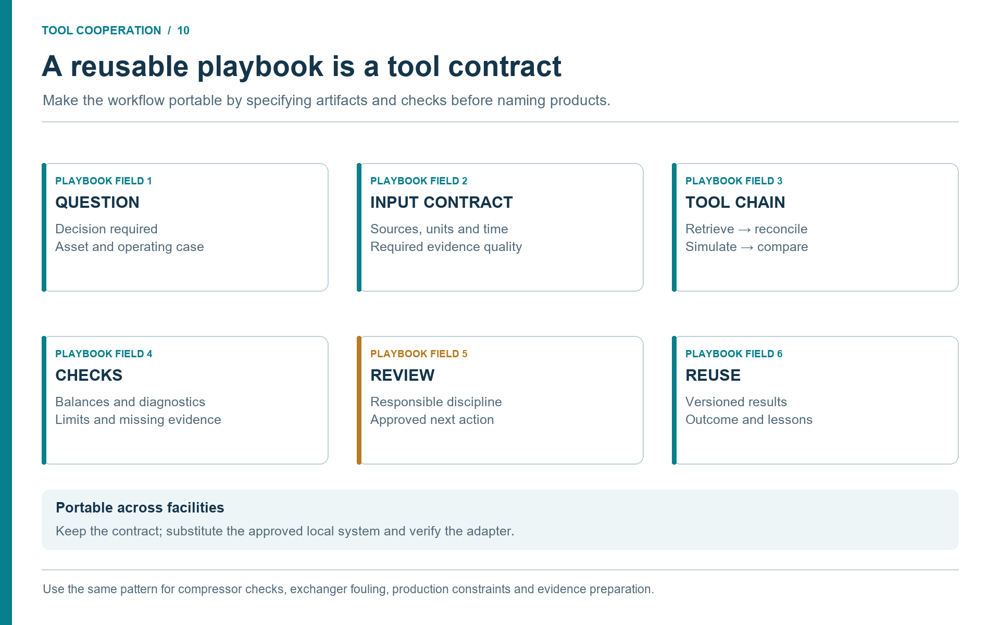

# Playbooks, Checklists, and Discipline Patterns

## Learning Objectives

After reading this chapter, the reader will be able to:

1. Reuse practical prompts, checklists, and report patterns for MCP-backed NeqSim studies.
2. Select evidence sources, model boundaries, and review gates for common study types.
3. Translate the common workflow into discipline-specific playbooks.
4. Maintain a local library of skills and workflows while protecting confidential data.

> **Beyond the online book:** The online book explains the task-solving workflow and results schema. This final chapter turns the book into practice: reusable prompts, checklists, study templates, discipline patterns, and skill-maintenance rules.

## 10.1 Why Playbooks Matter

Agentic engineering becomes valuable when good practice is repeatable. A single successful chat session is useful, but it is fragile. A playbook is stronger. It defines the prompt pattern, source requirements, model steps, validation gates, outputs, and review expectations.

Playbooks should be short enough to use and precise enough to govern. They prevent common failure modes: missing source data, wrong units, unsupported assumptions, unreviewed safety claims, overconfident recommendations, and lost artifacts.

The playbooks in this chapter are templates. Teams should adapt them to local requirements, access controls, discipline standards, and professional ownership.

## 10.2 MCP and Agent Setup Checklist

Use this checklist before asking an LLM to call NeqSim through MCP.

| Step | Check |
|------|-------|
| Docker or approved runtime available | A simple container test or approved local equivalent works. |
| Image selected | NeqSim MCP image tag or digest is recorded. |
| Client configured | `.vscode/mcp.json` or equivalent client config points to the server. |
| Agent and skill pack installed | Required `.agent.md`, `SKILL.md`, and instruction files are available to the user. |
| Tool discovery works | `tools/list` returns the expected NeqSim tools. |
| Simple public test works | A methane flash or gas-quality calculation returns structured output. |
| Logging understood | Tool-call logs are stored in an approved location. |
| Data policy clear | Users know what data may be pasted, mounted, retrieved, or exported. |
| Profile appropriate | Desktop, study-team, advisory, or enterprise profile is selected. |

Do not start with confidential facility data. Start with a public example, prove the tool path, then move to governed internal workflows.

## 10.3 Prompt Patterns

Good prompts define the role, tool boundary, evidence expectation, and output.

**Tool-backed calculation**

```text
Use NeqSim MCP tools for the calculation. Do not estimate the engineering result
from memory. Before calling the tool, state the required inputs and assumptions.
After the tool call, report model, units, convergence status, warnings,
limitations, and whether the result is screening or design-level.
```

**Missing-data stop rule**

```text
If a required input is missing, stop and list the missing input, why it matters,
and approved sources where it could be retrieved. Do not invent default values
unless I explicitly ask for a hypothetical example.
```

**Source-aware document extraction**

```text
Read the provided technical documents and extract only values relevant to the
study. For every value, return source file, page or sheet, unit, confidence,
and review status. Mark OCR-derived or ambiguous values as needs_review.
```

**Safety boundary**

```text
Treat the safety result as a screening. Identify affected HAZOP nodes, relief
cases, blowdown/MDMT concerns, and barriers. Do not state that a safety case is
approved. List required discipline reviews.
```

These prompts can become skills or command templates. The aim is to make good behaviour the default.

## 10.4 Source Manifest Checklist

Every standard or comprehensive study should have a source manifest. At minimum, record:

- source identifier;
- source type;
- repository or system;
- title or description;
- revision or timestamp;
- retrieval time;
- access basis;
- extracted values with units;
- confidence and review status;
- limitations or open questions.

For historian windows, also record tag names, units, start and end time, aggregation method, number of points, bad-quality percentage, steady-state criterion, and rejected periods. For enterprise context, record equipment identity, record type, date range, summarized finding, privacy restrictions, and whether the data is evidence, context, or action constraint.

The manifest should be stored with the task, not only described in chat.
Classify every extracted field by its use: model input, independent benchmark,
acceptance criterion, or contextual constraint. A value used to set an input
cannot also count as independent evidence that the model predicts it correctly.
Record an artifact path and a field or row identifier so the next tool can
follow the evidence without interpreting a chat summary.

## 10.5 NeqSim Model Setup Checklist

Use this checklist when building or reviewing a model.

| Area | Check |
|------|-------|
| Fluid | Composition sums correctly, components exist, EOS is justified. |
| Units | Temperature, pressure, flow, and composition basis are explicit. |
| Mixing rule | Mixing rule is set before flash or process calculations. |
| Initialization | Physical properties are initialized before reading transport properties. |
| Boundaries | Feed, product, utility, and recycle boundaries are documented. |
| Equipment | Equipment names are stable and match tag maps where appropriate. |
| Process areas | Large models are split into named `ProcessSystem` areas. |
| Automation | Key variables have stable string addresses. |
| Validation | Base case is compared with known values or historian window. |
| State | Model state and scenario changes are stored. |

Many model errors are not deep thermodynamic failures. They are missing mixing rules, unit confusion, stale composition, or untracked scenario changes.

### Connector and exchange checklist

Before the model run, complete the handoff between source systems and tools:

| Check | Evidence to retain |
|-------|--------------------|
| Capability discovered | Actual callable tool/schema or authorized export route; distinguish read access from write access. |
| Asset identity resolved | Mapping between equipment register, document number, historian tag, sample point, and model object. |
| Time and revision aligned | Effective document revision, sample time, historian window/time zone, and production accounting period. |
| Basis validated | Absolute/gauge pressure, molar/mass composition, wet/dry analysis, standard-volume reference conditions, and units. |
| Independent comparison preserved | Inputs separated from withheld benchmark variables and acceptance criteria. |
| Exchange checked | Extracted record → validated field → model input/output → reviewer; log rejected fields. |
| Failure branch defined | Missing source, stale data, unsupported model or failed calculation routes to a named owner. |

A named platform is an example of a source role. An engineering document
repository supplies controlled drawings, and an enterprise maintenance platform
supplies work orders. The same playbook works with another repository or an approved file
export when the artifact contract is preserved. Installing NeqSim MCP alone
does not provide these integrations. \cite{NeqSimMCP2026,AnthropicMCP2024}

## 10.6 Study-Type Playbooks

| Study type | Minimum data | NeqSim work | Review trigger |
|------------|--------------|-------------|----------------|
| Dew point or gas quality | Composition, pressure, standard | Flash or standard calculation | Close to sales specification. |
| Hydrate margin | Composition, water/inhibitor, P/T envelope | Hydrate and phase calculation | Margin below criterion or data missing. |
| Compressor screening | Gas conditions, map, driver limit | Head, power, and map comparison | Near surge, stonewall, or driver limit. |
| Heat exchanger duty | Flows, temperatures, datasheet | Duty and UA comparison | Large mismatch or cleaning recommendation. |
| Separator capacity | Rates, properties, dimensions, internals | Gas load, retention, and carryover screening | Near capacity or safety impact. |
| Valve and piping operability | Valve data, line data, P/T/flow, phase state | Pressure drop, phase, thermal, and surge screening | Any operating-limit or hardware change. |
| Relief screening | Scenario, fluid, pressure, equipment | Relief properties and load estimate | Any design or operating-limit change. |
| Field development or production scenario | Production, fluid, facilities, economics | Modular process and uncertainty cases | Concept selection or investment decision. |

Each playbook should state whether the output is a quick screening, a standard study, or a formal deliverable.

## 10.7 Report and Review Pattern

A concise PaperLab-style report can use this structure:

1. **Executive summary:** decision question, answer, confidence, and next action.
2. **Scope:** included boundary, excluded items, study level, and acceptance criteria.
3. **Sources:** source manifest summary and data-quality notes.
4. **Model:** NeqSim model, EOS, process areas, scenarios, and validation basis.
5. **Results:** key tables and figures with units.
6. **Discussion:** physical mechanisms, uncertainty, and operational implications.
7. **Safety and standards:** affected standards, barriers, and escalation needs.
8. **Recommendation:** action, limitations, and required reviews.
9. **Appendices:** detailed source manifest, tag windows, tool calls, and model state.

Before releasing an agent-prepared study, ask whether the decision question is clear, inputs are sourced and unit-checked, NeqSim tools performed the calculation, warnings are visible, uncertainty is proportionate, safety implications are identified, the recommendation matches the study level, and the result can be reproduced from stored artifacts.

## 10.8 Discipline Pattern

Every discipline playbook should contain the same minimum elements.

| Element | Question the playbook must answer |
|---------|-----------------------------------|
| Decision question | What decision or screening is being supported? |
| Evidence sources | Which documents, historian tags, enterprise records, lab data, or standards are approved? |
| Model boundary | Which process area, equipment item, route, or operating envelope is included? |
| Tool boundary | Which MCP tools, notebooks, scripts, or reviewed models are allowed? |
| Validation | What benchmark, datasheet, historian window, or manual calculation checks the result? |
| Uncertainty | Which inputs can change the recommendation? |
| Review gate | Which discipline owner must review before the result is used? |
| Reusable artifact | What prompt, source manifest, model state, report, or checklist is stored? |

This common structure prevents disciplines from building isolated habits. A production question can become a flow assurance question. A valve question can become a relief, noise, or surge question. A chemical-treatment question can become a materials or environmental question.

### A reusable sequence: explain a compressor performance change

Use this playbook to turn the architecture into an executable study plan. It is
a workflow specification; invoke only tools discovered in the actual setup.

1. **Scope and discovery.** The study lead defines equipment, observation
   period, decision, and review owner. The agent checks which document,
   historian, laboratory, maintenance, simulation, and reporting tools are
   available. Output: `study_plan.md` and a connector inventory.
2. **Retrieve.** The document tool returns the approved map and limits; the
   historian tool returns operating records; the laboratory tool returns the
   relevant composition; maintenance and MOC readers return the event timeline.
   Output: immutable source files and a manifest with equipment/time matches.
3. **Prepare.** A data-quality notebook or approved analytics tool normalizes
   units, rejects bad periods, and separates boundary conditions from benchmark
   measurements. Output: `validated_inputs.json`, rejected-record notes, and a
   benchmark table. Conflicting evidence returns to the data owner.
4. **Calculate.** NeqSim MCP runs the reviewed model for the accepted state and
   agreed sensitivity cases. Output: calculated properties/performance, warnings,
   convergence evidence, and scenario states. A failed or out-of-domain run
   stops the dependent recommendation.
5. **Compare.** The comparison step checks withheld measurements and vendor
   limits. The specialist evaluates plausible mechanisms, map coverage, and
   uncertainty. Output: a ranked evidence table; unsupported fault mechanisms
   remain unverified. Maintenance records constrain available next actions.
6. **Review and publish the study artifact.** The discipline reviewer records
   acceptance, rejection, or further-work status. PaperLab turns the accepted
   evidence into a report with figures and an explicit recommendation boundary.
   The operational owner decides whether a separately controlled action follows.

The integration lesson is the same as in Chapter 9: one tool's output is the
next tool's input, and each handoff carries a check. A spreadsheet or analytics
application may perform data preparation; a specialist simulator may provide a
required model that NeqSim does not cover. Declare that responsibility and
validate the exchange rather than pretending the entire workflow is native to
one application.



**Discussion (Figure 10.1).**

The playbook describes responsibilities before products. A site can substitute its approved historian or maintenance system while keeping the same evidence requirements. Check the replacement adapter against the input contract and retain the test case, so reuse improves consistency instead of carrying hidden site assumptions forward.

## 10.9 Discipline Matrix

| Discipline | Typical question | Data needed | Agent/MCP support | Human review |
|------------|------------------|-------------|-------------------|--------------|
| Process engineering | Can the plant increase rate? | Composition, P/T/flow, equipment limits | Process simulation and bottleneck ranking | Process lead. |
| Production engineering | Which operating option gives most value? | Forecasts, well tests, constraints, host model | Production and facility scenario comparison | Production or study lead. |
| Automation/control | Is loop or alarm behavior explainable? | Tags, loop data, alarms, trip history | Trend analysis and dynamic or steady-state comparison | Control engineer. |
| Valves | Is the valve suitable for this scenario? | Valve data, P/T/flow, phase state, actuator context | Valve pressure-drop and choked-flow screening | Valve/control specialist. |
| Piping | Is the line acceptable for the envelope? | Line class, route, P/T/flow, material, insulation | Hydraulic, thermal, and trapped-inventory screening | Piping/materials/HSE. |
| Flow assurance | Is hydrate, wax, slugging, or cooldown risk acceptable? | Route, fluid, water, ambient, inhibitor | Phase and thermal-hydraulic screening | Flow assurance engineer. |
| Chemicals/production chemistry | What chemical strategy is needed? | Water, composition, threat, dosage, injection point | Inhibitor and chemistry evidence package | Chemicals engineer. |
| Materials/integrity | Are material limits or degradation mechanisms affected? | Material, inspection, corrosion data, P/T history | MDMT, corrosion-driver, and erosion screening | Materials or integrity engineer. |
| Environmental/emissions | What is the environmental impact? | Fuel, flare, vent, chemical, power, discharge data | Emissions and energy-intensity estimates | Environmental authority. |
| HSE/technical safety | Are barriers, relief, or major-accident risks affected? | HAZOP, LOPA, C&E, PSV, barrier documents | Safety evidence package and screening calculations | HSE/technical safety authority. |
| Operations/maintenance | What is happening and what should be checked? | Trends, logs, work orders, equipment data | Diagnosis, timeline, and escalation support | Operations or maintenance owner. |

For an onshore gathering facility, emphasize well tests, route geometry, and
compression constraints. For gas processing and LNG, include feed assays,
pretreatment limits, refrigeration or liquefaction interfaces, and product
specifications. For transmission and terminals, use nominations, metering,
storage inventories, and transfer constraints. At a downstream interface,
include the relevant product assay, utility balance, and receiving-unit limits;
do not assume that a validated upstream model covers refinery reactions or
whole-site optimization.

A local implementation should adapt names and review gates to the organization. The important point is the route from question to evidence to tool to review.

## 10.10 Discipline Notes and Red Lines

**Process and production.** The agent should expose assumptions, scenario boundaries, active constraints, and trade-offs. Production scenarios should keep reservoir assumptions separate from facility calculations and should not hide flow assurance or compressor constraints behind a production target.

**Automation and control.** The strongest use cases are read-heavy and diagnostic: trend review, loop diagnosis, alarm support, startup/shutdown evidence, and tag mapping. Changes to set points, trips, alarm limits, or control logic remain governed engineering work.

**Valves and piping.** NeqSim can support pressure drop, phase behaviour, flow regime, thermal profiles, surge screening, and scenario loads. Final pipe class, wall thickness, flange rating, support design, valve trim selection, actuator sizing, noise assessment, and formal code compliance require discipline approval.

**Flow assurance and chemicals.** Hydrate, wax, asphaltene, corrosion, scale, inhibitor, and separation-chemistry workflows should tie recommendations to water rate, phase behaviour, temperature profile, injection point, chemical availability, environmental classification, and uncertainty. Chemicals are not a simple tuning knob.

**Materials and integrity.** The agent should retrieve material specifications, line classes, inspection records, corrosion monitoring, wall-thickness measurements, and relevant standards. A wrong material grade, line class, heat treatment, or inspection date can invalidate a screening.

**Environmental and emissions.** Process models can estimate stream quantities, power, flaring, venting, chemical use, and energy intensity. Formal reporting may require approved factors, allocation logic, measurement rules, and auditable records.

**HSE and technical safety.** The agent can prepare HAZOP node packages, LOPA/SIL tables, relief-property screens, blowdown/MDMT evidence, barrier packages, and MOC impact summaries. It should not approve a HAZOP, LOPA, SIL, relief design, safety case, or MOC; claim barrier independence without review; credit operator response without criteria; use stale documents for final conclusions; hide missing data behind assumptions; or present screening as design approval.

**Operations and maintenance.** The agent should say what is known, what is inferred, what should be checked, and what must be escalated. Root-cause outputs should arrive as evidence packages with ranked hypotheses, not as final diagnoses.

## 10.11 Building and Maintaining Skills

Discipline playbooks become more powerful when turned into maintained skills. A skill should define when it is triggered, what input is required, what sources are approved, what tools are allowed, how results are validated, what red lines apply, and who owns the review.

Start with a small number of high-value skills:

1. process debottlenecking;
2. production backpressure sensitivity;
3. flow assurance hydrate margin;
4. valve and piping operability;
5. chemicals and corrosion evidence;
6. emissions and energy-intensity;
7. technical safety screening;
8. operations troubleshooting.

When a task requires new calculation capability, preserve a compact improvement
record alongside the study:

- the engineering gap and a minimal reproducible case;
- the proposed source change and the physical method it implements;
- tests and independent reference evidence, including failed or unsupported cases;
- the reviewed code revision, remaining limitations, and release status;
- the matching skill/agent update and the artifact passed to the next task.

Code, tests, and skills can therefore improve together as engineering tasks are
solved. A synthetic example checks reproducibility or software behavior; it is
not automatically independent scientific validation. Follow the development
loop in Section 3.10 and the release controls in Section 8.8 before reusing the
new capability in a governed study.

Each skill should have at least one public or synthetic validation case. Update a skill when a workflow fails, a tool changes, a standard requirement is clarified, or a repeated review comment appears. A small library of maintained skills is better than a large library of stale ones.

## 10.12 Failure Modes and Recovery

| Failure mode | Symptom | Recovery |
|--------------|---------|----------|
| Tool not called | Answer has no tool output or provenance | Restate tool-backed requirement and inspect MCP availability. |
| Missing data invented | Assumptions appear without source | Apply missing-data stop rule and rerun. |
| Wrong source used | Stale or unapproved document appears | Update retrieval scope and source manifest. |
| Unit mismatch | Result physically implausible | Recheck unit conversions and basis labels. |
| Overconfident recommendation | Screening result stated as approval | Add study-level label and review gate. |
| Context overload | Agent loses task thread | Store progress and artifacts, then resume from task folder. |

Failure recovery should update skills or memory. If a team repeatedly sees pressure-basis confusion, add a pressure-basis check. If a document reader misreads scanned tables, improve the OCR review rule. Trust grows when the system learns visibly.

## 10.13 Success Measures

Discipline adoption should be measured with quality and speed metrics.

| Metric | What it shows |
|--------|---------------|
| Preparation time per study | Whether agents reduce manual evidence gathering. |
| Source completeness | Whether required documents and data are included. |
| Review findings per package | Whether recurring gaps remain. |
| Reuse of validated skills | Whether workflows become standardized. |
| Escalation correctness | Whether screenings are routed to specialists when needed. |
| Validation pass rate | Whether tools and workflows remain stable. |
| Time from operational question to screened answer | Whether daily decisions receive faster support. |

The aim is not to maximize the number of agent outputs. The aim is to improve quality, consistency, traceability, and timeliness.

## 10.14 Final Checklist

Before using an agentic workflow for a real engineering decision, confirm that:

1. the question is clear and bounded;
2. data sources are approved;
3. the tool boundary is explicit;
4. the NeqSim model and version are recorded;
5. units, warnings, and limitations are visible;
6. the study level is declared;
7. safety and standards implications are considered;
8. human review is assigned;
9. artifacts are stored;
10. reusable lessons are extracted without exposing confidential data.

When these statements are true, LLMs, MCP, NeqSim, and industrial data can work together as an engineering system rather than a novelty interface.

## 10.15 Summary

This final chapter turns the book into a practical operating manual. The common pattern is consistent across study types and disciplines: evidence first, governed tool calculation second, uncertainty and limitations visible, human review assigned, and reusable learning stored.

Process engineers need transparent flowsheet studies. Production engineers need facility-aware production scenarios. Automation engineers need tag-linked diagnostics. Valve and piping engineers need explicit operability and design handoffs. Flow assurance and chemicals engineers need thermal, hydraulic, and chemistry margins. Materials engineers need material-limit and degradation screening. Environmental engineers need auditable emissions and discharge estimates. HSE and technical safety engineers need conservative evidence packages and red lines. Operations and maintenance teams need fast diagnosis with clear escalation.

That is the central message of the book: agentic engineering is valuable when it turns calculation, data access, professional judgement, and review into one traceable workflow.

## Exercises

1. **Workflow index:** Create a local workflow-library entry for one recurring study, including owner, inputs, outputs, and review need.
2. **Prompt rewrite:** Improve a vague prompt so it requires tool use, source provenance, warnings, and a study-level label.
3. **Discipline handoff:** Pick a production-rate increase and list the process, flow assurance, valve/piping, environmental, and technical-safety review points.

## References

This chapter uses references from the master bibliography.
