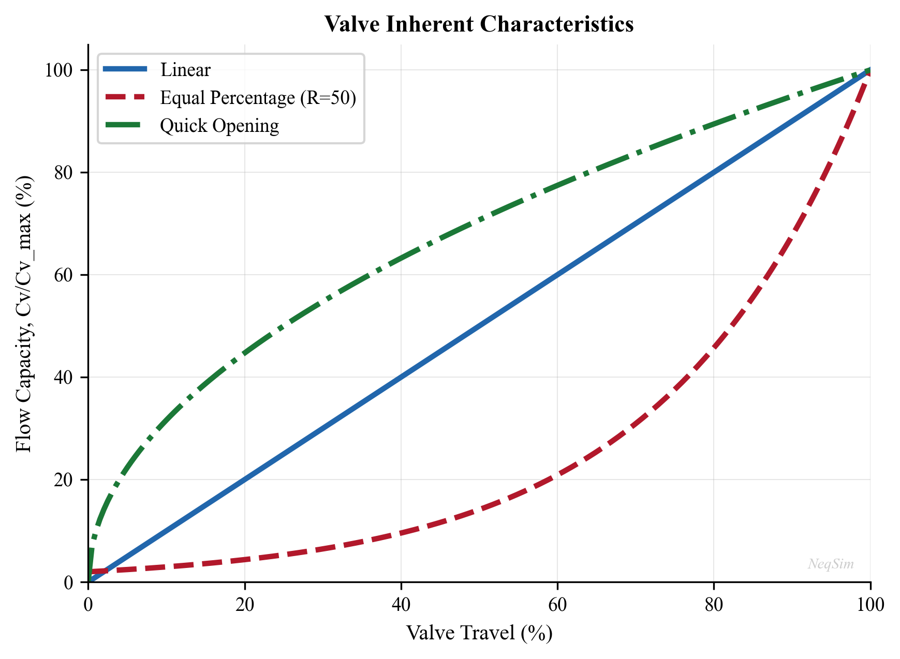

# Valves, Flow Control, and Pressure Relief

**Running the examples.** Start the source-workspace Python session described in Chapter 1, then run this chapter's Python blocks in reading order. Java blocks form a separate sequence using the same NeqSim build; carry forward objects from preceding Java blocks. The release execution records are in `verification/`; a successful run establishes API compatibility, while physical validation also requires the checks discussed in the text.

<!-- Chapter metadata -->
<!-- Notebooks: ch15_valve_sizing.ipynb, ch15_relief_valve_analysis.ipynb -->
<!-- Estimated pages: 20 -->

## Learning Objectives

After reading this chapter, the reader will be able to:

1. Explain control valve fundamentals including the flow coefficient ($C_v$) and valve characteristics (linear, equal percentage, quick opening)
2. Size control valves using the ISA/IEC 60534 methodology for both gas and liquid service
3. Describe choke valve behavior including critical and subcritical flow regimes
4. Calculate Joule-Thomson cooling through valves and predict outlet conditions
5. Size pressure safety valves (PSVs) according to API 520/521 for common relief scenarios
6. Model valves in NeqSim using the `ThrottlingValve` class with $C_v$-based flow calculations
7. Evaluate valve performance within an integrated production system

---

## 17.1 Introduction

Valves are the fundamental control elements of any production facility. While they may appear simple compared to separators or compressors, valves perform critical functions that directly affect production rate, product quality, and safety:

- **Control valves** regulate flow rate, pressure, level, and temperature throughout the process
- **Choke valves** control well production rate and protect downstream equipment from high pressure
- **Pressure safety valves** protect equipment from overpressure, preventing catastrophic failure
- **Isolation valves** allow equipment to be safely shut down for maintenance
- **Check valves** prevent reverse flow that could damage compressors or allow backflow from high-pressure systems

From a production optimization perspective, valves are both enablers and constraints. A well-sized control valve allows precise regulation of operating conditions; a poorly sized valve causes oscillation, excessive pressure drop, and wasted energy. Understanding valve behavior — particularly the relationship between valve opening, flow coefficient, and pressure drop — is essential for system-wide optimization.

This chapter covers the fundamentals of control valve sizing, choke valve behavior, the Joule-Thomson effect, pressure relief system design, and practical modeling with NeqSim.

---

## 17.2 Control Valve Fundamentals

### 17.2.1 The Flow Coefficient

The flow coefficient $C_v$ is the fundamental measure of a valve's flow capacity. It was defined by Masoneilan in the 1940s as:

> $C_v$ is the flow of water at 60 °F, in US gallons per minute, through a fully open valve, with a pressure drop of 1 psi across the valve.

In SI units, the equivalent coefficient $K_v$ is defined as the flow of water at 15 °C, in m³/hr, with a pressure drop of 1 bar:

$$
K_v = \frac{C_v}{1.156}
$$

For an incompressible fluid, the basic flow equation is:

$$
Q = C_v \cdot F_p \sqrt{\frac{\Delta P}{\rho / \rho_w}}
$$

In this Cv form, $Q$ is US gal/min and $\Delta P$ is psi; density ratio is dimensionless. For $Q$ in m³/hr and $\Delta P$ in bar use Kv. $F_p$ is the piping geometry factor. Gas pressures must be absolute.

For compressible (gas) flow, the ISA/IEC 60534 equation takes the form:

$$
W = N_6 \cdot F_p \cdot C_v \cdot Y \sqrt{x \cdot p_1 \cdot \rho_1}
$$

where $W$ is the mass flow rate, $N_6$ is a numerical constant, $Y$ is the expansion factor, $x$ is the pressure drop ratio $\Delta P / p_1$, $p_1$ is the upstream pressure, and $\rho_1$ is the upstream density.

### 17.2.2 Valve Characteristics

The inherent flow characteristic describes how the flow coefficient varies with valve travel (opening). The three standard characteristics are:

**Linear** — flow is directly proportional to valve travel:

$$
\frac{C_v}{C_{v,\max}} = \frac{l}{l_{\max}}
$$

where $l/l_{\max}$ is the fractional valve travel. Linear valves are used where a constant gain is needed, such as level control applications.

**Equal percentage** — equal increments of valve travel produce equal percentage changes in flow:

$$
\frac{C_v}{C_{v,\max}} = R^{(l/l_{\max} - 1)}
$$

where $R$ is the rangeability (typically 30–50). Equal percentage valves are the most common in process control because they provide good control over a wide range of conditions. The installed characteristic tends toward linear when the valve takes a significant fraction of the system pressure drop.

**Quick opening** — a large change in flow occurs near the bottom of the travel range:

$$
\frac{C_v}{C_{v,\max}} = \sqrt{\frac{l}{l_{\max}}}
$$

Quick opening valves are used for on-off service and relief applications where rapid flow establishment is needed.



### 17.2.3 Rangeability and Turndown

**Rangeability** is the ratio of maximum to minimum controllable flow:

$$
R = \frac{C_{v,\max}}{C_{v,\min}}
$$

Typical rangeabilities:

| Valve Type | Rangeability |
|-----------|-------------|
| Globe valve (equal %) | 50:1 |
| Globe valve (linear) | 30:1 |
| Ball valve (V-port) | 200:1 |
| Butterfly valve | 20:1 |

**Turndown** is the ratio of the normal maximum flow to the minimum controllable flow:

$$
\text{Turndown} = \frac{Q_{\max}}{Q_{\min}}
$$

A good control valve should be sized so that the normal operating flow occurs at 60–80% valve opening, with at least 10% travel available for upsets in both directions.

---

## 17.3 Valve Sizing Per ISA/IEC 60534

### 17.3.1 Liquid Sizing

The IEC 60534 sizing procedure for incompressible fluids accounts for cavitation and flashing:

**Step 1**: Calculate the required $C_v$ for non-choked flow:

$$
C_v = \frac{Q}{N_1 F_p} \sqrt{\frac{G_f}{\Delta P}}
$$

where $Q$ is the flow rate, $N_1$ is a numerical constant (depending on units), $F_p$ is the piping factor, $G_f$ is the specific gravity, and $\Delta P$ is the pressure drop.

**Step 2**: Check for choked flow. The allowable pressure drop is limited by:

$$
\Delta P_{\max} = F_L^2 (p_1 - F_F \cdot p_v)
$$

where $F_L$ is the liquid pressure recovery factor, $p_v$ is the vapor pressure, and $F_F$ is the liquid critical pressure ratio factor:

$$
F_F = 0.96 - 0.28 \sqrt{\frac{p_v}{p_c}}
$$

If $\Delta P > \Delta P_{\max}$, the flow is choked and $\Delta P_{\max}$ must be used in the $C_v$ equation.

**Step 3**: Apply the piping correction factor $F_p$ for reducers:

$$
F_p = \frac{1}{\sqrt{1 + \frac{\Sigma K}{N_2} \left(\frac{C_v}{d^2}\right)^2}}
$$

where $\Sigma K$ includes entrance, exit, and fitting losses, $d$ is the valve size, and $N_2$ is a constant.

### 17.3.2 Gas Sizing

For compressible fluids, the IEC 60534 equation uses the expansion factor $Y$:

$$
C_v = \frac{W}{N_8 F_p p_1 Y \sqrt{x M / T_1 Z}}
$$

where $W$ is the mass flow rate, $M$ is the molecular weight, $T_1$ is the upstream temperature (K), $Z$ is the compressibility factor, and $x = \Delta P / p_1$ is the pressure drop ratio.

For $W$ in kg/hr, $p_1$ in bara, $T_1$ in K and $M$ in g/mol, $N_8=94.8$. For the density form above, $N_6=27.3$ with $\rho_1$ in kg/m³. Cap the sizing ratio at $x_{sizing}=\min(x,F_kx_T)$; attached fittings require the adjusted $x_{TP}$.\cite{emerson2023valves}

The expansion factor:

$$
Y = 1 - \frac{x}{3 x_T F_k}
$$

where $x_T$ is the critical pressure drop ratio (from the valve manufacturer) and $F_k = k / 1.4$ is the ratio of specific heat ratios.

**Choked flow** occurs when $x \geq x_T F_k$. At choked conditions, $Y = 2/3$ and the flow rate is independent of downstream pressure:

$$
W_{\text{choked}} = N_8 F_p C_v \frac{2}{3} p_1 \sqrt{\frac{x_T F_k M}{T_1 Z}}
$$

### 17.3.3 Typical Valve Sizing Data

| Valve Body Size (inch) | $C_v$ Range (Globe) | $C_v$ Range (Ball) |
|------------------------|--------------------|--------------------|
| 1 | 0.3–14 | 5–30 |
| 2 | 1–56 | 20–200 |
| 4 | 5–224 | 100–1200 |
| 6 | 10–560 | 250–3500 |
| 8 | 20–1000 | 500–8000 |
| 12 | 50–2240 | 1500–20000 |

### 17.3.4 NeqSim Example: Control Valve Sizing

NeqSim's `ThrottlingValve` class uses $C_v$-based flow calculations per IEC 60534. The following example sizes a gas control valve:

```python
import jpype
jneqsim = jpype.JPackage("neqsim")

# Create the gas fluid
gas = jneqsim.thermo.system.SystemSrkEos(273.15 + 50.0, 80.0)
gas.addComponent("methane", 0.88)
gas.addComponent("ethane", 0.06)
gas.addComponent("propane", 0.03)
gas.addComponent("CO2", 0.02)
gas.addComponent("nitrogen", 0.01)
gas.setMixingRule("classic")

# Create the upstream stream
feed = jneqsim.process.equipment.stream.Stream("Feed Gas", gas)
feed.setFlowRate(100000.0, "kg/hr")
feed.setTemperature(50.0, "C")
feed.setPressure(80.0, "bara")

# Create a throttling valve with specified outlet pressure
valve = jneqsim.process.equipment.valve.ThrottlingValve("PV-100", feed)
valve.setOutletPressure(60.0, "bara")

# Build and run the process
process = jneqsim.process.processmodel.ProcessSystem()
process.add(feed)
process.add(valve)
process.run()

# Read results
T_out = valve.getOutletStream().getTemperature("C")
P_out = valve.getOutletStream().getPressure("bara")
Cv = valve.getCv("US")
Kv = valve.getKv()
deltaP = valve.getDeltaPressure("bara")

print(f"Outlet temperature: {T_out:.1f} °C")
print(f"Outlet pressure: {P_out:.1f} bara")
print(f"Pressure drop: {deltaP:.1f} bar")
print(f"Calculated Cv (US): {Cv:.1f}")
print(f"Calculated Kv (SI): {Kv:.1f}")
```

### 17.3.5 Valve Opening and Flow Control

NeqSim supports partial valve opening, which adjusts the effective $C_v$ according to the valve characteristic:

```python
# Set a specific Cv value and calculate the resulting flow
valve2 = jneqsim.process.equipment.valve.ThrottlingValve("PV-101", feed)
valve2.setCv(150.0, "US")                  # Cv = 150 US gallons
valve2.setPercentValveOpening(70.0)        # 70% open
valve2.setOutletPressure(55.0, "bara")

process2 = jneqsim.process.processmodel.ProcessSystem()
process2.add(feed)
process2.add(valve2)
process2.run()

print(f"Flow at 70% opening: {valve2.getOutletStream().getFlowRate('kg/hr'):.0f} kg/hr")
print(f"Outlet temperature: {valve2.getOutletStream().getTemperature('C'):.1f} °C")
```

---

## 17.4 Valve Types

### 17.4.1 Globe Valves

Globe valves are the most common control valve type in process plants. They offer:

- Excellent throttling capability with precise flow control
- Good shutoff (ANSI Class IV to VI leakage)
- Available in cage-guided, plug, and characterized designs
- Pressure ratings up to ANSI 2500 (420 bar)

Globe valves follow the equal percentage or linear characteristic depending on the plug design. They are used for most flow, pressure, and temperature control applications.

### 17.4.2 Ball Valves

Ball valves use a rotating ball with a V-shaped or full bore opening. Advantages include:

- High capacity ($C_v$) relative to body size
- Good for slurries and fluids with solids
- Quick opening and closing (90° rotation)
- Excellent tight shutoff

In oil and gas, ball valves are used for:
- Wellhead chokes (severe service, erosive flow)
- Emergency shutdown (ESD) valves
- High-pressure gas applications

### 17.4.3 Butterfly Valves

Butterfly valves use a rotating disc. They are:

- Compact and lightweight (important for offshore weight budgets)
- Cost-effective for large pipe sizes (12" and above)
- Limited turndown compared to globe valves
- Used for cooling water, seawater, and large gas flow applications

### 17.4.4 Gate Valves

Gate valves are primarily isolation valves, not control valves. They provide:

- Full bore opening with minimal pressure drop
- Excellent tight shutoff
- Not suitable for throttling (erosion and vibration)

Gate valves are used throughout oil and gas for manual isolation, pigging, and pipeline sectioning.

### 17.4.5 Valve Selection Summary

| Application | Primary Choice | Alternative |
|------------|---------------|-------------|
| Flow control (gas) | Globe (equal %) | Ball (V-port) |
| Flow control (liquid) | Globe (linear) | Ball (V-port) |
| Pressure control | Globe (equal %) | Butterfly |
| Level control | Globe (linear) | Ball |
| On/off (ESD) | Ball | Butterfly |
| Isolation | Gate | Ball |
| Wellhead choke | Ball (severe service) | Cage-type choke |

---

## 17.5 Choke Valves

### 17.5.1 Purpose and Operation

Choke valves (also called wellhead chokes or production chokes) control the flow rate from a well and reduce pressure from wellhead conditions to the downstream process pressure. They are critical for:

- **Production rate control** — adjusting the well's contribution to total field production
- **Reservoir management** — controlling drawdown to prevent coning, sand production, or formation damage
- **Downstream protection** — reducing pressure to levels safe for surface equipment
- **Slug mitigation** — partially closed chokes can dampen flow instability

### 17.5.2 Flow Regimes

Choke flow operates in two regimes:

**Subcritical flow** — the flow rate depends on both upstream and downstream pressure. For an incompressible liquid (or a small gas density change), a screening relation is:

$$
\dot{m} = C_d A \sqrt{2 \rho_1 \Delta P}
$$

where $C_d$ is the discharge coefficient, $A$ is the choke bean area, $\rho_1$ is the upstream density, and $\Delta P$ is the pressure drop.

**Critical flow** — when the pressure ratio $p_2/p_1$ drops below a critical value, the flow velocity at the choke throat reaches the speed of sound. Further reducing downstream pressure does not increase flow rate:

$$
\frac{p_2}{p_1} \leq \left(\frac{2}{k+1}\right)^{k/(k-1)}
$$

where $k$ is the ratio of specific heats. For natural gas ($k \approx 1.3$), the critical pressure ratio is approximately 0.546.

For critical flow, the mass flow rate depends only on upstream conditions:

$$
\dot{m} = C_d A p_1 \sqrt{\frac{k M}{R T_1} \left(\frac{2}{k+1}\right)^{(k+1)/(k-1)}}
$$

### 17.5.3 Multiphase Choke Flow

In most production wells, the flow through the choke is multiphase (gas, oil, and water). Multiphase choke correlations include:

| Correlation | Application |
|------------|-------------|
| Gilbert (1954) | Empirical; oil wells |
| Ros (1960) | Gas-liquid flow |
| Baxendell (1958) | Oil wells with gas |
| Sachdeva et al. (1986) | Mechanistic; all fluids |
| Perkins (1993) | Critical multiphase flow |
| Al-Safran and Kelkar (2009) | Comprehensive; accounts for slip |

### 17.5.4 NeqSim Example: Choke Valve

```python
import jpype
jneqsim = jpype.JPackage("neqsim")

# Wellstream fluid: gas-condensate
wellstream = jneqsim.thermo.system.SystemSrkEos(273.15 + 80.0, 250.0)
wellstream.addComponent("methane", 0.75)
wellstream.addComponent("ethane", 0.08)
wellstream.addComponent("propane", 0.05)
wellstream.addComponent("n-butane", 0.03)
wellstream.addComponent("n-pentane", 0.02)
wellstream.addComponent("n-hexane", 0.02)
wellstream.addComponent("n-heptane", 0.02)
wellstream.addComponent("CO2", 0.02)
wellstream.addComponent("water", 0.01)
wellstream.setMixingRule("classic")

# Well stream at wellhead conditions
well_stream = jneqsim.process.equipment.stream.Stream("Wellhead", wellstream)
well_stream.setFlowRate(50000.0, "kg/hr")
well_stream.setTemperature(80.0, "C")
well_stream.setPressure(250.0, "bara")

# Choke valve reducing pressure to first-stage separator
choke = jneqsim.process.equipment.valve.ThrottlingValve("Production Choke", well_stream)
choke.setOutletPressure(70.0, "bara")

process = jneqsim.process.processmodel.ProcessSystem()
process.add(well_stream)
process.add(choke)
process.run()

# The Joule-Thomson effect causes cooling through the choke
T_in = well_stream.getTemperature("C")
T_out = choke.getOutletStream().getTemperature("C")
JT_cooling = T_in - T_out

print(f"Inlet: {T_in:.1f} °C, {well_stream.getPressure('bara'):.1f} bara")
print(f"Outlet: {T_out:.1f} °C, {choke.getOutletStream().getPressure('bara'):.1f} bara")
print(f"JT cooling: {JT_cooling:.1f} °C")
print(f"Pressure drop: {choke.getDeltaPressure('bara'):.1f} bar")
```

---

## 17.6 The Joule-Thomson Effect

### 17.6.1 Physical Mechanism

The Joule-Thomson (JT) effect is the temperature change of a real gas when it expands through a valve or restriction at constant enthalpy. For an ideal gas, there is no temperature change; for real gases, the behavior depends on the Joule-Thomson coefficient:

$$
\mu_{JT} = \left(\frac{\partial T}{\partial P}\right)_H = \frac{1}{c_p}\left[T\left(\frac{\partial V}{\partial T}\right)_P - V\right]
$$

where the subscript $H$ denotes constant enthalpy.

For most gases at typical process conditions:
- **Positive $\mu_{JT}$** (cooling on expansion) — hydrocarbons, CO₂, N₂ at moderate temperatures
- **Negative $\mu_{JT}$** (heating on expansion) — hydrogen, helium at ambient conditions
- **Zero $\mu_{JT}$** — at the inversion temperature

### 17.6.2 JT Cooling in Production Systems

JT cooling is both a tool and a hazard in production optimization:

**As a tool:**
- JT expansion is used in gas processing for NGL recovery (Joule-Thomson plants)
- Low-temperature separation uses JT cooling to condense heavier hydrocarbons
- Gas dewpoint control via JT expansion

**As a hazard:**
- JT cooling through choke valves can drop the temperature below the hydrate formation temperature
- Gas hydrates can block the choke, flowline, or downstream piping
- Prevention requires: upstream heating, chemical inhibitor injection (MEG, methanol), or insulation

### 17.6.3 JT Coefficient for Hydrocarbons

Typical JT coefficients for natural gas at various conditions:

| Pressure (bara) | Temperature (°C) | $\mu_{JT}$ (°C/bar) |
|-----------------|-------------------|---------------------|
| 50 | 20 | 0.35–0.45 |
| 100 | 20 | 0.25–0.35 |
| 200 | 20 | 0.15–0.25 |
| 50 | 80 | 0.30–0.40 |
| 100 | 80 | 0.20–0.30 |

The JT coefficient decreases with increasing pressure and increases with molecular weight of the gas.

### 17.6.4 NeqSim JT Calculation

NeqSim's `ThrottlingValve` performs an isenthalpic (constant enthalpy) flash to determine the outlet temperature. This is a rigorous calculation that correctly handles phase changes:

```python
import jpype
jneqsim = jpype.JPackage("neqsim")

# Rich gas for JT cooling study
gas = jneqsim.thermo.system.SystemSrkEos(273.15 + 60.0, 120.0)
gas.addComponent("methane", 0.80)
gas.addComponent("ethane", 0.08)
gas.addComponent("propane", 0.05)
gas.addComponent("n-butane", 0.03)
gas.addComponent("n-pentane", 0.02)
gas.addComponent("CO2", 0.02)
gas.setMixingRule("classic")

feed = jneqsim.process.equipment.stream.Stream("Rich Gas", gas)
feed.setFlowRate(30000.0, "kg/hr")
feed.setTemperature(60.0, "C")
feed.setPressure(120.0, "bara")

# Study JT cooling at different outlet pressures
process = jneqsim.process.processmodel.ProcessSystem()
process.add(feed)

pressures = [100.0, 80.0, 60.0, 40.0, 20.0]
print("P_out (bara) | T_out (°C) | ΔT (°C)")
print("-" * 42)

for p_out in pressures:
    valve = jneqsim.process.equipment.valve.ThrottlingValve("JT Valve", feed)
    valve.setOutletPressure(p_out, "bara")

    proc = jneqsim.process.processmodel.ProcessSystem()
    proc.add(feed)
    proc.add(valve)
    proc.run()

    T_out = valve.getOutletStream().getTemperature("C")
    dT = feed.getTemperature("C") - T_out
    print(f"  {p_out:6.0f}      | {T_out:7.1f}    | {dT:5.1f}")
```

This example demonstrates how the JT cooling increases as the pressure drop increases, and NeqSim correctly predicts the non-linear temperature–pressure relationship including any condensation that may occur.

---

## 17.7 Pressure Relief Systems

### 17.7.1 Purpose and Regulatory Requirements

Pressure relief systems are the last line of defense against overpressure. They are required by:

- **ASME Boiler and Pressure Vessel Code** (Section VIII) — requires overpressure protection for all pressure vessels
- **API 520** — sizing, selection, and installation of pressure-relieving devices
- **API 521** — guide for pressure-relieving and depressuring systems
- **NORSOK P-001** — process design (Norwegian Continental Shelf)
- **PED 2014/68/EU** — Pressure Equipment Directive (Europe)

### 17.7.2 Types of Pressure Relief Devices

**Pressure Safety Valves (PSVs)** — spring-loaded valves that open at a set pressure:
- **Conventional PSV** — back-pressure affects the set point; used with atmospheric or low-backpressure discharge
- **Balanced bellows PSV** — back-pressure compensated; used with variable backpressure (flare header)
- **Pilot-operated PSV** — pilot valve controls the main valve; used for very tight shutoff or high backpressure

**Rupture Discs** — thin metal discs that burst at a calibrated pressure:
- Provide full bore opening instantly
- Cannot reclose — require replacement after activation
- Used as a primary device for corrosive fluids or as a backup upstream of a PSV

### 17.7.3 Relief Scenarios

API 521 identifies the following overpressure scenarios that must be evaluated:

| Scenario | Description | Typical Governing Case |
|----------|------------|----------------------|
| Fire case | External fire raises pressure | Large liquid-containing vessels |
| Blocked outlet | Downstream valve closed | Pumps, compressors |
| Thermal expansion | Trapped liquid heated | Isolated pipe sections |
| Loss of cooling | Cooling water or air cooler failure | Condensers, coolers |
| Power failure | All electrically driven equipment stops | Entire process |
| Instrument failure | Control valve fails open/closed | Depends on failure mode |
| Chemical reaction | Runaway exothermic reaction | Reactors |
| Tube rupture | High-pressure fluid enters low-pressure side | Heat exchangers |

### 17.7.4 PSV Sizing — Gas Service

For gas service, the API 520 orifice area is:

$$
A = \frac{W}{C K_d P_1 K_b K_c} \sqrt{\frac{T Z}{M}}
$$

where:
- $A$ = required effective discharge area (mm²)
- $W$ = required relief rate (kg/hr)
- $C$ = coefficient determined from the ratio of specific heats: $C = 0.03948 \sqrt{k \left(\frac{2}{k+1}\right)^{(k+1)/(k-1)}}$
- $K_d$ = effective coefficient of discharge (0.975 for vapor, 0.65 for liquid)
- $P_1$ = absolute relieving pressure in kPa: set gauge pressure plus the permitted overpressure plus atmospheric pressure. The permitted percentage depends on the relief scenario and applicable code; do not universally assume10%.
- $K_b$ = back-pressure correction factor
- $K_c$ = combination correction factor (1.0 for PSV alone, 0.9 for rupture disc + PSV)
- $T$ = relieving temperature (K)
- $Z$ = compressibility factor
- $M$ = molecular weight in kg/kmol (numerically g/mol)

### 17.7.5 PSV Sizing — Liquid Service

For single-phase, nonflashing liquid, the physical SI sizing basis is

$$A=\frac{\dot m}{K_dK_wK_cK_v\sqrt{2\rho(P_1-P_2)}}.$$

Here $A$ is m², $\dot m$ is kg/s, pressure is Pa and density is kg/m³. $K_v$ here denotes the viscosity correction, distinct from a control valve's metric flow coefficient. Apply the applicable code's certified coefficient, backpressure and viscosity corrections, and its exact liquid-sizing procedure. Flashing/two-phase relief requires a suitable two-phase method; the incompressible formula is not valid there.

### 17.7.6 Fire Case Sizing

The fire case is often the governing scenario for PSV sizing on liquid-containing vessels. The relief rate is determined by the heat input from the fire:

$$
Q_{\text{fire}} = C_1 F A_w^{0.82}
$$

where:
- $C_1$ = 43,200 (with adequate drainage) or 70,900 (without) in SI units
- $F$ = environment factor; use1.0 for the bare-vessel teaching case. Any insulation credit requires qualified fire performance and the applicable code calculation; 0.3 is not a universal fireproofing factor.
- $A_w$ = wetted surface area up to the height of 7.6 m (m²)

The relief rate is then:

$$
W = \frac{Q_{\text{fire}}}{\Delta H_{\text{vap}}}
$$

where $\Delta H_{\text{vap}}$ is the latent heat of vaporization at the relieving conditions.

### 17.7.7 Standard PSV Orifice Sizes

API 526 defines standard orifice letter designations:

| Letter | Effective Area (mm²) | Effective Area (in²) |
|--------|---------------------|---------------------|
| D | 71 | 0.110 |
| E | 126 | 0.196 |
| F | 198 | 0.307 |
| G | 324 | 0.503 |
| H | 506 | 0.785 |
| J | 830 | 1.287 |
| K | 1186 | 1.838 |
| L | 1841 | 2.853 |
| M | 2323 | 3.600 |
| N | 2800 | 4.340 |
| P | 4116 | 6.380 |
| Q | 7126 | 11.05 |
| R | 10323 | 16.00 |
| T | 16774 | 26.00 |

---

## 17.8 Flare System Design

### 17.8.1 Purpose

The flare system collects and safely disposes of hydrocarbon vapors released from pressure relief devices, process vents, and emergency depressurization. The major components are:

- **Flare header** — collects relief and blowdown streams; sized for the maximum simultaneous relief case
- **Knockout drum** — separates liquids from the gas stream before the flare tip
- **Flare stack or boom** — elevates the flare tip to ensure safe dispersion of radiant heat and combustion products
- **Pilot and ignition system** — ensures reliable ignition of the flare gas
- **Seal drum** — prevents flashback from the flare tip into the header

### 17.8.2 Flare Header Sizing

Size the flare header by calculating relief-case flow, density, pressure loss and built-up backpressure at each device. The dynamic-pressure quantity $\rho v^2$ has units Pa and may be a project screening limit, but it is neither a universal API521 carbon-steel limit nor equivalent to a Mach limit. Check Mach number, noise, vibration, liquid handling and flare-tip vendor capacity separately.

The flare tip diameter is sized to maintain a Mach number below 0.5 for normal operation and 0.8 for emergency:

$$
d_{\text{tip}} = \sqrt{\frac{4 \dot{m}}{\pi \rho v_{\max}}}
$$

### 17.8.3 Radiation Analysis

The thermal radiation from the flare must be below safe limits at grade level and on the platform:

Select radiation criteria from the applicable standard edition and project philosophy for the actual exposure duration, personnel access/PPE, escape, equipment temperature and materials. A heat-flux number alone is not a safe exposure-time limit; the previous table incorrectly associated6.31 kW/m² with equipment over 8hours.

The radiation from an elevated flare is calculated using the API 521 point source model:

$$
I = \frac{F \cdot Q_{\text{fire}} \cdot \tau}{4 \pi D^2}
$$

where $F$ is the fraction of heat radiated (0.1–0.3), $Q_{\text{fire}}$ is the heat release rate, $\tau$ is the atmospheric transmissivity, and $D$ is the distance from the flame center to the receiver.

---

## 17.9 Actuators and Positioners

### 17.9.1 Actuator Types

**Pneumatic diaphragm** — the most common type; uses instrument air (3–15 psi or 0.2–1.0 bar signal):
- Fail-safe action: fail-open (air-to-close) or fail-closed (air-to-open)
- Fast response
- Limited thrust for high-pressure applications

**Pneumatic piston** — higher thrust than diaphragm actuators:
- Used for large valves or high pressure drops
- Double-acting for applications requiring both opening and closing force

**Electric** — uses an electric motor:
- Precise positioning
- No air supply needed (useful for remote locations)
- Slower response than pneumatic

**Hydraulic** — uses hydraulic fluid pressure:
- Very high thrust
- Used for large subsea valves and high-force applications
- Common in subsea production systems

### 17.9.2 Fail-Safe Action

The fail-safe action of a control valve is critical for safety:

| Application | Fail Action | Reason |
|------------|------------|---------|
| Wellhead choke | Fail closed | Prevent uncontrolled flow |
| Pressure relief valve | Self-actuated opening at its set condition | Not an ordinary fail-open control-valve actuator |
| Fuel gas valve | Fail closed | Prevent gas leak |
| Cooling water valve | Fail open | Maintain cooling |
| Compressor recycle | Fail open | Prevent surge |
| Level control (separator) | Determine from hazard analysis | Balance high-level carryover against gas blowby into lower-pressure equipment |

### 17.9.3 Valve Positioners

A positioner is a high-gain controller that ensures the valve stem position matches the control signal. It compensates for:

- Friction (packing friction, guide friction)
- Unbalanced forces from process pressure
- Spring hysteresis
- Dynamic forces during flow

Modern smart positioners (e.g., Fisher DVC6200, Metso ND9000) also provide:

- Valve diagnostics (signature analysis)
- Partial stroke testing for emergency shutdown valves
- Performance monitoring (dead band, step response)

---

## 17.10 Valve Modeling in NeqSim

### 17.10.1 The ThrottlingValve Class

NeqSim's `ThrottlingValve` class models isenthalpic expansion through a restriction. Key features:

- **Cv/Kv-based flow** — sets the flow coefficient and calculates pressure drop or flow rate
- **Isenthalpic flash** — performs a PH flash to determine outlet temperature including phase change
- **Valve opening** — supports partial valve opening with characterization
- **Isothermal mode** — option for cases where JT effect is negligible

### 17.10.2 Operating Modes

The `ThrottlingValve` can be used in several modes:

**Mode 1: Specified outlet pressure** — outlet pressure is set; NeqSim calculates $C_v$ and outlet temperature:

```python
valve = jneqsim.process.equipment.valve.ThrottlingValve("V-1", feed)
valve.setOutletPressure(40.0, "bara")
```

**Mode 2: Specified $C_v$ and valve opening at imposed feed flow** — enable outlet-pressure calculation explicitly. The model solves the pressure needed for that flow; it cannot independently determine both flow and outlet pressure without another boundary condition:

```python
valve = jneqsim.process.equipment.valve.ThrottlingValve("V-2", feed)
valve.setCv(200.0, "US")
valve.setPercentValveOpening(75.0)
valve.setIsCalcOutPressure(True)
```

**Mode 3: Specified pressure drop** — the pressure differential is set:

```python
valve = jneqsim.process.equipment.valve.ThrottlingValve("V-3", feed)
valve.setDeltaPressure(20.0, "bara")
```

### 17.10.3 Complete Production System Example

The following example models a production system with a wellhead choke, separator, and export control valve:

```python
import jpype
jneqsim = jpype.JPackage("neqsim")

# Gas-condensate wellstream
fluid = jneqsim.thermo.system.SystemSrkEos(273.15 + 90.0, 300.0)
fluid.addComponent("nitrogen", 0.005)
fluid.addComponent("CO2", 0.015)
fluid.addComponent("methane", 0.78)
fluid.addComponent("ethane", 0.07)
fluid.addComponent("propane", 0.04)
fluid.addComponent("n-butane", 0.025)
fluid.addComponent("n-pentane", 0.015)
fluid.addComponent("n-hexane", 0.015)
fluid.addComponent("n-heptane", 0.02)
fluid.addComponent("n-octane", 0.015)
fluid.setMixingRule("classic")

# Wellhead stream
wellhead = jneqsim.process.equipment.stream.Stream("Wellhead", fluid)
wellhead.setFlowRate(80000.0, "kg/hr")
wellhead.setTemperature(90.0, "C")
wellhead.setPressure(300.0, "bara")

# Production choke: 300 -> 70 bara
choke = jneqsim.process.equipment.valve.ThrottlingValve("Production Choke", wellhead)
choke.setOutletPressure(70.0, "bara")

# First-stage separator
separator = jneqsim.process.equipment.separator.Separator("HP Separator")
separator.setInletStream(choke.getOutletStream())

# Gas export valve
export_valve = jneqsim.process.equipment.valve.ThrottlingValve("Export Valve")
export_valve.setInletStream(separator.getGasOutStream())
export_valve.setOutletPressure(65.0, "bara")

# Build the process
process = jneqsim.process.processmodel.ProcessSystem()
process.add(wellhead)
process.add(choke)
process.add(separator)
process.add(export_valve)
process.run()

# Report results
print("=== Production System Results ===")
print(f"\nWellhead:  {wellhead.getTemperature('C'):.1f} °C, "
      f"{wellhead.getPressure('bara'):.0f} bara")
print(f"\nAfter choke: {choke.getOutletStream().getTemperature('C'):.1f} °C, "
      f"{choke.getOutletStream().getPressure('bara'):.0f} bara")
print(f"JT cooling: {wellhead.getTemperature('C') - choke.getOutletStream().getTemperature('C'):.1f} °C")
print(f"\nSeparator gas:    {separator.getGasOutStream().getFlowRate('kg/hr'):.0f} kg/hr")
print(f"Separator liquid: {separator.getLiquidOutStream().getFlowRate('kg/hr'):.0f} kg/hr")
print(f"\nExport gas: {export_valve.getOutletStream().getTemperature('C'):.1f} °C, "
      f"{export_valve.getOutletStream().getPressure('bara'):.0f} bara")
```

---

## 17.11 Valve Performance and Optimization

### 17.11.1 Valve Authority

Valve authority is the ratio of the valve pressure drop to the total system pressure drop at the design flow:

$$
N = \frac{\Delta P_{\text{valve}}}{\Delta P_{\text{system}}}
$$

For good control, valve authority should be:

| Application | Recommended Authority |
|------------|---------------------|
| Flow control | 0.3–0.5 |
| Pressure control | 0.5–0.7 |
| Level control | 0.3–0.5 |

Low valve authority (< 0.2) means the valve has little influence on the flow, leading to poor control. High valve authority (> 0.7) means excessive energy is wasted across the valve.

### 17.11.2 Installed Characteristics

The installed characteristic differs from the inherent characteristic because the system pressure drop varies with flow. An equal percentage valve in a system with low authority behaves more like a linear valve. The installed gain is:

$$
G_{\text{installed}} = G_{\text{inherent}} \cdot \frac{N}{[N+(1-N)(C_v/C_{v,\max})^2]^{3/2}}
$$

For a fixed available pressure difference, noncavitating incompressible flow and quadratic nonvalve system resistance, let $c=C_v/C_{v,max}$. Then $Q/Q_{max}=c/[N+(1-N)c^2]^{1/2}$; differentiation gives the displayed gain. Here $N$ is authority at full opening and $G_{inherent}=dc/dl$. Other pump/system curves require their own derivation.

### 17.11.3 Cavitation and Noise

Excessive pressure drop across a valve can cause:

**Cavitation** (liquids) — when the local pressure drops below the vapor pressure, bubbles form and then collapse violently as pressure recovers. This causes:
- Erosion of valve trim and body
- Vibration and noise
- Reduced flow capacity

The incipient cavitation index is:

$$
\sigma_i = \frac{p_1 - p_v}{p_1 - p_2}
$$

where $p_v$ is the vapor pressure. Cavitation is avoided when $\sigma_i > \sigma_c$ (the manufacturer's cavitation coefficient).

**Aerodynamic noise** (gases) — high-velocity gas jets generate noise. The IEC 60534-8 standard provides methods for predicting valve noise levels. The acceptable limit is typically 85 dBA at 1 m from the pipe.

### 17.11.4 Acoustic-Induced Vibration (AIV)

When gas flows through a valve at high velocity, it generates acoustic energy that can cause fatigue failure of downstream piping. The sound power level is estimated from:

$$
\text{PWL} = 10 \log_{10}\left(\frac{W \cdot \eta_{\text{acoustic}}}{W_{\text{ref}}}\right)
$$

The Energy Institute Guidelines for the avoidance of vibration induced fatigue failure in process pipework recommend maintaining the sound power level below the pipe fatigue limit.

---

## 17.12 Pressure Drop Through Valves

### 17.12.1 Permanent Pressure Loss

The permanent pressure loss through a valve affects the overall system pressure balance. Different valve types have different pressure loss characteristics at full opening:

| Valve Type | $K_v / K_{v,\text{globe}}$ | Relative Pressure Drop |
|-----------|---------------------------|----------------------|
| Globe valve | 1.0 (reference) | High |
| Ball valve (full bore) | 3–5 | Very low |
| Ball valve (reduced bore) | 1.5–2.5 | Low to moderate |
| Butterfly valve | 2–4 | Low |
| Gate valve (full bore) | 5–10 | Very low |

### 17.12.2 System Pressure Balance

In a production system, every valve, fitting, and pipe segment consumes pressure. The total available pressure is:

$$
P_{\text{reservoir}} = P_{\text{separator}} + \Delta P_{\text{inflow}} + \Delta P_{\text{tubing}} + \Delta P_{\text{choke}} + \Delta P_{\text{flowline}} + \Delta P_{\text{riser}} + \Delta P_{\text{equipment}}
$$

From an optimization perspective, minimizing unnecessary pressure drop through valves that are throttling excessively (chokes barely open, control valves nearly closed) can increase production rate. This is a key element of back-pressure optimization.

---

## 17.13 Valve Capacity Constraints in Production Optimization

In production optimization, valves are not merely passive flow elements — they are active constraints that limit the operating envelope of the entire production system. When a valve reaches its maximum flow capacity (fully open), it becomes a bottleneck that restricts production regardless of what other equipment can handle. NeqSim models valves with explicit capacity constraints that integrate directly into the optimization framework.

### 17.13.1 Valve Opening and Cv Utilization Constraints

Every control valve has a maximum design $C_v$ determined by its body size and trim. The **valve opening** (expressed as a percentage of full travel) and **$C_v$ utilization** (actual $C_v$ relative to design $C_v$) are the two key constraint variables:

$$
\text{Cv utilization} = \frac{C_{v,\text{actual}}}{C_{v,\text{design}}} \times 100\%
$$

The operating guidelines for valve opening are:

| Opening Range | Status | Action |
|---------------|--------|--------|
| 10–30% | Underutilized | Valve oversized; consider trim change |
| 30–70% | Normal | Good control range; preferred operating zone |
| 70–85% | Approaching limit | Monitor; available margin decreasing |
| 85–95% | Near capacity | Valve becoming a bottleneck |
| > 95% | Fully open | **Active constraint** — valve limits production |

In NeqSim, these constraints are modeled as part of the capacity checking framework. When the optimizer encounters a valve at > 90% opening, it identifies the valve as a potential bottleneck and evaluates whether a larger valve body or different trim would unlock additional production.

### 17.13.2 Automatic Valve Sizing with Constraints

NeqSim provides an `autoSize` method that calculates the required design $C_v$ from current operating conditions and applies a design margin:

```java
import org.apache.logging.log4j.LogManager;
import org.apache.logging.log4j.Logger;
Logger logger = LogManager.getLogger("BookChapter17");
import neqsim.thermo.system.SystemSrkEos;
import neqsim.process.equipment.stream.Stream;
import neqsim.process.processmodel.ProcessSystem;
import neqsim.process.equipment.capacity.CapacityConstraint;
import neqsim.process.util.optimizer.ProductionOptimizer;
import java.util.*;
SystemSrkEos fluid = new SystemSrkEos(313.15, 80.0);
fluid.addComponent("methane", 0.80);
fluid.addComponent("ethane", 0.10);
fluid.addComponent("n-heptane", 0.08);
fluid.addComponent("water", 0.02);
fluid.setMixingRule("classic");
fluid.setMultiPhaseCheck(true);
Stream feed = new Stream("Feed", fluid);
feed.setFlowRate(20000.0, "kg/hr");
ProcessSystem process = new ProcessSystem();
process.add(feed);
process.run();
import neqsim.process.equipment.valve.ThrottlingValve;
// Java: Auto-size valve with 20% design margin
ThrottlingValve valve = new ThrottlingValve("PV-100", feed);
valve.setOutletPressure(60.0, "bara");
process.add(valve);
process.run();

// autoSize calculates: designCv = operatingCv × (1 + margin)
valve.autoSize(1.20);  // 20% design margin

// The valve now has constraints attached
double designCv = valve.getMechanicalDesign().getMaxDesignCv();
double designFlow = valve.getMechanicalDesign().getMaxDesignVolumeFlow();
```

After auto-sizing, the valve carries constraint metadata that the optimizer can query:

- `getDesignCv()` — the maximum $C_v$ at full opening
- `getDesignVolumeFlow()` — the maximum volumetric flow capacity
- `getCvUtilization()` — current $C_v$ as a fraction of design $C_v$
- `getPercentValveOpening()` — current valve travel percentage

The `setDesignCv()` and `setDesignVolumeFlow()` methods allow manual specification of valve capacity when auto-sizing is not appropriate (e.g., when the design $C_v$ is known from the valve datasheet):

```java
// Set known design capacity from valve datasheet
valve.getMechanicalDesign().setMaxDesignCv(350.0);
valve.getMechanicalDesign().setMaxDesignVolumeFlow(2500.0);
```

### 17.13.3 Valve as Bottleneck: The "Fully Open" Scenario

A common production optimization scenario is the **valve fully open** constraint, where a control valve reaches its maximum opening (typically flagged at 90% or above) and can no longer increase flow. This occurs when:

- Production rate has increased beyond the original design
- Upstream pressure has decreased (reservoir depletion) while downstream pressure is fixed
- A well test or debottlenecking exercise pushes the system to its limits

When a valve reaches approximately 90% opening, the optimizer must choose between:

1. **Accept the constraint** — the valve limits production; optimize other variables within this bound
2. **Re-trim the valve** — install a larger trim to increase the maximum $C_v$ within the existing body
3. **Replace the valve** — install a larger body valve with higher $C_v$ capacity
4. **Reduce downstream pressure** — lower separator pressure to reduce the required $C_v$

```python
import jpype
jneqsim = jpype.JPackage("neqsim")

# Model a production system where the choke becomes a bottleneck
fluid = jneqsim.thermo.system.SystemSrkEos(273.15 + 80.0, 200.0)
fluid.addComponent("methane", 0.80)
fluid.addComponent("ethane", 0.08)
fluid.addComponent("propane", 0.05)
fluid.addComponent("n-butane", 0.03)
fluid.addComponent("n-pentane", 0.02)
fluid.addComponent("CO2", 0.02)
fluid.setMixingRule("classic")

Stream = jneqsim.process.equipment.stream.Stream
ThrottlingValve = jneqsim.process.equipment.valve.ThrottlingValve
ProcessSystem = jneqsim.process.processmodel.ProcessSystem

feed = Stream("Wellhead", fluid)
feed.setFlowRate(80000.0, "kg/hr")
feed.setTemperature(80.0, "C")
feed.setPressure(200.0, "bara")

# Production choke with known design Cv
choke = ThrottlingValve("Production Choke", feed)
choke.setOutletPressure(70.0, "bara")
choke.setCv(200.0, "US")  # Design Cv from valve datasheet

process = ProcessSystem()
process.add(feed)
process.add(choke)
process.run()

# Check valve utilization
opening = choke.getPercentValveOpening()
print(f"Valve opening: {opening:.1f}%")
print(f"Flow rate: {choke.getOutletStream().getFlowRate('kg/hr'):.0f} kg/hr")

# Sweep flow rates to find the bottleneck
print(f"\n{'Flow (kg/hr)':>14} {'Opening (%)':>14} {'Status':>20}")
print("-" * 50)
for flow in [40000, 60000, 80000, 100000, 120000, 140000]:
    feed.setFlowRate(float(flow), "kg/hr")
    process.run()
    pct = choke.getPercentValveOpening()
    status = "Normal" if pct < 70 else ("Approaching" if pct < 85 else
             ("Near limit" if pct < 95 else "BOTTLENECK"))
    print(f"{flow:>14,} {pct:>14.1f} {status:>20}")
```

### 17.13.4 Choke Valve Models in Well Networks

In well network optimization, the choke valve plays a central role in allocating production between wells. The IEC 60534-based flow equation used in NeqSim relates the mass flow through a choke to its flow coefficient, opening, and pressure drop:

$$
Q\,[\mathrm{m^3/hr}]=K_v\theta\sqrt{\frac{\Delta P\,[\mathrm{bar}]}{\rho/\rho_{w,ref}}}
$$

where $Q$ is the volumetric flow rate, $K_v$ is the flow coefficient at full opening, $\theta$ is the fractional valve opening (0–1), $\Delta P$ is the pressure drop across the choke, and $\rho$ is the fluid density at upstream conditions.

For gas and multiphase flow, the equation is extended with the expansion factor $Y$ and compressibility corrections as described in Section 17.3.2. The choke model in the well network handles three flow regimes:

**Subcritical flow** — both upstream and downstream pressure influence the flow rate. The choke can control flow by adjusting opening.

**Critical flow** — the flow velocity at the choke throat reaches sonic velocity. Further reduction of downstream pressure does not increase flow:

$$
\dot{m}_{\text{critical}} = K_v \cdot \theta \cdot f(P_1, T_1, k, Z, M)
$$

The critical flow condition is detected automatically by NeqSim when the pressure ratio $P_2/P_1$ falls below the critical pressure ratio. This is important for production optimization because a choke in critical flow acts as a natural decoupler — changes in separator pressure do not affect the well production rate.

**Transition region** — the flow transitions smoothly between subcritical and critical regimes. NeqSim uses a continuous function to avoid discontinuities that would cause numerical difficulties in optimization.

### 17.13.5 Critical Flow Detection

NeqSim detects critical (choked) flow automatically during valve calculations. When the pressure ratio $P_2/P_1$ drops below the critical value, capacity is controlled by the throat condition. The downstream bulk stream remains at its specified or solved downstream pressure, and its equilibrium temperature is calculated there; do not replace that bulk state with the throat state. This has important implications for production optimization:

- Wells with critical flow through the choke are **insensitive to separator pressure changes** — adjusting separator pressure affects only subcritical wells
- Critical flow provides a natural **flow limit** that cannot be exceeded without increasing upstream pressure or choke size
- The transition between subcritical and critical flow creates a **non-smooth point** in the optimization landscape that requires special handling

```python
# Demonstrate critical flow detection
print(f"{'P_out (bara)':>14} {'Flow (kg/hr)':>14} {'Critical?':>12}")
print("-" * 42)
for p_out in [150, 120, 100, 80, 60, 40, 20]:
    feed.setFlowRate(80000.0, "kg/hr")
    feed.setPressure(200.0, "bara")
    choke.setOutletPressure(float(p_out), "bara")
    process.run()
    flow = choke.getOutletStream().getFlowRate("kg/hr")
    # Critical flow: further reducing P_out doesn't increase flow
    print(f"{p_out:>14} {flow:>14,.0f} {'Yes' if p_out < 110 else 'No':>12}")
```

### 17.13.6 Comprehensive Example: Valve Sizing with Constraints and Optimization

The following example demonstrates a complete valve sizing and optimization workflow, including constraint identification and bottleneck analysis:

```python
import jpype
jneqsim = jpype.JPackage("neqsim")
import json

# --- Build a production system with multiple valves ---
fluid = jneqsim.thermo.system.SystemSrkEos(273.15 + 70.0, 150.0)
fluid.addComponent("methane", 0.78)
fluid.addComponent("ethane", 0.08)
fluid.addComponent("propane", 0.05)
fluid.addComponent("n-butane", 0.03)
fluid.addComponent("n-pentane", 0.02)
fluid.addComponent("n-heptane", 0.02)
fluid.addComponent("CO2", 0.02)
fluid.setMixingRule("classic")

Stream = jneqsim.process.equipment.stream.Stream
ThrottlingValve = jneqsim.process.equipment.valve.ThrottlingValve
Separator = jneqsim.process.equipment.separator.Separator
ProcessSystem = jneqsim.process.processmodel.ProcessSystem

# Well stream
well = Stream("Well-1", fluid)
well.setFlowRate(60000.0, "kg/hr")
well.setTemperature(70.0, "C")
well.setPressure(150.0, "bara")

# Production choke (manually sized)
choke = ThrottlingValve("Production Choke", well)
choke.setOutletPressure(70.0, "bara")
choke.setCv(250.0, "US")

# HP separator
sep = Separator("HP Separator", choke.getOutletStream())

# Gas export valve (auto-sized)
gas_valve = ThrottlingValve("Gas Export Valve", sep.getGasOutStream())
gas_valve.setOutletPressure(65.0, "bara")

# Liquid control valve
liq_valve = ThrottlingValve("Liquid Valve", sep.getLiquidOutStream())
liq_valve.setOutletPressure(15.0, "bara")

process = ProcessSystem()
process.add(well)
process.add(choke)
process.add(sep)
process.add(gas_valve)
process.add(liq_valve)
process.run()

# Auto-size the gas valve with 25% margin
gas_valve.autoSize(1.25)

# Report valve status across the system
valves = [("Production Choke", choke),
          ("Gas Export Valve", gas_valve),
          ("Liquid Valve", liq_valve)]

print("=== Valve Capacity Report ===")
print(f"{'Valve':>22} {'Cv (US)':>10} {'Opening%':>10} {'Status':>14}")
print("-" * 58)
for name, v in valves:
    try:
        opening = v.getPercentValveOpening()
        cv = v.getCv("US")
        status = ("OK" if opening < 70 else
                  "WATCH" if opening < 90 else "BOTTLENECK")
        print(f"{name:>22} {cv:>10.1f} {opening:>10.1f} {status:>14}")
    except Exception:
        print(f"{name:>22} {'N/A':>10} {'N/A':>10} {'N/A':>14}")

# Optimization: find max flow before any valve hits 90%
print("\n=== Bottleneck Analysis: Increasing Production ===")
for flow in range(40000, 160001, 20000):
    well.setFlowRate(float(flow), "kg/hr")
    process.run()
    bottleneck = "None"
    for name, v in valves:
        try:
            if v.getPercentValveOpening() > 90.0:
                bottleneck = name
                break
        except Exception:
            pass
    print(f"Flow: {flow:>8,} kg/hr -> Bottleneck: {bottleneck}")
```

This example illustrates the complete workflow: build the system, auto-size valves with design margins, check utilization at current conditions, and sweep production rates to identify the first valve that becomes a bottleneck. The results directly inform debottlenecking decisions — which valve to upsize first for maximum production gain.

---


<!-- reviewed-notebook-results:start -->
## Reproduced Calculation Results

These examples use the stated fluid recipes and operating assumptions. Curves represent NeqSim calculations unless a caption identifies an analytical illustration, assumed equipment map or synthetic data.


Cv spans 5.657–45.26 US units across the plotted cases. JT Cooling remains 23.04 °C across the plotted cases.

At fixed upstream and downstream states, increasing flow requires a larger valve capacity; the isenthalpic temperature change can remain almost independent of flow. Reusing an already sized valve can conceal the required-Cv trend, while constant JT cooling is physically plausible for identical inlet states and pressure drop. Size a fresh valve or clear its sizing state for each trial, then select hardware with rangeability and controllability across the full flow envelope.


Temperature Drop ΔT spans 2.455–51.07 °C across the plotted cases.

A larger isenthalpic pressure reduction usually produces more cooling for the illustrated natural-gas state, with nonlinearity from changing fluid properties. The coldest valve outlet can determine hydrate, low-temperature material and downstream separation requirements. Calculate the full PH-flash path and check cold-start and low-flow inlet conditions rather than relying on a constant JT coefficient.


Isenthalpic expansion: pressure spans 40–145 bara across the plotted cases.

The pressure–temperature path follows constant stream enthalpy through an adiabatic valve rather than an isothermal or isentropic expansion. Crossing saturation or hydrate boundaries can change the downstream phase load and operating risk even when pressure control is achieved. Overlay the relevant phase and hydrate boundaries for the actual composition and evaluate the required temperature and pressure margins.


Effective Cv spans 40–200 US across the plotted cases. Outlet Pressure spans 115–149.4 bara across the plotted cases.

The trim characteristic maps valve travel to effective Cv; at imposed flow this changes the pressure drop required to pass the stream. Valve opening is not a direct percentage of process flow, and very small openings can lie outside the feasible or controllable operating range. Check the chosen characteristic and fixed hardware Cv against both minimum controllable flow and maximum required capacity.

Selected numerical ranges from the plotted cases:

| Quantity / series | Minimum | Maximum | Unit |
|---|---:|---:|---|
| Cv | 5.657 | 45.26 | US units |
| Temperature Drop ΔT | 2.455 | 51.07 | °C |
| Isenthalpic expansion: pressure | 40 | 145 | bara |
| Effective Cv | 40 | 200 | US |

Ranges describe the sampled cases; they are not independent validation tolerances.
<!-- reviewed-notebook-results:end -->

## Summary

This chapter covered the theory and practice of valves, flow control, and pressure relief in oil and gas production:

- **Flow coefficient** — $C_v$ (US) and $K_v$ (SI) quantify a valve's flow capacity; the ISA/IEC 60534 standard provides rigorous sizing equations for both gas and liquid service
- **Valve characteristics** — linear, equal percentage, and quick opening curves describe how flow varies with valve travel; the installed characteristic depends on valve authority
- **Valve types** — globe valves dominate control applications; ball valves serve severe service and on/off duty; butterfly and gate valves handle large flows and isolation
- **Choke valves** — operate in subcritical or critical flow regimes; critical flow acts as a natural flow limiter where downstream pressure changes do not affect flow rate
- **Joule-Thomson effect** — isenthalpic expansion through valves causes cooling in real gases; this is both a processing tool (low-temperature separation) and a hazard (hydrate formation)
- **Pressure relief** — API 520/521 governs PSV sizing for gas, liquid, and fire cases; the fire case often governs for liquid-containing vessels
- **Flare systems** — collect and safely dispose of relief discharges; sized based on the maximum simultaneous relief case
- **NeqSim modeling** — the `ThrottlingValve` class supports $C_v$-based flow, isenthalpic flash, partial valve opening, and integration into complete production system models

---


<!-- foundations-scientific-verification -->

### Verification of the worked examples

The valve calculations are checked for mass/component conservation, isenthalpic throttling and nonnegative pressure drop. Flow-coefficient constants are tied to the specified flow, pressure, temperature and molecular-weight units; operating mode is set explicitly before using coefficient/opening to predict pressure. Relief-area arithmetic does not replace a complete relief-scenario, discharge-system or code assessment.\cite{emerson2023valves}

The calculation and literal-code records are in `verification/scientific_revision/ch17_manuscript_physics.json`; the chapter scope and code hashes are indexed in `foundations_review.json`.

<!-- /foundations-scientific-verification -->

## Exercises

**Exercise 17.1 — Control Valve Sizing**
A gas control valve must pass 50,000 kg/hr of natural gas (MW = 18.5, $k = 1.30$, $Z = 0.88$) from 75 bara to 65 bara at 45 °C. (a) Calculate the required $C_v$ using the IEC 60534 gas sizing equation. (b) Verify using a NeqSim `ThrottlingValve` model. (c) Select a standard valve body size from the table in Section 17.3.3.

**Exercise 17.2 — JT Cooling Study**
A lean gas stream (95% methane, 3% ethane, 2% propane) at 40 °C flows through a choke valve from 200 bara to various downstream pressures: 150, 100, 80, 60, 40, and 20 bara. Using NeqSim, calculate the outlet temperature for each case and plot the JT cooling curve ($\Delta T$ vs. $\Delta P$). At what downstream pressure does condensation first occur?

**Exercise 17.3 — Production Choke Optimization**
A gas-condensate well produces at a wellhead pressure of 280 bara and 85 °C. The first-stage separator operates at 70 bara. (a) Model the choke valve and separator in NeqSim. (b) Vary the separator pressure from 40 to 120 bara in steps of 10 bara and record the liquid recovery (condensate fraction). (c) Determine the separator pressure that maximizes condensate recovery. (d) What is the choke outlet temperature at the optimum pressure?

**Exercise 17.4 — PSV Sizing**
A horizontal separator (4 m diameter, 12 m length) contains gas-condensate at 70 bara and 40 °C. The design pressure is 85 barg. Size a PSV for the fire case using API 520/521. Assume: wetted area = 80 m², environment factor $F = 1.0$ (no fireproofing), latent heat of vaporization = 300 kJ/kg, gas properties $k = 1.25$, $M = 22$, $Z = 0.85$. Select a standard orifice size from the API 526 table.

**Exercise 17.5 — Valve Characteristic Comparison**
Using NeqSim, model a gas control valve with $C_v = 250$ (US) at valve openings of 10%, 20%, 30%, ..., 100%. For each opening, record the flow rate through the valve with upstream pressure of 80 bara and downstream pressure of 60 bara. Plot the flow rate vs. valve opening and compare the shape with the inherent equal percentage characteristic.

**Exercise 17.6 — Integrated System Pressure Balance**
Model a complete production system in NeqSim with: wellhead (250 bara, 95 °C), production choke (to 80 bara), inlet cooler (to 50 °C), HP separator (80 bara), gas export valve (to 75 bara), LP separator (10 bara via liquid control valve), gas compressor, and export. Perform a pressure balance showing the pressure at each point. Identify which valve has the largest pressure drop and discuss opportunities for optimization.

---

## References

1. ISA-75.01.01 / IEC 60534-2-1 (2011). *Flow Equations for Sizing Control Valves*.
2. Fisher Controls International (2005). *Control Valve Handbook*, 4th Edition. Emerson Process Management.
3. API 520 (2014). *Sizing, Selection, and Installation of Pressure-Relieving Devices*, Part I: Sizing and Selection, 9th Edition.
4. API 521 (2014). *Pressure-Relieving and Depressuring Systems*, 6th Edition.
5. API 526 (2017). *Flanged Steel Pressure-Relief Valves*, 7th Edition.
6. Borden, G., and Friedmann, P. G. (1998). *Control Valves — Practical Guides for Measurement and Control*. ISA.
7. Baumann, H. D. (2011). *Control Valve Primer: A User's Guide*, 4th Edition. ISA.
8. IEC 60534-8-3 (2010). *Industrial-Process Control Valves — Part 8-3: Noise Considerations*.
9. Sachdeva, R., Schmidt, Z., Brill, J. P., and Blais, R. M. (1986). "Two-Phase Flow Through Chokes." *SPE 15657*.
10. Smith, P., and Zappe, R. W. (2004). *Valve Selection Handbook*, 5th Edition. Gulf Professional Publishing.
11. Energy Institute (2008). *Guidelines for the Avoidance of Vibration Induced Fatigue Failure in Process Pipework*, 2nd Edition.
12. GPSA Engineering Data Book (2016). 14th Edition, Gas Processors Suppliers Association.


