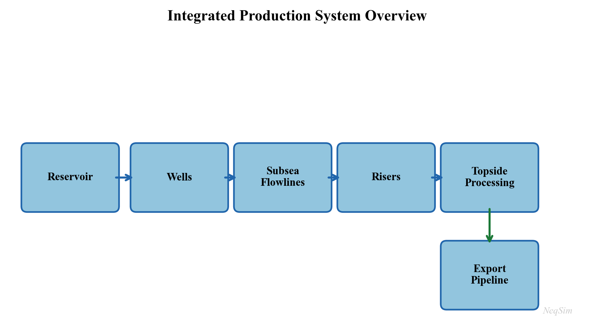
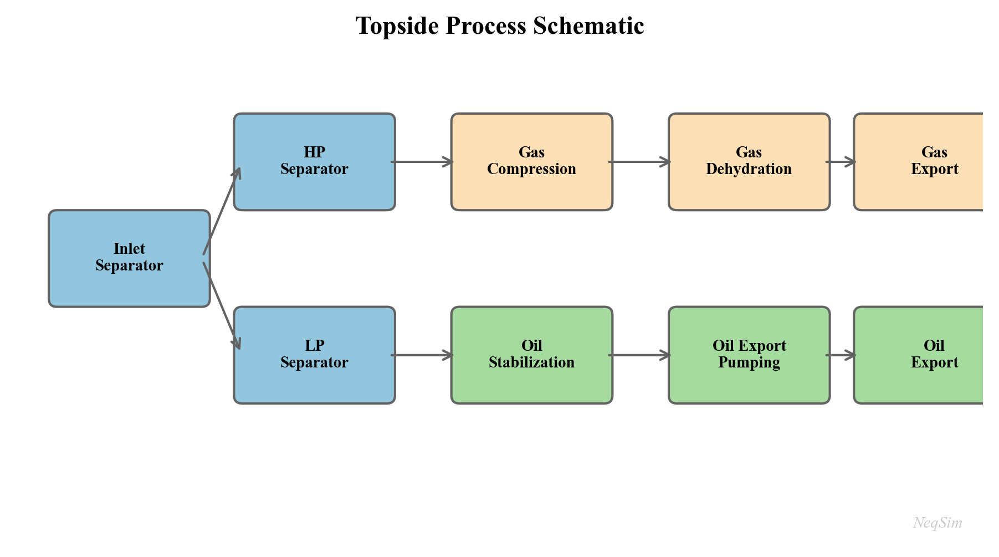
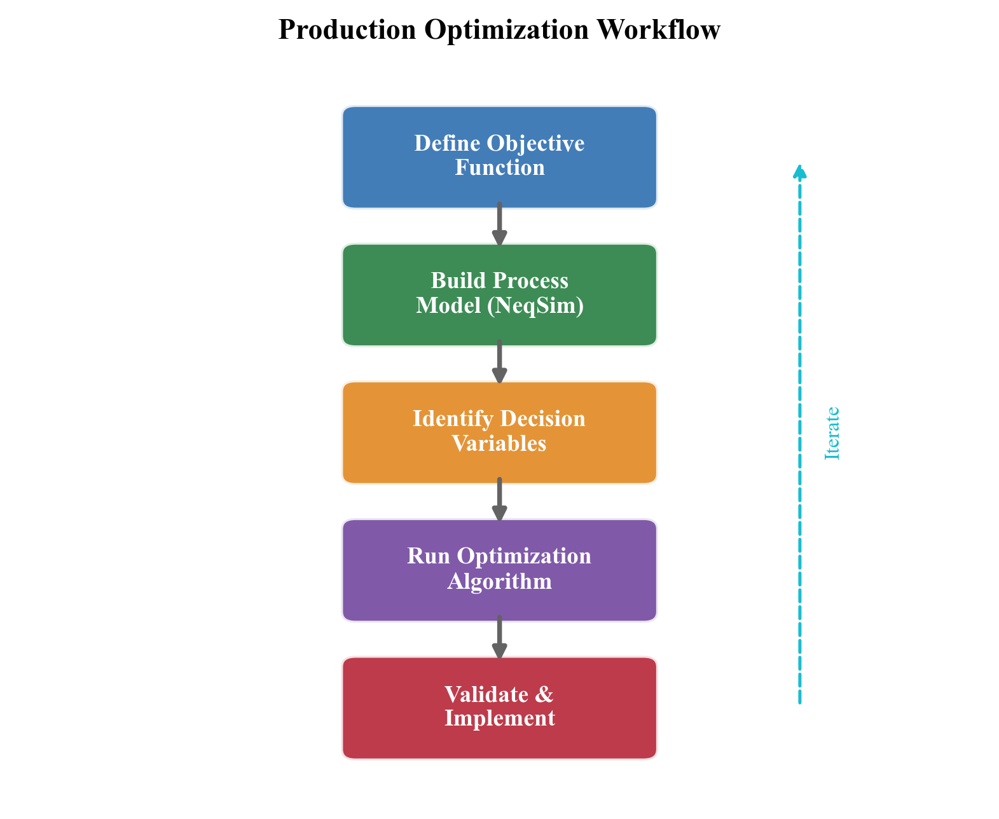
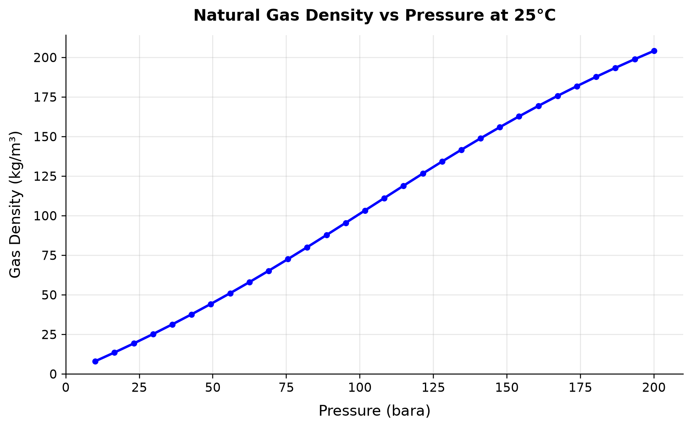
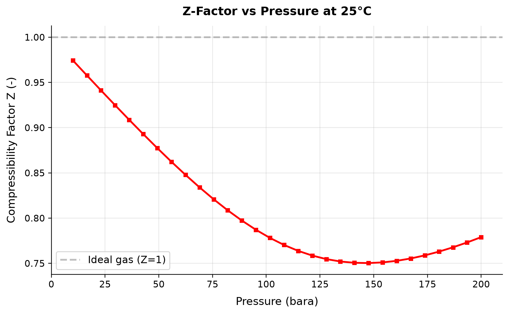
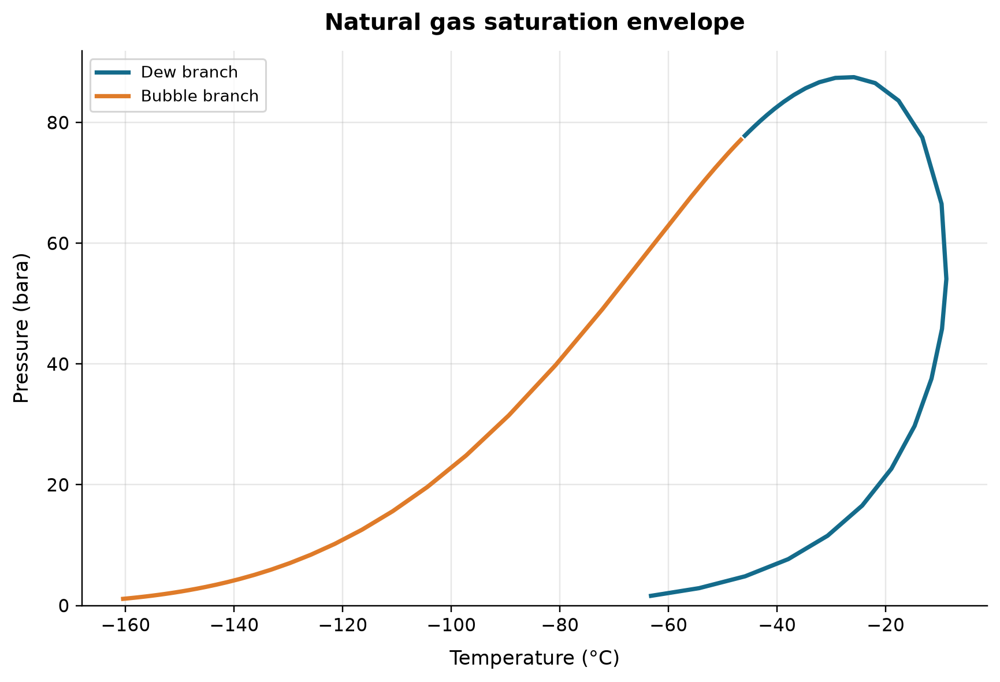
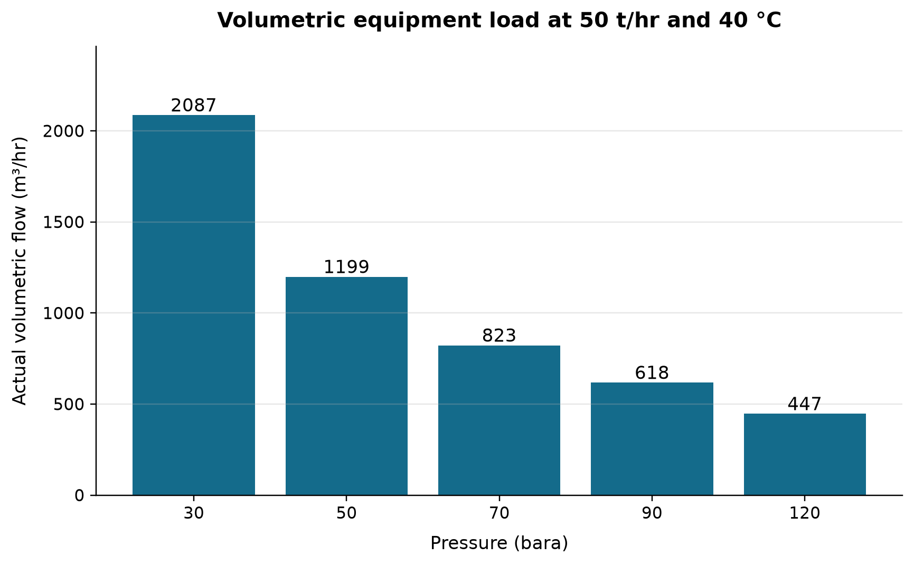

# Introduction to Production Optimization

**Running the examples.** Start the source-workspace Python session described in Chapter 1, then run this chapter's Python blocks in reading order. Java blocks form a separate sequence using the same NeqSim build; carry forward objects from preceding Java blocks. The release execution records are in `verification/`; a successful run establishes API compatibility, while physical validation also requires the checks discussed in the text.

<!-- Chapter metadata -->
<!-- Notebooks: ch01_production_system_overview.ipynb -->
<!-- Estimated pages: 35–40 -->


### Current NeqSim workflow and reproducibility

This revision uses NeqSim source commit `6cc8026202a5d3f9383c9abd1d97d448993813f9`
(12 September 2026). A release date alone cannot identify a simulation: preserve
the equation of state, mixing rule, composition, units, component database and
calculation settings with the source revision. The source-workspace bootstrap
below deliberately loads `target/classes`; using a previously installed Python
package can otherwise hide new Java functionality.\cite{neqsim2026update}

The newer workflow connects three kinds of evidence. Thermodynamic experiments
qualify the fluid; hydraulic and equipment models define feasible operation;
optimization searches that feasible region. `PVTRegression` combines laboratory
experiment objectives with bounded parameters and separate hold-out validation.
`ProcessAutomation` exposes discoverable input/output addresses and units.
Typed energy ports, `EnergyBus` and `EnergyNetworkSolver` allocate available
power and report unmet demand. These capabilities support traceable decisions
only when the model's scope and numerical checks accompany each result.

When reading a worked example, distinguish an **input assumption**, a
**calculated result**, a **regression check** and an **independent measurement**.
A generated compressor curve is an assumed teaching map; an automatically sized
separator is a preliminary design; a converged optimizer is a numerical result.
None of those descriptions by itself establishes vendor qualification or
operability outside the conditions actually examined.


## Learning Objectives

After reading this chapter, the reader will be able to:

1. Define production optimization formally and state the general constrained optimization problem that underlies all production decisions
2. Distinguish between short-term (daily) and long-term (life-of-field) optimization, and explain why both are needed
3. Describe the major components of a production system — reservoir, wells, subsea, topside, compression, power, export — and explain how they interact as an integrated chain
4. Explain why local equipment optima do not guarantee a global system optimum, using back-pressure coupling as the primary example
5. Articulate the role of process simulation in optimization, including the distinction between steady-state and dynamic simulation
6. Install NeqSim, create a fluid, run a flash calculation, build a process model, and extract results using Python
7. Describe the NeqSim software architecture — `ProcessSystem`, `ProcessModel`, and the Automation API — at a conceptual level
8. Outline the three-step optimization workflow (model → calibrate → optimize) and relate it to the structure of this book

---

## 1.1 What Is Production Optimization?

Production optimization is the systematic process of maximizing the economic value extracted from a hydrocarbon reservoir while respecting safety, environmental, regulatory, and equipment constraints. It encompasses every decision that affects the rate, efficiency, and quality of production — from reservoir management and well operations to subsea transport, topside process control, and export specification compliance.

In its simplest form, production optimization answers a daily question: *given the current state of the reservoir, wells, and facilities, what operating set points maximize today's value?* In its most comprehensive form, it is a life-of-field discipline that integrates reservoir simulation, well modeling, process simulation, and economic analysis to guide investment decisions and operating strategies over decades.

### 1.1.1 A Formal Statement

At its mathematical core, production optimization is a constrained optimization problem. Let $u$ denote the vector of decision variables (choke openings, separator pressures, compressor speeds, gas-lift rates, etc.), and let $J(u)$ be an objective function representing economic value — typically net present value (NPV) or daily revenue. The optimization problem is:

$$
\max_{u} \; J(u) \quad \text{subject to} \quad g_i(u) \leq 0, \;\; i = 1, \ldots, m \quad \text{and} \quad h_j(u) = 0, \;\; j = 1, \ldots, p
$$

where $g_i(u) \leq 0$ are inequality constraints (equipment capacities, safety limits, environmental limits) and $h_j(u) = 0$ are equality constraints (mass balances, energy balances, thermodynamic equilibrium). The decision variables $u$ live in a feasible set $\mathcal{U}$ defined by the physical system.

For example, a daily optimization problem for a platform producing oil and gas might be stated as:

$$
\max_{q_1, \ldots, q_N} \; \sum_{k=1}^{N} \left( p_{\text{oil}} \, q_{\text{oil},k} + p_{\text{gas}} \, q_{\text{gas},k} \right)
$$

subject to:

$$
\sum_{k=1}^{N} q_{\text{gas},k} \leq Q_{\text{gas,max}} \quad \text{(compression capacity)}
$$

$$
\sum_{k=1}^{N} q_{\text{water},k} \leq Q_{\text{water,max}} \quad \text{(water treatment capacity)}
$$

$$
\sum_{k=1}^{N} q_{\text{oil},k} \leq Q_{\text{oil,max}} \quad \text{(separation/export capacity)}
$$

$$
q_k \geq 0, \quad T_{\text{arrival},k} \geq T_{\text{hydrate},k} + \Delta T_{\text{margin}} \quad \text{(flow assurance)}
$$

where $q_k$ is the total well production rate for well $k$, $p_{\text{oil}}$ and $p_{\text{gas}}$ are commodity prices, $Q_{\text{gas,max}}$, $Q_{\text{water,max}}$, and $Q_{\text{oil,max}}$ are facility capacities, $T_{\text{arrival},k}$ is the arrival temperature at the topside, and $T_{\text{hydrate},k}$ is the hydrate formation temperature for the fluid from well $k$.

Even this simplified formulation reveals the essential character of production optimization: it is a *system-level* problem. Changing one well's rate affects the pressure in shared manifolds and flowlines, which in turn changes the rates achievable by other wells. Increasing total gas production demands more compression power, which increases fuel gas consumption, which reduces the gas available for export. The coupling is pervasive and often nonlinear.

### 1.1.2 Short-Term vs. Long-Term Optimization

Production optimization operates on two distinct time scales:

**Short-term optimization** (hourly to weekly) focuses on maximizing value from the *current* state of the production system. Decision variables include well choke openings, gas-lift rates, separator pressures, compressor set points, and routing decisions. The reservoir state is treated as given — pressures and compositions change too slowly to be influenced within the optimization horizon. Short-term optimization is often called *production allocation* or *rate optimization*.

**Long-term optimization** (months to decades) focuses on maximizing the *total* value recovered over the field life. Decision variables include well drilling and completion schedules, water and gas injection strategies, facility capacity investments (debottlenecking, new compression, additional separation stages), and field abandonment timing. Here the reservoir state is a dynamic variable that evolves in response to the production strategy.

The two time scales are linked through the concept of *reservoir voidage replacement*. A short-term strategy that maximizes today's production by drawing down reservoir pressure faster than it can be maintained through injection may reduce total recovery and long-term value. Conversely, an overly conservative long-term strategy may leave significant value unrealized during periods of high commodity prices.

Throughout this book, we address both time scales. Chapters on well performance, separation, and compression focus primarily on short-term optimization — finding the best operating point for the current conditions. Chapters on field development, multi-scenario optimization, and reservoir coupling address the long-term perspective.

### 1.1.3 The Production System as an Integrated Chain

A production system is not a collection of independent equipment items — it is an integrated chain where every element constrains and is constrained by the others. Figure 1.1 illustrates this chain schematically.



The reservoir delivers fluid at a rate that depends on the difference between the average reservoir pressure $\bar{p}_R$ and the bottomhole flowing pressure $p_{wf}$. For a simple Productivity Index model:

$$
q = \text{PI} \cdot (\bar{p}_R - p_{wf})
$$

The bottomhole pressure $p_{wf}$ depends on the wellhead pressure $p_{wh}$ plus the hydrostatic head and friction losses in the tubing:

$$
p_{wf} = p_{wh} + \Delta p_{\text{hydrostatic}} + \Delta p_{\text{friction}}
$$

The wellhead pressure depends on the downstream system: flowline pressure drop, riser pressure drop, manifold pressure, and ultimately the first-stage separator pressure $p_{\text{sep}}$. The separator pressure is set by a balance between liquid level control and the suction pressure of the first-stage compressor. The compressor discharge pressure must overcome the export pipeline back-pressure.

This chain of pressure dependencies means that *reducing the separator pressure by 5 bar can increase well deliverability by 10% or more*, because the back-pressure reduction propagates all the way to the sandface. This is the most common and most valuable optimization lever in production operations.

### 1.1.4 Why Local Optima Are Not Global Optima

The integrated nature of the production system means that optimizing a single piece of equipment in isolation rarely finds the system optimum. Consider a simple example:

A compressor engineer, seeking to minimize compressor power, increases the first-stage separator pressure from 30 bara to 50 bara. This reduces the compression ratio, lowers the compressor power consumption by 15%, and reduces wear on the compressor. Viewed in isolation, this is clearly beneficial.

However, the higher separator pressure increases the back-pressure on the wells. The field production rate drops by 8%. The revenue loss from reduced production far exceeds the energy savings from the compressor. The *system* optimum lies at a lower separator pressure than the *compressor* optimum.

This example illustrates a fundamental principle: **production optimization must be performed at the system level, not the equipment level.** Process simulation — the subject of this book — provides the tool for system-level analysis by modeling the entire production chain in a single integrated model.

### 1.1.5 The Value of Optimization

The economic value of production optimization is substantial and well-documented in the industry literature. Table 1.1 summarizes typical improvements reported from systematic optimization programs.

| Improvement Area | Typical Gain | Mechanism |
|-----------------|-------------|-----------|
| Increased oil production rate | 2–5% | Reduced back-pressure through separator and compressor optimization |
| Increased gas production rate | 3–8% | Compression optimization and export pipeline capacity management |
| Improved recovery factor | 1–3% over field life | Better pressure maintenance and sweep through optimized injection |
| Reduced energy consumption | 5–15% | Compressor anti-surge recycling reduction, optimal pressure staging |
| Extended equipment life | 10–25% longer maintenance intervals | Reduced fouling, vibration, surge, and thermal cycling |
| Fewer unplanned shutdowns | 20–40% reduction | Better flow assurance management and proactive constraint monitoring |
| Export specification compliance | 50–80% reduction in off-spec events | Tighter process control around quality constraints |
| Reduced chemical consumption | 10–20% | Optimized hydrate inhibitor and corrosion inhibitor dosing |
| Deferred investment | 1–3 years | Debottlenecking existing capacity before building new facilities |

For a field producing 100,000 boe/d, even a 2% improvement in production rate at \$60/bbl translates to over \$40 million per year in additional revenue. For large offshore developments with CAPEX exceeding \$5 billion, deferring a compression upgrade by two years through operational optimization can save hundreds of millions of dollars in net present value.

### 1.1.6 Historical Perspective

The practice of production optimization has evolved significantly over the past fifty years:

**1970s–1980s: Trial and error.** Operators adjusted well chokes and separator pressures based on experience and intuition. Optimization was performed field-by-field with limited instrumentation and no computer models. Production engineers relied on rules of thumb developed over decades of operational experience.

**1990s: Nodal analysis and well models.** The widespread adoption of nodal analysis software (PROSPER, PIPESIM) enabled systematic well optimization. Well deliverability could be predicted as a function of operating conditions, but topside processing was still modeled separately. The disconnect between well and facility models meant that system-level optimization remained difficult.

**2000s: Integrated production modeling.** The concept of *integrated asset modeling* (IAM) — coupling reservoir, well, network, and process models in a single workflow — gained traction. Commercial tools such as Petex GAP, SPT Group (now Schlumberger), and Petroleum Experts' integrated modeling suite emerged. For the first time, it became practical to optimize the entire production system simultaneously, albeit with simplified thermodynamic models.

**2010s: Real-time optimization and digital twins.** Increased instrumentation (subsea multiphase meters, topside analyzers, wireless sensors) and compute power enabled real-time optimization and "digital twin" concepts. Cloud computing and data analytics became integral to optimization workflows. Machine learning supplemented physics-based models for rapid screening and anomaly detection.

**2020s and beyond: AI-assisted and model-based optimization.** The convergence of rigorous process simulation, machine learning, and automation APIs enables a new generation of optimization tools. Open-source simulation engines, accessible via Python and web APIs, lower the barrier to entry and enable rapid prototyping. NeqSim, with its open-source design, Python interface, and automation API, represents this generation — providing rigorous engineering models that can be embedded in automated decision-support workflows.

---

## 1.2 The Production Value Chain

This section describes each major element of the production chain in detail, establishing the physical and engineering context that subsequent chapters will model in NeqSim.

### 1.2.1 Reservoir

The reservoir is the source of all production and imposes the ultimate constraint: once the pressure is depleted and the mobile hydrocarbons are swept, production ends regardless of the facility capacity.

**Reservoir pressure** is the primary driving force for production. Initial reservoir pressure depends on the burial depth — typically 1.0–1.2 psi per foot of true vertical depth subsea (TVDss), corresponding to a normal hydrostatic gradient. For a reservoir at 3,000 m TVDss, initial pressures of 300–400 bara are typical. As production proceeds without pressure support, the average reservoir pressure declines, and the well deliverability decreases accordingly.

**Reservoir temperature** increases with depth at a geothermal gradient of approximately 25–35°C per kilometer. For the same 3,000 m reservoir, temperatures of 100–130°C are common. The temperature, together with the pressure and composition, determines the phase behavior of the reservoir fluid — whether it exists as an undersaturated oil, a saturated oil, a gas condensate, a wet gas, or a dry gas.

**Fluid composition** is the fundamental input to all thermodynamic calculations. Reservoir fluids are mixtures of hundreds of hydrocarbon species plus non-hydrocarbons (nitrogen, CO$_2$, H$_2$S, water). For engineering purposes, the composition is typically lumped into defined components (methane, ethane, propane, butanes, pentanes) and pseudo-components representing the heavier fractions (C$_7$+, C$_{10}$+, C$_{20}$+). The characterization of these heavy fractions — their molecular weight, density, and critical properties — is the subject of Chapter 3.

**Drive mechanisms** determine how pressure is maintained (or not) as fluids are withdrawn. The primary mechanisms are:

- *Depletion drive* — pressure declines as fluids expand; recovery factors are typically 10–30% for oil and 60–80% for gas
- *Water drive* — an active aquifer replaces the withdrawn volume with water influx; recovery factors of 30–60% for oil
- *Gas cap drive* — an overlying gas cap expands as pressure drops
- *Compaction drive* — rock compaction provides energy in unconsolidated formations
- *Combination drive* — most reservoirs exhibit a combination of mechanisms

**Decline curves** are empirical models that describe how production rate changes over time. The Arps decline model is the most widely used:

$$
q(t) = \frac{q_i}{(1 + b \, D_i \, t)^{1/b}}
$$

where $q_i$ is the initial rate, $D_i$ is the initial decline rate, and $b$ is the decline exponent ($b = 0$ for exponential, $0 < b < 1$ for hyperbolic, $b = 1$ for harmonic decline).

**Inflow Performance Relationship (IPR)** describes the relationship between bottomhole flowing pressure $p_{wf}$ and flow rate $q$. For single-phase liquid flow above the bubble point, the IPR is linear (the Productivity Index model). Below the bubble point, where two-phase flow develops near the wellbore, the Vogel correlation is commonly used:

$$
\frac{q}{q_{\max}} = 1 - 0.2 \left(\frac{p_{wf}}{\bar{p}_R}\right) - 0.8 \left(\frac{p_{wf}}{\bar{p}_R}\right)^2
$$

where $q_{\max}$ is the absolute open flow (AOF) potential. Chapter 4 develops reservoir engineering and IPR modeling in detail.

### 1.2.2 Wells

Wells connect the reservoir to the surface facilities. Their design and performance directly affect both the achievable production rate and the ultimate recovery from the field.

**Inflow Performance Relationship (IPR)** — as introduced above — characterizes the ability of the reservoir to deliver fluid into the wellbore. It depends on reservoir properties (permeability, thickness, skin factor), fluid properties (viscosity, formation volume factor), and the pressure drawdown.

**Vertical Flow Performance (VFP)** — also called the tubing performance curve — describes the pressure loss in the tubing as a function of flow rate, for given tubing geometry, fluid composition, and wellhead pressure. The VFP accounts for:

- Hydrostatic pressure difference due to the column of fluid (dominant in most wells)
- Frictional pressure loss (significant at high rates in small-diameter tubing)
- Acceleration effects (usually negligible except near critical flow)

The intersection of the IPR and VFP curves on a pressure-rate plot defines the natural *operating point* of the well. This graphical construction, known as *nodal analysis*, is the foundation of well performance engineering and is developed in Chapter 5.

**Artificial lift** methods augment natural flow when the reservoir pressure is insufficient to lift fluids to the surface at economic rates. The principal methods are:

- *Gas lift* — injecting high-pressure gas into the tubing annulus to reduce the hydrostatic gradient. Gas lift is the most common artificial lift method in offshore production. The optimal gas-lift rate balances the benefit of reduced hydrostatic head against the cost of compressing and injecting the lift gas. Gas lift performance is characterized by the gas-lift performance curve (GLPC), which shows the incremental oil production per unit of injected gas.
- *Electric Submersible Pump (ESP)* — a downhole centrifugal pump driven by an electric motor, capable of high liquid rates (up to 30,000 bbl/d per pump). ESPs are widely used in high-watercut wells and in onshore fields. Their selection and sizing depend on the required head, flow rate, fluid properties, and power supply.
- *Rod pump (sucker rod)* — a reciprocating pump driven by a surface beam unit, the most common lift method in onshore U.S. wells. Economical for low-rate wells (under 500 bbl/d) with moderate depths.
- *Jet pump, progressive cavity pump (PCP)* — niche applications for specific fluid types and rate ranges. PCPs are well-suited for viscous crude oil production.

**Well completions** — the design of the production zone — critically affect well productivity. Completion types include open-hole, cased and perforated, slotted liners, and gravel packs. The completion efficiency is expressed as the skin factor $S$, where $S = 0$ is an undamaged well, $S > 0$ indicates damage, and $S < 0$ represents a stimulated well (e.g., after hydraulic fracturing).

**Sand management** — in poorly consolidated formations, producing at high drawdown can mobilize formation sand, leading to erosion, equipment damage, and well failure. Sand screens, gravel packs, and chemical consolidation are used to manage sand production. The allowable drawdown becomes an optimization constraint in Chapter 5.

### 1.2.3 Subsea Production Systems

In offshore developments, the subsea production system connects the wellheads on the seabed to the surface processing facility. The complexity and cost of subsea systems make them a critical area for optimization.

**Subsea trees (Christmas trees)** are valve assemblies mounted on the wellhead at the seabed. They control well flow, provide barriers for well intervention, and house production and annulus sensors. Modern subsea trees include pressure and temperature transmitters, multiphase flow meters, and sand detection probes. Subsea trees are rated for water depths up to 3,000 m and pressures up to 15,000 psi (1,035 bara) for high-pressure/high-temperature (HPHT) applications.

**Manifolds** collect production from multiple wells into a single flowline. A typical subsea manifold serves 4–8 wells and includes valving for individual well isolation. The manifold pressure is a key optimization variable: it is the downstream boundary condition for all connected wells and the upstream boundary for the flowline.

**Flowlines** transport the multiphase production (oil, gas, water) from the manifold to the riser base. Flowline design must account for pressure drop (minimized by large diameter), heat loss (managed by insulation or pipe-in-pipe systems), and flow assurance threats (hydrates, wax, slugging). Typical flowline lengths range from 5 km for near-platform tiebacks to 150 km or more for long-distance tiebacks.

**Risers** carry the production from the seabed to the surface facility. Riser systems include steel catenary risers (SCRs), flexible risers, and hybrid riser towers. The riser geometry (vertical height, catenary shape) creates significant hydrostatic pressure loss, particularly for deep-water developments where water depths exceed 1,000 m.

**Subsea boosting and processing** — for long-distance tiebacks or low-pressure fields, subsea multiphase pumps can boost the wellstream pressure, overcoming flowline losses that would otherwise choke production. Subsea separation and water re-injection allow water to be removed before transport, reducing flowline size and hydrate risk. These systems are modeled in NeqSim as pump and separator equipment within a subsea `ProcessSystem` (Chapter 7).

**Tieback distance** has a profound effect on production performance. As the distance between wells and the host facility increases, the pressure lost in the flowline and riser increases, reducing the pressure available at the wellhead and hence the achievable production rate. For a gas-condensate field, a 50 km tieback might require 50–80 bar of flowing pressure at the manifold, compared to 20–30 bar for a 10 km tieback. This difference directly impacts well deliverability and field economics. The pressure budget for a subsea tieback can be expressed as:

$$
p_{\text{res}} = p_{wf} + \Delta p_{\text{tubing}} + \Delta p_{\text{tree}} + \Delta p_{\text{flowline}} + \Delta p_{\text{riser}} + p_{\text{sep}}
$$

Minimizing the downstream pressure terms (flowline loss, riser hydrostatic, separator pressure) maximizes the drawdown available for production.

### 1.2.4 Topside Processing Facilities

The topside facility — whether a fixed platform, a floating production storage and offloading (FPSO) vessel, or an onshore plant — separates, treats, and conditions the produced fluids for export. Understanding the topside process is essential for production optimization because the facility capacities define the constraints on total field production.

**Separation** is the first and most important processing step. Production from the wells enters the first-stage (HP) separator, where the three phases — gas, oil, and water — are separated by gravity. Typical HP separator pressures range from 40 to 100 bara, depending on the field pressure and export requirements.

Gas from the HP separator flows to gas processing (dehydration, dew point control) and compression. Liquid from the HP separator flows to the second-stage (MP) separator at a lower pressure (typically 10–30 bara), where additional gas is liberated. A third-stage (LP) separator at 2–5 bara recovers the final flash gas. This multi-stage pressure let-down is the cornerstone of topside process design, and the optimal separator pressures are a key optimization target (Chapter 10).

The optimal pressure staging can be estimated by the equal compression ratio rule. For $n$ stages with inlet pressure $p_1$ and final pressure $p_n$, the optimal stage pressures follow:

$$
\frac{p_{k+1}}{p_k} = \left(\frac{p_n}{p_1}\right)^{1/n} \quad \text{for } k = 1, \ldots, n-1
$$

In practice, the optimal pressures deviate from this rule due to the nonlinear phase behavior of real fluids — the amount of gas liberated at each stage depends on the composition and temperature, not just the pressure ratio. NeqSim's flash calculations capture these effects rigorously.

**Oil processing** downstream of the LP separator includes electrostatic coalescers for water removal, heat exchangers for oil heating (to reduce viscosity and improve separation), and stabilization columns for light-end removal. The oil must meet export specifications — typically less than 0.5% basic sediment and water (BS&W) and a Reid vapor pressure (RVP) below 12 psia for safe tanker transport.

**Gas processing** treats the separated gas to meet pipeline or LNG specifications. Key processes include:

- *Dehydration* — removal of water vapor, typically using triethylene glycol (TEG) contactors, to prevent hydrate formation and corrosion in the export pipeline. The water dew point specification is typically $-18°\text{C}$ or lower at the delivery pressure.
- *Dew point control* — removal of heavy hydrocarbons using Joule-Thomson (JT) valves, turbo-expanders, or mechanical refrigeration to prevent liquid condensation in the export pipeline. The hydrocarbon dew point must meet the contract limit at the specified pressure or across its pressure range. The cricondentherm is the maximum temperature of the hydrocarbon two-phase envelope; it is not the dew point at an arbitrary delivery pressure.
- *Acid gas removal* — removal of CO$_2$ and H$_2$S using amine absorption (MDEA, DEA), membrane separation, or molecular sieves when concentrations exceed pipeline specifications
- *NGL recovery* — fractionation of the gas into methane (sales gas), ethane, propane, butanes (LPG), and natural gasoline (C$_5$+) in onshore processing facilities

**Water treatment** processes produced water to meet discharge or reinjection specifications. Typical requirements are less than 30 mg/L dispersed oil for offshore discharge (OSPAR convention) and less than 5 mg/L for reservoir reinjection (to avoid formation damage). Produced water volumes typically increase over the field life as the water-oil ratio rises, and water treatment capacity often becomes the binding constraint on total production in the later years of a field's life.



### 1.2.5 Gas Compression

Compression is typically the most capital-intensive and energy-intensive equipment on a production facility, and it is often the bottleneck that limits total field production. A thorough understanding of compression systems is essential for production optimization.

**Recompression** handles gas from the MP and LP separators, boosting it from low pressure (2–30 bara) to the HP system pressure (60–100 bara) for export or further processing. Recompression trains typically consist of 2–4 stages with intercoolers and scrubbers at each stage to remove condensed liquids.

**Export compression** boosts the HP gas to the export pipeline pressure (100–250 bara, depending on the pipeline length and delivery pressure). Export compressors are typically the largest and most expensive machines on the platform, driven by gas turbines of 15–40 MW.

**Gas lift compression** provides high-pressure gas (150–350 bara) for injection into the tubing annulus of gas-lifted wells. Gas lift compression is dedicated, because the lift gas pressure must exceed the casing head pressure at the wellhead.

**Injection compression** boosts gas to reservoir pressure (200–500 bara) for pressure maintenance or enhanced recovery by gas injection. Injection compressors operate at the highest pressures on the platform and may require multiple stages of compression.

The total compression power $W$ for an ideal gas compressing from $p_1$ to $p_2$ in $n_s$ stages with a polytropic efficiency $\eta_p$ is:

$$
W = \frac{n_s}{\eta_p} \cdot \frac{\gamma}{\gamma - 1} \cdot Z \, R \, T_1 \cdot \dot{m} \cdot \left[\left(\frac{p_2}{p_1}\right)^{(\gamma - 1)/(\gamma \, n_s)} - 1\right]
$$

where $\gamma$ is the heat capacity ratio, $Z$ is the compressibility factor, $R$ is the specific gas constant, $T_1$ is the suction temperature, and $\dot{m}$ is the mass flow rate. In practice, real-gas effects, interstage cooling, and compressor characteristic curves make the calculation more complex — these are the subjects of Chapters 12 and 13.

**Why compression is often the bottleneck:** As reservoir pressure declines over the field life, the wellhead pressure drops, and more gas is released at lower pressures in the separation train. The recompression duty increases while the total gas volume also increases. Eventually, the installed compression capacity is fully utilized, and total production must be reduced — the field is "compression-constrained." The crossover from "well-constrained" to "facility-constrained" production is a critical transition in the life of every field. Identifying and relieving this bottleneck is one of the most valuable applications of production optimization (Chapter 21).

### 1.2.6 Power and Utilities

Platform operations require substantial power — typically 20–100 MW for a large offshore facility. The power demand is dominated by gas compression (often 60–80% of total demand), with additional loads from pumps, heat tracing, lighting, drilling, and accommodation.

**Gas turbines** are the primary power source on most offshore platforms. They burn produced gas (fuel gas) to generate electricity or drive compressors directly through a mechanical coupling. The fuel gas consumption is typically 8–12% of the total gas production, which means that fuel gas demand competes directly with gas export revenue. Optimizing compression efficiency therefore has a double benefit: it reduces the power demand *and* increases the gas available for export.

Simple-cycle gas turbine efficiency is typically 30–38%, depending on the ambient temperature and the turbine model. The thermal efficiency $\eta_{\text{th}}$ is defined as:

$$
\eta_{\text{th}} = \frac{W_{\text{net}}}{Q_{\text{fuel}}} = \frac{W_{\text{net}}}{\dot{m}_{\text{fuel}} \cdot \text{LHV}}
$$

where $W_{\text{net}}$ is the net shaft power, $\dot{m}_{\text{fuel}}$ is the fuel gas mass flow rate, and LHV is the lower heating value of the fuel gas.

**Waste heat recovery** from gas turbine exhaust (typically 450–550°C) can generate steam for heating, power generation (via a steam turbine in a combined cycle), or process use. Combined cycle efficiencies of 45–55% are achievable, compared to 30–38% for simple cycle gas turbines. The economics of waste heat recovery depend on the value of the recovered energy and the weight and space constraints of the facility.

**Platform electrical system** distributes power from the generators to all consumers. Modern platforms increasingly use variable-speed drives (VSDs) on compressors and pumps, which allow continuous adjustment of speed, improving part-load efficiency and providing an optimization degree of freedom. The interaction between power generation, compression, and production is a system-level optimization problem addressed in Chapter 18.

### 1.2.7 Export and Metering

The final stage of the production chain delivers products to the buyer at the custody transfer point.

**Oil export** is accomplished by pipeline (to an onshore terminal) or by shuttle tanker (for FPSOs and remote platforms). Pipeline export requires sufficient pressure to overcome friction and elevation changes. Tanker export requires oil storage on the FPSO (typically 1–2 million barrels capacity) and offloading via a swivel turret or bow loading system. The offloading rate and storage capacity can constrain production during periods of bad weather when tanker operations are suspended.

**Gas export** is almost exclusively by pipeline from offshore platforms. The export pipeline may be hundreds of kilometers long, and the required inlet pressure depends on the pipeline diameter, length, and delivery pressure. For very long pipelines, the required inlet pressure can be 200 bara or more, placing heavy demands on the export compression system. The pipeline capacity depends on the inlet pressure, the gas composition (density and viscosity), and the delivery pressure — all of which can be modeled in NeqSim.

**Fiscal metering** is the measurement of oil and gas quantities at the custody transfer point, forming the basis for revenue calculation, royalty payments, and tax assessment. The permissible uncertainty, reference conditions, sampling, and calculation methods depend on the applicable custody-transfer agreement and jurisdiction. ISO 5167, AGA Report No. 9, and NORSOK I-104 address different measurement technologies and system requirements; the applicable editions and project uncertainty budget must be identified before design.

**Quality specifications** are defined by the receiving network and sales agreement. The following values are illustrative teaching constraints, not universal export limits. The contract must also define pressure, standard volume reference conditions, averaging period, and measurement method.

| Parameter | Illustrative constraint |
|-----------|----------------------|
| Gross heating value | 36–43 MJ/Sm$^3$ |
| Wobbe index | 46–53 MJ/Sm$^3$ |
| Water dew point | $< -18°\text{C}$ at delivery pressure |
| Hydrocarbon dew point | $< 0°\text{C}$ at the contract pressure |
| H$_2$S content | $< 3.5$ mg/Sm$^3$ |
| Total sulfur | $< 30$ mg/Sm$^3$ |
| CO$_2$ content | $< 2.5$ mol% |
| O$_2$ content | $< 10$ ppmv |

These limits enter optimization as inequalities, with a suitable operating margin for uncertainty and disturbances. Some become active at the optimum; others remain slack. NeqSim can calculate composition-based heating value and Wobbe index, phase-equilibrium dew points, and tracked component concentrations. Agreement with a fiscal or quality measurement also depends on representative sampling, the EOS and reference basis, water and aerosol entrainment, and the validity of the process removal model. Thermodynamic composition alone does not establish total-sulfur measurement or separator carry-over performance. Chapter 19 develops export specification tracking.

---

## 1.3 The Role of Process Simulation

Process simulation is the computational backbone of production optimization. A calibrated process model predicts how the production system responds to changes in operating conditions — flow rates, pressures, temperatures, compositions — without the cost and risk of physical experimentation.

### 1.3.1 What a Process Simulator Does

A process simulator solves the coupled material balance, energy balance, and momentum balance equations for a defined flowsheet of interconnected equipment. At each piece of equipment, the simulator:

1. **Receives inlet stream conditions** — temperature, pressure, flow rate, composition
2. **Applies the equipment model** — e.g., adiabatic flash for a separator, polytropic compression for a compressor, pressure drop correlation for a pipe
3. **Calculates outlet stream conditions** — using thermodynamic equilibrium (flash calculations) and transport property models
4. **Iterates** if the flowsheet contains recycle streams or specifications that create feedback loops

The thermodynamic calculations are the foundation of everything else. They answer questions such as: given a fluid of known composition at temperature $T$ and pressure $P$, how many phases exist? What is the composition of each phase? What are the densities, viscosities, enthalpies, and heat capacities?

### 1.3.2 The Simulation Loop

The inner loop of a process simulator can be summarized as:

1. **Equation of state (EOS)** — a mathematical model relating pressure, volume, temperature, and composition. Common choices include the Soave-Redlich-Kwong (SRK) and Peng-Robinson (PR) cubic equations of state, and the CPA (Cubic Plus Association) model for polar systems. The general form of a cubic EOS is:

$$
P = \frac{RT}{v - b} - \frac{a(T)}{(v + \epsilon b)(v + \sigma b)}
$$

where $v$ is the molar volume, $a(T)$ is the attraction parameter (temperature-dependent), $b$ is the co-volume, and $\epsilon$ and $\sigma$ are EOS-specific constants ($\epsilon = 0, \sigma = 1$ for SRK; $\epsilon = 1 - \sqrt{2}, \sigma = 1 + \sqrt{2}$ for PR). The EOS provides fugacity coefficients $\hat{\phi}_i$ that drive phase equilibrium calculations.

2. **Flash calculation** — given the total composition $z_i$, temperature $T$, and pressure $P$, determine the number and amounts of phases (vapor fraction $\beta$, liquid fraction $1-\beta$) and the composition of each phase ($y_i$ for vapor, $x_i$ for liquid) by solving the Rachford-Rice equation:

$$
\sum_{i=1}^{N_c} \frac{z_i \, (K_i - 1)}{1 + \beta \, (K_i - 1)} = 0
$$

where $K_i = y_i / x_i$ is the equilibrium ratio (K-value) for component $i$, determined from the fugacity coefficients: $K_i = \hat{\phi}_i^L / \hat{\phi}_i^V$.

3. **Property calculation** — once phase compositions and amounts are known, calculate physical properties: density from the EOS, viscosity from correlations such as Lohrenz-Bray-Clark (LBC), thermal conductivity, surface tension, and diffusion coefficients.

4. **Equipment model** — apply the specific equipment model using the calculated properties (e.g., compressor work from the enthalpy change across the compression, pipe pressure drop from the Beggs and Brill correlation, separator performance from the retention time and K-factor).

5. **Iterate** — repeat until all recycle streams converge and all specifications are met.

### 1.3.3 Steady-State vs. Dynamic Simulation

**Steady-state simulation** calculates the equilibrium operating point of a process given fixed inputs. Time does not appear in the equations — the system is assumed to have reached a stable state. Steady-state simulation is used for:

- Design studies and equipment sizing
- Capacity checks and equipment rating
- "What-if" scenario analysis (what happens if we increase well rates by 10%?)
- Optimization (find the best operating point among all feasible points)
- Production forecasting (combined with a reservoir decline model)

**Dynamic simulation** tracks how the process evolves over time, solving the ordinary and partial differential equations that describe accumulation of mass, energy, and momentum in vessels, pipes, and control loops. The governing equation for mass accumulation in a vessel of volume $V$ is:

$$
\frac{d(\rho V)}{dt} = \dot{m}_{\text{in}} - \dot{m}_{\text{out}}
$$

and for energy:

$$
\frac{d(U)}{dt} = \dot{m}_{\text{in}} h_{\text{in}} - \dot{m}_{\text{out}} h_{\text{out}} + \dot{Q} - \dot{W}
$$

where $\rho$ is density, $U$ is internal energy, $h$ is specific enthalpy, $\dot{Q}$ is heat transfer, and $\dot{W}$ is work. Dynamic simulation is used for:

- Control system design and PID controller tuning
- Startup, shutdown, and load change procedures
- Slug flow impact assessment (liquid surges from terrain slugging in flowlines)
- Emergency depressurization and blowdown studies
- Compressor anti-surge system verification

NeqSim supports both modes: `process.run()` performs a steady-state calculation, while `process.runTransient(dt)` advances the simulation by a time step $dt$ seconds. Chapter 20 develops dynamic simulation in detail.

### 1.3.4 Calibrated Models vs. Design Models

A **design model** is built from equipment specifications, design data sheets, and vendor information before the facility is constructed. It predicts how the facility *should* perform at design conditions and is used for engineering design, procurement, and construction.

A **calibrated model** (also called an *operations model*) has been adjusted to match measured operating data — actual separator efficiencies, real compressor performance curves, measured pipeline pressure drops, and tuned IPR curves from well tests. A calibrated model predicts how the facility *actually* performs and is therefore far more useful for optimization.

The workflow for model calibration is:

1. **Collect measured data** — flow rates, pressures, temperatures, compositions from process sensors. Data quality is critical: sensor drift, measurement noise, and missing data must be addressed.
2. **Compare model predictions to measurements** — identify systematic discrepancies (bias) and random scatter.
3. **Adjust model parameters** — equipment efficiencies, heat transfer coefficients, friction factors, well productivity indices — to minimize the discrepancy, typically in a least-squares sense.
4. **Validate** the calibrated model against an independent data set (not used in the calibration) to ensure the model generalizes rather than overfitting.

Throughout this book, we emphasize the importance of model calibration and provide practical guidance for tuning NeqSim models to match plant data.

### 1.3.5 Model Fidelity vs. Computational Cost

There is an inherent trade-off between model fidelity and computational cost. A full-compositional process model with 30+ components and rigorous thermodynamics may take 5–30 seconds to evaluate a single operating point. An optimization algorithm that requires 10,000 function evaluations would then take 14–80 hours — impractical for daily operations.

Strategies for managing this trade-off include:

- *Reduced compositions* — lumping heavy components to reduce the number of species from 30+ to 8–12, with proportional speedup
- *Surrogate models* — training machine learning models (neural networks, Gaussian processes, polynomial response surfaces) on simulation outputs and using them as fast approximations in the optimization loop
- *Decomposition* — optimizing subsystems sequentially (wells first, then topside, then compression) rather than simultaneously
- *Gradient-based methods* — using derivative information (adjoint methods, finite differences) to reduce the number of function evaluations needed to find the optimum
- *Parallel evaluation* — running multiple simulation cases simultaneously on multi-core hardware

NeqSim's fast computation speed (Java-based with efficient EOS solvers) makes it practical to embed rigorous models directly in optimization loops for many problems, reducing the need for surrogate approximations. A typical NeqSim flash calculation completes in 1–5 milliseconds, and a full process model with 20 equipment items evaluates in 0.5–5 seconds.

---

## 1.4 Why NeqSim?

NeqSim (Non-Equilibrium Simulator) is an open-source Java library for thermodynamic and process simulation, developed since 2000 at NTNU (Norwegian University of Science and Technology) and Equinor. It is designed from the ground up for rigorous engineering calculations and has been used in production, research, and teaching across the oil and gas industry.

### 1.4.1 Open Source and Extensible

NeqSim is released under the Apache 2.0 license, making it freely available for commercial and academic use. The source code is publicly hosted on GitHub (`github.com/equinor/neqsim`), enabling:

- **Full transparency** — inspect and verify every calculation, from the EOS implementation to the flash algorithm to the property correlations. This is essential for engineering applications where results must be auditable.
- **Extensibility** — add new equations of state, equipment models, or optimization algorithms by extending the Java classes.
- **Reproducibility** — share complete simulation models (code, fluid definitions, process configurations) with colleagues and reviewers, ensuring identical results.
- **No license cost** — democratizes access to rigorous process simulation, particularly for universities, research institutions, and small companies.

### 1.4.2 Comparison with Commercial Tools

Table 1.2 compares NeqSim with widely used commercial process simulators.

| Feature | NeqSim | Aspen HYSYS / UniSim | ProMax | DWSIM |
|---------|--------|---------------------|--------|-------|
| License | Open source (Apache 2.0) | Commercial | Commercial | Open source (GPL) |
| Core language | Java | Fortran / C++ | Fortran / C++ | .NET (VB/C#) |
| Python interface | Yes (jpype, native) | COM automation | COM automation | Limited |
| EOS library | SRK, PR, CPA, Electrolyte CPA, GERG-2008, PC-SAFT, UMR-PRU | SRK, PR, CPA, NRTL, UNIQUAC | SRK, PR, AMINE | SRK, PR, UNIQUAC |
| Multiphase flow | Beggs & Brill, OLGA interfaces | OLGA integration | Limited | Limited |
| Dynamic simulation | Yes (transient process) | Yes (Aspen Dynamics) | Limited | No |
| Automation API | Yes (ProcessAutomation) | COM/OPC | COM | Limited |
| Jupyter integration | Native (jpype bridge) | Via COM | Via COM | Partial |
| MCP server | Yes | No | No | No |
| Electrolyte systems | CPA-Electrolyte | Electrolyte NRTL | Amine models | Limited |
| Equipment library | 40+ equipment types | 100+ | 50+ | 30+ |
| Hydrate prediction | Yes (CPA-based) | Yes (CSMHyd) | Yes (ProMax) | No |

NeqSim's primary strengths are its rigorous thermodynamic models (particularly for gas-condensate, CCS, and electrolyte systems), its native Python integration (enabling Jupyter-based workflows without COM automation), and its automation API that makes it suitable for embedding in real-time optimization and digital twin applications.

### 1.4.3 Key Capabilities

The NeqSim capabilities most relevant to this book are:

- **Equation of state library** — SRK, PR (both with volume translation), CPA (for polar systems like water, methanol, MEG), Electrolyte CPA (for brine chemistry and scale prediction), GERG-2008 (custody transfer reference for natural gas), PC-SAFT, and UMR-PRU
- **Flash calculations** — TP flash, PH flash, PS flash, TV flash, bubble point and dew point calculations, hydrate equilibrium temperature and pressure
- **Transport properties** — viscosity (LBC, PFCT, corresponding states), thermal conductivity, surface tension, and diffusion coefficients for all phases
- **Process equipment** — streams, separators (2-phase, 3-phase), compressors (with performance curves), heat exchangers (shell-and-tube, plate), valves (Cv-based), pipes (Beggs and Brill), mixers, splitters, distillation columns, absorbers, reactors
- **Dynamic simulation** — transient equipment models with PID controllers, transmitters (PT, TT, LT, FT), and alarm logic
- **Multiphase pipe flow** — Beggs and Brill correlation with pipeline elevation profile and heat transfer to surroundings
- **Reservoir models** — simple reservoir with drive mechanism and decline, suitable for integrated production modeling

### 1.4.4 The NeqSim Ecosystem

NeqSim operates as an ecosystem of interconnected components:

- **Java core** (`neqsim-*.jar`) — the main library, containing all thermodynamic and process simulation classes. Can be used directly from Java applications or any JVM-compatible language.
- **Python interface** (`pip install neqsim`) — uses jpype to bridge Python and the Java core, enabling use from Jupyter notebooks, scripts, and automation systems. All Java classes are accessible from Python with automatic type conversion.
- **Jupyter notebooks** — the primary working environment for this book. Each chapter includes companion notebooks with runnable code examples that can be executed, modified, and extended.
- **MCP server** — a Model Context Protocol server that exposes NeqSim calculations as web services, enabling integration with AI assistants, web applications, and external optimization engines.
- **Automation API** — the `ProcessAutomation` class provides string-addressable access to all simulation variables, designed for programmatic access from optimization algorithms, digital twin systems, and real-time advisory tools.

---

## 1.5 Getting Started with NeqSim

This section walks through the essential first steps: installing NeqSim, creating a fluid, running a flash calculation, building a process, and accessing results programmatically.

### 1.5.1 Installation

Install the NeqSim Python package from PyPI:

```bash
pip install neqsim
```

The installation includes the Java core library and handles the JVM setup automatically. Verify the installation:

```python
import os
import sys
from pathlib import Path

# Set NEQSIM_PROJECT_ROOT to the NeqSim source clone before starting Python.
PROJECT_ROOT = Path(os.environ["NEQSIM_PROJECT_ROOT"]).resolve()
if not (PROJECT_ROOT / "target" / "classes").is_dir():
    raise RuntimeError("Compile the selected NeqSim source checkout first.")
sys.path.insert(0, str(PROJECT_ROOT / "devtools"))
from neqsim_dev_setup import neqsim_init
neqsim_init(project_root=PROJECT_ROOT, recompile=False, verbose=False)
import jpype
jneqsim = jpype.JPackage("neqsim")
print("NeqSim loaded from", PROJECT_ROOT / "target" / "classes")
```

For development work or access to the latest features, the Java source can be built from the GitHub repository using Maven:

```bash
git clone https://github.com/equinor/neqsim.git
cd neqsim
./mvnw install
```

### 1.5.2 Creating a Fluid

A fluid in NeqSim is represented by a `SystemInterface` object — an instance of an equation-of-state system containing a defined set of components with their mole fractions. The most common choice for oil and gas work is the SRK (Soave-Redlich-Kwong) equation of state:

```python
import jpype
jneqsim = jpype.JPackage("neqsim")

# Create an SRK EOS system at 80°C (353.15 K) and 150 bara
fluid = jneqsim.thermo.system.SystemSrkEos(273.15 + 80.0, 150.0)

# Add components with mole fractions (will be normalized automatically)
fluid.addComponent("nitrogen", 0.5)
fluid.addComponent("CO2", 2.0)
fluid.addComponent("methane", 70.0)
fluid.addComponent("ethane", 8.0)
fluid.addComponent("propane", 5.0)
fluid.addComponent("n-butane", 3.0)
fluid.addComponent("n-pentane", 2.0)
fluid.addComponent("n-hexane", 1.5)
fluid.addComponent("n-heptane", 3.0)
fluid.addComponent("n-octane", 2.5)
fluid.addComponent("n-nonane", 1.5)
fluid.addComponent("water", 1.0)

# Set the mixing rule — this must ALWAYS be called
fluid.setMixingRule("classic")

# Enable multiphase check (important for three-phase systems)
fluid.setMultiPhaseCheck(True)
```

Key points to remember:

- The constructor takes temperature in **Kelvin** and pressure in **bara**
- Components are specified by name; NeqSim has a database of 100+ pure components with validated critical properties, acentric factors, and binary interaction parameters
- `setMixingRule("classic")` activates the standard van der Waals one-fluid mixing rule. **Never skip this call** — without it, the EOS cannot compute mixture fugacities.
- `setMultiPhaseCheck(True)` enables detection of aqueous, liquid hydrocarbon, and vapor phases simultaneously, which is essential for production system modeling where water is always present

The EOS selection matters for accuracy. Table 1.3 provides guidance:

| EOS | Best For | Limitations |
|-----|----------|-------------|
| SRK | General oil and gas, gas condensates, gas processing | Less accurate for liquid densities without volume translation |
| PR | Similar to SRK, slightly better liquid densities | Default in many commercial tools; good general choice |
| CPA | Systems with water, methanol, glycol, amines (polar) | More parameters to tune; needed for accurate water content |
| GERG-2008 | Custody transfer, natural gas, high accuracy gas phase | Gas phase only; limited composition range |
| Electrolyte CPA | Brine chemistry, scale prediction, produced water | Complex setup; for specialized applications |

Chapter 2 develops the thermodynamic foundations in depth.

### 1.5.3 Running a Flash Calculation

A flash calculation determines the phase equilibrium at given conditions. The most common type is the *TP flash* — given temperature and pressure, calculate the number of phases, their amounts, and their compositions:

```python
import jpype
jneqsim = jpype.JPackage("neqsim")

# Create a gas-condensate fluid at HP separator conditions
fluid = jneqsim.thermo.system.SystemSrkEos(273.15 + 80.0, 60.0)
fluid.addComponent("methane", 0.80)
fluid.addComponent("ethane", 0.06)
fluid.addComponent("propane", 0.04)
fluid.addComponent("n-butane", 0.03)
fluid.addComponent("n-pentane", 0.02)
fluid.addComponent("n-hexane", 0.01)
fluid.addComponent("n-heptane", 0.02)
fluid.addComponent("n-octane", 0.015)
fluid.addComponent("water", 0.005)
fluid.setMixingRule("classic")
fluid.setMultiPhaseCheck(True)

# Run TP flash
ops = jneqsim.thermodynamicoperations.ThermodynamicOperations(fluid)
ops.TPflash()

# CRITICAL: Initialize physical properties AFTER the flash
fluid.initProperties()

# Read results
num_phases = fluid.getNumberOfPhases()
print(f"Number of phases: {num_phases}")

if fluid.hasPhaseType("gas"):
    gas = fluid.getPhase("gas")
    print(f"Gas density: {gas.getDensity('kg/m3'):.2f} kg/m3")
    print(f"Gas viscosity: {gas.getViscosity('kg/msec'):.6f} kg/(m·s)")
    print(f"Gas Cp: {gas.getCp('J/molK'):.2f} J/(mol·K)")
    print(f"Gas Z-factor: {gas.getZ():.4f}")

if fluid.hasPhaseType("oil"):
    oil = fluid.getPhase("oil")
    print(f"Oil density: {oil.getDensity('kg/m3'):.2f} kg/m3")
    print(f"Oil viscosity: {oil.getViscosity('kg/msec'):.6f} kg/(m·s)")
```

> **Important:** After any flash calculation, you **must** call `fluid.initProperties()` before reading transport properties (viscosity, thermal conductivity). The flash alone initializes thermodynamic properties (fugacities, enthalpies), but transport property models require an additional initialization step. Without this call, `getViscosity()` and `getThermalConductivity()` may return zero.

### 1.5.4 Building a Process

NeqSim's process simulation framework models interconnected equipment — streams, separators, compressors, heat exchangers, valves, and pipes — as a sequential flowsheet:

```python
import jpype
jneqsim = jpype.JPackage("neqsim")

# Create fluid
fluid = jneqsim.thermo.system.SystemSrkEos(273.15 + 80.0, 150.0)
fluid.addComponent("nitrogen", 0.5)
fluid.addComponent("CO2", 2.0)
fluid.addComponent("methane", 70.0)
fluid.addComponent("ethane", 8.0)
fluid.addComponent("propane", 5.0)
fluid.addComponent("n-butane", 3.0)
fluid.addComponent("n-pentane", 2.0)
fluid.addComponent("n-hexane", 1.5)
fluid.addComponent("n-heptane", 3.0)
fluid.addComponent("n-octane", 2.5)
fluid.addComponent("n-nonane", 1.5)
fluid.addComponent("water", 1.0)
fluid.setMixingRule("classic")
fluid.setMultiPhaseCheck(True)

# Create equipment
Stream = jneqsim.process.equipment.stream.Stream
Separator = jneqsim.process.equipment.separator.Separator
ThrottlingValve = jneqsim.process.equipment.valve.ThrottlingValve
ProcessSystem = jneqsim.process.processmodel.ProcessSystem

# Well stream
feed = Stream("Well Stream", fluid)
feed.setFlowRate(50000.0, "kg/hr")
feed.setTemperature(80.0, "C")
feed.setPressure(80.0, "bara")

# HP Separator
hp_sep = Separator("HP Separator", feed)

# Valve to reduce liquid pressure before MP separator
valve = ThrottlingValve("HP-MP Valve", hp_sep.getLiquidOutStream())
valve.setOutletPressure(25.0, "bara")

# MP Separator
mp_sep = Separator("MP Separator", valve.getOutletStream())

# Build and run
process = ProcessSystem()
process.add(feed)
process.add(hp_sep)
process.add(valve)
process.add(mp_sep)
process.run()

# Read results
hp_gas = hp_sep.getGasOutStream().getFlowRate("MSm3/day")
mp_gas = mp_sep.getGasOutStream().getFlowRate("MSm3/day")
oil_out = mp_sep.getLiquidOutStream().getFlowRate("m3/hr")

print(f"HP separator gas: {hp_gas:.3f} MSm3/day")
print(f"MP separator gas: {mp_gas:.3f} MSm3/day")
print(f"Total gas: {hp_gas + mp_gas:.3f} MSm3/day")
print(f"Oil export: {oil_out:.2f} m3/hr")
```

This example illustrates the core NeqSim workflow that will be used throughout this book:

1. **Define the fluid** using an appropriate equation of state and component list
2. **Create equipment** — each equipment item takes its inlet stream as a constructor argument
3. **Connect equipment** by using outlet streams from upstream equipment as inlet streams for downstream equipment
4. **Build a ProcessSystem** by adding equipment in sequence
5. **Run the simulation** with `process.run()`
6. **Extract results** from equipment and stream accessor methods

### 1.5.5 The ProcessSystem Architecture

NeqSim organizes process simulations around two key classes:

**`ProcessSystem`** represents a single process area — a connected set of equipment with a defined execution order. Equipment is added using `process.add(equipment)`, and `process.run()` evaluates all equipment in sequence. If the flowsheet contains recycles, `ProcessSystem` handles the iterative convergence automatically.

Key features of `ProcessSystem`:
- Enforces unique equipment names (duplicate names cause an error)
- Provides `getUnit("name")` to retrieve equipment by name
- Supports `copy()` for duplicating equipment configurations
- Handles recycle loops and specification convergence

**`ProcessModel`** composes multiple `ProcessSystem` objects into a multi-area plant model. This is essential for large facilities where the separation train, compression system, gas processing, and water treatment are modeled as separate process areas that share streams at their boundaries:

```python
ProcessModel = jneqsim.process.processmodel.ProcessModel

# Continue from the separator flowsheet created above.
separation_system = process
Compressor = jneqsim.process.equipment.compressor.Compressor
Cooler = jneqsim.process.equipment.heatexchanger.Cooler
compressor = Compressor("Export compressor", hp_sep.getGasOutStream())
compressor.setOutletPressure(120.0)
compressor.setIsentropicEfficiency(0.75)
compression_system = ProcessSystem()
compression_system.add(compressor)
cooler = Cooler("Export cooler", compressor.getOutletStream())
cooler.setOutTemperature(313.15)
gas_processing_system = ProcessSystem()
gas_processing_system.add(cooler)
plant = ProcessModel()
plant.add("Separation", separation_system)
plant.add("Compression", compression_system)
plant.add("Gas Processing", gas_processing_system)
plant.run()  # Iterates all areas until convergence
```

The `ProcessModel` iterates between the areas until the shared boundary streams converge, enabling full-plant optimization where changes in one area propagate to all others. This architecture mirrors the physical structure of a production facility, where different process areas are designed and operated by different engineering disciplines but are coupled through shared streams.

### 1.5.6 The Automation API Preview

For optimization and digital twin applications, NeqSim provides the `ProcessAutomation` class — a string-addressable interface to all simulation variables. Instead of navigating Java object hierarchies, you can read and write variables by name:

```python
# Get the automation facade
auto = process.getAutomation()

# Discover equipment
units = auto.getUnitList()    # ["Well Stream", "HP Separator", ...]

# List variables for a specific unit
variables = auto.getVariableList("HP Separator")
for v in variables:
    print(f"  {v.getAddress()} ({v.getType()}) [{v.getDefaultUnit()}]")

# Read a variable by address
temp = auto.getVariableValue("HP Separator.gasOutStream.temperature", "C")
pres = auto.getVariableValue("HP Separator.pressure", "bara")

# Write an input variable and re-run
auto.setVariableValue("HP-MP Valve.outletPressure", 20.0, "bara")
process.run()  # Propagate changes through the process
```

The Automation API includes self-healing diagnostics: if you misspell an equipment name, it uses fuzzy matching to suggest the correct name. This makes it robust for use in automated workflows where exact variable names may not be known in advance. We will use it extensively in the optimization chapters (Part VII).

---

## 1.6 Optimization Workflow Overview

Production optimization using process simulation follows a three-step workflow that is conceptually simple but practically demanding. This workflow forms the backbone of the applied chapters in this book.

### Step 1: Model

Build a process model that represents the production system from reservoir to export. The model should include:

- Reservoir inflow (IPR curves or simple reservoir models with decline)
- Wells (VFP curves or multiphase pipe flow models)
- Subsea systems (flowlines with Beggs and Brill, risers, manifolds)
- Topside processing (separators, compressors, heat exchangers, valves)
- Export systems (pipelines, metering stations)

The model is constructed in NeqSim using the `ProcessSystem` and `ProcessModel` framework. Each element is connected through streams, and the entire system is solved simultaneously.

### Step 2: Calibrate

Adjust the model parameters to match measured operating data. Key calibration targets include:

- Well productivity indices (matched to well test data)
- Separator efficiencies (matched to composition analyses of gas and liquid outlets)
- Compressor performance (matched to operating points on the manufacturer's performance map)
- Heat exchanger UA values (matched to measured duty and temperature approaches)
- Pipeline friction factors (matched to measured inlet-to-outlet pressure drops)

Calibration transforms a *design model* into an *operations model* that accurately reflects the current state of the facility. The quality of the optimization is directly limited by the quality of the calibration.

### Step 3: Optimize

Use the calibrated model to find the operating conditions that maximize the objective function while respecting all constraints. The optimization problem is:

$$
\max_{u \in \mathcal{U}} \; J(u) = \sum_{k} \left( p_{\text{oil}} \, q_{\text{oil},k}(u) + p_{\text{gas}} \, q_{\text{gas},k}(u) \right) - C_{\text{fuel}}(u) - C_{\text{chem}}(u)
$$

where the production rates $q_{\text{oil},k}$ and $q_{\text{gas},k}$ depend on the operating conditions $u$ through the process model, and $C_{\text{fuel}}$ and $C_{\text{chem}}$ are the costs of fuel gas and chemicals.

Decision variables $u$ typically include:

- Individual well choke openings or production rates
- Gas-lift injection rates per well
- Separator pressures (HP, MP, LP)
- Compressor speeds or set points
- Heat exchanger duties
- Routing decisions (which wells produce to which manifold/separator)

Constraints include:

- Equipment capacities (compressor power, separator liquid handling, water treatment)
- Export specifications (heating value, water dew point, H$_2$S content)
- Safety limits (maximum pressures, minimum temperatures for material integrity)
- Flow assurance limits (minimum arrival temperature above hydrate formation)
- Environmental limits (flaring, CO$_2$ emissions, produced water discharge)

The optimization can be performed using gradient-based methods (for smooth, well-behaved problems), evolutionary algorithms (for non-convex problems with discrete variables), or exhaustive search over a discretized decision space (practical when the number of decision variables is small). NeqSim provides the `ProductionOptimizer` and `CapacityConstrainedEquipment` classes to support these workflows, developed in Chapter 23.



---

## 1.7 Book Organization and Road Map

This book is organized into nine parts containing 35 chapters that systematically develop every element of production optimization — from thermodynamic foundations through topside processing to advanced optimization methods and integrated case studies.

### Part I: Foundations (Chapters 1–3)

Part I lays the groundwork for all subsequent chapters.

- **Chapter 1 — Introduction to Production Optimization** (this chapter): Defines production optimization, describes the production value chain, introduces NeqSim, and provides the first working examples.
- **Chapter 2 — Thermodynamic Foundations for Process Simulation**: Develops the thermodynamic framework underlying all process calculations — equations of state, mixing rules, fugacity, phase equilibrium, and property calculation methods. This chapter provides the theoretical basis for understanding *why* NeqSim produces the results it does.
- **Chapter 3 — Fluid Characterization and PVT Modeling**: Covers the practical art of representing reservoir fluids in a process simulator — component selection, C$_7$+ characterization, lumping and delumping strategies, PVT experiments (constant mass expansion, constant volume depletion, differential liberation), and EOS parameter tuning to match laboratory data.

### Part II: Reservoir and Wells (Chapters 4–6)

Part II covers the upstream elements of the production chain.

- **Chapter 4 — Reservoir Engineering and Inflow Performance**: Develops reservoir inflow models (Productivity Index, Vogel, Fetkovich), material balance methods, decline curve analysis, and the NeqSim `SimpleReservoir` class for integrated modeling.
- **Chapter 5 — Well Performance and Tubing Design**: Covers vertical flow performance, nodal analysis, tubing sizing, wellhead choke modeling, and the coupling between IPR and VFP that determines the well operating point.
- **Chapter 6 — Well Networks, Artificial Lift, and Lift Optimization**: Extends to multi-well systems, gas lift design and optimization, ESP selection, and network balancing with shared facility constraints.

### Part III: Subsea Systems and Transport (Chapters 7–9)

Part III addresses the transport of multiphase fluids from wellhead to processing facility.

- **Chapter 7 — Subsea Production Systems**: Covers subsea trees, manifolds, flowlines, risers, subsea boosting and processing equipment, and tieback architecture design.
- **Chapter 8 — Flowlines, Risers, and Pipeline Hydraulics**: Develops multiphase flow correlations (Beggs and Brill), pipeline sizing, thermal analysis, terrain-induced slugging, and the NeqSim `PipeBeggsAndBrills` class with elevation profiles.
- **Chapter 9 — Flow Assurance**: Addresses hydrate prediction and inhibition (MEG, methanol), wax appearance temperature and deposition, asphaltene stability, CO$_2$/H$_2$S corrosion prediction, scale risk, and slugging mitigation.

### Part IV: Topside Processing (Chapters 10–13)

Part IV covers the core process engineering of the production facility.

- **Chapter 10 — Separation Technology and Equipment Design**: Develops separator design (gravity separation theory, retention time, Souders-Brown K-factor), multi-stage separation optimization, three-phase separator modeling, and the NeqSim `Separator` and `ThreePhaseSeparator` classes.
- **Chapter 11 — Oil Processing and Stabilization**: Covers crude oil dehydration, electrostatic coalescers, desalting, stabilization columns, vapor pressure control, and oil export preparation.
- **Chapter 12 — Gas Processing and Conditioning**: Addresses gas dehydration (TEG absorbers), hydrocarbon dew point control (JT, turbo-expander, mechanical refrigeration), acid gas removal (amine absorption), and NGL recovery (turbo-expander, refrigeration).
- **Chapter 13 — Produced Water Treatment**: Covers oil-water separation mechanisms, hydrocyclones, flotation units, water injection quality, and the increasing importance of water treatment capacity as a production constraint.

### Part V: Compression, Heat Transfer, and Power (Chapters 14–18)

Part V covers the energy-intensive equipment that often constrains production.

- **Chapter 14 — Gas Compression Systems**: Develops compression thermodynamics, staging optimization, intercooling, anti-surge control, and the NeqSim compressor model with polytropic efficiency.
- **Chapter 15 — Compressor Characteristics and Performance Curves**: Covers centrifugal compressor maps (head vs. flow at various speeds), surge line, stonewall, reciprocating compressor modeling, and operating point prediction.
- **Chapter 16 — Heat Exchangers and Thermal Design**: Addresses shell-and-tube and plate heat exchanger design, LMTD and effectiveness-NTU methods, fouling factors, and the NeqSim `HeatExchanger` class.
- **Chapter 17 — Valves, Flow Control, and Pressure Relief**: Covers control valve sizing (ISA/IEC Cv method), choke flow modeling (critical and subcritical), and relief valve sizing per API 520/521.
- **Chapter 18 — Power Production and Energy Sources**: Addresses gas turbines, waste heat recovery, combined cycle systems, fuel gas system management, and platform power optimization.

### Part VI: Export, Capacity, and Debottlenecking (Chapters 19–21)

Part VI addresses the constraints that limit total production.

- **Chapter 19 — Export Systems and Fiscal Metering**: Covers oil and gas export systems, pipeline hydraulics for long-distance transport, fiscal metering technology, and gas quality specification tracking.
- **Chapter 20 — Capacity Checks and Equipment Utilization**: Develops methods for rating each piece of equipment against its design capacity, calculating utilization factors, and identifying the binding constraint (the "bottleneck") on total production.
- **Chapter 21 — Systematic Debottlenecking and Utilization Analysis**: Presents a structured approach to identifying and relieving bottlenecks — evaluating options (re-wheeling compressors, adding separation stages, upgrading pumps) and quantifying their production and economic impact.

### Part VII: Production Optimization (Chapters 22–28)

Part VII is the heart of the book, applying all preceding theory to optimization.

- **Chapter 22 — Production Optimization Theory and Methods**: Develops the mathematical foundations — objective functions, constraints, gradient-based methods (sequential quadratic programming), derivative-free methods (Nelder-Mead, pattern search), and evolutionary algorithms (genetic algorithms, particle swarm).
- **Chapter 23 — The NeqSim Optimization Framework**: Introduces NeqSim's `ProductionOptimizer`, `CapacityConstrainedEquipment`, and the optimization workflow classes that connect process models to optimization solvers.
- **Chapter 24 — Production Optimization Implementation**: Provides complete worked examples of production optimization for realistic field scenarios — separator pressure optimization, gas-lift allocation, compression scheduling.
- **Chapter 25 — Real-Time Utilization Monitoring**: Covers continuous monitoring of equipment utilization against capacity, automated constraint identification, and advisory systems for operations engineers.
- **Chapter 26 — Well and Network Optimization**: Addresses multi-well rate allocation (the "well allocation problem"), gas-lift optimization across multiple wells sharing a common gas supply, and network balancing with looped systems.
- **Chapter 27 — Multi-Scenario and Stochastic Optimization**: Extends optimization to uncertain parameters — uncertain reservoir performance, uncertain commodity prices, and uncertain equipment availability — using Monte Carlo methods and robust optimization.
- **Chapter 28 — Field Development Optimization and VFP Tables**: Connects facility optimization to field development decisions, including VFP table generation for reservoir simulators, integrated production forecasting, and investment timing optimization.

### Part VIII: Dynamic Operations and Advanced Methods (Chapters 29–32)

Part VIII covers time-dependent behavior and advanced computational methods.

- **Chapter 29 — Dynamic Simulation and Process Control**: Develops transient simulation methodology, PID controller design and tuning, anti-surge control, level and pressure control, and dynamic optimization for startup, shutdown, and load change.
- **Chapter 30 — Digital Twins, Automation, and AI-Assisted Optimization**: Covers the integration of NeqSim models with real-time data streams, the Automation API for digital twin applications, and machine learning augmentation of physics-based models.
- **Chapter 31 — Numerical Methods and Solver Convergence**: Addresses the mathematical algorithms underlying flash calculations (successive substitution, Newton-Raphson, inside-out), process convergence (Wegstein, Broyden, direct substitution), and optimization solvers.
- **Chapter 32 — Advanced Optimization Methods**: Covers surrogate-assisted optimization, multi-objective optimization (Pareto-optimal solutions), stochastic programming, and model predictive control (MPC) for production systems.

### Part IX: Applications and Outlook (Chapters 33–35)

Part IX brings everything together with integrated applications.

- **Chapter 33 — Onshore Gas Processing Plants**: Applies the full methodology to an onshore gas plant with NGL recovery, fractionation, acid gas treatment, and product optimization.
- **Chapter 34 — Integrated Case Studies**: Presents three complete case studies — a North Sea gas-condensate field with declining reservoir pressure, a deepwater oil field with gas lift and subsea boosting, and a mature field approaching tail production with high watercut.
- **Chapter 35 — Future Directions in Production Optimization**: Discusses emerging trends — CCS integration (using platforms for CO$_2$ injection), hydrogen production and blending, electrification of offshore installations, autonomous operations, and the expanding role of AI and digital twins.

### How to Use This Book

**For students** taking a production engineering or process simulation course: Read Part I (Chapters 1–3) sequentially to build the foundation, then select chapters from Parts II–V according to the course syllabus. The exercises at the end of each chapter provide graded problems from conceptual to computational. The companion Jupyter notebooks can be run on any laptop with Python installed.

**For practicing engineers** working on production optimization: Start with this chapter for orientation, then jump directly to the chapters relevant to your current challenge — separator optimization (Chapter 10), compressor debottlenecking (Chapter 21), gas-lift allocation (Chapter 26), or digital twin implementation (Chapter 30). Each chapter is designed to be largely self-contained, with explicit cross-references to prerequisite material.

**For researchers** exploring new optimization methods or thermodynamic models: Part VII provides the optimization framework, Part VIII covers advanced methods, and the companion Jupyter notebooks provide a starting point for computational experiments. The open-source nature of NeqSim means you can extend the models, implement new algorithms, and contribute improvements back to the community.

---


<!-- reviewed-notebook-results:start -->
## Reproduced Calculation Results

These examples use the stated fluid recipes and operating assumptions. Curves represent NeqSim calculations unless a caption identifies an analytical illustration, assumed equipment map or synthetic data.



Gas Density spans 8.063–204.1 kg/m³ across the plotted cases.

Compression reduces the volume occupied by a fixed gas mass; real-gas interactions make the density change nonlinear. A fixed mass flow can impose a much larger actual-volume load on low-pressure piping and compressor suction equipment. Use actual inlet density at each operating case when converting mass rate to velocity, vessel gas load and compressor inlet volume.



Compressibility Factor Z spans 0.7503–0.9744 across the plotted cases.

Attractive interactions initially reduce gas volume below the ideal-gas prediction; repulsive effects become more important as pressure increases. A constant Z can distort standard-to-actual volume conversion and the pressure dependence of available throughput. Evaluate Z at the local temperature, pressure and composition along the system rather than applying a single standard-condition value.



Dew branch: pressure spans 1.603–87.5 bara across the plotted cases. Bubble branch: pressure spans 1.105–77.13 bara across the plotted cases.

The saturation boundary identifies states where a second hydrocarbon phase can first appear; it is a thermodynamic boundary, not an operating trajectory. Expansion and cooling can cross into two-phase flow even when the upstream stream is a single gas phase. Overlay the actual operating path and uncertainty envelope, using only finite traced branches and the contract pressure basis for dew-point limits.



Actual volumetric flow spans 446.6–2087 m³/hr across the plotted cases.

The plotted actual volume is the specified mass flow divided by the NeqSim bulk density at each pressure. Lower-pressure gas imposes a greater actual-volume load for the same mass production; this calculation does not predict well deliverability. Use actual inlet volume for equipment capacity checks, and solve the coupled reservoir and tubing model separately for the production rate.

Selected numerical ranges from the plotted cases:

| Quantity / series | Minimum | Maximum | Unit |
|---|---:|---:|---|
| Gas Density | 8.063 | 204.1 | kg/m³ |
| Compressibility Factor Z | 0.7503 | 0.9744 | - |
| Dew branch: pressure | 1.603 | 87.5 | bara |
| Actual volumetric flow | 446.6 | 2087 | m³/hr |

Ranges describe the sampled cases; they are not independent validation tolerances.
<!-- reviewed-notebook-results:end -->

## 1.8 Summary

This chapter has established the foundations for the remainder of the book. The key points are:

1. **Production optimization** is the discipline of maximizing economic value from hydrocarbon production while respecting safety, environmental, and equipment constraints. It is formally a constrained optimization problem operating on both daily and life-of-field time scales.

2. **The production system** is an integrated chain — reservoir, wells, subsea, topside, compression, power, export — where every element constrains the others. The coupling through pressure, flow, and composition means that system-level optimization is essential; local equipment optima do not guarantee a global system optimum.

3. **Process simulation** is the computational backbone of optimization. It solves mass, energy, and momentum balances coupled with thermodynamic equilibrium (flash calculations) to predict system behavior. Both steady-state and dynamic simulation are needed for comprehensive optimization.

4. **NeqSim** is an open-source Java/Python library for rigorous thermodynamic and process simulation. Its key strengths — multiple equations of state, complete equipment library, Python/Jupyter integration, and automation API — make it well-suited for production optimization workflows.

5. **The optimization workflow** is: Model → Calibrate → Optimize. Build a process model, calibrate it against measured data, then search for the operating conditions that maximize value within constraints.

6. **This book** develops every element of the production chain systematically across nine parts — from thermodynamic foundations (Part I) through reservoir and wells (Part II), subsea transport (Part III), topside processing (Part IV), compression and power (Part V), capacity and debottlenecking (Part VI), optimization methods (Part VII), dynamic operations (Part VIII), and integrated applications (Part IX) — with 35 chapters, companion Jupyter notebooks, and exercises.

---

## Exercises

1. **Exercise 1.1 — First simulation.** Install NeqSim and run the two-stage separation example from Section 1.5.4. Record the gas and oil production rates. Then change the HP separator pressure from 80 bara to 40 bara and re-run. How do the gas and oil rates change? Explain the physical reason for the change, referencing the flash calculation and the effect of pressure on vapor-liquid equilibrium.

2. **Exercise 1.2 — Three-stage separation.** Extend the two-stage separation model by adding a third (LP) separator at 5 bara downstream of the MP separator liquid outlet. Calculate the total gas production from all three stages. How does the total gas production compare to the two-stage case? Plot the gas production from each stage as a bar chart using matplotlib.

3. **Exercise 1.3 — Bubble point calculation.** For the fluid composition in Section 1.5.3, calculate the bubble point pressure at 80°C using NeqSim's `ThermodynamicOperations` class with `bubblePointPressureFlash()`. What fraction of the feed is gas at the HP separator conditions (60 bara, 80°C)? At what pressure does the fluid become entirely liquid (single-phase)?

4. **Exercise 1.4 — Back-pressure sensitivity.** Using the two-stage separation model from Section 1.5.4, vary the HP separator pressure from 20 bara to 100 bara in steps of 10 bara. For each case, record the total gas production from both stages and the oil density from the MP separator. Plot both quantities against separator pressure. At what HP separator pressure is total gas production maximized? Why does increasing the pressure above this point reduce gas production?

5. **Exercise 1.5 — System coupling.** Consider a system where reducing the HP separator pressure from 60 to 40 bara would increase well production by 10% (due to lower back-pressure). However, the lower separator pressure means the gas must be compressed from 40 bara to 200 bara instead of from 60 bara to 200 bara. Using the ideal compression power formula from Section 1.2.5, calculate the ratio of compression power at 40 bara suction vs. 60 bara suction, assuming $\gamma = 1.3$, $Z = 0.9$, $T_1 = 313$ K, $\eta_p = 0.80$, and 3 stages. Is the revenue gain from 10% increased production (at \$60/bbl, 100,000 bbl/d base rate) likely to exceed the additional compression cost (at \$0.05/kWh fuel cost)?

6. **Exercise 1.6 — Industry examples.** Research and describe three published case studies where production optimization delivered measurable value (use SPE papers, OTC papers, or company reports). For each case, identify: (a) the optimization objective, (b) the key decision variables, (c) the binding constraints, and (d) the reported economic improvement.

7. **Exercise 1.7 — Automation API exploration.** Using the NeqSim Automation API (`process.getAutomation()`), list all the variables available on the HP Separator in the example process from Section 1.5.4. Identify which variables are inputs (writable) and which are outputs (read-only). Change one input variable, re-run the process, and report the effect on at least two output variables.

8. **Exercise 1.8 — Optimization formulation.** Formulate the HP separator pressure optimization from Exercise 1.4 as a formal constrained optimization problem. Define: (a) the decision variable $u$, (b) the objective function $J(u) = R_{\text{oil}}(u) + R_{\text{gas}}(u) - C_{\text{comp}}(u)$ where $R$ is revenue and $C$ is compression cost, and (c) at least three inequality constraints (one equipment capacity, one quality specification, one safety limit). Write the mathematical statement using the notation from Section 1.1.1.

---

## References

1. Beggs, H. D. (2003). *Production Optimization Using Nodal Analysis*, 2nd edition. OGCI Publications.
2. Golan, M. and Whitson, C. H. (1991). *Well Performance*, 2nd edition. Prentice Hall.
3. Economides, M. J., Hill, A. D., Ehlig-Economides, C., and Zhu, D. (2013). *Petroleum Production Systems*, 2nd edition. Prentice Hall.
4. Svalheim, S. and King, D. C. (2003). Life of Field Energy Performance. SPE 83993, presented at the SPE Offshore Europe Conference, Aberdeen, September 2–5.
5. Bieker, H. P., Slupphaug, O., and Johansen, T. A. (2007). Real-Time Production Optimization of Oil and Gas Production Systems: A Technology Survey. *SPE Production & Operations*, 22(4), 382–391.
6. Codas, A., Campos, S., Misener, R., Camponogara, E., and Experiment, M. (2012). Integrated Production Optimization of Oil Fields with Pressure and Routing Constraints. *Computers & Chemical Engineering*, 46, 1–17.
7. Gunnerud, V. and Foss, B. (2010). Oil Production Optimization — A Piecewise Linear Model, Solved with Two Decomposition Strategies. *Computers & Chemical Engineering*, 34(11), 1803–1812.
8. Soave, G. (1972). Equilibrium Constants from a Modified Redlich-Kwong Equation of State. *Chemical Engineering Science*, 27(6), 1197–1203.
9. Peng, D. Y. and Robinson, D. B. (1976). A New Two-Constant Equation of State. *Industrial & Engineering Chemistry Fundamentals*, 15(1), 59–64.
10. Beggs, H. D. and Brill, J. P. (1973). A Study of Two-Phase Flow in Inclined Pipes. *Journal of Petroleum Technology*, 25(5), 607–617.
11. Arps, J. J. (1945). Analysis of Decline Curves. *Transactions of the AIME*, 160(1), 228–247.
12. Vogel, J. V. (1968). Inflow Performance Relationships for Solution-Gas Drive Wells. *Journal of Petroleum Technology*, 20(1), 83–92.
13. Rachford, H. H. and Rice, J. D. (1952). Procedure for Use of Electronic Digital Computers in Calculating Flash Vaporization Hydrocarbon Equilibrium. *Journal of Petroleum Technology*, 4(10), 19–20.
14. Lohrenz, J., Bray, B. G., and Clark, C. R. (1964). Calculating Viscosities of Reservoir Fluids from Their Compositions. *Journal of Petroleum Technology*, 16(10), 1171–1176.
15. Kontogeorgis, G. M. and Folas, G. K. (2010). *Thermodynamic Models for Industrial Applications: From Classical and Advanced Mixing Rules to Association Theories*. Wiley.

<!-- Chapter-level references are merged into master refs.bib -->

