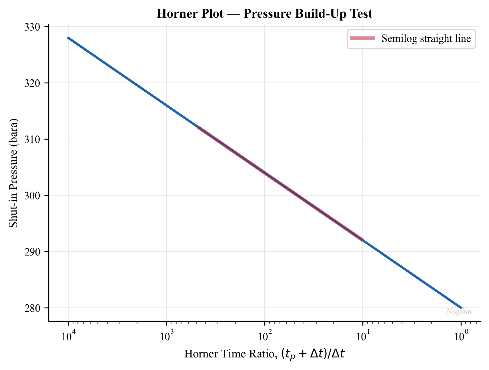
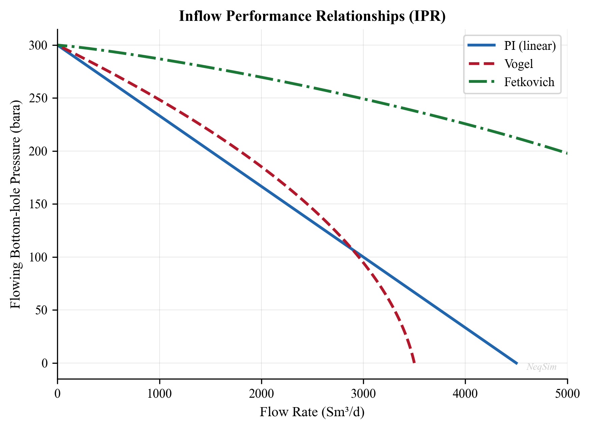
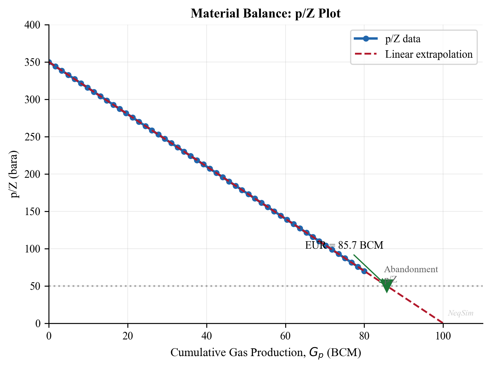
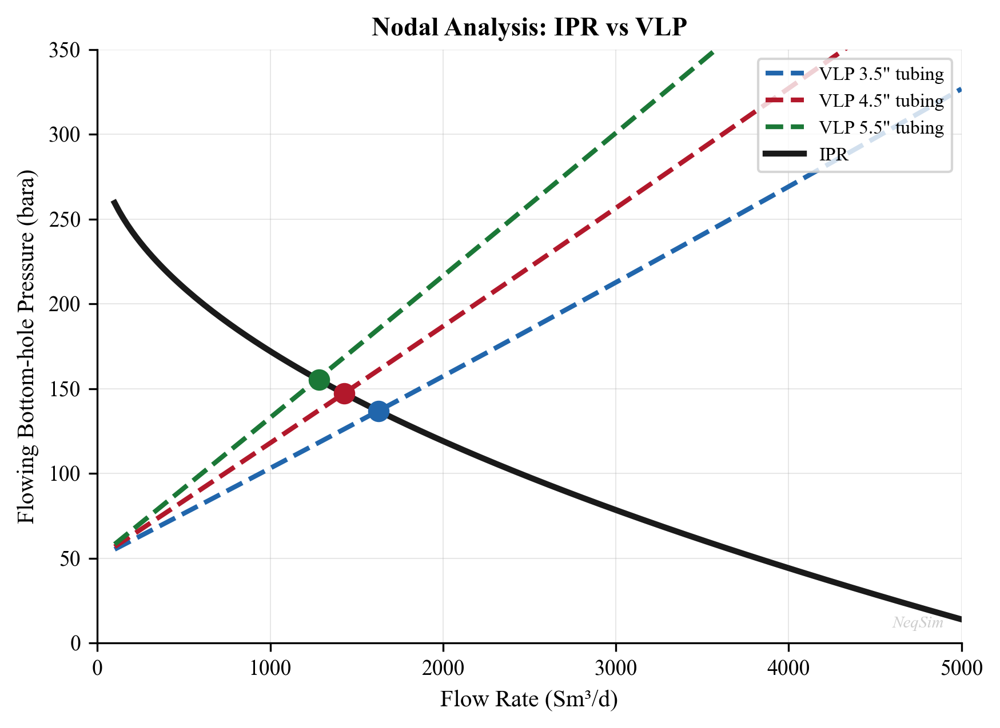
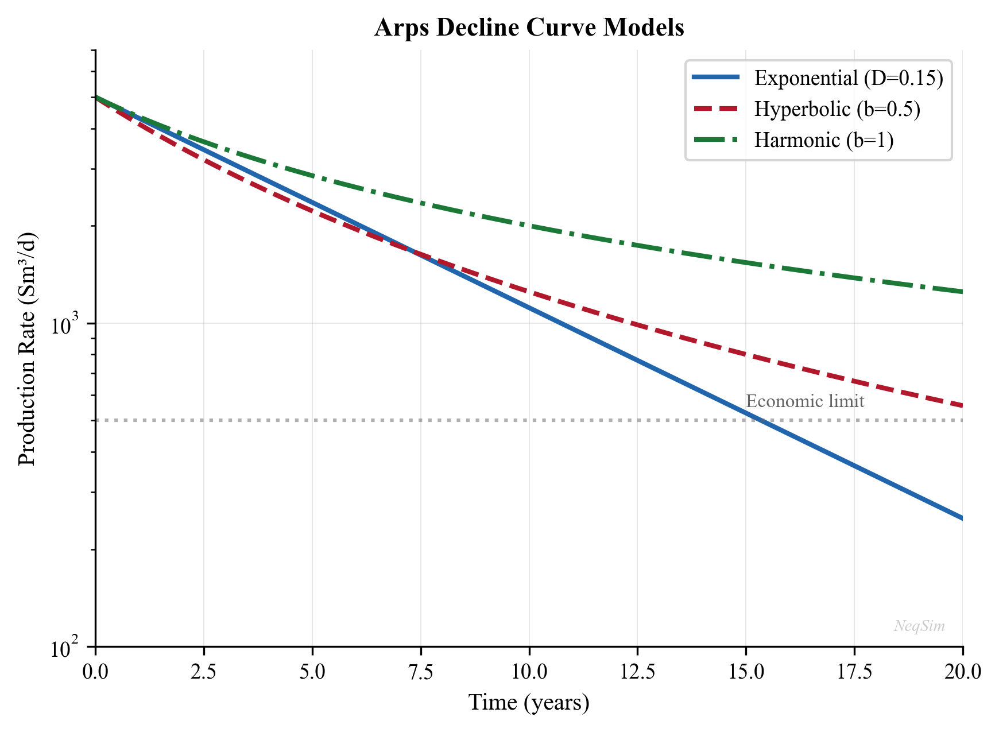
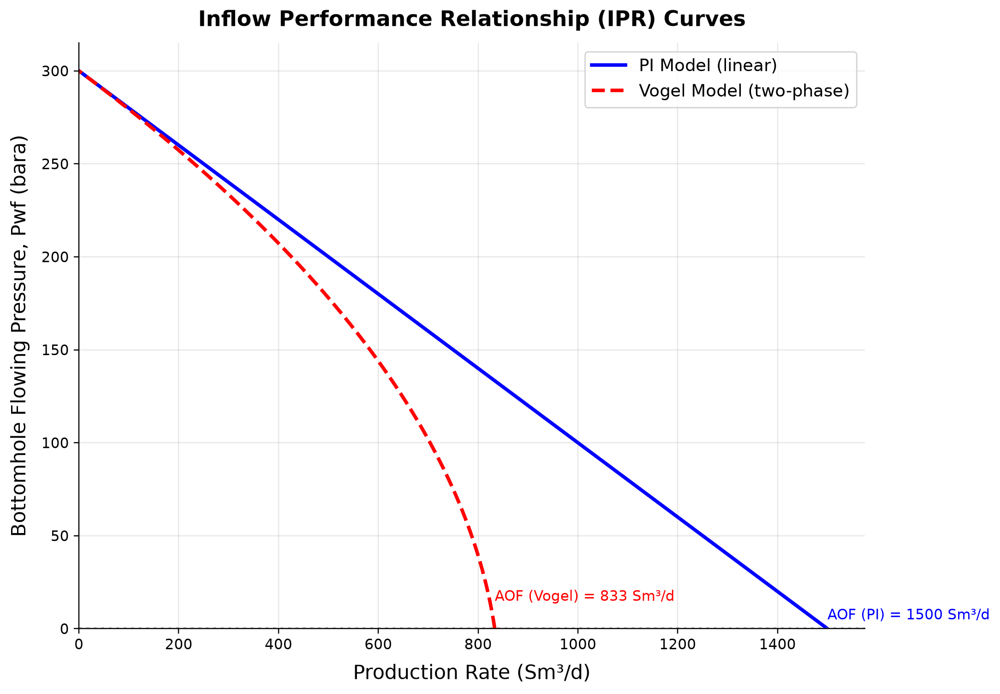
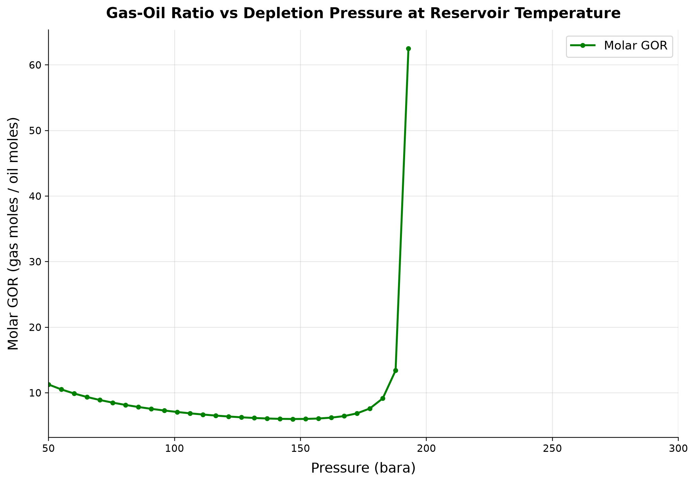
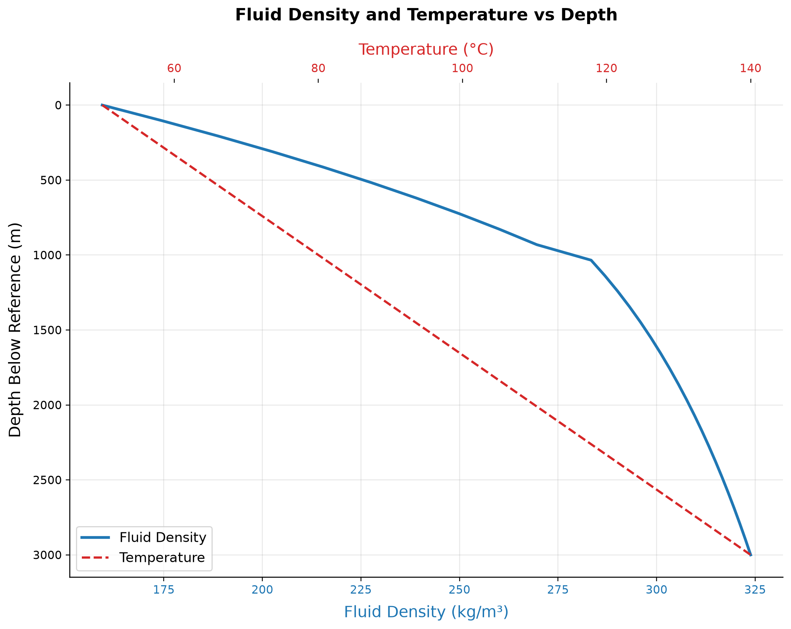
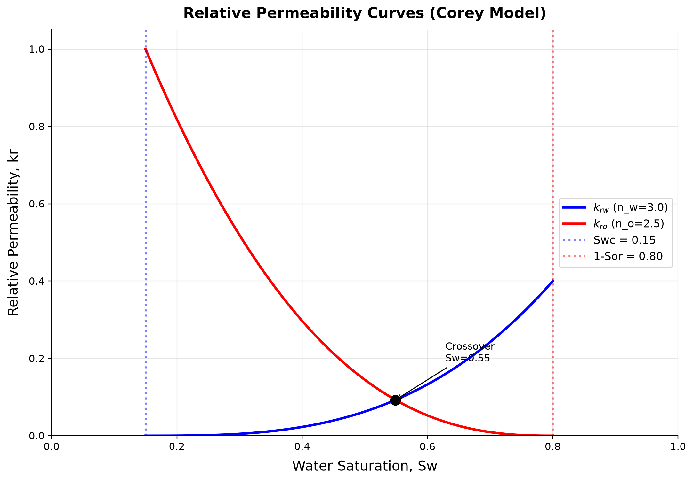

# Reservoir Engineering and Inflow Performance

**Running the examples.** Start the source-workspace Python session described in Chapter 1, then run this chapter's Python blocks in reading order. Java blocks form a separate sequence using the same NeqSim build; carry forward objects from preceding Java blocks. The release execution records are in `verification/`; a successful run establishes API compatibility, while physical validation also requires the checks discussed in the text.

<!-- Chapter metadata -->
<!-- Notebooks: ch04_ipr_curves.ipynb, ch04_reservoir_decline.ipynb, ch04_nodal_analysis.ipynb -->
<!-- Estimated pages: 35 -->

## Learning Objectives

After reading this chapter, the reader will be able to:

1. Apply Darcy's law and the radial flow equation to calculate well productivity
2. Construct inflow performance relationships (IPR) for oil wells (Vogel) and gas wells (back-pressure, LIT equations)
3. Explain reservoir drive mechanisms and their effect on pressure decline and recovery factor
4. Perform material balance calculations for different drive types, including the Havlena-Odeh method
5. Analyze well test data using Horner plots and estimate skin factor from pressure buildup
6. Use decline curve analysis (Arps) to forecast production and estimate EUR
7. Understand the NODAL analysis framework for integrated well-reservoir-facility analysis
8. Use NeqSim's `SimpleReservoir` class and couple it with wellbore models for production optimization workflows
9. Evaluate the coupling between reservoir simulation and process simulation through VFP tables

## 4.1 Introduction

Reservoir engineering provides the boundary conditions for production optimization. The reservoir determines how much fluid can be produced, at what rate, and for how long. No amount of topside optimization can overcome the fundamental constraints imposed by the reservoir — its pressure, permeability, fluid properties, and remaining reserves.

This chapter covers the reservoir engineering concepts most relevant to production optimization: inflow performance relationships that define what the well can deliver, reservoir pressure decline that governs the production life cycle, well testing methods that characterize the reservoir, and the system analysis framework that connects reservoir performance to the rest of the production chain.

We focus on practical modeling rather than detailed reservoir simulation. For integrated production optimization, the reservoir is typically represented by IPR curves and decline profiles — simplified models that capture the essential behavior without the computational cost of full reservoir simulation.

## 4.2 Darcy's Law and Radial Flow

### 4.2.1 Darcy's Law

Darcy's law describes the flow of a single-phase fluid through a porous medium:

$$
q = -\frac{kA}{\mu}\frac{dP}{dx}
$$

where:

- $q$ = volumetric flow rate [m³/s]
- $k$ = permeability [m² or Darcy; 1 D = 9.869 × 10$^{-13}$ m²]
- $A$ = cross-sectional area [m²]
- $\mu$ = fluid viscosity [Pa·s]
- $dP/dx$ = pressure gradient [Pa/m]

The negative sign indicates that flow is in the direction of decreasing pressure.

### 4.2.2 Radial Flow to a Vertical Well

For steady-state radial flow to a vertical well in a homogeneous reservoir, integrating Darcy's law in cylindrical coordinates gives:

$$
q_o = \frac{2\pi k h (P_e - P_{wf})}{B_o \mu_o \left[\ln\left(\frac{r_e}{r_w}\right) + S\right]}
$$

where:

- $q_o$ = oil flow rate at surface conditions [m³/s]
- $k$ = reservoir permeability [m²]
- $h$ = net pay thickness [m]
- $P_e$ = reservoir pressure at the drainage boundary [Pa]
- $P_{wf}$ = flowing bottomhole pressure [Pa]
- $B_o$ = oil formation volume factor [-]
- $\mu_o$ = oil viscosity at reservoir conditions [Pa·s]
- $r_e$ = drainage radius [m]
- $r_w$ = wellbore radius [m]
- $S$ = skin factor [-]

For practical field units (bbl/day, mD, ft, psi, cp):

$$
q_o = \frac{0.00708\, k h (P_e - P_{wf})}{B_o \mu_o \left[\ln\left(\frac{r_e}{r_w}\right) - 0.75 + S\right]}
$$

### 4.2.3 The Productivity Index

The productivity index (PI or $J$) linearizes the well inflow for undersaturated oil:

$$
J = \frac{q_o}{P_e - P_{wf}} = \frac{2\pi k h}{B_o \mu_o \left[\ln\left(\frac{r_e}{r_w}\right) + S\right]}
$$

The PI has units of m³/s/Pa (or bbl/day/psi in field units). A higher PI means the well produces more for a given drawdown. The PI depends on:

- **Rock properties:** Permeability $k$ and thickness $h$
- **Fluid properties:** Viscosity $\mu_o$ and FVF $B_o$ (both pressure-dependent)
- **Completion quality:** Skin factor $S$ (positive = damaged, negative = stimulated)
- **Well geometry:** Drainage and wellbore radii

Typical productivity indices:

| Well Type | PI Range (Sm³/d/bar) |
|-----------|---------------------|
| Low permeability gas well | 100–1,000 |
| Average oil well | 1–50 |
| High productivity oil well | 50–500 |
| Fractured well | 100–2,000 |

### 4.2.4 Skin Factor

The skin factor $S$ accounts for the additional pressure drop (or reduced pressure drop) near the wellbore due to:

| Cause | Effect on $S$ | Typical Range |
|-------|--------------|---------------|
| Drilling damage (mud invasion) | Positive (damage) | +1 to +20 |
| Partial penetration | Positive | +1 to +10 |
| Perforation skin | Positive | +1 to +5 |
| Hydraulic fracturing | Negative (stimulated) | -2 to -6 |
| Acid stimulation | Negative | -1 to -3 |
| Gravel pack | Positive or negative | -1 to +5 |

The apparent skin $S$ transforms the wellbore radius to an effective radius:

$$
r_{w,\text{eff}} = r_w e^{-S}
$$

A skin of $S = -4$ is equivalent to increasing the effective wellbore radius by a factor of 55 — the effect of a hydraulic fracture.

## 4.3 Well Testing

### 4.3.1 Purpose and Types of Well Tests

Well testing provides the primary source of in-situ reservoir characterization data. By measuring pressure and rate at the wellbore during controlled flow periods, we can determine:

- Permeability-thickness product $kh$
- Skin factor $S$
- Average reservoir pressure $\bar{P}$
- Reservoir boundaries and heterogeneities
- Drainage area and connectivity

The two fundamental well test types are:

- **Drawdown test:** The well flows at a constant rate from an initially shut-in condition. The pressure decline at the wellbore is analyzed.
- **Buildup test:** The well is shut in after a period of production. The pressure rise during the shut-in period is analyzed.

### 4.3.2 Pressure Drawdown Analysis

For a constant-rate drawdown in an infinite-acting reservoir, the wellbore pressure during radial flow follows:

$$
P_{wf} = P_i - \frac{q B \mu}{4\pi k h}\left[\ln\left(\frac{4 k t}{\phi \mu c_t r_w^2}\right) - 2\gamma + 2S\right]
$$

where $\gamma = 0.5772$ is Euler's constant, $\phi$ is porosity, $c_t$ is total compressibility, and $t$ is time.

In field units (psi, bbl/day, mD, ft, cp, hr):

$$
P_{wf} = P_i - 162.6 \frac{q B \mu}{k h}\left[\log t + \log\frac{k}{\phi \mu c_t r_w^2} - 3.23 + 0.87 S\right]
$$

A plot of $P_{wf}$ vs. $\log t$ gives a straight line during the infinite-acting radial flow period. The slope $m$ of this line yields:

$$
k h = \frac{162.6 \, q B \mu}{m}
$$

And the skin factor:

$$
S = 1.151\left[\frac{P_i - P_{1\text{hr}}}{m} - \log\frac{k}{\phi \mu c_t r_w^2} + 3.23\right]
$$

where $P_{1\text{hr}}$ is the pressure at $t = 1$ hour read from the straight line (not necessarily a measured point).

### 4.3.3 Pressure Buildup Analysis (Horner Plot)

The Horner method is the most widely used buildup analysis technique. After producing for time $t_p$ at rate $q$, the well is shut in and the buildup pressure $P_{ws}$ is measured as a function of shut-in time $\Delta t$:

$$
P_{ws} = P_i - 162.6 \frac{q B \mu}{k h} \log\left(\frac{t_p + \Delta t}{\Delta t}\right)
$$

The **Horner plot** is $P_{ws}$ vs. $\log\left(\frac{t_p + \Delta t}{\Delta t}\right)$ — this should yield a straight line during the infinite-acting radial flow period. From this line:

$$
k h = \frac{162.6 \, q B \mu}{m}
$$

where $m$ is the slope of the Horner straight line. The skin factor is:

$$
S = 1.151\left[\frac{P_{ws,1\text{hr}} - P_{wf,\text{last}}}{m} - \log\frac{k}{\phi \mu c_t r_w^2} + 3.23\right]
$$

where $P_{ws,1\text{hr}}$ is the buildup pressure at $\Delta t = 1$ hour (from the straight line) and $P_{wf,\text{last}}$ is the flowing pressure just before shut-in.

The extrapolation of the Horner straight line to $\frac{t_p + \Delta t}{\Delta t} = 1$ (i.e., infinite shut-in time) gives $P^*$, which approximates the average reservoir pressure for an infinite-acting reservoir.



### 4.3.4 Practical Considerations for Well Testing

Several factors complicate real well test interpretation:

- **Wellbore storage:** Fluid stored in the wellbore continues to flow into the formation after surface shut-in, masking the early-time reservoir response. The wellbore storage coefficient is $C = V_w c_w$ for a liquid-filled wellbore.
- **Phase redistribution:** In gas-liquid wells, phase segregation in the wellbore after shut-in causes a pressure "hump" that must be identified and excluded from analysis.
- **Boundary effects:** Faults, gas-oil contacts, or drainage boundaries cause deviations from the infinite-acting straight line at late times.
- **Rate history:** If the well has not been flowing at a constant rate, superposition in time is needed to account for the variable rate history.

### 4.3.5 Pressure-Transient Derivative Analysis

Modern well test interpretation uses the Bourdet pressure derivative:

$$
P' = \frac{dP_{ws}}{d\ln \Delta t} = \Delta t \frac{dP_{ws}}{d\Delta t}
$$

On a log-log plot of $\Delta P$ and $P'$ vs. $\Delta t$:

- **Wellbore storage:** Both $\Delta P$ and $P'$ lie on a unit-slope line
- **Infinite-acting radial flow:** $P'$ is constant (horizontal line), from which $kh$ is calculated
- **Linear flow** (fracture or channel): $P'$ follows a half-slope line
- **Boundary effects:** $P'$ rises (closed boundary) or drops (constant-pressure boundary)

This diagnostic plot is the first step in any well test interpretation, used to identify flow regimes before applying specific analysis methods.

## 4.4 Inflow Performance Relationships (IPR)

### 4.4.1 Linear IPR (Undersaturated Oil)

When the flowing bottomhole pressure $P_{wf}$ remains above the bubble point $P_b$, the oil behaves as a single-phase liquid with approximately constant compressibility, viscosity, and FVF. The IPR is linear:

$$
q_o = J(P_r - P_{wf})
$$

where $P_r$ is the average reservoir pressure and $J$ is the productivity index. The maximum flow rate occurs when $P_{wf} = 0$:

$$
q_{o,\max} = J \cdot P_r
$$

### 4.4.2 Vogel's IPR (Saturated Oil)

When $P_{wf}$ falls below the bubble point, gas evolves in the reservoir near the wellbore, reducing the effective permeability to oil. Vogel (1968) developed an empirical correlation for this non-linear behavior:

$$
\frac{q_o}{q_{o,\max}} = 1 - 0.2\left(\frac{P_{wf}}{P_r}\right) - 0.8\left(\frac{P_{wf}}{P_r}\right)^2
$$

### 4.4.3 Composite IPR (Above and Below Bubble Point)

For the common case where the reservoir pressure is above the bubble point but $P_{wf}$ falls below it, the composite IPR combines the linear region with the Vogel region:

For $P_{wf} \geq P_b$:

$$
q_o = J(P_r - P_{wf})
$$

For $P_{wf} < P_b$:

$$
q_o = J(P_r - P_b) + \frac{J P_b}{1.8}\left[1 - 0.2\left(\frac{P_{wf}}{P_b}\right) - 0.8\left(\frac{P_{wf}}{P_b}\right)^2\right]
$$

The total $q_{o,\max}$ for the composite IPR is:

$$
q_{o,\max} = J(P_r - P_b) + \frac{J P_b}{1.8}
$$



### 4.4.4 Fetkovich Method for Gas Wells

Fetkovich (1973) proposed an alternative to the back-pressure equation that uses an isochronal testing concept. The deliverability equation has the form:

$$
q_g = C(P_r^2 - P_{wf}^2)^n
$$

where $C$ and $n$ are determined from multi-rate tests. The Fetkovich method is also applied to oil wells with solution gas drive, using a modified approach that accounts for changes in relative permeability:

$$
\frac{q_o}{q_{o,\max}} = \left[1 - \left(\frac{P_{wf}}{P_r}\right)^2\right]^n
$$

where $n$ is the deliverability exponent (typically 0.5–1.0). For $n = 1$, this reduces to a simplified form analogous to the back-pressure equation. For oil wells, $n$ is often close to 1.0 at early times and decreases as the reservoir depletes and the gas saturation increases.

### 4.4.5 Gas Well IPR: Back-Pressure Equation

For gas wells, the simplified back-pressure equation (Rawlins and Schellhardt, 1935):

$$
q_g = C(P_r^2 - P_{wf}^2)^n
$$

where $C$ is the performance coefficient and $n$ is the deliverability exponent (0.5 ≤ $n$ ≤ 1.0).

### 4.4.6 Gas Well IPR: Laminar-Inertial-Turbulent (LIT) Equation

The more rigorous LIT equation separates laminar and turbulent contributions:

$$
P_r^2 - P_{wf}^2 = aq_g + bq_g^2
$$

Using pseudo-pressures $m(P)$ for improved accuracy:

$$
m(P_r) - m(P_{wf}) = aq_g + bq_g^2
$$

The pseudo-pressure is defined as:

$$
m(P) = 2\int_{P_0}^{P} \frac{P'}{\mu_g(P') Z(P')} dP'
$$

which accounts for the variation of gas viscosity and Z-factor with pressure.

### 4.4.7 Future IPR with Reservoir Depletion

As the reservoir depletes, the IPR curve shifts — the maximum rate decreases. For production forecasting, we need the IPR at future reservoir pressures. The future IPR can be estimated by:

**For Vogel's method**, the future $q_{o,\max}$ at a new reservoir pressure $P_r'$ is:

$$
q_{o,\max}' = q_{o,\max} \left(\frac{P_r'}{P_r}\right) \left(\frac{k_{ro}(S_o')\mu_o B_o}{k_{ro}(S_o)\mu_o' B_o'}\right)
$$

In simplified form (assuming the permeability-viscosity-FVF ratio changes slowly):

$$
q_{o,\max}' \approx q_{o,\max} \left(\frac{P_r'}{P_r}\right)
$$

This produces a family of IPR curves that move down and to the left as the reservoir pressure declines, showing how the well's productive capacity diminishes over time.

### 4.4.8 Horizontal Well IPR

For horizontal wells, the Joshi (1988) productivity equation:

$$
J_h = \frac{2\pi k_h h}{B_o \mu_o \left[\ln\left(\frac{a + \sqrt{a^2 - (L/2)^2}}{L/2}\right) + \frac{h}{L}\ln\left(\frac{h}{2\pi r_w}\right)\right]}
$$

where $L$ is the horizontal well length and:

$$
a = \frac{L}{2}\left[0.5 + \sqrt{0.25 + \left(\frac{2r_e}{L}\right)^4}\right]^{0.5}
$$

## 4.5 Reservoir Pressure Decline and Material Balance

### 4.5.1 Drive Mechanisms and Recovery Factors

The energy that drives fluid from the reservoir to the wellbore comes from several mechanisms:

| Drive Mechanism | Typical Recovery Factor | Pressure Behavior | Identifying Signature |
|----------------|----------------------|-------------------|-----------------------|
| Solution gas drive | 5–30% OOIP | Rapid decline | GOR increases rapidly after $P_b$ |
| Gas cap drive | 20–40% OOIP | Moderate decline | GOR increases, gas cap expands |
| Water drive (natural) | 30–60% OOIP | Near-constant pressure | WOR increases with time |
| Rock/fluid expansion | 1–5% OOIP | Above bubble point | Uniform pressure decline |
| Gravity drainage | 40–70% OOIP | Slow decline | Low-rate production, dipping beds |
| Combination | Varies | Depends on dominant | Multiple signatures |

Understanding the dominant drive mechanism is essential for predicting reservoir performance and selecting the correct material balance model.

### 4.5.2 General Material Balance Equation

The general material balance equation for an oil reservoir (Schilthuis, 1936):

$$
\begin{aligned}
N_p[B_o + (R_p-R_s)B_g]
 &= N[(B_o-B_{oi})+(R_{si}-R_s)B_g] \\
 &\quad + N\frac{B_{oi}(c_w S_{wi}+c_f)}{1-S_{wi}}\Delta P \\
 &\quad + \frac{m N B_{oi}}{B_{gi}}(B_g-B_{gi}) \\
 &\quad + W_e-W_p B_w .
\end{aligned}
$$

where:

- $N_p$ = cumulative oil production
- $N$ = original oil in place (OOIP)
- $R_p$ = cumulative producing GOR
- $m$ = ratio of gas cap volume to oil zone volume
- $W_e$ = cumulative water influx
- $W_p$ = cumulative water production
- Subscript $i$ = initial conditions

### 4.5.3 Havlena-Odeh Formulation

Havlena and Odeh (1963) rearranged the material balance equation into a straight-line form that is more convenient for analysis. Defining:

$$
F = N_p[B_o + (R_p - R_s)B_g] + W_p B_w
$$

$$
E_o = (B_o - B_{oi}) + (R_{si} - R_s)B_g
$$

$$
E_g = B_{oi}\left(\frac{B_g}{B_{gi}} - 1\right)
$$

$$
E_{fw} = \frac{B_{oi}(c_w S_{wi} + c_f)}{1 - S_{wi}} \Delta P
$$

The material balance becomes:

$$
F = N(E_o + m E_g + E_{fw}) + W_e
$$

For different reservoir types, this reduces to specific straight-line plots:

- **Volumetric undersaturated oil** ($m = 0$, $W_e = 0$, above $P_b$): $F = N E_{fw}$
- **Solution gas drive** ($m = 0$, $W_e = 0$, below $P_b$): $F = N E_o$
- **Gas cap drive** ($W_e = 0$): $F / E_o = N + N m E_g / E_o$, plot $F/E_o$ vs. $E_g/E_o$ → slope gives $Nm$, intercept gives $N$
- **Water drive**: $F / E_o = N + W_e / E_o$, plot $F/E_o$ vs. $W_e/E_o$ → slope gives 1, intercept gives $N$

### 4.5.4 Drive Index Analysis

The drive index quantifies the relative contribution of each energy source to the total production:

$$
\text{DDI} = \frac{N E_o}{F}, \quad \text{SDI} = \frac{N m E_g}{F}, \quad \text{WDI} = \frac{W_e}{F}, \quad \text{CDI} = \frac{N E_{fw}}{F}
$$

where DDI = depletion drive index, SDI = segregation (gas cap) drive index, WDI = water drive index, and CDI = compressibility drive index. The sum of all indices equals 1.0.

Tracking the drive index over time reveals how the dominant drive mechanism changes as the reservoir depletes — for example, solution gas drive may dominate early in the life of a reservoir, but an expanding gas cap may become the dominant mechanism later.

### 4.5.5 Water Influx Models

For reservoirs with active aquifer support, the water influx term $W_e$ must be calculated using an appropriate aquifer model.

**Schilthuis steady-state model** (constant influx rate per unit pressure drop):

$$
\frac{dW_e}{dt} = k_a (P_i - P)
$$

$$
W_e = k_a \int_0^t (P_i - P) \, dt
$$

This is the simplest model and assumes the aquifer responds instantaneously to pressure changes.

**Van Everdingen-Hurst unsteady-state model** (the most rigorous analytical model):

$$
W_e = U \sum_{j=0}^{n} \Delta P_j W_D(t_{Dj})
$$

where $U$ is the aquifer constant, $\Delta P_j$ is the pressure drop at time step $j$, and $W_D$ is the dimensionless water influx function evaluated at the dimensionless time:

$$
t_D = \frac{k_a t}{\phi_a \mu_w c_t r_a^2}
$$

The aquifer constant is:

$$
U = \frac{2\pi f \phi_a c_t h_a r_a^2}{5.615}
$$

where $f$ is the fraction of the aquifer circle (1 for full encirclement, 0.5 for half, etc.).

**Carter-Tracy approximation** — a practical simplification of the van Everdingen-Hurst model that avoids the superposition summation and is easier to implement in spreadsheet calculations.

### 4.5.6 Gas Material Balance (P/Z Plot)

For a volumetric gas reservoir (no water influx), the material balance simplifies to:

$$
\frac{P}{Z} = \frac{P_i}{Z_i}\left(1 - \frac{G_p}{G}\right)
$$

where $G_p$ is the cumulative gas production and $G$ is the original gas in place (OGIP). A plot of $P/Z$ vs. $G_p$ is a straight line:

- The y-intercept gives $P_i/Z_i$
- The x-intercept gives $G$ (OGIP)
- The current position gives the remaining reserves

For gas condensate reservoirs, the two-phase Z-factor $Z_{\text{2ph}}$ from the CVD experiment (Chapter 3) should be used instead of the single-phase $Z$ to account for the liquid dropout in the reservoir.



## 4.6 Recovery Factor

### 4.6.1 Primary Recovery Mechanisms

The recovery factor — the fraction of original hydrocarbons in place that can be produced — varies dramatically with drive mechanism:

**Solution gas drive:** As pressure drops below the bubble point, dissolved gas evolves and expands, pushing oil toward the wellbore. Recovery is typically 5–30% of OOIP. This is the least efficient natural drive mechanism because the gas expands throughout the reservoir rather than preferentially displacing oil. The GOR increases rapidly as the gas saturation increases.

**Water drive:** An active aquifer encroaches into the oil zone as production reduces the reservoir pressure, displacing oil from the pore space. Recovery is typically 30–60% of OOIP. Strong water drive maintains near-constant reservoir pressure, which is beneficial for production rates but eventually leads to high water cuts.

**Gas cap drive:** An existing or forming gas cap expands as pressure decreases, displacing oil downward. Recovery is typically 20–40% of OOIP. The efficiency depends on the ratio of gas cap to oil zone volume and the degree of gas cap segregation.

**Gravity drainage:** In steeply dipping or thick reservoirs with good vertical permeability, gravity segregation allows oil to drain downward as gas occupies the upper portion. Recovery can be very high (40–70% OOIP) but at low production rates. This mechanism is particularly effective in fractured reservoirs.

**Combination drive:** Most reservoirs exhibit a combination of mechanisms, often transitioning from one dominant mechanism to another as depletion progresses.

### 4.6.2 Typical Recovery Factors by Fluid Type

| Fluid Type | Primary Recovery | With Pressure Maintenance | With EOR |
|-----------|-----------------|--------------------------|----------|
| Light oil (water drive) | 30–60% | 40–65% | 50–75% |
| Light oil (solution gas) | 10–25% | 25–40% | 40–60% |
| Heavy oil | 5–15% | 10–25% | 20–50% (thermal) |
| Gas condensate | 50–80% (gas) | 70–90% (gas cycling) | — |
| Dry gas | 80–95% | — | — |

These ranges illustrate why understanding the drive mechanism is critical for production optimization: the choice of operating strategy (pressure maintenance, gas lift, water injection) fundamentally affects the ultimate recovery.

## 4.7 Decline Curve Analysis

### 4.7.1 Arps Decline Equations

Arps (1945) defined three types of production decline:

**Exponential decline** ($b = 0$):

$$
q(t) = q_i \exp(-D_i t)
$$

$$
N_p(t) = \frac{q_i - q(t)}{D_i}
$$

**Hyperbolic decline** ($0 < b < 1$):

$$
q(t) = \frac{q_i}{(1 + bD_i t)^{1/b}}
$$

$$
N_p(t) = \frac{q_i^b}{D_i(1-b)}\left[q_i^{1-b} - q(t)^{1-b}\right]
$$

**Harmonic decline** ($b = 1$):

$$
q(t) = \frac{q_i}{1 + D_i t}
$$

$$
N_p(t) = \frac{q_i}{D_i}\ln\left(\frac{q_i}{q(t)}\right)
$$

where:

- $q_i$ = initial production rate
- $D_i$ = initial decline rate [1/time]
- $b$ = decline exponent (0 ≤ $b$ ≤ 1)
- $N_p(t)$ = cumulative production at time $t$

Typical $b$ values by drive mechanism:

| Drive Mechanism | Typical $b$ |
|----------------|------------|
| Solution gas drive | 0.3–0.5 |
| Gas cap drive | 0.3–0.5 |
| Water drive | 0.0–0.3 |
| Gas well (volumetric) | 0.4–0.6 |

### 4.7.2 Decline Rate and EUR Estimation

The instantaneous decline rate is:

$$
D = -\frac{1}{q}\frac{dq}{dt}
$$

For exponential decline, $D$ is constant. For hyperbolic decline:

$$
D(t) = \frac{D_i}{1 + bD_i t}
$$

The effective annual decline rate $d$ relates to the nominal decline rate $D$ by:

$$
d = 1 - e^{-D}
$$

**Estimated Ultimate Recovery (EUR)** is calculated by integrating the decline curve to the economic limit rate $q_{\text{el}}$:

For exponential decline:

$$
\text{EUR} = N_p^{\text{current}} + \frac{q_{\text{current}} - q_{\text{el}}}{D}
$$

For hyperbolic decline, the time to reach the economic limit is:

$$
t_{\text{el}} = \frac{1}{bD_i}\left[\left(\frac{q_i}{q_{\text{el}}}\right)^b - 1\right]
$$

### 4.7.3 Rate-Cumulative Plots

An alternative diagnostic is the rate-cumulative production plot ($q$ vs. $N_p$):

- **Exponential decline:** Straight line with slope $-D$
- **Hyperbolic decline:** Concave-upward curve
- **Harmonic decline:** Concave-upward curve (more so than hyperbolic)

The rate-cumulative plot is useful because:
1. It does not require time data (useful when production records have gaps)
2. The x-intercept directly gives EUR (when extrapolated to $q = 0$ or $q_{\text{el}}$)
3. Changes in decline behavior (e.g., due to workovers or infill wells) are clearly visible as slope changes

## 4.8 Reservoir Simulation Coupling

### 4.8.1 Black Oil vs. Compositional Simulation

Reservoir simulation provides the most detailed prediction of reservoir performance, but the choice of simulation model affects how it couples with process simulation:

**Black oil simulation** uses pressure-dependent properties ($B_o$, $R_s$, $\mu_o$, $B_g$, $\mu_g$) from PVT tables. It is computationally efficient and suitable for black oils. The output (oil rate, gas rate, water rate, pressure) is passed to the process model as boundary conditions.

**Compositional simulation** tracks individual component mole fractions and solves the flash problem at each grid cell and time step. It is required for volatile oils, gas condensates, and gas injection processes. The output includes detailed stream compositions that can be directly used in NeqSim process models.

### 4.8.2 VFP Table Import

The primary interface between reservoir and process simulation is the **Vertical Flow Performance (VFP) table**. This lookup table provides the relationship between bottomhole pressure and flow rate for different:

- Tubing head pressures
- Water cuts
- Gas-liquid ratios
- Artificial lift parameters (gas lift rate, ESP frequency)

The reservoir simulator uses VFP tables to calculate the flowing bottomhole pressure for each well at each time step, which then determines the production rate through the IPR. VFP tables are typically generated by a wellbore hydraulics model (Chapter 5) and can be created using NeqSim's pipe flow capabilities.

### 4.8.3 Coupling with NeqSim Wellbore Models

NeqSim provides the `PipeBeggsAndBrills` class for multiphase wellbore flow calculations. This can be coupled with the `SimpleReservoir` class to create an integrated reservoir-to-separator model:

```python
import jpype
jneqsim = jpype.JPackage("neqsim")

# Create reservoir fluid
fluid = jneqsim.thermo.system.SystemSrkEos(273.15 + 95.0, 250.0)
fluid.addComponent("nitrogen", 0.5)
fluid.addComponent("CO2", 1.8)
fluid.addComponent("methane", 65.0)
fluid.addComponent("ethane", 8.0)
fluid.addComponent("propane", 4.0)
fluid.addComponent("n-butane", 2.5)
fluid.addComponent("n-pentane", 1.5)
fluid.addComponent("n-hexane", 1.0)
fluid.addComponent("n-heptane", 5.0)
fluid.addComponent("n-octane", 4.0)
fluid.addComponent("n-nonane", 3.0)
fluid.addComponent("n-decane", 2.7)
fluid.addComponent("water", 1.0)
fluid.setMixingRule("classic")
fluid.setMultiPhaseCheck(True)

# Create well stream at bottomhole conditions
Stream = jneqsim.process.equipment.stream.Stream
well_inflow = Stream("Well Inflow", fluid)
well_inflow.setFlowRate(50000.0, "kg/hr")
well_inflow.setTemperature(95.0, "C")
well_inflow.setPressure(200.0, "bara")

# Model wellbore as a vertical pipe
PipeBeggsAndBrills = jneqsim.process.equipment.pipeline.PipeBeggsAndBrills
wellbore = PipeBeggsAndBrills("Wellbore", well_inflow)
wellbore.setPipeWallRoughness(2.5e-5)
wellbore.setLength(3000.0)           # 3000 m well depth
wellbore.setElevation(-3000.0)       # Vertical well (negative = upward flow)
wellbore.setDiameter(0.1016)         # 4-inch tubing

# Model flowline to separator
flowline = PipeBeggsAndBrills("Flowline", wellbore.getOutletStream())
flowline.setPipeWallRoughness(5.0e-5)
flowline.setLength(5000.0)           # 5 km flowline
flowline.setElevation(0.0)           # Horizontal
flowline.setDiameter(0.2032)         # 8-inch pipeline

# HP Separator
Separator = jneqsim.process.equipment.separator.Separator
hp_sep = Separator("HP Separator", flowline.getOutletStream())

# Build and run process
ProcessSystem = jneqsim.process.processmodel.ProcessSystem
process = ProcessSystem()
process.add(well_inflow)
process.add(wellbore)
process.add(flowline)
process.add(hp_sep)
process.run()

# Report results
print("=== Integrated Well-to-Separator Results ===")
print(f"Bottomhole pressure: {well_inflow.getPressure('bara'):.1f} bara")
print(f"Wellhead pressure: {wellbore.getOutletStream().getPressure('bara'):.1f} bara")
print(f"Wellhead temperature: {wellbore.getOutletStream().getTemperature('C'):.1f} C")
print(f"Separator inlet pressure: {flowline.getOutletStream().getPressure('bara'):.1f} bara")
print(f"Separator inlet temperature: {flowline.getOutletStream().getTemperature('C'):.1f} C")
print(f"Oil rate: {hp_sep.getLiquidOutStream().getFlowRate('m3/hr'):.1f} m3/hr")
print(f"Gas rate: {hp_sep.getGasOutStream().getFlowRate('MSm3/day'):.4f} MSm3/day")
```

## 4.9 System Analysis: NODAL Analysis

### 4.9.1 Concept

NODAL analysis (first described by Gilbert, 1954; formalized by Mach et al., 1979) is the framework for analyzing the integrated well-reservoir-facility system. The system is divided at a "node" — typically the bottomhole — and two performance curves are plotted:

1. **Inflow Performance Relationship (IPR):** The rate the reservoir can deliver as a function of bottomhole pressure
2. **Vertical Flow Performance (VFP):** The bottomhole pressure required to lift the fluid to the surface at each rate

The operating point is where the two curves intersect.



### 4.9.2 Applications of NODAL Analysis

| Application | What Changes |
|------------|-------------|
| Tubing size selection | VFP curve shifts |
| Choke sizing | VFP curve back-pressure increases |
| Artificial lift design | VFP curve lowered |
| Separator pressure optimization | VFP curve back-pressure changes |
| Stimulation evaluation | IPR curve shifts (skin reduction) |
| Water cut effect | Both curves change |

### 4.9.3 Multi-Well Optimization

When multiple wells produce into a common facility, the individual well operating points are coupled through the shared back-pressure. The total production is:

$$
q_{\text{total}} = \sum_{i=1}^{N_w} q_i(P_{wf,i})
$$

subject to:

- Each well's IPR constraint
- The gathering system pressure drop model
- The facility capacity constraint (separator capacity, compressor capacity)

This optimization problem — maximizing $q_{\text{total}}$ subject to constraints — is the core of production optimization, developed further in Chapter 19.

## 4.10 NeqSim Implementation: Reservoir Modeling

### 4.10.1 The SimpleReservoir Class

NeqSim provides the `SimpleReservoir` class for coupling reservoir performance with process simulation:

```python
import jpype
jneqsim = jpype.JPackage("neqsim")

# Create reservoir fluid
fluid = jneqsim.thermo.system.SystemSrkEos(273.15 + 100.0, 250.0)
fluid.addComponent("nitrogen", 0.5)
fluid.addComponent("CO2", 2.0)
fluid.addComponent("methane", 65.0)
fluid.addComponent("ethane", 8.0)
fluid.addComponent("propane", 4.0)
fluid.addComponent("i-butane", 1.0)
fluid.addComponent("n-butane", 2.0)
fluid.addComponent("i-pentane", 0.8)
fluid.addComponent("n-pentane", 0.6)
fluid.addComponent("n-hexane", 1.0)
fluid.addComponent("n-heptane", 5.0)
fluid.addComponent("n-octane", 4.0)
fluid.addComponent("n-nonane", 3.0)
fluid.addComponent("n-decane", 2.1)
fluid.addComponent("water", 1.0)
fluid.setMixingRule("classic")
fluid.setMultiPhaseCheck(True)

# Create reservoir
SimpleReservoir = jneqsim.process.equipment.reservoir.SimpleReservoir
reservoir = SimpleReservoir("Main Reservoir")
# Initial in-situ gas, oil and water pore volumes in m3 (illustrative).
reservoir.setReservoirFluid(fluid, 1.0e7, 2.0e7, 5.0e6)

# Add a production well
producer = reservoir.addOilProducer("Producer-1")
producer.setFlowRate(10000.0, "kg/hr")
```

### 4.10.2 IPR Curve Generation with NeqSim

Using NeqSim to generate IPR curves by solving the well-reservoir system at different bottomhole pressures:

```python
import jpype
jneqsim = jpype.JPackage("neqsim")

# Reservoir parameters
P_reservoir = 250.0  # bara
T_reservoir = 95.0   # C
PI = 15.0            # Sm3/d/bar (productivity index)
P_bubble = 180.0     # bara (bubble point)

# Calculate IPR using composite Vogel method
pressures_bhp = []
rates = []

for i in range(50):
    P_wf = 10.0 + i * 4.8  # 10 to 250 bara
    pressures_bhp.append(P_wf)

    if P_wf >= P_bubble:
        # Linear region (above bubble point)
        q = PI * (P_reservoir - P_wf)
    else:
        # Vogel region (below bubble point)
        q_at_pb = PI * (P_reservoir - P_bubble)
        q_vogel_max = q_at_pb + PI * P_bubble / 1.8
        q = q_at_pb + (q_vogel_max - q_at_pb) * (
            1.0 - 0.2 * (P_wf / P_bubble) - 0.8 * (P_wf / P_bubble) ** 2
        )
    rates.append(max(0.0, q))

# Print table
print(f"{'P_wf (bara)':>12} {'q_o (Sm3/d)':>12}")
print("-" * 26)
for p, q in zip(pressures_bhp[::5], rates[::5]):
    print(f"{p:12.1f} {q:12.1f}")
```

### 4.10.3 Decline Curve Implementation

```python
import math

# Arps decline curve parameters
q_i = 5000.0     # Initial rate, Sm3/d
D_i = 0.001      # Initial decline rate, 1/day (about 30% per year)
b = 0.5           # Hyperbolic exponent

# Forecast for 10 years
time_days = [i * 30 for i in range(121)]  # Monthly steps for 10 years
rates = []
cum_production = []
cum = 0.0

for t in time_days:
    # Hyperbolic decline
    q = q_i / (1.0 + b * D_i * t) ** (1.0 / b)
    rates.append(q)

    if t > 0:
        dt = time_days[1]  # Step size
        cum += q * dt
    cum_production.append(cum)

# EUR calculation
q_el = 50.0  # Economic limit, Sm3/d
t_el = (1.0 / (b * D_i)) * ((q_i / q_el) ** b - 1.0)
print(f"Time to economic limit: {t_el / 365.25:.1f} years")

# Print annual summary
print(f"{'Year':>6} {'Rate (Sm3/d)':>14} {'Cum (MSm3)':>12} {'Annual Decline':>16}")
print("-" * 50)
for yr in range(11):
    idx = yr * 12
    if idx < len(rates):
        annual_decline = (1.0 - rates[idx] / rates[max(0, idx - 12)]) * 100 if yr > 0 else 0.0
        print(f"{yr:6d} {rates[idx]:14.0f} {cum_production[idx] / 1e6:12.3f} {annual_decline:15.1f}%")
```



### 4.10.4 Analytical Drive Models for Integrated Production

Alongside the compositional `SimpleReservoir`, NeqSim provides lightweight **analytical drive models** (package `neqsim.process.fielddevelopment.integrated`) that express reservoir pressure as a function of cumulative production. They share the `ReservoirDrive` interface and plug directly into the integrated reservoir-to-market model of Chapter 28, where thousands of pressure evaluations over a field life would make full compositional simulation prohibitively expensive:

| Class | Drive Mechanism | Material-Balance Basis |
|-------|-----------------|------------------------|
| `MaterialBalanceGasDrive` | Volumetric gas expansion | $p/Z$ vs cumulative gas |
| `OilTankDrive` | Solution-gas / depletion oil | Tank material balance |
| `AquiferDrive` | Water influx support | Aquifer pressure coupling |

Each model couples a `WellDeliverabilityCurve` (Chapter 5) to a declining reservoir pressure so that the integrated model can march a production profile forward in time:

```python
integ = jneqsim.process.fielddevelopment.integrated
MaterialBalanceGasDrive = integ.MaterialBalanceGasDrive

initialPressureBara, gasInPlaceSm3, averageZ = 250.0, 1.0e9, 0.90
drive = MaterialBalanceGasDrive(initialPressureBara, gasInPlaceSm3, averageZ)
# pressure falls as cumulative production rises, following p/Z material balance
```

These drive objects are supplied to `IntegratedProductionModel.addWell(name, drive, deliverabilityCurve)` (Chapter 28) and to the `ReservoirToMarketOptimizer`, giving a closed reservoir-to-export model that runs in milliseconds per timestep.

### 4.10.5 Well Stream Setup

Setting up a well stream from the reservoir for process simulation:

```python
import jpype
jneqsim = jpype.JPackage("neqsim")

# Create reservoir fluid at typical conditions
fluid = jneqsim.thermo.system.SystemSrkEos(273.15 + 95.0, 300.0)
fluid.addComponent("nitrogen", 0.4)
fluid.addComponent("CO2", 1.8)
fluid.addComponent("methane", 68.0)
fluid.addComponent("ethane", 7.5)
fluid.addComponent("propane", 4.2)
fluid.addComponent("n-butane", 2.5)
fluid.addComponent("n-pentane", 1.5)
fluid.addComponent("n-hexane", 1.2)
fluid.addComponent("n-heptane", 3.5)
fluid.addComponent("n-octane", 3.0)
fluid.addComponent("n-nonane", 2.4)
fluid.addComponent("n-decane", 2.0)
fluid.addComponent("water", 2.0)
fluid.setMixingRule("classic")
fluid.setMultiPhaseCheck(True)

# Create well stream at wellhead conditions
Stream = jneqsim.process.equipment.stream.Stream
well_stream = Stream("Well-1 Stream", fluid)
well_stream.setFlowRate(50000.0, "kg/hr")     # 50 t/hr
well_stream.setTemperature(75.0, "C")          # Wellhead temperature
well_stream.setPressure(70.0, "bara")           # Wellhead pressure
well_stream.run()

# Check the well stream properties
well_fluid = well_stream.getFluid()
print(f"Number of phases: {well_fluid.getNumberOfPhases()}")
print(f"Gas rate: {well_stream.getFlowRate('MSm3/day'):.3f} MSm3/day (total)")
print(f"Temperature: {well_stream.getTemperature('C'):.1f} C")
print(f"Pressure: {well_stream.getPressure('bara'):.1f} bara")
```


## 4.11 Gas Condensate Reservoirs

### 4.11.1 Retrograde Condensation Effect

Gas condensate reservoirs present a unique challenge: as pressure drops below the dew point, liquid condenses in the reservoir pore space. This condensate is typically immobile (trapped by capillary forces) and reduces the gas relative permeability, creating a "condensate bank" near the wellbore.

The productivity reduction can be severe — 50–80% reduction in gas PI — and is not captured by simple IPR models. Accurate modeling requires compositional simulation with relative permeability effects.

### 4.11.2 Mitigation Strategies

- **Pressure maintenance:** Gas injection to keep reservoir pressure above the dew point
- **Lean gas cycling:** Inject lean gas (methane) to revaporize condensate
- **Hydraulic fracturing:** Create large-area flow paths that bypass the condensate bank
- **Reduced drawdown:** Limit well rate to minimize near-wellbore condensation

## 4.12 Reservoir Uncertainty and Its Impact on Optimization

### 4.12.1 Key Uncertain Parameters

| Parameter | Typical Uncertainty Range | Impact |
|-----------|--------------------------|--------|
| Permeability | Factor of 2–5 | Directly affects PI and rate |
| Net pay | ±20–50% | Directly affects PI |
| OOIP / OGIP | ±30–50% | Determines reserves and field life |
| Skin factor | ±5 skin units | Affects rate, especially early life |
| Aquifer strength | Factor of 2–10 | Determines pressure support |
| Relative permeability | ±30% | Affects water breakthrough timing |
| Bubble/dew point | ±5–10% | Affects phase behavior and recovery |

### 4.12.2 Probabilistic Reserves

Reserves are classified probabilistically:

- **P90 (Proved):** 90% probability that actual production will equal or exceed this estimate
- **P50 (Probable):** 50% probability — the best estimate
- **P10 (Possible):** 10% probability — the optimistic case

### 4.12.3 Sensitivity to Reservoir Pressure

As the reservoir depletes, the IPR shifts — the maximum rate decreases and the curve changes shape:

- **Early life** (high $P_r$): Large rate potential; optimization focuses on facility capacity
- **Mid life** ($P_r$ near $P_b$): Gas-oil ratio increases; compression becomes a constraint
- **Late life** (low $P_r$): Rate is reservoir-limited; artificial lift becomes necessary

## 4.13 Multi-Well and Multi-Reservoir Systems

### 4.13.1 Commingled Production

When multiple reservoir zones produce into a common wellbore:

$$
q_{\text{total}} = \sum_{j=1}^{N_z} J_j(P_{r,j} - P_{wf})
$$

subject to the constraint that all zones share the same bottomhole pressure $P_{wf}$.

### 4.13.2 Well Allocation

In a multi-well system with shared facilities, production must be allocated to satisfy:

- Individual well constraints (maximum rate, minimum BHP, maximum GOR, maximum water cut)
- Facility constraints (separator capacity, compressor capacity, water handling capacity)
- Export constraints (pipeline capacity, specification limits)

This allocation problem is the foundation of the short-term production optimization discussed in Chapter 19.


<!-- reviewed-notebook-results:start -->
## Reproduced Calculation Results

These examples use the stated fluid recipes and operating assumptions. Curves represent NeqSim calculations unless a caption identifies an analytical illustration, assumed equipment map or synthetic data.



PI Model (linear): bottomhole flowing pressure, pwf spans 0–300 bara across the plotted cases. Vogel Model (two-phase): bottomhole flowing pressure, pwf spans 0–300 bara across the plotted cases.

An IPR relates liquid or gas deliverability to drawdown; curvature reflects the selected inflow law and reservoir phase behavior. A high zero-backpressure intercept does not establish a producible operating rate because tubing and facility backpressure still have to be satisfied. Calibrate the appropriate inflow law against well tests and intersect it with a verified tubing relationship on the same rate and pressure basis.



Molar GOR spans 6.001–62.51 gas moles / oil moles across the plotted cases. Gaps retain undefined phase quantities or hydraulic states that fail the stated operating boundary; they are not interpolated.

As pressure falls, dissolved light components evolve into a gas phase and change the gas and liquid volumes. Gas-handling demand can increase relative to oil rate during depletion; a static initial GOR can therefore understate future bottlenecks. Distinguish fixed-composition flashes from depletion with gas withdrawal, and couple the appropriate PVT path to separator and compression capacity.



Across the assumed 0–3000 m depth interval, density spans 159.4–323.9 kg/m³ and temperature spans 50.0–140.0 °C.

Depth changes both hydrostatic pressure and temperature; these effects jointly alter fluid density. A constant-density hydrostatic approximation can bias bottom-hole pressure, particularly for compressible or near-saturation fluids. Integrate density over the pressure–temperature path and compare with measured gradients before using the profile for well control or inflow calibration.



$k_{rw}$ (n_w=3.0): relative permeability, kr spans 0–0.4 across the plotted cases. $k_{ro}$ (n_o=2.5): relative permeability, kr spans 0–1 across the plotted cases.

The Corey curves allocate effective flow capacity between phases according to saturation, residual saturation and fitted exponents. Their endpoints and curvature can control water breakthrough and mobility predictions; the plotted curves are constitutive assumptions rather than EOS results. Replace the illustrative parameters with rock-type-specific core data and examine hysteresis and endpoint uncertainty in reservoir forecasts.

Selected numerical ranges from the plotted cases:

| Quantity / series | Minimum | Maximum | Unit |
|---|---:|---:|---|
| PI Model (linear): bottomhole flowing pressure, pwf | 0 | 300 | bara |
| Molar GOR | 6.001 | 62.51 | gas moles / oil moles |
| Fluid Density | 159.4 | 323.9 | kg/m³ |
| $k_{rw}$ (n_w=3.0): relative permeability, kr | 0 | 0.4 |  |

Ranges describe the sampled cases; they are not independent validation tolerances.
<!-- reviewed-notebook-results:end -->

## 4.14 Summary

Key points from this chapter:

- **Darcy's law** and the radial flow equation provide the physical basis for well productivity. The productivity index $J$ encapsulates rock properties, fluid properties, and completion quality.
- **Well testing** (drawdown and buildup analysis, Horner plots, pressure derivatives) provides in-situ measurements of $kh$, skin, and average reservoir pressure.
- **IPR curves** (linear for undersaturated oil, Vogel for saturated oil, Fetkovich and back-pressure/LIT for gas) define the rate that the reservoir can deliver at each bottomhole pressure. Future IPR curves shift as the reservoir depletes.
- **Reservoir drive mechanisms** (solution gas, gas cap, water drive, gravity drainage) determine the rate of pressure decline, ultimate recovery, and GOR/water cut evolution.
- **Material balance** (Havlena-Odeh straight-line method, drive index analysis, water influx models) links cumulative production to pressure decline and provides estimates of original hydrocarbons in place.
- **Decline curve analysis** (Arps equations) provides a simple but effective method for forecasting production and estimating EUR.
- **Reservoir simulation coupling** through VFP tables provides the interface between detailed reservoir models and process simulation.
- **NODAL analysis** provides the framework for integrating reservoir performance with well and facility performance.
- **NeqSim** models the reservoir through `SimpleReservoir`, wellbore through `PipeBeggsAndBrills`, and enables integrated reservoir-to-separator modeling.

## Exercises

1. **Exercise 4.1:** A vertical well has the following properties: $k = 50$ mD, $h = 20$ m, $r_e = 500$ m, $r_w = 0.108$ m, $S = 2$, $B_o = 1.25$, $\mu_o = 1.5$ cP. Calculate the productivity index in Sm³/d/bar. What is the maximum oil rate if $P_r = 300$ bara?

2. **Exercise 4.2:** Using Vogel's method, construct an IPR curve for a well with $P_r = 250$ bara, $P_b = 180$ bara, and $J = 20$ Sm³/d/bar (above bubble point). Plot $P_{wf}$ vs. $q_o$ from 0 to 250 bara.

3. **Exercise 4.3:** A gas well has the following multi-rate test data:

   | $q_g$ (MSm³/d) | $P_{wf}$ (bara) |
   |-----------------|-----------------|
   | 0.5 | 245 |
   | 1.0 | 235 |
   | 1.5 | 220 |
   | 2.0 | 200 |

   If $P_r = 250$ bara, determine the back-pressure equation coefficients $C$ and $n$.

4. **Exercise 4.4:** A volumetric gas reservoir has $P_i = 300$ bara, $T = 100$°C, and OGIP = 50 GSm³. Using NeqSim to calculate $Z$ at each pressure, construct a $P/Z$ vs. $G_p$ plot.

5. **Exercise 4.5:** A well produces 3000 Sm³/d initially with $D_i = 0.0008$/day and $b = 0.5$. Calculate the cumulative production after 5 years and the EUR to an economic limit of 50 Sm³/d.

6. **Exercise 4.6:** Set up a NODAL analysis in NeqSim for a single well flowing into a separator at 40 bara. Model the tubing using `PipeBeggsAndBrills`. Find the operating point.

7. **Exercise 4.7:** A pressure buildup test on a well that was flowing at 500 Sm³/d for 100 hours shows a Horner slope of $m = 15$ bar/cycle. If $B_o = 1.3$, $\mu_o = 2.0$ cP, calculate $kh$. If the pressure at 1-hour shut-in is 185 bara and $P_{wf,\text{last}} = 170$ bara, estimate the skin factor.

8. **Exercise 4.8:** For a solution gas drive reservoir with $N = 50 \times 10^6$ Sm³ OOIP, use the Havlena-Odeh method to verify the OOIP given production data. Plot $F/E_o$ vs. cumulative production and check that the intercept matches $N$.

9. **Exercise 4.9:** Build an integrated reservoir-wellbore-separator model in NeqSim. Use `PipeBeggsAndBrills` for a 3000 m vertical well and 5 km flowline. Compare the wellhead pressure and separator gas rate for tubing sizes of 3.5-inch and 4.5-inch.

10. **Exercise 4.10 (Advanced):** For a system of three wells producing into a common manifold at 30 bara, each with different IPR parameters, use NeqSim to find the individual well rates that maximize total oil production subject to a total gas handling constraint of 2 MSm³/day.

## References

1. Vogel, J. V. (1968). Inflow performance relationships for solution-gas drive wells. *Journal of Petroleum Technology*, 20(1), 83–92.
2. Rawlins, E. L., & Schellhardt, M. A. (1935). *Backpressure Data on Natural Gas Wells and Their Application to Production Practices*. Monograph 7, USBM.
3. Arps, J. J. (1945). Analysis of decline curves. *Transactions of the AIME*, 160(1), 228–247.
4. Joshi, S. D. (1988). Augmentation of well productivity with slant and horizontal wells. *Journal of Petroleum Technology*, 40(6), 729–739.
5. Schilthuis, R. J. (1936). Active oil and reservoir energy. *Transactions of the AIME*, 118(1), 33–52.
6. Gilbert, W. E. (1954). Flowing and gas-lift well performance. *API Drilling and Production Practice*, 126–157.
7. Mach, J., Proano, E., & Brown, K. E. (1979). A nodal approach for applying systems analysis to the flowing and artificial lift oil or gas well. *Paper SPE 8025*.
8. Ahmed, T. (2016). *Reservoir Engineering Handbook* (5th ed.). Gulf Professional Publishing.
9. Dake, L. P. (1978). *Fundamentals of Reservoir Engineering*. Elsevier.
10. Economides, M. J., Hill, A. D., Ehlig-Economides, C., & Zhu, D. (2013). *Petroleum Production Systems* (2nd ed.). Prentice Hall.
11. Havlena, D., & Odeh, A. S. (1963). The material balance as an equation of a straight line. *Journal of Petroleum Technology*, 15(8), 896–900.
12. Fetkovich, M. J. (1973). The isochronal testing of oil wells. *Paper SPE 4529*, 48th Annual Fall Meeting.
13. Bourdet, D., Whittle, T. M., Douglas, A. A., & Pirard, Y. M. (1983). A new set of type curves simplifies well test analysis. *World Oil*, 196(6), 95–106.
14. van Everdingen, A. F., & Hurst, W. (1949). The application of the Laplace transformation to flow problems in reservoirs. *Transactions of the AIME*, 186, 305–324.
15. Carter, R. D., & Tracy, G. W. (1960). An improved method for calculating water influx. *Transactions of the AIME*, 219, 415–417.

