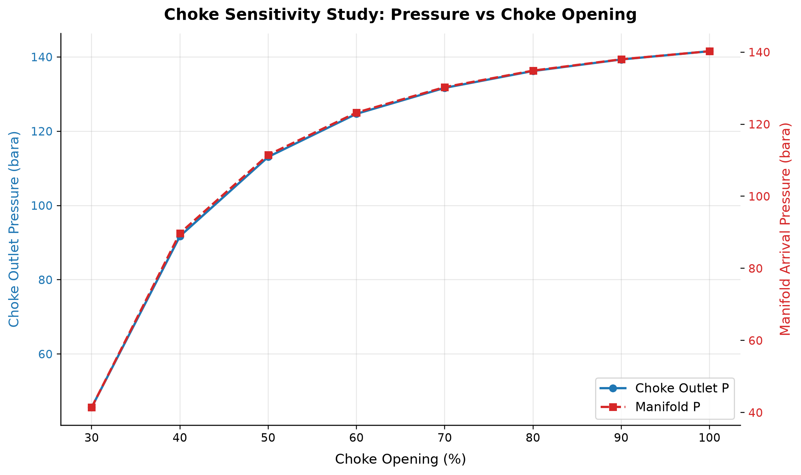
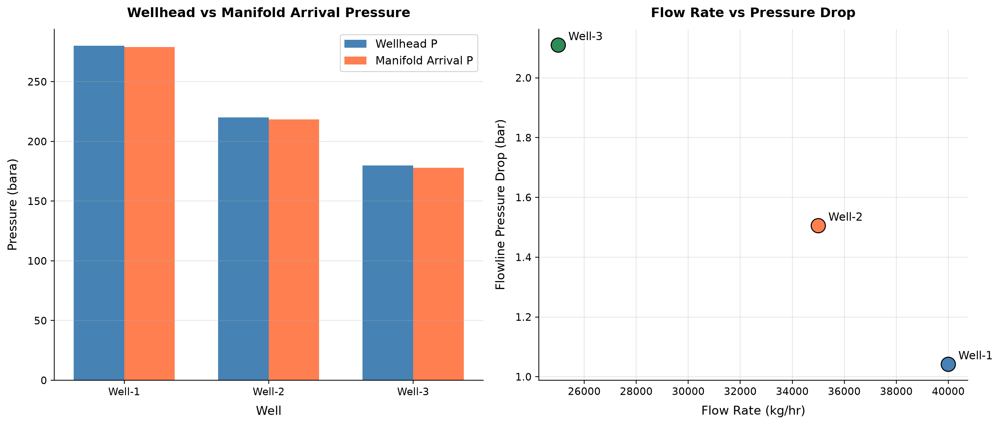

# Production Wells, Artificial Lift, and Well Network Modeling

**Running the examples.** Start the source-workspace Python session described in Chapter 1, then run this chapter's Python blocks in reading order. Java blocks form a separate sequence using the same NeqSim build; carry forward objects from preceding Java blocks. The release execution records are in `verification/`; a successful run establishes API compatibility, while physical validation also requires the checks discussed in the text.

<!-- Chapter metadata -->
<!-- Notebooks: ch15_well_network.ipynb, ch15_choke_sensitivity.ipynb, ch15_network_optimization.ipynb -->
<!-- Estimated pages: 40 -->

## Learning Objectives

After reading this chapter, the reader will be able to:

1. Model production well networks using NeqSim's `LoopedPipeNetwork` class with multiple wells, chokes, tubing, and gathering flowlines
2. Implement IPR models (Productivity Index, Vogel, Fetkovich) for both oil and gas wells within a network framework
3. Size and model production chokes using IEC 60534-style valve equations with critical flow detection
4. Calculate vertical lift performance (VLP) for well tubing using segmented pressure drop correlations
5. Build complete multi-well gathering networks with source, junction, and sink nodes
6. Model artificial lift systems (gas lift, ESP, jet pump, rod pump) and their effect on network hydraulics
7. Optimize choke settings and production allocation across a well network using NLP and multi-objective methods
8. Track water handling, sand production, corrosion, and GHG emissions within the network model
9. Implement production well networks in Python for rapid prototyping and sensitivity analysis

---

## 6.1 Introduction

Previous chapters addressed individual well performance — multiphase flow in tubing (Chapter 5), choke behavior (Chapter 15 Valves), and artificial lift methods. In reality, production wells do not operate in isolation. They are connected through a gathering network of flowlines, manifolds, and headers that deliver the combined production to the processing facility. The performance of each well depends on the network back-pressure, which in turn depends on the production rates of all other wells.

This chapter introduces **production well network modeling** — the discipline of simultaneously solving for flow rates and pressures across an interconnected system of wells, chokes, tubing strings, flowlines, and processing constraints. We present NeqSim's `LoopedPipeNetwork` class, which implements a Newton-Raphson Global Gradient Algorithm (NR-GGA) solver capable of handling hundreds of wells with sub-second convergence.

The chapter progresses from individual building blocks (IPR models, choke equations, tubing VLP) to complete network assembly and optimization. We conclude with practical topics: artificial lift integration, water handling, flow assurance, emissions tracking, and Python implementations for rapid engineering studies.

### 6.1.1 Why Network Modeling Matters

Consider a platform producing from 20 wells through a common manifold at 40 bara. If one well increases production, the manifold pressure rises slightly, reducing the drawdown — and hence the flow rate — of every other well. This coupling means that:

- **Individual well optimization is insufficient.** Maximizing one well may reduce total platform production.
- **Choke settings interact.** Opening a choke on Well A changes the back-pressure on Wells B through T.
- **Artificial lift allocation is a system problem.** Gas lift gas or ESP power allocated to one well affects what is available for others.
- **Facility constraints propagate.** A compressor limit or separator capacity constraint affects all wells simultaneously.

Network modeling captures these interactions and enables true system-level optimization.

### 6.1.2 The LoopedPipeNetwork Architecture

NeqSim's `LoopedPipeNetwork` represents the production system as a directed graph:

- **Nodes** represent physical locations: reservoir sandface, wellbore, wellhead, manifold, platform arrival
- **Elements** represent resistance components: IPR (reservoir inflow), tubing, choke, flowline, compressor
- **The solver** simultaneously determines all nodal pressures and element flow rates

The key innovation is that each "element" can be a different physical model — not just a pipe. The element types supported are:

| Element Type | Physical Model | Key Parameters |
|-------------|---------------|----------------|
| `PIPE` | Darcy-Weisbach single-phase | Length, diameter, roughness |
| `WELL_IPR` | Reservoir inflow (PI, Vogel, Fetkovich) | $P_r$, PI, $Q_{max}$, $C$, $n$ |
| `CHOKE` | IEC 60534 valve flow | $K_v$, opening %, critical pressure ratio |
| `TUBING` | Vertical multiphase lift | Length, diameter, inclination, segments |
| `MULTIPHASE_PIPE` | Beggs-Brill horizontal/inclined | Length, diameter, roughness, elevation |
| `COMPRESSOR` | Centrifugal with performance chart | Speed, efficiency, surge/stonewall |
| `REGULATOR` | Pressure reducing valve | Downstream set-point |

This generalized approach means that a single network model can represent the complete path from reservoir to export — or any subset thereof.

---

## 6.2 Production Well Networks in NeqSim

### 6.2.1 The LoopedPipeNetwork Class

The `LoopedPipeNetwork` class is the central component for production network modeling in NeqSim. It extends `ProcessEquipmentBaseClass` and can be embedded within a `ProcessSystem` for integrated facility simulation.


**API units and model scope in the 2026 release**

`addSourceNode` accepts bara and optional kg/hr, whereas `NetworkNode.setPressure`
uses Pa. `addWellIPR` takes a productivity index in kg/s/Pa for oil or kg/s/Pa²
for gas and a Boolean gas flag; reservoir pressure comes from the source node.
The examples explicitly convert illustrative standard-volume indices using a
stated reference density. `getNodePressure` returns bara, `getPipeFlowRate`
returns kg/hr, and `getTotalSinkFlow` returns kg/s. Mixing these interfaces can
produce plausible-looking results wrong by factors of 100,000 or 3,600.

Tubing elements use a reduced hydraulic relation; the multiphase-pipe element
uses `PipeBeggsAndBrills`. Gas-lift, ESP and water-cut switches therefore support
screening, with detailed well and phase models needed to qualify an operating
recommendation. A reported optimizer objective is not a convergence or
feasibility certificate. Inspect `converged`, the residual in Pa, mass balance
in kg/s, and the candidate constraint report before comparing production.\cite{neqsim2026update}

```java
import org.apache.logging.log4j.LogManager;
import org.apache.logging.log4j.Logger;
Logger logger = LogManager.getLogger("BookChapter6");
import neqsim.process.equipment.network.LoopedPipeNetwork;
import neqsim.process.equipment.network.LoopedPipeNetwork.*;
import neqsim.thermo.system.SystemInterface;
import neqsim.thermo.system.SystemSrkEos;

// Create a fluid template for the network
SystemInterface gas = new SystemSrkEos(273.15 + 80.0, 200.0);
gas.addComponent("methane", 0.80);
gas.addComponent("ethane", 0.08);
gas.addComponent("propane", 0.04);
gas.addComponent("n-butane", 0.02);
gas.addComponent("n-heptane", 0.04);
gas.addComponent("water", 0.02);
gas.setMixingRule("classic");
gas.setMultiPhaseCheck(true);

// Create the network
LoopedPipeNetwork network = new LoopedPipeNetwork("Production Network");
network.setFluidTemplate(gas);
```

### 6.2.2 Node Types

Every network requires at least one source node (where fluid enters) and one sink node (where fluid exits). Junction nodes connect elements internally.

**Source nodes** represent reservoirs or injection points. They have a fixed pressure (the reservoir pressure) and supply whatever flow rate the IPR allows:

```java
// Reservoir nodes (fixed pressure sources)
network.addSourceNode("Reservoir-A", 250.0, 0.0);  // 250 bar, flow determined by IPR
network.addSourceNode("Reservoir-B", 220.0, 0.0);  // 220 bar
```

**Sink nodes** represent delivery points — the manifold, separator inlet, or export pipeline. They may have a fixed pressure (back-pressure constraint) or a fixed demand:

```java
// Platform manifold (fixed back-pressure)
network.addSinkNode("Manifold", 0.0);  // demand determined by network solution

// Alternative: fixed pressure at sink
NetworkNode manifold = network.getNode("Manifold");
manifold.setPressure(40.0e5);        // 40 bara in Pa
manifold.setPressureFixed(true);
```

**Junction nodes** are intermediate connection points — wellheads, subsea manifolds, pipeline junctions:

```java
// Wellhead and subsea junction nodes
network.addJunctionNode("WH-A");        // Wellhead of Well A
network.addJunctionNode("WH-B");        // Wellhead of Well B
network.addJunctionNode("BH-A");        // Bottomhole of Well A
network.addJunctionNode("BH-B");        // Bottomhole of Well B
network.addJunctionNode("Subsea-Manifold");
```

### 6.2.3 Network Element Types

Each element connects two nodes and has a pressure-flow relationship $\Delta P = f(Q)$ and its derivative $d\Delta P/dQ$. The NR-GGA solver uses these functions to build the Jacobian matrix.

**PIPE elements** use the Darcy-Weisbach equation for single-phase flow:

$$
\Delta P = \frac{f L}{D} \cdot \frac{\rho v^2}{2}
$$

```java
// Subsea flowline (single-phase pipe)
network.addPipe("Subsea-Manifold", "Manifold", "Export Flowline",
    15000.0,    // length [m]
    0.254);     // diameter [m] (10-inch)
```

**MULTIPHASE_PIPE elements** use the Beggs-Brill correlation for two-phase and three-phase systems, wrapping NeqSim's `PipeBeggsAndBrills`:

```java
// Multiphase gathering line
NetworkPipe gatherLine = network.addPipe("WH-A", "Subsea-Manifold",
    "Gathering Line A", 5000.0, 0.2032);  // 8-inch, 5 km
gatherLine.setElementType(NetworkElementType.MULTIPHASE_PIPE);
gatherLine.setMultiphaseSegments(20);
gatherLine.setRoughness(4.5e-5);
```

### 6.2.4 The Newton-Raphson Global Gradient Algorithm

The NR-GGA solver (also known as the Todini-Pilati method) solves the network equations simultaneously. For a network with $N_n$ nodes and $N_e$ elements, the system is:

**Continuity at each node** (mass balance):

$$
\sum_{j \in \text{in}(i)} Q_j - \sum_{j \in \text{out}(i)} Q_j = D_i \quad \forall \text{ nodes } i
$$

where $D_i$ is the external demand (positive) or supply (negative) at node $i$.

**Momentum equation for each element** (pressure-flow relationship):

$$
H_i - H_j = h_k(Q_k) \quad \forall \text{ elements } k \text{ connecting nodes } i \to j
$$

where $H_i$ is the head (pressure) at node $i$ and $h_k(Q_k)$ is the head loss through element $k$ at flow rate $Q_k$.

The NR-GGA linearizes these equations around the current estimate $(Q^{(n)}, H^{(n)})$ and solves the resulting linear system:

$$
\begin{bmatrix} A_{11} & A_{12} \\ A_{21} & 0 \end{bmatrix}
\begin{bmatrix} \Delta Q \\ \Delta H \end{bmatrix}
= \begin{bmatrix} r_1 \\ r_2 \end{bmatrix}
$$

where:

- $A_{11} = \text{diag}(dh_k/dQ_k)$ — diagonal matrix of element derivatives
- $A_{12}$ — incidence matrix (network topology)
- $A_{21} = A_{12}^T$ — transpose of incidence matrix
- $r_1, r_2$ — residuals of momentum and continuity equations

**Schur complement reduction** eliminates $\Delta Q$ to solve a smaller $N_n \times N_n$ system for nodal pressures:

$$
(A_{21} A_{11}^{-1} A_{12}) \Delta H = r_2 - A_{21} A_{11}^{-1} r_1
$$

This is highly efficient because $A_{11}$ is diagonal (trivial to invert), and the reduced system is much smaller than the full system for networks with many more pipes than nodes.

### 6.2.5 Solver Configuration

```java
// Select the NR-GGA solver
network.setSolverType(SolverType.NEWTON_RAPHSON);

// Convergence settings
network.setTolerance(1e-6);       // Residual tolerance (Pa)
network.setMaxIterations(100);    // Maximum iterations
```

**Adaptive relaxation** prevents divergence in stiff networks. The solver automatically reduces the step size when the residual increases:

$$
Q^{(n+1)} = Q^{(n)} + \alpha \cdot \Delta Q
$$

where $\alpha$ starts at 1.0 and is halved if the residual increases, down to a minimum of 0.1.

**Flow initialization** sets reasonable starting values for the iterative solver. The network automatically estimates initial flows based on source pressures and pipe resistances:

```java
// The solver handles initialization internally, but you can override:
network.getPipe("Export Flowline").setFlowRate(50.0);  // kg/s
```

---

## 6.3 IPR Models Implementation

### 6.3.1 Productivity Index (PI) Model

The simplest IPR model assumes a linear relationship between flow rate and drawdown:

**For oil wells (incompressible flow):**

$$
Q = \text{PI} \times (P_r - P_{wf})
$$

**For gas wells (compressible flow — pressure-squared form):**

$$
Q = \text{PI}_{gas} \times (P_r^2 - P_{wf}^2)
$$

where:
- $Q$ = flow rate [kg/s in network units]
- PI = productivity index [kg/s/Pa for oil, kg/s/Pa² for gas]
- $P_r$ = reservoir pressure [Pa]
- $P_{wf}$ = flowing bottomhole pressure [Pa]

The derivative for the NR-GGA solver is:

$$
\frac{d\Delta P}{dQ} = \frac{1}{\text{PI}} \quad \text{(oil)} \qquad \frac{d\Delta P}{dQ} = \frac{2 P_{wf}}{\text{PI}_{gas}} \quad \text{(gas)}
$$

**NeqSim convenience method:**

```java
// Oil well with PI = 15 Sm3/d/bar (converted internally to SI)
network.addWellIPR("Reservoir-A", "BH-A", "Well-A IPR",
    15.0 * 800.0 / 86400.0 / 1e5, // SI PI from 15 Sm3/day/bar and 800 kg/Sm3
    false);    // oil IPR; source node supplies reservoir pressure

// Gas well (set gasIPR flag)
NetworkPipe gasIPR = network.addWellIPR("Reservoir-B", "BH-B", "Well-B IPR",
    0.5 * 0.8 / 86400.0 / 1e10, // kg/s/Pa2 from 0.8 kg/Sm3 gas
    true);     // gas pressure-squared IPR
gasIPR.setGasIPR(true);
```

### 6.3.2 Vogel's Equation

Vogel (1968) developed an empirical IPR for solution-gas-drive reservoirs producing below the bubble point:

$$
\frac{Q}{Q_{max}} = 1 - 0.2\left(\frac{P_{wf}}{P_r}\right) - 0.8\left(\frac{P_{wf}}{P_r}\right)^2
$$

Solving for the pressure drop as a function of flow rate requires inverting this quadratic:

$$
P_{wf} = P_r \left[ \frac{-0.2 + \sqrt{0.04 + 3.2(1 - Q/Q_{max})}}{1.6} \right]
$$

The derivative $d\Delta P/dQ$ follows from implicit differentiation:

$$
\frac{d\Delta P}{dQ} = \frac{P_r}{Q_{max}} \cdot \frac{1}{0.2 + 1.6 \cdot P_{wf}/P_r}
$$

**NeqSim convenience method:**

```java
// Vogel IPR: Qmax = absolute open flow (AOF) in kg/s
network.addWellIPRVogel("Reservoir-A", "BH-A", "Well-A Vogel", 50.0);       // Qmax (AOF) [kg/s]
```

### 6.3.3 Fetkovich Equation

Fetkovich (1973) proposed a generalized backpressure equation for gas and gas-condensate wells:

$$
Q = C \times (P_r^2 - P_{wf}^2)^n
$$

where:
- $C$ = backpressure coefficient [kg/s/Pa^(2n)]
- $n$ = backpressure exponent (0.5 ≤ $n$ ≤ 1.0)
  - $n = 1.0$: Darcy (laminar) flow dominates
  - $n = 0.5$: turbulent/non-Darcy flow dominates
  - Typical: $n \approx 0.7$–0.9

The derivative:

$$
\frac{d\Delta P}{dQ} = \frac{(P_r^2 - P_{wf}^2)}{n \cdot Q \cdot 2 P_{wf}}
$$

**NeqSim convenience method:**

```java
// Fetkovich IPR: C and n from well test analysis
network.addWellIPRFetkovich("Reservoir-B", "BH-B", "Well-B Fetkovich", 1.5e-8,      // C coefficient
    0.85);       // n exponent
```

### 6.3.4 Choosing the Right IPR Model

| Scenario | Recommended Model | Why |
|----------|------------------|-----|
| Above bubble point (undersaturated oil) | Productivity Index | Linear behavior, PI from well test |
| Below bubble point (solution-gas drive) | Vogel | Accounts for relative permeability effects |
| Gas or gas-condensate well | Fetkovich | Handles turbulence and non-Darcy flow |
| Multi-rate well test available | Fetkovich | C and n fitted from test data |
| Screening / early appraisal | PI | Minimal data required |

### 6.3.5 The WellFlow Equipment and Inflow Constraints

The network convenience methods above attach an IPR to a `NetworkPipe`. For a self-contained well that participates in a `ProcessSystem` (or the integrated production model of Chapter 28), NeqSim provides the dedicated `WellFlow` equipment class (package `neqsim.process.equipment.reservoir`). A single instance can carry any of the inflow laws of Section 6.3:

```python
WellFlow = jneqsim.process.equipment.reservoir.WellFlow

# Standalone oil IPR example, separate from the Java network.
oil_fluid = jneqsim.thermo.system.SystemSrkEos(353.15, 250.0)
oil_fluid.addComponent("methane", 0.20)
oil_fluid.addComponent("n-decane", 0.80)
oil_fluid.setMixingRule("classic")
reservoirStream = jneqsim.process.equipment.stream.Stream("Reservoir", oil_fluid)
reservoirStream.setFlowRate(200.0, "Sm3/day")
reservoirStream.run()
qTest, pwfTest, reservoirP = 200.0, 180.0, 250.0
well = WellFlow("Well-A")
well.setInletStream(reservoirStream)
# Explicit liquid-volume basis (Sm3/day), unlike the legacy MSm3/day setter.
InflowPerformance = jneqsim.process.equipment.reservoir.InflowPerformance
ratio = pwfTest / reservoirP
pi_liquid = qTest * 1.8 / (reservoirP * (1.0 - 0.2*ratio - 0.8*ratio**2))
well.setInflowPerformance(InflowPerformance.vogel(pi_liquid, reservoirP))
well.setLiquidRate(qTest)
# well.setFetkovichParameters(c, n, reservoirP)           # Fetkovich
# well.setBackpressureParameters(a, b, reservoirP)        # Rawlins-Schellhardt
# well.setTableInflow(bhp_array, rate_array)              # tabulated IPR
well.setOutletPressure(120.0, "bara")
well.solveFlowFromOutletPressure(True)
well.run()
assert 200.0 < well.getLiquidRate() < 400.0
print("Liquid rate (Sm3/day):", well.getLiquidRate(),
      "BHP:", well.getBottomHolePressure(),
      "drawdown:", well.getDrawdown())
```

`WellFlow` adds **inflow constraints** that the optimizers of Chapters 21 and 23 honour as capacity limits. They are activated with the fluent `useWellConstraints()` and bounded with reservoir-management limits:

```python
well.useWellConstraints()
well.setMaxDrawdown(40.0, "bara")           # sand / coning management
well.setMinBottomHolePressure(90.0, "bara")  # lift / stability limit
```

For commingled completions the class supports **multi-layer inflow** — `addLayer(name, stream, reservoirP, pi)`, `setFlowMode(FlowMode)`, `setTargetZone(...)`, with `getZoneAllocationFractions()` and `getLayerFlowRates()` reporting the crossflow split — and **fracture-containment screening** via `setFracturePressure(...)`, `setBarrierStressContrast(...)`, `isFractureContained(bhp)`, and `getFractureContainmentMargin()`. These features make `WellFlow` the inflow building block for the well-and-network optimization of Chapter 26.

---

## 6.4 Choke Modeling

### 6.4.1 IEC 60534 Valve Flow Equation

Production chokes are modeled using a simplified form of the IEC 60534 valve equation:

$$
Q = K_v \cdot \theta \cdot \sqrt{\frac{\Delta P}{\rho / \rho_{ref}}}
$$

where:
- $K_v$ = valve flow coefficient [m³/hr/√bar] at full opening
- $\theta$ = fractional opening (0–1, where 1 = fully open)
- $\Delta P$ = pressure drop across choke [bar]
- $\rho$ = fluid density [kg/m³]
- $\rho_{ref}$ = reference density (water = 1000 kg/m³)

For equal percentage characteristics (typical for production chokes):

$$
K_v(\theta) = K_{v,max} \cdot R^{(\theta - 1)}
$$

where $R$ is the rangeability (typically 30–50 for production chokes).

### 6.4.2 Critical Flow Detection

When the pressure ratio $P_2/P_1$ falls below the critical pressure ratio $x_T$ (typically 0.5–0.7 for choke valves), the flow becomes sonic and no longer increases with further pressure reduction:

$$
Q_{critical} = K_v \cdot \theta \cdot \sqrt{\frac{x_T \cdot P_1}{\rho / \rho_{ref}}}
$$

The network solver automatically detects critical flow and uses the appropriate equation. This is important because:

- Under critical flow, downstream pressure disturbances cannot propagate upstream
- The well is effectively isolated from manifold pressure fluctuations
- The choke opening becomes the sole control variable for the well's flow rate

### 6.4.3 Adding Chokes to the Network

```java
// Production choke with Kv = 25 m3/hr/sqrt(bar), 60% open
network.addJunctionNode("Downstream-A");
network.addChoke("WH-A", "Downstream-A", "Choke-A",
    25.0,    // Kv [m3/hr/sqrt(bar)]
    60.0);   // opening [%]

// Adjust choke opening later
NetworkPipe choke = network.getPipe("Choke-A");
choke.setChokeOpening(75.0);  // Open to 75%
```

### 6.4.4 Choosing Kv Values

Typical $K_v$ ranges by application:

| Application | Typical $K_v$ Range | Choke Size |
|-------------|-------------------|------------|
| Low-rate oil well | 5–15 m³/hr/√bar | 2–3 inch |
| Medium-rate well | 15–40 m³/hr/√bar | 3–4 inch |
| High-rate gas well | 40–120 m³/hr/√bar | 4–6 inch |
| Platform choke (adjustable) | 10–80 m³/hr/√bar | 3–5 inch |
| Subsea choke | 15–60 m³/hr/√bar | 3–4 inch |

The relationship between nominal choke size and $K_v$ depends on the manufacturer and trim type (cage, plug, ball). Always use vendor data for accurate sizing.

---

## 6.5 Tubing VLP Model

### 6.5.1 Pressure Drop in Vertical Tubing

The tubing element models the vertical (or deviated) flow from bottomhole to wellhead. The pressure drop has three components:

$$
\Delta P = \underbrace{\rho_m g L \sin\alpha}_{\text{gravity}} + \underbrace{\frac{f L}{D} \cdot \frac{\rho_m v^2}{2}}_{\text{friction}} + \underbrace{\rho_m v \, dv}_{\text{acceleration}}
$$

where:
- $\rho_m$ = mixture density (depends on holdup)
- $g$ = gravitational acceleration [9.81 m/s²]
- $L$ = measured depth [m]
- $\alpha$ = inclination from horizontal [degrees]
- $f$ = Moody friction factor
- $D$ = tubing ID [m]
- $v$ = mixture velocity [m/s]

### 6.5.2 Segmented Approach for Deep Wells

For deep wells (> 1000 m), the fluid properties change significantly with pressure and temperature along the tubing. The tubing model uses a segmented approach:

1. Divide the tubing into $N$ segments of equal length $\Delta L = L/N$
2. At each segment inlet, flash the fluid to get local properties ($\rho_m$, $\mu$, holdup)
3. Calculate the pressure drop across the segment
4. Update pressure and temperature for the next segment
5. Sum all segment pressure drops for the total $\Delta P$

Typical segment counts:

| Well Depth | Recommended Segments |
|-----------|---------------------|
| < 1000 m | 5–10 |
| 1000–3000 m | 10–20 |
| 3000–5000 m | 20–40 |
| > 5000 m | 40–60 |

### 6.5.3 Adding Tubing to the Network

```java
// Vertical tubing: 2500 m depth, 4-inch ID, 20 segments
network.addTubing("BH-A", "WH-A", "Tubing-A",
    2500.0,    // measured depth [m]
    0.1016,    // ID [m] (4-inch)
    90.0);     // inclination from horizontal [degrees] (90 = vertical)

// Deviated well: 3500 m MD, 60° average inclination
network.addTubing("BH-B", "WH-B", "Tubing-B",
    3500.0,    // measured depth [m]
    0.1016,    // ID [m]
    60.0);     // inclination [degrees]
```

### 6.5.4 Temperature Profile

The geothermal gradient provides the formation temperature at each depth:

$$
T_{formation}(z) = T_{surface} + G_T \cdot z
$$

where $G_T$ is the geothermal gradient (typically 25–35 °C/km). The fluid temperature in the tubing is influenced by:

- Heat exchange with the formation through the tubing wall and cement
- Joule-Thomson cooling as pressure decreases
- Frictional heating (usually negligible)

For most production wells, the fluid exits the wellhead at a temperature 20–50 °C below the bottomhole temperature, depending on flow rate, insulation, and well depth.

---

## 6.6 Building Complete Well Networks

### 6.6.1 Step-by-Step Network Assembly Pattern

Building a production network follows a consistent pattern:

1. **Create fluid template** — defines the composition for the entire network
2. **Add source nodes** — reservoir contact points with fixed pressure
3. **Add junction nodes** — bottomholes, wellheads, manifolds
4. **Add sink nodes** — delivery points (platform, FPSO)
5. **Add elements** — IPR, tubing, chokes, flowlines
6. **Configure solver** — type, tolerance, max iterations
7. **Run and inspect** — solve and extract results

### 6.6.2 Multi-Well Gathering Network Example

Consider a subsea field with three wells tied back to a platform:

```text
      Reservoir A (250 bar)          Reservoir B (220 bar)          Reservoir C (200 bar)
           |                              |                              |
      [IPR: PI=15]                  [IPR: Vogel]                  [IPR: Fetkovich]
           |                              |                              |
         BH-A                           BH-B                           BH-C
           |                              |                              |
      [Tubing 2500m]               [Tubing 3000m]               [Tubing 2000m]
           |                              |                              |
         WH-A                           WH-B                           WH-C
           |                              |                              |
      [Choke Kv=25]                [Choke Kv=30]                [Choke Kv=20]
           |                              |                              |
         Down-A                         Down-B                         Down-C
           |                              |                              |
      [Flowline 5km]              [Flowline 8km]              [Flowline 3km]
           \                              |                              /
            \                             |                             /
             +------------- Subsea Manifold -------------------------+
                                          |
                                  [Riser 1.5km]
                                          |
                                    Platform Inlet
```

```java
import neqsim.process.equipment.network.LoopedPipeNetwork;
import neqsim.process.equipment.network.LoopedPipeNetwork.*;
import neqsim.thermo.system.SystemInterface;
import neqsim.thermo.system.SystemSrkEos;

// Step 1: Fluid template
SystemInterface fluid = new SystemSrkEos(273.15 + 80.0, 200.0);
fluid.addComponent("nitrogen", 0.5);
fluid.addComponent("CO2", 1.5);
fluid.addComponent("methane", 72.0);
fluid.addComponent("ethane", 8.0);
fluid.addComponent("propane", 4.5);
fluid.addComponent("i-butane", 1.0);
fluid.addComponent("n-butane", 2.0);
fluid.addComponent("n-pentane", 1.5);
fluid.addComponent("n-hexane", 1.0);
fluid.addComponent("n-heptane", 4.0);
fluid.addComponent("n-octane", 2.5);
fluid.addComponent("water", 1.5);
fluid.setMixingRule("classic");
fluid.setMultiPhaseCheck(true);

LoopedPipeNetwork network = new LoopedPipeNetwork("Subsea Field");
network.setFluidTemplate(fluid);

// Step 2: Source nodes (reservoirs)
network.addSourceNode("Res-A", 250.0, 0.0);
network.addSourceNode("Res-B", 220.0, 0.0);
network.addSourceNode("Res-C", 200.0, 0.0);

// Step 3: Junction nodes
network.addJunctionNode("BH-A");
network.addJunctionNode("BH-B");
network.addJunctionNode("BH-C");
network.addJunctionNode("WH-A");
network.addJunctionNode("WH-B");
network.addJunctionNode("WH-C");
network.addJunctionNode("Down-A");
network.addJunctionNode("Down-B");
network.addJunctionNode("Down-C");
network.addJunctionNode("Subsea-Manifold");

// Step 4: Sink node (platform)
network.addSinkNode("Platform", 0.0);
NetworkNode platform = network.getNode("Platform");
platform.setPressure(35.0e5);  // 35 bara back-pressure
platform.setPressureFixed(true);

// Step 5: Elements — IPRs
network.addWellIPR("Res-A", "BH-A", "IPR-A", 15.0 * 800.0 / 86400.0 / 1e5, false);
network.addWellIPRVogel("Res-B", "BH-B", "IPR-B", 80.0);
network.addWellIPRFetkovich("Res-C", "BH-C", "IPR-C", 2.0e-8, 0.80);

// Step 5: Elements — Tubing
network.addTubing("BH-A", "WH-A", "Tubing-A", 2500.0, 0.1016, 90.0);
network.addTubing("BH-B", "WH-B", "Tubing-B", 3000.0, 0.1016, 75.0);
network.addTubing("BH-C", "WH-C", "Tubing-C", 2000.0, 0.1016, 90.0);

// Step 5: Elements — Chokes
network.addChoke("WH-A", "Down-A", "Choke-A", 25.0, 80.0);
network.addChoke("WH-B", "Down-B", "Choke-B", 30.0, 70.0);
network.addChoke("WH-C", "Down-C", "Choke-C", 20.0, 90.0);

// Step 5: Elements — Gathering flowlines (multiphase)
NetworkPipe fl_a = network.addPipe("Down-A", "Subsea-Manifold",
    "Flowline-A", 5000.0, 0.2032);
fl_a.setElementType(NetworkElementType.MULTIPHASE_PIPE);
fl_a.setMultiphaseSegments(15);

NetworkPipe fl_b = network.addPipe("Down-B", "Subsea-Manifold",
    "Flowline-B", 8000.0, 0.2032);
fl_b.setElementType(NetworkElementType.MULTIPHASE_PIPE);
fl_b.setMultiphaseSegments(20);

NetworkPipe fl_c = network.addPipe("Down-C", "Subsea-Manifold",
    "Flowline-C", 3000.0, 0.2032);
fl_c.setElementType(NetworkElementType.MULTIPHASE_PIPE);
fl_c.setMultiphaseSegments(10);

// Step 5: Elements — Riser
NetworkPipe riser = network.addPipe("Subsea-Manifold", "Platform",
    "Production Riser", 1500.0, 0.254);
riser.setElementType(NetworkElementType.MULTIPHASE_PIPE);
riser.setMultiphaseSegments(15);

// Step 6: Solver configuration
network.setSolverType(SolverType.NEWTON_RAPHSON);
network.setTolerance(1e-6);
network.setMaxIterations(100);

// Step 7: Solve
network.run();

// Step 7: Results
Map<String, Object> summary = network.getSolutionSummary();
logger.info("Converged: " + summary.get("converged"));
logger.info("Iterations: " + summary.get("iterations"));
logger.info("Total production: {} kg/s", network.getTotalSinkFlow());
```

### 6.6.3 Results Inspection

The `LoopedPipeNetwork` provides several report methods:

**Solution summary** — key convergence and flow metrics:

```java
Map<String, Object> summary = network.getSolutionSummary();
// Keys: converged, iterations, residualNorm, totalSourceFlow,
//       totalSinkFlow, maxVelocity, maxErosionalRatio
```

**Hydraulic report** — detailed pressure and flow for every element:

```java
logger.info("Hydraulic summary: {}", network.getSolutionSummary());
```

**Mass balance report** — verifies conservation of mass:

```java
logger.info("Mass balance error: {} kg/s", network.getMassBalanceError());
```

**Individual element results:**

```java
// Get pressure at any node
double whPressure = network.getNodePressure("WH-A");  // bara

// Get flow rate through any element
double pipeFlow = network.getPipeFlowRate("Flowline-A") / 3600.0;  // kg/s

// Get element details
NetworkPipe pipe = network.getPipe("Flowline-A");
double velocity = pipe.getVelocity();        // m/s
double reynolds = pipe.getReynoldsNumber();  // dimensionless
double holdup = pipe.getLiquidHoldup();       // fraction
```

---

## 6.7 Artificial Lift in NeqSim Networks

### 6.7.1 Gas Lift

Gas lift reduces the hydrostatic head in the tubing by injecting gas, which decreases the mixture density. In the network model, gas lift is implemented as a modification to the tubing element — the injected gas changes the effective density and hence the gravity pressure drop:

$$
\Delta P_{gravity} = \rho_m(Q_{prod} + Q_{GL}) \cdot g \cdot L \sin\alpha
$$

The gas lift rate is specified in kg/hr of injection gas:

```java
// Apply gas lift to Well A: 5000 kg/hr of lift gas
network.setGasLift("Tubing-A", 5000.0);  // kg/hr

// Solve again to see the effect
network.run();
```

The effect on wellhead pressure (and hence production rate) is dramatic — typical gas lift can increase production by 50–200% for wells that would otherwise have insufficient natural energy.

### 6.7.2 Electric Submersible Pump (ESP)

An ESP adds a pressure boost at the pump intake depth, effectively lowering the flowing bottomhole pressure seen by the reservoir:

$$
P_{wf,effective} = P_{wf,actual} - \Delta P_{ESP}
$$

where the ESP head rise depends on the pump characteristic curve, flow rate, and speed:

$$
\Delta P_{ESP} = \rho \cdot g \cdot H_{stage} \cdot N_{stages} \cdot \eta
$$

In the network:

```java
// ESP on Well B: 150 kW rated power, 55% efficiency
network.setESP("Tubing-B", 150.0, 0.55);  // power [kW], efficiency
```

### 6.7.3 Jet Pump

A jet pump (hydraulic lift) uses high-pressure power fluid to create a low-pressure zone that draws in production fluid. In the network model, it is represented as an equivalent pressure boost:

```java
// Jet pump on Well C: 100 kW equivalent, 40% efficiency
network.setJetPump("Tubing-C", 100.0, 0.40);
```

### 6.7.4 Rod Pump

Rod pumps are positive displacement devices that maintain a nearly constant flow rate. In the network model, the rod pump provides a pressure boost similar to ESP:

```java
// Rod pump: 30 kW, 50% efficiency
network.setRodPump("Tubing-A", 30.0, 0.50);
```

### 6.7.5 Effect on the NR-GGA Solver

Artificial lift modifies the element's $\Delta P(Q)$ function by adding a negative head loss (pressure gain). The solver handles this naturally — the Jacobian simply includes the derivative of the combined gravity + friction + lift term. This means:

- All artificial lift methods are fully coupled with the network solution
- Changing lift parameters on one well affects all other wells through the shared back-pressure
- The optimizer (Section 6.9) can optimize lift allocation across the entire field

---

## 6.8 Water Handling and Flow Assurance

### 6.8.1 Water Cut Tracking

Each tubing or flowline element can carry a water cut that affects density, viscosity, holdup, and corrosion calculations:

```java
// Set water cut for Well A's tubing
NetworkPipe tubing_a = network.getPipe("Tubing-A");
tubing_a.setWaterCut(0.30);  // 30% water cut
```

The water cut affects the multiphase flow calculation through:

- **Mixture density:** Higher water cut increases liquid density, increasing hydrostatic head
- **Viscosity:** Oil-water emulsion viscosity can be much higher than pure oil
- **Holdup:** Water changes the gas-liquid flow pattern transitions

### 6.8.2 Water Injection

For water injection wells, the network element flow direction is reversed — water flows from surface to the reservoir:

```java
LoopedPipeNetwork variant = new LoopedPipeNetwork("Topology illustration");
variant.setFluidTemplate(fluid);
variant.addSourceNode("Platform", 250.0, 0.0);
// Independent injection topology illustration
variant.addJunctionNode("WI-Wellhead");
variant.addJunctionNode("WI-BH");
variant.addSourceNode("WI-Reservoir", 180.0, 0.0);
variant.addPipe("Platform", "WI-Wellhead", "WI-Flowline", 10000.0, 0.2032);
variant.addTubing("WI-Wellhead", "WI-BH", "WI-Tubing", 3000.0, 0.1778, 90.0);
variant.addWellIPR("WI-BH", "WI-Reservoir", "WI-IPR", 25.0 * 1000.0 / 86400.0 / 1e5, false);
```

### 6.8.3 Sand Production Tracking

Sand production causes erosion in chokes, bends, and flowlines. The DNV RP O501 erosion model calculates material loss rate based on particle velocity, impact angle, and particle properties:

$$
E = K \cdot F(\alpha) \cdot v_p^n \cdot \dot{m}_p / (\rho_t \cdot A_t)
$$

where:
- $E$ = erosion rate [mm/year]
- $K$ = material constant
- $F(\alpha)$ = impact angle function
- $v_p$ = particle velocity [m/s]
- $n$ = velocity exponent (typically 2.6 for steel)
- $\dot{m}_p$ = sand mass flow rate [kg/s]
- $\rho_t$ = target material density [kg/m³]
- $A_t$ = target area [m²]

```java
// Set sand rate for a well's tubing
NetworkPipe tubing = network.getPipe("Tubing-A");
tubing.setSandRate(0.001);  // kg/s of sand
```

### 6.8.4 Corrosion Models

Two industry-standard CO₂ corrosion models are available:

**de Waard-Milliams (1975):**

$$
\log(v_{corr}) = 5.8 - \frac{1710}{T} + 0.67 \log(p_{CO_2})
$$

where $v_{corr}$ is the corrosion rate [mm/year], $T$ is temperature [K], and $p_{CO_2}$ is CO₂ partial pressure [bar].

**NORSOK M-506:**

A temperature- and pH-dependent model that accounts for protective scale formation:

$$
v_{corr} = K_t \cdot f(pH) \cdot f_{CO_2}(T, p_{CO_2}) \cdot f_{scale}
$$

These models are integrated with the network flow solution, using the local temperature, pressure, and CO₂ content at each element.

### 6.8.5 GHG Emissions Tracking

The network can estimate greenhouse gas emissions associated with production operations:

```java
Map<String, double[]> emissions = network.calculateEmissions();
// Compressor combustion emissions only; flaring, venting and fugitives need separate models.
```

This is particularly relevant for:
- **Gas lift compressor emissions:** Fuel gas consumption for compression
- **ESP power emissions:** Electricity generation for downhole pumps
- **Flaring:** Gas that cannot be processed
- **Fugitive emissions:** Leaks from valves, flanges, and seals

---

## 6.9 Network Optimization

### 6.9.1 Choke Sensitivity Study

Before running formal optimization, a choke sensitivity study reveals how each well responds to choke changes:

```java
// Small, independently bounded network for the optimization tutorial.
// The detailed four-well multiphase calculation is demonstrated in Python below.
LoopedPipeNetwork study = new LoopedPipeNetwork("Choke optimization tutorial");
SystemSrkEos studyFluid = new SystemSrkEos(303.15, 90.0);
studyFluid.addComponent("methane", 0.95);
studyFluid.addComponent("ethane", 0.05);
studyFluid.setMixingRule("classic");
study.setFluidTemplate(studyFluid);
study.addSourceNode("Source-A", 90.0, 0.0);
study.addSourceNode("Source-B", 85.0, 0.0);
study.addJunctionNode("Down-A");
study.addJunctionNode("Down-B");
study.addSinkNode("Plant", 0.0);
study.getNode("Plant").setPressure(40.0e5);
study.getNode("Plant").setPressureFixed(true);
study.addChoke("Source-A", "Down-A", "Choke-A", 20.0, 80.0);
study.addChoke("Source-B", "Down-B", "Choke-B", 15.0, 80.0);
study.addPipe("Down-A", "Plant", "Line-A", 5000.0, 0.2032);
study.addPipe("Down-B", "Plant", "Line-B", 4000.0, 0.2032);
study.setSolverType(SolverType.NEWTON_RAPHSON);
study.setMaxIterations(100);
study.setTolerance(100.0);  // Pa = 0.001 bar for this teaching solve
double[] openings = {40.0, 60.0, 80.0, 100.0};
for (double opening : openings) {
    study.getPipe("Choke-A").setChokeOpening(opening);
    study.run();
    logger.info("Opening {}%, flow {} kg/hr, converged {}", opening,
        study.getPipeFlowRate("Line-A"), study.getSolutionSummary().get("converged"));
    logger.info("Hydraulic residual {} Pa", study.getSolutionSummary().get("maxResidual_Pa"));
}
```

This produces a characteristic curve showing diminishing returns as the choke opens — the well transitions from choke-limited to reservoir-limited or tubing-limited flow.

### 6.9.2 NetworkOptimizer with BOBYQA and CMA-ES

Optimizer termination and hydraulic convergence are separate checks. Reject any candidate whose network residuals fail even if the optimizer reports success. The examples print these statuses explicitly; candidate rates are not accepted operating recommendations.

The `NetworkOptimizer` class provides formal NLP optimization using derivative-free methods:

**BOBYQA** (Bound Optimization BY Quadratic Approximation) is ideal for smooth, bounded optimization with 2–20 decision variables:

```java
import neqsim.process.equipment.network.NetworkOptimizer;
NetworkOptimizer optimizer = study.createOptimizer();
optimizer.setMaxEvaluations(50);
NetworkOptimizer.OptimizationResult result = optimizer.optimize();
study.run();
logger.info("Optimizer converged {}, hydraulics converged {}, message {}",
    result.converged, study.getSolutionSummary().get("converged"), result.message);
logger.info("Candidate production {} kg/hr, choke openings {}",
    result.totalProductionKgHr, Arrays.toString(result.chokeOpenings));
```

**CMA-ES** (Covariance Matrix Adaptation Evolution Strategy) is a global optimizer for non-convex or multi-modal problems:

```java
NetworkOptimizer optimizer = study.createOptimizer();
optimizer.setAlgorithm(NetworkOptimizer.Algorithm.CMAES);
optimizer.setDeterministicSeed(2026L);
optimizer.setMaxEvaluations(60);
NetworkOptimizer.OptimizationResult result = optimizer.optimize();
logger.info("CMA-ES search converged {}, unvalidated candidate {} kg/hr: {}",
    result.converged, result.totalProductionKgHr, result.message);
```

### 6.9.3 Multi-Objective Choke Allocation

Production optimization often involves competing objectives — maximize oil while minimizing water, or maximize rate while minimizing erosion. The `optimizeMultiObjective()` method evaluates weighted production and compressor-power objectives. Its candidates still need independent feasibility and non-dominance checks. In the unpowered tutorial network below, all compressor powers are zero and the trade-off is degenerate:

```java
NetworkOptimizer optimizer = study.createOptimizer();
optimizer.setParetoPoints(3);
optimizer.setMaxEvaluations(60);
List<NetworkOptimizer.OptimizationResult> pareto = optimizer.optimizeMultiObjective();
for (NetworkOptimizer.OptimizationResult point : pareto) {
    logger.info("Unvalidated candidate {} kg/hr, compressor power {} kW, weight {}",
        point.totalProductionKgHr, point.totalCompressorPowerKW, point.paretoWeight);
}
// This unpowered teaching network has no production/power trade-off.
// Introduce a calibrated compressor and constraints before interpreting a Pareto front.
```

### 6.9.4 Large-Scale Network Performance

The NR-GGA solver with Schur complement reduction scales well to large networks:

Solve time depends on fluid flashes, segment count, coupling iterations, topology, hardware, and initialization. Record timing and residuals for the actual study; no sub-second performance guarantee follows from the solver algorithm alone.

The solver's efficiency comes from:
1. **Schur complement** reduces the system from $(N_e + N_n)$ to $N_n$ unknowns
2. **Sparse matrix storage** for the incidence matrix
3. **Adaptive relaxation** prevents divergence without excessive damping
4. **Warm starting** reuses the previous solution for parameter sweeps

---

## 6.10 Python Implementation

### 6.10.1 Building a Multi-Well Network in Python

Three segments per element keep this teaching example tractable. Before using it for operating decisions, refine the segments until pressures and rates stabilize, calibrate the IPR and multiphase correlation, and reject non-converged results. The short optimizer budget demonstrates candidate generation rather than guaranteeing an optimum.

```python
import jpype
jneqsim = jpype.JPackage("neqsim")

# Import network classes
LoopedPipeNetwork = jneqsim.process.equipment.network.LoopedPipeNetwork
SolverType = LoopedPipeNetwork.SolverType
NetworkElementType = LoopedPipeNetwork.NetworkElementType

# Create fluid template
fluid = jneqsim.thermo.system.SystemSrkEos(273.15 + 80.0, 200.0)
fluid.addComponent("methane", 75.0)
fluid.addComponent("ethane", 8.0)
fluid.addComponent("propane", 4.0)
fluid.addComponent("n-butane", 2.0)
fluid.addComponent("n-pentane", 1.0)
fluid.addComponent("n-heptane", 5.0)
fluid.addComponent("n-octane", 3.0)
fluid.addComponent("water", 2.0)
fluid.setMixingRule("classic")
fluid.setMultiPhaseCheck(True)

# Build network
network = LoopedPipeNetwork("Field Alpha")
network.setFluidTemplate(fluid)

# Define 4-well subsea network
wells = {
    "A": {"Pr": 260.0, "PI": 18.0, "depth": 2800.0, "FL_len": 6000.0, "choke_Kv": 30.0},
    "B": {"Pr": 240.0, "PI": 12.0, "depth": 3200.0, "FL_len": 4000.0, "choke_Kv": 25.0},
    "C": {"Pr": 210.0, "PI": 20.0, "depth": 2200.0, "FL_len": 8000.0, "choke_Kv": 35.0},
    "D": {"Pr": 230.0, "PI": 10.0, "depth": 3500.0, "FL_len": 5000.0, "choke_Kv": 20.0},
}

# Source and sink nodes
for name, w in wells.items():
    network.addSourceNode(f"Res-{name}", w["Pr"], 0.0)

network.addJunctionNode("Manifold")
network.addSinkNode("Platform", 0.0)
platform = network.getNode("Platform")
platform.setPressure(35.0e5)
platform.setPressureFixed(True)

# Build each well: IPR -> Tubing -> Choke -> Flowline
for name, w in wells.items():
    network.addJunctionNode(f"BH-{name}")
    network.addJunctionNode(f"WH-{name}")
    network.addJunctionNode(f"DS-{name}")

    # IPR
    network.addWellIPR(f"Res-{name}", f"BH-{name}", f"IPR-{name}",
                       w["PI"] * 800.0 / 86400.0 / 1e5, False)
    # Tubing
    network.addTubing(f"BH-{name}", f"WH-{name}", f"Tubing-{name}",
                      w["depth"], 0.1016, 90.0)
    network.getPipe(f"Tubing-{name}").setTubingSegments(3)
    # Choke
    network.addChoke(f"WH-{name}", f"DS-{name}", f"Choke-{name}",
                     w["choke_Kv"], 80.0)  # 80% open initially
    # Flowline
    fl = network.addPipe(f"DS-{name}", "Manifold",
                         f"FL-{name}", w["FL_len"], 0.2032)
    fl.setElementType(NetworkElementType.MULTIPHASE_PIPE)
    fl.setMultiphaseSegments(3)

# Riser
riser = network.addPipe("Manifold", "Platform", "Riser", 1200.0, 0.254)
riser.setElementType(NetworkElementType.MULTIPHASE_PIPE)
riser.setMultiphaseSegments(3)

# Solve
network.setSolverType(SolverType.NEWTON_RAPHSON)
network.setTolerance(1e-4)
network.setMaxIterations(100)
network.run()

# Print results
summary = network.getSolutionSummary()
print(f"Converged: {summary.get('converged')}")
print(f"Iterations: {summary.get('iterations')}")
print(f"Total production: {float(network.getTotalSinkFlow()):.2f} kg/s")
print()

print(f"{'Well':>6} {'BHP (bara)':>12} {'WHP (bara)':>12} {'Flow (kg/s)':>12}")
print("-" * 48)
for name in wells:
    bhp = network.getNodePressure(f"BH-{name}")
    whp = network.getNodePressure(f"WH-{name}")
    flow = network.getPipeFlowRate(f"Tubing-{name}") / 3600.0
    print(f"{name:>6} {bhp:12.1f} {whp:12.1f} {flow:12.2f}")
```

### 6.10.2 Choke Sensitivity Study with Plots

```python
import matplotlib.pyplot as plt
import numpy as np
import jpype
jneqsim = jpype.JPackage("neqsim")

# (Assume network is already built as above)

# Choke sensitivity for each well
openings = np.array([40.0, 60.0, 80.0, 100.0])  # four teaching points; refine around active constraints
results = {name: [] for name in wells}

for name in wells:
    for opening in openings:
        # Set choke opening
        choke = network.getPipe(f"Choke-{name}")
        choke.setChokeOpening(float(opening))

        # Solve
        network.run()

        # Exclude unconverged candidates from the sensitivity curve.
        converged = bool(network.getSolutionSummary().get("converged"))
        flow = (network.getPipeFlowRate(f"Tubing-{name}") / 3600.0
                if converged else float("nan"))
        results[name].append(flow)

    # Reset to 80%
    network.getPipe(f"Choke-{name}").setChokeOpening(80.0)

# Plot
fig, ax = plt.subplots(figsize=(10, 6))
for name in wells:
    ax.plot(openings, results[name], 'o-', label=f"Well {name}")

ax.set_xlabel("Choke Opening (%)")
ax.set_ylabel("Production Rate (kg/s)")
ax.set_title("Choke Sensitivity Study — 4-Well Subsea Network")
ax.legend()
ax.grid(True, alpha=0.3)
plt.tight_layout()
plt.savefig("figures/choke_sensitivity.png", dpi=150, bbox_inches="tight")
plt.show()
```

### 6.10.3 Network Optimization in Python

```python
import jpype
jneqsim = jpype.JPackage("neqsim")

NetworkOptimizer = jneqsim.process.equipment.network.NetworkOptimizer

# Quick optimization: maximize total production by adjusting all choke openings
optimizer = network.createOptimizer()
optimizer.setMaxEvaluations(30)
result = optimizer.optimize()

print(f"Optimizer converged: {result.converged}; {result.message}")
print(f"Candidate total production: {float(result.totalProductionKgHr) / 3600.0:.2f} kg/s")

# Get individual optimal choke settings
optimal_values = result.chokeOpenings
for i, name in enumerate(result.chokeNames):
    print(f"  {name}: {float(optimal_values[i]):.1f}%")

# Re-solve with optimal settings and report
network.run()
print(f"\nPost-optimization well rates:")
for name in wells:
    flow = network.getPipeFlowRate(f"Tubing-{name}") / 3600.0
    print(f"  Well {name}: {flow:.2f} kg/s")
```

---

## 6.11 Advanced Network Modeling Topics

### 6.11.1 Looped Topologies and Redundancy

Real gathering networks often include loops — redundant paths that provide operational flexibility and allow continued production if one flowline is shut for maintenance. The NR-GGA solver handles loops naturally through the simultaneous solution of nodal pressures and element flows.

Consider a subsea field with a ring-main gathering system:

```text
         WH-A                    WH-B
          |                       |
     [Flowline A1]          [Flowline B1]
          |                       |
     Manifold-1 ─── [Crossover] ─── Manifold-2
          |                       |
     [Flowline A2]          [Flowline B2]
          |                       |
         WH-C                    WH-D
```

The crossover pipe creates a loop. In this configuration:
- If Flowline A1 is shut, Well A can still produce through the crossover to Manifold-2
- The flow distribution depends on the relative resistance of each path
- The solver automatically finds the flow split that satisfies mass balance and momentum equations

```java
LoopedPipeNetwork variant = new LoopedPipeNetwork("Topology illustration");
variant.setFluidTemplate(fluid);
for (String node : Arrays.asList("Down-A", "Down-B", "Down-C")) { variant.addJunctionNode(node); }
// Add the explicitly named junctions before their connections.
for (String node : Arrays.asList("Down-D", "Manifold-1", "Manifold-2")) {
    variant.addJunctionNode(node);
}
variant.addPipe("Down-A", "Manifold-1", "FL-A1", 5000.0, 0.2032);
variant.addPipe("Down-B", "Manifold-2", "FL-B1", 4000.0, 0.2032);
variant.addPipe("Down-C", "Manifold-1", "FL-A2", 6000.0, 0.2032);
variant.addPipe("Down-D", "Manifold-2", "FL-B2", 3500.0, 0.2032);

// Crossover creates the loop
variant.addPipe("Manifold-1", "Manifold-2", "Crossover",
    2000.0, 0.1524);  // 6-inch tie-in
```

### 6.11.2 Compressor and Booster Stations

Subsea boosting and topside compression can be modeled as `COMPRESSOR` elements in the network:

```java
LoopedPipeNetwork variant = new LoopedPipeNetwork("Topology illustration");
variant.setFluidTemplate(fluid);
// Compressor proxy: a liquid booster requires an actual pump model.
variant.addJunctionNode("Manifold");
variant.addJunctionNode("Boosted-Manifold");
NetworkPipe booster = variant.addPipe("Manifold", "Boosted-Manifold",
    "Subsea Booster", 10.0, 0.254);
booster.setElementType(NetworkElementType.COMPRESSOR);
booster.setCompressorEfficiency(0.72);
booster.setCompressorSpeed(4500.0);  // RPM

```

The compressor element adds energy to the flow (negative head loss), which increases the pressure at downstream nodes and enables higher production rates from distant wells.

### 6.11.3 Pressure Regulators

Pressure reducing valves (regulators) maintain a fixed downstream pressure regardless of upstream conditions. This is useful for modeling gas distribution networks and pressure let-down stations:

```java
LoopedPipeNetwork variant = new LoopedPipeNetwork("Topology illustration");
variant.setFluidTemplate(fluid);
// Pressure regulator maintaining 20 bar downstream
variant.addSourceNode("HP-Header", 40.0, 0.0);
variant.addJunctionNode("LP-Header");
NetworkPipe reg = variant.addPipe("HP-Header", "LP-Header",
    "PRV-001", 1.0, 0.1016);
reg.setElementType(NetworkElementType.REGULATOR);
reg.setRegulatorSetPoint(20.0e5);  // 20 bara in Pa

```

### 6.11.4 Erosional Velocity Monitoring

The API RP 14E erosional velocity limits are checked automatically for each element:

$$
v_{erosional} = \frac{C}{\sqrt{\rho_m}}
$$

Here the traditional $C$ values 100–150 use velocity in ft/s and density in lb/ft³. For SI inputs use $v_e=1.2193 C/\sqrt{\rho_m}$ with $v_e$ in m/s and $\rho_m$ in kg/m³. Selection of $C$ needs a service-specific basis; this correlation does not cover solids erosion or flow-induced vibration by itself. The network reports the erosional velocity ratio ($v_{actual}/v_{erosional}$) for each element, flagging any that exceed 1.0.

```java
// Check erosional velocity after solving
for (String pipeName : network.getPipeNames()) {
    NetworkPipe pipe = network.getPipe(pipeName);
    double ratio = pipe.getErosionalVelocityRatio();
    if (ratio > 0.8) {
        logger.info(String.format("WARNING: %s erosional ratio = %.2f%n",
            pipeName, ratio));
    }
}
```

### 6.11.5 Temperature Tracking

The network tracks fluid temperature through each element. For adiabatic pipes, the temperature changes due to Joule-Thomson cooling (pressure drop) and geothermal heat exchange:

```java
// Set ambient temperature and heat transfer for a subsea flowline
NetworkPipe flowline = network.getPipe("Flowline-A");
flowline.setAmbientTemperature(277.15);  // 4°C seabed
flowline.setOverallHeatTransferCoeff(5.0);  // W/m2K (insulated pipe)
// Overall U represents the selected insulation; geometric sizing is a separate calculation.
```

Temperature tracking is essential for:
- **Hydrate risk assessment:** Is the arrival temperature below the hydrate equilibrium temperature?
- **Wax deposition:** Is the pipe wall temperature below the wax appearance temperature?
- **Separator inlet conditions:** Does the facility receive fluid at the design temperature?

### 6.11.6 Handling Non-Convergence

When the NR-GGA solver fails to converge (typically due to infeasible operating conditions), several diagnostic strategies are available:

1. **Check for infeasible demands:** The total demand may exceed the available supply
2. **Reduce initial pressure estimates:** Large pressure differences between source and sink can cause divergence
3. **Increase maximum iterations:** Some stiff networks need 50–100 iterations
4. **Use adaptive relaxation:** Reduce the step size to stabilize convergence

```java
// Diagnostic: check if the network is physically feasible
network.setMaxIterations(200);
network.setTolerance(1e-4);  // Relaxed tolerance first
network.run();

Map<String, Object> summary = network.getSolutionSummary();
boolean converged = (boolean) summary.get("converged");
if (!converged) {
    logger.info("Residual norm: " + summary.get("maxResidual_Pa"));
    logger.info("Check supply/demand balance and element sizing");
}
```

## 6.12 Comparison of Solver Types

The `LoopedPipeNetwork` provides three solver types, each with different strengths:

### 6.12.1 Hardy Cross

The original iterative method for looped networks. Corrects flows in each loop sequentially:

**Advantages:**
- Simple to understand and implement
- Robust for networks with few loops
- Each iteration improves the solution

**Disadvantages:**
- Slow convergence for large networks (linear convergence rate)
- Does not handle fixed-pressure sinks naturally
- Requires loop identification (DFS spanning tree)

**Best for:** Small networks (< 20 elements), educational purposes, water distribution networks.

### 6.12.2 Sequential Modular

Solves each element in sequence, propagating pressures from source to sink:

**Advantages:**
- Very fast for tree-topology networks (no loops)
- Easy to add new element types
- Matches the physical flow direction

**Disadvantages:**
- Cannot handle looped topologies
- Sensitive to element ordering
- No guarantee of convergence for complex networks

**Best for:** Simple well-to-manifold systems without loops or recycles.

### 6.12.3 Newton-Raphson (NR-GGA)

Simultaneous solution of all nodal pressures and element flows:

**Advantages:**
- Quadratic convergence rate (much faster for large networks)
- Handles loops, fixed pressures, and mixed boundary conditions naturally
- Schur complement reduction keeps the system small
- Adaptive relaxation prevents divergence

**Disadvantages:**
- Requires Jacobian computation (element derivatives)
- More complex implementation
- Single iteration is more expensive (but far fewer iterations needed)

**Best for:** Production networks (10+ wells), real-time optimization, Monte Carlo studies.

```java
// Comparison example
network.setSolverType(SolverType.HARDY_CROSS);
long t1 = System.nanoTime();
network.run();
long hardyCrossTime = System.nanoTime() - t1;
int hcIter = network.getIterationCount();

network.setSolverType(SolverType.NEWTON_RAPHSON);
long t2 = System.nanoTime();
network.run();
long nrTime = System.nanoTime() - t2;
int nrIter = network.getIterationCount();

logger.info(String.format("Hardy Cross: %d iterations, %.1f ms%n",
    hcIter, hardyCrossTime / 1e6));
logger.info(String.format("Newton-Raphson: %d iterations, %.1f ms%n",
    nrIter, nrTime / 1e6));
```

---

## 6.13 Industrial Application Patterns

### 6.13.1 Daily Production Allocation

Many operators use network models for daily production allocation — distributing the available production capacity among wells to meet sales targets:

```python
# Daily allocation workflow
target_total_mass_rate = 40.0  # kg/s total mixture; phase allocation is a separate calculation

# Step 1: Solve network at current choke settings
network.run()
current_total = float(network.getTotalSinkFlow())

# Step 2: If under-producing, open chokes; if over-producing, close
if current_total < target_total_mass_rate * 0.95:
    # Open most responsive wells first (highest dQ/d_opening)
    optimizer = network.createOptimizer()
    optimizer.setMaxEvaluations(30)
    result = optimizer.optimize()
    print(f"Optimized production: {float(result.totalProductionKgHr) / 3600.0:.1f} kg/s")
elif current_total > target_total_mass_rate * 1.05:
    print("Total-mixture target exceeded; a phase-aware allocation constraint is required.")
```

### 6.13.2 What-If Scenarios

Network models enable rapid evaluation of operational scenarios:

- **Well shut-in:** What happens to other wells if Well B is shut for workover?
- **New well tie-in:** What production gain from adding Well E?
- **Flowline pigging:** What is the transient effect of pigging Flowline C?
- **Back-pressure increase:** How much production is lost if manifold pressure rises 5 bar?

```python
# What-if: shut in Well B
original_flow = network.getPipeFlowRate("Tubing-B") / 3600.0
network.getPipe("Choke-B").setChokeOpening(0.0)  # Close choke
network.run()

# Other wells pick up some rate due to reduced back-pressure
for name in ["A", "C", "D"]:
    new_flow = network.getPipeFlowRate(f"Tubing-{name}") / 3600.0
    print(f"Well {name}: {new_flow:.2f} kg/s")

# Restore
network.getPipe("Choke-B").setChokeOpening(70.0)
network.run()
```

### 6.13.3 Real-Time Production Optimization

For digital twin applications, the network model runs continuously with updated input data from the plant historian:

1. **Read current well data:** WHP, WHT, choke opening, gas lift rate (from SCADA/PI)
2. **Update network model:** Set measured values as boundary conditions
3. **Solve:** Find the current operating point
4. **Compare:** Model prediction vs. measured rates (model validation)
5. **Optimize:** Recommend choke adjustments to maximize total production
6. **Deploy:** Send optimal setpoints back to the DCS

A deployment must benchmark the complete data-to-recommendation cycle and define stale-data, non-convergence, and operator-approval handling before selecting its update interval.

---


<!-- reviewed-notebook-results:start -->
## Reproduced Calculation Results

These examples use the stated fluid recipes and operating assumptions. Curves represent NeqSim calculations unless a caption identifies an analytical illustration, assumed equipment map or synthetic data.



Choke Outlet P: choke outlet pressure spans 45.61–141.6 bara across the plotted cases. Manifold P: manifold arrival pressure spans 41.41–140.3 bara across the plotted cases. Gaps retain undefined phase quantities or hydraulic states that fail the stated operating boundary; they are not interpolated.

At imposed upstream flow, closing a fixed-Cv choke requires more pressure drop; sufficiently restricted openings may have no feasible positive outlet pressure. This pressure-mode experiment is not a prediction that the same well rate remains deliverable at every opening. Reject infeasible pressure solutions and use the coupled reservoir–tubing–network model when translating a choke opening into a production rate.



Wellhead P: pressure spans 180–280 bara across the plotted cases. Manifold Arrival P: pressure spans 177.9–279 bara across the plotted cases.

Each well’s pressure budget depends on its inlet condition and the resistance of its branch to the common manifold. The well with the highest wellhead pressure is not necessarily the largest contributor once branch losses and common backpressure are included. Compare branch residuals and rates on one basis before adjusting chokes or assigning a debottlenecking priority.

Selected numerical ranges from the plotted cases:

| Quantity / series | Minimum | Maximum | Unit |
|---|---:|---:|---|
| Choke Outlet P: choke outlet pressure | 45.61 | 141.6 | bara |
| Wellhead P: pressure | 180 | 280 | bara |

Ranges describe the sampled cases; they are not independent validation tolerances.
<!-- reviewed-notebook-results:end -->

## 6.14 Summary

Key points from this chapter:

- **Production well networks** cannot be optimized well-by-well — the hydraulic coupling through shared manifolds and back-pressure means that system-level modeling is essential.
- **LoopedPipeNetwork** provides a generalized graph-based network model where each element can be a pipe, IPR, choke, tubing, multiphase flowline, compressor, or regulator.
- **IPR models** (PI, Vogel, Fetkovich) capture the reservoir-wellbore flow relationship with increasing fidelity. Choose based on available data and reservoir type.
- **Choke modeling** using IEC 60534-style equations with critical flow detection enables accurate well rate control simulation.
- **Tubing VLP** uses a segmented approach for accurate pressure drop calculation in deep, high-temperature wells.
- **The NR-GGA solver** with Schur complement reduction converges in < 0.1 s even for 120+ well networks, making it suitable for real-time optimization and Monte Carlo uncertainty analysis.
- **Artificial lift** (gas lift, ESP, jet pump, rod pump) is fully integrated into the network solver, allowing simultaneous optimization of lift parameters and choke settings.
- **Water handling, sand, corrosion, and emissions** are tracked at the element level, enabling flow assurance and environmental compliance assessment within the production network model.
- **NetworkOptimizer** provides BOBYQA and CMA-ES algorithms for single- and multi-objective production optimization.

---

## Exercises

1. **Exercise 6.1:** Build a 3-well subsea network in NeqSim with the following data: Well A (PI = 20, depth = 2500 m, flowline = 4 km), Well B (PI = 15, depth = 3000 m, flowline = 6 km), Well C (PI = 25, depth = 2000 m, flowline = 5 km). All wells produce to a common manifold at 40 bara. Use the NR-GGA solver to find the steady-state production rates.

2. **Exercise 6.2:** For the network in Exercise 6.1, perform a choke sensitivity study on Well A (sweep opening from 10% to 100%) while keeping Wells B and C at 80%. Plot the production rate of all three wells vs. Well A's choke opening. Explain why the other wells' rates change.

3. **Exercise 6.3:** Replace the PI IPR model on Well B with a Vogel IPR ($Q_{max}$ = 100 kg/s). Compare the well's production rate at 60%, 80%, and 100% choke opening with both IPR models. When does the Vogel model predict significantly different results?

4. **Exercise 6.4:** Add gas lift to Well C at rates of 0, 2000, 4000, 6000, and 8000 kg/hr. Plot the incremental oil production per unit of lift gas. Identify the economic optimum assuming gas costs 0.10 USD/kg and oil sells for 0.50 USD/kg.

5. **Exercise 6.5:** Use `network.optimizeProductionNLP()` to find the optimal choke settings for the 3-well network. Compare the optimized total production with: (a) all chokes at 100%, (b) all chokes at 50%, (c) equal production allocation. Report the improvement in %.

6. **Exercise 6.6 (Advanced):** Build a 10-well network with two manifolds connected by a looped gathering system. Set different reservoir pressures (180–280 bara) and PIs (5–30). Run the NR-GGA solver and compare convergence (iterations, time) with the Hardy Cross solver. At what network size does NR-GGA become clearly superior?

7. **Exercise 6.7 (Advanced):** Implement a complete production optimization workflow in Python: build the network, run choke sensitivity for all wells, optimize with BOBYQA, generate a Pareto front (production vs. water), and plot all results. Export the optimal choke settings as a JSON file.

---

## References

1. Todini, E., & Pilati, S. (1988). A gradient algorithm for the analysis of pipe networks. In B. Coulbeck & C. H. Orr (Eds.), *Computer Applications in Water Supply*, Vol. 1: Systems Analysis and Simulation (pp. 1–20). Research Studies Press.
2. Vogel, J. V. (1968). Inflow performance relationships for solution-gas drive wells. *Journal of Petroleum Technology*, 20(1), 83–92.
3. Fetkovich, M. J. (1973). The isochronal testing of oil wells. SPE Paper 4529, *48th Annual Fall Meeting*, Las Vegas.
4. Beggs, H. D., & Brill, J. P. (1973). A study of two-phase flow in inclined pipes. *Journal of Petroleum Technology*, 25(5), 607–617.
5. IEC 60534-2-1 (2011). Industrial-process control valves — Part 2-1: Flow capacity — Sizing equations for fluid flow under installed conditions.
6. DNV RP O501 (2015). Managing sand production and erosion. Det Norske Veritas.
7. NORSOK M-506 (2017). CO₂ corrosion rate calculation model. Standards Norway.
8. de Waard, C., & Milliams, D. E. (1975). Carbonic acid corrosion of steel. *Corrosion*, 31(5), 177–181.
9. Powell, M. J. D. (2009). The BOBYQA algorithm for bound constrained optimization without derivatives. Technical Report DAMTP 2009/NA06, University of Cambridge.
10. Hansen, N. (2006). The CMA evolution strategy: A comparing review. In J. A. Lozano et al. (Eds.), *Towards a New Evolutionary Computation* (pp. 75–102). Springer.
11. Brill, J. P., & Mukherjee, H. (1999). *Multiphase Flow in Wells*. SPE Monograph Series, Vol. 17.
12. Economides, M. J., Hill, A. D., Ehlig-Economides, C., & Zhu, D. (2013). *Petroleum Production Systems* (2nd ed.). Prentice Hall.


