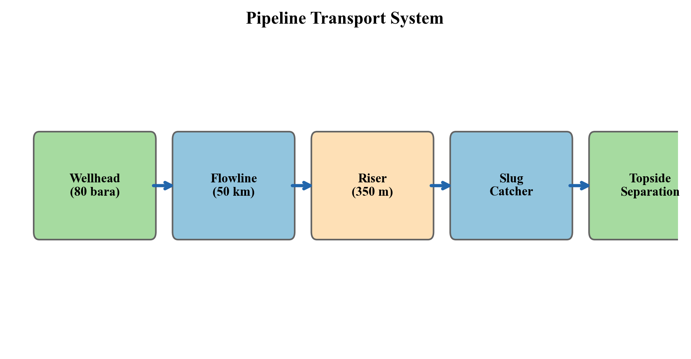
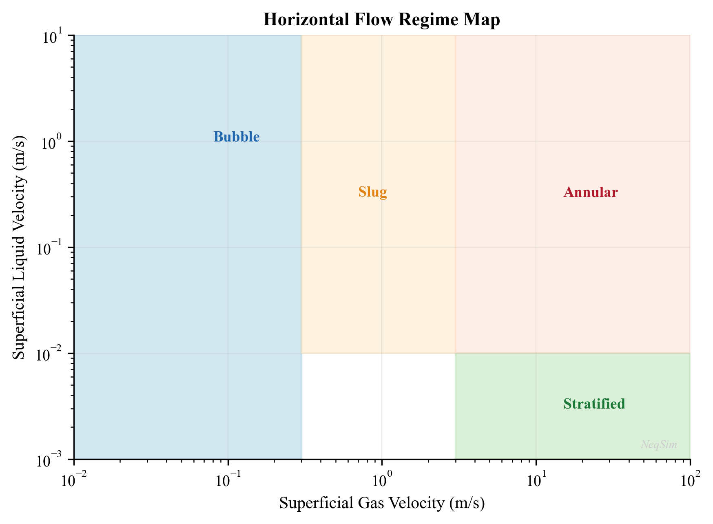
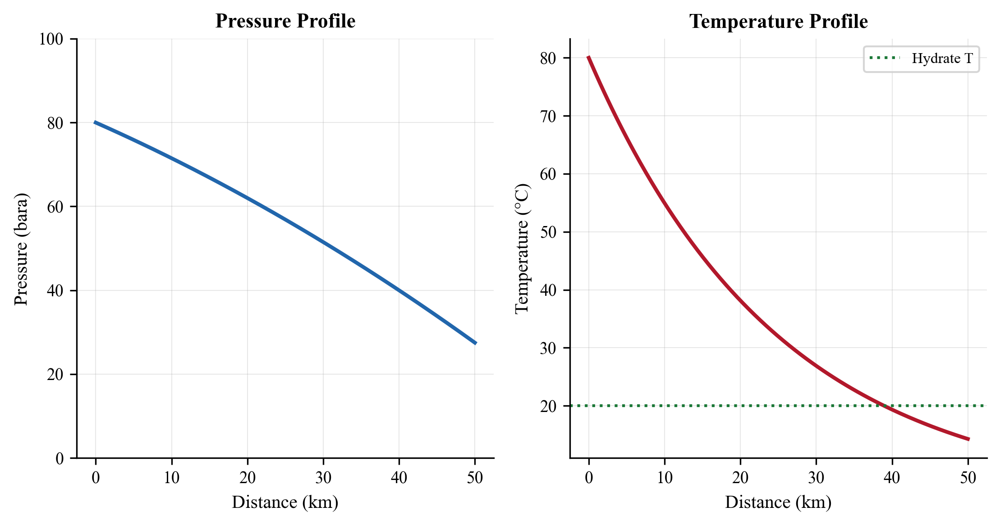
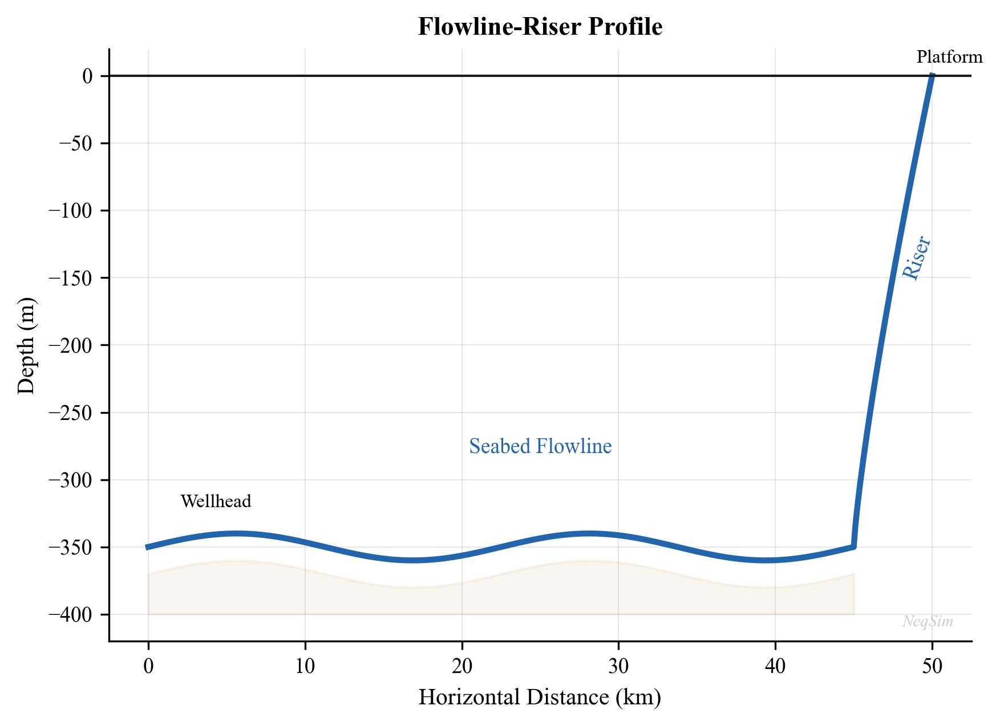
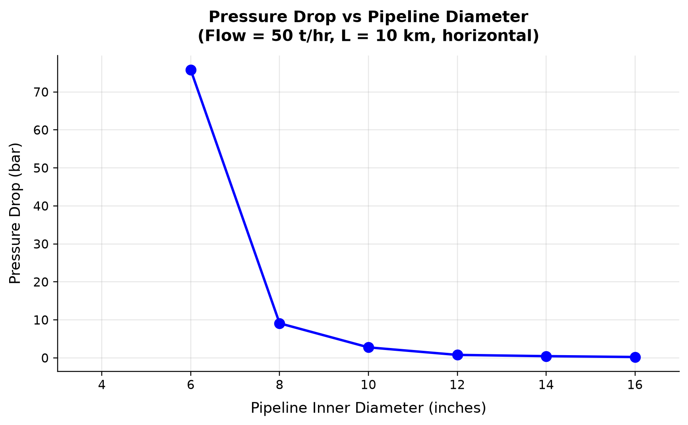
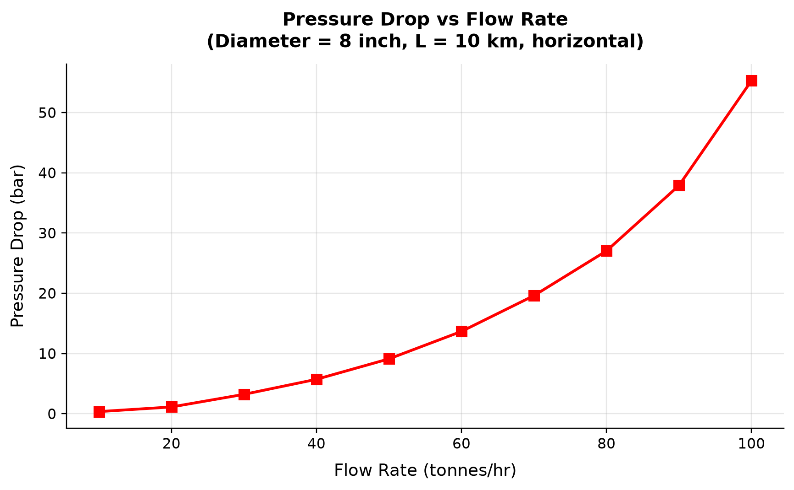
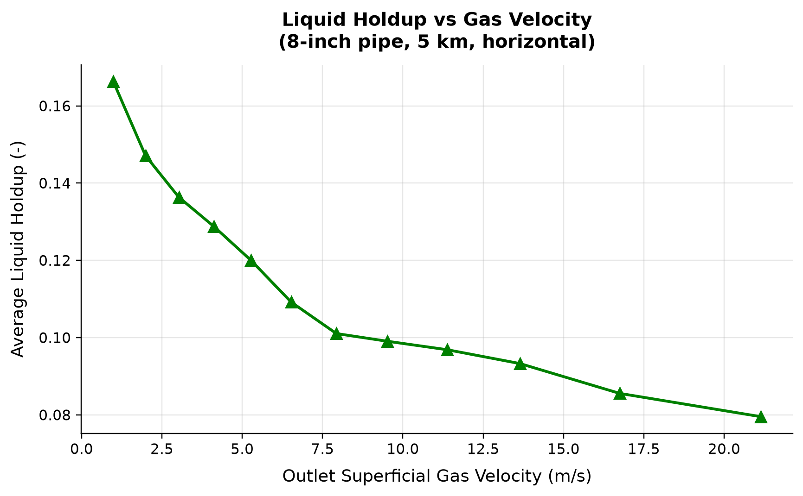
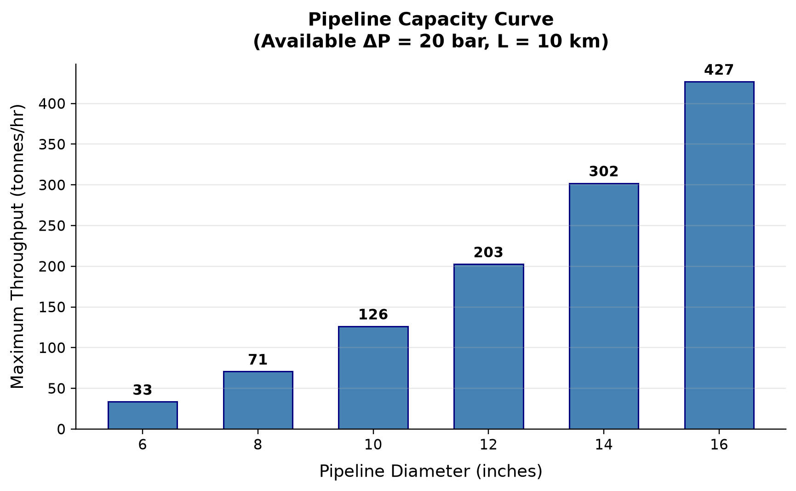

# Flowlines, Risers, and Pipeline Hydraulics

**Running the examples.** Start the source-workspace Python session described in Chapter 1, then run this chapter's Python blocks in reading order. Java blocks form a separate sequence using the same NeqSim build; carry forward objects from preceding Java blocks. The release execution records are in `verification/`; a successful run establishes API compatibility, while physical validation also requires the checks discussed in the text.

<!-- Chapter metadata -->
<!-- Notebooks: ch07_pipeline_hydraulics.ipynb, ch07_multiphase_flow_regimes.ipynb, ch07_riser_slugging.ipynb -->
<!-- Estimated pages: 25 -->


### Hydraulic evidence: geometry, thermal model and feasible points

In the current `PipeBeggsAndBrills` interface, `setLength` takes metres and
`setElevation` is outlet elevation minus inlet elevation, also in metres.
A rising production riser therefore has a positive elevation change. A
20 km flowline requires `setLength(20000.0)`, and geometric consistency requires
$|\Delta z|\le L$. Confusing kilometres and metres can understate friction by
three orders of magnitude and make a riser geometrically impossible.

`PipingRouteBuilder` can translate a line-list route into serial hydraulic
segments. Record the measured length, internal diameter, roughness, elevation,
fitting treatment, heat-transfer coefficient and ambient temperature for each
segment. Recalculate fluid properties along the route and compare pressure and
temperature profiles after refining the segmentation. A final pressure alone
cannot show where acceleration, liquid accumulation or a thermal pinch controls
the result.\cite{neqsim2026update}

A forward calculation fixes inlet pressure and rate. If its pressure becomes
nonphysical before the outlet, that rate is infeasible for the stated boundary
conditions. Preserve it as a failed point in the sensitivity table; never
substitute the last finite pressure. A deliverability calculation instead varies
the rate to meet outlet pressure and requires a bracketed solution. Steady-state
holdup and flow-regime screening do not establish slug frequency, restart
inventory or transient stability.


## Learning Objectives

After reading this chapter, the reader will be able to:

1. Apply the Darcy-Weisbach equation with the Colebrook-White friction factor for single-phase pipe flow
2. Identify multiphase flow regimes (stratified, slug, annular, bubble) and predict their occurrence using flow regime maps
3. Apply the Beggs and Brill correlation for multiphase pressure drop and liquid holdup calculations
4. Calculate steady-state temperature profiles in insulated and uninsulated pipelines
5. Model pipeline pressure and temperature profiles using NeqSim's `PipeBeggsAndBrills` class
6. Analyze riser hydraulics including severe slugging and terrain-induced slugging
7. Size pipelines for single-phase and multiphase flow applications

## 8.1 Introduction

Flowlines, pipelines, and risers are the arteries of the production system, transporting multiphase hydrocarbon fluids from the wellhead to the processing facility and single-phase products from the facility to market. The design and operation of these transport systems directly affect production rate, energy consumption, and flow assurance.

This chapter covers the fundamentals of pipe flow — from single-phase friction factor correlations to the complexity of multiphase flow with its distinct flow regimes, liquid holdup, and terrain effects. The emphasis is on practical pressure drop and temperature calculations using both analytical methods and NeqSim's numerical tools.

Pipeline hydraulics is central to production optimization because:

- **Pressure drop** in flowlines and risers determines the back-pressure on wells, directly affecting production rate
- **Temperature drop** along pipelines governs flow assurance risks (hydrates, wax, slugging)
- **Flow regime** affects pressure drop magnitude, slug loads on equipment, and liquid inventory in the pipeline
- **Pipeline sizing** is a critical design decision — too small wastes pressure energy, too large wastes capital



## 8.2 Single-Phase Pipe Flow

### 8.2.1 The Darcy-Weisbach Equation

The Darcy-Weisbach equation is the fundamental relationship for pressure drop in single-phase pipe flow:

$$
\Delta P = f \cdot \frac{L}{D} \cdot \frac{\rho \, v^2}{2}
$$

where:

- $\Delta P$ is the frictional pressure drop [Pa]
- $f$ is the Darcy friction factor (dimensionless)
- $L$ is the pipe length [m]
- $D$ is the internal diameter [m]
- $\rho$ is the fluid density [kg/m³]
- $v$ is the mean velocity [m/s]

The total pressure drop in an inclined pipe includes a gravitational (elevation) term:

$$
\Delta P_{total} = \Delta P_{friction} + \rho \, g \, \Delta h
$$

where $\Delta h$ is the elevation change [m] (positive upward) and $g$ is gravitational acceleration [m/s²].

### 8.2.2 The Moody Diagram and Friction Factor

The friction factor depends on the Reynolds number and relative pipe roughness:

$$
Re = \frac{\rho \, v \, D}{\mu}
$$

where $\mu$ is the dynamic viscosity [Pa·s].

The flow regime is classified as:

| Reynolds Number | Flow Regime | Friction Factor |
|----------------|-------------|----------------|
| $Re < 2,100$ | Laminar | $f = 64/Re$ |
| $2,100 < Re < 4,000$ | Transitional | Interpolation |
| $Re > 4,000$ | Turbulent | Colebrook-White equation |

### 8.2.3 The Colebrook-White Equation

For turbulent flow, the Colebrook-White equation provides the friction factor:

$$
\frac{1}{\sqrt{f}} = -2.0 \log_{10}\left(\frac{\epsilon/D}{3.7} + \frac{2.51}{Re \sqrt{f}}\right)
$$

where $\epsilon$ is the absolute pipe roughness [m]. This implicit equation must be solved iteratively. Common explicit approximations include:

**Swamee-Jain (1976):**

$$
f = \frac{0.25}{\left[\log_{10}\left(\frac{\epsilon/D}{3.7} + \frac{5.74}{Re^{0.9}}\right)\right]^2}
$$

**Haaland (1983):**

$$
\frac{1}{\sqrt{f}} = -1.8 \log_{10}\left[\left(\frac{\epsilon/D}{3.7}\right)^{1.11} + \frac{6.9}{Re}\right]
$$

Typical absolute roughness values:

| Pipe Material | Roughness $\epsilon$ (mm) |
|--------------|--------------------------|
| New commercial steel | 0.045 |
| Cleaned carbon steel | 0.05 |
| Moderately corroded | 0.15–0.30 |
| Concrete lined | 0.30–3.0 |
| Flexible pipe (smooth bore) | 0.005 |

### 8.2.4 Single-Phase Pipeline Sizing Example

```python
import jpype
jneqsim = jpype.JPackage("neqsim")
import math

# Define dry gas for export pipeline
gas = jneqsim.thermo.system.SystemSrkEos(273.15 + 25.0, 120.0)
gas.addComponent("methane", 90.0)
gas.addComponent("ethane", 5.0)
gas.addComponent("propane", 2.0)
gas.addComponent("i-butane", 0.5)
gas.addComponent("n-butane", 0.8)
gas.addComponent("CO2", 1.0)
gas.addComponent("nitrogen", 0.7)
gas.setMixingRule("classic")

# Flash to get properties
ThermodynamicOperations = jneqsim.thermodynamicoperations.ThermodynamicOperations
ops = ThermodynamicOperations(gas)
ops.TPflash()
gas.initProperties()

# Gas properties at pipeline conditions
rho = gas.getDensity("kg/m3")
mu = gas.getPhase("gas").getViscosity("kg/msec")
print(f"Gas density: {rho:.2f} kg/m3")
print(f"Gas viscosity: {mu:.6f} Pa.s")

# Pipeline parameters
Q = 15.0e6  # 15 MSm3/day
Q_actual = Q / (24 * 3600) * (1.01325 / 120.0) * (273.15 + 25.0) / 273.15  # actual m3/s
D = 0.762  # 30-inch pipe, ~762 mm ID
L = 150000.0  # 150 km
epsilon = 0.045e-3  # new steel, m

A = math.pi * D**2 / 4.0
v = Q_actual / A
Re = rho * v * D / mu

# Swamee-Jain friction factor
f = 0.25 / (math.log10(epsilon / D / 3.7 + 5.74 / Re**0.9))**2

# Pressure drop
dP = f * L / D * rho * v**2 / 2.0
dP_bar = dP / 1.0e5

print(f"Velocity: {v:.2f} m/s")
print(f"Reynolds number: {Re:.0f}")
print(f"Friction factor: {f:.6f}")
print(f"Pressure drop: {dP_bar:.1f} bar over {L/1000:.0f} km")
```

## 8.3 Multiphase Flow Fundamentals

### 8.3.1 Why Multiphase Flow Is Different

In most offshore production systems, the fluid flowing through flowlines and risers is a multiphase mixture of gas, oil, and water (and sometimes sand). Multiphase flow is fundamentally more complex than single-phase flow because:

- **Phase distribution** — the phases do not flow uniformly; they distribute according to flow regime
- **Slip** — gas typically travels faster than liquid due to buoyancy and drag differences
- **Liquid holdup** — the fraction of the pipe occupied by liquid differs from the input liquid fraction
- **Pressure drop mechanisms** — friction, gravity, and acceleration all depend on the phase distribution
- **Dynamic behavior** — multiphase flow can be inherently transient (slug flow)

### 8.3.2 Key Definitions

**Superficial velocity** is the velocity each phase would have if it occupied the entire pipe cross-section:

$$
v_{SG} = \frac{Q_G}{A}, \quad v_{SL} = \frac{Q_L}{A}
$$

where $Q_G$ and $Q_L$ are the actual volumetric flow rates of gas and liquid at local conditions.

**Mixture velocity:**

$$
v_m = v_{SG} + v_{SL}
$$

**No-slip liquid holdup** (input liquid fraction):

$$
\lambda_L = \frac{v_{SL}}{v_m}
$$

**Actual liquid holdup** $H_L$ is the fraction of the pipe cross-section occupied by liquid. Due to slip, $H_L > \lambda_L$ in most cases (gas flows faster, so liquid accumulates).

**Gas void fraction:**

$$
\alpha = 1 - H_L
$$

### 8.3.3 Multiphase Flow Regimes

The distribution of phases in the pipe depends on gas and liquid velocities, fluid properties, and pipe geometry. The four principal flow regimes in horizontal pipe are:

**Stratified flow** — at low gas and liquid velocities, the liquid settles to the bottom of the pipe and the gas flows above. The interface may be smooth (stratified smooth) or wavy (stratified wavy).

**Slug flow** — at moderate velocities, intermittent slugs of liquid bridge the entire pipe cross-section, separated by gas pockets (Taylor bubbles). Slug flow produces cyclic pressure and flow rate fluctuations.

**Annular flow** — at high gas velocities, the liquid forms a thin film on the pipe wall and the gas flows through the core, carrying entrained liquid droplets.

**Bubble (dispersed) flow** — at high liquid velocities and low gas velocities, small gas bubbles are dispersed in the liquid phase.

In vertical upward flow, the regimes are:

- **Bubble flow** — small bubbles rise through the liquid
- **Slug flow** — large Taylor bubbles separated by liquid slugs
- **Churn flow** — chaotic oscillatory regime between slug and annular
- **Annular flow** — liquid film on walls, gas core with droplets



### 8.3.4 Flow Regime Maps

Flow regime maps plot the boundaries between regimes as functions of superficial gas and liquid velocities. The most widely used maps are:

**Taitel and Dukler (1976)** for horizontal flow — uses dimensionless groups based on the equilibrium stratified film model:

$$
X^2 = \frac{(dP/dx)_{SL}}{(dP/dx)_{SG}} = \frac{f_{SL} \, \rho_L \, v_{SL}^2}{f_{SG} \, \rho_G \, v_{SG}^2}
$$

where $X$ is the Lockhart-Martinelli parameter.

**Taitel, Barnea, and Dukler (1980)** for vertical flow — transitions depend on the Kutateladze number and dimensionless gas velocity.

| Transition | Horizontal Criterion | Vertical Criterion |
|-----------|---------------------|-------------------|
| Stratified → Slug | Kelvin-Helmholtz instability | N/A |
| Slug → Annular | High Froude number ($Fr_G > 1.5$) | $v_{SG} > 3.1 \sqrt{\frac{\sigma g (\rho_L - \rho_G)}{\rho_G^2}}^{0.25}$ |
| Bubble → Slug | Void fraction > 0.25 | Void fraction > 0.25 |
| Slug → Dispersed bubble | Turbulent breakup dominates | High liquid rate |

## 8.4 Pressure Drop Correlations for Multiphase Flow

### 8.4.1 The Beggs and Brill Correlation

The Beggs and Brill (1973) correlation is one of the most widely used methods for multiphase pressure drop in inclined pipes. It was developed from experimental data covering all inclination angles from horizontal to vertical. The total pressure gradient is:

$$
\frac{dP}{dL} = \frac{f_{tp} \, \rho_n \, v_m^2 / (2D)}{1 - \rho_s \, v_m \, v_{SG} / P} + \rho_s \, g \sin\theta
$$

where:

- $f_{tp}$ is the two-phase friction factor
- $\rho_n = \rho_L \lambda_L + \rho_G (1 - \lambda_L)$ is the no-slip mixture density [kg/m³]
- $\rho_s = \rho_L H_L + \rho_G (1 - H_L)$ is the slip (actual) mixture density [kg/m³]
- $v_m$ is the mixture velocity [m/s]
- $\theta$ is the pipe inclination angle from horizontal [rad]
- $P$ is the absolute pressure [Pa]

The correlation proceeds in four steps:

**Step 1: Determine the flow regime** using the Froude mixture number:

$$
Fr_m = \frac{v_m^2}{g \, D}
$$

and the no-slip liquid holdup $\lambda_L$. The transitions are defined by correlations:

$$
L_1 = 316 \lambda_L^{0.302}, \quad L_2 = 0.0009252 \lambda_L^{-2.4684}
$$

$$
L_3 = 0.10 \lambda_L^{-1.4516}, \quad L_4 = 0.5 \lambda_L^{-6.738}
$$

**Step 2: Calculate the horizontal liquid holdup** $H_L(0)$ using regime-specific correlations:

| Regime | Holdup Correlation |
|--------|-------------------|
| Segregated | $H_L(0) = \frac{0.98 \lambda_L^{0.4846}}{Fr_m^{0.0868}}$ |
| Intermittent | $H_L(0) = \frac{0.845 \lambda_L^{0.5351}}{Fr_m^{0.0173}}$ |
| Distributed | $H_L(0) = \frac{1.065 \lambda_L^{0.5824}}{Fr_m^{0.0609}}$ |

**Step 3: Correct for inclination** using the Payne et al. (1979) correction:

$$
H_L(\theta) = H_L(0) \cdot \psi
$$

where $\psi$ depends on the inclination angle, flow regime, and the no-slip liquid velocity number:

$$
N_{LV} = v_{SL} \left(\frac{\rho_L}{g \sigma}\right)^{0.25}
$$

**Step 4: Calculate the two-phase friction factor:**

$$
f_{tp} = f_n \cdot e^S
$$

where $f_n$ is the no-slip friction factor and $S$ is a correction factor that accounts for the roughness of the gas-liquid interface.

### 8.4.2 The Mukherjee and Brill Correlation

Mukherjee and Brill (1985) developed an alternative correlation that directly correlates liquid holdup with dimensionless groups:

$$
H_L = \exp\left(a_1 + a_2 \sin\theta + a_3 \sin^2\theta + a_4 N_L^2\right)
$$

where the coefficients $a_1$ through $a_4$ depend on the flow regime and the liquid viscosity number $N_L$.

### 8.4.3 Mechanistic Models

Modern pipeline simulators increasingly use mechanistic models that predict the flow regime from first principles (conservation of mass, momentum, and energy for each phase) rather than empirical correlations. Notable mechanistic models include:

- **OLGA** — the industry-standard dynamic multiphase flow simulator
- **LedaFlow** — a newer model based on the slug tracking concept
- **Zhang et al. (2003)** — unified mechanistic model for all pipe inclinations

The advantage of mechanistic models is their broader range of applicability and improved prediction outside the experimental data range used to develop empirical correlations.

### 8.4.4 Comparison of Correlations

| Correlation | Year | Inclination Range | Flow Regimes | Accuracy |
|------------|------|-------------------|-------------|----------|
| Beggs & Brill | 1973 | All angles | All | ±20–30% for pressure drop |
| Mukherjee & Brill | 1985 | All angles | All | ±15–25% |
| Duns & Ros | 1963 | Vertical only | All | ±20% for vertical |
| Hagedorn & Brown | 1965 | Vertical only | All (treated as one) | ±15% |
| OLGA (mechanistic) | 1983+ | All angles | Mechanistic | ±10–15% |

## 8.5 Multiphase Pipeline Modeling with NeqSim

### 8.5.1 The PipeBeggsAndBrills Class

NeqSim implements the Beggs and Brill correlation through the `PipeBeggsAndBrills` class. This class calculates:

- Pressure profile along the pipeline
- Temperature profile (with heat transfer to surroundings)
- Liquid holdup profile
- Flow regime at each calculation increment

```python
import jpype
jneqsim = jpype.JPackage("neqsim")

# Define a typical oil-gas-water production fluid
fluid = jneqsim.thermo.system.SystemSrkEos(273.15 + 75.0, 120.0)
fluid.addComponent("nitrogen", 0.5)
fluid.addComponent("CO2", 2.5)
fluid.addComponent("methane", 55.0)
fluid.addComponent("ethane", 7.0)
fluid.addComponent("propane", 5.0)
fluid.addComponent("i-butane", 1.5)
fluid.addComponent("n-butane", 3.0)
fluid.addComponent("i-pentane", 1.5)
fluid.addComponent("n-pentane", 2.0)
fluid.addComponent("n-hexane", 3.0)
fluid.addComponent("n-heptane", 5.0)
fluid.addComponent("n-octane", 5.0)
fluid.addComponent("n-nonane", 3.0)
fluid.addComponent("water", 6.0)
fluid.setMixingRule("classic")
fluid.setMultiPhaseCheck(True)

# Create inlet stream
Stream = jneqsim.process.equipment.stream.Stream
inlet = Stream("Pipeline Inlet", fluid)
inlet.setFlowRate(100000.0, "kg/hr")
inlet.setTemperature(75.0, "C")
inlet.setPressure(120.0, "bara")

# Create pipeline using Beggs and Brill
PipeBeggsAndBrills = jneqsim.process.equipment.pipeline.PipeBeggsAndBrills
pipeline = PipeBeggsAndBrills("Production Flowline", inlet)
pipeline.setPipeWallRoughness(5.0e-5)
pipeline.setLength(20000.0)            # 20 km
pipeline.setElevation(0.0)          # horizontal
pipeline.setDiameter(0.3048)        # 12-inch (0.3048 m)
pipeline.setNumberOfIncrements(100)
pipeline.setConstantSurfaceTemperature(277.15) # 4°C seabed

# Build and run
ProcessSystem = jneqsim.process.processmodel.ProcessSystem
process = ProcessSystem()
process.add(inlet)
process.add(pipeline)
process.run()

# Read results
outlet_P = pipeline.getOutletStream().getPressure("bara")
outlet_T = pipeline.getOutletStream().getTemperature("C")
print(f"Outlet pressure:    {outlet_P:.1f} bara")
print(f"Outlet temperature: {outlet_T:.1f} °C")
print(f"Pressure drop:      {120.0 - outlet_P:.1f} bar")
print(f"Temperature drop:   {75.0 - outlet_T:.1f} °C")
```

### 8.5.2 Pressure and Temperature Profiles

To extract the full pressure and temperature profile along the pipeline, NeqSim divides the pipeline into increments (set by `setNumberOfIncrements`). Each increment performs a local flash calculation and pressure/temperature step:

```python
import jpype
jneqsim = jpype.JPackage("neqsim")

# Use the same fluid and pipeline setup as Section 8.5.1
fluid = jneqsim.thermo.system.SystemSrkEos(273.15 + 75.0, 120.0)
fluid.addComponent("methane", 60.0)
fluid.addComponent("ethane", 7.0)
fluid.addComponent("propane", 5.0)
fluid.addComponent("n-butane", 3.0)
fluid.addComponent("n-pentane", 2.0)
fluid.addComponent("n-hexane", 3.0)
fluid.addComponent("n-heptane", 6.0)
fluid.addComponent("n-octane", 5.0)
fluid.addComponent("water", 9.0)
fluid.setMixingRule("classic")
fluid.setMultiPhaseCheck(True)

Stream = jneqsim.process.equipment.stream.Stream
PipeBeggsAndBrills = jneqsim.process.equipment.pipeline.PipeBeggsAndBrills
ProcessSystem = jneqsim.process.processmodel.ProcessSystem

# Compare different pipe diameters
diameters_inch = [8, 10, 12, 14]
diameters_m = [d * 0.0254 for d in diameters_inch]

for d_inch, d_m in zip(diameters_inch, diameters_m):
    test_fluid = fluid.clone()
    feed = Stream("Feed", test_fluid)
    feed.setFlowRate(80000.0, "kg/hr")
    feed.setTemperature(75.0, "C")
    feed.setPressure(120.0, "bara")

    pipe = PipeBeggsAndBrills("Pipeline", feed)
    pipe.setPipeWallRoughness(5.0e-5)
    pipe.setLength(20000.0)
    pipe.setElevation(0.0)
    pipe.setDiameter(d_m)
    pipe.setNumberOfIncrements(80)
    pipe.setConstantSurfaceTemperature(277.15)

    proc = ProcessSystem()
    proc.add(feed)
    proc.add(pipe)
    proc.run()

    out_P = pipe.getOutletStream().getPressure("bara")
    out_T = pipe.getOutletStream().getTemperature("C")
    dP = 120.0 - out_P
    print(f"Diameter: {d_inch}\"  dP: {dP:.1f} bar  Outlet T: {out_T:.1f} °C")
```



### 8.5.3 Effect of Flow Rate on Pressure Drop

The relationship between flow rate and pressure drop is nonlinear. At low rates, gravitational effects dominate in inclined pipes. At high rates, friction dominates:

```python
import jpype
jneqsim = jpype.JPackage("neqsim")

fluid = jneqsim.thermo.system.SystemSrkEos(273.15 + 70.0, 100.0)
fluid.addComponent("methane", 60.0)
fluid.addComponent("ethane", 7.0)
fluid.addComponent("propane", 5.0)
fluid.addComponent("n-butane", 3.0)
fluid.addComponent("n-hexane", 4.0)
fluid.addComponent("n-heptane", 8.0)
fluid.addComponent("n-octane", 5.0)
fluid.addComponent("water", 8.0)
fluid.setMixingRule("classic")
fluid.setMultiPhaseCheck(True)

Stream = jneqsim.process.equipment.stream.Stream
PipeBeggsAndBrills = jneqsim.process.equipment.pipeline.PipeBeggsAndBrills
ProcessSystem = jneqsim.process.processmodel.ProcessSystem

flow_rates = [30000, 50000, 80000, 100000, 120000, 150000]  # kg/hr
print(f"{'Flow Rate (kg/hr)':>18} {'dP (bar)':>10} {'Outlet T (°C)':>14}")

for rate in flow_rates:
    test_fluid = fluid.clone()
    feed = Stream("Feed", test_fluid)
    feed.setFlowRate(float(rate), "kg/hr")
    feed.setTemperature(70.0, "C")
    feed.setPressure(100.0, "bara")

    pipe = PipeBeggsAndBrills("Flowline", feed)
    pipe.setPipeWallRoughness(5.0e-5)
    pipe.setLength(15000.0)
    pipe.setElevation(0.0)
    pipe.setDiameter(0.254)
    pipe.setNumberOfIncrements(60)
    pipe.setConstantSurfaceTemperature(277.15)

    proc = ProcessSystem()
    proc.add(feed)
    proc.add(pipe)
    proc.run()

    out_P = pipe.getOutletStream().getPressure("bara")
    out_T = pipe.getOutletStream().getTemperature("C")
    print(f"{rate:>18} {100.0 - out_P:>10.1f} {out_T:>14.1f}")
```

## 8.6 Elevation Effects and Terrain

### 8.6.1 Gravitational Pressure Component

In inclined pipes, the gravitational pressure component can be the dominant contribution to total pressure drop:

$$
\left(\frac{dP}{dL}\right)_{gravity} = \rho_s \, g \sin\theta = [\rho_L H_L + \rho_G (1 - H_L)] \, g \sin\theta
$$

For a riser in deepwater, the hydrostatic head of the liquid holdup creates a substantial pressure increase from the riser base to the topside. For example, with $H_L = 0.3$ and typical fluid densities ($\rho_L = 700$ kg/m³, $\rho_G = 80$ kg/m³):

$$
\rho_s = 700 \times 0.3 + 80 \times 0.7 = 266 \text{ kg/m}^3
$$

For a 1,000 m riser: $\Delta P_{hydrostatic} = 266 \times 9.81 \times 1000 / 10^5 = 26.1$ bar.

### 8.6.2 Terrain-Induced Slugging

Undulating terrain in subsea flowlines creates conditions for terrain-induced slugging:

1. Liquid accumulates in low points (valleys)
2. Gas pressure builds upstream of the liquid plug
3. When the gas pressure exceeds the hydrostatic head of the liquid, the gas blows through
4. The liquid plug accelerates as a slug toward the next low point or the riser
5. The cycle repeats

The severity of terrain slugging depends on:

- Depth of the valleys relative to pipe diameter
- Gas-liquid ratio
- Flow velocity (worse at low rates)
- Fluid properties

### 8.6.3 Modeling Elevation Effects in NeqSim

NeqSim's `PipeBeggsAndBrills` class handles elevation through the `setElevation` parameter:

```python
import jpype
jneqsim = jpype.JPackage("neqsim")

# Define fluid
fluid = jneqsim.thermo.system.SystemSrkEos(273.15 + 50.0, 80.0)
fluid.addComponent("methane", 65.0)
fluid.addComponent("ethane", 8.0)
fluid.addComponent("propane", 5.0)
fluid.addComponent("n-butane", 3.0)
fluid.addComponent("n-hexane", 4.0)
fluid.addComponent("n-heptane", 6.0)
fluid.addComponent("n-octane", 4.0)
fluid.addComponent("water", 5.0)
fluid.setMixingRule("classic")
fluid.setMultiPhaseCheck(True)

Stream = jneqsim.process.equipment.stream.Stream
PipeBeggsAndBrills = jneqsim.process.equipment.pipeline.PipeBeggsAndBrills
ProcessSystem = jneqsim.process.processmodel.ProcessSystem

# Model riser (800 m water depth)
inlet = Stream("Riser Base", fluid)
inlet.setFlowRate(60000.0, "kg/hr")
inlet.setTemperature(50.0, "C")
inlet.setPressure(80.0, "bara")

riser = PipeBeggsAndBrills("Production Riser", inlet)
riser.setPipeWallRoughness(5.0e-5)
riser.setLength(1000.0)            # ~1 km total length (catenary)
riser.setElevation(800.0)       # 800 m vertical rise
riser.setDiameter(0.254)        # 10-inch
riser.setNumberOfIncrements(40)
riser.setConstantSurfaceTemperature(280.15)

process = ProcessSystem()
process.add(inlet)
process.add(riser)
process.run()

topside_P = riser.getOutletStream().getPressure("bara")
topside_T = riser.getOutletStream().getTemperature("C")
print(f"Topside arrival pressure: {topside_P:.1f} bara")
print(f"Topside arrival temperature: {topside_T:.1f} °C")
print(f"Total riser dP: {80.0 - topside_P:.1f} bar")
```

### 8.6.4 Hilly Terrain, Slack Flow, and Pigging Considerations

Onshore pipelines and some seabed flowlines traverse undulating terrain with alternating uphill and downhill sections. This creates unique hydraulic challenges beyond simple elevation effects:

**Liquid accumulation in low points:** In gas-dominated systems, liquid (condensate or water) accumulates in topographic low points (valleys). At low flow rates, the gas velocity may be insufficient to sweep this liquid up the next incline. The accumulated liquid increases the effective hydrostatic head and reduces throughput capacity. Over time, liquid holdup can grow until the pipeline becomes "waterlogged."

**Slack flow (gravity-dominated flow):** In downhill sections of liquid-dominated pipelines, the hydrostatic pressure gradient can exceed the frictional pressure gradient, creating a situation where the liquid accelerates due to gravity. If the pipeline is not full (gas pocket at the top of the downslope), "slack flow" occurs — the liquid separates from the upper wall and free-falls. This produces:
- Low pressure at the top of the hill (possibly below bubble point, causing gas breakout)
- Unpredictable two-phase flow regime transitions
- Surge loading at the bottom of the downslope

The onset of slack flow depends on the terrain angle and the ratio of frictional to gravitational pressure gradient. For a downhill section at angle $\theta$:

$$
\text{Slack flow if:} \quad \rho_L g \sin\theta > \frac{f \rho_L v^2}{2D}
$$

**Pigging in hilly terrain:** Pigs traveling through undulating terrain accumulate liquid ahead of them in each downhill section. This creates progressively larger liquid slugs as the pig advances. The total slug volume at the pipeline outlet can be estimated as:

$$
V_{slug,total} = \sum_{i=1}^{N_{valleys}} H_{L,i} \cdot A \cdot L_{downhill,i}
$$

where $N_{valleys}$ is the number of low spots, $H_{L,i}$ is the average holdup in each section, and $L_{downhill,i}$ is the length of each downhill section. Pipeline profile data must be analyzed to estimate pig-generated slug volumes for slug catcher sizing.

**Terrain slugging mitigation:** Strategies include:
- Maintaining velocity above liquid sweep threshold
- Regular pigging schedules to limit liquid accumulation
- Slug catchers at the pipeline outlet sized for terrain slugs
- Pipeline profile optimization during route selection (minimize elevation changes)

## 8.7 Heat Transfer in Pipelines

### 8.7.1 Overall Heat Transfer Coefficient

The rate of heat loss from a pipeline to the surroundings is characterized by the overall heat transfer coefficient $U$:

$$
q = U \cdot A \cdot (T_{fluid} - T_{ambient})
$$

where:

- $q$ is the heat loss rate [W]
- $U$ is the overall heat transfer coefficient [W/m²·K]
- $A$ is the heat transfer area [m²]
- $T_{fluid}$ is the bulk fluid temperature [K]
- $T_{ambient}$ is the ambient (seabed or air) temperature [K]

For a pipe with multiple layers (steel wall, insulation, coating, concrete), the overall $U$-value is:

$$
\frac{1}{U \cdot D_o} = \frac{1}{h_i \cdot D_i} + \sum_{j=1}^{n} \frac{\ln(D_{j+1}/D_j)}{2 k_j} + \frac{1}{h_o \cdot D_o}
$$

where:

- $h_i$ is the internal film coefficient [W/m²·K]
- $D_i$ is the internal diameter [m]
- $D_o$ is the outer diameter [m]
- $k_j$ is the thermal conductivity of layer $j$ [W/m·K]
- $h_o$ is the external film coefficient [W/m²·K]

### 8.7.2 Typical U-Values

| Configuration | U-value (W/m²·K) | Application |
|--------------|-------------------|-------------|
| Bare pipe on seabed | 20–50 | Short tiebacks, warm fluids |
| Concrete coated | 8–15 | Moderate insulation |
| Wet insulation (syntactic foam) | 2–5 | Standard subsea insulation |
| Pipe-in-pipe (PiP) | 1–3 | Long tiebacks, cold seabed |
| Electrically heated (DEH/ETH) | Active heating | Critical flow assurance cases |
| Buried pipeline | 3–8 | Depends on burial depth, soil |

### 8.7.3 Steady-State Temperature Profile

For a pipeline with constant $U$-value and ambient temperature, the steady-state temperature profile is:

$$
T(x) = T_{amb} + (T_{in} - T_{amb}) \cdot \exp\left(-\frac{\pi \cdot D_o \cdot U \cdot x}{\dot{m} \cdot C_p}\right)
$$

The **arrival temperature** at the end of a pipeline of length $L$ is:

$$
T_{arrival} = T_{amb} + (T_{in} - T_{amb}) \cdot \exp\left(-\frac{\pi \cdot D_o \cdot U \cdot L}{\dot{m} \cdot C_p}\right)
$$

Key observations:

- Arrival temperature increases with flow rate (less time for heat loss)
- Arrival temperature decreases with pipe length and $U$-value
- At very high flow rates, $T_{arrival} \to T_{in}$ (adiabatic limit)
- At very low flow rates, $T_{arrival} \to T_{amb}$ (thermal equilibrium)

### 8.7.4 Joule-Thomson Effect

In gas-dominated systems, the Joule-Thomson (JT) effect causes the gas temperature to change as pressure drops. For most natural gases at typical pipeline conditions, the JT coefficient is positive — meaning the gas cools as pressure decreases:

$$
\mu_{JT} = \left(\frac{\partial T}{\partial P}\right)_H \approx 3 \text{–} 6 \text{ °C/100 bar for natural gas}
$$

This JT cooling compounds the heat loss to the surroundings and can be significant in long high-pressure gas pipelines. NeqSim automatically accounts for the JT effect in its pipeline calculations through rigorous enthalpy balance.

### 8.7.5 Insulation Types and Burial Effects

The selection of insulation system depends on the required $U$-value, water depth, installation method, and design life. The principal subsea insulation technologies are:

**Polyurethane (PU) foam:** Applied as a multi-layer external coating (40–120 mm thick). PU foam has low thermal conductivity ($k \approx 0.03$–0.04 W/m·K) and is cost-effective for moderate insulation requirements ($U \approx 3$–8 W/m²·K). Depth-limited to approximately 1,000 m before hydrostatic compression degrades the foam.

**Syntactic foam:** Glass or polymer microspheres in an epoxy matrix. Higher density and compressive strength than PU foam, suitable for deepwater applications. Thermal conductivity $k \approx 0.10$–0.15 W/m·K, giving $U \approx 2$–5 W/m²·K.

**Pipe-in-pipe (PiP):** An inner production pipe is surrounded by insulation (aerogel, microporous silica, or vacuum) within an outer carrier pipe. Achieves the lowest passive $U$-values ($U \approx 0.5$–2.0 W/m²·K) but at significantly higher cost. Used for long tiebacks where arrival temperature is critical.

**Direct electrical heating (DEH):** Electric current is passed through the pipe wall (or a heating cable), actively maintaining the fluid temperature above critical thresholds (hydrate or wax). Used during shutdown and restart rather than steady-state production.

**Burial:** Trenching and backfilling the pipeline provides thermal insulation from the soil. The effective $U$-value depends on burial depth $H_b$, soil thermal conductivity $k_s$, and pipe diameter:

$$
U_{burial} = \frac{2 k_s}{D \ln\left(\frac{2 H_b}{D} + \sqrt{\left(\frac{2 H_b}{D}\right)^2 - 1}\right)}
$$

For typical North Sea clay ($k_s \approx 1.5$ W/m·K) with 1 m burial depth, the burial $U$-value is approximately 3–6 W/m²·K. Burial also provides mechanical protection and on-bottom stability.

The steady-state temperature profile for a pipeline with constant $U$ and ambient temperature is:

$$
T(x) = T_{amb} + (T_{inlet} - T_{amb}) \exp\left(-\frac{\pi D U x}{\dot{m} c_p}\right)
$$

This exponential decay means that the first few kilometers of pipeline experience the most rapid cooling. The thermal "time constant" $\tau = \dot{m} c_p / (\pi D U)$ gives the characteristic length over which the temperature drops to $1/e$ of the initial excess above ambient. For a 10-inch pipe with $U = 5$ W/m²·K carrying 80,000 kg/hr of oil ($c_p \approx 2200$ J/kg·K), $\tau \approx 31$ km.

## 8.8 Pipeline Sizing

### 8.8.1 Sizing Criteria

Pipeline sizing balances capital cost (larger diameter = higher cost) against operating cost (larger diameter = lower pressure drop = lower compression energy):

| Criterion | Single-Phase Gas | Single-Phase Oil | Multiphase |
|-----------|-----------------|-----------------|------------|
| Erosion velocity | $v_e = \frac{C}{\sqrt{\rho}}$, $C = 100$–$200$ | N/A | $v_e = \frac{C}{\sqrt{\rho_m}}$ |
| Maximum velocity | 15–25 m/s | 3–5 m/s | Varies by regime |
| Pressure drop | 1–3 bar/10km (transport) | 0.5–2 bar/10km | 2–5 bar/10km |
| Minimum velocity | Avoid liquid accumulation | Avoid wax/sand settling | Avoid severe slugging |

The API RP 14E erosional velocity limit is widely used:

$$
v_e = \frac{C}{\sqrt{\rho_m}}
$$

where $C$ is typically 100–150 (conservative) or up to 200 (with erosion-resistant materials), and $\rho_m$ is the mixture density in lb/ft³.

### 8.8.3 Erosional Velocity in Detail

The API RP 14E erosional velocity formula is widely used for preliminary pipeline and piping design:

$$
v_{erosional} = \frac{C}{\sqrt{\rho_m}}
$$

where $\rho_m$ is the gas-liquid mixture density at flowing conditions [lb/ft³] and $C$ is an empirical constant. The standard recommends $C = 100$ for continuous service, but the appropriate value depends on several factors:

| Condition | Recommended $C$ Factor |
|-----------|-----------------------|
| Continuous service, carbon steel, no sand | 100–125 |
| Intermittent service, carbon steel | 125–150 |
| Corrosion-resistant alloy (CRA) pipe | 150–200 |
| Sand-producing wells | 50–75 (reduce by 50%) |
| Inhibited lines with clean fluids | 150–175 |

It is important to note that the API RP 14E formula is empirical and applies primarily to erosion by liquid droplets in gas flow. For solid particle (sand) erosion, more rigorous models such as DNV RP O501 should be used, which account for sand rate, particle size, impact angle, and material hardness.

### 8.8.4 Economic Pipeline Diameter Optimization

The optimal pipeline diameter balances capital expenditure (CAPEX) — which increases with diameter — against operating expenditure (OPEX) — which decreases with diameter because pressure drop and compression/pumping energy decrease.

The CAPEX of a pipeline is approximately proportional to $D^{1.2}$ to $D^{1.5}$ (accounting for steel weight, coating, installation):

$$
CAPEX \propto D^{1.3} \cdot L
$$

The compression or pumping energy cost is proportional to the pressure drop, which scales approximately as $D^{-5}$ for single-phase turbulent flow (from Darcy-Weisbach):

$$
OPEX_{energy} \propto \Delta P \propto \frac{f L \rho v^2}{2D} \propto \frac{Q^2}{D^5}
$$

The total annual cost (annualized CAPEX + OPEX) has a minimum at the economic optimum diameter. In practice, the selected diameter must also satisfy:
- Erosional velocity limit (upper bound on velocity)
- Minimum velocity for solids/liquid transport (lower bound)
- Available pipe sizes (standard API sizes)
- Arrival pressure constraint
- Arrival temperature constraint (flow assurance)

The economic optimum velocity for different fluid types:

| Fluid Type | Economic Velocity Range |
|-----------|------------------------|
| Dry gas | 10–20 m/s |
| Wet gas / condensate | 8–15 m/s |
| Single-phase oil | 1–3 m/s |
| Multiphase (oil + gas) | 3–10 m/s |
| Water injection | 1.5–3 m/s |

### 8.8.5 Sizing Procedure with NeqSim

```python
import jpype
jneqsim = jpype.JPackage("neqsim")

# Define fluid
fluid = jneqsim.thermo.system.SystemSrkEos(273.15 + 65.0, 100.0)
fluid.addComponent("methane", 60.0)
fluid.addComponent("ethane", 8.0)
fluid.addComponent("propane", 5.0)
fluid.addComponent("n-butane", 3.0)
fluid.addComponent("n-pentane", 2.0)
fluid.addComponent("n-heptane", 8.0)
fluid.addComponent("n-octane", 6.0)
fluid.addComponent("water", 8.0)
fluid.setMixingRule("classic")
fluid.setMultiPhaseCheck(True)

Stream = jneqsim.process.equipment.stream.Stream
PipeBeggsAndBrills = jneqsim.process.equipment.pipeline.PipeBeggsAndBrills
ProcessSystem = jneqsim.process.processmodel.ProcessSystem

# Design parameters
flow_rate = 80000.0       # kg/hr
max_dP_bar = 30.0         # Maximum allowable pressure drop
pipe_length_km = 25.0     # Flowline length
inlet_P = 100.0           # bara
inlet_T = 65.0            # °C

# Evaluate candidate diameters
candidates = [
    (8, 0.2032), (10, 0.254), (12, 0.3048), (14, 0.3556), (16, 0.4064)
]

print(f"{'Diameter':>10} {'dP (bar)':>10} {'Outlet T (°C)':>14} {'Status':>12}")
for d_inch, d_m in candidates:
    test_fluid = fluid.clone()
    feed = Stream("Feed", test_fluid)
    feed.setFlowRate(flow_rate, "kg/hr")
    feed.setTemperature(inlet_T, "C")
    feed.setPressure(inlet_P, "bara")

    pipe = PipeBeggsAndBrills("Flowline", feed)
    pipe.setPipeWallRoughness(5.0e-5)
    pipe.setLength(pipe_length_km * 1000.0)
    pipe.setElevation(0.0)
    pipe.setDiameter(d_m)
    pipe.setNumberOfIncrements(80)
    pipe.setConstantSurfaceTemperature(277.15)

    proc = ProcessSystem()
    proc.add(feed)
    proc.add(pipe)
    proc.run()

    out_P = pipe.getOutletStream().getPressure("bara")
    dP = inlet_P - out_P
    out_T = pipe.getOutletStream().getTemperature("C")
    status = "OK" if dP <= max_dP_bar else "EXCEEDS"
    print(f"{d_inch:>8}\"  {dP:>10.1f} {out_T:>14.1f} {status:>12}")
```

## 8.9 Riser Hydraulics

### 8.9.1 Riser Types

The riser connects the seabed flowline to the topside facility. Common riser configurations include:

| Riser Type | Application | Typical Diameter | Max Water Depth |
|-----------|-------------|-----------------|-----------------|
| Top-tensioned riser (TTR) | TLP, Spar | 4"–14" | 2,500 m |
| Steel catenary riser (SCR) | FPSO, Semi | 6"–16" | 3,000 m |
| Flexible riser | FPSO, Semi | 4"–16" | 2,500 m |
| Hybrid riser (buoyancy-supported) | Deepwater FPSO | 6"–14" | 3,000+ m |
| Free-standing hybrid riser | Ultra-deep | 6"–14" | 3,000+ m |

### 8.9.2 Severe Slugging

Severe slugging is a cyclic flow instability that can occur at the base of a riser when a relatively flat flowline connects to a vertical riser:

1. **Slug formation** — liquid accumulates at the riser base, blocking gas flow
2. **Slug growth** — gas pressure builds behind the liquid plug in the flowline
3. **Slug production** — when the gas pressure exceeds the hydrostatic head, the liquid is pushed up the riser as a slug
4. **Gas blowthrough** — once the liquid is expelled, gas blows through the riser at high velocity

This cycling produces:

- Large pressure fluctuations (±20–40% of steady-state pressure)
- Liquid surge at the topside separator (can exceed separator capacity)
- Gas rate fluctuations affecting compressor operation
- Fatigue loading on the riser structure

### 8.9.3 Severe Slugging Criteria

The Pots criterion for severe slugging:

$$
\Pi_{SS} = \frac{\alpha_G \, P_{riser\text{-}base}}{g \, \rho_L \, H_L \, L_{riser} \sin\theta}
$$

If $\Pi_{SS} < 1$, severe slugging is likely. The parameter $\alpha_G$ is the gas fraction at the riser base.

An alternative criterion by Bøe (1981):

$$
\Pi_{Boe} = \frac{P_s}{P_s + \rho_L g L_r}
$$

where $P_s$ is the separator pressure and $L_r$ is the riser height. Severe slugging occurs when the gas supply rate is insufficient to prevent liquid fallback.

### 8.9.4 Severe Slugging Mitigation

| Mitigation Method | Mechanism | Effectiveness |
|------------------|-----------|---------------|
| Topside choking | Increases back-pressure, stabilizes flow | Good for moderate slugging |
| Gas lift at riser base | Reduces liquid holdup, prevents blocking | Very effective |
| Subsea separation | Removes liquid before riser | Eliminates the problem |
| Flow regime control | Maintain annular flow in riser | Requires high gas velocity |
| Slug catcher | Absorbs slugs without process upset | Handles consequence, not cause |

### 8.9.5 Riser Base Gas Lift

Gas lift injection at or near the riser base is one of the most effective methods for preventing severe slugging and improving riser hydraulics. The injected gas:

1. **Reduces liquid holdup** in the riser, lowering the hydrostatic back-pressure
2. **Increases mixture velocity**, pushing the flow regime from slug toward annular (stable)
3. **Prevents liquid accumulation** at the riser base by maintaining continuous gas throughput

The minimum gas lift rate required to prevent severe slugging can be estimated from the Pots stability criterion: sufficient gas must be supplied to ensure $\Pi_{SS} > 1$ at all times.

A typical riser base gas lift system requires:

| Parameter | Typical Range |
|-----------|--------------|
| Gas injection rate | 1–5 MMscf/d per riser |
| Injection pressure | Separator pressure + riser hydrostatic + 10–20 bar margin |
| Gas source | Export gas, lift gas, or import gas |
| Injection point | Within 50–200 m of riser base |

The gas lift rate must be balanced against compression cost and the impact on topside gas handling capacity. Excessive gas lift also cools the riser fluid (cold injection gas), potentially worsening hydrate risk.

In NeqSim, riser base gas lift is modeled by adding a gas stream at the riser base using a Mixer unit before the riser segment, analogous to the gas lift modeling in Section 5.6.4.

## 8.10 Pigging Operations

### 8.10.1 Purpose of Pigging

Pipeline pigs are devices that travel through the pipeline, propelled by the flowing fluid. They serve multiple purposes:

- **Liquid sweep** — remove liquid holdup from gas pipelines
- **Wax removal** — scrape wax deposits from pipe walls
- **Inspection** — intelligent pigs measure pipe wall thickness, corrosion, and geometry
- **Batching** — separate different products in multi-product pipelines
- **Commissioning** — dewater and dry new pipelines

### 8.10.2 Pig-Generated Slugs

When a pig sweeps liquid ahead of it, the accumulated liquid arrives at the pipeline outlet as a slug. The slug volume can be estimated as:

$$
V_{slug} = H_L \cdot A \cdot L_{pipe}
$$

where $H_L$ is the average liquid holdup before pigging. For a 100 km pipeline with 10-inch diameter and $H_L = 0.05$:

$$
V_{slug} = 0.05 \times \frac{\pi \times 0.254^2}{4} \times 100{,}000 = 253 \text{ m}^3
$$

This slug volume must be accommodated by the slug catcher at the receiving facility.

## 8.11 Pipeline Operations and Flow Monitoring

### 8.11.1 Operational Monitoring

Pipeline operations require continuous monitoring of key parameters to ensure safe, efficient transport:

- **Pressure monitoring:** Inlet and outlet pressure transmitters track the overall pressure drop. Deviations from the expected $\Delta P$ indicate changes in flow rate, fluid composition, liquid accumulation, or wax/scale buildup.
- **Temperature monitoring:** Distributed temperature sensing (DTS) fiber optic systems can provide the temperature profile along the entire pipeline length. Hot spots may indicate leaks; cold spots may indicate liquid holdup or insulation damage.
- **Flow measurement:** Multiphase flow meters at the wellhead and single-phase meters at the outlet track production rates and detect discrepancies that indicate leaks or metering errors.
- **Pig tracking:** Pig passage indicators (signallers) at pig launcher, receiver, and intermediate points confirm pig location and velocity.

### 8.11.2 Leak Detection

Pipeline leak detection systems fall into two categories:

**Computational methods (internal):**
- **Mass balance:** Compare inlet and outlet flow rates; a persistent imbalance indicates a leak. Sensitivity depends on metering accuracy (typically detects leaks > 1–2% of throughput).
- **Pressure-point analysis:** Monitor pressure at multiple points along the pipeline. A leak creates a localized pressure depression.
- **Real-time transient modeling (RTTM):** A full hydraulic model runs in real time, comparing model predictions with measured data. Deviations trigger leak alarms. RTTM can detect smaller leaks (0.5–1%) and estimate leak location.

**External methods:**
- **Fiber optic sensing:** Acoustic or temperature anomalies along the fiber indicate leak location
- **Hydrocarbon detection:** Subsea or atmospheric sensors detect released hydrocarbons
- **Intelligent pigging:** Wall thickness measurements identify thinning before through-wall failure

### 8.11.3 Wax Management and Chemical Injection

For waxy crude oil pipelines, regular wax management is essential:

- **Wax inhibitor injection:** Pour-point depressants or wax crystal modifiers injected at the pipeline inlet reduce deposition rate
- **Regular pigging:** Wax scraper pigs maintain pipe bore and prevent buildup to unpiggable levels
- **Pigging frequency:** Determined by wax deposition rate and maximum allowable wax thickness (typically 2–5 mm)
- **Hot oiling:** Circulating heated oil to melt deposited wax (less common subsea, used onshore)

## 8.12 Two-Phase Flow Correlation Comparison

### 8.12.1 Overview of Major Correlations

Multiple empirical correlations and flow regime maps have been developed for multiphase pipe flow. Each has strengths and limitations based on its development database:

**Baker (1954):** One of the earliest flow regime maps for horizontal two-phase flow. Uses the parameters:

$$
G_g = \frac{\dot{m}_g}{A} \quad \text{and} \quad \frac{G_l}{G_g} \cdot \lambda \cdot \psi
$$

where $\lambda$ and $\psi$ are fluid property correction factors referenced to air-water at standard conditions. The Baker map identifies seven flow regimes (annular, bubble, stratified, wave, slug, plug, dispersed) but was developed from small-diameter data (< 4 inches) and does not handle inclination.

**Mandhane, Gregory, and Aziz (1974):** Developed from a large database of air-water and air-oil data in horizontal pipes. Uses superficial gas and liquid velocities directly as the axes, making it intuitive. The Mandhane map identifies elongated bubble, slug, stratified, wavy, annular-mist, and dispersed bubble regimes. It is valid primarily for horizontal flow in pipes of 1–6 inches diameter near atmospheric pressure.

**Taitel and Dukler (1976):** The first mechanistic flow regime prediction model for horizontal flow. Rather than empirical boundaries, it predicts transitions from physical criteria:

- **Stratified → slug/annular:** Kelvin-Helmholtz interfacial instability criterion
- **Slug → dispersed bubble:** Turbulent breakup overcoming buoyancy coalescence
- **Stratified smooth → stratified wavy:** Wind-wave generation criterion

The Taitel-Dukler model uses dimensionless groups derived from the two-fluid model and is more physically based than the empirical maps. It generalizes better to different fluid properties and pipe diameters.

### 8.12.2 Applicability Guidelines

| Criterion | Baker | Mandhane | Taitel-Dukler | Beggs & Brill |
|-----------|-------|----------|---------------|---------------|
| Orientation | Horizontal | Horizontal | Horizontal (extended to all by Barnea) | All angles |
| Pipe diameter | < 4" | 1–6" | Any | 1–1.5" (original data) |
| Pressure range | Low | Low–moderate | Any | Low–moderate |
| Fluid types | Air-water | Air-water, air-oil | Any Newtonian | Air-water, air-kerosene |
| Basis | Empirical | Empirical | Mechanistic | Empirical |
| Inclination | No | No | Yes (with Barnea extension) | Yes |

### 8.12.3 Practical Selection Guidance

For engineering design, the selection of correlation depends on the application:

1. **Horizontal or near-horizontal flowlines (< 10°):** The Taitel-Dukler model for flow regime prediction, combined with Beggs and Brill or OLGA for pressure drop calculation.
2. **Vertical or highly inclined risers and wells:** The Taitel-Barnea-Dukler (1980) vertical flow model, combined with Hagedorn-Brown or Beggs and Brill for pressure drop.
3. **Undulating terrain with mixed inclinations:** Beggs and Brill handles all angles in a single framework, making it practical for long pipelines with varying profile. Mechanistic models (OLGA, LedaFlow) provide better accuracy.
4. **Preliminary sizing and screening:** Baker or Mandhane maps provide quick flow regime identification. Beggs and Brill gives adequate pressure drop estimates (±20–30%).
5. **Detailed design and transient analysis:** Mechanistic simulators (OLGA, LedaFlow) are recommended for final design, especially when slugging dynamics, terrain effects, or operational transients are important.

Regardless of the correlation used, multiphase flow calculations should always be validated against field data or flow loop data when available. NeqSim provides the Beggs and Brill correlation as its built-in method, which gives reliable results for most steady-state engineering calculations.

## 8.13 Complete Flowline-Riser System Model

The following example models a complete subsea production system — wellhead through flowline and riser to topside separator:

```python
import jpype
jneqsim = jpype.JPackage("neqsim")

# Define production fluid
fluid = jneqsim.thermo.system.SystemSrkEos(273.15 + 80.0, 180.0)
fluid.addComponent("nitrogen", 0.5)
fluid.addComponent("CO2", 2.0)
fluid.addComponent("methane", 60.0)
fluid.addComponent("ethane", 8.0)
fluid.addComponent("propane", 5.0)
fluid.addComponent("i-butane", 1.0)
fluid.addComponent("n-butane", 2.5)
fluid.addComponent("i-pentane", 1.0)
fluid.addComponent("n-pentane", 1.5)
fluid.addComponent("n-hexane", 2.5)
fluid.addComponent("n-heptane", 5.0)
fluid.addComponent("n-octane", 4.0)
fluid.addComponent("n-nonane", 2.5)
fluid.addComponent("water", 4.0)
fluid.setMixingRule("classic")
fluid.setMultiPhaseCheck(True)

Stream = jneqsim.process.equipment.stream.Stream
PipeBeggsAndBrills = jneqsim.process.equipment.pipeline.PipeBeggsAndBrills
Separator = jneqsim.process.equipment.separator.Separator
ProcessSystem = jneqsim.process.processmodel.ProcessSystem

# Wellhead conditions
wellstream = Stream("Wellhead", fluid)
wellstream.setFlowRate(90000.0, "kg/hr")
wellstream.setTemperature(80.0, "C")
wellstream.setPressure(180.0, "bara")

# Subsea flowline: 18 km horizontal
flowline = PipeBeggsAndBrills("Subsea Flowline", wellstream)
flowline.setPipeWallRoughness(5.0e-5)
flowline.setLength(18000.0)
flowline.setElevation(0.0)
flowline.setDiameter(0.254)
flowline.setNumberOfIncrements(60)
flowline.setConstantSurfaceTemperature(277.15)

# Riser: 500 m water depth
riser = PipeBeggsAndBrills("Production Riser", flowline.getOutletStream())
riser.setPipeWallRoughness(5.0e-5)
riser.setLength(600.0)
riser.setElevation(500.0)
riser.setDiameter(0.254)
riser.setNumberOfIncrements(20)
riser.setConstantSurfaceTemperature(280.15)

# HP Separator at topside
hp_sep = Separator("HP Separator", riser.getOutletStream())

# Build and run
process = ProcessSystem()
process.add(wellstream)
process.add(flowline)
process.add(riser)
process.add(hp_sep)
process.run()

# Print results
print("=== System Results ===")
print(f"Wellhead:   P = {wellstream.getPressure('bara'):.1f} bara, T = {wellstream.getTemperature('C'):.1f} °C")

fl_out_P = flowline.getOutletStream().getPressure("bara")
fl_out_T = flowline.getOutletStream().getTemperature("C")
print(f"Flowline end: P = {fl_out_P:.1f} bara, T = {fl_out_T:.1f} °C")

rs_out_P = riser.getOutletStream().getPressure("bara")
rs_out_T = riser.getOutletStream().getTemperature("C")
print(f"Topside:    P = {rs_out_P:.1f} bara, T = {rs_out_T:.1f} °C")

gas_rate = hp_sep.getGasOutStream().getFlowRate("MSm3/day")
oil_rate = hp_sep.getLiquidOutStream().getFlowRate("m3/hr")
print(f"Gas rate:   {gas_rate:.3f} MSm3/day")
print(f"Oil rate:   {oil_rate:.1f} m3/hr")
```




<!-- reviewed-notebook-results:start -->
## Reproduced Calculation Results

These examples use the stated fluid recipes and operating assumptions. Curves represent NeqSim calculations unless a caption identifies an analytical illustration, assumed equipment map or synthetic data.



Pressure Drop spans 0.2395–75.79 bar across the plotted cases. Gaps retain undefined phase quantities or hydraulic states that fail the stated operating boundary; they are not interpolated.

A larger bore reduces velocity and frictional pressure loss at fixed rate; density, holdup and friction-factor changes modify the simple diameter scaling. A small increase in bore can recover pressure margin, but excessive size may affect low-rate liquid transport and project cost. Select a diameter from the feasible arrival-pressure envelope and check turndown, holdup, erosion and installation constraints.



Pressure Drop spans 0.3547–55.31 bar across the plotted cases.

Raising mass flow increases velocity, friction and possibly acceleration losses as the gas expands along the line. The pressure-drop trend can steepen near the hydraulic limit; a failed forward solve is not a valid high-flow data point. Bracket the feasible flow interval, retain failure diagnostics and solve the arrival-pressure boundary directly when determining capacity.



Average Liquid Holdup spans 0.07955–0.1663 across the plotted cases.

Gas shear and liquid slip compete with gravity to determine the amount of liquid retained in the pipe. Holdup is a local flow-correlation result and differs from the inlet liquid fraction; it affects both hydrostatic loss and liquid inventory. Compare the selected correlation with representative operating data and examine the low-gas-rate regime for liquid accumulation.



The sampled pipe diameters span 6–16 inches. Bisection finds throughputs of 33.42–426.88 t/hr at the 20 bar pressure-loss allowance; the search upper bound was checked to lie beyond the capacity boundary.

The hydraulic capacity is a boundary solution: the maximum feasible rate satisfying the available pressure-drop or arrival-pressure constraint. If the numerical search stops at its rate bound, the resulting point is a bound-limited result rather than a demonstrated pipeline limit. Expand the bracket where needed and report active pressure limits, residuals and the feasibility of the final trial.

Selected numerical ranges from the plotted cases:

| Quantity / series | Minimum | Maximum | Unit |
|---|---:|---:|---|
| Pressure Drop | 0.2395 | 75.79 | bar |
| Pressure Drop | 0.3547 | 55.31 | bar |
| Average Liquid Holdup | 0.07955 | 0.1663 | - |
| Maximum Throughput | 33.42 | 426.9 | tonnes/hr |

Ranges describe the sampled cases; they are not independent validation tolerances.
<!-- reviewed-notebook-results:end -->

## 8.14 Summary

Key points from this chapter:

- Single-phase pipe flow is governed by the Darcy-Weisbach equation with the Colebrook-White friction factor for turbulent flow
- Multiphase flow involves distinct flow regimes (stratified, slug, annular, bubble) that depend on phase velocities, fluid properties, and pipe geometry
- The Beggs and Brill correlation provides a comprehensive method for multiphase pressure drop in inclined pipes, including liquid holdup prediction
- Heat transfer in pipelines is characterized by the overall $U$-value; typical values range from 2 W/m²·K (pipe-in-pipe) to 50 W/m²·K (bare pipe)
- Riser hydraulics involve significant hydrostatic pressure effects and the risk of severe slugging at low flow rates
- Pipeline sizing balances capital cost against pressure drop and velocity constraints
- NeqSim's `PipeBeggsAndBrills` class handles multiphase pressure drop, temperature profiles, and elevation effects
- The Joule-Thomson effect can contribute significantly to cooling in high-pressure gas systems

## Exercises

1. **Exercise 8.1:** Calculate the friction factor and pressure drop for a 100 km, 36-inch gas export pipeline carrying 20 MSm³/day of dry gas at 150 bara and 25°C. Use NeqSim to determine gas properties and compare the analytical Darcy-Weisbach result with the NeqSim `PipeBeggsAndBrills` calculation.

2. **Exercise 8.2:** For the multiphase fluid in Section 8.5.1, plot the pressure drop per unit length as a function of flow rate (10,000–200,000 kg/hr) at constant inlet pressure. Identify the flow rate at which the flow regime transitions from stratified to slug flow.

3. **Exercise 8.3:** A subsea flowline carries wet gas (GOR = 5,000 Sm³/Sm³) over 30 km at 4°C seabed temperature. The inlet conditions are 150 bara and 60°C. Compare arrival temperatures for $U$ = 3, 10, and 30 W/m²·K. At what flow rate does the arrival temperature fall below 20°C for each $U$-value?

4. **Exercise 8.4:** Model a riser of 1,200 m height with a 10-inch diameter carrying a production fluid at 60,000 kg/hr. Calculate the pressure drop at the riser for gas-oil ratios of 100, 500, 1,000, and 5,000 Sm³/Sm³. Plot the results and explain the trend.

5. **Exercise 8.5:** A production flowline has an undulating profile with three 30 m elevation changes over its 15 km length. Model this terrain using NeqSim with three pipe segments and calculate the total pressure drop. Compare with the flat terrain case.

6. **Exercise 8.6:** For the complete flowline-riser system in Section 8.11, determine the minimum production rate below which the arrival temperature drops below the hydrate equilibrium temperature (calculate the hydrate temperature at the arrival pressure). This is the critical turndown rate.

7. **Exercise 8.7:** Estimate the pig-generated slug volume for a 50 km, 12-inch flowline with an average liquid holdup of 3%. If the slug catcher can only handle 100 m³, calculate the number of pigging passes needed to clear the line.

## References

1. Beggs, H.D. and Brill, J.P. (1973). "A study of two-phase flow in inclined pipes." *Journal of Petroleum Technology*, 25(5), 607–617.
2. Taitel, Y. and Dukler, A.E. (1976). "A model for predicting flow regime transitions in horizontal and near horizontal gas-liquid flow." *AIChE Journal*, 22(1), 47–55.
3. Brill, J.P. and Mukherjee, H. (1999). *Multiphase Flow in Wells*. SPE Monograph Volume 17. Society of Petroleum Engineers.
4. Bøe, A. (1981). "Severe slugging characteristics." Selected Topics in Two-Phase Flow. NTH Trondheim.
5. API RP 14E (2007). *Recommended Practice for Design and Installation of Offshore Production Platform Piping Systems*. American Petroleum Institute.
6. Shoham, O. (2006). *Mechanistic Modeling of Gas-Liquid Two-Phase Flow in Pipes*. SPE.
7. Mokhatab, S., Poe, W.A., and Mak, J.Y. (2019). *Handbook of Natural Gas Transmission and Processing*, 4th Edition. Gulf Professional Publishing.
8. Guo, B., Song, S., Chacko, J., and Ghalambor, A. (2005). *Offshore Pipelines: Design, Installation, and Maintenance*. Gulf Professional Publishing.
9. Moody, L.F. (1944). "Friction factors for pipe flow." *Transactions of the ASME*, 66, 671–684.
10. Colebrook, C.F. (1939). "Turbulent flow in pipes with particular reference to the transition between the smooth and rough pipe laws." *Journal of the Institution of Civil Engineers*, 11, 133–156.

<!-- Chapter-level references are merged into master refs.bib -->
