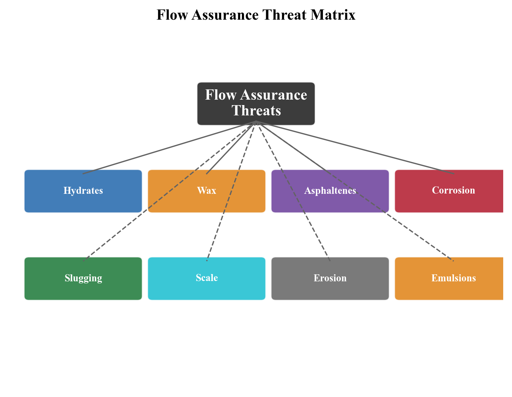
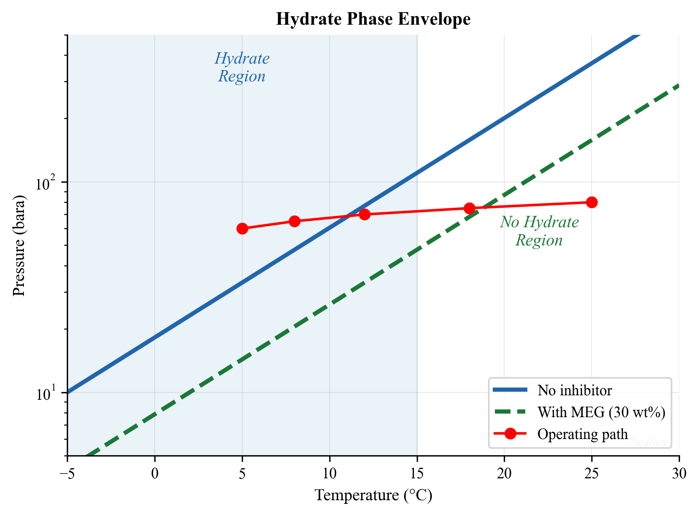
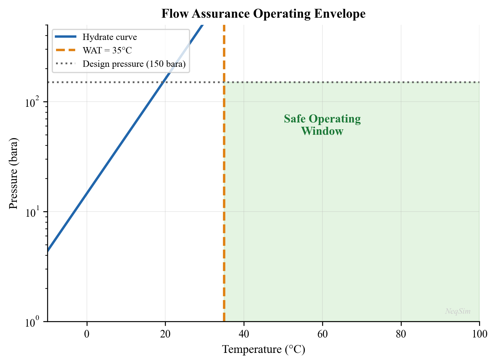
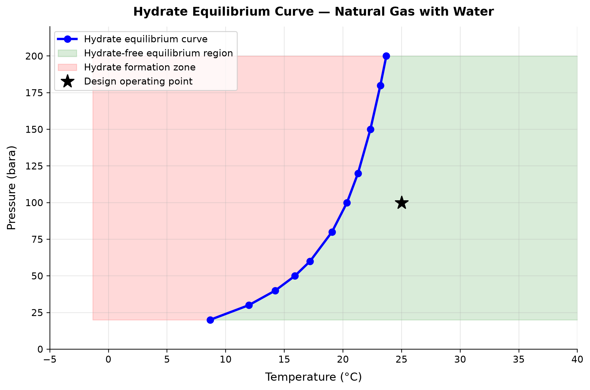
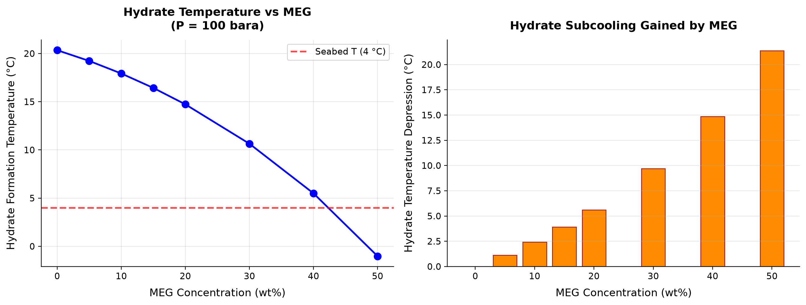
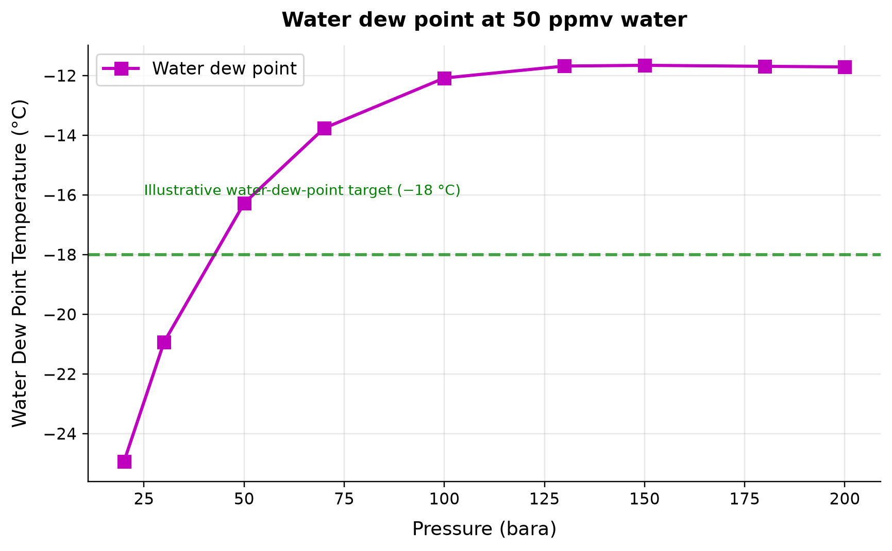
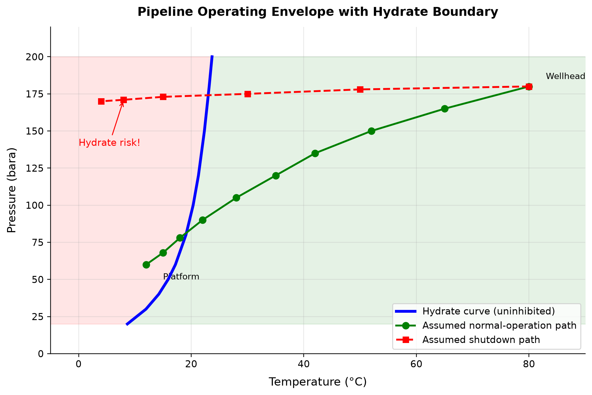

# Flow Assurance

**Running the examples.** Start the source-workspace Python session described in Chapter 1, then run this chapter's Python blocks in reading order. Java blocks form a separate sequence using the same NeqSim build; carry forward objects from preceding Java blocks. The release execution records are in `verification/`; a successful run establishes API compatibility, while physical validation also requires the checks discussed in the text.

<!-- Chapter metadata -->
<!-- Notebooks: ch08_hydrate_prediction.ipynb, ch08_wax_and_asphaltene.ipynb, ch08_corrosion_scale.ipynb -->
<!-- Estimated pages: 25 -->

## Learning Objectives

After reading this chapter, the reader will be able to:

1. Explain the thermodynamic basis for gas hydrate formation and predict hydrate equilibrium conditions
2. Design hydrate prevention strategies using thermodynamic inhibitors (MEG, methanol) and calculate inhibitor dosing rates
3. Assess wax deposition risk using wax appearance temperature calculations and operational strategies
4. Evaluate asphaltene stability using de Boer screening and the colloidal instability index
5. Predict CO$_2$ and H$_2$S corrosion rates using the de Waard-Milliams model
6. Screen for scale formation risk (CaCO$_3$, BaSO$_4$) based on water chemistry
7. Perform comprehensive flow assurance screening using NeqSim to define safe operating envelopes

## 9.1 Introduction to Flow Assurance

Flow assurance — a term coined by Petrobras in the 1990s (from the Portuguese *garantia de fluxo*) — encompasses all engineering activities that ensure the uninterrupted transport of hydrocarbon fluids from reservoir to market. The discipline addresses the threats that can restrict or stop production by blocking flowlines, corroding pipe walls, or destabilizing the multiphase flow.

The principal flow assurance threats are:

| Threat | Mechanism | Consequence | Prevention |
|--------|-----------|-------------|-----------|
| Gas hydrates | Ice-like crystalline solids from water + gas | Complete pipe blockage | Inhibitors, insulation, heating |
| Wax | Paraffin crystallization at low temperatures | Reduced bore, increased dP | Pigging, insulation, inhibitors |
| Asphaltenes | Precipitation of heavy aromatics | Deposits, emulsions | Chemical treatment, pressure management |
| Corrosion | Metal dissolution by CO$_2$/H$_2$S/O$_2$ | Wall thinning, leaks | Materials, inhibitors, pH control |
| Scale | Mineral precipitation from produced water | Restriction, equipment fouling | Squeeze treatments, ion control |
| Emulsions | Stable water-in-oil or oil-in-water mixtures | Poor separation, high viscosity | Demulsifiers, heating |
| Erosion | Particle impact on pipe walls | Wall thinning, leaks | Velocity limits, sand management |
| Slugging | Intermittent liquid slugs | Equipment overload | Design, control, topology |

The economic impact of flow assurance failures is substantial. A single hydrate plug can cost \$1–10 million to remediate and months of lost production. A corrosion-induced leak can result in environmental damage, regulatory penalties, and production shutdown.



## 9.2 Gas Hydrates

### 9.2.1 What Are Gas Hydrates?

Gas hydrates (also called clathrate hydrates) are crystalline solid compounds formed when water molecules create cage-like structures that trap small gas molecules. They form at high pressures and low temperatures — conditions commonly encountered in subsea flowlines and deepwater risers.

The water molecules form a hydrogen-bonded lattice with cavities that encage guest molecules (methane, ethane, propane, CO$_2$, H$_2$S, nitrogen). The thermodynamic stability of hydrates depends on:

- **Temperature** — lower temperatures favor hydrate formation
- **Pressure** — higher pressures favor hydrate formation
- **Gas composition** — different guest molecules stabilize different hydrate structures
- **Water presence** — free water is required for hydrate formation

### 9.2.2 Hydrate Structures

Three principal hydrate crystal structures are known:

| Structure | Unit Cell | Small Cages | Large Cages | Typical Guests |
|-----------|----------|-------------|-------------|----------------|
| Structure I (sI) | 46 H$_2$O, 2 small + 6 large cages | 5$^{12}$ (pentagonal dodecahedra) | 5$^{12}$6$^2$ (tetrakaidecahedra) | CH$_4$, C$_2$H$_6$, CO$_2$, H$_2$S |
| Structure II (sII) | 136 H$_2$O, 16 small + 8 large cages | 5$^{12}$ | 5$^{12}$6$^4$ (hexakaidecahedra) | C$_3$H$_8$, i-C$_4$H$_{10}$, N$_2$ |
| Structure H (sH) | 34 H$_2$O, 3 small + 2 medium + 1 large | 5$^{12}$, 4$^3$5$^6$6$^3$ | 5$^{12}$6$^8$ | Neohexane + CH$_4$ |

Natural gas typically forms Structure II hydrates because propane and isobutane stabilize the large sII cages. However, gas with very low C3+ content (e.g., biogenic gas or CO$_2$-rich gas) may form Structure I.

### 9.2.3 Hydrate Equilibrium Thermodynamics

The van der Waals-Platteeuw (vdWP) model describes the thermodynamic stability of hydrate phases. The chemical potential of water in the hydrate phase relative to the empty lattice is:

$$
\frac{\Delta \mu_w^H}{RT} = -\sum_i \nu_i \ln\left(1 - \sum_j \theta_{ij}\right)
$$

where:

- $\nu_i$ is the number of type $i$ cages per water molecule
- $\theta_{ij}$ is the fractional occupancy of cage $i$ by guest $j$

The cage occupancy follows a Langmuir-type model:

$$
\theta_{ij} = \frac{C_{ij} f_j}{1 + \sum_k C_{ik} f_k}
$$

where $C_{ij}$ is the Langmuir constant for guest $j$ in cage $i$, and $f_j$ is the fugacity of guest $j$ in the fluid phase.

At equilibrium, the chemical potential of water is equal in all coexisting phases (hydrate, liquid water, ice):

$$
\mu_w^{hydrate}(T, P) = \mu_w^{aqueous}(T, P)
$$

This equilibrium condition defines the hydrate P-T curve — the locus of temperature and pressure at which hydrates form.

### 9.2.4 Hydrate P-T Curve Calculation with NeqSim

NeqSim calculates hydrate equilibrium using a rigorous implementation of the vdWP model coupled with its equation of state:

```python
import jpype
jneqsim = jpype.JPackage("neqsim")

# Define a typical natural gas composition
fluid = jneqsim.thermo.system.SystemSrkEos(273.15 + 20.0, 100.0)
fluid.addComponent("nitrogen", 1.0)
fluid.addComponent("CO2", 3.5)
fluid.addComponent("methane", 72.0)
fluid.addComponent("ethane", 8.0)
fluid.addComponent("propane", 4.5)
fluid.addComponent("i-butane", 1.0)
fluid.addComponent("n-butane", 2.0)
fluid.addComponent("n-pentane", 1.0)
fluid.addComponent("water", 7.0)
fluid.setMixingRule("classic")
fluid.setMultiPhaseCheck(True)
fluid.setHydrateCheck(True)

# Calculate hydrate equilibrium temperature at various pressures
ThermodynamicOperations = jneqsim.thermodynamicoperations.ThermodynamicOperations

pressures_bara = [20, 40, 60, 80, 100, 150, 200, 250, 300]

print(f"{'Pressure (bara)':>16} {'Hydrate T (°C)':>16}")
print("-" * 34)

for P in pressures_bara:
    test_fluid = fluid.clone()
    test_fluid.setPressure(float(P), "bara")
    ops = ThermodynamicOperations(test_fluid)
    try:
        ops.hydrateFormationTemperature()
        T_hyd = test_fluid.getTemperature("C")
        print(f"{P:>16} {T_hyd:>16.1f}")
    except Exception as e:
        print(f"{P:>16} {'N/A':>16}")
```

### 9.2.5 Hydrate Phase Envelope

The hydrate curve can be superimposed on the pipeline operating conditions to assess risk:

```python
import jpype
jneqsim = jpype.JPackage("neqsim")

# Define gas condensate fluid
fluid = jneqsim.thermo.system.SystemSrkEos(273.15 + 20.0, 100.0)
fluid.addComponent("nitrogen", 0.5)
fluid.addComponent("CO2", 2.0)
fluid.addComponent("methane", 75.0)
fluid.addComponent("ethane", 8.0)
fluid.addComponent("propane", 5.0)
fluid.addComponent("i-butane", 1.0)
fluid.addComponent("n-butane", 2.5)
fluid.addComponent("i-pentane", 0.5)
fluid.addComponent("n-pentane", 1.0)
fluid.addComponent("n-hexane", 1.0)
fluid.addComponent("n-heptane", 1.0)
fluid.addComponent("water", 2.5)
fluid.setMixingRule("classic")
fluid.setMultiPhaseCheck(True)
fluid.setHydrateCheck(True)

ThermodynamicOperations = jneqsim.thermodynamicoperations.ThermodynamicOperations

# Calculate hydrate curve
pressures = [10, 20, 30, 50, 70, 100, 150, 200, 250, 300]
hydrate_temps = []

for P in pressures:
    test_fluid = fluid.clone()
    test_fluid.setPressure(float(P), "bara")
    ops = ThermodynamicOperations(test_fluid)
    try:
        ops.hydrateFormationTemperature()
        T_hyd = test_fluid.getTemperature("C")
        hydrate_temps.append(T_hyd)
    except Exception:
        hydrate_temps.append(None)

# Print hydrate curve
print("Hydrate Equilibrium Curve:")
print(f"{'P (bara)':>10} {'T_hyd (°C)':>12}")
for P, T in zip(pressures, hydrate_temps):
    if T is not None:
        print(f"{P:>10} {T:>12.1f}")
```



### 9.2.6 Hydrate Subcooling and Risk Assessment

The degree of subcooling below the hydrate equilibrium temperature determines the severity of the hydrate risk:

$$
\Delta T_{sub} = T_{hydrate}(P) - T_{operating}
$$

| Subcooling $\Delta T_{sub}$ | Risk Level | Typical Response |
|------------------------------|-----------|-----------------|
| $< 0$ °C | No risk | Normal operation (outside hydrate zone) |
| 0–3 °C | Low | Monitor, maintain inhibitor injection |
| 3–8 °C | Moderate | Continuous inhibitor injection required |
| 8–15 °C | High | Inhibitor + insulation required |
| $> 15$ °C | Severe | Active heating or cold flow management |

## 9.3 Hydrate Inhibition

### 9.3.1 Thermodynamic Inhibitors

Thermodynamic inhibitors (THIs) shift the hydrate equilibrium curve to lower temperatures (or higher pressures), expanding the safe operating envelope. The two primary THIs used in the oil and gas industry are:

**Mono-ethylene glycol (MEG):**
- Most common offshore inhibitor
- Can be regenerated and recycled (closed-loop system)
- Effective inhibition of 20–40°C depending on concentration
- Typical lean MEG concentration: 80–90 wt%
- Typical rich MEG concentration: 30–50 wt% in the water phase

**Methanol:**
- Lower cost per unit volume
- Cannot be practically recovered (consumed)
- Partitions into gas and hydrocarbon liquid phases (higher losses)
- Flash point concerns for storage and handling

### 9.3.2 The Hammerschmidt Equation

The classical Hammerschmidt equation estimates the hydrate depression temperature:

$$
\Delta T = \frac{K_H \cdot w}{M_i (100 - w)}
$$

where:

- $\Delta T$ is the hydrate temperature depression [°C]
- $K_H$ is the Hammerschmidt constant (1,297 for MEG; 2,335 for methanol)
- $w$ is the inhibitor concentration in the aqueous phase [wt%]
- $M_i$ is the molecular weight of the inhibitor [g/mol] (62.07 for MEG; 32.04 for methanol)

This gives approximate required concentrations:

| Required $\Delta T$ (°C) | MEG wt% | Methanol wt% |
|---------------------------|---------|-------------|
| 5 | 19 | 10 |
| 10 | 33 | 18 |
| 15 | 43 | 25 |
| 20 | 52 | 31 |
| 25 | 58 | 36 |
| 30 | 64 | 41 |

### 9.3.3 MEG Dosing Calculation with NeqSim

NeqSim provides rigorous hydrate inhibition calculations by including the inhibitor as a component in the thermodynamic model:

```python
import jpype
jneqsim = jpype.JPackage("neqsim")

# Define gas with water and MEG
fluid_with_MEG = jneqsim.thermo.system.SystemSrkCPAstatoil(273.15 + 20.0, 100.0)
fluid_with_MEG.addComponent("methane", 75.0)
fluid_with_MEG.addComponent("ethane", 8.0)
fluid_with_MEG.addComponent("propane", 5.0)
fluid_with_MEG.addComponent("i-butane", 1.0)
fluid_with_MEG.addComponent("n-butane", 2.0)
fluid_with_MEG.addComponent("CO2", 2.0)
fluid_with_MEG.addComponent("water", 5.0)
fluid_with_MEG.addComponent("MEG", 2.0)   # MEG injection
fluid_with_MEG.setMixingRule(10)  # CPA mixing rule
fluid_with_MEG.setMultiPhaseCheck(True)
fluid_with_MEG.setHydrateCheck(True)

ThermodynamicOperations = jneqsim.thermodynamicoperations.ThermodynamicOperations

# Calculate hydrate temperature with MEG
ops = ThermodynamicOperations(fluid_with_MEG)
fluid_with_MEG.setPressure(100.0, "bara")
ops.hydrateFormationTemperature()
T_hyd_with_MEG = fluid_with_MEG.getTemperature("C")
print(f"Hydrate temperature with MEG: {T_hyd_with_MEG:.1f} °C")

# Compare with uninhibited fluid
fluid_no_MEG = jneqsim.thermo.system.SystemSrkCPAstatoil(273.15 + 20.0, 100.0)
fluid_no_MEG.addComponent("methane", 75.0)
fluid_no_MEG.addComponent("ethane", 8.0)
fluid_no_MEG.addComponent("propane", 5.0)
fluid_no_MEG.addComponent("i-butane", 1.0)
fluid_no_MEG.addComponent("n-butane", 2.0)
fluid_no_MEG.addComponent("CO2", 2.0)
fluid_no_MEG.addComponent("water", 7.0)
fluid_no_MEG.setMixingRule(10)
fluid_no_MEG.setMultiPhaseCheck(True)
fluid_no_MEG.setHydrateCheck(True)

ops2 = ThermodynamicOperations(fluid_no_MEG)
fluid_no_MEG.setPressure(100.0, "bara")
ops2.hydrateFormationTemperature()
T_hyd_no_MEG = fluid_no_MEG.getTemperature("C")

print(f"Hydrate temperature without MEG: {T_hyd_no_MEG:.1f} °C")
print(f"Hydrate depression: {T_hyd_no_MEG - T_hyd_with_MEG:.1f} °C")
```

### 9.3.4 Low Dosage Hydrate Inhibitors (LDHIs)

In addition to thermodynamic inhibitors, Low Dosage Hydrate Inhibitors (LDHIs) are increasingly used. LDHIs are classified into two distinct categories based on their mechanism of action:

**Kinetic Hydrate Inhibitors (KHIs):**

KHIs are water-soluble polymers (typically polyvinylpyrrolidone (PVP), polyvinylcaprolactam (PVCap), or copolymers thereof) that delay hydrate nucleation and slow crystal growth without shifting the thermodynamic equilibrium. Key characteristics:

- Polymer-based chemicals that adsorb on the hydrate crystal surface and disrupt nucleation
- Effective subcooling typically 6–14°C (the maximum subcooling below the equilibrium temperature at which the KHI can prevent hydrate formation for the required hold time)
- Dosage: 0.5–3.0 wt% of the water phase (typically 0.5–1.5 wt% for moderate subcooling)
- The hold time — the period over which the KHI can delay hydrate formation — depends on subcooling, polymer type, and concentration. Typical hold times range from 12 to 72 hours
- Advantages: much lower injection volumes than THIs (factor of 10–100 less), no regeneration plant needed, lower CAPEX and OPEX for moderate subcooling applications
- Limitations: time-dependent — effective for hours to days, not indefinitely; limited to subcooling less than approximately 14°C; performance sensitive to brine salinity and production chemical interactions; not suitable for shut-in protection without supplementary strategies

**Anti-agglomerants (AAs):**

AAs are surfactant-based chemicals (typically quaternary ammonium salts or similar amphiphilic molecules) that do not prevent hydrate formation but instead prevent hydrate crystals from agglomerating into large masses. Hydrate particles remain dispersed as a transportable slurry in the hydrocarbon liquid phase:

- Allow hydrate formation but keep crystals small (typically < 100 µm) and well-dispersed
- The hydrate slurry flows through the pipeline without risk of blockage, provided the hydrate volume fraction remains below approximately 20–30%
- Dosage: 0.5–2.0 wt% of the water phase
- Require an oil-continuous system (limited to < 50–60% watercut); in water-continuous systems, the dispersed hydrate particles can bridge and form plugs
- Advantages: effective at any subcooling (no subcooling limit); provide shut-in protection (hydrate crystals remain dispersed even during extended shutdown)
- Limitations: watercut ceiling; require liquid hydrocarbon phase; potential emulsion stabilization in separators; higher unit cost than KHIs

### 9.3.5 Comparison of Hydrate Inhibition Strategies

The choice between THI, KHI, and AA depends on the subcooling, watercut, shut-in duration, and economic factors:

| Parameter | THI (MEG) | THI (Methanol) | KHI | AA |
|-----------|-----------|---------------|------|------|
| Mechanism | Shift equilibrium | Shift equilibrium | Delay nucleation | Prevent agglomeration |
| Typical dosage (wt% water) | 30–60% | 20–40% | 0.5–3.0% | 0.5–2.0% |
| Effective subcooling | Unlimited (dose-dependent) | Unlimited (dose-dependent) | 6–14°C | Unlimited |
| Watercut limit | None | None | None | < 50–60% |
| Hold time | Indefinite | Indefinite | 12–72 hours | Indefinite |
| Shut-in protection | Yes | Yes | Limited | Yes |
| Recovery/regeneration | MEG reclamation plant | Not recovered (lost) | Not recovered | Not recovered |
| Volume injected | High | High | Low | Low |
| CAPEX | High (regen plant) | Low | Low | Low |
| OPEX (chemical cost) | Moderate (recycled) | High (consumed) | Moderate | Moderate–High |
| Environmental concern | Low (glycol) | Moderate (volatile) | Low | Moderate |
| Best application | Long tiebacks, high subcooling | Short tiebacks, intermittent | Moderate subcooling, no shut-in | High subcooling, oil-continuous |

For deepwater developments with subcooling > 15°C, THIs (typically MEG) remain the default choice. KHIs are increasingly used for satellite wells and short tiebacks with moderate subcooling. AAs are attractive for oil-dominated systems where the watercut remains below the inversion point.

### 9.3.6 Hydrate Management Strategies

| Strategy | Approach | Application |
|---------|----------|-------------|
| Avoidance | Keep T,P outside hydrate zone | Short tiebacks, insulation |
| Prevention | THI injection (MEG/methanol) | Standard subsea practice |
| Risk management | KHI + monitoring | Moderate subcooling |
| Remediation | Depressurization + heating | Emergency response |
| Cold flow | Allow hydrate formation as slurry | Emerging technology |

## 9.4 Wax Deposition

### 9.4.1 Wax Formation Mechanism

Wax (paraffin) deposition occurs when dissolved long-chain alkanes (typically $n$-C$_{18}$ to $n$-C$_{60}$) crystallize out of the oil as the temperature decreases. The key temperatures are:

**Wax Appearance Temperature (WAT):** The temperature at which the first wax crystals form. This is the cloud point of the oil.

**Pour Point:** The temperature below which the oil ceases to flow due to wax gelation.

The wax deposition process involves:

1. **Nucleation** — first wax crystals form when $T < WAT$
2. **Crystal growth** — wax molecules diffuse from the bulk oil to the crystal surface
3. **Deposition** — wax crystals deposit on the cold pipe wall by molecular diffusion (dominant mechanism), Brownian diffusion, shear dispersion, and gravity settling
4. **Aging** — the deposited wax layer hardens over time as lighter hydrocarbons diffuse out

### 9.4.2 Wax Deposition Rate

The Singh et al. (2000) model for wax deposition rate by molecular diffusion is:

$$
\frac{dm_w}{dt} = -D_{eff} \frac{dC}{dr}\bigg|_{r=R}
$$

where:

- $m_w$ is the deposited wax mass [kg/m²]
- $D_{eff}$ is the effective diffusion coefficient of wax in oil [m²/s]
- $dC/dr$ is the radial concentration gradient of dissolved wax at the pipe wall
- $R$ is the pipe radius [m]

The diffusion coefficient depends on temperature through an Arrhenius relationship:

$$
D_{eff} = D_0 \exp\left(-\frac{E_a}{RT}\right)
$$

### 9.4.3 Wax Management

| Method | Description | Application |
|--------|-------------|-------------|
| Insulation | Maintain $T > WAT$ | Moderate tiebacks |
| Pigging | Mechanical wax removal | Regular maintenance |
| Chemical inhibitors | PPDs (pour point depressants) | Reduce WAT by 5–15°C |
| Hot oiling | Circulate hot oil to melt deposits | Emergency remediation |
| Electrical heating | Direct or indirect heating | Arctic, ultra-long tiebacks |

### 9.4.4 Wax Calculations with NeqSim

NeqSim can estimate the wax appearance temperature through flash calculations that include the solid wax phase:

```python
import jpype
jneqsim = jpype.JPackage("neqsim")

# Define a waxy crude oil composition (C7+ with heavy tail)
fluid = jneqsim.thermo.system.SystemSrkEos(273.15 + 60.0, 50.0)
fluid.addComponent("methane", 30.0)
fluid.addComponent("ethane", 5.0)
fluid.addComponent("propane", 4.0)
fluid.addComponent("n-butane", 3.0)
fluid.addComponent("n-pentane", 3.0)
fluid.addComponent("n-hexane", 4.0)
fluid.addComponent("n-heptane", 8.0)
fluid.addComponent("n-octane", 8.0)
fluid.addComponent("n-nonane", 6.0)
fluid.addComponent("n-decane", 5.0)
fluid.addComponent("nC11", 4.0)
fluid.addComponent("nC17", 6.0)
fluid.addComponent("nC20", 5.0)
fluid.addComponent("water", 9.0)
fluid.setMixingRule("classic")
fluid.setMultiPhaseCheck(True)
fluid.setHydrateCheck(True)

# Liquid-property cooling screen only: TPflash without a wax model cannot determine WAT.
ThermodynamicOperations = jneqsim.thermodynamicoperations.ThermodynamicOperations

temperatures = [60, 55, 50, 45, 40, 35, 30, 25, 20, 15, 10]
print(f"{'T (°C)':>8} {'Phases':>8} {'Liquid density (kg/m3)':>22}")

for T in temperatures:
    test_fluid = fluid.clone()
    test_fluid.setTemperature(float(T) + 273.15, "K")
    test_fluid.setPressure(50.0, "bara")
    ops = ThermodynamicOperations(test_fluid)
    ops.TPflash()
    test_fluid.initProperties()
    n_phases = test_fluid.getNumberOfPhases()
    rho_oil = test_fluid.getPhase("oil").getDensity("kg/m3")
    print(f"{T:>8} {n_phases:>8} {rho_oil:>22.1f}")
```

## 9.5 Asphaltene Stability

### 9.5.1 Asphaltene Chemistry

Asphaltenes are the heaviest, most polar fraction of crude oil — defined operationally as the fraction insoluble in $n$-heptane but soluble in toluene. They consist of large polyaromatic hydrocarbons with heteroatom-containing functional groups (N, O, S) and have molecular weights in the range 500–2,000 g/mol.

Asphaltenes are normally stabilized in the crude oil by resins (polar aromatics that form a solvation shell around asphaltene particles). Destabilization occurs when:

- **Pressure decreases** below the bubble point (loss of light ends that are good asphaltene solvents)
- **Composition changes** from commingling or CO$_2$/lean gas injection
- **Temperature changes** (complex effect — can increase or decrease stability)

### 9.5.2 de Boer Screening

The de Boer et al. (1995) screening method uses the difference between reservoir pressure and bubble point pressure as the primary indicator:

$$
\Delta P_{supersaturation} = P_{res} - P_{bubble}
$$

| $\Delta P$ (bar) | In-situ Density (kg/m³) | Asphaltene Risk |
|-------------------|------------------------|----------------|
| $> 200$ | $< 700$ | Low |
| $100 – 200$ | $700 – 800$ | Moderate |
| $< 100$ | $> 800$ | High |

The de Boer plot places fields on a diagram of $\Delta P$ vs. in-situ oil density. Fields above the empirical trend line are more susceptible to asphaltene problems.

### 9.5.3 Colloidal Instability Index (CII)

The CII uses SARA (Saturates, Aromatics, Resins, Asphaltenes) fractionation data:

$$
CII = \frac{w_{Saturates} + w_{Asphaltenes}}{w_{Aromatics} + w_{Resins}}
$$

| CII Value | Stability |
|----------|-----------|
| $< 0.7$ | Stable |
| $0.7 – 0.9$ | Marginally stable |
| $> 0.9$ | Unstable |

### 9.5.4 Asphaltene Onset Pressure

The asphaltene onset pressure (AOP) is the pressure at which asphaltenes first precipitate during isothermal depressurization. It is typically measured by depressurization experiments with near-infrared detection. The AOP is usually above the bubble point:

$$
P_{AOP} > P_{bubble}
$$

The pressure range between $P_{AOP}$ and $P_{bubble}$ is the asphaltene instability zone. Production operations should avoid sustained operation in this zone, or chemical inhibitors must be deployed.

## 9.6 Corrosion

### 9.6.1 CO$_2$ Corrosion

CO$_2$ corrosion (sweet corrosion) is the most common form of internal corrosion in oil and gas pipelines. Dissolved CO$_2$ forms carbonic acid in the presence of water:

$$
\text{CO}_2 + \text{H}_2\text{O} \rightleftharpoons \text{H}_2\text{CO}_3
$$

The carbonic acid attacks the steel surface:

$$
\text{Fe} + \text{H}_2\text{CO}_3 \to \text{FeCO}_3 + \text{H}_2
$$

The resulting iron carbonate (FeCO$_3$, siderite) can form a protective scale if conditions are favorable (temperature > 60–80°C, low flow velocity).

### 9.6.2 The de Waard-Milliams Model

The de Waard and Milliams (1975) model, updated by de Waard, Lotz, and Milliams (1991), is the most widely used empirical CO$_2$ corrosion model:

$$
\log_{10}(CR) = 5.8 - \frac{1710}{T + 273} + 0.67 \log_{10}(P_{CO_2})
$$

where:

- $CR$ is the corrosion rate [mm/year]
- $T$ is the temperature [°C]
- $P_{CO_2}$ is the partial pressure of CO$_2$ [bar]

Correction factors are applied for:

| Factor | Effect on Corrosion Rate |
|--------|------------------------|
| pH | Higher pH reduces corrosion (FeCO$_3$ scale formation) |
| Glycol content | MEG/DEG reduce water activity, lower corrosion |
| Oil wetting | Oil film on pipe wall provides protection |
| Flow velocity | Higher velocity increases mass transfer, increases corrosion |
| FeCO$_3$ scale | Temperature-dependent protective film reduces corrosion |
| Fugacity correction | At high pressure, use fugacity instead of partial pressure |

### 9.6.3 CO$_2$ Corrosion Rate Estimation with NeqSim

NeqSim can calculate the CO$_2$ partial pressure and water chemistry needed for corrosion estimation:

```python
import jpype
jneqsim = jpype.JPackage("neqsim")
import math

# Define production fluid with CO2
fluid = jneqsim.thermo.system.SystemSrkEos(273.15 + 60.0, 80.0)
fluid.addComponent("methane", 70.0)
fluid.addComponent("ethane", 7.0)
fluid.addComponent("propane", 4.0)
fluid.addComponent("CO2", 5.0)      # 5 mol% CO2
fluid.addComponent("n-butane", 2.0)
fluid.addComponent("n-hexane", 3.0)
fluid.addComponent("n-heptane", 4.0)
fluid.addComponent("water", 5.0)
fluid.setMixingRule("classic")
fluid.setMultiPhaseCheck(True)
fluid.setHydrateCheck(True)

# Flash to get CO2 partial pressure in gas phase
ThermodynamicOperations = jneqsim.thermodynamicoperations.ThermodynamicOperations
ops = ThermodynamicOperations(fluid)
ops.TPflash()
fluid.initProperties()

# Get CO2 mole fraction in gas phase
y_CO2 = fluid.getPhase("gas").getComponent("CO2").getx()
P_total = fluid.getPressure("bara")
P_CO2 = y_CO2 * P_total

# de Waard-Milliams corrosion rate
T = 60.0  # °C
CR = 10.0**(5.8 - 1710.0 / (T + 273.0) + 0.67 * math.log10(P_CO2))

print(f"Total pressure: {P_total:.1f} bara")
print(f"CO2 mole fraction in gas: {y_CO2:.4f}")
print(f"CO2 partial pressure: {P_CO2:.2f} bar")
print(f"Estimated corrosion rate: {CR:.2f} mm/year")

# Corrosion rate at different temperatures
print(f"\n{'Temperature (°C)':>18} {'CR (mm/year)':>14}")
for T in [20, 40, 60, 80, 100, 120]:
    CR_T = 10.0**(5.8 - 1710.0 / (T + 273.0) + 0.67 * math.log10(P_CO2))
    print(f"{T:>18} {CR_T:>14.2f}")
```

### 9.6.4 H$_2$S Corrosion (Sour Corrosion)

H$_2$S corrosion introduces additional mechanisms beyond CO$_2$ corrosion:

- **Sulfide stress cracking (SSC)** — hydrogen embrittlement of high-strength steels
- **Stress-oriented hydrogen-induced cracking (SOHIC)** — combined stress and hydrogen effects
- **Pitting corrosion** — localized attack under iron sulfide (FeS) deposits

The NACE MR0175 / ISO 15156 standard defines material requirements for sour service based on H$_2$S partial pressure and pH:

| H$_2$S Partial Pressure | Severity | Material Requirement |
|--------------------------|---------|---------------------|
| $< 0.3$ kPa (0.05 psi) | Sweet service | Standard carbon steel |
| $0.3 – 100$ kPa | Mildly sour | Carbon steel with hardness limits |
| $> 100$ kPa | Severely sour | NACE-qualified materials (CRA or controlled hardness) |

### 9.6.5 Corrosion Allowance and Material Selection

The corrosion allowance is the extra wall thickness added to account for metal loss over the design life:

$$
CA = CR \times t_{design}
$$

For a typical 25-year design life with $CR = 0.3$ mm/year: $CA = 7.5$ mm. If the corrosion rate exceeds approximately 0.3 mm/year with inhibition, corrosion-resistant alloys (CRAs) are typically selected:

| Material | Typical Application | Relative Cost |
|----------|-------------------|---------------|
| Carbon steel + inhibition | $CR < 0.3$ mm/yr with inhibitor | 1.0× |
| 13% Cr (Super 13Cr) | Moderate CO$_2$, no H$_2$S | 2.5–3.0× |
| 22% Cr Duplex | CO$_2$ + moderate H$_2$S | 3.5–4.5× |
| 25% Cr Super Duplex | CO$_2$ + H$_2$S + high T | 5.0–6.0× |
| Alloy 625 (Inconel) | Severe sour + high T | 8.0–12.0× |

## 9.7 Scale Prediction

### 9.7.1 Common Scale Types

Scale deposits form when the produced water becomes supersaturated with dissolved minerals:

| Scale Type | Formula | Formation Trigger | Typical Location |
|-----------|---------|-------------------|-----------------|
| Calcium carbonate | CaCO$_3$ | Pressure drop (CO$_2$ evolution) | Tubing, chokes, separators |
| Barium sulfate | BaSO$_4$ | Mixing incompatible waters | Injection wells, mixers |
| Calcium sulfate | CaSO$_4$ | Temperature increase or mixing | Heat exchangers |
| Strontium sulfate | SrSO$_4$ | Mixing waters | Similar to BaSO$_4$ |
| Iron carbonate | FeCO$_3$ | CO$_2$ corrosion | Pipe wall (protective or not) |
| Iron sulfide | FeS | H$_2$S corrosion | Sour wells |

### 9.7.2 Saturation Index

The saturation index (SI) indicates the tendency for scale formation:

$$
SI = \log_{10}\left(\frac{Q_{ion}}{K_{sp}}\right)
$$

where:

- $Q_{ion}$ is the ion activity product of the scaling species
- $K_{sp}$ is the solubility product at the given T, P conditions

| SI Value | Interpretation |
|---------|---------------|
| $< 0$ | Undersaturated — no scaling tendency |
| $= 0$ | Equilibrium — borderline |
| $0 – 1$ | Mildly supersaturated — low risk |
| $1 – 2$ | Moderate supersaturation — scaling likely |
| $> 2$ | Highly supersaturated — severe scaling |

### 9.7.3 Scale Prevention

- **Chemical inhibition** — scale inhibitor squeeze treatments inject inhibitor into the near-wellbore formation, providing continuous inhibition as water is produced
- **Sulfate removal** — for seawater injection, sulfate removal membranes reduce BaSO$_4$ risk by removing sulfate ions from the injection water
- **Ion compatibility management** — avoid mixing incompatible waters where possible
- **pH control** — for CaCO$_3$, maintaining lower pH (by controlling CO$_2$ partial pressure) reduces scaling tendency

## 9.8 Emulsion Management

### 9.8.1 Emulsion Formation

Emulsions form when two immiscible liquids (oil and water) are mixed with sufficient energy in the presence of surface-active agents (natural surfactants in the crude oil, such as asphaltenes, resins, and naphthenic acids). Chokes, valves, and pumps provide the shear energy for emulsification.

Two types of emulsions occur in production systems:

- **Water-in-oil (w/o) emulsion** — water droplets dispersed in oil (most common at low to moderate watercut, < 60%). The continuous phase is oil. These emulsions increase the effective viscosity and are the primary challenge for pipeline transport and first-stage separation.
- **Oil-in-water (o/w) emulsion** — oil droplets dispersed in water (typically at high watercut, > 70%). The continuous phase is water. These emulsions affect produced water treatment performance and discharge quality.

The **inversion point** is the watercut at which the emulsion transitions from w/o to o/w, typically 60–80% depending on the crude oil properties and mixing conditions. The inversion point is not a fixed property — it depends on the shear history, temperature, chemical treatment, and the nature of the surface-active species in the crude.

### 9.8.2 Emulsion Stability Factors

Emulsion stability is governed by the resistance of the interfacial film surrounding the dispersed droplets to coalescence. The principal factors affecting stability are:

| Factor | Effect on Stability | Mechanism |
|--------|-------------------|-----------|
| Asphaltene content | Increases w/o stability | Forms rigid interfacial film |
| Resin content | Can increase or decrease | Resins can supplement or compete with asphaltene film |
| Naphthenic acids | Increases o/w stability | Anionic surfactant at the interface |
| Fine solids (clays, scale, corrosion products) | Increases stability | Pickering stabilization (particle-stabilized films) |
| Droplet size | Smaller droplets = more stable | Lower buoyancy force, more surface area |
| Temperature | Higher T = lower stability | Reduces oil viscosity, weakens interfacial film |
| pH of water phase | Affects ionization of natural surfactants | Alters interfacial charge and film strength |
| Salinity | Complex; can increase or decrease | Affects electric double layer and surfactant solubility |
| Shear history | More shear = finer droplets = more stable | Energy input creates smaller droplets |

Asphaltenes are the most important natural emulsifiers in crude oil. They form a viscoelastic "skin" at the oil-water interface that resists droplet coalescence. Crudes with high asphaltene content (> 2 wt%) and low resin-to-asphaltene ratio are particularly prone to forming tight, stable emulsions.

### 9.8.3 Emulsion Viscosity

The apparent viscosity of an emulsion is significantly higher than that of either the continuous or dispersed phase alone. For w/o emulsions, the viscosity increase can be dramatic and is the primary mechanism by which emulsions affect pipeline pressure drop and separator performance.

The **Einstein equation** (valid for dilute suspensions, $\phi < 0.02$) provides the starting point:

$$
\mu_{em} = \mu_c (1 + 2.5\phi)
$$

For more concentrated emulsions, the **Woelflin (1942) correlation** is widely used in the petroleum industry:

$$
\mu_{em} = \mu_c \cdot e^{k\phi}
$$

where $\mu_{em}$ is the emulsion viscosity, $\mu_c$ is the continuous phase (oil) viscosity, $\phi$ is the volume fraction of the dispersed phase (water), and $k$ is an empirical constant that depends on the emulsion tightness:

| Emulsion Type | $k$ Value | Description |
|---------------|-----------|-------------|
| Loose emulsion | 2.5–4.0 | Large droplets, easily broken |
| Medium emulsion | 4.0–6.0 | Moderate stability, typical production |
| Tight emulsion | 6.0–12.0 | Very stable, requires chemical treatment |

For a typical medium-tightness w/o emulsion ($k = 5$) at 50% watercut ($\phi = 0.5$):

$$
\mu_{em} = \mu_c \cdot e^{5 \times 0.5} = \mu_c \cdot e^{2.5} \approx 12.2 \cdot \mu_c
$$

This means the emulsion viscosity can be an order of magnitude higher than the clean oil viscosity, with profound implications for pipeline pressure drop and pump sizing.

At higher dispersed-phase fractions approaching the inversion point, the viscosity rises steeply. The **Richardson (1950) model** captures this behavior:

$$
\mu_{em} = \mu_c \cdot \left(1 - \frac{\phi}{\phi_{max}}\right)^{-2.5\phi_{max}}
$$

where $\phi_{max}$ is the maximum packing fraction (typically 0.74 for uniform spheres, 0.85–0.95 for polydisperse emulsions).

### 9.8.4 Demulsifier Selection and Application

Demulsifiers (also called emulsion breakers) are surface-active chemicals that displace the natural stabilizing film at the oil-water interface, promoting droplet coalescence and phase separation. The selection of an effective demulsifier is highly crude-specific and typically requires systematic bottle testing.

**Demulsifier selection criteria:**

1. **Speed of action** — how quickly the emulsion resolves (minutes to hours)
2. **Water quality** — clarity of the separated water phase (low residual oil)
3. **Interface quality** — sharpness of the oil-water interface (absence of intermediate "rag" layer)
4. **Dose requirement** — lower is better for OPEX reduction
5. **Compatibility** — with other production chemicals (corrosion inhibitors, scale inhibitors, wax inhibitors)
6. **Temperature sensitivity** — performance at operating temperatures

**Common demulsifier chemistries:**

| Demulsifier Type | Chemistry | Best For |
|-----------------|-----------|----------|
| Ethoxylated resins | Alkylphenol-formaldehyde + EO/PO | Heavy crudes, tight emulsions |
| Polyester polyols | Ester-based block copolymers | Light-to-medium crudes |
| Di-epoxides | Bisphenol A di-epoxides | High-temperature applications |
| Polyamines | Ethoxylated polyamines | Acidic crudes with naphthenic acids |
| Silicone-based | Polysiloxane + polyether | Water-in-oil emulsions with fines |

**Impact of emulsions on separation performance:**

Stable emulsions severely impact the performance of production separators:

- **Rag layer formation** — an accumulation of unresolved emulsion at the oil-water interface in gravity separators, reducing effective separator volume and causing high oil-in-water and water-in-oil carryover
- **Increased residence time requirement** — stable emulsions need longer retention times for adequate separation, reducing throughput capacity
- **Hydrocyclone fouling** — stable emulsions with fine droplets (< 10 µm) pass through deoiling hydrocyclones, degrading produced water quality
- **Heat exchanger fouling** — emulsion deposits on heat transfer surfaces reduce thermal efficiency

The optimal demulsifier injection point is as far upstream as possible (downhole or at the wellhead) to maximize contact time and exploit the turbulence in the flowline for mixing. Typical injection rates are 5–50 ppm based on total liquid rate, though tight emulsions may require 50–200 ppm.

## 9.9 Erosion Management

### 9.9.1 Erosion Mechanisms

Erosion in production systems occurs when solid particles (sand) or liquid droplets impact pipe walls and fittings at high velocity. The API RP 14E erosional velocity limit is:

$$
v_e = \frac{C}{\sqrt{\rho_m}}
$$

where $C$ is an empirical constant (typically 100–150 for continuous service, up to 200 for intermittent service with erosion-resistant materials) and $\rho_m$ is the mixture density [lb/ft³].

More detailed erosion models (e.g., DNV RP O501) use:

$$
E = K \cdot F(\alpha) \cdot v_p^n \cdot m_p
$$

where:

- $E$ is the erosion rate [kg/kg]
- $K$ is a material constant
- $F(\alpha)$ is a function of the particle impact angle $\alpha$
- $v_p$ is the particle velocity [m/s]
- $n$ is the velocity exponent (typically 2.0–2.5)
- $m_p$ is the particle mass [kg]

### 9.9.2 Erosion Prediction: DNV RP O501 Detailed Model

The DNV RP O501 standard provides a comprehensive erosion prediction methodology that is the industry reference for sand erosion management. The model calculates the erosion rate at specific pipe geometries (bends, tees, reducers, chokes) using a combination of particle tracking and empirical material models:

$$
E_r = \frac{K \cdot F(\alpha) \cdot v_p^n \cdot m_p \cdot G}{A_t \cdot \rho_t}
$$

where $A_t$ is the target area exposed to particle impacts [m²], $\rho_t$ is the target material density [kg/m³], and $G$ is a geometry factor that accounts for the flow pattern concentration at the impact zone. The geometry factor is the critical parameter — it varies from approximately 1.0 for straight pipe to 3–5 for standard elbows and up to 10 for blind tees.

The material constant $K$ and velocity exponent $n$ depend on the target material and are calibrated against laboratory erosion loop tests:

| Material | $K$ (×10⁻⁹) | $n$ | Typical Application |
|----------|-------------|------|-------------------|
| Carbon steel | 2.0 | 2.6 | Piping, vessels |
| 13Cr stainless | 1.5 | 2.6 | Chokes, trim |
| Duplex stainless | 1.2 | 2.6 | High-corrosion environments |
| Tungsten carbide | 0.1 | 2.3 | Choke beans, wear inserts |
| Stellite 6 | 0.3 | 2.5 | Valve seats, high-wear areas |

The angle function $F(\alpha)$ captures the fact that ductile materials (steel) experience maximum erosion at low impingement angles (15–30°), while brittle materials (ceramics, carbides) suffer maximum erosion at normal impingement (90°).

### 9.9.3 Sand Monitoring Techniques

Real-time sand monitoring is essential for managing erosion risk during production. The principal monitoring techniques are:

**Acoustic sand detectors** (non-intrusive):

- Clamp-on sensors detect the acoustic signal generated by sand grain impacts on the pipe wall
- Provide continuous, real-time sand production rate measurement (kg/day or g/s)
- Industry standard: Clampon DSP-06 and similar devices; widely deployed on North Sea platforms
- Limitations: sensitive to background noise (flow noise, pump vibration); require calibration for each installation; less accurate at low sand rates

**Intrusive erosion probes:**

- Sacrificial elements (ER probes, weight-loss coupons) exposed to the process flow
- Measure cumulative metal loss over time, giving an average erosion rate
- Weight-loss coupons provide the most direct measurement but require process intervention for retrieval
- Electrical resistance (ER) probes can be read online without retrieval
- Limitation: provide a lagging indicator — by the time significant metal loss is measured, damage has occurred

**Ultrasonic wall thickness monitoring:**

- Permanently installed ultrasonic thickness measurement (UTM) sensors at critical locations (elbows, tees, chokes, reducers)
- Provide direct measurement of remaining wall thickness with accuracy of ± 0.05 mm
- Enable trend analysis to predict remaining equipment life
- High-value approach for subsea systems where inspection access is limited

### 9.9.4 Sand Management Strategies

A comprehensive sand management strategy combines prevention, monitoring, and mitigation:

**Downhole sand control:**

- **Gravel packing** — pumping graded gravel around a slotted liner or screen in the completion zone to prevent sand migration into the wellbore. Effective but adds cost and may restrict well productivity
- **Sand screens** — standalone screens (wire-wrapped, premium mesh) installed in the completion. Lower cost than gravel packs but susceptible to plugging and screen erosion
- **Chemical consolidation** — injection of resin or polymer to bind formation sand grains in place. Limited effectiveness in unconsolidated formations
- **Frac-pack** — combines hydraulic fracturing with gravel packing. Creates a high-conductivity fracture and sand barrier. Preferred for high-rate wells in friable formations

**Topside sand handling:**

- **Desanders** — hydrocyclone-based sand removal equipment installed upstream of the first-stage separator. Remove sand particles > 15–20 µm from the production stream
- **Sand jetting** — automated sand removal systems in separator vessels that use high-pressure water jets to fluidize accumulated sand and transport it to a sand handling system
- **Sand accumulation monitoring** — acoustic or nuclear densitometry instruments that detect sand build-up in vessels and pipelines

**Design measures for erosion mitigation:**

- **Velocity management** — maintaining fluid velocities below the erosional limit is the primary design measure. For sand-producing wells, a more conservative limit (60–80% of the API RP 14E value) is applied
- **Erosion-resistant materials** — tungsten carbide inserts at choke beans, weld overlay (Inconel 625 or Stellite) at pipe bends, and duplex stainless steel at high-turbulence locations
- **Geometry optimization** — long-radius bends (R/D ≥ 5) instead of standard elbows (R/D = 1.5) reduce the geometry factor by 50%. Blind tees should be avoided in sand service; use swept tees or target plates instead
- **Sand exclusion limits** — many operators set a maximum allowable sand rate (e.g., 5 g/s or 50 ppmw) above which the well must be choked back or shut in for sand control remediation

## 9.10 Flow Assurance Screening

### 9.10.1 The Operating Envelope

A comprehensive flow assurance screening overlays all threat boundaries on the same P-T diagram:

```python
import jpype
jneqsim = jpype.JPackage("neqsim")

# Define production fluid
fluid = jneqsim.thermo.system.SystemSrkEos(273.15 + 20.0, 100.0)
fluid.addComponent("nitrogen", 0.5)
fluid.addComponent("CO2", 3.0)
fluid.addComponent("methane", 70.0)
fluid.addComponent("ethane", 7.0)
fluid.addComponent("propane", 5.0)
fluid.addComponent("i-butane", 1.0)
fluid.addComponent("n-butane", 2.5)
fluid.addComponent("i-pentane", 0.5)
fluid.addComponent("n-pentane", 1.0)
fluid.addComponent("n-hexane", 1.5)
fluid.addComponent("n-heptane", 3.0)
fluid.addComponent("n-octane", 2.0)
fluid.addComponent("water", 2.5)
fluid.setMixingRule("classic")
fluid.setMultiPhaseCheck(True)
fluid.setHydrateCheck(True)

ThermodynamicOperations = jneqsim.thermodynamicoperations.ThermodynamicOperations

# 1. Calculate phase envelope (bubble/dew point curve)
phase_env_fluid = fluid.clone()
ops_pe = ThermodynamicOperations(phase_env_fluid)
ops_pe.calcPTphaseEnvelope()

# 2. Calculate hydrate curve at several pressures
hydrate_data = []
for P in [10, 20, 40, 60, 80, 100, 150, 200, 250, 300]:
    hyd_fluid = fluid.clone()
    hyd_fluid.setPressure(float(P), "bara")
    ops_hyd = ThermodynamicOperations(hyd_fluid)
    try:
        ops_hyd.hydrateFormationTemperature()
        T_hyd = hyd_fluid.getTemperature("C")
        hydrate_data.append({"P_bara": P, "T_hyd_C": round(T_hyd, 1)})
    except Exception:
        pass

# 3. Print results for plotting
print("Phase Envelope calculated.")
print("\nHydrate Equilibrium Curve:")
print(f"{'P (bara)':>10} {'T_hyd (°C)':>12}")
for h in hydrate_data:
    print(f"{h['P_bara']:>10} {h['T_hyd_C']:>12.1f}")

# 4. Define pipeline operating conditions for overlay
# (Would be calculated from PipeBeggsAndBrills in practice)
operating_conditions = [
    {"location": "Wellhead", "P": 200, "T": 80},
    {"location": "Flowline mid", "P": 150, "T": 40},
    {"location": "Flowline end", "P": 100, "T": 20},
    {"location": "Riser top", "P": 80, "T": 18},
]
print("\nPipeline Operating Conditions:")
for oc in operating_conditions:
    print(f"  {oc['location']:>15}: P = {oc['P']} bara, T = {oc['T']} °C")
```



### 9.10.2 Flow Assurance Screening Checklist

A systematic flow assurance screening for a new subsea development should evaluate:

| Item | Data Required | Assessment Method |
|------|-------------|-------------------|
| Hydrate formation | Gas composition, water content | NeqSim hydrate equilibrium |
| Hydrate inhibitor dosing | Subcooling, water rate | Hammerschmidt or NeqSim CPA |
| Wax appearance temperature | n-Paraffin distribution | Lab measurement or NeqSim |
| Wax deposition rate | WAT, pipe wall T, diffusion coefficient | Singh model |
| Asphaltene stability | SARA, oil density, bubble point | de Boer screening, CII |
| CO$_2$ corrosion | CO$_2$ content, T, P, water chemistry | de Waard-Milliams |
| H$_2$S corrosion | H$_2$S content | NACE MR0175 / ISO 15156 |
| Scale formation | Water chemistry, T, P changes | Saturation index |
| Erosion | Sand rate, velocity, geometry | API RP 14E, DNV RP O501 |
| Slugging | Flow rates, terrain profile | Steady-state + transient models |
| Emulsions | Watercut, fluid properties | Lab testing, field experience |
| Cooldown time | U-value, fluid properties, pipe volume | Transient thermal model |

## 9.10 Pipeline Capacity Constraints and Network Modeling

While the previous sections of this chapter focused on thermodynamic threats to flow (hydrates, wax, corrosion, scale), this section addresses the **hydraulic** constraints that limit pipeline throughput. In production optimization, the pipeline itself is often the binding constraint — not because of a chemical or physical threat, but because the flow velocity, pressure drop, or vibration levels exceed allowable limits. NeqSim models pipeline capacity through explicit constraint variables that integrate with the production optimization framework.

### 9.10.1 Pipeline Capacity Constraint Variables

Four key constraint variables govern pipeline capacity in NeqSim:

| Constraint | Variable | Limit | Consequence of Violation |
|-----------|----------|-------|------------------------|
| **Velocity** | $v$ (m/s) | Erosional velocity | Pipe wall erosion, structural damage |
| **Pressure drop** | $\Delta P$ (bar) | Available driving pressure | Insufficient delivery pressure |
| **FIV_LOF** | Likelihood of failure | API 618 / Energy Institute | Fatigue-induced pipe failure |
| **FIV_FRMS** | Force RMS | Energy Institute | Branch connection fatigue |

The **erosional velocity** limit is typically calculated from the API RP 14E formula:

$$
v_e = \frac{C}{\sqrt{\rho_m}}
$$

where $v_e$ is the erosional velocity (m/s), $\rho_m$ is the mixture density (kg/m³), and $C$ is a constant (typically 100–150 for continuous service, 200 for intermittent). In practice, many operators use a more conservative limit of 60–80% of $v_e$.

**Flow-induced vibration (FIV)** constraints are increasingly important for offshore facilities where high-velocity gas flow through small-bore piping causes acoustic-induced vibration. The Energy Institute *Guidelines for the Avoidance of Vibration Induced Fatigue Failure in Process Pipework* provides screening criteria based on the **Likelihood of Failure (LOF)** and the RMS dynamic force at branch connections.

### 9.10.2 Automatic Pipeline Sizing with Constraints

NeqSim provides an `autoSize` method for pipelines that calculates the required pipe diameter based on velocity and pressure drop limits, then creates the associated capacity constraints:

```java
import org.apache.logging.log4j.LogManager;
import org.apache.logging.log4j.Logger;
Logger logger = LogManager.getLogger("BookChapter9");
import neqsim.thermo.system.SystemSrkEos;
import neqsim.process.equipment.stream.Stream;
import neqsim.process.processmodel.ProcessSystem;
import neqsim.process.equipment.capacity.CapacityConstraint;
import neqsim.process.util.optimizer.ProductionOptimizer;
import java.util.*;
SystemSrkEos fluid = new SystemSrkEos(313.15, 80.0);
fluid.addComponent("methane", 0.80);
fluid.addComponent("ethane", 0.10);
fluid.addComponent("n-heptane", 0.08);
fluid.addComponent("water", 0.02);
fluid.setMixingRule("classic");
fluid.setMultiPhaseCheck(true);
Stream feed = new Stream("Feed", fluid);
feed.setFlowRate(20000.0, "kg/hr");
ProcessSystem process = new ProcessSystem();
process.add(feed);
process.run();
import neqsim.process.equipment.pipeline.PipeBeggsAndBrills;
import neqsim.process.equipment.network.LoopedPipeNetwork;
// Java: Auto-size pipeline with 20% design margin
PipeBeggsAndBrills pipeline = new PipeBeggsAndBrills("Export Pipeline", feed);
pipeline.setLength(25000.0);  // 25 km
pipeline.setElevation(-200.0);  // outlet below inlet
pipeline.setDiameter(0.254);  // 10-inch initial guess
process.add(pipeline);
process.run();

// Auto-size: finds minimum diameter satisfying constraints + margin
pipeline.autoSize(1.20);  // 20% design margin on velocity

pipeline.initMechanicalDesign();
// The pipeline now carries constraint metadata
double designVelocity = pipeline.getMechanicalDesign().getMaxDesignVelocity();
double designDP = pipeline.getMechanicalDesign().getMaxDesignPressureDrop();
```

After auto-sizing, the pipeline carries the following constraint attributes:

- `getMaxDesignVelocity()` — maximum allowable fluid velocity (m/s)
- `getMaxDesignPressureDrop()` — maximum allowable pressure drop (bar)
- `getMaxLOF()` — maximum flow-induced vibration likelihood of failure
- `getMaxFRMS()` — maximum FIV force RMS at branch connections

These can also be set manually from the piping design specification:

```java
pipeline.setMaxDesignVelocity(25.0);       // 25 m/s max
pipeline.getMechanicalDesign().setMaxDesignPressureDrop(15.0);   // 15 bar max
pipeline.setMaxDesignLOF(0.5);                  // LOF < 0.5
pipeline.setMaxDesignFRMS(500.0);               // FRMS < 500 N
```

### 9.10.3 Pipeline as Bottleneck: Erosional Velocity Limit

The most common pipeline bottleneck in production optimization is the **erosional velocity limit**. As production rate increases (or as reservoir pressure declines and GOR increases), the gas velocity in the pipeline rises. When the velocity approaches the erosional limit, the pipeline becomes the binding constraint:

```python
import jpype
jneqsim = jpype.JPackage("neqsim")

# Model a gas export pipeline approaching erosional velocity
gas = jneqsim.thermo.system.SystemSrkEos(273.15 + 40.0, 70.0)
gas.addComponent("methane", 0.88)
gas.addComponent("ethane", 0.06)
gas.addComponent("propane", 0.03)
gas.addComponent("CO2", 0.02)
gas.addComponent("nitrogen", 0.01)
gas.setMixingRule("classic")

Stream = jneqsim.process.equipment.stream.Stream
PipeBeggsAndBrills = jneqsim.process.equipment.pipeline.PipeBeggsAndBrills
ProcessSystem = jneqsim.process.processmodel.ProcessSystem

feed = Stream("Export Gas", gas)
feed.setFlowRate(50000.0, "kg/hr")
feed.setTemperature(40.0, "C")
feed.setPressure(70.0, "bara")

# 10-inch export pipeline, 15 km
pipeline = PipeBeggsAndBrills("Export Pipeline", feed)
pipeline.setLength(15000.0)
pipeline.setDiameter(0.254)  # 10-inch
pipeline.setAngle(0.0)

process = ProcessSystem()
process.add(feed)
process.add(pipeline)
process.run()

# Calculate erosional velocity for reference
import math
rho_gas = feed.getFluid().getPhase("gas").getDensity("kg/m3")
v_erosional = (150.0 * 0.3048 * math.sqrt(16.018463)) / math.sqrt(rho_gas)  # API RP 14E, C=150

# Sweep flow rates and check velocity constraint
print(f"Erosional velocity limit (C=150): {v_erosional:.1f} m/s")
print(f"\n{'Flow (kg/hr)':>14} {'Velocity (m/s)':>16} {'dP (bar)':>10} {'Status':>16}")
print("-" * 58)
for flow in [50000, 80000, 100000, 120000, 150000, 180000]:
    feed.setFlowRate(float(flow), "kg/hr")
    try:
        process.run()
    except Exception as exc:
        print(f"{flow:>14,}  INFEASIBLE: no positive outlet-pressure solution")
        continue

    # Velocity from flow rate and pipe area
    area = math.pi * (0.254/2)**2
    rho = feed.getFluid().getPhase("gas").getDensity("kg/m3")
    velocity = (flow / 3600.0) / rho / area

    P_out = pipeline.getOutletStream().getPressure("bara")
    dP = 70.0 - P_out

    status = ("OK" if velocity < 0.7 * v_erosional else
              "WATCH" if velocity < 0.85 * v_erosional else
              "EROSIONAL LIMIT")
    print(f"{flow:>14,} {velocity:>16.1f} {dP:>10.1f} {status:>16}")
```

### 9.10.4 Multiphase Pipe in Well Networks

In well network modeling, the flowline between the wellhead and the first-stage separator carries multiphase flow (gas, oil, and water). NeqSim uses a **segmented approach** for multiphase pipe calculations: the pipeline is divided into segments, and each segment is solved sequentially using the Beggs and Brill (1973) correlation for:

- **Flow regime identification** — segregated (stratified, annular), intermittent (slug, plug), or distributed (bubble, mist)
- **Liquid holdup** — the fraction of the pipe cross-section occupied by liquid
- **Two-phase friction factor** — corrected for the presence of multiple phases
- **Elevation correction** — accounts for gravitational head in inclined pipes

The segmented approach allows modeling of pipelines with varying elevation (hilly terrain, risers) and temperature (insulated vs. bare pipe on the seabed). Each segment uses the outlet conditions of the previous segment as its inlet:

```python
# Multiphase pipeline with elevation profile
wellstream = jneqsim.thermo.system.SystemSrkEos(273.15 + 80.0, 200.0)
wellstream.addComponent("methane", 0.70)
wellstream.addComponent("ethane", 0.06)
wellstream.addComponent("propane", 0.04)
wellstream.addComponent("n-butane", 0.03)
wellstream.addComponent("n-pentane", 0.02)
wellstream.addComponent("n-heptane", 0.05)
wellstream.addComponent("n-octane", 0.05)
wellstream.addComponent("water", 0.05)
wellstream.setMixingRule("classic")
wellstream.setMultiPhaseCheck(True)

feed = Stream("Wellstream", wellstream)
feed.setFlowRate(80000.0, "kg/hr")
feed.setTemperature(80.0, "C")
feed.setPressure(200.0, "bara")

# Subsea flowline: 8 km, 8-inch, with riser at the end
flowline = PipeBeggsAndBrills("Subsea Flowline", feed)
flowline.setLength(8000.0)
flowline.setDiameter(0.2032)  # 8-inch
flowline.setAngle(0.0)  # Horizontal on seabed

# Set number of segments for improved accuracy
flowline.setNumberOfIncrements(20)

process = ProcessSystem()
process.add(feed)
process.add(flowline)
process.run()

P_arrival = flowline.getOutletStream().getPressure("bara")
T_arrival = flowline.getOutletStream().getTemperature("C")
dP = 200.0 - P_arrival

print(f"Arrival pressure:    {P_arrival:.1f} bara")
print(f"Arrival temperature: {T_arrival:.1f} °C")
print(f"Pressure drop:       {dP:.1f} bar")
```

### 9.10.5 Pipeline Networks with LoopedPipeNetwork

For complex gathering systems with multiple wells feeding into a common manifold or hub, NeqSim provides the `LoopedPipeNetwork` class. This solves the network hydraulics using a Newton-Raphson / Generalized Gradient Allocation (NR-GGA) solver that simultaneously satisfies:

- **Mass balance** at each junction node
- **Pressure continuity** at each junction node
- **Momentum balance** along each pipe segment

The NR-GGA solver handles:

- **Looped networks** — parallel paths between nodes (common in onshore gathering systems)
- **Branched networks** — tree-like topology (common in offshore subsea networks)
- **Mixed networks** — combinations of loops and branches
- **Multiple sources and sinks** — multiple wells, multiple delivery points

```java
LoopedPipeNetwork network = new LoopedPipeNetwork("Gathering System");
network.setFluidTemplate(fluid);
network.addSourceNode("Well-1", 90.0, 0.0);
network.addSourceNode("Well-2", 85.0, 0.0);
network.addSourceNode("Well-3", 88.0, 0.0);
network.addJunctionNode("Junction-A");
network.addJunctionNode("Junction-B");
network.addSinkNode("Plant Inlet", 0.0);
network.getNode("Plant Inlet").setPressure(70.0e5);
network.getNode("Plant Inlet").setPressureFixed(true);
network.addPipe("Well-1", "Junction-A", "Line 1", 5000.0, 0.2032);
network.addPipe("Well-2", "Junction-A", "Line 2", 3000.0, 0.1524);
network.addPipe("Well-3", "Junction-B", "Line 3", 8000.0, 0.2032);
network.addPipe("Junction-A", "Junction-B", "Crossover", 2000.0, 0.254);
network.addPipe("Junction-B", "Plant Inlet", "Export", 10000.0, 0.3048);
network.setSolverType(LoopedPipeNetwork.SolverType.NEWTON_RAPHSON);
network.run();
logger.info("Network results: {}", network.getSolutionSummary());
```

The network solver is essential for production allocation optimization, where the goal is to determine the optimal production rate from each well given the pipeline network constraints. The network back-pressure from one well affects all other wells through the shared pipeline system.

### 9.10.6 Comprehensive Example: Pipeline Capacity Analysis

The following example demonstrates a complete pipeline capacity analysis within a production optimization context:

```python
import jpype
jneqsim = jpype.JPackage("neqsim")
import math

# --- Gas export pipeline capacity study ---
gas = jneqsim.thermo.system.SystemSrkEos(273.15 + 35.0, 80.0)
gas.addComponent("methane", 0.90)
gas.addComponent("ethane", 0.05)
gas.addComponent("propane", 0.03)
gas.addComponent("CO2", 0.015)
gas.addComponent("nitrogen", 0.005)
gas.setMixingRule("classic")

Stream = jneqsim.process.equipment.stream.Stream
PipeBeggsAndBrills = jneqsim.process.equipment.pipeline.PipeBeggsAndBrills
ProcessSystem = jneqsim.process.processmodel.ProcessSystem

feed = Stream("Export Gas", gas)
feed.setFlowRate(120000.0, "kg/hr")
feed.setTemperature(35.0, "C")
feed.setPressure(80.0, "bara")

# Define pipeline parameters
pipe_length = 25000.0  # 25 km
pipe_diameters = {
    "8-inch": 0.2032,
    "10-inch": 0.254,
    "12-inch": 0.3048,
    "14-inch": 0.3556,
    "16-inch": 0.4064,
}

# Calculate capacity for each diameter
print("=== Pipeline Diameter Comparison ===")
print(f"{'Diameter':>12} {'Velocity (m/s)':>16} {'dP (bar)':>10} {'P_arrival':>12} {'Status':>14}")
print("-" * 66)

for name, ID in pipe_diameters.items():
    pipeline = PipeBeggsAndBrills("Pipeline", feed)
    pipeline.setLength(pipe_length)
    pipeline.setDiameter(ID)
    pipeline.setAngle(0.0)

    proc = ProcessSystem()
    proc.add(feed)
    proc.add(pipeline)
    try:
        proc.run()
    except Exception as exc:
        print(f"{name:>12}  INFEASIBLE: no positive outlet-pressure solution")
        continue

    P_arr = pipeline.getOutletStream().getPressure("bara")
    dP = 80.0 - P_arr

    # Estimate velocity
    rho = feed.getFluid().getPhase("gas").getDensity("kg/m3")
    area = math.pi * (ID/2)**2
    vel = (120000.0 / 3600.0) / rho / area

    v_eros = (150.0 * 0.3048 * math.sqrt(16.018463)) / math.sqrt(rho)
    status = "OK" if vel < 0.7 * v_eros else "MARGINAL" if vel < v_eros else "EXCEEDED"
    print(f"{name:>12} {vel:>16.1f} {dP:>10.1f} {P_arr:>12.1f} {status:>14}")

# Flow capacity curve for the 12-inch pipeline
print("\n=== 12-inch Pipeline: Flow vs Pressure Drop ===")
print(f"{'Flow (kg/hr)':>14} {'dP (bar)':>10} {'Velocity (m/s)':>16} {'Arrival (bara)':>16}")
print("-" * 58)

pipeline_12 = PipeBeggsAndBrills("12-inch Export", feed)
pipeline_12.setLength(pipe_length)
pipeline_12.setDiameter(0.3048)
pipeline_12.setAngle(0.0)

for flow_kg in [40000, 60000, 80000, 100000, 120000, 150000, 180000]:
    feed.setFlowRate(float(flow_kg), "kg/hr")
    proc = ProcessSystem()
    proc.add(feed)
    proc.add(pipeline_12)
    try:
        proc.run()
    except Exception as exc:
        print(f"{flow_kg:>14,}  INFEASIBLE: no positive outlet-pressure solution")
        continue

    P_arr = pipeline_12.getOutletStream().getPressure("bara")
    dP = 80.0 - P_arr
    rho = feed.getFluid().getPhase("gas").getDensity("kg/m3")
    area = math.pi * (0.3048/2)**2
    vel = (flow_kg / 3600.0) / rho / area

    print(f"{flow_kg:>14,} {dP:>10.1f} {vel:>16.1f} {P_arr:>16.1f}")
```

This comprehensive example shows the pipeline capacity analysis workflow: compare alternative pipe diameters, generate flow-vs-pressure-drop curves, identify the maximum throughput for each diameter, and evaluate the trade-off between pipe size and available pressure. The results feed directly into the production optimization model as pipeline capacity constraints.

---


<!-- reviewed-notebook-results:start -->
## Reproduced Calculation Results

These examples use the stated fluid recipes and operating assumptions. Curves represent NeqSim calculations unless a caption identifies an analytical illustration, assumed equipment map or synthetic data.



The calculated hydrate equilibrium temperature rises from 8.67 °C at 20 bara to 23.70 °C at 200 bara for the stated gas and water recipe.

Higher pressure stabilizes gas hydrates at higher temperature for the specified gas and aqueous phase. The equilibrium curve defines thermodynamic susceptibility; it does not predict formation time, deposition rate or plug location. Use a validated fluid and water model, enable hydrate checking, and combine the boundary with route temperatures and an explicit operating margin.



At 100 bara, increasing the specified aqueous MEG concentration from 0 to 50 wt% lowers hydrate equilibrium temperature from 20.35 to -1.03 °C, a depression of 21.37 °C.

MEG lowers water activity and depresses hydrate equilibrium temperature; the relevant concentration is in the aqueous phase. An injection percentage on total wellstream flow is not interchangeable with the required aqueous MEG concentration. Close the water–MEG mass balance through condensation, produced-water influx and regeneration before setting an inhibitor rate.



Water dew point: water dew point temperature spans -24.94–-11.66 °C across the plotted cases.

The water dew point is the saturation temperature corresponding to the specified gas water content at each pressure. A fixed ppmv water content has a pressure-dependent dew point, so dehydration compliance must use the contractual pressure basis. Reject solver sentinel temperatures and verify the ppmv, mg/Sm3 and standard-volume reference conversions when comparing with measurements.



Hydrate curve (uninhibited): pressure spans 20–200 bara across the plotted cases. Assumed normal-operation path: pressure spans 60–180 bara across the plotted cases.

The distance between the operating path and hydrate boundary reflects the combined effects of cooling, pressure loss and inhibition. A nominal warm steady-state case can conceal vulnerability during turndown, shutdown or restart. Evaluate the full operating envelope, including uncertainty and transient cooldown, and document the minimum temperature margin along the route.

Selected numerical ranges from the plotted cases:

| Quantity / series | Minimum | Maximum | Unit |
|---|---:|---:|---|
| Hydrate equilibrium curve: pressure | 20 | 200 | bara |
| Hydrate Formation Temperature | -1.026 | 20.35 | °C |
| Water dew point: water dew point temperature | -24.94 | -11.66 | °C |
| Hydrate curve (uninhibited): pressure | 20 | 200 | bara |

Ranges describe the sampled cases; they are not independent validation tolerances.
<!-- reviewed-notebook-results:end -->

## 9.11 Summary

Key points from this chapter:

- Flow assurance encompasses all threats that can restrict or stop hydrocarbon production, including hydrates, wax, asphaltenes, corrosion, scale, emulsions, and erosion
- Gas hydrates form at high pressure and low temperature when free water is present; NeqSim calculates hydrate equilibrium using the van der Waals-Platteeuw model
- MEG and methanol are thermodynamic hydrate inhibitors; the Hammerschmidt equation provides initial dosing estimates, while NeqSim's CPA model provides rigorous calculations
- Wax deposition occurs below the Wax Appearance Temperature and is managed by insulation, pigging, and chemical inhibitors
- Asphaltene stability screening uses the de Boer method (reservoir vs. bubble point pressure) and CII (SARA fractions)
- CO$_2$ corrosion rates are estimated using the de Waard-Milliams model based on CO$_2$ partial pressure and temperature
- Scale prediction uses saturation indices; BaSO$_4$ scale from incompatible water mixing is often the most problematic
- A comprehensive flow assurance screening overlays all threat boundaries on a common P-T diagram to define the safe operating envelope
- NeqSim provides the thermodynamic foundation for hydrate, phase behavior, and CO$_2$ partial pressure calculations

## Exercises

1. **Exercise 9.1:** For a natural gas with 3 mol% CO$_2$ and 75 mol% methane, calculate the hydrate equilibrium temperature at pressures from 10 to 300 bara using NeqSim. Plot the hydrate curve and compare with the Katz (1945) hydrate chart for pure methane.

2. **Exercise 9.2:** Calculate the MEG injection rate (in liters/hour) required to protect a 20 km subsea flowline carrying 60,000 kg/hr of wet gas at 120 bara, given that: (a) the minimum fluid temperature in the flowline is 8°C, (b) the uninhibited hydrate temperature at 120 bara is 22°C, (c) a 5°C safety margin is required.

3. **Exercise 9.3:** Using the de Waard-Milliams model, calculate the CO$_2$ corrosion rate as a function of temperature (20–120°C) for CO$_2$ partial pressures of 1, 5, and 20 bar. Plot the results and identify the temperature at which maximum corrosion occurs for each CO$_2$ level.

4. **Exercise 9.4:** A field is being developed with seawater injection. The formation water contains 200 mg/L Ba²⁺ and 50 mg/L Sr²⁺. The injection seawater contains 2,700 mg/L SO₄²⁻. Calculate the saturation index for BaSO$_4$ at mixing ratios of 0%, 25%, 50%, 75%, and 100% seawater (balance formation water). At which mixing ratio is the scaling risk highest?

5. **Exercise 9.5:** Perform a complete flow assurance screening for a subsea tieback with the following conditions: 15 km flowline, 10-inch diameter, 4°C seabed, 400 m water depth, production fluid with 3% CO$_2$, 0.1% H$_2$S, GOR = 800 Sm³/Sm³, watercut = 30%. Assess: hydrate risk, corrosion severity, material selection, and inhibitor requirements.

6. **Exercise 9.6:** Compare the hydrate depression achieved by MEG and methanol at concentrations of 20, 30, 40, and 50 wt% in the aqueous phase, using both the Hammerschmidt equation and NeqSim CPA calculations. Quantify the difference between the simplified and rigorous methods.

7. **Exercise 9.7:** For a waxy crude oil with WAT = 35°C flowing through a 20 km insulated pipeline ($U$ = 4 W/m²·K) at 80°C inlet temperature, calculate the minimum flow rate to ensure the arrival temperature remains above the WAT. Assume a 12-inch pipe and 4°C ambient temperature.

## References

1. Sloan, E.D. and Koh, C.A. (2008). *Clathrate Hydrates of Natural Gases*, 3rd Edition. CRC Press.
2. Carroll, J.J. (2014). *Natural Gas Hydrates: A Guide for Engineers*, 3rd Edition. Gulf Professional Publishing.
3. Hammerschmidt, E.G. (1934). "Formation of gas hydrates in natural gas transmission lines." *Industrial & Engineering Chemistry*, 26(8), 851–855.
4. de Waard, C. and Milliams, D.E. (1975). "Carbonic acid corrosion of steel." *Corrosion*, 31(5), 177–181.
5. de Waard, C., Lotz, U., and Milliams, D.E. (1991). "Predictive model for CO$_2$ corrosion engineering in wet natural gas pipelines." *Corrosion*, 47(12), 976–985.
6. NACE MR0175 / ISO 15156 (2020). *Petroleum and Natural Gas Industries — Materials for Use in H$_2$S-Containing Environments in Oil and Gas Production*. NACE International / ISO.
7. de Boer, R.B., Leerlooyer, K., Eigner, M.R.P., and van Bergen, A.R.D. (1995). "Screening of crude oils for asphalt precipitation." *SPE Production & Facilities*, 10(1), 55–61.
8. Singh, P., Venkatesan, R., Fogler, H.S., and Nagarajan, N. (2000). "Formation and aging of incipient thin film wax-oil gels." *AIChE Journal*, 46(5), 1059–1074.
9. DNV RP O501 (2021). *Managing Sand Production and Erosion*. Det Norske Veritas.
10. Mokhatab, S., Poe, W.A., and Mak, J.Y. (2019). *Handbook of Natural Gas Transmission and Processing*, 4th Edition. Gulf Professional Publishing.
11. Katz, D.L. (1945). "Prediction of conditions for hydrate formation in natural gases." *Transactions AIME*, 160, 140–149.

<!-- Chapter-level references are merged into master refs.bib -->
