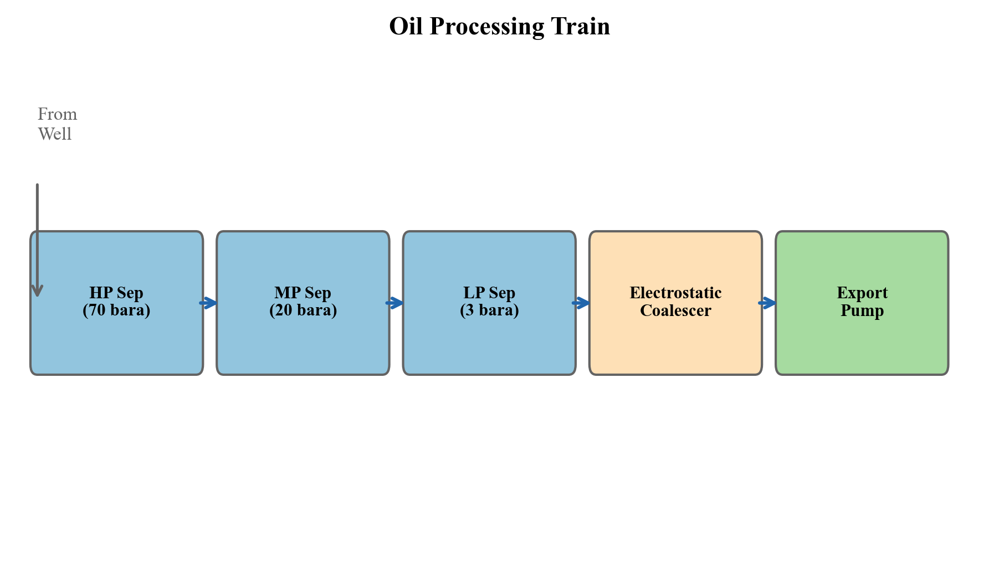
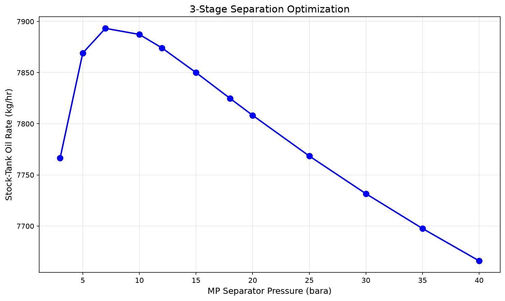
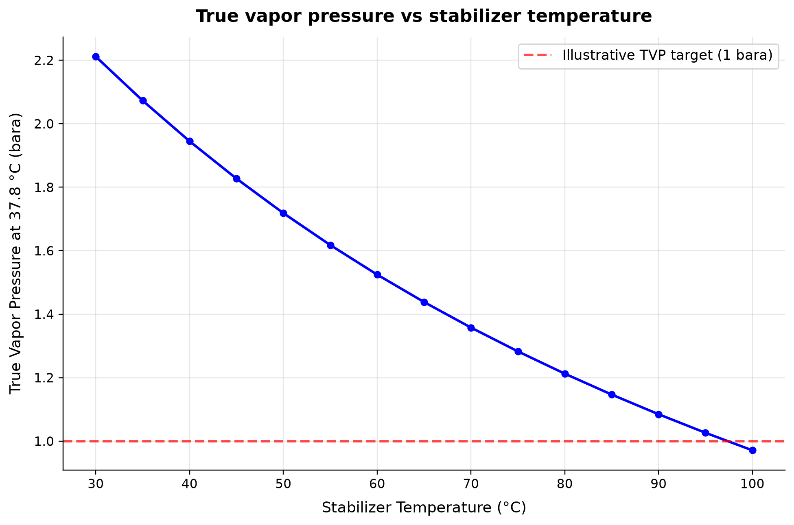
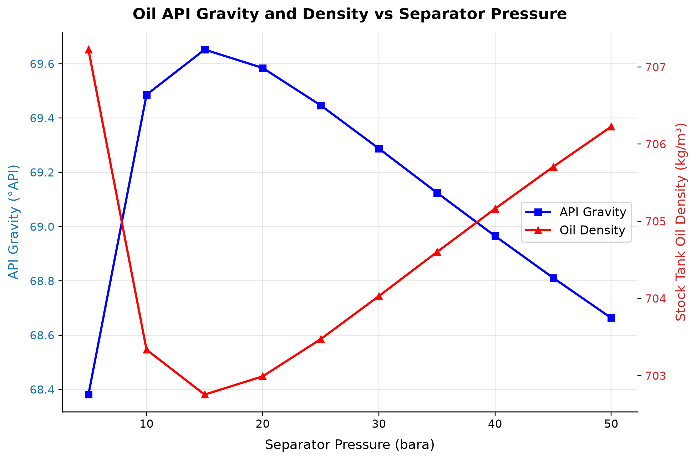
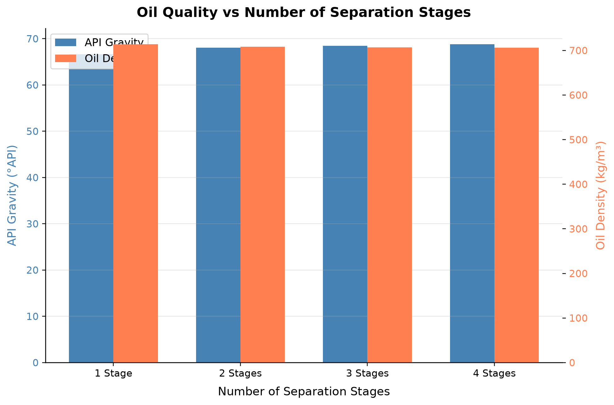
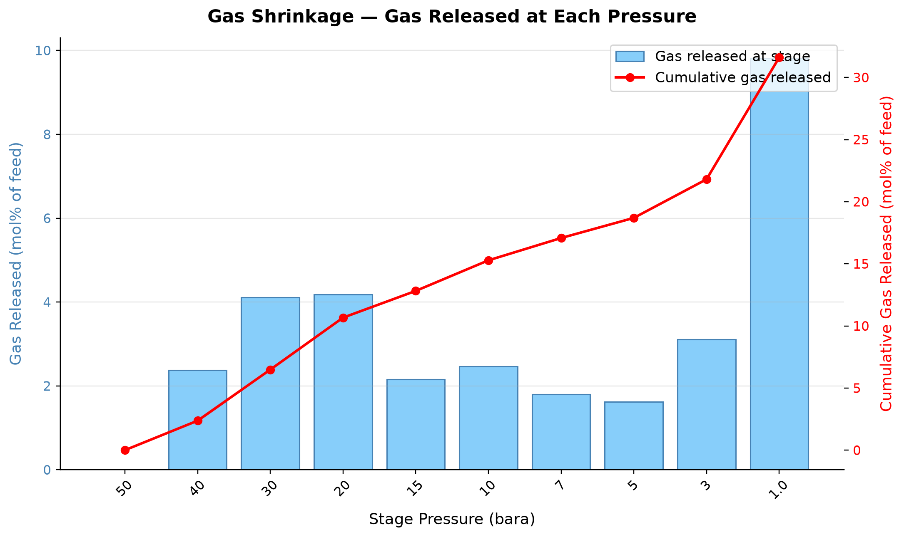

# Oil Processing and Stabilization

**Running the examples.** Start the source-workspace Python session described in Chapter 1, then run this chapter's Python blocks in reading order. Java blocks form a separate sequence using the same NeqSim build; carry forward objects from preceding Java blocks. The release execution records are in `verification/`; a successful run establishes API compatibility, while physical validation also requires the checks discussed in the text.

<!-- Chapter metadata -->
<!-- Notebooks: 01_multistage_separation_optimization.ipynb, 02_rvp_tvp_calculations.ipynb, 03_stabilizer_column.ipynb -->
<!-- Estimated pages: 22 -->

## Learning Objectives

After reading this chapter, the reader will be able to:

1. Design multi-stage separation trains and optimize separator pressure staging
2. Explain the principles of oil dewatering and desalting processes
3. Calculate Reid vapor pressure (RVP) and true vapor pressure (TVP) using NeqSim
4. Model crude oil stabilization using flash drums and stabilizer columns
5. Evaluate crude oil export quality specifications and blending strategies
6. Implement multi-stage separation optimization in NeqSim with ProcessSystem
7. Apply heat integration principles to oil processing facilities
8. Describe the challenges and techniques of heavy oil processing
9. Explain oil fiscal metering principles and allocation methods

## 11.1 Introduction to Oil Processing

The oil processing train on an offshore platform or onshore facility serves a critical function: transforming the raw well stream into a stabilized crude oil that meets export specifications. The well fluid arriving at the first-stage separator is a complex multiphase mixture of oil, gas, water, and sometimes sand. Through a series of carefully designed separation, heating, and stabilization steps, the oil phase is progressively conditioned to achieve the required vapor pressure, water content, and salt content for pipeline transport or tanker loading.

The design and optimization of the oil processing system has a direct impact on production revenue. Every mole of intermediate hydrocarbon (C$_3$–C$_6$) that remains in the oil phase rather than flashing to the gas phase increases oil production volume and revenue — provided the crude still meets vapor pressure specifications. Conversely, excessive light ends in the oil cause transportation hazards and quality penalties. The art of oil processing optimization lies in maximizing liquid recovery while meeting all quality constraints.

This chapter covers the complete oil processing chain from first-stage separation through export, with emphasis on the thermodynamic principles that govern each unit operation and their implementation in NeqSim.



Overview of a typical offshore oil processing train. Well fluid enters the HP separator and progresses through MP and LP separation stages, with gas routed to compression and oil to dewatering and stabilization before export.

## 11.2 Multi-Stage Separation

### 11.2.1 Principles of Stage-Wise Separation

When a reservoir fluid is produced to surface conditions, the pressure reduction from reservoir pressure (typically 200–400 bara) to export/storage pressure (1–3 bara) causes dissolved gas to evolve from the oil. If this pressure reduction occurs in a single flash from well pressure to atmospheric, the resulting violent liberation of gas entrains significant quantities of intermediate and heavy hydrocarbons into the vapor phase, reducing the stock-tank oil recovery.

Multi-stage separation addresses this problem by performing the pressure reduction in discrete steps, each in a separate vessel. At each stage, the gas that evolves is removed and routed to compression, while the oil passes to the next lower-pressure stage. The fundamental thermodynamic principle is that a gradual, staged pressure reduction allows lighter components (C$_1$, C$_2$) to evolve preferentially while retaining more of the intermediate components (C$_3$–C$_6$) in the liquid phase.

The number of equilibrium stages and their operating pressures are the key design variables. In practice:

- **Two-stage separation** (HP + stock tank): Simple, low CAPEX, common for small fields
- **Three-stage separation** (HP + LP + stock tank): Most common offshore configuration
- **Four-stage separation** (HP + MP + LP + stock tank): Large facilities, heavy oils

The incremental oil recovery from adding stages follows a law of diminishing returns:

| Configuration | Typical Oil Recovery Increase vs. Single Flash |
|---------------|------------------------------------------------|
| 2-stage | 10–20% |
| 3-stage | 15–25% |
| 4-stage | 17–28% |
| 5-stage | 18–29% |

*Table 11.1: Typical incremental oil recovery from multi-stage separation compared to single-stage flash. Values depend strongly on fluid composition and conditions.*

### 11.2.2 Optimal Pressure Staging — Rule of Thumb

A widely used heuristic for selecting intermediate separator pressures is the **equal pressure ratio** rule. For an $n$-stage separation train with inlet pressure $P_1$ and final (stock-tank) pressure $P_n$, the optimal intermediate pressures follow a geometric progression:

$$r = \left(\frac{P_1}{P_n}\right)^{1/(n-1)}$$

where $r$ is the pressure ratio per stage, and the intermediate pressures are:

$$P_k = P_1 \cdot r^{-(k-1)}, \quad k = 1, 2, \ldots, n$$

For a typical 3-stage system with HP at 70 bara and stock tank at 1.01 bara:

$$r = \left(\frac{70}{1.01}\right)^{1/2} = \sqrt{69.3} \approx 8.32$$

This gives intermediate pressures of approximately 70, 8.4, and 1.01 bara.

While this rule provides an excellent starting point, the true optimal pressures depend on the fluid composition, temperature profile, and economic factors. Heavy oils with high GOR benefit from more moderate pressure ratios, while lean condensates may require different staging. Rigorous optimization using process simulation always improves upon the equal-ratio heuristic.

### 11.2.3 Rigorous Optimization of Separator Pressures

The objective function for separator pressure optimization is typically to maximize stock-tank oil production rate (in Sm$^3$/d or bbl/d) subject to constraints on:

- Vapor pressure of the export crude (RVP or TVP specification)
- Minimum separator pressure for gas compression suction
- Maximum separator temperature (metallurgy limits)
- Gas flaring or compression capacity limits

Mathematically, for an $n$-stage train:

$$\max_{P_2, P_3, \ldots, P_{n-1}} \quad Q_{\text{oil,ST}}(P_2, P_3, \ldots, P_{n-1})$$

subject to:

$$\text{RVP}(P_2, \ldots, P_{n-1}) \leq \text{RVP}_{\text{spec}}$$
$$P_k \geq P_{k,\text{min}}, \quad k = 2, \ldots, n-1$$

The optimization landscape is generally smooth and unimodal for liquid recovery, making gradient-based methods effective. However, the interaction with vapor pressure constraints can create binding constraints that shift the optimum.

### 11.2.4 Temperature Effects in Separation

Separator temperature significantly affects oil recovery. Higher temperatures reduce oil viscosity and promote better gas–liquid separation (especially water–oil separation in the first stage), but also increase the vapor pressure of the oil and can cause excessive vaporization of intermediate components.

The temperature at each stage is determined by:

1. **Joule–Thomson cooling**: Pressure reduction across chokes cools the fluid
2. **Heat addition**: Heating coils or heat exchangers upstream of separators
3. **Heat loss**: Ambient cooling in flowlines and vessels

The temperature drop across a choke valve for a two-phase mixture can be estimated from the isenthalpic flash. For a typical North Sea oil, the JT coefficient is approximately 3–5°C per 10 bar pressure drop.

## 11.3 Oil Dewatering and Desalting

### 11.3.1 Water-in-Oil Emulsions

Raw crude oil typically contains 5–30% produced water as a dispersed phase, forming a water-in-oil (W/O) emulsion stabilized by natural surfactants — asphaltenes, resins, naphthenic acids, and fine solid particles. The stability of these emulsions depends on:

- **Interfacial film strength**: Asphaltenes form rigid films around water droplets
- **Droplet size distribution**: Smaller droplets are more stable
- **Continuous phase viscosity**: Higher viscosity retards droplet coalescence
- **Temperature**: Higher temperature reduces viscosity and weakens interfacial films
- **Water cut**: Very low or very high water cuts are easier to treat than intermediate ranges (20–40%)

The target specification for export crude is typically less than 0.5% BS&W (basic sediment and water), with many contracts specifying less than 0.1%.

### 11.3.2 Gravity Separation

The primary mechanism for water removal is gravity settling, governed by Stokes' law for the terminal velocity of a spherical water droplet in the oil phase:

$$v_t = \frac{d^2 (\rho_w - \rho_o) g}{18 \mu_o}$$

where $d$ is the droplet diameter, $\rho_w$ and $\rho_o$ are the water and oil densities, $g$ is gravitational acceleration, and $\mu_o$ is the oil dynamic viscosity.

For typical North Sea crude at separator conditions:

| Parameter | Value |
|-----------|-------|
| Oil density | 800–850 kg/m$^3$ |
| Water density | 1020–1050 kg/m$^3$ |
| Oil viscosity | 2–10 mPa·s |
| Droplet diameter | 100–500 μm |
| Settling velocity | 0.5–15 mm/s |

*Table 11.2: Typical parameters for gravity separation of water from crude oil.*

The retention time required for adequate water separation is:

$$t_{\text{ret}} = \frac{h_{\text{oil}}}{v_t}$$

where $h_{\text{oil}}$ is the oil pad height in the separator. Typical retention times range from 3 to 15 minutes depending on oil properties and the required outlet water cut.

### 11.3.3 Electrostatic Coalescers

For final dewatering to meet export specifications, electrostatic coalescers are almost universally employed. These devices apply a high-voltage electric field (typically 1–2 kV/cm) across the emulsion, which:

1. **Induces dipoles** in water droplets, causing attraction between adjacent droplets
2. **Deforms droplets**, stretching them toward neighboring drops
3. **Thins the interfacial film**, promoting coalescence
4. **Chain formation**: Droplets align in the field direction, creating chains that coalesce rapidly

The electrostatic force between two spherical droplets of radius $a$ separated by distance $d$ in a uniform field $E_0$ is:

$$F_e \propto \epsilon_o E_0^2 a^2 \left(\frac{a}{d}\right)^4$$

The strong dependence on both field strength and droplet proximity explains why electrostatic coalescers are most effective as a polishing step after bulk gravity separation has already removed the majority of the water.

#### AC, DC, and Dual-Frequency Coalescers

The choice of electrical excitation mode significantly affects coalescer performance:

- **DC (direct current)**: Creates a steady electric field that causes water droplets to migrate toward the electrodes. DC systems are effective for moderate emulsions but can suffer from electrode fouling and short-circuiting at high water cuts because charged droplets accumulate on electrode surfaces.
- **AC (alternating current)**: Alternates the field direction at line frequency (50/60 Hz), causing droplets to oscillate and vibrate rather than migrate. The oscillation promotes film thinning between adjacent droplets. AC systems are more tolerant of high water cuts and less prone to short-circuiting.
- **Dual-frequency (combined AC/DC)**: Modern coalescers use a combination of AC and DC fields — typically a DC bias with an AC component at optimized frequency (50–500 Hz). The DC component promotes chain formation and directional migration, while the AC component promotes vibration-induced coalescence. Dual-frequency systems achieve 30–50% better water removal than single-mode systems for difficult emulsions.

#### Coalescer Internals Design

The internal arrangement of electrodes determines the field uniformity and active volume:

| Parameter | Typical Value |
|-----------|--------------|
| Electrode spacing | 50–150 mm |
| Applied voltage | 10–35 kV |
| Field strength | 1–2 kV/cm |
| Vessel diameter | 2–4 m |
| Active length | 3–6 m |
| Residence time | 10–30 minutes |
| Operating temperature | 60–90°C |
| Maximum inlet water cut | 10–15% (AC), 5–8% (DC) |

*Table 11.3: Typical electrostatic coalescer design parameters.*

Electrode configurations include parallel plates (uniform field), concentric cylinders (radial field), and composite designs with insulated electrodes that prevent short-circuiting. Modern designs incorporate automated voltage control that adjusts field strength based on the measured water cut and current draw, preventing electrical breakdown.

### 11.3.4 Desalting

Crude oil contains dissolved salts (primarily NaCl, CaCl$_2$, and MgCl$_2$) in the residual water phase. These salts cause corrosion in downstream refinery equipment, particularly in crude distillation unit overhead systems where HCl is formed by hydrolysis:

$$\text{CaCl}_2 + \text{H}_2\text{O} \rightarrow \text{Ca(OH)}_2 + 2\text{HCl}$$

Export specifications typically require salt content below 10–50 PTB (pounds of salt per thousand barrels of oil). Desalting is accomplished by:

1. **Wash water injection**: Fresh water (3–7% by volume) is mixed with the crude
2. **Mixing**: A mixing valve creates a fine dispersion of wash water in oil
3. **Electrostatic coalescing**: The desalter separates the diluted brine from oil
4. **Brine rejection**: The water phase containing dissolved salts is routed to water treatment

The salt removal efficiency depends on the mixing intensity (quantified by the pressure drop across the mixing valve, typically 0.5–1.5 bar) and the number of stages.

#### Desalter Design Parameters

The key design variables for a desalter are:

| Parameter | Typical Range | Effect |
|-----------|--------------|--------|
| Wash water ratio | 3–7 vol% of crude | Higher ratio = better dilution but more water to treat |
| Mixing valve $\Delta P$ | 0.5–1.5 bar | Higher $\Delta P$ = better mixing but smaller droplets (harder to separate) |
| Operating temperature | 120–150°C | Higher temperature = lower viscosity, better separation |
| pH of wash water | 5.5–7.0 | Acid wash breaks emulsions; neutral wash minimizes corrosion |
| Demulsifier dosage | 5–20 ppm | Chemical aid for emulsion breaking |
| Electric field | 1–2 kV/cm | Coalescence of diluted brine droplets |

#### Two-Stage Desalting

For sour crudes or crudes with high salt content (> 100 PTB), two-stage desalting is required to achieve the target specification. In a two-stage system:

1. **First-stage desalter**: Removes the bulk of the salt (80–90% removal efficiency)
2. **Second-stage desalter**: Polishes the crude to meet the export specification

The wash water from the second stage (low salt concentration) is recycled as wash water to the first stage, creating a counter-current arrangement that minimizes fresh water consumption. Two-stage desalting can achieve 95–99% total salt removal, reducing salt content from 200+ PTB to below 10 PTB.

For extremely sour crudes containing high levels of CaCl$_2$ and MgCl$_2$ — which are more corrosive than NaCl — the desalting temperature is increased to 140–150°C and caustic (NaOH) is injected to convert calcium and magnesium chlorides to the less corrosive sodium chloride.

## 11.4 Crude Oil Stabilization

### 11.4.1 Purpose of Stabilization

Crude oil leaving the last separation stage still contains dissolved light hydrocarbons (primarily C$_1$–C$_4$) and dissolved gases (CO$_2$, H$_2$S). If exported in this condition, the crude would:

- Exceed vapor pressure specifications for pipeline transport or tanker loading
- Create safety hazards due to gas evolution during storage and handling
- Produce uncontrolled emissions of volatile organic compounds (VOCs)
- Risk cargo tank overpressure during marine transport

Stabilization removes these light components to meet the required vapor pressure specification, typically expressed as Reid Vapor Pressure (RVP) or True Vapor Pressure (TVP).

### 11.4.2 Flash Stabilization

The simplest stabilization method is flash stabilization, where the oil is heated and flashed at reduced pressure. The increased temperature shifts the vapor–liquid equilibrium to favor gas evolution, removing light ends. A typical flash stabilization system consists of:

1. **Heat exchanger**: Oil is heated to 60–90°C using hot produced water or waste heat
2. **Flash drum**: Heated oil flashes at 1–3 bara
3. **Cooler**: Stabilized oil is cooled for export

Flash stabilization is simple and reliable but has limited flexibility — there is no way to control the sharpness of the separation between light components (which should leave) and intermediate components (which should stay). This means that achieving a low RVP requires either high temperature (expensive, may cause thermal degradation) or excessive loss of C$_4$–C$_5$ to the gas phase (lost revenue).

### 11.4.3 Stabilizer Column

A stabilizer column provides a much sharper separation between light and intermediate components. It operates as a distillation column with:

- **Reboiler**: Provides heat to strip light ends from the oil
- **Overhead condenser**: Partially condenses overhead vapor, returning reflux
- **Trays or packing**: 10–20 theoretical stages
- **Feed entry**: Typically at the middle of the column

The key advantage of a stabilizer column over flash stabilization is the ability to make a sharp cut between C$_3$ and C$_4$. The column overhead product is rich in C$_1$–C$_3$ (and H$_2$S, CO$_2$), while the bottoms product is a stabilized crude with controlled C$_4$+ content. This allows meeting the RVP specification with minimum loss of valuable intermediate components.

Design parameters for a typical stabilizer column:

| Parameter | Typical Range |
|-----------|---------------|
| Number of trays | 10–25 |
| Operating pressure | 5–15 bara |
| Feed temperature | 80–120°C |
| Reboiler temperature | 150–250°C |
| Reflux ratio | 0.5–2.0 |
| Overhead temperature | 40–70°C |

*Table 11.4: Typical design parameters for a crude oil stabilizer column.*

The reboiler duty is the largest energy consumer in the oil processing system and is a prime candidate for heat integration with other process streams.

### 11.4.4 Flash Stabilization vs. Column Stabilization

The choice between flash and column stabilization involves a trade-off between capital cost, operating cost, and product value:

| Criterion | Flash Stabilization | Column Stabilization |
|-----------|-------------------|---------------------|
| CAPEX | Low (heater + drum) | High (column + reboiler + condenser) |
| OPEX (energy) | Moderate (heating only) | Higher (reboiler + condenser cooling) |
| C$_4$+ retention | Poor (significant C$_4$–C$_5$ losses) | Excellent (sharp C$_3$/C$_4$ split) |
| RVP control | Limited (temperature only) | Precise (reflux + reboiler duty) |
| H$_2$S removal | Partial | Good (H$_2$S exits in overhead) |
| Turndown capability | Good | Moderate (minimum vapor/liquid loading) |
| Space/weight | Low | High |

For high-value crudes where even 1% additional C$_4$+ recovery is worth millions of dollars per year, column stabilization is almost always economically justified. For small, marginal fields or satellite platforms with space constraints, flash stabilization may be preferred.

### 11.4.5 Stabilization Column Design

The design of a crude oil stabilizer follows the general principles of distillation column design, with some specific considerations:

**Number of stages**: Typically 10–20 theoretical stages are sufficient for a sharp C$_3$/C$_4$ split. The minimum number of stages can be estimated from the Fenske equation:

$$
N_{min} = \frac{\ln\left[\left(\frac{x_{C_3,D}}{x_{C_4,D}}\right) \cdot \left(\frac{x_{C_4,B}}{x_{C_3,B}}\right)\right]}{\ln \alpha_{C_3/C_4}}
$$

where $x$ denotes mole fractions, $D$ is distillate, $B$ is bottoms, and $\alpha_{C_3/C_4}$ is the relative volatility between propane and n-butane (typically 2.5–3.5 at stabilizer conditions).

**Reflux ratio**: The minimum reflux ratio is determined by the Underwood equation. Typical operating reflux ratios are 1.2–1.5 times the minimum. Higher reflux provides sharper separation but increases condenser and reboiler duties.

**Feed location**: The optimal feed tray divides the column into a rectifying section (above the feed, which enriches the overhead in light components) and a stripping section (below the feed, which strips lights from the bottoms). For crude oil stabilizers, the feed is typically introduced at the middle of the column.

**Reboiler duty**: The reboiler duty $Q_R$ determines the vapor traffic in the column and hence the degree of stripping. It can be estimated from:

$$
Q_R = L_B \cdot h_{vap} + (R + 1) \cdot D \cdot (h_{D,vap} - h_{D,liq})
$$

where $L_B$ is the bottoms rate, $h_{vap}$ is the latent heat, $R$ is the reflux ratio, and $D$ is the distillate rate.

### 11.4.6 Reboiler Considerations

The reboiler type and heat source significantly affect stabilizer performance and economics:

- **Fired heater**: Direct heating with fuel gas; high-temperature capability but safety concerns
- **Hot oil circuit**: Indirect heating using a closed-loop thermal oil system
- **Heat medium (glycol/water)**: Lower temperature applications
- **Waste heat recovery**: Utilizing gas turbine exhaust or compressor intercooler heat

The reboiler temperature determines the bottoms composition and hence the RVP. Higher reboiler temperatures produce a more stable crude but consume more energy and risk thermal cracking of heavy components if temperatures exceed approximately 340°C.

## 11.5 Vapor Pressure Specifications

### 11.5.1 Reid Vapor Pressure (RVP)

Reid Vapor Pressure is the vapor pressure of a liquid measured at 37.8°C (100°F) using the standardized test method ASTM D323 (or the automated version, ASTM D5191). The test uses a specific apparatus with a vapor-to-liquid volume ratio of 4:1, which means the measured RVP is not the true equilibrium vapor pressure but is slightly lower due to the vapor space dilution effect.

For an ideal multicomponent mixture, the RVP can be estimated from Raoult's law:

$$\text{RVP} \approx \sum_i x_i P_i^{\text{sat}}(37.8°C)$$

where $x_i$ is the liquid mole fraction and $P_i^{\text{sat}}$ is the pure component vapor pressure at 37.8°C.

However, this approximation ignores:
- Non-ideal mixing (activity coefficient effects)
- The vapor–liquid redistribution in the RVP apparatus (V/L = 4)
- Dissolved gases (which fully vaporize in the apparatus)

An accurate RVP calculation therefore requires a full flash calculation at the test conditions, accounting for the specific vapor-to-liquid ratio of the apparatus.

### 11.5.2 True Vapor Pressure (TVP)

True Vapor Pressure is the actual equilibrium vapor pressure of the liquid at its storage temperature, without the dilution effect of the RVP test apparatus. TVP is always higher than RVP and is the thermodynamically correct measure of volatility.

TVP is critical for:
- Tank breathing loss calculations
- Marine cargo tank design
- Environmental emission estimates
- Safety (flash point correlation)

The relationship between TVP and RVP depends on the oil composition but can be approximated as:

$$\text{TVP}(T) \approx \text{RVP} \times \exp\left[\frac{C_1}{T_{\text{RVP}}} - \frac{C_1}{T}\right]$$

where $C_1$ is a fluid-dependent constant and temperatures are in Kelvin.

### 11.5.3 Export Specifications

Crude oil export specifications vary by market and transportation mode:

| Specification | Pipeline | Tanker (ISGOTT) | Refinery Gate |
|---------------|----------|------------------|---------------|
| RVP (kPa) | < 65–100 | < 80–100 | < 82 |
| TVP at 50°C (kPa) | — | < 101.3 | — |
| BS&W (vol%) | < 0.5 | < 0.5 | < 0.1 |
| Salt (PTB) | < 50 | < 20 | < 10 |
| H$_2$S (ppm wt) | < 20 | < 50 | < 100 |
| Temp (°C) | < 60 | < 60 | Ambient |

*Table 11.5: Typical crude oil export specifications for different transportation modes.*

## 11.6 Oil Export Quality and Specifications

### 11.6.1 Comprehensive Export Quality Parameters

Beyond vapor pressure and water content, crude oil quality is characterized by several parameters that affect its market value:

- **API gravity**: Measures the oil density relative to water. Light crudes (>35° API) command premium prices; heavy crudes (<25° API) are discounted.

$$\text{API} = \frac{141.5}{\text{SG}_{60°F}} - 131.5$$

- **Sulfur content**: Sweet crudes (<0.5 wt% S) trade at a premium over sour crudes (>1.5 wt% S)
- **TAN (Total Acid Number)**: High-TAN crudes (>0.5 mg KOH/g) cause naphthenic acid corrosion
- **Wax content**: Affects pour point and pumpability
- **Asphaltene content**: Affects stability and emulsion tendency
- **Pour point**: The lowest temperature at which the crude flows under standard conditions; critical for pipeline transport in cold climates
- **Viscosity**: Affects pipeline transport, pumping requirements, and processing performance
- **Density (specific gravity)**: Used for custody transfer volume calculations

A comprehensive export specification for a typical North Sea crude is:

| Property | Specification | Test Method |
|----------|--------------|-------------|
| RVP | < 82 kPa | ASTM D323 |
| BS&W | < 0.5 vol% | ASTM D4007 |
| Salt content | < 20 PTB | ASTM D3230 |
| H$_2$S in vapor | < 10 ppm | GPA 2377 |
| Mercaptan sulfur | < 50 ppm | UOP 163 |
| Pour point | < +6°C | ASTM D97 |
| Density at 15°C | Report | ISO 12185 |
| Kinematic viscosity at 40°C | Report | ASTM D445 |

*Table 11.6: Detailed export specifications for a typical North Sea crude oil.*

### 11.6.2 Blending Optimization

On multi-well platforms or in commingled pipelines, the export crude is a blend of production from several reservoirs with different properties. Blending optimization seeks to maximize the value of the commingled stream while meeting all quality constraints.

For simple blending of $n$ streams, the blend properties can be estimated using mixing rules:

**Volume-additive properties** (API gravity, density):

$$\rho_{\text{blend}} = \sum_i f_i \rho_i$$

where $f_i$ is the volume fraction of stream $i$.

**Non-linear properties** (RVP):

$$\text{RVP}_{\text{blend}}^{1.25} = \sum_i x_i \text{RVP}_i^{1.25}$$

This is the Chevron blending index correlation, which provides a reasonable approximation for RVP blending. For rigorous calculations, the entire blend must be flashed in NeqSim.

## 11.7 Oil Heating, Cooling, and Wax Management

### 11.7.1 Crude Oil Heating

Oil heating is required at several points in the processing train:

- **Before the stabilizer column**: Oil is preheated to 80–120°C to achieve the required flash temperature and reduce reboiler duty
- **Before the desalter**: Heating to 120–150°C reduces oil viscosity for better water separation
- **For heavy oil transport**: Heating reduces viscosity to allow pipeline pumping

Common heat sources include:

- **Cross-exchange with hot process streams** (compressed gas, hot stabilizer bottoms)
- **Hot produced water** (available at 60–90°C, often the primary heat source)
- **Waste heat from gas turbines** (exhaust at 450–550°C, available via heat recovery steam generators)
- **Fired heaters** (used when other sources are insufficient, especially for stabilizer reboilers)

### 11.7.2 Oil Cooling Before Export

Stabilized crude oil leaving the reboiler or last separator may be too hot for direct export. Export temperature limits (typically < 60°C) are imposed to:

- Prevent thermal damage to pipeline coatings
- Limit vapor generation in cargo tanks during tanker loading
- Meet contractual temperature specifications

Crude oil coolers (typically shell-and-tube or plate-frame heat exchangers) cool the export oil using seawater or air cooling. The cooler design must account for the potential for wax deposition on cold heat transfer surfaces — a minimum wall temperature is maintained above the wax appearance temperature (WAT) to prevent fouling.

### 11.7.3 Pour Point and Wax Management

The pour point of crude oil is the lowest temperature at which the oil flows under standard test conditions (ASTM D97). It is governed by the crystallization of paraffin wax molecules (typically C$_{18}$–C$_{40}$ normal alkanes). When the oil temperature approaches the pour point:

- **Wax crystals form** and create a gel structure that immobilizes the liquid
- **Viscosity increases dramatically** (by 2–4 orders of magnitude over a narrow temperature range)
- **Pipeline restart after shutdown** becomes extremely difficult due to the high gel strength

Wax management strategies in oil processing include:

- **Heating**: Maintain oil temperature above WAT throughout the processing and transport chain
- **Pour point depressants (PPDs)**: Chemical additives that modify wax crystal morphology, reducing pour point by 10–30°C
- **Pigging**: Regular passage of pipeline pigs to remove deposited wax
- **Blending**: Mixing waxy crude with lighter diluent to reduce pour point and viscosity
- **Insulation**: Pipeline insulation to maintain temperature above WAT during transport

## 11.8 Heavy Oil Processing

### 11.8.1 Challenges with Heavy Oil

Heavy oils (API gravity < 22°) and extra-heavy oils (API < 10°) present unique processing challenges:

| Challenge | Cause | Impact |
|-----------|-------|--------|
| High viscosity | Large asphaltene/resin content | Difficult separation, pumping, and pipeline transport |
| Stable emulsions | Asphaltene interfacial films | Poor dewatering, high chemical costs |
| High pour point | Wax and asphaltene interactions | Pipeline gel formation during shutdown |
| Low API gravity | High proportion of heavy molecules | Lower product value, reduced refinery yield |
| Sand production | Unconsolidated reservoir | Erosion, accumulation in vessels |
| Foaming | Dissolved gas + surfactants | Poor separator performance |

### 11.8.2 Diluent Blending

The most common approach to heavy oil processing and transport is diluent blending — mixing the heavy crude with a lighter hydrocarbon (typically condensate, naphtha, or a synthetic crude oil) to reduce viscosity and density. The blended product is called "dilbit" (diluted bitumen) or "synbit" (synthetic crude + bitumen).

The viscosity of a blend can be estimated using the mixing rule:

$$\ln \mu_{blend} = x_1 \ln \mu_1 + x_2 \ln \mu_2$$

where $x_i$ is the volume fraction and $\mu_i$ is the viscosity of each component. This simple logarithmic mixing rule is approximate; for more accurate results, the Walther equation or ASTM D341 chart method should be used.

Typical diluent ratios range from 20% to 40% by volume, depending on the heavy oil viscosity and the pipeline specifications. The diluent reduces the blend viscosity from 10,000–100,000 mPa·s (heavy oil alone) to 100–500 mPa·s (pipeline specification).

### 11.8.3 Thermal Recovery Effects on Processing

Heavy oils produced by thermal recovery methods (SAGD — steam-assisted gravity drainage, CSS — cyclic steam stimulation) have distinct processing characteristics:

- **Higher temperature**: Produced fluid arrives at 150–250°C, which aids separation but may cause scaling and corrosion
- **High water cut**: SAGD production typically has 75–95% water cut (mostly condensed steam)
- **Emulsion stability**: Thermal cracking products act as additional emulsion stabilizers
- **Dissolved silica**: Steam condensate leaches silica from the formation, causing scaling in heat exchangers

Processing SAGD production requires specialized equipment: large free-water knockout drums to handle the high water volume, treaters operating at elevated temperature, and silica management systems (pH control, coagulant injection).

## 11.9 NeqSim Implementation

### 11.9.1 Multi-Stage Separation in NeqSim

NeqSim provides comprehensive support for modeling multi-stage separation through its `ProcessSystem` framework. Each separator stage is modeled as a `ThreePhaseSeparator` or `Separator` connected by streams, with gas outlet streams routed to compression and oil outlet streams routed to the next separation stage.

```python
import jpype
jneqsim = jpype.JPackage("neqsim")

# Define a typical North Sea crude oil
fluid = jneqsim.thermo.system.SystemSrkEos(273.15 + 80.0, 70.0)
fluid.addComponent("nitrogen", 0.5)
fluid.addComponent("CO2", 2.1)
fluid.addComponent("methane", 35.0)
fluid.addComponent("ethane", 5.2)
fluid.addComponent("propane", 4.1)
fluid.addComponent("i-butane", 1.2)
fluid.addComponent("n-butane", 2.5)
fluid.addComponent("i-pentane", 1.3)
fluid.addComponent("n-pentane", 1.8)
fluid.addComponent("n-hexane", 3.5)
fluid.addComponent("n-heptane", 5.0)
fluid.addComponent("n-octane", 8.0)
fluid.addComponent("n-nonane", 6.5)
fluid.addComponent("nC10", 5.0)
fluid.addComponent("nC11", 18.3)
fluid.setMixingRule("classic")
fluid.setMultiPhaseCheck(True)

# Create feed stream
feed = jneqsim.process.equipment.stream.Stream("Well Stream", fluid)
feed.setFlowRate(5000.0, "kg/hr")
feed.setTemperature(80.0, "C")
feed.setPressure(70.0, "bara")

# HP Separator (1st stage)
hp_sep = jneqsim.process.equipment.separator.ThreePhaseSeparator(
    "HP Separator", feed)

# Valve to MP
valve_hp_mp = jneqsim.process.equipment.valve.ThrottlingValve(
    "HP-MP Valve", hp_sep.getOilOutStream())
valve_hp_mp.setOutletPressure(15.0)

# MP Separator (2nd stage)
mp_sep = jneqsim.process.equipment.separator.ThreePhaseSeparator(
    "MP Separator", valve_hp_mp.getOutletStream())

# Valve to LP
valve_mp_lp = jneqsim.process.equipment.valve.ThrottlingValve(
    "MP-LP Valve", mp_sep.getOilOutStream())
valve_mp_lp.setOutletPressure(2.5)

# LP Separator (3rd stage)
lp_sep = jneqsim.process.equipment.separator.ThreePhaseSeparator(
    "LP Separator", valve_mp_lp.getOutletStream())

# Build and run process
process = jneqsim.process.processmodel.ProcessSystem()
process.add(feed)
process.add(hp_sep)
process.add(valve_hp_mp)
process.add(mp_sep)
process.add(valve_mp_lp)
process.add(lp_sep)
process.run()

# Report results
print("=== Multi-Stage Separation Results ===")
print(f"HP gas rate:  {hp_sep.getGasOutStream().getFlowRate('kg/hr'):.1f} kg/hr")
print(f"MP gas rate:  {mp_sep.getGasOutStream().getFlowRate('kg/hr'):.1f} kg/hr")
print(f"LP gas rate:  {lp_sep.getGasOutStream().getFlowRate('kg/hr'):.1f} kg/hr")
print(f"Oil out rate: {lp_sep.getOilOutStream().getFlowRate('kg/hr'):.1f} kg/hr")
print(f"Oil out temp: {lp_sep.getOilOutStream().getTemperature('C'):.1f} C")
```

### 11.9.2 Separator Pressure Optimization

The following example demonstrates a systematic optimization of separator pressures in a 3-stage separation train. The objective is to maximize stock-tank oil flow rate by varying the MP separator pressure:

```python
import jpype
jneqsim = jpype.JPackage("neqsim")
import matplotlib.pyplot as plt

def run_three_stage_separation(fluid_template, mp_pressure):
    """Run 3-stage separation with given MP pressure, return oil rate."""
    fluid = fluid_template.clone()

    feed = jneqsim.process.equipment.stream.Stream("Feed", fluid)
    feed.setFlowRate(10000.0, "kg/hr")
    feed.setTemperature(80.0, "C")
    feed.setPressure(70.0, "bara")

    hp_sep = jneqsim.process.equipment.separator.Separator("HP Sep", feed)

    valve1 = jneqsim.process.equipment.valve.ThrottlingValve(
        "Valve 1", hp_sep.getLiquidOutStream())
    valve1.setOutletPressure(mp_pressure)

    mp_sep = jneqsim.process.equipment.separator.Separator(
        "MP Sep", valve1.getOutletStream())

    valve2 = jneqsim.process.equipment.valve.ThrottlingValve(
        "Valve 2", mp_sep.getLiquidOutStream())
    valve2.setOutletPressure(1.5)

    lp_sep = jneqsim.process.equipment.separator.Separator(
        "LP Sep", valve2.getOutletStream())

    process = jneqsim.process.processmodel.ProcessSystem()
    process.add(feed)
    process.add(hp_sep)
    process.add(valve1)
    process.add(mp_sep)
    process.add(valve2)
    process.add(lp_sep)
    process.run()

    return lp_sep.getLiquidOutStream().getFlowRate("kg/hr")

# Define fluid
fluid = jneqsim.thermo.system.SystemSrkEos(273.15 + 80.0, 70.0)
fluid.addComponent("nitrogen", 0.3)
fluid.addComponent("CO2", 1.5)
fluid.addComponent("methane", 40.0)
fluid.addComponent("ethane", 6.0)
fluid.addComponent("propane", 4.0)
fluid.addComponent("i-butane", 1.5)
fluid.addComponent("n-butane", 2.5)
fluid.addComponent("i-pentane", 1.5)
fluid.addComponent("n-pentane", 2.0)
fluid.addComponent("n-hexane", 4.0)
fluid.addComponent("n-heptane", 6.0)
fluid.addComponent("n-octane", 8.0)
fluid.addComponent("nC10", 22.7)
fluid.setMixingRule("classic")

# Sweep MP pressure
mp_pressures = [3, 5, 7, 10, 12, 15, 18, 20, 25, 30, 35, 40]
oil_rates = []

for p in mp_pressures:
    rate = run_three_stage_separation(fluid, float(p))
    oil_rates.append(rate)
    print(f"MP = {p:5.1f} bara -> Oil rate = {rate:.1f} kg/hr")

# Plot optimization curve
plt.figure(figsize=(10, 6))
plt.plot(mp_pressures, oil_rates, 'bo-', linewidth=2, markersize=8)
plt.xlabel("MP Separator Pressure (bara)", fontsize=12)
plt.ylabel("Stock-Tank Oil Rate (kg/hr)", fontsize=12)
plt.title("3-Stage Separation Optimization", fontsize=14)
plt.grid(True, alpha=0.3)
plt.tight_layout()
plt.savefig("figures/mp_pressure_optimization.png", dpi=150,
            bbox_inches="tight")
plt.show()
```



Stock-tank oil recovery as a function of intermediate (MP) separator pressure for a 3-stage separation train. The optimum is typically found at 8–12 bara for this fluid composition.

### 11.9.3 RVP and TVP Calculations

NeqSim can calculate both RVP and TVP through appropriate flash calculations. A method-specific RVP estimate requires reproducing the applicable test conditions, including the vapor-to-liquid ratio and sample handling. A bubble-point flash at 37.8°C calculates equilibrium vapor pressure and is not ASTM D323 RVP. The following example reports only equilibrium vapor pressure:

```python
import jpype
jneqsim = jpype.JPackage("neqsim")

def calculate_tvp(oil_stream, temperature_C):
    """Calculate True Vapor Pressure at given temperature."""
    fluid = oil_stream.getFluid().clone()
    fluid.setTemperature(temperature_C + 273.15)

    ops = jneqsim.thermodynamicoperations.ThermodynamicOperations(fluid)
    ops.bubblePointPressureFlash(False)

    return fluid.getPressure("bara") * 100.0  # Convert to kPa

# Example: Calculate equilibrium vapor pressure of stabilized crude
fluid = jneqsim.thermo.system.SystemSrkEos(273.15 + 60.0, 2.0)
fluid.addComponent("methane", 0.1)
fluid.addComponent("ethane", 0.3)
fluid.addComponent("propane", 1.5)
fluid.addComponent("i-butane", 2.0)
fluid.addComponent("n-butane", 4.0)
fluid.addComponent("i-pentane", 3.5)
fluid.addComponent("n-pentane", 5.0)
fluid.addComponent("n-hexane", 10.0)
fluid.addComponent("n-heptane", 15.0)
fluid.addComponent("n-octane", 20.0)
fluid.addComponent("nC10", 38.6)
fluid.setMixingRule("classic")

stream = jneqsim.process.equipment.stream.Stream("Oil", fluid)
stream.setFlowRate(1000.0, "kg/hr")
stream.run()

rvp = calculate_tvp(stream, 37.8)
tvp_50 = calculate_tvp(stream, 50.0)
tvp_60 = calculate_tvp(stream, 60.0)

print(f"TVP (at 37.8°C): {rvp:.1f} kPa")
print(f"TVP at 50°C:     {tvp_50:.1f} kPa")
print(f"TVP at 60°C:     {tvp_60:.1f} kPa")
```

### 11.9.4 Stabilizer Column Modeling

A crude oil stabilizer column can be modeled in NeqSim using the `DistillationColumn` class. The following example demonstrates a complete stabilizer with reboiler and condenser:

```python
import jpype
jneqsim = jpype.JPackage("neqsim")

# Define unstabilized crude
fluid = jneqsim.thermo.system.SystemSrkEos(273.15 + 90.0, 8.0)
fluid.addComponent("methane", 2.0)
fluid.addComponent("ethane", 1.5)
fluid.addComponent("propane", 3.0)
fluid.addComponent("i-butane", 2.0)
fluid.addComponent("n-butane", 4.0)
fluid.addComponent("i-pentane", 3.0)
fluid.addComponent("n-pentane", 4.5)
fluid.addComponent("n-hexane", 8.0)
fluid.addComponent("n-heptane", 12.0)
fluid.addComponent("n-octane", 18.0)
fluid.addComponent("nC10", 42.0)
fluid.setMixingRule("classic")

# Create feed stream
feed = jneqsim.process.equipment.stream.Stream("Stabilizer Feed", fluid)
feed.setFlowRate(5000.0, "kg/hr")
feed.setTemperature(90.0, "C")
feed.setPressure(8.0, "bara")

# Create stabilizer column
# Parameters: name, equilibrium stages, hasReboiler, hasCondenser
stabilizer = jneqsim.process.equipment.distillation.DistillationColumn(
    "Crude Stabilizer", 5, True, False)
stabilizer.addFeedStream(feed, 5)  # Feed at the top of the stripping section

# Unrefluxed stripping section: specify reboiler temperature; calculate duty
stabilizer.getReboiler().setOutTemperature(273.15 + 105.0)
stabilizer.setTopPressure(8.0)
stabilizer.setBottomPressure(8.5)
stabilizer.setMaxNumberOfIterations(80, True)

# Build process
process = jneqsim.process.processmodel.ProcessSystem()
process.add(feed)
process.add(stabilizer)
process.run()

# Report results
overhead = stabilizer.getGasOutStream()
bottoms = stabilizer.getReboiler().getLiquidOutStream()

print(stabilizer.getConvergenceDiagnostics())
assert stabilizer.solved(), "Reject unsolved column products"
print("=== Stabilizer Results ===")
print(f"Overhead gas rate:  {overhead.getFlowRate('kg/hr'):.1f} kg/hr")
print(f"Overhead temp:      {overhead.getTemperature('C'):.1f} C")
print(f"Bottoms oil rate:   {bottoms.getFlowRate('kg/hr'):.1f} kg/hr")
print(f"Bottoms temp:       {bottoms.getTemperature('C'):.1f} C")
print(f"Reboiler duty:      {stabilizer.getReboiler().getDuty()/1e3:.1f} kW")
```

### 11.9.5 Flash vs. Column Stabilization Comparison

The following example compares two operating schemes using the same feed composition. Their different pressures, temperatures, and duties give different product quality. Recovery superiority cannot be inferred without matching the export vapor-pressure specification and accounting for energy.

```python
import jpype
jneqsim = jpype.JPackage("neqsim")

# Define unstabilized crude after LP separator
fluid = jneqsim.thermo.system.SystemSrkEos(273.15 + 65.0, 3.0)
fluid.addComponent("methane", 1.0)
fluid.addComponent("ethane", 0.8)
fluid.addComponent("propane", 2.5)
fluid.addComponent("i-butane", 1.8)
fluid.addComponent("n-butane", 3.5)
fluid.addComponent("i-pentane", 2.5)
fluid.addComponent("n-pentane", 4.0)
fluid.addComponent("n-hexane", 8.0)
fluid.addComponent("n-heptane", 14.0)
fluid.addComponent("n-octane", 20.0)
fluid.addComponent("nC10", 41.9)
fluid.setMixingRule("classic")

# --- Flash Stabilization ---
flash_fluid = fluid.clone()
flash_feed = jneqsim.process.equipment.stream.Stream("Flash Feed", flash_fluid)
flash_feed.setFlowRate(5000.0, "kg/hr")
flash_feed.setTemperature(65.0, "C")
flash_feed.setPressure(3.0, "bara")

# Heat and flash
heater = jneqsim.process.equipment.heatexchanger.Heater(
    "Flash Heater", flash_feed)
heater.setOutTemperature(273.15 + 85.0)

flash_drum = jneqsim.process.equipment.separator.Separator(
    "Flash Drum", heater.getOutletStream())

flash_proc = jneqsim.process.processmodel.ProcessSystem()
flash_proc.add(flash_feed)
flash_proc.add(heater)
flash_proc.add(flash_drum)
flash_proc.run()

flash_oil_rate = flash_drum.getLiquidOutStream().getFlowRate("kg/hr")

# --- Column Stabilization ---
col_fluid = fluid.clone()
col_feed = jneqsim.process.equipment.stream.Stream("Column Feed", col_fluid)
col_feed.setFlowRate(5000.0, "kg/hr")
col_feed.setTemperature(90.0, "C")
col_feed.setPressure(8.0, "bara")

stabilizer = jneqsim.process.equipment.distillation.DistillationColumn(
    "Stabilizer", 5, True, False)
stabilizer.addFeedStream(col_feed, 5)
stabilizer.getReboiler().setOutTemperature(273.15 + 105.0)
stabilizer.setTopPressure(8.0)
stabilizer.setBottomPressure(8.5)
stabilizer.setMaxNumberOfIterations(80, True)

col_proc = jneqsim.process.processmodel.ProcessSystem()
col_proc.add(col_feed)
col_proc.add(stabilizer)
col_proc.run()

col_oil_rate = stabilizer.getReboiler().getLiquidOutStream().getFlowRate("kg/hr")

# Compare
print(stabilizer.getConvergenceDiagnostics())
assert stabilizer.solved(), "Reject unsolved column products"
print("=== Flash vs. Column Stabilization ===")
print(f"Flash stabilization: oil rate = {flash_oil_rate:.1f} kg/hr")
print(f"Column stabilization: oil rate = {col_oil_rate:.1f} kg/hr")
print(f"Additional recovery:  {col_oil_rate - flash_oil_rate:.1f} kg/hr "
      f"({(col_oil_rate - flash_oil_rate) / flash_oil_rate * 100:.1f}%)")
```

### 11.9.6 Oil Property Calculations

NeqSim can calculate key oil properties used for export quality assessment. After running a flash calculation, the oil phase properties are accessed through the fluid object:

```python
import jpype
jneqsim = jpype.JPackage("neqsim")

# Define a stabilized crude oil
fluid = jneqsim.thermo.system.SystemSrkEos(273.15 + 40.0, 1.01325)
fluid.addComponent("n-pentane", 3.0)
fluid.addComponent("n-hexane", 8.0)
fluid.addComponent("n-heptane", 15.0)
fluid.addComponent("n-octane", 22.0)
fluid.addComponent("n-nonane", 18.0)
fluid.addComponent("nC10", 34.0)
fluid.setMixingRule("classic")

# Run TP flash and initialize properties
ops = jneqsim.thermodynamicoperations.ThermodynamicOperations(fluid)
ops.TPflash()
fluid.initProperties()

# Read oil properties
oil_density = fluid.getDensity("kg/m3")
# API gravity uses oil and water densities at 60 F, not the 40 C viscosity state.
reference_oil = fluid.clone()
reference_oil.setTemperature(288.7056)
reference_oil.setPressure(1.01325)
jneqsim.thermodynamicoperations.ThermodynamicOperations(reference_oil).TPflash()
reference_oil.initProperties()
oil_sg = reference_oil.getDensity("kg/m3") / 999.016
api_gravity = 141.5 / oil_sg - 131.5
oil_viscosity = fluid.getViscosity("cP")

print("=== Export Oil Properties ===")
print(f"Density at 40 C:   {oil_density:.1f} kg/m3")
print(f"Specific gravity:  {oil_sg:.4f}")
print(f"API gravity:       {api_gravity:.1f} API")
print(f"Viscosity at 40 C: {oil_viscosity:.2f} cP")
```

## 11.10 Oil Metering and Fiscal Allocation

### 11.10.1 Fiscal Metering Requirements

Accurate oil metering is essential for fiscal allocation and custody transfer. The typical offshore fiscal metering system includes:

1. **Prover loop**: Calibrates the flow meter using a known-volume piston or ball prover
2. **Turbine or ultrasonic meter**: Measures volumetric flow rate
3. **Densitometer**: Measures oil density for mass calculation
4. **Sampling system**: Continuous or grab samples for water cut, composition analysis
5. **Temperature and pressure transmitters**: For standard volume correction

The oil flow rate at standard conditions is calculated from:

$$Q_{\text{std}} = Q_{\text{actual}} \times \text{CTL} \times \text{CPL}$$

where CTL is the correction for temperature (thermal expansion) and CPL is the correction for pressure (compressibility). These factors are calculated per API MPMS Chapter 11.1.

### 11.10.2 Meter Types for Oil Service

| Meter Type | Principle | Accuracy | Advantages | Limitations |
|-----------|-----------|----------|------------|-------------|
| Turbine | Rotor speed ∝ velocity | ±0.15% | Proven technology, high accuracy | Sensitive to viscosity, moving parts |
| Coriolis | Mass flow via tube vibration | ±0.10% | Direct mass measurement, no prover needed | High cost, size limited (< 10") |
| Ultrasonic (transit time) | Sound velocity difference | ±0.15% | No moving parts, large bore | Requires clean fluid |
| Positive displacement | Trapped volume rotation | ±0.20% | Works with viscous oils | Pressure drop, moving parts |

**LACT (Lease Automatic Custody Transfer) units** combine a metering system with sampling, proving, and documentation in a single skid package. A typical LACT unit sequence is: strainer → air eliminator → BS&W monitor (divert if > spec) → meter → prover → sampler → back-pressure valve. The LACT unit automatically rejects oil that fails BS&W specifications and records custody transfer data.

**Coriolis meters** are increasingly popular for fiscal metering because they measure mass flow directly, eliminating the need for separate density measurement and the associated uncertainty in volume-to-mass conversion. They also provide a built-in density measurement that can be used for water-cut monitoring.

### 11.10.3 Prover Loops

A prover loop is a precisely calibrated pipe section used to determine the meter factor (K-factor) of a flow meter. The standard types are:

- **Uni-directional ball prover**: A sphere travels through a calibrated section; two detector switches measure the time and pulses. Requires a long straight section (10–30 m).
- **Bi-directional ball prover**: The sphere reverses direction, allowing a shorter overall length.
- **Small volume prover (compact prover)**: A piston-in-cylinder design that requires very little space. Particularly suited for offshore platforms where space is limited.

The meter factor is calculated as:

$$
K = \frac{N_{pulses}}{V_{prover} \times CTL_{prover} \times CPL_{prover}}
$$

where $N_{pulses}$ is the number of meter pulses during the prover run and $V_{prover}$ is the certified base volume of the prover.

### 11.10.4 Allocation Metering

Multi-well platforms require allocation metering to distribute total export revenue among individual wells or reservoirs. Allocation systems typically use:

- **Test separators**: Periodic well testing through a dedicated test separator
- **Multiphase flow meters**: Continuous monitoring of individual well production
- **Virtual metering**: Process simulation–based estimates using well models

The allocation factor for well $i$ is:

$$
f_i = \frac{Q_{oil,i}}{\sum_{j=1}^{N} Q_{oil,j}}
$$

where $Q_{oil,i}$ is the oil production rate from well $i$ measured during testing or by multiphase metering. The allocated export volume for well $i$ is then $V_{export,i} = f_i \times V_{export,total}$.

NeqSim can support virtual metering by modeling the relationship between wellhead conditions and separator outlet rates for each well.

## 11.11 Heat Integration in Oil Processing

### 11.11.1 Energy Consumers and Sources

The oil processing system contains both heat sources and heat sinks that can be integrated to reduce overall energy consumption:

**Heat sources (hot streams):**
- Compressed gas after compressor stages (120–180°C)
- Stabilizer overhead vapor (40–70°C)
- Produced water (60–90°C)
- Gas turbine exhaust (450–550°C)

**Heat sinks (cold streams):**
- Crude oil heating before stabilizer (ambient to 90°C)
- Reboiler duty for stabilizer column (150–250°C)
- Gas dehydration reboiler (180–204°C)

### 11.11.2 Pinch Analysis

Heat integration between these streams follows the principles of pinch analysis. The minimum approach temperature ($\Delta T_{\text{min}}$) is typically 10–20°C for liquid–liquid exchangers and 20–30°C for gas–liquid exchangers in oil processing applications.

The composite curves for a typical offshore facility show a pinch temperature around 80–100°C, with significant opportunity for recovery above the pinch (using compressed gas heat to preheat crude) and below the pinch (using produced water to preheat dehydration feed).

## 11.12 Worked Example: Complete Oil Processing Optimization

This comprehensive example brings together all the concepts in this chapter to optimize a complete oil processing system for a North Sea field.

**Problem statement**: A platform processes 15,000 Sm$^3$/d of crude oil from a reservoir at 250 bara and 95°C. The well stream GOR is 120 Sm$^3$/Sm$^3$ and water cut is 25%. Design and optimize a 3-stage separation train to maximize oil recovery while meeting an RVP specification of 82 kPa.

```python
import jpype
jneqsim = jpype.JPackage("neqsim")

# Step 1: Define the reservoir fluid
fluid = jneqsim.thermo.system.SystemSrkEos(273.15 + 95.0, 250.0)
fluid.addComponent("nitrogen", 0.45)
fluid.addComponent("CO2", 1.87)
fluid.addComponent("methane", 36.52)
fluid.addComponent("ethane", 6.78)
fluid.addComponent("propane", 4.35)
fluid.addComponent("i-butane", 1.28)
fluid.addComponent("n-butane", 2.65)
fluid.addComponent("i-pentane", 1.22)
fluid.addComponent("n-pentane", 1.58)
fluid.addComponent("n-hexane", 3.45)
fluid.addComponent("n-heptane", 5.22)
fluid.addComponent("n-octane", 7.85)
fluid.addComponent("n-nonane", 5.66)
fluid.addComponent("nC10", 21.12)
fluid.addComponent("water", 15.0)
fluid.setMixingRule("classic")
fluid.setMultiPhaseCheck(True)

# Step 2: Build the separation train
feed = jneqsim.process.equipment.stream.Stream("Well Stream", fluid)
feed.setFlowRate(50000.0, "kg/hr")
feed.setTemperature(85.0, "C")
feed.setPressure(65.0, "bara")

# HP Separator
hp_sep = jneqsim.process.equipment.separator.ThreePhaseSeparator(
    "HP Separator", feed)

# HP to MP valve
valve1 = jneqsim.process.equipment.valve.ThrottlingValve(
    "HP-MP Valve", hp_sep.getOilOutStream())
valve1.setOutletPressure(10.0)

# MP Separator
mp_sep = jneqsim.process.equipment.separator.ThreePhaseSeparator(
    "MP Separator", valve1.getOutletStream())

# MP to LP valve
valve2 = jneqsim.process.equipment.valve.ThrottlingValve(
    "MP-LP Valve", mp_sep.getOilOutStream())
valve2.setOutletPressure(2.0)

# LP Separator
lp_sep = jneqsim.process.equipment.separator.ThreePhaseSeparator(
    "LP Separator", valve2.getOutletStream())

# Step 3: Assemble process system
process = jneqsim.process.processmodel.ProcessSystem()
process.add(feed)
process.add(hp_sep)
process.add(valve1)
process.add(mp_sep)
process.add(valve2)
process.add(lp_sep)
process.run()

# Step 4: Report results
print("=" * 60)
print("MULTI-STAGE SEPARATION RESULTS")
print("=" * 60)
print(f"\nHP Separator (P = {hp_sep.getPressure():.1f} bara):")
print(f"  Gas rate:   {hp_sep.getGasOutStream().getFlowRate('kg/hr'):.0f} kg/hr")
print(f"  Oil rate:   {hp_sep.getOilOutStream().getFlowRate('kg/hr'):.0f} kg/hr")
print(f"  Water rate: {hp_sep.getWaterOutStream().getFlowRate('kg/hr'):.0f} kg/hr")

print(f"\nMP Separator (P = {mp_sep.getPressure():.1f} bara):")
print(f"  Gas rate:   {mp_sep.getGasOutStream().getFlowRate('kg/hr'):.0f} kg/hr")
print(f"  Oil rate:   {mp_sep.getOilOutStream().getFlowRate('kg/hr'):.0f} kg/hr")

print(f"\nLP Separator (P = {lp_sep.getPressure():.1f} bara):")
print(f"  Gas rate:   {lp_sep.getGasOutStream().getFlowRate('kg/hr'):.0f} kg/hr")
print(f"  Oil rate:   {lp_sep.getOilOutStream().getFlowRate('kg/hr'):.0f} kg/hr")

oil_out = lp_sep.getOilOutStream()
print(f"\nExport Oil Properties:")
print(f"  Temperature: {oil_out.getTemperature('C'):.1f} C")
print(f"  Flow rate:   {oil_out.getFlowRate('kg/hr'):.0f} kg/hr")
```


<!-- reviewed-notebook-results:start -->
## Reproduced Calculation Results

These examples use the stated fluid recipes and operating assumptions. Curves represent NeqSim calculations unless a caption identifies an analytical illustration, assumed equipment map or synthetic data.



True Vapor Pressure at 37.8 °C spans 0.971–2.212 bara across the plotted cases.

Stabilization heating removes volatile components, changing the equilibrium vapor pressure of the remaining oil at the reporting temperature. This bubble-point-based quantity is TVP; it must not be presented as an ASTM RVP result merely because the calculation uses 37.8°C. Specify the product sampling and vapor-pressure method, then choose duty with a quality margin and a corresponding liquid-recovery calculation.



API Gravity spans 68.38–69.65 °API across the plotted cases. Oil Density: stock tank oil density spans 702.8–707.2 kg/m³ across the plotted cases.

Separator pressure changes which light components remain in the oil; its reference-temperature density changes accordingly. API gravity is meaningful only at its defined density reference basis, and changes in API alone do not quantify saleable oil recovery. Calculate the oil sample density at 60°F and compare gravity together with stabilized oil volume and vapor pressure.



API Gravity spans 66.6–68.77 °API across the plotted cases. Oil Density spans 705.8–713.6 kg/m³ across the plotted cases.

Additional equilibrium separation stages alter the release of light components and the final liquid composition. Stage count alone does not determine oil quality or optimal recovery; stage pressures and heat input remain part of the specification. Compare alternatives at the same final oil-quality target and include the recompression and heating duties of the added stages.



Gas released at stage: gas released spans 0–9.812 mol% of feed across the plotted cases. Cumulative gas released spans 0–31.61 mol% of feed across the plotted cases.

Gas liberation at successive pressure reductions changes the amount and composition of material retained as liquid. A pressure-sweep phase split is not the same experiment as differential liberation unless evolved gas is explicitly withdrawn at every step. State whether the material is recombined or depleted between points, and reconcile liberated gas and remaining oil with the overall material balance.

Selected numerical ranges from the plotted cases:

| Quantity / series | Minimum | Maximum | Unit |
|---|---:|---:|---|
| True Vapor Pressure at 37.8 °C | 0.971 | 2.212 | bara |
| API Gravity | 68.38 | 69.65 | °API |
| API Gravity | 66.6 | 68.77 | °API |
| Gas released at stage: gas released | 0 | 9.812 | mol% of feed |

Ranges describe the sampled cases; they are not independent validation tolerances.
<!-- reviewed-notebook-results:end -->

## 11.13 Summary

This chapter has covered the complete oil processing chain from multi-stage separation through crude oil stabilization and export. The key takeaways are:

1. **Multi-stage separation** dramatically increases oil recovery compared to single-stage flash. The equal pressure ratio rule provides an excellent starting point, but rigorous optimization using NeqSim can improve recovery by 1–3%.

2. **Dewatering and desalting** are essential for meeting export specifications. Electrostatic coalescers — available in AC, DC, and dual-frequency configurations — are the standard technology for final polishing, while wash water injection with two-stage desalting achieves 95–99% salt removal.

3. **Crude stabilization** using a stabilizer column provides a sharper separation between light ends and valuable intermediates compared to simple flash drums, reducing losses and improving product value. The choice between flash and column stabilization depends on field size, product value, and available space.

4. **Vapor pressure calculations** (RVP and TVP) in NeqSim use bubble point flash calculations and can accurately predict whether export specifications are met.

5. **Oil export specifications** encompass RVP, BS&W, salt, H$_2$S, pour point, and density, with values depending on transport mode (pipeline, tanker, refinery gate).

6. **Wax management** through heating, pour point depressants, and pigging is essential for waxy crudes, while heavy oil processing requires diluent blending and specialized dewatering equipment.

7. **Fiscal metering** using turbine, Coriolis, or ultrasonic meters with prover loop calibration ensures accurate custody transfer, while allocation metering distributes revenue among individual wells.

8. **Heat integration** between the gas compression, stabilizer, and oil heating systems can significantly reduce the overall energy consumption of the facility.

9. **NeqSim's ProcessSystem** framework allows complete oil processing trains to be modeled, optimized, and analyzed in an integrated simulation environment.

## Exercises

**Exercise 11.1**: For a fluid with the following composition (mole%): C$_1$ 45, C$_2$ 7, C$_3$ 5, iC$_4$ 1.5, nC$_4$ 3, iC$_5$ 2, nC$_5$ 2.5, C$_6$ 4, C$_7$+ 30 — compare the stock-tank oil recovery for 2-stage, 3-stage, and 4-stage separation with HP pressure of 80 bara and stock-tank pressure of 1.01 bara. Use the equal pressure ratio method to set intermediate pressures.

**Exercise 11.2**: For the 3-stage separation train in Exercise 11.1, optimize the intermediate separator pressures to maximize stock-tank oil recovery. Plot oil recovery vs. intermediate pressure(s) and identify the optimum.

**Exercise 11.3**: Calculate the RVP and TVP at 50°C for the stabilized crude from Exercise 11.2. Determine if the crude meets an RVP specification of 82 kPa. If not, propose and model a stabilization scheme using NeqSim.

**Exercise 11.4**: A platform produces two crudes with the following properties: Crude A (32° API, RVP = 55 kPa, 8000 Sm$^3$/d) and Crude B (25° API, RVP = 35 kPa, 5000 Sm$^3$/d). Calculate the blended export crude API gravity and estimate the blended RVP.

**Exercise 11.5**: Design a crude oil stabilizer column with 15 theoretical stages for the LP separator oil from the worked example. The target RVP is 65 kPa. Determine the required reboiler duty and the overhead gas composition.

**Exercise 11.6**: Develop a heat integration scheme for the oil processing facility in the worked example. Identify heat sources and sinks, construct composite curves, and calculate the potential energy savings.

**Exercise 11.7**: Compare flash stabilization (heating to 85°C, flashing at 2 bara) and column stabilization (12 trays, 8 bara, 500 kW reboiler duty) for the unstabilized crude in Section 11.9.4. For each option, calculate the stabilized oil rate, C$_4$+ content, and estimated RVP.

**Exercise 11.8**: A heavy oil field produces 28° API crude with a viscosity of 85 mPa·s at 40°C and a pour point of 24°C. Calculate the blend viscosity and pour point if this crude is diluted with 30 vol% condensate (55° API, 0.3 mPa·s viscosity).

## References

1. Arnold, K. and Stewart, M. (2008). *Surface Production Operations, Vol. 1: Design of Oil Handling Systems and Facilities*, 3rd ed. Gulf Professional Publishing.
2. Manning, F.S. and Thompson, R.E. (1991). *Oilfield Processing, Vol. 2: Crude Oil*. PennWell Books.
3. Abdel-Aal, H.K., Aggour, M.A., and Fahim, M.A. (2003). *Petroleum and Gas Field Processing*. CRC Press.
4. Campbell, J.M. (2014). *Gas Conditioning and Processing, Vol. 2: The Equipment Modules*, 9th ed. Campbell Petroleum Series.
5. ASTM D323 (2020). Standard Test Method for Vapor Pressure of Petroleum Products (Reid Method).
6. API MPMS Chapter 11.1 (2004). Temperature and Pressure Volume Correction Factors for Generalized Crude Oils, Refined Products, and Lubricating Oils.
7. ISGOTT (2006). *International Safety Guide for Oil Tankers and Terminals*, 5th ed. Witherby Seamanship.
8. Lyons, W.C. and Plisga, G.J. (2005). *Standard Handbook of Petroleum and Natural Gas Engineering*, 2nd ed. Gulf Professional Publishing.
9. Devold, H. (2013). *Oil and Gas Production Handbook: An Introduction to Oil and Gas Production, Transport, Refining and Petrochemical Industry*, 3rd ed. ABB Oil and Gas.
10. Solbraa, E. (2002). Measurement and modelling of absorption of carbon dioxide into methyldiethanolamine solutions at high pressures. PhD thesis, Norwegian University of Science and Technology.
11. Eow, J.S. and Ghadiri, M. (2002). "Electrostatic enhancement of coalescence of water droplets in oil: A review of the technology." *Chemical Engineering Journal*, 85(2–3), 357–368.
12. Al-Otaibi, M.B., Elkamel, A., and Al-Sahhaf, T.A. (2003). "Experimental investigation of crude oil desalting." *Journal of Petroleum Science and Engineering*, 40(1–2), 27–36.

<!-- Chapter-level references are merged into master refs.bib -->

