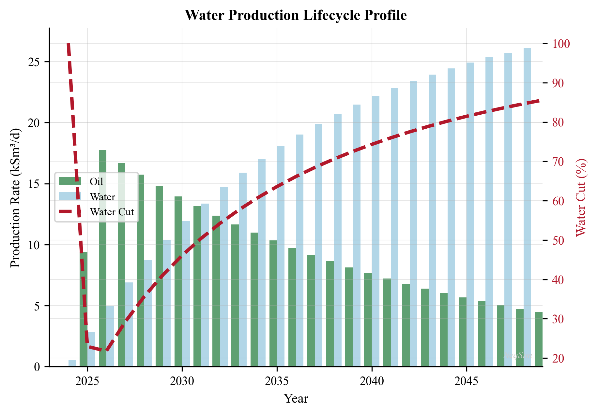
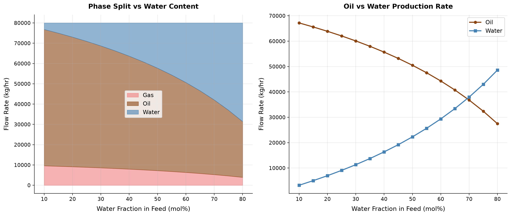
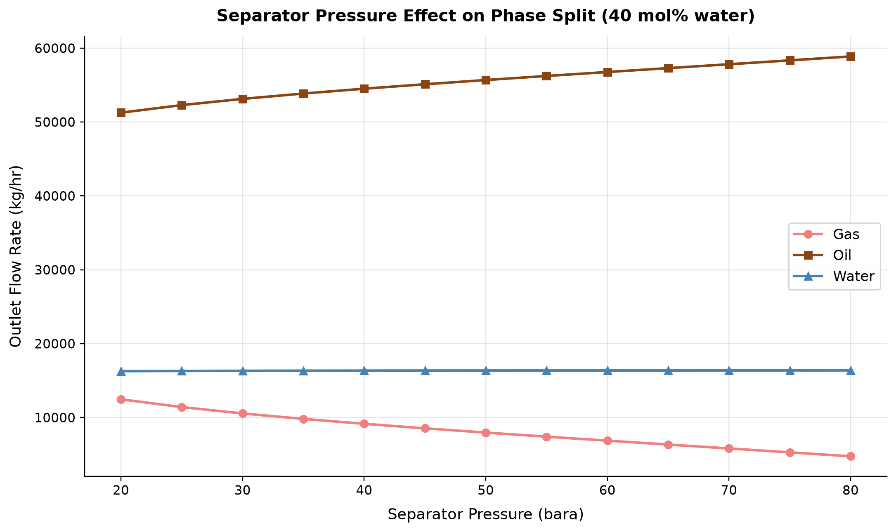

# Produced Water Treatment

**Running the examples.** Start the source-workspace Python session described in Chapter 1, then run this chapter's Python blocks in reading order. Java blocks form a separate sequence using the same NeqSim build; carry forward objects from preceding Java blocks. The release execution records are in `verification/`; a successful run establishes API compatibility, while physical validation also requires the checks discussed in the text.

<!-- Chapter metadata -->
<!-- Notebooks: ch16_produced_water_properties.ipynb, ch16_water_oil_equilibrium.ipynb -->
<!-- Estimated pages: 18 -->

## Learning Objectives

After reading this chapter, the reader will be able to:

1. Characterize produced water in terms of dispersed oil, dissolved hydrocarbons, dissolved solids, and production chemicals
2. Explain regulatory discharge requirements including the OSPAR 30 mg/L dispersed oil limit and zero-discharge regulations
3. Describe the operating principles and performance of key treatment technologies: hydrocyclones, induced/dissolved gas flotation, gravity separation, nutshell filters, and membrane systems
4. Evaluate oil-in-water measurement techniques and their limitations
5. Assess produced water reinjection (PWRI) requirements including injectivity, formation damage, and water quality specifications
6. Apply water chemistry fundamentals to predict scaling, souring, and corrosion risks
7. Model water phase properties, water-oil equilibrium, and dissolved gas partitioning using NeqSim with the CPA and Electrolyte CPA equations of state

---

## 13.1 Introduction

Produced water is the largest waste stream by volume in oil and gas production. For every barrel of oil produced globally, an average of three to five barrels of water are co-produced. On the Norwegian Continental Shelf (NCS) alone, produced water volumes exceed 150 million m³ per year. As fields mature, the water cut increases — often reaching 90–95% in late-life operations — making produced water management one of the most significant technical and economic challenges in production optimization.

The treatment of produced water sits at the intersection of process engineering, chemistry, environmental compliance, and reservoir management. The objectives of treatment depend on the disposal route:

- **Overboard discharge** requires meeting strict regulatory limits on dispersed oil and dissolved components
- **Produced water reinjection (PWRI)** demands water quality sufficient to maintain formation injectivity
- **Beneficial reuse** (irrigation, livestock, industrial) applies additional quality standards depending on jurisdiction

From a production optimization perspective, the produced water treatment system can become a bottleneck that limits the total liquid processing capacity of a facility. When water treatment equipment reaches its capacity, the entire production rate may be constrained. Understanding the performance characteristics and limitations of each treatment stage is therefore essential for maximizing field production.

This chapter covers the characteristics of produced water, regulatory frameworks, treatment technologies, measurement methods, reinjection considerations, water chemistry, and the use of NeqSim for modeling water-hydrocarbon interactions.

---

## 13.2 Produced Water Characteristics

Produced water is a complex mixture of formation water, injected water (seawater or aquifer water), and various contaminants introduced during the production process. Its composition varies significantly between fields and changes over the life of a field as water breakthrough patterns evolve.

### 13.2.1 Dispersed Oil

Dispersed oil refers to oil droplets suspended in the water phase. It is the primary regulated parameter for overboard discharge. The droplet size distribution (DSD) is critical for treatment equipment selection and performance:

$$
f(d) = \frac{1}{d \sigma \sqrt{2\pi}} \exp\left(-\frac{(\ln d - \mu)^2}{2\sigma^2}\right)
$$

where $f(d)$ is the log-normal probability density function, $d$ is the droplet diameter, $\mu$ is the mean of $\ln d$, and $\sigma$ is the standard deviation of $\ln d$.

Typical dispersed oil characteristics from production separators:

| Parameter | Typical Range |
|-----------|--------------|
| Concentration after 1st stage separator | 500–2000 mg/L |
| Concentration after 2nd stage separator | 200–500 mg/L |
| Median droplet size ($d_{50}$) after separator | 20–50 µm |
| Median droplet size after hydrocyclone | 5–15 µm |
| Density of dispersed oil | 750–900 kg/m³ |

The separation of oil droplets from water is governed by Stokes' law for creeping flow (Re < 1):

$$
v_s = \frac{(\rho_w - \rho_o) g d^2}{18 \mu_w}
$$

where $v_s$ is the terminal settling velocity, $\rho_w$ and $\rho_o$ are the water and oil densities, $g$ is gravitational acceleration, $d$ is the droplet diameter, and $\mu_w$ is the water viscosity. This equation shows that separation efficiency depends strongly on droplet size (squared relationship), density difference, and water viscosity.

### 13.2.2 Dissolved Hydrocarbons

Dissolved hydrocarbons include BTEX (benzene, toluene, ethylbenzene, xylenes), naphthalene, phenols, and polycyclic aromatic hydrocarbons (PAHs). Unlike dispersed oil, dissolved hydrocarbons cannot be removed by physical separation and require different treatment approaches.

Typical concentrations of dissolved organic compounds:

| Component | Concentration Range (mg/L) |
|-----------|---------------------------|
| Benzene | 0.5–15 |
| Toluene | 0.5–10 |
| Ethylbenzene | 0.01–1.5 |
| Xylenes | 0.1–5 |
| Naphthalene | 0.1–3 |
| Phenol (C0–C3) | 0.5–25 |
| PAH (total) | 0.01–0.5 |

The solubility of hydrocarbons in water follows Henry's law at low concentrations:

$$
x_i = \frac{p_i}{H_i(T)}
$$

where $x_i$ is the mole fraction of component $i$ in the aqueous phase, $p_i$ is its partial pressure, and $H_i(T)$ is the temperature-dependent Henry's law constant. The CPA equation of state, as implemented in NeqSim, provides a more rigorous treatment of water-hydrocarbon phase equilibria that accounts for the self-association of water molecules.

### 13.2.3 Dissolved Solids

Formation water contains dissolved minerals (salts) that affect water density, scaling tendency, and compatibility with injection formations. Key parameters include:

| Parameter | Typical Range (NCS fields) |
|-----------|---------------------------|
| Total dissolved solids (TDS) | 5,000–200,000 mg/L |
| Sodium (Na⁺) | 2,000–80,000 mg/L |
| Chloride (Cl⁻) | 3,000–130,000 mg/L |
| Calcium (Ca²⁺) | 100–30,000 mg/L |
| Barium (Ba²⁺) | 5–500 mg/L |
| Strontium (Sr²⁺) | 10–1,000 mg/L |
| Sulfate (SO₄²⁻) | 0–350 mg/L (formation) |
| Bicarbonate (HCO₃⁻) | 50–2,000 mg/L |

The density of produced water increases with salinity and can be estimated using correlations based on TDS:

$$
\rho_w = \rho_{w,0} \left(1 + \frac{C_{\text{TDS}}}{1{,}000{,}000 - C_{\text{TDS}}} \cdot \frac{M_{\text{salt}}}{\rho_{\text{salt}}}\right)
$$

where $\rho_{w,0}$ is the density of pure water, $C_{\text{TDS}}$ is the TDS concentration in mg/L, $M_{\text{salt}}$ is the effective molecular weight of the dissolved salts, and $\rho_{\text{salt}}$ is the density of the salt species.

### 13.2.4 Production Chemicals

A variety of production chemicals are used throughout the production system. These chemicals enter the produced water stream and can affect treatment performance:

| Chemical | Purpose | Typical Dose (ppm) | Impact on Water Treatment |
|----------|---------|--------------------|-----------------------------|
| Demulsifier | Break water-in-oil emulsions | 5–50 | Residual can stabilize oil-in-water emulsions |
| Corrosion inhibitor | Protect piping and vessels | 10–100 | Can stabilize dispersed oil; may foul membranes |
| Scale inhibitor | Prevent mineral scale | 2–50 | Generally benign; some types affect flotation |
| Wax inhibitor | Prevent wax deposition | 100–1000 | May increase dissolved organics in water |
| Hydrate inhibitor (MEG/MeOH) | Prevent hydrate formation | 500–30,000 | High concentrations affect water density, separation |
| Biocide | Control bacteria | 50–500 | May be required to meet reinjection standards |
| Oxygen scavenger | Remove dissolved O₂ | 5–30 | Prevents corrosion in injection systems |

The interaction between production chemicals and water treatment performance is often underappreciated. Overdosing of film-forming corrosion inhibitors, for example, can stabilize oil-in-water emulsions and significantly degrade hydrocyclone performance.

---

## 13.3 Regulatory Framework and Discharge Requirements

### 13.3.1 OSPAR Convention

The Oslo-Paris Convention (OSPAR) governs the protection of the marine environment in the North-East Atlantic. For produced water, OSPAR Recommendation 2001/1 (amended 2006) establishes:

- **Dispersed oil limit**: 30 mg/L as a monthly weighted average for overboard discharge
- **Performance standard**: Best Available Technique (BAT) and Best Environmental Practice (BEP)
- **Zero harmful discharge**: OSPAR's goal is to achieve zero discharge of hazardous substances by 2020 (aspirational)

The 30 mg/L limit is measured by the reference method ISO 9377-2 (hydrocarbon oil index using GC-FID after solvent extraction). Individual measurements may exceed 30 mg/L provided the monthly weighted average is met:

$$
\bar{C}_{\text{month}} = \frac{\sum_{i=1}^{n} C_i \cdot Q_i \cdot \Delta t_i}{\sum_{i=1}^{n} Q_i \cdot \Delta t_i} \leq 30 \text{ mg/L}
$$

where $C_i$ is the measured concentration, $Q_i$ is the water flow rate, and $\Delta t_i$ is the time interval for each measurement.

### 13.3.2 Norwegian Regulations

The Norwegian Environment Agency (Miljødirektoratet) regulates produced water discharge on the NCS. In addition to the OSPAR dispersed oil limit, operators must:

- Report and reduce discharge of naturally occurring radioactive material (NORM)
- Monitor and report dissolved organic compounds (BTEX, PAH, phenols, alkylphenols)
- Assess environmental risk using the Environmental Impact Factor (EIF)
- Implement a substitution principle for production chemicals (Green Chemistry)

### 13.3.3 Zero Discharge

Zero-discharge strategies are employed in environmentally sensitive areas and increasingly as a corporate sustainability goal. Options include:

1. **Produced water reinjection (PWRI)** — into the reservoir or a dedicated disposal formation
2. **Evaporation and crystallization** — energy-intensive; used for high-salinity waters
3. **Deep well disposal** — injection into non-productive formations
4. **Subsea separation and reinjection** — separates water on the seabed and reinjects directly

---

## 13.4 Treatment Technologies

The produced water treatment train is typically a multi-stage system, each stage targeting a specific contaminant or droplet size range. The following table summarizes common technologies and their performance:

| Technology | Oil Removal Range | Droplet Size Cut (µm) | Typical Inlet (mg/L) | Typical Outlet (mg/L) |
|------------|-------------------|----------------------|---------------------|----------------------|
| Gravity separator | Bulk removal | > 100 | 5,000–20,000 | 200–500 |
| Plate pack (CPI) | Primary treatment | > 40 | 200–1,000 | 50–100 |
| Hydrocyclone | Primary/secondary | > 10–15 | 200–2,000 | 15–40 |
| IGF (induced gas flotation) | Secondary | > 5–10 | 50–200 | 10–30 |
| DGF (dissolved gas flotation) | Secondary | > 3–5 | 50–200 | 5–15 |
| Nutshell filter | Tertiary/polishing | > 2–5 | 15–50 | 2–10 |
| Membrane (UF/MF) | Polishing | > 0.01–1 | 10–50 | < 5 |

### 13.4.1 Hydrocyclones

Deoiling hydrocyclones (also called liquid-liquid cyclones) are the workhorses of offshore produced water treatment. They exploit the density difference between oil and water using centrifugal force, generating accelerations of 1,000–2,000 g.

**Operating principle**: Produced water enters the hydrocyclone tangentially, creating a swirling flow. The denser water phase moves to the outer wall and exits through the underflow (clean water outlet), while the lighter oil phase migrates to the central core and is rejected through the overflow (reject outlet).

The separation efficiency of a hydrocyclone can be described by a grade efficiency curve, which gives the probability of separation as a function of droplet size. The cut size $d_{50}$ (droplet size with 50% removal probability) depends on the cyclone geometry and operating conditions:

$$
d_{50} = K \left(\frac{\mu_w D_c}{\Delta \rho Q}\right)^{1/2}
$$

where $K$ is a geometry-dependent constant, $\mu_w$ is the water viscosity, $D_c$ is the cyclone diameter, $\Delta\rho$ is the density difference between water and oil, and $Q$ is the volumetric flow rate.

**Key performance factors**:

- **Pressure drop ratio (PDR)**: The ratio of the reject-side pressure drop to the feed-side pressure drop. Typical PDR range is 1.5–3.0; higher PDR improves separation but increases energy consumption
- **Reject ratio**: The fraction of feed that exits through the overflow (typically 1–3% by volume). Higher reject ratios improve oil removal but waste more water
- **Flow rate**: Performance degrades at flows significantly below design; turndown is typically limited to about 50% of design flow
- **Oil droplet size**: Hydrocyclones are ineffective for droplets below approximately 10 µm
- **Temperature and fluid properties**: Higher water viscosity (lower temperature) reduces separation efficiency

### 13.4.2 Gas Flotation

Gas flotation units remove dispersed oil by attaching gas bubbles to oil droplets, increasing the effective buoyancy and accelerating separation. Two main variants exist:

**Induced Gas Flotation (IGF)**: Gas is mechanically dispersed into the water through a rotor-stator mechanism, creating bubbles of 100–1,000 µm. IGF units typically consist of 3–4 cells in series.

**Dissolved Gas Flotation (DGF)**: Gas (typically treated gas or nitrogen) is dissolved in water under pressure (4–6 bara) and released at atmospheric pressure, producing very fine bubbles (30–100 µm). The smaller bubble size of DGF provides better attachment to fine oil droplets, achieving superior performance for difficult-to-treat waters.

The rise velocity of a bubble-oil aggregate is given by the modified Stokes equation:

$$
v_{\text{agg}} = \frac{(\rho_w - \rho_{\text{agg}}) g d_{\text{agg}}^2}{18 \mu_w}
$$

where the aggregate density $\rho_{\text{agg}}$ is lower than that of the oil droplet alone due to the attached gas, and $d_{\text{agg}}$ is the effective aggregate diameter. The dramatic reduction in effective density and increase in effective diameter result in rise velocities 10–100 times greater than for the naked oil droplet.

**Flotation performance parameters**:

| Parameter | IGF | DGF |
|-----------|-----|-----|
| Bubble size (µm) | 100–1,000 | 30–100 |
| Residence time (min) | 2–4 per cell | 5–15 |
| Typical oil removal (%) | 85–95 | 90–98 |
| Pressure drop (bar) | 0.5–1.5 | 3–6 |
| Chemical addition | Usually needed | Often not needed |
| Footprint | Larger (multiple cells) | Compact |

### 13.4.3 Gravity Separation and Plate Packs

Gravity separation is the simplest and most robust treatment stage. Skim tanks and plate pack (corrugated plate interceptor, CPI) separators use gravity alone to separate oil from water.

For a plate pack separator, the separation area is enhanced by inclined plates (typically at 45–60°). The effective settling area is:

$$
A_{\text{eff}} = N \cdot L_p \cdot W_p \cdot \cos\theta
$$

where $N$ is the number of plate gaps, $L_p$ is the plate length, $W_p$ is the plate width, and $\theta$ is the plate angle from horizontal. The plate spacing is typically 20–40 mm.

### 13.4.4 Nutshell and Walnut Shell Filters

Nutshell filters (also called walnut shell filters or media filters) are the most common tertiary (polishing) treatment for produced water on offshore platforms. They use crushed walnut shell media (1–2 mm particle size) to physically adsorb and coalesce fine oil droplets.

**Operating cycle**:
1. **Filtration mode**: Water flows downward through the media bed; oil droplets are captured by adsorption and interception
2. **Backwash mode**: When the media becomes saturated (indicated by increased pressure drop or reduced outlet quality), the bed is backwashed with clean water and agitation to release trapped oil

Typical performance: inlet 15–50 mg/L dispersed oil, outlet 2–10 mg/L. Filter run times vary from 4 to 24 hours depending on inlet quality and flow rate.

### 13.4.5 Membrane Technologies

Membrane technologies (microfiltration, ultrafiltration, nanofiltration, and reverse osmosis) can achieve very high treatment levels but face challenges in produced water applications:

| Membrane Type | Pore Size | Removes | Challenge |
|---------------|-----------|---------|-----------|
| Microfiltration (MF) | 0.1–10 µm | Suspended solids, large droplets | Fouling by oil and scale |
| Ultrafiltration (UF) | 0.01–0.1 µm | Colloids, macromolecules | Irreversible fouling |
| Nanofiltration (NF) | 1–10 nm | Divalent ions, some organics | High pressure, fouling |
| Reverse Osmosis (RO) | < 1 nm | All dissolved solids | Very high pressure, expensive |

Ceramic membranes (alumina, zirconia, silicon carbide) offer advantages over polymeric membranes for produced water treatment due to their chemical resistance, thermal stability, and ability to tolerate higher oil concentrations. However, capital cost remains a barrier for widespread offshore adoption.

### 13.4.6 Treatment Train Design

The selection and sequencing of treatment technologies follows a systematic approach based on the target outlet quality and the inlet water characteristics. A typical offshore treatment train consists of:

**Level 1 — Bulk separation** (gravity, plate packs): Removes free oil and large droplets (> 100 µm); reduces oil concentration from 1,000–5,000 mg/L to 200–500 mg/L.

**Level 2 — Primary treatment** (hydrocyclones): Exploits centrifugal force for droplets > 10–15 µm; reduces to 15–40 mg/L. Hydrocyclones are preferred offshore due to compact footprint and no moving parts.

**Level 3 — Secondary treatment** (gas flotation): Targets fine droplets (5–10 µm) using gas-bubble attachment; reduces to 5–15 mg/L. DGF is preferred for difficult emulsions; IGF is simpler but less effective for fines.

**Level 4 — Polishing** (nutshell filters, membranes): Achieves < 5–10 mg/L for stringent discharge or reinjection requirements.

The overall treatment efficiency $\eta_{\text{total}}$ of a series arrangement is:

$$
C_{\text{out}} = C_{\text{in}} \cdot \prod_{j=1}^{n} (1 - \eta_j)
$$

where $C_{\text{in}}$ is the inlet concentration, $C_{\text{out}}$ is the outlet concentration, and $\eta_j$ is the single-pass efficiency of stage $j$. For a three-stage train with individual efficiencies of 90%, 85%, and 80%:

$$
C_{\text{out}} = 1{,}000 \times (1-0.90)(1-0.85)(1-0.80) = 1{,}000 \times 0.003 = 3 \text{ mg/L}
$$

This shows that even modest individual efficiencies, when combined in series, can achieve very low outlet concentrations.

**Key design considerations for the treatment train**:

- **Redundancy**: Critical stages (especially hydrocyclones) should have 2 × 100% or 3 × 50% redundancy to allow maintenance without production impact
- **Chemical compatibility**: Upstream chemical injections (demulsifiers, corrosion inhibitors) must be evaluated for their effect on downstream treatment equipment
- **Turndown capability**: The treatment train must handle the full range of water rates from first water to end-of-life maximum water cut
- **Solids handling**: Sand and scale particles can damage hydrocyclone liners and plug filter media; desanding equipment (desanders, sand jetting) should be included upstream
- **Reject handling**: Oil-rich reject streams from hydrocyclones and flotation must be recycled to the production separators or dedicated slop treatment

### 13.4.7 Compact Flotation Units (CFU)

Compact flotation units combine the principles of centrifugal separation and gas flotation in a single compact device. The produced water enters tangentially into a cylindrical vessel, creating a swirling flow pattern. Gas is injected at the base and the fine bubbles migrate to the center of the vortex along with oil droplets, forming an oily froth that is skimmed from the top.

CFUs offer significant advantages for offshore applications:

| Parameter | CFU | Conventional IGF |
|-----------|-----|-----------------|
| Footprint | 3–5 m² | 20–40 m² |
| Weight | 2–5 tonnes | 15–30 tonnes |
| Residence time | 10–30 s | 2–4 min per cell |
| Oil removal | 85–95% | 85–95% |
| Turndown | 50–120% | 70–110% |

The compact size and low weight make CFUs particularly attractive for platform upgrades where space and structural capacity are limited.

---

## 13.5 Oil-in-Water Measurement

Accurate measurement of oil-in-water (OiW) concentration is essential for regulatory compliance and process control. Several measurement techniques are used:

### 13.5.1 Measurement Methods

| Method | Principle | Range (mg/L) | Response Time | Reference |
|--------|-----------|-------------|---------------|-----------|
| IR absorption (ISO 9377-2) | GC-FID after extraction | 0.1–1,000 | 30–60 min (lab) | Regulatory reference |
| UV fluorescence | Aromatic absorption | 0.1–100 | Seconds (online) | Widely used online |
| Scattered light (turbidity) | Nephelometry | 1–1,000 | Seconds | Low cost |
| Laser-induced fluorescence (LIF) | Fluorescence | 0.01–500 | Seconds | High sensitivity |
| Particle counting | Light obscuration | Per droplet | Real-time | Size distribution |

**Important considerations**: Different methods measure different things. The regulatory reference method (ISO 9377-2) measures extractable hydrocarbons by GC-FID. Online UV fluorescence instruments measure aromatic compounds, which correlate with but do not equal total oil. Calibration of online instruments against the reference method is essential.

### 13.5.2 Measurement Challenges

- **Dissolved vs. dispersed**: UV fluorescence responds to both dissolved and dispersed hydrocarbons; the reference method primarily measures the dispersed fraction
- **Production chemicals**: Some chemicals (corrosion inhibitors, demulsifiers) can interfere with UV fluorescence readings
- **Sampling**: Representative sampling of a multiphase flow is difficult; isokinetic sampling or fixed-position probes may give biased results
- **Calibration drift**: Online instruments require regular calibration against laboratory analysis

---

## 13.6 Produced Water Reinjection (PWRI)

Produced water reinjection is increasingly preferred over overboard discharge for both environmental and reservoir management reasons. In PWRI, treated produced water is injected into the producing reservoir (for pressure maintenance) or into a dedicated disposal formation.

### 13.6.1 Injectivity and Formation Damage

The injectivity index defines the relationship between injection rate and bottomhole pressure:

$$
II = \frac{Q_{\text{inj}}}{P_{\text{BH}} - P_{\text{res}}}
$$

where $Q_{\text{inj}}$ is the injection rate, $P_{\text{BH}}$ is the bottomhole injection pressure, and $P_{\text{res}}$ is the reservoir pressure.

Formation damage from produced water injection manifests as declining injectivity over time. The principal mechanisms are:

1. **Suspended solids plugging**: Particles in the water block pore throats near the wellbore. The critical particle size is related to the median pore throat diameter:

$$
d_{\text{crit}} \approx \frac{1}{3} d_{\text{pore,50}}
$$

2. **Oil droplet retention**: Dispersed oil can block pore throats and alter wettability, reducing permeability near the wellbore.

3. **Scale precipitation**: When injected water mixes with formation water or when pressure and temperature conditions change, mineral scales (e.g., barium sulfate, calcium carbonate) may precipitate.

4. **Biological growth**: Bacteria (particularly sulfate-reducing bacteria, SRB) can form biofilms that plug the formation.

### 13.6.2 Water Quality Specifications for PWRI

Water quality requirements for reinjection are specific to each field and depend on formation permeability, fracture pressure, and injection strategy:

| Parameter | Matrix Injection (tight) | Matrix Injection (high perm) | Above Fracture Pressure |
|-----------|-------------------------|-----------------------------|-----------------------|
| Suspended solids (mg/L) | < 1 | < 5 | < 50 |
| Median particle size (µm) | < 1 | < 5 | Less critical |
| Oil-in-water (mg/L) | < 5 | < 20 | < 40 |
| Dissolved O₂ (ppb) | < 20 | < 50 | < 50 |
| Bacteria (SRB, /mL) | < 1 | < 10 | < 100 |

### 13.6.3 Injectivity Decline Modeling

A simple model for injectivity decline due to particle plugging is based on the cumulative injected volume:

$$
\frac{II(t)}{II_0} = \frac{1}{1 + \beta \cdot V_{\text{cum}}(t)}
$$

where $II_0$ is the initial injectivity index, $\beta$ is a formation-specific plugging coefficient (m³)⁻¹, and $V_{\text{cum}}(t)$ is the cumulative injected volume at time $t$. The plugging coefficient depends on water quality (particle concentration and size) and formation properties (permeability, pore size distribution).

---

## 13.7 Water Chemistry

### 13.7.1 Formation Water Composition and Analysis

Formation water composition varies enormously between reservoirs. Understanding the water chemistry is fundamental to predicting scaling, corrosion, and compatibility with injection water. A complete formation water analysis typically includes:

| Parameter | Typical Range (mg/L) | Significance |
|-----------|---------------------|-------------|
| Na⁺ | 5,000–100,000 | Dominant cation; affects ionic strength |
| Ca²⁺ | 100–30,000 | CaCO₃ and CaSO₄ scale risk |
| Mg²⁺ | 50–5,000 | Mg(OH)₂ scale at high pH |
| Ba²⁺ | 0–1,000 | BaSO₄ scale risk (critical) |
| Sr²⁺ | 0–2,000 | SrSO₄ scale risk |
| Fe²⁺/Fe³⁺ | 0–200 | FeS scale, indicator of corrosion |
| Cl⁻ | 10,000–200,000 | Dominant anion; salinity indicator |
| SO₄²⁻ | 0–500 | Usually low in formation water |
| HCO₃⁻ | 50–5,000 | CaCO₃ scale, buffering capacity |
| TDS | 20,000–300,000 | Total dissolved solids |

The **ionic strength** of the water is calculated from the total ion concentrations:

$$
I = \frac{1}{2} \sum_i c_i z_i^2
$$

where $c_i$ is the molar concentration and $z_i$ is the charge of ion $i$. Ionic strength affects activity coefficients, solubility products, and scale prediction accuracy. High-salinity brines (I > 1 mol/L) require activity coefficient models (Pitzer, e-CPA) rather than ideal dilute-solution approximations.

### 13.7.2 Scaling

Mineral scale formation occurs when the saturation index (SI) of a mineral exceeds zero. The saturation index for a mineral $AB$ is:

$$
SI = \log_{10}\left(\frac{[\text{A}^{m+}][\text{B}^{n-}]}{K_{sp}(T, P)}\right)
$$

where the bracketed terms are the ion activities in solution and $K_{sp}$ is the temperature- and pressure-dependent solubility product.

The most common scales in produced water systems are:

| Scale | Formula | Cause | Typical Location |
|-------|---------|-------|-----------------|
| Barium sulfate | BaSO₄ | Mixing Ba²⁺-rich formation water with SO₄²⁻-rich seawater | Topside/subsea mixing points |
| Calcium carbonate | CaCO₃ | CO₂ degassing, temperature increase | Wellbore, first-stage separator |
| Calcium sulfate | CaSO₄ | Temperature increase | Heat exchangers |
| Iron sulfide | FeS | H₂S + Fe²⁺ reaction | Throughout water system |
| Iron carbonate | FeCO₃ | CO₂ corrosion product | Piping |

**Barium sulfate** is the most problematic offshore scale because it is extremely insoluble and cannot be dissolved by conventional chemical treatments. Prevention (scale inhibitor injection) is the primary strategy.

The mixing of formation water and seawater creates a scaling risk that varies with the mixing ratio. The maximum scaling tendency typically occurs at 20–40% seawater fraction:

$$
m_{\text{scale}} = \text{min}(C_{\text{Ba}^{2+}} \cdot f_{\text{FW}}, C_{\text{SO}_4^{2-}} \cdot f_{\text{SW}}) \cdot \frac{M_{\text{BaSO}_4}}{M_{\text{limiting}}}
$$

where $f_{\text{FW}}$ and $f_{\text{SW}}$ are the mixing fractions of formation water and seawater respectively.

### 13.7.3 Incompatible Water Mixing: BaSO₄ Scale Risk Assessment

When formation water rich in barium ions mixes with injection seawater rich in sulfate ions, barium sulfate precipitation is virtually inevitable. A rigorous scale risk assessment involves:

**Step 1 — Stoichiometric screening:**

Calculate the maximum mass of BaSO₄ that could precipitate at each mixing ratio, assuming the limiting ion is fully consumed. For a formation water with Ba²⁺ = 250 mg/L and seawater with SO₄²⁻ = 2,700 mg/L:

$$
\text{Ba}^{2+} + \text{SO}_4^{2-} \rightarrow \text{BaSO}_4 \downarrow
$$

The molar ratio is 1:1 (MW of Ba = 137.3, SO₄ = 96.1, BaSO₄ = 233.4 g/mol). At each mixing fraction $f_{SW}$:

$$
[\text{Ba}^{2+}]_{\text{mix}} = C_{\text{Ba}} \cdot (1 - f_{SW})
$$

$$
[\text{SO}_4^{2-}]_{\text{mix}} = C_{\text{SO}_4} \cdot f_{SW}
$$

The limiting ion determines the maximum precipitate. The mass of BaSO₄ per m³ of mixed water peaks at the mixing ratio where the molar concentrations of Ba²⁺ and SO₄²⁻ are equal.

**Step 2 — Thermodynamic modeling:**

The stoichiometric calculation overestimates scale mass because it neglects the solubility of BaSO₄ at the actual conditions. NeqSim's Electrolyte CPA model provides a rigorous thermodynamic calculation that accounts for temperature, pressure, ionic strength, and ion pairing effects on the solubility product.

**Step 3 — Scale management strategy:**

Based on the severity assessment:

| Scale Mass (mg/L) | Severity | Management Strategy |
|-------------------|----------|-------------------|
| < 10 | Low | Monitor; no inhibitor needed |
| 10–50 | Moderate | Continuous scale inhibitor injection |
| 50–200 | Severe | High-dose inhibitor + squeeze treatment |
| > 200 | Critical | Sulfate removal unit (SRU) on injection water |

For North Sea fields with high barium concentrations (> 200 mg/L Ba²⁺), sulfate removal from the injection seawater (using nanofiltration membranes) is often the most cost-effective long-term solution, reducing the sulfate content from 2,700 mg/L to < 40 mg/L and virtually eliminating the BaSO₄ scaling risk.

### 13.7.2 Souring

Reservoir souring refers to the increase in H₂S concentration in produced fluids over time, typically caused by the activity of sulfate-reducing bacteria (SRB) in the reservoir. This occurs when sulfate-containing injection water (seawater) enters the reservoir and provides a sulfate source for SRB:

$$
\text{SO}_4^{2-} + \text{organic acids} \xrightarrow{\text{SRB}} \text{H}_2\text{S} + \text{CO}_2 + \text{H}_2\text{O}
$$

The H₂S partitions between phases according to thermodynamic equilibrium. NeqSim's CPA equation of state accurately models H₂S-water-hydrocarbon equilibria, enabling prediction of H₂S concentrations in each phase.

### 13.7.3 Corrosion

The principal corrosion mechanisms in produced water systems are:

**CO₂ corrosion** (sweet corrosion): The most common form of internal corrosion in oil and gas production. The corrosion rate depends on CO₂ partial pressure, temperature, pH, and flow velocity. The de Waard-Milliams model gives a first estimate:

$$
\log(CR) = 5.8 - \frac{1710}{T} + 0.67 \log(p_{\text{CO}_2})
$$

where $CR$ is the corrosion rate in mm/yr, $T$ is temperature in Kelvin, and $p_{\text{CO}_2}$ is the CO₂ partial pressure in bar.

**H₂S corrosion** (sour corrosion): H₂S accelerates corrosion at low concentrations and promotes sulfide stress cracking (SSC) in susceptible materials. NACE MR0175/ISO 15156 provides material selection criteria based on H₂S partial pressure, pH, temperature, and chloride concentration.

**Oxygen corrosion**: Even trace amounts of dissolved oxygen (> 20 ppb) can cause severe pitting corrosion, particularly in injection systems. Oxygen scavengers (bisulfite-based) are used to maintain oxygen below 10 ppb.

---

## 13.8 Chemical Treatment

### 13.8.1 Demulsifiers

Demulsifiers are surface-active chemicals that destabilize water-in-oil and oil-in-water emulsions. For produced water treatment, reverse demulsifiers (specific to oil-in-water emulsions) are sometimes needed when the primary W/O demulsifier creates residual emulsion stability in the water phase.

The selection of demulsifier type and dose is highly field-specific and typically determined through bottle tests. Key considerations:

- The primary W/O demulsifier should be optimized jointly with the produced water team, as over-dosing the primary demulsifier can worsen water quality
- Reverse demulsifiers act by displacing the stabilizing film around oil droplets, allowing coalescence
- Typical doses for reverse demulsifiers: 5–50 ppm based on water rate

### 13.8.2 Flocculants and Coagulants

Flocculants (polyelectrolytes) and coagulants (aluminum or iron salts) are used to aggregate fine oil droplets and suspended solids for improved removal in flotation or settling stages:

- **Coagulants** neutralize the electrical charge on dispersed particles, reducing repulsion and allowing aggregation
- **Flocculants** (long-chain polymers) bridge between particles, forming larger aggregates (flocs)
- Typical doses: coagulant 5–20 ppm, flocculant 1–10 ppm
- Over-dosing causes restabilization and can actually worsen effluent quality

### 13.8.3 Scale Inhibitors

Scale inhibitors work by adsorbing onto active growth sites of scale crystals, inhibiting nucleation and crystal growth. Common types include:

| Type | Active Compound | Effective Against | Thermal Stability |
|------|----------------|------------------|------------------|
| Phosphonate | ATMP, DTPMP, BHPMP | CaCO₃, BaSO₄ | Moderate (< 130 °C) |
| Phosphate ester | Various | CaCO₃, BaSO₄ | Good (< 150 °C) |
| Polycarboxylic acid | PPCA, PVS | BaSO₄, SrSO₄ | Good (< 180 °C) |
| Sulfonated polymer | Various | BaSO₄ | Excellent (> 200 °C) |

Scale inhibitor deployment methods:
- **Continuous injection** via chemical injection line (most common topside)
- **Squeeze treatment** — inhibitor is adsorbed onto the formation rock and slowly released during production (preferred for subsea wells)
- **Scale inhibitor in drilling/completion fluids** — provides early-life protection

---

## 13.9 NeqSim Modeling of Produced Water

NeqSim provides powerful capabilities for modeling water-hydrocarbon systems through the CPA (Cubic-Plus-Association) equation of state and the Electrolyte CPA model. These models are essential for predicting:

- Water content of hydrocarbon phases (gas and oil)
- Hydrocarbon solubility in the water phase
- Phase equilibria in systems with polar components (methanol, MEG)
- Ion activity and mineral solubility (Electrolyte CPA)
- Gas partitioning between phases (CO₂, H₂S in water)

### 13.9.1 CPA Equation of State for Water Systems

The CPA EOS combines the SRK cubic equation with the Wertheim association term:

$$
P = \frac{RT}{V_m - b} - \frac{a(T)}{V_m(V_m + b)} - \frac{RT}{V_m} \left(\frac{1}{V_m}\frac{\partial \ln g}{\partial (1/V_m)}\right) \sum_i x_i \sum_{A_i}(1 - X_{A_i})
$$

where the first two terms are the standard SRK contribution and the last term accounts for hydrogen bonding (association). $X_{A_i}$ is the fraction of molecules of component $i$ not bonded at site $A$, and $g$ is the radial distribution function.

The association term is critical for accurately modeling water and other hydrogen-bonding compounds. NeqSim implements the CPA model with carefully regressed parameters for water, methanol, MEG, DEG, TEG, and their interactions with hydrocarbons.

### 13.9.2 Water Phase Properties

The following example calculates water phase properties at production conditions using NeqSim's CPA model:

```python
import jpype
jneqsim = jpype.JPackage("neqsim")

# Create a CPA fluid system for produced water analysis
# Temperature in Kelvin, pressure in bara
fluid = jneqsim.thermo.system.SystemSrkCPAstatoil(273.15 + 80.0, 30.0)

# Add components — representing a simplified produced fluid
fluid.addComponent("methane", 0.70)      # mole fraction
fluid.addComponent("ethane", 0.05)
fluid.addComponent("propane", 0.03)
fluid.addComponent("nC4", 0.02)
fluid.addComponent("nC10", 0.05)         # representing heavier oil
fluid.addComponent("CO2", 0.02)
fluid.addComponent("H2S", 0.005)
fluid.addComponent("water", 0.115)

# Set CPA mixing rule (rule 10 for water-hydrocarbon systems)
fluid.setMixingRule(10)
fluid.setMultiPhaseCheck(True)

# Run three-phase flash to get oil, gas, and water phases
ops = jneqsim.thermodynamicoperations.ThermodynamicOperations(fluid)
ops.TPflash()
fluid.initProperties()

# Report phase fractions
print("=== Phase Distribution ===")
print(f"Number of phases: {fluid.getNumberOfPhases()}")
for phase_idx in range(fluid.getNumberOfPhases()):
    phase = fluid.getPhase(phase_idx)
    phase_type = phase.getPhaseTypeName()
    mole_frac = fluid.getMoleFraction(phase_idx)
    density = phase.getDensity("kg/m3")
    print(f"Phase {phase_idx} ({phase_type}): "
          f"mole fraction = {mole_frac:.4f}, "
          f"density = {density:.1f} kg/m³")

# Water phase properties
water_phase = fluid.getPhase("aqueous")
if water_phase is not None:
    print("\n=== Water Phase Properties ===")
    print(f"Density: {water_phase.getDensity('kg/m3'):.1f} kg/m³")
    print(f"Viscosity: {water_phase.getViscosity('cP'):.3f} cP")
    print(f"pH (estimated): {water_phase.getpH():.1f}")

    # Dissolved gas in water phase
    print("\n=== Dissolved Components in Water ===")
    for i in range(water_phase.getNumberOfComponents()):
        comp = water_phase.getComponent(i)
        name = comp.getComponentName()
        x_aq = comp.getx()  # mole fraction in aqueous phase
        if name != "water" and x_aq > 1e-8:
            print(f"  {name}: x = {x_aq:.6e} (mole fraction)")
```

### 13.9.3 Dissolved Gas in Water — CO₂ and H₂S Partitioning

Understanding how CO₂ and H₂S partition between hydrocarbon and water phases is critical for corrosion and souring predictions:

```python
import jpype
jneqsim = jpype.JPackage("neqsim")
import json

# Study CO2 partitioning between gas and water phases
# at varying pressures
pressures = [10.0, 20.0, 50.0, 100.0, 150.0, 200.0]  # bara
temperature_C = 80.0

results = []

for P in pressures:
    fluid = jneqsim.thermo.system.SystemSrkCPAstatoil(
        273.15 + temperature_C, P
    )
    fluid.addComponent("methane", 0.85)
    fluid.addComponent("CO2", 0.05)
    fluid.addComponent("H2S", 0.01)
    fluid.addComponent("water", 0.09)
    fluid.setMixingRule(10)
    fluid.setMultiPhaseCheck(True)

    ops = jneqsim.thermodynamicoperations.ThermodynamicOperations(fluid)
    ops.TPflash()
    fluid.initProperties()

    # Get CO2 mole fraction in aqueous phase
    aq_phase = fluid.getPhase("aqueous")
    if aq_phase is not None:
        x_CO2_water = aq_phase.getComponent("CO2").getx()
        x_H2S_water = aq_phase.getComponent("H2S").getx()
        results.append({
            "pressure_bara": P,
            "x_CO2_in_water": float(x_CO2_water),
            "x_H2S_in_water": float(x_H2S_water)
        })

# Display results
print(f"{'P (bara)':>10} {'x_CO2 (water)':>15} {'x_H2S (water)':>15}")
print("-" * 42)
for r in results:
    print(f"{r['pressure_bara']:>10.0f} "
          f"{r['x_CO2_in_water']:>15.6e} "
          f"{r['x_H2S_in_water']:>15.6e}")
```

### 13.9.4 Electrolyte CPA for Brine Systems

For systems with significant salinity, NeqSim's Electrolyte CPA model accounts for the effect of dissolved ions on phase equilibria:

```python
import jpype
jneqsim = jpype.JPackage("neqsim")

# Create an Electrolyte CPA system for brine-gas equilibrium
fluid = jneqsim.thermo.system.SystemElectrolyteCPAstatoil(
    273.15 + 60.0, 50.0
)

# Add gas components
fluid.addComponent("methane", 0.80)
fluid.addComponent("CO2", 0.03)

# Add water and ions (representing formation brine)
fluid.addComponent("water", 0.17)
fluid.addComponent("Na+", 0.001)
fluid.addComponent("Cl-", 0.001)

# Set mixing rule for electrolyte CPA
fluid.setMixingRule(10)
fluid.setMultiPhaseCheck(True)

# Run flash calculation
ops = jneqsim.thermodynamicoperations.ThermodynamicOperations(fluid)
ops.TPflash()
fluid.initProperties()

# Compare water content in gas with and without salinity
gas_phase = fluid.getPhase("gas")
if gas_phase is not None:
    x_water_in_gas = gas_phase.getComponent("water").getx()
    print(f"Water content in gas phase: {x_water_in_gas:.6e} mole fraction")
    print(f"Water density: {fluid.getPhase('aqueous').getDensity('kg/m3'):.1f} kg/m³")
```

The presence of dissolved salts reduces the water activity and consequently reduces the water content of the gas phase. This "salting-out" effect is important for water dew point calculations in sour gas systems.

### 13.9.5 Water-Oil Equilibrium: BTEX Partitioning

Understanding the partitioning of aromatic hydrocarbons between oil and water phases is essential for predicting dissolved hydrocarbons in produced water:

```python
import jpype
jneqsim = jpype.JPackage("neqsim")

# Model BTEX partitioning between oil and water
fluid = jneqsim.thermo.system.SystemSrkCPAstatoil(273.15 + 70.0, 20.0)

# Simplified oil with aromatics
fluid.addComponent("nC7", 0.40)         # paraffinic oil
fluid.addComponent("nC10", 0.30)
fluid.addComponent("benzene", 0.005)    # BTEX components
fluid.addComponent("toluene", 0.003)
fluid.addComponent("water", 0.262)

fluid.setMixingRule(10)
fluid.setMultiPhaseCheck(True)

ops = jneqsim.thermodynamicoperations.ThermodynamicOperations(fluid)
ops.TPflash()
fluid.initProperties()

# Check BTEX concentrations in water phase
aq_phase = fluid.getPhase("aqueous")
if aq_phase is not None:
    print("=== BTEX in Water Phase ===")
    for comp_name in ["benzene", "toluene"]:
        x_aq = aq_phase.getComponent(comp_name).getx()
        # Convert mole fraction to approximate mg/L
        # Using MW of water ~ 18 g/mol and water density ~ 1000 kg/m3
        mw_comp = aq_phase.getComponent(comp_name).getMolarMass() * 1000  # g/mol
        mw_water = 18.015
        c_mg_L = x_aq * mw_comp / mw_water * 1e6  # approximate
        print(f"  {comp_name}: x = {x_aq:.6e}, ~{c_mg_L:.1f} mg/L (approx)")
```

### 13.9.6 Temperature and Pressure Effects on Water Properties

The properties of produced water vary significantly with temperature and pressure. The following example generates a property table for process design:

```python
import jpype
jneqsim = jpype.JPackage("neqsim")

# Generate water property table for process design
temperatures_C = [20, 40, 60, 80, 100, 120]

print(f"{'T (°C)':>8} {'ρ (kg/m³)':>12} {'μ (cP)':>10} {'σ (mN/m)':>12}")
print("-" * 44)

for T in temperatures_C:
    fluid = jneqsim.thermo.system.SystemSrkCPAstatoil(273.15 + T, 10.0)
    fluid.addComponent("water", 1.0)
    fluid.setMixingRule(10)

    ops = jneqsim.thermodynamicoperations.ThermodynamicOperations(fluid)
    ops.TPflash()
    fluid.initProperties()

    water = fluid.getPhase("aqueous")
    if water is not None:
        rho = water.getDensity("kg/m3")
        mu = water.getViscosity("cP")
        print(f"{T:>8d} {rho:>12.1f} {mu:>10.3f}")
```

This data is directly relevant for sizing separation equipment: at higher temperatures, the lower water viscosity improves separation (lower drag on oil droplets), but the reduced density difference between oil and water offsets some of this benefit.

---

## 13.10 Integration with Production Optimization

The produced water treatment system interacts with the overall production system in several important ways:

### 13.10.1 Water Treatment as a Production Bottleneck

When the water treatment plant reaches capacity, the total liquid processing rate must be reduced. The maximum oil production rate under water treatment constraints is:

$$
Q_{\text{oil,max}} = Q_{\text{WT,capacity}} \cdot \frac{1 - \text{WC}}{\text{WC}}
$$

where $Q_{\text{WT,capacity}}$ is the maximum water treatment capacity and WC is the water cut. As the water cut increases, the maximum oil rate decreases rapidly:

| Water Cut (%) | Max Oil Rate (if WT = 10,000 m³/d) |
|---------------|-------------------------------------|
| 50 | 10,000 m³/d |
| 70 | 4,286 m³/d |
| 80 | 2,500 m³/d |
| 90 | 1,111 m³/d |
| 95 | 526 m³/d |

This exponential sensitivity to water cut drives the economic justification for water treatment upgrades, water shut-off treatments, and infill drilling strategies that target low-water-cut zones.

### 13.10.2 Separator Performance and Water Quality

The quality of water delivered from the production separators directly determines the load on downstream water treatment equipment. Key interactions include:

- **Separator residence time**: Longer residence time produces better water quality (larger oil droplets removed), but at the cost of reduced throughput
- **Chemical injection**: Demulsifier type and dose significantly affect the droplet size distribution in the separator water outlet
- **Temperature**: Higher separator temperature improves water-oil separation (lower viscosity) but increases volatile organic emissions and may affect downstream treatment chemistry
- **Separator internals**: Proper inlet device selection, weir plate design, and mist eliminator configuration all affect water quality

### 13.10.3 Lifecycle Water Management

Over the life of a field, the produced water strategy evolves:

1. **Early life** (low water cut): Minimal treatment required; overboard discharge is feasible
2. **Mid-life** (increasing water cut): Treatment capacity becomes limiting; consider PWRI
3. **Late life** (high water cut): Water treatment dominates the facility; consider subsea separation, water shut-off, or in-well treatment technologies
4. **Cessation of production**: Produced water treatment may be the single largest operating cost remaining



---

## 13.11 Emerging Technologies

### 13.11.1 Membrane Bioreactors (MBR)

Membrane bioreactors combine biological degradation of dissolved organics with membrane filtration for solid-liquid separation. In produced water treatment, MBRs target the dissolved organic fraction (BTEX, phenols, organic acids) that conventional physical treatment technologies cannot remove.

The biological component uses acclimated microbial cultures that metabolize dissolved hydrocarbons under aerobic or anaerobic conditions. The membrane (typically ultrafiltration, 0.01–0.1 µm pore size) retains the biomass in the reactor while producing a clarified permeate. Key advantages include compact footprint (no secondary clarifier), high effluent quality (turbidity < 1 NTU, BOD < 5 mg/L), and the ability to meet increasingly stringent discharge requirements for dissolved organics.

Challenges for offshore application include: membrane fouling by oil and scale, high energy consumption for aeration and transmembrane pressure, sensitivity of the microbial culture to salinity fluctuations and production chemical upsets, and the logistical complexity of managing biological sludge on a platform.

### 13.11.2 Electrocoagulation (EC)

Electrocoagulation uses sacrificial metal electrodes (typically aluminum or iron) to generate coagulant ions in situ through electrolytic dissolution. The metal ions form hydroxide flocs that destabilize emulsions, adsorb dissolved organics, and co-precipitate heavy metals:

$$
\text{Al} \rightarrow \text{Al}^{3+} + 3e^- \quad \text{(anode dissolution)}
$$

$$
\text{Al}^{3+} + 3\text{OH}^- \rightarrow \text{Al(OH)}_3 \quad \text{(floc formation)}
$$

$$
2\text{H}_2\text{O} + 2e^- \rightarrow \text{H}_2 + 2\text{OH}^- \quad \text{(cathode: hydrogen generation)}
$$

The hydrogen micro-bubbles generated at the cathode also provide a flotation effect, lifting oil droplets and flocs to the surface for removal — a process called **electroflotation**.

EC advantages: no chemical storage or dosing required (the electrode is the chemical); handles emulsions that resist conventional treatment; removes dissolved metals effectively; produces a more compact sludge than chemical coagulation. Disadvantages: electrode consumption requiring periodic replacement; passivation of electrodes requiring polarity reversal; energy consumption (1–5 kWh/m³); relatively limited offshore deployment experience to date.

### 13.11.3 Advanced Oxidation Processes (AOPs)

Advanced Oxidation Processes generate highly reactive hydroxyl radicals ($\text{OH}^{\bullet}$) that non-selectively oxidize dissolved organics to CO₂ and water. AOPs target recalcitrant dissolved organics (polycyclic aromatic hydrocarbons, phenols, alkylphenols) that resist biological treatment.

Common AOP technologies for produced water include:

| Technology | Radical Generation Method | Energy Source |
|-----------|--------------------------|--------------|
| UV/H₂O₂ | Photolysis of hydrogen peroxide | UV lamp |
| Ozone (O₃) | Direct ozonation + radical pathway | Ozone generator |
| Fenton process | Fe²⁺ + H₂O₂ catalytic reaction | Chemical (no energy) |
| Photo-Fenton | Fe²⁺ + H₂O₂ + UV light | UV lamp |
| TiO₂ photocatalysis | UV excitation of semiconductor | UV lamp |
| Electrochemical oxidation | Anodic generation at BDD electrode | Electricity |

The hydroxyl radical ($E^0 = 2.80$ V) is one of the strongest oxidizing agents known, capable of mineralizing virtually any organic compound. However, AOPs consume significant energy and oxidant, and the high salinity of produced water can scavenge radicals (Cl⁻ reacts with OH$^{\bullet}$ to form less reactive chlorine radicals), reducing treatment efficiency.

### 13.11.4 Zero Liquid Discharge (ZLD) Systems

Zero Liquid Discharge systems aim to eliminate all liquid effluent by converting produced water to a solid residue and clean water (distillate). ZLD is driven by regulations in water-scarce regions (Middle East, western United States) and by the desire to recover valuable resources from the brine (lithium, boron, iodine).

A typical ZLD train consists of:

1. **Pre-treatment** — oil removal, softening (removal of hardness ions to prevent scaling)
2. **Brine concentrator** — mechanical or thermal evaporator that concentrates the brine to 200,000–250,000 mg/L TDS
3. **Crystallizer** — further concentrates the brine to the point of salt crystallization
4. **Dewatering** — centrifuge or filter press to produce a solid salt cake

ZLD systems are energy-intensive (15–25 kWh/m³ for thermal processes) and expensive ($5–15/m³ treated water), making them uneconomic for most offshore applications. However, they are increasingly considered for:

- Onshore tight oil/shale developments where disposal wells are scarce or restricted
- Fields with very high TDS produced water (> 200,000 mg/L) that cannot be treated by conventional methods
- Environmental compliance in zero-discharge jurisdictions

| Technology | Oil Removal | Dissolved Organics | TDS Removal | Cost ($/m³) | Maturity |
|-----------|------------|-------------------|-------------|-------------|---------|
| Conventional train | Yes | Partial | No | 0.5–2 | Mature |
| MBR | Yes | Yes | No | 2–5 | Emerging |
| Electrocoagulation | Yes | Partial | No | 1–4 | Pilot |
| AOP | No | Yes | No | 3–8 | Pilot |
| ZLD | Yes | Yes | Yes | 5–15 | Commercial (onshore) |

---


<!-- reviewed-notebook-results:start -->
## Reproduced Calculation Results

These examples use the stated fluid recipes and operating assumptions. Curves represent NeqSim calculations unless a caption identifies an analytical illustration, assumed equipment map or synthetic data.



Oil: flow rate spans 2.747e+04–6.719e+04 kg/hr across the plotted cases. Water: flow rate spans 3210–4.861e+04 kg/hr across the plotted cases.

Rising water cut redirects produced-fluid handling capacity from hydrocarbon liquid toward water, with phase densities affecting mass-to-volume conversions. Total liquid throughput can remain large while oil production falls, making water treatment and disposal the active constraints. Report oil and water rates separately and evaluate treatment residence time, injection capacity and oil-in-water performance at late-life water cuts.



Gas: outlet flow rate spans 4748–1.246e+04 kg/hr across the plotted cases. Oil: outlet flow rate spans 5.126e+04–5.887e+04 kg/hr across the plotted cases.

Changing separator pressure alters gas liberation from the hydrocarbon phase and the equilibrium phase split of the mixed feed. The flash alone does not predict dispersed oil removal efficiency, emulsion behavior or the discharge water’s measured oil concentration. Use the calculated phase rates as loads for a treatment train, then apply validated separation-efficiency and water-quality models.

Selected numerical ranges from the plotted cases:

| Quantity / series | Minimum | Maximum | Unit |
|---|---:|---:|---|
| Oil: flow rate | 2.747e+04 | 6.719e+04 | kg/hr |
| Gas: outlet flow rate | 4748 | 1.246e+04 | kg/hr |

Ranges describe the sampled cases; they are not independent validation tolerances.
<!-- reviewed-notebook-results:end -->

## Summary

This chapter covered the theory and practice of produced water treatment in oil and gas production:

- **Produced water characteristics** — a complex mixture of dispersed oil, dissolved hydrocarbons (BTEX, PAH), dissolved solids, and production chemicals; the droplet size distribution is the critical parameter for treatment equipment selection
- **Regulatory framework** — OSPAR mandates a 30 mg/L monthly average for dispersed oil in overboard discharge; Norwegian regulations add requirements for dissolved organics and environmental risk assessment
- **Treatment technologies** — a multi-stage train from gravity separation through hydrocyclones, gas flotation, and polishing filters; each stage targets a specific droplet size range; membrane technologies offer the highest removal efficiency but face fouling challenges
- **Oil-in-water measurement** — the regulatory reference method (ISO 9377-2) differs from online measurements (UV fluorescence); calibration and sampling are critical
- **Produced water reinjection** — an increasingly preferred disposal route; water quality must be matched to formation permeability to avoid injectivity decline
- **Water chemistry** — scaling (especially BaSO₄ when mixing formation and injection water), souring (SRB activity with sulfate injection), and corrosion (CO₂, H₂S, O₂) are the principal chemical challenges
- **Chemical treatment** — demulsifiers, flocculants, and scale inhibitors are essential; proper dosing is critical as over-dosing can degrade performance
- **NeqSim modeling** — the CPA and Electrolyte CPA equations of state enable accurate modeling of water-hydrocarbon equilibria, dissolved gas partitioning, and the effect of salinity on phase behavior; these calculations support corrosion prediction, emissions estimation, and process design

---

## Exercises

**Exercise 13.1 — Oil Droplet Settling**
A gravity separation vessel operates at 60 °C with oil density 830 kg/m³ and water density 1,020 kg/m³. (a) Using Stokes' law, calculate the terminal settling velocity for oil droplets of diameter 10, 20, 50, 100, and 200 µm. Use water viscosity of 0.47 cP. (b) If the vessel has an effective separation area of 25 m² and a water throughput of 5,000 m³/day, what is the minimum droplet size that will be separated? (c) How does the answer change if the temperature drops to 30 °C (water viscosity 0.80 cP)?

**Exercise 13.2 — CO₂ and H₂S Partitioning**
Using NeqSim with the CPA equation of state, calculate the mole fraction of CO₂ and H₂S dissolved in the water phase for a gas containing 3 mol% CO₂ and 0.5 mol% H₂S (balance methane) in equilibrium with water at 70 °C. Vary the pressure from 10 to 200 bara in steps of 10 bara. Plot the dissolved gas concentration (mol/L) versus pressure for both components. At what pressure does CO₂ solubility in water begin to plateau?

**Exercise 13.3 — Hydrocyclone Performance Sensitivity**
A deoiling hydrocyclone has a design cut size $d_{50}$ of 12 µm at design conditions (water flow 500 m³/hr, oil density 850 kg/m³, water density 1,025 kg/m³, water viscosity 0.5 cP). Using the relationship $d_{50} \propto (\mu_w / \Delta\rho Q)^{1/2}$: (a) Calculate the cut size if the water rate drops to 250 m³/hr. (b) Calculate the cut size if the oil density increases to 920 kg/m³ (heavy oil). (c) Discuss the implications for produced water quality in each case.

**Exercise 13.4 — Scaling Risk Assessment**
Formation water contains Ba²⁺ = 250 mg/L and seawater contains SO₄²⁻ = 2,700 mg/L. (a) Calculate the mass of BaSO₄ scale (MW = 233.4 g/mol) that would precipitate per m³ of mixed water at mixing ratios of 10%, 20%, 30%, 40%, 50%, 60%, 70%, 80%, and 90% seawater. Assume the limiting ion is fully consumed. (b) Plot scale mass vs. seawater fraction. (c) At what mixing ratio is the scale mass maximum? (d) If the total mixed water rate is 8,000 m³/day at 30% seawater fraction, what is the daily mass of potential BaSO₄ scale?

**Exercise 13.5 — Salting-Out Effect on Water Dew Point**
Using NeqSim with the Electrolyte CPA model, compare the water content of a natural gas (90% methane, 5% ethane, 3% propane, 2% CO₂) in equilibrium with (a) pure water and (b) a NaCl brine with 100,000 mg/L TDS, at 50 bara and temperatures from 10 to 80 °C. Plot the water content (mg/Sm³) versus temperature for both cases. By how many degrees does salinity shift the water dew point?

---

## References

1. Fakhru'l-Razi, A., Pendashteh, A., Abdullah, L. C., Biak, D. R. A., Madaeni, S. S., and Abidin, Z. Z. (2009). "Review of technologies for oil and grease removal from wastewaters." *Journal of Hazardous Materials*, 170(2-3), 530–551.
2. Produced Water Society (2020). *Produced Water Handbook*. Produced Water Society.
3. Igunnu, E. T., and Chen, G. Z. (2014). "Produced water treatment technologies." *International Journal of Low-Carbon Technologies*, 9(3), 157–177.
4. OSPAR Commission (2001). *OSPAR Recommendation 2001/1 for the Management of Produced Water from Offshore Installations* (as amended 2006, 2014).
5. Rawlins, C. H. (2017). "Flotation of fine oil droplets in petroleum production circuits." In *Proceedings of the 163rd TMS Annual Meeting*.
6. Thew, M. T. (2004). "Hydrocyclone redesign for liquid-liquid separation." *The Chemical Engineer*, 17–23.
7. Zhu, T., and Bhavnani, S. H. (2009). "Produced water treatment — current and future directions." *SPE 134018*.
8. Walsh, J. M. (2015). "Produced Water." In *Handbook of Offshore Oil and Gas Operations*, Chapter 12. Elsevier.
9. Neff, J. M. (2002). *Bioaccumulation in Marine Organisms: Effects of Contaminants from Oil Well Produced Water*. Elsevier.
10. NORSOK M-506 (2005). *CO₂ Corrosion Rate Calculation Model*.
11. NACE MR0175/ISO 15156 (2015). *Petroleum and Natural Gas Industries — Materials for Use in H₂S-containing Environments*.
12. Kontogeorgis, G. M., and Folas, G. K. (2010). *Thermodynamic Models for Industrial Applications: From Classical and Advanced Mixing Rules to Association Theories*. Wiley.
13. ISO 9377-2 (2000). *Water Quality — Determination of Hydrocarbon Oil Index — Part 2: Method Using Solvent Extraction and Gas Chromatography*.
14. de Waard, C., and Milliams, D. E. (1975). "Carbonic acid corrosion of steel." *Corrosion*, 31(5), 177–181.


