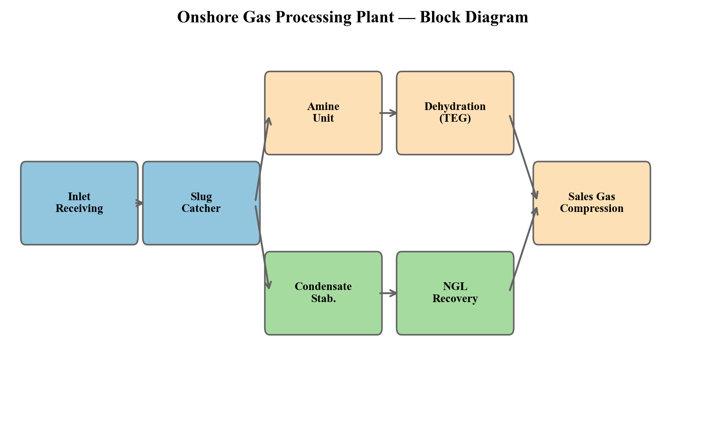
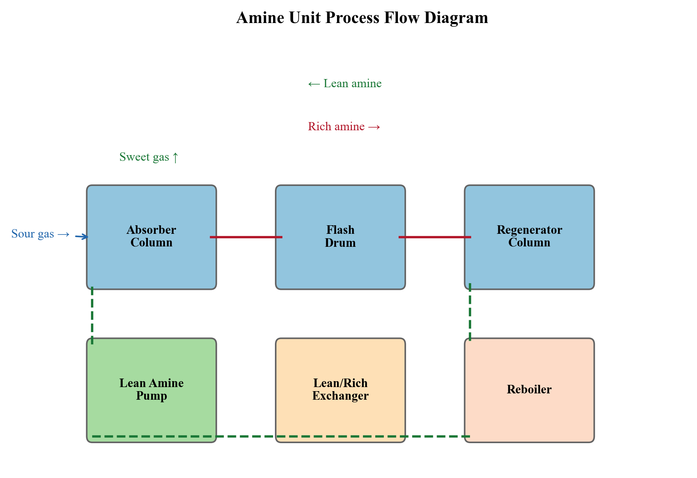
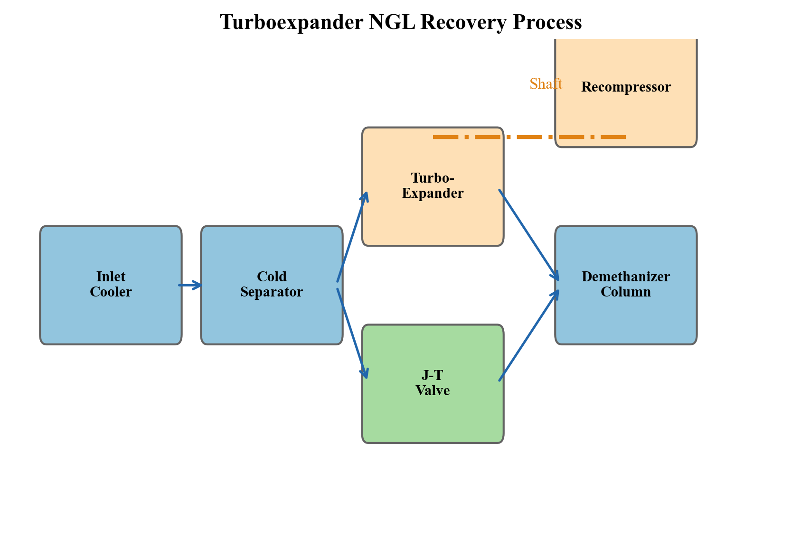
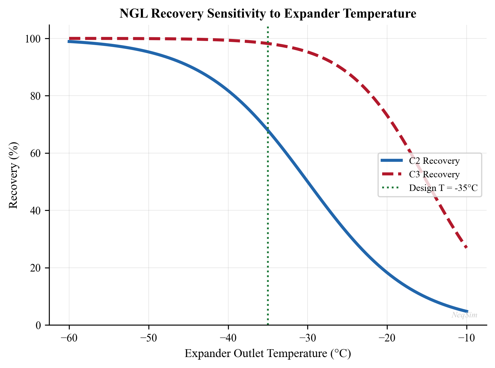
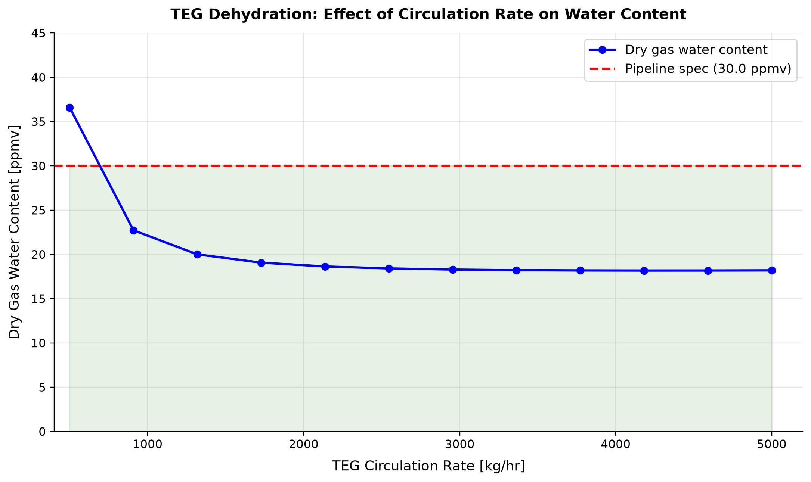
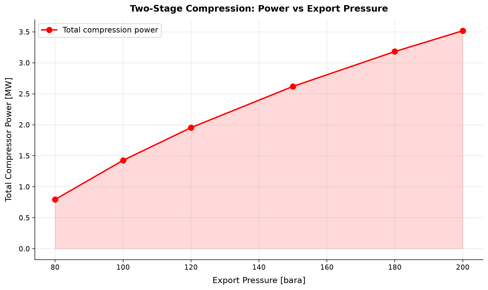

# Onshore Gas Processing Plants

<!-- Chapter metadata -->
<!-- Notebooks: ch22_onshore_gas_plant.ipynb, ch22_teg_dehydration.ipynb, ch22_ngl_recovery.ipynb, ch22_fractionation.ipynb -->
<!-- Estimated pages: 25 -->

## Learning Objectives

After reading this chapter, the reader will be able to:

1. Explain the fundamental differences between onshore gas plants and offshore platforms in terms of constraints, capacity, and process complexity
2. Describe the function and design of inlet receiving facilities, including slug catchers and inlet separators
3. Explain the gas sweetening process using amine units, including the chemistry, thermodynamics, and key design variables
4. Design and simulate a complete TEG dehydration system with full regeneration loop for pipeline-quality gas production
5. Compare NGL recovery technologies — turboexpander, Joule–Thomson (JT), and mechanical refrigeration — and select the appropriate method based on feed composition and recovery targets
6. Describe the fractionation train (demethanizer, deethanizer, depropanizer, debutanizer) and explain how product specifications drive column design
7. Outline the Claus process for sulfur recovery and the principles of tail gas treatment
8. Build a complete onshore gas plant model in NeqSim using ProcessModel with multiple ProcessSystem areas covering inlet separation, TEG dehydration, turboexpander NGL recovery, and fractionation

---

## 33.1 Introduction

The preceding chapters have primarily addressed offshore production optimization — the domain of compact, weight-constrained topsides modules mounted on platforms, FPSOs, and subsea systems. Onshore gas processing plants represent a fundamentally different engineering paradigm. Freed from the tyranny of weight and space, onshore plants achieve processing depths and product recovery levels that are simply impossible offshore.

An onshore gas processing plant is where raw natural gas is transformed into multiple valuable products: pipeline-quality sales gas, ethane, propane, butane, natural gasoline, and sometimes elemental sulfur. These plants range in capacity from 50 MMscfd for small gathering systems to over 3 Bscfd for world-scale facilities in the Middle East.

Understanding onshore plant design is essential for production optimization because:

- **Onshore plants set the inlet specifications** for gathering systems and offshore export pipelines. The plant's requirements propagate upstream to every wellpad, compressor station, and pipeline in the production network.
- **Debottlenecking onshore plants** is often the fastest route to production increase when field capacity is constrained by processing rather than reservoir deliverability.
- **Economic optimization** of an onshore plant involves balancing NGL recovery (revenue) against energy consumption (cost), a trade-off that changes with commodity prices and seasonal demand.
- **Many offshore developments** are tied back to onshore plants, making the entire production chain from reservoir to market an integrated optimization problem.

### 33.1.1 Onshore vs Offshore — Key Differences

The design philosophy for onshore gas plants differs markedly from offshore platforms:

| Design Aspect | Offshore Platform | Onshore Gas Plant |
|--------------|-------------------|-------------------|
| **Weight** | Critical constraint (steel costs $5–15/kg) | Not a constraint |
| **Space** | Severely limited (deck area premium) | Abundant (plot plan driven by safety distances) |
| **Capacity** | 50–500 MMscfd typical | 200–3000+ MMscfd possible |
| **NGL recovery** | Minimal (dew point control only) | Deep recovery (>95% C$_3$+ typical) |
| **Fractionation** | Rarely done offshore | Full train: demethanizer through debutanizer |
| **Acid gas treatment** | Simple (membranes, small amine) | Large-scale amine with sulfur recovery |
| **Dehydration** | TEG, basic regeneration | TEG with stripping gas, enhanced regeneration |
| **Utilities** | Gas turbine power, waste heat | Grid power available, fired heaters, cooling towers |
| **Equipment redundancy** | Limited by weight/space | Full redundancy (A/B trains) common |
| **Maintenance** | Offshore logistics, weather windows | Drive-in maintenance, large laydown areas |
| **Design life** | 20–30 years | 30–50+ years |
| **CAPEX** | $5–20 billion for deepwater | $1–5 billion for world-scale plant |

*Table 33.1: Comparison of design constraints for offshore platforms and onshore gas plants.*

The practical consequence is that onshore plants are designed to extract maximum value from the gas stream, while offshore platforms are designed to achieve basic separation with minimum equipment.

### 33.1.2 Typical Onshore Gas Plant Block Diagram

A complete onshore gas plant processes raw gas through the following sequence of operations:

1. **Inlet receiving** — Slug catcher, inlet separator, free water knockout
2. **Gas sweetening** — Amine absorption for CO$_2$ and H$_2$S removal
3. **Dehydration** — TEG absorption with regeneration
4. **NGL recovery** — Turboexpander, JT valve, or mechanical refrigeration
5. **Fractionation** — Demethanizer, deethanizer, depropanizer, debutanizer
6. **Sulfur recovery** — Claus process (if sour gas)
7. **Tail gas treatment** — SCOT or similar process
8. **Product storage and loading** — Refrigerated/pressurized storage, truck/rail/pipeline
9. **Utilities** — Power generation, steam, cooling water, instrument air, flare



Block flow diagram showing the major processing sections of an onshore gas plant. Streams shown are gas (blue), liquid hydrocarbon (green), water (gray), and acid gas (red).

Not every plant has all of these sections. A "lean gas" plant processing dry pipeline gas may only need dehydration and hydrocarbon dew point control. A "rich gas" plant with high C$_3$+ content and sour gas needs the full processing chain. The plant configuration is driven by feed gas composition, product specifications, and economics.

---

## 33.2 Inlet Receiving Facilities

### 33.2.1 Slug Catcher Design

Gas arriving at an onshore plant from gathering systems or offshore export pipelines frequently contains liquid slugs — accumulations of condensed hydrocarbons and water that travel as discrete masses within the pipeline. These slugs can be enormous: pipeline pigging operations can push slug volumes of 100–500 m$^3$ or more to the plant inlet.

The **slug catcher** is the first piece of equipment in the plant. Its function is to absorb the liquid slug and meter it out to downstream equipment at a controlled rate. Slug catchers come in two main configurations:

**Vessel-type slug catcher.** A large horizontal pressure vessel, typically 3–5 m diameter and 20–40 m long, designed with sufficient liquid holdup to absorb the design slug volume. The gas exits from the top and feeds the main gas processing train. Liquid drains by gravity and is pumped to downstream separation.

**Finger-type slug catcher.** A manifolded arrangement of multiple parallel pipes (the "fingers"), each typically 24–48 inches in diameter and 50–200 m long. The fingers provide the required liquid holdup volume through their combined capacity. Finger-type slug catchers are preferred for very large slug volumes because they avoid the need for extremely thick-walled pressure vessels.

The design slug volume depends on the pipeline length, diameter, terrain profile, and pigging frequency:

$$
V_{\text{slug}} = V_{\text{pipeline}} \cdot H_{L,\text{avg}}
$$

where $V_{\text{pipeline}}$ is the pipeline volume and $H_{L,\text{avg}}$ is the average liquid holdup fraction. For long pipelines with terrain-induced slugging:

$$
V_{\text{slug}} = \sum_{i} L_i \cdot A_i \cdot H_{L,i}
$$

where the sum runs over each uphill section $i$ with length $L_i$, cross-sectional area $A_i$, and holdup $H_{L,i}$.

### 33.2.2 Inlet Separation

After the slug catcher, gas passes through an **inlet separator** — a conventional three-phase separator that removes residual free liquids (hydrocarbon condensate and water) from the gas. The inlet separator operates at the plant inlet pressure, typically 60–100 bara for high-pressure gathering systems.

The inlet separator is designed using the same Souders–Brown criteria discussed in Chapter 9:

$$
v_{\text{max}} = K_{SB} \sqrt{\frac{\rho_L - \rho_G}{\rho_G}}
$$

where $K_{SB}$ is the Souders–Brown constant (typically 0.07–0.12 m/s for gas–liquid separators with demister) and $\rho_L$ and $\rho_G$ are the liquid and gas densities.

The inlet separator must handle a wide range of liquid loadings — from nearly dry gas under normal steady-state operation to high liquid fractions during slug events or pigging operations.

### 33.2.3 NeqSim Model — Inlet Receiving

```python
import jpype
jneqsim = jpype.JPackage("neqsim")

# Define a typical rich gas composition
inlet_fluid = jneqsim.thermo.system.SystemSrkEos(273.15 + 25.0, 70.0)
inlet_fluid.addComponent("nitrogen", 0.005)
inlet_fluid.addComponent("CO2", 0.015)
inlet_fluid.addComponent("methane", 0.780)
inlet_fluid.addComponent("ethane", 0.085)
inlet_fluid.addComponent("propane", 0.045)
inlet_fluid.addComponent("i-butane", 0.010)
inlet_fluid.addComponent("n-butane", 0.015)
inlet_fluid.addComponent("i-pentane", 0.008)
inlet_fluid.addComponent("n-pentane", 0.007)
inlet_fluid.addComponent("n-hexane", 0.010)
inlet_fluid.addComponent("n-heptane", 0.010)
inlet_fluid.addComponent("n-octane", 0.005)
inlet_fluid.addComponent("water", 0.005)
inlet_fluid.setMixingRule("classic")

# Import process equipment classes
Stream = jneqsim.process.equipment.stream.Stream
Separator = jneqsim.process.equipment.separator.Separator
ThreePhaseSeparator = jneqsim.process.equipment.separator.ThreePhaseSeparator
ProcessSystem = jneqsim.process.processmodel.ProcessSystem

# Inlet feed stream (from gathering pipeline)
inlet_feed = Stream("Plant Inlet", inlet_fluid)
inlet_feed.setFlowRate(500000.0, "kg/hr")  # ~300 MMscfd
inlet_feed.setTemperature(25.0, "C")
inlet_feed.setPressure(70.0, "bara")

# Inlet separator (3-phase)
inlet_sep = ThreePhaseSeparator("Inlet Separator", inlet_feed)

# Build inlet receiving process area
inlet_system = ProcessSystem()
inlet_system.add(inlet_feed)
inlet_system.add(inlet_sep)
inlet_system.run()

# Report results
gas_out = inlet_sep.getGasOutStream()
oil_out = inlet_sep.getOilOutStream()
water_out = inlet_sep.getWaterOutStream()

print(f"Inlet gas rate:    {gas_out.getFlowRate('MSm3/day'):.1f} MSm3/day")
print(f"Condensate rate:   {oil_out.getFlowRate('m3/hr'):.2f} m3/hr")
print(f"Water rate:        {water_out.getFlowRate('m3/hr'):.2f} m3/hr")
print(f"Gas pressure:      {gas_out.getPressure('bara'):.1f} bara")
print(f"Gas temperature:   {gas_out.getTemperature('C'):.1f} C")
```

---

## 33.3 Gas Sweetening — Amine Treatment

### 33.3.1 The Need for Gas Sweetening

Natural gas containing hydrogen sulfide (H$_2$S) and/or carbon dioxide (CO$_2$) above pipeline specifications is called **sour gas**. H$_2$S is toxic (lethal at >500 ppm), corrosive, and must be removed to extremely low levels (typically <4 ppmv) before sales. CO$_2$ can displace oxygen and forms a corrosive aqueous phase when water is present and reduces the heating value of the gas. Typical pipeline specifications limit CO$_2$ to 2–3 mol%.

Gas sweetening is the process of removing acid gases from the natural gas stream. The dominant technology is **chemical absorption using amines** — a family of organic bases that react reversibly with H$_2$S and CO$_2$.

### 33.3.2 Amine Chemistry

The most commonly used amines are:

| Amine | Abbreviation | Molecular Weight | Primary Use |
|-------|-------------|-----------------|-------------|
| Monoethanolamine | MEA | 61.08 | Non-selective, high CO$_2$ capacity |
| Diethanolamine | DEA | 105.14 | Moderate selectivity, workhorse amine |
| Methyldiethanolamine | MDEA | 119.16 | Selective H$_2$S removal, low energy |
| Diglycolamine | DGA | 105.14 | Cold climates, high capacity |
| MDEA + piperazine | aMDEA | — | Activated MDEA for enhanced CO$_2$ pickup |

*Table 33.2: Common amines used in gas sweetening.*

The key chemical reactions are:

**H$_2$S absorption** (instantaneous, all amines):

$$
\text{H}_2\text{S} + \text{R}_2\text{NH} \rightleftharpoons \text{R}_2\text{NH}_2^+ + \text{HS}^-
$$

**CO$_2$ absorption with primary/secondary amines** (fast, involves carbamate formation):

$$
\text{CO}_2 + 2\text{RNH}_2 \rightleftharpoons \text{RNHCOO}^- + \text{RNH}_3^+
$$

**CO$_2$ absorption with tertiary amines** (slow, requires water):

$$
\text{CO}_2 + \text{R}_3\text{N} + \text{H}_2\text{O} \rightleftharpoons \text{R}_3\text{NH}^+ + \text{HCO}_3^-
$$

The selectivity of MDEA for H$_2$S over CO$_2$ arises from the kinetics: H$_2$S reacts instantaneously via proton transfer, while CO$_2$ reaction with tertiary amines is slow (requiring base-catalyzed hydration). By limiting contact time in the absorber, CO$_2$ can be selectively slipped while H$_2$S is fully absorbed.

### 33.3.3 Amine Unit Process Description

A complete amine treating unit consists of:

**Absorber column (contactor).** A trayed or packed column where sour gas enters at the bottom and lean amine enters at the top. Acid gases are absorbed as the gas rises through the column. Sweet gas exits from the top; rich amine (loaded with acid gas) exits from the bottom.

The number of theoretical stages is typically 15–25 for combined CO$_2$ and H$_2$S removal. Operating temperature is 35–55°C — low enough for favorable equilibrium but high enough to avoid foaming.

**Rich/lean heat exchanger.** The rich amine from the absorber (40–50°C) is heated against the hot lean amine returning from the regenerator (110–130°C), recovering a substantial fraction of the regeneration energy. Approach temperatures of 10–15°C are typical.

**Regenerator (stripper).** A trayed or packed column where the rich amine is heated to reverse the absorption reactions and strip out the acid gases. The reboiler operates at 110–130°C (for MDEA) or 115–135°C (for MEA/DEA). Higher temperatures improve stripping but risk thermal degradation.

The acid gas loading of the lean amine determines the achievable treated gas specification:

$$
\alpha_{\text{lean}} = \frac{\text{mol acid gas}}{\text{mol amine}}
$$

For MDEA systems: typical lean loading is 0.005–0.01 mol/mol for H$_2$S removal to <4 ppm; for CO$_2$ removal, lean loading of 0.01–0.05 mol/mol can achieve <2% CO$_2$ in treated gas.

**Amine circulation rate.** The required amine flow rate is calculated from the acid gas removal duty and the amine loading capacity:

$$
\dot{m}_{\text{amine}} = \frac{\dot{n}_{\text{acid gas}}}{(\alpha_{\text{rich}} - \alpha_{\text{lean}}) \cdot C_{\text{amine}}}
$$

where $\dot{n}_{\text{acid gas}}$ is the acid gas molar flow to be removed, $\alpha_{\text{rich}}$ and $\alpha_{\text{lean}}$ are the rich and lean amine loadings, and $C_{\text{amine}}$ is the amine concentration in solution.

**Reboiler duty.** The regenerator reboiler duty has three components:

$$
Q_{\text{reboiler}} = Q_{\text{sensible}} + Q_{\text{reaction}} + Q_{\text{stripping steam}}
$$

The sensible heat raises the rich amine to the stripping temperature, the reaction heat reverses the exothermic absorption reactions, and the stripping steam provides the driving force for acid gas desorption.

Typical specific reboiler duties are:

| Amine | Specific Reboiler Duty |
|-------|----------------------|
| MEA (15–20 wt%) | 200–250 kJ/mol CO$_2$ |
| DEA (25–35 wt%) | 150–200 kJ/mol CO$_2$ |
| MDEA (40–50 wt%) | 100–150 kJ/mol CO$_2$ |
| aMDEA | 90–130 kJ/mol CO$_2$ |

*Table 33.3: Typical specific reboiler duties for amine regeneration.*

### 33.3.4 Amine Unit Design Considerations

Key design variables that affect amine unit performance include:

- **Amine concentration**: Higher concentration reduces circulation rate but increases corrosion risk and viscosity. Typical ranges: MEA 15–20 wt%, DEA 25–35 wt%, MDEA 40–50 wt%.
- **Rich loading**: Maximum allowable rich loading is limited by corrosion (typically 0.40–0.45 mol/mol for MEA, 0.50–0.55 for DEA, 0.50–0.55 for MDEA).
- **Absorber temperature**: Lower temperature favors equilibrium but may cause foaming. Typical inlet amine temperature: 5–10°C above feed gas temperature.
- **Regenerator pressure**: Higher pressure raises the boiling point, allowing higher temperatures and better stripping, but increases energy consumption.
- **Lean loading**: Lower lean loading achieves tighter specifications but requires more stripping energy.



Process flow diagram of an amine treating unit showing absorber, regenerator, heat exchangers, and associated equipment.

---

## 33.4 Gas Dehydration — TEG Systems

### 33.4.1 TEG Dehydration Process

Gas dehydration using triethylene glycol (TEG) was introduced in Chapter 11. In onshore plants, the TEG system is typically more sophisticated than offshore units, with enhanced regeneration to achieve lower water dew points:

**Absorber (contactor).** A trayed column (typically 6–12 actual trays) or structured packing column where wet gas contacts lean TEG. Water is absorbed by the TEG. The absorber operates at the plant inlet pressure (60–100 bara) and a temperature of 20–40°C.

The water removal efficiency depends on the TEG purity (lean TEG concentration), circulation rate, and number of equilibrium stages. The relationship between TEG purity and achievable dew point depression is:

$$
\Delta T_{dp} = f(w_{\text{TEG}}, N, L/V)
$$

where $w_{\text{TEG}}$ is the lean TEG weight fraction, $N$ is the number of equilibrium stages, and $L/V$ is the liquid-to-gas ratio.

| TEG Purity (wt%) | Dew Point Depression (°C) |
|-------------------|--------------------------|
| 98.5 | 30–35 |
| 99.0 | 45–55 |
| 99.5 | 60–70 |
| 99.9 | 75–85 |
| 99.95+ | 85–95 |

*Table 33.4: Approximate dew point depression achievable with different TEG purities at typical operating conditions.*

### 33.4.2 Enhanced TEG Regeneration

Conventional TEG regeneration in a reboiler at atmospheric pressure achieves TEG purity of about 98.5–99.0 wt%, corresponding to a dew point depression of 30–55°C. For pipeline specifications requiring dew points below −18°C, enhanced regeneration is necessary.

**Stripping gas injection.** Dry gas is injected below the reboiler or into a stripping column below the reboiler. The stripping gas lowers the partial pressure of water in the vapor phase, driving more water out of the TEG. This is the most common enhancement and achieves 99.5–99.9 wt% TEG purity.

**Coldfinger condenser.** A cooled tube bundle inserted into the surge drum below the regenerator column. Water vapor condenses on the cold surface and is drained away, lowering the equilibrium water content. Achieves 99.9+ wt% when combined with stripping gas.

**DRIZO process.** Uses a hydrocarbon solvent (heavy naphtha) as a stripping agent instead of gas. The solvent is recovered and recycled. Achieves 99.95+ wt% TEG purity for very dry gas requirements.

The regenerator reboiler temperature is critical: TEG degrades above 204°C (400°F). The reboiler is typically operated at 190–200°C at near-atmospheric pressure, where the equilibrium TEG purity is about 98.7 wt%.

The reboiler duty for TEG regeneration is:

$$
Q_{\text{reboiler}} = \dot{m}_{\text{TEG}} \cdot \left[ c_p \cdot (T_{\text{reboiler}} - T_{\text{inlet}}) + \frac{w_{\text{water}} \cdot \Delta H_{\text{vap}}}{1 - w_{\text{water}}} \right]
$$

where $\dot{m}_{\text{TEG}}$ is the TEG circulation rate, $c_p$ is the TEG heat capacity, $w_{\text{water}}$ is the water fraction in rich TEG, and $\Delta H_{\text{vap}}$ is the latent heat of water vaporization.

### 33.4.3 NeqSim Model — TEG Dehydration

```python
import jpype
jneqsim = jpype.JPackage("neqsim")

# Import required classes
Stream = jneqsim.process.equipment.stream.Stream
Separator = jneqsim.process.equipment.separator.Separator
HeatExchanger = jneqsim.process.equipment.heatexchanger.HeatExchanger
SimpleTEGAbsorber = jneqsim.process.equipment.absorber.SimpleTEGAbsorber
DistillationColumn = jneqsim.process.equipment.distillation.DistillationColumn
Mixer = jneqsim.process.equipment.mixer.Mixer
Pump = jneqsim.process.equipment.pump.Pump
ProcessSystem = jneqsim.process.processmodel.ProcessSystem
ThermodynamicOperations = jneqsim.thermodynamicoperations.ThermodynamicOperations

# Create wet gas fluid (output from inlet separator)
wet_gas = jneqsim.thermo.system.SystemSrkCPAstatoil(273.15 + 30.0, 70.0)
wet_gas.addComponent("methane", 0.85)
wet_gas.addComponent("ethane", 0.08)
wet_gas.addComponent("propane", 0.04)
wet_gas.addComponent("n-butane", 0.015)
wet_gas.addComponent("n-pentane", 0.005)
wet_gas.addComponent("CO2", 0.005)
wet_gas.addComponent("water", 0.005)
wet_gas.setMixingRule(10)  # CPA mixing rule

# Create wet gas stream
wet_gas_stream = Stream("Wet Gas", wet_gas)
wet_gas_stream.setFlowRate(400000.0, "kg/hr")
wet_gas_stream.setTemperature(30.0, "C")
wet_gas_stream.setPressure(70.0, "bara")

# Create lean TEG stream
teg_fluid = jneqsim.thermo.system.SystemSrkCPAstatoil(273.15 + 45.0, 70.0)
teg_fluid.addComponent("TEG", 0.99)
teg_fluid.addComponent("water", 0.01)
teg_fluid.setMixingRule(10)

lean_teg = Stream("Lean TEG", teg_fluid)
lean_teg.setFlowRate(5000.0, "kg/hr")
lean_teg.setTemperature(45.0, "C")
lean_teg.setPressure(70.0, "bara")

# TEG absorber
teg_absorber = SimpleTEGAbsorber("TEG Absorber")
teg_absorber.addGasInStream(wet_gas_stream)
teg_absorber.addSolventInStream(lean_teg)
teg_absorber.setNumberOfStages(5)

# Build dehydration system
dehy_system = ProcessSystem()
dehy_system.add(wet_gas_stream)
dehy_system.add(lean_teg)
dehy_system.add(teg_absorber)
dehy_system.run()

# Report results
dry_gas = teg_absorber.getGasOutStream()
rich_teg = teg_absorber.getSolventOutStream()

print("--- TEG Dehydration Results ---")
print(f"Dry gas flow rate:  {dry_gas.getFlowRate('MSm3/day'):.2f} MSm3/day")
print(f"Dry gas pressure:   {dry_gas.getPressure('bara'):.1f} bara")
print(f"Dry gas temperature:{dry_gas.getTemperature('C'):.1f} C")

# Calculate water content of dry gas
dry_gas.getFluid().initProperties()
water_in_dry = dry_gas.getFluid().getComponent("water").getz()
print(f"Water in dry gas:   {water_in_dry * 1e6:.1f} ppm (molar)")
```

---

## 33.5 NGL Recovery

### 33.5.1 Why Recover NGLs?

Natural gas liquids (NGLs) — ethane, propane, butane, and natural gasoline (C$_5$+) — are valuable hydrocarbon products. The economic incentive for NGL recovery depends on the spread between the NGL value as individual products and their value as gas-equivalent heating value.

The **NGL shrinkage** — the reduction in sales gas volume due to NGL extraction — must be compensated by the NGL product revenue:

$$
\text{Net Revenue} = \sum_i V_i \cdot P_i - V_{\text{shrinkage}} \cdot P_{\text{gas}}
$$

where $V_i$ is the volume of NGL product $i$, $P_i$ is its price, $V_{\text{shrinkage}}$ is the lost gas volume, and $P_{\text{gas}}$ is the gas price.

When ethane prices are high (as petrochemical feedstock), deep ethane recovery (>90%) is economically attractive. When ethane prices are low, ethane rejection (leaving ethane in the gas) may be preferred, and the plant focuses on C$_3$+ recovery.

### 33.5.2 NGL Recovery Technologies — Comparison

Three main technologies are used for NGL recovery from natural gas:

| Technology | Recovery C$_3$+ | Recovery C$_2$ | Energy Use | Capital Cost | Best Application |
|-----------|---------------|---------------|------------|-------------|-----------------|
| **JT Valve** | 60–80% | 20–40% | Low | Low | Lean gas, dew point control |
| **Mechanical Refrigeration** | 80–95% | 40–70% | Medium | Medium | Moderate recovery, small plants |
| **Turboexpander** | 95–99% | 80–95%+ | Low (net) | High | Deep recovery, large plants |

*Table 33.5: Comparison of NGL recovery technologies.*

### 33.5.3 Joule–Thomson (JT) Expansion

The simplest NGL recovery method uses an isenthalpic JT expansion valve to cool the gas and condense heavy hydrocarbons. The JT effect produces cooling because the gas does work against intermolecular attraction forces as it expands:

$$
\mu_{JT} = \left(\frac{\partial T}{\partial P}\right)_H = \frac{1}{c_p}\left[T\left(\frac{\partial v}{\partial T}\right)_P - v\right]
$$

where $\mu_{JT}$ is the JT coefficient (°C/bar), typically 0.3–0.6 for natural gas at typical pipeline conditions. For a pressure drop of 40 bar, the temperature drop is 12–24°C.

The process is simple: gas is pre-cooled in a gas-gas heat exchanger, expanded through a JT valve, and the resulting two-phase mixture is separated in a cold separator. The cold gas is used to pre-cool the incoming gas in the gas-gas exchanger.

JT expansion is energy-efficient (no external power) but limited in recovery because the cooling per unit of pressure drop is modest and the pressure energy is wasted.

### 33.5.4 Mechanical Refrigeration

Mechanical refrigeration provides external cooling using a vapor-compression refrigeration cycle with propane as the most common refrigerant. The gas is cooled to temperatures of −20 to −40°C, condensing heavy hydrocarbons.

The refrigeration duty is:

$$
Q_{\text{ref}} = \dot{m}_{\text{gas}} \cdot (h_{\text{in}} - h_{\text{out}}) + Q_{\text{condensation}}
$$

The coefficient of performance (COP) of the refrigeration cycle is:

$$
\text{COP} = \frac{Q_{\text{ref}}}{W_{\text{compressor}}} = \frac{T_{\text{cold}}}{T_{\text{hot}} - T_{\text{cold}}} \cdot \eta
$$

where $T_{\text{cold}}$ and $T_{\text{hot}}$ are the evaporator and condenser temperatures (in Kelvin), and $\eta$ is the cycle efficiency (typically 50–70% of Carnot).

Mechanical refrigeration achieves good C$_3$+ recovery (80–95%) but requires significant compressor power for the refrigeration cycle.

### 33.5.5 Turboexpander Process — Detailed Description

The turboexpander process is the dominant technology for high-recovery NGL extraction. It uses an isentropic expansion through a turbine (turboexpander) to produce deep cooling while recovering useful work to drive a recompressor.

The turboexpander process consists of:

1. **Inlet gas cooling**: The dry, sweet gas is pre-cooled in a gas-gas heat exchanger against the cold residue gas from the demethanizer.

2. **Turboexpander**: The pre-cooled gas is expanded isentropically through a radial inflow turbine from high pressure (~65 bara) to low pressure (~15–25 bara). The expansion produces cooling to temperatures as low as −90 to −100°C:

$$
T_2 = T_1 \left(\frac{P_2}{P_1}\right)^{(\gamma - 1)/(\gamma \cdot \eta_s)}
$$

where $\eta_s$ is the isentropic efficiency (typically 80–88%) and $\gamma$ is the ratio of specific heats.

3. **Cold separator**: The partially condensed stream from the expander is separated into a vapor (cold residue gas) and a liquid (NGL-rich stream). The liquid is fed to the demethanizer as reflux.

4. **Demethanizer**: A distillation column that separates methane (overhead product — residue gas) from C$_2$+ (bottoms product — NGL stream). The demethanizer operates at 15–25 bara and has 15–30 theoretical stages.

5. **Recompressor**: The work recovered by the turboexpander drives a centrifugal compressor on the same shaft, partially recompressing the residue gas. Residue gas is further compressed by a separate compressor to pipeline pressure.

The critical parameter is the **expander inlet temperature** — the temperature to which the gas is pre-cooled before entering the expander. Lower inlet temperatures produce deeper cooling and higher NGL recovery, but require more heat exchange area.

The ethane recovery depends primarily on the demethanizer overhead temperature and pressure. The C$_2$ recovery can be estimated from:

$$
R_{C_2} \approx 1 - \frac{K_{C_2,\text{top}}}{1 + (L/V)_{\text{top}} \cdot (K_{C_2,\text{top}} - 1)}
$$

where $K_{C_2,\text{top}}$ is the equilibrium ratio of ethane at the demethanizer overhead conditions and $(L/V)_{\text{top}}$ is the reflux ratio.



Process flow diagram of a turboexpander NGL recovery process showing the gas-gas exchanger, turboexpander, cold separator, and demethanizer.

### 33.5.6 NeqSim Model — Turboexpander NGL Recovery

```python
import jpype
jneqsim = jpype.JPackage("neqsim")

# Import equipment classes
Stream = jneqsim.process.equipment.stream.Stream
HeatExchanger = jneqsim.process.equipment.heatexchanger.HeatExchanger
Expander = jneqsim.process.equipment.expander.Expander
Separator = jneqsim.process.equipment.separator.Separator
Compressor = jneqsim.process.equipment.compressor.Compressor
ProcessSystem = jneqsim.process.processmodel.ProcessSystem

# Create dry sweet gas (output from TEG dehydration)
dry_gas = jneqsim.thermo.system.SystemSrkEos(273.15 + 30.0, 65.0)
dry_gas.addComponent("nitrogen", 0.005)
dry_gas.addComponent("methane", 0.850)
dry_gas.addComponent("ethane", 0.075)
dry_gas.addComponent("propane", 0.035)
dry_gas.addComponent("i-butane", 0.008)
dry_gas.addComponent("n-butane", 0.012)
dry_gas.addComponent("i-pentane", 0.005)
dry_gas.addComponent("n-pentane", 0.004)
dry_gas.addComponent("n-hexane", 0.003)
dry_gas.addComponent("n-heptane", 0.003)
dry_gas.setMixingRule("classic")

# Feed stream
ngl_feed = Stream("NGL Feed", dry_gas)
ngl_feed.setFlowRate(350000.0, "kg/hr")
ngl_feed.setTemperature(30.0, "C")
ngl_feed.setPressure(65.0, "bara")

# Pre-cool the gas (simulating gas-gas heat exchanger)
precooler = HeatExchanger("Gas-Gas HX", ngl_feed)
precooler.setOutTemperature(273.15 - 30.0)  # Cool to -30 C

# Turboexpander
expander = Expander("Turboexpander", precooler.getOutletStream())
expander.setOutletPressure(20.0)  # Expand to 20 bara
expander.setIsentropicEfficiency(0.85)

# Cold separator
cold_sep = Separator("Cold Separator", expander.getOutletStream())

# Residue gas recompressor (driven by expander shaft power)
recompressor = Compressor("Recompressor", cold_sep.getGasOutStream())
recompressor.setOutletPressure(35.0, "bara")
recompressor.setPolytropicEfficiency(0.78)

# Build NGL recovery system
ngl_system = ProcessSystem()
ngl_system.add(ngl_feed)
ngl_system.add(precooler)
ngl_system.add(expander)
ngl_system.add(cold_sep)
ngl_system.add(recompressor)
ngl_system.run()

# Results
residue_gas = recompressor.getOutletStream()
ngl_liquid = cold_sep.getLiquidOutStream()
expander_power = expander.getPower() / 1000.0  # kW

print("--- Turboexpander NGL Recovery Results ---")
print(f"Residue gas rate:  {residue_gas.getFlowRate('MSm3/day'):.2f} MSm3/day")
print(f"Residue gas T:     {residue_gas.getTemperature('C'):.1f} C")
print(f"NGL liquid rate:   {ngl_liquid.getFlowRate('m3/hr'):.1f} m3/hr")
print(f"Expander power:    {expander_power:.0f} kW (recovered)")
print(f"Recompressor power:{recompressor.getPower() / 1000.0:.0f} kW")
print(f"Expander outlet T: {expander.getOutletStream().getTemperature('C'):.1f} C")
```

---

## 33.6 Fractionation Train

### 33.6.1 Overview of NGL Fractionation

The NGL stream from the recovery section is a mixture of C$_2$–C$_7$+ hydrocarbons. To produce individual products (ethane, propane, butane, natural gasoline), this mixture must be separated in a series of distillation columns called the **fractionation train**.

The standard fractionation sequence separates the lightest component overhead first:

1. **Demethanizer** — Removes methane (and nitrogen) from the NGL stream. The overhead (residue gas) joins the sales gas. The bottom product is the C$_2$+ NGL.

2. **Deethanizer** — Separates ethane (overhead) from C$_3$+ (bottoms). Ethane is sold as petrochemical feedstock or reinjected into the gas stream. Operates at 20–30 bara, with overhead temperature of −10 to +5°C.

3. **Depropanizer** — Separates propane (overhead) from C$_4$+ (bottoms). Propane is sold as LPG or petrochemical feedstock. Operates at 15–20 bara, with overhead temperature of 40–55°C.

4. **Debutanizer** — Separates butanes (overhead, mixed i-C$_4$ and n-C$_4$) from C$_5$+ natural gasoline (bottoms). Operates at 5–8 bara.

Some plants include an additional **butane splitter** to separate isobutane (for alkylation feedstock) from normal butane.

### 33.6.2 Key Design Variables

Each fractionation column is designed to achieve a specified **product purity** and **product recovery**:

| Column | Key Spec | Overhead Purity | Bottoms Purity | Typical Stages |
|--------|----------|-----------------|----------------|----------------|
| Demethanizer | C$_1$ in overhead | >98% methane | <1% methane in NGL | 15–30 |
| Deethanizer | C$_2$ recovery | >95% ethane | <2% ethane in C$_3$+ | 25–35 |
| Depropanizer | C$_3$ purity | >95% propane (HD-5) | <2% propane in C$_4$+ | 30–40 |
| Debutanizer | C$_4$ recovery | >95% butanes | <2% butane in gasoline | 25–35 |

*Table 33.6: Typical fractionation column specifications.*

The reflux ratio determines the trade-off between column size (capital cost) and energy consumption (operating cost). The minimum reflux ratio is calculated from the Underwood equations:

$$
R_{\min} = \frac{1}{\alpha_{LK} - 1} \left[\frac{\alpha_{LK} \cdot x_{LK,D}}{1 - q} - \frac{x_{HK,D}}{1 - q} \right]
$$

where $\alpha_{LK}$ is the relative volatility of the light key, $x_{LK,D}$ and $x_{HK,D}$ are the light and heavy key mole fractions in the distillate, and $q$ is the feed quality.

The actual reflux ratio is typically 1.1–1.3 times the minimum:

$$
R = (1.1 \text{ to } 1.3) \cdot R_{\min}
$$

### 33.6.3 NeqSim Model — Fractionation Train

```python
import jpype
jneqsim = jpype.JPackage("neqsim")

# Import distillation column classes
DistillationColumn = jneqsim.process.equipment.distillation.DistillationColumn
Stream = jneqsim.process.equipment.stream.Stream
ProcessSystem = jneqsim.process.processmodel.ProcessSystem

# Create NGL feed (from turboexpander cold separator)
ngl_fluid = jneqsim.thermo.system.SystemSrkEos(273.15 + 10.0, 25.0)
ngl_fluid.addComponent("methane", 0.05)
ngl_fluid.addComponent("ethane", 0.25)
ngl_fluid.addComponent("propane", 0.30)
ngl_fluid.addComponent("i-butane", 0.08)
ngl_fluid.addComponent("n-butane", 0.15)
ngl_fluid.addComponent("i-pentane", 0.07)
ngl_fluid.addComponent("n-pentane", 0.05)
ngl_fluid.addComponent("n-hexane", 0.03)
ngl_fluid.addComponent("n-heptane", 0.02)
ngl_fluid.setMixingRule("classic")

ngl_feed = Stream("NGL Feed", ngl_fluid)
ngl_feed.setFlowRate(50000.0, "kg/hr")
ngl_feed.setTemperature(10.0, "C")
ngl_feed.setPressure(25.0, "bara")

# Deethanizer column
deethanizer = DistillationColumn("Deethanizer", 30, True, True)
deethanizer.addFeedStream(ngl_feed, 15)
deethanizer.setTopPressure(25.0)
deethanizer.setBottomPressure(25.5)
deethanizer.getCondenser().setTotalCondenser(True)
deethanizer.getCondenser().setRefluxRatio(2.0)
deethanizer.getReboiler().setRefluxRatio(3.0)

# Build and run the deethanizer
frac_system = ProcessSystem()
frac_system.add(ngl_feed)
frac_system.add(deethanizer)
frac_system.run()

# Get product streams
ethane_product = deethanizer.getCondenser().getProductOutStream()
c3plus_bottoms = deethanizer.getReboiler().getLiquidOutStream()

print("--- Deethanizer Results ---")
print("Column converged:", deethanizer.solved())
print(f"Overhead product rate: {ethane_product.getFlowRate('kg/hr'):.0f} kg/hr")
print(f"C3+ bottoms rate:   {c3plus_bottoms.getFlowRate('kg/hr'):.0f} kg/hr")
print(f"Overhead temperature: {ethane_product.getTemperature('C'):.1f} C")
print(f"Bottoms temperature:  {c3plus_bottoms.getTemperature('C'):.1f} C")
```

---

## 33.7 Sulfur Recovery

### 33.7.1 The Claus Process

When sour gas contains significant quantities of H$_2$S (typically >10 tpd sulfur production), the acid gas from the amine regenerator is processed in a **Claus sulfur recovery unit (SRU)** to convert H$_2$S to elemental sulfur.

The Claus process is a two-stage chemical reaction:

**Stage 1 — Thermal stage (Reaction furnace, 1000–1400°C):**

$$
2\text{H}_2\text{S} + 3\text{O}_2 \rightarrow 2\text{SO}_2 + 2\text{H}_2\text{O} \quad \Delta H = -518 \text{ kJ/mol}
$$

One-third of the H$_2$S is burned with controlled air to produce SO$_2$. The hot gases are cooled in a waste heat boiler, producing high-pressure steam.

**Stage 2 — Catalytic stages (Alumina catalyst, 200–350°C):**

$$
2\text{H}_2\text{S} + \text{SO}_2 \rightleftharpoons 3\text{S} + 2\text{H}_2\text{O} \quad \Delta H = -108 \text{ kJ/mol}
$$

The remaining H$_2$S reacts with the SO$_2$ over an alumina (Al$_2$O$_3$) catalyst to produce elemental sulfur. Two or three catalytic stages are used in series, each followed by a sulfur condenser.

The overall Claus reaction is:

$$
3\text{H}_2\text{S} + 1.5\text{O}_2 \rightarrow 3\text{S} + 3\text{H}_2\text{O}
$$

The sulfur recovery efficiency of a well-designed Claus unit is:

| Number of Catalytic Stages | Recovery Efficiency |
|---------------------------|-------------------|
| 2 stages | 94–96% |
| 3 stages | 97–98% |

*Table 33.7: Claus process sulfur recovery efficiency.*

### 33.7.2 Tail Gas Treatment

Environmental regulations require overall sulfur recovery of 99.5–99.9%, which exceeds the capability of the Claus process alone. **Tail gas treatment units (TGTU)** process the Claus tail gas to recover the remaining sulfur compounds.

The most common TGTU technologies are:

- **SCOT process** (Shell Claus Off-gas Treatment): Reduces all sulfur species to H$_2$S, then absorbs the H$_2$S in an amine unit and recycles it to the Claus feed.
- **Cansolv process**: Direct SO$_2$ capture from the incinerated tail gas using a regenerable amine solvent.
- **BSR/MDEA**: Similar to SCOT but uses MDEA for selective H$_2$S absorption.

The SCOT process first reduces all sulfur species to H$_2$S over a cobalt-molybdenum catalyst:

$$
\text{SO}_2 + 3\text{H}_2 \rightarrow \text{H}_2\text{S} + 2\text{H}_2\text{O}
$$

$$
\text{S} + \text{H}_2 \rightarrow \text{H}_2\text{S}
$$

$$
\text{COS} + \text{H}_2\text{O} \rightarrow \text{H}_2\text{S} + \text{CO}_2
$$

The resulting gas, containing 1–3% H$_2$S, is cooled and fed to a small amine absorber. The rich amine is regenerated and the acid gas recycled to the Claus SRU.

---

## 33.8 Product Storage and Loading

### 33.8.1 Storage Systems

Each product from the fractionation train requires different storage conditions:

| Product | Storage Type | Conditions | Typical Tank Volume |
|---------|-------------|------------|-------------------|
| Sales gas | Pipeline | 60–100 bara, ambient T | N/A (continuous flow) |
| Ethane | Pressurized sphere | 30–35 bara, ambient T | 500–2000 m$^3$ |
| Propane (LPG) | Pressurized sphere or refrigerated | 15–17 bara ambient or −42°C atmospheric | 1000–50,000 m$^3$ |
| Butane | Pressurized sphere | 3–5 bara, ambient T | 1000–10,000 m$^3$ |
| Natural gasoline | Floating roof tank | Atmospheric, ambient T | 5,000–50,000 m$^3$ |
| Sulfur | Molten sulfur pit or solid block | 135–150°C (liquid) or ambient (solid) | 10,000–100,000 tonnes |

*Table 33.8: Product storage requirements for onshore gas plant products.*

### 33.8.2 Loading Systems

Products are shipped by pipeline, truck, rail car, or ship:

- **Sales gas**: Pipeline to market (continuous)
- **Ethane**: Pipeline to petrochemical complex (continuous)
- **Propane/LPG**: Pipeline, truck, rail, or ship (batch)
- **Butane**: Pipeline, truck, or ship (batch)
- **Natural gasoline**: Pipeline, truck, or ship (batch)
- **Sulfur**: Truck, rail, or ship as molten liquid or formed solid blocks

Loading systems include vapor recovery units to capture displaced vapors during liquid loading and return them to the plant for reprocessing.

---

## 33.9 Plant Utility Systems

### 33.9.1 Power Generation

Onshore gas plants require large amounts of electrical power for compressor drives, pumps, cooling fans, lighting, and instrumentation. Power is typically supplied by:

- **Grid electricity**: The most cost-effective option where available
- **Gas turbine generators**: Using fuel gas from the plant, providing both power and waste heat
- **Steam turbine generators**: Using steam from Claus waste heat boilers or dedicated boilers

Typical power consumption for a 500 MMscfd gas plant is 50–100 MW, dominated by compression.

### 33.9.2 Steam System

Steam is required for:
- Amine regenerator reboiler
- TEG regenerator reboiler
- Fractionation column reboilers
- Steam turbine drives
- Building heating, tank heating

Steam is generated in package boilers, waste heat recovery units (from gas turbine exhaust or Claus furnace), and process heat recovery.

### 33.9.3 Cooling System

Onshore plants use **cooling towers** (evaporative cooling) or **air-cooled exchangers** (fin-fan) for heat rejection, depending on water availability and ambient conditions. Cooling water systems typically provide water at 25–30°C (tropical) or 15–20°C (temperate).

---

## 33.10 Complete Worked Example — Onshore Gas Plant in NeqSim

This section demonstrates how to build a complete onshore gas processing plant model in NeqSim using `ProcessModel` to combine multiple process areas.

### 33.10.1 Plant Basis of Design

| Parameter | Value |
|-----------|-------|
| Feed gas rate | 300 MMscfd (~350,000 kg/hr) |
| Inlet pressure | 70 bara |
| Inlet temperature | 25°C |
| Feed CO$_2$ | 1.5 mol% |
| Feed H$_2$S | 20 ppmv |
| Feed water | Saturated |
| C$_3$+ recovery target | >95% |
| Sales gas spec | <2% CO$_2$, <50 mg/Sm$^3$ water |

*Table 33.9: Plant basis of design for the worked example.*

### 33.10.2 Feed Gas Composition

| Component | Mole Fraction |
|-----------|--------------|
| Nitrogen | 0.005 |
| CO$_2$ | 0.015 |
| Methane | 0.780 |
| Ethane | 0.085 |
| Propane | 0.045 |
| i-Butane | 0.010 |
| n-Butane | 0.015 |
| i-Pentane | 0.008 |
| n-Pentane | 0.007 |
| n-Hexane | 0.010 |
| n-Heptane | 0.010 |
| n-Octane | 0.005 |
| Water | 0.005 |

*Table 33.10: Feed gas composition for the worked example.*

### 33.10.3 Multi-Area NeqSim Model

The plant is modeled as four process areas using `ProcessModel`:

```python
import jpype
jneqsim = jpype.JPackage("neqsim")
import json

# --- Import all required classes ---
Stream = jneqsim.process.equipment.stream.Stream
Separator = jneqsim.process.equipment.separator.Separator
ThreePhaseSeparator = jneqsim.process.equipment.separator.ThreePhaseSeparator
HeatExchanger = jneqsim.process.equipment.heatexchanger.HeatExchanger
Expander = jneqsim.process.equipment.expander.Expander
Compressor = jneqsim.process.equipment.compressor.Compressor
Valve = jneqsim.process.equipment.valve.ThrottlingValve
SimpleTEGAbsorber = jneqsim.process.equipment.absorber.SimpleTEGAbsorber
ProcessSystem = jneqsim.process.processmodel.ProcessSystem
ProcessModel = jneqsim.process.processmodel.ProcessModel

# ============================================================
# AREA 1: Inlet Receiving
# ============================================================
def build_inlet_receiving():
    """Build the inlet receiving process area."""
    fluid = jneqsim.thermo.system.SystemSrkEos(273.15 + 25.0, 70.0)
    fluid.addComponent("nitrogen", 0.005)
    fluid.addComponent("CO2", 0.015)
    fluid.addComponent("methane", 0.780)
    fluid.addComponent("ethane", 0.085)
    fluid.addComponent("propane", 0.045)
    fluid.addComponent("i-butane", 0.010)
    fluid.addComponent("n-butane", 0.015)
    fluid.addComponent("i-pentane", 0.008)
    fluid.addComponent("n-pentane", 0.007)
    fluid.addComponent("n-hexane", 0.010)
    fluid.addComponent("n-heptane", 0.010)
    fluid.addComponent("n-octane", 0.005)
    fluid.addComponent("water", 0.005)
    fluid.setMixingRule("classic")

    feed = Stream("Plant Inlet Feed", fluid)
    feed.setFlowRate(350000.0, "kg/hr")
    feed.setTemperature(25.0, "C")
    feed.setPressure(70.0, "bara")

    inlet_sep = ThreePhaseSeparator("Inlet Separator", feed)

    system = ProcessSystem()
    system.add(feed)
    system.add(inlet_sep)
    return system, inlet_sep

# ============================================================
# AREA 2: TEG Dehydration
# ============================================================
def build_dehydration(gas_feed_stream):
    """Build TEG dehydration area.

    Args:
        gas_feed_stream: Gas outlet from inlet separator
    """
    # Create lean TEG stream
    teg_fluid = jneqsim.thermo.system.SystemSrkCPAstatoil(
        273.15 + 45.0, 70.0)
    teg_fluid.addComponent("TEG", 0.995)
    teg_fluid.addComponent("water", 0.005)
    teg_fluid.setMixingRule(10)

    lean_teg = Stream("Lean TEG", teg_fluid)
    lean_teg.setFlowRate(5000.0, "kg/hr")
    lean_teg.setTemperature(45.0, "C")
    lean_teg.setPressure(70.0, "bara")

    absorber = SimpleTEGAbsorber("TEG Contactor")
    absorber.addGasInStream(gas_feed_stream)
    absorber.addSolventInStream(lean_teg)
    absorber.setNumberOfStages(5)

    system = ProcessSystem()
    system.add(gas_feed_stream)
    system.add(lean_teg)
    system.add(absorber)
    return system, absorber

# ============================================================
# AREA 3: NGL Recovery (Turboexpander)
# ============================================================
def build_ngl_recovery(dry_gas_stream):
    """Build turboexpander NGL recovery area.

    Args:
        dry_gas_stream: Dry gas from TEG absorber
    """
    # Specified precooling duty represented by a Cooler; no second HX side is modeled.
    precooler = jneqsim.process.equipment.heatexchanger.Cooler("Gas-Gas HX", dry_gas_stream)
    precooler.setOutTemperature(273.15 - 30.0)

    # Turboexpander
    expander = Expander("Turboexpander", precooler.getOutletStream())
    expander.setOutletPressure(20.0)
    expander.setIsentropicEfficiency(0.85)

    # Cold separator
    cold_sep = Separator("Cold Separator", expander.getOutletStream())

    # Recompressor with specified discharge pressure; shaft power is not coupled here.
    recomp = Compressor("Shaft Recompressor",
                        cold_sep.getGasOutStream())
    recomp.setOutletPressure(35.0, "bara")
    recomp.setPolytropicEfficiency(0.78)

    # Residue gas compressor (to pipeline pressure)
    residue_comp = Compressor("Residue Gas Compressor",
                              recomp.getOutletStream())
    residue_comp.setOutletPressure(70.0, "bara")
    residue_comp.setPolytropicEfficiency(0.78)

    system = ProcessSystem()
    system.add(dry_gas_stream)
    system.add(precooler)
    system.add(expander)
    system.add(cold_sep)
    system.add(recomp)
    system.add(residue_comp)
    return system, cold_sep, residue_comp

# ============================================================
# AREA 4: Fractionation (Deethanizer)
# ============================================================
def build_fractionation(ngl_stream):
    """Build NGL fractionation area (deethanizer).

    Args:
        ngl_stream: NGL liquid from cold separator
    """
    DistillationColumn = (
        jneqsim.process.equipment.distillation.DistillationColumn)

    deethanizer = DistillationColumn("Deethanizer", 25, True, True)
    deethanizer.addFeedStream(ngl_stream, 12)
    deethanizer.setTopPressure(20.0)
    deethanizer.setBottomPressure(20.5)
    deethanizer.getCondenser().setTotalCondenser(True)
    deethanizer.getCondenser().setRefluxRatio(2.0)
    deethanizer.getReboiler().setRefluxRatio(3.0)

    system = ProcessSystem()
    system.add(ngl_stream)
    system.add(deethanizer)
    return system, deethanizer

# ============================================================
# ASSEMBLE THE COMPLETE PLANT
# ============================================================
# Build Area 1
inlet_sys, inlet_sep = build_inlet_receiving()
inlet_sys.run()

# Build Area 2 (connected to Area 1 gas outlet)
dehy_sys, teg_absorber = build_dehydration(
    inlet_sep.getGasOutStream())
dehy_sys.run()

# Build Area 3 (connected to Area 2 dry gas outlet)
ngl_sys, cold_sep, residue_comp = build_ngl_recovery(
    teg_absorber.getGasOutStream())
ngl_sys.run()

# Build Area 4 (connected to Area 3 NGL liquid)
frac_sys, deethanizer = build_fractionation(
    cold_sep.getLiquidOutStream())
frac_sys.run()

# Assemble into ProcessModel
plant = ProcessModel()
plant.add("Inlet Receiving", inlet_sys)
plant.add("Dehydration", dehy_sys)
plant.add("NGL Recovery", ngl_sys)
plant.add("Fractionation", frac_sys)
plant.run()

# ============================================================
# EXTRACT AND REPORT RESULTS
# ============================================================
print("=" * 60)
print("ONSHORE GAS PLANT — SIMULATION RESULTS")
print("=" * 60)

# Inlet receiving
gas_from_inlet = inlet_sep.getGasOutStream()
print("\n--- Area 1: Inlet Receiving ---")
print(f"Gas to processing:  {gas_from_inlet.getFlowRate('MSm3/day'):.2f} MSm3/day")
print(f"Condensate rate:    {inlet_sep.getOilOutStream().getFlowRate('m3/hr'):.1f} m3/hr")

# Dehydration
dry_gas = teg_absorber.getGasOutStream()
print("\n--- Area 2: TEG Dehydration ---")
print(f"Dry gas rate:       {dry_gas.getFlowRate('MSm3/day'):.2f} MSm3/day")

# NGL recovery
residue = residue_comp.getOutletStream()
ngl_liq = cold_sep.getLiquidOutStream()
print("\n--- Area 3: NGL Recovery ---")
print(f"Residue gas rate:   {residue.getFlowRate('MSm3/day'):.2f} MSm3/day")
print(f"NGL liquid rate:    {ngl_liq.getFlowRate('m3/hr'):.1f} m3/hr")
print(f"Expander outlet T:  "
      f"{ngl_sys.getUnit('Turboexpander').getOutletStream().getTemperature('C'):.1f} C")

# Fractionation
print("\n--- Area 4: Fractionation ---")
print("Column converged:", deethanizer.solved())
ethane_prod = deethanizer.getCondenser().getProductOutStream()
c3plus_prod = deethanizer.getReboiler().getLiquidOutStream()
print(f"Overhead product:   {ethane_prod.getFlowRate('kg/hr'):.0f} kg/hr")
print(f"C3+ product:        {c3plus_prod.getFlowRate('kg/hr'):.0f} kg/hr")

# Overall plant summary
print("\n" + "=" * 60)
print("OVERALL PLANT SUMMARY")
print("=" * 60)
total_compression_power = (
    ngl_sys.getUnit("Shaft Recompressor").getPower() + residue_comp.getPower()) / 1e6
print(f"Total compression:  {total_compression_power:.1f} MW")
print(f"Sales gas rate:     {residue.getFlowRate('MSm3/day'):.2f} MSm3/day")
```

### 33.10.4 Using ProcessAutomation for Plant Monitoring

The `ProcessAutomation` API provides string-addressable variable access across the entire plant:

```python
# Get automation facade for the plant
auto = plant.getAutomation()

# List all process areas
areas = auto.getAreaList()
print(f"Process areas: {[str(a) for a in areas]}")

# Read variables using area-qualified addresses
inlet_P = auto.getVariableValue(
    "Inlet Receiving::Inlet Separator.gasOutStream.pressure", "bara")
dry_gas_T = auto.getVariableValue(
    "Dehydration::TEG Contactor.gasOutStream.temperature", "C")
expander_T = auto.getVariableValue(
    "NGL Recovery::Turboexpander.outletStream.temperature", "C")

print(f"Inlet separator pressure: {inlet_P:.1f} bara")
print(f"Dry gas temperature:      {dry_gas_T:.1f} C")
print(f"Expander outlet T:        {expander_T:.1f} C")

# Save plant state for version tracking
ProcessModelState = (
    jneqsim.process.processmodel.lifecycle.ProcessModelState)
# Full state serialization must support every selected unit, including column internals.
try:
    state = ProcessModelState.fromProcessModel(plant)
    state.setName("Illustrative gas plant")
    state.setVersion("2026.09")
    state.saveToFile("gas_plant_base_case.json")
    print("Full state saved; validate restoration before relying on the archive")
except jpype.JException as error:
    from pathlib import Path
    Path("gas_plant_state_diagnostic.txt").write_text(str(error), encoding="utf-8")
    print("Full state archive unavailable for these unit internals; diagnostic saved")
    # This diagnostic is not a successful archive or a restorable process state.
```

---

## 33.11 Plant Optimization

### 33.11.1 Optimization Variables

The key optimization variables for an onshore gas plant include:

| Variable | Effect | Constraint |
|----------|--------|-----------|
| Expander inlet temperature | Lower T → higher NGL recovery | Heat exchanger area, MDMT |
| Demethanizer pressure | Lower P → better separation | Compressor power |
| Amine circulation rate | Higher → better treating | Pump energy, column flooding |
| TEG circulation rate | Higher → drier gas | Pump energy, glycol losses |
| Fractionation reflux ratios | Higher → purer products | Reboiler duty, condenser duty |
| Sales gas pressure | Higher → more revenue | Compression power |

*Table 33.11: Key optimization variables for an onshore gas plant.*

### 33.11.2 Sensitivity Analysis Example

```python
from pathlib import Path
Path("figures").mkdir(parents=True, exist_ok=True)
import numpy as np

# Parametric study: vary expander inlet temperature
temperatures = np.linspace(-40.0, -10.0, 7)  # degrees C
ngl_recovery = []
compression_power = []

for T in temperatures:
    # Update precooler outlet temperature
    auto.setVariableValue(
        "NGL Recovery::Gas-Gas HX.outletTemperature",
        float(273.15 + T), "K")
    # Only this downstream-independent area determines the reported outputs.
    ngl_sys.run()

    # Read results
    ngl_rate = auto.getVariableValue(
        "NGL Recovery::Cold Separator.liquidOutStream.flowRate",
        "m3/hr")
    comp_power = (
        auto.getVariableValue(
            "NGL Recovery::Shaft Recompressor.power", "MW") +
        auto.getVariableValue(
            "NGL Recovery::Residue Gas Compressor.power", "MW"))

    ngl_recovery.append(float(ngl_rate))
    compression_power.append(float(comp_power))

# Plot results
import matplotlib.pyplot as plt

fig, ax1 = plt.subplots(figsize=(10, 6))
ax2 = ax1.twinx()

ax1.plot(temperatures, ngl_recovery, 'b-o', linewidth=2,
         label='NGL Recovery')
ax2.plot(temperatures, compression_power, 'r-s', linewidth=2,
         label='Compression Power')

ax1.set_xlabel('Expander Inlet Temperature (°C)')
ax1.set_ylabel("Cold-separator liquid (m³/hr)", color="b")
ax2.set_ylabel('Compression Power (MW)', color='r')
ax1.set_title('NGL Recovery vs Expander Inlet Temperature')
ax1.grid(True, alpha=0.3)
fig.legend(loc='upper center', ncol=2, bbox_to_anchor=(0.5, 0.95))
plt.tight_layout()
plt.savefig('figures/ch22_ngl_sensitivity.png', dpi=150,
            bbox_inches='tight')
plt.show()

print("Precooling C | cold-separator liquid m3/hr | compression MW")
for temperature, liquid_rate, power in zip(temperatures, ngl_recovery, compression_power):
    print(f"{temperature:12.1f} | {liquid_rate:27.3f} | {power:14.4f}")
assert all(np.isfinite(ngl_recovery)) and all(np.isfinite(compression_power))
```



Effect of turboexpander inlet temperature on NGL liquid recovery and total compression power.

### 33.11.3 Economic Optimization

The objective function for plant optimization balances NGL revenue against operating costs:

$$
\max \quad J = \sum_i V_i \cdot P_i - C_{\text{fuel}} \cdot E_{\text{fuel}} - C_{\text{power}} \cdot W_{\text{total}} - C_{\text{chemicals}}
$$

subject to:

$$
\begin{aligned}
y_{\text{H}_2\text{S}} &\leq 4 \text{ ppmv} \\
y_{\text{CO}_2} &\leq 2 \text{ mol\%} \\
w_{\text{water}} &\leq 50 \text{ mg/Sm}^3 \\
\text{Product purities} &\geq \text{specifications} \\
\text{Equipment capacities} &\leq \text{design limits}
\end{aligned}
$$

where $V_i$ and $P_i$ are product volumes and prices, $E_{\text{fuel}}$ is fuel gas consumption, $W_{\text{total}}$ is total power consumption, and $C$ denotes unit costs.

---

## 33.12 Debottlenecking Onshore Gas Plants

### 33.12.1 Common Bottlenecks

As feed gas rates increase over the life of a plant, equipment reaches its capacity limit. The most common bottlenecks in onshore gas plants are:

1. **Amine absorber** — Flooding due to high gas and/or liquid rates. Mitigated by adding packing height, increasing column diameter, or switching to high-capacity structured packing.

2. **Amine regenerator** — Reboiler duty limit or column flooding. Mitigated by reducing lean loading target, adding reboiler area, or switching to a lower-energy amine (e.g., MEA → MDEA).

3. **TEG absorber** — Similar flooding limits. Mitigated by increasing contactor size or switching to structured packing.

4. **Turboexpander** — Capacity limited by inlet Mach number or shaft power. Mitigated by re-wheeling or adding a parallel expander.

5. **Fractionation columns** — Flooding, weeping, or insufficient reboiler/condenser duty. Mitigated by tray replacement, re-packing, or heat exchanger upgrades.

6. **Compressors** — Surge margin, driver power, or discharge temperature limits. Mitigated by re-rating, re-wheeling, or adding parallel capacity.

### 33.12.2 Capacity Check Methodology

The systematic approach to debottlenecking uses the capacity check framework from Chapter 18:

$$
U_i = \frac{Q_{\text{actual},i}}{Q_{\text{design},i}} \times 100\%
$$

where $U_i$ is the utilization of equipment item $i$, $Q_{\text{actual}}$ is the actual operating load, and $Q_{\text{design}}$ is the design capacity. Equipment with $U_i > 90\%$ is approaching its limit; $U_i > 100\%$ is a bottleneck.

---


<!-- reviewed-notebook-results:start -->
## Reproduced Calculation Results

These examples use the stated fluid recipes and operating assumptions. Curves represent NeqSim calculations unless a caption identifies an analytical illustration, assumed equipment map or synthetic data.



Dry-gas water content falls from 36.60 ppmv at 500 kg/hr TEG to 18.20 ppmv at 5000 kg/hr. The lowest sampled result is 18.18 ppmv, showing the small additional benefit at high circulation.

CPA phase equilibrium and staged contacting are rerun for each TEG rate; the approach to a plateau reflects finite lean-solvent purity and contacting efficiency. Higher circulation offers little additional dryness near the equilibrium-limited plateau. Check lean-TEG purity and regeneration performance before increasing circulation beyond the point of diminishing return.



Total compression power: total compressor power spans 0.795–3.517 MW across the plotted cases.

The two-stage train raises the discharge pressure while recalculating each stage and intercooling step. A higher export-pressure requirement directly raises compression demand. Include the export pipeline boundary and driver power allowance in the pressure selection.

Selected numerical ranges from the plotted cases:

| Quantity / series | Minimum | Maximum | Unit |
|---|---:|---:|---|
| Dry gas water content | 18.18 | 36.6 | ppmv |
| Total compression power: total compressor power | 0.795 | 3.517 | MW |

Ranges describe the sampled cases; they are not independent validation tolerances.
<!-- reviewed-notebook-results:end -->

## Summary

This chapter has covered the design, simulation, and optimization of onshore gas processing plants:

- **Onshore vs offshore**: Onshore plants operate without weight and space constraints, enabling deep NGL recovery, full fractionation, and comprehensive acid gas treatment.
- **Inlet receiving**: Slug catchers absorb liquid slugs from pipelines; inlet separators remove bulk liquids before gas enters the processing train.
- **Gas sweetening**: Amine absorption is the dominant technology for H$_2$S and CO$_2$ removal. MDEA provides selective H$_2$S removal with low regeneration energy.
- **TEG dehydration**: Enhanced regeneration (stripping gas, coldfinger) achieves the deep dew point depression required for pipeline specifications.
- **NGL recovery**: The turboexpander process dominates large-scale NGL recovery, achieving >95% C$_3$+ and >80% C$_2$ recovery through isentropic expansion and cryogenic distillation.
- **Fractionation**: The sequential train (demethanizer → deethanizer → depropanizer → debutanizer) produces individual hydrocarbon products to specification.
- **Sulfur recovery**: The Claus process converts H$_2$S to elemental sulfur at 94–98% efficiency; tail gas treatment (SCOT) achieves 99.5–99.9% overall recovery.
- **Plant modeling**: NeqSim's `ProcessModel` combines multiple `ProcessSystem` areas to model the complete plant, with `ProcessAutomation` providing string-addressable variable access for monitoring and optimization.
- **Optimization**: Balances NGL revenue against energy costs, subject to product specification and equipment capacity constraints.

---


<!-- September 2026 source update -->
## Plant-wide utility and evidence boundaries

An onshore complex links compressors, pumps, heating/cooling duties, products and shared utilities across areas. Local headroom can coexist with a saturated plant utility. `PlantSharedResourceEvidence` now supplies participant-complete maximum-budget evidence for supported total shaft-demand and solved electrical-demand cases; its sum is checked against the authoritative process or bus aggregate \cite{neqsim2026update}.

A shared resource needs a stable identity, explicit unit/basis, participant list, installed or agreed limit, and current solve identity. Missing or stale participants are evidence gaps. Do not infer a complete site fuel, steam, cooling-water or electrical model from the presence of one supported aggregate adapter.

For optimization studies, show both the local controlling equipment restriction and the plant-level budget. Rerun product quality, receiving pressure, utility demand and all relevant area boundaries at the selected production rate. This links a proposed throughput increase to the restrictions that the operating team actually has to manage.

---

## Exercises

**Exercise 33.1 — TEG Purity Requirements.** A gas plant must achieve a water dew point of −25°C at 70 bara delivery pressure. Calculate the required TEG lean purity and the approximate TEG circulation rate for a feed gas rate of 200 MMscfd containing 800 mg/Sm$^3$ of water vapor. Build a NeqSim TEG dehydration model and verify your calculation.

**Exercise 33.2 — NGL Recovery Comparison.** For the feed gas composition in Table 33.10, compare the C$_3$+ recovery achievable with (a) JT expansion from 70 to 30 bara, (b) mechanical refrigeration to −30°C, and (c) turboexpander to 20 bara with 85% isentropic efficiency. Build NeqSim models for each case and plot C$_3$+ recovery vs energy consumption.

**Exercise 33.3 — Amine Selection.** A gas plant processes gas containing 5 mol% CO$_2$ and 200 ppmv H$_2$S. Compare the amine circulation rate and reboiler duty required for (a) 30 wt% DEA and (b) 45 wt% MDEA to achieve <2% CO$_2$ and <4 ppmv H$_2$S in the treated gas. Which amine is preferred and why?

**Exercise 33.4 — Fractionation Train Design.** Design a three-column fractionation train (deethanizer, depropanizer, debutanizer) for the NGL stream produced in Section 33.5.6. Specify the number of theoretical stages, feed tray location, reflux ratio, and reboiler duty for each column. Build NeqSim models and verify that product purities meet the specifications in Table 33.6.

**Exercise 33.5 — Plant Debottlenecking.** The gas plant modeled in Section 33.10 must increase throughput by 25% (from 300 to 375 MMscfd). Run the model at the increased rate and identify which equipment reaches its capacity limit first. Propose and model a debottlenecking solution.

**Exercise 33.6 — Economic Optimization.** For the plant in Section 33.10, create a parametric study varying the turboexpander inlet temperature from −15°C to −45°C. Calculate the NGL revenue (assume ethane $300/t, propane $500/t, butane $450/t, gasoline $600/t) and energy cost (assume $0.06/kWh). Find the economically optimal expander inlet temperature.

---

## References

1. Campbell, J. M. (2014). *Gas Conditioning and Processing, Volume 2: The Equipment Modules*. 9th ed. Campbell Petroleum Series.
2. GPSA Engineering Data Book (2024). 14th edition. Gas Processors Suppliers Association.
3. Kohl, A. L. and Nielsen, R. B. (1997). *Gas Purification*. 5th ed. Gulf Publishing.
4. Kidnay, A. J., Parrish, W. R., and McCartney, D. G. (2020). *Fundamentals of Natural Gas Processing*. 3rd ed. CRC Press.
5. Mokhatab, S., Poe, W. A., and Mak, J. Y. (2019). *Handbook of Natural Gas Transmission and Processing*. 4th ed. Gulf Professional Publishing.
6. Arnold, K. and Stewart, M. (2008). *Surface Production Operations, Volume 2: Design of Gas-Handling Systems and Facilities*. 3rd ed. Gulf Professional Publishing.
7. Turton, R. et al. (2018). *Analysis, Synthesis, and Design of Chemical Processes*. 5th ed. Prentice Hall.
8. API 12J (2008). *Specification for Oil and Gas Separators*. American Petroleum Institute.
9. NORSOK P-002 (2014). *Process System Design*. Standards Norway.
10. ISO 13706 (2011). *Petroleum, Petrochemical and Natural Gas Industries — Air-Cooled Heat Exchangers*. International Organization for Standardization.


