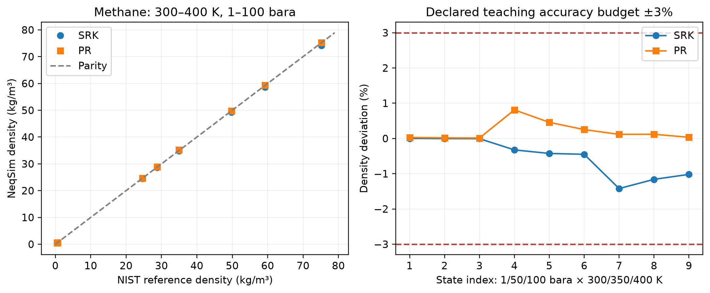
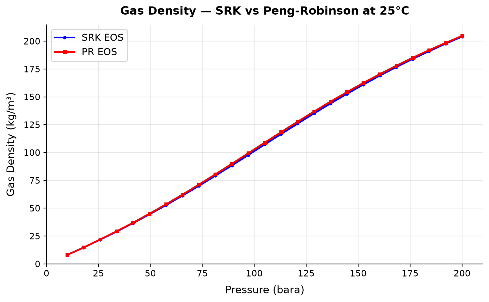
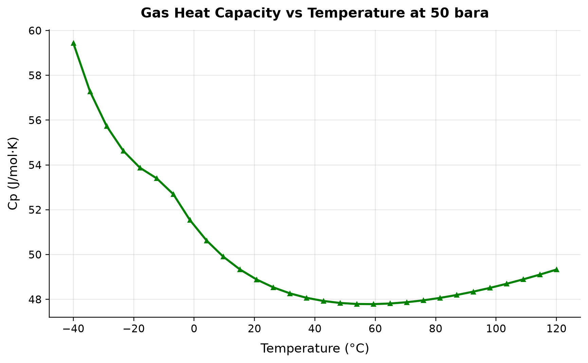
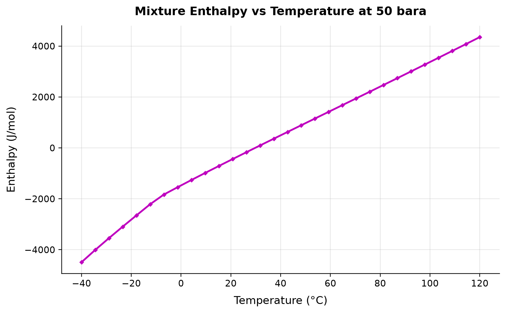
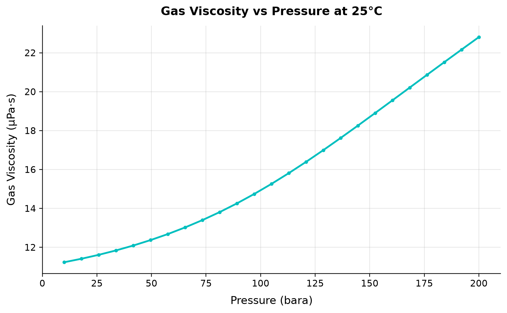
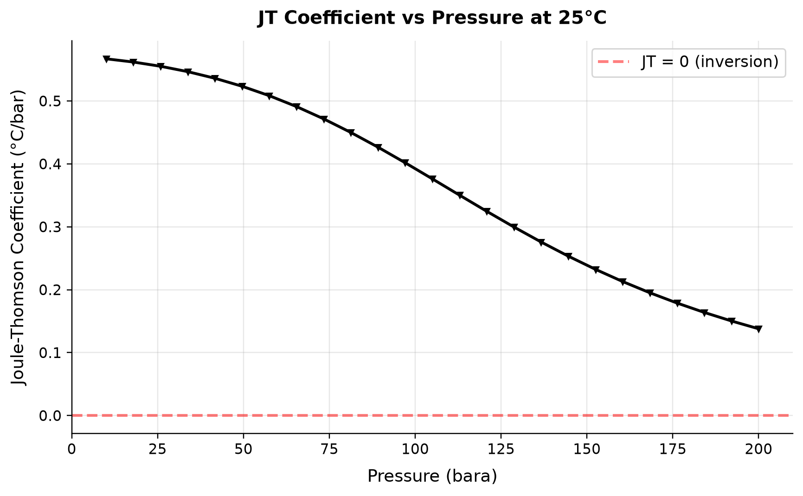

# Thermodynamic Foundations for Process Simulation

**Running the examples.** Start the source-workspace Python session described in Chapter 1, then run this chapter's Python blocks in reading order. Java blocks form a separate sequence using the same NeqSim build; carry forward objects from preceding Java blocks. The release execution records are in `verification/`; a successful run establishes API compatibility, while physical validation also requires the checks discussed in the text.

<!-- Chapter metadata -->
<!-- Notebooks: ch02_eos_comparison.ipynb, ch02_flash_calculations.ipynb, ch02_property_calculations.ipynb -->
<!-- Estimated pages: 30 -->

## Learning Objectives

After reading this chapter, the reader will be able to:

1. Describe the fundamental thermodynamic principles underlying process simulation
2. Explain the mathematical structure of cubic equations of state (SRK, PR) and the CPA model
3. Derive and apply fugacity-based phase equilibrium criteria
4. Understand and implement flash calculation algorithms including Rachford-Rice, successive substitution, and stability analysis
5. Calculate thermodynamic and transport properties from an equation of state
6. Use NeqSim to create fluids with different equations of state, perform flash calculations, and extract all relevant properties
7. Recognize when multi-phase checks (VLLE, three-phase) are necessary

## 2.1 Introduction

Every process simulation begins with thermodynamics. The accuracy of a production optimization model depends critically on the accuracy of its property predictions — densities that determine hydrostatic heads in risers, enthalpies that govern heat exchanger duties, viscosities that control pressure drops in pipelines, and phase equilibria that dictate how much gas and liquid emerge from a separator.

This chapter develops the thermodynamic framework from first principles through to practical implementation in NeqSim. We begin with the equation of state as the central tool for predicting fluid properties, progress through phase equilibrium theory and flash calculation algorithms, and conclude with the full property calculation chain that supports every simulation in this book.

The reader with a strong background in thermodynamics may skim the theoretical development and focus on the NeqSim implementation sections. The reader new to equation-of-state methods should work through the theory carefully, as every subsequent chapter relies on these foundations.

## 2.2 Equations of State

An equation of state (EOS) is a mathematical relationship between pressure $P$, molar volume $v$, and temperature $T$ that describes the thermodynamic behavior of a fluid. For process simulation in the oil and gas industry, the equation of state serves as the master model from which all other thermodynamic properties are derived.

### 2.2.1 The Ideal Gas Law

The simplest equation of state is the ideal gas law:

$$
Pv = RT
$$

where $R = 8.314$ J/(mol·K) is the universal gas constant. This equation assumes that molecules have zero volume and no intermolecular interactions. It is accurate only at low pressures and high temperatures — conditions far from those encountered in most oil and gas applications, where pressures of 100–500 bara and temperatures of 50–200°C are common.

The ideal gas law provides a useful reference state against which real gas behavior is measured. The compressibility factor $Z$ quantifies the departure from ideal behavior:

$$
Pv = ZRT
$$

For an ideal gas, $Z = 1$. For real gases at reservoir and process conditions, $Z$ typically ranges from 0.3 to 1.2.

### 2.2.2 The van der Waals Equation

In 1873, Johannes van der Waals introduced the first equation of state that accounts for molecular volume and intermolecular attractions:

$$
P = \frac{RT}{v - b} - \frac{a}{v^2}
$$

The parameter $a$ represents attractive forces between molecules, and $b$ represents the volume excluded by molecular size. Both are determined from the critical temperature $T_c$ and critical pressure $P_c$ of the pure component:

$$
a = \frac{27 R^2 T_c^2}{64 P_c}, \qquad b = \frac{RT_c}{8 P_c}
$$

While the van der Waals equation is rarely used in modern process simulation, its structure — a repulsive term $RT/(v-b)$ and an attractive term $a/v^2$ — established the template for all subsequent cubic equations of state.

### 2.2.3 The Soave-Redlich-Kwong (SRK) Equation

The Soave-Redlich-Kwong equation of state (Soave, 1972) modified the Redlich-Kwong equation by introducing a temperature-dependent attractive parameter:

$$
P = \frac{RT}{v - b} - \frac{a(T)}{v(v + b)}
$$

The attractive parameter $a(T)$ includes a temperature correction through the alpha function:

$$
a(T) = a_c \cdot \alpha(T)
$$

$$
a_c = 0.42748 \frac{R^2 T_c^2}{P_c}
$$

$$
b = 0.08664 \frac{RT_c}{P_c}
$$

The Soave alpha function depends on the acentric factor $\omega$:

$$
\alpha(T) = \left[1 + m\left(1 - \sqrt{T_r}\right)\right]^2
$$

$$
m = 0.480 + 1.574\omega - 0.176\omega^2
$$

where $T_r = T/T_c$ is the reduced temperature. The acentric factor $\omega$ characterizes the non-sphericity of the molecule and is tabulated for all common components.

The SRK equation can be written in the cubic form by introducing the compressibility factor $Z = Pv/(RT)$:

$$
Z^3 - Z^2 + (A - B - B^2)Z - AB = 0
$$

where:

$$
A = \frac{aP}{R^2T^2}, \qquad B = \frac{bP}{RT}
$$

A cubic at fixed temperature, pressure and composition has one or three real roots, with repeated roots at discriminant-zero conditions. When three admissible roots exist, the outer roots are liquid-like and vapor-like candidates; the middle branch is mechanically unstable. Root count is not a mixture phase-stability test: the coexisting phases have different compositions, and a mixture can split even when the cubic at its overall composition has only one admissible root. Fugacity equality plus a Gibbs-energy stability test selects the equilibrium state.\cite{soave1972,michelsen1982}

### 2.2.4 The Peng-Robinson (PR) Equation

The Peng-Robinson equation (Peng and Robinson, 1976) was developed to improve liquid density predictions compared to the SRK equation:

$$
P = \frac{RT}{v - b} - \frac{a(T)}{v(v+b) + b(v-b)}
$$

The parameters are:

$$
a_c = 0.45724 \frac{R^2 T_c^2}{P_c}
$$

$$
b = 0.07780 \frac{RT_c}{P_c}
$$

$$
\alpha(T) = \left[1 + \kappa\left(1 - \sqrt{T_r}\right)\right]^2
$$

$$
\kappa = 0.37464 + 1.54226\omega - 0.26992\omega^2
$$

The cubic form becomes:

$$
Z^3 - (1 - B)Z^2 + (A - 3B^2 - 2B)Z - (AB - B^2 - B^3) = 0
$$

Both the SRK and PR equations provide acceptable accuracy for hydrocarbon systems. The PR equation generally gives better liquid densities, while the SRK equation is often preferred for gas-phase properties. In practice, the choice between them is often dictated by the availability of tuned binary interaction parameters for the specific fluid system.

Table 2.1 compares the key parameters of the SRK and PR equations:

| Parameter | SRK | PR |
|-----------|-----|-----|
| $\Omega_a = a_c P_c / (R^2 T_c^2)$ | 0.42748 | 0.45724 |
| $\Omega_b = b P_c / (RT_c)$ | 0.08664 | 0.07780 |
| Critical compressibility $Z_c$ | 0.3333 | 0.3074 |
| Liquid density accuracy | Fair (5–15% error) | Good (3–8% error) |
| Vapor pressure accuracy | Good | Good |
| Primary use | Gas processing, natural gas | Oil systems, general purpose |

### 2.2.5 Volume Translation

Both SRK and PR equations systematically under-predict liquid densities. Volume translation (Péneloux et al., 1982) corrects this by shifting the molar volume:

$$
v_{\text{corrected}} = v_{\text{EOS}} - c
$$

where $c$ is a component-specific volume shift parameter. The shift does not affect vapor-liquid equilibrium (VLE) calculations — it corrects only volumetric properties. In NeqSim, volume translation is applied automatically when configured.

### 2.2.6 The CPA Equation of State

The Cubic-Plus-Association (CPA) equation of state (Kontogeorgis et al., 1996) extends the SRK equation to handle associating compounds — molecules that form hydrogen bonds, such as water, methanol, MEG (mono-ethylene glycol), and organic acids:

$$
P = \frac{RT}{v - b} - \frac{a(T)}{v(v+b)} + P_{\text{assoc}}
$$

The association term $P_{\text{assoc}}$ accounts for hydrogen bonding and is derived from Wertheim's statistical mechanical theory. It introduces two additional parameters per associating site: the association energy $\epsilon^{AB}$ and the association volume $\beta^{AB}$.

The CPA equation is essential for systems involving:

- **Hydrate inhibitors** (methanol, MEG, DEG)
- **Water content prediction** in gas streams
- **Produced water** with dissolved hydrocarbons
- **Acid gas systems** (H$_2$S, CO$_2$ with water)

In NeqSim, the CPA model is implemented in the `SystemSrkCPAstatoil` class, which combines the SRK equation for the physical interactions with the CPA association term.

### 2.2.7 Other Equations of State in NeqSim

NeqSim supports additional equations of state for specialized applications:

| EOS Class | NeqSim Class | Primary Application |
|-----------|-------------|-------------------|
| SRK | `SystemSrkEos` | General hydrocarbon systems |
| PR (1976) | `SystemPrEos` | Oil systems, general purpose |
| PR (1978) | `SystemPrEos1978` | Improved alpha function |
| SRK-CPA | `SystemSrkCPAstatoil` | Associating compounds (water, MEG) |
| Electrolyte CPA | `SystemElectrolyteCPAstatoil` | Brine, scale prediction |
| GERG-2008 | Java gas-phase GERG property methods after a supported flash | Natural-gas reference properties within its composition/state domain |
| PC-SAFT | `SystemPCSAFTa` | Polymer, associating systems |
| UMR-PRU | `SystemUMRPRUMCEos` | Wide-range accuracy |

The choice of EOS depends on the fluid system and the required accuracy. For most production optimization applications, SRK or PR with appropriate binary interaction parameters provides adequate accuracy.

## 2.3 Mixing Rules

For mixtures, the EOS parameters $a$ and $b$ must be calculated from the pure-component values using mixing rules.

### 2.3.1 Classical (van der Waals) Mixing Rules

The classical one-fluid mixing rules express the mixture parameters as composition-weighted averages:

$$
a_{\text{mix}} = \sum_i \sum_j x_i x_j (a_i a_j)^{0.5} (1 - k_{ij})
$$

$$
b_{\text{mix}} = \sum_i x_i b_i
$$

where $x_i$ is the mole fraction of component $i$ and $k_{ij}$ is the binary interaction parameter (BIP) between components $i$ and $j$. The BIPs are the primary tuning knobs for matching experimental VLE data.

For hydrocarbon-hydrocarbon pairs, $k_{ij}$ is typically small (0.0–0.05). For hydrocarbon-CO$_2$ pairs, $k_{ij}$ is larger (0.10–0.15). For hydrocarbon-H$_2$S pairs, $k_{ij}$ ranges from 0.03–0.08. Accurate BIPs are critical for reliable phase equilibrium predictions.

### 2.3.2 Huron-Vidal Mixing Rules

For highly non-ideal systems — such as water-hydrocarbon or polar-nonpolar mixtures — the classical mixing rules are insufficient. The Huron-Vidal mixing rules (Huron and Vidal, 1979) incorporate an activity coefficient model (typically NRTL or UNIFAC) at infinite pressure:

$$
a_{\text{mix}} = b_{\text{mix}} \left( \sum_i x_i \frac{a_i}{b_i} - \frac{g_{\text{E},\infty}}{C^*} \right)
$$

where $g_{\text{E},\infty}$ is the excess Gibbs energy at infinite pressure from the activity coefficient model, and $C^*$ is positive in this convention: $\ln 2$ for SRK and $\ln[(2+\sqrt 2)/(2-\sqrt 2)]/(2\sqrt 2)$ for PR. Defining a negative constant instead reverses the displayed sign; do not mix conventions. In NeqSim, Huron-Vidal mixing rules are available and can be selected when the classical rules prove inadequate for strongly non-ideal mixtures.

### 2.3.3 Setting Mixing Rules in NeqSim

The mixing rule must always be set before performing any flash calculation:

```python
import jpype
jneqsim = jpype.JPackage("neqsim")

# SRK with classical mixing rules
fluid_srk = jneqsim.thermo.system.SystemSrkEos(273.15 + 60.0, 100.0)
fluid_srk.addComponent("methane", 0.80)
fluid_srk.addComponent("ethane", 0.10)
fluid_srk.addComponent("propane", 0.05)
fluid_srk.addComponent("n-butane", 0.03)
fluid_srk.addComponent("CO2", 0.02)
fluid_srk.setMixingRule("classic")

# CPA with specialized mixing rules for water-containing systems
fluid_cpa = jneqsim.thermo.system.SystemSrkCPAstatoil(273.15 + 60.0, 100.0)
fluid_cpa.addComponent("methane", 0.80)
fluid_cpa.addComponent("water", 0.15)
fluid_cpa.addComponent("MEG", 0.05)
fluid_cpa.setMixingRule(10)  # CPA mixing rule
```

### 2.3.4 Activity Coefficient Models

While equations of state are the dominant approach for hydrocarbon systems, **activity coefficient models** are sometimes preferred for highly non-ideal liquid mixtures — particularly aqueous systems, electrolyte solutions, and glycol–water systems where the liquid-phase non-ideality is extreme.

In the activity coefficient approach, the fugacity of component $i$ in the liquid phase is expressed as:

$$
f_i^L = x_i \gamma_i f_i^{0,L}
$$

where $\gamma_i$ is the activity coefficient and $f_i^{0,L}$ is the fugacity of pure liquid $i$ at the system temperature and pressure. The vapor phase is typically described by an equation of state:

$$
f_i^V = y_i \phi_i^V P
$$

This "gamma-phi" approach decouples the liquid and vapor descriptions, which is advantageous when the liquid phase is highly non-ideal but the vapor phase is nearly ideal (low to moderate pressures).

**The Wilson Equation** (Wilson, 1964) is the simplest activity coefficient model that accounts for local composition effects:

$$
\ln \gamma_i = -\ln\left(\sum_j x_j \Lambda_{ij}\right) + 1 - \sum_k \frac{x_k \Lambda_{ki}}{\sum_j x_j \Lambda_{kj}}
$$

where $\Lambda_{ij}$ are binary parameters related to molecular interaction energies. The Wilson equation cannot predict liquid–liquid immiscibility (VLLE), which limits its use in water–hydrocarbon systems.

**The NRTL Model** (Non-Random Two-Liquid, Renon and Prausnitz, 1968) extends the local composition concept with a non-randomness parameter $\alpha_{ij}$:

$$
\ln \gamma_i = \frac{\sum_j x_j \tau_{ji} G_{ji}}{\sum_k x_k G_{ki}} + \sum_j \frac{x_j G_{ij}}{\sum_k x_k G_{kj}} \left(\tau_{ij} - \frac{\sum_m x_m \tau_{mj} G_{mj}}{\sum_k x_k G_{kj}}\right)
$$

where $G_{ij} = \exp(-\alpha_{ij} \tau_{ij})$ and $\tau_{ij} = (g_{ij} - g_{jj}) / (RT)$. NRTL can represent both VLE and LLE, making it suitable for water–hydrocarbon and glycol–water systems. The non-randomness parameter $\alpha_{ij}$ is typically set to 0.2–0.47.

**The UNIFAC Model** (UNIQUAC Functional-group Activity Coefficients, Fredenslund et al., 1975) is a predictive group-contribution method. Instead of requiring binary parameters for every molecular pair, UNIFAC decomposes molecules into functional groups and uses group–group interaction parameters:

$$
\ln \gamma_i = \ln \gamma_i^C + \ln \gamma_i^R
$$

where $\ln \gamma_i^C$ is the combinatorial contribution (molecular size and shape) and $\ln \gamma_i^R$ is the residual contribution (group interactions). UNIFAC is particularly valuable when experimental VLE data are unavailable for parameter fitting.

**When to use activity coefficient models instead of EOS:**

| Scenario | Preferred Model | Reason |
|----------|----------------|--------|
| Water–glycol–hydrocarbon | CPA or NRTL | Strong hydrogen bonding |
| Electrolyte solutions (brine) | Electrolyte NRTL or eCPA | Ion interactions |
| Amine treating (MEA, DEA, MDEA) | Electrolyte CPA or NRTL | Ionic reactions in solution |
| Low-pressure VLE | NRTL + ideal gas | Simpler, well-validated |
| Screening new solvents | UNIFAC | No experimental data needed |
| High-pressure hydrocarbon VLE | EOS (SRK, PR) | Activity models less reliable at high P |

CPA and Huron–Vidal address different model contributions. CPA adds a site-association free-energy term derived from Wertheim theory to a cubic physical term; it is not an NRTL/activity-coefficient association correction. Huron–Vidal is an excess-Gibbs-energy mixing rule for the cubic contribution and can be used where its parameters and implementation support the system. The chosen CPA association scheme, cross-association rules and interaction data must be stated separately. No such model is validated at all pressures merely because it treats both phases with one framework.

## 2.4 Fugacity and Chemical Potential

### 2.4.1 Chemical Potential

The chemical potential $\mu_i$ of component $i$ in a mixture is defined as:

$$
\mu_i = \left(\frac{\partial G}{\partial n_i}\right)_{T,P,n_{j \neq i}}
$$

where $G$ is the Gibbs energy and $n_i$ is the number of moles of component $i$. A system at equilibrium has equal chemical potentials for each component in every coexisting phase.

### 2.4.2 Fugacity

For practical calculations with equations of state, fugacity $f_i$ replaces chemical potential. The fugacity of component $i$ in a mixture is related to the chemical potential by:

$$
\mu_i = \mu_i^{\text{ig},0} + RT \ln \frac{f_i}{P^0}
$$

The fugacity coefficient $\phi_i$ relates the fugacity to the partial pressure:

$$
f_i = x_i \phi_i P
$$

For the SRK equation, the fugacity coefficient of component $i$ in the mixture is:

$$
\ln \phi_i = \frac{b_i}{b_{\text{mix}}}(Z-1) - \ln(Z-B) - \frac{A}{B}\left(\frac{2\sum_j x_j a_{ij}}{a_{\text{mix}}} - \frac{b_i}{b_{\text{mix}}}\right)\ln\left(1 + \frac{B}{Z}\right)
$$

For the PR equation:

$$
\ln \phi_i = \frac{b_i}{b_{\text{mix}}}(Z-1) - \ln(Z-B) - \frac{A}{2\sqrt{2}B}\left(\frac{2\sum_j x_j a_{ij}}{a_{\text{mix}}} - \frac{b_i}{b_{\text{mix}}}\right)\ln\left(\frac{Z + (1+\sqrt{2})B}{Z + (1-\sqrt{2})B}\right)
$$

These expressions are evaluated by NeqSim internally for every flash calculation. The user does not need to implement them, but understanding their structure helps diagnose convergence issues and interpret results.

### 2.4.3 Phase Equilibrium Criteria

A system of $N_c$ components distributed between $N_p$ phases is at thermodynamic equilibrium when:

1. **Thermal equilibrium:** Equal temperatures in all phases: $T^{(1)} = T^{(2)} = \ldots = T^{(N_p)}$
2. **Mechanical equilibrium:** Equal pressures in all phases: $P^{(1)} = P^{(2)} = \ldots = P^{(N_p)}$
3. **Chemical equilibrium:** Equal fugacities for each component in all phases:

$$
f_i^{(1)} = f_i^{(2)} = \ldots = f_i^{(N_p)}, \qquad i = 1, 2, \ldots, N_c
$$

For a two-phase vapor-liquid system, this becomes:

$$
x_i \phi_i^L P = y_i \phi_i^V P
$$

which simplifies to:

$$
K_i = \frac{y_i}{x_i} = \frac{\phi_i^L}{\phi_i^V}
$$

where $K_i$ is the equilibrium ratio (K-value) for component $i$. The K-values are the foundation of all flash calculations.

## 2.5 Flash Calculation Algorithms

Flash calculations determine the phase split and composition of each phase at specified conditions. The most common types are:

| Flash Type | Specified Variables | Primary Use |
|-----------|-------------------|-------------|
| TP flash | Temperature, Pressure | Separators, heat exchangers |
| PH flash | Pressure, Enthalpy | Adiabatic processes, valves |
| PS flash | Pressure, Entropy | Isentropic compression |
| TV flash | Temperature, Volume | Pipeline storage |
| Dew point | One of T or P | Phase envelope mapping |
| Bubble point | One of T or P | Phase envelope mapping |

### 2.5.1 The Rachford-Rice Equation

For a TP flash of a mixture with overall composition $z_i$, the phase split is determined by the Rachford-Rice equation. Let $\beta$ be the vapor fraction (moles of vapor / total moles). Then:

$$
\sum_{i=1}^{N_c} \frac{z_i(K_i - 1)}{1 + \beta(K_i - 1)} = 0
$$

This equation must be solved for $\beta$ given the K-values. The compositions are then:

$$
x_i = \frac{z_i}{1 + \beta(K_i - 1)}, \qquad y_i = K_i x_i
$$

For fixed positive $K_i$ and normalized nonnegative $z_i$, define the left-hand side as $F(\beta)$. On the physical interval $0\le\beta\le1$,

$$
F'(\beta)=-\sum_i\frac{z_i(K_i-1)^2}{[1+\beta(K_i-1)]^2}\le0.
$$

An interior two-phase root exists when $F(0)>0$ and $F(1)<0$, and is unique unless the nonzero-composition components all have $K_i=1$. Otherwise the fixed-K calculation selects a single-phase endpoint; phase stability still needs the EOS test. The poles $1/(1-K_{\max})$ and $1/(1-K_{\min})$ can bound an algebraic search when the K-values straddle unity, but they are not physical vapor-fraction limits. Use safeguarded Newton iteration or bisection on $[0,1]$ for a bracketed two-phase case.\cite{rachford1952}

### 2.5.2 Successive Substitution (SSI)

The standard algorithm for TP flash is successive substitution iteration:

1. **Initialize K-values** using Wilson's correlation:

$$
K_i = \frac{P_{c,i}}{P} \exp\left[5.373(1 + \omega_i)\left(1 - \frac{T_{c,i}}{T}\right)\right]
$$

2. **Solve Rachford-Rice** for $\beta$ and calculate $x_i$, $y_i$
3. **Calculate fugacity coefficients** $\phi_i^L(x)$ and $\phi_i^V(y)$ from the EOS
4. **Update K-values:**

$$
K_i^{\text{new}} = \frac{\phi_i^L(\mathbf{x})}{\phi_i^V(\mathbf{y})} = K_i^{\text{old}}\frac{f_i^L}{f_i^V}
$$

5. **Check convergence:** Require small component fugacity residuals $\max_i|\ln(f_i^L/f_i^V)|$ for materially present components, normalized phase compositions, component balances and admissible phase fractions. A small change in $\ln K_i$ alone can reflect damping or stagnation. Recheck stability before accepting a trivial $K_i=1$ solution.

Successive substitution is robust but can be slow near the critical point, where K-values approach unity and convergence becomes first-order.

### 2.5.3 Newton-Raphson Acceleration

When successive substitution converges slowly, Newton–Raphson methods use the Jacobian, the first derivatives of the residual equations with respect to their unknowns. Fugacity-composition derivatives can themselves involve second derivatives of a thermodynamic potential. The independent variables are typically $\ln K_i$ or the phase compositions, and the Jacobian includes composition derivatives of the fugacity coefficients.

NeqSim implements combined SSI-Newton methods: successive substitution is used for the first few iterations to establish a good starting point, then Newton-Raphson takes over for rapid quadratic convergence.

### 2.5.4 Stability Analysis (Michelsen's Method)

Before performing a flash calculation, one must determine whether the system is single-phase or multiphase. Michelsen's tangent plane distance (TPD) criterion (Michelsen, 1982) provides this test.

The tangent plane distance function is defined as:

$$
\text{TPD}(w) = \sum_{i=1}^{N_c} w_i \left[\ln w_i + \ln \phi_i(w) - \ln z_i - \ln \phi_i(z)\right]
$$

where $w_i$ is a trial composition. If $\text{TPD}(w) \geq 0$ for all possible $w$, the system is stable in a single phase. If $\text{TPD}(w) < 0$ for any $w$, the system is unstable and will split into two or more phases.

In practice, the stability test is performed by minimizing the TPD function from multiple starting points — typically a vapor-like and a liquid-like initial guess. If any minimum has $\text{TPD} < 0$, a flash calculation is performed using that minimum as the initial K-value estimate.

The stability test is particularly important for:

- Systems near the critical point
- Systems with retrograde condensation (gas condensates)
- Three-phase (VLLE) systems where both a VLE and a LLE check are needed

### 2.5.5 PH and PS Flash Calculations

For adiabatic processes (valves, mixing) and isentropic processes (ideal compression), enthalpy-specified (PH) or entropy-specified (PS) flash calculations are required. These are solved by nesting a TP flash inside an outer loop that adjusts temperature until the enthalpy or entropy constraint is satisfied:

1. **Guess T**
2. **Perform TP flash** at $(T, P)$
3. **Calculate H(T, P)** or **S(T, P)** from the EOS
4. **Compare** with specified H or S
5. **Update T** using Newton-Raphson (with $C_p$ or $C_p/T$ as the derivative)
6. **Repeat** until convergence

### 2.5.6 Multi-Phase Flash (VLLE and Three-Phase)

Many production systems contain water as a separate liquid phase in addition to hydrocarbon vapor and liquid. Three-phase (vapor-liquid-liquid equilibrium, VLLE) flash calculations extend the two-phase algorithm by introducing additional phase fractions and composition vectors.

In NeqSim, multi-phase checking is enabled with `setMultiPhaseCheck(True)`. When enabled, the flash algorithm automatically tests for the presence of additional phases using stability analysis and performs the appropriate multi-phase flash if needed.

```python
# Enable multi-phase checking for water-containing systems
fluid = jneqsim.thermo.system.SystemSrkEos(273.15 + 60.0, 50.0)
fluid.addComponent("methane", 0.70)
fluid.addComponent("ethane", 0.08)
fluid.addComponent("propane", 0.04)
fluid.addComponent("n-heptane", 0.10)
fluid.addComponent("water", 0.08)
fluid.setMixingRule("classic")
fluid.setMultiPhaseCheck(True)
```

### 2.5.7 Hydrate Equilibrium Calculations

Gas hydrates are crystalline inclusion compounds where water molecules form a cage structure that traps small gas molecules (methane, ethane, CO$_2$, H$_2$S). Hydrate formation is a major flow assurance concern in subsea pipelines and wet gas systems, and predicting the hydrate equilibrium temperature is critical for production optimization.

The hydrate equilibrium condition requires that the chemical potential of water in the hydrate phase equals the chemical potential of water in the fluid phase:

$$
\mu_w^H(T, P) = \mu_w^{\text{fluid}}(T, P, \mathbf{x})
$$

The van der Waals–Platteeuw statistical mechanical model (1959) describes the hydrate phase by accounting for the occupancy of different cage types by gas molecules. The hydrate equilibrium temperature depends strongly on pressure and gas composition — heavier hydrocarbons and CO$_2$ tend to form hydrates at higher temperatures (they are stronger hydrate formers).

NeqSim calculates hydrate equilibrium through the `ThermodynamicOperations` class:

```python
# Hydrate equilibrium temperature at a given pressure
fluid_hyd = jneqsim.thermo.system.SystemSrkCPAstatoil(273.15 + 5.0, 100.0)
fluid_hyd.addComponent("methane", 0.85)
fluid_hyd.addComponent("ethane", 0.08)
fluid_hyd.addComponent("propane", 0.04)
fluid_hyd.addComponent("CO2", 0.03)
fluid_hyd.addComponent("water", 0.10)
fluid_hyd.setMixingRule(10)
fluid_hyd.setHydrateCheck(True)

ops_hyd = jneqsim.thermodynamicoperations.ThermodynamicOperations(fluid_hyd)
ops_hyd.hydrateFormationTemperature()
print(f"Hydrate equilibrium T at 100 bara: {fluid_hyd.getTemperature('C'):.1f} C")
```

### 2.5.8 Wax and Solid Phase Equilibrium

Heavy paraffinic crude oils can precipitate solid wax (n-alkanes with carbon numbers typically above C$_{18}$–C$_{20}$) when cooled below the **wax appearance temperature** (WAT). Wax deposition in pipelines reduces flow area and increases pressure drop, making WAT prediction essential for flow assurance design.

The solid–liquid equilibrium for wax formation requires:

$$
f_i^S(T, P) = f_i^L(T, P, \mathbf{x})
$$

where $f_i^S$ is the fugacity of component $i$ in the solid (wax) phase, calculated from the pure-component melting properties (melting temperature, heat of fusion) and the solid-solution activity coefficient model.

The wax appearance temperature is the highest temperature at which any solid phase is thermodynamically stable. Below the WAT, the amount of precipitated wax increases as temperature decreases, following the **wax precipitation curve** (wt% solid vs temperature).

For production optimization, the key design questions are:
- At what temperature does wax first appear? (WAT — determines insulation or heating requirements)
- How much wax precipitates at pipeline arrival temperature? (determines pigging frequency)
- What pour point does the crude have? (determines pumpability limits)

## 2.6 NeqSim Implementation: Creating Fluids and Running Flash Calculations

### 2.6.1 Creating a Fluid with Different EOS

The following example demonstrates how to create the same fluid composition using different equations of state and compare the results:

```python
import jpype
jneqsim = jpype.JPackage("neqsim")

# Define composition (mole fractions)
components = [
    ("nitrogen", 0.5),
    ("CO2", 2.5),
    ("methane", 75.0),
    ("ethane", 7.0),
    ("propane", 4.0),
    ("i-butane", 1.0),
    ("n-butane", 2.0),
    ("i-pentane", 0.8),
    ("n-pentane", 0.7),
    ("n-hexane", 0.5),
    ("n-heptane", 3.0),
    ("n-octane", 2.0),
    ("n-nonane", 1.0),
]

# Temperature and pressure
T_K = 273.15 + 80.0  # 80°C in Kelvin
P_bara = 150.0

# SRK equation of state
fluid_srk = jneqsim.thermo.system.SystemSrkEos(T_K, P_bara)
for name, moles in components:
    fluid_srk.addComponent(name, moles)
fluid_srk.setMixingRule("classic")

# Peng-Robinson equation of state
fluid_pr = jneqsim.thermo.system.SystemPrEos(T_K, P_bara)
for name, moles in components:
    fluid_pr.addComponent(name, moles)
fluid_pr.setMixingRule("classic")

# Run TP flash for both
ThermodynamicOperations = jneqsim.thermodynamicoperations.ThermodynamicOperations

ops_srk = ThermodynamicOperations(fluid_srk)
ops_srk.TPflash()
fluid_srk.initProperties()

ops_pr = ThermodynamicOperations(fluid_pr)
ops_pr.TPflash()
fluid_pr.initProperties()

# Compare densities
print(f"SRK liquid density: {fluid_srk.getPhase('oil').getDensity('kg/m3'):.1f} kg/m3")
print(f"PR  liquid density: {fluid_pr.getPhase('oil').getDensity('kg/m3'):.1f} kg/m3")
print(f"SRK gas density:    {fluid_srk.getPhase('gas').getDensity('kg/m3'):.1f} kg/m3")
print(f"PR  gas density:    {fluid_pr.getPhase('gas').getDensity('kg/m3'):.1f} kg/m3")
```

### 2.6.2 Running Different Types of Flash Calculations

NeqSim supports all standard flash types through the `ThermodynamicOperations` class:

```python
import jpype
jneqsim = jpype.JPackage("neqsim")

# Create fluid
fluid = jneqsim.thermo.system.SystemSrkEos(273.15 + 80.0, 100.0)
fluid.addComponent("methane", 0.85)
fluid.addComponent("ethane", 0.08)
fluid.addComponent("propane", 0.04)
fluid.addComponent("n-heptane", 0.03)
fluid.setMixingRule("classic")

ops = jneqsim.thermodynamicoperations.ThermodynamicOperations(fluid)

# --- TP Flash ---
ops.TPflash()
fluid.initProperties()
print(f"TP Flash: T = {fluid.getTemperature('C'):.1f} C, P = {fluid.getPressure('bara'):.1f} bara")
print(f"  Vapor fraction: {fluid.getBeta():.4f}")
print(f"  Gas density: {fluid.getPhase('gas').getDensity('kg/m3'):.2f} kg/m3")

# Store the enthalpy for PH flash verification
H_total = fluid.getEnthalpy("J")
S_total = fluid.getEntropy("J/K")

# --- PH Flash ---
# Reduce pressure to 50 bara (e.g., across a valve), keep same enthalpy
fluid_ph = fluid.clone()
fluid_ph.setPressure(50.0, "bara")
ops_ph = jneqsim.thermodynamicoperations.ThermodynamicOperations(fluid_ph)
ops_ph.PHflash(H_total)
fluid_ph.initProperties()
print(f"\nPH Flash (isenthalpic expansion to 50 bara):")
print(f"  Temperature: {fluid_ph.getTemperature('C'):.1f} C")
print(f"  Vapor fraction: {fluid_ph.getBeta():.4f}")

# --- PS Flash ---
# Isentropic compression to 200 bara
fluid_ps = fluid.clone()
fluid_ps.setPressure(200.0, "bara")
ops_ps = jneqsim.thermodynamicoperations.ThermodynamicOperations(fluid_ps)
ops_ps.PSflash(S_total)
fluid_ps.initProperties()
print(f"\nPS Flash (isentropic compression to 200 bara):")
print(f"  Temperature: {fluid_ps.getTemperature('C'):.1f} C")

# --- Bubble Point ---
fluid_bp = fluid.clone()
ops_bp = jneqsim.thermodynamicoperations.ThermodynamicOperations(fluid_bp)
ops_bp.bubblePointPressureFlash(False)
print(f"\nBubble point pressure at {fluid_bp.getTemperature('C'):.1f} C: "
      f"{fluid_bp.getPressure('bara'):.1f} bara")

# --- Dew Point ---
fluid_dp = fluid.clone()
ops_dp = jneqsim.thermodynamicoperations.ThermodynamicOperations(fluid_dp)
ops_dp.dewPointPressureFlash()
print(f"Dew point pressure at {fluid_dp.getTemperature('C'):.1f} C: "
      f"{fluid_dp.getPressure('bara'):.1f} bara")
```

### 2.6.3 Phase Envelope Calculation

The phase envelope — the locus of bubble and dew point curves in $P$-$T$ space — is essential for understanding fluid behavior. NeqSim calculates phase envelopes using a continuation method. The following fragment demonstrates access to raw candidate arrays. It is **not accepted as a complete, physically classified envelope**: branch identity, finite domains, closure and fresh TP transition brackets must be checked separately. Getter names and finite cricondenbar values alone are insufficient. The independently rebuilt illustration has separate branch-verification evidence.

```python
import jpype
jneqsim = jpype.JPackage("neqsim")

fluid = jneqsim.thermo.system.SystemSrkEos(273.15 + 20.0, 50.0)
fluid.addComponent("methane", 0.80)
fluid.addComponent("ethane", 0.08)
fluid.addComponent("propane", 0.05)
fluid.addComponent("n-butane", 0.03)
fluid.addComponent("n-pentane", 0.02)
fluid.addComponent("n-heptane", 0.02)
fluid.setMixingRule("classic")

ops = jneqsim.thermodynamicoperations.ThermodynamicOperations(fluid)
ops.calcPTphaseEnvelope()

# Extract data for plotting
temperatures = [t for t in ops.getOperation().get("dewT")]
pressures = [p for p in ops.getOperation().get("dewP")]
bubble_temps = [t for t in ops.getOperation().get("bubT")]
bubble_pressures = [p for p in ops.getOperation().get("bubP")]
cricondenbar_T = ops.getOperation().get("cricondenbar")[0]
cricondenbar_P = ops.getOperation().get("cricondenbar")[1]
```


<!-- scientific-illustration:phase_envelope.png -->
Input relative molar amounts are methane 0.8, ethane 0.08, propane 0.05, n-butane 0.03, n-pentane 0.02, n-heptane 0.02, normalized to mole fractions. Fresh TP flashes bracketed each saturation branch at three sampled pressures; phase amounts and density continuity determined physical branch assignment. Component closure and fugacity equality verify these computed states, but do not establish agreement with measured mixture saturation data. 
<!-- /scientific-illustration -->

## 2.7 Property Calculations

Once the flash calculation has determined the phase split and compositions, all thermodynamic and transport properties can be calculated from the equation of state.

### 2.7.1 Init Levels in NeqSim

NeqSim uses a hierarchical initialization system to calculate properties at different levels of detail:

| Init Level | What It Calculates | When to Use |
|-----------|-------------------|-------------|
| `init(0)` | Component parameters, critical properties | After adding components |
| `init(1)` | Fugacity coefficients, K-values | During flash iterations |
| `init(2)` | Thermodynamic properties (density, H, S, Cp) | After flash converges |
| `init(3)` | Composition derivatives, stability | For advanced analysis |
| `initPhysicalProperties()` | Transport properties (viscosity, thermal conductivity) | After init(2) |
| `initProperties()` | Both init(2) AND initPhysicalProperties() | **Recommended after every flash** |

**Critical rule:** After any flash calculation, you MUST call `fluid.initProperties()` before reading physical/transport properties. The `init(3)` call alone does NOT initialize transport properties.

```python
# CORRECT pattern:
ops.TPflash()
fluid.initProperties()  # MANDATORY
viscosity = fluid.getPhase("gas").getViscosity("kg/msec")  # Now correct

# UNSAFE pattern (properties may be stale or uninitialized):
ops.TPflash()
# Missing initProperties()!
viscosity = fluid.getPhase("gas").getViscosity("kg/msec")  # A getter value alone does not prove initialization
```

### 2.7.2 Thermodynamic Properties

After calling `initProperties()`, the following thermodynamic properties are available:

```python
import jpype
jneqsim = jpype.JPackage("neqsim")

# Create and flash a fluid
fluid = jneqsim.thermo.system.SystemSrkEos(273.15 + 60.0, 80.0)
fluid.addComponent("methane", 0.80)
fluid.addComponent("ethane", 0.10)
fluid.addComponent("propane", 0.05)
fluid.addComponent("n-heptane", 0.05)
fluid.setMixingRule("classic")

ops = jneqsim.thermodynamicoperations.ThermodynamicOperations(fluid)
ops.TPflash()
fluid.initProperties()

# --- Overall properties ---
print(f"Temperature: {fluid.getTemperature('C'):.2f} C")
print(f"Pressure: {fluid.getPressure('bara'):.2f} bara")
print(f"Vapor fraction (molar): {fluid.getBeta():.4f}")
print(f"Number of phases: {fluid.getNumberOfPhases()}")

# --- Gas phase properties ---
gas = fluid.getPhase("gas")
print(f"\nGas phase:")
print(f"  Density: {gas.getDensity('kg/m3'):.3f} kg/m3")
print(f"  Molar mass: {gas.getMolarMass('kg/mol') * 1000:.2f} g/mol")
print(f"  Z-factor: {gas.getZ():.4f}")
print(f"  Enthalpy: {gas.getEnthalpy('J/mol'):.1f} J/mol")
print(f"  Entropy: {gas.getEntropy('J/molK'):.3f} J/(mol·K)")
print(f"  Cp: {gas.getCp('J/molK'):.3f} J/(mol·K)")
print(f"  Cv: {gas.getCv('J/molK'):.3f} J/(mol·K)")
print(f"  Cp/Cv ratio: {gas.getGamma():.4f}")
print(f"  Speed of sound: {gas.getSoundSpeed():.1f} m/s")
print(f"  Viscosity: {gas.getViscosity('kg/msec'):.6f} Pa·s")
print(f"  Thermal conductivity: {gas.getThermalConductivity('W/mK'):.5f} W/(m·K)")
print(f"  JT coefficient: {gas.getJouleThomsonCoefficient('K/bar'):.4f} C/bara")

# --- Liquid phase properties ---
if fluid.getNumberOfPhases() > 1:
    oil = fluid.getPhase("oil")
    print(f"\nOil phase:")
    print(f"  Density: {oil.getDensity('kg/m3'):.1f} kg/m3")
    print(f"  Viscosity: {oil.getViscosity('kg/msec'):.6f} Pa·s")
    print(f"  Thermal conductivity: {oil.getThermalConductivity('W/mK'):.5f} W/(m·K)")
    print(f"  Surface tension: {fluid.getInterphaseProperties().getSurfaceTension(0, 1):.6f} N/m")
```

### 2.7.3 Density Calculation from the EOS

The density is obtained directly from the molar volume, which is a root of the cubic EOS:

$$
\rho = \frac{M_w}{v}
$$

where $M_w$ is the molar mass of the phase and $v$ is the molar volume from solving the cubic equation. For the gas phase, the larger root is used; for the liquid phase, the smaller root.

### 2.7.4 Enthalpy and Entropy

In this subsection $H$, $S$ and $C_p$ denote molar properties (J/mol, J/(mol K), and J/(mol K)); $v$ is molar volume and composition is fixed. The residual is relative to an ideal gas at the same $T$, $P$ and composition. These unshifted SRK expressions assume temperature-independent $b$ and the stated classical mixing rule. The NeqSim stream API's unqualified enthalpy value instead represents an extensive flow-basis quantity; specify a unit such as J/mol when comparing with these equations.\cite{foundationIDAEScubic} The molar enthalpy departure is:

$$
H - H^{\text{ig}} = RT(Z - 1) + \int_{\infty}^{v} \left[T\left(\frac{\partial P}{\partial T}\right)_v - P\right] dv
$$

For the SRK equation, this integral has the analytical result:

$$
H - H^{\text{ig}} = RT(Z - 1) + \frac{T \frac{da}{dT}-a}{b} \ln\left(\frac{v + b}{v}\right)
$$

The total enthalpy is:

$$
H = H^{\text{ig}}(T) + (H - H^{\text{ig}})
$$

where $H^{\text{ig}}(T)$ is the ideal gas enthalpy, calculated from the ideal gas heat capacity:

$$
H^{\text{ig}}(T) = H^{\text{ig},\text{ref}} + \int_{T_{\text{ref}}}^{T} C_p^{\text{ig}}(T') dT'
$$

The entropy departure is similarly:

$$
S - S^{\text{ig}}(T,P) = R \ln(Z-B) + \frac{\frac{da}{dT}}{b} \ln\left(\frac{v + b}{v}\right)
$$

### 2.7.5 Heat Capacity

The constant-pressure heat capacity $C_p$ and constant-volume heat capacity $C_v$ are derived from the EOS through second derivatives:

$$
C_v = C_v^{\text{ig}} + C_v^{\text{res}}
$$

$$
C_p = C_v - T \frac{\left(\frac{\partial P}{\partial T}\right)_v^2}{\left(\frac{\partial P}{\partial v}\right)_T}
$$

The ratio $\gamma = C_p / C_v$ is important for compressor calculations and speed of sound.

### 2.7.6 Transport Properties

Transport properties — viscosity and thermal conductivity — are not directly calculated from the equation of state. Instead, NeqSim uses corresponding-states correlations:

- **Viscosity:** Lohrenz-Bray-Clark (LBC) correlation for dense phases, or kinetic theory for dilute gas
- **Thermal conductivity:** Modified Ely-Hanley corresponding states method

These correlations require the density and composition from the EOS, which is why `initProperties()` (which calls `initPhysicalProperties()`) must be invoked after the flash.

Table 2.2 summarizes the property calculation chain:

| Property | Source | Requires |
|----------|--------|----------|
| Phase split, compositions | Flash algorithm | EOS parameters, mixing rules |
| Density | Cubic root of EOS | Flash converged |
| Z-factor | $Z = Pv/(RT)$ | Density |
| Enthalpy | Departure function | Flash + ideal gas Cp |
| Entropy | Departure function | Flash + ideal gas Cp |
| Cp, Cv | Second derivatives | Flash |
| Viscosity | LBC or kinetic theory | Density, composition |
| Thermal conductivity | Ely-Hanley | Density, composition |
| Surface tension | Parachor method | Phase densities, compositions |

### 2.7.7 Viscosity Models in Detail

Viscosity is critical for production optimization — it directly affects pressure drop in pipelines, well deliverability, and separator sizing. NeqSim employs several viscosity models depending on the phase and conditions.

**The Lohrenz-Bray-Clark (LBC) Correlation** (1964) is the standard method for dense-phase hydrocarbon viscosity. It relates the reduced viscosity to reduced density through a fourth-degree polynomial:

$$
\left[(\mu - \mu^*)\xi + 10^{-4}\right]^{1/4} = a_0 + a_1 \rho_r + a_2 \rho_r^2 + a_3 \rho_r^3 + a_4 \rho_r^4
$$

where $\mu^*$ is the dilute-gas viscosity, $\xi$ is the viscosity-reducing parameter defined as:

$$
\xi = \left(\frac{T_c}{M^3 P_c^4}\right)^{1/6}
$$

$\rho_r = \rho / \rho_c$ is the reduced density, and $a_0$ through $a_4$ are universal constants. The LBC correlation requires accurate density from the EOS and the mixture pseudo-critical properties.

**The Corresponding States Principle** (Pedersen et al., 1984) calculates the viscosity of a hydrocarbon mixture by scaling from a reference substance (typically methane):

$$
\mu_{\text{mix}}(T, P) = \mu_{\text{ref}}\left(\frac{T}{T_{c,\text{mix}}} T_{c,\text{ref}}, \frac{P}{P_{c,\text{mix}}} P_{c,\text{ref}}\right) \cdot \frac{T_{c,\text{mix}}^{-1/6} M_{\text{mix}}^{1/2} P_{c,\text{mix}}^{2/3}}{T_{c,\text{ref}}^{-1/6} M_{\text{ref}}^{1/2} P_{c,\text{ref}}^{2/3}}
$$

This method is particularly effective for reservoir fluids with heavy fractions.

### 2.7.8 Thermal Conductivity

Thermal conductivity governs heat transfer rates in heat exchangers, pipelines (heat loss to surroundings), and wellbores. The **Chung et al. correlation** (1988) is widely used for gas-phase thermal conductivity:

$$
\lambda = \frac{31.2 \mu^0 \Psi}{M'}\left(G_2^{-1} + B_6 y\right) + q B_7 y^2 T_r^{1/2} G_2
$$

where $\mu^0$ is the dilute-gas viscosity, $\Psi$ is a correction factor, $M'$ is a modified molecular weight, and $B_6$, $B_7$, $G_2$, $q$, $y$ are functions of the reduced temperature, density, and acentric factor.

For liquid-phase thermal conductivity, NeqSim uses the Ely-Hanley corresponding-states method, which scales liquid thermal conductivity from a reference fluid.

### 2.7.9 Surface Tension

Surface tension between gas and liquid phases controls droplet formation in separators, mist eliminator performance, and gas-liquid entrainment. NeqSim uses the **parachor method** (Macleod-Sugden correlation):

$$
\sigma^{1/4} = \sum_i P_i \left(\frac{x_i \rho_L}{M_L} - \frac{y_i \rho_V}{M_V}\right)
$$

where $\sigma$ is the surface tension (N/m), $P_i$ is the parachor of component $i$ (tabulated), $\rho_L$ and $\rho_V$ are the liquid and vapor densities, and $M_L$ and $M_V$ are the phase molar masses. The parachor is an empirical constant specific to each component and is available in standard databases.

Interfacial tension tends to zero as coexisting phases become identical at a critical point. Its pressure dependence away from that point depends on composition and temperature; increasing pressure does not imply a universal increase. Use measured or validated interfacial tension at the separator conditions for droplet/coalescence calculations rather than a generic range.

### 2.7.10 Component Properties in Each Phase

Individual component properties can also be accessed:

```python
# Mole fractions in gas phase
gas = fluid.getPhase("gas")
for i in range(gas.getNumberOfComponents()):
    comp = gas.getComponent(i)
    print(f"  {comp.getComponentName():15s}: x = {comp.getx():.6f}, "
          f"K = {comp.getK():.4f}, "
          f"fugacity coeff = {comp.getFugacityCoefficient():.6f}")
```

## 2.8 The GERG-2008 Equation

GERG-2008 is a Helmholtz-energy mixture model covering21 defined natural-gas components, including gas, liquid and supercritical states in its published domain. Its uncertainty varies with property, composition and temperature/pressure region; the primary paper supplies the applicable ranges. It does not accept arbitrary petroleum pseudo-components. A density property call after an SRK flash does not turn that flash into a GERG phase-equilibrium calculation or establish fiscal compliance.\cite{kunz2012}

```python
# Flash with SRK, then evaluate single-phase gas density with Java GERG-2008.
# The legacy SystemGERG2004Eos requires a separate native library.
fluid_gerg = jneqsim.thermo.system.SystemSrkEos(273.15 + 15.0, 50.0)
fluid_gerg.addComponent("methane", 0.90)
fluid_gerg.addComponent("ethane", 0.05)
fluid_gerg.addComponent("propane", 0.02)
fluid_gerg.addComponent("nitrogen", 0.02)
fluid_gerg.addComponent("CO2", 0.01)
fluid_gerg.setMixingRule("classic")

ops_gerg = jneqsim.thermodynamicoperations.ThermodynamicOperations(fluid_gerg)
ops_gerg.TPflash()
fluid_gerg.initProperties()

print(f"GERG-2008 gas density at 15°C, 50 bara: "
      f"{fluid_gerg.getPhase('gas').getDensity_GERG2008():.4f} kg/m3")
```

## 2.9 Practical Considerations

### 2.9.1 EOS Selection Guide

The choice of equation of state depends on the application. The following decision tree provides a systematic approach for selecting the appropriate EOS in NeqSim:

**Step 1 — Does the system contain associating compounds?**
Associating compounds are those that form hydrogen bonds: water, methanol, MEG, DEG, TEG, organic acids, amines. If yes, proceed to Step 1a. If no, proceed to Step 2.

**Step 1a — Does the system contain ions or electrolytes?**
If the system includes dissolved salts, mineral ions (Na$^+$, Cl$^-$, Ca$^{2+}$), or brine, use `SystemElectrolyteCPAstatoil`. If no electrolytes are present but associating compounds exist, use `SystemSrkCPAstatoil` with mixing rule 10.

**Step 2 — Is this a custody transfer or fiscal metering application?**
Check the contractually specified property method and composition/state range. The example uses the Java GERG-2008 gas-property calculation; the legacy `SystemGERG2004Eos` has separate native-library requirements. Agreement with a gas-density reference is not automatic ISO conformity of a complete metering system.

**Step 3 — Is liquid density accuracy critical?**
For oil systems where liquid density prediction is important (stock tank calculations, pipeline holdup, separator sizing), prefer Peng-Robinson (`SystemPrEos`). For gas-dominated systems, SRK (`SystemSrkEos`) is equally suitable.

**Step 4 — Default recommendation.**
For general-purpose production optimization where none of the above special conditions apply, use SRK with classical mixing rules (`setMixingRule("classic")`). SRK is well-tested, has extensive BIP databases, and provides reliable results for natural gas and gas condensate systems.

The full selection matrix:

| Application | Recommended EOS | Rationale |
|-------------|----------------|-----------|
| Dry gas / lean gas | SRK or PR | Simple, well-tuned |
| Gas condensate | PR (tuned) | Better liquid predictions |
| Black oil / volatile oil | PR (tuned) | Heavy fraction handling |
| Water-hydrocarbon | CPA | Association effects |
| MEG / methanol systems | CPA | Hydrogen bonding |
| Custody transfer gas | GERG-2008 | Highest accuracy |
| CO$_2$-rich systems | SRK or PR + CPA | CO$_2$-water interactions |
| Electrolyte / brine | Electrolyte CPA | Ion effects, scale |

### 2.9.2 Binary Interaction Parameters

The accuracy of an EOS model depends heavily on the quality of binary interaction parameters (BIPs). NeqSim contains a database of default BIPs for common component pairs, but these should be verified against experimental data for critical applications.

Common BIP ranges for the SRK equation:

| Pair Type | Typical $k_{ij}$ Range |
|-----------|----------------------|
| HC–HC (similar size) | 0.00–0.02 |
| HC–HC (dissimilar size) | 0.02–0.05 |
| N$_2$–HC | 0.02–0.12 |
| CO$_2$–HC | 0.10–0.15 |
| H$_2$S–HC | 0.03–0.08 |
| CO$_2$–H$_2$O (CPA) | Tuned from data |

### 2.9.3 Convergence Issues and Remedies

Flash calculations can occasionally fail to converge. Common causes and remedies include:

1. **Near the critical point:** Use stability analysis to detect single-phase regions; apply damping to successive substitution
2. **Very low temperature:** Wilson K-value initialization may be poor; use previous converged solution as initial guess
3. **Trivial solution:** Both trial phases converge to the same composition; this can be numerical stagnation or a true single phase. Resolve it with stability analysis rather than accepting K=1 automatically
4. **Three-phase region:** Two-phase flash cannot represent the system — enable multi-phase checking
5. **Composition-dependent issues:** Very dilute components can cause numerical issues — set a minimum mole fraction

NeqSim handles most of these automatically, but understanding the causes helps diagnose residual issues.

### 2.9.4 Numerical Precision

All flash calculations involve iterative solution of nonlinear equations. NeqSim uses convergence tolerances appropriate for engineering calculations — typically $10^{-8}$ to $10^{-10}$ for fugacity coefficient ratios. For most production optimization applications, this precision is far greater than the uncertainty in the input data.

## 2.10 Comparison of EOS Predictions

The following example provides a systematic comparison of SRK and PR predictions for a typical North Sea gas condensate:

```python
import jpype
jneqsim = jpype.JPackage("neqsim")
import json

# North Sea gas condensate composition
composition = {
    "nitrogen": 0.4,
    "CO2": 3.4,
    "methane": 74.2,
    "ethane": 7.8,
    "propane": 3.5,
    "i-butane": 0.7,
    "n-butane": 1.3,
    "i-pentane": 0.5,
    "n-pentane": 0.4,
    "n-hexane": 0.3,
    "n-heptane": 2.5,
    "n-octane": 2.0,
    "n-nonane": 1.5,
    "n-decane": 1.0,
    "water": 0.5,
}

results = {}
for eos_name, eos_class in [
    ("SRK", jneqsim.thermo.system.SystemSrkEos),
    ("PR", jneqsim.thermo.system.SystemPrEos),
]:
    fluid = eos_class(273.15 + 100.0, 200.0)
    for comp, frac in composition.items():
        fluid.addComponent(comp, frac)
    fluid.setMixingRule("classic")
    fluid.setMultiPhaseCheck(True)

    ops = jneqsim.thermodynamicoperations.ThermodynamicOperations(fluid)
    ops.TPflash()
    fluid.initProperties()

    results[eos_name] = {
        "vapor_fraction": fluid.getBeta(),
        "gas_density_kg_m3": fluid.getPhase("gas").getDensity("kg/m3"),
        "gas_Z": fluid.getPhase("gas").getZ(),
        "gas_viscosity_cP": fluid.getPhase("gas").getViscosity("kg/msec") * 1000,
    }

    if fluid.getNumberOfPhases() > 1:
        results[eos_name]["oil_density_kg_m3"] = fluid.getPhase("oil").getDensity("kg/m3")
        results[eos_name]["oil_viscosity_cP"] = fluid.getPhase("oil").getViscosity("kg/msec") * 1000

print(json.dumps(results, indent=2))
```



<!-- scientific-illustration:eos_comparison.png -->
The parity and deviation panels compare 300, 350 and 400 K at 1, 50 and 100 bara. Maximum absolute relative deviations are 1.421 percent for SRK and 0.811 percent for Peng–Robinson, within the declared 3 percent teaching budget. These are NIST reference-EOS values, not invented experimental points or a general mixture-accuracy claim. The separate benchmark notebook retains inputs, raw reference tables, computed values and tolerances.
<!-- /scientific-illustration -->


<!-- reviewed-notebook-results:start -->
## Reproduced Calculation Results

These examples use the stated fluid recipes and operating assumptions. Curves represent NeqSim calculations unless a caption identifies an analytical illustration, assumed equipment map or synthetic data.



SRK EOS: gas density spans 8.063–204.1 kg/m³ across the plotted cases. PR EOS: gas density spans 8.089–204.8 kg/m³ across the plotted cases.

SRK and Peng–Robinson use different cubic-EOS attraction and covolume expressions, so they predict different real-fluid volumes for the same composition. The difference is a model-form sensitivity; agreement between two models is not independent experimental validation. Compare the alternatives against measured PVT density over the intended envelope and carry the validated model into capacity calculations.



Cp spans 47.79–59.44 J/mol·K across the plotted cases.

Heat capacity measures the enthalpy response to temperature at fixed pressure and varies with molecular degrees of freedom and non-ideal interactions. A constant heat-capacity estimate may misstate heater duty or the temperature rise associated with compressor work. Use stream enthalpy differences for equipment energy balances and treat a constant Cp only as a local screening approximation.



Enthalpy spans -4492–4352 J/mol across the plotted cases.

The slope of an isobaric enthalpy curve is heat capacity; changes in phase distribution can add a latent-heat contribution. Duty is determined by the difference between inlet and outlet enthalpy, not the absolute value of an arbitrarily referenced enthalpy. Keep the same composition, flow basis and reference convention when calculating duty, and examine phase changes before fitting a straight line.



Gas Viscosity spans 11.23–22.81 µPa·s across the plotted cases.

Increasing gas density changes molecular momentum transport and therefore viscosity; the relationship is not the same as liquid-viscosity behavior. Viscosity affects Reynolds number, friction factor and ultimately the distribution of pressure losses. Initialize transport properties and recalculate them at local pipeline states when checking hydraulic capacity.



Joule-Thomson Coefficient spans 0.1379–0.567 °C/bar across the plotted cases.

The Joule–Thomson coefficient is the local temperature derivative with respect to pressure along a constant-enthalpy path. A positive coefficient predicts cooling for a pressure drop, but its changing magnitude prevents applying one inlet value over a large letdown. Use a PH flash for a finite valve pressure drop and inspect condensation and hydrate proximity along the resulting path.

Selected numerical ranges from the plotted cases:

| Quantity / series | Minimum | Maximum | Unit |
|---|---:|---:|---|
| SRK EOS: gas density | 8.063 | 204.1 | kg/m³ |
| Cp | 47.79 | 59.44 | J/mol·K |
| Enthalpy | -4492 | 4352 | J/mol |
| Gas Viscosity | 11.23 | 22.81 | µPa·s |
| Joule-Thomson Coefficient | 0.1379 | 0.567 | °C/bar |

Ranges describe the sampled cases; they are not independent validation tolerances.
<!-- reviewed-notebook-results:end -->

## 2.11 Summary

Key points from this chapter:

- **Equations of state** (SRK, PR, CPA) are the foundation of all thermodynamic calculations in process simulation. They relate pressure, volume, and temperature and enable the calculation of all derived properties.
- **Mixing rules** combine pure-component EOS parameters into mixture parameters. Binary interaction parameters ($k_{ij}$) are the primary tuning knobs.
- **Fugacity** provides the criterion for phase equilibrium: at equilibrium, the fugacity of each component is equal in all phases.
- **Flash calculations** determine the phase split and compositions. The Rachford-Rice equation, successive substitution, Newton-Raphson acceleration, and Michelsen's stability analysis form the algorithmic toolkit.
- **Property calculation** follows a hierarchy: flash → initProperties() → read properties. Transport properties (viscosity, thermal conductivity) require `initProperties()`.
- **EOS selection** depends on the application: SRK/PR for hydrocarbons, CPA for associating compounds, GERG-2008 for custody transfer.
- **NeqSim** provides a comprehensive implementation of these methods through the `SystemInterface` and `ThermodynamicOperations` classes.


<!-- foundations-scientific-verification -->

### Verification of the worked examples

The worked TP flashes are checked for phase-fraction normalization, reconstruction of feed composition and equality of phase fugacities. Hydrate calculations are checked for finite temperatures only; neither a converged flash nor a physically plausible hydrate temperature establishes empirical accuracy. Independent methane reference-EOS comparisons are reported separately, with their own state range and teaching tolerance.\cite{michelsen1982,kunz2012}

The calculation and literal-code records are in `verification/scientific_revision/ch02_manuscript_physics.json`; the chapter scope and code hashes are indexed in `foundations_review.json`.

<!-- /foundations-scientific-verification -->

## Exercises

1. **Exercise 2.1:** Create a natural gas fluid with the following composition (mol%): N$_2$ 1.0, CO$_2$ 2.0, CH$_4$ 85.0, C$_2$H$_6$ 6.0, C$_3$H$_8$ 3.0, iC$_4$ 1.0, nC$_4$ 1.0, nC$_5$ 0.5, nC$_6$ 0.5. Using SRK, calculate the gas density and Z-factor at 50°C and 100 bara. Repeat with PR and compare.

2. **Exercise 2.2:** For the gas condensate composition in Section 2.10, calculate the phase envelope (bubble and dew point curves). Identify the cricondenbar and cricondentherm. At what pressure does retrograde condensation begin at 100°C?

3. **Exercise 2.3:** Demonstrate the Joule-Thomson effect by performing a PH flash: start at 50°C and 200 bara, then expand isenthalpically to 80 bara. What is the temperature after expansion? Why does the gas cool?

4. **Exercise 2.4:** Create a system with methane (80%) and water (20%) at 20°C and 100 bara. Enable multi-phase checking and determine the stable phase count rather than prescribing it. At these conditions methane is above its pure-component critical temperature; expect a methane-rich fluid and an aqueous liquid, not a separate methane liquid merely because three-phase checking is enabled. Check phase compositions and component closure. Report the water content of the gas phase in ppm (molar).

5. **Exercise 2.5:** Write a Python script that calculates the gas viscosity of pure methane at 50°C for pressures from 1 to 500 bara. Plot the result, identify whether it is monotonic over the sampled range, and relate it to dilute-gas and dense-fluid transport. Do not impose an initial decrease that the selected model or reference data may not show.

6. **Exercise 2.6:** Compare the SRK and CPA equations for predicting the water content of a natural gas at 40°C and 70 bara. The dry-gas composition is CH$_4$ 90%, C$_2$H$_6$ 5%, C$_3$H$_8$ 3%, CO$_2$ 2%. Add excess liquid water before selecting the mixing rule, enable a multiphase check, and compare the equilibrium gas-phase water mole fractions. A dry composition without a water inventory cannot represent water saturation. Which EOS is more appropriate and what independent data would test the result?

7. **Exercise 2.7:** For the North Sea gas condensate in Section 2.10, compute and compare the liquid dropout curve (liquid volume fraction vs. pressure at constant temperature of 100°C) using SRK and PR. At which pressure is the maximum liquid dropout predicted?

8. **Exercise 2.8 (Advanced):** Implement a simple successive substitution flash algorithm in Python (using NeqSim only for fugacity coefficient calculations) and compare the number of iterations required to converge with NeqSim's built-in flash. Test at conditions both far from and near the critical point.

## References

1. Soave, G. (1972). Equilibrium constants from a modified Redlich-Kwong equation of state. *Chemical Engineering Science*, 27(6), 1197–1203.
2. Peng, D. Y., & Robinson, D. B. (1976). A new two-constant equation of state. *Industrial & Engineering Chemistry Fundamentals*, 15(1), 59–64.
3. Kontogeorgis, G. M., Voutsas, E. C., Yakoumis, I. V., & Tassios, D. P. (1996). An equation of state for associating fluids. *Industrial & Engineering Chemistry Research*, 35(11), 4310–4318.
4. Michelsen, M. L. (1982). The isothermal flash problem. Part I. Stability. *Fluid Phase Equilibria*, 9(1), 1–19.
5. Rachford, H. H., & Rice, J. D. (1952). Procedure for use of electronic digital computers in calculating flash vaporization hydrocarbon equilibrium. *Journal of Petroleum Technology*, 4(10), 19–23.
6. Péneloux, A., Rauzy, E., & Fréze, R. (1982). A consistent correction for Redlich-Kwong-Soave volumes. *Fluid Phase Equilibria*, 8(1), 7–23.
7. Huron, M. J., & Vidal, J. (1979). New mixing rules in simple equations of state for representing vapour-liquid equilibria of strongly non-ideal mixtures. *Fluid Phase Equilibria*, 3(4), 255–271.
8. Kunz, O., & Wagner, W. (2012). The GERG-2008 wide-range equation of state for natural gases and other mixtures. *Journal of Chemical & Engineering Data*, 57(11), 3032–3091.
9. Wilson, G. M. (1969). A modified Redlich-Kwong equation of state, application to general physical data calculations. *Paper presented at the AIChE National Meeting*, Cleveland, OH.
10. Lohrenz, J., Bray, B. G., & Clark, C. R. (1964). Calculating viscosities of reservoir fluids from their compositions. *Journal of Petroleum Technology*, 16(10), 1171–1176.


