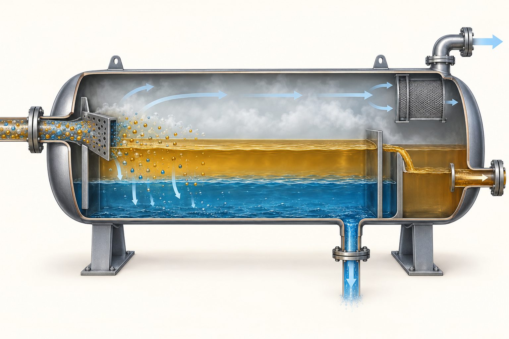
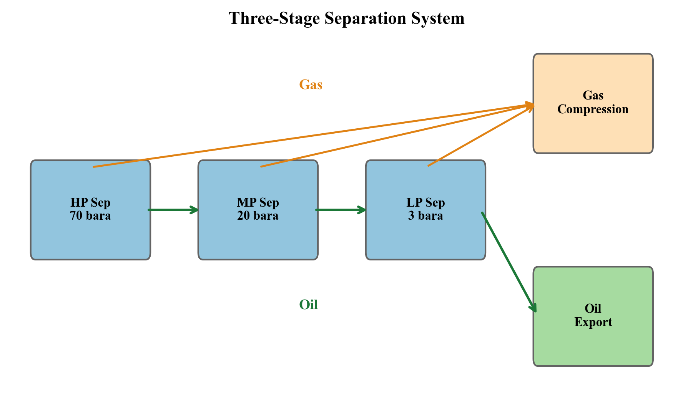
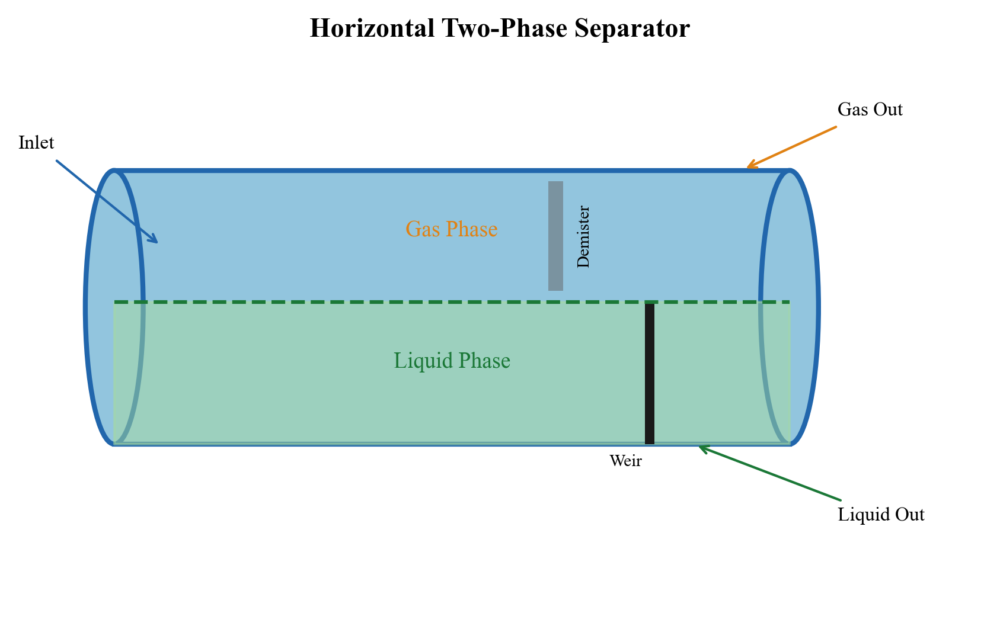
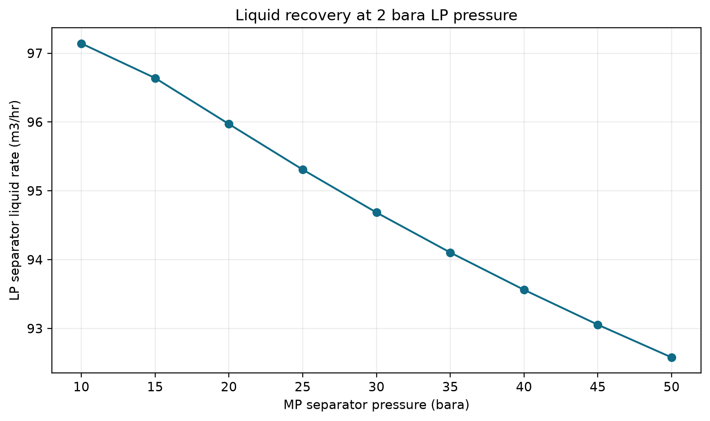
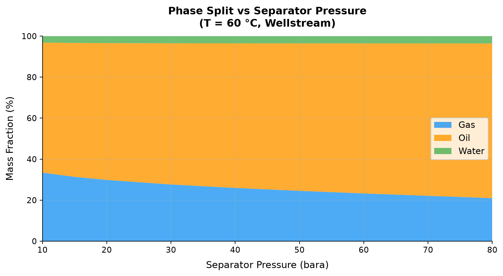
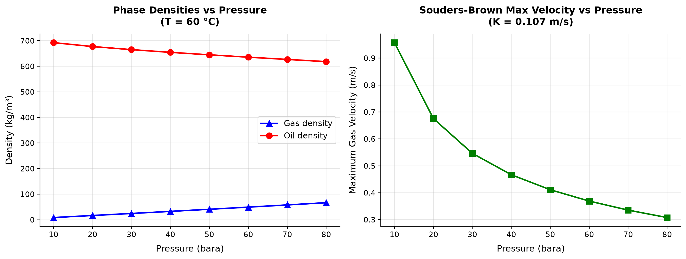
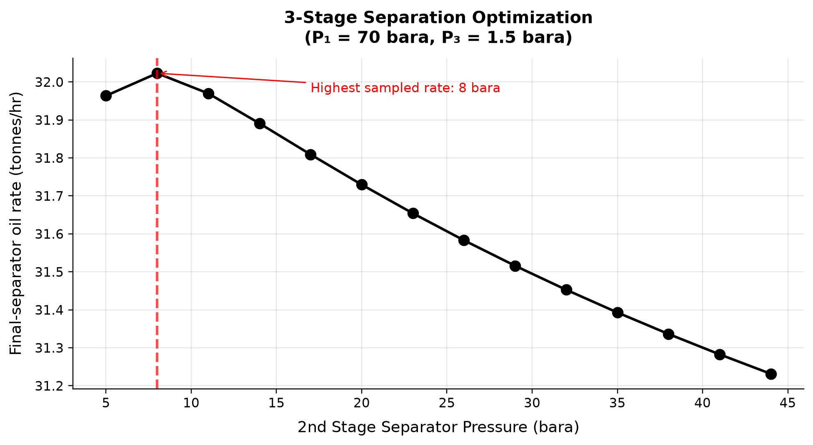
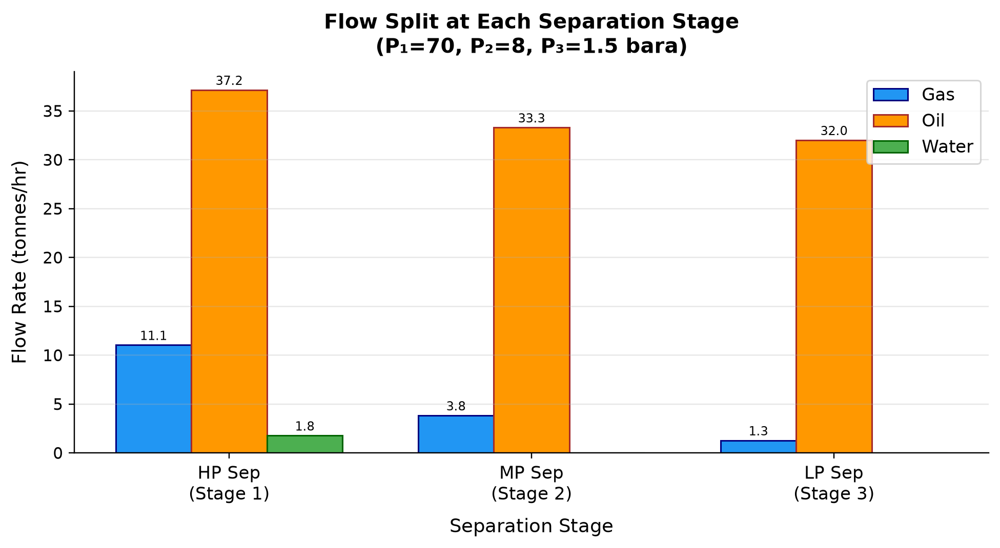
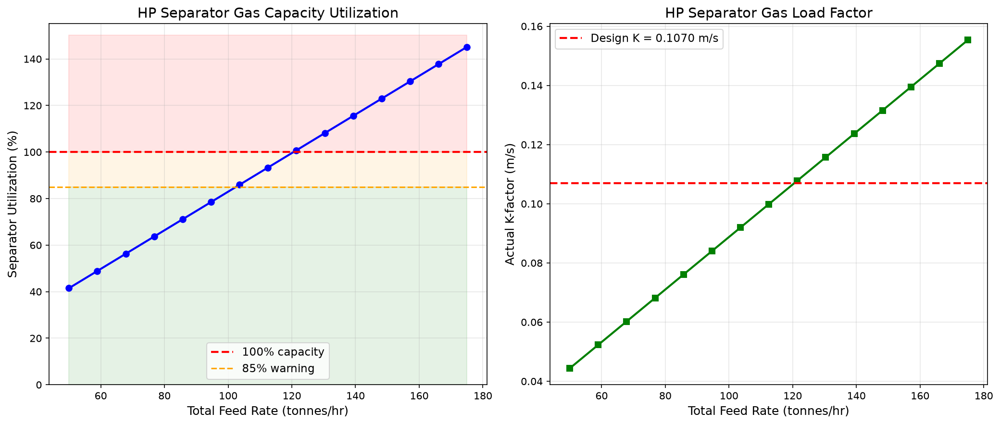
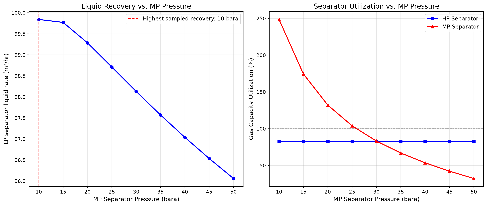

# Separation Technology and Equipment Design

**Running the examples.** Start the source-workspace Python session described in Chapter 1, then run this chapter's Python blocks in reading order. Java blocks form a separate sequence using the same NeqSim build; carry forward objects from preceding Java blocks. The release execution records are in `verification/`; a successful run establishes API compatibility, while physical validation also requires the checks discussed in the text.

<!-- Chapter metadata -->
<!-- Notebooks: ch09_separator_design.ipynb, ch09_three_phase_separator.ipynb, ch09_gas_scrubber_design.ipynb, ch09_separator_performance.ipynb -->
<!-- Estimated pages: 30 -->


### From equilibrium separation to equipment performance



The equilibrium `Separator` determines phase splitting. The physical vessel and
its internals require a second layer of evidence. Configure those inputs through
`SeparatorMechanicalDesign`: operating-pressure envelope, explicit temperature units, K-factor, retention
time, inlet-pipe diameter, inlet-device type, demister type and internal sections.
This facade delegates performance settings to the separator while keeping the
mechanical description together.\cite{neqsim2026update}

The newer primary-separation classes distinguish an inlet vane, vane with mesh,
and inlet cyclones. Demisting models distinguish mesh, vane and cyclone behavior,
including pressure drop and carry-over; drainage-aware models add a separate
drainage limitation. A vessel can satisfy average gas velocity and still fail
at the inlet, demister drainage, liquid residence time or outlet nozzle.
Consequently, report the governing mechanism alongside the maximum utilization.

Automatic sizing supplies an initial candidate. Freeze dimensions before a
capacity sweep; resizing at every rate would move the constraint with the
operating point. Constraint profiles named for a company or standard are
software presets whose current values must be checked against the applicable
project requirements. They are not evidence that a vessel complies with an
entire design code. Calibration of carry-over and carry-under requires
appropriate droplet, emulsion and measured performance data.


## Learning Objectives

After reading this chapter, the reader will be able to:

1. Explain the physical principles governing gravity separation — Stokes' law, terminal velocity, and droplet size distributions
2. Design two-phase and three-phase separators using the Souders-Brown K-factor and retention time methods
3. Select and size separator internals — inlet devices, mist eliminators, weirs, and baffles
4. Apply mechanical design basics (ASME Section VIII) for separator pressure vessels
5. Configure and run separator simulations in NeqSim using the Separator, ThreePhaseSeparator, and GasScrubber classes
6. Calculate separator capacity and perform debottlenecking studies using NeqSim's SeparatorMechanicalDesign class
7. Evaluate compact separation technologies (inline separators, pipe separators, GLCC) for space-constrained applications
8. Monitor separator performance and identify capacity limitations in existing equipment

Null or non-finite fields in a mechanical-design JSON record indicate unconfigured data, not a completed mechanical design. A calculated vessel diameter does not establish material selection, design-temperature limits, corrosion allowance, nozzle adequacy or code compliance.

## 10.1 Introduction

Separation is the first and most fundamental processing step in any oil and gas production facility. The wellstream — a multiphase mixture of gas, oil, water, and potentially sand — must be separated into individual phases for processing, treatment, and export. The efficiency of separation directly affects:

- **Gas quality** — liquid carryover in the gas stream reduces dehydration and compression efficiency
- **Oil quality** — entrained gas (foaming) complicates metering, pumping, and export; water content must meet specification (typically < 0.5% BS&W)
- **Water quality** — dispersed oil in the water phase must be removed before discharge or reinjection (typically < 30 ppm oil-in-water)
- **Equipment protection** — downstream equipment (compressors, heat exchangers, pumps) can be damaged by liquid slugs or sand

This chapter covers the theory, design, and operational aspects of gravity separation — from first principles through to detailed mechanical design and performance monitoring. NeqSim provides a comprehensive suite of separator classes that enable both design calculations and operational analysis.



## 10.2 Gravity Separation Principles

### 10.2.1 Stokes' Law

Gravity separation relies on the density difference between phases to drive phase disengagement. The fundamental relationship is Stokes' law for the terminal velocity of a spherical droplet settling through a continuous fluid:

$$
v_t = \frac{g \, d_p^2 \, (\rho_d - \rho_c)}{18 \, \mu_c}
$$

where:

- $v_t$ is the signed terminal velocity, positive downward for a denser droplet [m/s]; use $|v_t|$ and $|\rho_d-\rho_c|$ when calculating a rising-bubble speed or Reynolds number
- $g$ is gravitational acceleration [9.81 m/s²]
- $d_p$ is the droplet diameter [m]
- $\rho_d$ is the dispersed phase (droplet) density [kg/m³]
- $\rho_c$ is the continuous phase density [kg/m³]
- $\mu_c$ is the continuous phase dynamic viscosity [Pa·s]

Stokes' law applies when the droplet Reynolds number is low ($Re_p < 0.1$):

$$
Re_p = \frac{\rho_c \, v_t \, d_p}{\mu_c}
$$

For larger droplets or higher Reynolds numbers, the general drag law applies:

$$
v_t = \sqrt{\frac{4 \, g \, d_p \, (\rho_d - \rho_c)}{3 \, C_D \, \rho_c}}
$$

where the drag coefficient $C_D$ depends on $Re_p$:

| Reynolds Number Range | Drag Coefficient | Regime |
|----------------------|------------------|--------|
| $Re_p < 0.1$ | $C_D = 24 / Re_p$ | Stokes (creeping flow) |
| $0.1 < Re_p < 1000$ | $C_D = 24/Re_p + 6/(1 + \sqrt{Re_p}) + 0.4$ | Intermediate |
| $1000 < Re_p < 200{,}000$ | $C_D \approx 0.44$ | Newton's law |

### 10.2.2 Key Observations from Stokes' Law

Several critical design implications follow from Stokes' law:

1. **Settling velocity scales with $d_p^2$** — halving the droplet size reduces settling velocity by a factor of 4. This is why effective inlet devices (which prevent droplet break-up) are critical.

2. **Settling speed scales with the magnitude of $\Delta\rho$** at otherwise fixed droplet size and viscosity. Pressure changes phase compositions, densities, gas volume and interfacial tension together. A lower density difference alone does not establish lower separator efficiency: at fixed gas mass flow the actual gas velocity also changes.

3. **Settling velocity is inversely proportional to viscosity** — heavy, viscous oils are much harder to separate. A 10 cP oil separates 10 times slower than a 1 cP oil.

4. **Droplet size and continuous-phase viscosity both matter.** For rigid-sphere Stokes settling in water, $d=100$µm, $\Delta\rho=200$kg/m³ and $\mu_c=0.001$Pa·s give $v_t=1.09$mm/s; at 10 µm the result is0.0109 mm/s. These values describe oil droplets rising in water, not oil settling in gas. Verify the resulting droplet Reynolds number and interfacial behavior before using Stokes drag.

### 10.2.3 Droplet Size Distribution

The feed entering a separator contains a distribution of droplet sizes, typically described by the Rosin-Rammler distribution:

$$
F(d_p) = 1 - \exp\left[-\left(\frac{d_p}{d_{63.2}}\right)^n\right]
$$

where:

- $F(d_p)$ is the cumulative fraction of droplets smaller than $d_p$
- $d_{63.2}$ is the characteristic diameter (63.2% of droplets are smaller)
- $n$ is the spread parameter (typically 2–4)

Typical droplet size ranges entering a separator:

| Source | Droplet Size Range (µm) | Typical d$_{50}$ (µm) |
|--------|------------------------|----------------------|
| Well stream (after choke) | 10–1,000 | 100–300 |
| After centrifugal pump | 5–200 | 20–50 |
| After control valve | 10–500 | 50–150 |
| After static mixer | 20–200 | 50–100 |
| Natural coalescence in pipe | 100–5,000 | 500–1,000 |

### 10.2.4 Separation Efficiency

The separation efficiency for a given droplet size is the fraction of droplets of that size that are removed. For a gravity separator, the minimum removable droplet size (design droplet) determines the overall performance:

$$
\eta(d_p) = \begin{cases} 1.0 & \text{if } d_p \geq d_{min} \\ \left(\frac{d_p}{d_{min}}\right)^2 & \text{if } d_p < d_{min} \end{cases}
$$

The overall separation efficiency integrates over the droplet size distribution:

$$
\eta_{total} = \int_0^{\infty} \eta(d_p) \cdot f(d_p) \, dd_p
$$

## 10.3 Two-Phase Separators

### 10.3.1 Horizontal Two-Phase Separator

A horizontal two-phase separator separates gas from liquid (oil + water treated as a single liquid phase). The main design sections are:

1. **Inlet section** — equipped with an inlet device to reduce momentum and promote initial separation
2. **Gravity separation section** — where liquid droplets settle from the gas and gas bubbles rise from the liquid
3. **Mist elimination section** — final removal of fine liquid droplets from the gas
4. **Liquid collection section** — liquid accumulation with level control



### 10.3.2 Vertical Two-Phase Separator

Vertical separators are preferred when:

- Floor space is limited (offshore platforms)
- Liquid rates are low relative to gas rates
- Sand or solids handling is required (easy sand removal from bottom)
- Slug flow is present (better slug handling in vertical vessels)

### 10.3.3 Design Method: Souders-Brown K-Factor

The gas capacity of a separator is determined by the maximum allowable gas velocity, calculated using the Souders-Brown equation:

$$
v_{max} = K \sqrt{\frac{\rho_L - \rho_G}{\rho_G}}
$$

where:

- $v_{max}$ is the maximum gas velocity [m/s]
- $K$ is the Souders-Brown K-factor [m/s]
- $\rho_L$ is the liquid density [kg/m³]
- $\rho_G$ is the gas density [kg/m³]

The K-factor depends on the separator type, pressure, and internal configuration:

| Separator Type | K-Factor Range (m/s) | Notes |
|---------------|---------------------|-------|
| Vertical (no internals) | 0.03–0.07 | Conservative, bare vessel |
| Vertical (wire mesh) | 0.06–0.11 | Standard design |
| Horizontal (half-full) | 0.12–0.18 | Liquid level at 50% |
| Horizontal (wire mesh) | 0.15–0.21 | Standard design |
| Scrubber (wire mesh) | 0.06–0.11 | Gas-dominated service |
| Scrubber (vane pack) | 0.10–0.15 | Higher capacity than mesh |
| Scrubber (axial cyclone) | 0.15–0.25 | Highest capacity |

**Additional derating** — the Souders–Brown density term already uses gas and liquid densities at operating pressure. Any extra factor must have an identified internals/vendor or test basis covering pressure, interfacial tension, liquid loading and service. A universal pressure-only lookup is not justified.

$$K_{\mathrm{effective}}=K_{\mathrm{reference}}F_{\mathrm{service}}.$$

The worked calculation assumes $K_{\mathrm{reference}}=0.107$ m/s and $F_{\mathrm{service}}=0.82$ as a stated screening case, giving $K_{\mathrm{effective}}=0.08774$ m/s. These inputs are not a vendor capacity guarantee or a prescribed 70 bara correction.

### 10.3.4 Design Method: Retention Time

The liquid capacity is determined by the retention time — the average time liquid spends in the separator:

$$
V_{liquid} = Q_L \cdot t_{ret}
$$

where:

- $V_{liquid}$ is the liquid volume in the separator [m³]
- $Q_L$ is the liquid volumetric flow rate [m³/s]
- $t_{ret}$ is the retention time [s]

Typical retention times:

| Application | Retention Time (minutes) | Standard Reference |
|------------|-------------------------|-------------------|
| Two-phase (gas-condensate) | 1–3 | API 12J |
| Two-phase (crude oil) | 2–5 | API 12J |
| Three-phase (oil-water) | 3–10 | API 12J |
| Test separator | 5–10 | Operational practice |
| Heavy oil | 10–30 | Operational experience |
| Foaming oil | 5–15 (with defoaming chemicals) | Operational practice |

### 10.3.5 Separator Sizing Example with NeqSim

```python
import jpype
jneqsim = jpype.JPackage("neqsim")

# Define a typical production fluid
fluid = jneqsim.thermo.system.SystemSrkEos(273.15 + 70.0, 80.0)
fluid.addComponent("nitrogen", 0.5)
fluid.addComponent("CO2", 2.0)
fluid.addComponent("methane", 55.0)
fluid.addComponent("ethane", 7.0)
fluid.addComponent("propane", 5.0)
fluid.addComponent("i-butane", 1.5)
fluid.addComponent("n-butane", 3.0)
fluid.addComponent("i-pentane", 1.5)
fluid.addComponent("n-pentane", 2.0)
fluid.addComponent("n-hexane", 3.0)
fluid.addComponent("n-heptane", 5.0)
fluid.addComponent("n-octane", 5.0)
fluid.addComponent("n-nonane", 3.0)
fluid.addComponent("water", 6.0)
fluid.setMixingRule("classic")
fluid.setMultiPhaseCheck(True)

# Create process
Stream = jneqsim.process.equipment.stream.Stream
Separator = jneqsim.process.equipment.separator.Separator
ProcessSystem = jneqsim.process.processmodel.ProcessSystem

feed = Stream("HP Feed", fluid)
feed.setFlowRate(100000.0, "kg/hr")
feed.setTemperature(70.0, "C")
feed.setPressure(80.0, "bara")

hp_sep = Separator("HP Separator", feed)

process = ProcessSystem()
process.add(feed)
process.add(hp_sep)
process.run()

# Read separation results
gas_rate = hp_sep.getGasOutStream().getFlowRate("Am3/hr")
gas_density = hp_sep.getGasOutStream().getFluid().getDensity("kg/m3")
liq_rate = hp_sep.getLiquidOutStream().getFlowRate("m3/hr")
liq_density = hp_sep.getLiquidOutStream().getFluid().getDensity("kg/m3")

print("=== HP Separator Results ===")
print(f"Gas rate: {gas_rate:.1f} am3/hr")
print(f"Gas density: {gas_density:.2f} kg/m3")
print(f"Liquid rate: {liq_rate:.2f} m3/hr")
print(f"Liquid density: {liq_density:.1f} kg/m3")

# Calculate K-factor and sizing
import math
K = 0.107  # m/s, horizontal separator with wire mesh
v_max = K * math.sqrt((liq_density - gas_density) / gas_density)
print(f"\nSouders-Brown K-factor: {K} m/s")
print(f"Maximum gas velocity: {v_max:.2f} m/s")

# Minimum vessel diameter (gas capacity)
Q_gas_m3s = gas_rate / 3600.0
A_min = Q_gas_m3s / v_max  # Cross-sectional area for gas (assume 50% of vessel)
D_gas = math.sqrt(4.0 * A_min / (math.pi * 0.5))
print(f"Minimum diameter (gas capacity): {D_gas:.2f} m ({D_gas*1000:.0f} mm)")

# Minimum liquid volume (retention time)
t_ret = 120.0  # seconds (2 minutes)
V_liq = liq_rate / 3600.0 * t_ret  # m3
print(f"Required liquid volume: {V_liq:.2f} m3 (for {t_ret:.0f} s retention)")
```

## 10.4 Three-Phase Separators

### 10.4.1 Three-Phase Separator Design

A three-phase separator separates gas, oil, and water. In addition to the gas-liquid separation requirements, it must also separate oil from water and water from oil. The additional design parameters are:

- **Oil-water interface** — controlled by weir plates or interface level controllers
- **Water retention time** — typically 3–10 minutes for oil droplet separation from water
- **Oil retention time** — typically 3–10 minutes for water droplet separation from oil
- **Water outlet quality** — typically < 200 ppm oil-in-water (before hydrocyclone treatment)

### 10.4.2 Weir Design

The weir (or baffle plate) in a three-phase separator defines the interface between the oil section and the water section:

$$
h_{weir} = h_{water} + \frac{\rho_{oil}}{\rho_{water}} \cdot h_{oil}
$$

where:

- $h_{weir}$ is the weir height [m]
- $h_{water}$ is the water level behind the weir [m]
- $h_{oil}$ is the oil pad thickness above the water level [m]
- $\rho_{oil}$, $\rho_{water}$ are the respective densities [kg/m³]

### 10.4.3 Three-Phase Separator in NeqSim

```python
import jpype
jneqsim = jpype.JPackage("neqsim")

# Define a three-phase fluid
fluid = jneqsim.thermo.system.SystemSrkEos(273.15 + 65.0, 40.0)
fluid.addComponent("nitrogen", 0.3)
fluid.addComponent("CO2", 1.5)
fluid.addComponent("methane", 40.0)
fluid.addComponent("ethane", 5.0)
fluid.addComponent("propane", 4.0)
fluid.addComponent("i-butane", 1.5)
fluid.addComponent("n-butane", 3.0)
fluid.addComponent("i-pentane", 2.0)
fluid.addComponent("n-pentane", 2.5)
fluid.addComponent("n-hexane", 4.0)
fluid.addComponent("n-heptane", 7.0)
fluid.addComponent("n-octane", 6.0)
fluid.addComponent("n-nonane", 4.0)
fluid.addComponent("n-decane", 3.0)
fluid.addComponent("water", 16.2)
fluid.setMixingRule("classic")
fluid.setMultiPhaseCheck(True)

Stream = jneqsim.process.equipment.stream.Stream
ThreePhaseSeparator = jneqsim.process.equipment.separator.ThreePhaseSeparator
ProcessSystem = jneqsim.process.processmodel.ProcessSystem

feed = Stream("Feed", fluid)
feed.setFlowRate(120000.0, "kg/hr")
feed.setTemperature(65.0, "C")
feed.setPressure(40.0, "bara")

# Create three-phase separator
three_phase_sep = ThreePhaseSeparator("LP 3-Phase Separator", feed)

process = ProcessSystem()
process.add(feed)
process.add(three_phase_sep)
process.run()

# Results
gas_out = three_phase_sep.getGasOutStream()
oil_out = three_phase_sep.getOilOutStream()
water_out = three_phase_sep.getWaterOutStream()

print("=== Three-Phase Separator Results ===")
print(f"Gas rate:   {gas_out.getFlowRate('MSm3/day'):.4f} MSm3/day")
print(f"Oil rate:   {oil_out.getFlowRate('m3/hr'):.2f} m3/hr")
print(f"Water rate: {water_out.getFlowRate('m3/hr'):.2f} m3/hr")
print(f"Oil density:   {oil_out.getFluid().getDensity('kg/m3'):.1f} kg/m3")
print(f"Water density: {water_out.getFluid().getDensity('kg/m3'):.1f} kg/m3")
print(f"Gas density:   {gas_out.getFluid().getDensity('kg/m3'):.2f} kg/m3")
```

## 10.5 Gas Scrubbers and Knock-Out Drums

### 10.5.1 Purpose and Application

Gas scrubbers (also called knock-out drums, KO drums, or gas-liquid separators) are specialized separators designed primarily for gas cleaning — removing entrained liquid droplets from a gas stream. They are used:

- **Upstream of compressors** — to protect compressor internals from liquid slugs
- **Upstream of dehydration units** — to remove free water and hydrocarbon liquid
- **In flare systems** — knock-out drum to prevent liquid reaching the flare tip
- **After coolers** — to remove condensed liquids after gas cooling

### 10.5.2 Scrubber Types

| Type | Orientation | Application | Advantages |
|------|------------|-------------|------------|
| Vertical scrubber | Vertical | General suction, discharge | Small footprint, good slug handling |
| Horizontal KO drum | Horizontal | Flare KO, large slugs | Large liquid capacity |
| Filter separator | Horizontal | Dehydration inlet | Very high separation efficiency |
| Inline scrubber | In-line | Limited space (subsea, compact) | No vessel, in-pipe device |

### 10.5.3 Gas Scrubber Design with NeqSim

```python
import jpype
jneqsim = jpype.JPackage("neqsim")

# Define a wet gas for compressor suction scrubber
gas = jneqsim.thermo.system.SystemSrkEos(273.15 + 30.0, 25.0)
gas.addComponent("nitrogen", 1.0)
gas.addComponent("CO2", 3.0)
gas.addComponent("methane", 75.0)
gas.addComponent("ethane", 8.0)
gas.addComponent("propane", 5.0)
gas.addComponent("i-butane", 1.0)
gas.addComponent("n-butane", 2.0)
gas.addComponent("n-pentane", 1.0)
gas.addComponent("n-hexane", 0.5)
gas.addComponent("water", 3.5)
gas.setMixingRule("classic")
gas.setMultiPhaseCheck(True)

Stream = jneqsim.process.equipment.stream.Stream
GasScrubber = jneqsim.process.equipment.separator.GasScrubber
Compressor = jneqsim.process.equipment.compressor.Compressor
ProcessSystem = jneqsim.process.processmodel.ProcessSystem

# Wet gas stream
wet_gas = Stream("Wet Gas", gas)
wet_gas.setFlowRate(50000.0, "kg/hr")
wet_gas.setTemperature(30.0, "C")
wet_gas.setPressure(25.0, "bara")

# Suction scrubber
scrubber = GasScrubber("Suction Scrubber", wet_gas)

# Compressor
compressor = Compressor("LP Compressor", scrubber.getGasOutStream())
compressor.setOutletPressure(65.0)

process = ProcessSystem()
process.add(wet_gas)
process.add(scrubber)
process.add(compressor)
process.run()

# Results
print("=== Suction Scrubber + Compressor ===")
print(f"Scrubber gas out rate: {scrubber.getGasOutStream().getFlowRate('MSm3/day'):.4f} MSm3/day")
print(f"Scrubber liq out rate: {scrubber.getLiquidOutStream().getFlowRate('m3/hr'):.3f} m3/hr")
print(f"Compressor power: {compressor.getPower('kW'):.0f} kW")
print(f"Compressor outlet T: {compressor.getOutletStream().getTemperature('C'):.1f} °C")
```

## 10.6 Separator Internals

### 10.6.1 Inlet Devices

The inlet device is arguably the most critical internal in a separator. Its purpose is to:

- Reduce the momentum of the incoming fluid
- Initiate bulk gas-liquid separation
- Distribute the flow evenly across the separator cross-section
- Minimize droplet break-up (preserve large droplets for easier gravity settling)

| Inlet Device Type | Momentum Absorption | Separation Efficiency | Pressure Drop | Application |
|-------------------|--------------------|-----------------------|---------------|-------------|
| Diverter plate | Low (deflection only) | 60–70% | < 0.01 bar | Low-cost, low-performance |
| Half-pipe (T-piece) | Moderate | 65–75% | 0.01–0.02 bar | Simple retrofit |
| Inlet vane | Good | 80–90% | 0.02–0.05 bar | Standard modern design |
| Inlet cyclone | Excellent | 90–98% | 0.05–0.15 bar | High-performance, compact |
| Inlet vane + mesh | Very good | 90–95% | 0.03–0.08 bar | Combined device |

### 10.6.2 Mist Eliminators

Mist eliminators remove fine liquid droplets (typically < 10–100 µm) from the gas phase that cannot be removed by gravity alone.

**Wire Mesh Demister (Mesh Pad):**
- Knitted wire mesh, typically 100–150 mm thick
- Operates by inertial impaction — droplets collide with wires and coalesce
- Design velocity: 70–100% of the Souders-Brown velocity
- Minimum removable droplet: ~10 µm
- Typical efficiency: 98–99.5%
- Pressure drop: 0.5–2.5 mbar
- **Limitation**: can flood at high gas velocity or liquid load

**Vane Pack (Chevron):**
- Series of corrugated metal plates that force the gas to change direction
- Droplets impact on the vane surfaces due to inertia
- Higher capacity than wire mesh (can handle more liquid)
- Minimum removable droplet: ~15–20 µm
- Typical efficiency: 95–99%
- Pressure drop: 1–5 mbar

**Axial Cyclone:**
- Multiple small cyclone tubes arranged in a bundle
- Highest capacity and separation efficiency
- Minimum removable droplet: ~5–10 µm
- Typical efficiency: 99–99.9%
- Pressure drop: 5–25 mbar
- **Advantage**: compact, high capacity per unit area

| Parameter | Wire Mesh | Vane Pack | Axial Cyclone |
|-----------|-----------|-----------|---------------|
| K-factor (m/s) | 0.06–0.11 | 0.10–0.15 | 0.15–0.25 |
| Min droplet size (µm) | ~10 | ~15–20 | ~5–10 |
| Liquid handling | Low | Moderate | High |
| Pressure drop | Very low | Low | Moderate |
| Fouling tendency | High | Low | Low |
| Cost | Low | Medium | High |

### 10.6.3 Sand Handling Internals

In wells producing sand, the separator must include provisions for sand removal:

- **Sand jets** — high-pressure water nozzles flush sand from the vessel bottom
- **Sand accumulation space** — sufficient dead volume below the liquid level
- **Sand drains** — valved outlets for batch or continuous sand removal
- **Sand probes** — acoustic or gamma-ray probes to detect sand accumulation level

### 10.6.4 Configuring Separator Internals in NeqSim

NeqSim's `SeparatorMechanicalDesign` class allows configuration of separator internals:

```python
import jpype
jneqsim = jpype.JPackage("neqsim")

# Create and run a separator first
fluid = jneqsim.thermo.system.SystemSrkEos(273.15 + 65.0, 60.0)
fluid.addComponent("methane", 55.0)
fluid.addComponent("ethane", 7.0)
fluid.addComponent("propane", 5.0)
fluid.addComponent("n-butane", 3.0)
fluid.addComponent("n-pentane", 2.0)
fluid.addComponent("n-hexane", 3.0)
fluid.addComponent("n-heptane", 6.0)
fluid.addComponent("n-octane", 5.0)
fluid.addComponent("n-nonane", 3.0)
fluid.addComponent("water", 11.0)
fluid.setMixingRule("classic")
fluid.setMultiPhaseCheck(True)

Stream = jneqsim.process.equipment.stream.Stream
Separator = jneqsim.process.equipment.separator.Separator
ProcessSystem = jneqsim.process.processmodel.ProcessSystem

feed = Stream("Feed", fluid)
feed.setFlowRate(80000.0, "kg/hr")
feed.setTemperature(65.0, "C")
feed.setPressure(60.0, "bara")

sep = Separator("HP Separator", feed)

process = ProcessSystem()
process.add(feed)
process.add(sep)
process.run()

# Configure mechanical design with internals
sep.initMechanicalDesign()
design = sep.getMechanicalDesign()

# Set design parameters
design.setMaxOperationPressure(85.0)
design.setMaxOperationTemperature(100.0, "C")
design.setMinOperationTemperature(0.0, "C")
design.setGasLoadFactor(0.107)          # K-factor [m/s]
design.setRetentionTime(120.0)          # Liquid retention [s]
design.setInletNozzleID(0.254)          # 10-inch inlet nozzle [m]
design.setDemisterType("wire_mesh")

# Configure inlet device
design.setInletPipeDiameter(0.254)
# design.setInletDeviceType(...)  # Depends on available inlet device models

# Add separator sections
design.addSeparatorSection("Demister", "meshpad")

# Calculate design
design.readDesignSpecifications()
design.calcDesign()

# Output results
json_result = design.toJson()
print(json_result)
```

## 10.7 Separator Sizing — Complete Procedure

### 10.7.1 Step-by-Step Sizing Procedure

**Step 1: Determine Design Conditions**
- Design flow rate (normal + maximum/turndown)
- Operating pressure and temperature
- Fluid composition and properties
- Gas-Oil Ratio (GOR) and watercut
- Required separation efficiency

**Step 2: Flash Calculation**
- Use NeqSim to perform a TP flash at separator conditions
- Determine gas and liquid flow rates, densities, viscosities

**Step 3: Gas Capacity — Vessel Diameter**
- Select K-factor based on separator type and internals
- Apply an additional service derating only when supported by the selected internals/test basis
- Calculate minimum diameter for gas capacity

**Step 4: Liquid Capacity — Vessel Length**
- Select retention time based on fluid type
- Calculate liquid volume required
- Determine vessel length for given diameter

**Step 5: Check Liquid Droplet Removal from Gas**
- Calculate terminal velocity for design droplet size (100–150 µm)
- For upward vertical gas flow, check gas velocity against downward droplet speed. For horizontal flow, compare vertical settling time across the gas space with axial gas residence time, including distribution and internals effects.

**Step 6: Check Gas Bubble Removal from Liquid**
- Calculate terminal velocity for design bubble size (200–500 µm)
- Compare bubble rise time through the liquid depth with liquid residence time; a horizontal liquid velocity cannot be compared directly with a vertical rise speed as a universal removal criterion.

**Step 7: Check Vessel L/D Ratio**
- Typical L/D ratios:

| Orientation | Typical L/D | Maximum L/D |
|------------|-------------|------------|
| Horizontal | 3–5 | 6 |
| Vertical | 2–4 | 5 |

**Step 8: Mechanical Design**
- ASME Section VIII wall thickness
- Nozzle sizing
- Internals specification

### 10.7.2 Complete Sizing Example

```python
import jpype
jneqsim = jpype.JPackage("neqsim")
import math

# Define North Sea oil-gas-water fluid
fluid = jneqsim.thermo.system.SystemSrkEos(273.15 + 70.0, 70.0)
fluid.addComponent("nitrogen", 0.5)
fluid.addComponent("CO2", 2.0)
fluid.addComponent("methane", 50.0)
fluid.addComponent("ethane", 6.0)
fluid.addComponent("propane", 5.0)
fluid.addComponent("i-butane", 1.5)
fluid.addComponent("n-butane", 3.0)
fluid.addComponent("i-pentane", 1.5)
fluid.addComponent("n-pentane", 2.0)
fluid.addComponent("n-hexane", 3.5)
fluid.addComponent("n-heptane", 6.0)
fluid.addComponent("n-octane", 5.0)
fluid.addComponent("n-nonane", 3.0)
fluid.addComponent("n-decane", 2.0)
fluid.addComponent("water", 8.5)
fluid.setMixingRule("classic")
fluid.setMultiPhaseCheck(True)

Stream = jneqsim.process.equipment.stream.Stream
Separator = jneqsim.process.equipment.separator.Separator
ProcessSystem = jneqsim.process.processmodel.ProcessSystem

feed = Stream("HP Feed", fluid)
feed.setFlowRate(120000.0, "kg/hr")  # ~30,000 boe/d
feed.setTemperature(70.0, "C")
feed.setPressure(70.0, "bara")

hp_sep = Separator("HP Separator", feed)

process = ProcessSystem()
process.add(feed)
process.add(hp_sep)
process.run()

# Get phase properties
gas = hp_sep.getGasOutStream()
liq = hp_sep.getLiquidOutStream()

Q_gas = gas.getFlowRate("Am3/hr")   # actual m3/hr
rho_gas = gas.getFluid().getDensity("kg/m3")
Q_liq = liq.getFlowRate("m3/hr")
rho_liq = liq.getFluid().getDensity("kg/m3")

print("=== Phase Properties at 70 bara, 70°C ===")
print(f"Gas rate: {Q_gas:.1f} am3/hr ({gas.getFlowRate('MSm3/day'):.4f} MSm3/day)")
print(f"Gas density: {rho_gas:.2f} kg/m3")
print(f"Liquid rate: {Q_liq:.2f} m3/hr")
print(f"Liquid density: {rho_liq:.1f} kg/m3")

# === SIZING CALCULATION ===
print("\n=== Separator Sizing ===")

# Gas capacity
K = 0.107  # m/s, horizontal with wire mesh
F_P = 0.82  # Assumed service derating; not a universal pressure correlation
K_eff = K * F_P
v_max = K_eff * math.sqrt((rho_liq - rho_gas) / rho_gas)
print(f"K-factor (effective): {K_eff:.4f} m/s")
print(f"Max gas velocity: {v_max:.3f} m/s")

# Minimum gas area (assume 50% of vessel for gas)
Q_gas_m3s = Q_gas / 3600.0
A_gas_min = Q_gas_m3s / v_max
A_vessel_gas = A_gas_min / 0.5  # gas uses 50% of cross-section
D_gas = math.sqrt(4.0 * A_vessel_gas / math.pi)
print(f"Minimum diameter (gas): {D_gas:.2f} m ({D_gas*1000:.0f} mm)")

# Liquid capacity
t_ret = 180.0  # 3 minutes retention time
V_liq = Q_liq / 3600.0 * t_ret
print(f"Required liquid volume: {V_liq:.2f} m3")

# Select diameter and calculate length
D = max(D_gas, 2.0)  # minimum 2.0 m for practical reasons
D = math.ceil(D * 4) / 4.0  # round up to nearest 0.25 m
A_vessel = math.pi * D**2 / 4.0
A_liq = A_vessel * 0.5  # liquid uses 50%
L_liq = V_liq / A_liq
L_gas = 2.0  # minimum gas residence length

# Add inlet and mist eliminator zones
L_inlet = 1.0
L_mist = 0.5
L_total = L_inlet + max(L_gas, L_liq) + L_mist
LD_ratio = L_total / D

print(f"\nSelected diameter: {D:.2f} m")
print(f"Required length: {L_total:.2f} m")
print(f"L/D ratio: {LD_ratio:.1f}")

# Check L/D
if LD_ratio > 6.0:
    print("WARNING: L/D > 6.0 — consider increasing diameter")
elif LD_ratio < 2.5:
    print("NOTE: L/D < 2.5 — consider decreasing diameter")
else:
    print("L/D ratio is acceptable (2.5–6.0)")
```

## 10.8 Mechanical Design Basics

### 10.8.1 ASME Section VIII — Pressure Vessel Design

The minimum wall thickness for a cylindrical pressure vessel under internal pressure (ASME Section VIII, Division 1) is:

$$
t = \frac{P \cdot R}{S \cdot E - 0.6 P} + CA
$$

where:

- $t$ is the minimum required wall thickness [mm]
- $P$ is the internal-minus-external design pressure [MPa]; do not insert bara as gauge pressure
- $R$ is the corroded-condition inside radius [mm]
- $S$ is the allowable stress for the material, product form and design temperature from the applicable code edition [MPa]
- $E$ is the joint efficiency (typically 0.85–1.0)
- $CA$ is the corrosion allowance [mm]

### 10.8.2 Common Vessel Materials

| Material | Grade | Allowable Stress (MPa) | Application |
|----------|-------|----------------------|-------------|
| Carbon steel | SA-516 Gr. 70 | 138 | Standard, $T < 400$°C |
| Carbon steel | SA-516 Gr. 60 | 118 | Lower temperature |
| Low-alloy | SA-387 Gr. 11 | 118 | H$_2$ or H$_2$S service |
| Stainless (clad) | SA-240 316L | 115 | Corrosive service |
| Duplex | SA-240 2205 | 207 | High-strength corrosion |

### 10.8.3 Weight Estimation

Vessel weight is important for offshore platform structural design:

$$
W_{vessel} = \rho_{steel} \cdot \pi \cdot D_m \cdot t \cdot (L + 0.8D)
$$

where $D_m$ is the mean diameter and the term $(L + 0.8D)$ accounts for the two elliptical heads (an approximate equivalent shell-area contribution, not a physical projected head depth). For SA-516 steel, $\rho_{steel} = 7,850$ kg/m³.

A practical rule of thumb for separator weight:

$$
W_{empty} \approx 2.5 \text{ to } 4.0 \text{ tonnes per m}^3 \text{ of vessel volume}
$$

## 10.9 Compact Separation Technologies

### 10.9.1 Gas-Liquid Cylindrical Cyclone (GLCC)

The GLCC is a compact separator that uses centrifugal force generated by tangential inlet to separate gas from liquid in a vertical cylindrical vessel. Key features:

- No moving parts — very high reliability
- Compact — typically 1/10 the size of a conventional separator
- Suitable for gas-dominant streams
- Used as a pre-separator or partial separator
- Limited liquid handling capacity

### 10.9.2 Inline Separators

Inline separators use swirl-inducing vanes inside a pipe section to create centrifugal force:

- Installed directly in the pipeline — no vessel required
- Very compact footprint
- Suitable for removing bulk liquid from gas
- Separation efficiency typically 85–95%
- Used in subsea, downhole, and topsides applications

### 10.9.3 Pipe Separator

The pipe separator is a horizontal pipe of larger diameter than the production flowline, designed to provide residence time for gas-liquid separation:

$$
D_{pipe\text{-}sep} = (2 \text{–} 3) \times D_{flowline}
$$

$$
L_{pipe\text{-}sep} = (10 \text{–} 20) \times D_{pipe\text{-}sep}
$$

## 10.10 Test Separators

### 10.10.1 Purpose

Test separators are used to measure individual well production rates by routing one well at a time through a dedicated separator with accurate metering:

- **Flow measurement** — gas, oil, and water rates for individual wells
- **Well testing** — production potential, IPR, productivity index
- **Allocation** — fair distribution of commingled production to well owners
- **Reservoir surveillance** — tracking individual well performance trends

### 10.10.2 Test Separator Design Considerations

| Parameter | Production Separator | Test Separator |
|-----------|---------------------|----------------|
| Flow rate | Field total | Single well (5–20% of total) |
| Retention time | 2–5 min | 5–10 min (higher accuracy) |
| Metering | Often not flow-metered | Dedicated flow meters on all phases |
| Turndown | 2:1 | 5:1 or higher |
| Accuracy | N/A (process quality) | ±5% on each phase rate |

## 10.11 Multi-Stage Separation Optimization

### 10.11.1 Optimal Separator Pressures

The selection of separator pressures in a multi-stage separation train affects oil recovery and gas compression costs. The objective is to maximize stock tank oil volume (liquid recovery) while balancing compression requirements.

An approximate rule for equal pressure ratio staging:

$$
r = \left(\frac{P_1}{P_{final}}\right)^{1/(n-1)}
$$

where $r$ is the pressure ratio per stage, $P_1$ is the first-stage pressure, $P_{final}$ is the final stage (stock tank) pressure, and $n$ is the number of stages.

### 10.11.2 Multi-Stage Separation with NeqSim

```python
import jpype
jneqsim = jpype.JPackage("neqsim")

# Define a rich gas condensate fluid
fluid = jneqsim.thermo.system.SystemSrkEos(273.15 + 80.0, 150.0)
fluid.addComponent("nitrogen", 0.5)
fluid.addComponent("CO2", 2.0)
fluid.addComponent("methane", 55.0)
fluid.addComponent("ethane", 8.0)
fluid.addComponent("propane", 6.0)
fluid.addComponent("i-butane", 2.0)
fluid.addComponent("n-butane", 3.5)
fluid.addComponent("i-pentane", 2.0)
fluid.addComponent("n-pentane", 2.5)
fluid.addComponent("n-hexane", 3.5)
fluid.addComponent("n-heptane", 5.0)
fluid.addComponent("n-octane", 4.0)
fluid.addComponent("n-nonane", 2.5)
fluid.addComponent("water", 3.5)
fluid.setMixingRule("classic")
fluid.setMultiPhaseCheck(True)

Stream = jneqsim.process.equipment.stream.Stream
Separator = jneqsim.process.equipment.separator.ThreePhaseSeparator
ThrottlingValve = jneqsim.process.equipment.valve.ThrottlingValve
ProcessSystem = jneqsim.process.processmodel.ProcessSystem

# Withdraw oil and free water separately; the liquid outlet feeds oil forward.
# Three-stage separation: 80 bara -> 20 bara -> 5 bara
feed = Stream("Well Stream", fluid)
feed.setFlowRate(100000.0, "kg/hr")
feed.setTemperature(80.0, "C")
feed.setPressure(80.0, "bara")

# Stage 1: HP Separator
hp_sep = Separator("HP Separator", feed)

# Valve to MP
valve_mp = ThrottlingValve("HP-MP Valve", hp_sep.getLiquidOutStream())
valve_mp.setOutletPressure(20.0)

# Stage 2: MP Separator
mp_sep = Separator("MP Separator", valve_mp.getOutletStream())

# Valve to LP
valve_lp = ThrottlingValve("MP-LP Valve", mp_sep.getLiquidOutStream())
valve_lp.setOutletPressure(5.0)

# Stage 3: LP Separator
lp_sep = Separator("LP Separator", valve_lp.getOutletStream())

# Build process
process = ProcessSystem()
process.add(feed)
process.add(hp_sep)
process.add(valve_mp)
process.add(mp_sep)
process.add(valve_lp)
process.add(lp_sep)
process.run()

# Results
print("=== Three-Stage Separation Results ===")
print(f"{'Stage':>12} {'P (bara)':>10} {'Gas (MSm3/d)':>14} {'Liquid (m3/hr)':>16}")
print("-" * 56)

stages = [
    ("HP (80 bar)", hp_sep),
    ("MP (20 bar)", mp_sep),
    ("LP (5 bar)", lp_sep),
]

total_gas = 0.0
for name, sep in stages:
    gas_rate = sep.getGasOutStream().getFlowRate("MSm3/day")
    liq_rate = sep.getLiquidOutStream().getFlowRate("m3/hr")
    P = sep.getGasOutStream().getPressure("bara")
    total_gas += gas_rate
    print(f"{name:>12} {P:>10.1f} {gas_rate:>14.4f} {liq_rate:>16.2f}")

print(f"\nTotal gas: {total_gas:.4f} MSm3/day")
print(f"LP separator liquid: {lp_sep.getLiquidOutStream().getFlowRate('m3/hr'):.2f} m3/hr")
```

### 10.11.3 Pressure Optimization Study

To find the optimal intermediate pressures, a parametric study sweeps the MP pressure:

```python
import jpype
jneqsim = jpype.JPackage("neqsim")

fluid = jneqsim.thermo.system.SystemSrkEos(273.15 + 75.0, 100.0)
fluid.addComponent("methane", 50.0)
fluid.addComponent("ethane", 7.0)
fluid.addComponent("propane", 5.0)
fluid.addComponent("n-butane", 3.0)
fluid.addComponent("n-pentane", 2.5)
fluid.addComponent("n-hexane", 4.0)
fluid.addComponent("n-heptane", 7.0)
fluid.addComponent("n-octane", 6.0)
fluid.addComponent("n-nonane", 4.0)
fluid.addComponent("n-decane", 3.0)
fluid.addComponent("water", 8.5)
fluid.setMixingRule("classic")
fluid.setMultiPhaseCheck(True)

Stream = jneqsim.process.equipment.stream.Stream
Separator = jneqsim.process.equipment.separator.Separator
ThrottlingValve = jneqsim.process.equipment.valve.ThrottlingValve
ProcessSystem = jneqsim.process.processmodel.ProcessSystem

# Sweep MP pressure from 10 to 50 bara
mp_pressures = [10, 15, 20, 25, 30, 35, 40, 45, 50]
print(f"{'MP Pressure':>12} {'LP liquid (m3/hr)':>24}")

lp_liquid_rates = []
for mp_P in mp_pressures:
    test_fluid = fluid.clone()
    feed = Stream("Feed", test_fluid)
    feed.setFlowRate(100000.0, "kg/hr")
    feed.setTemperature(75.0, "C")
    feed.setPressure(70.0, "bara")

    hp = Separator("HP", feed)
    v1 = ThrottlingValve("V1", hp.getLiquidOutStream())
    v1.setOutletPressure(float(mp_P))
    mp = Separator("MP", v1.getOutletStream())
    v2 = ThrottlingValve("V2", mp.getLiquidOutStream())
    v2.setOutletPressure(2.0)
    lp = Separator("LP", v2.getOutletStream())

    proc = ProcessSystem()
    proc.add(feed)
    proc.add(hp)
    proc.add(v1)
    proc.add(mp)
    proc.add(v2)
    proc.add(lp)
    proc.run()

    oil_rate = lp.getLiquidOutStream().getFlowRate("m3/hr")
    lp_liquid_rates.append(oil_rate)
    print(f"{mp_P:>12} {oil_rate:>24.3f}")

# A dedicated figure for this LP=2 bara case; do not reuse the later LP=3 bara plot.
import matplotlib.pyplot as plt
fig, ax = plt.subplots(figsize=(8, 4.8))
ax.plot(mp_pressures, lp_liquid_rates, "o-", color="#0F6B86")
ax.set(xlabel="MP separator pressure (bara)",
       ylabel="LP separator liquid rate (m3/hr)",
       title="Liquid recovery at 2 bara LP pressure")
ax.grid(True, alpha=0.25)
fig.tight_layout()
fig.savefig("figures/mp_pressure_lp_liquid_recovery.png", dpi=220, bbox_inches="tight")
plt.show()
```



At 100 t/hr feed, 75 °C and 70 bara first-stage pressure, the calculated final-separator liquid rate decreases from 97.14 to 92.58 m³/hr as intermediate pressure increases from 10 to 50 bara. These are liquid-stream volumes at the 2 bara final separator and its calculated flash temperature; they include the modeled liquid phases and are not reference-condition stock-tank oil rates.

## 10.12 Separator Performance Monitoring

### 10.12.1 Key Performance Indicators

Monitoring separator performance is essential for production optimization. Key indicators include:

| KPI | How to Monitor | Target |
|-----|---------------|--------|
| Gas carryover | Gas outlet liquid content (probe or sampling) | < 0.1 gal/MMscf |
| Liquid carry-under | Water content in oil outlet (BS&W) | < 0.5% |
| Oil-in-water | Oil content in water outlet | < 200 ppm (pre-treatment) |
| Level stability | Level transmitter variability | ±5% of setpoint |
| Pressure drop | dP across internals | < design (increasing = fouling) |

### 10.12.2 Capacity Assessment for Existing Separators

For an existing separator, the capacity can be assessed by calculating the actual K-factor and comparing with the design value:

```python
import jpype
jneqsim = jpype.JPackage("neqsim")
import math

# Current operating conditions
fluid = jneqsim.thermo.system.SystemSrkEos(273.15 + 65.0, 55.0)
fluid.addComponent("methane", 52.0)
fluid.addComponent("ethane", 6.0)
fluid.addComponent("propane", 5.0)
fluid.addComponent("n-butane", 3.0)
fluid.addComponent("n-pentane", 2.0)
fluid.addComponent("n-hexane", 3.0)
fluid.addComponent("n-heptane", 6.0)
fluid.addComponent("n-octane", 5.0)
fluid.addComponent("n-nonane", 3.5)
fluid.addComponent("water", 14.5)
fluid.setMixingRule("classic")
fluid.setMultiPhaseCheck(True)

Stream = jneqsim.process.equipment.stream.Stream
Separator = jneqsim.process.equipment.separator.Separator
ProcessSystem = jneqsim.process.processmodel.ProcessSystem

feed = Stream("Feed", fluid)
feed.setFlowRate(100000.0, "kg/hr")
feed.setTemperature(65.0, "C")
feed.setPressure(55.0, "bara")

sep = Separator("Existing HP Sep", feed)

process = ProcessSystem()
process.add(feed)
process.add(sep)
process.run()

# Existing vessel dimensions
D_vessel = 2.8   # m
L_vessel = 12.0  # m (T-T)

# Calculate actual utilization
gas = sep.getGasOutStream()
liq = sep.getLiquidOutStream()

Q_gas_actual = gas.getFlowRate("Am3/hr") / 3600.0  # m3/s
rho_gas = gas.getFluid().getDensity("kg/m3")
rho_liq = liq.getFluid().getDensity("kg/m3")

# Gas area (assume 50% of vessel)
A_vessel = math.pi * D_vessel**2 / 4.0
A_gas = A_vessel * 0.5
v_gas_actual = Q_gas_actual / A_gas

# Actual K-factor
K_actual = v_gas_actual / math.sqrt((rho_liq - rho_gas) / rho_gas)
K_design = 0.107  # m/s

# Liquid retention time
Q_liq = liq.getFlowRate("m3/hr") / 3600.0  # m3/s
V_liq_vessel = A_vessel * 0.5 * L_vessel * 0.8  # 80% of lower half
t_ret_actual = V_liq_vessel / Q_liq if Q_liq > 0 else float('inf')

print("=== Separator Capacity Assessment ===")
print(f"Vessel: {D_vessel:.1f}m ID x {L_vessel:.1f}m T-T")
print(f"Actual gas velocity: {v_gas_actual:.3f} m/s")
print(f"Actual K-factor: {K_actual:.4f} m/s")
print(f"Design K-factor: {K_design:.4f} m/s")
print(f"Gas utilization: {K_actual/K_design*100:.1f}%")
print(f"Liquid retention time: {t_ret_actual:.0f} s ({t_ret_actual/60:.1f} min)")

if K_actual / K_design > 1.0:
    print("WARNING: Gas capacity exceeded!")
elif K_actual / K_design > 0.85:
    print("CAUTION: Gas capacity > 85% — approaching limit")
else:
    print("OK: Gas capacity within limits")
```

## 10.13 Separator Design Tables

### 10.13.1 K-Factor Reference Table

| Service | Orientation | Internals | K (m/s) | Basis |
|---------|------------|-----------|---------|-------|
| Production sep (oil/gas) | Horizontal | Wire mesh | 0.107 | NORSOK P-100 |
| Production sep (oil/gas) | Horizontal | Vane pack | 0.130 | Vendor data |
| Production sep (oil/gas) | Horizontal | Cyclone | 0.180 | Vendor data |
| Production sep (oil/gas) | Vertical | Wire mesh | 0.076 | NORSOK P-100 |
| Suction scrubber | Vertical | Wire mesh | 0.076 | NORSOK P-100 |
| Suction scrubber | Vertical | Vane pack | 0.100 | Vendor data |
| Suction scrubber | Vertical | Cyclone | 0.170 | Vendor data |
| Flare KO drum | Horizontal | None | 0.060 | API 521 |
| Fuel gas KO | Vertical | Wire mesh | 0.076 | Vendor data |

### 10.13.2 Retention Time Reference Table

| Service | Fluid Type | Retention Time (min) | Standard |
|---------|-----------|---------------------|----------|
| HP separator | Gas condensate | 1–2 | API 12J |
| HP separator | Light/medium oil | 2–4 | API 12J |
| HP separator | Heavy oil | 5–10 | Operating practice |
| MP separator | Light/medium oil | 2–5 | API 12J |
| LP separator (3-phase) | Oil + water | 5–10 | API 12J |
| LP separator (3-phase) | Heavy oil + water | 10–20 | Operating practice |
| Test separator | Any | 5–10 | Measurement accuracy |
| Degasser | Water treatment | 3–5 | Operating practice |
| Slug catcher | Gas pipeline | Determined by slug volume | Dynamic analysis |

### 10.13.3 Nozzle Sizing Guide

| Service | Nozzle | Sizing Criterion | Typical $\rho v^2$ (Pa) |
|---------|--------|-----------------|------------------------|
| Inlet | Feed | $\rho v^2 < 6{,}000$ Pa | 3,000–6,000 |
| Gas outlet | Gas | $\rho v^2 < 4{,}500$ Pa | 2,000–4,500 |
| Oil outlet | Oil | Velocity < 1.0 m/s | — |
| Water outlet | Water | Velocity < 1.0 m/s | — |
| Relief valve | Gas | Per API 520/521 | — |

## 10.14 NeqSim Separator Class Summary

The key NeqSim classes for separation modeling are:

| Class | Package | Description |
|-------|---------|-------------|
| `Separator` | `process.equipment.separator` | Two-phase gas-liquid separator |
| `ThreePhaseSeparator` | `process.equipment.separator` | Three-phase gas-oil-water separator |
| `GasScrubber` | `process.equipment.separator` | Vertical gas scrubber (gas-dominated) |
| `SeparatorMechanicalDesign` | `process.mechanicaldesign` | Mechanical design, internals, sizing |
| `Stream` | `process.equipment.stream` | Feed and product streams |
| `ThrottlingValve` | `process.equipment.valve` | Pressure letdown between stages |
| `ProcessSystem` | `process.processmodel` | Process simulation framework |

Key methods on `Separator`:

| Method | Description |
|--------|-------------|
| `getGasOutStream()` | Returns the gas outlet stream |
| `getLiquidOutStream()` | Returns the liquid outlet stream |
| `initMechanicalDesign()` | Initializes mechanical design calculations |
| `getMechanicalDesign()` | Returns the `SeparatorMechanicalDesign` object |

Key methods on `SeparatorMechanicalDesign`:

| Method | Description |
|--------|-------------|
| `setMaxOperationPressure(P)` | Set maximum operating pressure [bara] |
| `setGasLoadFactor(K)` | Set Souders-Brown K-factor [m/s] |
| `setRetentionTime(t)` | Set liquid retention time [s] |
| `setDemisterType(type)` | Set demister type ("wire_mesh", etc.) |
| `addSeparatorSection(name, type)` | Add a separator section |
| `calcDesign()` | Run the design calculation |
| `toJson()` | Export design results as JSON |


<!-- reviewed-notebook-results:start -->
## Reproduced Calculation Results

These examples use the stated fluid recipes and operating assumptions. Curves represent NeqSim calculations unless a caption identifies an analytical illustration, assumed equipment map or synthetic data.



The separator-pressure sweep covers 10–80 bara. Gas accounts for 20.98–33.43 percent of feed mass across the plotted cases.

Separator pressure and temperature determine the equilibrium distribution of feed components among gas, oil and water. An equilibrium phase split gives available phase quantities; it does not determine droplet carry-over, emulsion breakage or solids removal. Combine the flash result with residence time, internals performance and a mass-balance check when assessing separator operation.



Gas density: density spans 8.539–66.7 kg/m³ across the plotted cases. Oil density: density spans 618.3–692.6 kg/m³ across the plotted cases.

The density difference between the dispersed liquid and gas sets the gravitational separation tendency represented by the Souders–Brown relation. The same gas mass rate produces different gas velocity and required area as pressure changes; a fixed K-factor alone does not define complete capacity. Evaluate K-factor applicability, gas area and demister limitations at each operating pressure using a fixed physical vessel geometry.



The largest sampled final-separator oil rate is 32.023 t/hr at a second-stage pressure of 8.0 bara, with the first and final stages fixed at 70 and 1.5 bara. The feed is 50 t/hr at 60 °C; final oil leaves at its calculated flash temperature, without a subsequent reference-condition flash.

Changing intermediate pressure redistributes light components between separated gas and the liquid passed to later separation stages. The best pressure for liquid recovery may differ from the best pressure for export quality, recompression duty or total value. For a stock-tank objective, add a final flash at declared reference pressure and temperature; include vapor-pressure, recompression and equipment-capacity constraints before selecting an operating pressure.



Gas: flow rate spans 1.292–11.05 tonnes/hr across the plotted cases. Oil: flow rate spans 32.02–37.16 tonnes/hr across the plotted cases.

Successive pressure reductions liberate additional gas and change the composition and volume of the residual liquid. Later-stage gas and liquid handling can become limiting even when the first separator has spare capacity. Close phase mass balances across every stage and distinguish the final separator liquid rate from a properly flashed stock-tank oil rate.

Selected numerical ranges from the plotted cases:

| Quantity / series | Minimum | Maximum | Unit |
|---|---:|---:|---|
| Gas density: density | 8.539 | 66.7 | kg/m³ |
| Final-separator oil rate | 31.23 | 32.02 | tonnes/hr |
| Gas: flow rate | 1.292 | 11.05 | tonnes/hr |

Ranges describe the sampled cases; they are not independent validation tolerances.
<!-- reviewed-notebook-results:end -->

## 10.15 Summary

Key points from this chapter:

- Gravity separation relies on density differences between phases, governed by Stokes' law for droplet settling velocity
- Settling velocity scales with $d_p^2$ and $\Delta\rho$, and is inversely proportional to viscosity — these dependencies drive all separator design
- The Souders-Brown K-factor method sizes the gas capacity (vessel diameter) while the retention time method sizes the liquid capacity (vessel length)
- K-factors depend on the internals and fluid service; any additional pressure derating needs a vendor or measured basis, without double-counting the density dependence already in Souders–Brown
- Separator internals — inlet devices, mist eliminators, weirs — are critical for performance; the inlet device is the single most important internal
- Three-phase separators add oil-water separation requirements with weir design and interface level control
- Gas scrubbers protect compressors from liquid damage; they are designed for gas capacity with minimal liquid retention
- Mechanical design follows ASME Section VIII; wall thickness depends on design pressure, diameter, material strength, and corrosion allowance
- Multi-stage separation optimization (selecting intermediate pressures) directly affects stock tank oil recovery and gas compression requirements
- Compact separation (GLCC, inline, pipe separator) enables separation in space-constrained applications
- NeqSim's `Separator`, `ThreePhaseSeparator`, `GasScrubber`, and `SeparatorMechanicalDesign` classes provide comprehensive tools for both design and operational analysis

## 10.16 Separator Capacity Constraints in NeqSim

### 10.16.1 The CapacityConstrainedEquipment Interface for Separators

Like compressors (Chapter 12), separators in NeqSim implement the `CapacityConstrainedEquipment` interface. This provides a standardized way to define, track, and enforce capacity limits during production optimization. Unlike compressors, **separator constraints are disabled by default** — they must be explicitly enabled before they participate in bottleneck detection and optimization routines.

The reason for this design choice is that separator capacity assessment requires knowledge of the physical vessel dimensions (diameter, length, internals type), which are not always known during early-phase simulation. By disabling constraints by default, NeqSim allows users to run separator simulations without mechanical design information, while providing the full capacity analysis capability when vessel data is available.

```java
import org.apache.logging.log4j.LogManager;
import org.apache.logging.log4j.Logger;
Logger logger = LogManager.getLogger("BookChapter10");
import neqsim.thermo.system.SystemSrkEos;
import neqsim.process.equipment.stream.Stream;
import neqsim.process.processmodel.ProcessSystem;
import neqsim.process.equipment.capacity.CapacityConstraint;
import neqsim.process.util.optimizer.ProductionOptimizer;
import java.util.*;
SystemSrkEos fluid = new SystemSrkEos(313.15, 80.0);
fluid.addComponent("methane", 0.80);
fluid.addComponent("ethane", 0.10);
fluid.addComponent("n-heptane", 0.08);
fluid.addComponent("water", 0.02);
fluid.setMixingRule("classic");
fluid.setMultiPhaseCheck(true);
Stream feed = new Stream("Feed", fluid);
feed.setFlowRate(20000.0, "kg/hr");
ProcessSystem process = new ProcessSystem();
process.add(feed);
process.run();
import neqsim.process.equipment.separator.Separator;
import neqsim.process.equipment.separator.ThreePhaseSeparator;
import neqsim.process.equipment.valve.ThrottlingValve;
import neqsim.process.mechanicaldesign.separator.SeparatorMechanicalDesign;
Separator separator = new Separator("HP Separator", feed);
process.add(separator);
process.run();
logger.info("Capacity implementation: {}", separator.getClass().getName());
```

### 10.16.2 Separator Constraint Types

A gravity separator has several independent capacity constraints, each representing a different physical limitation:

| Constraint | Physical question | Required basis |
|------------|-------------------|----------------|
| Gas load factor | Is gas velocity within the internals envelope? | Installed geometry and vendor/service K-factor |
| Liquid/water residence | Is available volume sufficient at the actual level? | Separation/foam/emulsion tests and control-volume basis |
| Droplet removal | Is carry-over acceptable for the downstream duty? | Inlet droplet distribution and efficiency curve |
| Inlet momentum | Does the inlet device remain within its tested range? | Device-specific momentum and pressure-drop limits |

These are distinct mechanisms, not universal numerical clauses of NORSOK/API. Confirm the actual constraints returned by the selected class and configuration.

The gas load factor constraint is the most common production bottleneck for separators. It compares the actual gas velocity through the separator to the maximum allowable velocity determined by the Souders-Brown equation:

$$u_{\text{gasLoadFactor}} = \frac{K_{\text{actual}}}{K_{\text{design}}} = \frac{v_{\text{gas,actual}} / \sqrt{(\rho_L - \rho_G)/\rho_G}}{K_{\text{design}}}$$

At $u_{\text{gasLoadFactor}}=1$, the selected model capacity is reached; above unity it is exceeded. This scalar check does not quantify carryover or establish a sharp physical flooding transition without an internals performance model and supporting data.

### 10.16.3 Enabling Constraints

NeqSim provides several convenience methods for enabling constraints, corresponding to different design standards:

**Enable Equinor TR3500 constraints:**

```java
separator.useEquinorConstraints();  // Equinor Technical Requirement TR3500
```

This enables constraints based on Equinor's internal design standards, which include specific K-factor values for different separator types, droplet size removal requirements, and momentum flux limits. The K-factors are typically more conservative than API values.

**Enable API 12J constraints:**

```java
separator.useAPIConstraints();      // API 12J / API 521 standards
```

This enables constraints based on the API Specification 12J for oil and gas separators, including K-factor correlations with pressure correction and standard retention time requirements.

**Enable all available constraints:**

```java
separator.useAllConstraints();      // Enable all constraint types
```

This activates all constraint types simultaneously — gas load factor, liquid residence time, droplet removal, momentum flux, and foam allowance. This is the most conservative approach and is recommended for detailed capacity studies.

**Generic constraint enable:**

```java
separator.enableConstraints();      // Enable constraints with defaults
```

This enables the base set of constraints (gas load factor and liquid residence time) without specifying a particular standard.

### 10.16.4 Individual Constraint Configuration

For fine-grained control, individual constraints can be configured:

```java
// Set a specific K-factor design value
separator.setDesignGasLoadFactor(0.107);  // m/s, horizontal with wire mesh

// Note: setDesignGasLoadFactor() updates the stored value but does NOT
// automatically enable the constraint. You must call one of the enable
// methods (enableConstraints(), useEquinorConstraints(), etc.) to activate it.
```

This separation of concerns is intentional — it allows you to configure all the design parameters first, then activate constraints in a single step:

```java
// Step 1: Configure design parameters
separator.setDesignGasLoadFactor(0.107);
// separator.setDesignRetentionTime(180.0);  // If supported

// Step 2: Enable all constraints
separator.enableConstraints();

// Step 3: Run process and check utilization
process.run();
double util = separator.getMaxUtilization();
```

### 10.16.5 Querying Separator Utilization

Once constraints are enabled, the separator reports its utilization through the same interface as any `CapacityConstrainedEquipment`:

```java
// After process.run()
double utilization = separator.getMaxUtilization();

logger.info("Separator utilization: " + (utilization * 100) + "%");
if (utilization > 1.0) {
    logger.info("WARNING: Separator capacity exceeded!");
} else if (utilization > 0.85) {
    logger.info("CAUTION: Separator approaching capacity limit");
}

// Detailed constraint breakdown
Map<String, CapacityConstraint> constraints = separator.getCapacityConstraints();
for (Map.Entry<String, CapacityConstraint> entry : constraints.entrySet()) {
    CapacityConstraint c = entry.getValue();
    if (c.isEnabled()) {
        logger.info(entry.getKey() + ": " + c.getUtilization() * 100 + "%");
    }
}
```

## 10.17 Separator autoSize and Mechanical Design Integration

### 10.17.1 The autoSize() Method

The `autoSize()` method on `Separator` creates capacity constraints based on the current operating conditions plus a design margin. This is the simplest way to set up a separator for production optimization:

```java
// After process.run():
separator.autoSize(1.2);  // 20% design margin
```

The argument is a **capacity multiplier**:1.2 requests20% above the operating basis. The implementation calls mechanical sizing using the current phase rates and design settings, then exposes capacity constraints. It does not justify increasing an existing vessel's allowable K-factor by 20%. The resulting utilization depends on rounded geometry and whichever gas/liquid/inlet constraint governs; it is not necessarily83%.

For an existing vessel, retain its actual diameter, level, internals and validated limits while changing process conditions. For a new vessel, inspect the generated mechanical design, selected factors and constraint values before accepting a capacity increase. Repeatedly resizing during a production sweep changes the equipment and cannot reveal the installed vessel's bottleneck.

### 10.17.2 SeparatorMechanicalDesign Integration

For existing separators with known dimensions, the `SeparatorMechanicalDesign` class provides more detailed capacity analysis:

```java
// Initialize mechanical design
separator.initMechanicalDesign();
SeparatorMechanicalDesign design =
    (SeparatorMechanicalDesign) separator.getMechanicalDesign();

// Set actual vessel dimensions
// Gas flow is obtained from the solved stream; impose project envelope separately.   // Max gas flow [am3/hr]
design.setMaxOperationPressure(85.0);
design.setMaxOperationTemperature(100.0, "C");
design.setMinOperationTemperature(0.0, "C");        // Design pressure [bara]
design.setGasLoadFactor(0.107);           // Design K-factor [m/s]
design.setRetentionTime(180.0);           // Design retention time [s]

// Run design calculation
design.readDesignSpecifications();
design.calcDesign();

// The mechanical design now provides:
// - Minimum vessel diameter (gas capacity)
// - Minimum vessel length (liquid capacity)
// - Wall thickness (ASME)
// - Vessel weight estimate
// - Nozzle sizes
String json = design.toJson();
```

### 10.17.3 Constraint Integration with Mechanical Design

When both `autoSize()` and `initMechanicalDesign()` are used together, the capacity constraints reflect the actual vessel capabilities:

```java
// Step 1: Run process
process.run();

// Step 2: Auto-size based on current flow
separator.autoSize(1.2);

// Step 3: Initialize mechanical design
separator.initMechanicalDesign();
SeparatorMechanicalDesign design =
    (SeparatorMechanicalDesign) separator.getMechanicalDesign();

// Step 4: Set design K-factor (overrides autoSize if different)
design.setGasLoadFactor(0.107);

// Step 5: Calculate design
design.readDesignSpecifications();
design.calcDesign();

// Step 6: Check utilization with actual design K-factor
separator.setDesignGasLoadFactor(0.107);
separator.enableConstraints();
process.run();

double util = separator.getMaxUtilization();
logger.info("Utilization with design K-factor: " + (util * 100) + "%");
```

### 10.17.4 Gas Load Factor Deep Dive

The maximum allowable gas flow rate through a separator is:

$$Q_{\text{gas,max}} = K \cdot A_{\text{gas}} \cdot \sqrt{\frac{\rho_L - \rho_G}{\rho_G}}$$

where:
- $Q_{\text{gas,max}}$ is the maximum gas volumetric flow rate [m³/s]
- $K$ is the Souders-Brown K-factor [m/s]
- $A_{\text{gas}}$ is the cross-sectional area available for gas flow [m²]
- $\rho_L$, $\rho_G$ are liquid and gas densities [kg/m³]

For a horizontal separator with liquid level at 50% of the vessel diameter:

$$A_{\text{gas}} = \frac{\pi D^2}{4} \times 0.5$$

The gas load factor utilization at any operating point is:

$$u_{\text{gas}} = \frac{Q_{\text{gas,actual}}}{Q_{\text{gas,max}}} = \frac{K_{\text{actual}}}{K_{\text{design}}}$$

This ratio is what NeqSim tracks and reports through `getMaxUtilization()` when the gasLoadFactor constraint is enabled.

**Pressure effects on gas capacity:**

As the operating pressure increases, the gas density increases and the density difference $(\rho_L - \rho_G)$ decreases. Both effects reduce the allowable gas velocity, which is why high-pressure separators require larger diameters:

$$v_{\text{max}} \propto \sqrt{\frac{\rho_L - \rho_G}{\rho_G}}$$

At 10 bara, $\rho_G \approx 10$ kg/m³ and $\Delta\rho \approx 700$ kg/m³, giving $v_{\text{max}} \propto \sqrt{70} \approx 8.4$.
At 100 bara, $\rho_G \approx 90$ kg/m³ and $\Delta\rho \approx 600$ kg/m³, giving $v_{\text{max}} \propto \sqrt{6.7} \approx 2.6$.

The allowable velocity at 100 bara is about 3 times lower than at 10 bara — a critical factor for HP separator sizing.

## 10.18 Separator in Production Optimization

### 10.18.1 Separator as Production Bottleneck

Separators become production bottlenecks in several scenarios:

**High GOR operation**: As reservoir pressure declines below the bubble point, the GOR increases. More gas per barrel of oil means the gas section of the separator fills up faster. The gas load factor increases, and at some point, the separator's gas capacity is exceeded.

**Increased watercut**: Higher watercut increases the total liquid volume requiring separation, potentially exceeding the liquid retention time constraint. In three-phase separators, the water section may become the bottleneck.

**Foaming tendency**: Some crude oils foam aggressively under depressurization, requiring de-rating of the gas load factor by 30–50%. This effectively reduces the separator's gas capacity.

**Pressure reduction**: Lowering separator pressure to increase well production rates increases the gas volumetric flow rate (same mass at lower pressure = more volume), potentially exceeding the separator's gas capacity.

### 10.18.2 Three-Phase Separator autoSize

Three-phase separators (gas-oil-water) have additional constraints related to the oil-water separation section:

```java
ThreePhaseSeparator threePhaseSep =
    new ThreePhaseSeparator("LP 3-Phase", feed);

// After running the process:
process.add(threePhaseSep);
process.run();

// Auto-size with 20% design margin
threePhaseSep.autoSize(1.2);

// The three-phase separator creates constraints for:
// - gasLoadFactor (gas section)
// - liquid retention time (oil section)
// - water retention time (water section)
```

### 10.18.3 Utilization Tracking with Changing Conditions

As production conditions change (declining wellhead pressure, increasing watercut, changing GOR), the separator utilization changes. Tracking this utilization over the field life enables proactive debottlenecking:

```java
ProductionOptimizer optimizer = new ProductionOptimizer();
ProductionOptimizer.OptimizationResult result = optimizer.optimizeThroughput(
    process, feed, 5000.0, 40000.0, "kg/hr", null);
logger.info("Feasible: {}, rate: {} kg/hr", result.isFeasible(), result.getOptimalRate());
```

### 10.18.4 Integration with ProductionOptimizer

The `ProductionOptimizer` discovers all `CapacityConstrainedEquipment` in a `ProcessSystem`, including separators with enabled constraints. When maximizing production, it respects separator capacity limits alongside compressor, valve, and pipeline constraints:

```java
String bottleneck = result.getBottleneck() == null ? "none" : result.getBottleneck().getName();
logger.info("Bottleneck: {}", bottleneck);
```

### 10.18.5 Separator Pressure Optimization for Multi-Stage Systems

In a multi-stage separation train, the separator pressures affect both oil recovery and equipment utilization. The optimal pressures must balance:

1. **Oil recovery** — lower intermediate pressures flash more gas, reducing stock tank oil
2. **Gas compression power** — lower first-stage suction means higher compression power
3. **Separator capacity** — lower pressure means higher gas volumes, potentially exceeding separator gas capacity
4. **Water treatment** — pressure affects dissolved gas in water, affecting flotation performance

The `ProductionOptimizer` can optimize separator pressures within these multi-objective constraints:

```java
Separator hpSep = separator;
ThrottlingValve mpValve = new ThrottlingValve("HP-MP", hpSep.getLiquidOutStream());
mpValve.setOutletPressure(15.0);
Separator mpSep = new Separator("MP", mpValve.getOutletStream());
ThrottlingValve lpValve = new ThrottlingValve("MP-LP", mpSep.getLiquidOutStream());
lpValve.setOutletPressure(2.0);
Separator lpSep = new Separator("LP", lpValve.getOutletStream());
process.add(mpValve);
process.add(mpSep);
process.add(lpValve);
process.add(lpSep);
process.run();
for (Separator stage : Arrays.asList(hpSep, mpSep, lpSep)) {
    stage.autoSize(1.2);
    stage.enableConstraints();
}
logger.info("Separation train configured; pressure optimization requires explicit decision bounds.");
```

The optimization typically finds that the optimal pressures are not the equal-ratio staging from thermodynamic theory (Section 10.11.1) but are shifted to balance capacity constraints across all stages.

### 10.18.6 Debottlenecking Strategies

When a separator is the production bottleneck, several debottlenecking options exist, each modeled differently in NeqSim:

| Strategy | NeqSim Approach | Typical Capacity Increase |
|----------|----------------|--------------------------|
| Upgrade internals (mesh → cyclone) | Increase `setDesignGasLoadFactor()` | 50–100% |
| Install inlet cyclones | Increase effective K-factor | 30–60% |
| Lower operating pressure | Requires re-sizing downstream | Variable |
| Install parallel separator | Add second separator to `ProcessSystem` | 100% (double) |
| De-rate for actual foam | Adjust foam allowance constraint | 20–40% (recover de-rating) |
| Increase vessel size (new vessel) | New `Separator` with larger dimensions | As designed |

## 10.19 Python Implementation: Separator Capacity and Optimization

### 10.19.1 Complete Separator Sizing with Constraints

```python
import jpype
jneqsim = jpype.JPackage("neqsim")
import math

# ============================================================
# Define a North Sea production fluid
# ============================================================
fluid = jneqsim.thermo.system.SystemSrkEos(273.15 + 70.0, 70.0)
fluid.addComponent("nitrogen", 0.5)
fluid.addComponent("CO2", 2.0)
fluid.addComponent("methane", 50.0)
fluid.addComponent("ethane", 6.0)
fluid.addComponent("propane", 5.0)
fluid.addComponent("i-butane", 1.5)
fluid.addComponent("n-butane", 3.0)
fluid.addComponent("i-pentane", 1.5)
fluid.addComponent("n-pentane", 2.0)
fluid.addComponent("n-hexane", 3.5)
fluid.addComponent("n-heptane", 6.0)
fluid.addComponent("n-octane", 5.0)
fluid.addComponent("n-nonane", 3.0)
fluid.addComponent("n-decane", 2.0)
fluid.addComponent("water", 10.5)
fluid.setMixingRule("classic")
fluid.setMultiPhaseCheck(True)

Stream = jneqsim.process.equipment.stream.Stream
Separator = jneqsim.process.equipment.separator.Separator
ThreePhaseSeparator = jneqsim.process.equipment.separator.ThreePhaseSeparator
ThrottlingValve = jneqsim.process.equipment.valve.ThrottlingValve
ProcessSystem = jneqsim.process.processmodel.ProcessSystem

# ============================================================
# Build a two-stage separation train
# ============================================================
feed = Stream("Well Stream", fluid)
feed.setFlowRate(120000.0, "kg/hr")
feed.setTemperature(70.0, "C")
feed.setPressure(70.0, "bara")

# HP Separator
hp_sep = Separator("HP Separator", feed)

# Let-down valve to LP
valve = ThrottlingValve("HP-LP Valve", hp_sep.getLiquidOutStream())
valve.setOutletPressure(5.0)

# LP Three-Phase Separator
lp_sep = ThreePhaseSeparator("LP 3-Phase Separator", valve.getOutletStream())

process = ProcessSystem()
process.add(feed)
process.add(hp_sep)
process.add(valve)
process.add(lp_sep)
process.run()

# ============================================================
# Auto-size separators with 20% design margin
# ============================================================
hp_sep.autoSize(1.2)
lp_sep.autoSize(1.2)

# Re-run to update utilization
process.run()

# ============================================================
# Report results
# ============================================================
print("=" * 65)
print("TWO-STAGE SEPARATION WITH CAPACITY CONSTRAINTS")
print("=" * 65)

for name, sep in [("HP Separator", hp_sep), ("LP 3-Phase", lp_sep)]:
    gas = sep.getGasOutStream()
    util = sep.getMaxUtilization()

    gas_rate = gas.getFlowRate("MSm3/day")
    gas_density = gas.getFluid().getDensity("kg/m3")
    pressure = gas.getPressure("bara")

    print(f"\n{name} ({pressure:.0f} bara):")
    print(f"  Gas rate:     {gas_rate:.4f} MSm3/day")
    print(f"  Gas density:  {gas_density:.2f} kg/m3")
    print(f"  Utilization:  {util*100:.1f}%")

    # Calculate actual K-factor
    rho_gas = gas_density
    liq_out = sep.getLiquidOutStream()
    rho_liq = liq_out.getFluid().getDensity("kg/m3")
    K_factor = sep.getGasLoadFactor()
    print(f"  K-factor:     {K_factor:.4f} m/s")
    print(f"  rho_gas:      {rho_gas:.2f} kg/m3")
    print(f"  rho_liq:      {rho_liq:.1f} kg/m3")
```

### 10.19.2 Separator Utilization vs. Production Rate

This example shows how separator utilization changes as production rate increases:

```python
import jpype
jneqsim = jpype.JPackage("neqsim")
import matplotlib.pyplot as plt
import numpy as np

# Define fluid (same as above)
fluid = jneqsim.thermo.system.SystemSrkEos(273.15 + 70.0, 70.0)
fluid.addComponent("nitrogen", 0.5)
fluid.addComponent("CO2", 2.0)
fluid.addComponent("methane", 50.0)
fluid.addComponent("ethane", 6.0)
fluid.addComponent("propane", 5.0)
fluid.addComponent("i-butane", 1.5)
fluid.addComponent("n-butane", 3.0)
fluid.addComponent("i-pentane", 1.5)
fluid.addComponent("n-pentane", 2.0)
fluid.addComponent("n-hexane", 3.5)
fluid.addComponent("n-heptane", 6.0)
fluid.addComponent("n-octane", 5.0)
fluid.addComponent("n-nonane", 3.0)
fluid.addComponent("n-decane", 2.0)
fluid.addComponent("water", 10.5)
fluid.setMixingRule("classic")
fluid.setMultiPhaseCheck(True)

Stream = jneqsim.process.equipment.stream.Stream
Separator = jneqsim.process.equipment.separator.Separator
ProcessSystem = jneqsim.process.processmodel.ProcessSystem

# Build process at design flow rate
feed = Stream("Feed", fluid)
feed.setFlowRate(100000.0, "kg/hr")
feed.setTemperature(70.0, "C")
feed.setPressure(70.0, "bara")

sep = Separator("HP Separator", feed)

process = ProcessSystem()
process.add(feed)
process.add(sep)
process.run()

# Auto-size at design rate with 20% margin
sep.autoSize(1.2)
process.run()
design_K = sep.getDesignGasLoadFactor()

# Sweep flow rates from 50% to 150% of design
flow_rates = np.linspace(50000, 175000, 15)
utilizations = []
gas_rates = []
K_factors = []

for flow in flow_rates:
    feed.setFlowRate(float(flow), "kg/hr")
    process.run()

    util = sep.getMaxUtilization()
    gas_rate = sep.getGasOutStream().getFlowRate("MSm3/day")
    K_actual = sep.getGasLoadFactor()

    utilizations.append(util * 100)
    gas_rates.append(gas_rate)
    K_factors.append(K_actual)

# Plot
fig, (ax1, ax2) = plt.subplots(1, 2, figsize=(14, 6))

# Utilization vs. flow rate
ax1.plot(flow_rates/1000, utilizations, 'bo-', linewidth=2, markersize=6)
ax1.axhline(y=100, color='r', linestyle='--', linewidth=2, label='100% capacity')
ax1.axhline(y=85, color='orange', linestyle='--', linewidth=1.5, label='85% warning')
ax1.fill_between(flow_rates/1000, 0, 85, alpha=0.1, color='green')
ax1.fill_between(flow_rates/1000, 85, 100, alpha=0.1, color='orange')
ax1.fill_between(flow_rates/1000, 100, max(utilizations)+5, alpha=0.1, color='red')
ax1.set_xlabel("Total Feed Rate (tonnes/hr)", fontsize=12)
ax1.set_ylabel("Separator Utilization (%)", fontsize=12)
ax1.set_title("HP Separator Gas Capacity Utilization", fontsize=14)
ax1.legend(fontsize=11)
ax1.grid(True, alpha=0.3)
ax1.set_ylim(0, max(utilizations) + 10)

# K-factor vs. flow rate
ax2.plot(flow_rates/1000, K_factors, 'gs-', linewidth=2, markersize=6)
ax2.axhline(y=design_K, color='r', linestyle='--', linewidth=2,
            label=f'Design K = {design_K:.4f} m/s')
ax2.set_xlabel("Total Feed Rate (tonnes/hr)", fontsize=12)
ax2.set_ylabel("Actual K-factor (m/s)", fontsize=12)
ax2.set_title("HP Separator Gas Load Factor", fontsize=14)
ax2.legend(fontsize=11)
ax2.grid(True, alpha=0.3)

plt.tight_layout()
plt.savefig("figures/separator_utilization_profile.png", dpi=150,
            bbox_inches="tight")
plt.show()
```



The vessel is sized once at 100 t/hr, 70 bara and 70 °C with the example sizing factor 1.2. Across 50–175 t/hr, gas utilization rises from 41.48% to 145.17%; the plot retains the over-capacity points. The 85% warning line is an illustrative operating threshold, and the 0.107 m/s design K-factor is the assumed screening basis rather than a measured internals rating.

### 10.19.3 Three-Phase Separator Sizing and Analysis

```python
import jpype
jneqsim = jpype.JPackage("neqsim")
import math

# Rich oil-gas-water fluid with high watercut
fluid = jneqsim.thermo.system.SystemSrkEos(273.15 + 60.0, 35.0)
fluid.addComponent("nitrogen", 0.3)
fluid.addComponent("CO2", 1.5)
fluid.addComponent("methane", 35.0)
fluid.addComponent("ethane", 4.0)
fluid.addComponent("propane", 3.5)
fluid.addComponent("i-butane", 1.5)
fluid.addComponent("n-butane", 2.5)
fluid.addComponent("i-pentane", 1.5)
fluid.addComponent("n-pentane", 2.0)
fluid.addComponent("n-hexane", 3.0)
fluid.addComponent("n-heptane", 6.0)
fluid.addComponent("n-octane", 5.0)
fluid.addComponent("n-nonane", 4.0)
fluid.addComponent("n-decane", 3.5)
fluid.addComponent("water", 26.7)  # High watercut
fluid.setMixingRule("classic")
fluid.setMultiPhaseCheck(True)

Stream = jneqsim.process.equipment.stream.Stream
ThreePhaseSeparator = jneqsim.process.equipment.separator.ThreePhaseSeparator
ProcessSystem = jneqsim.process.processmodel.ProcessSystem

feed = Stream("LP Feed", fluid)
feed.setFlowRate(150000.0, "kg/hr")
feed.setTemperature(60.0, "C")
feed.setPressure(35.0, "bara")

lp_sep = ThreePhaseSeparator("LP 3-Phase Separator", feed)

process = ProcessSystem()
process.add(feed)
process.add(lp_sep)
process.run()

# Report three-phase results
gas = lp_sep.getGasOutStream()
oil = lp_sep.getOilOutStream()
water = lp_sep.getWaterOutStream()

print("=== Three-Phase Separator Results ===")
print(f"Pressure:    {gas.getPressure('bara'):.1f} bara")
print(f"Temperature: {gas.getTemperature('C'):.1f} °C")
print(f"")
print(f"Gas rate:    {gas.getFlowRate('MSm3/day'):.4f} MSm3/day")
print(f"Oil rate:    {oil.getFlowRate('m3/hr'):.2f} m3/hr")
print(f"Water rate:  {water.getFlowRate('m3/hr'):.2f} m3/hr")
print(f"")
print(f"Gas density:   {gas.getFluid().getDensity('kg/m3'):.2f} kg/m3")
print(f"Oil density:   {oil.getFluid().getDensity('kg/m3'):.1f} kg/m3")
print(f"Water density: {water.getFluid().getDensity('kg/m3'):.1f} kg/m3")

# Auto-size with 20% margin
lp_sep.autoSize(1.2)
process.run()

util = lp_sep.getMaxUtilization()
print(f"\nUtilization after autoSize(1.2): {util*100:.1f}%")

# Manual K-factor sizing calculation
rho_G = gas.getFluid().getDensity("kg/m3")
rho_L = oil.getFluid().getDensity("kg/m3")
Q_gas = gas.getFlowRate("Am3/hr") / 3600.0  # m3/s

K = 0.107  # Wire mesh, horizontal
v_max = K * math.sqrt((rho_L - rho_G) / rho_G)
A_gas = Q_gas / v_max
A_vessel = A_gas / 0.5  # Gas occupies top 50%
D_min = math.sqrt(4 * A_vessel / math.pi)

print(f"\n=== Manual K-Factor Sizing ===")
print(f"K-factor: {K} m/s")
print(f"Max gas velocity: {v_max:.3f} m/s")
print(f"Min vessel diameter: {D_min:.2f} m ({D_min*1000:.0f} mm)")

# Liquid retention time
Q_oil = oil.getFlowRate("m3/hr") / 3600.0
Q_water = water.getFlowRate("m3/hr") / 3600.0
t_ret_oil = 300.0  # 5 minutes for oil
t_ret_water = 300.0  # 5 minutes for water

V_oil = Q_oil * t_ret_oil
V_water = Q_water * t_ret_water
V_total_liq = V_oil + V_water

D = max(D_min, 2.5)  # Select minimum practical diameter
D = math.ceil(D * 4) / 4.0  # Round to 0.25 m
A = math.pi * D**2 / 4.0
L_liq = V_total_liq / (A * 0.5)
L_total = L_liq + 2.0  # Add inlet + mist eliminator sections

print(f"\nSelected diameter: {D:.2f} m")
print(f"Oil volume: {V_oil:.2f} m3 ({t_ret_oil:.0f}s retention)")
print(f"Water volume: {V_water:.2f} m3 ({t_ret_water:.0f}s retention)")
print(f"Total liquid volume: {V_total_liq:.2f} m3")
print(f"Vessel length: {L_total:.2f} m")
print(f"L/D ratio: {L_total/D:.1f}")
```

### 10.19.4 Separator Pressure Optimization with Capacity Constraints

This example demonstrates how to optimize separator pressure while respecting gas capacity constraints:

```python
import jpype
jneqsim = jpype.JPackage("neqsim")
import matplotlib.pyplot as plt
import numpy as np

# Define fluid
fluid = jneqsim.thermo.system.SystemSrkEos(273.15 + 75.0, 100.0)
fluid.addComponent("methane", 50.0)
fluid.addComponent("ethane", 7.0)
fluid.addComponent("propane", 5.0)
fluid.addComponent("n-butane", 3.0)
fluid.addComponent("n-pentane", 2.5)
fluid.addComponent("n-hexane", 4.0)
fluid.addComponent("n-heptane", 7.0)
fluid.addComponent("n-octane", 6.0)
fluid.addComponent("n-nonane", 4.0)
fluid.addComponent("n-decane", 3.0)
fluid.addComponent("water", 8.5)
fluid.setMixingRule("classic")
fluid.setMultiPhaseCheck(True)

Stream = jneqsim.process.equipment.stream.Stream
Separator = jneqsim.process.equipment.separator.Separator
ThrottlingValve = jneqsim.process.equipment.valve.ThrottlingValve
ProcessSystem = jneqsim.process.processmodel.ProcessSystem

# Size the physical vessels ONCE at the baseline MP pressure.
mp_pressures = np.arange(10.0, 55.0, 5.0)
lp_pressure = 3.0
f = Stream("Feed", fluid.clone())
f.setFlowRate(100000.0, "kg/hr")
f.setTemperature(75.0, "C")
f.setPressure(70.0, "bara")
hp = Separator("HP", f)
v1 = ThrottlingValve("V1", hp.getLiquidOutStream())
v1.setOutletPressure(30.0)
mp = Separator("MP", v1.getOutletStream())
v2 = ThrottlingValve("V2", mp.getLiquidOutStream())
v2.setOutletPressure(lp_pressure)
lp = Separator("LP", v2.getOutletStream())
proc = ProcessSystem()
for unit in [f, hp, v1, mp, v2, lp]:
    proc.add(unit)
proc.run()
for vessel in [hp, mp, lp]:
    vessel.autoSize(1.2)
proc.run()

oil_recovery, hp_utils, mp_utils = [], [], []
for mp_P in mp_pressures:
    v1.setOutletPressure(float(mp_P))
    proc.run()  # the same vessel geometry is retained for every trial
    oil_recovery.append(lp.getLiquidOutStream().getFlowRate("m3/hr"))
    hp_utils.append(hp.getMaxUtilization() * 100)
    mp_utils.append(mp.getMaxUtilization() * 100)

# Plot
fig, (ax1, ax2) = plt.subplots(1, 2, figsize=(14, 6))

ax1.plot(mp_pressures, oil_recovery, 'bo-', linewidth=2, markersize=6)
ax1.set_xlabel("MP Separator Pressure (bara)", fontsize=12)
ax1.set_ylabel("LP separator liquid rate (m³/hr)", fontsize=12)
ax1.set_title("Liquid Recovery vs. MP Pressure", fontsize=14)
ax1.grid(True, alpha=0.3)

# Find optimal
opt_idx = np.argmax(oil_recovery)
ax1.axvline(x=mp_pressures[opt_idx], color='r', linestyle='--',
            label=f'Highest sampled recovery: {mp_pressures[opt_idx]:.0f} bara')
ax1.legend(fontsize=11)

ax2.plot(mp_pressures, hp_utils, 'bs-', linewidth=2, markersize=6,
         label='HP Separator')
ax2.plot(mp_pressures, mp_utils, 'r^-', linewidth=2, markersize=6,
         label='MP Separator')
ax2.axhline(y=100, color='k', linestyle='--', linewidth=1, alpha=0.5)
ax2.set_xlabel("MP Separator Pressure (bara)", fontsize=12)
ax2.set_ylabel("Gas Capacity Utilization (%)", fontsize=12)
ax2.set_title("Separator Utilization vs. MP Pressure", fontsize=14)
ax2.legend(fontsize=11)
ax2.grid(True, alpha=0.3)

plt.tight_layout()
plt.savefig("figures/separator_pressure_optimization.png", dpi=220,
            bbox_inches="tight")
plt.show()
```



The left panel reports liquid-stream volume at the 3 bara final separator and calculated flash temperature. Vessels in the right panel are sized once at 30 bara MP pressure. Lower MP pressure increases gas flashing and MP loading; the highest sampled liquid recovery at 10 bara is rejected by the fixed-vessel gas-capacity constraint. A reference-condition oil objective requires an additional declared flash.

The fixed-vessel result changes the decision. At 10 bara the sampled liquid recovery is highest, but MP gas utilization approaches 250%. The 25 bara point still exceeds 100%; 30 bara is the first sampled point below the limit. Refine the search near that capacity boundary and check final oil quality before accepting a pressure. Resizing the vessel at every trial would conceal this constraint and could recommend an infeasible low pressure.

### 10.19.5 Configuring Mechanical Design with Internals

```python
import jpype
jneqsim = jpype.JPackage("neqsim")

# After running a separator simulation (as above)...
# Configure detailed mechanical design

fluid = jneqsim.thermo.system.SystemSrkEos(273.15 + 65.0, 60.0)
fluid.addComponent("methane", 55.0)
fluid.addComponent("ethane", 7.0)
fluid.addComponent("propane", 5.0)
fluid.addComponent("n-butane", 3.0)
fluid.addComponent("n-pentane", 2.0)
fluid.addComponent("n-hexane", 3.0)
fluid.addComponent("n-heptane", 6.0)
fluid.addComponent("n-octane", 5.0)
fluid.addComponent("n-nonane", 3.0)
fluid.addComponent("water", 11.0)
fluid.setMixingRule("classic")
fluid.setMultiPhaseCheck(True)

Stream = jneqsim.process.equipment.stream.Stream
Separator = jneqsim.process.equipment.separator.Separator
ProcessSystem = jneqsim.process.processmodel.ProcessSystem

feed = Stream("Feed", fluid)
feed.setFlowRate(80000.0, "kg/hr")
feed.setTemperature(65.0, "C")
feed.setPressure(60.0, "bara")

sep = Separator("HP Separator", feed)

process = ProcessSystem()
process.add(feed)
process.add(sep)
process.run()

# Initialize mechanical design
sep.initMechanicalDesign()
design = sep.getMechanicalDesign()

# Configure design parameters
design.setMaxOperationPressure(85.0)
design.setMaxOperationTemperature(100.0, "C")
design.setMinOperationTemperature(0.0, "C")     # Design pressure [bara]
design.setGasLoadFactor(0.107)           # K-factor [m/s]
design.setRetentionTime(150.0)           # Liquid retention [s]
design.setInletNozzleID(0.254)           # 10" inlet nozzle [m]
design.setDemisterType("wire_mesh")

# Configure inlet device
design.setInletPipeDiameter(0.254)       # 10" inlet pipe [m]

# Add separator sections
design.addSeparatorSection("Demister", "meshpad")

# Run design calculation
design.readDesignSpecifications()
design.calcDesign()

# Export results
json_result = design.toJson()
print("=== Mechanical Design JSON ===")
print(json_result[:500])  # Print first 500 chars
```


<!-- foundations-scientific-verification -->

### Verification of the worked examples

The separation cases are checked for total/component mass and steady-state enthalpy closure, including the explicit free-water outlet. Souders–Brown service factors and residence-time choices are declared screening assumptions; they are not inferred vendor guarantees. Horizontal droplet settling is assessed through residence time and settling distance rather than by comparing perpendicular velocity components.\cite{campbell2014}

The calculation and literal-code records are in `verification/scientific_revision/ch10_manuscript_physics.json`; the chapter scope and code hashes are indexed in `foundations_review.json`.

<!-- /foundations-scientific-verification -->

## Exercises

1. **Exercise 10.1:** Using Stokes' law, calculate the terminal settling velocity for oil droplets of 50, 100, 200, and 500 µm in gas at 60 bara and 70°C. Use NeqSim to determine gas and oil density and viscosity. What is the minimum droplet size that can be separated in a vessel with gas velocity of 0.5 m/s?

2. **Exercise 10.2:** Design a horizontal two-phase separator for the following conditions: gas rate = 2.0 MSm³/day, oil rate = 500 m³/day, pressure = 60 bara, temperature = 70°C. Calculate the minimum vessel diameter (K = 0.107 m/s) and length (retention time = 3 min). Check the L/D ratio.

3. **Exercise 10.3:** Using NeqSim, model a three-stage separation train (HP at 80 bara, MP at variable pressure, LP at 3 bara) and find the MP pressure that maximizes stock tank oil recovery. Use the fluid from Section 10.11.2 and plot oil recovery vs. MP pressure.

4. **Exercise 10.4:** A gas scrubber upstream of a compressor is operating at 85% of its gas capacity (K-factor). The field is planning to increase production by 20%. Using NeqSim, assess whether the scrubber can handle the increased rate. If not, what modifications are needed?

5. **Exercise 10.5:** Compare the separation efficiency of a horizontal separator with (a) no internals (K = 0.06), (b) wire mesh demister (K = 0.107), and (c) axial cyclone demister (K = 0.18). For the same gas rate and fluid properties, calculate the required vessel diameter for each case.

6. **Exercise 10.6:** Calculate the ASME Section VIII wall thickness for a horizontal separator with: design pressure = 100 bara, inside diameter = 2.5 m, material SA-516 Gr. 70 (S = 138 MPa), joint efficiency E = 0.85, and corrosion allowance = 3 mm. Estimate the vessel empty weight for L/D = 4.

7. **Exercise 10.7:** For an existing three-phase separator (3.0 m ID × 14.0 m T-T) operating at 35 bara and 60°C with a production fluid at 80,000 kg/hr, use NeqSim to: (a) calculate phase split and properties, (b) determine gas and liquid utilization factors, (c) assess whether the separator can handle a 30% watercut increase from 25% to 55%.

8. **Exercise 10.8:** Model the effect of separator pressure on GOR. Flash the reference fluid from Section 10.7.2 at pressures from 10 to 100 bara and plot: (a) GOR vs. pressure, (b) oil density vs. pressure, (c) gas MW vs. pressure. Explain the physical trends.

9. **Exercise 10.9:** Design a vertical suction scrubber for the following gas conditions: gas rate = 1.5 MSm³/day, pressure = 25 bara, temperature = 30°C, liquid loading = 0.1 m³/hr. Select an appropriate K-factor and demister type, and calculate the minimum vessel diameter and height.

10. **Exercise 10.10:** Using the `SeparatorMechanicalDesign` class in NeqSim, configure a horizontal HP separator with: wire mesh demister, inlet vane device, K-factor = 0.107, retention time = 150 s, design pressure = 85 bara. Run the mechanical design calculation and analyze the JSON output.

## References

1. Arnold, K. and Stewart, M. (2008). *Surface Production Operations, Volume 1: Design of Oil Handling Systems and Facilities*, 3rd Edition. Gulf Professional Publishing.
2. Stewart, M. and Arnold, K. (2008). *Surface Production Operations, Volume 2: Design of Gas-Handling Systems and Facilities*, 3rd Edition. Gulf Professional Publishing.
3. API Spec 12J (2008). *Specification for Oil and Gas Separators*. American Petroleum Institute.
4. NORSOK P-100 (2017). *Process Systems*. Standards Norway.
5. Svrcek, W.Y. and Monnery, W.D. (1993). "Design two-phase separators within the right limits." *Chemical Engineering Progress*, 89(10), 53–60.
6. Bothamley, M. (2013). "Gas/liquid separators: quantifying separation performance." *Oil and Gas Facilities*, 2(4), 21–29.
7. ASME Boiler and Pressure Vessel Code, Section VIII, Division 1 (2021). *Rules for Construction of Pressure Vessels*. American Society of Mechanical Engineers.
8. Souders, M. and Brown, G.G. (1934). "Design of fractionating columns: I. Entrainment and capacity." *Industrial & Engineering Chemistry*, 26(1), 98–103.
9. Ishii, M. and Zuber, N. (1979). "Drag coefficient and relative velocity in bubbly, droplet or particulate flows." *AIChE Journal*, 25(5), 843–855.
10. Green, D.W. and Perry, R.H. (2008). *Perry's Chemical Engineers' Handbook*, 8th Edition. McGraw-Hill.
11. Mokhatab, S., Poe, W.A., and Mak, J.Y. (2019). *Handbook of Natural Gas Transmission and Processing*, 4th Edition. Gulf Professional Publishing.
12. Campbell, J.M. (2014). *Gas Conditioning and Processing, Volume 2: The Equipment Modules*, 9th Edition. Campbell Petroleum Series.

<!-- Chapter-level references are merged into master refs.bib -->
