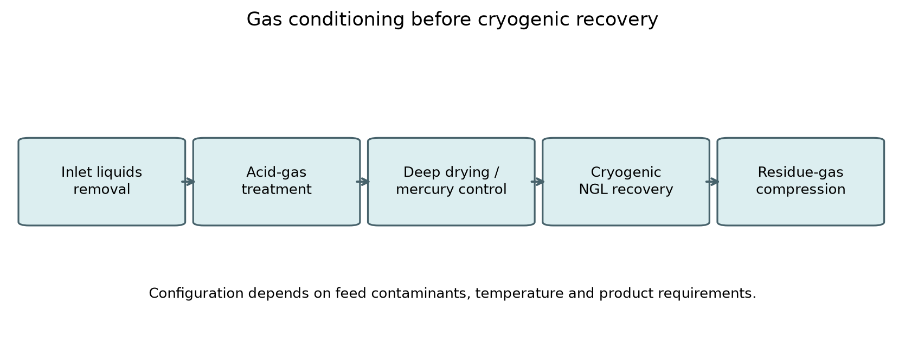
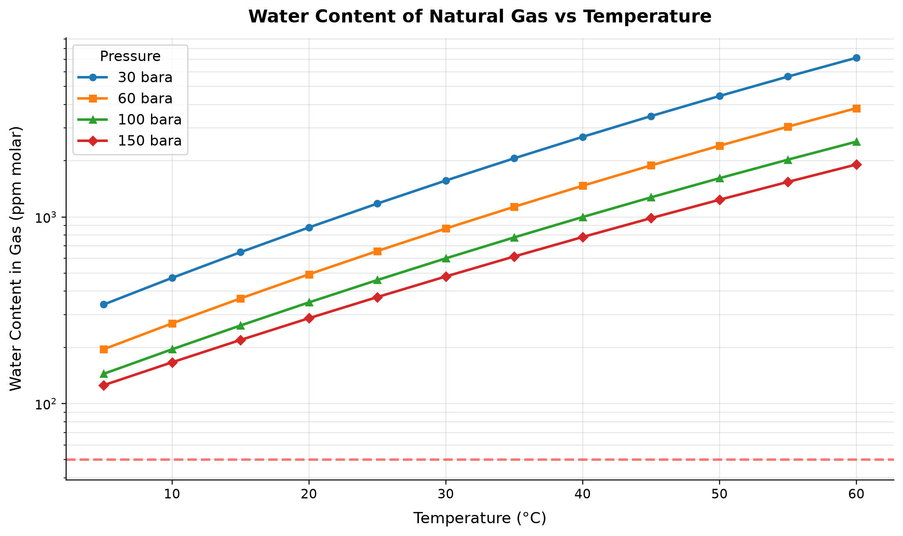
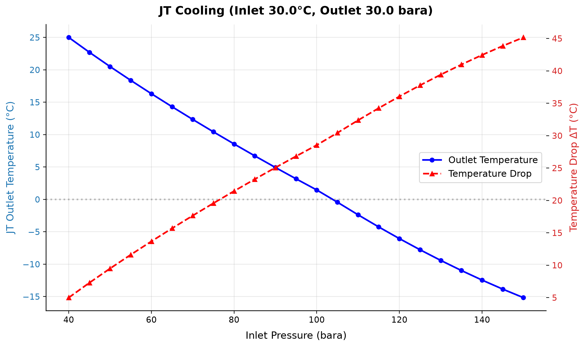
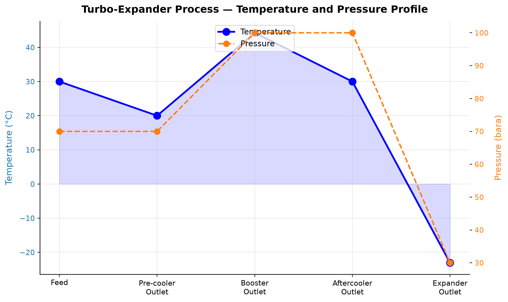
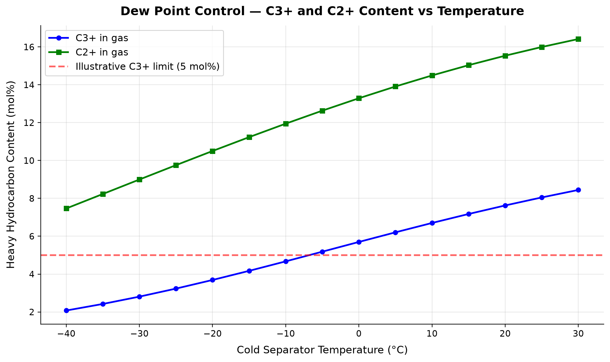

# Gas Processing and Conditioning

**Running the examples.** Start the source-workspace Python session described in Chapter 1, then run this chapter's Python blocks in reading order. Java blocks form a separate sequence using the same NeqSim build; carry forward objects from preceding Java blocks. The release execution records are in `verification/`; a successful run establishes API compatibility, while physical validation also requires the checks discussed in the text.

<!-- Chapter metadata -->
<!-- Notebooks: 01_teg_dehydration.ipynb, 02_jt_dew_point_control.ipynb, 03_ngl_fractionation.ipynb, 04_amine_treating.ipynb -->
<!-- Estimated pages: 30 -->

## Learning Objectives

After reading this chapter, the reader will be able to:

1. Design and simulate a complete TEG dehydration system including regeneration
2. Explain the principles of hydrocarbon dew point control and select appropriate technologies
3. Model NGL recovery systems using turboexpanders and fractionation columns
4. Understand acid gas removal processes and their thermodynamic basis
5. Implement gas processing unit operations in NeqSim using ProcessSystem
6. Evaluate trade-offs between different gas processing technologies
7. Calculate water dew point and hydrocarbon dew point specifications

## 12.1 Introduction to Gas Processing

Natural gas as produced from the reservoir is rarely suitable for direct sale or transport. It contains water vapor, heavy hydrocarbons, acid gases (CO$_2$, H$_2$S), and sometimes mercury, nitrogen, and other contaminants that must be removed to meet pipeline quality specifications, protect downstream equipment, and ensure safe operations.

The gas processing chain typically follows this sequence:

1. **Inlet separation**: Removal of bulk liquids and solids
2. **Acid gas removal**: Removal of CO$_2$ and H$_2$S (if present)
3. **Dehydration**: Removal of water vapor to prevent hydrate formation and corrosion
4. **Hydrocarbon dew point control**: Removal or control of heavy hydrocarbons to prevent liquid dropout in pipelines
5. **NGL recovery**: Recovery of valuable C$_2$+ or C$_3$+ hydrocarbons (if economically attractive)
6. **Mercury removal**: Protection of aluminum heat exchangers (if mercury is present)

The specific processing requirements depend on the gas composition, pipeline specifications, and the economics of NGL recovery. This chapter covers each of these processing steps in detail, with emphasis on NeqSim simulation capabilities.



<!-- scientific-illustration:gas_processing_overview.png -->
The sequence locates acid-gas treatment and deep drying upstream of cold equipment. Mercury control is included when required by feed and materials. Product requirements determine the actual treatment train; TEG dehydration alone does not establish a cryogenic water specification.
<!-- /scientific-illustration -->

Schematic of a gas processing facility showing the major unit operations from inlet separation through sales gas delivery.

### 12.1.1 Sales Gas Specifications

Pipeline-quality natural gas must meet stringent specifications:

| Parameter | Typical Specification | Reason |
|-----------|----------------------|--------|
| Water dew point | < −18°C at delivery P | Hydrate prevention, corrosion |
| HC dew point | Illustrative target < −2°C over the contract pressure range | Prevent hydrocarbon liquid dropout |
| H$_2$S content | < 4 ppm$_v$ | Toxicity, corrosion |
| CO$_2$ content | < 2–3 mol% | Heating value, corrosion |
| Total sulfur | < 20–50 mg/Sm$^3$ | Environmental, odor |
| O$_2$ content | < 0.1 mol% | Corrosion |
| Gross heating value | 36–42 MJ/Sm$^3$ | Combustion specifications |
| Wobbe Index | 45–55 MJ/Sm$^3$ | Interchangeability |

*Table 12.1: Typical sales gas specifications for European pipeline systems (varies by grid code).*

## 12.2 Gas Dehydration

### 12.2.1 Why Dehydration Is Necessary

Water vapor in natural gas causes three critical problems:

1. **Hydrate formation**: Gas hydrates are ice-like crystalline structures that form when water molecules cage small gas molecules (CH$_4$, C$_2$H$_6$, CO$_2$, H$_2$S) at elevated pressures and reduced temperatures. Hydrates can block pipelines, damage equipment, and create safety hazards.

2. **Corrosion**: Liquid water in combination with CO$_2$ and H$_2$S forms aqueous carbonic-acid and hydrogen-sulfide species; H2S dissolution does not itself form sulfuric acid, causing severe internal corrosion of carbon steel pipelines.

3. **Liquid accumulation**: Water condensation in gas transmission pipelines reduces capacity and causes slugging.

The water content of saturated natural gas depends on temperature and pressure and can be estimated from the empirical McKetta–Wehe correlation or, more accurately, from equation of state calculations.

A useful low-pressure ideal-gas limit over liquid water is $y_w\simeq a_w P_w^{sat}(T)/P$, with both pressures in the same units. Convert mole fraction to a standard-volume mass concentration using

$$C_{w,sc}=y_w\frac{P_{sc}M_w}{Z_{sc}RT_{sc}}.$$

With $M_w$ in kg/mol and SI pressure, this gives kg/Sm³; multiply by 10⁶ for mg/Sm³. At30°C, $P_w^{sat}\simeq4.24$kPa and 70 bara give about 460mg/Sm³ at 15°C/1.01325 bara when $a_w=Z_{sc}=1$. This ideal limit is not a high-pressure natural-gas prediction: fugacity, dissolved-gas effects and salinity require the selected water model. State the contract pressure and standard-volume basis for any gas-water specification.

### 12.2.2 TEG Absorption — Theory

Triethylene glycol (TEG) absorption is the most widely used dehydration method in the oil and gas industry. TEG is a hygroscopic liquid that absorbs water vapor from the gas stream through intimate contact in an absorption column.

The process consists of two main steps:

1. **Absorption**: Wet gas contacts lean (dry) TEG in a counter-current column. Water transfers from the gas phase to the TEG solution. The dried gas exits the top of the absorber.

2. **Regeneration**: Rich (wet) TEG is heated in a regeneration column (still) to drive off the absorbed water. The regenerated lean TEG is cooled and recycled to the absorber.

The thermodynamics of water absorption by TEG are governed by the vapor–liquid equilibrium between water in the gas phase and water dissolved in the TEG–water solution. The water dew point depression achievable depends on the TEG purity (lean TEG concentration), the number of equilibrium stages in the absorber, and the TEG circulation rate.

The solvent water activity fixes the equilibrium water fugacity at the contactor temperature and pressure. Lower lean-TEG water content usually lowers the attainable gas-water content, but a dew-point value also requires the downstream pressure and dew-point phase convention. A pressure-free TEG-purity/dew-point table is therefore not a usable design relation. Calculate the equilibrium limit at the stated conditions, then account for finite contacting efficiency and circulation. The checked once-through example later in this chapter states mass fraction, stages, feed state and circulation explicitly; regeneration feasibility is a separate calculation.

### 12.2.3 TEG Absorber Design

The absorber column is typically a tray column (bubble cap or valve trays) or a structured packing column. Key design parameters:

**Number of theoretical stages**: 2–4 stages are typical for most applications. A 3-tray absorber with 99.5% TEG achieves a dew point depression of approximately 40–50°C.

**TEG circulation rate**: Expressed as liters of TEG per kg of water absorbed, typically 15–40 L/kg. Higher circulation rates improve dew point but increase regeneration energy and TEG losses.

**Contact temperature**: Lower absorber temperatures favor water absorption but increase hydrocarbon absorption. Typical contact temperature is 30–50°C.

The mass transfer in the absorber is described by the Kremser equation for a dilute system:

$$N = \frac{\ln\left[\frac{y_{\text{in}} - m x_{\text{in}}}{y_{\text{out}} - m x_{\text{in}}} (1 - 1/A) + 1/A\right]}{\ln A}$$

where $N$ is the number of theoretical stages, $y$ and $x$ are water mole fractions in gas and TEG phases, $m$ is the equilibrium ratio, and $A = L/(mG)$ is the absorption factor.

### 12.2.4 TEG Regeneration

Standard TEG regeneration uses a reboiled still column operating at atmospheric pressure with a reboiler temperature of 190–204°C. The maximum reboiler temperature is limited by TEG thermal degradation — 204°C is a common practical reboiler limit rather than an abrupt chemical threshold; degradation depends on temperature, residence time, oxygen and contaminants. Apply the solvent supplier's limits.

At atmospheric pressure and 204°C, the maximum achievable TEG purity is approximately 98.5–99.0 wt%, corresponding to a water dew point depression of 30–40°C. For deeper dehydration, enhanced regeneration methods are required:

**Stripping gas**: Injecting a small amount of dry gas (typically 0.5–2% of the gas being dehydrated) into the reboiler or the surge drum below the still column strips additional water from the TEG. This can increase purity to 99.5–99.7 wt%.

**Stahl column (stripping-gas regeneration)**: A packed column located between the reboiler and the surge drum receives stripping gas counter-current to the hot TEG, providing additional mass transfer stages. This achieves 99.9+ wt% TEG purity.

**Drizo process**: Uses heavy hydrocarbon (typically iso-octane or a C$_7$–C$_8$ fraction) as an azeotroping agent in the regeneration column. The hydrocarbon forms an azeotrope with water that has a boiling point below the TEG degradation temperature, allowing more complete water removal. Drizo achieves 99.95+ wt% TEG purity.

**Vacuum regeneration**: Operating the still column under vacuum (0.3–0.5 bara) reduces the reboiler temperature needed for a given TEG purity. This is less common but useful when stripping gas is unavailable.

### 12.2.5 TEG Losses and Emissions

TEG is lost through three mechanisms:

1. **Vaporization losses**: TEG has a small but finite vapor pressure. At absorber conditions, the TEG carried in the dry gas is typically 5–15 L per million Sm$^3$ of gas.
2. **Carry-over losses**: Mechanical entrainment of TEG droplets from the absorber. Mist eliminators reduce this to acceptable levels.
3. **Degradation**: Thermal and chemical degradation products accumulate and must be periodically purged.

The BTEX (benzene, toluene, ethylbenzene, xylene) emissions from TEG regeneration are a significant environmental concern. Aromatic hydrocarbons absorbed by TEG in the absorber are released in the regenerator overhead, creating a concentrated waste gas stream. This stream may require incineration or other treatment to meet emission regulations.

### 12.2.6 Molecular Sieve Dehydration

For applications requiring very dry gas (< 1 ppm$_v$ water), molecular sieves (zeolites) are used. The most common types are 4A (sodium form) and 3A (potassium form), which selectively adsorb water due to their uniform pore size.

Molecular sieve systems operate in a cyclic batch mode:

1. **Adsorption cycle** (8–24 hours): Wet gas passes through the sieve bed, water is adsorbed
2. **Regeneration cycle** (8–12 hours): Hot regeneration gas (250–315°C) drives off adsorbed water
3. **Cooling cycle** (2–4 hours): The bed is cooled before returning to adsorption service

Molecular sieves achieve dew points below −75°C and can simultaneously remove CO$_2$ and H$_2$S at reduced loadings. They are the preferred technology for cryogenic gas plants (turboexpander plants) where extremely dry gas is needed to prevent freeze-out.

#### Bed Sizing and Breakthrough

The molecular sieve bed must be sized to adsorb the total water load during the adsorption cycle without breakthrough (water appearing in the outlet gas). The minimum bed mass is:

$$
m_{\text{bed}} = \frac{w_{\text{water}} \times Q_{\text{gas}} \times t_{\text{ads}}}{C_{\text{capacity}} \times \eta_{\text{bed}}}
$$

where $w_{\text{water}}$ is the water content of the inlet gas (kg/MSm$^3$), $Q_{\text{gas}}$ is the gas flow rate (MSm$^3$/hr), $t_{\text{ads}}$ is the adsorption time (hours), $C_{\text{capacity}}$ is the sieve water capacity (typically 10–15 wt% for fresh 4A sieve, degrading to 5–8 wt% over 3–5 years), and $\eta_{\text{bed}}$ is the bed utilization factor (typically 0.6–0.7 to account for the mass transfer zone).

The **breakthrough curve** describes the transition from dry outlet to saturated outlet as the bed approaches exhaustion. A sharp breakthrough indicates good mass transfer; a drawn-out curve indicates poor gas distribution or degraded sieve. Monitoring the breakthrough front position using temperature sensors within the bed is standard practice.

#### Regeneration Cycle Design

Regeneration consists of three steps:

1. **Heating step**: Hot gas (250–315°C) is passed through the bed in the reverse direction to adsorption. The bed temperature must exceed the desorption temperature of water on the sieve (typically 230–280°C depending on the sieve type).

2. **Peak temperature hold**: The entire bed must reach the regeneration temperature to ensure complete desorption. Insufficient heating leaves a residual water loading that reduces effective capacity.

3. **Cooling step**: Cool gas (typically inlet gas) is passed through the bed until the temperature drops to within 10–15°C of the adsorption temperature. Cooling must proceed in the same direction as adsorption to avoid disturbing the mass transfer zone.

The regeneration gas rate is typically 5–15% of the process gas flow. Regeneration energy is the primary operating cost for molecular sieve systems.

#### Comparison: TEG vs Molecular Sieve

| Parameter | TEG Dehydration | Molecular Sieve |
|-----------|----------------|-----------------|
| Outlet water dew point | −18 to −40°C (−65°C with Drizo) | < −75°C |
| CAPEX | Lower | Higher (multiple vessels, switching valves) |
| OPEX | Lower (mainly TEG makeup) | Higher (regeneration energy) |
| Space/weight | Smaller | Larger (2–3 parallel vessels) |
| Chemical consumption | TEG makeup 5–20 L/MMSm$^3$ | Sieve replacement every 3–5 years |
| BTEX handling | Coabsorption can release aromatics in regenerator overhead | Coadsorbed hydrocarbons can appear in regeneration gas |
| Simultaneous H$_2$S removal | No | Partial (with type 5A sieve) |
| Turndown capability | Good | Good |
| Preferred application | Standard pipeline spec | Cryogenic plants, LNG feed prep |

Cryogenic service requires a verified water specification over the coldest temperature/pressure path. Molecular sieves are commonly selected for deep dehydration; a universal 1ppmv freezing threshold is incorrect because ice/hydrate stability depends on fugacity and operating conditions. TEG is typically used upstream of the molecular sieve as a bulk dehydration step to reduce the water load on the sieves.

## 12.3 Hydrocarbon Dew Point Control

### 12.3.1 The Hydrocarbon Dew Point Problem

Natural gas transported through pipelines must not form liquid hydrocarbons at any point along the pipeline. Liquid dropout creates safety hazards (slug flow), operational problems (liquid accumulation at low points), and metering errors. The hydrocarbon dew point (HCDP) is the temperature at which the first drop of liquid hydrocarbon forms at a given pressure.

The HCDP is particularly sensitive to the presence of small amounts of heavy hydrocarbons (C$_5$+). A gas with 0.5 mol% n-hexane may have an HCDP 30–40°C higher than the same gas with only C$_1$–C$_4$ components.

Cricondentherm is the maximum saturation temperature of the specified composition. A gas contract may instead limit dew point at one pressure or over a specified interval:

$$\max_{P\in[P_{min},P_{max}]}T_{dew}(P,\mathbf z)\leq T_{spec}.$$

An all-pressure cricondentherm limit is a different, generally stronger condition; specify which is required.

### 12.3.2 Joule–Thomson (JT) Cooling

The simplest method for HCDP control is Joule–Thomson cooling. Gas is expanded through a valve (JT valve) from a high pressure to a lower pressure. For natural gas, which has a positive JT coefficient at typical conditions, this expansion produces cooling:

$$\mu_{\text{JT}} = \left(\frac{\partial T}{\partial P}\right)_H = \frac{1}{C_p}\left[T\left(\frac{\partial V}{\partial T}\right)_P - V\right]$$

For an ideal gas, $\mu_{\text{JT}} = 0$. For real natural gas at typical pipeline conditions, $\mu_{\text{JT}} \approx 3$–$6$ °C/MPa.

A typical JT system consists of:

1. **Inlet gas–gas heat exchanger**: Cools the incoming gas against the cold processed gas
2. **JT valve**: Expands the gas to produce the target temperature
3. **Cold separator**: Separates condensed liquids from the gas
4. **Outlet gas–gas heat exchanger**: Warms the cold gas against incoming gas

The pressure drop required depends on the inlet conditions and the required dew point depression. For a typical North Sea application with inlet gas at 70 bara and 30°C requiring a dew point below −2°C, a pressure drop of approximately 25–35 bar is needed, yielding a cold separator temperature of approximately −10 to −15°C.

**Limitations of JT cooling**:
- Requires high available pressure drop (limits use in low-pressure systems)
- Pressure is consumed (not recoverable)
- Limited temperature depression per bar of pressure drop
- Rich gases may require very large pressure drops

### 12.3.3 Turboexpander

A turboexpander (expansion turbine) achieves the same cooling effect as a JT valve but recovers useful work from the expansion. The gas drives a turbine wheel, which can be coupled to:

- A compressor (compander configuration) that recompresses the processed gas
- An electrical generator

The isentropic expansion produces more cooling per unit pressure drop than the isenthalpic JT expansion:

$$\Delta T_{\text{turboexpander}} > \Delta T_{\text{JT}}$$

for the same pressure ratio. The actual temperature difference must be calculated for the same inlet composition/state and outlet pressure; there is no universal percentage cooling advantage.

The power recovered by the turboexpander is:

$$W = \dot{m} \eta_s (h_1 - h_{2s})$$

where $\dot{m}$ is the mass flow rate, $\eta_s$ is the isentropic efficiency, and $h_1 - h_{2s}$ is the isentropic enthalpy change.

### 12.3.4 JT Valve vs Turboexpander — Detailed Comparison

The choice between JT expansion and turboexpander has significant implications for plant design, economics, and product recovery. Understanding the thermodynamic difference is essential.

**Isenthalpic expansion (JT valve):** The gas passes through a restriction where kinetic energy is dissipated. No work is done on or by the gas, so the total enthalpy is conserved:

$$
h_1 = h_2 \quad \Rightarrow \quad T_2 = T_1 + \int_{P_1}^{P_2} \mu_{\text{JT}} \, dP
$$

For real gases, the Joule-Thomson coefficient $\mu_{\text{JT}}$ is positive below the inversion temperature (true for most natural gas conditions), producing cooling. Typical JT cooling: 3–6°C per MPa of pressure drop.

**Isentropic expansion (turboexpander):** The gas does work on the turbine wheel, extracting energy. The entropy is conserved (ideally):

$$
s_1 = s_2 \quad \Rightarrow \quad T_{2s} < T_{2,\text{JT}}
$$

Because isentropic expansion extracts energy that would otherwise remain as thermal energy in the gas, the expander outlet has lower enthalpy than the JT outlet at the same pressure. For a stable single phase this normally gives a lower temperature; within a pure-fluid two-phase region it can instead change vapor quality at the same saturation temperature.

The temperature difference between the two processes depends on the gas composition and conditions:

| Parameter | JT Valve | Turboexpander (80% eff.) |
|-----------|----------|--------------------------|
| Cooling per 10 bar ΔP | 3–6°C | 5–10°C |
| Work recovery | None | 70–85% of isentropic work |
| NGL recovery | Low–moderate | High |
| Moving parts | None | High-speed rotating |
| CAPEX | Very low | High ($3–10 million) |
| OPEX | Negligible | Bearing/seal maintenance |
| Turndown | Excellent | Limited (40–110% of design) |
| Reliability | Very high | High (but requires maintenance) |

The turboexpander is economically justified when:
- The additional NGL recovery exceeds the annualized cost of the turboexpander
- The gas is rich enough to produce significant condensate (C$_3$+ > 3–4 mol%)
- A long operating period justifies the higher capital investment

For lean gas fields producing primarily methane with little C$_3$+ content, JT expansion is often sufficient for HCDP control. For rich gas or when ethane recovery is desired, the turboexpander is the standard technology.

For a gas-condensate mixture, liquid dropout along an isothermal depletion or expansion path can be nonmonotonic. The cricondenbar is the maximum pressure of the saturation envelope, where a phase is incipient; it does not identify maximum bulk liquid recovery. Optimize actual flashed liquid yield along the specified energy path, including recompression and final product quality constraints.

### 12.3.4 Mechanical Refrigeration

When the available pressure drop is insufficient for JT or turboexpander cooling, mechanical refrigeration provides external cooling. The most common refrigerant is propane, which operates in a closed-loop vapor-compression cycle:

1. **Chiller**: Propane evaporates at low pressure, cooling the process gas
2. **Compressor**: Propane vapor is compressed
3. **Condenser**: Compressed propane is condensed against air or cooling water
4. **Expansion valve**: Liquid propane flashes back to the evaporator pressure

Propane refrigeration can achieve gas temperatures of −30 to −40°C, sufficient for most HCDP specifications. For lower temperatures, cascade systems using ethane or ethylene as a secondary refrigerant extend the range to −60 to −100°C.

The coefficient of performance (COP) of a propane refrigeration cycle is:

$$\text{COP} = \frac{Q_{\text{evap}}}{W_{\text{comp}}} \approx 2.5\text{–}4.0$$

for typical gas processing conditions.

## 12.4 NGL Recovery and Fractionation

### 12.4.1 Economics of NGL Recovery

Natural gas liquids (C$_2$+) are often more valuable as separate products than as components of the sales gas. The decision to recover NGL depends on:

- **Product prices**: Ethane (petrochemical feedstock), LPG (propane + butane), and condensate (C$_5$+) prices relative to natural gas
- **Capital cost**: NGL recovery plant and fractionation train
- **Operating cost**: Compression power, refrigeration, and heat duties
- **Recovery level**: Ethane recovery (80–95%), propane recovery (95–99%), C$_4$+ recovery (>99%)

The ethane rejection flexibility — the ability to operate in either ethane recovery or ethane rejection mode depending on market prices — is a valuable design feature for NGL plants.

### 12.4.2 Turboexpander NGL Recovery

The turboexpander process is the dominant technology for NGL recovery from lean to moderately rich gases. The basic flow scheme includes:

1. **Inlet heat exchange**: Gas is cooled against cold plant products
2. **Turboexpander**: Gas expands to −60 to −100°C, condensing C$_2$+
3. **Demethanizer column**: Separates methane (overhead) from C$_2$+ (bottoms)
4. **Recompression**: Residue gas is compressed by the expander-coupled compressor

The key thermodynamic principle is that the isentropic expansion simultaneously cools the gas and reduces its pressure, shifting the phase envelope to favor liquid formation of heavy hydrocarbons.

**Enhanced turboexpander processes** include:
- **Gas subcooled process (GSP)**: A portion of the separator liquid is subcooled and used as reflux, improving ethane recovery to 85–92%
- **Recycle split vapor (RSV)**: Part of the residue gas is recycled to provide additional reflux
- **Cold residue recycle (CRR)**: Cold separator overhead is partially recycled after cooling, achieving ethane recovery above 95%

### 12.4.3 NGL Fractionation

The NGL stream from the demethanizer is separated into individual products in a series of distillation columns called the fractionation train:

1. **Deethanizer**: Separates ethane (overhead) from C$_3$+ (bottoms)
2. **Depropanizer**: Separates propane (overhead) from C$_4$+ (bottoms)
3. **Debutanizer**: Separates butanes (overhead) from C$_5$+ (bottoms, natural gasoline)

Each column is designed for a specific separation, with the number of stages and reflux ratio determined by the required product purity:

| Column | Typical Stages | Feed Location | Key Separation | Overhead Purity |
|--------|---------------|---------------|----------------|-----------------|
| Demethanizer | 15–30 | Top | C$_1$/C$_2$ | >98% CH$_4$ |
| Deethanizer | 25–35 | Middle | C$_2$/C$_3$ | >95% C$_2$ |
| Depropanizer | 30–40 | Middle | C$_3$/C$_4$ | >95% C$_3$ |
| Debutanizer | 25–35 | Middle | C$_4$/C$_5$ | >95% C$_4$ |

*Table 12.3: Typical design parameters for NGL fractionation columns.*

## 12.5 Acid Gas Removal

### 12.5.1 Acid Gas Components

Acid gases — primarily hydrogen sulfide (H$_2$S) and carbon dioxide (CO$_2$) — must be removed from natural gas for several reasons:

- **H$_2$S toxicity**: H$_2$S is lethal at concentrations above 500–700 ppm$_v$ and causes impairment at much lower levels
- **Corrosion**: Both CO$_2$ and H$_2$S cause severe corrosion in the presence of water
- **Pipeline specifications**: Typical limits are 4 ppm$_v$ H$_2$S and 2–3 mol% CO$_2$
- **Heating value**: CO$_2$ is inert and reduces the heating value of the gas
- **Environmental**: H$_2$S combustion produces SO$_2$; excess CO$_2$ affects carbon footprint

### 12.5.2 Amine Treating — Fundamentals

Chemical absorption using aqueous alkanolamine solutions is the most widely used acid gas removal technology. The amines react reversibly with CO$_2$ and H$_2$S:

**H$_2$S absorption** (instantaneous, ionic reaction):

$$\text{H}_2\text{S} + \text{R}_2\text{NH} \rightleftharpoons \text{R}_2\text{NH}_2^+ + \text{HS}^-$$

**CO$_2$ absorption by primary/secondary amines** (carbamate formation):

$$\text{CO}_2 + 2\text{RNH}_2 \rightleftharpoons \text{RNHCOO}^- + \text{RNH}_3^+$$

**CO$_2$ absorption by tertiary amines** (bicarbonate formation, slow):

$$\text{CO}_2 + \text{R}_3\text{N} + \text{H}_2\text{O} \rightleftharpoons \text{R}_3\text{NH}^+ + \text{HCO}_3^-$$

The key difference between primary/secondary amines (MEA, DEA) and tertiary amines (MDEA) is that the carbamate mechanism is fast and requires 2 moles of amine per mole of CO$_2$, while the bicarbonate mechanism is slow but requires only 1 mole of amine. This has profound implications for selective H$_2$S removal.

### 12.5.3 Common Amines

| Amine | Type | MW | Typical Conc. (wt%) | CO$_2$ Loading | Selectivity |
|-------|------|-----|---------------------|----------------|-------------|
| MEA | Primary | 61 | 15–20 | 0.3–0.4 mol/mol | Non-selective |
| DEA | Secondary | 105 | 25–35 | 0.3–0.5 mol/mol | Slightly selective |
| MDEA | Tertiary | 119 | 35–55 | 0.4–0.7 mol/mol | Highly H$_2$S selective |
| DGA | Primary | 105 | 50–60 | 0.3–0.4 mol/mol | Non-selective |
| DIPA | Secondary | 133 | 30–40 | 0.3–0.5 mol/mol | Moderately selective |

*Table 12.4: Common amines used for acid gas removal and their characteristics.*

**MDEA** is the most widely used amine today because of its key advantages:
- High selectivity for H$_2$S over CO$_2$ (exploiting the slow bicarbonate mechanism)
- Higher loading capacity (lower circulation rate)
- Lower heat of reaction with CO$_2$ (lower regeneration energy)
- Higher concentration (35–55 wt%) without excessive corrosion
- Lower vapor pressure (lower amine losses)

Activated MDEA formulations add small amounts of piperazine or other promoters to accelerate CO$_2$ absorption when both CO$_2$ and H$_2$S removal are needed.

### 12.5.4 Amine System Design

A standard amine treating unit consists of:

1. **Absorber**: Counter-current column (15–25 trays or equivalent packing) where lean amine contacts sour gas. Operating pressure is the gas pressure; temperature is 35–50°C.

2. **Flash drum**: Rich amine is flashed to remove co-absorbed hydrocarbons (reduces foaming and hydrocarbon losses).

3. **Lean–rich heat exchanger**: Rich amine is heated against lean amine, recovering heat and reducing reboiler duty.

4. **Regenerator (stripper)**: Rich amine is steam-stripped at low pressure (1.5–2.0 bara) to drive off acid gases. Reboiler temperature is 110–125°C.

5. **Condenser and reflux drum**: Overhead vapor is cooled to condense water, which is returned as reflux.

6. **Lean amine cooler**: Regenerated amine is cooled before returning to the absorber.

The amine circulation rate is determined by the acid gas loading:

$$\dot{m}_{\text{amine}} = \frac{Q_{\text{acid gas}}}{\alpha_{\text{rich}} - \alpha_{\text{lean}}} \times \frac{MW_{\text{amine}}}{w_{\text{amine}}}$$

where $\alpha$ is the acid gas loading (mol acid gas / mol amine), $MW_{\text{amine}}$ is the amine molecular weight, and $w_{\text{amine}}$ is the amine weight fraction.

#### Regeneration Energy

The regeneration energy (reboiler duty) is one of the largest operating costs of an amine unit. It consists of three components:

1. **Sensible heat**: Heating the rich amine from the heat exchanger outlet to the reboiler temperature
2. **Heat of reaction**: Reversing the exothermic acid gas absorption reactions
3. **Stripping steam**: Generating sufficient steam to maintain vapor traffic and reduce acid gas partial pressure

Typical regeneration energies by amine type:

| Amine | Reboiler Duty (GJ/tonne CO$_2$) | Reboiler Temperature (°C) |
|-------|--------------------------------|--------------------------|
| MEA 15–20% | 3.5–4.5 | 115–125 |
| DEA 25–35% | 3.0–3.5 | 110–120 |
| MDEA 50% | 2.5–3.0 | 110–120 |
| Activated MDEA | 2.0–2.8 | 110–120 |

The lower regeneration energy of MDEA (compared to MEA) is due to its lower heat of reaction with CO$_2$ and its ability to operate at higher concentrations (which reduces the sensible heat contribution).

#### Amine Degradation and Operational Issues

Amine degradation is a persistent operational challenge that increases makeup costs, causes foaming, and generates corrosive byproducts:

- **Oxidative degradation**: Occurs when oxygen enters the system (from air leaks or dissolved O$_2$ in feed gas). MEA is most susceptible; produces heat-stable salts (HSS) such as formate, acetate, and oxalate. MDEA is more resistant to oxidative degradation.
- **Thermal degradation**: Occurs at elevated temperatures (> 130°C for MEA, > 150°C for MDEA). The reboiler is the most vulnerable point; hot spots on fire-tube reboilers accelerate degradation.
- **CO$_2$-induced degradation**: MEA reacts irreversibly with CO$_2$ at high temperatures to form 2-oxazolidone (HEOD), which further degrades to other compounds. This is a primary reason MEA concentrations are limited to 15–20 wt%.

Mitigation strategies include: oxygen scavengers, nitrogen blanketing on tanks, proper reboiler design (low heat flux < 30 kW/m$^2$), activated carbon filtration to remove degradation products, and reclaimer operation to purge heat-stable salts.

#### NeqSim Amine Simulation Example

NeqSim models amine systems using the electrolyte CPA equation of state, which captures the chemical reactions between amines and acid gases:

The current `SimpleAmineAbsorber` is the appropriate simplified amine class; a TEG absorber is not an acid-gas removal model. The following example specifies the CO$_2$ removal efficiency as an assumption. Its outlet is a screening calculation, not a validated prediction of solvent kinetics or an assurance that the circulation rate meets the specification.

The next calculation is a **prescribed-removal, isothermal material-allocation example**. Its 90% CO₂ and 99% H₂S removals are input assumptions, not equilibrium or rate-based absorber predictions; the stage count is metadata in this simple model. The feed is already dry and the 50 wt% MDEA stream contains explicit zero-amount acid-gas components so transferred material is retained. A 300 t/hr solvent rate gives net loading 0.366 mol acid gas/mol MDEA, below the explicitly assumed 0.50 screening limit. The original 5 t/hr rate would require 21.96 mol/mol and is rejected. The resulting 467.9 kW heat removal maintains the isothermal boundary; solvent-specific loading, reaction heat, mass transfer, regenerator duty and outlet specifications still require a reactive process design. Sweet gas retains about 5,524 ppmv CO₂, so no universal sales-gas compliance is claimed.

```python
import math
import jpype
jneqsim = jpype.JPackage("neqsim")

# Define sour gas with acid gases
sour_gas = jneqsim.thermo.system.SystemElectrolyteCPAstatoil(
    273.15 + 40.0, 70.0)
sour_gas.addComponent("methane", 90.0)
sour_gas.addComponent("CO2", 5.0)
sour_gas.addComponent("H2S", 0.5)
sour_gas.addComponent("water", 0.005)  # pretreated gas, about 52 ppmv water
sour_gas.setMixingRule(10)

# Define lean MDEA solution
lean_amine = jneqsim.thermo.system.SystemElectrolyteCPAstatoil(
    273.15 + 40.0, 70.0)
lean_amine.addComponent("MDEA", 50.0 / 0.11916)  # 50 kg on a molar basis
lean_amine.addComponent("water", 50.0 / 0.018015)  # 50 kg water
lean_amine.addComponent("CO2", 0.0)
lean_amine.addComponent("H2S", 0.0)
lean_amine.setMixingRule(10)

# Create streams
gas_feed = jneqsim.process.equipment.stream.Stream("Sour Gas", sour_gas)
gas_feed.setFlowRate(5.0e6, "Sm3/day")
gas_feed.setTemperature(40.0, "C")
gas_feed.setPressure(70.0, "bara")

amine_feed = jneqsim.process.equipment.stream.Stream("Lean MDEA", lean_amine)
amine_feed.setFlowRate(300000.0, "kg/hr")
amine_feed.setTemperature(40.0, "C")
amine_feed.setPressure(70.0, "bara")

# Simplified amine removal model: calibrate removal and loading before design
absorber = jneqsim.process.equipment.absorber.SimpleAmineAbsorber("Amine Absorber")
absorber.setSourGasInStream(gas_feed)
absorber.setLeanAmineInStream(amine_feed)
absorber.setNumberOfStages(15)  # metadata; removal remains prescribed
absorber.setH2SRemovalEfficiency(0.99)
absorber.setCO2RemovalEfficiency(0.90)  # explicitly assumed, not a rate-based prediction

process = jneqsim.process.processmodel.ProcessSystem()
process.add(gas_feed)
process.add(amine_feed)
process.add(absorber)
process.run()

sweet_gas = absorber.getSweetGasOutStream()
print(f"Sweet gas CO2: {sweet_gas.getFluid().getPhase('gas').getComponent('CO2').getx() * 1e6:.0f} ppm")

# This prescribed-removal model is isothermal; calculate its required heat exchange.
rich_amine = absorber.getRichAmineOutStream()
def amine_state(stream):
    fluid = stream.getFluid()
    fluid.initProperties()
    return {"mass": stream.getFlowRate("kg/sec"),
            "H": stream.getFlowRate("kg/sec") * fluid.getEnthalpy("J/kg"),
            "moles": {str(fluid.getComponent(i).getComponentName()):
                      fluid.getComponent(i).getNumberOfmoles()
                      for i in range(fluid.getNumberOfComponents())}}
in_states = [amine_state(gas_feed), amine_state(amine_feed)]
out_states = [amine_state(sweet_gas), amine_state(rich_amine)]
mass_in = sum(s["mass"] for s in in_states)
mass_out = sum(s["mass"] for s in out_states)
assert abs(mass_in - mass_out) / mass_in < 1e-6
components = set(k for s in in_states + out_states for k in s["moles"])
total_moles = sum(sum(s["moles"].values()) for s in in_states)
for name in components:
    ni = sum(s["moles"].get(name, 0.0) for s in in_states)
    no = sum(s["moles"].get(name, 0.0) for s in out_states)
    assert abs(ni - no) / total_moles < 1e-6, name
acid_pickup = sum(in_states[0]["moles"].get(k, 0.0) -
                  out_states[0]["moles"].get(k, 0.0) for k in ["CO2", "H2S"])
amine_moles = in_states[1]["moles"]["MDEA"]
net_loading = acid_pickup / amine_moles
assumed_net_loading_limit = 0.50  # explicit screening assumption, needs solvent data
assert 0.0 < net_loading <= assumed_net_loading_limit
original_5_tph_loading = net_loading * 300000.0 / 5000.0
assert original_5_tph_loading > assumed_net_loading_limit
isothermal_heat_W = sum(s["H"] for s in out_states) - sum(s["H"] for s in in_states)
assert math.isfinite(isothermal_heat_W)
print(f"Net acid pickup: {net_loading:.3f} mol/mol MDEA")
print(f"Rejected 5 t/hr solvent case: {original_5_tph_loading:.2f} mol/mol MDEA")
print(f"Required isothermal heat input: {isothermal_heat_W / 1000:.1f} kW")
```

### 12.5.5 Physical Solvents Physical solvents absorb CO$_2$ proportionally to its partial pressure (Henry's law), without the stoichiometric limitation of chemical reactions.

**Selexol** (dimethyl ether of polyethylene glycol): Operates at ambient temperature, regenerated by pressure reduction and/or air stripping. Widely used for bulk CO$_2$ removal in high-pressure applications.

**Rectisol** (chilled methanol at −40 to −60°C): Achieves very deep removal (< 1 ppm CO$_2$). Used in synthesis gas applications and LNG plants. Requires refrigeration.

The solubility of CO$_2$ in a physical solvent follows Henry's law:

$$x_{\text{CO}_2} = \frac{P_{\text{CO}_2}}{H_{\text{CO}_2}(T)}$$

where $H_{\text{CO}_2}(T)$ is the Henry's law constant, defined here by $x=P/H$. When cooling favors absorption, this pressure-over-mole-fraction Henry constant decreases on cooling (increases with temperature); its convention must be stated.

## 12.6 Mercury Removal

Mercury in natural gas (typically 10–200 μg/Nm$^3$) attacks aluminum heat exchangers by amalgamation, causing catastrophic embrittlement failure. Mercury removal is essential upstream of any cryogenic processing equipment containing aluminum (plate-fin heat exchangers, turboexpanders).

### 12.6.1 Mercury Species and Sources

Mercury in natural gas exists in several forms:

- **Elemental mercury** (Hg$^0$): Volatile, carried in the gas phase. This is the dominant form.
- **Organic mercury compounds** (R-Hg): Dimethylmercury, diethylmercury. Present in condensate.
- **Ionic mercury** (Hg$^{2+}$): Associated with produced water.

Mercury concentrations vary dramatically by region. Southeast Asian fields (Sumatra, Thailand) can have 200+ μg/Nm$^3$, while North Sea fields typically have < 10 μg/Nm$^3$. The failure mechanism in aluminum heat exchangers is **liquid metal embrittlement (LME)**: mercury amalgamates with the aluminum grain boundaries, potentially causing liquid-metal embrittlement and amalgamation-related damage. This mechanism is distinct from conventional aqueous stress-corrosion cracking.

### 12.6.2 Removal Technologies

The standard removal method uses fixed-bed adsorbents:

**Sulfur-impregnated activated carbon** is the most common adsorbent. Elemental mercury reacts with the sulfur to form cinnabar (HgS), which is highly stable:

$$
\text{Hg}^0 + \text{S} \rightarrow \text{HgS}
$$

This adsorbent is non-regenerable and must be replaced when exhausted (typically 3–5 year bed life).

**Metal sulfide adsorbents** (CuS, ZnS on alumina support) offer higher capacity and faster kinetics. Copper sulfide converts mercury by displacement:

$$
\text{Hg}^0 + \text{CuS} \rightarrow \text{HgS} + \text{Cu}^0
$$

These adsorbents can also remove organic mercury compounds, which activated carbon may not fully capture.

**Silver-impregnated zeolites** are used for ultra-low mercury specifications (< 0.01 μg/Nm$^3$) required for some LNG plants.

### 12.6.3 Bed Sizing

Bed sizing follows:

$$V_{\text{bed}} = \frac{\dot{m}_{\text{Hg}} \times t_{\text{life}}}{C_{\text{Hg,capacity}} \times \rho_{\text{bed}}}$$

where $C_{\text{Hg,capacity}}$ is the adsorbent mercury capacity (typically 5–15 wt%) and $t_{\text{life}}$ is the desired bed life (typically 3–5 years).

The bed must be sized for the maximum expected mercury concentration, not the average. A typical guard bed arrangement uses two vessels in series (lead-lag configuration), where the lead bed is replaced when breakthrough is detected by mercury analyzers between the beds.

**Typical mercury specifications:**

| Application | Maximum Hg Level |
|-------------|-----------------|
| Pipeline gas | Not usually specified |
| LNG feed | < 0.01 μg/Nm$^3$ |
| Cryogenic NGL plant | < 0.1 μg/Nm$^3$ |
| Petrochemical feed | < 0.01 μg/Nm$^3$ |
| Condensate export | < 10 μg/kg |

### 12.6.4 Placement in the Process

Mercury removal is placed **downstream of dehydration** and **upstream of cryogenic equipment**. Wet gas can deactivate some mercury adsorbents by occupying active sites with water. The typical sequence is:

1. TEG or molecular sieve dehydration
2. Mercury removal bed
3. HCDP control (JT/turboexpander)
4. NGL recovery

## 12.6A Nitrogen Rejection

### 12.6A.1 When Nitrogen Rejection Is Required

Nitrogen is an inert gas that dilutes natural gas, reducing its heating value. Pipeline specifications typically require a maximum of 3–5 mol% nitrogen. Reservoirs with elevated nitrogen content (> 5–10 mol%) require nitrogen rejection to produce marketable gas.

Common sources of high nitrogen include:
- Nitrogen-rich reservoirs (some fields in the North Sea, Algeria, Russia)
- Nitrogen used for enhanced oil recovery (N$_2$ injection)
- Air ingress during production

### 12.6A.2 Nitrogen Rejection Technologies

**Cryogenic nitrogen rejection unit (NRU)** is the dominant technology for large-scale nitrogen removal. It exploits the volatility difference between nitrogen (BP = −196°C) and methane (BP = −161°C) through cryogenic distillation:

1. The feed gas is cooled to approximately −170°C in a cold box
2. A distillation column separates nitrogen overhead (>95% pure) from methane bottoms
3. The cold nitrogen stream provides refrigeration through heat exchange with the feed

Cryogenic NRU achieves > 98% methane recovery with nitrogen purity sufficient for venting or for sale as industrial nitrogen. For gas containing both nitrogen and helium, the NRU can be combined with a helium recovery unit (helium is even more volatile than nitrogen and concentrates in the overhead).

**Membrane separation** uses polymeric membranes that are selectively permeable to hydrocarbons over nitrogen. Nitrogen, being a slower-permeating gas, concentrates in the retentate (high-pressure side). Membranes are economically attractive for:
- Moderate nitrogen content (5–15 mol%)
- Small gas volumes (< 2 MSm$^3$/day)
- Offshore locations where cryogenic equipment is impractical

Methane recovery depends on membrane selectivity, stage cut and recycle. In the methane-selective arrangement just described, methane-rich permeate is the product and unrecovered methane remains in the nitrogen-rich retentate. Assess both streams and their downstream use; do not label the product permeate as the loss stream or assume an untreated stream may be vented.

**Pressure swing adsorption (PSA)** uses molecular sieves that preferentially adsorb nitrogen at high pressure and release it at low pressure. PSA is suitable for small-scale applications (< 0.5 MSm$^3$/day) and can achieve nitrogen reduction to < 3 mol%.

### 12.6A.3 Technology Selection

| Parameter | Cryogenic NRU | Membrane | PSA |
|-----------|--------------|----------|-----|
| Scale | > 2 MSm$^3$/day | 0.5–5 MSm$^3$/day | < 0.5 MSm$^3$/day |
| N$_2$ in feed | Any level | 5–15 mol% | 5–20 mol% |
| CH$_4$ recovery | > 98% | 85–95% | 80–90% |
| N$_2$ purity | > 95% | N/A (rejected in CH$_4$ stream) | N/A |
| CAPEX | Very high | Low–moderate | Moderate |
| OPEX | High (compression, refrigeration) | Low (pressure-driven) | Moderate |
| Footprint | Large | Compact | Moderate |
| Helium recovery | Possible | No | No |

## 12.7 NeqSim Implementation

### 12.7.1 TEG Absorber Calculation with NeqSim

This is a once-through five-equilibrium-stage contactor. The raw feed is flashed in a three-phase inlet scrubber, and only its saturated gas enters the absorber. The lean solution is99.5 wt%TEG at 43°C and 5,000 kg/hr; specifying0.995 as a mole fraction would describe a different solvent. Regeneration, stripping gas, solvent inventory and tray hydraulic efficiency are outside this boundary. The code enforces mass, energy and MESH convergence before reporting dry-gas water content.

```python
import jpype
jneqsim = jpype.JPackage("neqsim")

# ============================================================
# Once-through equilibrium TEG absorber: regeneration is outside the boundary
# ============================================================

# Define wet gas composition
wet_gas = jneqsim.thermo.system.SystemSrkCPAstatoil(
    273.15 + 30.0, 70.0)
wet_gas.addComponent("methane", 85.0)
wet_gas.addComponent("ethane", 5.0)
wet_gas.addComponent("propane", 2.5)
wet_gas.addComponent("n-butane", 1.0)
wet_gas.addComponent("n-pentane", 0.3)
wet_gas.addComponent("n-hexane", 0.1)
wet_gas.addComponent("CO2", 2.0)
wet_gas.addComponent("water", 4.0)
wet_gas.addComponent("TEG", 0.0)
wet_gas.setMixingRule(10)  # CPA mixing rule
wet_gas.setMultiPhaseCheck(True)

# Wet gas feed stream
wet_feed = jneqsim.process.equipment.stream.Stream(
    "Wet Gas Feed", wet_gas)
wet_feed.setFlowRate(10.0, "MSm3/day")
wet_feed.setTemperature(30.0, "C")
wet_feed.setPressure(70.0, "bara")

# Remove free liquid before the gas absorber.
wet_feed.run()
inlet_scrubber = jneqsim.process.equipment.separator.ThreePhaseSeparator("Inlet Scrubber", wet_feed)
inlet_scrubber.run()
saturated_gas = inlet_scrubber.getGasOutStream()
assert saturated_gas.getFluid().getNumberOfPhases() == 1

# Lean TEG stream
teg_fluid = jneqsim.thermo.system.SystemSrkCPAstatoil(
    273.15 + 43.0, 70.0)
teg_fluid.addComponent("methane", 0.0)
teg_fluid.addComponent("ethane", 0.0)
teg_fluid.addComponent("propane", 0.0)
teg_fluid.addComponent("n-butane", 0.0)
teg_fluid.addComponent("n-pentane", 0.0)
teg_fluid.addComponent("n-hexane", 0.0)
teg_fluid.addComponent("CO2", 0.0)
teg_fluid.addComponent("water", 0.5 / 0.018015)  # kg / (kg/mol)
teg_fluid.addComponent("TEG", 99.5 / 0.150174)  # 99.5 wt% lean TEG
teg_fluid.setMixingRule(10)
teg_fluid.setMultiPhaseCheck(True)

lean_teg = jneqsim.process.equipment.stream.Stream(
    "Lean TEG", teg_fluid)
lean_teg.setFlowRate(5000.0, "kg/hr")
lean_teg.setTemperature(43.0, "C")
lean_teg.setPressure(70.0, "bara")

# TEG Absorber Column
absorber = jneqsim.process.equipment.distillation.DistillationColumn(
    "TEG Absorber", 5, False, False)
absorber.addFeedStream(saturated_gas, 0)    # Gas enters at bottom
absorber.addFeedStream(lean_teg, 4)    # TEG enters at top
absorber.setSolverType(jneqsim.process.equipment.distillation.DistillationColumn.SolverType.DIRECT_SUBSTITUTION)
absorber.setMaxNumberOfIterations(100, True)
absorber.setTemperatureTolerance(1e-7)
absorber.setMassBalanceTolerance(1e-6)
absorber.setEnthalpyBalanceTolerance(1e-5)
absorber.setEnforceEnergyBalanceTolerance(True)
absorber.setMeshResidualTolerance(1e-5)
absorber.setEnforceMeshResidualTolerance(True)


# Build and run process
process = jneqsim.process.processmodel.ProcessSystem()
process.add(wet_feed)
process.add(inlet_scrubber)
process.add(lean_teg)
process.add(absorber)
process.run()

# Get results
dry_gas = absorber.getGasOutStream()
rich_teg = absorber.getLiquidOutStream()

print(absorber.getConvergenceDiagnostics())
assert str(absorber.getLastSolveStatus()) == "RIGOROUS_CONVERGED"
assert absorber.getLastMeshResidualNorm() < 1e-5

print("=== TEG Dehydration Results ===")
print(f"Dry gas flow:  {dry_gas.getFlowRate('MSm3/day'):.2f} MSm3/day")
print(f"Dry gas T:     {dry_gas.getTemperature('C'):.1f} C")
print(f"Rich TEG flow: {rich_teg.getFlowRate('kg/hr'):.0f} kg/hr")
print(f"Rich TEG T:    {rich_teg.getTemperature('C'):.1f} C")

# Water content of dry gas
dry_gas.getFluid().initProperties()
water_in_gas = dry_gas.getFluid().getPhase("gas").getComponent(
    "water").getx() * 1e6
print(f"Water in dry gas: {water_in_gas:.1f} ppm (mole)")

assert water_in_gas < saturated_gas.getFluid().getPhase("gas").getComponent("water").getx() * 1e6
```

### 12.7.2 JT Dew Point Control

This example shows how to model Joule–Thomson cooling for hydrocarbon dew point control:

```python
import jpype
jneqsim = jpype.JPackage("neqsim")

# Define rich gas (with significant C5+ content)
gas = jneqsim.thermo.system.SystemSrkEos(273.15 + 30.0, 70.0)
gas.addComponent("nitrogen", 0.5)
gas.addComponent("CO2", 2.0)
gas.addComponent("methane", 80.0)
gas.addComponent("ethane", 6.0)
gas.addComponent("propane", 4.0)
gas.addComponent("i-butane", 1.2)
gas.addComponent("n-butane", 2.0)
gas.addComponent("i-pentane", 0.8)
gas.addComponent("n-pentane", 0.7)
gas.addComponent("n-hexane", 1.0)
gas.addComponent("n-heptane", 0.5)
gas.addComponent("n-octane", 0.3)
gas.addComponent("water", 0.0)  # dry pretreated hydrocarbon boundary
gas.setMixingRule("classic")
gas.setMultiPhaseCheck(True)

# Feed stream
feed = jneqsim.process.equipment.stream.Stream("Rich Gas", gas)
feed.setFlowRate(5.0, "MSm3/day")
feed.setTemperature(30.0, "C")
feed.setPressure(70.0, "bara")

# Specified-temperature cooler; its heat sink is external to this flowsheet
inlet_cooler = jneqsim.process.equipment.heatexchanger.Heater(
    "Inlet Cooler", feed)
inlet_cooler.setOutTemperature(273.15 + 10.0)

# JT Valve
jt_valve = jneqsim.process.equipment.valve.ThrottlingValve(
    "JT Valve", inlet_cooler.getOutletStream())
jt_valve.setOutletPressure(40.0)

# Cold separator
cold_sep = jneqsim.process.equipment.separator.Separator(
    "Cold Separator", jt_valve.getOutletStream())

# Build process
process = jneqsim.process.processmodel.ProcessSystem()
process.add(feed)
process.add(inlet_cooler)
process.add(jt_valve)
process.add(cold_sep)
process.run()

# Results
cold_gas = cold_sep.getGasOutStream()
condensate = cold_sep.getLiquidOutStream()

print("=== JT Dew Point Control Results ===")
print(f"Feed T/P:        {feed.getTemperature('C'):.1f} C / "
      f"{feed.getPressure():.1f} bara")
print(f"After cooler:    {inlet_cooler.getOutletStream().getTemperature('C'):.1f} C")
print(f"After JT valve:  {jt_valve.getOutletStream().getTemperature('C'):.1f} C / "
      f"{jt_valve.getOutletStream().getPressure():.1f} bara")
print(f"Cold sep gas:    {cold_gas.getFlowRate('MSm3/day'):.3f} MSm3/day")
print(f"Condensate:      {condensate.getFlowRate('kg/hr'):.1f} kg/hr")

# Calculate the dew point of the processed gas
dew_gas = cold_gas.getFluid().clone()
ops = jneqsim.thermodynamicoperations.ThermodynamicOperations(dew_gas)
ops.dewPointTemperatureFlash()
print(f"HC dew point:    {dew_gas.getTemperature('C'):.1f} C "
      f"at {dew_gas.getPressure():.1f} bara")
```

### 12.7.3 NGL Stripping Calculation with NeqSim

The defined cold NGL mixture below is an assumed feed recipe, independent of the upstream example. A small stabilizer with one contacting stage, an equilibrium reboiler and 100 kW heat input converges with enforced MESH/energy gates. It illustrates stripping and duty accounting; it has no condenser/reflux and does not establish a deethanizer product specification. A five-stage100 kW candidate was rejected at a MESH residual of 8.79×10⁻⁵ against1×10⁻⁵; increasing model complexity requires a new feasible design, not relaxed acceptance.

```python
import jpype
jneqsim = jpype.JPackage("neqsim")

# Assumed NGL recipe for a separate stripping example; not a computed plant outlet
ngl = jneqsim.thermo.system.SystemSrkEos(273.15 + (-30.0), 25.0)
ngl.addComponent("methane", 5.0)
ngl.addComponent("ethane", 35.0)
ngl.addComponent("propane", 25.0)
ngl.addComponent("i-butane", 8.0)
ngl.addComponent("n-butane", 12.0)
ngl.addComponent("i-pentane", 5.0)
ngl.addComponent("n-pentane", 5.0)
ngl.addComponent("n-hexane", 3.0)
ngl.addComponent("n-heptane", 2.0)
ngl.setMixingRule("classic")

# NGL feed stream
ngl_feed = jneqsim.process.equipment.stream.Stream("NGL Feed", ngl)
ngl_feed.setFlowRate(2000.0, "kg/hr")
ngl_feed.setTemperature(-30.0, "C")
ngl_feed.setPressure(25.0, "bara")

# One contacting stage plus reboiler: a bounded NGL stabilizer, not a product-spec deethanizer
deethanizer = jneqsim.process.equipment.distillation.DistillationColumn(
    "NGL Stabilizer", 1, True, False)
deethanizer.addFeedStream(ngl_feed, 1)  # cold feed at the top
deethanizer.setSolverType(jneqsim.process.equipment.distillation.DistillationColumn.SolverType.DIRECT_SUBSTITUTION)
deethanizer.setMaxNumberOfIterations(100, True)
deethanizer.setTemperatureTolerance(1e-7)
deethanizer.setMassBalanceTolerance(1e-6)
deethanizer.setEnthalpyBalanceTolerance(1e-5)
deethanizer.setEnforceEnergyBalanceTolerance(True)
deethanizer.setMeshResidualTolerance(1e-5)
deethanizer.setEnforceMeshResidualTolerance(True)

deethanizer.setTopPressure(25.0)
deethanizer.setBottomPressure(26.0)
deethanizer.getReboiler().setHeatInput(100000)
# Specified heat input is 100 kW; product temperatures are calculated.

# Build and run
process = jneqsim.process.processmodel.ProcessSystem()
process.add(ngl_feed)
process.add(deethanizer)
process.run()

# Results
overhead = deethanizer.getGasOutStream()
bottoms = deethanizer.getReboiler().getLiquidOutStream()

print(deethanizer.getConvergenceDiagnostics())
assert str(deethanizer.getLastSolveStatus()) == "RIGOROUS_CONVERGED"
assert deethanizer.getLastMeshResidualNorm() < 1e-5
assert deethanizer.getGasOutStream().getFlowRate("kg/hr") > 0.0
assert deethanizer.getReboiler().getLiquidOutStream().getFlowRate("kg/hr") > 0.0


print("=== NGL Stripping Results ===")
print(f"Overhead T: {overhead.getTemperature('C'):.1f} C")
print(f"Overhead P: {overhead.getPressure():.1f} bara")
print(f"Bottoms T:  {bottoms.getTemperature('C'):.1f} C")
print(f"Reboiler duty: "
      f"{deethanizer.getReboiler().getDuty()/1e3:.1f} kW")
```

### 12.7.4 Complete Gas Processing Train

This comprehensive example combines dehydration, JT dew point control, and NGL separation into an integrated gas processing simulation:

```python
import jpype
jneqsim = jpype.JPackage("neqsim")

# ============================================================
# Integrated Gas Processing Simulation
# ============================================================

# Step 1: Define dry pretreated rich gas; acid-gas treating and dehydration are upstream
raw_gas = jneqsim.thermo.system.SystemSrkEos(273.15 + 35.0, 80.0)
raw_gas.addComponent("nitrogen", 1.0)
raw_gas.addComponent("CO2", 2.5)
raw_gas.addComponent("methane", 78.0)
raw_gas.addComponent("ethane", 6.5)
raw_gas.addComponent("propane", 4.0)
raw_gas.addComponent("i-butane", 1.2)
raw_gas.addComponent("n-butane", 2.0)
raw_gas.addComponent("i-pentane", 0.8)
raw_gas.addComponent("n-pentane", 0.6)
raw_gas.addComponent("n-hexane", 0.8)
raw_gas.addComponent("n-heptane", 0.3)
raw_gas.addComponent("n-octane", 0.2)
raw_gas.addComponent("water", 0.0)  # upstream dehydration is outside this boundary
raw_gas.setMixingRule("classic")
raw_gas.setMultiPhaseCheck(True)

# Feed stream
feed = jneqsim.process.equipment.stream.Stream("Raw Gas", raw_gas)
feed.setFlowRate(8.0, "MSm3/day")
feed.setTemperature(35.0, "C")
feed.setPressure(80.0, "bara")

# Step 2: Inlet separation (remove free water and liquids)
inlet_sep = jneqsim.process.equipment.separator.ThreePhaseSeparator(
    "Inlet Separator", feed)

# Step 3: Dry-gas cooling and hydrocarbon liquid recovery
gas_cooler = jneqsim.process.equipment.heatexchanger.Heater(
    "Gas Cooler", inlet_sep.getGasOutStream())
gas_cooler.setOutTemperature(273.15 + 15.0)

# JT expansion
jt_valve = jneqsim.process.equipment.valve.ThrottlingValve(
    "JT Valve", gas_cooler.getOutletStream())
jt_valve.setOutletPressure(55.0)

# Cold separator
cold_sep = jneqsim.process.equipment.separator.Separator(
    "Cold Separator", jt_valve.getOutletStream())

# Step 4: Recompression of sales gas
compressor = jneqsim.process.equipment.compressor.Compressor(
    "Recompressor", cold_sep.getGasOutStream())
compressor.setOutletPressure(70.0)

after_cooler = jneqsim.process.equipment.heatexchanger.Heater(
    "After Cooler", compressor.getOutletStream())
after_cooler.setOutTemperature(273.15 + 30.0)

# Build process
process = jneqsim.process.processmodel.ProcessSystem()
process.add(feed)
process.add(inlet_sep)
process.add(gas_cooler)
process.add(jt_valve)
process.add(cold_sep)
process.add(compressor)
process.add(after_cooler)
process.run()

# Report results
sales_gas = after_cooler.getOutletStream()
ngl = cold_sep.getLiquidOutStream()

print("=" * 60)
print("INTEGRATED GAS PROCESSING RESULTS")
print("=" * 60)
print(f"\nRaw gas rate:     {feed.getFlowRate('MSm3/day'):.2f} MSm3/day")
print(f"Sales gas rate:   {sales_gas.getFlowRate('MSm3/day'):.2f} MSm3/day")
print(f"NGL condensate:   {ngl.getFlowRate('kg/hr'):.0f} kg/hr")
print(f"Sales gas T/P:    {sales_gas.getTemperature('C'):.1f} C / "
      f"{sales_gas.getPressure():.1f} bara")
print(f"Compressor power: {compressor.getPower()/1e3:.1f} kW")
print(f"JT temperature:   {jt_valve.getOutletStream().getTemperature('C'):.1f} C")
```

## 12.8 Phase Envelope and Dew Point Calculations

Understanding the phase envelope of the gas is essential for specifying the required dew point control. NeqSim can calculate the complete phase envelope, including the cricondentherm and cricondenbar:

```python
import jpype
jneqsim = jpype.JPackage("neqsim")

# Define gas composition for phase envelope
gas = jneqsim.thermo.system.SystemSrkEos(273.15 + 20.0, 50.0)
gas.addComponent("nitrogen", 1.0)
gas.addComponent("CO2", 2.5)
gas.addComponent("methane", 80.0)
gas.addComponent("ethane", 6.0)
gas.addComponent("propane", 4.0)
gas.addComponent("i-butane", 1.0)
gas.addComponent("n-butane", 2.0)
gas.addComponent("i-pentane", 0.5)
gas.addComponent("n-pentane", 0.5)
gas.addComponent("n-hexane", 1.0)
gas.addComponent("n-heptane", 0.5)
gas.addComponent("n-octane", 1.0)
gas.setMixingRule("classic")

ops = jneqsim.thermodynamicoperations.ThermodynamicOperations(gas)
ops.calcPTphaseEnvelope()

# Extract data for plotting
temperatures = []
pressures = []
dew_temps = ops.getOperation().get("dewT")
dew_pres = ops.getOperation().get("dewP")
bub_temps = ops.getOperation().get("bubT")
bub_pres = ops.getOperation().get("bubP")

import math
def finite_pairs(temperatures, pressures):
    return [(float(t), float(p)) for t, p in zip(temperatures, pressures)
            if math.isfinite(t) and math.isfinite(p) and t > 0.0 and p > 0.0]
candidate_A = finite_pairs(dew_temps, dew_pres)
candidate_B = finite_pairs(bub_temps, bub_pres)
assert candidate_A or candidate_B, "No finite saturation-trace candidates"
print(f"Finite trace candidates A/B: {len(candidate_A)}/{len(candidate_B)}")
print("Branch identity and full-envelope completeness require independent TP transition brackets.")
```

The raw saturation-trace call in this fragment is **not accepted as a complete physical envelope**. It demonstrates candidate generation; finite points alone do not establish branch identity or specification limits. This fragment checks only that finite trace candidates exist. The separately rebuilt envelope illustration has its own phase-transition evidence; it must not be attributed to unverified raw getter labels.


<!-- scientific-illustration:phase_envelope_gas.png -->
Input relative molar amounts are nitrogen 1, CO2 2.5, methane 80, ethane 6, propane 4, i-butane 1, n-butane 2, i-pentane 0.5, n-pentane 0.5, n-hexane 1, n-heptane 0.5, n-octane 1, normalized to mole fractions. Fresh TP flashes bracketed each saturation branch at three sampled pressures; phase amounts and density continuity determined physical branch assignment. Component closure and fugacity equality verify these computed states, but do not establish agreement with measured mixture saturation data. The unresolved continuation interval is deliberately left open; the plotted points do not establish a complete saturation locus. 
<!-- /scientific-illustration -->

Check the actual pressure-temperature path using phase stability and the required hydrocarbon-dew-point margin. The incomplete plotted trace alone cannot qualify that path.

## 12.9 Gas Sweetening — Detailed Considerations

### 12.9.1 Selective H$_2$S Removal

In many applications, only H$_2$S removal is required while CO$_2$ may remain in the gas (e.g., for enhanced oil recovery or when CO$_2$ content is already within specification). MDEA provides selective H$_2$S removal by exploiting the kinetic difference between the fast ionic H$_2$S reaction and the slow CO$_2$ hydration reaction.

The selectivity factor is defined as:

$$S = \frac{y_{\text{H}_2\text{S,feed}} / y_{\text{H}_2\text{S,product}}}{y_{\text{CO}_2\text{,feed}} / y_{\text{CO}_2\text{,product}}}$$

MDEA is an acid-gas solvent used for selective H$_2$S removal ([Dow technical description](https://www.dow.com/en-us/pdp.methyldiethanolamine-mdea-high-purity-gt-grade.85613z.html)). Circulation here means the aqueous-MDEA solvent flow; TEG circulation belongs to the separate dehydration system. Evaluate the ratio above on a consistent wet/dry composition basis with finite outlet fractions. The prescribed-removal example in this chapter does not predict kinetic selectivity or establish a general range. Solvent composition, circulation, contacting conditions and feed must be specified before evaluating a particular process; the book does not establish universal temperature or tray-count trends.

### 12.9.2 Regeneration Energy

The specific regeneration energy (heat duty per unit of acid gas removed) is a critical economic parameter:

| Amine | Typical Regen. Energy (GJ/t CO$_2$) | Reboiler T (°C) |
|-------|--------------------------------------|-----------------|
| MEA 30% | 3.5–4.5 | 120–125 |
| DEA 30% | 3.0–3.5 | 115–120 |
| MDEA 50% | 2.5–3.0 | 110–120 |
| Activated MDEA | 2.0–2.8 | 110–120 |

*Table 12.5: Typical specific regeneration energy for different amine systems.*

The heat of regeneration includes three contributions:

$$Q_{\text{regen}} = Q_{\text{sensible}} + Q_{\text{reaction}} + Q_{\text{stripping steam}}$$

where $Q_{\text{sensible}}$ is the heat to raise the rich amine from the exchanger outlet temperature to the reboiler temperature, $Q_{\text{reaction}}$ is the heat of acid gas desorption (reverse of absorption), and $Q_{\text{stripping steam}}$ is the energy of the stripping steam that provides vapor traffic in the regenerator.

## 12.10 Comparison of Gas Processing Technologies

The choice of gas processing technology depends on multiple factors. Table 12.6 provides a comparison matrix:

| Criterion | TEG Dehyd. | Mol. Sieve | JT Valve | Turboexpander | Mech. Refrig. |
|-----------|-----------|-----------|---------|---------------|--------------|
| Dew point (°C) | −18 to −40 | < −75 | −15 to −30 | −60 to −100 | −30 to −40 |
| CAPEX | Low | Medium | Low | High | Medium |
| OPEX | Low | Medium | None | Low | Medium |
| Power req. | Low | Medium | None | Net producer | High |
| Pressure drop | Low | Low | High | Medium | Low |
| NGL recovery | No | No | Partial | High | Moderate |
| Turndown | Good | Good | Poor | Moderate | Good |
| Footprint | Medium | Large | Small | Medium | Medium |

*Table 12.6: Comparison of gas processing technologies for dew point control and NGL recovery.*


<!-- reviewed-notebook-results:start -->
## Reproduced Calculation Results

These examples use the stated fluid recipes and operating assumptions. Curves represent NeqSim calculations unless a caption identifies an analytical illustration, assumed equipment map or synthetic data.



30 bara: water content in gas spans 339.5–7131 ppm molar across the plotted cases. 60 bara: water content in gas spans 195.5–3829 ppm molar across the plotted cases.

Warmer gas in equilibrium with liquid water can carry more water vapor, with pressure and gas composition affecting saturation. Cooling upstream of a dehydration unit may remove bulk water but does not establish the low water content required for export. Specify both saturation state and water-content units, and use a separate dehydration calculation and dew-point check for the treated gas.



Outlet Temperature: jt outlet temperature spans -15.16–25 °C across the plotted cases. Temperature Drop: temperature drop δt spans 4.995–45.16 °C across the plotted cases.

Adiabatic throttling conserves enthalpy while pressure reduction changes temperature and potentially condenses liquids. Cooling duty and liquid recovery vary with the full inlet state, so a single constant Joule–Thomson coefficient cannot represent every pressure ratio. Run a PH flash for each letdown case and verify cold-separator load, hydrate margin and the need for gas recompression.



Temperature spans -23.09–44.27 °C across the plotted cases. Pressure spans 30–100 bara across the plotted cases.

The expander removes shaft work from the gas, lowering its enthalpy; subsequent separation redistributes the condensed liquids. The temperature profile depends on expansion efficiency and stage boundary conditions, not only on the overall pressure drop. Close the process energy balance and check expander liquid tolerance, minimum temperature and recovered-power use.



C3+ in gas: heavy hydrocarbon content spans 2.076–8.445 mol% across the plotted cases. C2+ in gas: heavy hydrocarbon content spans 7.467–16.42 mol% across the plotted cases.

Lower cold-separator temperature transfers heavier hydrocarbons preferentially to liquid and changes the residual C2+ and C3+ gas fractions. Composition reduction is an indicator of treatment severity, but the actual hydrocarbon dew point must still be calculated at the contract pressure. Choose the least-cost feasible cooling level using both gas quality and recovered-liquid value, including pressure loss and recompression demand.

Selected numerical ranges from the plotted cases:

| Quantity / series | Minimum | Maximum | Unit |
|---|---:|---:|---|
| 30 bara: water content in gas | 339.5 | 7131 | ppm molar |
| Outlet Temperature: jt outlet temperature | -15.16 | 25 | °C |
| Temperature | -23.09 | 44.27 | °C |
| C3+ in gas: heavy hydrocarbon content | 2.076 | 8.445 | mol% |

Ranges describe the sampled cases; they are not independent validation tolerances.
<!-- reviewed-notebook-results:end -->

## 12.11 Summary

This chapter has covered the major gas processing operations required to convert raw natural gas into pipeline-quality sales gas and valuable NGL products:

1. **TEG dehydration** is the standard method for water dew point control, with enhanced regeneration (stripping gas, Stahl column, Drizo) extending the achievable dew point depression below −40°C.

2. **Hydrocarbon dew point control** can be achieved through JT cooling (simple, low CAPEX), turboexpander (efficient, work recovery), or mechanical refrigeration (independent of pressure drop).

3. **NGL recovery** using turboexpander processes with demethanizer columns can achieve ethane recovery above 90% with modern enhanced processes.

4. **Acid gas removal** using amine treating is the standard for H$_2$S and CO$_2$ removal, with MDEA offering selective H$_2$S removal and lower regeneration energy.

5. **NeqSim provides** comprehensive modeling capability for all these unit operations, with the CPA equation of state being particularly important for accurate water–glycol–hydrocarbon equilibria in dehydration calculations.

6. The **integration** of these processing steps requires careful attention to heat and pressure management to minimize energy consumption and maximize product recovery.


<!-- foundations-scientific-verification -->

### Verification of the worked examples

The once-through TEG absorber and bounded NGL stabilizer satisfy column/stage material, energy and equilibrium residual checks; regeneration is outside their stated boundaries. The amine calculation instead prescribes removal, conserves transferred components and checks solvent loading, with the original undersized solvent case explicitly rejected. Its isothermal cooling is a required boundary duty, not an independent reactive-absorber energy prediction. Dry-gas JT cases place pretreatment upstream of the illustrated boundary.\cite{neqsim2026update}

The calculation and literal-code records are in `verification/scientific_revision/ch12_manuscript_physics.json`; the chapter scope and code hashes are indexed in `foundations_review.json`.

<!-- /foundations-scientific-verification -->

## Exercises

**Exercise 12.1**: Design a TEG dehydration system to achieve a water dew point of −18°C for a gas at 70 bara and 30°C with a flow rate of 5 MSm$^3$/day. Determine the required TEG concentration, circulation rate, and number of absorber trays.

**Exercise 12.2**: Compare JT cooling and turboexpander technologies for a gas with the following composition (mol%): C$_1$ 82, C$_2$ 6, C$_3$ 4, iC$_4$ 1, nC$_4$ 2, iC$_5$ 0.8, nC$_5$ 0.6, C$_6$ 0.5, C$_7$+ 0.3, N$_2$ 1, CO$_2$ 1.8. The inlet conditions are 80 bara and 30°C. The cricondentherm must be below −2°C.

**Exercise 12.3**: Model a deethanizer column for an NGL feed with the composition given in Example 11.7.3. Determine the number of trays and reflux ratio required to achieve 95% ethane recovery with less than 2% propane in the overhead product.

**Exercise 12.4**: Calculate the phase envelope (dew point and bubble point curves) for the gas in Exercise 12.2 using NeqSim. Identify the cricondentherm and cricondenbar. Determine the minimum temperature to which the gas must be cooled to meet the HCDP specification at all pressures between 40 and 120 bara.

**Exercise 12.5**: Design an MDEA treating system to reduce H$_2$S from 500 ppm$_v$ to 4 ppm$_v$ in a gas containing 3 mol% CO$_2$. Calculate the required MDEA circulation rate, number of absorber trays, and regeneration energy.

**Exercise 12.6**: Compare the economics of TEG dehydration versus molecular sieve dehydration for a gas rate of 10 MSm$^3$/day requiring a water dew point of −40°C. Consider capital cost, operating cost, space requirements, and maintenance.

**Exercise 12.7**: Model an integrated gas processing plant in NeqSim that includes inlet separation, JT dew point control, and recompression. Optimize the JT outlet pressure to minimize compressor power while meeting a cricondentherm specification of −2°C.

## References

1. Campbell, J.M. (2014). *Gas Conditioning and Processing, Vol. 2: The Equipment Modules*, 9th ed. Campbell Petroleum Series.
2. Kidnay, A.J., Parrish, W.R., and McCartney, D.G. (2011). *Fundamentals of Natural Gas Processing*, 2nd ed. CRC Press.
3. Kohl, A.L. and Nielsen, R.B. (1997). *Gas Purification*, 5th ed. Gulf Professional Publishing.
4. GPSA Engineering Data Book (2004). 12th ed. Gas Processors Suppliers Association.
5. Manning, F.S. and Thompson, R.E. (1991). *Oilfield Processing of Petroleum, Vol. 1: Natural Gas*. PennWell Books.
6. Mokhatab, S., Poe, W.A., and Mak, J.Y. (2019). *Handbook of Natural Gas Transmission and Processing*, 4th ed. Gulf Professional Publishing.
7. Carroll, J.J. (2014). *Natural Gas Hydrates: A Guide for Engineers*, 3rd ed. Gulf Professional Publishing.
8. Maddox, R.N. and Morgan, D.J. (2006). *Gas Conditioning and Processing, Vol. 4: Gas Treating and Sulfur Recovery*. Campbell Petroleum Series.
9. Younger, A.H. (2004). Natural gas processing principles and technology. Technical report, University of Calgary.
10. Solbraa, E. (2002). Measurement and modelling of absorption of carbon dioxide into methyldiethanolamine solutions at high pressures. PhD thesis, Norwegian University of Science and Technology.
11. Kontogeorgis, G.M. and Folas, G.K. (2010). *Thermodynamic Models for Industrial Applications*. John Wiley & Sons.
12. NORSOK P-002:2023+AC:2024 (2023). Process System Design. Standards Norway.


