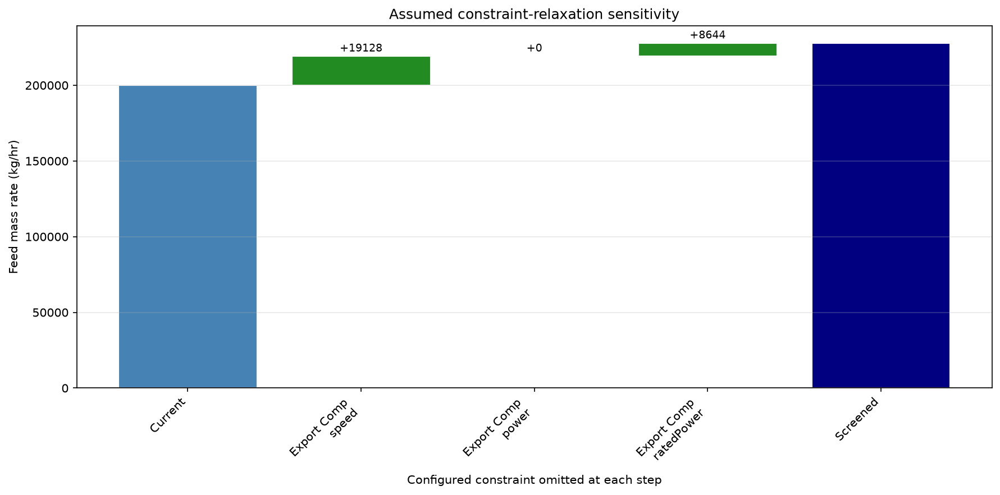
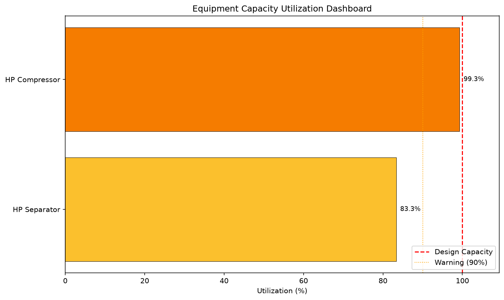
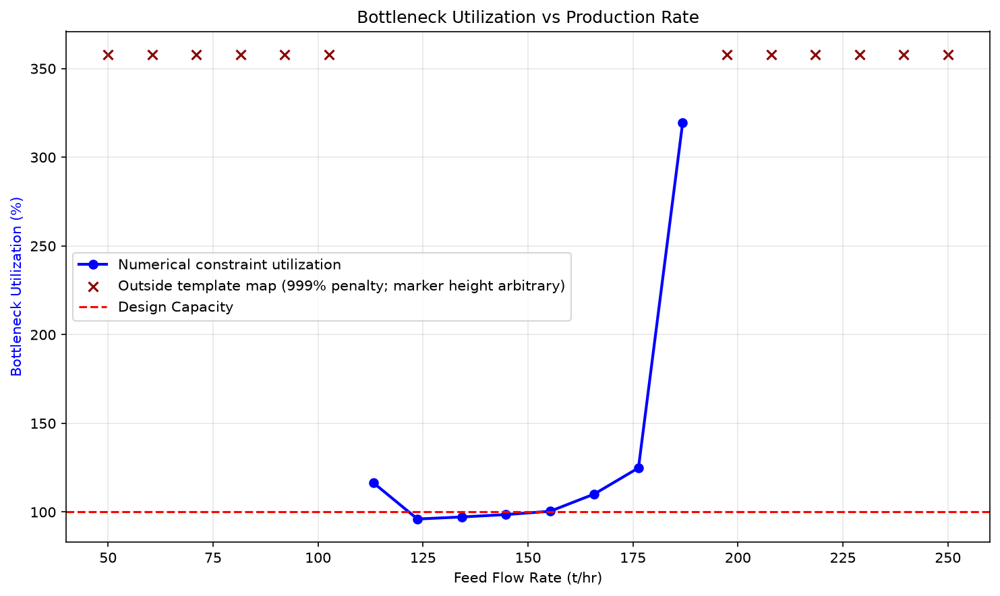
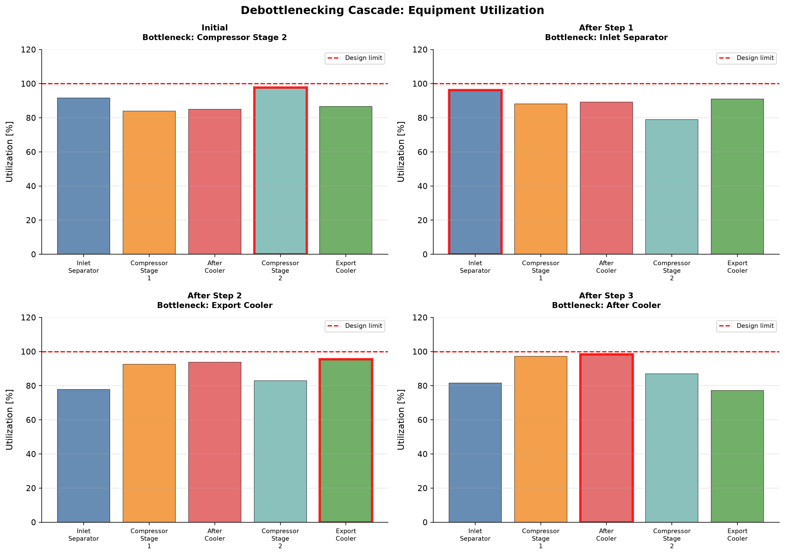

# Debottlenecking and Capacity Management

<!-- Chapter metadata -->
<!-- Notebooks: ch21_debottlenecking_workflow.ipynb, ch21_capacity_dashboard.ipynb, ch21_whatif_analysis.ipynb -->
<!-- Estimated pages: 35 -->

## Learning Objectives

After reading this chapter, the reader will be able to:

1. Explain the concept of debottlenecking and its role in extending field life and maximizing production
2. Describe the NeqSim Capacity Constraint Framework including the `CapacityConstrainedEquipment` interface, `CapacityConstraint` class, and `EquipmentCapacityStrategy` plugin architecture
3. Use `ProcessSystem.findBottleneck()` and related methods to systematically identify the limiting equipment in a production facility
4. Apply the `autoSize()` method on separators, compressors, valves, pipelines, and pumps to automatically generate capacity constraints from design calculations
5. Perform what-if debottlenecking studies by selectively disabling constraints and re-optimizing
6. Build utilization dashboards using `getCapacityUtilizationSummary()` with color-coded visualization
7. Implement a complete Python debottlenecking workflow in NeqSim with sensitivity analysis and matplotlib visualization

---

## 21.1 Introduction

A facility can be limited by one or several active constraints, or by upstream supply, commercial demand or utility availability. The most loaded equipment is not necessarily a unique throughput bottleneck. As reservoir conditions evolve — declining reservoir pressure, rising water cut, changing gas-oil ratio, increasing sand production — the identity of the bottleneck shifts. A compressor that had ample margin at plateau production may become the limiting factor when suction pressure drops. A separator designed for low water cut may be overwhelmed when water breakthrough occurs. A pipeline sized for dry gas may hit erosional velocity limits as condensate drops out.

**Debottlenecking** is the systematic process of:

1. **Identifying** the current bottleneck
2. **Quantifying** the production gain from removing it
3. **Evaluating** the cost and feasibility of the modification
4. **Implementing** the change and verifying the result

The production gain from removing a bottleneck can be dramatic. The gain and investment depend on the field, the binding constraint and the modification scope; establish them from the actual study rather than applying a generic percentage. The key to successful debottlenecking is *systematic identification* — not guessing which equipment is limiting, but rigorously computing the utilization of every item and identifying the true constraint.

This chapter presents a comprehensive debottlenecking methodology built on NeqSim's Capacity Constraint Framework. The framework provides:

- **Standardized capacity evaluation** across all equipment types
- **Automated bottleneck detection** at the process system level
- **What-if analysis** through selective constraint manipulation
- **Utilization dashboards** for ongoing capacity monitoring

### 21.1.1 The Debottlenecking Cycle

Debottlenecking is not a one-time activity but a continuous cycle that repeats throughout the field life:

$$
\text{Model} \rightarrow \text{Identify Bottleneck} \rightarrow \text{Evaluate Options} \rightarrow \text{Implement} \rightarrow \text{Verify} \rightarrow \text{Repeat}
$$

Each cycle removes one bottleneck, but removing it typically reveals the *next* bottleneck — the equipment that was previously the second-most constrained. The cycle continues until either (a) the production target is met, (b) no further economic debottlenecking is possible, or (c) a fundamental constraint (e.g., reservoir deliverability, export pipeline capacity) is reached.

### 21.1.2 Hard vs Soft Constraints

Not all constraints are equal. A critical distinction in debottlenecking is between:

| Constraint Type | Description | Consequence of Exceeding | Example |
|----------------|-------------|-------------------------|---------|
| **Hard** | Declared absolute model limit | A configured limit is exceeded; physical consequence requires its technical basis | Compressor surge, vessel MAWP |
| **Soft** | Preferred model operating limit | Review predicted performance and the configured penalty policy | Compressor recycle, separator carry-over |
| **Design** | Reference rating for capacity reporting | Reporting or optimizer impact depends on the consuming workflow | Design flow rate, design temperature |

Hard constraints define declared absolute limits. Soft constraints define a preferred operating envelope, and design constraints provide a reporting reference. A hard constraint can sometimes be relieved by changing upstream conditions or reallocating load; otherwise an equipment modification may be needed. Classify each limit from its actual technical basis and keep the protective-system limits separate from economic preferences.

---

## 21.2 Capacity Constraint Framework in NeqSim

NeqSim provides a capacity constraint framework in the `neqsim.process.equipment.capacity` package. Equipment derived from the process base class can store constraints, while equipment-specific methods and registered strategies determine which physical limits are actually evaluated.

### Java Example Setup

The Java operation fragments in this chapter use the following shared fixture. Copy the imports and class once, then replace the body of `runExample()` with one fragment and run the class. Each example starts with a fresh synthetic separator–compressor process. Auto-sizing establishes an assumed screening capacity; replace those capacities with installed ratings for a plant study. API signature summaries are printed as plain text and are not standalone programs.

```java
import java.util.*;
import org.apache.logging.log4j.LogManager;
import org.apache.logging.log4j.Logger;
import neqsim.thermo.system.*;
import neqsim.process.processmodel.*;
import neqsim.process.equipment.*;
import neqsim.process.equipment.stream.*;
import neqsim.process.equipment.separator.*;
import neqsim.process.equipment.compressor.*;
import neqsim.process.equipment.pipeline.*;
import neqsim.process.equipment.pump.*;
import neqsim.process.equipment.valve.*;
import neqsim.process.equipment.capacity.*;
import neqsim.process.equipment.capacity.CapacityConstraint.ConstraintType;
import neqsim.process.optimization.valuechain.*;

public class CapacityExample {
    private static final Logger logger = LogManager.getLogger(CapacityExample.class);
    private static SystemInterface fluid, reservoirFluid;
    private static Stream feed;
    private static StreamInterface gasStream, oilStream, wellStream;
    private static Separator separator, hpSep;
    private static Compressor compressor, comp;
    private static ProcessSystem process;
    private static Separator equipment;
    private static BottleneckResult bottleneck;
    private static CapacityConstraint speedConstraint;

    private static void setup() {
        fluid = new SystemSrkEos(303.15, 70.0);
        fluid.addComponent("methane", 0.70);
        fluid.addComponent("ethane", 0.10);
        fluid.addComponent("n-decane", 0.20);
        fluid.setMixingRule("classic");
        reservoirFluid = fluid.clone();
        feed = new Stream("Feed", fluid);
        feed.setFlowRate(10000.0, "kg/hr");
        separator = new Separator("Fixture Separator", feed);
        compressor = new Compressor("Fixture Compressor", separator.getGasOutStream());
        compressor.setOutletPressure(150.0, "bara");
        compressor.setIsentropicEfficiency(0.75);
        process = new ProcessSystem();
        process.add(feed);
        process.add(separator);
        process.add(compressor);
        process.run();
        separator.autoSize(1.20);
        compressor.autoSize(1.15);
        separator.enableAllConstraints();
        compressor.enableAllConstraints();
        process.run();  // Solve the chart model activated by autoSize
        gasStream = separator.getGasOutStream();
        oilStream = separator.getLiquidOutStream();
        wellStream = feed;
        hpSep = separator;
        comp = compressor;
        equipment = separator;
        bottleneck = process.findBottleneck();
        speedConstraint = new CapacityConstraint("speed", "RPM", ConstraintType.HARD);
    }

    public static void main(String[] args) {
        setup();
        runExample();
    }

    private static void runExample() {
        // Insert one Java operation fragment from this chapter here.
        logger.info("Fixture bottleneck: {}", process.findBottleneck());
    }
}
```

### 21.2.1 Architecture Overview

The framework consists of four key components:

1. **`CapacityConstrainedEquipment`** — An interface that any equipment can implement to participate in capacity analysis
2. **`CapacityConstraint`** — A data class representing a single constraint with design value, maximum value, current value, and utilization
3. **`EquipmentCapacityStrategy`** — A plugin interface for equipment-specific capacity evaluation logic
4. **`EquipmentCapacityStrategyRegistry`** — A registry of strategy plugins, pre-loaded with 18 built-in strategies

```text
┌──────────────────────────────┐
│  ProcessSystem               │
│  ├─ findBottleneck()         │
│  ├─ getCapacityUtilizationSummary() │
│  ├─ getConstrainedEquipment()│
│  └─ disableAllConstraints()  │
└──────────┬───────────────────┘
           │ queries
           ▼
┌──────────────────────────────┐
│  CapacityConstrainedEquipment│  ← Interface
│  ├─ getCapacityConstraints() │
│  ├─ getBottleneckConstraint()│
│  ├─ getMaxUtilization()      │
│  ├─ isCapacityExceeded()           │
│  └─ isHardLimitExceeded()    │
└──────────┬───────────────────┘
           │ contains
           ▼
┌──────────────────────────────┐
│  CapacityConstraint          │
│  ├─ name, unit               │
│  ├─ type (HARD/SOFT/DESIGN)  │
│  ├─ designValue, maxValue    │
│  ├─ valueSupplier            │
│  ├─ warningThreshold         │
│  └─ getUtilization()         │
└──────────────────────────────┘
```

### 21.2.2 The CapacityConstrainedEquipment Interface

The `CapacityConstrainedEquipment` interface defines the contract for any equipment that participates in capacity analysis:

```text
public interface CapacityConstrainedEquipment {
    // Query capacity analysis state
    boolean isCapacityAnalysisEnabled();
    void setCapacityAnalysisEnabled(boolean enabled);

    // Get all constraints
    Map<String, CapacityConstraint> getCapacityConstraints();

    // Bottleneck identification
    CapacityConstraint getBottleneckConstraint();

    // Utilization queries
    double getMaxUtilization();
    boolean isCapacityExceeded();
    boolean isHardLimitExceeded();

    // Constraint management
    int disableAllConstraints();
    int enableAllConstraints();
}
```

The key methods serve different purposes:

- **`getCapacityConstraints()`** returns all constraints as an unmodifiable map. Initialization is equipment-specific: separators and compressors populate native constraints during construction; several other classes initialize them when first queried.
- **`getBottleneckConstraint()`** returns the single constraint with the highest utilization. This is the constraint most likely to limit throughput.
- **`getMaxUtilization()`** returns the utilization of the bottleneck constraint as a fraction (1.0 = 100% of design capacity).
- **`isCapacityExceeded()`** returns `true` if any constraint exceeds 100% utilization.
- **`isHardLimitExceeded()`** returns `true` when a declared HARD constraint violates its maximum or minimum. This reports the modeled limit; it does not replace a protective system or an independent safety assessment.

### 21.2.3 The CapacityConstraint Class

Each constraint is represented by a `CapacityConstraint` object with the following properties:

| Property | Type | Description |
|----------|------|-------------|
| `name` | `String` | Constraint identifier (e.g., "speed", "gasLoadFactor") |
| `unit` | `String` | Engineering unit (e.g., "RPM", "m/s", "%") |
| `type` | `ConstraintType` | HARD, SOFT, or DESIGN |
| `designValue` | `double` | The design basis value (100% utilization) |
| `maxValue` | `double` | The absolute maximum (for HARD constraints) |
| `valueSupplier` | `DoubleSupplier` | Lambda that returns the current value |
| `warningThreshold` | `double` | Fraction at which to warn (default 0.9 = 90%) |
| `enabled` | `boolean` | Whether this constraint is active |
| `shadowPrice` | `double` | Marginal economic value of relaxing the constraint (default 0) |

The utilization is calculated as:

$$
U = \frac{V_{\text{current}}}{V_{\text{design}}}
$$

where $V_{\text{current}}$ is the value returned by the `valueSupplier` and $V_{\text{design}}$ is the `designValue`. For minimum constraints, the ratio is the declared minimum divided by the current value; the direction of violation is therefore reversed. For that minimum-good path the API requires a positive minimum and `designValue == Double.MAX_VALUE`; merely setting a minimum beside an ordinary design value does not reverse the ratio. Missing/non-finite measurements require a separate evidence check. A nonpositive or absent design reference returns zero utilization, while a nonpositive current value in a minimum-good constraint produces the 9.99 penalty. Finite ratios are capped at 9.99 (999%); this cap is a reporting diagnostic rather than a measured capacity ratio.

The type records the intended treatment of a declared limit. It does not simulate a protective trip or prove that exceeding a soft limit is acceptable. `isViolated()` compares utilization with 1.0 for every type; `isHardLimitExceeded()` tests the separate maximum/minimum only for `ConstraintType.HARD`.

A constraint is constructed using a fluent builder pattern:

```java
CapacityConstraint speedConstraint = new CapacityConstraint(
        "speed", "RPM", ConstraintType.HARD)
    .setDesignValue(10000.0)
    .setMaxValue(11000.0)
    .setWarningThreshold(0.9)
    .setValueSupplier(() -> compressor.getSpeed());
```

Each constraint can also carry a **shadow price** — the marginal economic value of relaxing the limit by one unit:

```java
double shadowPriceNokPerRpm = 250.0; // assumed marginal value for this example
speedConstraint.setShadowPrice(shadowPriceNokPerRpm);  // fluent, returns the constraint
double price = speedConstraint.getShadowPrice();         // 0.0 by default
```

The shadow-price field stores a supplied scalar without a unit schema or derivative calculation. The example assumes NOK per RPM. `DebottleneckingAdvisor.applyShadowPrices()` instead copies each candidate's assumed annual incremental value into that field; it neither divides by a capacity increment nor verifies that the attached constraint is binding. Preserve the economic basis separately before interpreting this value.

### 21.2.4 The ConstraintType Enum

The `ConstraintType` enum classifies constraints by their severity:

```text
public enum ConstraintType {
    HARD,    // Declared absolute limit
    SOFT,    // Preferred operating limit
    DESIGN   // Reference rating
}
```

`ConstraintSeverity` is separate metadata (`CRITICAL`, `HARD`, `SOFT`, `ADVISORY`), with helper methods for critical violations and penalty calculations. Do not infer universal optimizer behavior from its name: inspect the selected optimizer, its utilization limits and penalty configuration. Setting severity does not change the constructor's `ConstraintType`; for example the optional compressor discharge-temperature constraint is constructed as SOFT even though its severity is set to HARD.

### 21.2.5 Universal Constraint Storage in ProcessEquipmentBaseClass

A powerful design decision in NeqSim is that **all** equipment types inherit constraint storage from `ProcessEquipmentBaseClass`. Equipment subclasses can hold and report capacity constraints through this common interface; a populated storage object does not establish that every physically relevant limit has been implemented.

The base class provides:

```text
// Selected public method signatures (bodies omitted).
public void addCapacityConstraint(CapacityConstraint constraint);
public Map<String, CapacityConstraint> getCapacityConstraints();
public CapacityConstraint getBottleneckConstraint();
public double getMaxUtilization();
public boolean isCapacityExceeded();
public boolean isHardLimitExceeded();
public int disableAllConstraints();
```

Equipment subclasses override `initializeCapacityConstraints()` to populate equipment-specific constraints. For example, `ThrottlingValve` creates constraints for Cv utilization, volume flow, valve opening percentage, and acoustic-induced vibration (AIV).

### 21.2.6 Equipment Capacity Strategy Plugins

The 18 built-in `EquipmentCapacityStrategy` plugins provide specialized capacity evaluation logic for different equipment types:

| # | Registered strategy | Equipment family |
|---|---|---|
| 1 | `CompressorCapacityStrategy` | Compressor |
| 2 | `SeparatorCapacityStrategy` | Separator |
| 3 | `PipeCapacityStrategy` | Pipeline |
| 4 | `ValveCapacityStrategy` | Valve |
| 5 | `HeatExchangerCapacityStrategy` | Heat exchanger |
| 6 | `PumpCapacityStrategy` | Pump |
| 7 | `ExpanderCapacityStrategy` | Expander |
| 8 | `EjectorCapacityStrategy` | Ejector |
| 9 | `MixerCapacityStrategy` | Mixer |
| 10 | `SplitterCapacityStrategy` | Splitter |
| 11 | `TankCapacityStrategy` | Tank/vessel |
| 12 | `DistillationColumnCapacityStrategy` | Column |
| 13 | `ReactorCapacityStrategy` | Reactor |
| 14 | `PowerGenerationCapacityStrategy` | Gas/steam turbine |
| 15 | `SubseaEquipmentCapacityStrategy` | Subsea tree/manifold |
| 16 | `FilterAdsorberCapacityStrategy` | Filter/adsorber |
| 17 | `ElectrolyzerCapacityStrategy` | Electrolyzer |
| 18 | `WellFlowCapacityStrategy` | Well |

The registry identifies handlers, not a guaranteed list of physical constraints. A strategy can delegate to the equipment's native constraint map or use a limited fallback metric. Query that map, its enabled flags, measurement availability and units at the solved operating point; the native cases below show the actual keys.

All 18 strategies are automatically registered in the `EquipmentCapacityStrategyRegistry` singleton. Custom strategies can be added:

```java
EquipmentCapacityStrategyRegistry registry =
    EquipmentCapacityStrategyRegistry.getInstance();
registry.register(new SeparatorCapacityStrategy() {
    @Override
    public int getPriority() { return 10; }
});
```

### 21.2.7 Constraint Enablement

The equipment-level analysis flag defaults to enabled, while individual constraints have equipment-specific defaults. Separators initially disable their checks; compressors enable power checks and activate speed/surge checks only when a chart is available. Auto-sizing changes the enabled set and may change the operating model. Inspect these flags before analysis:

```java
// Option 1: Enable with Equinor-standard constraint sets
equipment.useEquinorConstraints();

// Option 2: Enable with API-standard constraint sets
equipment.useAPIConstraints();

// Option 3: Enable all constraints
equipment.enableAllConstraints();

// Option 4: Enable capacity analysis (equipment-level)
equipment.setCapacityAnalysisEnabled(true);
```

On `Separator`, `useEquinorConstraints()` and `useAPIConstraints()` enable different named subsets of the existing constraints. They do not read the applicable project requirements or certify the vessel. Inspect each enabled constraint, assign its approved limit and units, and verify that its value supplier represents the current operating point.

---

## 21.3 Systematic Bottleneck Identification

With the capacity constraint framework in place, identifying the bottleneck becomes a straightforward computation. NeqSim provides several methods on `ProcessSystem` for system-level capacity analysis.

### 21.3.1 Finding the Bottleneck

The primary method for bottleneck identification is `ProcessSystem.findBottleneck()`, which returns a `BottleneckResult` containing the limiting equipment, constraint, and utilization:

```java
// Use the populated process from the shared fixture.
process.run();

// Find the bottleneck
BottleneckResult result = process.findBottleneck();

if (result.hasBottleneck()) {
    logger.info("Bottleneck: " + result.getEquipmentName());
    logger.info("Constraint: " + result.getConstraintName());
    logger.info("Utilization: " +
        String.format("%.1f%%", result.getUtilization() * 100));
    logger.info("Type: " + result.getConstraint().getType());
} else {
    logger.info("No bottleneck found (no constraints defined)");
}
```

The `findBottleneck()` method iterates over all equipment implementing `CapacityConstrainedEquipment`, queries their bottleneck constraint, and returns the one with the highest utilization.

For simpler use cases, the legacy `getBottleneck()` method returns just the equipment:

```java
ProcessEquipmentInterface bottleneck = process.getBottleneck();
double utilization = process.getBottleneckUtilization();
```

### 21.3.2 The BottleneckResult Class

The `BottleneckResult` class provides detailed information about the identified bottleneck:

```text
public class BottleneckResult {
    ProcessEquipmentInterface getEquipment();    // The bottleneck equipment
    String getEquipmentName();                    // Equipment name
    CapacityConstraint getConstraint();           // The limiting constraint
    String getConstraintName();                   // Constraint name
    double getUtilization();                      // Utilization as fraction
    boolean hasBottleneck();                      // Whether a bottleneck was found
    boolean isExceeded();                       // Utilization > 1.0
    String toString();                          // Human-readable summary
}
```

### 21.3.3 Capacity Utilization Summary

For a complete overview of all equipment utilization, use `getCapacityUtilizationSummary()`:

```java
Map<String, Double> utilization = process.getCapacityUtilizationSummary();

// Print sorted by utilization (highest first)
utilization.entrySet().stream()
    .sorted(Map.Entry.<String, Double>comparingByValue().reversed())
    .forEach(entry -> logger.info(String.format("%-30s %6.1f%%\n",
        entry.getKey(), entry.getValue())));
```

This returns a map from equipment name to maximum utilization **percentage**, with 100.0 representing 100%. The summary skips equipment excluded from analysis and omits nonpositive or NaN maximum utilization; an omitted entry is not proof of spare capacity. `BottleneckResult.getUtilization()` and equipment `getMaxUtilization()` return fractions instead.

Example output:

```text
HP Compressor                   92.3%
HP Separator                    87.5%
Export Pipeline                 76.2%
LP Separator                    65.1%
Inlet Cooler                    54.8%
```

### 21.3.4 Early Warning — Equipment Near Capacity

The `getEquipmentNearCapacityLimit()` method identifies equipment approaching their warning threshold (default 90%):

```java
List<String> nearLimit = process.getEquipmentNearCapacityLimit();
if (!nearLimit.isEmpty()) {
    logger.info("WARNING: Equipment near capacity:");
    for (String name : nearLimit) {
        logger.info("  - " + name);
    }
}
```

For custom thresholds, pass the desired fraction:

```java
List<String> above80 = new ArrayList<String>();
for (Map.Entry<String, Double> item : process.getCapacityUtilizationSummary().entrySet()) {
    if (item.getValue() > 80.0) { above80.add(item.getKey()); }
}
logger.info("Equipment above 80 percent: {}", above80);
```

### 21.3.5 Overload Detection

Two boolean methods provide quick checks for constraint violations:

```java
// Any equipment above 100% of design capacity?
boolean overloaded = process.isAnyEquipmentOverloaded();

// Any declared HARD maximum/minimum exceeded?
boolean hardViolation = process.isAnyHardLimitExceeded();

if (hardViolation) {
    logger.info("CRITICAL: Hard limit exceeded - check equipment!");
}
```

The distinction matters: `isAnyEquipmentOverloaded()` checks if any constraint (hard, soft, or design) exceeds 100%, while `isAnyHardLimitExceeded()` specifically checks HARD-type constraints against their maximum value. A soft constraint at 105% is an overload but not a hard limit violation.

### 21.3.6 Querying Constrained Equipment

To get a list of all equipment that has capacity constraints:

```java
List<CapacityConstrainedEquipment> constrained =
    process.getConstrainedEquipment();
logger.info("Number of constrained equipment: " + constrained.size());
```

### 21.3.7 Active Constraint Identification Workflow

A typical debottlenecking workflow combines these methods:

```java
// Step 1: Run the process simulation
process.run();

// Step 2: Check for hard limit violations (safety first)
if (process.isAnyHardLimitExceeded()) {
    logger.info("ALERT: Hard constraints violated!");
    // Investigate immediately
}

// Step 3: Identify the bottleneck
BottleneckResult bottleneck = process.findBottleneck();
logger.info("Bottleneck: " + bottleneck.toString());

// Step 4: Review overall utilization
Map<String, Double> util = process.getCapacityUtilizationSummary();

// Step 5: Check early warning list
List<String> nearLimit = process.getEquipmentNearCapacityLimit();
logger.info("Equipment above its configured warning threshold: " + nearLimit);
```

### 21.3.8 Tracking Bottleneck Migration with BottleneckTracker

A single `findBottleneck()` call captures the binding constraint at one operating point. Over a production sweep, a field-life profile, or a real-time monitoring loop, the bottleneck **migrates** from one equipment item to another (Section 21.3, "Bottleneck Shifting"). The `BottleneckTracker` (package `neqsim.process.equipment.capacity`) records a time series of `BottleneckResult` snapshots and analyses how the limiting constraint moves:

```java
BottleneckTracker tracker = new BottleneckTracker();

for (int step = 0; step <= 16; step++) {
    double rate = 0.5 + 0.05 * step;
    feed.setFlowRate(10000.0 * rate, "kg/hr");
    process.run();
    tracker.record(rate, "rate=" + rate, process.findBottleneck());
}

logger.info(tracker.getTimelineSummary());
logger.info("Distinct bottlenecks: "
    + tracker.getDistinctBottleneckEquipment());
logger.info("Migration events: " + tracker.getMigrationCount());
logger.info("Peak utilization: "
    + tracker.getPeakUtilizationPercent() + "%");
```

Each call to `record(time[, label], BottleneckResult)` returns a `Snapshot` exposing `getTime()`, `getLabel()`, `getEquipmentName()`, `getConstraintName()`, `getUtilizationPercent()`, and `isExceeded()`. The tracker derives:

- `getMigrationEvents()` / `getMigrationCount()` — the points at which the equipment/constraint identity changed
- `getDistinctBottleneckEquipment()` — the set of all equipment that limited the facility at some point
- `getPeakSnapshot()` / `getPeakUtilizationPercent()` — the most stressed point in the series
- `getTimelineSummary()` — a human-readable trace, and `toJson()` for export

This converts a sequence of point-in-time capacity checks into a debottlenecking narrative: it shows *which* equipment to address first and *at what production level* the next constraint takes over, which is exactly the information needed to sequence the staged investments analysed in Section 21.9.

---

## 21.4 autoSize for Capacity Assessment

The `autoSize(double designMargin)` method available on most equipment types performs a design calculation based on the current operating conditions, then automatically creates capacity constraints from the calculated design values. This is the most convenient way to populate constraints for debottlenecking analysis.

### 21.4.1 The autoSize Concept

The `autoSize` method calculates what the equipment *should* be sized for given its current inlet conditions, then creates constraints based on those calculated values plus a design margin:

$$
V_{\text{design}} = V_{\text{calculated}} \times (1 + m)
$$

Here $V$ denotes a flow or rating to which a linear margin is applied, and $m$ is the fractional margin. The mapping to vessel dimensions, pipeline diameter, pump power or a generated compressor chart is equipment-specific; this equation is not a universal geometry-sizing law. The API argument is the multiplicative factor $1+m$: pass `autoSize(1.20)` for a 20% margin, not `autoSize(0.20)`. The latter can create an undersized screening design.

After `autoSize`, inspect the populated and enabled capacity constraints before querying the bottleneck. Auto-sizing covers the implemented design rules; it does not supply every missing vendor rating or validate an installed plant.

### 21.4.2 Separator autoSize

For separators, `autoSize` computes the gas load factor constraint from the Souders-Brown equation:

```java
Separator hpSep = new Separator("HP Separator", feed);
process.add(hpSep);
process.run();

// Auto-size with 20% design margin
hpSep.autoSize(1.20);

// Now constraints are populated
Map<String, CapacityConstraint> constraints = hpSep.getCapacityConstraints();
CapacityConstraint gasLoad = constraints.get("gasLoadFactor");
logger.info("Gas load K-factor: " + gasLoad.getCurrentValue() + " m/s");
logger.info("Design K-factor:   " + gasLoad.getDesignValue() + " m/s");
logger.info("Utilization:       " +
    String.format("%.1f%%", gasLoad.getUtilization() * 100));
```

`Separator` and `ThreePhaseSeparator` share the following native keys. `autoSize` enables `gasLoadFactor` and preserves checks previously enabled; the other keys are present but remain disabled unless selected.

| Constraint | Unit | Type | Basis |
|---|---|---|---|
| `gasLoadFactor` | m/s | SOFT | Gas velocity multiplied by the gas/liquid density correction |
| `kValue` | m/s | SOFT | K-value at the assumed high liquid level |
| `dropletCutSize` | µm | SOFT | Calculated gas-side droplet cut-size screen |
| `inletMomentum` | Pa | SOFT | Inlet mixture momentum flux |
| `oilRetentionTime` | min | SOFT | Minimum oil inventory/outlet volume-rate ratio |
| `waterRetentionTime` | min | SOFT | Minimum water inventory/outlet volume-rate ratio |

There is no native `liquidRetentionTime` or `liquidLevel` constraint in this implementation. The minimum-retention utilization is minimum/current; the default warning threshold of 1.2 therefore warns only after the minimum has already been violated. Change that warning policy deliberately if advance warning is required. An absent liquid phase can return the 999-minute sentinel; phase availability must accompany the number. A two-outlet `Separator` is suitable for this dry gas/oil fixture; use `ThreePhaseSeparator` for separately conserved oil and water outlets.

### 21.4.3 Compressor autoSize

For compressors, `autoSize` creates constraints from the compressor operating point relative to its characteristic curves:

```java
Compressor comp = new Compressor("HP Compressor", gasStream);
comp.setOutletPressure(150.0, "bara");
process.add(comp);
process.run();

comp.autoSize(1.15);  // Multiplicative factor: 15% design margin
process.run();  // Recompute after activating the generated chart

Map<String, CapacityConstraint> constraints = comp.getCapacityConstraints();
```

Compressor `autoSize` generates a scaled template chart, enables chart use and speed solving, and assigns a power rating from current kW multiplied by the requested factor. Rerun after sizing because the generated chart changes the operating model. These are synthetic screening curves, not a vendor performance map.

| Constraint | Unit | Type | Availability and basis |
|---|---|---|---|
| `speed` | RPM | HARD | Active chart maximum or mechanical speed limit |
| `minSpeed` | RPM | HARD | Minimum/current speed; present if a positive minimum exists |
| `power` | % | HARD | Current shaft kW relative to available driver/design kW; design 100%, hard maximum 110% |
| `ratedPower` | % | DESIGN | Current kW relative to driver rating or mechanical design rating |
| `surgeMargin` | % | HARD | Minimum/current flow margin; active chart required |
| `stonewallMargin` | % | SOFT | Minimum/current distance to stonewall; active chart required |
| `dischargeTemperature` | C | SOFT type, HARD severity | Added only after an explicit maximum-temperature setting |

There is no native `polytropicHead` constraint. Chartless models disable speed and surge/stonewall checks because those quantities lack a physical chart basis. The optional temperature utilization divides Celsius values, so it is a library reporting convention, not a thermodynamic ratio; use the actual temperature difference to the declared limit for engineering decisions. A missing power rating can produce zero reported utilization and must be treated as unavailable rating evidence.

The surge margin constraint is critical — it defines the minimum distance from the surge line:

$$
\text{Surge Margin} = \frac{Q_{\text{actual}} - Q_{\text{surge}}}{Q_{\text{surge}}} \times 100\%
$$

The library uses a 10% minimum surge margin in this flow-based definition. Treat it as a configured screening input. The acceptable operating region and anti-surge control line require the vendor map, gas basis and control-system design; there is no universal margin established by this example.

### 21.4.4 Valve autoSize

For throttling valves, `autoSize` creates constraints from the Cv sizing calculation:

```java
ThrottlingValve valve = new ThrottlingValve("Choke Valve", wellStream);
valve.setOutletPressure(60.0, "bara");
process.add(valve);
process.run();

valve.autoSize(1.20);

Map<String, CapacityConstraint> constraints = valve.getCapacityConstraints();
CapacityConstraint cvUtil = constraints.get("cvUtilization");
CapacityConstraint opening = constraints.get("valveOpening");
```

Valve constraints include:

| Constraint | Unit | Type | Basis |
|-----------|------|------|-------|
| `cvUtilization` | Cv convention | HARD | Stored valve Cv divided by mechanical-design maximum Cv |
| `valveOpening` | % | SOFT | Percentage opening |
| `volumeFlow` | m³/hr | DESIGN | Maximum volume flow capacity |
| `AIV` | kW | SOFT | Acoustic-induced vibration power |

The native opening utilization tests opening divided by its configured maximum; it does not enforce a lower-opening bound. The following is a separately assumed teaching control range:

$$
\text{Assumed control range:} \quad 10\% \leq \text{Opening} \leq 90\%
$$

The Cv constraint compares stored values; it does not recompute the required Cv for each trial state. Confirm the sizing mode and opening characteristic separately. Auto-sizing recreates these valve constraints disabled. The AIV result is a screening metric, not a fatigue or acoustic qualification.

### 21.4.5 Pipeline autoSize

For pipelines, `autoSize` selects a standard diameter from velocity criteria and reruns the pressure calculation. The example uses a short teaching line. For a long export route, a velocity-based diameter may fail the arrival-pressure requirement; establish a feasible hydraulic diameter separately before accepting it.

```java
PipeBeggsAndBrills pipeline = new PipeBeggsAndBrills("Export Pipeline", gasStream);
pipeline.setPipeWallRoughness(5e-5);
pipeline.setLength(1000.0);  // 1 km teaching line, length is in metres
pipeline.setDiameter(0.3048);  // 12-inch
process.add(pipeline);
process.run();

pipeline.initMechanicalDesign();  // Required before assigning capacity ratings
pipeline.autoSize(1.15);

Map<String, CapacityConstraint> constraints = pipeline.getCapacityConstraints();
```

Pipeline constraints include:

| Constraint | Unit | Type | Basis |
|-----------|------|------|-------|
| `velocity` | m/s | SOFT | Maximum gas velocity |
| `pressureDrop` | bar | DESIGN | Total pressure-drop reference, when configured |
| `volumeFlow` | m3/hr | DESIGN | Outlet volume-flow reference, when configured |
| `LOF` | - | SOFT | Flow-induced vibration screening index |
| `FRMS` | - (API label) | SOFT | Vibration-intensity screening result |
| `AIV` | kW | SOFT | Acoustic-power screening result |

The velocity calculation can use an erosional-velocity correlation; inspect the selected velocity method instead of assuming a separate erosional-ratio constraint exists:

$$
v_e = \frac{C}{\sqrt{\rho_m}}
$$

where $C$ is an empirical, unit-dependent coefficient and $\rho_m$ is the mixture density. Record the coefficient and its unit convention explicitly; an imperial coefficient must not be inserted unchanged into an SI calculation. The constraint ratio is $v_{\text{actual}} / v_e$. This screening ratio does not calculate erosion from sand or corrosion.

### 21.4.6 Pump autoSize

For pumps, `autoSize` creates constraints from hydraulic and mechanical limits:

```java
Pump pump = new Pump("Export Pump", oilStream);
pump.setOutletPressure(80.0, "bara");
process.add(pump);
process.run();

pump.autoSize(1.20);
```

The native pump map always contains disabled `power` (kW, HARD) and `flowRate` (m³/hr, DESIGN) constraints. `autoSize(1.20)` sets design volume flow to 1.20 times actual inlet flow; its power rule uses the current shaft work times 1.20². That latter rule is an implementation sizing heuristic, not a general pump affinity law or driver rating. No native `differentialHead` constraint is created.

When `setCheckNPSH(true)` is configured, a disabled SOFT `npshMargin` key is also added. Its API unit says metres, but its supplier returns a dimensionless ratio of NPSH available to a multiple of NPSH required; the generic utilization direction is unsuitable as a standalone cavitation acceptance check. Do not enable it and infer cavitation safety from the resulting utilization.

For a physical check, obtain the suction total-head and vapor-pressure basis and the vendor's NPSH requirement, then evaluate explicitly:

$$
\mathrm{NPSH}_A-\mathrm{NPSH}_R\geq\Delta H_{\mathrm{required}},
$$

with a project-defined positive head margin in metres. A negative difference fails the specified NPSH requirement; a positive difference alone does not demonstrate absence of cavitation or damage. The published pump example is checked for material and shaft-energy closure, liquid inlet, positive head and finite design flow/power; it does not supply a vendor NPSH curve.

### 21.4.7 Using autoSize Results for Debottlenecking

The typical workflow for debottlenecking assessment using `autoSize`:

```java
// Build process
ProcessSystem process = new ProcessSystem();
Stream feed = new Stream("Feed", fluid);
Separator hpSep = new Separator("HP Sep", feed);
Compressor comp = new Compressor("HP Comp", hpSep.getGasOutStream());
comp.setOutletPressure(150.0, "bara");
process.add(feed);
process.add(hpSep);
process.add(comp);
process.run();

// Auto-size all equipment
hpSep.autoSize(1.20);
comp.autoSize(1.15);
process.run();  // Recompute after activating the generated chart

// Find the bottleneck
BottleneckResult result = process.findBottleneck();
logger.info("Bottleneck: " + result.getEquipmentName());
logger.info("Constraint: " + result.getConstraintName());
logger.info("Utilization: " +
    String.format("%.1f%%", result.getUtilization() * 100));
```

---

## 21.5 What-If Analysis with Constraint Control

The most powerful aspect of the capacity constraint framework for debottlenecking is the ability to selectively disable constraints and re-optimize. This answers the question: *"If we remove this bottleneck, how much more can we produce?"*

### 21.5.1 Disabling Individual Constraints

To test the effect of removing a specific constraint:

```java
// Get the bottleneck constraint
BottleneckResult bottleneck = process.findBottleneck();
CapacityConstraint limitingConstraint = bottleneck.getConstraint();

// Disable it
limitingConstraint.setEnabled(false);

// Re-run and check the new bottleneck
process.run();
BottleneckResult newBottleneck = process.findBottleneck();

logger.info("Previous bottleneck: " + bottleneck.getEquipmentName()
    + " (" + bottleneck.getConstraintName() + ")");
logger.info("New bottleneck:      " + newBottleneck.getEquipmentName()
    + " (" + newBottleneck.getConstraintName() + ")");
```

### 21.5.2 Disabling All Constraints on Equipment

To diagnose the effect of omitting one equipment item's configured constraints:
This operation does not resize or replace that item.

```java
// Disable all constraints on the bottleneck equipment
CapacityConstrainedEquipment bottleneckEquip =
    (CapacityConstrainedEquipment) bottleneck.getEquipment();
int disabled = bottleneckEquip.disableAllConstraints();
logger.info("Disabled " + disabled + " constraints on "
    + bottleneck.getEquipmentName());
```

### 21.5.3 Process-Wide Constraint Disable

The following diagnostic disables capacity checks and reruns the same imposed feed. Disabling checks does not change the equipment geometry, solve reservoir deliverability, or increase production. A separate bounded optimization is needed to quantify any rate change, and the omitted limits must be restored for the accepted case.

```java
// Disable ALL constraints on ALL equipment
int totalDisabled = process.disableAllConstraints();
logger.info("Disabled " + totalDisabled + " constraints system-wide");

// Re-run the same fixed feed with capacity reporting disabled
process.run();
double imposedFeedRate =
    feed.getFlowRate("kg/hr");
```

### 21.5.4 Full Exclusion from Capacity Analysis

For equipment that should not participate in capacity analysis at all (e.g., utility equipment, test separators):

```java
// Exclude equipment from all capacity analysis
equipment.setCapacityAnalysisEnabled(false);
```

When `capacityAnalysisEnabled` is `false`, the equipment is excluded from `findBottleneck()`, `getCapacityUtilizationSummary()`, `getEquipmentNearCapacityLimit()`, and all other system-level capacity queries.

### 21.5.5 Comparison of Disable Methods

| Method | Scope | Effect | Use Case |
|--------|-------|--------|----------|
| `constraint.setEnabled(false)` | Single constraint | Skips this constraint in utilization | Test removing one limit |
| `equipment.disableAllConstraints()` | All constraints on one equipment | Returns count of disabled | Diagnose omitted equipment limits |
| `process.disableAllConstraints()` | All constraints in system | Returns total count | Diagnose the effect of omitted checks |
| `equipment.setCapacityAnalysisEnabled(false)` | Equipment level | Excludes from all analysis | Ignore utility equipment |

### 21.5.6 Debottlenecking Waterfall Analysis

A particularly effective way to visualize debottlenecking potential is the **waterfall chart**, which shows the cumulative production gain as each bottleneck is removed in sequence:

```python
import jpype
jneqsim = jpype.JPackage("neqsim")
ProductionOptimizer = jneqsim.process.util.optimizer.ProductionOptimizer
import jpype
jneqsim = jpype.JPackage("neqsim")

def build_waterfall_process(template=None):
    fluid = jneqsim.thermo.system.SystemSrkCPAstatoil(273.15 + 70.0, 65.0)
    fluid.addComponent("methane", 0.70)
    fluid.addComponent("ethane", 0.08)
    fluid.addComponent("propane", 0.05)
    fluid.addComponent("n-butane", 0.03)
    fluid.addComponent("n-heptane", 0.08)
    fluid.addComponent("water", 0.06)
    fluid.setMixingRule(10)
    fluid.setMultiPhaseCheck(True)

    feed = jneqsim.process.equipment.stream.Stream("feed", fluid)
    feed.setFlowRate(200000.0, "kg/hr")

    sep = jneqsim.process.equipment.separator.ThreePhaseSeparator("HP Sep", feed)
    comp = jneqsim.process.equipment.compressor.Compressor("Export Comp",
        sep.getGasOutStream())
    comp.setOutletPressure(150.0)
    comp.setUsePolytropicCalc(True)
    comp.setPolytropicEfficiency(0.78)

    process = jneqsim.process.processmodel.ProcessSystem()
    process.add(feed)
    process.add(sep)
    process.add(comp)
    process.run()

    # Auto-size with 20% design margin
    sep.autoSize(1.2)
    comp.autoSize(1.2)

    if template is not None:
        for unit_name in ("HP Sep", "Export Comp"):
            previous = template.getUnit(unit_name).getCapacityConstraints()
            fresh = process.getUnit(unit_name).getCapacityConstraints()
            for key in previous.keySet():
                fresh.get(key).setEnabled(previous.get(key).isEnabled())
    return process, feed, sep, comp

process, feed, sep, comp = build_waterfall_process()

print(f"Separator utilization: {sep.getMaxUtilizationPercent():.1f}%")
print(f"Compressor utilization: {comp.getMaxUtilizationPercent():.1f}%")

from pathlib import Path
Path("figures").mkdir(parents=True, exist_ok=True)
import matplotlib.pyplot as plt
import numpy as np

# Run sequential debottleneck analysis
bottlenecks = []
current_rate = float(feed.getFlowRate("kg/hr"))
base_rate = current_rate

for step in range(8):
    result = process.findBottleneck()
    if not result.hasBottleneck():
        break

    # Record current bottleneck
    name = str(result.getEquipmentName())
    constraint = str(result.getConstraintName())

    # Stop before omitting the last active limit on either equipment item.
    # A fallback liquid-level metric is not a separator throughput rating.
    remaining = sum(c.isEnabled() for c in
                    process.getUnit(name).getCapacityConstraints().values())
    if remaining <= 1:
        print(f"Stopped: {name} would have no active capacity constraint")
        break
    result.getConstraint().setEnabled(False)
    config = (ProductionOptimizer.OptimizationConfig(50000.0, 300000.0).rateUnit("kg/hr").defaultUtilizationLimit(0.95)
              .utilizationMarginFraction(0.001)
              .searchMode(ProductionOptimizer.SearchMode.BINARY_FEASIBILITY))
    optimum = ProductionOptimizer().optimize(process, feed, config, None, None)
    assert optimum.isFeasible(), "Relaxed candidate failed declared constraints"
    new_rate = float(optimum.getOptimalRate())
    # Rebuild the physical model at the original sizing basis, retaining the
    # diagnostic constraint masks. This avoids the separator's 1e-6 input cache.
    process, feed, sep, comp = build_waterfall_process(process)
    feed.setFlowRate(new_rate, "kg/hr")
    process.run()
    assert abs(feed.getFlowRate("kg/hr") - new_rate) < 1e-7
    gain = new_rate - current_rate
    bottlenecks.append({
        'equipment': name,
        'constraint': constraint,
        'gain': gain,
        'cumulative': new_rate
    })
    current_rate = new_rate

# Create waterfall chart
fig, ax = plt.subplots(figsize=(12, 6))
labels = ['Current'] + [b['equipment'] + '\n' + b['constraint'] for b in bottlenecks] + ['Screened']
values = [base_rate] + [b['gain'] for b in bottlenecks]
cumulative = [base_rate]
for b in bottlenecks:
    cumulative.append(b['cumulative'])
cumulative.append(cumulative[-1])

# Color-code: base=blue, gains=green, total=darkblue
colors = ['steelblue'] + ['forestgreen'] * len(bottlenecks) + ['navy']

bottoms = [0] + cumulative[:-1]
ax.bar(range(len(labels)), [base_rate] + [b['gain'] for b in bottlenecks] + [current_rate],
       bottom=[0] + [cumulative[i] for i in range(len(bottlenecks))] + [0],
       color=colors, edgecolor='white')

ax.set_xlabel('Configured constraint omitted at each step')
ax.set_ylabel('Feed mass rate (kg/hr)')
ax.set_title('Assumed constraint-relaxation sensitivity')
ax.set_xticks(range(len(labels)))
ax.set_xticklabels(labels, rotation=45, ha='right')
ax.grid(axis='y', alpha=0.3)
for index, b in enumerate(bottlenecks, start=1):
    ax.text(index, b['cumulative'] + 1500, f"+{b['gain']:.0f}",
            ha='center', va='bottom', fontsize=9)
plt.tight_layout()
plt.savefig('figures/waterfall_debottleneck.png', dpi=150, bbox_inches='tight')
plt.show()

print(f"\nConditional screened gain: {current_rate - base_rate:.0f} kg/hr "
      f"({(current_rate/base_rate - 1)*100:.1f}% increase)")
```



**Discussion (Figure 21.1).**
**Observation.** The screened rate changes from 200,000 to 219,128 kg/hr when the speed limit is omitted. Omitting the duplicate power check alone adds zero; omitting ratedPower then reaches 227,772 kg/hr, a conditional 13.9% increase.

**Mechanism.** Different enabled checks bind as the candidate rate rises; the two driver-power constraints describe overlapping restrictions. Every selected state was rebuilt at the original sizing basis and compared with a 51-point rate grid.

**Engineering implication and recommendation.** The scan stops before removing the separator’s last active constraint. These rates rank assumed omissions; they are not installed-capacity or retrofit guarantees. Obtain actual ratings, implement a physical modification and restore all applicable limits before accepting a production increase.


This calculation ranks the effects of relaxing the configured screening constraints inside the declared search interval. It is a diagnostic sensitivity: disabling a constraint does not physically modify equipment or qualify a higher installed capacity. The nominal utilization ceiling is 0.95; the search reserves 0.1 percent of that ceiling for numerical replay differences. Fresh replay must still satisfy the nominal ceiling. With all separator constraints disabled, the optimizer's legacy fallback is liquid-level fraction, which does not establish gas or liquid separation capacity. The search upper bound may become the final limit. The calculation stops before disabling an equipment item's last enabled constraint: a fallback liquid-level metric or an absent compressor limit cannot establish its throughput capacity. The final bar is the screened rate reached before that stop, not an unconstrained plant maximum. Each candidate is replayed in a freshly constructed model with the original sizing basis; this prevents the separator's relative input-change cache (1e-6) from leaving small material imbalances near the optimizer's final rate. Compare each selected point with an independent sampled search; no universal percentage gain follows from the order of relaxed constraints.

### 21.5.7 Practical Debottlenecking Workflow

A structured debottlenecking study follows these steps:

```text
1. Build and run process model at current conditions
2. autoSize all equipment to create capacity constraints
3. Identify current bottleneck (findBottleneck)
4. Disable bottleneck constraint
5. Re-optimize process with ProductionOptimizer
6. Quantify production gain (ΔQ)
7. Re-enable constraint, identify next bottleneck
8. Repeat steps 4-7 for each potential debottleneck
9. Rank debottlenecking options by ΔQ/cost ratio
```

The production gain from removing a bottleneck is:

$$
\Delta Q = Q_{\text{debottlenecked}} - Q_{\text{current}}
$$

The debottlenecking value is:

$$
\text{Value} = \frac{\Delta Q \times \text{Price} \times \text{Time}}{\text{CAPEX}_{\text{modification}}}
$$

---

`getCapacityUtilizationSummary()` returns **percent** (100.0 = 100%); `BottleneckResult.getUtilization()` and equipment `getMaxUtilization()` return fractions (1.0 = 100%). Use thresholds of 80.0/90.0 in the summary map, and 0.80/0.90 in the fractional APIs. The legacy `getBottleneck()` path does not apply the equipment-level exclusion flag; use `findBottleneck()` when that flag matters.

## 21.6 Utilization Summary Dashboard

Effective debottlenecking requires clear visualization of equipment utilization across the entire facility. NeqSim's `getCapacityUtilizationSummary()` method provides the data foundation for building utilization dashboards.

### 21.6.1 Building Utilization Bar Charts

The utilization summary provides all the data needed for a horizontal bar chart showing equipment utilization:

```java
Map<String, Double> utilization = process.getCapacityUtilizationSummary();

// Color coding based on utilization level
for (Map.Entry<String, Double> entry : utilization.entrySet()) {
    double u = entry.getValue();
    String status;
    if (u > 100.0) {
        status = "OVERLOADED";
    } else if (u > 90.0) {
        status = "NEAR LIMIT";
    } else if (u > 75.0) {
        status = "MODERATE";
    } else {
        status = "OK";
    }
    logger.info(String.format("%-25s %6.1f%%  [%s]\n",
        entry.getKey(), u, status));
}
```

### 21.6.2 Color-Coded Status Visualization

The recommended color scheme for utilization visualization:

| Utilization Range | Color | Status | Action |
|------------------|-------|--------|--------|
| 0–75% | Green | OK | Normal operation |
| 75–90% | Yellow | Moderate | Monitor, plan for growth |
| 90–100% | Orange | Near limit | Active monitoring, consider debottlenecking |
| >100% | Red | Overloaded | Immediate action required |

### 21.6.3 Near-Limit Early Warning System

An early warning system can be implemented using `getEquipmentNearCapacityLimit()` with different thresholds:

```java
// Thresholds are explicit filters of the current utilization summary.
List<String> tier1 = new ArrayList<String>();
List<String> tier2 = new ArrayList<String>();
List<String> tier3 = new ArrayList<String>();
for (Map.Entry<String, Double> item : process.getCapacityUtilizationSummary().entrySet()) {
    if (item.getValue() > 95.0) { tier1.add(item.getKey()); }
    if (item.getValue() > 85.0) { tier2.add(item.getKey()); }
    if (item.getValue() > 75.0) { tier3.add(item.getKey()); }
}
logger.info("Critical above 95 percent: {}", tier1);
logger.info("Warning above 85 percent: {}", tier2);
logger.info("Watch above 75 percent: {}", tier3);
```

### 21.6.4 Equipment Prioritization for Investment

The utilization data enables objective prioritization of upgrade investments:

$$
\text{Priority Score}_i = U_i \times \frac{\Delta Q_i}{\text{CAPEX}_i}
$$

where $U_i$ is the current utilization, $\Delta Q_i$ is the potential production gain from debottlenecking, and $\text{CAPEX}_i$ is the estimated modification cost.

Equipment with the highest priority scores should be considered first for debottlenecking investment. This is a heuristic screening score with units of rate per currency. It does not replace NPV, engineering judgment, uncertainty analysis, installation feasibility or the interactions between modifications.

---

## 21.7 Python Debottlenecking Workflow

This section presents a complete Python workflow for debottlenecking analysis using NeqSim.

### 21.7.1 Building the Process Model

```python
import jpype
jneqsim = jpype.JPackage("neqsim")
import matplotlib.pyplot as plt
import numpy as np

# Create fluid
fluid = jneqsim.thermo.system.SystemSrkCPAstatoil(273.15 + 60.0, 80.0)
fluid.addComponent("methane", 0.72)
fluid.addComponent("ethane", 0.08)
fluid.addComponent("propane", 0.05)
fluid.addComponent("n-butane", 0.03)
fluid.addComponent("n-pentane", 0.02)
fluid.addComponent("water", 0.10)
fluid.setMixingRule(10)
fluid.setMultiPhaseCheck(True)

# Build process
Stream = jneqsim.process.equipment.stream.Stream
Separator = jneqsim.process.equipment.separator.ThreePhaseSeparator
Compressor = jneqsim.process.equipment.compressor.Compressor
ThrottlingValve = jneqsim.process.equipment.valve.ThrottlingValve
Heater = jneqsim.process.equipment.heatexchanger.Heater
ProcessSystem = jneqsim.process.processmodel.ProcessSystem

feed = Stream("Feed", fluid)
feed.setFlowRate(150000.0, "kg/hr")
feed.setTemperature(60.0, "C")
feed.setPressure(80.0, "bara")

hp_sep = Separator("HP Separator", feed)

compressor = Compressor("HP Compressor", hp_sep.getGasOutStream())
compressor.setOutletPressure(150.0, "bara")
compressor.setIsentropicEfficiency(0.78)

cooler = Heater("After-cooler", compressor.getOutletStream())
cooler.setOutTemperature(273.15 + 40.0)

choke = ThrottlingValve("Wellhead Choke", feed)
choke.setOutletPressure(80.0, "bara")

process = ProcessSystem()
process.add(feed)
process.add(hp_sep)
process.add(compressor)
process.add(cooler)
process.run()
```

### 21.7.2 Auto-Sizing and Bottleneck Identification

```python
# Auto-size all equipment with design margins
hp_sep.autoSize(1.20)       # Multiplicative factor: 20% margin
compressor.autoSize(1.15)   # Multiplicative factor: 15% margin
process.run()              # Solve the generated screening chart before reading it

# Find the bottleneck
result = process.findBottleneck()
if result.hasBottleneck():
    print(f"Bottleneck: {result.getEquipmentName()}")
    print(f"Constraint: {result.getConstraintName()}")
    print(f"Utilization: {result.getUtilization() * 100:.1f}%")
    print(f"Type: {result.getConstraint().getType()}")

# Get full utilization summary
utilization = process.getCapacityUtilizationSummary()
print("\n=== Equipment Utilization ===")
for name in utilization.keySet():
    u = utilization.get(name)
    print(f"  {str(name):<25s} {u:6.1f}%")
```

### 21.7.3 What-If Analysis

```python
# Record baseline production
baseline_flow = float(feed.getFlowRate("kg/hr"))

# Disable bottleneck constraint
bottleneck_constraint = result.getConstraint()
bottleneck_constraint.setEnabled(False)

# Rerun the imposed-rate model: disabling a constraint does not change feed flow
process.run()
debottlenecked_flow = float(feed.getFlowRate("kg/hr"))

# Calculate gain
delta_q = debottlenecked_flow - baseline_flow
assert abs(delta_q) <= 1e-9, "A reporting mask must not alter the imposed feed rate"
print(f"\nBaseline production:      {baseline_flow:.0f} kg/hr")
print(f"Debottlenecked production: {debottlenecked_flow:.0f} kg/hr")
print(f"Production gain:           {delta_q:.0f} kg/hr ({delta_q/baseline_flow*100:.1f}%)")

# Re-enable and find next bottleneck
bottleneck_constraint.setEnabled(True)
```

### 21.7.4 Utilization Dashboard Visualization

```python
from pathlib import Path
Path("figures").mkdir(parents=True, exist_ok=True)
# Get utilization data
utilization = process.getCapacityUtilizationSummary()
names = [str(k) for k in utilization.keySet()]
values = [float(utilization.get(k)) for k in utilization.keySet()]

# Sort by utilization
sorted_idx = np.argsort(values)
names = [names[i] for i in sorted_idx]
values = [values[i] for i in sorted_idx]

# Color-code bars
colors = []
for v in values:
    if v > 100:
        colors.append('#d32f2f')    # Red - overloaded
    elif v > 90:
        colors.append('#f57c00')    # Orange - near limit
    elif v > 75:
        colors.append('#fbc02d')    # Yellow - moderate
    else:
        colors.append('#388e3c')    # Green - OK

fig, ax = plt.subplots(figsize=(10, 6))
bars = ax.barh(names, values, color=colors, edgecolor='black', linewidth=0.5)
ax.axvline(x=100, color='red', linestyle='--', linewidth=1.5, label='Design Capacity')
ax.axvline(x=90, color='orange', linestyle=':', linewidth=1.0, label='Warning (90%)')
ax.set_xlabel('Utilization (%)')
ax.set_title('Equipment Capacity Utilization Dashboard')
ax.legend(loc='lower right')
ax.set_xlim(0, max(values) * 1.1)

for bar, val in zip(bars, values):
    ax.text(val + 1, bar.get_y() + bar.get_height()/2,
            f'{val:.1f}%', va='center', fontsize=9)

plt.tight_layout()
plt.savefig('figures/utilization_dashboard.png', dpi=150, bbox_inches='tight')
plt.show()
```



**Discussion (Figure 21.2).**
**Observation.** At the imposed 150,000 kg/hr feed, the separator reports 83.3% and the compressor 99.3% utilization.

**Mechanism.** The displayed values are the maximum configured utilization for each unit. The summary API already returns percentages; multiplying them by 100 again would introduce a hundredfold reporting error.

**Engineering implication and recommendation.** The compressor is close to the assumed design boundary, but its auto-generated map is a teaching input. Replace the template with the appropriate vendor map and operating envelope before treating this dashboard as an installed-equipment capacity assessment.


### 21.7.5 Sensitivity Analysis — Flow Rate vs Bottleneck

A key analysis in debottlenecking is understanding how the bottleneck changes as production rate varies:

```python
from pathlib import Path
Path("figures").mkdir(parents=True, exist_ok=True)
# Sweep feed flow rate
flow_rates = np.linspace(50000, 250000, 20)  # kg/hr
bottleneck_names = []
bottleneck_utils = []

for flow in flow_rates:
    feed.setFlowRate(float(flow), "kg/hr")
    process.run()

    result = process.findBottleneck()
    if result.hasBottleneck():
        bottleneck_names.append(str(result.getEquipmentName()))
        bottleneck_utils.append(float(result.getUtilization()) * 100)
    else:
        bottleneck_names.append("None")
        bottleneck_utils.append(0.0)

# Plot bottleneck utilization vs flow rate
fig, ax1 = plt.subplots(figsize=(10, 6))
# 999% is the native outside-map penalty, not a measured 9.99-fold demand.
outside_map = np.asarray(bottleneck_utils) >= 999.0 - 1e-8
plotted_utilization = np.where(outside_map, np.nan, bottleneck_utils)
assert np.any(~outside_map)
ax1.plot(flow_rates / 1000, plotted_utilization, 'b-o', linewidth=2,
         label='Numerical constraint utilization')
flag_height = max(150.0, float(np.nanmax(plotted_utilization)) * 1.12)
ax1.scatter(flow_rates[outside_map] / 1000,
            np.full(np.count_nonzero(outside_map), flag_height),
            color='darkred', marker='x', s=45,
            label='Outside template map (999% penalty; marker height arbitrary)')
ax1.axhline(y=100, color='red', linestyle='--', label='Design Capacity')
ax1.set_xlabel('Feed Flow Rate (t/hr)')
ax1.set_ylabel('Bottleneck Utilization (%)', color='blue')
ax1.set_title('Bottleneck Utilization vs Production Rate')
ax1.grid(True, alpha=0.3)
ax1.legend()

# Annotate bottleneck transitions
prev_name = bottleneck_names[0]
for i, name in enumerate(bottleneck_names):
    if name != prev_name:
        ax1.axvline(x=flow_rates[i]/1000, color='gray', linestyle=':', alpha=0.7)
        ax1.text(flow_rates[i]/1000, 50, f'→ {name}', rotation=90,
                 va='center', fontsize=8, color='gray')
        prev_name = name

plt.tight_layout()
plt.savefig('figures/bottleneck_sensitivity.png', dpi=150, bbox_inches='tight')
plt.show()
```



**Discussion (Figure 21.3).**
**Observation.** Of 20 imposed rates from 50 to 250 t/hr, 12 return the native 999% outside-map penalty. The eight numerical points span 96.1–319.5%; only the sampled 123.7–144.7 t/hr points are below 100%. Red crosses retain rejected map states at an arbitrary labeled height.

**Mechanism.** A generated compressor map has a bounded operating region. Moving away from that region can violate surge, speed or stonewall limits; the penalty is a diagnostic flag rather than a measured utilization.

**Engineering implication and recommendation.** Do not join invalid states into a physical performance curve or select an overloaded point. Refine any candidate interval, verify the actual active constraints and replay the state using a characterized map. This sweep does not by itself determine a feasible field rate.


The sweep identifies the largest configured utilization at each imposed feed rate. A reported 999% is the native penalty for an invalid operating region of the generated template compressor map, not a physical demand measured at 9.99 times capacity. The plot retains these rejected cases as red crosses in a labeled display strip and leaves the numerical curve open across them. An overload is retained as a rejected operating screen, not silently clipped to 100 percent. Changes in the highest utilization suggest which restrictions deserve a detailed study; they do not determine a physical retrofit sequence without installed ratings and project evidence.

---

## 21.8 Constraint Preset Libraries

Different projects require different applicable limits for the same equipment types. NeqSim supplies named enabling presets through the `useEquinorConstraints()` and `useAPIConstraints()` methods.

### 21.8.1 Equinor Constraints

The separator method enables a broader constraint subset, including gas load, K-value, droplet cut size, inlet momentum and liquid retention. The name identifies a library preset, not a verified copy of an operating company's current project requirements:

```java
separator.useEquinorConstraints();
// Inspect the resulting constraints; this preset is not a compliance certificate.
```

Record the following evidence before treating a selected preset as an installed-equipment check:

| Limit | Required basis |
|---|---|
| Separator gas load and droplet removal | Vessel geometry, internals and fluid properties |
| Liquid retention | Working inventory and actual outlet volume rate |
| Compressor operating region | Vendor map, speed, gas basis and control settings |
| Pipeline capacity | Route, internal diameter, wall condition and arrival requirements |
| Valve capacity and controllability | Trim data, service conditions and available pressure drop |

### 21.8.2 API Constraints

The separator API preset enables gas load, K-value and oil/water retention constraints. Presets add to the enabled set; they do not disable previously enabled keys. The example clears the previous selection before applying the four-key preset. This does not cover every check required by an API equipment standard:

```java
separator.disableAllConstraints();  // Presets add enabled keys; first clear the old selection.
separator.useAPIConstraints();
// Inspect the resulting constraints; this preset is not a compliance certificate.
```

Select the governing equipment standard and edition independently, then map its applicable requirements to explicit model inputs and checks. A library preset cannot substitute for that applicability review.

### 21.8.3 Custom Constraint Presets

For company-specific or project-specific requirements, constraints can be set manually:

```java
// Create custom constraints
CapacityConstraint customGasLoad = new CapacityConstraint(
    "gasLoadFactor", "m/s", ConstraintType.SOFT)
    .setDesignValue(0.12)     // Custom K-factor
    .setMaxValue(0.15)        // Absolute max
    .setWarningThreshold(0.88)
    .setValueSupplier(() -> separator.getGasLoadFactor());  // Warn at 88%

separator.addCapacityConstraint(customGasLoad);
```

---

## 21.9 Debottlenecking Economics

The value of debottlenecking must be assessed against the cost of modification. This section provides the economic framework for prioritizing debottlenecking projects.

### 21.9.1 Production Gain Quantification

The incremental production from removing a bottleneck is:

$$
\Delta Q_{\text{oil}} = Q_{\text{debottlenecked}} - Q_{\text{current}}
$$

The annual revenue gain is:

$$
\Delta R = \Delta Q_{\text{oil}} \times P_{\text{oil}} \times 365 \times \eta_{\text{uptime}}
$$

where $P_{\text{oil}}$ is the oil price and $\eta_{\text{uptime}}$ is the production uptime fraction (typically 0.90–0.95 for offshore platforms).

### 21.9.2 Debottlenecking NPV

The Net Present Value of a debottlenecking project:

$$
\text{NPV} = -\text{CAPEX}_{\text{mod}} + \sum_{t=1}^{T} \frac{\Delta R_t - \Delta \text{OPEX}_t}{(1+r)^t}
$$

where $\text{CAPEX}_{\text{mod}}$ is the modification cost, $T$ is the remaining field life, and $r$ is the discount rate.

### 21.9.3 Priority Ranking

The profitability index compares the present value of incremental net cash flows with the initial investment:

$$
\text{PI}=\frac{\mathrm{PV}(\text{incremental net operating cash flows})}{\mathrm{CAPEX}_{mod}}=1+\frac{\mathrm{NPV}}{\mathrm{CAPEX}_{mod}}
$$

For this single initial-outlay definition, PI > 1 is equivalent to positive NPV. A high ratio alone does not determine project priority: mutually exclusive options, capital rationing, uncertainty and shutdown losses matter. The ratio NPV/CAPEX is sometimes used as a separate ranking measure and has a zero, rather than one, break-even threshold.

### 21.9.4 Screening with Python

The five independent cases below assume constant extra saleable oil of 20–80 bbl/day for ten years, 93% uptime, a fixed illustrative price of 70 USD/bbl and exchange rate of 10.5 NOK/USD. They demonstrate pretax discounted cash-flow arithmetic; the extra oil, reserves, costs and constant-rate life are assumptions, not results from the preceding mixed-fluid flow model. Zero incremental OPEX, no shutdown loss and no tax are simplifying assumptions. Replace them with project evidence before investment use.

```python
import numpy as np

# Assumed independent economic examples; these gains are not outputs
# from the mixed-fluid capacity model above. No incremental OPEX or tax.
options = [
    {"name": "Uprate HP compressor driver", "capex_mnok": 45, "delta_q_bpd": 80},
    {"name": "Add cyclone inlet to HP sep",  "capex_mnok": 15, "delta_q_bpd": 45},
    {"name": "Add 3rd hydrocyclone",         "capex_mnok": 25, "delta_q_bpd": 30},
    {"name": "VSD on LP compressor",         "capex_mnok": 60, "delta_q_bpd": 60},
    {"name": "Drag reduction agent",         "capex_mnok": 5,  "delta_q_bpd": 20},
]

oil_price_usd_bbl = 70.0
uptime = 0.93
remaining_years = 10
discount_rate = 0.08
nok_per_usd = 10.5

print(f"{'Option':<35s} {'CAPEX':>8s} {'ΔQ':>8s} {'NPV':>8s} {'PI':>6s}")
print("-" * 70)

economic_rows = []
for opt in options:
    annual_revenue_mnok = (opt["delta_q_bpd"] * oil_price_usd_bbl * 365
                           * uptime * nok_per_usd / 1e6)
    # Simple NPV (no OPEX change assumed)
    pv_factor = sum(1/(1+discount_rate)**t for t in range(1, remaining_years+1))
    npv = -opt["capex_mnok"] + annual_revenue_mnok * pv_factor
    pi = 1.0 + npv / opt["capex_mnok"]
    annuity_factor = (1.0 - (1.0 + discount_rate)**(-remaining_years)) / discount_rate
    assert abs(pv_factor - annuity_factor) < 1e-12
    assert abs(pi - annual_revenue_mnok * annuity_factor / opt["capex_mnok"]) < 1e-10

    economic_rows.append({**opt, "annual_revenue_mnok": annual_revenue_mnok,
                          "npv_mnok": npv, "PI": pi})
    print(f"  {opt['name']:<33s} {opt['capex_mnok']:>6.0f}  "
          f"{opt['delta_q_bpd']:>6.0f}  {npv:>7.0f}  {pi:>5.1f}")
```

### 21.9.5 Economic Ranking with DebottleneckingAdvisor

NeqSim provides `DebottleneckingAdvisor` (package `neqsim.process.optimization.valuechain`) to rank explicitly supplied modification candidates under consistent economic assumptions and associate the resulting value estimates with capacity constraints. The annual incremental value in the example is an assumed input; the advisor does not simulate the extra production automatically.

The advisor is configured with an `EconomicParameters` object (shared with the value-chain tools of Chapter 32) and one `DebottleneckCandidate` per option:

```java
EconomicParameters econ = new EconomicParameters()
    .setOilPrice(4500.0)        // NOK/Sm3
    .setDiscountRate(0.08)
    .setCurrency("NOK");

DebottleneckingAdvisor advisor = new DebottleneckingAdvisor(econ);

// addCandidate(name, targetEquipment, capexNok, firstYear, lastYear,
//              annualIncrementalValueNok, CapacityConstraint (nullable))
advisor.addCandidate(new DebottleneckingAdvisor.DebottleneckCandidate(
    "Uprate HP compressor driver", "HP compressor",
    45.0e6, 1, 10, 190.0e6,
    compressor.getCapacityConstraints().get("power")));

advisor.addCandidate(new DebottleneckingAdvisor.DebottleneckCandidate(
    "Add cyclone inlet to HP sep", "HP separator",
    15.0e6, 1, 10, 105.0e6, null));

List<DebottleneckingAdvisor.Recommendation> ranked = advisor.evaluate();
for (DebottleneckingAdvisor.Recommendation r : ranked) {
    logger.info(String.format("%-32s NPV=%,.0f  BCR=%.2f  payback=%.1f yr  %s%n",
        r.getCandidate().getName(), r.getNpvNok(), r.getBenefitCostRatio(),
        r.getPaybackYears(), r.isAttractive() ? "ATTRACTIVE" : "reject"));
}
```

`evaluate()` sorts by descending NPV and supplies discounted benefits, benefit/cost ratio, simple payback and the NPV > 0 flag. In this API, CAPEX is discounted to `firstYear`, and benefits are paid from `firstYear` through `lastYear` inclusive; with firstYear = 1, this differs from the initial-outlay-at-year-zero equation above. `applyShadowPrices()` copies the assumed annual incremental value onto each supplied constraint, without solving a capacity sensitivity or checking binding status. The result can be exported with `toJson()`.

---

## 21.10 Case Study — Offshore Platform Debottlenecking

Consider an aging North Sea platform originally designed for 120,000 bbl/d oil production. After 15 years, reservoir pressure has declined from 350 bara to 220 bara, water cut has increased from 5% to 35%, and gas-oil ratio has risen from 150 to 280 Sm³/Sm³. The operator wants to evaluate debottlenecking options to maintain the 80,000 bbl/d plateau target.

### 21.10.1 Approach

1. Build the full topside process model in NeqSim
2. AutoSize all equipment using original design specifications
3. Run the model at current reservoir conditions
4. Identify the bottleneck sequence
5. Evaluate debottlenecking options with cost estimates

### 21.10.2 Process Model Setup

The topside process consists of:

- **Inlet separation**: 3-phase HP separator (design: 120,000 bbl/d, 80 bara)
- **Gas compression**: 2-stage compression (HP: 80→150 bara, LP: 10→80 bara)
- **Water treatment**: Hydrocyclone package (design: 15,000 m³/d)
- **Oil export**: Export pump and pipeline (30 km, 16-inch)
- **Gas export**: Export compressor and pipeline (120 km, 24-inch)

```java
// A synthetic mass-flow case; field barrels require a separate density basis.
ProcessSystem topside = new ProcessSystem();
Stream wellStream = new Stream("Well Stream", reservoirFluid.clone());
wellStream.setFlowRate(100000.0, "kg/hr");
Separator hpSep = new Separator("HP Separator", wellStream);
Compressor hpComp = new Compressor("HP Compressor", hpSep.getGasOutStream());
hpComp.setOutletPressure(150.0, "bara");
hpComp.setIsentropicEfficiency(0.75);
topside.add(wellStream);
topside.add(hpSep);
topside.add(hpComp);
topside.run();
hpSep.autoSize(1.20);
hpComp.autoSize(1.15);
topside.run();  // Recompute after activating the generated chart
logger.info("Screening bottleneck: {}", topside.findBottleneck());
```

### 21.10.3 Bottleneck Sequence Analysis

The following assumed planning data illustrate a possible bottleneck sequence. They are not outputs of the small executable fixture in this chapter; a full model and installed ratings are needed to reproduce them:

| Production Rate (bbl/d) | Bottleneck | Constraint | Utilization |
|------------------------|-----------|-----------|-------------|
| 60,000 | None | — | <75% all |
| 70,000 | HP Compressor | Power | 82% |
| 80,000 | HP Compressor | Power | 98% |
| 90,000 | HP Compressor | Power | 112% (overloaded) |
| After HP Comp fix | HP Separator | Gas load factor | 95% |
| After both fixes | Water treatment | Hydrocyclone capacity | 91% |

### 21.10.4 Key Findings

| Rank | Equipment | Constraint | Utilization | Fix | Est. Cost (MNOK) |
|------|-----------|-----------|-------------|-----|------------------|
| 1 | HP Compressor | Power | 98% | Uprate driver | 45 |
| 2 | HP Separator | Gas load factor | 91% | Add cyclone inlet | 15 |
| 3 | Water treatment | Hydrocyclone capacity | 87% | Add 3rd hydrocyclone | 25 |
| 4 | LP Compressor | Surge margin | 82% | Variable speed drive | 60 |
| 5 | Export pipeline | Velocity | 78% | Drag reduction agent | 5 |

The assumed data suggest checking compressor power first. They do not establish the production gain or investment ranking; that requires solved before/after cases with all other constraints retained.

### 21.10.5 Recommended Debottlenecking Sequence

The candidate list is a planning exercise, not a computed NPV ranking. Separator internals, drag-reducer compatibility, compressor uprating and water-treatment expansion must each be checked against the active constraint. An option that does not relieve an active constraint may produce no extra saleable production.

For the assumed costs above, separator internals (15 MNOK), liquid-service DRA equipment (5 MNOK) and a driver uprate (45 MNOK) total 65 MNOK. Including the assumed hydrocyclone expansion adds 25 MNOK, bringing the total to 90 MNOK. No production gain, profitability index or payback is established for this hypothetical platform until currency-consistent incremental cash flows are supplied.

---

## 21.11 Debottlenecking Economics

### 21.11.1 Cost-Benefit Analysis Framework

Debottlenecking investments must be evaluated against the incremental revenue they generate. The fundamental economic metric is the **debottlenecking value ratio** — the ratio of incremental production value to modification cost:

$$
\text{Gross value ratio}=\frac{365\,\eta_{up}\,\Delta Q\,P_{oil}\,T_{remaining}}{C_{modification}}
$$

where $\Delta Q$ is the production gain [bbl/d], $P_{\text{oil}}$ is the oil price [$/bbl], $T_{\text{remaining}}$ is the remaining field life [years], and $C_{\text{modification}}$ is the total installed cost of the modification [$]. Use one currency throughout. This undiscounted gross-revenue ratio omits incremental OPEX, decline, tax, shutdown losses and timing, so it is not an investment acceptance criterion.

### 21.11.2 Simple Payback Period

The **simple payback period** is the most commonly used screening metric for debottlenecking projects:

$$
T_{\text{payback}} = \frac{C_{\text{modification}}}{\Delta Q \times P_{\text{oil}} \times 365}
$$

For an explicitly assumed exchange rate of 10 NOK/USD, a 45 MNOK uprate and an assumed additional 5000 bbl/day at USD 70/bbl give a **gross-revenue-only** payback:

$$
T_{gross}=\frac{45\times10^6}{5000\times70\times10\times365}
=0.0352\ \mathrm{year}=12.9\ \mathrm{days}.
$$

The calculation is an arithmetic check, not a project forecast. Actual net payback includes incremental OPEX, downtime, uptime, decline and taxes; the assumed production gain must first be established by reservoir and facility models. The exchange rate is a teaching input, not a current market quote.

### 21.11.3 NPV and IRR for Debottlenecking Modifications

For larger investments or when timing of cash flows matters, the **Net Present Value (NPV)** provides a more rigorous assessment:

$$
\text{NPV} = -C_0 + \sum_{t=1}^{N} \frac{\Delta Q_t \times P_t - \Delta\text{OPEX}_t}{(1 + r)^t}
$$

where $C_0$ is the initial investment, $\Delta Q_t$ is the incremental annual produced volume in year $t$, not a daily rate (it may decline as the reservoir depletes), $P_t$ is the oil price in year $t$, $\Delta\text{OPEX}_t$ is the incremental operating cost (maintenance, energy, chemicals), and $r$ is the discount rate.

The **Internal Rate of Return (IRR)** is the discount rate at which NPV = 0. IRR is meaningful only when a valid cash-flow root exists; nonconventional cash flows may have multiple or no IRRs. Use NPV at the declared discount rate as the primary comparison rather than assuming a generic high return.

### 21.11.4 Typical Debottlenecking Costs

The following assumed cost and schedule ranges are classroom screening inputs, not sourced 2024 NCS estimates or vendor quotations. Establish project location, price year, currency, estimate class, installation scope, shutdown losses and uncertainty before use:

| Modification | Typical Cost (MNOK) | Shutdown Required | Lead Time |
|-------------|---------------------|------------------|-----------|
| Rerate compressor driver (uprate turbine) | 30–80 | Yes (2–4 weeks) | 12–18 months |
| Add variable speed drive to compressor | 40–80 | Yes (3–5 weeks) | 14–20 months |
| Upgrade separator internals (inlet device) | 8–20 | Yes (1–2 weeks) | 6–12 months |
| Add parallel separator (new vessel) | 80–200 | Partial | 18–30 months |
| Add 3rd hydrocyclone stage | 15–35 | Yes (1–2 weeks) | 8–14 months |
| Pipeline looping (offshore, per km) | 40–80/km | No | 18–24 months |
| Drag reducing agent (DRA) injection system | 3–8 | No | 3–6 months |
| Heat exchanger bundle replacement | 10–25 | Yes (1–2 weeks) | 6–12 months |
| Add fin-fan cooler bank | 20–50 | No | 10–16 months |
| Choke valve replacement (higher Cv) | 2–5 | Brief (hours) | 2–4 months |

**Key observations:**

- Modifications that do not require a production shutdown (DRA injection, pipeline looping, fin-fan addition) carry lower implementation risk and can often be justified with shorter payback periods
- Separator internal upgrades (e.g., replacing a basic inlet device with an inlet cyclone) offer high production gains at relatively low cost, giving them excellent value ratios
- Large projects need a schedule and discounted cash-flow analysis; there is no universal ten-year remaining-life threshold for economic justification

### 21.11.5 Automated Capacity Report Generation

NeqSim's capacity constraint framework enables automated generation of debottlenecking reports. The following Python workflow scans all equipment, identifies constraints near their limits, and produces a prioritized debottlenecking summary:

```python
import jpype
jneqsim = jpype.JPackage("neqsim")
import json

ProcessSystem = jneqsim.process.processmodel.ProcessSystem

# Assume 'process' is an existing, converged ProcessSystem

# Step 1: Get utilization for all equipment
utilization = process.getCapacityUtilizationSummary()

# Step 2: Identify equipment near capacity limits (>80%)
near_limit = process.getEquipmentNearCapacityLimit()

# Step 3: Find the bottleneck at current operating point
bottleneck = process.findBottleneck()

# Step 4: Build debottlenecking report
report = {
    "facility": "Platform X",
    "date": "2026-09-12",
    "total_production_kg_hr": float(process.getUnit("Feed").getFlowRate("kg/hr")),
    "bottleneck": {
        "equipment": str(bottleneck.getEquipmentName()) if bottleneck.hasBottleneck() else "None",
        "constraint": str(bottleneck.getConstraintName()) if bottleneck.hasBottleneck() else "N/A",
        "utilization_pct": round(float(bottleneck.getUtilization()) * 100, 1) if bottleneck.hasBottleneck() else 0
    },
    "equipment_utilization": {},
    "near_limit_equipment": [str(e) for e in near_limit],
}

for name in utilization.keySet():
    report["equipment_utilization"][str(name)] = round(float(utilization.get(name)), 1)

print(json.dumps(report, indent=2))
```

The report automates extraction and ranking of configured capacity information. An engineer must still review model calibration, current operating states, missing restrictions and installed-rating provenance; scheduled report generation alone does not ensure an opportunity is valid or timely.

---


<!-- September 2026 source update -->
## Debottlenecking with a reproducible constraint ladder

The latest plant-evidence layer changes the deliverable of a debottlenecking study. For each proposed modification, retain the baseline state, the changed design or operating variable, the current solved state, and the complete ranked list of applicable constraints. When compressor power is relaxed, a receiving-pressure or shared-power restriction may become controlling. The new bottleneck is meaningful only if both the old and new restrictions retain stable identities and comparable evidence \cite{neqsim2026update}.

Do not rank capital projects from `autoSize()` margins alone. Replace synthetic ratings with installed-equipment provenance, then repeat the process calculation. For a shared driver or electrical bus, reconcile all declared participants before assessing budget headroom. A missing participant is unavailable evidence; it is not a zero-power load. For a separator, retained vessel dimensions and internals assumptions must accompany changes in gas load, liquid residence and phase availability.

The recommended decision table contains baseline throughput, replayed candidate throughput, incremental power, binding restriction, remaining margin, evidence coverage and uncertainty. A project that increases a numerical optimum but makes the next restriction unavailable should remain unresolved until that evidence gap is closed.

---


## Verification of Java capacity calculations

The 31 Java fences were executed with the published fresh fixture and current source classes. Supplementary checks reconstruct equipment utilization and the process percentage summary independently, compare the bottleneck with the enumerated maximum, and check all 17 tracker operating points. The separator, valve, compressor and pump examples satisfy component and total-mass closure to 1e-6 and energy closure to 1e-5 relative to their stated boundaries. Pipeline checks cover material closure, finite positive pressure profiles and the assigned hydraulic screening dimensions and ratings; no unreported heat-transfer boundary is inferred. The NPV example is checked against an independent discounted-annuity calculation with CAPEX at its actual API installation year.

Configuration, enabling, filtering and serialization examples are checked as API contracts. Souders–Brown dimensions, synthetic compressor maps, pump design-power multipliers, NPSH/AIV screens and assumed economic values remain limited to the declared teaching basis. They do not establish vendor ratings, droplet carry-over, cavitation safety, fatigue life or a calibrated project forecast. Exact fragment hashes, measurements and tolerances are retained in `verification/scientific_revision/ch21_java_solution_checks.json`. The native key/type/unit tables above were checked against both source and runtime behavior.\cite{neqsim2026update}


<!-- reviewed-notebook-results:start -->
## Reproduced Calculation Results

These examples use the stated fluid recipes and operating assumptions. Curves represent NeqSim calculations unless a caption identifies an analytical illustration, assumed equipment map or synthetic data.



Utilization spans 84–97.78 % across the plotted cases. Utilization spans 78.97–96.25 % across the plotted cases.

This arithmetic cascade increases a selected equipment rating, then scales assumed loads until the next unit becomes limiting. The diagram explains bottleneck migration; it is not a flowsheet simulation of an equipment retrofit. Use the cascade to prioritize full-process reruns, with pressure, phase split and power recalculated after each change.

Selected numerical ranges from the plotted cases:

| Quantity / series | Minimum | Maximum | Unit |
|---|---:|---:|---|
| Utilization | 84 | 97.78 | % |

Ranges describe the sampled cases; they are not independent validation tolerances.
<!-- reviewed-notebook-results:end -->

## 21.12 Summary

This chapter presented a systematic approach to debottlenecking and capacity management using NeqSim's Capacity Constraint Framework. The key concepts are:

1. **Capacity constraints** are standardized through the `CapacityConstrainedEquipment` interface, with 18 built-in strategy plugins covering all major equipment types
2. **Bottleneck identification** is automated through `ProcessSystem.findBottleneck()` and related methods
3. **autoSize** supplies calculated screening dimensions and ratings; existing equipment requires its actual geometry and rating evidence
4. **What-if analysis** separates a constraint-reporting mask from a reoptimized candidate; only the latter estimates a conditional rate change, and neither establishes an installed-equipment modification
5. **Utilization dashboards** provide visual tracking of equipment capacity status across the facility
6. **Sensitivity analysis** reveals how the bottleneck shifts with changing production conditions

The debottlenecking workflow presented here — identify, quantify, evaluate, implement — can deliver significant production increases at a fraction of the cost of new facilities.

---

## Exercises

1. **Constraint Classification**: For each of the following equipment limits, classify as HARD, SOFT, or DESIGN: (a) compressor maximum speed, (b) separator design flow rate, (c) heat exchanger approach temperature, (d) vessel maximum allowable working pressure, (e) valve Cv utilization at 85%.

2. **Bottleneck Identification**: Given a process with three separators at 78%, 92%, and 65% utilization and two compressors at 88% and 95% utilization, identify the bottleneck and calculate the system capacity if the target throughput is 100,000 kg/hr.

3. **autoSize Application**: Build a NeqSim process model with a feed stream, separator, compressor, and cooler. Apply `autoSize` to all equipment and generate a utilization summary. Increase the feed rate by 20% and identify which equipment becomes the bottleneck.

4. **What-If Debottlenecking**: Starting from Exercise 3, disable a reporting constraint and verify that the imposed feed rate stays unchanged. Then perform a bounded throughput search, replay each selected point, and compare the result with a grid. Explain why relaxing two constraints is still not an approved equipment modification.

5. **Sensitivity Study**: Create a Python script that sweeps the feed flow rate from 50% to 150% of design and plots the bottleneck utilization and equipment name as a function of flow rate. At what flow rate does the bottleneck shift from one equipment to another?

6. **Utilization Dashboard**: Build a complete utilization dashboard for a gas compression platform with inlet separator, three compression stages, inter-stage coolers, scrubbers, and export pipeline. Color-code by status and identify the top three upgrade priorities.

7. **Economic Evaluation**: For the platform in Exercise 6, estimate the production gain from debottlenecking each of the top three constraints. If oil price is $70/bbl and the modifications cost 20, 45, and 80 MNOK respectively, calculate the gross and net payback for each option using an explicitly assumed exchange rate, uptime and incremental operating cost.

---

## References

1. The hypothetical platform assumptions in this chapter are teaching data; no internal company report has been supplied or used as evidence.
2. API Recommended Practice 14E (1991). *Recommended Practice for Design and Installation of Offshore Production Platform Piping Systems*. American Petroleum Institute.
3. Campbell, J.M. (2014). *Gas Conditioning and Processing*, Vol. 2, 9th Edition. Campbell Petroleum Series.
4. Lieberman, N.P. (2011; copyright 2012). *Process Equipment Malfunctions: Techniques to Identify and Correct Plant Problems*. McGraw-Hill.
5. Smith, R. (2016). *Chemical Process Design and Integration*, 2nd Edition. Wiley.


