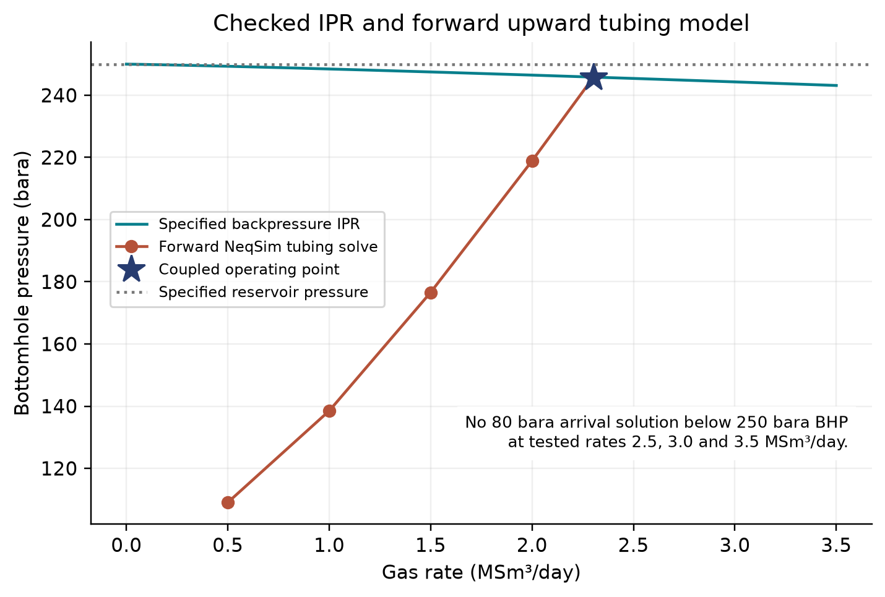
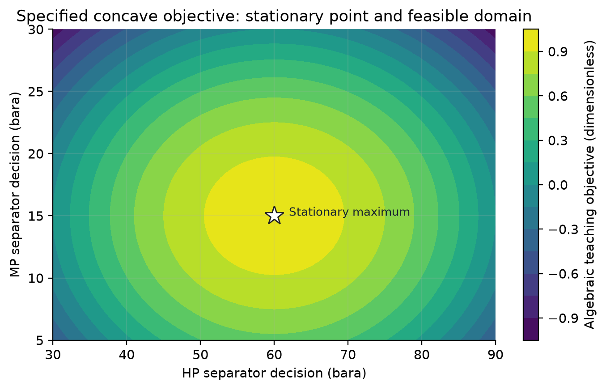
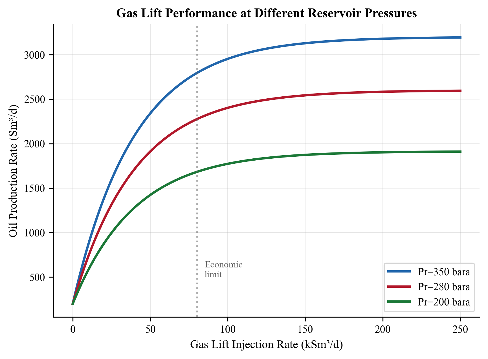
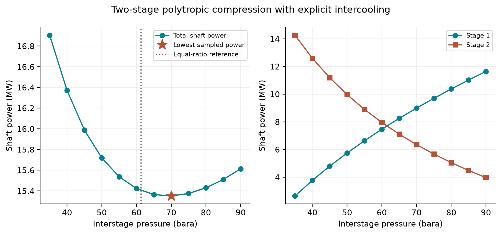
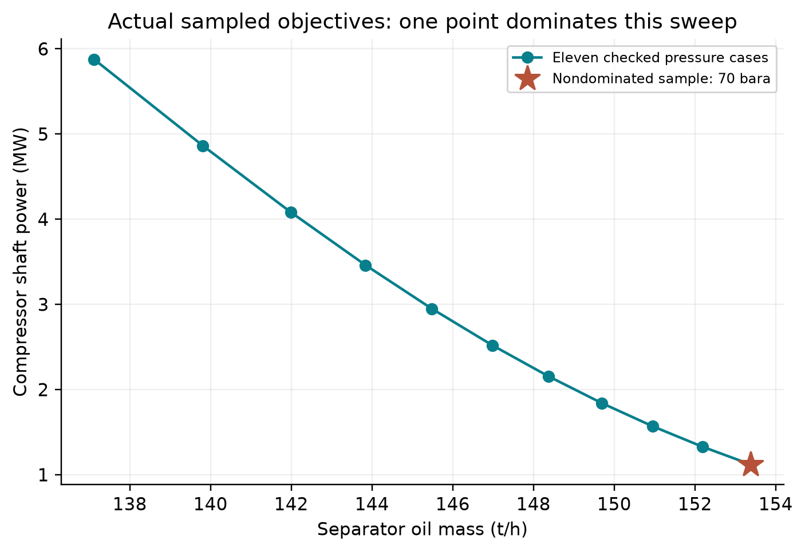
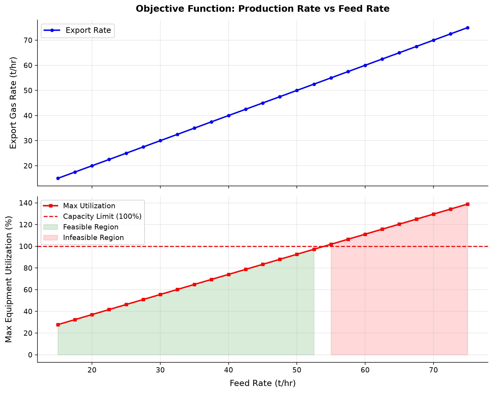
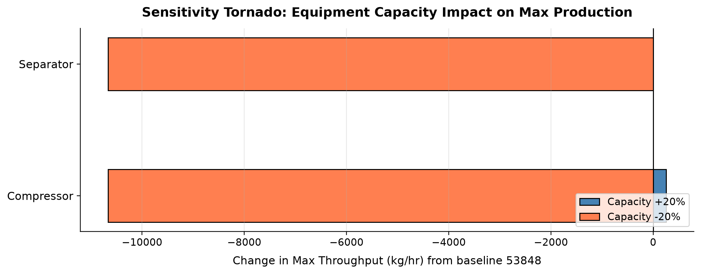

# Production Optimization Theory and Methods

<!-- Chapter metadata -->
<!-- Notebooks: ch19_separator_pressure_optimization.ipynb, ch19_gas_lift_allocation.ipynb, ch19_compressor_setpoint_optimization.ipynb -->
<!-- Estimated pages: 28 -->

## Learning Objectives

After reading this chapter, the reader will be able to:

1. Formulate a production optimization problem with objective function, decision variables, and constraints
2. Classify optimization problems in oil and gas production (well allocation, gas lift, separator pressure, compressor set points, routing)
3. Apply NODAL analysis principles to identify the optimal operating point for individual wells and integrated production systems
4. Describe gradient-based, derivative-free, evolutionary, and surrogate-based optimization methods and their suitability for different problem types
5. Formulate and solve multi-objective optimization problems balancing competing goals (production rate, gas export quality, energy consumption)
6. Explain real-time optimization (RTO) architecture and the differences between steady-state and dynamic optimization
7. Implement parametric sweeps and optimization routines using NeqSim for separator pressure optimization, gas lift allocation, and compressor set point optimization
8. Understand robust optimization under uncertainty and integrated asset modeling concepts

---

## 22.1 Introduction

Production optimization is the systematic process of finding operating conditions that maximize a chosen objective (typically production rate, revenue, or recovery factor) while satisfying all equipment, safety, and contractual constraints. It is both a theoretical discipline — rooted in mathematical programming — and a practical operational activity performed daily on producing fields.

The fundamental question of production optimization is deceptively simple:

> *Given the current state of the reservoir, wells, and facilities, what are the best operating set points?*

The difficulty lies in the complexity of the system: a typical offshore platform may have 10–30 wells, 20–50 process equipment items, hundreds of control valves, and thousands of possible combinations of set points. The process is nonlinear, coupled, and constrained. Reservoir behavior is uncertain. Equipment degrades over time. Contractual obligations impose hard limits.

This chapter presents the mathematical foundations of production optimization, surveys the main algorithmic approaches, and demonstrates practical optimization workflows using NeqSim process simulation.

### 22.1.1 The Role of Process Simulation in Optimization

Process simulation is the engine that drives production optimization. Given a set of decision variables (pressures, temperatures, flow rates, valve positions), the process simulator computes:

- The resulting production rates (oil, gas, water, condensate)
- The quality of the products (gas dew point, oil BS&W, water quality)
- The energy consumption (compressor power, pump power, heating/cooling duties)
- Whether all equipment constraints are satisfied (capacity limits from Chapter 20)

The optimizer explores the decision variable space, calling the simulator at each point to evaluate the objective function, and iteratively moves toward the optimum.

$$
\text{Optimizer} \xrightarrow{\text{set points}} \text{Process Simulator} \xrightarrow{\text{performance}} \text{Optimizer}
$$

### 22.1.2 Scope of Production Optimization

Production optimization spans multiple timescales:

| Timescale | Optimization Task | Decision Variables | Frequency |
|-----------|-------------------|-------------------|-----------|
| Minutes | Well choke adjustment | Individual well chokes | Real-time |
| Hours | Gas lift allocation | Gas lift rates per well | Several times daily |
| Days | Separator pressure optimization | Stage pressures | Daily to weekly |
| Weeks | Routing optimization | Well-to-manifold assignments | Weekly to monthly |
| Months | Compressor configuration | Number of stages, speeds | Seasonal |
| Years | Facility modification | Equipment upgrades | Annual review |

This chapter focuses primarily on the daily-to-weekly operational optimization timescale, where process simulation is most directly applicable.

---

## 22.2 Mathematical Formulation

### 22.2.1 The General Optimization Problem

A production optimization problem has the standard form:

$$
\max_{x} \quad f(x)
$$

$$
\text{subject to:} \quad g_i(x) \leq 0, \quad i = 1, \ldots, m
$$

$$
h_j(x) = 0, \quad j = 1, \ldots, p
$$

$$
x^L \leq x \leq x^U
$$

where:

- $x \in \mathbb{R}^n$ is the vector of **decision variables** (set points, valve positions, flow rates)
- $f(x)$ is the **objective function** (production rate, revenue, efficiency)
- $g_i(x) \leq 0$ are **inequality constraints** (equipment capacity limits, quality specifications)
- $h_j(x) = 0$ are **equality constraints** (material balances, energy balances — typically handled implicitly by the process simulator)
- $x^L$ and $x^U$ are the **lower and upper bounds** on the decision variables

### 22.2.2 Objective Functions

The choice of objective function defines what "optimal" means. Common objectives in production optimization include:

**Maximum oil production rate:**

$$
f(x) = Q_{\text{oil}}(x) \quad [\text{Sm}^3/\text{day}]
$$

**Maximum revenue:**

$$
f(x) = P_{\text{oil}} \cdot Q_{\text{oil}}(x) + P_{\text{gas}} \cdot Q_{\text{gas}}(x) - C_{\text{opex}}(x)
$$

where $P_{\text{oil}}$ and $P_{\text{gas}}$ are the prices of oil and gas, and $C_{\text{opex}}$ includes energy costs, chemical injection costs, etc.

**Maximum recovery factor:**

$$
f(x) = \frac{\int_0^T Q_{\text{oil}}(x, t) \, dt}{\text{STOIIP}}
$$

**Minimum specific energy consumption:**

$$
E_{\mathrm{gas}}(x) = \frac{24 W_{\mathrm{total}}(x)}{Q_{\mathrm{gas,export}}(x)} \quad [\mathrm{kWh/Sm^3}]
$$

Here power is in kW and export gas rate is in Sm³/day at a declared reference state. Minimize this quantity, or maximize its negative in the general formulation. Do not add oil and gas standard volumes without an explicitly defined equivalent-product basis.

### 22.2.3 Decision Variables

Common decision variables in production optimization:

| Category | Decision Variables | Typical Range |
|----------|-------------------|---------------|
| Well control | Wellhead choke opening (%) | 0–100% |
| Gas lift | Gas lift rate per well (MSm³/d) | 0–0.5 |
| Separation | Stage pressures (bara) | 5–80 |
| Compression | Compressor speed (rpm) or set point | 70–105% of design |
| Heat exchange | Cooling medium flow rate | 50–120% of design |
| Routing | Well-to-manifold assignment | Binary (0/1) |

### 22.2.4 Constraints

Constraints represent physical, safety, and contractual limits:

**Equipment capacity constraints** (from Chapter 20):

$$
U_i(x) \leq U_{i,\text{max}}, \quad \text{for all equipment } i
$$

**Quality constraints:**

$$
\text{HHV}(x) \geq \text{HHV}_{\text{min}} \quad \text{(gas heating value)}
$$

$$
\text{HCDP}(x) \leq \text{HCDP}_{\text{max}} \quad \text{(hydrocarbon dew point)}
$$

$$
\text{H}_2\text{S}(x) \leq \text{H}_2\text{S}_{\text{max}} \quad \text{(hydrogen sulfide content)}
$$

**Contractual constraints:**

$$
Q_{\text{gas,export}}(x) \geq Q_{\text{DCQ}} \quad \text{(daily contracted quantity)}
$$

**Safety constraints:**

$$
P_i(x) \leq P_{i,\text{MAOP}}, \quad T_i(x) \leq T_{i,\text{max}}
$$

---

## 22.3 NODAL Analysis and System Optimization

### 22.3.1 NODAL Analysis Fundamentals

NODAL analysis (also called systems analysis) is a foundational technique for production optimization. It views the entire production system — reservoir, well, flowline, and facility — as a network of nodes connected by pressure-drop elements. At any node, the pressure from the upstream elements (inflow) must equal the pressure from the downstream elements (outflow).

The **inflow performance relationship** (IPR) describes the reservoir deliverability:

$$
Q = J \cdot (P_R - P_{wf}) \quad \text{(for undersaturated oil)}
$$

or for gas wells using the backpressure equation:

$$
Q = C \cdot (P_R^2 - P_{wf}^2)^n
$$

where $Q$ is the flow rate, $J$ is the productivity index, $P_R$ is the reservoir pressure, $P_{wf}$ is the bottomhole flowing pressure, $C$ is the backpressure coefficient, and $n$ is the backpressure exponent (0.5–1.0).

The **tubing performance relationship** (TPR) or vertical lift performance (VLP) describes the pressure loss from bottomhole to wellhead:

$$
P_{wf} = P_{wh} + \Delta P_{\text{gravity}} + \Delta P_{\text{friction}} + \Delta P_{\text{acceleration}}
$$

The operating point is found at the intersection of the IPR and TPR curves — the point where the reservoir can deliver fluid at the same rate that the tubing can transport it.

### 22.3.2 System Node Selection

Changing the solution node changes the bookkeeping and numerical conditioning, but a consistently converged physical model gives the same operating point. Common node locations:

| Node Location | Inflow Curve | Outflow Curve |
|--------------|-------------|---------------|
| Bottomhole | IPR | TPR + flowline + facility |
| Wellhead | IPR + tubing | Flowline + facility |
| Separator inlet | IPR + tubing + flowline | Separator + downstream |
| Export | Entire upstream | Pipeline + sales |

### 22.3.3 Multi-Well System Optimization

For a multi-well system converging at a common manifold, the optimization problem becomes:

$$
\max \quad \sum_{w=1}^{N_w} Q_{\text{oil},w}(P_{wh,w}, Q_{\text{GL},w})
$$

subject to:

$$
\sum_{w=1}^{N_w} Q_{\text{gas},w} \leq Q_{\text{gas,max}} \quad \text{(gas handling capacity)}
$$

$$
\sum_{w=1}^{N_w} Q_{\text{liq},w} \leq Q_{\text{liq,max}} \quad \text{(liquid handling capacity)}
$$

$$
\sum_{w=1}^{N_w} Q_{\text{GL},w} \leq Q_{\text{GL,total}} \quad \text{(total available gas lift)}
$$

This is a resource allocation problem — distributing scarce resources (gas lift gas, processing capacity) among competing wells to maximize total production.

### 22.3.4 NeqSim NODAL Analysis Example

```python
import jpype
import numpy as np
jneqsim = jpype.JPackage("neqsim")

# Gas backpressure IPR and forward upward tubing calculation.
P_res, C_ipr, n_ipr = 250.0, 0.0035, 0.85
P_wh_target = 80.0
well_trial_failures = []
def well_outlet(P_bh, Q_MSm3_day):
    gas=jneqsim.thermo.system.SystemSrkEos(363.15,P_bh)
    for name,z in [("methane",.88),("ethane",.06),("propane",.03),
                   ("CO2",.02),("nitrogen",.01)]:gas.addComponent(name,z)
    gas.setMixingRule("classic")
    stream=jneqsim.process.equipment.stream.Stream("Bottomhole inlet",gas)
    stream.setFlowRate(Q_MSm3_day,"MSm3/day")
    wellbore=jneqsim.process.equipment.pipeline.PipeBeggsAndBrills("Upward tubing",stream)
    wellbore.setPipeWallRoughness(2.5e-5)
    wellbore.setLength(3000.0)  # metres, 3000 m vertical rise
    wellbore.setDiameter(.1016)
    wellbore.setAngle(90.0)    # positive outlet-minus-inlet elevation
    wellbore.setNumberOfIncrements(30)
    ps=jneqsim.process.processmodel.ProcessSystem()
    ps.add(stream);ps.add(wellbore)
    try:
        ps.run()
    except jpype.JException as error:
        well_trial_failures.append({"P_bh_bara":P_bh,"flow_MSm3_day":Q_MSm3_day,
                                    "error":str(error)})
        return np.nan  # Explicitly rejected trial, never a reported solution

    arrival=float(wellbore.getOutletStream().getPressure("bara"))
    return arrival

# Bisection rejects nonpositive/undefined trial outlet pressures instead of
# reporting them as physical well states. Only accepted final states are used.
def required_bottomhole(Q):
    lo,hi=P_wh_target,P_res
    upper=well_outlet(hi,Q)
    if not np.isfinite(upper) or upper<P_wh_target:return None
    for _ in range(28):
        mid=.5*(lo+hi);arrival=well_outlet(mid,Q)
        if np.isfinite(arrival) and arrival>=P_wh_target:hi=mid
        else:lo=mid
    arrival=well_outlet(hi,Q)
    assert abs(arrival-P_wh_target)<.002
    return hi

Q_tpr=[.5,1.0,1.5,2.0,2.5,3.0,3.5]
P_wf_tpr=[required_bottomhole(q) for q in Q_tpr]
print("Required BHP for 80 bara wellhead; None means unavailable below reservoir pressure")
print(list(zip(Q_tpr,P_wf_tpr)))

def ipr_bottomhole(Q):
    square=P_res**2-(Q/C_ipr)**(1/n_ipr)
    assert square>0
    return float(np.sqrt(square))
lo,hi=.05,5.0
assert well_outlet(ipr_bottomhole(lo),lo)>P_wh_target
hi_arrival=well_outlet(ipr_bottomhole(hi),hi)
assert not np.isfinite(hi_arrival) or hi_arrival<P_wh_target
for _ in range(30):
    mid=.5*(lo+hi);arrival=well_outlet(ipr_bottomhole(mid),mid)
    if np.isfinite(arrival) and arrival>=P_wh_target:lo=mid
    else:hi=mid
operating_rate_MSm3_day=lo
operating_BHP_bara=ipr_bottomhole(lo)
operating_WHP_bara=well_outlet(operating_BHP_bara,lo)
assert abs(operating_WHP_bara-P_wh_target)<.002
assert abs(C_ipr*(P_res**2-operating_BHP_bara**2)**n_ipr-lo)<1e-8
print(f"Coupled solution: {lo:.5f} MSm3/day; BHP {operating_BHP_bara:.3f} bara; WHP {operating_WHP_bara:.3f} bara")
print("Specified IPR plus a steady forward pipe model; no calibrated thermal wellbore or field deliverability claim.")
```



The coupled solution is 2.30293 MSm³/day at 245.829 bara bottomhole pressure and 80.000 bara wellhead pressure. Friction and elevation increase required BHP with rate. Tested rates of 2.5–3.5 MSm³/day cannot reach the 80 bara target below the 250 bara reservoir pressure and are excluded from the curve. This is a numerical consistency check for the declared IPR and steady tubing model; calibration and a thermal wellbore model remain separate requirements.

---

## 22.4 Optimization Methods

### 22.4.1 Classification of Methods

Optimization methods can be classified along several dimensions:

| Criterion | Categories |
|-----------|-----------|
| Derivative usage | Gradient-based, derivative-free, hybrid |
| Search strategy | Local, global |
| Solution type | Deterministic, stochastic |
| Number of objectives | Single-objective, multi-objective |
| Variable type | Continuous, discrete, mixed-integer |

The choice of method depends on the problem characteristics:

- **Smooth, unimodal problems** → Gradient-based methods (fastest convergence)
- **Noisy or discontinuous problems** → Derivative-free methods
- **Problems with many local optima** → Global methods (evolutionary, simulated annealing)
- **Expensive simulations** → Surrogate-based methods
- **Mixed continuous/discrete variables** → Mixed-integer methods or evolutionary algorithms

### 22.4.2 Gradient-Based Methods

Gradient-based methods use the first (and sometimes second) derivatives of the objective function to determine the search direction. They converge rapidly near the optimum but require smooth, differentiable objective functions.

**Steepest ascent (gradient ascent):**

$$
x_{k+1} = x_k + \alpha_k \cdot \nabla f(x_k)
$$

where $\alpha_k$ is the step size (determined by line search) and $\nabla f$ is the gradient of the objective function.

**Newton's method:**

$$
x_{k+1} = x_k - H^{-1}(x_k) \cdot \nabla f(x_k)
$$

where $H$ is the Hessian matrix of second derivatives. Newton's method has local quadratic convergence to a stationary point under a nonsingular Hessian and appropriate regularity/initialization; this alone does not establish a maximum.

**Quasi-Newton methods (BFGS, L-BFGS):**

For minimization define $F=-f$ when the original objective is maximized. Approximate the Hessian of $F$ (or of its Lagrangian for constrained SQP) with BFGS; positive definiteness requires a positive curvature denominator, often enforced by damping:

$$
H_{k+1} = H_k + \frac{y_k y_k^T}{y_k^T s_k} - \frac{H_k s_k s_k^T H_k}{s_k^T H_k s_k}
$$

where $s_k = x_{k+1} - x_k$ and $y_k = \nabla F(x_{k+1}) - \nabla F(x_k)$.

**Sequential Quadratic Programming (SQP):**

For constrained optimization, SQP solves a sequence of quadratic subproblems:

$$
\min_{d} \quad \frac{1}{2} d^T H_k d + \nabla F(x_k)^T d
$$

$$
\text{s.t.} \quad \nabla g_i(x_k)^T d + g_i(x_k) \leq 0
$$

Include linearized equality constraints and the variable bounds in each SQP subproblem. SQP is a widely used approach to constrained nonlinear optimization and is used in commercial real-time optimizers.

**Gradient estimation for simulation-based optimization:**

When the objective function is evaluated by a process simulator (not an analytical formula), gradients must be estimated numerically using finite differences:

$$
\frac{\partial f}{\partial x_i} \approx \frac{f(x + \epsilon e_i) - f(x)}{\epsilon}
$$

where $\epsilon$ is a small perturbation and $e_i$ is the unit vector in direction $i$. This requires $n$ additional simulation runs for $n$ decision variables (or $2n$ for central differences).

### 22.4.3 Derivative-Free Methods

Derivative-free methods avoid explicit derivatives. Noise and discontinuities can still corrupt comparisons and termination; select a method and evaluation precision suited to the model.

**Nelder-Mead Simplex Method:**

The Nelder-Mead algorithm maintains a simplex (a geometric figure with $n+1$ vertices in $n$ dimensions) and iteratively moves the worst vertex toward better regions using reflection, expansion, contraction, and shrinkage operations.

Nelder–Mead is a local search heuristic; ordinary implementations have no general convergence guarantee, especially for noisy or discontinuous simulations. Independently evaluate the returned point and compare starts.

**Powell's Method (Conjugate Direction Method):**

Performs sequential one-dimensional line searches along conjugate directions, gradually aligning the search directions with the principal axes of the objective function.

**Pattern Search (Generalized Pattern Search):**

Evaluates the objective at a set of points forming a pattern (e.g., coordinate directions) around the current best point. If an improvement is found, the pattern moves; otherwise, the step size is reduced. Stationarity results require specific polling, regularity and sufficient-decrease assumptions; arbitrary noisy black-box evaluations do not satisfy them automatically.

**Comparison of derivative-free methods:**

| Method | Function Evaluations | Global/Local | Handles Noise | Handles Constraints |
|--------|---------------------|-------------|---------------|---------------------|
| Nelder-Mead | Usually 1–2 new evaluations; up to $n$ additional evaluations for shrinkage | Local | Yes | Penalty function |
| Powell | Moderate | Local | Moderate | Penalty function |
| Pattern search | Moderate | Local | Yes | Direct handling |
| COBYLA | Low | Local | Yes | Direct handling |

### 22.4.4 Evolutionary Algorithms

Evolutionary algorithms are population-based global optimization methods inspired by natural selection. They maintain a population of candidate solutions and evolve them through selection, crossover, and mutation.

**Genetic Algorithm (GA):**

1. **Initialize**: Random population of $N$ candidate solutions
2. **Evaluate**: Compute objective function for each individual
3. **Select**: Choose parents proportional to fitness
4. **Crossover**: Combine parent genes to create offspring

$$
x_{\text{child}} = \alpha \cdot x_{\text{parent1}} + (1 - \alpha) \cdot x_{\text{parent2}}
$$

5. **Mutate**: Random perturbation with probability $p_m$

$$
x_{\text{mutated}} = x + \sigma \cdot \mathcal{N}(0, 1)
$$

6. **Replace**: Worst individuals replaced by offspring
7. **Repeat** until convergence or maximum generations

**Particle Swarm Optimization (PSO):**

Each particle has a position $x_i$ and velocity $v_i$. At each iteration:

$$
v_i^{k+1} = w \cdot v_i^k + c_1 \cdot r_1 \cdot (p_{\text{best},i} - x_i^k) + c_2 \cdot r_2 \cdot (g_{\text{best}} - x_i^k)
$$

$$
x_i^{k+1} = x_i^k + v_i^{k+1}
$$

where $w$ is the inertia weight, $c_1$ and $c_2$ are cognitive and social parameters, $r_1$ and $r_2$ are random numbers in $[0, 1]$, $p_{\text{best},i}$ is the personal best of particle $i$, and $g_{\text{best}}$ is the global best.

**Differential Evolution (DE):**

Creates mutant vectors by combining differences between randomly selected population members:

$$
v_i = x_{r1} + F \cdot (x_{r2} - x_{r3})
$$

where $F$ is the mutation factor (typically 0.5–1.0) and $r1, r2, r3$ are randomly chosen distinct indices.

**Comparison of evolutionary algorithms:**

| Algorithm | Population Size | Convergence Speed | Global Search | Tuning Complexity |
|-----------|----------------|-------------------|---------------|-------------------|
| GA | 50–200 | Moderate | Good | Moderate (crossover, mutation rates) |
| PSO | 20–100 | Fast | Good | Low (w, c₁, c₂) |
| DE | 30–100 | Fast | Very good | Low (F, CR) |

### 22.4.5 Surrogate-Based Optimization

When each simulation is computationally expensive (minutes to hours), surrogate-based optimization builds an approximate model (surrogate) of the objective function from a limited number of simulation evaluations, then optimizes the surrogate cheaply.

The workflow is:

1. **Design of Experiments (DoE)**: Sample the decision variable space using Latin Hypercube Sampling (LHS)
2. **Evaluate**: Run the process simulator at each sample point
3. **Build surrogate**: Fit a response surface model (polynomial, kriging, radial basis functions, neural network)
4. **Optimize**: Find the optimum of the surrogate model
5. **Validate**: Run the simulator at the predicted optimum to verify
6. **Infill**: Add new sample points where the surrogate is uncertain (expected improvement criterion) and repeat

**Common surrogate models:**

| Model | Complexity | Interpolation | Uncertainty Estimate |
|-------|-----------|--------------|---------------------|
| Polynomial (quadratic) | Low | No | No |
| Kriging (Gaussian Process) | Medium | Yes | Yes |
| Radial Basis Functions | Medium | Yes | No |
| Neural Network | High | Depends | Ensemble-based |

For a minimization objective, the **expected improvement** (EI) acquisition function balances exploitation (sampling where the predicted value is good) with exploration (sampling where uncertainty is high):

$$
\text{EI}(x) = (f_{\text{best}} - \hat{f}(x)) \cdot \Phi\left(\frac{f_{\text{best}} - \hat{f}(x)}{\hat{s}(x)}\right) + \hat{s}(x) \cdot \phi\left(\frac{f_{\text{best}} - \hat{f}(x)}{\hat{s}(x)}\right)
$$

For a maximization objective reverse the improvement sign. At zero predictive standard deviation use the limiting positive improvement rather than dividing by zero. Here $\hat{f}(x)$ is the surrogate prediction, $\hat{s}(x)$ is the prediction uncertainty, $\Phi$ is the standard normal CDF, and $\phi$ is the standard normal PDF.

### 22.4.6 Response Surface Methodology (RSM)

Response Surface Methodology is a widely used surrogate approach in process optimization. A second-order polynomial model is fitted to the simulation data:

$$
\hat{f}(x) = \beta_0 + \sum_{i=1}^{n} \beta_i x_i + \sum_{i=1}^{n} \beta_{ii} x_i^2 + \sum_{i < j} \beta_{ij} x_i x_j
$$

The coefficients $\beta$ are determined by least-squares regression from the DoE data. For $n$ decision variables, the quadratic model has $\frac{(n+1)(n+2)}{2}$ coefficients, requiring at least that many simulation runs.

RSM is effective when:
- The response is approximately quadratic over the region of interest
- The number of decision variables is small ($n \leq 8$)
- The simulation is deterministic (no noise)

A full-factorial central composite design with one center point uses $2^n+2n+1$ runs: 15 for three variables. Replicated center points add runs; a Box–Behnken design has a different construction. Verify full rank and use independent validation points beyond the minimum coefficient count.

### 22.4.7 Comparison of Optimization Methods for Production Systems

| Problem Characteristics | Recommended Method | Rationale |
|------------------------|-------------------|-----------|
| 1–2 variables, quick simulation | Parametric sweep + visual inspection | Simple and intuitive |
| 3–5 variables, smooth response | Nelder-Mead or Powell | Fast convergence, few evaluations |
| 3–5 variables, noisy | Pattern search or COBYLA | Robust to noise |
| 5–15 variables, multiple optima | DE or PSO with local refinement | Global exploration + local precision |
| Expensive simulation (> 1 min) | Kriging + expected improvement | Minimum simulation evaluations |
| Discrete routing decisions | GA or mixed-integer programming | Handles binary/integer variables |
| Multiple conflicting objectives | NSGA-II or weighted sum sweep | Generates Pareto front |

---

## 22.5 Separator Pressure Optimization

### 22.5.1 The Problem

Multi-stage separation systems (typically 2–4 stages) flash the wellstream at successively lower pressures to maximize liquid recovery. The stage pressures are the primary decision variables. Specify the objective as stabilized oil mass, stock-tank volume or economic value. Minimizing gas mass can be equivalent to maximizing retained hydrocarbon mass on a fixed-feed basis, but maximizing oil standard volume or API gravity is a different objective.

The classic **equal pressure ratio rule** provides a good initial estimate:

$$
r = \left(\frac{P_1}{P_{\text{stock tank}}}\right)^{1/(N-1)}
$$

$$
P_k = P_1 \cdot r^{-(k-1)}, \quad k = 1, 2, \ldots, N
$$

where $P_1$ is the first-stage pressure, $P_{\text{stock tank}}$ is the stock tank pressure (typically 1 atm), $N$ is the number of pressure levels including the first separator and stock tank, and $r$ is the pressure ratio per stage.

However, the true optimum depends on the fluid composition and is generally not exactly the equal-ratio solution. Simulation evaluates the chosen physical model; a search must still demonstrate feasibility, resolution and its local or global scope.

### 22.5.2 NeqSim Separator Pressure Optimization

```python
import jpype
jneqsim = jpype.JPackage("neqsim")

def simulate_two_stage_separation(P1, P2):
    """
    Simulate two-stage separation and return stock tank oil rate.

    Parameters
    ----------
    P1 : float
        First stage separator pressure (bara)
    P2 : float
        Second stage separator pressure (bara)

    Returns
    -------
    float
        Stock tank oil flow rate (kg/hr)
    """
    fluid = jneqsim.thermo.system.SystemSrkEos(273.15 + 70.0, P1)
    fluid.addComponent("nitrogen", 0.005)
    fluid.addComponent("CO2", 0.020)
    fluid.addComponent("methane", 0.450)
    fluid.addComponent("ethane", 0.070)
    fluid.addComponent("propane", 0.050)
    fluid.addComponent("i-butane", 0.020)
    fluid.addComponent("n-butane", 0.035)
    fluid.addComponent("i-pentane", 0.020)
    fluid.addComponent("n-pentane", 0.015)
    fluid.addComponent("n-hexane", 0.025)
    fluid.addComponent("n-heptane", 0.040)
    fluid.addComponent("n-octane", 0.030)
    fluid.addComponent("n-nonane", 0.020)
    fluid.addComponent("nC10", 0.010)
    fluid.addComponent("water", 0.190)
    fluid.setMixingRule("classic")
    fluid.setMultiPhaseCheck(True)

    # Stage 1: HP Separator
    feed = jneqsim.process.equipment.stream.Stream("Feed", fluid)
    feed.setFlowRate(200000.0, "kg/hr")
    feed.setTemperature(70.0, "C")
    feed.setPressure(P1, "bara")

    hp_sep = jneqsim.process.equipment.separator.ThreePhaseSeparator(
        "HP Sep", feed
    )

    # Valve between stages
    valve = jneqsim.process.equipment.valve.ThrottlingValve(
        "HP-LP Valve", hp_sep.getOilOutStream()
    )
    valve.setOutletPressure(P2)

    # Stage 2: LP Separator
    lp_sep = jneqsim.process.equipment.separator.Separator(
        "LP Sep", valve.getOutletStream()
    )

    # Stock tank valve
    st_valve = jneqsim.process.equipment.valve.ThrottlingValve(
        "ST Valve", lp_sep.getLiquidOutStream()
    )
    st_valve.setOutletPressure(1.01325)  # atmospheric

    # Stock tank separator
    st_sep = jneqsim.process.equipment.separator.Separator(
        "Stock Tank", st_valve.getOutletStream()
    )

    process = jneqsim.process.processmodel.ProcessSystem()
    process.add(feed)
    process.add(hp_sep)
    process.add(valve)
    process.add(lp_sep)
    process.add(st_valve)
    process.add(st_sep)
    process.run()

    outlets = [hp_sep.getGasOutStream(), hp_sep.getWaterOutStream(),
               lp_sep.getGasOutStream(), st_sep.getGasOutStream(),
               st_sep.getLiquidOutStream()]
    mass_out = sum(float(s.getFlowRate("kg/hr")) for s in outlets)
    assert abs(mass_out-feed.getFlowRate("kg/hr"))/200000.0 < 1e-8
    h_out = sum(float(s.getFluid().getEnthalpy()) for s in outlets)
    h_in = float(feed.getFluid().getEnthalpy())
    assert abs(h_out-h_in)/max(abs(h_in), 1.0) < 1e-6
    oil_rate = float(st_sep.getLiquidOutStream().getFlowRate("kg/hr"))
    assert 0.0 < oil_rate < 200000.0
    return oil_rate


# ── Parametric sweep: vary P2 at fixed P1 ──
P1_fixed = 60.0  # bara
P2_values = [2, 4, 6, 8, 10, 12, 15, 18, 20, 25, 30]

print(f"HP Separator pressure: {P1_fixed} bara")
print(f"{'LP Sep P (bara)':<18} {'ST Oil (kg/hr)':<18}")
print("-" * 36)

best_P2 = None
best_oil = 0

for P2 in P2_values:
    try:
        oil = simulate_two_stage_separation(P1_fixed, P2)
        if oil > best_oil:
            best_oil = oil
            best_P2 = P2
        print(f"{P2:<18.0f} {oil:<18.1f}")
    except Exception as e:
        print(f"{P2:<18.0f} {'FAILED':<18}")

print(f"\nOptimal LP pressure: {best_P2} bara")
print(f"Maximum ST oil rate: {best_oil:.1f} kg/hr")
```

### 22.5.3 Two-Dimensional Pressure Sweep

For a two-stage system, both pressures can be varied simultaneously:

```python
# 2D sweep: vary both P1 and P2
P1_values = [30, 40, 50, 60, 70, 80]
P2_values = [3, 5, 8, 10, 15, 20]

print(f"{'P1 (bara)':<12} {'P2 (bara)':<12} {'ST Oil (kg/hr)':<18}")
print("-" * 42)

best_result = {"P1": 0, "P2": 0, "oil": 0}

for P1 in P1_values:
    for P2 in P2_values:
        if P2 >= P1:
            continue  # P2 must be less than P1
        try:
            oil = simulate_two_stage_separation(P1, P2)
            if oil > best_result["oil"]:
                best_result = {"P1": P1, "P2": P2, "oil": oil}
            print(f"{P1:<12.0f} {P2:<12.0f} {oil:<18.1f}")
        except Exception:
            print(f"{P1:<12.0f} {P2:<12.0f} {'FAILED':<18}")

print(f"\nOptimal: P1={best_result['P1']} bara, "
      f"P2={best_result['P2']} bara, "
      f"Oil={best_result['oil']:.1f} kg/hr")
```



<!-- scientific-illustration:separator_pressure_contour.png -->
The contour is the declared dimensionless function 1 − [(pHP − 60)/30]² − [(pMP − 15)/15]², whose gradient vanishes at 60 and 15 bara and whose Hessian is negative definite. It explains a search landscape; it does not represent computed oil recovery. Actual separation optima require the verified process calculations elsewhere in the book.
<!-- /scientific-illustration -->

The contour curvature is prescribed by the illustrative objective. Operating sensitivity requires the actual process model.

### 22.5.4 Effect of Fluid Composition

The optimal stage pressures depend strongly on the fluid composition. The direction of the optimum-pressure shift must be evaluated for the actual composition, heavy-end characterization and product basis; GOR alone is insufficient. In practice, the stage pressures should be re-optimized whenever the fluid composition changes significantly — for example, after a new well is tied in or as the reservoir depletes.

---

## 22.6 Gas Lift Optimization

### 22.6.1 Gas Lift Fundamentals

Gas lift is an artificial lift method in which gas is injected into the production tubing to reduce the hydrostatic gradient and increase the well's production rate. The production rate initially increases with gas lift injection rate, reaches a maximum, and then decreases at very high injection rates due to increased friction:

$$
Q_{\text{oil}}(Q_{\text{GL}}) = Q_{\text{oil,natural}} + \Delta Q(Q_{\text{GL}})
$$

The **gas lift performance curve** (GLPC) for each well shows the oil production rate as a function of gas lift injection rate. The curve has a characteristic shape: concave, with diminishing returns at higher injection rates.

### 22.6.2 Single-Well Gas Lift Optimization

For a single well, the optimal gas lift rate maximizes the economic benefit:

$$
\max_{Q_{\text{GL}}} \quad P_{\text{oil}} \cdot Q_{\text{oil}}(Q_{\text{GL}}) - C_{\text{GL}} \cdot Q_{\text{GL}}
$$

where $C_{\text{GL}}$ is the cost of compressing and injecting the gas lift gas.

At a differentiable interior optimum, marginal oil revenue equals marginal lift-gas cost; at a bound the corresponding KKT inequality applies:

$$
P_{\text{oil}} \cdot \frac{dQ_{\text{oil}}}{dQ_{\text{GL}}} = C_{\text{GL}}
$$

### 22.6.3 Multi-Well Gas Lift Allocation

When multiple wells share a limited supply of gas lift gas, the allocation problem is:

$$
\max_{Q_{\text{GL},w}} \quad \sum_{w=1}^{N_w} Q_{\text{oil},w}(Q_{\text{GL},w})
$$

$$
\text{subject to:} \quad \sum_{w=1}^{N_w} Q_{\text{GL},w} \leq Q_{\text{GL,total}}
$$

$$
Q_{\text{GL},w} \geq 0, \quad w = 1, \ldots, N_w
$$

The optimal solution allocates gas lift gas to the wells with the highest marginal response (steepest GLPC slope) first. This is the **equal marginal rate of return** principle:

$$
\frac{dQ_{\text{oil},1}}{dQ_{\text{GL},1}} = \frac{dQ_{\text{oil},2}}{dQ_{\text{GL},2}} = \cdots = \frac{dQ_{\text{oil},N_w}}{dQ_{\text{GL},N_w}} = \lambda
$$

Here the equal-slope relation applies to wells strictly inside their allocation bounds when the shared budget is active. Wells at a bound satisfy inequalities. Concavity and separability make these KKT conditions sufficient; interacting wells require a coupled network solve.

### 22.6.4 Checked NeqSim Gas-Lift Allocation

The current native curve and network allocator solve a bounded empirical response problem. Coefficients below are assumed classroom inputs, not a simulated tubing response or field calibration. The code checks the gas budget, per-well bounds, independently recomputed oil objective and interior marginal slopes, then compares with an exhaustive allocation grid \cite{neqsim2026update}.

```python
import numpy as np
import jpype
jneqsim = jpype.JPackage("neqsim")
Curve = jneqsim.process.fielddevelopment.integrated.GasLiftPerformanceCurve
Allocator = jneqsim.process.fielddevelopment.integrated.GasLiftNetworkOptimizer
# Sm3/day for both phase rates; a multiplies sqrt(lift rate), b is a rate ratio.
parameters = {"A": (800.0, 3.0, 0.002),
              "B": (500.0, 4.5, 0.004),
              "C": (1200.0, 2.0, 0.0015)}
curves = {name: Curve(base, a, b, 200000.0)
          for name, (base, a, b) in parameters.items()}
allocator = Allocator()
for name, curve in curves.items():
    allocator.addWell(name, curve)
budget = 150000.0
allocation = allocator.allocate(budget)
rates = {name: float(allocation.getLiftRates().get(name)) for name in curves}
assert all(0.0 < q < 200000.0 for q in rates.values())
assert abs(sum(rates.values()) - budget) < 0.1
def oil(name, q):
    base, a, b = parameters[name]
    return base + a*np.sqrt(q) - b*q
replayed_oil = sum(oil(name, q) for name, q in rates.items())
assert abs(replayed_oil - allocation.getTotalOil()) < 1e-6
slopes = [parameters[name][1]/(2*np.sqrt(q)) - parameters[name][2]
          for name, q in rates.items()]
assert max(slopes)-min(slopes) < 1e-7
# Independent 1,000 Sm3/day grid; unused gas is allowed through qC <= remainder.
# All three curves have positive slope over this budget, so an optimum uses it all.
grid_best = -np.inf
for qA in np.arange(0.0, budget+1.0, 1000.0):
    for qB in np.arange(0.0, budget-qA+1.0, 1000.0):
        qC = budget-qA-qB
        grid_best = max(grid_best, oil("A",qA)+oil("B",qB)+oil("C",qC))
assert replayed_oil >= grid_best-1e-5
assert replayed_oil-grid_best < 1.0  # grid-resolution check, Sm3/day oil
print("Accepted lift allocation (Sm3/day):", rates)
print(f"Oil {replayed_oil:.3f} Sm3/day; grid {grid_best:.3f} Sm3/day")
```




### 22.6.5 Practical Considerations

Real gas lift optimization must account for:

1. **Minimum and maximum injection rates** per well (valve design constraints)
2. **Unloading requirements**: Some wells need a minimum injection rate to remain unloaded
3. **Compressor capacity**: Gas lift compressor power limits the total available gas
4. **Gas lift gas quality**: Impurities can cause hydrate or corrosion issues in GL valves
5. **Interdependence**: Wells sharing a manifold influence each other's wellhead pressure

---

## 22.7 Compressor Set Point Optimization

### 22.7.1 The Problem

Compressor systems (particularly multi-stage systems with parallel trains) have multiple set points that can be optimized:

- **Suction pressure**: Affects compression ratio, power, and upstream separator operation
- **Discharge pressure**: Must meet pipeline delivery pressure
- **Speed**: Variable-speed drives allow head-capacity trade-off
- **Recycle valve opening**: Recycle wastes energy but maintains surge margin
- **Load sharing**: In parallel compressor trains, the load split can be optimized

The objective is typically to minimize total compressor power while meeting the required flow and pressure:

$$
\min_{x} \quad W_{\text{total}}(x) = \sum_{k=1}^{N_{\text{stages}}} W_k(x)
$$

subject to:

$$
P_{\text{discharge}}(x) \geq P_{\text{pipeline}}
$$

$$
Q_{\text{surge},k}(x) \leq Q_k(x) \leq Q_{\text{stonewall},k}(x), \quad \forall k
$$

$$
W_k(x) \leq W_{\text{driver},k}, \quad \forall k
$$

### 22.7.2 NeqSim Compressor Optimization

```python
import jpype
jneqsim = jpype.JPackage("neqsim")

def compressor_power(P_suction, P_discharge, flow_MSm3d):
    """
    Calculate compressor power for given suction/discharge pressures.

    Returns power in MW.
    """
    gas = jneqsim.thermo.system.SystemSrkEos(273.15 + 30.0, P_suction)
    gas.addComponent("nitrogen", 0.01)
    gas.addComponent("CO2", 0.02)
    gas.addComponent("methane", 0.87)
    gas.addComponent("ethane", 0.06)
    gas.addComponent("propane", 0.03)
    gas.addComponent("n-butane", 0.01)
    gas.setMixingRule("classic")

    feed = jneqsim.process.equipment.stream.Stream("Feed", gas)
    feed.setFlowRate(flow_MSm3d, "MSm3/day")
    feed.setTemperature(30.0, "C")
    feed.setPressure(P_suction, "bara")

    comp = jneqsim.process.equipment.compressor.Compressor("Comp", feed)
    comp.setOutletPressure(P_discharge)
    comp.setPolytropicEfficiency(0.78)
    comp.setUsePolytropicCalc(True)

    ps = jneqsim.process.processmodel.ProcessSystem()
    ps.add(feed)
    ps.add(comp)
    ps.run()

    assert abs(comp.getOutletStream().getFlowRate("kg/hr")
               - feed.getFlowRate("kg/hr"))/feed.getFlowRate("kg/hr") < 1e-10
    dh = comp.getOutletStream().getFluid().getEnthalpy()-feed.getFluid().getEnthalpy()
    assert abs(dh-comp.getPower())/max(abs(comp.getPower()),1.0) < 1e-5
    assert comp.getPower() > 0.0
    return comp.getPower() / 1e6  # MW


# Optimize suction pressure (trade-off: lower P_suct gives more
# reservoir drawdown but requires more compressor power)
P_discharge_req = 120.0  # bara, pipeline delivery
flow = 4.0  # MSm³/day

P_suction_range = [20, 25, 30, 35, 40, 45, 50, 55, 60]

print("Compressor Suction Pressure Optimization")
print("=" * 50)
print(f"{'P_suction (bara)':<20} {'Power (MW)':<15} {'CR':<10}")
print("-" * 45)

for P_s in P_suction_range:
    try:
        power = compressor_power(P_s, P_discharge_req, flow)
        cr = P_discharge_req / P_s
        print(f"{P_s:<20.0f} {power:<15.2f} {cr:<10.1f}")
    except Exception:
        print(f"{P_s:<20.0f} {'FAILED':<15}")

print("\nThis fixed-rate sweep quantifies compression power only.")
print("A coupled well/separator model is needed to establish any production benefit.")
```

### 22.7.3 Two-Stage Compression Optimization

For a two-stage compression system with an intercooler, the interstage pressure can be optimized:

```python
import jpype
jneqsim = jpype.JPackage("neqsim")

def two_stage_power(P_suct, P_inter, P_disch, flow_MSm3d):
    """
    Simulate two-stage compression with intercooling.
    Returns total power in MW.
    """
    gas = jneqsim.thermo.system.SystemSrkEos(273.15 + 30.0, P_suct)
    gas.addComponent("methane", 0.90)
    gas.addComponent("ethane", 0.06)
    gas.addComponent("propane", 0.03)
    gas.addComponent("n-butane", 0.01)
    gas.setMixingRule("classic")

    feed = jneqsim.process.equipment.stream.Stream("Feed", gas)
    feed.setFlowRate(flow_MSm3d, "MSm3/day")
    feed.setTemperature(30.0, "C")
    feed.setPressure(P_suct, "bara")

    # Stage 1
    comp1 = jneqsim.process.equipment.compressor.Compressor("Stage 1", feed)
    comp1.setOutletPressure(P_inter)
    comp1.setPolytropicEfficiency(0.78)
    comp1.setUsePolytropicCalc(True)

    # Intercooler
    cooler = jneqsim.process.equipment.heatexchanger.Heater(
        "Intercooler", comp1.getOutletStream()
    )
    cooler.setOutTemperature(273.15 + 35.0)

    # Stage 2
    comp2 = jneqsim.process.equipment.compressor.Compressor(
        "Stage 2", cooler.getOutletStream()
    )
    comp2.setOutletPressure(P_disch)
    comp2.setPolytropicEfficiency(0.76)
    comp2.setUsePolytropicCalc(True)

    ps = jneqsim.process.processmodel.ProcessSystem()
    ps.add(feed)
    ps.add(comp1)
    ps.add(cooler)
    ps.add(comp2)
    ps.run()

    W1 = comp1.getPower() / 1e6
    W2 = comp2.getPower() / 1e6
    return W1 + W2, W1, W2


# Sweep interstage pressure
P_s = 25.0    # bara, suction
P_d = 150.0   # bara, discharge
Q = 5.0       # MSm³/day

# Theoretical optimal: geometric mean
P_inter_opt_theory = (P_s * P_d) ** 0.5
print(f"Theoretical optimal interstage P: {P_inter_opt_theory:.1f} bara")

P_inter_range = [35, 40, 45, 50, 55, 60, 65, 70, 75, 80, 85, 90]

print(f"\n{'P_inter (bara)':<18} {'W_total (MW)':<15} {'W1 (MW)':<12} {'W2 (MW)':<12}")
print("-" * 57)

best_P = 0
best_W = 999

for P_i in P_inter_range:
    try:
        W_tot, W1, W2 = two_stage_power(P_s, P_i, P_d, Q)
        if W_tot < best_W:
            best_W = W_tot
            best_P = P_i
        print(f"{P_i:<18.0f} {W_tot:<15.2f} {W1:<12.2f} {W2:<12.2f}")
    except Exception:
        print(f"{P_i:<18.0f} {'FAILED':<15}")

print(f"\nOptimal interstage pressure: {best_P} bara")
print(f"Minimum total power:        {best_W:.2f} MW")
```

The equal-ratio optimum assumes equal inlet temperatures, equal efficiencies, constant gas properties and negligible intercooler pressure loss. The geometric mean is therefore a reference estimate; this example has unequal inlet temperatures and efficiencies. In practice, differences in efficiency between stages, intercooler effectiveness, and gas property variations cause the true optimum to deviate slightly from this theoretical value.



The lowest sampled total duty is 15.352 MW at 70 bara. Raising interstage pressure transfers duty from stage 2 to stage 1. The equal-ratio reference is 61.24 bara; unequal efficiencies, different stage-inlet temperatures and real-fluid properties shift the sampled minimum. Each stage and the whole cooled boundary satisfy mass, component and first-law checks. Refine the pressure grid and add equipment maps and temperature limits before an operating recommendation.

---

## 22.8 Multi-Objective Optimization

### 22.8.1 Concept

Many production optimization problems have multiple competing objectives. For example:

- **Maximize oil production** vs **minimize energy consumption**
- **Maximize gas export volume** vs **maximize gas heating value**
- **Maximize recovery factor** vs **minimize water handling cost**

In multi-objective optimization, there is generally no single solution that optimizes all objectives simultaneously. Instead, there is a **Pareto front** — a set of solutions where no objective can be improved without worsening another.

### 22.8.2 Pareto Optimality

A solution $x^*$ is **Pareto optimal** if there is no other feasible solution $x$ such that:

$$
f_k(x) \geq f_k(x^*) \quad \forall k, \quad \text{and} \quad f_j(x) > f_j(x^*) \quad \text{for some } j
$$

The set of all Pareto-optimal solutions is the **Pareto front** in objective space.

### 22.8.3 Solution Approaches

**Weighted Sum Method:**

Convert multiple objectives into a single objective using weights:

$$
\max_x \quad \sum_{k=1}^{K} w_k \cdot f_k(x), \quad \text{where} \quad \sum_{k=1}^{K} w_k = 1, \quad w_k \geq 0
$$

By varying the weights, different points on the Pareto front are obtained. This is simple but cannot find solutions on non-convex portions of the Pareto front.

**$\epsilon$-Constraint Method:**

Optimize one objective while constraining the others:

$$
\max_x \quad f_1(x) \quad \text{s.t.} \quad f_k(x) \geq \epsilon_k, \quad k = 2, \ldots, K
$$

A sufficiently resolved epsilon sweep with globally solved subproblems can reach unsupported non-convex portions. A finite sampled sweep is an approximation; remove dominated points and report resolution.

**Evolutionary Multi-Objective Optimization (NSGA-II):**

The Non-dominated Sorting Genetic Algorithm II (NSGA-II) maintains a population of solutions and uses non-dominated sorting and crowding distance to evolve toward the Pareto front in a single run.

### 22.8.4 Example: Oil Rate vs Power Consumption

```python
# Multi-objective: sweep separator pressure and record both
# oil rate and compressor power

import jpype
jneqsim = jpype.JPackage("neqsim")

P_sep_range = [20, 25, 30, 35, 40, 45, 50, 55, 60, 65, 70]
pareto_points = []

for P_sep in P_sep_range:
    fluid = jneqsim.thermo.system.SystemSrkEos(273.15 + 75.0, P_sep)
    fluid.addComponent("methane", 0.50)
    fluid.addComponent("ethane", 0.06)
    fluid.addComponent("propane", 0.04)
    fluid.addComponent("n-butane", 0.03)
    fluid.addComponent("n-hexane", 0.05)
    fluid.addComponent("n-heptane", 0.08)
    fluid.addComponent("n-octane", 0.10)
    fluid.addComponent("nC10", 0.05)
    fluid.addComponent("water", 0.09)
    fluid.setMixingRule("classic")
    fluid.setMultiPhaseCheck(True)

    fd = jneqsim.process.equipment.stream.Stream("Feed", fluid)
    fd.setFlowRate(200000.0, "kg/hr")
    fd.setTemperature(75.0, "C")
    fd.setPressure(P_sep, "bara")

    sep = jneqsim.process.equipment.separator.ThreePhaseSeparator("Sep", fd)

    comp = jneqsim.process.equipment.compressor.Compressor(
        "Comp", sep.getGasOutStream()
    )
    comp.setOutletPressure(120.0)
    comp.setPolytropicEfficiency(0.77)
    comp.setUsePolytropicCalc(True)

    ps = jneqsim.process.processmodel.ProcessSystem()
    ps.add(fd)
    ps.add(sep)
    ps.add(comp)

    try:
        ps.run()
        oil_rate = sep.getOilOutStream().getFlowRate("kg/hr")
        power = comp.getPower() / 1e6  # MW
        pareto_points.append({
            "P_sep": P_sep,
            "oil_rate": oil_rate,
            "power": power
        })
    except Exception:
        pass

print("Multi-Objective Results: Oil Rate vs Compressor Power")
print("=" * 60)
print(f"{'P_sep (bara)':<15} {'Oil Rate (kg/hr)':<20} {'Power (MW)':<15}")
print("-" * 50)
for pt in pareto_points:
    print(f"{pt['P_sep']:<15.0f} {pt['oil_rate']:<20.1f} {pt['power']:<15.2f}")

assert len(pareto_points) == len(P_sep_range), "A failed case cannot silently enter a complete frontier"
pareto_front = [point for point in pareto_points if not any(
    other["oil_rate"] >= point["oil_rate"] and other["power"] <= point["power"]
    and (other["oil_rate"] > point["oil_rate"] or other["power"] < point["power"])
    for other in pareto_points)]
print("Nondominated sampled points:", pareto_front)
print("Oil is liquid mass at separator conditions; compare actual trends, not an assumed pressure/recovery direction.")
```



At 70 bara the sample gives 153.384 t/h separator oil and 1.120 MW compression duty, dominating the other ten tested pressures in these two objectives. Higher pressure retains more material in the separator liquid while reducing compression ratio. The calculation therefore does not demonstrate an oil–power trade-off. Liquid is measured at separator conditions; stock-tank stabilization, well response and additional constraints could change the objective landscape.

---

## 22.9 Real-Time Optimization (RTO)

### 22.9.1 Architecture

Real-time optimization (RTO) is the automated, continuous optimization of a production facility using live plant data. The standard RTO architecture consists of four layers:

1. **Data validation**: Clean and reconcile plant measurements (gross error detection, data reconciliation)
2. **Parameter estimation**: Update the process model to match current plant conditions (model tuning)
3. **Optimization**: Solve the optimization problem using the updated model
4. **Implementation**: Send optimized set points to the control system

$$
\text{Plant} \xrightarrow{\text{measurements}} \text{Data Validation} \xrightarrow{\text{clean data}} \text{Model Update} \xrightarrow{\text{tuned model}} \text{Optimizer} \xrightarrow{\text{set points}} \text{DCS}
$$

### 22.9.2 Steady-State vs Dynamic RTO

**Steady-state RTO** assumes the plant is at (or near) steady state. It runs periodically (every 15–60 minutes) when the plant has settled:

- Advantages: Simpler models, faster computation, well-understood theory
- Limitations: Cannot handle transient conditions, must wait for steady state

**Dynamic RTO** uses dynamic models that capture transient behavior:

- Advantages: Can optimize during transients, faster response
- Limitations: More complex models, higher computational cost, harder to validate

### 22.9.3 Steady-State Detection

Before running steady-state RTO, the system must verify that the plant is at steady state. A common test is the **R-statistic** applied to key process variables:

$$
R = \frac{\sum_{i=2}^{N}(y_i-y_{i-1})^2}{2\sum_{i=1}^{N}(y_i-\bar y)^2}
$$

This is the successive-difference variance divided by the ordinary sample variance, as implemented in the current NeqSim detector. Independent stationary noise gives a ratio near one; a smooth drift can give a small ratio. A constant window is a special zero-variance case. Combine calibrated ratio, variance and slope limits; the ratio alone is not proof of steady state. The alternative expression using a window's own standardized squared deviations is essentially constant and cannot detect a trend.

### 22.9.4 Data Reconciliation

Measurement errors are inevitable. Data reconciliation adjusts measured values to satisfy material and energy balances while minimizing the total adjustment:

$$
\min_{x} \quad \sum_{i} \left(\frac{x_i - y_i}{\sigma_i}\right)^2
$$

subject to:

$$
A \cdot x = 0 \quad \text{(material balance)}
$$

where $y_i$ is the measured value, $x_i$ is the reconciled value, and $\sigma_i$ is the measurement uncertainty.

### 22.9.5 Model Update (Parameter Estimation)

The process model parameters (e.g., well productivity indices, heat transfer coefficients, compressor efficiencies) are adjusted to minimize the discrepancy between model predictions and reconciled measurements:

$$
\min_{\theta} \quad \sum_{i} \left(\frac{x_i^{\text{model}}(\theta) - x_i^{\text{plant}}}{\sigma_i}\right)^2
$$

where $\theta$ is the vector of model parameters.

This step is critical: an optimization based on an inaccurate model will produce poor set points, potentially worse than the current operation.

### 22.9.6 Implementation Challenges

Real-time optimization faces several practical challenges that must be addressed for successful deployment:

**Model fidelity**: The process model must be accurate enough to predict the effect of set point changes. This requires regular validation against plant data and parameter re-tuning. A common metric is the **model prediction error** for key variables:

$$
\text{MPE}_i = \frac{|y_i^{\text{model}} - y_i^{\text{plant}}|}{y_i^{\text{plant}}} \times 100\%
$$

Choose tolerances from measurement uncertainty and decision sensitivity. Relative errors require a nonzero physically meaningful reference; percent error in degrees Celsius is not invariant to temperature scale. Use kelvin differences or an explicit temperature tolerance.

**Steady-state assumption**: Standard RTO requires steady-state conditions, but real plants are rarely truly at steady state. Frequent disturbances (slug flow, well cycling, compressor surging) can prevent the RTO from running. In practice, the steady-state detection logic must be tuned to balance responsiveness with robustness.

**Move suppression**: The optimizer may suggest large set point changes that are impractical or destabilizing. Move suppression limits the maximum change per RTO cycle:

$$
\lvert x_{k+1} - x_k\rvert \leq \Delta x_{\text{max}}
$$

Move limits reduce the size of each requested change but do not prove closed-loop stability or a safe transient path.

**Operator acceptance**: RTO recommendations must be understandable and trustworthy. Operators need to see *why* a change is recommended and *what will happen* if they implement it. This requires clear visualization of the current vs. optimized state and the expected benefits.

### 22.9.7 RTO Performance Metrics

The value of RTO is measured by comparing actual production with the pre-RTO baseline:

$$
\text{RTO Benefit} = \sum_{d=1}^{N_{\text{days}}} \left[f(x_{\text{RTO},d}) - f(x_{\text{baseline},d})\right]
$$

For an assumed 50,000 bbl/day platform, a hypothetical 3% uplift at 70 USD/bbl is 105,000 USD/day gross revenue. No such uplift is validated by this calculation. Use a matched baseline and account for uncertainty, transition losses and incremental costs before claiming net RTO benefit.

---

## 22.10 Robust Optimization Under Uncertainty

### 22.10.1 Sources of Uncertainty

Production optimization operates under significant uncertainty:

| Source | Examples | Impact |
|--------|----------|--------|
| Reservoir | Pressure, fluid composition, water cut | Well deliverability |
| Measurements | Flow rates, pressures, temperatures | Model accuracy |
| Equipment | Compressor efficiency, fouling, degradation | Capacity limits |
| Environment | Ambient temperature, sea conditions | Driver power, cooling |
| Market | Oil/gas prices, contract terms | Objective function |

### 22.10.2 Robust Formulation

Rather than optimizing for a single scenario, robust optimization seeks solutions that perform well across a range of uncertain conditions:

$$
\max_x \quad \min_{\xi \in \Xi} \quad f(x, \xi)
$$

where $\xi$ represents the uncertain parameters and $\Xi$ is the uncertainty set. The worst-case objective alone does not enforce feasibility. Add $g_i(x,\xi)\le0$ and $h_j(x,\xi)=0$ for every $\xi\in\Xi$ and retain the variable bounds. Finite scenario checks establish only scenario feasibility unless a separate argument covers the full uncertainty set.

### 22.10.3 Stochastic Optimization

An alternative is **stochastic optimization**, which maximizes the expected value of the objective:

$$
\max_x \quad \mathbb{E}_{\xi}[f(x, \xi)] = \int f(x, \xi) \cdot p(\xi) \, d\xi
$$

In practice, this is approximated by sampling:

$$
\max_x \quad \frac{1}{N_s} \sum_{s=1}^{N_s} f(x, \xi_s)
$$

where $\xi_1, \ldots, \xi_{N_s}$ are samples from the uncertainty distribution.

### 22.10.4 Chance Constraints

Constraints that must be satisfied with a specified probability:

$$
P(g_i(x, \xi) \leq 0) \geq 1 - \alpha_i
$$

where $\alpha_i$ is the acceptable violation probability (e.g., 5%). Use chance constraints only for quantities whose allowable violation probability has an explicit decision basis. They do not authorize violation of hard mechanical or safety limits. State whether confidence is individual or joint and quantify finite-sample uncertainty.

### 22.10.5 Practical Uncertainty Handling in NeqSim

In practice, robust optimization with NeqSim involves running the process model at multiple uncertainty realizations. A straightforward approach is:

1. **Define the uncertainty space**: Identify the key uncertain parameters (e.g., gas composition ±10%, ambient temperature ±15°C, well PI ±20%) and their probability distributions
2. **Generate scenarios**: Sample $N_s$ scenarios from the joint uncertainty distribution (e.g., Latin Hypercube Sampling with $N_s = 50–200$)
3. **Evaluate each scenario**: For each candidate set of decision variables $x$, run the NeqSim process model at all $N_s$ scenarios
4. **Compute robust objective**: Use the mean, worst-case, or conditional value-at-risk (CVaR) across scenarios as the objective

The CVaR (also called Expected Shortfall) at confidence level $\beta$ is:

$$
\operatorname{CVaR}_\beta(L)=\min_\eta\left\{\eta+\frac{\mathbb E[(L-\eta)_+]}{1-\beta}\right\},\qquad L=-f(x,\xi)
$$

Minimize this upper-tail loss measure, or equivalently maximize the lower-tail reward. Maximizing the upper tail of production would favor good outcomes and is not a conservative objective. The auxiliary threshold formulation also handles distributions with atoms \cite{rockafellar2000cvar}.

---

## 22.11 Integrated Asset Modeling

### 22.11.1 Concept

Integrated asset modeling (IAM) couples reservoir simulation, well models, and surface facility models into a single optimization framework. This allows optimization across the entire production system — from reservoir to export — capturing the interactions between subsurface and surface:

$$
\text{Reservoir} \longleftrightarrow \text{Wells} \longleftrightarrow \text{Flowlines} \longleftrightarrow \text{Facilities} \longleftrightarrow \text{Export}
$$

### 22.11.2 Coupling Approaches

| Approach | Description | Coupling error | Computational character |
|----------|------------|----------|-------|
| Sequential | One upstream-to-downstream pass | Feedback mismatch may remain | One pass |
| Iterative | Iterate models to a declared residual | Controlled by convergence tolerance | Multiple model runs |
| Fully coupled | Solve the assembled equations | Controlled by solver tolerance | Depends on system size and conditioning |

The iterative approach is most common in practice: the reservoir model provides well deliverability curves, the facility model determines the operating pressures, and these are exchanged iteratively until convergence.

### 22.11.3 NeqSim in Integrated Asset Models

NeqSim serves as the facility model component in IAM:

```python
import jpype
jneqsim = jpype.JPackage("neqsim")

# This function would be called by an outer IAM loop
# with wellhead conditions from the reservoir model

def facility_model(wellhead_conditions):
    """
    Run the facility model for given wellhead conditions.

    Parameters
    ----------
    wellhead_conditions : list of dict
        Each dict has keys: 'name', 'flow_kghr', 'T_C', 'P_bara',
        'composition' (dict of component: mole fraction)

    Returns
    -------
    dict
        Facility outputs: export gas rate, oil rate, power, etc.
    """
    # Example with a single well for simplicity
    wc = wellhead_conditions[0]

    fluid = jneqsim.thermo.system.SystemSrkEos(
        273.15 + wc['T_C'], wc['P_bara']
    )
    for comp, frac in wc['composition'].items():
        fluid.addComponent(comp, frac)
    fluid.setMixingRule("classic")
    fluid.setMultiPhaseCheck(True)

    feed = jneqsim.process.equipment.stream.Stream("Well Feed", fluid)
    feed.setFlowRate(wc['flow_kghr'], "kg/hr")
    feed.setTemperature(wc['T_C'], "C")
    feed.setPressure(wc['P_bara'], "bara")

    # Build facility model
    sep = jneqsim.process.equipment.separator.ThreePhaseSeparator(
        "HP Sep", feed
    )
    comp = jneqsim.process.equipment.compressor.Compressor(
        "Export Comp", sep.getGasOutStream()
    )
    comp.setOutletPressure(120.0)
    comp.setPolytropicEfficiency(0.77)
    comp.setUsePolytropicCalc(True)

    ps = jneqsim.process.processmodel.ProcessSystem()
    ps.add(feed)
    ps.add(sep)
    ps.add(comp)
    ps.run()

    results = {
        'gas_export_kghr': sep.getGasOutStream().getFlowRate("kg/hr"),
        'oil_rate_kghr': sep.getOilOutStream().getFlowRate("kg/hr"),
        'water_rate_kghr': sep.getWaterOutStream().getFlowRate("kg/hr"),
        'compressor_power_MW': comp.getPower() / 1e6,
        'export_pressure_bara': comp.getOutletStream().getPressure("bara"),
        'separator_pressure_bara': wc['P_bara'],
    }
    return results

# Example call
wc = [{
    'name': 'Well-1',
    'flow_kghr': 150000.0,
    'T_C': 75.0,
    'P_bara': 60.0,
    'composition': {
        'methane': 0.55, 'ethane': 0.07, 'propane': 0.04,
        'n-butane': 0.03, 'n-hexane': 0.05, 'n-heptane': 0.08,
        'n-octane': 0.06, 'water': 0.12
    }
}]

output = facility_model(wc)
print("Facility Model Output:")
for key, val in output.items():
    print(f"  {key}: {val:.2f}")
```

---

## 22.12 Practical Implementation Considerations

### 22.12.1 Computational Performance

Process simulation-based optimization requires many simulation evaluations. Typical counts:

| Method | Evaluations for 5 Variables | Evaluations for 10 Variables |
|--------|---------------------------|------------------------------|
| Gradient (finite diff.) | 50–200 | 200–1,000 |
| Nelder-Mead | 100–500 | 500–5,000 |
| Pattern search | 100–1,000 | 1,000–10,000 |
| GA (pop=50, gen=50) | 2,500 | 2,500 |
| PSO (pop=30, iter=50) | 1,500 | 1,500 |
| Surrogate (Kriging) | 50–200 | 100–500 |

For a NeqSim process model that runs in 0.1–1.0 seconds, 10,000 serial evaluations require about 17 minutes to 2.8 hours before overhead. However, for more complex models (dynamic simulation, detailed columns), surrogate-based approaches become attractive.

### 22.12.2 Local vs Global Optima

Production optimization problems are generally **non-convex** — they may have multiple local optima. Gradient-based and simplex methods find local optima, which may not be the global optimum.

Strategies to handle multiple optima:

1. **Multi-start**: Run the local optimizer from multiple random starting points
2. **Global search first, local refinement**: Use an evolutionary algorithm to explore broadly, then refine with a gradient method
3. **Domain knowledge**: Use engineering insight to narrow the search space and choose good starting points

### 22.12.3 Constraint Handling

Several approaches exist for handling constraints in simulation-based optimization:

**Penalty method:** Add a penalty term to the objective for constraint violations:

$$
f_{\text{penalized}}(x) = f(x) - \sum_i \mu_i \cdot \max(0, g_i(x))^2
$$

**Barrier method:** For positive $\mu_i$ and strictly feasible $g_i<0$, the following reciprocal barrier tends to minus infinity at a constraint boundary. Its parameter sequence controls how closely a maximizer approaches an active limit:

$$
f_{\text{barrier}}(x) = f(x) + \sum_i \frac{1}{\mu_i \cdot g_i(x)}
$$

**Direct constraint handling:** Some algorithms (COBYLA, SQP, pattern search with constraint projection) handle constraints directly without modification of the objective.

### 22.12.4 Optimization Workflow Summary

A practical production optimization workflow using NeqSim:

1. **Define the decision variables**: Which set points to optimize (pressures, flows, temperatures)
2. **Define the objective**: What to maximize or minimize (production, revenue, efficiency)
3. **Define constraints**: Equipment limits (Chapter 20), quality specs, safety limits
4. **Build the process model**: Create a NeqSim ProcessSystem that takes decision variables as inputs
5. **Select an optimizer**: Start with parametric sweep for 1–2 variables; use Nelder-Mead or pattern search for 3–5 variables; consider evolutionary methods for 5+ variables or discrete variables
6. **Run the optimization**: Iterate until convergence
7. **Validate the result**: Check that the optimum is physically reasonable, satisfies all constraints, and is robust to small perturbations
8. **Implement**: Communicate optimized set points to operations

### 22.12.5 Common Pitfalls

Several pitfalls frequently undermine production optimization efforts:

1. **Optimizing the model, not the plant**: The optimizer finds the optimum of the model. If the model does not accurately represent the plant, the recommended set points may degrade actual performance. Model validation is essential.

2. **Ignoring operational constraints**: The mathematical optimum may violate practical constraints that were not included in the model (e.g., operator preferences, environmental limits, regulatory requirements). Always review optimized set points with operations before implementation.

3. **Over-fitting to current conditions**: Optimal set points derived for today's conditions may not remain optimal if conditions change (e.g., weather, well interventions). Periodic re-optimization is necessary.

4. **Neglecting transition costs**: Moving from the current operating point to the optimized point incurs transition costs (production losses during re-stabilization, control system transients). These should be weighed against the steady-state benefit.

5. **Single-objective tunnel vision**: Focusing exclusively on one objective (e.g., maximum oil rate) may sacrifice important secondary objectives (equipment life, energy efficiency, emissions). Multi-objective formulations provide a more complete picture.

### 22.12.6 Software Tools for Production Optimization

Production optimization in the oil and gas industry employs a range of software tools:

| Tool Category | Examples | Typical Use |
|--------------|---------|-------------|
| Process simulators | NeqSim, HYSYS, UniSim, PRO/II | Steady-state process modeling |
| Network models | GAP, Prosper, OLGA | Well and flowline network |
| RTO platforms | ROMeo, Aspen RT-Opt | Real-time steady-state optimization |
| Optimization libraries | SciPy, MATLAB fmincon, Gurobi | Algorithm implementation |
| Digital twin platforms | Cognite, AVEVA | Integrated data + model + optimization |

NeqSim is particularly suited for optimization studies because:
- It provides a scriptable Python API for programmatic optimization loops
- Flash calculations and process simulations are fast (typically < 1 second)
- It handles multiphase systems (oil, gas, water) natively
- The `ProcessSystem` class can be rebuilt and re-run programmatically in optimization loops

---

## 22.13 Case Study: Platform Production Optimization

### 22.13.1 Problem Description

Consider a platform producing from 5 wells with:

- HP separator at variable pressure (30–80 bara)
- Two export compressors (20 MW each, variable speed)
- Gas export pipeline requiring 120 bara delivery
- Total gas handling capacity of 8 MSm³/day
- Total liquid handling capacity of 500 m³/hr

The goal is to maximize oil production by optimizing the HP separator pressure while respecting all equipment constraints.

### 22.13.2 Implementation

```python
import jpype
jneqsim = jpype.JPackage("neqsim")

def platform_production(P_sep):
    """
    Simulate platform production at given separator pressure.
    Returns dict with production rates and constraint metrics.
    """
    fluid = jneqsim.thermo.system.SystemSrkEos(273.15 + 75.0, P_sep)
    fluid.addComponent("nitrogen", 0.005)
    fluid.addComponent("CO2", 0.025)
    fluid.addComponent("methane", 0.480)
    fluid.addComponent("ethane", 0.065)
    fluid.addComponent("propane", 0.040)
    fluid.addComponent("i-butane", 0.015)
    fluid.addComponent("n-butane", 0.025)
    fluid.addComponent("i-pentane", 0.015)
    fluid.addComponent("n-pentane", 0.012)
    fluid.addComponent("n-hexane", 0.020)
    fluid.addComponent("n-heptane", 0.035)
    fluid.addComponent("n-octane", 0.025)
    fluid.addComponent("n-nonane", 0.015)
    fluid.addComponent("nC10", 0.010)
    fluid.addComponent("water", 0.213)
    fluid.setMixingRule("classic")
    fluid.setMultiPhaseCheck(True)

    feed = jneqsim.process.equipment.stream.Stream("Platform Feed", fluid)
    feed.setFlowRate(400000.0, "kg/hr")
    feed.setTemperature(75.0, "C")
    feed.setPressure(P_sep, "bara")

    sep = jneqsim.process.equipment.separator.ThreePhaseSeparator("HP Sep", feed)

    comp = jneqsim.process.equipment.compressor.Compressor(
        "Export Comp", sep.getGasOutStream()
    )
    comp.setOutletPressure(120.0)
    comp.setPolytropicEfficiency(0.77)
    comp.setUsePolytropicCalc(True)

    ps = jneqsim.process.processmodel.ProcessSystem()
    ps.add(feed)
    ps.add(sep)
    ps.add(comp)
    ps.run()

    oil = sep.getOilOutStream().getFlowRate("kg/hr")
    gas = sep.getGasOutStream().getFlowRate("kg/hr")
    water = sep.getWaterOutStream().getFlowRate("kg/hr")
    power = comp.getPower() / 1e6

    return {
        "P_sep": P_sep,
        "oil_kghr": oil,
        "gas_kghr": gas,
        "water_kghr": water,
        "power_MW": power,
        "power_ok": power <= 40.0,  # 2 x 20 MW
    }


# Sweep separator pressure
print("Platform Production vs Separator Pressure")
print("=" * 75)
print(f"{'P_sep':<10} {'Oil (kg/hr)':<15} {'Gas (kg/hr)':<15} "
      f"{'Power (MW)':<14} {'Power OK':<10}")
print("-" * 64)

best = {"oil_kghr": 0}

for P in range(30, 81, 5):
    try:
        r = platform_production(float(P))
        if r["oil_kghr"] > best["oil_kghr"] and r["power_ok"]:
            best = r
        print(f"{r['P_sep']:<10.0f} {r['oil_kghr']:<15.1f} "
              f"{r['gas_kghr']:<15.1f} {r['power_MW']:<14.2f} "
              f"{'OK' if r['power_ok'] else 'EXCEEDED':<10}")
    except Exception:
        print(f"{P:<10.0f} {'FAILED'}")

print(f"\nOptimal separator pressure: {best['P_sep']:.0f} bara")
print(f"Maximum oil production:     {best['oil_kghr']:.1f} kg/hr")
print(f"Compressor power:           {best['power_MW']:.2f} MW")
```

---


<!-- reviewed-notebook-results:start -->
## Reproduced Calculation Results

These examples use the stated fluid recipes and operating assumptions. Curves represent NeqSim calculations unless a caption identifies an analytical illustration, assumed equipment map or synthetic data.



Export Rate: export gas rate spans 15–75 t/hr across the plotted cases. Max Utilization: max equipment utilization spans 27.78–138.9 % across the plotted cases.

The simulated export rate grows with feed, but the fixed capacity denominators cause utilization to cross the allowable boundary. The useful optimum is the last feasible rate, not the largest export value plotted. Check a feasible point and a neighboring infeasible point to bracket the production limit.



The baseline bisection result is 53.848 t/hr. The largest negative throughput change in the single-rating sensitivity is -10.664 t/hr; the largest positive change is 0.254 t/hr.

Each sensitivity changes one assumed equipment rating and repeats the process-based feasibility search. A rating increase yields no throughput benefit if another unit already controls production. Prioritize the constraint with a demonstrated throughput response and verify the economics of the resulting upgrade.

Selected numerical ranges from the plotted cases:

| Quantity / series | Minimum | Maximum | Unit |
|---|---:|---:|---|
| Export Rate: export gas rate | 15 | 75 | t/hr |

Ranges describe the sampled cases; they are not independent validation tolerances.
<!-- reviewed-notebook-results:end -->

## Summary

This chapter presented the theoretical foundations and practical methods for production optimization in oil and gas facilities.

**Key takeaways:**

1. **Optimization formulation** requires a clear definition of objective function, decision variables, and constraints. The objective is typically to maximize production or revenue subject to equipment capacity, quality, and safety constraints.

2. **NODAL analysis** provides the foundation for system-level production optimization by coupling reservoir deliverability with well and facility performance curves.

3. **Gradient-based methods** (SQP, quasi-Newton) converge fastest for smooth problems. **Derivative-free methods** (Nelder-Mead, pattern search) are robust for noisy, black-box simulators. **Evolutionary algorithms** (GA, PSO, DE) explore globally but require more function evaluations.

4. **Surrogate-based optimization** is essential when each simulation is expensive — build a cheap approximate model and optimize it instead.

5. **Separator pressure optimization** maximizes liquid recovery by finding the optimal flash pressures. The equal-ratio rule provides a starting point; simulation-based optimization finds the true optimum.

6. **Gas lift allocation** distributes limited gas lift gas to maximize total oil production using the equal-marginal-return principle.

7. **Compressor set point optimization** minimizes energy consumption while maintaining required discharge pressure and respecting surge and power limits.

8. **Multi-objective optimization** handles competing objectives (e.g., production vs energy) and generates Pareto-optimal trade-off curves.

9. **Real-time optimization** automates the optimization cycle using live plant data, model updating, and set point implementation through the DCS.

10. **Robust optimization** accounts for uncertainty in reservoir, measurement, and equipment parameters to ensure reliable performance under varying conditions.

11. **Integrated asset modeling** couples reservoir, well, and facility models to capture the full system behavior. Iterative coupling between NeqSim facility models and reservoir models is the most practical approach for field-wide optimization.

12. **Practical implementation** requires careful attention to model fidelity, operator acceptance, move suppression, and transition management. The best mathematical optimum is useless if it cannot be safely implemented on the plant.

The choice of optimization method depends fundamentally on the problem structure. For the common case of optimizing 2–5 continuous variables (separator pressures, compressor set points) with a fast process simulator like NeqSim, simple parametric sweeps or derivative-free methods like Nelder-Mead are often sufficient and transparent. For larger problems with discrete decisions (routing, equipment selection) or multiple conflicting objectives, more sophisticated methods — evolutionary algorithms, surrogate models, or multi-objective optimization — become necessary.

The integration of process simulation with optimization is a powerful paradigm that enables engineers to move beyond trial-and-error approaches to systematic, quantitative decision-making. As digital twin technology matures and real-time data becomes more accessible, the methods presented in this chapter will increasingly be applied in automated, closed-loop optimization systems that continuously seek the best operating conditions for production facilities.

---


<!-- September 2026 source update -->
## Numerical optimum, physical feasibility and model scope

Production optimization now has a stronger distinction between a numerical candidate and an accepted process state. `ProductionOptimizer` replays the selected decision vector on the full model without relying on cached evidence before returning. Reported feasibility and live equipment readbacks therefore refer to that replayed point. If a selected point becomes physically infeasible, recorded feasible candidates are reconsidered in deterministic order; a failed final solve is an error, not a successful stale answer \cite{neqsim2026update}.

This guarantee does not make an unregistered restriction disappear. The objective, installed limits, flow basis, composition, convergence tolerance and evidence coverage remain the modeler's responsibility. Binary feasibility assumes a suitable monotonic feasible interval. Score-based searches require an explicit objective: an empty objective list has zero objective score and is not a declaration to maximize production.

The gas-lift allocation formulas in this chapter are illustrative response curves. They explain the equal-marginal-return principle, but they do not calculate tubing hydraulics and are not validated NeqSim well predictions. For design work replace them with qualified well-performance curves or a coupled reservoir/well/network calculation, and preserve lift-gas and produced-gas bases separately. Likewise, a grid of oil-rate/power results is only a candidate set; a Pareto frontier requires removal of dominated points.

---

## Exercises

**Exercise 22.1** — *Optimization Formulation*
A gas field produces through 4 wells into a common separator. Formulate the mathematical optimization problem to maximize total gas production subject to: (a) separator gas capacity of 6 MSm³/day, (b) individual well maximum rate of 2 MSm³/day, (c) export pipeline pressure of 100 bara. Identify the decision variables, objective function, and all constraints. State whether each constraint is an equality or inequality.

**Exercise 22.2** — *Separator Pressure Optimization*
Using NeqSim, build a three-stage separation model (HP, MP, LP) for a fluid with 40% methane, 15% C₃–C₆, 30% C₇+, and 15% water. Sweep the HP pressure from 30 to 80 bara and the MP pressure from 5 to 25 bara (with LP fixed at 2 bara). Generate a contour plot of stock tank oil rate and find the optimal HP and MP pressures. Compare your result with the equal pressure ratio rule.

**Exercise 22.3** — *Gas Lift Allocation*
Three wells have the following gas lift performance data (oil rate in Sm³/d vs gas lift rate in MSm³/d):

| Q_GL | Well 1 | Well 2 | Well 3 |
|------|--------|--------|--------|
| 0.00 | 800 | 1200 | 500 |
| 0.10 | 1100 | 1500 | 750 |
| 0.20 | 1300 | 1700 | 950 |
| 0.30 | 1420 | 1850 | 1080 |
| 0.40 | 1500 | 1950 | 1160 |
| 0.50 | 1550 | 2020 | 1210 |

Total gas lift available: 0.90 MSm³/d. Find the optimal allocation using the equal marginal return criterion. What is the total oil production at the optimum?

**Exercise 22.4** — *Gradient Estimation*
Write a Python function that estimates the gradient of a NeqSim process simulation objective function using forward finite differences. Apply it to the separator pressure optimization problem (Exercise 22.2) with perturbation sizes of $\epsilon = 0.1$, 1.0, and 5.0 bara. Discuss the effect of perturbation size on gradient accuracy.

**Exercise 22.5** — *Compressor Interstage Optimization*
A three-stage compression system operates from 5 bara (suction) to 200 bara (discharge) with intercooling to 35°C between stages. Using NeqSim, sweep the two interstage pressures and find the combination that minimizes total power. Compare with the theoretical equal pressure ratio result. How much power (in %) is saved compared to the worst combination?

**Exercise 22.6** — *Multi-Objective Trade-Off*
For the platform model in Section 22.13, add gas export quality (gas molecular weight, as a proxy for heating value) as a second objective. Generate the Pareto front of oil production rate vs gas molecular weight by varying the separator pressure from 25 to 75 bara. Discuss the trade-off: does maximizing oil rate degrade gas quality?

**Exercise 22.7** — *Robust Optimization*
The platform model has uncertain ambient temperature ($T_{\text{amb}} \in [10, 35]$ °C) affecting gas turbine power. For each of 5 separator pressures (35, 45, 55, 65, 75 bara), evaluate the compressor power at $T_{\text{amb}} = 10, 20, 30, 35$ °C. Find the separator pressure that maximizes oil production while ensuring the compressor power never exceeds 40 MW at any ambient temperature. This is the robust optimal solution.

---

## References

1. Biegler, L.T. (2010). *Nonlinear Programming: Concepts, Algorithms, and Applications to Chemical Processes*. Philadelphia, PA: SIAM.
2. Edgar, T.F., Himmelblau, D.M., and Lasdon, L.S. (2001). *Optimization of Chemical Processes*, 2nd edn. New York: McGraw-Hill.
3. Nocedal, J. and Wright, S.J. (2006). *Numerical Optimization*, 2nd edn. New York: Springer.
4. Conn, A.R., Scheinberg, K., and Vicente, L.N. (2009). *Introduction to Derivative-Free Optimization*. Philadelphia, PA: SIAM.
5. Deb, K. (2001). *Multi-Objective Optimization Using Evolutionary Algorithms*. Chichester: John Wiley & Sons.
6. Forrester, A.I.J., Sóbester, A., and Keane, A.J. (2008). *Engineering Design via Surrogate Modelling*. Chichester: John Wiley & Sons.
7. Bieker, H.P., Slupphaug, O., and Johansen, T.A. (2007). "Real-Time Production Optimization of Oil and Gas Production Systems: A Technology Survey." *SPE Production & Operations*, 22(4), pp. 382–391.
8. Foss, B. (2012). "Process Control in Conventional Oil and Gas Fields — Challenges and Opportunities." *Control Engineering Practice*, 20(10), pp. 1058–1064.
9. Kosmidis, V.D., Perkins, J.D., and Pistikopoulos, E.N. (2004). "Optimization of Well Oil Rate Allocations in Petroleum Field Operations." *Industrial & Engineering Chemistry Research*, 43(14), pp. 3513–3527.
10. Sharma, R., Fjalestad, K., and Glemmestad, B. (2011). "Optimization of Lift Gas Allocation in a Gas Lifted Oil Field as Non-Linear Optimization Problem." *Modeling, Identification and Control*, 32(3), pp. 115–123.
11. Camponogara, E. and Nakashima, P.H.R. (2006). "Solving a Gas-Lift Optimization Problem by Dynamic Programming." *European Journal of Operational Research*, 174(2), pp. 1220–1246.
12. Nwachukwu, A., Jeong, H., Pyrcz, M., and Lake, L.W. (2018). "Fast evaluation of well placements in heterogeneous reservoir models using machine learning." *Journal of Petroleum Science and Engineering*, 163, pp. 463–475. DOI: [10.1016/j.petrol.2018.01.019](https://doi.org/10.1016/j.petrol.2018.01.019).
13. Dale, S.I. and Smith, R. (1995). "Process Optimization." In *Kirk-Othmer Encyclopedia of Chemical Technology*. New York: John Wiley & Sons.
14. Saputelli, L.A., Nikolaou, M., and Economides, M.J. (2005). "Real-Time Reservoir Management: A Multiscale Adaptive Optimization and Control Framework." *SPE 94035*.


