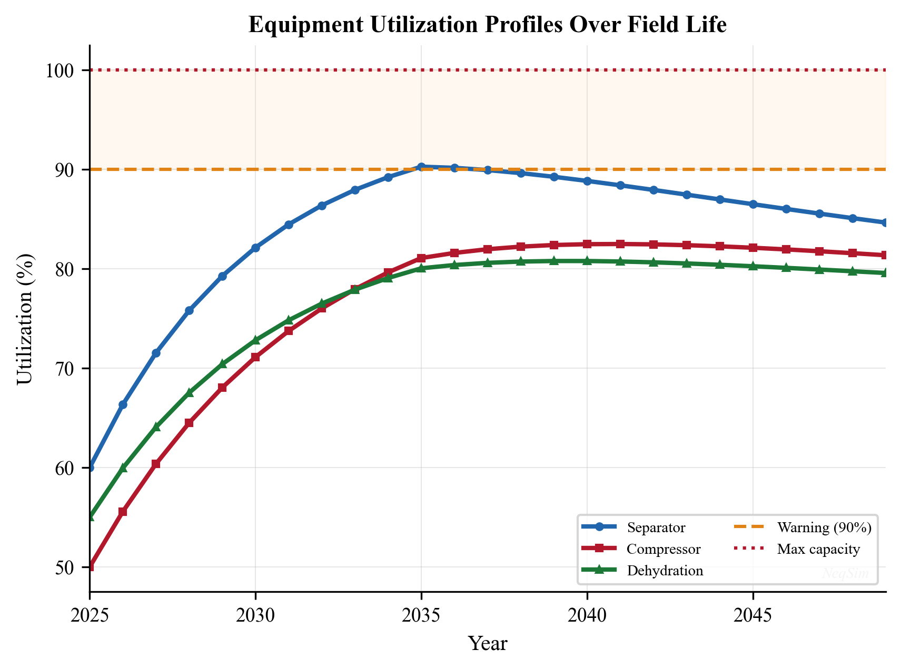
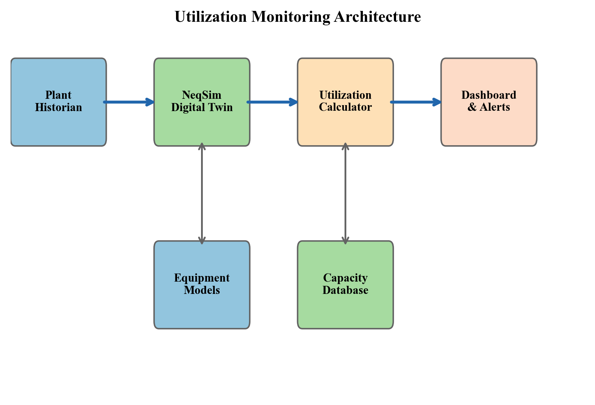
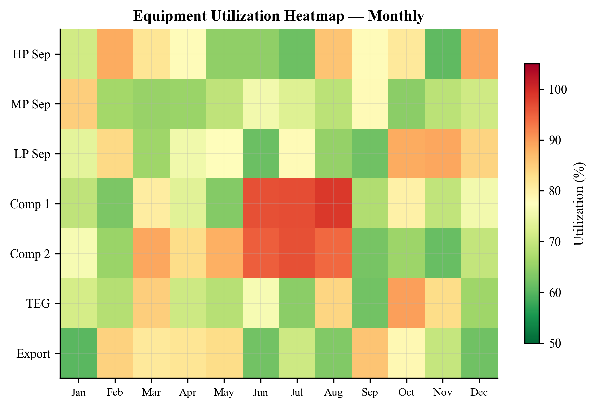
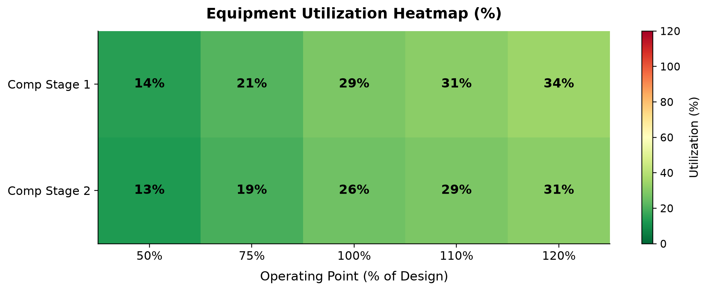
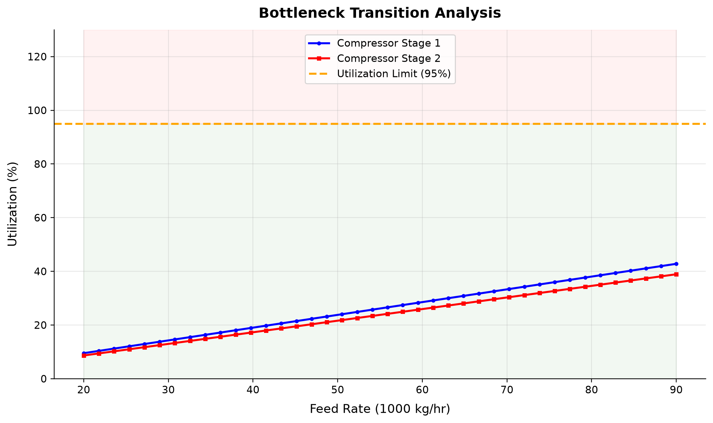

# Real-Time Utilization Monitoring

<!-- Chapter metadata -->
<!-- Notebooks: ch26_utilization_monitoring_demo.ipynb, ch26_separator_monitoring.ipynb, ch26_platform_case_study.ipynb -->
<!-- Estimated pages: 38 -->

## Learning Objectives

After reading this chapter, the reader will be able to:

1. Define equipment utilization metrics — capacity utilization ratio, approach factor, and time-averaged utilization — and explain their role in continuous production optimization
2. Describe the monitoring architecture that links field sensors, process models, and operator dashboards, including the role of plant historians (PI, IP.21) and tag mapping
3. Use the NeqSim `ProcessAutomation` API and capacity constraint framework to build a real-time utilization dashboard that classifies equipment as green, yellow, or red
4. Monitor separator performance through gas capacity utilization (K-factor), liquid retention time utilization, and foaming indicators using NeqSim process simulation
5. Track compressor operating point relative to surge and stonewall limits, and monitor power consumption, discharge temperature, and speed utilization
6. Evaluate heat exchanger degradation by tracking UA decline, fouling factor growth, and LMTD approach margin over the equipment service life

---

## 25.1 Introduction

Production optimization, as developed in Chapters 22–24, identifies the best operating point at a given instant. But facilities do not operate at a single snapshot — they evolve over months and years as reservoirs deplete, water breaks through, equipment fouls, and seasonal demand shifts. **Utilization monitoring** provides the bridge between snapshot optimization and lifecycle management by continuously tracking how close each piece of equipment operates to its design or operational limits.

A separator running at 95% of its gas handling capacity is not a problem in itself — it may be the optimal operating point. But if the trend shows utilization climbing from 80% to 95% over the past six months while the water cut rises, the operations engineer recognizes an approaching constraint that will soon limit total production. This insight — the *trajectory* of utilization, not just its current value — is what makes monitoring valuable.

The benefits of systematic utilization monitoring include:

- **Early warning of bottlenecks.** Equipment approaching its limits can be identified weeks or months before production is curtailed, allowing proactive debottlenecking or maintenance planning (Chapter 21).
- **Validation of optimization models.** Comparing model-predicted utilization against measured utilization reveals model calibration drift — a signal that the process model needs updating.
- **Regulatory compliance.** Safety-critical equipment (pressure vessels, relief valves, flare systems) has regulatory limits on operating capacity. Continuous monitoring provides an audit trail.
- **Maintenance prioritization.** Equipment with declining performance (rising utilization at constant throughput) can be prioritized for maintenance during planned shutdowns.
- **Production forecasting.** Utilization trends, combined with reservoir decline models, enable forecasting of when facility modifications will be needed.

This chapter develops the theory, architecture, and NeqSim implementation of utilization monitoring. We begin with the mathematical definitions (Section 25.2), describe the monitoring architecture (Section 25.3), and then work through equipment-specific monitoring for separators (Section 25.5), compressors (Section 25.6), heat exchangers (Section 25.7), and pipelines (Section 25.8). The chapter concludes with an integrated case study of a North Sea platform over a three-year period (Section 25.11).

### 25.1.1 Relationship to Capacity Constraints

Chapter 23 introduced the `CapacityConstrainedEquipment` interface, which endows each equipment unit with knowledge of its operating limits. Utilization monitoring *uses* this interface but serves a different purpose. The constraint engine asks "Is this equipment overloaded right now?" and returns a binary or continuous feasibility score for the optimizer. Utilization monitoring asks "How has this equipment's loading evolved over time, and where is it heading?" The constraint engine is a point-in-time query; utilization monitoring is a time-series analysis.

In NeqSim, both capabilities share the same underlying data — the `getCapacityConstraints()` map, the `getCapacityUtilization()` method, and the `getCapacityUtilizationSummary()` system-wide query. The monitoring layer adds trending, alerting, and visualization on top of these primitives.

---

## 25.2 Equipment Utilization Metrics

Before implementing monitoring, we must define precisely what we mean by "utilization." Several complementary metrics capture different aspects of equipment loading.

### 25.2.1 Capacity Utilization Ratio

The most fundamental metric is the **capacity utilization ratio** $U$, defined as the ratio of the current operating value to the maximum allowable value for a given constraint:

$$
U = \frac{X_{\text{actual}}}{X_{\text{max}}}
$$

where $X_{\text{actual}}$ is the measured or simulated operating parameter (e.g., gas velocity through a demister, compressor shaft power, heat duty) and $X_{\text{max}}$ is the corresponding design or operational limit.

A utilization ratio of $U = 0.85$ means the equipment is operating at 85% of its limiting constraint. By convention:

| Range | Color Code | Interpretation |
|-------|-----------|----------------|
| $U < 0.70$ | Green | Comfortable headroom; equipment has significant spare capacity |
| $0.70 \leq U < 0.90$ | Yellow | Approaching limit; monitor trend closely |
| $U \geq 0.90$ | Red | Near or at capacity; constraining or about to constrain production |

These thresholds are configurable — different operators may use 0.75/0.85 or 0.80/0.95 depending on their risk appetite and the consequences of exceeding the limit.

### 25.2.2 Multi-Constraint Utilization

Most equipment has multiple constraints. A separator has gas capacity (K-factor), liquid capacity (retention time), and level constraints. The **governing utilization** is the maximum across all constraints:

$$
U_{\text{governing}} = \max_{j \in \mathcal{C}} U_j
$$

where $\mathcal{C}$ is the set of active constraints for the equipment. The governing constraint determines which limit is closest to being reached.

In NeqSim, this is captured by the `getCapacityUtilization()` method on `CapacityConstrainedEquipment`, which returns the maximum utilization across all enabled constraints. The individual constraint utilizations are available through `getCapacityConstraints()`:

```python
# Small, fully specified model for the following monitoring queries.
import jpype
jneqsim = jpype.JPackage("neqsim")
fluid = jneqsim.thermo.system.SystemSrkEos(333.15, 60.0)
fluid.addComponent("methane", 0.75)
fluid.addComponent("n-heptane", 0.25)
fluid.setMixingRule("classic")
feed = jneqsim.process.equipment.stream.Stream("Well fluid", fluid)
feed.setFlowRate(50000.0, "kg/hr")
separator = jneqsim.process.equipment.separator.Separator("HP separator", feed)
process = jneqsim.process.processmodel.ProcessSystem()
process.add(feed)
process.add(separator)
process.run()
separator.autoSize(1.2)
import jpype
jneqsim = jpype.JPackage("neqsim")

# After process.run():
constrained = separator  # any CapacityConstrainedEquipment
governing_util = constrained.getMaxUtilization()
print(f"Governing utilization: {governing_util:.1%}")

# Individual constraints
for name, constraint in constrained.getCapacityConstraints().items():
    util = constraint.getUtilization()
    print(f"  {name}: {util:.1%} ({constraint.getType()})")
```

### 25.2.3 Approach Factor

The **approach factor** $\alpha$ measures how close the operating point is to the constraint boundary in absolute terms:

$$
\alpha = X_{\text{max}} - X_{\text{actual}}
$$

While the utilization ratio is dimensionless, the approach factor carries the units of the constraint variable. This is useful when the absolute margin matters more than the relative fraction. For example, 50 kW is the same absolute power margin on 500 and 5000 kW drivers, but its adequacy depends on disturbances, uncertainty and the driver response; neither the absolute nor relative margin alone establishes acceptance.

### 25.2.4 Time-Averaged Utilization

Instantaneous utilization fluctuates with process disturbances, well tests, and control system oscillations. The **time-averaged utilization** over a window $[t_0, t_0 + T]$ provides a smoother trend:

$$
\bar{U}(t_0, T) = \frac{1}{T} \int_{t_0}^{t_0 + T} U(t) \, dt
$$

For equally spaced, valid samples this integral is approximated by their arithmetic mean. For irregular historian samples use time weighting and explicitly handle gaps:

$$
\bar{U} \approx \frac{1}{N} \sum_{k=1}^{N} U(t_k)
$$

Typical averaging windows are:

| Window | Purpose |
|--------|---------|
| 1 hour | Smoothing control oscillations |
| 24 hours | Daily average for shift reports |
| 7 days | Weekly trend for operations review |
| 30 days | Monthly trend for management reporting |

### 25.2.5 Utilization Profiles Over Production Life

Over the life of a field, utilization profiles follow characteristic patterns driven by reservoir behavior:

- **Early life (plateau):** High, stable utilization near design capacity. The facility is sized for plateau production, and the optimizer pushes throughput to the design limit.
- **Mid life (decline):** Utilization decreases as reservoir pressure declines and flow rates fall. Some equipment may become oversized.
- **Late life (water/gas breakthrough):** Utilization may increase again as water or gas handling requirements grow, potentially re-constraining the facility.

Understanding these patterns is essential for planning debottlenecking interventions, brownfield modifications, and eventual decommissioning.



<!-- scientific-illustration:fig26_1_utilization_profiles.png -->
The plotted lifecycle trajectories are synthetic inputs used to explain monitoring displays. The actual rate-sweep examples calculate utilization from declared model demands and ratings.
<!-- /scientific-illustration -->

---

## 25.3 Monitoring Architecture

A utilization monitoring system connects field measurements to a process model that evaluates equipment loading against constraints. The architecture has four layers, illustrated in Figure 25.2.



### 25.3.1 Layer 1: Sensor Data Acquisition

The first layer acquires real-time measurements from field instruments:

- **Pressure transmitters (PT)** — operating pressures at key locations
- **Temperature transmitters (TT)** — fluid and equipment temperatures
- **Flow transmitters (FT)** — volumetric or mass flow rates
- **Level transmitters (LT)** — separator liquid levels
- **Analytical instruments** — composition analyzers (GC), water-in-oil, BS&W

These measurements are stored in a **plant historian** — typically OSIsoft PI, Aspen InfoPlus.21 (IP.21), or Honeywell PHD. The historian provides time-series storage with configurable compression, enabling years of data to be retained and queried efficiently.

### 25.3.2 Layer 2: Tag Mapping and Data Bridge

The second layer maps historian tags to process model variables. A **tag map** associates each historian tag (e.g., `21-PT-1234.PV`) with a NeqSim simulation variable (e.g., `HP separator.pressure`):

```python
# Tag mapping configuration
tag_map = {
    "21-PT-1234.PV": {"neqsim_address": "HP separator.pressure", "unit": "barg"},
    "21-TT-1235.PV": {"neqsim_address": "HP separator.gasOutStream.temperature", "unit": "C"},
    "21-FT-1236.PV": {"neqsim_address": "feed.flowRate", "unit": "kg/hr"},
    "21-LT-1237.PV": {"neqsim_address": "HP separator.liquidLevel", "unit": "%"},
}
```

The `ProcessAutomation` API (Chapter 23) serves as the data bridge. For each historian tag, the corresponding NeqSim variable is updated:

**Execution scope:** This integration pattern requires caller historian connection and tag mapping. It is not a standalone validated process calculation.

```python pattern: requires caller historian connection and tag mapping
ProcessAutomation = jneqsim.process.automation.ProcessAutomation

auto = ProcessAutomation(process)

# Update model inputs from historian readings
for tag, mapping in tag_map.items():
    measured_value = historian.read(tag)  # read from PI/IP.21
    auto.setVariableValue(mapping["neqsim_address"], measured_value, mapping["unit"])

# Re-run the process model with updated inputs
process.run()
```

This approach allows the NeqSim model to be driven by real plant data, creating a **digital twin** that mirrors current operating conditions.

### 25.3.3 Layer 3: Constraint Evaluation

After the model runs with updated inputs, the constraint engine evaluates all equipment utilizations:

```python
# System-wide utilization summary
utilization = {str(name): float(percent)/100.0 for name, percent in
               process.getCapacityUtilizationSummary().items()}  # native map is percent

# Equipment near capacity
near_limit = process.getEquipmentNearCapacityLimit()
```

The `getCapacityUtilizationSummary()` method returns a `Map<String, Double>` with equipment names as keys and governing utilization percentages as values (100.0 means100%). These examples explicitly divide the map values by100 to obtain fractions before applying fraction-based thresholds. The `getEquipmentNearCapacityLimit()` method returns a list of equipment names whose utilization exceeds a configurable warning threshold (default 80%).

### 25.3.4 Layer 4: Dashboard and Alerting

The final layer presents utilization data to operators and engineers through dashboards that provide:

- **Traffic-light indicators** — green/yellow/red for each equipment unit
- **Trend charts** — utilization history over hours, days, or months
- **Constraint detail** — breakdown of individual constraints for equipment in yellow or red
- **Bottleneck identification** — which equipment is currently limiting total production

The dashboard can be implemented as a web application, a process graphics overlay, or a report generated at regular intervals. Section 25.4 demonstrates a Python implementation.

### 25.3.5 Update Frequency

The appropriate update frequency depends on the dynamics of the process:

| Scenario | Update Frequency | Rationale |
|----------|-----------------|-----------|
| Steady-state monitoring | 5–15 minutes | Process model execution time; slower-than-process dynamics |
| Compressor-map advisory trending | Site-specific display interval | Does not replace dedicated fast anti-surge protection |
| Daily optimization review | Once per day | Decision-making cadence |
| Long-term planning | Once per month | Reservoir decline timescale |

For most offshore platforms, a 5–15 minute update cycle provides sufficient resolution for utilization monitoring. Faster monitoring (seconds) is handled by the DCS (Distributed Control System) and safety instrumented systems, not by the process model.

---

## 25.4 NeqSim Utilization Dashboard

This section demonstrates how to build a utilization monitoring dashboard using NeqSim's capacity constraint framework. The dashboard reads equipment utilizations, classifies them by severity, and presents a summary table.

### 25.4.1 Building the Utilization Table

```python
import jpype
jneqsim = jpype.JPackage("neqsim")
import json

SystemSrkEos = jneqsim.thermo.system.SystemSrkCPAstatoil
Stream = jneqsim.process.equipment.stream.Stream
ThreePhaseSeparator = jneqsim.process.equipment.separator.ThreePhaseSeparator
Compressor = jneqsim.process.equipment.compressor.Compressor
Cooler = jneqsim.process.equipment.heatexchanger.Cooler
ProcessSystem = jneqsim.process.processmodel.ProcessSystem

# Create a representative production fluid
fluid = SystemSrkEos(273.15 + 80.0, 70.0)
fluid.addComponent("nitrogen", 0.01)
fluid.addComponent("CO2", 0.02)
fluid.addComponent("methane", 0.70)
fluid.addComponent("ethane", 0.08)
fluid.addComponent("propane", 0.05)
fluid.addComponent("n-butane", 0.03)
fluid.addComponent("n-pentane", 0.02)
fluid.addComponent("n-hexane", 0.01)
fluid.addComponent("water", 0.08)
fluid.setMixingRule(10)
fluid.setMultiPhaseCheck(True)

# Build a simple process
feed = Stream("Well fluid", fluid)
feed.setFlowRate(150000.0, "kg/hr")

hp_sep = ThreePhaseSeparator("HP separator", feed)
gas_cooler = Cooler("Gas cooler", hp_sep.getGasOutStream())
gas_cooler.setOutTemperature(313.15)
suction_ko = jneqsim.process.equipment.separator.Separator(
    "Compressor suction KO", gas_cooler.getOutletStream())
export_comp = Compressor("Export compressor", suction_ko.getGasOutStream())
export_comp.setOutletPressure(150.0, "bara")
export_comp.setUsePolytropicCalc(True)
export_comp.setPolytropicEfficiency(0.78)

process = ProcessSystem()
process.add(feed)
process.add(hp_sep)
process.add(gas_cooler)
process.add(suction_ko)
process.add(export_comp)
process.run()

# Enable and auto-size capacity constraints
for unit in process.getUnitOperations():
    if hasattr(unit, 'autoSize'):
        unit.autoSize(1.2)
        unit.enableAllConstraints()

# No installed compressor chart is supplied: retain only the explicit power screen.
export_comp.getCompressorChart().setUseCompressorChart(False)
export_comp.setSolveSpeed(False)
for entry in export_comp.getCapacityConstraints().entrySet():
    entry.getValue().setEnabled(str(entry.getKey()) == "power")

process.run()

# Build utilization dashboard
utilization = {str(unit.getName()): float(unit.getMaxUtilization())
               for unit in process.getUnitOperations()}

print(f"{'Equipment':<25} {'Utilization':>12} {'Status':>10}")
print("-" * 50)
for name, util in utilization.items():
    if util < 0.70:
        status = "GREEN"
    elif util < 0.90:
        status = "YELLOW"
    else:
        status = "RED"
    print(f"{name:<25} {util:>11.1%} {status:>10}")
```

### 25.4.2 The Utilization Snapshot JSON API

The hand-built table above iterates the utilization summary and applies colour thresholds in Python. NeqSim now exposes the same information directly as a structured, schema-versioned snapshot through `getUtilizationSnapshotJson()`, available on both `ProcessSystem` and `ProcessModel`. The call is **side-effect-free** — it never triggers a `run()`, it only reads the utilization already computed by each unit's capacity constraints — so it is cheap enough to poll on every monitoring cycle:

```python
import json

snapshot = json.loads(str(process.getUtilizationSnapshotJson()))

print("Bottleneck:", snapshot["bottleneck"])
print("Any overloaded:", snapshot["anyOverloaded"])
print("Any hard limit exceeded:", snapshot["anyHardLimitExceeded"])

for unit in snapshot["units"]:
    print(f"{unit['name']:<25} {unit['maxUtilizationPercent']:>6.1f}%  "
          f"limited by {unit['limitingConstraint']}")
```

Each unit entry reports `name`, `type`, `maxUtilization` (dimensionless, possibly above one), `maxUtilizationPercent`, `limitingConstraint`, `feasible`, `hardLimitExceeded`, `power_kW` (for compressors and pumps), and a `constraints[]` breakdown (`name`, `utilization`, `current`, `design`, `unit`, `enabled`, `violated`). For a multi-area `ProcessModel`, every unit additionally carries its `area` label so the dashboard can group equipment by process area. At the plant level the snapshot reports the `bottleneck` (the highest-utilization unit, or `null`), `anyOverloaded`, and `anyHardLimitExceeded`.

Two convenience predicates back the snapshot for fast alarm logic without parsing the JSON:

```python
# Demonstration alert sink; route to approved monitoring infrastructure in deployment.
alerts = []
def raise_warning(message):
    alerts.append(("warning", str(message)))
def raise_alarm(message):
    alerts.append(("alarm", str(message)))
if process.isAnyHardLimitExceeded():
    raise_alarm("HARD limit exceeded — investigate immediately")
elif process.isAnyEquipmentOverloaded():
    raise_warning("Equipment above design utilization")
```

Because the snapshot is the structured, machine-readable form of the dashboard, it is also the **observation vector** for closed-loop optimization (Chapter 23): a controller reads `getUtilizationSnapshotJson()`, decides on a setpoint move, applies it through `evaluate()`, and penalizes any move that drives `anyOverloaded` true.

### 25.4.3 Detailed Constraint Breakdown

When equipment shows yellow or red status, the operator needs to see which specific constraint is driving the high utilization:

```python
# Detailed breakdown for equipment in yellow or red
for name, util in utilization.items():
    if util >= 0.70:
        unit = process.getUnit(name)
        print(f"\n--- {name} (Governing: {util:.1%}) ---")
        constraints = unit.getCapacityConstraints()
        for cname, constraint in constraints.items():
            c_util = constraint.getUtilization()
            c_type = constraint.getType()  # HARD, SOFT, or DESIGN
            print(f"  {cname}: {c_util:.1%} [{c_type}]"
                  f"  (actual={constraint.getCurrentValue():.2f},"
                  f"   max={constraint.getMaxValue():.2f})")
```

### 25.4.4 Utilization Trend Tracking

To track trends, utilization snapshots are stored with timestamps:

```python
import time
import json

# Utilization history storage
history = []

def record_utilization(process, timestamp=None):
    """Record a utilization snapshot."""
    if timestamp is None:
        timestamp = time.time()
    utilization = {str(name): float(percent)/100.0 for name, percent in
                   process.getCapacityUtilizationSummary().items()}  # native map is percent
    snapshot = {
        "timestamp": timestamp,
        "utilization": dict(utilization)
    }
    history.append(snapshot)
    return snapshot

# Record current state
snapshot = record_utilization(process)

# After accumulating history, analyze trends
def utilization_trend(history, equipment_name, window=30):
    """Calculate utilization trend (change per day) over last N snapshots."""
    values = [(h["timestamp"], h["utilization"].get(equipment_name, 0.0))
              for h in history[-window:]]
    if len(values) < 2:
        return 0.0
    dt = (values[-1][0] - values[0][0]) / 86400.0  # days
    du = values[-1][1] - values[0][1]
    return du / dt if dt > 0 else 0.0
```

This trend information answers the critical operational question: "Is utilization rising, falling, or stable — and how fast?"

---

## 25.5 Separator Utilization Monitoring

Separators are typically the first constraint encountered in oil and gas production. As flow rates change, gas-oil ratio evolves, and water cut increases, separator utilization can shift dramatically.

### 25.5.1 Gas Capacity Utilization

The gas handling capacity of a separator is governed by the **Souders-Brown equation**, which relates the maximum gas velocity to the liquid dropout requirement:

$$
v_{\text{max}} = K_s \sqrt{\frac{\rho_L - \rho_G}{\rho_G}}
$$

where $K_s$ is the Souders-Brown (K-factor) constant (typically 0.05–0.15 m/s depending on separator internals), $\rho_L$ is the liquid density, and $\rho_G$ is the gas density.

The gas capacity utilization is:

$$
U_{\text{gas}} = \frac{v_{\text{actual}}}{v_{\text{max}}} = \frac{Q_g / A}{K_s \sqrt{(\rho_L - \rho_G)/\rho_G}}
$$

where $Q_g$ is the actual gas volumetric flow rate and $A$ is the separator cross-sectional area available for gas flow.

In NeqSim, the separator's gas load factor constraint automatically tracks this:

```python
ThreePhaseSeparator = jneqsim.process.equipment.separator.ThreePhaseSeparator

# After process.run() with constraints enabled:
sep = process.getUnit("HP separator")
gas_constraint = sep.getCapacityConstraints().get("gasLoadFactor")
gas_util = gas_constraint.getCurrentValue() / gas_constraint.getMaxValue()
print(f"Gas capacity utilization: {gas_util:.1%}")
```

### 25.5.2 Liquid Capacity Utilization

The liquid handling capacity is governed by the **retention time** — the average time liquid spends in the separator. Adequate retention allows gas bubbles to separate from the liquid phase:

$$
\tau = \frac{V_L}{Q_L}
$$

where $V_L$ is the liquid volume in the separator and $Q_L$ is the liquid volumetric outflow rate. The utilization is the ratio of minimum required retention time to actual retention time:

$$
U_{\text{liquid}} = \frac{\tau_{\text{min}}}{\tau_{\text{actual}}}
$$

A utilization above 1.0 means the retention time is insufficient — liquid is leaving the separator before gas has fully separated, leading to gas carry-under.

### 25.5.3 Level Monitoring and Foaming Detection

Separator level is controlled by the liquid outlet valve, but the level transmitter signal also provides diagnostic information:

- **High level variability** (rapid oscillations) may indicate foaming, which effectively reduces separator capacity by occupying volume with foam rather than clear liquid.
- **Persistent high level** may indicate insufficient liquid outlet capacity or downstream restriction.
- **Rapid level changes** after well interventions provide information about the effectiveness of slug catchers.

The NeqSim separator model tracks liquid volume and level. When combined with the historian reading of the actual level transmitter, discrepancies between modeled and measured level can indicate foaming or instrumentation issues.

### 25.5.4 Separator Monitoring Example

```python
# Complete separator monitoring example
import jpype
jneqsim = jpype.JPackage("neqsim")

SystemSrkEos = jneqsim.thermo.system.SystemSrkCPAstatoil
Stream = jneqsim.process.equipment.stream.Stream
ThreePhaseSeparator = jneqsim.process.equipment.separator.ThreePhaseSeparator
ProcessSystem = jneqsim.process.processmodel.ProcessSystem

fluid = SystemSrkEos(273.15 + 75.0, 65.0)
fluid.addComponent("methane", 0.60)
fluid.addComponent("ethane", 0.05)
fluid.addComponent("propane", 0.03)
fluid.addComponent("n-hexane", 0.05)
fluid.addComponent("n-octane", 0.07)
fluid.addComponent("water", 0.20)
fluid.setMixingRule(10)
fluid.setMultiPhaseCheck(True)

feed = Stream("Well fluid", fluid)
feed.setFlowRate(200000.0, "kg/hr")

sep = ThreePhaseSeparator("HP separator", feed)

process = ProcessSystem()
process.add(feed)
process.add(sep)
process.run()

# Enable constraints and auto-size
sep.autoSize()
sep.enableConstraints()
process.run()

# Monitor utilization
util = sep.getMaxUtilization()
constraints = sep.getCapacityConstraints()

print(f"HP Separator - Governing utilization: {util:.1%}")
for cname, c in constraints.items():
    current = c.getCurrentValue()
    maximum = c.getMaxValue()
    c_util = current / maximum if maximum > 0 else 0.0
    print(f"  {cname}: {c_util:.1%} (current={current:.3f}, max={maximum:.3f})")
```

---

## 25.6 Compressor Utilization Monitoring

Compressors are often the most expensive and operationally critical equipment on a production platform. Their utilization monitoring is correspondingly complex, involving multiple interacting constraints.

### 25.6.1 Operating Point on the Compressor Map

The compressor operating point is defined by the inlet volumetric flow $Q_s$ (or actual volume flow at suction conditions) and the polytropic head $H_p$. The compressor performance map defines the envelope within which the compressor can operate, bounded by:

- **Surge line** — the minimum stable flow at each speed. Operating below this line causes flow reversal and mechanical damage.
- **Stonewall (choke) line** — the maximum flow at each speed, limited by sonic velocity in the impeller passages.
- **Maximum speed** — the mechanical or driver-imposed speed limit.
- **Minimum speed** — the minimum controllable speed.

The distance from the operating point to the surge line is the **surge margin**:

$$
\text{SM} = \frac{Q_{\text{actual}} - Q_{\text{surge}}}{Q_{\text{surge}}} \times 100\%
$$

A typical minimum surge margin is 10–15%, maintained by the anti-surge controller. The utilization in terms of proximity to surge is:

$$
U_{\text{surge}} = \frac{\text{SM}_{\text{min}}}{\text{SM}}\quad (\text{SM}>0)
$$

At the minimum positive margin this ratio is one. Treat zero/negative margin as a violation rather than evaluating a negative utilization; a missing map is unavailable evidence. This is an explicit engineering ratio, not a promise that every NeqSim constraint supplier uses the same normalization.

### 25.6.2 Power Utilization

The shaft power consumption relative to the driver rating provides another utilization metric:

$$
U_{\text{power}} = \frac{W_{\text{actual}}}{W_{\text{rated}}}
$$

where $W_{\text{actual}}$ is the actual shaft power and $W_{\text{rated}}$ is the driver rated power. For gas turbine drivers, the rated power depends on ambient temperature, so the utilization must account for seasonal and diurnal temperature variations.

### 25.6.3 Discharge Temperature Utilization

The compressor discharge temperature must remain below the metallurgical limit of the casing and downstream piping:

$$
U_{T_{\text{discharge}}} = \frac{T_{\text{discharge}} - T_{\text{ambient}}}{T_{\text{max}} - T_{\text{ambient}}}
$$

High discharge temperature utilization may indicate excessive compression ratio or degraded intercooler performance.

### 25.6.4 Speed Utilization

$$
U_{\text{speed}} = \frac{N_{\text{actual}}}{N_{\text{max}}}
$$

where $N_{\text{actual}}$ is the current shaft speed and $N_{\text{max}}$ is the maximum allowable speed. Speed utilization approaching 100% means the compressor has no further capacity to increase head by speeding up.

### 25.6.5 Compressor Monitoring Example

```python
import jpype
jneqsim = jpype.JPackage("neqsim")

Compressor = jneqsim.process.equipment.compressor.Compressor

# After process.run() with compressor in the system:
comp = export_comp

# Access compressor-specific utilization metrics
constraints = comp.getCapacityConstraints()
governing_util = comp.getMaxUtilization()

print(f"Export Compressor - Governing utilization: {governing_util:.1%}")
print()

# Detailed constraint breakdown
constraint_names = ["surge", "power", "speed", "dischargeTemperature"]
for cname in constraint_names:
    c = constraints.get(cname)
    if c is not None:
        current = c.getCurrentValue()
        maximum = c.getMaxValue()
        c_util = current / maximum if maximum > 0 else 0.0
        print(f"  {cname}: {c_util:.1%}")

# Operating point relative to map
power_kW = comp.getPower() / 1000.0  # W to kW
pressure_ratio = comp.getOutletStream().getPressure("bara") / comp.getInletStream().getPressure("bara")
print(f"\n  Power: {power_kW:.0f} kW")
print(f"  Pressure ratio: {pressure_ratio:.2f}")
```

### 25.6.6 Trend Analysis for Compressor Degradation

Compressor performance degrades over time due to fouling, erosion, and seal wear. This manifests as:

- **Decreasing polytropic efficiency** at the same operating point
- **Increasing power consumption** for the same duty
- **Shift of the surge line** to higher flows (reduced operating envelope)

By tracking these trends, the monitoring system can detect degradation before it triggers a trip or forced shutdown. Correct for gas properties, speed and operating point before attributing efficiency changes to degradation. Maintenance thresholds require uncertainty, vendor guidance and a cost/availability assessment.

---

## 25.7 Heat Exchanger Utilization Monitoring

Heat exchangers degrade gradually through fouling — the accumulation of deposits on heat transfer surfaces. Monitoring this degradation allows operators to schedule cleaning before performance becomes unacceptable.

### 25.7.1 UA Degradation Tracking

The overall heat transfer coefficient $U$ multiplied by the heat transfer area $A$ gives the UA value, which characterizes the thermal performance of the exchanger:

$$
Q = UA \cdot \Delta T_{\text{LMTD}}
$$

where $Q$ is the heat duty and $\Delta T_{\text{LMTD}}$ is the log-mean temperature difference:

$$
\Delta T_{\text{LMTD}} = \frac{\Delta T_1 - \Delta T_2}{\ln(\Delta T_1 / \Delta T_2)}
$$

As fouling progresses, $UA$ decreases because the fouling layer adds thermal resistance:

$$
\frac{1}{UA_{\text{fouled}}} = \frac{1}{UA_{\text{clean}}} + \frac{R_f}{A}
$$

where $R_f$ is the fouling resistance (m² K/W). The **UA utilization** tracks how much of the original heat transfer capability remains:

$$
U_{UA} = \frac{UA_{\text{clean}} - UA_{\text{actual}}}{UA_{\text{clean}} - UA_{\text{min}}}
$$

where $UA_{\text{min}}$ is the minimum acceptable UA that still meets process requirements. When $U_{UA} = 1.0$, the exchanger can no longer meet its duty specification and must be cleaned or replaced.

### 25.7.2 Fouling Factor Tracking

The fouling factor $R_f$ can be back-calculated from measured inlet and outlet temperatures:

$$
R_f = A \left(\frac{1}{UA_{\text{actual}}} - \frac{1}{UA_{\text{clean}}}\right)
$$

Back-calculated $R_f$ is an apparent resistance relative to the clean baseline. Changes in flow, properties, bypass, heat loss and sensor bias can imitate fouling; normalize or model these effects before estimating a growth rate.

### 25.7.3 Duty Utilization

The duty utilization compares actual heat transfer to design capacity:

$$
U_{\text{duty}} = \frac{Q_{\text{actual}}}{Q_{\text{design}}}
$$

If $U_{\text{duty}}$ is falling while the process requires higher duty, this indicates that fouling is limiting heat exchanger performance. Conversely, if $U_{\text{duty}}$ is low because process duty requirements have decreased (e.g., due to production decline), the exchanger has spare capacity that could accommodate future increases.

### 25.7.4 Heat Exchanger Monitoring Example

```python
import jpype
jneqsim = jpype.JPackage("neqsim")

# After process.run() with heat exchanger in the system:
hx = gas_cooler

# Access heat exchanger utilization
hx_util = hx.getMaxUtilization()
print(f"Gas Cooler - Governing utilization: {hx_util:.1%}")

# Detailed thermal performance
constraints = hx.getCapacityConstraints()
for cname, c in constraints.items():
    current = c.getCurrentValue()
    maximum = c.getMaxValue()
    c_util = current / maximum if maximum > 0 else 0.0
    print(f"  {cname}: {c_util:.1%}")

# Duty and UA monitoring
duty = hx.getDuty()  # W
print(f"\n  Heat duty: {duty / 1e6:.2f} MW")
```

### 25.7.5 Cleaning Decision Support

The monitoring system can recommend cleaning intervals by projecting the fouling trend forward:

1. Fit a linear or asymptotic model to the fouling factor history: $R_f(t) = R_{f,0} + k_f \cdot t$
2. Project forward to find when $R_f$ will reach the maximum acceptable value
3. Schedule cleaning before the projected exceedance date, accounting for shutdown planning lead time

This approach converts reactive maintenance (cleaning when performance is already unacceptable) into predictive maintenance (cleaning before the impact is felt).

---

## 25.8 Pipeline and Export System Monitoring

Pipelines and export systems have their own utilization metrics related to pressure drop, flow velocity, and temperature.

### 25.8.1 Pressure Drop Utilization

The available pressure drop in a pipeline is the difference between the inlet pressure and the minimum acceptable outlet pressure:

$$
U_{\Delta P} = \frac{\Delta P_{\text{actual}}}{\Delta P_{\text{available}}}
$$

where $\Delta P_{\text{available}} = P_{\text{inlet}} - P_{\text{min,outlet}}$. When pressure drop utilization reaches 100%, the pipeline cannot deliver the required flow rate at the minimum outlet pressure, and production must be reduced.

### 25.8.2 Erosional Velocity Monitoring

Multiphase pipelines have an erosional velocity limit, typically calculated using the API RP 14E formula:

$$
v_e = \frac{C}{\sqrt{\rho_m}}
$$

where $C$ is an empirical constant (typically 100–150 for continuous service in imperial units, or equivalent in SI) and $\rho_m$ is the mixture density. The velocity utilization is:

$$
U_v = \frac{v_{\text{actual}}}{v_e}
$$

The API velocity criterion is an empirical screen, not a prediction of wall-loss rate or proof of protection. Sand size/loading, impact geometry, corrosion and material response require a separate erosion assessment.

### 25.8.3 Arrival Temperature Monitoring

For subsea pipelines, the fluid arrival temperature at the receiving facility must remain above critical thresholds:

- **Wax appearance temperature (WAT):** Below this temperature, wax crystals form and may deposit on pipe walls.
- **Hydrate equilibrium temperature:** Below this temperature (at the pipeline pressure), hydrate formation is thermodynamically favorable.

The temperature margin utilization is:

$$
U_T = \frac{T_{\text{critical}} - T_{\text{ambient}}}{T_{\text{arrival}} - T_{\text{ambient}}}
$$

where $T_{\text{arrival}}$ is the actual fluid arrival temperature and $T_{\text{critical}}$ is the WAT or hydrate temperature. As production declines and flow rates decrease, the fluid spends more time in the pipeline and arrives cooler, increasing $U_T$.

### 25.8.4 Pipeline Monitoring with NeqSim

```python
import jpype
jneqsim = jpype.JPackage("neqsim")

PipeBeggsAndBrills = jneqsim.process.equipment.pipeline.PipeBeggsAndBrills
ThermodynamicOperations = jneqsim.thermodynamicoperations.ThermodynamicOperations

# After running a pipeline simulation:
pipe = PipeBeggsAndBrills("Export pipeline", export_comp.getOutletStream())
pipe.setLength(10000.0)  # m
pipe.setDiameter(0.5)   # m
pipe.setNumberOfIncrements(10)
pipe.run()

# Pressure drop utilization
inlet_P = pipe.getInletStream().getPressure("bara")   # bara
outlet_P = pipe.getOutletStream().getPressure("bara") # bara
delta_P = inlet_P - outlet_P
delta_P_available = inlet_P - 30.0  # minimum outlet pressure = 30 bara
U_dP = delta_P / delta_P_available
print(f"Pressure drop utilization: {U_dP:.1%}")

# Flow velocity at outlet
outlet_stream = pipe.getOutletStream()
outlet_stream.getFluid().initProperties()
velocity = pipe.getOutletStream().getFlowRate("m3/sec") / (3.141592653589793 * 0.5**2 / 4)  # m/s

# Erosional velocity (simplified)
rho_m = outlet_stream.getFluid().getDensity("kg/m3")
C_erosion = 122.0  # API RP 14E constant (SI-adjusted)
v_erosional = C_erosion / (rho_m ** 0.5)
U_v = velocity / v_erosional
print(f"Velocity utilization: {U_v:.1%} (v={velocity:.1f} m/s, v_e={v_erosional:.1f} m/s)")
```

---

## 25.9 Integrated Facility Utilization

Individual equipment utilizations combine to give a picture of the whole facility's capacity and bottleneck structure. This section describes how to build an integrated view.

### 25.9.1 Whole-Plant Utilization Summary

The `getCapacityUtilizationSummary()` method on `ProcessSystem` provides a single-call summary of all equipment utilizations:

```python
utilization = {str(name): float(percent)/100.0 for name, percent in
               process.getCapacityUtilizationSummary().items()}  # native map is percent

# Find the bottleneck
bottleneck_name = max(utilization, key=utilization.get)
bottleneck_util = utilization[bottleneck_name]
print(f"Bottleneck: {bottleneck_name} at {bottleneck_util:.1%}")

# Count equipment by status
green = sum(1 for u in utilization.values() if u < 0.70)
yellow = sum(1 for u in utilization.values() if 0.70 <= u < 0.90)
red = sum(1 for u in utilization.values() if u >= 0.90)
print(f"Status: {green} green, {yellow} yellow, {red} red")
```

### 25.9.2 Bottleneck Migration

A key insight from utilization monitoring is that **bottlenecks migrate** over the field life. In early life, the gas handling equipment (separator gas capacity, compressor) is typically the bottleneck because the field is on plateau and gas production is at its maximum. As water breaks through, the bottleneck may shift to water handling equipment (produced water treatment, water injection). As the field declines further, no equipment may be near its limit — the facility becomes oversized.

Tracking bottleneck migration helps answer strategic questions:

- When will the next debottlenecking intervention be needed?
- Which equipment should be targeted for debottlenecking?
- Is a phased development (installing equipment in stages) justified?

### 25.9.3 Seasonal and Diurnal Variation

Facility utilization varies with ambient conditions:

- **Gas turbine power** decreases in summer (higher ambient temperature reduces air density and turbine efficiency). If the gas turbine drives the export compressor, compression capacity drops in summer.
- **Air cooler duty** decreases in summer (higher ambient temperature reduces the temperature driving force).
- **Pipeline capacity** may vary with seawater temperature (affecting heat loss and arrival temperature).

Monitoring utilization over a full annual cycle reveals seasonal bottlenecks that might not be apparent in a single-snapshot optimization.

### 25.9.4 Production Decline Effects

As reservoir pressure declines, several effects compound:

- **Lower wellhead pressure** reduces the pressure available for separation and compression, requiring higher compression ratios.
- **Increasing gas-oil ratio (GOR)** increases gas volumes relative to oil volumes.
- **Increasing water cut** increases the water handling load.

These trends are scenario-dependent; pressure support, reservoir architecture and well interventions can change their direction. Utilization monitoring makes them visible in quantitative terms, supporting proactive facility management.



<!-- scientific-illustration:fig26_3_utilization_heatmap.png -->
The colors show an assigned example matrix, including overloads. No historian records or observed seasonal facility behavior are represented.
<!-- /scientific-illustration -->

---

## 25.10 Alerting and Decision Support

Raw utilization data becomes actionable through an alerting and decision support layer that interprets the data and recommends responses.

### 25.10.1 Alarm Thresholds

Utilization alarms are configured with three levels:

| Level | Threshold | Action |
|-------|-----------|--------|
| **Advisory** | $U > 0.75$ | Log for trending; no immediate action required |
| **Warning** | $U > 0.85$ | Notify operations engineer; review optimization settings |
| **Critical** | $U > 0.95$ | Notify shift supervisor; consider production curtailment |

These thresholds are equipment-specific and constraint-specific. A hard constraint (e.g., relief valve set pressure) may have a lower critical threshold than a soft constraint (e.g., demister efficiency target).

### 25.10.2 Constraint Violation Alerts

When a constraint is actually violated ($U > 1.0$), the monitoring system generates a **constraint violation alert** that includes:

- The equipment name and constraint name
- The current value and maximum allowable value
- The estimated production impact (how much must flow rate be reduced to bring the constraint back within limits)
- Recommended corrective actions

### 25.10.3 Recommended Actions

The decision support system maps constraint states to recommended actions:

```python
def recommend_actions(equipment_name, constraints):
    """Generate recommended actions based on constraint utilization."""
    actions = []
    for cname, c in constraints.items():
        util = c.getCurrentValue() / c.getMaxValue() if c.getMaxValue() > 0 else 0.0
        if util > 0.95:
            if cname == "gasLoadFactor":
                actions.append(
                    f"CRITICAL: {equipment_name} gas capacity at {util:.0%}. "
                    "Consider: (1) reduce inlet flow, (2) increase separator pressure, "
                    "(3) check demister for fouling."
                )
            elif cname == "surge":
                actions.append(
                    f"CRITICAL: {equipment_name} surge margin low ({util:.0%}). "
                    "Consider: (1) open anti-surge valve, (2) increase suction pressure, "
                    "(3) reduce compression ratio."
                )
            elif cname == "power":
                actions.append(
                    f"CRITICAL: {equipment_name} power at {util:.0%} of rated. "
                    "Consider: (1) reduce throughput, (2) check intercooler performance, "
                    "(3) split duty across parallel trains."
                )
        elif util > 0.85:
            actions.append(
                f"WARNING: {equipment_name}.{cname} at {util:.0%}. "
                "Monitor trend and prepare contingency."
            )
    return actions
```

### 25.10.4 Integration with Control Systems

In advanced implementations, the utilization monitoring system can feed back into the control system:

- **Constraint-aware setpoint management:** Automatically adjust separator pressure or compressor speed setpoints to keep all equipment within utilization limits.
- **Production curtailment:** Automatically reduce the total production rate when a critical constraint is violated, rather than waiting for operator intervention.
- **Optimizer-in-the-loop:** Run the `ProductionOptimizer` (Chapter 23) periodically and push the optimized setpoints to the DCS.

These integrations move from monitoring (observing) to closed-loop optimization (acting), which is the subject of Chapter 30 on digital twins and automation.

---

## 25.11 Case Study: Utilization Monitoring on a North Sea Platform

This section is an assumed three-year planning scenario, not a field dataset or output from the reduced compression example. The utilization tables illustrate interpretation only; the reproduced calculations later in the chapter have their own explicit inputs and do not validate these scenario values.

### 25.11.1 Platform Description

The platform processes fluid from six subsea wells through:

- **Inlet separation:** Three-phase HP separator (design: 200,000 kg/hr total fluid, 80 bara)
- **Gas compression:** Two-stage export compression with intercooling (rated: 15 MW total)
- **Oil processing:** LP separator, oil cooler, export pump
- **Water treatment:** Hydrocyclones, degasser, water injection pump
- **Export:** Gas pipeline (180 bara delivery) and oil pipeline (30 bara delivery)

At commissioning (Year 0), the platform produces 30,000 bbl/d of oil with 5% water cut and 150 Sm³/Sm³ gas-oil ratio.

### 25.11.2 Year 1: Plateau Production

During the first year, the facility operates near its design point:

| Equipment | Utilization | Status | Notes |
|-----------|-------------|--------|-------|
| HP separator (gas) | 82% | Yellow | Designed to be near limit at plateau |
| HP separator (liquid) | 65% | Green | Liquid capacity oversized for early life |
| Export compressor Stage 1 | 88% | Yellow | Power-limited at summer ambient temperatures |
| Export compressor Stage 2 | 79% | Yellow | Speed approaching maximum |
| Gas cooler | 71% | Yellow | Summer duty marginally adequate |
| Water treatment | 15% | Green | Low water cut; largely idle |

The bottleneck in Year 1 is the export compressor, particularly Stage 1 during summer months when gas turbine power derate reduces available driver power. The monitoring system flags this as a seasonal constraint.

**Recommended action:** Schedule gas turbine inlet filter maintenance before summer to maximize available power.

### 25.11.3 Year 2: Early Decline and Water Breakthrough

By Year 2, reservoir pressure has declined and water cut has risen to 25%:

| Equipment | Utilization | Change from Year 1 (percentage points) | Notes |
|-----------|-------------|---------------------|-------|
| HP separator (gas) | 74% | −8% | Lower flow rate due to decline |
| HP separator (liquid) | 78% | +13% | Rising water cut increases liquid load |
| Export compressor Stage 1 | 82% | −6% | Lower gas volume |
| Export compressor Stage 2 | 91% | +12% | Higher compression ratio due to lower wellhead pressure |
| Gas cooler | 65% | −6% | Lower gas flow |
| Water treatment | 55% | +40% | Water production increasing rapidly |

The bottleneck has migrated from compressor Stage 1 (power-limited) to compressor Stage 2 (approaching maximum speed). Water treatment is still green under the stated 70% threshold, but its upward trend warrants review.

**Recommended actions:**
1. Evaluate compressor Stage 2 speed increase (if gearbox allows)
2. Plan for water treatment capacity expansion
3. Consider wellhead compression to lower the upstream backpressure seen by the well while meeting downstream delivery pressure

### 25.11.4 Year 3: Mature Production

By Year 3, water cut has reached 50% and gas production has declined by 30%:

| Equipment | Utilization | Change from Year 2 (percentage points) | Notes |
|-----------|-------------|---------------------|-------|
| HP separator (gas) | 58% | −16% | Significant spare gas capacity |
| HP separator (liquid) | 92% | +14% | **RED** — liquid handling now limiting |
| Export compressor Stage 1 | 68% | −14% | Compressors underloaded |
| Export compressor Stage 2 | 85% | −6% | Approaching surge at reduced flow |
| Gas cooler | 48% | −17% | Greatly oversized |
| Water treatment | 89% | +34% | **Approaching capacity** |

The facility profile has transformed. The original gas-handling bottleneck has become spare capacity. The new bottleneck is liquid handling in the HP separator and water treatment. Stage 2 compressor is approaching its surge limit at the reduced flow — a different failure mode from the high-speed concern in Year 2.

**Recommended actions:**
1. Evaluate separator internals upgrade (coalescence plates, weir modification) to increase liquid handling
2. Install additional water treatment capacity (modular hydrocyclone package)
3. Implement compressor recycle optimization to maintain minimum flow above surge

### 25.11.5 Implementing the Monitoring System

The monitoring system for this platform is implemented as a Python script that runs every 15 minutes, reading historian data, updating the NeqSim process model, and generating the utilization dashboard:

```python
import jpype
jneqsim = jpype.JPackage("neqsim")
import json
import time

ProcessAutomation = jneqsim.process.automation.ProcessAutomation
ProcessSystem = jneqsim.process.processmodel.ProcessSystem

# Reuse the declared illustrative process; this example has no field calibration.
auto = ProcessAutomation(process)

# Define the tag map (historian tag -> NeqSim variable)
tag_map = {
    "21-FT-1001.PV": ("feed.flowRate", "kg/hr"),
    "21-PT-1001.PV": ("HP separator.pressure", "barg"),
    "21-TT-1001.PV": ("HP separator.gasOutStream.temperature", "C"),
    "21-LT-1001.PV": ("HP separator.liquidLevel", "%"),
    "21-PT-2001.PV": ("Export compressor.outletPressure", "barg"),
    "21-FT-3001.PV": ("Water treatment.feedRate", "m3/hr"),
}

def monitoring_cycle(process, auto, tag_map, timestamp):
    """Execute one monitoring cycle."""
    # Step 1: Read historian data and update model
    for tag, (address, unit) in tag_map.items():
        # In production: value = historian.read(tag)
        # For demonstration, use current model values
        pass

    # Step 2: Run the process model
    process.run()

    # Step 3: Collect utilization data
    utilization = {str(name): float(percent)/100.0 for name, percent in
                   process.getCapacityUtilizationSummary().items()}  # native map is percent
    near_limit = process.getEquipmentNearCapacityLimit()

    # Step 4: Generate dashboard record
    record = {
        "timestamp": timestamp,
        "utilization": {},
        "alerts": [],
        "bottleneck": None,
    }

    max_util = 0.0
    for name, util in utilization.items():
        status = "GREEN" if util < 0.70 else ("YELLOW" if util < 0.90 else "RED")
        record["utilization"][name] = {
            "value": round(util, 3),
            "status": status,
        }
        if util > max_util:
            max_util = util
            record["bottleneck"] = name

        # Generate alerts
        if util > 0.95:
            record["alerts"].append({
                "level": "CRITICAL",
                "equipment": name,
                "utilization": round(util, 3),
                "message": f"{name} at {util:.0%} capacity - consider production curtailment",
            })
        elif util > 0.85:
            record["alerts"].append({
                "level": "WARNING",
                "equipment": name,
                "utilization": round(util, 3),
                "message": f"{name} approaching capacity limit at {util:.0%}",
            })

    return record

# Execute a monitoring cycle
record = monitoring_cycle(process, auto, tag_map, time.time())
print(json.dumps(record, indent=2))
```

The monitoring data is stored in a time-series database and displayed on operator dashboards that show both current status and historical trends. The dashboard includes:

- **Overview panel:** Traffic-light summary of all equipment with the current bottleneck highlighted
- **Trend panel:** 24-hour and 30-day utilization trends for selected equipment
- **Alert panel:** Active alerts sorted by severity, with recommended actions
- **Detail panel:** Individual constraint breakdown for any selected equipment unit

### 25.11.6 Lessons from the Case Study

This three-year evolution illustrates several important principles:

1. **Bottlenecks migrate.** The constraining equipment changes as reservoir conditions evolve. A monitoring system that only watches the original bottleneck will miss the emerging ones.
2. **Seasonal effects interact with decline.** The summer power derate that was critical in Year 1 becomes irrelevant in Year 3 as the compressor is underloaded.
3. **Equipment can be simultaneously over- and under-utilized.** In Year 3, the compressor is under-utilized in power but approaching surge (a low-flow constraint). These are different constraint types on the same equipment.
4. **Trend direction matters more than current value.** The water treatment system at 55% in Year 2 is more concerning than the gas cooler at 71% because the water treatment is trending up sharply.
5. **Proactive intervention saves production.** Identifying the liquid handling bottleneck in Year 2 (when utilization was 78%) provides 12–18 months of lead time for debottlenecking planning, compared to discovering it in Year 3 when production is already curtailed.

### 25.11.7 Economic Impact

The economic value of utilization monitoring can be quantified by comparing proactive and reactive management scenarios:

- **Reactive scenario:** Bottleneck discovered in Year 3 when production is already curtailed. Emergency debottlenecking takes 6 months to plan and execute, during which 2,000 bbl/d of oil production is deferred. At $70/bbl, the deferred gross revenue is $25.5M before considering subsequent recovery.
- **Proactive scenario:** Monitoring identifies the emerging bottleneck in Year 2. Debottlenecking is planned during normal operations and executed during a scheduled maintenance shutdown. No production deferment.

The 25.5 million USD figure is the undiscounted value of 182.5 days × 2,000 bbl/day × 70 USD/bbl under the assumed scenario. Deferred production is not necessarily permanently lost: value recovery timing, discounting and any lost reserves explicitly. No implementation costs, net present value or payback period have been measured here.

---


<!-- September 2026 source update -->
## A dashboard must display missing evidence

Extend the familiar green/yellow/red capacity display with an explicit unavailable state. A sensor dropout, stale calculation identity, unverified installed rating or absent compressor-map envelope must not be rendered as zero utilization. `UtilizationCoverageReport` retains missing expected constraints even when discovery finds no supplier, while strict plant snapshots distinguish incomplete evidence from a finite limit violation \cite{neqsim2026update}.

The operating dashboard should display the current value, limit, unit/basis, signed margin, source, age and coverage status. Only current, applicable evidence can receive a numerical utilization colour. Disabled restrictions should remain visible with their reason. Do not use a single aggregate percentage to imply that hydraulic, thermal, mechanical, quality and availability restrictions have all been checked.

For common-shaft compression, present casing map margins together with shared torque/power and the declared participant list. For pipelines, show the controlling profile location and receiving pressure rather than inlet velocity alone. For separators, expose phase-availability and retained geometry assumptions. These additions turn a dashboard from a ranked list into a reproducible basis for action.

---


<!-- reviewed-notebook-results:start -->
## Reproduced Calculation Results

These examples use the stated fluid recipes and operating assumptions. Curves represent NeqSim calculations unless a caption identifies an analytical illustration, assumed equipment map or synthetic data.



Across the five operating fractions and two compressor stages, power utilization spans 13.0–34.2 percent of the assumed 3500 and 4000 kW stage ratings.

Each heatmap cell divides simulated stage power by its stated assumed power rating. The color comparison identifies the more heavily loaded stage, even when both remain below their limits. Retain the absolute duties and ratings with the percentages so the available headroom can be checked.



Compressor Stage 1: utilization spans 9.511–42.8 % across the plotted cases. Compressor Stage 2: utilization spans 8.646–38.91 % across the plotted cases.

For this fixed-composition, fixed-pressure case, both compression duties scale nearly linearly with throughput. Stage 1 remains the more highly utilized stage over the plotted range; this particular sweep does not demonstrate a bottleneck switch. Add composition or equipment-state changes if the purpose is to test migration of the limiting unit.

Selected numerical ranges from the plotted cases:

| Quantity / series | Minimum | Maximum | Unit |
|---|---:|---:|---|
| Compressor Stage 1: utilization | 9.511 | 42.8 | % |

Ranges describe the sampled cases; they are not independent validation tolerances.
<!-- reviewed-notebook-results:end -->

## 25.12 Summary

This chapter has developed the theory and practice of real-time utilization monitoring for oil and gas production facilities. The key concepts are:

- **Utilization metrics** — capacity utilization ratio, approach factor, time-averaged utilization, and their multi-constraint extensions — provide a quantitative language for describing equipment loading.
- **The monitoring architecture** connects field sensors to a process model (the digital twin) through tag mapping and the `ProcessAutomation` API, enabling continuous evaluation of equipment constraints.
- **NeqSim's capacity constraint framework** provides the computational foundation through `getCapacityUtilizationSummary()`, `getEquipmentNearCapacityLimit()`, and per-equipment `getCapacityConstraints()`.
- **Equipment-specific monitoring** for separators (K-factor, retention time), compressors (surge margin, power, speed), heat exchangers (UA degradation, fouling), and pipelines (pressure drop, erosional velocity, arrival temperature) captures the physics of each equipment type.
- **Integrated facility monitoring** reveals bottleneck migration, seasonal variation, and production decline effects that are invisible in single-equipment or single-snapshot analysis.
- **Alerting and decision support** transform monitoring data into actionable recommendations, closing the loop between observation and intervention.

The case study demonstrated that utilization monitoring is not a luxury — it is an essential tool for managing the evolving constraint landscape of a production facility over its multi-decade life.

---

## Exercises

**Exercise 25.1.** A three-phase separator has the following design specifications: gas capacity $K_s = 0.107$ m/s, liquid retention time $\tau_{\text{min}} = 120$ s, vessel diameter 3.0 m, vessel length 10.0 m. The current operating conditions are: gas rate 50,000 Sm³/hr, liquid rate 800 m³/hr, gas density 45 kg/m³, liquid density 750 kg/m³. Assume horizontal half-full geometry and standard gas density 0.80 kg/Sm³. Convert gas standard volume to mass and then actual volume before calculating $U_{\text{gas}}$ and $U_{\text{liquid}}$. Which constraint is governing?

**Exercise 25.2.** A centrifugal compressor has the following rated conditions: power 12 MW, maximum speed 11,000 rpm, minimum surge flow 8,000 m³/hr (at suction conditions). The current operating point is: power 10.5 MW, speed 10,200 rpm, actual inlet flow 9,500 m³/hr. Calculate the power utilization, speed utilization, and surge margin. What is the governing constraint?

**Exercise 25.3.** Write a Python script using NeqSim that:
(a) Creates a simple production facility with a separator and compressor
(b) Enables capacity constraints using `autoSize()`
(c) Sweeps the feed flow rate from 50% to 120% of the design rate
(d) Records the governing utilization at each flow rate
(e) Plots the utilization vs. flow rate and identifies the flow rate at which the first constraint reaches 100%

**Exercise 25.4.** A shell-and-tube heat exchanger has a clean UA of 500 kW/K. After 18 months of operation, the measured UA is 380 kW/K. The minimum acceptable UA for the process is 300 kW/K. Assume heat-transfer area 1,000 m². Calculate the UA utilization and the apparent fouling resistance on this area basis. If the fouling rate is linear, estimate the remaining time before the exchanger must be cleaned.

**Exercise 25.5.** Consider a production platform with the following equipment and current utilizations: HP separator (gas: 72%, liquid: 85%), LP separator (gas: 45%, liquid: 60%), export compressor (power: 88%, surge: 65%), gas cooler (duty: 70%), water treatment (capacity: 90%). Identify the governing bottleneck, classify each equipment by traffic-light status, and recommend the top three actions for the operations team.

**Exercise 25.6.** Design a utilization monitoring dashboard for a two-train compression station. Each train has a suction scrubber, two compression stages with intercooling, and an aftercooler. The dashboard should display: (a) per-stage utilization for each constraint type, (b) which train is more heavily loaded, (c) whether the total station throughput could be increased by re-balancing flow between trains. Sketch the dashboard layout and write the Python code to populate it using NeqSim.

---

## References

1. Arnold, K. and Stewart, M. (2008). *Surface Production Operations, Volume 1: Design of Oil Handling Systems and Facilities*. 3rd ed. Gulf Professional Publishing.
2. Campbell, J.M. (2014). *Gas Conditioning and Processing, Volume 2: The Equipment Modules*. 9th ed. Campbell Petroleum Series.
3. Guo, B., Lyons, W.C., and Ghalambor, A. (2007). *Petroleum Production Engineering: A Computer-Assisted Approach*. Elsevier.
4. Mokhatab, S., Poe, W.A., and Mak, J.Y. (2019). *Handbook of Natural Gas Transmission and Processing*. 4th ed. Gulf Professional Publishing.
5. Towler, G. and Sinnott, R. (2013). *Chemical Engineering Design: Principles, Practice and Economics of Plant and Process Design*. 2nd ed. Butterworth-Heinemann.
6. Stewart, M. and Arnold, K. (2011). *Gas-Liquid and Liquid-Liquid Separators*. Gulf Professional Publishing.
7. API RP 14E (1991). *Recommended Practice for Design and Installation of Offshore Production Platform Piping Systems*. American Petroleum Institute.
8. NORSOK P-002 (2023, corrected 2024). *Process System Design*. Standards Norway.
9. Devold, H. (2013). *Oil and Gas Production Handbook: An Introduction to Oil and Gas Production, Transport, Refining and Petrochemical Industry*. ABB Oil and Gas.
10. Bai, Y. and Bai, Q. (2019). *Subsea Engineering Handbook*. 2nd ed. Gulf Professional Publishing.
11. Couper, J.R., Penney, W.R., Fair, J.R., and Walas, S.M. (2012). *Chemical Process Equipment: Selection and Design*. 3rd ed. Butterworth-Heinemann.
12. Bothamley, M. (2004). "Gas/Liquid Separators — Part 1: Quantifying Separation Performance." *Oil & Gas Facilities*, SPE, October 2004.
13. Boyce, M.P. (2012). *Gas Turbine Engineering Handbook*. 4th ed. Butterworth-Heinemann.
14. Statoil (2015). *Technical Requirements — Process* (TR1230). Internal Standard.
15. ISO 13372 (2012). *Condition Monitoring and Diagnostics of Machines — Vocabulary*. International Organization for Standardization.


