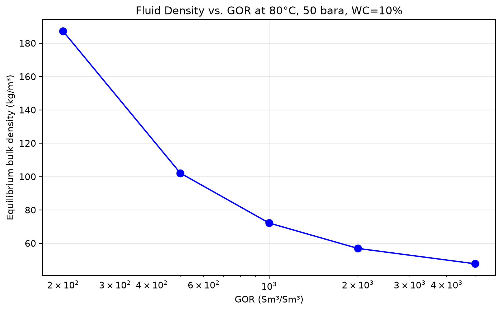
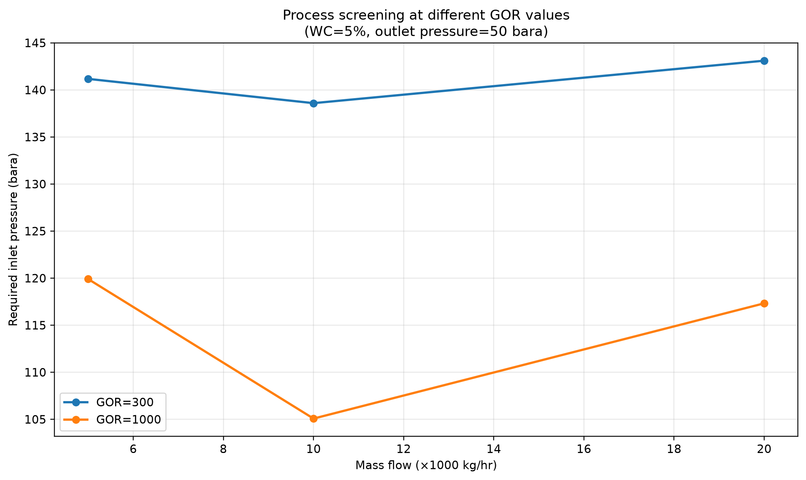
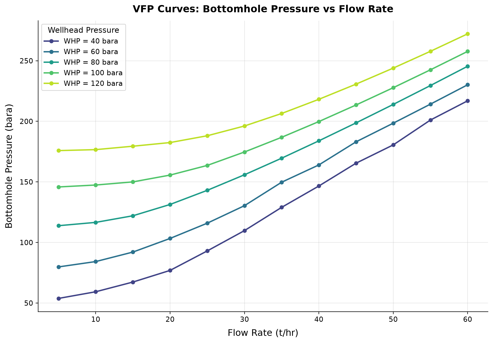
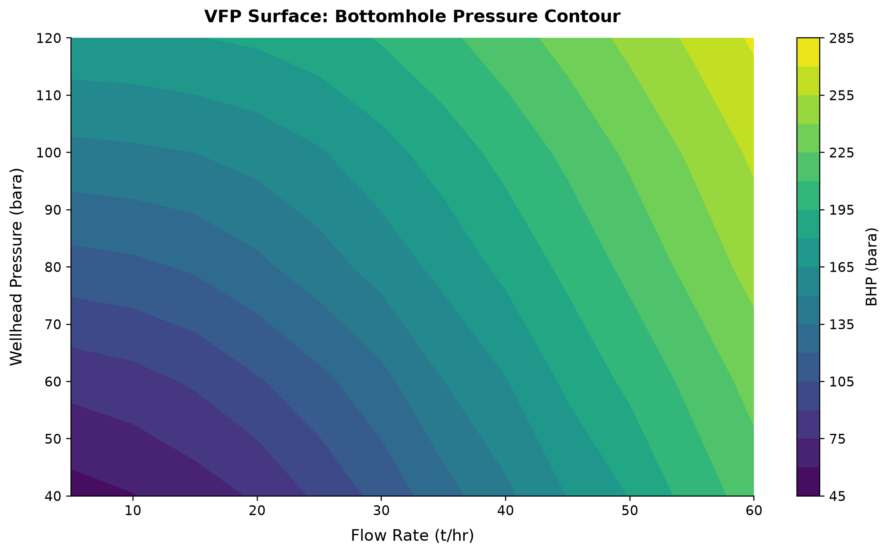

# Field Development Planning

<!-- Chapter metadata -->
<!-- Notebooks: ch19_vfp_generation.ipynb, ch19_multi_scenario.ipynb, ch19_field_digital_twin.ipynb -->
<!-- Estimated pages: 38 -->

## Learning Objectives

After reading this chapter, the reader will be able to:

1. Explain why traditional single-composition VFP tables are inadequate for fields with changing GOR and water cut
2. Generate multi-scenario VFP tables spanning the full (rate × pressure × water cut × GOR) design space
3. Use the FluidMagicInput, RecombinationFlashGenerator, and MultiScenarioVFPGenerator classes in NeqSim
4. Distinguish diagnostic process tables from qualified Eclipse/OPM VFPPROD exports
5. Design field development workflows that integrate PVT, reservoir, well, and process modeling
6. Build a field development digital twin connecting reservoir depletion to surface facility performance
7. Implement VFP generation and multi-scenario analysis in Python

---

## 28.1 Introduction

Field development planning requires predicting how wells and facilities will perform over the field's lifetime — typically 20–30 years. During this period, the produced fluid properties change dramatically:

- **GOR increases** as reservoir pressure declines below the bubble point, liberating solution gas
- **Water cut rises** as the aquifer encroaches or water injection breaks through
- **Reservoir pressure drops**, reducing the driving force for flow
- **Fluid composition shifts** — heavier components become more concentrated in the liquid phase

These changes mean that a VFP table generated at a single fluid composition becomes increasingly inaccurate over time. A table calculated at initial conditions (GOR = 500 Sm³/Sm³, WC = 5%) may be completely wrong when the well is producing at GOR = 3000 Sm³/Sm³ and WC = 40%.

This chapter introduces **multi-scenario VFP generation** — the creation of VFP tables that span the full range of expected fluid conditions throughout the field's life. We present NeqSim's VFP generation framework:

1. **FluidMagicInput** — imports reference fluid and configures GOR/WC ranges
2. **RecombinationFlashGenerator** — generates physically consistent fluids at any GOR and water cut by recombining separated gas and oil phases
3. **MultiScenarioVFPGenerator** — sweeps the 4D parameter space (rate × pressure × WC × GOR) with parallel execution
4. **Separate export contracts** — retain generic process results as diagnostic text; provide a qualified BHP grid to `EclipseVFPExporter` for VFPPROD/VFPINJ serialization

We then extend to field development digital twins that unify PVT, reservoir, well, and process modeling into a single workflow.

### 28.1.1 Why Traditional VFP Fails

Consider a typical North Sea oil field. At initial conditions, the reservoir produces undersaturated oil with:
- GOR = 200 Sm³/Sm³
- Water cut = 2%
- Reservoir pressure = 380 bara (well above bubble point at 250 bara)

A VFP table generated at these conditions works well for the first few years. But after 10 years:
- GOR = 1500 Sm³/Sm³ (reservoir below bubble point, free gas in reservoir)
- Water cut = 35% (water injection breakthrough)
- Reservoir pressure = 220 bara

The original fixed-composition table can give incorrect operating points. The error direction cannot be inferred from GOR and water cut alone because changing gas fraction affects both holdup and friction. The production forecast diverges from reality.

**The solution:** Generate VFP tables that include GOR and water cut as additional dimensions, so the reservoir simulator can interpolate to the correct fluid conditions at each timestep.

### 28.1.2 The Multi-Scenario VFP Workflow

The workflow has five stages:

1. **Reference fluid import** — from Eclipse E300 (FluidMagic), PVT report, or NeqSim fluid definition
2. **Phase separation** — flash the reference fluid at standard conditions to get gas and oil compositions
3. **Recombination** — mix gas and oil at different ratios to generate fluids at target GOR values, then add water for target water cuts
4. **Process simulation** — for each (rate, pressure, WC, GOR) combination, run the well/pipeline process model to find the required inlet pressure
5. **Export** — keep process screening diagnostic; export qualified BHP through the separate reservoir-deck contract

```text
Reference Fluid ──→ FluidMagicInput ──→ RecombinationFlashGenerator
                         │                         │
                    GOR/WC ranges            Fluid at each
                                            (GOR, WC) point
                                                 │
                                                 ▼
                              MultiScenarioVFPGenerator
                                    │
                            4D sweep: rate × THP × WC × GOR
                                    │
                                    ▼
                               VFPTable ──→ Eclipse VFPEXP export
```

---

## 28.2 Multi-Scenario VFP Generation

### 28.2.1 FluidMagicInput: Reference Fluid Configuration

The `FluidMagicInput` class is the entry point for VFP generation. It holds the reference fluid composition and configures the GOR and water cut ranges to explore.

**From an Eclipse E300 file** (the most common workflow):

**Execution scope:** requires the named local E300 fluid file with a validated composition and characterization.

```java pattern: requires a validated local FLUID.E300 reference-fluid file
import neqsim.process.util.optimizer.FluidMagicInput;
import java.nio.file.Paths;

// Import reference fluid from E300/FluidMagic export
FluidMagicInput input = FluidMagicInput.fromE300File(Paths.get("FLUID.E300"));

// Configure ranges from Eclipse 100 simulation results
// GOR range from FGOR summary vector
input.setGORRange(250, 10000);   // Sm3/Sm3

// Water cut range from FWCT summary vector
input.setWaterCutRange(0.05, 0.60);  // fraction

// Number of sampling points
input.setNumberOfGORPoints(6);
input.setNumberOfWaterCutPoints(5);

// GOR spacing: LOGARITHMIC recommended for wide ranges
input.setGorSpacing(FluidMagicInput.GORSpacing.LOGARITHMIC);

// Flash to standard conditions to separate gas and oil
input.separateToStandardConditions();
```

**From a NeqSim fluid** (when no E300 file is available):

```java
import neqsim.process.util.optimizer.FluidMagicInput;
import neqsim.thermo.system.SystemInterface;
import neqsim.thermo.system.SystemSrkEos;

// Create reference fluid
SystemInterface refFluid = new SystemSrkEos(273.15 + 80.0, 200.0);
refFluid.addComponent("nitrogen", 0.5);
refFluid.addComponent("CO2", 2.0);
refFluid.addComponent("methane", 65.0);
refFluid.addComponent("ethane", 8.0);
refFluid.addComponent("propane", 5.0);
refFluid.addComponent("i-butane", 1.5);
refFluid.addComponent("n-butane", 3.0);
refFluid.addComponent("n-pentane", 2.0);
refFluid.addComponent("n-hexane", 1.5);
refFluid.addComponent("n-heptane", 4.0);
refFluid.addComponent("n-octane", 3.5);
refFluid.addComponent("n-decane", 2.0);
refFluid.addComponent("water", 2.0);
refFluid.setMixingRule("classic");
refFluid.setMultiPhaseCheck(true);

// Build FluidMagicInput from fluid
FluidMagicInput input = FluidMagicInput.builder()
    .referenceFluid(refFluid)
    .gorRange(200, 8000)
    .waterCutRange(0.02, 0.50)
    .numberOfGORPoints(6)
    .numberOfWaterCutPoints(5)
    .build();

input.separateToStandardConditions();
```

### 28.2.2 RecombinationFlashGenerator: Phase Recombination

The `RecombinationFlashGenerator` creates physically consistent fluids at any GOR and water cut by recombining the separated gas and oil phases from the reference fluid.

**The recombination algorithm:**

Starting with the gas phase (composition $y_i$, molar volume $V_g^{std}$) and oil phase (composition $x_i$, molar volume $V_o^{std}$) at standard conditions:

1. **Calculate moles ratio for target GOR:**

$$
\frac{n_{gas}}{n_{oil}} = \frac{\text{GOR}_{target}}{\text{GOR}_{ref}} \cdot \frac{n_{gas,ref}}{n_{oil,ref}}
$$

where the reference GOR comes from the original flash at standard conditions.

2. **Mix gas and oil:**

$$
z_i = \frac{n_{gas} \cdot y_i + n_{oil} \cdot x_i}{n_{gas} + n_{oil}}
$$

3. **Add water for target water cut:**

$$
\dot n_w=\frac{\mathrm{WC}}{1-\mathrm{WC}}\,\frac{Q_o^{std}}{\bar V_w^{std}}
$$

Here $Q_o^{std}$ is the oil volume rate and $\bar V_w^{std}$ the water molar volume at the same reference state; no extra density factor belongs in that molar-volume expression. If total liquid volume is supplied instead, use $\dot n_w=\mathrm{WC}Q_L^{std}/\bar V_w^{std}$.

4. **Flash the recombined fluid** and verify the resulting reference GOR/water cut; repartitioning can require iterative correction.

This is a controlled compositional scenario, not a reservoir depletion mechanism or guarantee that arbitrary requested ratios are attainable:
- **Low GOR** = less standard gas per standard oil; it does not determine drawdown
- **High GOR** = gas cap expansion or depleted reservoir, more gas relative to liquid
- **Higher water cut** = aquifer encroachment, additional water mixed with hydrocarbon

**Code example:**

```java
import neqsim.process.util.optimizer.RecombinationFlashGenerator;

RecombinationFlashGenerator flashGen = new RecombinationFlashGenerator(input);

// Generate a fluid at GOR = 1500 Sm3/Sm3, WC = 20%
SystemInterface fluid = flashGen.generateFluid(
    1500.0,     // target GOR [Sm3/Sm3]
    0.20,       // water cut [fraction]
    10000.0,    // total standard oil + water rate [Sm3/hr], at 15 C and 1.01325 bara
    353.15,     // temperature [K] (80°C)
    50.0);      // pressure [bara]

// The fluid cache avoids regenerating the same composition
String stats = flashGen.getCacheStatistics();
```

### 28.2.3 MultiScenarioVFPGenerator: 4D VFP Generation

The `MultiScenarioVFPGenerator` sweeps the four-dimensional parameter space and finds the required inlet pressure for each combination:

**Table dimensions:**

| Dimension | Symbol | Typical Range | Points |
|-----------|--------|--------------|--------|
| Flow rate | $Q$ | 1,000–80,000 Sm³/d | 6–10 |
| Outlet pressure (THP) | $P_{out}$ | 20–100 bara | 4–6 |
| Water cut | WC | 0.02–0.60 | 4–6 |
| GOR | GOR | 200–10,000 Sm³/Sm³ | 5–8 |

Total grid points: 8 × 5 × 5 × 6 = **1,200**. Each inverse pressure solve can require multiple process evaluations, so this is not the simulation-run count.

**The binary search algorithm:**

For each (rate, THP, WC, GOR) combination, the generator finds the minimum inlet pressure $P_{in}$ that achieves the target flow rate at the specified outlet pressure. It uses binary search:

1. Set $P_{low}$ = `minInletPressure`, $P_{high}$ = `maxInletPressure`
2. Try $P_{mid} = (P_{low} + P_{high}) / 2$
3. Run the process simulation with feed at $P_{mid}$
4. If outlet pressure > target THP: $P_{high} = P_{mid}$ (too much pressure)
5. If outlet pressure < target THP: $P_{low} = P_{mid}$ (not enough pressure)
6. Repeat until $|P_{high} - P_{low}| <$ `pressureTolerance`

If the process cannot achieve the target flow at any inlet pressure, the point is marked as **infeasible**.

**Setting up the generator:**

```java
import neqsim.process.util.optimizer.MultiScenarioVFPGenerator;
import neqsim.process.processmodel.ProcessSystem;
import java.util.function.Supplier;

// Process factory: creates a fresh process for each parallel worker
Supplier<ProcessSystem> processFactory = () -> {
    // Build a representative process model (well + flowline + riser)
    SystemInterface fluid = new SystemSrkEos(273.15 + 80.0, 200.0);
    fluid.addComponent("methane", 70.0);
    fluid.addComponent("ethane", 8.0);
    fluid.addComponent("propane", 4.0);
    fluid.addComponent("n-butane", 2.0);
    fluid.addComponent("n-heptane", 8.0);
    fluid.addComponent("n-decane", 5.0);
    fluid.addComponent("water", 3.0);
    fluid.setMixingRule("classic");
    fluid.setMultiPhaseCheck(true);

    Stream feed = new Stream("Feed", fluid);
    feed.setFlowRate(10000.0, "kg/hr");
    PipeBeggsAndBrills tubing = new PipeBeggsAndBrills("Tubing", feed);
    tubing.setLength(2500.0);
    tubing.setAngle(90.0);
    tubing.setDiameter(0.1016);
    tubing.setNumberOfIncrements(30);

    PipeBeggsAndBrills flowline = new PipeBeggsAndBrills("Flowline", tubing.getOutletStream());
    flowline.setLength(10000.0);
    flowline.setAngle(0.0);
    flowline.setDiameter(0.2032);
    flowline.setNumberOfIncrements(20);

    ProcessSystem process = new ProcessSystem();
    process.add(feed);
    process.add(tubing);
    process.add(flowline);
    process.add(new Stream("Export Outlet", flowline.getOutletStream()));
    return process;
};

// Create VFP generator
MultiScenarioVFPGenerator vfpGen = new MultiScenarioVFPGenerator(
    processFactory,
    "Feed",        // inlet stream name
    "Export Outlet" // actual outlet stream (pressure target)
);

// Attach flash generator for fluid composition at each GOR/WC
vfpGen.setFlashGenerator(flashGen);

// Configure table axes
vfpGen.setFlowRateUnit("kg/hr");
vfpGen.setInletTemperature(358.15);
vfpGen.setFlowRates(new double[]{5000.0,10000.0,20000.0});
vfpGen.setOutletPressures(new double[]{30.0,50.0});
vfpGen.setWaterCuts(new double[]{0.05});
vfpGen.setGORs(new double[]{300.0,1000.0});


// Binary search settings
vfpGen.setMinInletPressure(20.0);    // bara
vfpGen.setMaxInletPressure(350.0);   // bara
vfpGen.setPressureTolerance(0.5);    // bara

// Parallel execution
vfpGen.setEnableParallel(false);
vfpGen.setNumberOfWorkers(8);

// Generate
MultiScenarioVFPGenerator.VFPTable table = vfpGen.generateVFPTable();
```

### 28.2.4 VFPTable: Results Access and Analysis

The `VFPTable` class stores the 4D array of inlet pressures:

```java
// Access individual points
double requiredInletPressure = table.getBHP(2, 1, 0, 1);
// Legacy getter name; this is the inlet pressure for the declared process model.

// Check feasibility
int feasible = table.getFeasibleCount();
int total = table.getTotalPoints();
logger.info(String.format("Feasible: %d/%d (%.1f%%)%n",
    feasible, total, 100.0 * feasible / total));

// Print a slice (fixed WC and GOR)
table.printSlice(0, 1);  // WC index 0, GOR index 1
```

### 28.2.5 Diagnostic Process Export

The generator's generic inlet-pressure table is exported as diagnostic text. Legacy methods containing `VFPEXP` in their names do not emit reservoir-deck keywords at this revision:

```java
// Preserve the process-screening semantics in the file name and content.
java.nio.file.Files.write(Paths.get("production_screening.txt"),
    vfpGen.toDiagnosticString().getBytes(java.nio.charset.StandardCharsets.UTF_8));
```

The diagnostic text records the rate unit (`kg/hr` here), outlet-pressure, water-cut and GOR axes, and one required inlet pressure with an explicit feasibility flag for each sampled combination. An unavailable pressure remains `NaN`. The output is not a `VFPPROD` or `VFPEXP` reservoir deck; converting it requires a separate, verified reservoir-simulator contract and pressure datum.

---

## 28.3 Reservoir Simulation Coupling

### 28.3.1 Qualified VFPPROD Integration

The `VFPPROD` keyword defines a production BHP response over rate, THP, water ratio, gas ratio and artificial-lift axes; `VFPINJ` has its own injection-table contract. This is separate from NeqSim's legacy diagnostic methods \cite{opmvfp,neqsim2026update}. The reservoir simulator interpolates within this table at each timestep to determine the well operating point.

**Reservoir deck structure (requires a qualified BHP table):**

```text
-- Include the NeqSim-generated VFP table
INCLUDE
  'production_vfp.inc' /

-- Reference the VFP table in well control
WCONPROD
-- Well    Status  Mode   Rate   Resv   BHP    THP   VFP#
  'PROD-1'  OPEN   ORAT   5000   1*     100    30     1   /
  'PROD-2'  OPEN   ORAT   3000   1*     100    40     1   /
/
```

### 28.3.2 Automatic Interpolation

The reservoir simulator interpolates across all four VFP dimensions at each timestep:

$$
P_{BHP} = f(Q, P_{THP}, \text{WC}(t), \text{GOR}(t))
$$

where $\text{WC}(t)$ and $\text{GOR}(t)$ change with time as the reservoir depletes. Multi-linear interpolation is used:

$$
P_{BHP} \approx \sum_{i,j,k,l} w_{ijkl} \cdot P_{BHP}^{(i,j,k,l)}
$$

where $w_{ijkl}$ are the interpolation weights determined by the current well conditions relative to the table grid points.

This means the VFP table must have sufficient resolution in each dimension to avoid interpolation errors:

| Dimension | Minimum Points | Recommended Points | Rationale |
|-----------|---------------|-------------------|-----------|
| Flow rate | 5 | 8–10 | Non-linear friction |
| THP | 3 | 5–6 | Linear-ish behavior |
| Water cut | 4 | 5–6 | Non-linear density/viscosity |
| GOR | 4 | 6–8 | Highly non-linear phase behavior |

### 28.3.3 WCONPROD Well Control

The `WCONPROD` keyword specifies well operating mode and constraints. The VFP table number links each well to its performance model:

- **ORAT mode:** Target oil rate, BHP from VFP table
- **GRAT mode:** Target gas rate
- **LRAT mode:** Target liquid rate (oil + water)
- **RESV mode:** Target reservoir voidage rate
- **BHP mode:** Fixed bottomhole pressure (VFP gives achievable rate)

---

## 28.4 Fluid Property Sensitivity Across GOR and Water Cut

### 28.4.1 How Fluid Properties Change with GOR

Understanding the physical basis for multi-scenario VFP is essential for field development engineers. As GOR changes, the fluid properties change dramatically:

**Density:** At low GOR (mostly oil), the mixture density is high (600–800 kg/m³). As GOR increases, the gas fraction rises, and the mixture density drops. This can reduce hydrostatic pressure loss, while increased gas velocity can increase friction. Evaluate both contributions rather than assuming a common direction.

$$
\rho_m = \rho_l H_l + \rho_g (1 - H_l)
$$

where $H_l$ is the liquid holdup (fraction of pipe cross-section occupied by liquid), which depends on flow regime, velocity, and pipe inclination.

**Viscosity:** Oil viscosity is typically 0.5–50 cP at downhole conditions. Gas viscosity is much lower (0.01–0.03 cP). As GOR increases, the effective mixture viscosity decreases, reducing friction but also changing the flow regime.

**Surface tension:** calculate interfacial tension from the actual equilibrated phases and conditions. GOR alone does not prescribe its direction or the resulting droplet/bubble distribution.

**Phase envelope:** At high GOR, the fluid phase envelope shifts toward the gas side. The cricondenbar and cricondentherm change, affecting the conditions at which liquid drops out in the pipeline (retrograde condensation). This is critical for pipeline sizing and slug catcher design.

### 28.4.2 How Fluid Properties Change with Water Cut

Water cut affects the flow differently than GOR:

**Emulsion viscosity:** Oil-water mixtures form emulsions with viscosities far higher than either pure phase. The inversion point and viscosity enhancement are fluid- and shear-dependent; neither a universal water-cut interval nor an amplification factor is established here. One frequently confused constitutive form is:

$$
\frac{\mu}{\mu_c}=\left(1-\frac{\phi}{\phi_m}\right)^{-[\eta]\phi_m}
$$

This is the Krieger–Dougherty suspension form, with dispersed fraction $\phi$, fitted maximum packing $\phi_m$ and intrinsic viscosity $[\eta]$. It is not an oil-water phase-inversion model. Oil-water emulsions require a calibrated rheology, continuous-phase identification and shear/temperature conditions; a dilute polynomial must not be extrapolated through inversion.

**Liquid loading:** Water is denser than oil (1000 vs. 700–900 kg/m³). Higher water cut increases the liquid density and thus the hydrostatic pressure drop in vertical tubing. This increases the BHP required to lift fluids to the surface.

**Slugging tendency:** Water cut changes affect the flow regime. Severe slugging depends on pipeline/riser geometry, pressure and the phase-flow regime; water cut alone does not define an onset window. The VFP table captures the average steady-state behavior, but slugging transients require dynamic simulation.

### 28.4.3 Combined Effects: The VFP Surface Shape

The VFP surface (BHP vs. rate at fixed THP) has a characteristic shape that changes with GOR and water cut:

- **Low GOR, low WC:** Friction can dominate at high rates; the actual low-rate branch depends on liquid holdup and elevation.
- **High GOR, low WC:** lower holdup may reduce static head while higher gas velocity increases friction; a low-rate liquid-loading branch needs a suitable model.
- **Low GOR, high WC:** A denser liquid phase may increase static head. Emulsion effects require a separate calibrated rheology and cannot be inferred from water cut alone.
- **High GOR, high WC:** Complex behavior — gas lift effect from high GOR partially compensates for the heavier water column.

Understanding these shapes helps reservoir engineers:
1. Predict when wells will die (BHP exceeds reservoir pressure)
2. Identify the need for artificial lift (gas lift or ESP)
3. Optimize choke settings to maximize field production

## 28.5 VFP Configuration and Best Practices

### 28.5.1 GOR Range Selection

The GOR range should span from initial conditions to the highest GOR expected at end of field life:

- **Minimum GOR:** Initial GOR from PVT report (or slightly lower to handle transient startup)
- **Maximum GOR:** From reservoir simulation forecast at abandonment

**GOR spacing options:**

**LINEAR** — equal spacing between values:

$$
\text{GOR}_i = \text{GOR}_{min} + i \cdot \frac{\text{GOR}_{max} - \text{GOR}_{min}}{N - 1}
$$

Best when the GOR range is narrow (e.g., 500–2000 Sm³/Sm³).

**LOGARITHMIC** — geometric spacing (recommended for wide ranges):

$$
\text{GOR}_i = \text{GOR}_{min} \cdot \left(\frac{\text{GOR}_{max}}{\text{GOR}_{min}}\right)^{i/(N-1)}
$$

Best when GOR spans an order of magnitude or more (e.g., 200–10,000 Sm³/Sm³), because:
- Phase behavior changes rapidly at low GOR (near bubble point)
- Phase behavior changes slowly at very high GOR (mostly gas)

```java
// LOGARITHMIC spacing for wide GOR range
input.setGorSpacing(FluidMagicInput.GORSpacing.LOGARITHMIC);
input.setGORRange(200, 10000);
input.setNumberOfGORPoints(8);
// Eight geometrically spaced values including both endpoints.
```

### 28.5.2 Water Cut Range Configuration

Water cut ranges from initial (often near zero) to maximum expected:

```java
input.setWaterCutRange(0.02, 0.60);
input.setNumberOfWaterCutPoints(5);
// Generates: 0.02, 0.165, 0.31, 0.455, 0.60
```

**Important considerations:**
- Include a near-zero water cut for initial conditions
- Include the economic water cut limit (typically 70–90%)
- Water cut affects density, viscosity, and emulsion formation

### 28.5.3 Pressure Search Parameters

The binary search for inlet pressure requires bounds:

```java
vfpGen.setMinInletPressure(15.0);     // bara — minimum physically possible
vfpGen.setMaxInletPressure(400.0);    // bara — above reservoir pressure
vfpGen.setPressureTolerance(0.5);     // bara — accuracy of result
```

**Guidelines:**
- `minInletPressure` should be below the minimum expected wellhead pressure
- `maxInletPressure` should be above the initial reservoir pressure
- `pressureTolerance` of 0.5–1.0 bara is usually sufficient
- Tighter tolerance increases computation time (more binary search iterations)

### 28.5.4 Performance Guidelines

The computation time depends on the number of points and the complexity of the process model:

Report actual process-evaluation count, hardware, JVM, worker count and elapsed time. No timing benchmark is established for the former generic grid-size table.

**Optimization tips:**
- Use `setEnableParallel(true)` for production runs
- The `RecombinationFlashGenerator` caches composition; repeated (GOR, WC) pairs still require rate normalization and flashes
- Start with a coarse grid (few points per dimension) to validate the process model
- Refine the grid in regions where the VFP surface changes rapidly

### 28.5.5 Input Validation

Before launching a large VFP generation run, validate the setup:

```java
// Validate that the process runs successfully at a few test points
ProcessSystem testProcess = processFactory.get();
testProcess.run();
double testPressure = ((StreamInterface) testProcess.getUnit("Export Outlet")).getPressure("bara");
logger.info("Test outlet pressure: " + testPressure + " bara");

// Verify the flash generator produces reasonable fluids
SystemInterface testFluid = flashGen.generateFluid(1000.0, 0.20, 10000.0, 353.15, 50.0);
testFluid.initProperties();
logger.info("Test fluid components: " + testFluid.getNumberOfComponents());
logger.info("Test fluid density: " + testFluid.getDensity("kg/m3") + " kg/m3");
```

---

## 28.6 Use Cases

### 28.6.1 Facility Debottlenecking Across Fluid Scenarios

As field fluid properties change, facility bottlenecks shift. A separator designed for GOR = 500 may become undersized at GOR = 3000 (much more gas). Multi-scenario VFP tables reveal:

- **At what GOR might compression constrain production?** — Include a compressor with an explicit installed capacity model; the tubing-and-flowline table shown here has no compressor.
- **How does water cut affect export pipeline capacity?** — Recalculate holdup, density and friction for the declared flow basis; their combined direction is case dependent.
- **When should the choke setting change?** — Couple the pressure table to inflow and explicit choke/facility constraints before optimizing a pressure split.

### 28.6.2 Well Design Optimization

Tubing size selection depends on the range of expected conditions:

```java
// Compare explicit internal diameters; nominal pipe sizes require wall-thickness data.
for (double diameter : new double[]{0.076, 0.102}) {
    ProcessSystem diameterCase = processFactory.get();
    ((PipeBeggsAndBrills) diameterCase.getUnit("Tubing")).setDiameter(diameter);
    MultiScenarioVFPGenerator diameterGenerator = new MultiScenarioVFPGenerator(diameterCase, "Feed", "Export Outlet");
    diameterGenerator.setFlashGenerator(flashGen);
    diameterGenerator.setFlowRateUnit("kg/hr");
    diameterGenerator.setInletTemperature(358.15);
    diameterGenerator.setFlowRates(new double[]{5000.0,10000.0,20000.0});
    diameterGenerator.setOutletPressures(new double[]{30.0,50.0});
    diameterGenerator.setWaterCuts(new double[]{0.05});
    diameterGenerator.setGORs(new double[]{300.0,1000.0});
    diameterGenerator.setMinInletPressure(20.0);
    diameterGenerator.setMaxInletPressure(350.0);
    diameterGenerator.setEnableParallel(false);
    MultiScenarioVFPGenerator.VFPTable diameterTable = diameterGenerator.generateVFPTable();
    logger.info("Internal diameter {} m: {} of {} feasible sampled points", diameter,
        diameterTable.getFeasibleCount(), diameterTable.getTotalPoints());
}
```

Compare the accepted pressures and unavailable cells for each diameter. A larger diameter usually reduces friction, but it need not increase the number of feasible points in a coarse grid, and the steady correlation does not establish a liquid-loading limit.

### 28.6.3 Production Forecasting with Changing Fluid Properties

A qualified and calibrated VFP table can support reservoir forecasts through the following coupling:

1. At each timestep, the simulator calculates the current GOR and water cut from the reservoir model
2. It interpolates the VFP table to get $P_{BHP}(Q, P_{THP}, WC, GOR)$
3. The intersection of the VFP curve with the IPR gives the well operating point
4. This determines the production rate, which feeds back to the reservoir model

A fixed-composition table can become unrepresentative as composition changes. The direction and size of forecast bias require a case-specific sensitivity study.

---

## 28.7 Complete VFP Generation Example

### 28.7.1 Full Java Example

```java
import neqsim.process.util.optimizer.FluidMagicInput;
import neqsim.process.util.optimizer.RecombinationFlashGenerator;
import neqsim.process.util.optimizer.MultiScenarioVFPGenerator;
import neqsim.process.equipment.stream.Stream;
import neqsim.process.equipment.pipeline.PipeBeggsAndBrills;
import neqsim.process.processmodel.ProcessSystem;
import neqsim.thermo.system.SystemInterface;
import neqsim.thermo.system.SystemSrkEos;
import java.util.function.Supplier;

public class VFPGenerationExample {
    private static final org.apache.logging.log4j.Logger logger = org.apache.logging.log4j.LogManager.getLogger(VFPGenerationExample.class);

    /** Process factory that creates a fresh well + flowline model. */
    static Supplier<ProcessSystem> createProcessFactory() {
        return () -> {
            SystemInterface fluid = new SystemSrkEos(273.15 + 85.0, 200.0);
            fluid.addComponent("nitrogen", 0.4);
            fluid.addComponent("CO2", 1.8);
            fluid.addComponent("methane", 68.0);
            fluid.addComponent("ethane", 7.5);
            fluid.addComponent("propane", 4.5);
            fluid.addComponent("i-butane", 1.0);
            fluid.addComponent("n-butane", 2.5);
            fluid.addComponent("n-pentane", 1.5);
            fluid.addComponent("n-hexane", 1.2);
            fluid.addComponent("n-heptane", 4.5);
            fluid.addComponent("n-octane", 3.5);
            fluid.addComponent("n-decane", 2.1);
            fluid.addComponent("water", 1.5);
            fluid.setMixingRule("classic");
            fluid.setMultiPhaseCheck(true);

            Stream feed = new Stream("Feed", fluid);
    feed.setFlowRate(10000.0, "kg/hr");
            feed.setFlowRate(30000.0, "kg/hr");
            feed.setTemperature(85.0, "C");
            feed.setPressure(200.0, "bara");

            // Well tubing (2800 m vertical)
            PipeBeggsAndBrills tubing =
                new PipeBeggsAndBrills("Tubing", feed);
            tubing.setLength(2800.0);
            tubing.setAngle(90.0);
            tubing.setDiameter(0.1016);
            tubing.setPipeWallRoughness(2.5e-5);
            tubing.setNumberOfIncrements(25);

            // Subsea flowline (12 km)
            PipeBeggsAndBrills flowline =
                new PipeBeggsAndBrills("Export", tubing.getOutletStream());
            flowline.setLength(12000.0);
            flowline.setAngle(0.0);
            flowline.setDiameter(0.2032);
            flowline.setPipeWallRoughness(4.5e-5);
            flowline.setNumberOfIncrements(20);

            ProcessSystem process = new ProcessSystem();
            process.add(feed);
            process.add(tubing);
            process.add(flowline);
    process.add(new Stream("Export Outlet", flowline.getOutletStream()));
            return process;
        };
    }

    public static void main(String[] args) throws Exception {
        // Step 1: Reference fluid
        SystemInterface refFluid = new SystemSrkEos(273.15 + 85.0, 200.0);
        refFluid.addComponent("nitrogen", 0.4);
        refFluid.addComponent("CO2", 1.8);
        refFluid.addComponent("methane", 68.0);
        refFluid.addComponent("ethane", 7.5);
        refFluid.addComponent("propane", 4.5);
        refFluid.addComponent("i-butane", 1.0);
        refFluid.addComponent("n-butane", 2.5);
        refFluid.addComponent("n-pentane", 1.5);
        refFluid.addComponent("n-hexane", 1.2);
        refFluid.addComponent("n-heptane", 4.5);
        refFluid.addComponent("n-octane", 3.5);
        refFluid.addComponent("n-decane", 2.1);
        refFluid.addComponent("water", 1.5);
        refFluid.setMixingRule("classic");
        refFluid.setMultiPhaseCheck(true);

        // Step 2: Configure FluidMagicInput
        FluidMagicInput input = new FluidMagicInput(refFluid);
        input.setGORRange(300, 8000);
        input.setWaterCutRange(0.05, 0.55);
        input.setNumberOfGORPoints(6);
        input.setNumberOfWaterCutPoints(5);
        input.setGorSpacing(FluidMagicInput.GORSpacing.LOGARITHMIC);
        input.separateToStandardConditions();

        // Step 3: Flash generator
        RecombinationFlashGenerator flashGen =
            new RecombinationFlashGenerator(input);

        // Step 4: VFP generator
        MultiScenarioVFPGenerator vfpGen = new MultiScenarioVFPGenerator(
            createProcessFactory(), "Feed", "Export Outlet");
        vfpGen.setFlashGenerator(flashGen);

        vfpGen.setFlowRateUnit("kg/hr");
vfpGen.setInletTemperature(358.15);
vfpGen.setFlowRates(new double[]{5000.0,10000.0,20000.0});
vfpGen.setOutletPressures(new double[]{30.0,50.0});
vfpGen.setWaterCuts(new double[]{0.05});
vfpGen.setGORs(new double[]{300.0,1000.0});
        
        
        

        vfpGen.setMinInletPressure(20.0);
        vfpGen.setMaxInletPressure(350.0);
        vfpGen.setPressureTolerance(0.5);
        vfpGen.setEnableParallel(false);
        vfpGen.setNumberOfWorkers(8);

        // Step 5: Generate
        MultiScenarioVFPGenerator.VFPTable table =
            vfpGen.generateVFPTable();

        logger.info(String.format("Feasible: %d/%d%n",
            table.getFeasibleCount(), table.getTotalPoints()));

        // Step 6: Print a slice
        table.printSlice(0, 1);  // WC=5%, GOR=1000

        // Step 7: Export diagnostic process screening, not a well VFP deck
        java.nio.file.Files.write(java.nio.file.Paths.get("production_screening.txt"),
            vfpGen.toDiagnosticString().getBytes(java.nio.charset.StandardCharsets.UTF_8));
        logger.info("Process screening diagnostics exported to production_screening.txt");
    }
}
```

### 28.7.2 Full Python Example

```python
import jpype
jneqsim = jpype.JPackage("neqsim")
import json

# Import classes
FluidMagicInput = jneqsim.process.util.optimizer.FluidMagicInput
RecombinationFlashGenerator = jneqsim.process.util.optimizer.RecombinationFlashGenerator
MultiScenarioVFPGenerator = jneqsim.process.util.optimizer.MultiScenarioVFPGenerator
Stream = jneqsim.process.equipment.stream.Stream
PipeBeggsAndBrills = jneqsim.process.equipment.pipeline.PipeBeggsAndBrills
ProcessSystem = jneqsim.process.processmodel.ProcessSystem
SystemSrkEos = jneqsim.thermo.system.SystemSrkEos

# --- Step 1: Reference Fluid ---
ref_fluid = SystemSrkEos(273.15 + 85.0, 200.0)
ref_fluid.addComponent("nitrogen", 0.4)
ref_fluid.addComponent("CO2", 1.8)
ref_fluid.addComponent("methane", 68.0)
ref_fluid.addComponent("ethane", 7.5)
ref_fluid.addComponent("propane", 4.5)
ref_fluid.addComponent("i-butane", 1.0)
ref_fluid.addComponent("n-butane", 2.5)
ref_fluid.addComponent("n-pentane", 1.5)
ref_fluid.addComponent("n-hexane", 1.2)
ref_fluid.addComponent("n-heptane", 4.5)
ref_fluid.addComponent("n-octane", 3.5)
ref_fluid.addComponent("n-decane", 2.1)
ref_fluid.addComponent("water", 1.5)
ref_fluid.setMixingRule("classic")
ref_fluid.setMultiPhaseCheck(True)

# --- Step 2: FluidMagicInput ---
fmi = FluidMagicInput(ref_fluid)
fmi.setGORRange(300, 8000)
fmi.setWaterCutRange(0.05, 0.55)
fmi.setNumberOfGORPoints(6)
fmi.setNumberOfWaterCutPoints(5)
fmi.setGorSpacing(FluidMagicInput.GORSpacing.LOGARITHMIC)
fmi.separateToStandardConditions()

# --- Step 3: Flash Generator ---
flash_gen = RecombinationFlashGenerator(fmi)

# --- Step 4: Process Factory (Python lambda wrapping Java) ---
def create_process():
    fluid = SystemSrkEos(273.15 + 85.0, 200.0)
    fluid.addComponent("nitrogen", 0.4)
    fluid.addComponent("CO2", 1.8)
    fluid.addComponent("methane", 68.0)
    fluid.addComponent("ethane", 7.5)
    fluid.addComponent("propane", 4.5)
    fluid.addComponent("i-butane", 1.0)
    fluid.addComponent("n-butane", 2.5)
    fluid.addComponent("n-pentane", 1.5)
    fluid.addComponent("n-hexane", 1.2)
    fluid.addComponent("n-heptane", 4.5)
    fluid.addComponent("n-octane", 3.5)
    fluid.addComponent("n-decane", 2.1)
    fluid.addComponent("water", 1.5)
    fluid.setMixingRule("classic")
    fluid.setMultiPhaseCheck(True)

    feed = Stream("Feed", fluid)
    feed.setFlowRate(30000.0, "kg/hr")
    feed.setTemperature(85.0, "C")
    feed.setPressure(200.0, "bara")

    tubing = PipeBeggsAndBrills("Tubing", feed)
    tubing.setLength(2800.0)
    tubing.setAngle(90.0)
    tubing.setDiameter(0.1016)
    tubing.setPipeWallRoughness(2.5e-5)
    tubing.setNumberOfIncrements(25)

    flowline = PipeBeggsAndBrills("Flowline", tubing.getOutletStream())
    flowline.setLength(12000.0)
    flowline.setAngle(0.0)
    flowline.setDiameter(0.2032)
    flowline.setPipeWallRoughness(4.5e-5)
    flowline.setNumberOfIncrements(20)

    process = ProcessSystem()
    process.add(feed)
    process.add(tubing)
    process.add(flowline)
    process.add(Stream("Export", flowline.getOutletStream()))
    return process

# For sequential execution, pass a single process
process = create_process()
vfp_gen = MultiScenarioVFPGenerator(process, "Feed", "Export")
vfp_gen.setFlashGenerator(flash_gen)
vfp_gen.setFlowRateUnit("kg/hr")
vfp_gen.setInletTemperature(358.15)

# Configure axes
import jpype
vfp_gen.setFlowRates(jpype.JArray(jpype.JDouble)([5000.0, 10000.0, 20000.0]))
vfp_gen.setOutletPressures(jpype.JArray(jpype.JDouble)([30.0, 50.0]))
vfp_gen.setWaterCuts(jpype.JArray(jpype.JDouble)([0.05]))
vfp_gen.setGORs(jpype.JArray(jpype.JDouble)([300.0, 1000.0]))

vfp_gen.setMinInletPressure(20.0)
vfp_gen.setMaxInletPressure(350.0)
vfp_gen.setPressureTolerance(1.0)
vfp_gen.setEnableParallel(False)  # Sequential for Python

# Generate
table = vfp_gen.generateVFPTable()
print(f"Feasible: {table.getFeasibleCount()}/{table.getTotalPoints()}")

# Print a slice
table.printSlice(0, 1)  # WC=5%, GOR=1000

# Export
from pathlib import Path
Path("production_screening.txt").write_text(str(vfp_gen.toDiagnosticString()), encoding="utf-8")
print("Process screening diagnostics exported")

feed = process.getUnit("Feed")
fluid = ref_fluid
create_base_process = create_process
```

---

## 28.8 Field Development Digital Twin

### 28.8.1 The Concept of a Field Development Digital Twin

A field development digital twin is not a single model — it is a **connected system of models** that reflects the physical field at every layer. The twin continuously evolves as the field matures, incorporating new data from drilling, production, and maintenance.

The key distinction from traditional field planning:

| Traditional Approach | Digital Twin Approach |
|---------------------|----------------------|
| Static VFP tables | Dynamic VFP tables updated with current fluid |
| Manual model updates | Automated model calibration against production data |
| Separate PVT/reservoir/well/process models | Integrated model with shared state |
| Quarterly production forecasts | Continuous forecasting |
| Reactive optimization | Proactive, model-based optimization |

### 28.8.2 Unified PVT → Reservoir → Well → Process Workflow

A field development digital twin connects all the modeling layers:

```text
┌─────────────────┐     ┌──────────────────┐     ┌────────────────┐
│   PVT Model     │────→│ Reservoir Model   │────→│  Well Model    │
│ (EOS, kij, Tc)  │     │ (Eclipse/OPM)     │     │ (VFP tables)   │
└─────────────────┘     └──────────────────┘     └────────────────┘
                                                        │
                                                        ▼
                         ┌──────────────────┐     ┌────────────────┐
                         │  Facility Model  │←────│ Network Model  │
                         │  (ProcessSystem) │     │ (LoopedPipe)   │
                         └──────────────────┘     └────────────────┘
                                │
                                ▼
                         ┌──────────────────┐
                         │    Economics      │
                         │ (NPV, Cash Flow) │
                         └──────────────────┘
```

**The feedback loop:** As the reservoir depletes, the VFP tables change. The well model feeds new rates to the facility model, which determines if the facility can handle the new fluid. The economics model evaluates whether the field remains profitable.

### 28.8.3 Model Calibration and History Matching

The digital twin must be calibrated against actual production data. This involves:

1. **PVT calibration:** Match EOS predictions against PVT lab data (differential liberation, constant composition expansion, separator tests)
2. **Well model calibration:** Adjust tubing roughness, IPR productivity index, and choke discharge coefficient to match well test data
3. **Reservoir model history matching:** Adjust permeability, porosity, and aquifer strength to match observed pressure and production history
4. **Facility model validation:** Verify separator pressures, compressor duty, and export conditions against measured plant data

**Execution scope:** This integration pattern requires a qualified well model and actual well-test data. It is not a standalone validated process calculation.

```python pattern: requires a qualified well model and actual well-test data
# Example: calibrate well model against a well test
# Well test data: Q = 15,000 Sm3/d at BHP = 280 bara, WHP = 65 bara

measured_bhp = 280.0  # bara
measured_whp = 65.0   # bara
measured_rate = 15000.0  # Sm3/d

# Run NeqSim well model
feed.setFlowRate(measured_rate * 1.0, "Sm3/day")
feed.setPressure(measured_bhp, "bara")
process.run()
predicted_whp = flowline.getOutletStream().getPressure("bara")

# Calibration error
error = abs(predicted_whp - measured_whp)
print(f"Predicted WHP: {predicted_whp:.1f} bara")
print(f"Measured WHP:  {measured_whp:.1f} bara")
print(f"Error:         {error:.1f} bara")

# If error > 2 bara, adjust tubing roughness or pipe diameter
```

### 28.8.4 NetworkSolver Integration

The `LoopedPipeNetwork` from Chapter 15 can serve as the well model, directly providing the well operating points to the reservoir simulator:

**Execution scope:** This integration pattern network assembly requires field-specific nodes and verified boundary data. It is not a standalone validated process calculation.

```python pattern: network assembly requires field-specific nodes and verified boundary data
import jpype
jneqsim = jpype.JPackage("neqsim")

# Build the production network (from Chapter 15)
LoopedPipeNetwork = jneqsim.process.equipment.network.LoopedPipeNetwork
SolverType = LoopedPipeNetwork.SolverType

network = LoopedPipeNetwork("Field Network")
network.setFluidTemplate(fluid)

# Add wells, tubing, chokes, flowlines (as in Chapter 15)
# ... (well configuration code) ...

network.setSolverType(SolverType.NEWTON_RAPHSON)
network.setTolerance(1e-6)

# Time-stepping loop (simplified digital twin)
import numpy as np

years = np.arange(0, 25, 1)  # 25-year field life
reservoir_pressure = 380.0     # Initial reservoir pressure (bara)
decline_rate = 0.05            # 5% per year

results = []
for year in years:
    # Update reservoir pressure (simplified decline)
    Pr = reservoir_pressure * np.exp(-decline_rate * year)

    # Update all well IPRs with current reservoir pressure
    for well_name in ["A", "B", "C"]:
        ipr = network.getPipe(f"IPR-{well_name}")
        ipr.setReservoirPressure(Pr * 1e5)  # Convert to Pa

    # Solve network
    network.run()

    # Extract total production
    summary = network.getSolutionSummary()
    total_flow = float(summary.get("totalSinkFlow"))

    results.append({
        "year": year,
        "Pr_bara": Pr,
        "total_production_kg_s": total_flow
    })

    print(f"Year {year:2d}: Pr = {Pr:.0f} bara, "
          f"Production = {total_flow:.1f} kg/s")
```

### 28.8.5 Production Scheduling and Well Sequencing

Production scheduling optimizes the sequence and timing of well operations. Key decisions include:

- **Well start-up sequence:** Which wells to bring online first?
  - High-PI wells first → maximize early production for NPV
  - Low-WC wells first → delay water handling facility investment
  - Platform wells first → minimize subsea infrastructure cost

- **Choke management strategy:** How to adjust chokes as reservoir pressure declines?
  - Fixed choke opening → production declines naturally
  - Rate-controlled choking → maintain target rate until choke is fully open
  - Pressure-controlled → maintain minimum THP for flow assurance

- **Gas lift allocation:** How to redistribute lift gas as some wells die?
  - Marginal gas lift optimization: allocate gas to wells with highest incremental oil per unit gas
  - Total gas constraint: limited by compressor capacity

- **Workover timing:** When to pull tubing or replace ESPs?
  - When lost production × time > workover cost
  - Seasonal considerations (weather windows for subsea operations)

These decisions are made by running the network model at discrete time steps, adjusting well parameters at each step, and evaluating the economic outcome.

### 28.8.6 Concept Screening with VFP Tables

Multi-scenario VFP tables enable rapid screening of development concepts:

**Concept 1: Direct tieback to existing platform (30 km)**

```python
# Process factory: existing 2800 m upward tubing + 30 km horizontal flowline
def concept_1_factory():
    process = create_base_process()
    flowline = process.getUnit("Flowline")
    flowline.setLength(30000.0)
    return process

vfp_concept1 = MultiScenarioVFPGenerator(concept_1_factory(), "Feed", "Export")
vfp_concept1.setFlashGenerator(flash_gen)
vfp_concept1.setFlowRateUnit("kg/hr")
vfp_concept1.setInletTemperature(358.15)
vfp_concept1.setFlowRates(jpype.JArray(jpype.JDouble)([5000.0, 10000.0, 20000.0]))
vfp_concept1.setOutletPressures(jpype.JArray(jpype.JDouble)([30.0, 50.0]))
vfp_concept1.setWaterCuts(jpype.JArray(jpype.JDouble)([0.05]))
vfp_concept1.setGORs(jpype.JArray(jpype.JDouble)([300.0, 1000.0]))
vfp_concept1.setMinInletPressure(20.0)
vfp_concept1.setMaxInletPressure(350.0)
vfp_concept1.setEnableParallel(False)
table_concept1 = vfp_concept1.generateVFPTable()
feasible_1 = table_concept1.getFeasibleCount()
```

**Concept 2: Shorter horizontal route (8 km)**

```python
# Process factory: existing 2800 m upward tubing + 8 km horizontal flowline
def concept_2_factory():
    process = create_base_process()
    flowline = process.getUnit("Flowline")
    flowline.setLength(8000.0)
    # This comparison changes flowline length only; no booster is modeled.
    return process

vfp_concept2 = MultiScenarioVFPGenerator(concept_2_factory(), "Feed", "Export")
vfp_concept2.setFlashGenerator(flash_gen)
vfp_concept2.setFlowRateUnit("kg/hr")
vfp_concept2.setInletTemperature(358.15)
vfp_concept2.setFlowRates(jpype.JArray(jpype.JDouble)([5000.0, 10000.0, 20000.0]))
vfp_concept2.setOutletPressures(jpype.JArray(jpype.JDouble)([30.0, 50.0]))
vfp_concept2.setWaterCuts(jpype.JArray(jpype.JDouble)([0.05]))
vfp_concept2.setGORs(jpype.JArray(jpype.JDouble)([300.0, 1000.0]))
vfp_concept2.setMinInletPressure(20.0)
vfp_concept2.setMaxInletPressure(350.0)
vfp_concept2.setEnableParallel(False)
table_concept2 = vfp_concept2.generateVFPTable()
feasible_2 = table_concept2.getFeasibleCount()
```

**Concept 3: Short horizontal route (0.5 km)**

```python
# Process factory: existing 2800 m upward tubing + 0.5 km horizontal flowline
def concept_3_factory():
    process = create_base_process()
    flowline = process.getUnit("Flowline")
    flowline.setLength(500.0)  # Riser only
    return process

vfp_concept3 = MultiScenarioVFPGenerator(concept_3_factory(), "Feed", "Export")
vfp_concept3.setFlashGenerator(flash_gen)
vfp_concept3.setFlowRateUnit("kg/hr")
vfp_concept3.setInletTemperature(358.15)
vfp_concept3.setFlowRates(jpype.JArray(jpype.JDouble)([5000.0, 10000.0, 20000.0]))
vfp_concept3.setOutletPressures(jpype.JArray(jpype.JDouble)([30.0, 50.0]))
vfp_concept3.setWaterCuts(jpype.JArray(jpype.JDouble)([0.05]))
vfp_concept3.setGORs(jpype.JArray(jpype.JDouble)([300.0, 1000.0]))
vfp_concept3.setMinInletPressure(20.0)
vfp_concept3.setMaxInletPressure(350.0)
vfp_concept3.setEnableParallel(False)
table_concept3 = vfp_concept3.generateVFPTable()
feasible_3 = table_concept3.getFeasibleCount()

# Compare feasibility across concepts
print(f"Concept 1 (30 km tieback):    {feasible_1} feasible points")
print(f"Concept 2 (8 km route only):   {feasible_2} feasible points")
print(f"Concept 3 (short route):             {feasible_3} feasible points")
```

A raw count of feasible grid points depends on grid spacing and scenario weighting; it does not establish the most robust or valuable concept. Compare common physical cases, relevant probabilities, cumulative recovery, costs and missing evidence.

### 28.8.7 Late-Life Operations

Late-life field operations present unique challenges:

**High water cut** — Water handling and disposal costs can reduce the economic oil rate. Use standard oil and water volumes on the same reference basis:

**Execution scope:** This integration pattern requires supplied standard liquid rates, volumetric water cuts, and economic threshold. It is not a standalone validated process calculation.

```python pattern: requires supplied standard liquid rates, volumetric water cuts, and economic threshold
# Supplied standard liquid rate and volumetric water cut, at the same reference.
for well_name in wells:
    wc = well_standard_water_cut[well_name]
    liquid = well_standard_liquid_rate_Sm3_day[well_name]
    assert 0.0 <= wc <= 1.0 and liquid >= 0.0
    oil_rate = liquid * (1.0 - wc)
    if oil_rate < min_economic_oil_rate_Sm3_day:
        print(f"Well {well_name}: WC={wc:.0%}, "
              f"Oil={oil_rate:.1f} Sm3/day — below assumed economic threshold")
```

**Declining pressure** — Below a critical reservoir pressure, natural flow ceases and artificial lift becomes necessary:

$$
P_r^{critical} = P_{WH} + \Delta P_{tubing}(Q_{min}) + \Delta P_{choke}(Q_{min})
$$

**Turndown limits** — Separator and compressor turndown limits may prevent processing the reduced flow rates. The process model (from earlier chapters) determines these limits.

**Abandonment criteria** — The field is abandoned when:
1. Net revenue < operating cost for all wells
2. Production rate < minimum for fiscal compliance
3. Integrity issues require costly remediation
4. Environmental or regulatory requirements change

The digital twin monitors these criteria continuously, providing early warning of approaching economic limits.

### 28.8.8 Integrated Reservoir-to-Market Optimization

The feedback loop sketched in Section 28.8.2 is realized in NeqSim by the `IntegratedProductionModel` and `ReservoirToMarketOptimizer` (package `neqsim.process.fielddevelopment.integrated`). The integrated model couples each well's reservoir drive and deliverability curve to a shared export node, while the optimizer searches the choke settings that maximize a market-facing objective subject to a facility capacity:

```python
MaterialBalanceGasDrive = jneqsim.process.fielddevelopment.integrated.MaterialBalanceGasDrive
WellDeliverabilityCurve = jneqsim.process.fielddevelopment.integrated.WellDeliverabilityCurve
driveA = MaterialBalanceGasDrive(250.0, 5.0e9, 0.90)
driveB = MaterialBalanceGasDrive(220.0, 3.0e9, 0.90)
curveA = WellDeliverabilityCurve.fromVogel(2.0e6, 250.0)
curveB = WellDeliverabilityCurve.fromVogel(1.5e6, 220.0)
IntegratedProductionModel = jneqsim.process.fielddevelopment.integrated.IntegratedProductionModel
ReservoirToMarketOptimizer = jneqsim.process.fielddevelopment.integrated.ReservoirToMarketOptimizer

model = IntegratedProductionModel("Field")
model.addWell("Well-A", driveA, curveA)     # ReservoirDrive + WellDeliverabilityCurve
model.addWell("Well-B", driveB, curveB)
model.setExportPressure(90.0)               # bara
model.setHydrocarbonPrice(3.0)              # per Sm3
model.setEnergyIntensity(0.12)              # kWh/Sm3
model.setEmissionIntensity(0.02)            # kg CO2/Sm3

optimizer = ReservoirToMarketOptimizer(model)
optimizer.setFacilityCapacity(40000.0)      # Sm3/d export limit
optimizer.setMaxIterations(60)

result = optimizer.optimize()
print("Feasible:", result.isFeasible(),
      "objective:", result.getObjectiveValue())
print("Field rate:", result.getFieldRate(), "Sm3/d",
      "revenue:", result.getRevenue())
print("Choke settings:", dict(result.getChokeSettings()))
print("Well rates:", dict(result.getWellRates()))
```

The reduced model returns 39,923.98 Sm³/day: 3,208.21 from Well A and 36,715.77 from Well B. Revenue is 119,771.95 currency units/day at the assumed common price of 3 per Sm³. The capacity gives an upper bound of 120,000 currency units/day; an independent solution of the stated Vogel interpolation and quadratic flowline equations confirms that 40,000 Sm³/day is reachable. The native coordinate search is therefore 0.190% below this bound for the teaching case, rather than an exact global optimum. The two chokes are dimensionless deliverability multipliers, not valve openings calibrated to a Cv curve. Energy and emissions use the stated fixed intensities; no thermodynamic processing plant is solved in this reduced example. The Vogel-shaped wellhead curves are illustrative deliverability surrogates; combining them with a gas material-balance drive does not validate Vogel as a gas-well inflow law.

The optimizer's `OptimizationResult` reports `isFeasible()`, `getObjectiveValue()`, `getFieldRate()`, `getRevenue()`, `getChokeSettings()`, `getWellRates()`, and `getEvaluations()`, and serializes to JSON via `toJson()`. Because the reservoir drives deplete as cumulative production accumulates, calling `model.runProfile(years, dtYears)` projects the optimized field forward in time, yielding a `ProductionProfile` whose points carry rate, revenue, energy, emissions, and reservoir pressure — the quantitative backbone of the digital-twin forecast. The reservoir-to-market objective also underpins the life-of-field value-chain economics treated in Chapter 32.

---

## 28.9 Python Implementation

### 28.9.1 VFP Generation in Python

The complete Python workflow for VFP generation:

```python
from pathlib import Path
Path("figures").mkdir(parents=True, exist_ok=True)
import jpype
jneqsim = jpype.JPackage("neqsim")
import numpy as np
import matplotlib.pyplot as plt

# Classes
FluidMagicInput = jneqsim.process.util.optimizer.FluidMagicInput
RecombinationFlashGenerator = jneqsim.process.util.optimizer.RecombinationFlashGenerator
SystemSrkEos = jneqsim.thermo.system.SystemSrkEos

# Create reference fluid
ref = SystemSrkEos(273.15 + 80.0, 250.0)
ref.addComponent("methane", 70.0)
ref.addComponent("ethane", 8.0)
ref.addComponent("propane", 4.0)
ref.addComponent("n-butane", 2.5)
ref.addComponent("n-pentane", 1.5)
ref.addComponent("n-heptane", 6.0)
ref.addComponent("n-octane", 4.0)
ref.addComponent("n-decane", 2.0)
ref.addComponent("water", 2.0)
ref.setMixingRule("classic")
ref.setMultiPhaseCheck(True)

# Setup
fmi = FluidMagicInput(ref)
fmi.setGORRange(200, 5000)
fmi.setWaterCutRange(0.0, 0.50)
fmi.setNumberOfGORPoints(5)
fmi.setNumberOfWaterCutPoints(4)
fmi.setGorSpacing(FluidMagicInput.GORSpacing.LOGARITHMIC)
fmi.separateToStandardConditions()

flash_gen = RecombinationFlashGenerator(fmi)

# Generate fluids at different GOR values and plot density
gors = [200, 500, 1000, 2000, 5000]
densities = []
for gor in gors:
    fl = flash_gen.generateFluid(float(gor), 0.10, 10000.0, 353.15, 50.0)
    fl.initProperties()
    densities.append(fl.getDensity("kg/m3"))

fig, ax = plt.subplots(figsize=(8, 5))
ax.semilogx(gors, densities, 'bo-', markersize=8)
ax.set_xlabel("GOR (Sm³/Sm³)")
ax.set_ylabel("Equilibrium bulk density (kg/m³)")
ax.set_title("Fluid Density vs. GOR at 80°C, 50 bara, WC=10%")
ax.grid(True, alpha=0.3)
plt.tight_layout()
plt.savefig("figures/ch28_verified_recombination_density.png", dpi=220, bbox_inches="tight")
plt.show()
```

The density plot uses the total equilibrium fluid volume at 80 °C and 50 bara. It is not the pipe mixture density based on slip-dependent liquid holdup. `generateFluid` takes total standard liquid **Sm³/hr** as its third argument; the pressure-table generator subsequently sets its separately configured feed mass rate in **kg/hr**. GOR and water cut define mixing ratios of separated reference phases. Verify and report the equilibrated standard ratios when exact sales or production ratios matter.

<!-- ch28-literal-21 -->



Density decreases from 187.27 to 47.77 kg/m³ as the GOR mixing input rises from 200 to 5000 Sm³/Sm³. Increasing the proportion of reference gas lowers the equilibrium bulk density for this recipe. A pipe calculation still needs slip-dependent liquid holdup; substituting this bulk density for the flowing hydrostatic density would omit that effect. The independently reconstructed component inventory and a fresh standard flash confirm the requested liquid-rate, GOR and water-cut basis for all five samples.

### 28.9.2 Plotting VFP Surfaces

```python
from pathlib import Path
Path("figures").mkdir(parents=True, exist_ok=True)
import matplotlib.pyplot as plt
from mpl_toolkits.mplot3d import Axes3D
import numpy as np

# Use the actual Python table generated in Section 28.7
# Extract BHP data for a fixed WC and GOR
flow_rates = list(table.getFlowRates())
thp_values = list(table.getOutletPressures())

# Get BHP values for WC=5% (index 0), GOR=1000 (index 1)
bhp_data = np.zeros((len(flow_rates), len(thp_values)))
for i in range(len(flow_rates)):
    for j in range(len(thp_values)):
        bhp_data[i, j] = table.getBHP(i, j, 0, 1)

# Plot as surface
Q, P = np.meshgrid(flow_rates, thp_values, indexing='ij')

fig = plt.figure(figsize=(10, 7))
ax = fig.add_subplot(111, projection='3d')
surf = ax.plot_surface(Q / 1000, P, bhp_data, color='#369C9F',
                       alpha=0.55, edgecolor='white', linewidth=0.5)
ax.scatter(Q / 1000, P, bhp_data, c='black', s=22, depthshade=False)

ax.set_xlabel("Mass flow (×1000 kg/hr)")
ax.set_ylabel("Outlet pressure (bara)")
ax.set_zlabel("Required inlet pressure (bara)")
ax.set_title("Process screening: inlet pressure vs mass flow and outlet pressure\n(WC=5%, GOR=1000 Sm³/Sm³)")
plt.tight_layout()
plt.savefig("figures/ch28_verified_screening_surface.png", dpi=220, bbox_inches="tight")
plt.show()
```

<!-- ch28-literal-22 -->


The six required inlet pressures range from 75.43 to 119.90 bara over 5000–20,000 kg/hr and 30–50 bara outlet pressure. Every marker meets its outlet target in a fresh process replay, while reducing its inlet pressure by the declared 1 bar search width drops below the target. Height represents pressure; the uniform surface shade only connects the samples. A surface drawn through six points does not establish interpolation accuracy between them; refine the grid and compare measured pressure losses before reservoir coupling.

### 28.9.3 Multi-Scenario Comparison

```python
from pathlib import Path
Path("figures").mkdir(parents=True, exist_ok=True)
import matplotlib.pyplot as plt
import numpy as np

# Compare VFP curves at different GOR values (fixed WC=5%, outlet pressure=50 bara)
flow_rates = list(table.getFlowRates())
gor_values = list(table.getGORs())
gor_labels = [f"GOR={gor:g}" for gor in gor_values]

fig, ax = plt.subplots(figsize=(10, 6))

for g_idx, (gor, label) in enumerate(zip(gor_values, gor_labels)):
    bhp_values = []
    for r_idx in range(len(flow_rates)):
        bhp = table.getBHP(r_idx, 1, 0, g_idx)  # Outlet-pressure index 1 (50 bara), WC index 0 (5%)
        bhp_values.append(bhp)

    ax.plot(np.array(flow_rates) / 1000, bhp_values, 'o-',
            label=label, linewidth=2, markersize=6)

ax.set_xlabel("Mass flow (×1000 kg/hr)")
ax.set_ylabel("Required inlet pressure (bara)")
ax.set_title("Process screening at different GOR values\n(WC=5%, outlet pressure=50 bara)")
ax.legend()
ax.grid(True, alpha=0.3)
plt.tight_layout()
plt.savefig("figures/ch28_verified_gor_pressure.png", dpi=220, bbox_inches="tight")
plt.show()
```

---

<!-- ch28-literal-23 -->



At GOR 1000, required inlet pressure changes from 119.90 to 105.08 and then 117.32 bara as mass rate rises from 5000 to 10,000 and 20,000 kg/hr. The nonmonotonic response is retained: multiphase lift balances changing liquid holdup against friction, so increasing rate need not always increase the required pressure. GOR 300 requires 138.59–143.11 bara in these samples. This is a comparison at equal mixture mass rate, not equal stock-tank oil or gas production; use a common economic production basis before selecting an operating strategy.

## 28.10 Quality Assurance and Validation of VFP Tables

### 28.10.1 Common VFP Generation Errors

VFP tables are only useful if they are physically correct. Common errors include:

1. **Non-monotonic BHP:** a physically valid low-rate branch may require less BHP as increasing gas velocity unloads liquid. Do not reject every falling BHP branch as a numerical error. Inspect holdup, pressure components, interpolation and stability; root-finding solves a pressure residual, not a local minimum of BHP.

2. **Pressure-gradient signs:** positive-density fluid always has a hydrostatic pressure rise with downward depth. Gas lowers its magnitude, not its sign. Along a flow coordinate, gravity depends on elevation direction and can offset friction in a downhill segment.

3. **Infeasible corners:** High-rate, high-WC, low-GOR combinations may require BHP above the reservoir pressure. These points are correctly marked as infeasible, but the acceptable grid must follow the intended operating envelope; no universal 30% cutoff applies.

4. **Temperature convergence:** For long flowlines with significant heat exchange, the temperature profile affects fluid properties. If the process model uses a fixed temperature, the VFP table may be inaccurate for low-rate cases (longer residence time, more cooling).

### 28.10.2 Validation Against Well Test Data

Validate using independent well-test data spanning the relevant rates, phase ratios and boundaries. Two points alone cannot qualify a multidimensional surface:

**Execution scope:** This integration pattern requires supplied well-test data and qualified interpolation routine. It is not a standalone validated process calculation.

```python pattern: requires supplied well-test data and qualified interpolation routine
# Validation: compare VFP prediction against well test
# Well test: Q = 12,000 Sm3/d, THP = 45 bara, WC = 12%, GOR = 800
# Measured BHP = 215 bara

# Interpolate from VFP table
predicted_bhp = interpolate_vfp(table, Q=12000, THP=45, WC=0.12, GOR=800)
measured_bhp = 215.0

error_pct = abs(predicted_bhp - measured_bhp) / measured_bhp * 100
print(f"Predicted BHP: {predicted_bhp:.1f} bara")
print(f"Measured BHP:  {measured_bhp:.1f} bara")
print(f"Error:         {error_pct:.1f}%")

# Acceptance: < 5% error for well test conditions
assert error_pct < 5.0, f"VFP validation failed: {error_pct:.1f}% error"
```

### 28.10.3 Sensitivity to EOS Selection

The choice of equation of state affects the generated VFP table because it changes the fluid properties (density, viscosity, phase fractions) at each point:

| EOS | Best For | GOR Sensitivity | Water Handling |
|-----|----------|----------------|----------------|
| SRK | General hydrocarbon systems | Good for gas-dominated | Basic |
| PR | Oil systems (better liquid density) | Good across range | Basic |
| SRK-CPA | Systems with methanol/MEG | Good | Excellent (associating fluids) |
| PR-MC | Heavy oil (Mathias-Copeman) | Less accurate at high GOR | Basic |

For field development studies, the EOS should match the one used in the reservoir simulation model to ensure consistency between the reservoir and well models.

### 28.10.4 VFP Table Refresh Strategy

VFP tables should be regenerated when:
- **New PVT data** becomes available (new wells, additional lab analysis)
- **Reservoir model update** changes the expected GOR/WC evolution
- **Facility modifications** change the process model (new compression, new pipeline)
- **History match update** reveals the current tables are inaccurate (>10% error on BHP prediction)

A practical refresh strategy:
- **Pre-development:** Generate tables from exploration well PVT data (wide ranges)
- **First oil +1 year:** Refine with production data and updated PVT model
- **Every 2–3 years:** Regenerate based on reservoir model updates
- **Major modification:** Regenerate immediately (new wells, new infrastructure)

---


<!-- September 2026 source update -->
## The current VFP export boundary

`MultiScenarioVFPGenerator` calculates required process inlet pressures for configured outlet conditions. Its legacy `getBHP()` name does not establish a bottomhole-pressure datum. At the current revision, `toVFPEXPString()` and `exportVFPEXP()` produce diagnostic process-screening text; they do not produce reservoir deck keywords. Use `toDiagnosticString()` and a `.txt` output when retaining these generic process results \cite{neqsim2026update}.

`EclipseVFPExporter` has a different role: it formats supplied, qualified flowing BHP at a declared well datum. A complete production grid has axes for standard phase-volume flow, THP, water ratio, gas ratio and artificial lift. The Java pressure-array order is `[flow][THP][water ratio][gas ratio][ALQ]`, while each deck row uses one-based THP/water/gas/lift indices followed by all flow values. The exporter validates structure and conversions; the caller qualifies the physical well model.

Default input units are Sm³/day and bara even when FIELD output is requested. METRIC and FIELD output must match the surrounding reservoir deck. In FIELD tables gas rate and GRAT use Mscf/day, and GOR uses Mscf/STB. Do not substitute kg/hr, actual volume, gauge pressure or a process mass-capacity optimum. Standard-volume reference conditions must already match those of the reservoir model.

All axis entries and BHP cells must be finite, positive where required and dimensionally complete. Infeasible values remain unavailable in diagnostic results and must not be interpolated, copied or filled into a deck silently. Select and validate a feasible grid before export. Neither a correctly serialized file nor the synthetic serialization examples constitute execution in a reservoir simulator or validation of field well performance.

For a field-development decision, retain three independent artifacts: a calibrated well-model validation, a complete process-capacity/quality assessment, and an exporter contract check. This prevents an attractive process-screening result from becoming an unjustified production forecast.

---


<!-- reviewed-notebook-results:start -->
## Reproduced Calculation Results

These examples use the stated fluid recipes and operating assumptions. Curves represent NeqSim calculations unless a caption identifies an analytical illustration, assumed equipment map or synthetic data.



WHP = 40 bara: bottomhole pressure spans 53.79–216.9 bara across the plotted cases. WHP = 60 bara: bottomhole pressure spans 79.81–230.2 bara across the plotted cases.

The upward production model solves bottomhole pressure to meet each imposed wellhead pressure at a specified rate. The resulting surface is a production lift requirement, not a downward injection calculation. Keep the upward elevation convention and outlet-pressure residual checks with every exported VFP point.



The sixty upward-flow solutions span 53.79–272.22 bara required bottomhole pressure. The largest difference between solved and specified wellhead pressure is 0.0119 bar.

The surface combines sixty NeqSim solutions across five wellhead pressures and twelve flow rates. Interpolation is justified only within this sampled fluid, temperature and geometry envelope. Use the accompanying CSV and verify boundary residuals before linking the table to a reservoir model.

Selected numerical ranges from the plotted cases:

| Quantity / series | Minimum | Maximum | Unit |
|---|---:|---:|---|
| WHP = 40 bara: bottomhole pressure | 53.79 | 216.9 | bara |

Ranges describe the sampled cases; they are not independent validation tolerances.
<!-- reviewed-notebook-results:end -->

## 28.11 Summary

Key points from this chapter:

- **Traditional single-composition VFP tables** become increasingly inaccurate as GOR and water cut change during field life. Multi-scenario VFP tables spanning the full (rate × pressure × WC × GOR) space are essential for accurate production forecasting.
- **FluidMagicInput** imports reference fluid from E300 files or NeqSim fluid objects and configures GOR/WC ranges with linear or logarithmic spacing.
- **RecombinationFlashGenerator** recombines separated reference gas, oil and water phases at specified mixing ratios. It does not predict reservoir depletion, and extreme ratios require equilibrium and phase-applicability checks.
- **MultiScenarioVFPGenerator** sweeps the 4D parameter space using binary search for inlet pressure and parallel execution for performance. Measure run count and wall time for the actual model and hardware.
- **Qualified VFPPROD export** uses `EclipseVFPExporter` with a complete BHP grid; generic process screening remains diagnostic text.
- **Fluid property sensitivity** — GOR primarily affects density and gas fraction; water cut affects emulsion viscosity and hydrostatic head. Both must be captured in the VFP table.
- **GOR spacing** should be logarithmic for wide ranges (200–10,000 Sm³/Sm³) to capture the rapid phase behavior changes near the bubble point.
- **The field development digital twin** connects PVT → reservoir → well network → process facility → economics in a unified workflow, enabling life-of-field production optimization.
- **Model calibration** against well test data and production history is essential — set pressure tolerances from test uncertainty and sensitivity of the intended decision; no universal 5% threshold is sufficient.
- **Concept screening** here compares horizontal route lengths at unchanged tubing geometry. Subsea boosting and FPSO processing require additional equipment models and economics.
- **Late-life operations** (high water cut, declining pressure, turndown limits) are modeled by updating the network and process models at each time step.
- **Quality assurance** — check phase and pressure domains, conservation and outlet-pressure brackets; interpret any nonmonotonic lift requirement through holdup and friction. Validate against well tests and refresh tables when the reservoir model changes.

---

## Exercises

1. **Exercise 28.1:** Create a FluidMagicInput from a NeqSim fluid with 10 components. Set GOR range 500–6000 Sm³/Sm³ with logarithmic spacing (6 points) and WC range 0.05–0.50 (5 points). Generate fluids at the four corners of the (GOR, WC) space and report the mixture density at 80°C, 50 bara.

2. **Exercise 28.2:** Build a simple process model (tubing + flowline) and generate a VFP table with 5 flow rates × 4 THPs × 3 water cuts × 4 GORs (= 240 points). Report the number of feasible points and the computation time.

3. **Exercise 28.3:** Export the generic result from Exercise 28.2 as diagnostic text. Then state the additional datum, phase-volume and hydraulic evidence needed for a separate VFPPROD export. Write a Python script that reads the exported file and plots the BHP vs. rate curves for each GOR at fixed WC = 0.20 and THP = 40 bara.

4. **Exercise 28.4:** Compare VFP tables generated with 3.5-inch and 4.5-inch tubing. At what GOR does the smaller tubing become infeasible for rates above 30,000 Sm³/d? Plot the feasibility boundary in the (rate, GOR) plane.

5. **Exercise 28.5:** Implement a simplified field development digital twin in Python: start with reservoir pressure = 350 bara, decline at 3% per year for 20 years. At each year, solve the well network from Chapter 15 and record total production. Plot production rate and cumulative production vs. time.

6. **Exercise 28.6 (Advanced):** Generate multi-scenario VFP tables for three different tubing sizes (2-7/8", 3-1/2", 4-1/2") across the full GOR and WC range. Determine which tubing size maximizes cumulative production over a 20-year field life, accounting for the fact that larger tubing allows higher initial rates but may load up at low rates later in life.

7. **Exercise 28.7 (Advanced):** Build a complete field development evaluation workflow: (a) generate multi-scenario VFP tables, (b) couple with a simple material balance reservoir model, (c) run 20-year production forecast, (d) calculate NPV at oil price = 70 USD/bbl and gas price = 0.30 USD/Sm³, (e) perform Monte Carlo uncertainty analysis on GIP, recovery factor, and prices.

---

## References

1. Brill, J. P., & Mukherjee, H. (1999). *Multiphase Flow in Wells*. SPE Monograph Series, Vol. 17.
2. Economides, M. J., Hill, A. D., Ehlig-Economides, C., & Zhu, D. (2013). *Petroleum Production Systems* (2nd ed.). Prentice Hall.
3. Dale, S. (2007). Use of VFP tables in integrated production modelling. SPE Paper 109138, *SPE Asia Pacific Oil and Gas Conference*, Jakarta.
4. Beggs, H. D., & Brill, J. P. (1973). A study of two-phase flow in inclined pipes. *Journal of Petroleum Technology*, 25(5), 607–617.
5. Standing, M. B. (1981). *Volumetric and Phase Behavior of Oil Field Hydrocarbon Systems* (9th ed.). SPE.
6. Whitson, C. H., & Brulé, M. R. (2000). *Phase Behavior*. SPE Monograph Series, Vol. 20.
7. Schlumberger (2023). *Eclipse Technical Description*. Schlumberger Information Solutions.
8. Todini, E., & Pilati, S. (1988). A gradient algorithm for the analysis of pipe networks. In *Computer Applications in Water Supply*, Vol. 1. Research Studies Press.
9. NORSOK P-002:2023+AC:2024 (2023). Process system design. Standards Norway.
10. Norwegian Petroleum Directorate (2019). *Resource Classification System*. NPD.


