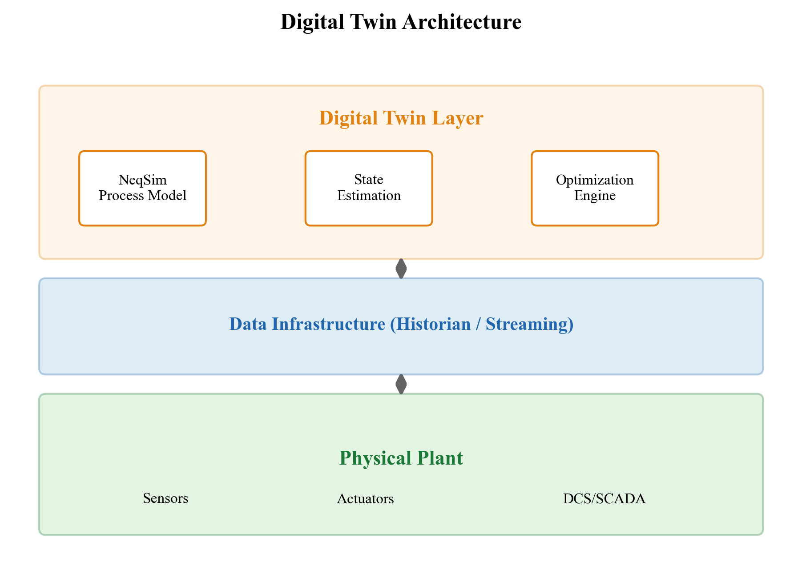
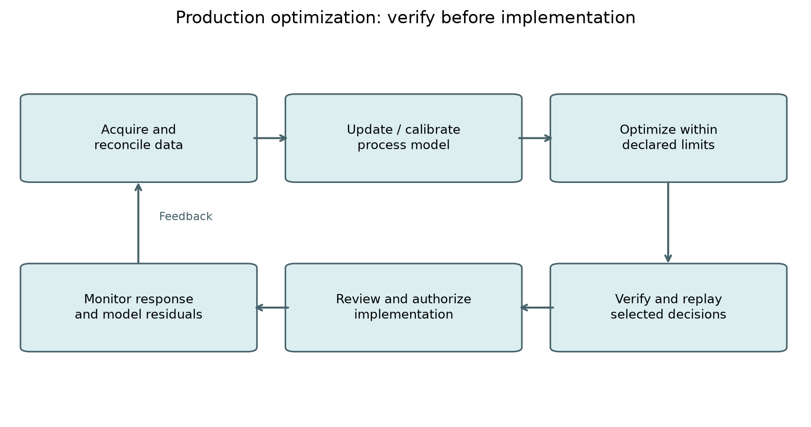
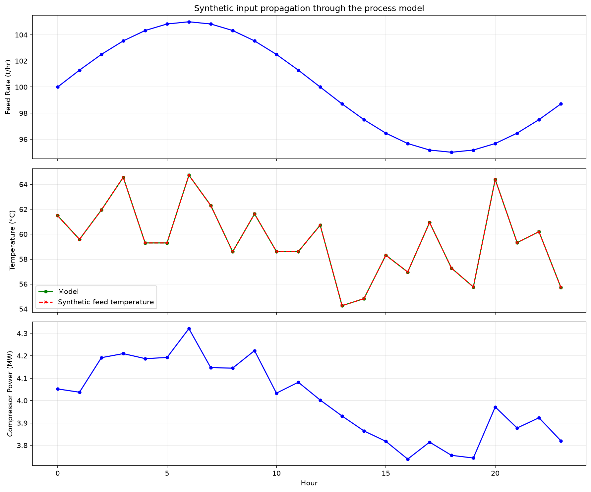
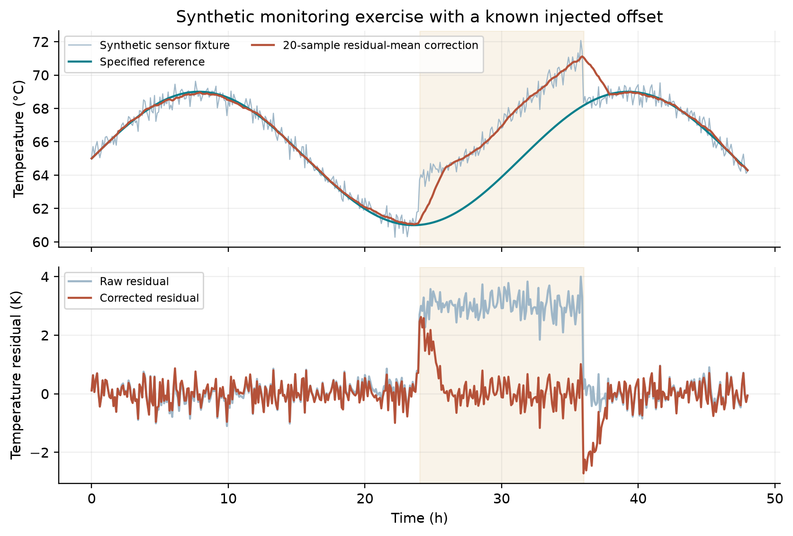
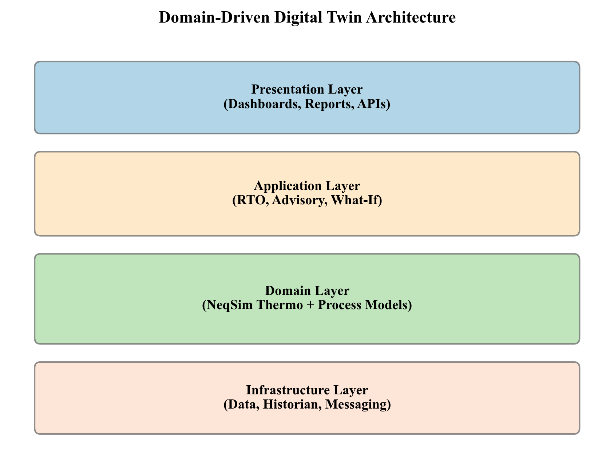
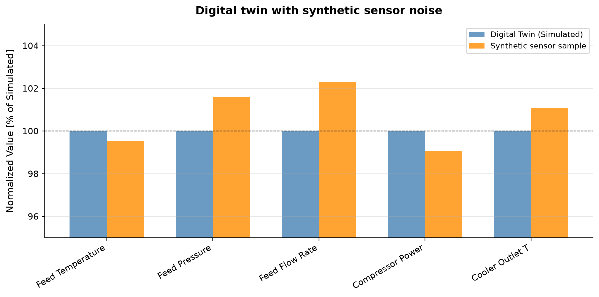

# Digital Twins, Automation, and AI-Assisted Optimization

<!-- Chapter metadata -->
<!-- Notebooks: ch21_digital_twin_loop.ipynb, ch21_automation_api.ipynb, ch21_lifecycle_state.ipynb -->
<!-- Estimated pages: 25 -->

## Learning Objectives

After reading this chapter, the reader will be able to:

1. Define the digital twin concept and describe its three pillars: physical model, data integration, and decision support
2. Classify digital twins by maturity level (Level 1 steady-state through Level 4 predictive) and identify the requirements and benefits of each level
3. Explain how process models connect to plant data through historian systems (OSIsoft PI, Aspen IP.21), OPC, and tag mapping
4. Describe model calibration techniques including data reconciliation, parameter estimation, and bias updating
5. Outline the real-time optimization (RTO) loop and explain the role of model predictive control (MPC) in production optimization
6. Discuss AI and machine learning approaches — hybrid physics+ML models, surrogate models, reinforcement learning, and anomaly detection — and assess their applicability to production optimization
7. Use NeqSim's ProcessAutomation API for string-addressable variable access, including fuzzy matching, self-healing diagnostics, and auto-correction
8. Build multi-area process models using ProcessModel and manage lifecycle state with save/restore/compare snapshots
9. Design and implement a digital twin loop: read plant data → update model → run simulation → compare results → adjust parameters

---

## 30.1 Introduction

The concept of a **digital twin** — a virtual replica of a physical asset that is continuously updated with real-world data — has transformed how oil and gas production facilities are designed, operated, and optimized. The term was popularized in manufacturing and aerospace, but the oil and gas industry has long practiced a primitive form of digital twinning: engineers have built process models, updated them with field data, and used them to optimize operations for decades. What has changed is the degree of automation, connectivity, and intelligence.

A modern digital twin is not just a model. It is a **living system** that:

- Mirrors the current state of the physical asset in near real-time
- Predicts future behavior under different operating scenarios
- Recommends optimal actions to operators or automated control systems
- Learns from operational experience and improves over time

For production optimization, the digital twin provides the critical link between the optimization methods of Chapter 22, the dynamic simulation capabilities of Chapter 29, and the reality of day-to-day operations. It answers the question that steady-state optimization alone cannot: *Given the current state of the reservoir, wells, and facilities — not the design conditions, but the actual conditions right now — what should we do differently to produce more efficiently?*

### 30.1.1 The Three Pillars of a Digital Twin

A digital twin stands on three pillars:

| Pillar | Description | Key Technologies |
|--------|-------------|-----------------|
| **Physical Model** | First-principles simulation of the process | Thermodynamics, fluid mechanics, heat transfer (NeqSim) |
| **Data Integration** | Connection to real-time and historical plant data | Historian systems, OPC, SCADA, tag mapping |
| **Decision Support** | Analytics, optimization, and recommendations | RTO, MPC, machine learning, agent-based systems |

Without a physical model, you have pure data analytics — powerful for pattern recognition but dependent on justified assumptions when extrapolating beyond the historical operating range. Without data integration, you have an offline model — useful for design but disconnected from operations. Without decision support, you have a monitoring system — informative but not actionable.

The digital twin combines all three to create an intelligent advisory system that improves production outcomes.



### 30.1.2 Digital Twin Maturity Levels

Digital twins exist at various levels of sophistication. The following four-level classification is a teaching framework for this chapter, not an industry certification standard. Frequencies are illustrative:

**Level 1 — Steady-State Model.** A calibrated process model that represents the facility at its current design basis. Updated manually — perhaps monthly or quarterly — by engineers who adjust the model to match recent test data. Answers "what if" questions about equipment changes or new operating conditions. Its adequacy depends on the intended decision and update interval.

**Level 2 — Calibrated Model.** The model is regularly calibrated against measured data using data reconciliation and parameter estimation. Updated daily to weekly. Accounts for fouling, degradation, and changing feed conditions. Used for performance monitoring and debottlenecking studies.

**Level 3 — Real-Time Model.** The model is continuously connected to plant data (via OPC or historian) and automatically updated at intervals of minutes to hours. Provides real-time equipment performance indicators, detection of abnormal situations, and operator advisory guidance. Requires robust data quality handling and automated exception management.

**Level 4 — Predictive/Prescriptive Model.** The model not only tracks the current state but predicts future states and recommends optimal actions. Incorporates machine learning for pattern recognition and forecasting. Closes the loop through integration with the distributed control system (DCS) or advanced process control (APC). The fully autonomous digital twin.

| Level | Update Frequency | Data Connection | Automation | Primary Value |
|-------|-----------------|-----------------|------------|---------------|
| 1 | Monthly/quarterly | Manual data entry | None | Design studies |
| 2 | Daily/weekly | Batch historian | Semi-automated | Performance monitoring |
| 3 | Minutes/hours | Real-time OPC/historian | Automated | Operator advisory |
| 4 | Continuous | Closed-loop with DCS | Fully automated | Autonomous optimization |

Each level builds on the previous one. A Level 4 digital twin requires the robust physical model of Level 1, the calibration methods of Level 2, and the data connectivity of Level 3. Deploy predictive or closed-loop functions only after verifying the model, data pipeline, operating envelope and fallback behavior required by that particular function.

---

## 30.2 Connecting Models to Plant Data

### 30.2.1 Historian Systems

Plant data in oil and gas facilities is stored in **historian systems** — specialized time-series databases optimized for high-frequency process data. Two examples are:

- **OSIsoft PI** (now AVEVA PI): An industrial time-series historian. Stores billions of data points with lossy compression for efficient storage. Accessed via PI Web API or PI SDK.
- **Aspen IP.21** (InfoPlus.21): Used alongside Aspen's process optimization suite. Accessed via Aspen REST API.

Both systems store data as **tags** — named time-series channels identified by a hierarchical naming convention. A typical tag name encodes the plant area, equipment, measurement type, and signal attribute:

```text
BA-20100-PT-2101.PV     # Platform BA, Separator 20100, PT transmitter 2101, Process Value
BA-20200-TT-2201.PV     # Platform BA, Compressor 20200, TT transmitter 2201, Process Value
BA-20100-LC-2103.SP     # Level controller set point
BA-20100-LC-2103.OP     # Level controller output (valve position)
```

### 30.2.2 Tag Mapping

The critical link between a process model and plant data is the **tag mapping** — a table that associates each model variable with its corresponding historian tag:

| Model Variable | Tag Name | Unit | Description |
|---------------|----------|------|-------------|
| HP Sep pressure | `BA-20100-PT-2101.PV` | bara | HP separator operating pressure |
| HP Sep temperature | `BA-20100-TT-2102.PV` | °C | HP separator temperature |
| HP Sep level | `BA-20100-LT-2103.PV` | % | HP separator liquid level |
| Gas outlet flow | `BA-20100-FT-2104.PV` | Sm³/hr | Gas outlet volumetric flow |
| Compressor power | `BA-20200-JI-2201.PV` | kW | Compressor shaft power |
| Feed rate | `BA-10100-FT-1001.PV` | kg/hr | Wellstream total flow |

In NeqSim, tag mapping is implemented as a Python dictionary:

```python
TAG_MAP = {
    "hp_sep_pressure":    "BA-20100-PT-2101.PV",
    "hp_sep_temperature": "BA-20100-TT-2102.PV",
    "hp_sep_level":       "BA-20100-LT-2103.PV",
    "gas_outlet_flow":    "BA-20100-FT-2104.PV",
    "compressor_power":   "BA-20200-JI-2201.PV",
    "feed_rate":          "BA-10100-FT-1001.PV",
}
```

### 30.2.3 Reading Historian Data with Tagreader

The `tagreader` Python package provides a unified interface to both PI and IP.21 historians:

**Execution scope:** This integration pattern requires authenticated historian and site tag configuration. It is not a standalone validated process calculation.

```python pattern: requires authenticated historian and site tag configuration
import tagreader
import pandas as pd

# Connect to the historian
client = tagreader.IMSClient("MY_PI_SOURCE", "piwebapi")
client.connect()

# Read 12 hours of data at 5-minute intervals
tags = list(TAG_MAP.values())
start = "01.06.2025 06:00:00"
end = "01.06.2025 18:00:00"
interval = 300  # seconds

df = client.read(tags, start, end, interval)
# Returns: DataFrame with DatetimeIndex, one column per tag
print(f"Read {len(df)} rows x {len(df.columns)} tags")
```

For time-weighted averages (preferred for comparing with steady-state models):

**Execution scope:** This integration pattern requires authenticated historian and site tag configuration. It is not a standalone validated process calculation.

```python pattern: requires authenticated historian and site tag configuration
df_avg = client.read(tags, start, end, interval,
                     read_type=tagreader.ReaderType.AVG)
```

For detecting abnormal conditions, read min/max within each interval:

**Execution scope:** This integration pattern requires authenticated historian and site tag configuration. It is not a standalone validated process calculation.

```python pattern: requires authenticated historian and site tag configuration
df_min = client.read(tags, start, end, interval,
                     read_type=tagreader.ReaderType.MIN)
df_max = client.read(tags, start, end, interval,
                     read_type=tagreader.ReaderType.MAX)

# Flag intervals where range exceeds threshold
df_range = df_max - df_min
unstable = df_range > threshold  # Boolean mask
```

### 30.2.4 OPC Communication

**OPC UA (Open Platform Communications Unified Architecture)** is the modern standard for real-time industrial data exchange. Unlike historian systems that store historical data, OPC provides live, real-time values directly from the control system.

For Level 3 and Level 4 digital twins, OPC UA provides:

- Sub-second update rates for real-time model tracking
- Bidirectional communication (read measurements, write set points)
- Structured data with metadata (engineering units, quality codes, timestamps)
- Security through certificates and encrypted channels

In Python, OPC UA communication is available through the `opcua` or `asyncua` packages. Integration with NeqSim follows the same pattern as historian-based twins but with a real-time data source instead of historical queries.

### 30.2.5 Data Quality Handling

Real plant data is noisy, intermittent, and sometimes simply wrong. A robust digital twin must handle:

| Data Issue | Detection | Remediation |
|-----------|-----------|-------------|
| Missing values (NaN) | Value and quality-code checks | Reject required inputs; impute only within a declared maximum gap and retain an imputation flag |
| Frozen values | Age, variance and redundant measurements | Investigate; a constant value may be valid or stale |
| Out-of-range values | Comparison with declared model limits | Reject for model acceptance; retain raw evidence |
| Spikes/outliers | Robust residual and quality checks | Flag and investigate before exclusion; retain raw samples |
| Time alignment | Timestamp comparison | Resample to common grid |
| Sensor drift | Comparison with model or redundant sensor | Apply bias correction |

```python
import numpy as np
import pandas as pd

def clean_plant_data(df,tag_limits):
    """Preserve raw data; flag missing/nonfinite/out-of-range values, without imputation."""
    if not isinstance(df.index,pd.DatetimeIndex) or df.index.has_duplicates:
        raise ValueError('Unique timestamps are required')
    if not df.index.is_monotonic_increasing:
        raise ValueError('Timestamps must increase')
    clean=df.astype(float).copy();invalid=~np.isfinite(clean)
    for col in clean.columns:
        if col not in tag_limits:raise ValueError('Missing limits for '+col)
        lo,hi=tag_limits[col];invalid[col]|=(clean[col]<lo)|(clean[col]>hi)
    clean=clean.mask(invalid)
    clean.attrs['invalid_mask']=invalid
    return clean

tag_limits={'pressure':(10.0,100.0)}
raw=pd.DataFrame({'pressure':[60.0,61.0,999.0,np.nan]},
                 index=pd.date_range('2026-01-01',periods=4,freq='min',tz='UTC'))
clean=clean_plant_data(raw,tag_limits)
assert raw.iloc[2,0]==999.0 and clean.iloc[:2,0].notna().all()
assert clean.iloc[2:,0].isna().all() and clean.attrs['invalid_mask'].sum().iloc[0]==2
# A required invalid tag blocks model updating; site quality/age flags are additional inputs.
```

---

## 30.3 Model Calibration and Data Reconciliation

### 30.3.1 Why Calibration Is Needed

Even the best process model will not exactly match plant measurements because:

- **Model simplifications**: The model may not capture every detail (heat losses, minor leaks, recycle effects)
- **Parameter uncertainty**: Equipment parameters degrade over time (fouling, wear, catalyst deactivation)
- **Measurement uncertainty**: Instruments have finite accuracy and drift between calibrations
- **Composition changes**: Feed composition varies continuously, but is measured infrequently (lab samples)

Calibration adjusts model parameters to minimize the discrepancy between simulated and measured values, subject to measurement uncertainty bounds.

### 30.3.2 Data Reconciliation

Data reconciliation exploits the fact that process measurements must satisfy conservation laws (mass, energy). With unbiased Gaussian measurement errors, positive-definite covariance and correct linear constraints, weighted least squares gives a constrained maximum-likelihood estimate:

$$
\min_{x} \quad (x - x_m)^T V^{-1} (x - x_m)
$$

$$
\text{subject to:} \quad A x = 0
$$

where $x$ is the vector of reconciled values, $x_m$ is the vector of measured values, $V$ is the measurement error covariance matrix, and $A x = 0$ represents the conservation constraints.

The solution is:

$$
x^* = x_m - V A^T (A V A^T)^{-1} A x_m
$$

The inverse requires independent constraint rows; use a rank-revealing method if they are redundant. Reconciliation reduces random error under the model assumptions. Standardized residual tests can flag gross errors, but do not uniquely identify a failed instrument without sufficient redundancy.

### 30.3.3 Parameter Estimation

Given reconciled data, parameter estimation determines the model parameters that best reproduce the observed behavior:

$$
\min_{\theta} \quad \sum_{k=1}^{N} \left( \frac{y_k^{\text{model}}(\theta) - y_k^{\text{measured}}}{\sigma_k} \right)^2
$$

where $\theta$ is the vector of adjustable parameters (e.g., heat transfer coefficients, compressor efficiency, separator internals efficiency), $y_k^{\text{model}}$ is the model prediction, $y_k^{\text{measured}}$ is the measured value, and $\sigma_k$ is the measurement standard deviation.

Example calibration parameters and assumed search ranges follow. These are not allowed degradation limits; enforce identifiability, physical bounds and uncertainty:

| Parameter | Equipment | Adjustment Range |
|-----------|-----------|-----------------|
| Heat-transfer conductance $UA$ | Heat exchangers | ±50% (fouling) |
| Polytropic efficiency | Compressors | ±10% (degradation) |
| Valve $C_v$ | Control valves | ±20% (erosion, deposits) |
| Separator efficiency | Separators | ±15% (internals damage) |
| Pipe roughness | Pipelines | ±30% (corrosion, deposits) |
| Feed composition | Inlet streams | Per lab analysis uncertainty |

### 30.3.4 Bias Updating

A simpler alternative to full parameter estimation is **bias updating** — adding a constant correction to each model output to match the measurement:

$$
y_{\text{corrected}}^{\text{model}} = y^{\text{model}} + b
$$

where the bias $b = y^{\text{measured}} - y^{\text{model}}$ is updated at each calibration cycle. This is fast and robust but does not improve the model's ability to predict behavior at different operating conditions.

---

## 30.4 Real-Time Optimization (RTO)

### 30.4.1 The RTO Loop

Real-time optimization is the automated cycle of:

1. **Data collection**: Read current plant measurements from the historian or OPC
2. **Data validation**: Clean, reconcile, and detect gross errors
3. **Steady-state detection**: Verify that the plant is at or near steady state
4. **Model updating**: Calibrate the model to match current conditions
5. **Optimization**: Find the optimal set points subject to current constraints
6. **Implementation**: Send new set points to the DCS (or present to operator)
7. **Wait**: Hold the current set points until the plant reaches the new steady state

The cycle repeats at intervals of 15 minutes to several hours, depending on the process dynamics and the sophistication of the steady-state detection algorithm.

$$
\underbrace{\text{Read data}}_{\text{5 min}} \rightarrow
\underbrace{\text{Validate}}_{\text{2 min}} \rightarrow
\underbrace{\text{SS detect}}_{\text{2 min}} \rightarrow
\underbrace{\text{Calibrate}}_{\text{5 min}} \rightarrow
\underbrace{\text{Optimize}}_{\text{10 min}} \rightarrow
\underbrace{\text{Implement}}_{\text{1 min}}
$$



<!-- scientific-illustration:ch21_rto_cycle.png -->
Each recommendation is checked against the accepted model and operating limits before authorized implementation. Monitoring returns new observations to the reconciliation step. The diagram specifies a workflow; it does not demonstrate a live plant connection.
<!-- /scientific-illustration -->

### 30.4.2 Steady-State Detection

RTO requires the plant to be at or near steady state before calibrating the model. A common steady-state detection criterion is:

$$
\text{SS flag} = \begin{cases} \text{True} & \text{if } \frac{|\bar{x}_{t} - \bar{x}_{t-\Delta t}|}{\max(\sigma_x,\sigma_{\min})} < \epsilon \text{ for all key tags} \\ \text{False} & \text{otherwise} \end{cases}
$$

Here $\sigma_{\min}>0$ is a declared noise floor in the same units as the tag. It prevents division by zero; variance, slope and quality checks remain necessary. The quantities $\bar{x}_t$ and $\bar{x}_{t-\Delta t}$ are the moving averages at the current and previous window, $\sigma_x$ is the standard deviation within the window, and $\epsilon$ is the threshold (typically 0.5–1.0).

In practice, steady-state detection must consider:

- **Multiple variables simultaneously**: All key process variables must satisfy the criterion, not just one. A single unstable variable (e.g., a level oscillating due to slug flow) should prevent RTO execution.
- **Filtering and smoothing**: Raw measurements should be low-pass filtered before applying the SS criterion to avoid false triggers from measurement noise.
- **Minimum duration**: The plant should remain at steady state for a minimum period (e.g., 15–30 minutes) before triggering RTO, to ensure transients have fully decayed.
- **Exclusion of known transients**: Scheduled events (well tests, pigging operations, startup/shutdown) should automatically suppress RTO execution.

The following rolling-window implementation is a local screening example. Event exclusions, quality codes, minimum stable duration and multivariable acceptance require explicit application logic; unchanged means alone cannot exclude sustained oscillations.

```python
def is_steady_state(df,window=30,threshold=.5,min_duration_samples=15,
                    noise_floor=None,max_std=None):
    """Regular sampled-data screen with explicit unit-dependent noise/variation limits."""
    if noise_floor is None or max_std is None:
        raise ValueError('Declare noise floors and maximum standard deviations in tag units')
    if len(df)<2*window+min_duration_samples or not np.isfinite(df.to_numpy()).all():
        return False
    intervals=np.diff(df.index.asi8)
    if len(intervals) and (np.any(intervals<=0) or not np.all(intervals==intervals[0])):
        return False
    means=df.rolling(window).mean();stds=df.rolling(window).std()
    tests=[]
    for col in df.columns:
        floor=float(noise_floor[col]);ceiling=float(max_std[col])
        if floor<=0 or ceiling<=0:raise ValueError('Positive noise/variation limits required')
        normalized=means[col].diff(window).abs()/stds[col].clip(lower=floor)
        tests.append((normalized<threshold)&(stds[col]<=ceiling))
    accepted=pd.concat(tests,axis=1).all(axis=1)
    return bool(accepted.iloc[-min_duration_samples:].all())

times=pd.date_range('2026-01-01',periods=100,freq='min',tz='UTC')
arguments={'noise_floor':{'pressure':.02},'max_std':{'pressure':.1}}
constant=pd.DataFrame({'pressure':np.full(100,60.0)},index=times)
trend=pd.DataFrame({'pressure':np.linspace(60,80,100)},index=times)
oscillation=pd.DataFrame({'pressure':60+np.sin(np.arange(100)*np.pi/5)},index=times)
assert is_steady_state(constant,**arguments)
assert not is_steady_state(trend,**arguments)
assert not is_steady_state(oscillation,**arguments)
missing=constant.copy();missing.iloc[-1,0]=np.nan
assert not is_steady_state(missing,**arguments)
print('Local data-quality contracts: valid constant accepted; trend/oscillation/missing rejected')
# Known events, sensor freeze, multivariable dynamics and site quality flags remain separate gates.
```

### 30.4.3 Optimization Formulation

The RTO optimization problem takes the general form:

$$
\max_{u} \quad J(u) = \text{Revenue}(u) - \text{Operating Cost}(u)
$$

$$
\text{subject to:} \quad h(x, u) = 0 \quad \text{(process model equations)}
$$

$$
g(x, u) \leq 0 \quad \text{(inequality constraints)}
$$

$$
u_{\min} \leq u \leq u_{\max} \quad \text{(operating limits)}
$$

where $u$ is the vector of manipulated variables (set points), $x$ is the vector of process states (computed by the model), $h$ represents the process model (NeqSim), and $g$ represents operational constraints.

Typical manipulated variables in production optimization:

| Variable | Typical Range | Impact |
|----------|--------------|--------|
| Separator pressure | ±20% of design | Liquid recovery, compressor power |
| Choke opening | 10–100% | Well production rate |
| Gas lift rate | 0–max per well | Oil production, gas availability |
| Compressor speed | 60–105% | Gas throughput, power |
| TEG circulation rate | 0.5–3.0 × minimum | Gas moisture specification |
| Cooler outlet temperature | Limited by ambient | Dewpoint, liquid recovery |

### 30.4.4 RTO Benefits in Production Optimization

RTO value must be measured against a matched baseline with uncertainty, availability and operating constraints held consistently. No field benefit dataset is supplied here. As a transparent economic sensitivity, an **assumed** 3% increment on 50,000 bbl/day at USD 100/bbl gives USD 54.75 million/year gross revenue at 365 operating days, before costs, decline, downtime and tax. It is not a predicted improvement.

### 30.4.5 The RealTimeOptimizationLoop API

NeqSim packages the seven-step RTO cycle of Section 30.4.1 into a single composable object, `RealTimeOptimizationLoop` (package `neqsim.process.fielddevelopment.integrated`). Each stage of the loop is supplied as a pluggable component through a fluent builder, and `run(cycles)` executes the closed loop for the requested number of iterations:

**Execution scope:** This integration pattern requires reader calibrator optimizer and writer callbacks. It is not a standalone validated process calculation.

```python pattern: requires reader calibrator optimizer and writer callbacks
RealTimeOptimizationLoop = jneqsim.process.fielddevelopment.integrated.RealTimeOptimizationLoop

loop = (RealTimeOptimizationLoop()
        .setReader(historian_reader)        # supplies current measurements
        .setCalibrator(model_calibrator)    # reconciles the model to data
        .setOptimizer(setpoint_optimizer)   # computes new setpoints
        .setWriter(setpoint_writer)         # pushes setpoints back to the DCS
        .setObjectiveProbe(objective_probe))  # records the objective each cycle

records = loop.run(24)                       # e.g. 24 hourly cycles
for rec in records:
    print(f"cycle {rec.getCycle()}: objective = {rec.getObjective():.1f}")
```

Each `CycleRecord` captures the cycle index, the `measurements`, the applied `setpoints`, and the resulting `objective`, so the full optimization history is available via `getHistory()` or serialized with `toJson()` for audit and trend analysis. The reader, calibrator, optimizer, and writer interfaces map directly onto the data-acquisition (Section 30.2), reconciliation (Section 30.3), optimization (Section 30.4.3), and implementation steps — letting a digital twin be assembled from the building blocks introduced earlier in this chapter. The optimizer stage is typically backed by the `AgenticProcessOptimizer` of Section 30.11.

---

## 30.5 Model Predictive Control (MPC)

### 30.5.1 MPC Fundamentals

Model Predictive Control extends RTO to a dynamic setting. Instead of optimizing steady-state set points, MPC optimizes a sequence of future control moves over a **prediction horizon**:

$$
\min_{u_0, u_1, \ldots, u_{N-1}} \quad \sum_{k=0}^{N-1} \left[ (y_k - y_k^{\text{ref}})^T Q (y_k - y_k^{\text{ref}}) + \Delta u_k^T R \, \Delta u_k \right]
$$

$$
\text{subject to:} \quad x_{k+1} = f(x_k, u_k)
$$

$$
y_k = g(x_k)
$$

$$
u_{\min} \leq u_k \leq u_{\max}
$$

$$
y_{\min} \leq y_k \leq y_{\max}
$$

This stage-cost form has $N$ control moves; a terminal state cost can be added separately. Use positive-semidefinite $Q,R$, a state estimate at the current time and explicit move limits. The formulation alone does not establish closed-loop stability or recursive feasibility. Here $y_k$ are the controlled variables, $u_k$ are the manipulated variables, $\Delta u_k = u_k - u_{k-1}$ are the control moves, $Q$ and $R$ are weighting matrices, and $N$ is the prediction horizon.

MPC offers several advantages over PID-based control:

| Feature | PID | MPC |
|---------|-----|-----|
| Organization | Single loops or coordinated multiloop arrangements | Explicit multivariable prediction |
| Constraint handling | Limited (output clamping) | Explicit constraints |
| Anticipation | None (reactive only) | Predicts future behavior |
| Interaction | Tuned independently | Coordinated |
| Model requirements | Tuning information; no mandatory explicit model | Identified linear, reduced nonlinear, or full dynamic model |

### 30.5.2 MPC in Oil and Gas Production

Common MPC applications in production facilities:

- **Compressor optimization**: Coordinate speed, suction valve, and recycle valve to minimize power while maintaining throughput and surge margin
- **Separator train optimization**: Coordinate pressures across HP/MP/LP separators to maximize liquid recovery
- **Gas processing**: Control temperature, pressure, and TEG circulation in the dehydration unit
- **Export quality management**: Maintain gas dew point and H₂S specifications while maximizing throughput

### 30.5.3 Integration of MPC with NeqSim

The pinned NeqSim source includes `ModelPredictiveController`, with an internal first-order discrete model, single- and multiple-input configurations and linear quality constraints. It is not a general nonlinear full-flowsheet MPC solver. External MPC integration remains an option; in either case validate the prediction model and accepted dynamic inventory calculation before designing the controller \cite{neqsim2026update}. An external integration pattern is:

1. Build and balance-check the NeqSim dynamic process model (Chapter 29)
2. Identify the MPC variables (CVs, MVs, DVs)
3. Generate step response data by perturbing each MV and recording the CV responses
4. Build the MPC model (typically in a dedicated MPC package)
5. At each control interval, update the NeqSim model with plant data and provide it to the MPC as the current state

---

## 30.6 AI and Machine Learning in Production Optimization

### 30.6.1 The Role of AI/ML

Artificial intelligence and machine learning complement — but do not replace — physics-based process models in production optimization. The key insight is that physics-based models and data-driven models have complementary strengths:

| Aspect | Physics-Based | Data-Driven |
|--------|--------------|-------------|
| Extrapolation | Limited by constitutive models and phase/geometry validity | Limited by data and imposed structure |
| Data requirements | Fluid characterization, geometry, boundaries and equipment evidence | Representative input/output data and uncertainty |
| Speed | Medium (seconds per run) | Fast (milliseconds) |
| Uncertainty | Inputs, structure, parameters and numerics | Data, model structure, training and distribution shift |
| Interpretability | High (physical variables) | Low (black box) |
| Adaptation | Controlled recalibration | Retraining if implemented and independently evaluated |

### 30.6.2 Hybrid Physics+ML Models

The most promising approach combines physics and ML in a **hybrid model**:

$$
y = f_{\text{physics}}(x; \theta) + g_{\text{ML}}(x; w)
$$

The physics model $f_{\text{physics}}$ captures the known behavior (thermodynamics, conservation laws), and the ML model $g_{\text{ML}}$ learns the residual — the systematic discrepancy between the physics model and reality. This hybrid approach:

- Can reduce residual error when the physical model supplies useful structure
- Requires held-out and extrapolation tests; improved fit is not guaranteed
- Must preserve physical bounds and recompute conservation-consistent outputs

**Example**: A hybrid model for compressor performance:

$$
\eta_{\text{hybrid}} = \eta_{\text{NeqSim}}(\dot{m}, P_s, P_d, T_s) + \Delta\eta_{\text{NN}}(\dot{m}, P_s, P_d, T_s, t_{\text{run}})
$$

Constrain the corrected efficiency to its justified range within $(0,1]$ and rerun compression with that efficiency; independently correcting power and temperature can violate energy conservation. Here $\eta_{\text{NeqSim}}$ is the polytropic efficiency from the NeqSim compressor model, and $\Delta\eta_{\text{NN}}$ is a neural network correction that accounts for degradation over run-time $t_{\text{run}}$, fouling, and other effects not captured by the physics model.

### 30.6.3 Surrogate Models

When the physics model is too slow for real-time optimization (e.g., a full compositional reservoir-to-export model that takes minutes per run), a **surrogate model** trained on simulation results can approximate the predictions at lower evaluation cost, with a measured error envelope:

1. **Design of experiments**: Generate a space-filling set of input conditions (Latin Hypercube Sampling)
2. **Run the physics model** at each design point
3. **Train the surrogate**: Gaussian process, neural network, or polynomial response surface
4. **Validate**: Compare surrogate predictions with physics model on held-out test points
5. **Deploy**: Use the surrogate in the optimization loop

**Execution scope:** This integration pattern requires caller calibration dataset and scikit-learn. It is not a standalone validated process calculation.

```python pattern: requires caller calibration dataset and scikit-learn
import numpy as np
from sklearn.gaussian_process import GaussianProcessRegressor
from sklearn.gaussian_process.kernels import RBF, ConstantKernel

# Assume X_train (n_samples x n_features) and y_train (n_samples)
# from NeqSim simulations
kernel = ConstantKernel(1.0) * RBF(length_scale=1.0)
gpr = GaussianProcessRegressor(kernel=kernel, n_restarts_optimizer=10)
gpr.fit(X_train, y_train)

# Predict with uncertainty
y_pred, y_std = gpr.predict(X_test, return_std=True)
# y_std provides confidence intervals for the prediction
```

### 30.6.4 Reinforcement Learning

Reinforcement learning (RL) trains an agent to make sequential decisions by interacting with an environment and receiving rewards. For production optimization:

- **State**: Current process conditions (pressures, temperatures, levels, flows)
- **Action**: Set point changes (separator pressure, choke position, gas lift rate)
- **Reward**: Production rate, energy efficiency, constraint satisfaction
- **Environment**: NeqSim process model (provides the transition dynamics)

The RL agent learns a **policy** $\pi(s) \rightarrow a$ that maps states to actions to maximize cumulative reward. The advantage over classical optimization is that RL can:

- Handle sequential decisions over time
- Learn from exploration (discover non-obvious strategies)
- Adapt to changing conditions without explicit re-optimization

### 30.6.5 Anomaly Detection

ML-based anomaly detection identifies unusual operating conditions that may indicate equipment degradation, sensor failure, or process upsets:

$$
\text{anomaly score} = (x-\hat{x})^T S^{-1}(x-\hat{x})
$$

where $x$ is the current measurement vector and $\hat{x}$ is the expected value from a normal-operation model (autoencoder, PCA, or physics model).

Here $S$ is a positive-definite residual covariance matrix estimated from representative nominal data, including measurement noise and model discrepancy. For an autoencoder, standardized residuals with a held-out empirical threshold are also possible. Raw squared differences cannot be added across pressure, temperature and flow units. An alert means that the calibrated residual distribution was exceeded; it does not by itself identify a fault or distinguish sensor bias, model error and an unrepresented operating regime.

---

## 30.7 The ProcessAutomation API

NeqSim provides the `ProcessAutomation` API for string-addressable variable access — the foundation for connecting a process model to external systems (historians, optimization engines, AI agents). Instead of navigating Java class hierarchies, the automation API lets you read and write simulation variables using human-readable addresses.

### 30.7.1 Basic Usage

```python
import jpype
jneqsim = jpype.JPackage("neqsim")
import json

# --- Build a process model ---
fluid = jneqsim.thermo.system.SystemSrkEos(273.15 + 60.0, 50.0)
fluid.addComponent("methane", 0.75)
fluid.addComponent("ethane", 0.10)
fluid.addComponent("propane", 0.05)
fluid.addComponent("n-pentane", 0.05)
fluid.addComponent("n-heptane", 0.05)
fluid.setMixingRule("classic")

Stream = jneqsim.process.equipment.stream.Stream
Separator = jneqsim.process.equipment.separator.Separator
Compressor = jneqsim.process.equipment.compressor.Compressor
Cooler = jneqsim.process.equipment.heatexchanger.Cooler
ThrottlingValve = jneqsim.process.equipment.valve.ThrottlingValve
ProcessSystem = jneqsim.process.processmodel.ProcessSystem

feed = Stream("Feed Gas", fluid)
feed.setFlowRate(100000.0, "kg/hr")
feed.setTemperature(60.0, "C")
feed.setPressure(50.0, "bara")

sep = Separator("HP Separator", feed)
compressor = Compressor("Export Compressor", sep.getGasOutStream())
compressor.setOutletPressure(150.0, "bara")
compressor.setPolytropicEfficiency(0.78)
compressor.setUsePolytropicCalc(True)

aftercooler = Cooler("Aftercooler", compressor.getOutletStream())
aftercooler.setOutTemperature(273.15 + 35.0)

liq_valve = ThrottlingValve("Liq Valve", sep.getLiquidOutStream())
liq_valve.setOutletPressure(10.0, "bara")

process = ProcessSystem()
process.add(feed)
process.add(sep)
process.add(compressor)
process.add(aftercooler)
process.add(liq_valve)
process.run()

# --- Use the Automation API ---
auto = process.getAutomation()

# Discover equipment
units = auto.getUnitList()
print("Equipment units:", [str(u) for u in units])

# Discover variables for the separator
sep_vars = auto.getVariableList("HP Separator")
for v in sep_vars:
    print(f"  {v.getAddress()} [{v.getType()}] "
          f"unit={v.getDefaultUnit()} : {v.getDescription()}")

# Read values with unit conversion
T_sep = auto.getVariableValue(
    "HP Separator.gasOutStream.temperature", "C")
P_sep = auto.getVariableValue("HP Separator.pressure", "bara")
power = auto.getVariableValue("Export Compressor.power", "MW")

print(f"\nSeparator gas T = {T_sep:.1f} °C")
print(f"Separator P = {P_sep:.1f} bara")
print(f"Compressor power = {power:.2f} MW")

# Write a new value and re-run
auto.setVariableValue("Export Compressor.outletPressure", 170.0, "bara")
process.run()

power_new = auto.getVariableValue("Export Compressor.power", "MW")
print(f"Compressor power at 170 bara = {power_new:.2f} MW")
```

### 30.7.2 Variable Types: INPUT vs OUTPUT

The automation API distinguishes between two types of variables:

| Type | Description | Examples |
|------|-------------|---------|
| **INPUT** | Can be read and written | Outlet pressure, set point, flow rate |
| **OUTPUT** | Read-only (computed by simulation) | Temperature, density, power, efficiency |

Attempting to write to an OUTPUT variable raises an error. Use `getVariableList()` to discover which variables are writable:

```python
# Filter INPUT variables only
sep_vars = auto.getVariableList("HP Separator")
input_vars = [v for v in sep_vars if str(v.getType()) == "INPUT"]
for v in input_vars:
    print(f"Writable: {v.getAddress()} ({v.getDescription()})")
```

### 30.7.3 Self-Healing Automation

The automation API includes **self-healing** capabilities for agents and external systems that may not know the exact variable names. The safe accessors provide fuzzy matching, auto-correction, and diagnostics:

```python
# Safe get — returns JSON with value or diagnostics
result_json = auto.getVariableValueSafe(
    "hp separator.temperature", "C")  # Note: wrong case
result = json.loads(str(result_json))

if result["status"] == "auto_corrected":
    print(f"Auto-corrected: '{result['originalAddress']}' "
          f"-> '{result['correctedAddress']}'")
    print(f"Value: {result['value']} {result['unit']}")
elif result["status"] == "error":
    print(f"Error: {result['message']}")
    print(f"Suggestions: {result['suggestions']}")

# Safe set — validates physical bounds before writing
set_result = auto.setVariableValueSafe(
    "Export Compressor.outletPressure", 170.0, "bara")
set_info = json.loads(str(set_result))
print(f"Set result: {set_info['status']}")
```

The self-healing features include:

- **Fuzzy name matching**: Finds the closest unit/property name when the exact match fails (edit distance $\leq 2$)
- **Case insensitivity**: `"hp separator"` matches `"HP Separator"`
- **Auto-correction memory**: Remembers past corrections for instant reuse in subsequent calls
- **Physical bounds validation**: Rejects values outside physically reasonable ranges (e.g., negative absolute pressure, temperature below 0 K)
- **Operation tracking**: Maintains statistics on success/failure rates for diagnostics

### 30.7.4 Diagnostics and Learning

The automation API tracks operations and provides a learning report:

```python
# Access diagnostics
diagnostics = auto.getDiagnostics()
report = diagnostics.getLearningReport()
print(str(report))
# Output: operation counts, success rates, common errors,
#         learned corrections, recommendations
```

This is particularly valuable for AI agents that interact with the model iteratively — the diagnostics help the agent improve its queries over time.

---

## 30.8 Multi-Area Process Models with ProcessModel

### 30.8.1 Why Multi-Area Models

Real production facilities consist of multiple process areas — separation, compression, gas treatment, water treatment, export — each with its own equipment, control loops, and operational constraints. Modeling the entire facility in a single `ProcessSystem` becomes unwieldy for large plants.

NeqSim's `ProcessModel` class allows you to split the facility into named areas, each represented by a separate `ProcessSystem`, and compose them into a single coordinated model:

```python
import jpype
jneqsim = jpype.JPackage("neqsim")

ProcessModel = jneqsim.process.processmodel.ProcessModel
ProcessSystem = jneqsim.process.processmodel.ProcessSystem

# Build each area as a separate ProcessSystem
separation = ProcessSystem()
separation.add(feed)
separation.add(sep)

compression = ProcessSystem()
compression.add(compressor)

gas_treatment = ProcessSystem()
gas_treatment.add(aftercooler)

# Compose into a plant model
plant = ProcessModel()
plant.add("Separation", separation)
plant.add("Compression", compression)
plant.add("Gas Treatment", gas_treatment)

# Run the entire plant (iterates until convergence)
plant.run()
convergence = plant.getConvergenceSummary()
print(str(convergence))
```

### 30.8.2 Area-Qualified Automation Addresses

The automation API for `ProcessModel` uses **area-qualified addresses**:

```python
plant_auto = plant.getAutomation()

# List areas
areas = plant_auto.getAreaList()
print("Areas:", [str(a) for a in areas])

# Read variables with area prefix
T = plant_auto.getVariableValue(
    "Separation::HP Separator.gasOutStream.temperature", "C")
power = plant_auto.getVariableValue(
    "Compression::Export Compressor.power", "MW")

# Write variables with area prefix
plant_auto.setVariableValue(
    "Compression::Export Compressor.outletPressure", 170.0, "bara")
plant.run()
```

The `::` separator distinguishes the area name from the equipment address within that area. This allows equipment in different areas to have the same name without ambiguity.

---

## 30.9 Lifecycle State Management

### 30.9.1 Save, Restore, and Compare

Production optimization is an ongoing process. Models evolve as the facility changes — new wells come online, equipment is modified, reservoir conditions change. NeqSim's lifecycle state management provides portable JSON snapshots for:

- **Reproducibility**: Restore supported captured fields with pinned source/dependencies and verify rerun outputs
- **Version tracking**: Track how the model has changed over time
- **Design reviews**: Compare proposed changes with the current baseline
- **Audit trails**: Document what model was used for each optimization decision

```python
import jpype
jneqsim = jpype.JPackage("neqsim")
import json

ProcessSystemState = jneqsim.process.processmodel.lifecycle.ProcessSystemState
ProcessModelState = jneqsim.process.processmodel.lifecycle.ProcessModelState

# --- Save a snapshot ---
state = ProcessSystemState.fromProcessSystem(process)
state.setName("Gas Processing Baseline")
state.setVersion("1.0.0")
state.saveToFile("model_v1.json")
print("Saved model state v1.0.0")

# --- Load a saved snapshot ---
loaded = ProcessSystemState.loadFromFile("model_v1.json")
validation = loaded.validate()
print(f"Valid: {validation.isValid()}")

# --- Compare two versions ---
# After making changes to the model...
auto.setVariableValue("Export Compressor.outletPressure", 170.0, "bara")
process.run()

state_v2 = ProcessSystemState.fromProcessSystem(process)
state_v2.setVersion("2.0.0")
state_v2.saveToFile("model_v2.json")
```

### 30.9.2 Multi-Area State Management

For `ProcessModel`, the state captures all areas:

```python
# Save entire plant state
plant_state = ProcessModelState.fromProcessModel(plant)
plant_state.setName("Platform Model")
plant_state.setVersion("1.0.0")
plant_state.saveToFile("plant_v1.json")

# After optimization changes...
plant_state_v2 = ProcessModelState.fromProcessModel(plant)
plant_state_v2.setVersion("2.0.0")

# Compare versions
diff = ProcessModelState.compare(plant_state, plant_state_v2)
if diff.hasChanges():
    print("Modified parameters:")
    for param in diff.getModifiedParameters():
        print(f"  {param}")
    print("Added equipment:")
    for eq in diff.getAddedEquipment():
        print(f"  {eq}")
```

### 30.9.3 Compressed State for Network Transfer

For API-based architectures and edge computing, compressed binary transfer is more efficient than JSON files:

```python
# Compress to bytes (no disk I/O)
compressed = plant_state.toCompressedBytes()
print(f"Compressed size: {len(compressed)} bytes")

# Restore from bytes
restored = ProcessModelState.fromCompressedBytes(compressed)
print(f"Restored: {restored.getName()} v{restored.getVersion()}")
```

---

## 30.10 Building a Digital Twin Loop

### 30.10.1 The Core Pattern

A digital twin loop reads plant data, updates the model, runs the simulation, and compares results. This section demonstrates the complete pattern using NeqSim:

```python
import jpype
jneqsim = jpype.JPackage("neqsim")
import numpy as np
import json

# Assume 'process' is a fully built NeqSim ProcessSystem
# Assume TAG_MAP maps model variables to historian tags

def digital_twin_update(process, plant_data, tag_map):
    """Perform one cycle of the digital twin update loop.

    Args:
        process: NeqSim ProcessSystem
        plant_data: dict of tag_name -> measured value
        tag_map: dict of model_variable -> tag_name

    Returns:
        dict with model predictions and comparison metrics
    """
    auto = process.getAutomation()
    results = {}

    # Step 1: Update model inputs from plant data
    input_mappings = {
        "Feed Gas.flowRate": ("feed_rate", "kg/hr"),
        "Feed Gas.temperature": ("feed_temperature", "C"),
        "Feed Gas.pressure": ("feed_pressure", "bara"),
    }

    for model_addr, (data_key, unit) in input_mappings.items():
        tag = tag_map[data_key]
        if tag in plant_data and not np.isnan(plant_data[tag]):
            auto.setVariableValue(model_addr, plant_data[tag], unit)

    # Step 2: Run the model
    process.run()

    # Step 3: Compare model predictions with measurements
    comparison_points = {
        "hp_sep_pressure": ("HP Separator.pressure", "bara"),
        "hp_sep_temperature": (
            "HP Separator.gasOutStream.temperature", "C"),
        "compressor_power": ("Export Compressor.power", "MW"),
    }

    for key, (model_addr, unit) in comparison_points.items():
        model_val = auto.getVariableValue(model_addr, unit)
        tag = tag_map[key]
        meas_val = plant_data.get(tag, np.nan)

        results[key] = {
            "model": float(model_val),
            "measured": float(meas_val) if not np.isnan(meas_val) else None,
            "absolute_deviation": (abs(model_val-meas_val) if not np.isnan(meas_val) else None),
            "deviation_pct": (
                abs(model_val - meas_val) / meas_val * 100
                if not np.isnan(meas_val) and meas_val > 0 and unit != "C"
                else None
            ),
            "unit": unit,
        }

    return results


# Exercise the update function with clearly labelled synthetic observations.
tags = {name: name for name in ["feed_rate", "feed_temperature", "feed_pressure",
    "hp_sep_pressure", "hp_sep_temperature", "compressor_power"]}
observations = {"feed_rate": 100000.0, "feed_temperature": 60.0, "feed_pressure": 50.0,
    "hp_sep_pressure": 50.2, "hp_sep_temperature": 59.8, "compressor_power": 6.0}
comparison = digital_twin_update(process, observations, tags)
print(json.dumps(comparison, indent=2))
# These declared observations test data plumbing; they are not an independent plant validation.
```

### 30.10.2 Complete Digital Twin Example

The following example executes a local model-update loop with generated inputs. It does not access a live historian or establish field-tracking accuracy:

```python
from pathlib import Path
Path("figures").mkdir(parents=True, exist_ok=True)
import jpype
jneqsim = jpype.JPackage("neqsim")
import numpy as np
import matplotlib.pyplot as plt

# --- Build process model ---
fluid = jneqsim.thermo.system.SystemSrkEos(273.15 + 60.0, 50.0)
fluid.addComponent("methane", 0.75)
fluid.addComponent("ethane", 0.10)
fluid.addComponent("propane", 0.05)
fluid.addComponent("n-pentane", 0.05)
fluid.addComponent("n-heptane", 0.05)
fluid.setMixingRule("classic")

Stream = jneqsim.process.equipment.stream.Stream
Separator = jneqsim.process.equipment.separator.Separator
Compressor = jneqsim.process.equipment.compressor.Compressor
ProcessSystem = jneqsim.process.processmodel.ProcessSystem

feed = Stream("Feed Gas", fluid)
feed.setFlowRate(100000.0, "kg/hr")
feed.setTemperature(60.0, "C")
feed.setPressure(50.0, "bara")

sep = Separator("HP Separator", feed)

compressor = Compressor("Export Compressor", sep.getGasOutStream())
compressor.setOutletPressure(150.0, "bara")
compressor.setPolytropicEfficiency(0.78)
compressor.setUsePolytropicCalc(True)

process = ProcessSystem()
process.add(feed)
process.add(sep)
process.add(compressor)
process.run()

# --- Simulate plant data with noise ---
# (In production, this would come from the historian)
np.random.seed(42)
n_points = 24  # 24 hours of hourly data

flow_profile = 100000 + 5000 * np.sin(
    2 * np.pi * np.arange(n_points) / 24)  # Diurnal variation
temp_profile = 60 + 3 * np.random.randn(n_points)     # Noisy temperature
pressure_profile = 50 + 0.5 * np.random.randn(n_points)  # Noisy pressure

# --- Run digital twin loop ---
auto = process.getAutomation()
model_power = np.zeros(n_points)
model_sep_T = np.zeros(n_points)

for i in range(n_points):
    # Update model with "plant" data
    auto.setVariableValue("Feed Gas.flowRate",
                          float(flow_profile[i]), "kg/hr")
    auto.setVariableValue("Feed Gas.temperature",
                          float(temp_profile[i]), "C")
    auto.setVariableValue("Feed Gas.pressure",
                          float(pressure_profile[i]), "bara")
    process.run()

    model_power[i] = auto.getVariableValue(
        "Export Compressor.power", "MW")
    model_sep_T[i] = auto.getVariableValue(
        "HP Separator.gasOutStream.temperature", "C")

# --- Plot twin tracking ---
hours = np.arange(n_points)

fig, axes = plt.subplots(3, 1, figsize=(12, 10), sharex=True)

axes[0].plot(hours, flow_profile / 1000, 'b-o', markersize=4)
axes[0].set_ylabel("Feed Rate (t/hr)")
axes[0].set_title("Synthetic input propagation through the process model")
axes[0].grid(True, alpha=0.3)

axes[1].plot(hours, model_sep_T, 'g-o', markersize=4,
             label='Model')
axes[1].plot(hours, temp_profile, 'r--x', markersize=4,
             label='Synthetic feed temperature')
axes[1].set_ylabel("Temperature (°C)")
axes[1].legend()
axes[1].grid(True, alpha=0.3)

axes[2].plot(hours, model_power, 'b-o', markersize=4)
axes[2].set_ylabel("Compressor Power (MW)")
axes[2].set_xlabel("Hour")
axes[2].grid(True, alpha=0.3)

plt.tight_layout()
plt.savefig("figures/ch21_digital_twin_tracking.png", dpi=150,
            bbox_inches="tight")
plt.show()
```

<!-- additional-scientific-literal-figure:ch30_digital_twins_and_automation -->



**Discussion (Figure 30.3).** Feed varies from 95 to 105 t/h, with synthetic temperatures 54.26–64.74 °C and pressures 49.02–50.93 bara. The model compressor requires 3.739–4.321 MW. Separator gas temperature overlays its prescribed feed temperature because this equilibrium separator imposes no temperature change; the matching curves are not independent sensor validation. The case checks automation input propagation and process balances. Field use still requires measured observations and separate calibration.




<!-- scientific-illustration:ch21_digital_twin_tracking.png -->
The shaded 24–36 h interval contains an imposed 3 K sensor offset. The correction uses the latest 20 residuals against a specified reference; it lags the offset changes. No field measurements, automated fault diagnosis or calibrated digital twin are claimed. Distinguishing sensor bias from model error needs additional independent evidence.
<!-- /scientific-illustration -->

---

## 30.11 Agent-Based Optimization

### 30.11.1 The Agent Paradigm

An **agent** in the context of production optimization is an autonomous software entity that:

1. Perceives the current state through the automation API and plant data
2. Reasons about what actions to take using optimization algorithms, rules, or ML
3. Acts by adjusting simulation parameters or recommending set point changes
4. Learns from the outcomes to improve future decisions

The NeqSim automation API is designed to be **agent-friendly**: string-addressable access, self-healing fuzzy matching, JSON responses, and diagnostic learning. An AI agent can interact with a NeqSim process model without knowing the internal Java class structure.

### 30.11.2 Agent Architecture

A typical agent-based optimization system has:

```text
┌──────────────────────────────────────────────────┐
│                   AI Agent                        │
│  ┌────────────┐  ┌──────────┐  ┌──────────────┐ │
│  │ Perception  │  │ Reasoning│  │    Action     │ │
│  │ (read data) │→ │ (optimize)│→ │ (set points) │ │
│  └────────────┘  └──────────┘  └──────────────┘ │
└──────────────┬───────────────────────┬───────────┘
               │                       │
      ┌────────▼────────┐    ┌────────▼─────────┐
      │  Plant Data      │    │  NeqSim Model    │
      │  (historian/OPC) │    │  (ProcessSystem)  │
      └─────────────────┘    └──────────────────┘
```

### 30.11.3 Example: Separator Pressure Optimization Agent

```python
import jpype
jneqsim = jpype.JPackage("neqsim")
import json

# Assume process and auto are already built

def optimize_separator_pressure(auto, process,
                                P_min=30.0, P_max=70.0, n_points=20):
    """Simple parametric sweep to find optimal separator pressure.

    Args:
        auto: ProcessAutomation instance
        process: ProcessSystem instance
        P_min: Minimum pressure to test (bara)
        P_max: Maximum pressure to test (bara)
        n_points: Number of pressure points to evaluate

    Returns:
        dict with optimal pressure and performance metrics
    """
    pressures = [P_min + (P_max - P_min) * i / (n_points - 1)
                 for i in range(n_points)]
    results = []

    for P in pressures:
        auto.setVariableValue("Feed Gas.pressure", P, "bara")
        process.run()

        # Read key outputs using safe accessor
        liq_flow_json = auto.getVariableValueSafe(
            "HP Separator.liquidOutStream.flowRate", "kg/hr")
        power_json = auto.getVariableValueSafe(
            "Export Compressor.power", "MW")

        liq_flow = json.loads(str(liq_flow_json))["value"]
        power = json.loads(str(power_json))["value"]

        results.append({
            "pressure_bara": P,
            "liquid_flow_kghr": float(liq_flow),
            "compressor_power_MW": float(power),
        })

    # Find optimal (max liquid flow)
    best = max(results, key=lambda r: r["liquid_flow_kghr"])

    auto.setVariableValue("Feed Gas.pressure", best["pressure_bara"], "bara")
    process.run()
    return {
        "optimal_pressure": best["pressure_bara"],
        "max_liquid_flow": best["liquid_flow_kghr"],
        "compressor_power": best["compressor_power_MW"],
        "all_results": results,
    }

result = optimize_separator_pressure(auto, process)
print(f"Optimal separator pressure: {result['optimal_pressure']:.1f} bara")
print(f"Max liquid flow: {result['max_liquid_flow']:.0f} kg/hr")
```

### 30.11.4 The AgenticProcessOptimizer

The hand-rolled sweep above illustrates the perceive–reason–act cycle, but NeqSim ships a bounded simulation search that an agent can drive from string addresses alone: `AgenticProcessOptimizer` (package `neqsim.process.automation`). It is obtained from the automation facade with `auto.newOptimizer()` and is built on the gated `evaluate()` primitive (Chapter 23), so a malformed candidate degrades a single trial instead of crashing the loop — supported evaluation failures are recorded diagnostically. Validate the returned result and handle configuration/runtime exceptions at the application boundary:

```python
# Optimize the explicitly built single process using writable input addresses.
opt = auto.newOptimizer()
opt.addVariable("Feed Gas.pressure", 30.0, 70.0, "bara")
opt.addVariable("Export Compressor.outletPressure", 80.0, 200.0, "bara")
opt.maximize("HP Separator.liquidOutStream.flowRate", "kg/hr")
opt.addConstraintLessOrEqual("Export Compressor.power", 8000.0, "kW", 1.0e4)
opt.setSeed(42).setMaxEvaluations(30)
result = opt.optimize()
print("Feasible:", result.isFeasible(), "objective:", result.getBestObjective())
print("Best setpoints:", dict(result.getBestSetpoints()))
# A process oil-outlet pressure is not RVP. Add a separately computed quality specification
# only when its physical test method and callable evaluator have been supplied.
if not result.isFeasible():
    print("No accepted operating recommendation; inspect the optimizer diagnostics")
```

Key properties that make it agent-friendly:

- **String-addressable decision space** — `addVariable(address, lo, hi, unit)`, or `useAdjustableParameters()` to auto-populate bounded variables from the model's adjusters.
- **Flexible objective** — `minimize`/`maximize`/`setObjective(addr, Sense, unit)` for an address goal, or `setObjectiveFunction(...)` for a custom reward over decisions, constraint read-backs, and watches.
- **Constraint handling** — `addConstraintLessOrEqual` / `addConstraintGreaterOrEqual` fold inequalities in as weighted quadratic penalties.
- **Deterministic and reproducible** — bounded Nelder–Mead with a seeded start (`setSeed`), with repeatability dependent on identical inputs, source, solver settings and process state. Independent final replay tests this explicitly.
- **Replayable trajectory** — every trial (setpoints, read-backs, objective, penalty, feasibility) is logged via `result.getTrajectory()`, providing the (state, action, reward) tape for offline learning.
- **Self-rating** — `getReadinessJson()` returns a machine-readable capability assessment so an agent can decide whether to commit a budget before running.

Because the optimizer exposes a trajectory and schema-versioned JSON (`optimizeToJson()`), it slots directly into the `RealTimeOptimizationLoop` of Section 30.4.5 as the optimizer stage.

---

## 30.12 Edge Computing and Deployment

### 30.12.1 Edge vs Cloud Architecture

Digital twins can be deployed at three architectural levels:

| Level | Location | Latency | Use Case |
|-------|---------|---------|----------|
| **Edge** | On-site server or gateway | Measure against required deadline | Local monitoring/control application; no safety certification implied |
| **Fog** | Regional data center | Measure network and solver latency | Production optimization |
| **Cloud** | Cloud platform | Measure network and solver latency | Analytics, reporting, training |

Local execution can support these requirements when the intended architecture needs them:

- Low latency for closed-loop control
- Continued operation during network outages
- Reduced bandwidth (only aggregated results sent to cloud)
- Data sovereignty (sensitive process data stays on-site)

### 30.12.2 NeqSim in Edge/Cloud Architecture

NeqSim's Java-based architecture is well-suited for edge deployment:

- **JVM availability**: Java runs on virtually all edge computing platforms
- **Compact footprint**: Measure the deployed classes, dependencies, optional native libraries and JVM memory for the actual distribution
- **No GPU required**: Thermodynamic calculations use CPU only
- **JSON API**: The automation API communicates via JSON, compatible with REST/MQTT/OPC UA
- **Compressed state transfer**: Model states can be serialized to compressed bytes for efficient network transfer

A typical edge deployment pattern:

```text
┌─────────────────────────────────┐     ┌──────────────────┐
│         Edge Server             │     │      Cloud        │
│                                 │     │                   │
│  ┌──────────┐  ┌────────────┐  │     │  ┌────────────┐  │
│  │ OPC UA    │→ │  NeqSim    │  │───→ │  │ Analytics  │  │
│  │ connector │  │  DT Loop   │  │     │  │ Dashboard  │  │
│  └──────────┘  └────────────┘  │     │  └────────────┘  │
│                                 │     │                   │
│  ┌──────────┐  ┌────────────┐  │     │  ┌────────────┐  │
│  │ DCS      │← │  Set point  │  │     │  │ ML Model   │  │
│  │ interface │  │  writer     │  │     │  │ Training   │  │
│  └──────────┘  └────────────┘  │     │  └────────────┘  │
└─────────────────────────────────┘     └──────────────────┘
```

### 30.12.3 Containerized Deployment

For scalable, reproducible deployments, NeqSim-based digital twins can be containerized:

```dockerfile
FROM eclipse-temurin:8-jre-alpine
COPY neqsim-app.jar /app/
COPY model_config.json /app/
EXPOSE 8080
ENTRYPOINT ["java", "-jar", "/app/neqsim-app.jar"]
```

The NeqSim MCP (Model Context Protocol) server provides a standardized API for external systems to interact with the process model — enabling integration with commercial optimization platforms, visualization tools, and AI frameworks.

---

## 30.13 Integrated Production System Architecture for Digital Twins

A digital twin for production optimization cannot treat the reservoir, the transport system, and the process facilities as isolated models. In reality, every barrel of oil or cubic metre of gas traverses a chain of coupled physical domains — from the pore space thousands of metres below the seabed, through the wellbore, along subsea flowlines, up through risers, and into topside separation, compression, and export systems. The performance of each domain depends on the boundary conditions imposed by the adjacent domains. A digital twin that faithfully reproduces this coupling is essential for holistic optimization, because the optimal operating point of any single domain depends on the state of every other domain in the chain.

### 30.13.1 The Three-Domain Model

The integrated production system can be decomposed into three principal domains, each governed by distinct physics:

**Domain 1 — Reservoir.** The reservoir domain models the flow of hydrocarbons from the drainage volume to the wellbore. The governing physics is Darcy flow through porous media, supplemented by relative permeability and capillary pressure relationships for multiphase flow. The primary state variables are reservoir pressure and fluid saturations. The reservoir model predicts the **inflow performance relationship (IPR)** — the relationship between bottomhole flowing pressure $p_{wf}$ and production rate $q$ — which serves as the upstream boundary condition for the wellbore domain. As the field depletes, the IPR shifts: reservoir pressure declines, water cut increases, and gas-oil ratio evolves. The reservoir domain is typically the most computationally expensive, requiring minutes to hours for a single evaluation in a full-physics simulator.

**Domain 2 — Wellbore and Pipeline.** The transport domain models multiphase flow from the bottomhole through the tubing, wellhead, subsea flowlines, risers, and topside piping to the first process vessel. The governing equations are the conservation of mass, momentum, and energy for multiphase flow — approximated by empirical correlations such as Beggs–Brill or by other qualified multiphase models. The key outputs are pressure drop, liquid holdup, flow regime, temperature profile, and arrival conditions (pressure, temperature, composition, phase fractions) at the topside inlet. The transport domain translates a given bottomhole pressure and reservoir fluid into the actual conditions that the process facilities receive.

**Domain 3 — Process Facilities.** The facility domain models the topside process train: inlet separation (HP, LP, test separators), gas compression, gas dehydration, condensate stabilization, produced water treatment, and export. The governing equations are thermodynamic equilibrium (equation of state), mass and energy balances, and equipment performance correlations (compressor maps, heat transfer coefficients, valve characteristics). The key output is the **backpressure** imposed on the transport system — the pressure at the topside inlet, which is set by the first-stage separator pressure and the pressure drop through the inlet manifold and slug catcher.

Each domain has a natural computational boundary defined by the variables exchanged between domains:

| Interface | From → To | Exchange Variables |
|-----------|-----------|-------------------|
| Reservoir–Wellbore | Reservoir → Wellbore | Bottomhole pressure $p_{wf}$, flow rate $q$, composition $z_i$, water cut, GOR |
| Wellbore–Facilities | Wellbore → Facilities | Arrival pressure $p_{arr}$, arrival temperature $T_{arr}$, flow rate, phase fractions, composition |
| Facilities–Wellbore | Facilities → Wellbore | Backpressure $p_{back}$ (first-stage separator pressure + inlet losses) |



<!-- scientific-illustration:ch21_domain_architecture.png -->
The layers separate software responsibilities. They do not replace the physical reservoir, transport and facility model boundaries or establish that every plant interface is implemented.
<!-- /scientific-illustration -->

### 30.13.2 Domain Coupling Protocol

The three domains are coupled through their shared boundary variables. For steady-state optimization, the standard approach is **iterative sequential coupling**:

1. **Initialize.** Choose a trial rate and bottomhole flowing pressure for each well, and a common manifold/facility boundary pressure.
2. **Reservoir evaluation.** Evaluate the IPR at **bottomhole** flowing pressure. Wellhead pressure is a different physical location and requires a tubing model.
3. **Transport evaluation.** Propagate each well through tubing, choke, flowline and riser to compute arrival pressure and temperature. Include any installed boosting equipment explicitly.
4. **Facility evaluation.** Solve the commingled facility at its imposed pressure/control specifications and current flows. Determine the required upstream interface pressure including inlet losses.
5. **Convergence check.** At the **same junction**, enforce $p_{\mathrm{arrival}}-p_{\mathrm{required}}=0$, along with each IPR/rate residual and mass/composition consistency. Update the free rate/pressure variables using a bounded root-solving method and rerun every domain.

Do not compare wellhead pressure directly with topside backpressure across a pressure-dropping line. The number of interface iterations is case-dependent; monitor scaled pressure/rate residuals and all unit convergence states.

This iterative sequential approach is appropriate for quasi-steady-state optimization, where the objective is to find the optimal operating point at a given instant in time. For dynamic digital twins that must track transient events (well startup, slug arrival, compressor trip), simultaneous coupling — solving all domains at each time step — may be necessary, at significantly higher computational cost.

### 30.13.3 Interface Variable Contracts

Robust domain coupling requires formally defined **interface variable contracts** — specifications of the variables exchanged at each domain boundary, including units, physical constraints, and valid ranges:

| Variable | Unit | Valid Range | Physical Constraint |
|----------|------|-------------|--------------------|
| Pressure | bara | Example envelope 1–700 | Positive absolute pressure; compare boundaries at the same physical junction |
| Temperature | K | Example envelope 250–500 | Positive absolute temperature; separate heat-transfer and hydrate-risk assessment |
| Mass flow rate | kg/s | 0–500 | Non-negative; sum at manifold = total facility feed |
| Mole fractions | — | 0–1 each, sum = 1 | Non-negative; must sum to unity within tolerance $10^{-6}$ |
| Water cut | vol fraction | 0–1 | Non-negative; consistent with composition |
| Gas-oil ratio | Sm³/Sm³ | 0–50,000 | Must be consistent with composition and flash |

The interface contract serves as a runtime validation layer: if any domain produces output that violates the contract, the coupling loop raises an exception rather than propagating physically impossible values to the next domain. This is particularly important when AI surrogates replace physics-based domains (Section 30.14), because a surrogate may extrapolate outside its training range and produce non-physical outputs.

### 30.13.4 Multiple Well Support

Norwegian Continental Shelf (NCS) fields typically have 10–50 production wells feeding shared facilities through a subsea manifold and production header. The integrated production system must handle:

- **Individual well IPRs** — each well has a unique inflow performance relationship, depending on its reservoir properties, completion design, and depletion state.
- **Well-specific transport models** — each well has a unique flowline geometry (length, diameter, elevation profile) and may operate in a different flow regime.
- **Manifold mixing** — well streams merge at subsea manifolds and topside production headers. The mixed stream composition, pressure, and temperature are determined by the individual well contributions and the manifold pressure.
- **Routing flexibility** — wells may be routed to different process trains (e.g., HP separator vs test separator) or different manifolds, creating a combinatorial routing problem.

The facility model receives the **aggregated feed** — the commingled stream from all active wells — and computes the facility response. The backpressure is typically the same for all wells connected to the same manifold (assuming negligible pressure differences in the manifold header), but wells on different manifolds may see different backpressures.

The optimization problem for the integrated system is: given the current reservoir state of each well, find the set of wellhead choke positions, artificial lift rates, separator pressures, and compressor speeds that maximizes the total production (or revenue, or NPV) subject to facility constraints (compressor power, flare limits, export pipeline capacity, water treatment capacity).

### 30.13.5 The Computational Bottleneck

A possible challenge of integrated production system optimization is **computational cost**, which must be profiled on the actual model. A coupled evaluation includes each domain solve and its interface iterations. Cost depends on model size, numerical tolerances, state reuse and hardware. Measure median and tail latency, convergence failures and iteration counts before selecting an architecture. Independent scenarios may be parallelized with isolated models; gradients add perturbation evaluations. If evaluation latency exceeds the allowed decision interval, reduce model cost or use a qualified surrogate.

These considerations motivate the use of **surrogate models** to accelerate individual domains while preserving the physical consistency of the overall system, as discussed in the following section.

---

## 30.14 Surrogate-Accelerated Digital Twins

The computational bottleneck described in Section 30.13.5 has driven significant interest in **surrogate models** — fast approximations of expensive simulations, trained on a dataset of simulation runs and evaluated in milliseconds rather than minutes. When deployed within the integrated production system architecture, surrogates can reduce the total evaluation time from tens of minutes to fractions of a second, enabling real-time optimization, closed-loop control, and large-scale uncertainty quantification.

### 30.14.1 The Speed–Fidelity Trade-Off

Every modeling approach occupies a position on the speed–fidelity spectrum:

| Approach | Qualification needed |
|---|---|
| Full process/reservoir/flow model | Balance closure, constitutive validity, calibration and measured runtime |
| Reduced model | Approximation error over the intended envelope |
| Machine-learning surrogate | Independent prediction error, constraint classification and distribution-shift checks |
| Hybrid model | Both physics closure and residual-model validation |

A detailed model is a reference within its assumptions, not a guarantee of accuracy or extrapolation. Selectively replacing expensive components can reduce cost; benchmark the complete coupled loop rather than combining unsupported timing estimates.

### 30.14.2 Domain-Level Surrogates

The surrogate strategy targets the domains where computation is most expensive relative to the accuracy gained:

**Reservoir surrogate.** The reservoir domain is typically the most expensive (minutes per evaluation) and the primary candidate for surrogate replacement. A trained surrogate takes the current reservoir state (average pressure, saturations) and wellhead pressure as inputs, and predicts the production rate and produced fluid composition in milliseconds. The surrogate captures the IPR behaviour and its evolution with depletion. Common architectures include deep neural networks, Gaussian process regression, and polynomial chaos expansion.

**Process facility surrogate.** Distillation columns, absorption towers, and complex separation trains may take seconds to converge. A surrogate trained on systematic variations of inlet conditions (temperature, pressure, flow rate, composition) and equipment parameters (reflux ratio, stage count, reboiler duty) can approximate the column performance in milliseconds. Simpler equipment — flash drums, heat exchangers, compressors — typically runs fast enough that surrogacy is unnecessary.

**Transport surrogate.** Multiphase flow correlations are usually fast (sub-second) and rarely the bottleneck. However, for very long pipelines requiring segmented calculation (e.g., 150 km subsea tieback), a surrogate may be worthwhile.

The key architectural principle is that **surrogates replace individual domains, not the entire system**. The coupling protocol (Section 30.13.2) remains the same — the surrogate simply provides faster evaluations at the domain boundary. The same contracts can be checked, but interface bounds alone do not enforce energy balance, equilibrium or hydraulic consistency.

### 30.14.3 Training Data Generation from the Simulator

Simulators provide reproducible training cases under declared constitutive assumptions. Each case must be checked: returned values can be unconverged, physically inconsistent or capacity-infeasible. Record solve status, independent balances and constraint margins separately. Agreement with simulator data is not validation against plant measurements.

The training data generation workflow is:

1. **Define the input space.** Identify the variables that the surrogate must accept as inputs: feed conditions (temperature, pressure, flow rate, composition), equipment parameters (setpoints, capacities), and ambient conditions.
2. **Define the output space.** Identify the variables that the surrogate must predict: product conditions, energy consumption, key performance indicators.
3. **Sample the input space.** Use Latin Hypercube Sampling (LHS), Sobol sequences, or other space-filling designs to generate a set of input combinations that covers the expected operating envelope.
4. **Run the simulator.** For each input sample, run the full-physics simulation and record the outputs.
5. **Filter and validate.** Exclude failed or non-physical outputs from response regression, but preserve the input, failure reason and infeasibility label for domain and feasibility assessment.

A typical training dataset for a facility surrogate might contain 500–5,000 samples, each generated by running the process simulator at a different combination of inlet conditions. The computational cost is significant (hours to days), but it is a one-time investment that enables millions of fast evaluations thereafter.

**Execution scope:** This integration pattern requires caller run_neqsim_model and output schema. It is not a standalone validated process calculation.

```python pattern: requires caller run_neqsim_model and output schema
import numpy as np
from scipy.stats import qmc

# Define input ranges for surrogate training
bounds = {
    'feed_temperature_C': (30.0, 80.0),
    'feed_pressure_bara': (40.0, 90.0),
    'feed_rate_kg_per_s': (20.0, 80.0),
    'methane_fraction': (0.70, 0.92),
    'separator_pressure_bara': (25.0, 65.0)
}

# Latin Hypercube Sampling
n_samples = 1000
sampler = qmc.LatinHypercube(d=len(bounds))
samples = sampler.random(n=n_samples)

# Scale to physical ranges
lower = np.array([v[0] for v in bounds.values()])
upper = np.array([v[1] for v in bounds.values()])
scaled_samples = qmc.scale(samples, lower, upper)

# Run simulator for each sample (pseudocode)
results = []
for i, sample in enumerate(scaled_samples):
    T, P, F, x_CH4, P_sep = sample
    # Configure and run NeqSim process model at these conditions
    # Record outputs: compressor_power, export_gas_rate, condensate_rate, etc.
    output = run_neqsim_model(T, P, F, x_CH4, P_sep)
    results.append(output)
```

### 30.14.4 Active Learning for Efficient Training

Uniform sampling of the input space is wasteful if the surrogate response is smooth in most regions but highly nonlinear near phase boundaries, constraint limits, or equipment transition points. **Active learning** (also known as adaptive sampling or sequential design) focuses training effort where it is needed most:

1. **Train an initial surrogate** on a small dataset (e.g., 100 samples).
2. **Identify high-uncertainty regions** — points where the surrogate's prediction variance is highest (for Gaussian processes, this is the posterior variance; for ensembles, this is the disagreement between ensemble members).
3. **Generate new training data** at the high-uncertainty points by running the simulator.
4. **Retrain the surrogate** with the augmented dataset.
5. **Repeat** until the surrogate accuracy meets a predefined tolerance.

Active learning is particularly effective for production optimization surrogates because the relevant operating space is often a narrow manifold within the full input space — the set of conditions that are physically achievable and economically interesting. Concentrating training data on this manifold yields a more accurate surrogate with fewer simulation runs.

### 30.14.5 Online Retraining and Model Maintenance

A surrogate trained on simulation data from a particular reservoir state and equipment condition will gradually lose accuracy as the real system evolves:

- **Reservoir depletion** reduces pressure and changes the produced fluid composition (increasing GOR, increasing water cut).
- **Equipment degradation** reduces compressor efficiency, heat exchanger UA, and separator performance.
- **Field development** adds new wells, modifies routing, or changes process configuration.

The digital twin calibration loop described in Section 30.10 provides the mechanism for keeping the underlying physics model current. Once the physics model is recalibrated, the surrogate must be **retrained** on fresh simulation data from the updated model. This creates a nested loop:

$$
\text{Plant data} \xrightarrow{\text{calibrate}} \text{Physics model} \xrightarrow{\text{generate data}} \text{Surrogate training set} \xrightarrow{\text{train}} \text{Updated surrogate}
$$

The retraining frequency depends on the rate of system change. For a mature field with slow depletion, quarterly retraining may suffice. For a field under active development with new wells coming online, monthly or even weekly retraining may be necessary.

### 30.14.6 Fallback Architecture

No surrogate is perfect. When operating conditions move outside the training envelope — during an upset, a new operating mode, or unusual well behaviour — the surrogate may produce predictions that violate physical constraints (negative pressures, compositions that do not sum to unity, temperatures below the hydrate formation point).

A robust digital twin implements a **fallback architecture**:

1. **Prediction.** The surrogate produces its estimate and an associated confidence measure (prediction variance for Gaussian processes, ensemble disagreement for neural network ensembles).
2. **Validation.** The prediction is checked against the interface variable contract (Section 30.13.3). Physical constraints are verified: pressure > 0, temperature > 0 K, $\sum z_i = 1$, flow rate ≥ 0.
3. **Confidence check.** If the prediction variance exceeds a threshold or the confidence interval is wider than a configured tolerance, the surrogate is deemed unreliable for this query.
4. **Fallback.** If validation or confidence checks fail, the digital twin automatically falls back to the full-physics calculation for that domain. Apply the same convergence, balance and constraint gates to the full-model result. If these fail, return an unresolved case rather than an accepted recommendation.
5. **Learning.** The fallback case is logged and its input conditions are added to the training queue for the next retraining cycle.

This architecture makes acceptance conditional on explicit evidence. Monitor fallback frequency, failed full-model solves and accepted prediction error; there is no universal acceptable fallback percentage.

---

## 30.15 Agentic AI and Conversational Simulation

The preceding sections have described digital twins as automated systems driven by predefined optimization loops and control algorithms. A fundamentally different paradigm is emerging: **agentic AI**, in which an artificial intelligence agent autonomously plans and executes simulation workflows, interprets results, and makes recommendations through iterative reasoning — much as an experienced engineer would. Rather than executing a fixed script, the agent decides which calculations to perform, evaluates the outcomes, and adapts its approach based on what it discovers.

### 30.15.1 The Agentic Paradigm

Traditional automation follows a rigid sequence: read data → run model → optimize → output results. The human engineer defines the sequence, and the automation merely executes it faster. If the sequence encounters an unexpected condition — an unusual feed composition, a failed convergence, an instrument malfunction — the automation stops and waits for human intervention.

An agentic system, by contrast, operates with **goal-directed autonomy**. Given a high-level objective — "maximize oil production while staying within compressor power limits" — the agent independently:

1. Assesses the current plant state by reading available data.
2. Identifies which variables are most influential (sensitivity analysis).
3. Selects the appropriate simulation tools for the task.
4. Executes the simulations, monitors for convergence, and handles errors.
5. Interprets the results in the context of the optimization objective.
6. Proposes recommendations with quantified confidence bounds.
7. Explains its reasoning in terms that operations engineers can evaluate.

The agent is not following a script — it is reasoning about the problem. If the first approach fails (e.g., separator pressure optimization yields negligible benefit), the agent pivots to a different strategy (e.g., gas lift reallocation) without human prompting.

### 30.15.2 Tool-Based Simulation Access

For an AI agent to interact with a process simulator, the simulator must expose its capabilities as **discoverable tools** with well-defined input/output schemas. This is analogous to a software API, but designed for consumption by AI reasoning systems rather than human programmers.

A modern simulation platform exposes tools such as:

| Tool | Input | Output |
|------|-------|--------|
| Flash calculation (TP) | Temperature, pressure, composition, EOS | Phase fractions, densities, viscosities, compositions per phase |
| Flash calculation (dew point) | Pressure, composition, EOS | Dew point temperature |
| Process simulation | JSON process specification | Equipment outputs, stream conditions, performance KPIs |
| Component search | Name or partial name | Matching component names and properties |
| Input validation | Proposed simulation input | Validation results with error messages and fix suggestions |
| Variable read | Equipment address, variable name, unit | Current value in requested unit |
| Variable write | Equipment address, variable name, value, unit | Updated simulation with new value |

Each tool has a formal schema describing its required and optional parameters, valid ranges, units, and return format. The agent discovers available tools, reads their schemas, and constructs valid invocations — all without hard-coded knowledge of the simulator's internal API.

This tool-based architecture decouples the AI reasoning layer from the simulation engine. The same agent can work with different simulators, different versions, or different deployments, as long as the tool interface is consistent.

### 30.15.3 Natural Language to Simulation

The most transformative aspect of agentic simulation is the ability to translate **natural language queries** into simulation actions and return results in natural language. Consider the following interaction:

> **Operator:** "What would happen if we increased the first-stage separator pressure from 55 to 65 bara?"

The agent's internal reasoning:

1. *Parse the intent:* The operator wants a sensitivity analysis on separator pressure.
2. *Identify the model variable:* First-stage separator pressure → equipment address "HP Separator.pressure".
3. *Read the current value:* Query the digital twin for the current separator pressure (confirms it is 55 bara).
4. *Set the new value:* Write 65 bara to the separator pressure variable.
5. *Run the simulation:* Execute the process model with the updated pressure.
6. *Compare results:* Extract key performance indicators before and after the change.
7. *Formulate the response:* Present the changes in production rates, compressor power, product quality.

The response must report the two replayed model states, power and product changes with units, product-quality margins, the economic price/time basis and unresolved evidence. No numerical sensitivity has been executed for this hypothetical platform, so neither an uplift nor a monetary saving is asserted here. The small runnable compression fixture below demonstrates variable access; its result does not establish platform-wide sensitivity.

### 30.15.4 Autonomous Optimization Workflows

Beyond answering individual queries, agentic AI can execute complete optimization workflows autonomously:

**Step 1 — Situational assessment.** The agent reads current plant data from the historian: pressures, temperatures, flow rates, compositions, equipment status. It compares these with the digital twin's last calibrated state and identifies any significant deviations.

**Step 2 — Model update.** If deviations exceed a threshold, the agent triggers a model recalibration: adjusts heat transfer coefficients, compressor efficiency, and other tuning parameters to match the current plant state.

**Step 3 — Bottleneck identification.** The agent performs a systematic sensitivity analysis across all controllable variables (choke positions, separator pressures, compressor speeds, gas lift rates) to identify the binding constraint — the active constraints limiting the current objective.

**Step 4 — Optimization.** Targeting the identified bottleneck, the agent formulates and solves an optimization problem. For a gas-lifted field, this might be the allocation of lift gas across wells to maximize total oil production subject to total gas availability. For a gas processing plant, it might be the distribution of feed across parallel trains to minimize total energy consumption.

**Step 5 — Validation.** The agent simulates the proposed operating changes using the full digital twin to verify that all constraints are satisfied: equipment operating limits, product specifications, environmental permit limits, and safety constraints.

**Step 6 — Recommendation.** The agent presents the recommended changes to the operator, including the expected production increase, energy savings, and revenue impact, along with confidence bounds derived from model uncertainty and input data quality.

This entire workflow — from data reading to recommendation — can execute without human intervention in the simulation steps. The human role shifts from **operating the simulation tool** to **evaluating and approving the recommendations**.

### 30.15.5 Self-Healing Diagnostics

In practice, simulation requests generated by AI agents frequently contain minor errors: misspelled equipment names, incorrect units, parameter values outside valid ranges, or addresses that have changed since the last model update. A robust agentic simulation system incorporates **self-healing diagnostics** that detect and correct these errors automatically.

The key capabilities include:

- **Fuzzy name matching.** When an address like `"first stage sep.temperature"` does not match any known equipment, the system computes edit distances against all known equipment names and suggests the closest matches (e.g., `"1st Stage Sep.temperature"`).
- **Auto-correction.** If the edit distance is below a threshold (typically ≤ 2 character changes), the system applies the correction automatically and logs the substitution.
- **Learned corrections.** Corrections that have been applied successfully are cached and reused. If the agent consistently uses `"HP separator"` instead of `"HP Sep"`, the mapping is learned after the first correction.
- **Physical bounds validation.** Before writing a value to the model, the system checks that it falls within physically valid bounds (e.g., temperature > 0 K, pressure > 0, efficiency between 0 and 1). Out-of-bounds values are rejected with an explanation.
- **Operation tracking.** The system maintains statistics on success rates, error patterns, and correction frequency. Periodic learning reports identify recurring issues and recommend improvements to the agent's configuration or the model's naming conventions.

These self-healing features are essential for production environments where the digital twin operates continuously and must tolerate the inevitable imprecision of AI-generated requests.

### 30.15.6 Implications for Production Operations

Conversational simulation fundamentally changes who can interact with production optimization tools and how they interact:

**Democratised access.** Traditional simulation tools require specialised training — familiarity with the software's GUI, understanding of thermodynamic models, knowledge of equipment correlations. Conversational simulation allows any operations engineer, production technologist, or field supervisor to explore what-if scenarios through natural language, dramatically expanding the user base for optimization tools.

**Faster decision cycles.** An operator who suspects that a compressor is underperforming can ask the digital twin directly: "Is compressor C-102 running below expected efficiency?" The agent compares the measured compressor power with the model prediction, diagnoses the discrepancy, and responds within seconds. Without conversational simulation, this analysis would require scheduling time with a process engineer, configuring the simulation, and waiting for results — a cycle measured in days, not seconds.

**Continuous improvement.** Every interaction with the conversational simulation generates data: the questions operators ask, the scenarios they explore, the recommendations they accept or reject. This data reveals the practical concerns of the operating team and can guide the evolution of both the digital twin model and the optimization strategies.

### 30.15.7 Safety and Governance

The power of autonomous AI agents in production optimization must be balanced with appropriate safety controls:

**Human-in-the-loop approval.** All AI-generated recommendations for set point changes must be reviewed and approved by a qualified operator before implementation. The agent may propose; it does not dispose. This is a fundamental safety principle that applies regardless of the agent's confidence in its recommendation.

**Audit trail.** Every simulation executed by an AI agent — the input parameters, the model version, the results, and the recommendation — is logged in an immutable audit trail. This enables post-incident analysis, regulatory compliance, and continuous improvement of the agent's decision-making.

**Constraint enforcement.** The agent operates within a predefined **operating envelope** — a set of hard constraints that cannot be violated regardless of the optimization objective. These include equipment design limits (maximum pressure, temperature, speed), safety constraints (minimum separation efficiency, maximum flare rate), environmental limits (emission caps), and regulatory requirements. The simulation platform enforces these constraints at the model level, and the application rejects a final recommendation that violates them. Search algorithms can evaluate infeasible trial points; finite penalties alone do not enforce hard acceptance.

**Graceful degradation.** If the agent encounters conditions it cannot handle — an unrecognised operating mode, conflicting data, or a model convergence failure — it must fail safely: revert to the last known good state, alert the operator, and provide diagnostic information. An agent that "freezes" or produces nonsensical recommendations during an abnormal situation is worse than no agent at all.

**Explainability.** Every recommendation must be accompanied by an explanation that an engineer can evaluate: which variables were changed, what the predicted impact is, what assumptions were made, and what the uncertainty bounds are. Black-box recommendations — "increase pressure to 67.3 bara" without justification — are unacceptable in safety-critical production environments.

The governance framework for agentic AI in production optimization is still evolving, but the fundamental principle is clear: AI augments human decision-making; it does not replace human judgment. The digital twin is a tool in the hands of the operations team, not an autonomous controller.

---

## 30.16 Implementation Roadmap

### 30.16.1 Phased Approach

The following durations are assumed planning examples, not measured implementation benchmarks. Tailor each stage to data access, model complexity and required assurance:

**Phase 1 (3–6 months): Level 1 — Offline Model**
- Build the NeqSim process model from design data
- Validate against commissioning/acceptance test data
- Demonstrate value through "what-if" studies
- Deliverable: Validated steady-state model

**Phase 2 (6–12 months): Level 2 — Calibrated Model**
- Establish tag mapping to historian
- Implement data quality filters
- Develop calibration procedures (weekly/monthly)
- Deliverable: Regularly updated model with performance KPIs

**Phase 3 (12–18 months): Level 3 — Real-Time Model**
- Deploy automated data pipeline (historian → model → dashboard)
- Implement steady-state detection
- Automate model calibration
- Deliverable: Live dashboard with model-vs-plant comparison

**Phase 4 (18–36 months): Level 4 — Predictive/Prescriptive**
- Integrate optimization engine (RTO or MPC)
- Deploy surrogate models for fast optimization
- Implement closed-loop control interface
- Deliverable: Automated optimization with operator override

### 30.16.2 Success Factors

| Factor | Description |
|--------|-------------|
| **Executive sponsorship** | Digital twin projects require sustained investment |
| **Cross-functional team** | Process engineers + data engineers + control engineers |
| **Incremental value** | Deliver value at each phase, don't wait for Phase 4 |
| **Data infrastructure** | Reliable historians, tag management, data quality |
| **Change management** | Operators must trust and adopt the system |
| **Model maintenance** | Budget for ongoing model updates as the plant changes |

---

## 30.17 Proposed Platform Integration and Acceptance Plan

### 30.17.1 Problem Description

Consider an offshore gas-condensate platform with:

- 6 production wells
- HP and LP separation
- Gas compression (3 stages)
- Gas dehydration (TEG)
- Condensate stabilization
- Export via pipeline

The operator wants to implement a Level 2 digital twin for:

- Weekly performance monitoring (actual vs design efficiency)
- Monthly debottlenecking analysis
- Quarterly production optimization

### 30.17.2 Model Architecture

The proposed NeqSim architecture uses a `ProcessModel` with separately configured areas:

**Execution scope:** This integration pattern requires the five fully configured plant-area models. It is not a standalone validated process calculation.

```python pattern: requires the five fully configured plant-area models
plant = ProcessModel()
plant.add("Wellheads", wellhead_system)
plant.add("Separation", separation_system)
plant.add("Compression", compression_system)
plant.add("Gas Treatment", gas_treatment_system)

plant.run()
```

### 30.17.3 Tag Mapping and KPIs

The proposed design assumes 45 measurement points; no authenticated historian dataset is supplied. Key performance indicators computed by the digital twin:

| KPI | Calculation | Target |
|-----|-------------|--------|
| Oil recovery efficiency | $\frac{\text{Stock tank oil}}{\text{Potential oil from flash}}$ | > 95% |
| Compressor efficiency | $\frac{\text{Isentropic power}}{\text{Actual power}}$ | > 75% |
| Separation efficiency | $\frac{\text{Oil in oil outlet}}{\text{Total oil in feed}}$ | > 98% |
| Energy intensity | $\frac{\text{Total power}}{\text{Production rate}}$ | Minimize |
| Gas shrinkage | $\frac{\text{Export gas}}{\text{Well gas}}$ | > 90% |

### 30.17.4 Results

No six-month operating record is supplied. A field acceptance study would compare independently reconciled measurements against model predictions across operating regimes, normalize compressor performance for composition/speed, separate apparent exchanger fouling from measurement bias, and independently replay candidate pressure changes. Report confidence intervals and net value only after obtaining these data. The reproduced example in this chapter validates local model/automation behavior, not field degradation diagnosis or an observed production uplift.

---


<!-- reviewed-notebook-results:start -->
## Reproduced Calculation Results

These examples use the stated fluid recipes and operating assumptions. Curves represent NeqSim calculations unless a caption identifies an analytical illustration, assumed equipment map or synthetic data.



Digital Twin (Simulated): normalized value remains 100 % of Simulated across the plotted cases. Synthetic sensor sample: normalized value spans 99.06–102.3 % of Simulated across the plotted cases.

ProcessAutomation supplies the simulated values; the comparison values are generated by adding stated synthetic sensor noise. The residuals illustrate monitoring logic and cannot establish agreement with an operating plant. Replace synthetic samples with aligned historian tags, units and measurement uncertainty.

Selected numerical ranges from the plotted cases:

| Quantity / series | Minimum | Maximum | Unit |
|---|---:|---:|---|
| Digital Twin (Simulated): normalized value | 100 | 100 | % of Simulated |

Ranges describe the sampled cases; they are not independent validation tolerances.
<!-- reviewed-notebook-results:end -->

## Summary

This chapter has presented the concepts, technologies, and practical implementation of digital twins, automation, and AI-assisted optimization for oil and gas production:

1. **A digital twin** is a virtual replica of a physical asset supported by three pillars: a physical model (NeqSim), data integration (historians, OPC), and decision support (optimization, ML). It is not just a model — it is a living system that mirrors, predicts, and advises.

2. **Digital twin maturity levels** range from Level 1 (offline steady-state model) to Level 4 (fully autonomous predictive/prescriptive system). Each level builds on the previous one. These levels describe this chapter’s teaching framework, not a surveyed distribution of facilities.

3. **Plant data connectivity** through historian systems (OSIsoft PI, Aspen IP.21) and OPC UA provides the real-time link between the model and the physical asset. Tag mapping associates model variables with historian tags, and data quality handling ensures robust operation.

4. **Model calibration** — through data reconciliation and parameter estimation — keeps the model aligned with reality. Adjustable parameters include heat transfer coefficients, compressor efficiency, valve $C_v$, and separator performance.

5. **Real-time optimization (RTO)** automates the cycle of data collection, validation, steady-state detection, model calibration, optimization, and set point implementation. Benefits require a matched field baseline and verified economics.

6. **Model predictive control (MPC)** extends optimization to the dynamic domain, coordinating multiple variables and explicitly handling constraints over a prediction horizon.

7. **AI and machine learning** complement physics-based models through hybrid physics+ML models (subject to physical and statistical validation), surrogate models (fast optimization), reinforcement learning (sequential decision-making), and anomaly detection (monitoring).

8. **NeqSim's ProcessAutomation API** provides string-addressable variable access — the foundation for agent-based and automated interaction with process models. Self-healing features (fuzzy matching, auto-correction, physical validation) make it robust for AI agents and external systems.

9. **ProcessModel** enables multi-area plant modeling with area-qualified addresses and coordinated convergence. This scales from single-equipment models to entire production platforms.

10. **Lifecycle state management** (save/restore/compare) provides reproducibility, version tracking, and audit trails. Compressed binary format enables efficient network transfer for edge/cloud architectures.

11. **The digital twin loop** — read plant data, update model, run simulation, compare, adjust — is the fundamental operational pattern. NeqSim provides all the building blocks for this loop.

12. **Integrated production system architecture** couples the reservoir, transport, and facility domains through iterative sequential coupling with formally defined interface variable contracts. Multiple wells feed shared facilities, and the coupling must converge within tight tolerances.

13. **Surrogate-accelerated digital twins** selectively replace expensive computational domains (typically the reservoir) with physics-informed machine learning surrogates trained on simulator-generated data. Active learning focuses training on high-uncertainty regions, online retraining tracks system evolution, and fallback calculations require the same physical acceptance gates.

14. **Agentic AI and conversational simulation** enable AI agents to autonomously plan and execute simulation workflows through discoverable tool interfaces. Natural language interaction democratises access to optimization tools, while self-healing diagnostics tolerate naming errors and address drift. Safety governance requires human-in-the-loop approval, audit trails, and constraint enforcement.

15. **Implementation** follows a phased roadmap from offline model (3–6 months) through real-time tracking (12–18 months) to autonomous optimization (18–36 months). Success requires executive sponsorship, cross-functional teams, incremental value delivery, and robust data infrastructure.

The combination of rigorous thermodynamic modeling, real-time data connectivity, surrogate acceleration, and agentic AI creates a powerful platform for continuous production improvement. As the industry moves toward autonomous operations, the digital twin will become the central nervous system of production facilities — perceiving, reasoning, and acting to optimize every barrel produced.

## 30.18 Lifecycle State Management Extensions

A production digital twin is not a static model — it evolves through design phases, is calibrated against commissioning data, is updated as wells come online or equipment is modified, and must be reproducible at any historical point for regulatory or forensic purposes. NeqSim provides **lifecycle state management** through the `ProcessSystemState` and `ProcessModelState` classes, which create portable, Git-diffable JSON snapshots of the state supported by the serialization schema.

### 30.18.1 Saving and Restoring Simulation State

The state classes capture supported fluid, equipment, connection and input fields. External resources, custom subclasses and uncaptured fields require separate provenance. Verify a restored model by rerunning it and comparing physical outputs and acceptance checks, rather than assuming complete coverage of every possible object. This state is serialized as human-readable JSON:

```java
import neqsim.thermo.system.*;
import neqsim.process.processmodel.*;
import neqsim.process.equipment.stream.*;
import neqsim.process.equipment.separator.*;
import neqsim.process.equipment.compressor.*;
import neqsim.process.equipment.valve.*;
import neqsim.process.equipment.pipeline.*;
import neqsim.process.equipment.pump.*;
import neqsim.process.equipment.capacity.*;
import neqsim.process.util.optimizer.*;
import neqsim.process.util.optimizer.ProductionOptimizer.*;
import neqsim.process.automation.*;
import neqsim.process.processmodel.lifecycle.*;
import java.util.*;
import org.apache.logging.log4j.*;
Logger logger = LogManager.getLogger("ProductionBook");
SystemInterface gas = new SystemSrkEos(313.15, 60.0);
gas.addComponent("methane", 0.90);
gas.addComponent("ethane", 0.10);
gas.setMixingRule("classic");
Stream feed = new Stream("Feed", gas);
feed.setFlowRate(100000.0, "kg/hr");
Separator separator = new Separator("HP Sep", feed);
Compressor compressor = new Compressor("Compressor", separator.getGasOutStream());
compressor.setOutletPressure(150.0, "bara");
compressor.setPolytropicEfficiency(0.78);
compressor.setUsePolytropicCalc(true);
ProcessSystem process = new ProcessSystem();
process.add(feed);
process.add(separator);
process.add(compressor);
process.run();

// Java: Save a ProcessSystem state
ProcessSystemState state = ProcessSystemState.fromProcessSystem(process);
state.setName("Gas Processing — Q4 2025 Calibration");
state.setVersion("1.2.0");
state.saveToFile("model_q4_2025.json");      // Human-readable JSON
state.saveToCompressedFile("model_q4_2025.json.gz");  // Compressed for archival

// Load and validate a saved state
ProcessSystemState loaded = ProcessSystemState.loadFromFile("model_q4_2025.json");
ProcessSystemState.ValidationResult result = loaded.validate();
if (result.isValid()) {
    logger.info("State is valid and can be restored");
}
```

For full-platform models with multiple process areas, use `ProcessModelState`:

```java
ProcessModel plant = new ProcessModel();
plant.add("Processing", process);
// Multi-area platform model
ProcessModelState modelState = ProcessModelState.fromProcessModel(plant);
modelState.setName("Platform X — Annual Review");
modelState.setVersion("3.0.0");
modelState.saveToFile("platform_x_v3.json");
```

### 30.18.2 Version Comparison with ModelDiff

One of the most powerful features for digital twin management is the ability to **compare** two versions of a model and identify exactly what changed. This is analogous to `git diff` for simulation models:

```java
// Compare two model versions
ProcessModelState v1 = ProcessModelState.loadFromFile("platform_x_v3.json");
ProcessModelState v2 = ProcessModelState.fromProcessModel(plant);
v2.setVersion("3.0");

ProcessModelState.ModelDiff diff = ProcessModelState.compare(v1, v2);

if (diff.hasChanges()) {
    // What parameters changed?
    for (String param : diff.getModifiedParameters().keySet()) {
        logger.info("Modified: " + param);
    }
    // Was equipment added or removed?
    for (String added : diff.getAddedEquipment()) {
        logger.info("Added: " + added);
    }
    for (String removed : diff.getRemovedEquipment()) {
        logger.info("Removed: " + removed);
    }
}
```

The `ModelDiff` reports three categories of changes:

| Category | Examples | Typical Cause |
|----------|---------|---------------|
| **Modified parameters** | Compressor speed, valve opening, controller setpoint | Operational tuning, calibration update |
| **Added equipment** | New well, new booster compressor | Field development, capacity expansion |
| **Removed equipment** | Decommissioned well, bypassed exchanger | End-of-life, maintenance, re-routing |

This comparison capability enables:

- **Change management** — document and approve model modifications before deploying to real-time
- **Regression detection** — verify that a model update hasn't inadvertently changed unrelated parameters
- **Audit trail** — maintain a versioned history of all model changes for regulatory compliance
- **Rollback** — restore a previous known-good state if a model update causes issues

### 30.18.3 Compressed Bytes for Network Transfer

In cloud-deployed digital twin architectures, the model state must be transferred between edge devices, cloud servers, and visualization dashboards. NeqSim provides compressed serialization for efficient network transfer without disk I/O:

```java
// Serialize to compressed bytes (no file I/O)
byte[] bytes = modelState.toCompressedBytes();
// Send bytes over network, REST API, message queue, etc.

// Deserialize on the receiving end
ProcessModelState restored = ProcessModelState.fromCompressedBytes(bytes);
```

This is particularly useful for:

- **Edge-to-cloud synchronization** — send updated model state from offshore to onshore
- **REST API endpoints** — serve model state via HTTP for web dashboards
- **Message queues** — publish model updates to Kafka/MQTT topics for downstream consumers
- **Checkpoint/resume** — save state to database for long-running optimization jobs

### 30.18.4 Self-Healing Automation for Digital Twins

When a digital twin runs in real-time against plant data, addresses and tag names may drift as instruments are replaced, renamed, or recalibrated. The `AutomationDiagnostics` class provides self-healing capabilities that keep the twin operational:

```python
import jpype
jneqsim = jpype.JPackage("neqsim")

# Build a process model
gas = jneqsim.thermo.system.SystemSrkEos(273.15 + 30.0, 65.0)
gas.addComponent("methane", 0.90)
gas.addComponent("ethane", 0.05)
gas.addComponent("propane", 0.03)
gas.addComponent("CO2", 0.02)
gas.setMixingRule("classic")

Stream = jneqsim.process.equipment.stream.Stream
Separator = jneqsim.process.equipment.separator.Separator
Compressor = jneqsim.process.equipment.compressor.Compressor
ProcessSystem = jneqsim.process.processmodel.ProcessSystem

feed = Stream("Wellstream", gas)
feed.setFlowRate(100000.0, "kg/hr")
feed.setTemperature(30.0, "C")
feed.setPressure(65.0, "bara")

sep = Separator("1st Stage Sep", feed)
comp = Compressor("Gas Export Compressor")
comp.setInletStream(sep.getGasOutStream())
comp.setOutletPressure(120.0)

process = ProcessSystem()
process.add(feed)
process.add(sep)
process.add(comp)
process.run()

# --- ProcessAutomation with self-healing ---
auto = process.getAutomation()

# Correct address works normally
T = auto.getVariableValue("1st Stage Sep.gasOutStream.temperature", "C")
print(f"Gas outlet temperature: {T:.1f} °C")

# Misspelled address — self-healing corrects it
result = auto.getVariableValueSafe("1st stage separator.temperature", "C")
print(f"\nSelf-healing result: {result}")

# Intentionally wrong unit name — fuzzy matching helps
result2 = auto.getVariableValueSafe("gas export comp.power", "kW")
print(f"Fuzzy match result: {result2}")

# Diagnostics report
diag = auto.getDiagnostics()
report = diag.getLearningReport()
print(f"\nLearning report:\n{report}")
```

The self-healing automation is essential for production digital twins because:

1. **Tag naming conventions differ** between DCS vendors (Honeywell, ABB, Emerson) and the NeqSim model
2. **Equipment names change** during brownfield modifications
3. **Agents make typos** — AI optimization agents may construct addresses with minor errors
4. **Graceful degradation** — a single bad address should not crash the entire optimization loop

### 30.18.5 Lifecycle State in the Digital Twin Workflow

The following diagram illustrates how lifecycle state management integrates with the digital twin operational loop:

1. **Model Development** — engineer builds and validates the NeqSim model; saves as `v1.0`
2. **Commissioning** — model is calibrated against first-oil data; saves as `v1.1` with `ModelDiff` documenting changes
3. **Real-Time Operation** — model state is serialized to compressed bytes and deployed to the real-time optimization server
4. **Periodic Calibration** — every 3–6 months, the model is re-tuned against plant data; version increments with full change tracking
5. **Modification** — when new equipment is installed, the model is updated; `ModelDiff` documents what was added
6. **Decommissioning** — historical states are archived for regulatory compliance

```python
# --- Digital twin state management workflow ---
import json

# Step 1: Create initial model state
ProcessSystemState = jneqsim.process.processmodel.lifecycle.ProcessSystemState

state_v1 = ProcessSystemState.fromProcessSystem(process)
state_v1.setName("Gas Processing Plant")
state_v1.setVersion("1.0.0")
print(f"Created state v{state_v1.getVersion()}: {state_v1.getName()}")

# Validate the state
validation = state_v1.validate()
print(f"Valid: {validation.isValid()}")

# Step 2: Modify the model (simulate a calibration update)
auto.setVariableValue("Gas Export Compressor.outletPressure", 125.0, "bara")
process.run()

# Step 3: Save updated state
state_v2 = ProcessSystemState.fromProcessSystem(process)
state_v2.setName("Gas Processing Plant — Post-Calibration")
state_v2.setVersion("1.1.0")

# Step 4: Compare versions
print(f"\n=== Model Comparison: v1.0 -> v1.1 ===")
print(f"State v1: {state_v1.getName()} (v{state_v1.getVersion()})")
print(f"State v2: {state_v2.getName()} (v{state_v2.getVersion()})")

# Step 5: Serialize for network transfer
import gzip
compressed = gzip.compress(str(state_v2.toJson()).encode("utf-8"))
print(f"\nCompressed state size: {len(compressed)} bytes")

# Restore on receiving end
restored = ProcessSystemState.fromJson(gzip.decompress(compressed).decode("utf-8"))
print(f"Restored state: {restored.getName()} (v{restored.getVersion()})")
```

### 30.10.6 Data Reconciliation and Steady-State Detection

Before updating a digital twin with plant data, two critical checks must be performed:

1. **Steady-state detection** — is the plant operating in a stable condition, or is it in a transient (startup, shutdown, upset)? Updating the model with transient data introduces errors.

2. **Data reconciliation** — plant measurements contain errors (instrument drift, calibration offset, random noise). Data reconciliation adjusts the measurements to satisfy mass and energy balances.

NeqSim provides the `SteadyStateDetector` for the first check: it monitors key process variables over a time window and determines whether the plant is at steady state based on:

- **Rate of change** — all variables changing by less than a threshold per unit time
- **Standard deviation** — variability within the window is below a threshold
- **Energy balance closure** — the energy balance residual is below a threshold

The `DataReconciliationEngine` performs the second check: it takes redundant measurements (more measurements than degrees of freedom) and adjusts them to satisfy conservation laws using weighted least-squares optimization:

$$
\min \sum_{i} w_i \left( x_i^{\text{meas}} - x_i^{\text{adj}} \right)^2
\quad \text{subject to} \quad
A \cdot x^{\text{adj}} = 0
$$

where $w_i$ are weights (inversely proportional to measurement uncertainty), $x_i^{\text{meas}}$ are raw measurements, $x_i^{\text{adj}}$ are adjusted values, and $A$ is the constraint matrix (mass/energy balances).

The reconciled values are then used to update the digital twin model, ensuring that the model always reflects a physically consistent set of plant conditions.

### 30.10.7 Integration Summary

The lifecycle state management and automation capabilities described in this section complete the digital twin architecture:

| Capability | Class | Purpose |
|-----------|-------|---------|
| Variable discovery | `ProcessAutomation.getUnitList()` | Find equipment and variables |
| Variable read/write | `getVariableValue()` / `setVariableValue()` | Model-plant synchronization |
| Self-healing | `getVariableValueSafe()` / `AutomationDiagnostics` | Robust operation despite naming errors |
| State save/restore | `ProcessSystemState` / `ProcessModelState` | Versioned model snapshots |
| Version comparison | `ProcessModelState.compare()` | Change management and audit |
| Network transfer | `toCompressedBytes()` / `fromCompressedBytes()` | Cloud deployment and edge sync |
| Steady-state check | `SteadyStateDetector` | Validate plant data before model update |
| Data reconciliation | `DataReconciliationEngine` | Remove measurement errors |

Together, these tools enable a fully automated digital twin lifecycle — from initial model creation through decades of operational use, with complete traceability and version control at every step.

---


<!-- September 2026 source update -->
## Automation is an evaluator, not a plant authorization

`ProcessAutomation.evaluate()` is the current apply–solve–read primitive for model evaluation. `AgenticProcessOptimizer` builds bounded address-based searches on this mechanism. Keep discovery, unit conversion, solve outcome, objective/penalty values and constraint evidence in the recorded result. A valid address or a completed search does not establish installed-equipment feasibility \cite{neqsim2026update}.

The strict evidence adapters add a useful boundary for digital twins: calculations are accepted only with current identity, finite values, applicable provenance and the required convergence/participant coverage. Missing plant measurements or missing model restrictions should remain unavailable. Self-correction of a misspelled simulation address is convenient during exploration, but a deployed tag mapping should be approved, explicit and regression checked.

Historian and real-time integration listings in this chapter require a caller-configured data source, credentials, tag mapping and independently supplied callbacks. They cannot be executed against a real facility merely by importing NeqSim. Synthetic offline examples validate the model-side calculation, while historian connectivity, live-data quality and setpoint application require separate integration tests.

For release and rollback, save model state with the exact source revision, schema, composition and calibration data identifiers. State serialization preserves a model representation; it is not proof that live plant and model states agree. After restoration, rerun the process and check balances, current constraints and expected readbacks before resuming optimization.

---

## Exercises

**Exercise 30.1** — *Tag Mapping and Data Reading*

Design a tag mapping for a three-phase separator system with the following instruments: operating pressure (PT), temperature (TT), oil level (LT), water level (LT), gas outlet flow (FT), oil outlet flow (FT), water outlet flow (FT), and BS&W analyzer. Write a Python function that reads 24 hours of data from a mock historian (generate synthetic data with `numpy`), applies data quality filters (range check, spike removal, missing value interpolation), and returns a clean DataFrame. Plot the raw vs cleaned data for each tag.

**Exercise 30.2** — *ProcessAutomation API Exploration*

Build a NeqSim process model with a separator, compressor, and heat exchanger. Using the ProcessAutomation API:
(a) List all equipment units
(b) For each unit, list all INPUT and OUTPUT variables with their units
(c) Read the current values of all OUTPUT variables
(d) Change the compressor outlet pressure from 150 to 180 bara and show the impact on all downstream variables
(e) Use `getVariableValueSafe()` with an intentionally misspelled address and show that the auto-correction works

**Exercise 30.3** — *Digital Twin Update Loop*

Implement a digital twin update loop for the model in Exercise 30.2. Generate 48 hours of synthetic "plant data" (smooth base profiles with Gaussian noise). At each hourly step:
(a) Update the model inputs from the synthetic plant data
(b) Run the simulation
(c) Compare model predictions with the "measured" values for separator pressure, temperature, and compressor power
(d) Compute the model-vs-plant deviation for each variable
(e) Plot the tracking performance over the 48-hour period

**Exercise 30.4** — *Surrogate Model Construction*

Using the process model from Exercise 30.2, generate a training dataset by running 200 Latin Hypercube samples over the ranges: feed rate [50,000–150,000 kg/hr], feed temperature [40–80 °C], separator pressure [30–70 bara]. For each sample, record the compressor power and export gas flow. Train a Gaussian Process surrogate model and:
(a) Evaluate the surrogate's prediction accuracy (RMSE, $R^2$) on a held-out test set
(b) Use the surrogate to find the separator pressure that minimizes compressor power at a given feed rate
(c) Compare the surrogate's optimum with the true optimum from NeqSim

**Exercise 30.5** — *Lifecycle State Comparison*

Save the current model state as v1.0. Then make the following changes: (a) increase compressor outlet pressure by 20 bara, (b) add a cooler after the compressor, (c) change the feed composition. Save as v2.0. Use `ProcessModelState.compare()` or `ProcessSystemState` comparison to:
(a) List all modified parameters
(b) List all added equipment
(c) Compare the key performance metrics (power, temperatures, flow rates) between the two versions
(d) Discuss which changes had the largest impact on facility performance

**Exercise 30.6** — *Steady-State Detection Algorithm*

Implement and test a steady-state detection algorithm using the rate-of-change criterion described in Section 30.4.2. Generate synthetic data that includes:
(a) A steady-state period (0–6 hours)
(b) A ramp change (6–8 hours)
(c) A new steady state (8–14 hours)
(d) An oscillatory disturbance (14–18 hours)
(e) Return to steady state (18–24 hours)

Apply your detection algorithm and plot the SS/non-SS classification against the synthetic data. Tune the window size and threshold to achieve reliable detection with minimal false positives.

---

## References

1. Grieves, M. and Vickers, J. (2017). "Digital Twin: Mitigating Unpredictable, Undesirable Emergent Behavior in Complex Systems." In *Transdisciplinary Perspectives on Complex Systems* (eds F.-J. Kahlen, S. Flumerfelt, and A. Alves). Cham: Springer, pp. 85–113.
2. Rasheed, A., San, O., and Kvamsdal, T. (2020). "Digital Twin: Values, Challenges and Enablers from a Modeling Perspective." *IEEE Access*, 8, pp. 21980–22012.
3. Tao, F., Zhang, M., and Nee, A.Y.C. (2019). *Digital Twin Driven Smart Manufacturing*. London: Academic Press.
4. Foss, B. (2012). "Process Control in Conventional Oil and Gas Fields — Challenges and Opportunities." *Control Engineering Practice*, 20(10), pp. 1058–1064.
5. Bieker, H.P., Slupphaug, O., and Johansen, T.A. (2007). "Real-Time Production Optimization of Oil and Gas Production Systems: A Technology Survey." *SPE Production & Operations*, 22(4), pp. 382–391.
6. Darby, M.L. and Nikolaou, M. (2012). "MPC: Current Practice and Challenges." *Control Engineering Practice*, 20(4), pp. 328–342.
7. Qin, S.J. and Badgwell, T.A. (2003). "A Survey of Industrial Model Predictive Control Technology." *Control Engineering Practice*, 11(7), pp. 733–764.
8. Willersrud, A., Imsland, L., Hauger, S.O., and Kittilsen, P. (2011). "Short-term Production Optimization of Offshore Oil and Gas Production Using Nonlinear Model Predictive Control." *IFAC Proceedings Volumes*, 44(1), pp. 10851–10856. DOI: [10.3182/20110828-6-IT-1002.01216](https://doi.org/10.3182/20110828-6-IT-1002.01216).
9. Nwachukwu, A., Jeong, H., Pyrcz, M., and Lake, L.W. (2018). "Fast evaluation of well placements in heterogeneous reservoir models using machine learning." *Journal of Petroleum Science and Engineering*, 163, pp. 463–475. DOI: [10.1016/j.petrol.2018.01.019](https://doi.org/10.1016/j.petrol.2018.01.019).
10. von Rueden, L., Mayer, S., Beckh, K., et al. (2023). "Informed Machine Learning — A Taxonomy and Survey of Integrating Prior Knowledge into Learning Systems." *IEEE Transactions on Knowledge and Data Engineering*, 35(1), pp. 614–633.
11. Spielberg, S.P.K., Gopaluni, R.B., and Loewen, P.D. (2019). "Deep Reinforcement Learning Approaches for Process Control." *6th International Symposium on Advanced Control of Industrial Processes (AdCONIP)*, pp. 201–206.
12. Reis, M.S. and Gins, G. (2017). "Industrial Process Monitoring in the Big Data/Industry 4.0 Era: From Detection to Diagnosis and Prognosis." *Processes*, 5(3), p. 35.
13. Saputelli, L.A., Nikolaou, M., and Economides, M.J. (2005). "Real-Time Reservoir Management: A Multiscale Adaptive Optimization and Control Framework." *SPE 94035*.
14. OSIsoft (2021). *PI Web API Reference Manual*. San Leandro, CA: OSIsoft LLC.
15. OPC Foundation (2017). *OPC Unified Architecture Specification*. Scottsdale, AZ: OPC Foundation.
16. Sharma, R., Fjalestad, K., and Glemmestad, B. (2011). "Optimization of Lift Gas Allocation in a Gas Lifted Oil Field as Non-Linear Optimization Problem." *Modeling, Identification and Control*, 32(3), pp. 115–123.
17. Venkatasubramanian, V. (2019). "The Promise of Artificial Intelligence in Chemical Engineering: Is It Here, Finally?" *AIChE Journal*, 65(2), pp. 466–478.
18. Forrester, A.I.J., Sóbester, A., and Keane, A.J. (2008). *Engineering Design via Surrogate Modelling: A Practical Guide*. Chichester: Wiley.
