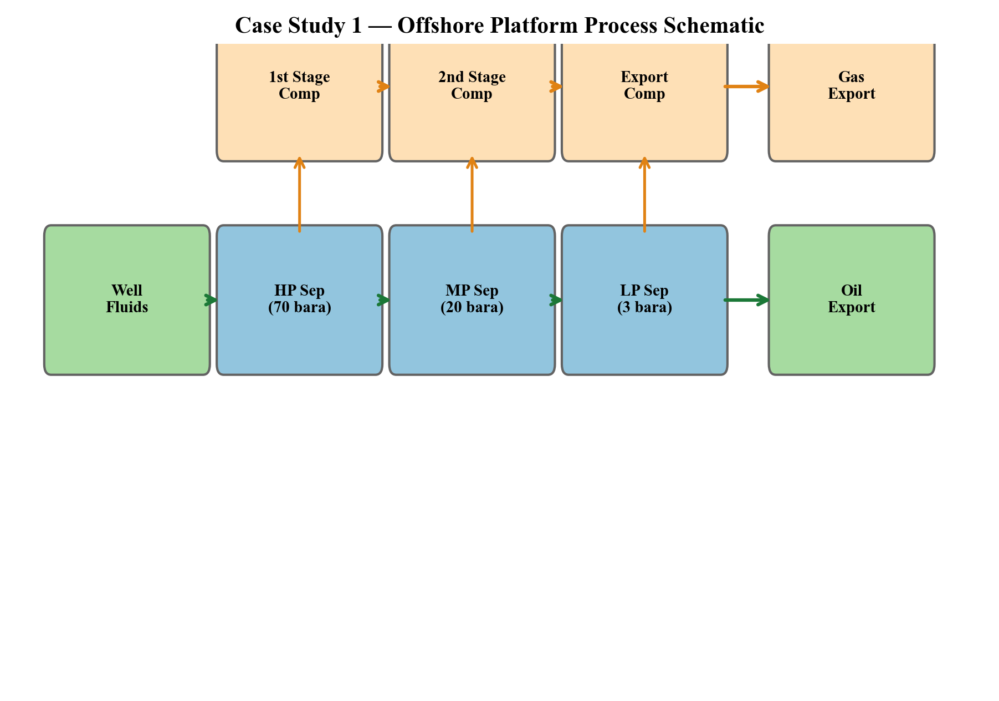
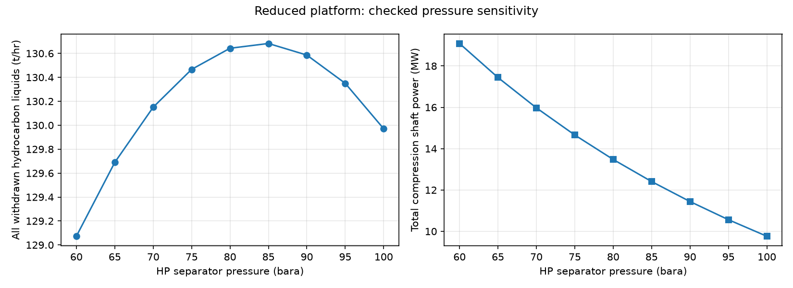
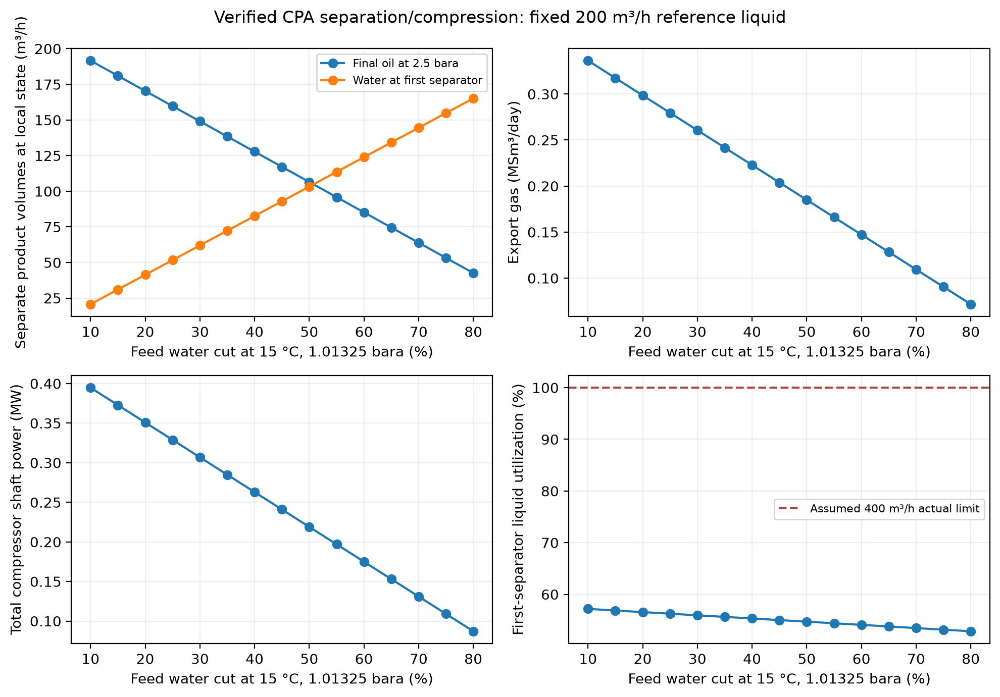
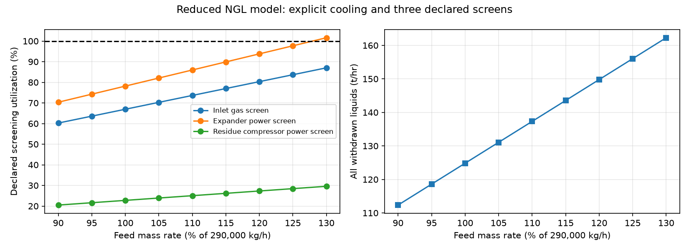
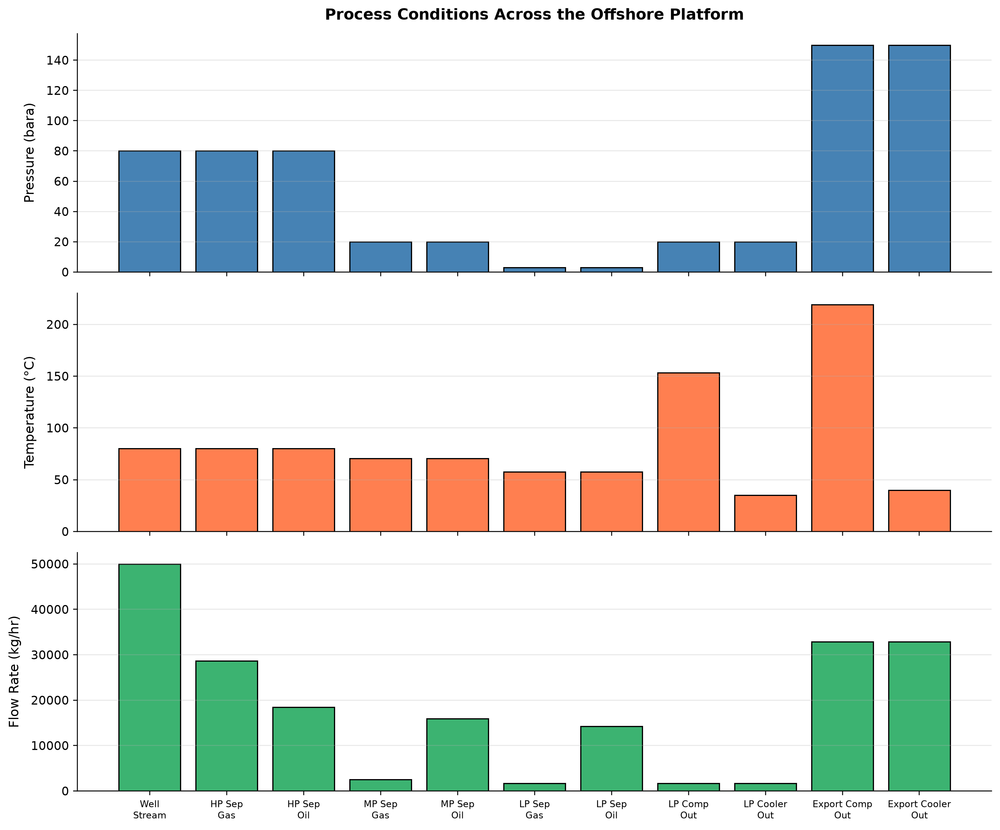
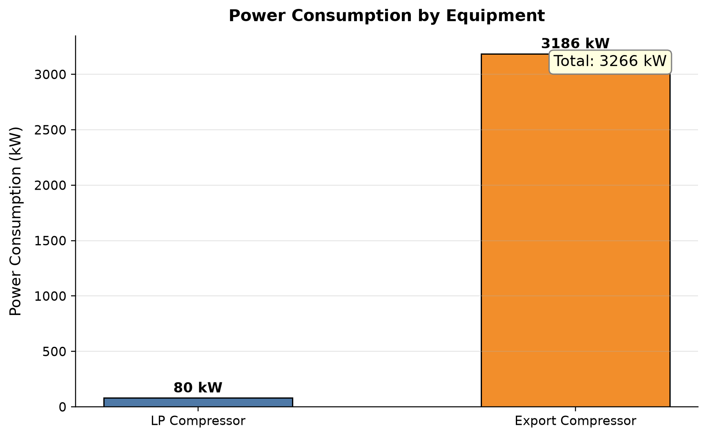

# Integrated Case Studies

<!-- Chapter metadata -->
<!-- Notebooks: ch23_case1_gas_condensate_platform.ipynb, ch23_case2_fpso_oil_production.ipynb, ch23_case3_gas_plant_debottleneck.ipynb -->
<!-- Estimated pages: 28 -->

## Learning Objectives

After reading this chapter, the reader will be able to:

1. Build and integrate complete production system models from reservoir through export, combining the techniques from Chapters 4–22 into coherent end-to-end simulations
2. Perform capacity analysis on a gas condensate platform model to identify bottleneck equipment and quantify the capacity margin for each unit operation
3. Model an illustrative FPSO separation and compression system with a defined CPA hydrocarbon/water recipe, analyze reference water-cut sensitivity, and identify the extra models needed for gas lift and water treatment
4. Conduct a systematic debottlenecking study of an onshore gas plant, checking all equipment against design capacity and proposing cost-effective solutions
5. Apply production optimization techniques — separator pressure optimization, compressor set point adjustment, and process parameter tuning — to maximize production value
6. Use NeqSim's `ProcessModel` and `ProcessAutomation` APIs to compose multi-area process models and extract results programmatically

---

## 34.1 Introduction

The preceding chapters have presented individual elements of production optimization: thermodynamic foundations, well performance, flow assurance, separation, compression, heat exchange, dehydration, NGL recovery, capacity checks, optimization theory, dynamic simulation, and digital twins. In practice, these elements are never encountered in isolation — production optimization requires an **integrated approach** that considers the entire production chain from reservoir to market.

This chapter presents three reduced, reproducible teaching calculations and their wider engineering context. The calculations use disclosed fluid recipes, imposed boundaries and assumed screening limits. They do not constitute calibrated full-field models. Each executable case must pass explicit balance and finite-state checks; omitted wells, treatment, installed maps and product qualifications remain outside acceptance.

| Case Study | System | Key Challenges | Chapters Exercised |
|-----------|--------|---------------|-------------------|
| 1 | Offshore gas condensate platform | Capacity analysis, bottleneck identification, separator pressure optimization | 4, 5, 6, 7, 9, 11, 12, 18, 19 |
| 2 | FPSO oil production | Rising water cut, gas lift optimization, produced water treatment capacity | 4, 5, 6, 9, 10, 12, 16, 18 |
| 3 | Onshore gas plant debottlenecking | Equipment capacity limits, process modifications, throughput increase | 11, 12, 14, 18, 22 |

*Table 34.1: Overview of the three case studies and the chapters they integrate.*

The approach for each case study follows the same pattern:

1. **Problem definition** — What is the system and what question are we trying to answer?
2. **Fluid characterization** — Define the reservoir fluid composition
3. **Process description** — Describe the production system configuration
4. **NeqSim model** — Build the simulation model
5. **Base case results** — Run and validate the base case
6. **Optimization/analysis** — Perform the requested analysis or optimization
7. **Conclusions** — Summarize findings and recommendations

---

## 34.2 Case Study 1 — Offshore Gas Condensate Platform

### 34.2.1 Problem Description

A gas condensate field in the North Sea produces through four subsea wells tied back to a fixed platform. The platform processes the well fluids through high-pressure (HP) and low-pressure (LP) separation, gas recompression (three stages), TEG dehydration, export compression, and pipeline export. The field has been producing for 5 years and the operator wants to:

1. Build a calibrated process model of the current production system
2. Identify the bottleneck equipment that limits platform throughput
3. Optimize separator pressures and compressor set points to maximize condensate recovery while respecting equipment capacity limits
4. Determine the maximum achievable production rate

The platform design capacity is 12 MSm$^3$/day of gas and 3000 m$^3$/day of condensate.

### 34.2.2 Reservoir Fluid Composition

The gas condensate fluid has the following composition:

| Component | Mole Fraction |
|-----------|--------------|
| Nitrogen | 0.008 |
| CO$_2$ | 0.025 |
| Methane | 0.750 |
| Ethane | 0.080 |
| Propane | 0.040 |
| i-Butane | 0.012 |
| n-Butane | 0.018 |
| i-Pentane | 0.010 |
| n-Pentane | 0.008 |
| n-Hexane | 0.012 |
| n-Heptane | 0.015 |
| n-Octane | 0.010 |
| n-Nonane | 0.007 |
| n-Decane | 0.005 |

*Table 34.2: Gas condensate reservoir fluid composition.*

The reservoir pressure is 350 bara and reservoir temperature is 130°C. The wellhead flowing pressure is 120 bara at the current production rate, and the wellhead temperature is 75°C after subsea cooling.

### 34.2.3 Process Description

The production system consists of:

- **Subsea gathering**: Four wells produce into a common manifold, then through a 12 km subsea flowline to the platform riser base
- **HP separator**: Operates at 80 bara, separating gas, condensate, and water
- **LP separator**: Operates at 15 bara, further degassing the HP condensate
- **1st stage recompressor**: Compresses LP gas from 15 to 30 bara
- **2nd stage recompressor**: Compresses from 30 to 55 bara
- **3rd stage recompressor**: Compresses from 55 to 80 bara (rejoins HP gas)
- **TEG dehydration**: Dehydrates the combined gas to pipeline spec
- **Export compressor**: Boosts gas from 80 to 180 bara for pipeline export
- **Condensate stabilizer**: Atmospheric-pressure flash to meet condensate vapor pressure specification
- **Export pipeline**: 200 km pipeline to shore at 180 bara



Process schematic for the gas condensate platform showing the main process units and stream connections.

### 34.2.4 NeqSim Model

```python
"""Literal Chapter 34 factories: explicit equilibrium knockout and energy boundary."""
import jpype
import numpy as np
import json
from pathlib import Path
jneqsim = jpype.JPackage('neqsim')
Stream = jneqsim.process.equipment.stream.Stream
Separator = jneqsim.process.equipment.separator.Separator
Compressor = jneqsim.process.equipment.compressor.Compressor
Cooler = jneqsim.process.equipment.heatexchanger.Cooler
Valve = jneqsim.process.equipment.valve.ThrottlingValve
Mixer = jneqsim.process.equipment.mixer.Mixer
Expander = jneqsim.process.equipment.expander.Expander
ProcessSystem = jneqsim.process.processmodel.ProcessSystem

platform_recipe = dict(zip(
    ['nitrogen','CO2','methane','ethane','propane','i-butane',
     'n-butane','i-pentane','n-pentane','n-hexane','n-heptane',
     'n-octane','n-nonane','n-decane'],
    [.008,.025,.750,.080,.040,.012,.018,.010,.008,.012,.015,
     .010,.007,.005]))

def process_boundary_check(feed, products, duties_W):
    """Adiabatic valves/mixers/separators; shaft work and cooler duty enter fluid."""
    f = feed.getFluid()
    mass_in = float(feed.getFlowRate('kg/hr'))
    mass_out = sum(float(s.getFlowRate('kg/hr')) for s in products)
    mass_error = abs(mass_out-mass_in)/mass_in
    h_in = float(f.getEnthalpy())
    h_out = sum(float(s.getFluid().getEnthalpy()) for s in products)
    energy_error = abs(h_out-h_in-sum(duties_W))/max(
        abs(h_in), abs(h_out), sum(abs(v) for v in duties_W), 1.0)
    component_error = 0.0
    n_scale = float(f.getTotalNumberOfMoles())
    for i in range(f.getNumberOfComponents()):
        name = str(f.getComponent(i).getComponentName())
        ni = float(f.getComponent(name).getNumberOfmoles())
        no = sum(float(s.getFluid().getComponent(name).getNumberOfmoles())
                 for s in products)
        component_error = max(component_error, abs(no-ni)/n_scale)
    assert mass_error < 1e-7, mass_error
    assert component_error < 1e-7, component_error
    assert energy_error < 1e-5, energy_error
    assert all(np.isfinite(s.getFlowRate('kg/hr')) and
               s.getFlowRate('kg/hr') >= 0 and
               s.getPressure('bara') > 0 and s.getTemperature('K') > 0
               for s in products)
    return dict(mass_relative=mass_error, component_relative=component_error,
                energy_relative=energy_error)

def build_platform_case(hp_bara=80.0, rate_kghr=500000.0):
    """Reduced topsides with ideal equilibrium knockout before each compressor."""
    fluid = jneqsim.thermo.system.SystemSrkEos(348.15, 120.0)
    for name, fraction in platform_recipe.items():
        fluid.addComponent(name, fraction)
    fluid.setMixingRule('classic')
    ps = ProcessSystem(); liquids=[]; compressors=[]; coolers=[]
    def run_add(unit):
        ps.add(unit); unit.run(); return unit
    feed = Stream('Platform Feed', fluid)
    feed.setFlowRate(rate_kghr,'kg/hr'); run_add(feed)
    choke = Valve('HP Choke', feed)
    choke.setOutletPressure(hp_bara); run_add(choke)
    hp = run_add(Separator('HP Separator',choke.getOutletStream()))
    valve = Valve('HP-LP Valve',hp.getLiquidOutStream())
    valve.setOutletPressure(15.0);run_add(valve)
    lp=run_add(Separator('LP Separator',valve.getOutletStream()))
    liquids.append(lp.getLiquidOutStream())
    gas=lp.getGasOutStream()
    for i,pout in enumerate([30.0,55.0,hp_bara],1):
        cooler=Cooler('Recompression Cooler '+str(i),gas)
        cooler.setOutTemperature(308.15);run_add(cooler);coolers.append(cooler)
        knockout=run_add(Separator('Recompression KO '+str(i),cooler.getOutletStream()))
        liquids.append(knockout.getLiquidOutStream())
        comp=Compressor('Recomp Stage '+str(i),knockout.getGasOutStream())
        comp.setUsePolytropicCalc(True);comp.setPolytropicEfficiency(.75)
        comp.setOutletPressure(pout,'bara');run_add(comp);compressors.append(comp)
        gas=comp.getOutletStream()
    mixer=Mixer('Combined HP Gas');mixer.addStream(hp.getGasOutStream())
    mixer.addStream(gas);run_add(mixer)
    cooler=Cooler('Export Suction Cooler',mixer.getOutletStream())
    cooler.setOutTemperature(308.15);run_add(cooler);coolers.append(cooler)
    knockout=run_add(Separator('Export Suction KO',cooler.getOutletStream()))
    liquids.append(knockout.getLiquidOutStream())
    comp=Compressor('Export Compressor',knockout.getGasOutStream())
    comp.setUsePolytropicCalc(True);comp.setPolytropicEfficiency(.78)
    comp.setOutletPressure(180.0,'bara');run_add(comp);compressors.append(comp)
    cooler=Cooler('Export Aftercooler',comp.getOutletStream())
    cooler.setOutTemperature(313.15);run_add(cooler);coolers.append(cooler)
    export_ko=run_add(Separator('Export KO',cooler.getOutletStream()))
    liquids.append(export_ko.getLiquidOutStream())
    export=export_ko.getGasOutStream();ps.run()
    checks=process_boundary_check(feed,liquids+[export],
        [float(c.getPower()) for c in compressors]+[float(c.getDuty()) for c in coolers])
    for c in compressors:
        assert c.getPower()>0
        inlet=c.getInletStream()
        assert inlet.getFluid().getNumberOfPhases()==1
        assert c.getOutletStream().getPressure('bara')>inlet.getPressure('bara')
    row=dict(hp_bara=hp_bara, feed_kghr=rate_kghr,
             lp_liquid_m3hr=float(lp.getLiquidOutStream().getFlowRate('m3/hr')),
             total_liquid_kghr=sum(float(s.getFlowRate('kg/hr')) for s in liquids),
             export_gas_MSm3day=float(export.getFlowRate('MSm3/day')),
             power_MW=sum(float(c.getPower()) for c in compressors)/1e6,
             export_power_MW=float(comp.getPower())/1e6,
             export_temperature_C=float(export.getTemperature('C')),
             checks=checks)
    return ps,row,dict(feed=feed,hp=hp,lp=lp,compressors=compressors,
                       products=liquids+[export],coolers=coolers)

platform, platform_base, platform_units=build_platform_case()
Path('ch34_platform_base.json').write_text(json.dumps(platform_base,indent=2))
print(json.dumps(platform_base,indent=2))
```

### 34.2.5 Capacity Analysis

The capacity analysis checks each piece of equipment against its design limit:

```python
# Assumed screening limits; no vendor or hydraulic qualification is implied.
screen_limits = {'export_gas_MSm3day':12.0, 'export_power_MW':25.0}
platform_utilization = {key: platform_base[key]/limit
                        for key,limit in screen_limits.items()}
assert all(np.isfinite(v) and v>=0 for v in platform_utilization.values())
print(json.dumps({'screening_utilization':platform_utilization},indent=2))
```

### 34.2.6 Separator Pressure Optimization

The HP and LP separator pressures affect condensate recovery, gas compression power, and overall plant economics:

```python
import matplotlib.pyplot as plt
Path('figures').mkdir(exist_ok=True)
platform_sweep=[]
for php in np.linspace(60.0,100.0,9):
    _,row,_=build_platform_case(float(php))
    row['screen_feasible']=all(row[k]<=v for k,v in screen_limits.items())
    platform_sweep.append(row)
assert len(platform_sweep)==9
Path('ch34_platform_sweep.json').write_text(json.dumps(platform_sweep,indent=2))
fig,axes=plt.subplots(1,2,figsize=(11,4))
axes[0].plot([r['hp_bara'] for r in platform_sweep],
             [r['total_liquid_kghr']/1000 for r in platform_sweep],'o-')
axes[0].set_ylabel('All withdrawn hydrocarbon liquids (t/hr)')
axes[1].plot([r['hp_bara'] for r in platform_sweep],
             [r['power_MW'] for r in platform_sweep],'s-')
axes[1].set_ylabel('Total compression shaft power (MW)')
for ax in axes:ax.set_xlabel('HP separator pressure (bara)');ax.grid(alpha=.3)
fig.suptitle('Reduced platform: checked pressure sensitivity')
fig.tight_layout();fig.savefig('figures/ch23_case1_hp_optimization.png',dpi=150)
plt.close(fig)
print(json.dumps(platform_sweep,indent=2))
```



Effect of HP separator pressure on condensate recovery rate and total compression power. Interpret both axes from the executed sweep; direction and optimum depend on composition, cooling and the liquid reference state.

### 34.2.7 Results and Acceptance

The literal model includes an imposed-rate feed, HP/LP equilibrium separation, cooled three-stage LP recompression, equilibrium knockout before each compressor, and export compression/aftercooling/knockout. Recompression discharge matches the selected HP pressure. It does not model four individual wells, a 12 km line, TEG treatment, a stabilizer or a 200 km export line. A throttling valve represents an imposed pressure boundary, not hydraulic prediction.

Each fresh case checks total mass and component flows to $10^{-7}$ relative and whole-boundary energy to $10^{-5}$ relative, including every knockout liquid and all shaft/cooling duties. Positive compressor work, rising discharge pressure and single-phase compressor inlet are asserted. These checks establish internal physical consistency under the SRK equilibrium assumptions.

`ch34_platform_base.json` and `ch34_platform_sweep.json` contain the executed baseline and nine pressure points. The sensitivity figure uses those actual values. Liquid withdrawn at different process pressures is aggregated by **mass**; it is not claimed to be stock-tank condensate volume. The printed 12 MSm³/day gas and 25 MW export-driver screens are assumed restrictions, with other installed-equipment evidence explicitly absent. No economic optimum, 5–8% uplift or 13 MSm³/day approved capacity is inferred from this pressure sweep.

---


## 34.3 Case Study 2 — FPSO Water-Handling Surrogate Production

### 34.3.1 Problem Description

The second teaching scenario concerns an FPSO (Floating Production, Storage, and Offloading) handling an oil-like hydrocarbon recipe and water. The reservoir is under pressure depletion with significant water influx, and the water cut has been increasing steadily. The operator needs to understand how rising water cut will affect:

1. Separator capacity and liquid handling
2. Gas compression requirements
3. Oil export rate and quality
4. Produced water treatment system capacity
5. Gas lift requirements for the wells

The objective is to build a model that predicts system performance as water cut increases from 30% (current) to 80% (late life).

### 34.3.2 Reservoir Fluid Composition

The disclosed hydrocarbon recipe below is a simplified surrogate. Its stock-tank density and GOR must be calculated; the recipe is not a characterized 22°API heavy oil and contains no measured heavy-end fraction:

| Component | Mole Fraction |
|-----------|--------------|
| Nitrogen | 0.003 |
| CO$_2$ | 0.008 |
| Methane | 0.280 |
| Ethane | 0.045 |
| Propane | 0.035 |
| i-Butane | 0.012 |
| n-Butane | 0.020 |
| i-Pentane | 0.015 |
| n-Pentane | 0.012 |
| n-Hexane | 0.025 |
| n-Heptane | 0.045 |
| n-Octane | 0.060 |
| n-Nonane | 0.080 |
| n-Decane | 0.360 |

*Table 34.3: Illustrative hydrocarbon recipe (mole fractions); not a calibrated heavy-oil assay.*

### 34.3.3 FPSO Process Description

The FPSO processes well fluids through:

- **Subsea manifold**: Collects production from 8 wells with individual gas lift
- **Flowline and riser**: 5 km flowline, production riser to FPSO turret
- **1st stage separator**: 35 bara, three-phase separation
- **2nd stage separator**: 8 bara, further degassing
- **3rd stage separator**: 2.5 bara, final flash (crude stabilization)
- **Gas compression**: 3-stage compression of LP gas to HP gas system
- **Produced water treatment**: Hydrocyclones and flotation (150 ppm specification)
- **Gas lift**: Compressed gas exported to subsea for gas lift (3 MSm$^3$/day)
- **Oil export**: Shuttle tanker offloading

### 34.3.4 NeqSim Model

```python
import jpype
import json
import math
import numpy as np
import matplotlib.pyplot as plt
from scipy.optimize import brentq

jneqsim = jpype.JPackage("neqsim")
Stream = jneqsim.process.equipment.stream.Stream
ThreePhaseSeparator = jneqsim.process.equipment.separator.ThreePhaseSeparator
Compressor = jneqsim.process.equipment.compressor.Compressor
Valve = jneqsim.process.equipment.valve.ThrottlingValve
Mixer = jneqsim.process.equipment.mixer.Mixer
Cooler = jneqsim.process.equipment.heatexchanger.Cooler
ProcessSystem = jneqsim.process.processmodel.ProcessSystem
ProcessModel = jneqsim.process.processmodel.ProcessModel
ThermodynamicOperations = jneqsim.thermodynamicoperations.ThermodynamicOperations

fpso_balance_checks = []
dry_recipe = {
    "nitrogen": .003, "CO2": .008, "methane": .280, "ethane": .045,
    "propane": .035, "i-butane": .012, "n-butane": .020,
    "i-pentane": .015, "n-pentane": .012, "n-hexane": .025,
    "n-heptane": .045, "n-octane": .060, "n-nonane": .080,
    "n-decane": .360,
}
assert abs(sum(dry_recipe.values()) - 1.0) < 1e-12

def reference_fluid(water_moles):
    fluid = jneqsim.thermo.system.SystemSrkCPAstatoil(288.15, 1.01325)
    for name, fraction in dry_recipe.items():
        fluid.addComponent(name, fraction)
    fluid.addComponent("water", float(water_moles))
    fluid.setMixingRule(10)
    fluid.setMultiPhaseCheck(True)
    ThermodynamicOperations(fluid).TPflash()
    fluid.initProperties()
    return fluid

def reference_liquid_volumes(fluid):
    oil = fluid.getPhase("oil").getVolume("m3") if fluid.hasPhaseType("oil") else 0.0
    water = fluid.getPhase("aqueous").getVolume("m3") if fluid.hasPhaseType("aqueous") else 0.0
    assert oil > 0 and water >= 0
    return float(oil), float(water)

def fpso_balance(name, inlets, outlets, heat_and_work_W=0.0):
    def mass(stream):
        return float(stream.getFlowRate("kg/sec"))
    def enthalpy(stream):
        return float(stream.getFluid().getEnthalpy()) if mass(stream) > 1e-12 else 0.0
    mi, mo = sum(map(mass, inlets)), sum(map(mass, outlets))
    hi, ho = sum(map(enthalpy, inlets)), sum(map(enthalpy, outlets))
    mass_error = abs(mo-mi)/max(mi, 1e-8)
    names = list(dry_recipe) + ["water"]
    molar_scale = max(sum(s.getFluid().getTotalNumberOfMoles() for s in inlets), 1.0)
    errors = []
    for component in names:
        ni = sum(s.getFluid().getComponent(component).getNumberOfmoles() for s in inlets)
        no = sum(s.getFluid().getComponent(component).getNumberOfmoles() for s in outlets)
        errors.append(abs(ni-no)/molar_scale)
    energy_error = abs(ho-hi-heat_and_work_W)/max(abs(hi), abs(ho), abs(heat_and_work_W), 1.0)
    assert all(math.isfinite(x) for x in [mi, mo, hi, ho, energy_error])
    assert mass_error < 1e-6, (name, "mass", mass_error)
    assert max(errors) < 1e-7, (name, "component", max(errors))
    assert energy_error < 1e-5, (name, "energy", energy_error)
    for stream in outlets:
        if mass(stream) > 1e-10:
            fluid = stream.getFluid()
            fluid.initProperties()
            assert fluid.getTemperature() > 0 and fluid.getPressure() > 0
            assert fluid.getDensity("kg/m3") > 0
    fpso_balance_checks.append(dict(name=name, mass_relative=mass_error,
                                    component_relative=max(errors), energy_relative=energy_error))

def build_fpso_model(water_cut_fraction):
    """Reduced separator/compressor model; WC is equilibrium liquid volume at 15 C, 1.01325 bara."""
    wc = float(water_cut_fraction)
    assert .10 <= wc <= .80
    def error(water_moles):
        oil, water = reference_liquid_volumes(reference_fluid(water_moles))
        return water/(oil+water)-wc
    water_moles = brentq(error, 1e-7, 1000., xtol=1e-10)
    fluid = reference_fluid(water_moles)
    vo, vw = reference_liquid_volumes(fluid)
    calculated_wc = vw/(vo+vw)
    assert abs(calculated_wc-wc) < 1e-7
    # Fixed TOTAL equilibrium liquid volume at the declared reference conditions.
    mass_in_sample = fluid.getTotalNumberOfMoles()*fluid.getMolarMass()
    flow_kg_hr = mass_in_sample*200.0/(vo+vw)
    fluid.setTotalFlowRate(flow_kg_hr, "kg/hr")
    ThermodynamicOperations(fluid).TPflash()
    fluid.initProperties()
    reference_oil, reference_water = reference_liquid_volumes(fluid)
    assert abs(3600*(reference_oil+reference_water)-200.0) < 1e-4
    assert abs(reference_water/(reference_oil+reference_water)-wc) < 1e-7
    feed = Stream("FPSO Inlet", fluid)
    feed.setTemperature(70.0, "C")
    feed.setPressure(35.0, "bara")
    sep1 = ThreePhaseSeparator("1st Stage Sep", feed)
    valve12 = Valve("Sep1-Sep2 Valve", sep1.getOilOutStream())
    valve12.setOutletPressure(8.0)
    sep2 = ThreePhaseSeparator("2nd Stage Sep", valve12.getOutletStream())
    valve23 = Valve("Sep2-Sep3 Valve", sep2.getOilOutStream())
    valve23.setOutletPressure(2.5)
    sep3 = ThreePhaseSeparator("3rd Stage Sep", valve23.getOutletStream())
    sep_system = ProcessSystem()
    for unit in [feed, sep1, valve12, sep2, valve23, sep3]:
        sep_system.add(unit)
    sep_system.run()

    comp_system = ProcessSystem()
    compressors, coolers, knockouts, mixers = [], [], [], []
    def compression_stage(index, inlet, pressure, efficiency):
        comp = Compressor(f"Compressor {index}", inlet)
        comp.setOutletPressure(pressure, "bara")
        comp.setUsePolytropicCalc(True)
        comp.setPolytropicEfficiency(efficiency)
        cooler = Cooler(f"Cooler {index}", comp.getOutletStream())
        cooler.setOutTemperature(313.15)
        knockout = ThreePhaseSeparator(f"Compressor KO {index}", cooler.getOutletStream())
        for unit in [comp, cooler, knockout]:
            comp_system.add(unit)
        compressors.append(comp); coolers.append(cooler); knockouts.append(knockout)
        return knockout.getGasOutStream()

    # LP gas is first raised to 8 bara before it joins 8 bara separator gas.
    gas8 = compression_stage(1, sep3.getGasOutStream(), 8., .72)
    mixer8 = Mixer("8 bara Gas Mixer")
    mixer8.addStream(gas8); mixer8.addStream(sep2.getGasOutStream())
    comp_system.add(mixer8); mixers.append(mixer8)
    suction8 = ThreePhaseSeparator("8 bara Suction Scrubber", mixer8.getOutletStream())
    comp_system.add(suction8); knockouts.append(suction8)
    gas20 = compression_stage(2, suction8.getGasOutStream(), 20., .74)
    gas35 = compression_stage(3, gas20, 35., .76)
    hp_mixer = Mixer("HP Gas Mixer")
    hp_mixer.addStream(gas35); hp_mixer.addStream(sep1.getGasOutStream())
    comp_system.add(hp_mixer); mixers.append(hp_mixer)
    export_ko = ThreePhaseSeparator("Export Knockout", hp_mixer.getOutletStream())
    comp_system.add(export_ko); knockouts.append(export_ko)
    comp_system.run()
    fpso = ProcessModel()
    fpso.add("Separation", sep_system); fpso.add("Compression", comp_system)
    equipment = dict(feed=feed, sep1=sep1, sep2=sep2, sep3=sep3,
        comp1=compressors[0], comp2=compressors[1], comp3=compressors[2],
        hp_mixer=hp_mixer, export_ko=export_ko, valves=[valve12,valve23],
        compressors=compressors, coolers=coolers, knockouts=knockouts, mixers=mixers,
        reference_water_cut=calculated_wc, reference_liquid_m3_hr=200.0)
    return fpso, equipment

def verify_fpso(equipment):
    e=equipment
    separators=[e['sep1'], e['sep2'], e['sep3']]+e['knockouts']
    for unit in separators:
        fpso_balance(str(unit.getName()), list(unit.getInletStreams()),
            [unit.getGasOutStream(),unit.getOilOutStream(),unit.getWaterOutStream()])
    for unit in e['valves']+e['mixers']:
        fpso_balance(str(unit.getName()),list(unit.getInletStreams()),[unit.getOutletStream()])
    for unit in e['compressors']:
        inlet=unit.getInletStream().getFluid()
        assert inlet.getNumberOfPhases()==1 and str(inlet.getPhase(0).getType())=='GAS'
        assert unit.getOutletStream().getPressure('bara')>unit.getInletStream().getPressure('bara')
        assert unit.getPower()>0
        fpso_balance(str(unit.getName()),list(unit.getInletStreams()),[unit.getOutletStream()],unit.getPower())
    for unit in e['coolers']:
        fpso_balance(str(unit.getName()),list(unit.getInletStreams()),[unit.getOutletStream()],unit.getDuty())
    # Every separated aqueous/condensate stream crosses the external boundary.
    liquids=[e['sep3'].getOilOutStream()]
    liquids += [unit.getWaterOutStream() for unit in (e['sep1'],e['sep2'],e['sep3'])]
    liquids += [stream for unit in e['knockouts'] for stream in (unit.getOilOutStream(),unit.getWaterOutStream())]
    products=liquids+[e['export_ko'].getGasOutStream()]
    duty=sum(unit.getPower() for unit in e['compressors'])+sum(unit.getDuty() for unit in e['coolers'])
    fpso_balance('whole reduced FPSO',[e['feed']],products,duty)
    sep1_liquid=e['sep1'].getOilOutStream().getFlowRate('m3/hr')+e['sep1'].getWaterOutStream().getFlowRate('m3/hr')
    return dict(water_cut_pct=100*e['reference_water_cut'],
        inlet_mass_kg_hr=e['feed'].getFlowRate('kg/hr'),
        reference_liquid_m3_hr=e['reference_liquid_m3_hr'],
        oil_rate_m3hr=e['sep3'].getOilOutStream().getFlowRate('m3/hr'),
        sep1_water_m3hr=e['sep1'].getWaterOutStream().getFlowRate('m3/hr'),
        gas_rate_MSm3d=e['export_ko'].getGasOutStream().getFlowRate('MSm3/day'),
        compression_MW=sum(unit.getPower() for unit in e['compressors'])/1e6,
        sep1_actual_liquid_m3hr=sep1_liquid,
        sep1_liquid_util_pct=100*sep1_liquid/400.,
        mass_products_kg_hr=sum(s.getFlowRate('kg/hr') for s in products))

fpso, equip = build_fpso_model(.30)
fpso.run()
fpso_base = verify_fpso(equip)
print(json.dumps(fpso_base, indent=2))
```

### 34.3.5 Water Cut Sensitivity Analysis

The key analysis examines how rising water cut affects system performance:

```python
from pathlib import Path
Path("figures").mkdir(exist_ok=True)
water_cuts = np.linspace(.10, .80, 15)
fpso_sweep = []
for water_cut in water_cuts:
    plant, equipment = build_fpso_model(float(water_cut))
    plant.run()
    fpso_sweep.append(verify_fpso(equipment))
assert len(fpso_sweep) == 15
x = [row["water_cut_pct"] for row in fpso_sweep]
fig, axes = plt.subplots(2, 2, figsize=(10, 7))
for key, label in (("oil_rate_m3hr", "Final oil at 2.5 bara"),
                   ("sep1_water_m3hr", "Water at first separator")):
    axes[0, 0].plot(x, [r[key] for r in fpso_sweep], "o-", label=label)
axes[0, 0].set_ylabel("Separate product volumes at local state (m³/h)")
axes[0, 0].legend(fontsize=8)
for ax, key, label in ((axes[0, 1], "gas_rate_MSm3d", "Export gas (MSm³/day)"),
                       (axes[1, 0], "compression_MW", "Total compressor shaft power (MW)"),
                       (axes[1, 1], "sep1_liquid_util_pct", "First-separator liquid utilization (%)")):
    ax.plot(x, [r[key] for r in fpso_sweep], "o-")
    ax.set_ylabel(label)
axes[1, 1].axhline(100, ls="--", color="#a64b3c", label="Assumed 400 m³/h actual limit")
axes[1, 1].legend(fontsize=8)
for ax in axes.flat:
    ax.set_xlabel("Feed water cut at 15 °C, 1.01325 bara (%)")
    ax.grid(alpha=.2)
fig.suptitle("Verified CPA separation/compression: fixed 200 m³/h reference liquid")
fig.tight_layout()
fig.savefig("figures/ch23_case2_water_cut_sensitivity.png", dpi=200, bbox_inches="tight")
plt.close(fig)
print(json.dumps(fpso_sweep, indent=2))
```



Effect of rising water cut on FPSO performance: (a) liquid production rates, (b) gas production, (c) compression power, and (d) 1st stage separator liquid utilization.

#### Water Cut Result Interpretation

Use the executed water-cut sweep and the stated volumetric reference conditions. Water cut is not a mole fraction or mass fraction. Compare separator liquid capacity with oil and aqueous flows **at that separator**, not with oil after downstream flashing. No gas-lift demand curve or well deliverability model is supplied by this separation/compression example.

The legacy hand-entered water-cut milestone table has been removed because it did not follow from the model and contradicted its claimed separator bottleneck. The actual sweep records the assumed 400 m³/hr screening ratio without implying that 65% water cut is a universal limit.


#### Gas Lift Allocation Optimization

When total gas lift demand exceeds available supply, optimal allocation becomes critical. The objective is to allocate limited gas lift across $n$ wells to maximize total oil production:

$$
\max_{q_{GL,i}} \sum_{i=1}^{n} Q_{o,i}(q_{GL,i}) \quad \text{subject to} \quad \sum_{i=1}^{n} q_{GL,i} \leq Q_{GL,\text{available}}
$$

where $Q_{o,i}(q_{GL,i})$ is the oil production rate of well $i$ as a function of gas lift rate $q_{GL,i}$, and $Q_{GL,\text{available}}$ is the total available gas lift.

For smooth concave well responses and a binding shared gas budget, free interior wells have equal marginal oil gain. Wells at lower/upper bounds satisfy the corresponding KKT inequalities; discrete well activation needs separate treatment:

$$
\frac{dQ_{o,1}}{dq_{GL,1}} = \frac{dQ_{o,2}}{dq_{GL,2}} = \cdots = \frac{dQ_{o,n}}{dq_{GL,n}}
$$

This can be solved using NeqSim's well models by computing the gas lift performance curve for each well and applying a gradient-based allocation algorithm:

**Execution scope:** This integration pattern requires calibrated well_models and reservoir/network boundary data. It is not a standalone validated process calculation.

```python pattern: requires calibrated well_models and reservoir/network boundary data
# Gas lift allocation optimization across 4 wells
from scipy.optimize import minimize

def total_oil_production(gl_rates, well_models):
    """Calculate negative total oil (for minimization)."""
    total = 0.0
    for i, well in enumerate(well_models):
        well.setGasLiftRate(float(gl_rates[i]), "MSm3/day")
        well.run()
        total += well.getOilProductionRate("m3/hr")
    return -total

# Initial equal allocation
n_wells = 4
gl_available = 1.0  # MSm3/day total
x0 = [gl_available / n_wells] * n_wells

# Bounds: 0.05 to 0.5 MSm3/day per well
bounds = [(0.05, 0.5)] * n_wells

# Constraint: total GL <= available
constraints = {"type": "ineq", "fun": lambda x: gl_available - sum(x)}

result = minimize(total_oil_production, x0, args=(well_models,),
                  bounds=bounds, constraints=constraints, method="SLSQP")

optimal_gl = result.x
print("Optimal gas lift allocation (MSm3/d per well):")
for i, gl in enumerate(optimal_gl):
    print(f"  Well {i+1}: {gl:.3f}")
```

Allocation follows marginal oil response and coupled constraints, not productivity-index ranking alone. The caller-dependent well-model pattern is not a computed allocation for this FPSO; Chapter 22 supplies a checked native curve-allocation example.

### 34.3.6 Engineering Interpretation

At the 30% reference water cut and fixed 200 m³/hr total reference liquid, the CPA model gives 149.069 m³/hr final oil at 2.5 bara, 61.996 m³/hr first-stage water at 35 bara/70°C, and 0.306854 MW compression. First-stage oil plus water at the same 35 bara/70°C totals 223.752 m³/hr, or 55.94% of the assumed 400 m³/hr screen. Across 10–80% reference water cut, first-stage utilization decreases from 57.18% to 52.85%; this particular boundary does not produce an increasing liquid-load bottleneck. Full mass/component/energy checks and the fifteen-case records are retained with the verification artifacts.


At fixed total standard-liquid volume, increasing water cut displaces hydrocarbon liquid; at fixed oil rate it instead increases total liquid demand. The boundary choice must therefore accompany every water-cut conclusion. The reduced model does not establish reservoir-driven gas evolution, a 150 ppm treated-water specification, gas-lift demand or PWRI economics. Assess those systems with their own calibrated models before selecting modifications.

---


## 34.4 Case Study 3 — Onshore Gas Plant Debottlenecking

### 34.4.1 Problem Description

An onshore gas processing plant was originally designed for a feed rate of 250 MMscfd. The gathering system has expanded with new wells, and the available feed rate is now 300 MMscfd — a 20% increase over original design. The plant operator needs to:

1. Build a model of the existing plant at the new feed rate
2. Check all equipment against design capacity
3. Identify the bottleneck(s) that limit throughput
4. Propose and evaluate debottlenecking solutions
5. Estimate the cost and benefit of each solution

The plant consists of: inlet separator → amine treating (MDEA) → TEG dehydration → turboexpander NGL recovery → fractionation (deethanizer and depropanizer) → residue gas compression.

### 34.4.2 Feed Gas Composition

| Component | Mole Fraction |
|-----------|--------------|
| Nitrogen | 0.004 |
| CO$_2$ | 0.030 |
| Methane | 0.800 |
| Ethane | 0.070 |
| Propane | 0.040 |
| i-Butane | 0.010 |
| n-Butane | 0.015 |
| i-Pentane | 0.008 |
| n-Pentane | 0.006 |
| n-Hexane | 0.008 |
| n-Heptane | 0.005 |
| n-Octane | 0.004 |

*Table 34.4: Feed gas composition for the onshore gas plant.*

### 34.4.3 Equipment Design Capacities

The following numbers are assumed context for a larger plant. No original vendor data sheets are supplied, and omitted units are not validated by the reduced calculation:

| Equipment | Parameter | Design Value | Unit |
|-----------|-----------|-------------|------|
| Inlet Separator | Gas capacity | 10.5 MSm$^3$/day | — |
| Inlet Separator | Liquid capacity | 100 m$^3$/hr | — |
| Amine Absorber | Gas capacity | 10.0 MSm$^3$/day | (K-factor limited) |
| Amine Absorber | Amine circulation | 150 m$^3$/hr | — |
| TEG Contactor | Gas capacity | 10.5 MSm$^3$/day | — |
| Turboexpander | Power | 4.5 MW | — |
| Turboexpander | Inlet flow | 10.0 MSm$^3$/day | — |
| Deethanizer | Vapor load | 12,000 kg/hr (top) | — |
| Depropanizer | Vapor load | 8,000 kg/hr (top) | — |
| Residue Compressor | Power | 18.0 MW | — |
| Residue Compressor | Surge flow | 7.5 MSm$^3$/day (min) | — |

*Table 34.5: Equipment design capacities for the existing gas plant.*

### 34.4.4 NeqSim Model at Increased Rate

```python
"""Reduced NGL pressure/capacity screen with explicit external refrigeration."""
def build_gas_plant(feed_rate_kghr):
    # Fresh fluid and equipment for every point.
    fluid=jneqsim.thermo.system.SystemSrkEos(303.15,70.0)
    recipe={'nitrogen':.004,'CO2':.030,'methane':.800,'ethane':.070,
            'propane':.040,'i-butane':.010,'n-butane':.015,
            'i-pentane':.008,'n-pentane':.006,'n-hexane':.008,
            'n-heptane':.005,'n-octane':.004}
    for name,fraction in recipe.items():fluid.addComponent(name,fraction)
    fluid.setMixingRule('classic')
    ps=ProcessSystem()
    def run_add(unit):ps.add(unit);unit.run();return unit
    feed=Stream('Plant Feed',fluid)
    feed.setFlowRate(feed_rate_kghr,'kg/hr');run_add(feed)
    inlet_sep=run_add(Separator('Inlet Separator',feed))
    precooler=Cooler('External Refrigeration',inlet_sep.getGasOutStream())
    precooler.setOutTemperature(243.15);run_add(precooler)
    pre_ko=run_add(Separator('Expander Inlet KO',precooler.getOutletStream()))
    expander=jneqsim.process.equipment.expander.Expander('Turboexpander',pre_ko.getGasOutStream())
    expander.setIsentropicEfficiency(.85);expander.setOutletPressure(22.0);run_add(expander)
    cold_sep=run_add(Separator('Cold Separator',expander.getOutletStream()))
    recomp=Compressor('First Residue Stage',cold_sep.getGasOutStream())
    recomp.setUsePolytropicCalc(True);recomp.setPolytropicEfficiency(.78)
    recomp.setOutletPressure(35.0,'bara');run_add(recomp)
    residue_comp=Compressor('Residue Compressor',recomp.getOutletStream())
    residue_comp.setUsePolytropicCalc(True);residue_comp.setPolytropicEfficiency(.78)
    residue_comp.setOutletPressure(70.0,'bara');run_add(residue_comp)
    ps.run()
    liquids=[inlet_sep.getLiquidOutStream(),pre_ko.getLiquidOutStream(),cold_sep.getLiquidOutStream()]
    products=liquids+[residue_comp.getOutletStream()]
    for stream in products+[feed]:stream.getFluid().initProperties()
    duties=[float(precooler.getDuty()),float(expander.getPower()),
            float(recomp.getPower()),float(residue_comp.getPower())]
    checks=process_boundary_check(feed,products,duties)
    assert expander.getPower()<0 and recomp.getPower()>0 and residue_comp.getPower()>0
    assert pre_ko.getGasOutStream().getFluid().getNumberOfPhases()==1
    assert cold_sep.getGasOutStream().getFluid().getNumberOfPhases()==1
    row=dict(feed_kghr=feed_rate_kghr,
             feed_MSm3day=float(feed.getFlowRate('MSm3/day')),
             inlet_gas_MSm3day=float(inlet_sep.getGasOutStream().getFlowRate('MSm3/day')),
             expander_MW=-float(expander.getPower())/1e6,
             residue_comp_MW=float(residue_comp.getPower())/1e6,
             first_residue_stage_MW=float(recomp.getPower())/1e6,
             refrigeration_MW=-float(precooler.getDuty())/1e6,
             liquid_kghr=sum(float(s.getFlowRate('kg/hr')) for s in liquids),
             checks=checks)
    return ps,row

# Explicit mass-throughput basis; no universal MMscfd/kg conversion is assumed.
design_rate=290000.0
plant_design,ngl_base=build_gas_plant(design_rate)
plant_new,ngl_increased=build_gas_plant(1.2*design_rate)
ngl_limits={'inlet_gas_MSm3day':10.5,'expander_MW':4.5,'residue_comp_MW':18.0}
for row in [ngl_base,ngl_increased]:
    row['screen_utilization']={k:row[k]/v for k,v in ngl_limits.items()}
    row['screen_feasible']=all(v<=1 for v in row['screen_utilization'].values())
Path('ch34_ngl_base_increased.json').write_text(json.dumps([ngl_base,ngl_increased],indent=2))
print(json.dumps([ngl_base,ngl_increased],indent=2))
```

### 34.4.5 Screening Coverage

The reduced model reports inlet gas flow, expander work and residue-compressor power against the three assumed limits used in the code. Amine, dehydration and fractionation units are not included, so no 102% amine loading or spare fractionation capacity can be inferred. Cold separation provides an NGL stream, not a fractionated product specification.


### 34.4.6 Debottlenecking Solutions

Three candidate studies for a fully specified plant are absorber internals, expander performance and driver capacity. No vendor rating, cost quotation or shutdown schedule is supplied, so the previous numerical upgrade gains and costs are not retained as evaluated results. The following arithmetic example teaches the price/energy/volume conversion and does not recommend any of these modifications.

```python
# Economic arithmetic under explicit assumptions, independent of the plant screen.
incremental_saleable_gas_MMscfd=50.0
hhv_MMBtu_per_scf=0.001025
price_USD_per_MMBtu=4.0
operating_days=330
assumed_capex_USD=2.5e6
annual_gross_USD=(incremental_saleable_gas_MMscfd*1e6*hhv_MMBtu_per_scf
                  *price_USD_per_MMBtu*operating_days)
assert abs(annual_gross_USD-67.65e6)<1e-6
print('Assumed incremental annual gross revenue (million USD):',annual_gross_USD/1e6)
print('CAPEX/gross revenue ratio (years, not net payback):',assumed_capex_USD/annual_gross_USD)
# Net project cash flow requires gas purchase/opportunity cost, OPEX, outages and tax.
```

### 34.4.7 Rate Sweep — Finding Maximum Throughput

```python
import matplotlib.pyplot as plt
Path('figures').mkdir(exist_ok=True)
ngl_sweep=[]
for multiplier in np.linspace(.9,1.3,9):
    _,row=build_gas_plant(float(multiplier*design_rate))
    row['multiplier']=float(multiplier)
    row['screen_utilization']={k:row[k]/v for k,v in ngl_limits.items()}
    row['screen_feasible']=all(v<=1 for v in row['screen_utilization'].values())
    ngl_sweep.append(row)
assert len(ngl_sweep)==9
Path('ch34_ngl_sweep.json').write_text(json.dumps(ngl_sweep,indent=2))
fig,axes=plt.subplots(1,2,figsize=(11,4))
screen_labels = {'inlet_gas_MSm3day':'Inlet gas screen',
                 'expander_MW':'Expander power screen',
                 'residue_comp_MW':'Residue compressor power screen'}
for key in ngl_limits:
    axes[0].plot([100*r['multiplier'] for r in ngl_sweep],
                 [100*r['screen_utilization'][key] for r in ngl_sweep],
                 'o-',label=screen_labels[key])
axes[0].axhline(100,color='black',linestyle='--');axes[0].legend(fontsize=8)
axes[0].set_ylabel('Declared screening utilization (%)')
axes[1].plot([100*r['multiplier'] for r in ngl_sweep],
             [r['liquid_kghr']/1000 for r in ngl_sweep],'s-')
axes[1].set_ylabel('All withdrawn liquids (t/hr)')
for ax in axes:ax.set_xlabel('Feed mass rate (% of 290,000 kg/h)');ax.grid(alpha=.3)
fig.suptitle('Reduced NGL model: explicit cooling and three declared screens')
fig.tight_layout();fig.savefig('figures/ch23_case3_debottleneck_analysis.png',dpi=150)
plt.close(fig)
print(json.dumps(ngl_sweep,indent=2))
```



The actual reduced NGL sweep reports three assumed screening ratios and all withdrawn liquid mass. A specified-temperature cooler supplies external refrigeration; no second heat-exchanger stream, amine unit, dehydration unit or fractionation column is implicitly modeled. Expander and compressor work are reported separately; they are not asserted to balance on a shared shaft.

### 34.4.8 Cost and Decision Basis

Repacking, re-wheeling and driver replacement are candidate engineering studies, not accepted modifications. Vendor hydraulic/performance evidence, material compatibility, motor/shaft restrictions, utility limits and shutdown costs are required. Equipment capacity gains cannot be added to obtain plant capacity gain.

The economic arithmetic example explicitly assumes an incremental saleable gas volume, calorific value, price and operating days. It demonstrates dimensional consistency only; feed increment is not necessarily residue-gas sales increment. No measured CAPEX, net cash flow, payback recommendation or qualified 300/325 MMscfd plant throughput is supplied.

---


## 34.5 Synthesis — Common Themes Across Case Studies

The three case studies, despite covering very different systems (offshore gas condensate platform, FPSO water-handling surrogate, onshore gas plant), share several common themes that apply broadly to production optimization:

### 34.5.1 Integrated Modeling Is Essential

No piece of equipment operates in isolation. Changing the HP separator pressure on the gas condensate platform (Case 1) affects condensate recovery, gas compression power, and export pipeline hydraulics simultaneously. Building an integrated model captures these interactions.

### 34.5.2 Bottlenecks Require Current Evidence

Pressure, composition and water fraction change equipment loads. Identify restrictions using current solved states and declared installed limits; the examples cannot diagnose omitted units. Repeat the capacity assessment after each accepted change (Chapters 20–25).


### 34.5.3 Optimization Is Multi-Objective

Production optimization rarely has a single objective. The real trade-offs are:
- **Case 1**: Condensate recovery vs compression power (revenue vs cost)
- **Case 2**: Oil production vs water handling capacity (production vs CAPEX)
- **Case 3**: NGL recovery vs throughput (product value vs capacity)

The economic objective function must balance all these factors.

### 34.5.4 Sensitivity Analysis Reveals Risk

Parametric studies — varying water cut (Case 2), separator pressure (Case 1), or feed rate (Case 3) — reveal how sensitive the system is to changing conditions. This information is critical for risk assessment and investment decisions.

---


<!-- reviewed-notebook-results:start -->
## Reproduced Calculation Results

These examples use the stated fluid recipes and operating assumptions. Curves represent NeqSim calculations unless a caption identifies an analytical illustration, assumed equipment map or synthetic data.



Pressure spans 3–150 bara across the plotted cases. Temperature spans 35–219.2 °C across the plotted cases.

The integrated NeqSim flowsheet changes pressure, temperature and phase flow through successive separators and compressors. A local unit change propagates into downstream gas handling and utilities. Reconcile all export streams and utility duties at the same operating point before comparing modifications.



The integrated case reports 80.4 kW for the low-pressure compressor and 3185.7 kW for export compression, giving 3266.1 kW total shaft power.

The bars and shares summarize calculated duties in the integrated case; cooling duty and shaft work are different utility quantities. The largest numerical duty does not necessarily identify the largest electrical consumer. Keep heat-removal demand separate from purchased electrical power in the utility balance.

Selected numerical ranges from the plotted cases:

| Quantity / series | Minimum | Maximum | Unit |
|---|---:|---:|---|
| Pressure | 3 | 150 | bara |

Ranges describe the sampled cases; they are not independent validation tolerances.
<!-- reviewed-notebook-results:end -->

## Summary

The cases demonstrate pressure sensitivity, volumetric water-cut handling and an NGL compression screen on disclosed reduced models. Balance checks and independent fresh cases support the reported calculations. Full well hydraulics, solvent treatment, fractionation quality, installed equipment ratings and economic decisions require additional evidence. The reproduced notebook case is a separate specified model and retains its own output provenance.

---


<!-- September 2026 source update -->
## How to reproduce and assess the case studies

Treat the case-study inputs as disclosed teaching assumptions unless an external dataset is explicitly identified. A reported increase is reproduced only when the same composition, rate basis, topology, limits and source revision are used. The September 2026 audit executes manuscript examples against the local source build; execution records belong with the book's verification artifacts \cite{neqsim2026update}.

For each study compare the baseline and final replay on one results table: production rates, power, discharge/arrival conditions, balances, binding restriction, signed margin, convergence and coverage. A change that increases apparent production while omitting water handling, shared power or export quality is incomplete scope, not a verified debottlenecking result.

Use the figures to ask a decision question. Where does the controlling restriction change? How much incremental production survives the power and quality checks? Which uncertain input changes the preferred alternative? Synthetic sensitivity curves illustrate mechanisms; they should not be presented as measured field performance or an independent benchmark.

---

## Exercises

**Exercise 34.1 — Platform Optimization with Gas Export Constraint.** Modify the gas condensate platform model from Case Study 1 to include a gas export pipeline capacity constraint of 11 MSm$^3$/day. Find the combination of HP separator pressure and well flow rate that maximizes total revenue (gas + condensate) subject to this constraint. Assume gas price = $250/1000 Sm$^3$ and condensate price = $500/m$^3$.

**Exercise 34.2 — FPSO Gas Lift Optimization.** Extend the FPSO model from Case Study 2 to include gas lift. The total gas available for gas lift is 2 MSm$^3$/day. Four wells produce at different water cuts (20%, 40%, 55%, 70%). Build gas lift performance curves for each well and determine the optimal gas lift allocation that maximizes total oil production.

**Exercise 34.3 — Two-Train Gas Plant.** The onshore gas plant from Case Study 3 decides to add a second processing train instead of debottlenecking. Design the second train for 100 MMscfd capacity and determine whether any existing equipment (e.g., inlet slug catcher, product storage) can be shared between the trains. Build a NeqSim model of the two-train plant.

**Exercise 34.4 — FPSO Produced Water Re-Injection.** Extend Case Study 2 to include a produced water re-injection (PWRI) system: produced water → deoiling → filtration → injection pump → injection well. Model the injection well performance as a function of injection rate and water quality. Determine the water cut at which PWRI becomes necessary to maintain production above the economic limit.

**Exercise 34.5 — Seasonal NGL Optimization.** The onshore gas plant from Case Study 3 experiences seasonal price variations: propane is 50% more expensive in winter than summer (heating demand). Create a model that optimizes the turboexpander inlet temperature and deethanizer reflux ratio for summer and winter price scenarios. How much additional revenue does seasonal optimization provide compared to fixed operating conditions?

---

## References

1. Guo, B., Lyons, W. C., and Ghalambor, A. (2007). *Petroleum Production Engineering: A Computer-Assisted Approach*. Gulf Professional Publishing.
2. Arnold, K. and Stewart, M. (2008). *Surface Production Operations*. Vols 1 and 2. 3rd ed. Gulf Professional Publishing.
3. Mokhatab, S. and Poe, W. A. (2012). *Handbook of Natural Gas Transmission and Processing*. 3rd ed. Gulf Professional Publishing.
4. Devold, H. (2013). *Oil and Gas Production Handbook: An Introduction to Oil and Gas Production, Transport, Refining and Petrochemical Industry*. ABB Oil and Gas.
5. Campbell, J. M. (2014). *Gas Conditioning and Processing*. Vols 1 and 2. 9th ed. Campbell Petroleum Series.
6. GPSA Engineering Data Book (2016). 14th edition. Gas Processors Suppliers Association.
7. Kidnay, A. J., Parrish, W. R., and McCartney, D. G. (2020). *Fundamentals of Natural Gas Processing*. 3rd ed. CRC Press.
8. NORSOK P-002 (2023, corrected 2024). *Process System Design*. Standards Norway.
9. API RP 14C (2017). *Recommended Practice for Analysis, Design, Installation, and Testing of Safety Systems for Offshore Production Facilities*. American Petroleum Institute.
10. ISO 13623 (2017). *Petroleum and Natural Gas Industries — Pipeline Transportation Systems*. International Organization for Standardization.
11. Smith, R. (2016). *Chemical Process Design and Integration*. 2nd ed. Wiley.
12. Turton, R. et al. (2018). *Analysis, Synthesis, and Design of Chemical Processes*. 5th ed. Prentice Hall.


